# Contents
- <a href="#10"> 1 Getting started </a>
- <a href="#20"> 2 Available datasets </a>
- <a href="#30"> 3 Follow your nose </a>
  - <a href="#31"> 3.1 Narrowing a query: example of population </a>
  - <a href="#32"> 3.2 Spatial units in Zurich: filter on time </a>
  - <a href="#33"> 3.3 Population over time: filter on space </a>
- <a href="#40"> 4 Values of categorical variables: example of musical instruments </a>
- <a href="#50"> 5 Combining datasets </a> 
  - <a href="#51"> 5.1 Example of births and deaths </a>
  - <a href="#52"> 5.2 Example of population density </a>
- <a href="#60"> 6 Data with overlapping categories </a>   
  - <a href="#61"> 6.1 Example of elderly people </a>
  - <a href="#62"> 6.1 Example of fertility </a>
  - <a href="#63"> 6.2 Example of green area </a>  
- <a href="#70"> 7 Map of city districts </a>
- <a href="#80"> 8 Federated queries  </a>
  - <a href="#81"> 8.1 Zurich and Basel </a>
  - <a href="#82"> 8.2 Fountain pictures from wikidata </a>  
  - <a href="#83"> 8.3 Edinburgh vs. Zurich </a>  
 - <a href="#90"> 9 Zurich data to Wikidata query to R  </a>
 	- <a href="#91"> 9.1 Forested area per person </a> 
 	- <a href="#92"> 9.2 Musical instruments </a>
 	- <a href="#93"> 9.3 Baby names </a>    
  
<a id="10" />

# 1 Getting started 
The City of Zurich provides linked open statistical data (LOSD). How can the data be analyzed? This document shows a few basic applications using the programming language SPARQL. Additional information on SPARQL and LOSD can be found here:

- SPARQL: [tutorial](https://docs.data.world/tutorials/sparql/), [slides](http://linked-data-training.zazuko.com/SPARQL/index.html#1), [video](https://youtu.be/IUyzwwwIJSk)
- LOSD: [City of Zurich linked data manual](https://github.com/statistikstadtzuerich/documentation/blob/master/Linked_Data/Manual/LOSD_Manual_of_Statistik_Stadt_Zurich.ipynb)
 
The data analyses should be executed on the following webpage, called **SPARQL endpoint** of the City of Zurich: [https://ld.stadt-zuerich.ch/sparql/](https://ld.stadt-zuerich.ch/sparql/).

<a id="20" />

# 2 Available datasets
Which datasets are available on the linked data platform by the City of Zurich? This can be assessed with the following code; copy and paste the code below to the [SPARQL endpoint](https://ld.stadt-zuerich.ch/sparql/) and run the play button in the upper right corner. This query finds items that are of class *DataSet*. Prefixes are used to improve the readability of the code.

[code link](http://yasgui.org/short/S17DpzTP7)
```SPARQL
PREFIX rdfs: <http://www.w3.org/2000/01/rdf-schema#>
PREFIX qb: <http://purl.org/linked-data/cube#>
SELECT * 
WHERE
  {GRAPH <https://linked.opendata.swiss/graph/zh/statistics> {
    ?DataSet a qb:DataSet ;
      rdfs:label ?DataSetLabel .
  }}
```

The query can be narrowed down by **dataset measure**, for example limited to **datasets with people** (i.e. the dataset measure is people and not kilograms, workplaces, or cars):

[code link](http://yasgui.org/short/S1dXCMaDX)
```SPARQL
PREFIX rdfs: <http://www.w3.org/2000/01/rdf-schema#>
PREFIX qb: <http://purl.org/linked-data/cube#>
PREFIX unit: <https://ld.stadt-zuerich.ch/statistics/unit/>
PREFIX attr: <http://purl.org/linked-data/sdmx/2009/attribute#>
SELECT * 
WHERE
  {GRAPH <https://linked.opendata.swiss/graph/zh/statistics> {
    ?DataSet a qb:DataSet ;
      rdfs:label ?DataSetLabel ;   
   attr:unitMeasure unit:personen .
  }}
```

Datasets can be listed **by topic**:

[code link](http://yasgui.org/short/S1J_0GawQ)
```SPARQL
PREFIX rdf: <http://www.w3.org/1999/02/22-rdf-syntax-ns#>
PREFIX rdfs: <http://www.w3.org/2000/01/rdf-schema#>
PREFIX skos: <http://www.w3.org/2004/02/skos/core#>
PREFIX qb: <http://purl.org/linked-data/cube#>
SELECT ?topicLabel ?datasetLabel 
WHERE 
  {GRAPH <https://linked.opendata.swiss/graph/zh/statistics> {
    ?topic a <https://ld.stadt-zuerich.ch/schema/Category> ;
      rdfs:label ?topicLabel ;
      skos:narrower* ?dataset .
    ?dataset a qb:DataSet ;
      rdfs:label ?datasetLabel .
  }} 
 ORDER BY ?topicLabel ?datasetLabel
```

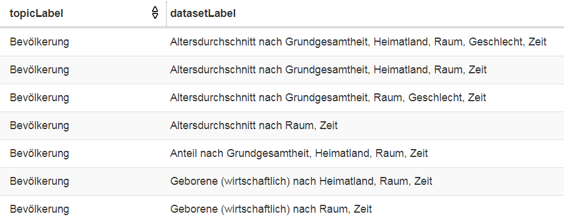

Sometimes it is helpful to search for **text patterns in dataset labels** (e.g. bev for Bevölkerung/population)

[code link](http://yasgui.org/short/B1oYAM6vm)
```SPARQL
PREFIX rdfs: <http://www.w3.org/2000/01/rdf-schema#>
PREFIX qb: <http://purl.org/linked-data/cube#>
PREFIX unit: <https://ld.stadt-zuerich.ch/statistics/unit/>
PREFIX attr: <http://purl.org/linked-data/sdmx/2009/attribute#>
SELECT * 
WHERE
  {GRAPH <https://linked.opendata.swiss/graph/zh/statistics> {
    ?DataSet a qb:DataSet ;
      rdfs:label ?DataSetLabel ;   
   attr:unitMeasure unit:personen .
    FILTER REGEX(LCASE(STR(?DataSetLabel)), "bev") .
  }}
```

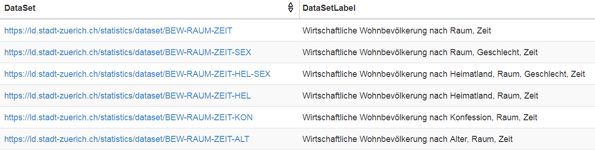

<a id="30" />

# 3 Follow your nose

<a id="31" />

## 3.1 Narrowing a query: example of population
It is more helpful to assess data at **observation** than at dataset level. If we are interested in the development of the population in City of Zurich the dataset BEW-RAUM-ZEIT contains all information needed; this dataset could be found with searching by topic or text pattern. The following code selects items of class *observation* that belong to the **dataset BEW-RAUM-ZEIT**. The output is limited to 10 elements, as the dataset has numerous elements.

[code link](http://yasgui.org/short/rkto0MpD7)
```SPARQL
PREFIX qb: <http://purl.org/linked-data/cube#>
PREFIX dataset: <https://ld.stadt-zuerich.ch/statistics/dataset/>
SELECT *
WHERE{ 
  GRAPH <https://linked.opendata.swiss/graph/zh/statistics>{
    ?obser a qb:Observation ;
      qb:dataSet dataset:BEW-RAUM-ZEIT .
  }}
LIMIT 10
```

Analysis of linked data is intuitive: look at the output of the code to develop the further steps; simply follow your nose! With the 'follow your nose' approach the query can be narrowed down. For example you can click on this output element:
[https://ld.stadt-zuerich.ch/statistics/observation/BEW/R00024/Z31122017](https://ld.stadt-zuerich.ch/statistics/observation/BEW/R00024/Z31122017). The components BEW, RAUM, ZEIT are of particular interest. By clicking on them, you see that BEW is of type **MeasureProperty**, RAUM and ZEIT are of type **DimensionProperty**.
This information is used to define variables for population, time, and space. For the variable ?space labels are needed, since the variable's values are not self-explanatory.

[code link](http://yasgui.org/short/HJC2Af6Dm)
```SPARQL
PREFIX qb: <http://purl.org/linked-data/cube#>
PREFIX rdfs: <http://www.w3.org/2000/01/rdf-schema#>
PREFIX dataset: <https://ld.stadt-zuerich.ch/statistics/dataset/>
PREFIX measure: <https://ld.stadt-zuerich.ch/statistics/measure/>
PREFIX dimension: <https://ld.stadt-zuerich.ch/statistics/property/>
SELECT *
WHERE{ 
  GRAPH <https://linked.opendata.swiss/graph/zh/statistics>{
    ?obser a qb:Observation ;
      qb:dataSet dataset:BEW-RAUM-ZEIT ;     
      measure:BEW ?population ;
      dimension:RAUM ?space ;
      dimension:ZEIT ?time . 
   ?space rdfs:label ?spaceLabel.  
  }}
LIMIT 10
```

<a id="32" />

## 3.2 Spatial units in Zurich: filter on time
To find out what spatial units are defined for Zurich, one has to **filter a particular point in time** (e.g. December 31, 2017). This provides an overview over **spatial units** available for December 31, 2017.

[code link](http://yasgui.org/short/HJt00zaPX)
```SPARQL
PREFIX qb: <http://purl.org/linked-data/cube#>
PREFIX rdfs: <http://www.w3.org/2000/01/rdf-schema#>
PREFIX dataset: <https://ld.stadt-zuerich.ch/statistics/dataset/>
PREFIX measure: <https://ld.stadt-zuerich.ch/statistics/measure/>
PREFIX dimension: <https://ld.stadt-zuerich.ch/statistics/property/>
PREFIX xsd: <http://www.w3.org/2001/XMLSchema#>
SELECT ?obser ?spaceLabel ?population
WHERE{ 
  GRAPH <https://linked.opendata.swiss/graph/zh/statistics>{
    ?obser a qb:Observation ;
      qb:dataSet dataset:BEW-RAUM-ZEIT ;     
      measure:BEW ?population ;
      dimension:RAUM ?space ;
      dimension:ZEIT ?time .
    ?space rdfs:label ?spaceLabel.
    FILTER(?time = "2017-12-31"^^xsd:date) 
  }}
ORDER BY ?space
```

<a id="33" />

## 3.3 Population over time: filter on space
If you scroll down in the output of the previous query, you can find the observation relating to the [whole City of Zurich](https://ld.stadt-zuerich.ch/statistics/observation/BEW/R30000/Z31122017). The spatial dimension of the **entire City of Zurich is R30000**. In the code below the filter is set to the entire city to assess the **population over time**. For plotting, the variable ?time is converted to a string. The plot is created with the pivot tool below the output.

[code link](http://yasgui.org/short/By7lkQ6D7)
```SPARQL
PREFIX qb: <http://purl.org/linked-data/cube#>
PREFIX rdfs: <http://www.w3.org/2000/01/rdf-schema#>
PREFIX dataset: <https://ld.stadt-zuerich.ch/statistics/dataset/>
PREFIX measure: <https://ld.stadt-zuerich.ch/statistics/measure/>
PREFIX dimension: <https://ld.stadt-zuerich.ch/statistics/property/>
PREFIX xsd: <http://www.w3.org/2001/XMLSchema#>
PREFIX code: <https://ld.stadt-zuerich.ch/statistics/code/>
SELECT ?year ?population
WHERE{ 
  GRAPH <https://linked.opendata.swiss/graph/zh/statistics>{
    ?obser a qb:Observation ;
      qb:dataSet dataset:BEW-RAUM-ZEIT ;     
      measure:BEW ?population ;
      dimension:RAUM ?space ;
      dimension:ZEIT ?time .
    ?space rdfs:label ?spaceLabel.
    FILTER(?space = code:R30000) 
    BIND (STR(?time) AS ?year)
  }}
ORDER BY ?year
```
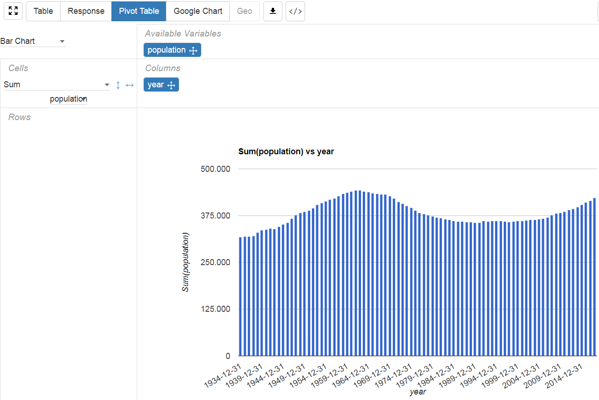

<a id="40" />

# 4 Values of categorical variables: example of musical instruments
In linked data analyis it is crucial to understand the data structure; this means that one has to know the occuring **values per variable**. This is demonstrated with an example about a music school (Musikschule Konservatorium Zürich MKZ) and the question how many students play the various musical instruments; and what trends exist over time? First, all variables of the dataset are listed; for some of them **specific values are selected**, here the music school and the space (entire City of Zurich). Second, the measures over the remaining variables are summarized; here the sum of the counts per combination of musical instrument and time is calculated.

[code link](http://yasgui.org/short/H1sZ1mTwX)
```SPARQL
PREFIX qb: <http://purl.org/linked-data/cube#>
PREFIX rdfs: <http://www.w3.org/2000/01/rdf-schema#>
PREFIX dataset: <https://ld.stadt-zuerich.ch/statistics/dataset/>
PREFIX measure: <https://ld.stadt-zuerich.ch/statistics/measure/>
PREFIX dimension: <https://ld.stadt-zuerich.ch/statistics/property/>
PREFIX code: <https://ld.stadt-zuerich.ch/statistics/code/>
SELECT ?instruLabel ?year (SUM(?students) AS ?students)
WHERE{ 
  GRAPH <https://linked.opendata.swiss/graph/zh/statistics>{
    ?obser a qb:Observation ;
      qb:dataSet dataset:SCH-RAUM-ZEIT-BTA-SST ; 
      measure:SCH ?students ;
      dimension:ZEIT ?time ; 
      dimension:BTA code:BTA7701 ; #music school            
      dimension:RAUM code:R30000; #entire city               
      dimension:SST ?instru . 
    ?instru rdfs:label ?instruLabel.
    BIND (STR(?time) AS ?year)
  }}
GROUP BY ?instruLabel ?year  
ORDER BY ?instruLabel ?year 
```
In this music school piano is the most popular instrument, followed by guitar and violin. The data can be plotted with the pivot tool again:
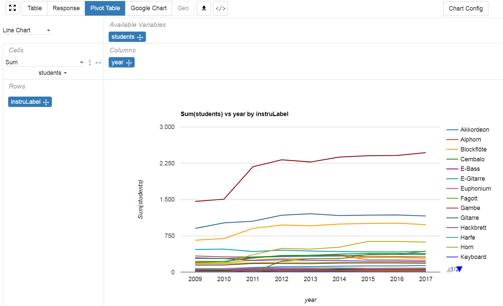

<a id="50" />

# 5 Combining datasets 

<a id="51" />

## 5.1 Example of births and deaths
Linked data analysis becomes particularly useful when different datasets are combined. In the following example births and deaths over time are combined, and natural change (births minus deaths) is calculated. Combining datasets is [different in SPARQL](http://www.cs.utexas.edu/~cannata/cs345/New%20Class%20Notes/15%20JoinsinSPARQL%20(3).pdf) compared to conventionally joining tables: the two datasets are **simply linked by additional triples**. 

[code link](http://yasgui.org/short/SkFXk7pPX)
```SPARQL
PREFIX qb: <http://purl.org/linked-data/cube#>
PREFIX dataset: <https://ld.stadt-zuerich.ch/statistics/dataset/>
PREFIX measure: <https://ld.stadt-zuerich.ch/statistics/measure/>
PREFIX dimension: <https://ld.stadt-zuerich.ch/statistics/property/>
PREFIX code: <https://ld.stadt-zuerich.ch/statistics/code/>
SELECT ?year ?birth ?death ?natChange
WHERE {
  GRAPH <https://linked.opendata.swiss/graph/zh/statistics>{
    ?obsbirth a qb:Observation ;
      qb:dataSet dataset:GEB-RAUM-ZEIT ;  
      measure:GEB ?birth ;  
      dimension:RAUM ?space ; 
      dimension:ZEIT ?time .
    ?obsdeath a qb:Observation ;
      qb:dataSet dataset:GES-RAUM-ZEIT ; 
      measure:GES ?death ;        
      dimension:RAUM ?space ; 
      dimension:ZEIT ?time .    
 FILTER (?space = code:R30000)
    BIND((?birth - ?death) AS ?natChange)
 BIND (STR(?time) AS ?year)
 }}
ORDER BY ?year
```

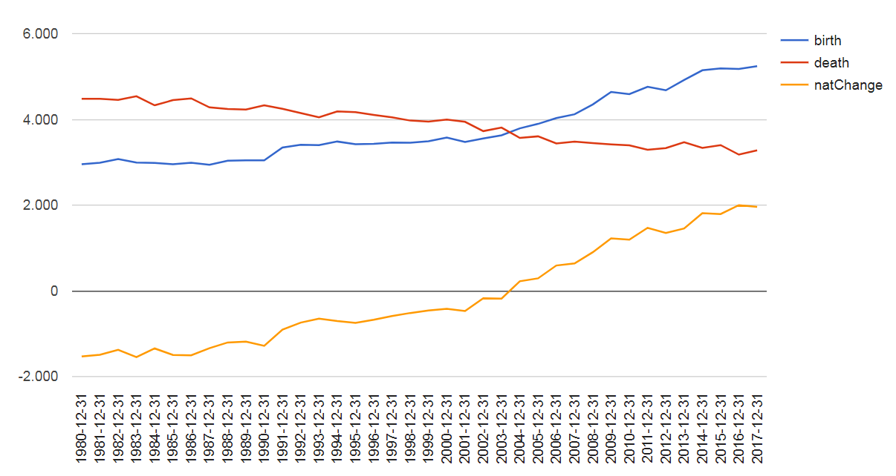

<a id="52" />

## 5.2 Example of population density
The combination of the two datasets **population** and **area** statistics allows the calculation of the **population density**. As in the birth and death example the dataset linkage is based on additional triples. Here, the population density is calculated as people per hectare; however only land without forest and waterbodies. Therefore, a land cover filter (BBA1000: land without forest, no water) should be considered when computing the density.

[code link](http://yasgui.org/short/HJfr1XTPm)
```SPARQL
PREFIX qb: <http://purl.org/linked-data/cube#>
PREFIX rdfs: <http://www.w3.org/2000/01/rdf-schema#>
PREFIX dataset: <https://ld.stadt-zuerich.ch/statistics/dataset/>
PREFIX measure: <https://ld.stadt-zuerich.ch/statistics/measure/>
PREFIX dimension: <https://ld.stadt-zuerich.ch/statistics/property/>
PREFIX xsd: <http://www.w3.org/2001/XMLSchema#>
PREFIX code: <https://ld.stadt-zuerich.ch/statistics/code/>
SELECT ?year ?population ?area ?density
WHERE{
  GRAPH <https://linked.opendata.swiss/graph/zh/statistics>{
    ?obspop a qb:Observation ;
      qb:dataSet dataset:BEW-RAUM-ZEIT ;     
      measure:BEW ?population ;
      dimension:RAUM ?space ;
      dimension:ZEIT ?time .
    ?obsarea a qb:Observation ;
      qb:dataSet dataset:STF-RAUM-ZEIT-BBA ; 
      measure:STF ?area ;
      dimension:BBA ?cover ; 
      dimension:RAUM ?space ; 
      dimension:ZEIT ?time .
    FILTER ((?space = code:R30000) && (?cover = code:BBA1000)) 
    BIND((?population/?area) AS ?density)
    BIND(STR(?time) AS ?year)
  }}
ORDER BY ?year
```

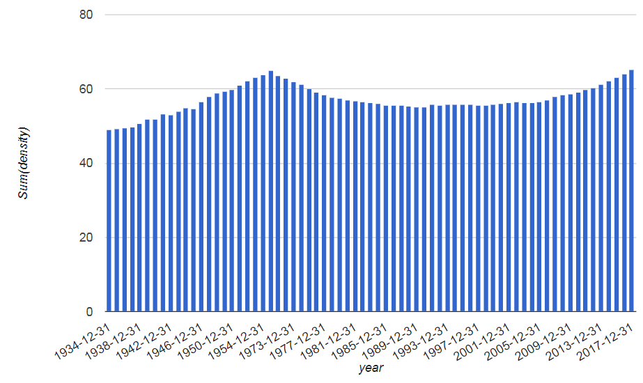

<a id="60" />

# 6 Data with overlapping categories

<a id="61" />

## 6.1 Example of elderly people
Some variables have **overlapping categories**. For example the age variable consists of ALT0517 (age 80 until 84) and ALT9080 (age 80 and elder). With the **pivot tool** the variables' values can be shown. In the code, the appropriate variable values have to be selected; for **people of age 80 or elder** ALT9080 has to be chosen. Here he proportion of people of age 80 or elder per city quarter is calculated.

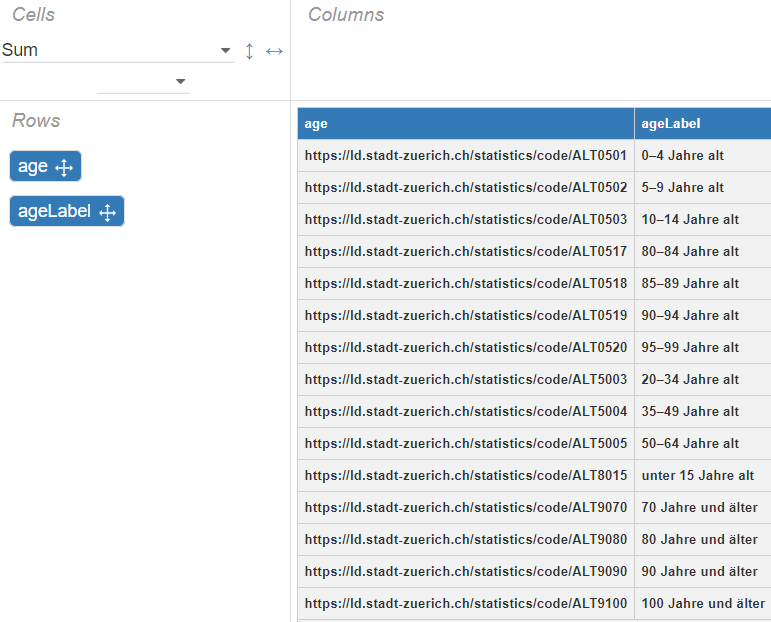

[code link](http://yasgui.org/short/rysL1QTD7)
```SPARQL
PREFIX qb: <http://purl.org/linked-data/cube#>
PREFIX rdfs: <http://www.w3.org/2000/01/rdf-schema#>
PREFIX dataset: <https://ld.stadt-zuerich.ch/statistics/dataset/>
PREFIX measure: <https://ld.stadt-zuerich.ch/statistics/measure/>
PREFIX dimension: <https://ld.stadt-zuerich.ch/statistics/property/>
PREFIX code: <https://ld.stadt-zuerich.ch/statistics/code/>
PREFIX xsd: <http://www.w3.org/2001/XMLSchema#>
SELECT ?spaceLabel ?year (SUM(?age80Plus/?population *100) AS ?age80PlusRatio)
#SELECT *
WHERE{ 
  GRAPH <https://linked.opendata.swiss/graph/zh/statistics>{   
    ?obpop a qb:Observation ;
      qb:dataSet dataset:BEW-RAUM-ZEIT ;  
      measure:BEW ?population ; 
      dimension:RAUM ?space ;
      dimension:ZEIT ?time .        
    ?obage80 a qb:Observation ;
      qb:dataSet dataset:BEW-RAUM-ZEIT-ALT ;  
      measure:BEW ?age80Plus ;
      dimension:ALT code:ALT9080 ; 
      #dimension:ALT ?age ;       
      dimension:RAUM ?space ;
      dimension:ZEIT ?time .            
   ?space rdfs:label ?spaceLabel.  
   #?age rdfs:label ?ageLabel.      
   BIND(SUBSTR(STR(?space),45,4) AS ?spacegroup)         
   FILTER (?spacegroup  IN ('R000', 'R001')) #quarters only
   FILTER(?time = "2017-12-31"^^xsd:date)    
   BIND(STR(?time) AS ?year)    
  }}
GROUP BY ?spaceLabel ?year
ORDER BY ?spaceLabel ?year
```

<a id="62" />

## 6.2 Example of fertility
How many children are born per women? The fertility rate is defined as births per thousand women (age 15 until 49) and year. Because of overlapping variable values, the age range has to be specified with the suitable variable values. 

[code link](http://yasgui.org/short/Bkm_ympvm)
```SPARQL
PREFIX qb: <http://purl.org/linked-data/cube#>
PREFIX rdfs: <http://www.w3.org/2000/01/rdf-schema#>
PREFIX dataset: <https://ld.stadt-zuerich.ch/statistics/dataset/>
PREFIX measure: <https://ld.stadt-zuerich.ch/statistics/measure/>
PREFIX dimension: <https://ld.stadt-zuerich.ch/statistics/property/>
PREFIX code: <https://ld.stadt-zuerich.ch/statistics/code/>
PREFIX xsd: <http://www.w3.org/2001/XMLSchema#>
SELECT ?year (SUM(?population) AS ?women)  (MIN(?birth) AS ?birthmin) ((?birthmin/?women*1000) AS ?fertility)
WHERE{ 
  GRAPH <https://linked.opendata.swiss/graph/zh/statistics>{   
    ?obpop a qb:Observation ;
      qb:dataSet dataset:BEW-RAUM-ZEIT-ALT-SEX ;  
      measure:BEW ?population ;
      dimension:ALT ?age ; 
      dimension:SEX code:SEX0002 ;       
      dimension:RAUM code:R30000 ;
      dimension:ZEIT ?time .
    ?obgeb a qb:Observation ;
      qb:dataSet dataset:GEB-RAUM-ZEIT ;     
      measure:GEB ?birth ;
      dimension:RAUM code:R30000 ;
      dimension:ZEIT ?time .    
    ?age rdfs:label ?ageLabel.    
    BIND(SUBSTR(STR(?age),45,7) AS ?agegroup)    
    FILTER (?agegroup  IN ('ALT0504', 'ALT0505', 'ALT0506', 'ALT0507', 'ALT0508', 'ALT0509', 'ALT0510'))
    BIND(STR(?time) AS ?year)     
  }}
GROUP BY ?year  
ORDER BY DESC(?year)
```

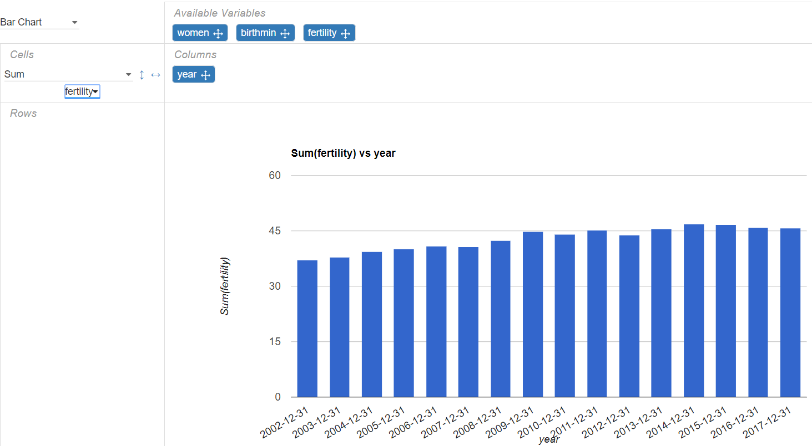

<a id="63" />

## 6.3 Example of green area
Which city quarters are green quarters with parks, meadows, graveyards, or forest? The landuse values are overlapping; that is why the values have to be selected carefully. Here, **several SELECT statements** are used to correctly calculate total and green area per city quarter.

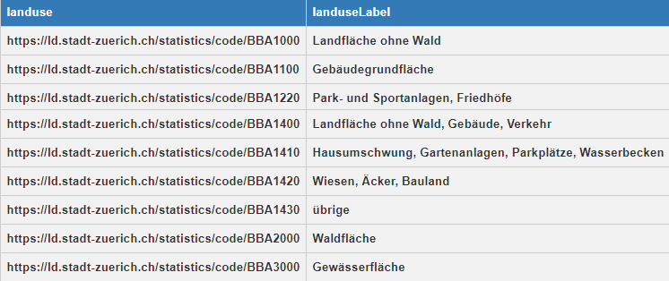

[code link](http://yasgui.org/short/S1AKyXaDX)
```SPARQL
PREFIX qb: <http://purl.org/linked-data/cube#>
PREFIX rdfs: <http://www.w3.org/2000/01/rdf-schema#>
PREFIX dataset: <https://ld.stadt-zuerich.ch/statistics/dataset/>
PREFIX measure: <https://ld.stadt-zuerich.ch/statistics/measure/>
PREFIX dimension: <https://ld.stadt-zuerich.ch/statistics/property/>
PREFIX xsd: <http://www.w3.org/2001/XMLSchema#>
PREFIX code: <https://ld.stadt-zuerich.ch/statistics/code/>

SELECT ?spaceLabel ?year (SUM(?greenarea/?totalarea * 100) AS ?greenAreaRatio)
WHERE{
  GRAPH <https://linked.opendata.swiss/graph/zh/statistics>{
    {
    SELECT ?spaceLabel ?year (SUM(?totalarea) AS ?totalarea)
    WHERE{
    ?obsarea a qb:Observation ;
      qb:dataSet dataset:STF-RAUM-ZEIT-BBA ; 
      measure:STF ?totalarea ;         
      dimension:RAUM ?space ; 
      dimension:ZEIT ?time .    
      {?obsarea a qb:Observation ;
        qb:dataSet dataset:STF-RAUM-ZEIT-BBA ; 
        dimension:BBA code:BBA1000.} #land without forest
        UNION
      {?obsarea a qb:Observation ;
        qb:dataSet dataset:STF-RAUM-ZEIT-BBA ; 
        dimension:BBA code:BBA2000.} #forest
        UNION
      {?obsarea a qb:Observation ;
        qb:dataSet dataset:STF-RAUM-ZEIT-BBA ; 
        dimension:BBA code:BBA3000.}  #waterbodies 
        
     ?space rdfs:label ?spaceLabel.            
     BIND(SUBSTR(STR(?space),45,4) AS ?spacegroup) 
     FILTER (?spacegroup  IN ('R000', 'R001')) #quarters only 
     FILTER(?time = "2017-12-31"^^xsd:date)          
     BIND(STR(?time) AS ?year)            
     }    
     GROUP BY ?spaceLabel ?year
     ORDER BY ?spaceLabel ?year     
    }
    {
    SELECT ?spaceLabel ?year (SUM(?greenarea) AS ?greenarea)
    WHERE{
    ?obsarea a qb:Observation ;
      qb:dataSet dataset:STF-RAUM-ZEIT-BBA ; 
      measure:STF ?greenarea ;         
      dimension:RAUM ?space ; 
      dimension:ZEIT ?time .    
      {?obsarea a qb:Observation ;
        qb:dataSet dataset:STF-RAUM-ZEIT-BBA ; 
        dimension:BBA code:BBA1220.} #parks, sport areas, graveyard
        UNION
      {?obsarea a qb:Observation ;
        qb:dataSet dataset:STF-RAUM-ZEIT-BBA ; 
        dimension:BBA code:BBA1420.} #meadows, fields
        UNION
      {?obsarea a qb:Observation ;
        qb:dataSet dataset:STF-RAUM-ZEIT-BBA ; 
        dimension:BBA code:BBA2000.}  #forest 
                
     ?space rdfs:label ?spaceLabel.            
     BIND(SUBSTR(STR(?space),45,4) AS ?spacegroup) 
     FILTER (?spacegroup  IN ('R000', 'R001')) #quarters only 
     FILTER(?time = "2017-12-31"^^xsd:date)          
     BIND(STR(?time) AS ?year)            
     }    
     GROUP BY ?spaceLabel ?year
     ORDER BY ?spaceLabel ?year     
    }
  }}
  GROUP BY ?spaceLabel ?year
  ORDER BY ?spaceLabel ?year  
```

<a id="70" />

# 7 Map of city districts
Perimeter geometries of administrative units of the City of Zurich (e.g. district/Stadtkreis) can be used to generate maps. By clicking on map symbols the district population is displayed.

[code link](http://yasgui.org/short/HJEhyQpDX)
```SPARQL
PREFIX rdf: <http://www.w3.org/1999/02/22-rdf-syntax-ns#>
PREFIX rdfs: <http://www.w3.org/2000/01/rdf-schema#>
PREFIX qb: <http://purl.org/linked-data/cube#>
PREFIX dataset: <https://ld.stadt-zuerich.ch/statistics/dataset/>
PREFIX measure: <https://ld.stadt-zuerich.ch/statistics/measure/>
PREFIX dimension: <https://ld.stadt-zuerich.ch/statistics/property/>
PREFIX code: <https://ld.stadt-zuerich.ch/statistics/code/>
PREFIX skos: <http://www.w3.org/2004/02/skos/core#>
PREFIX geo: <http://www.opengis.net/ont/geosparql#>
SELECT * 
WHERE {GRAPH <https://linked.opendata.swiss/graph/zh/statistics> {
  ?obs a qb:Observation ;
    qb:dataSet dataset:BEW-RAUM-ZEIT ; 
    dimension:RAUM ?space ; 
    dimension:ZEIT ?time;
    measure:BEW ?population .                                      
  ?space rdfs:label ?spaceLabel ;
    skos:broader code:Kreis ;          
    geo:hasGeometry/geo:asWKT ?shape .
  BIND(CONCAT(STR(?spaceLabel), ": ", STR(?population), " (", STR(YEAR(?time)), ")") AS ?shapeLabel)
  FILTER(?time = "2017-12-31"^^xsd:date)
  }} 
```
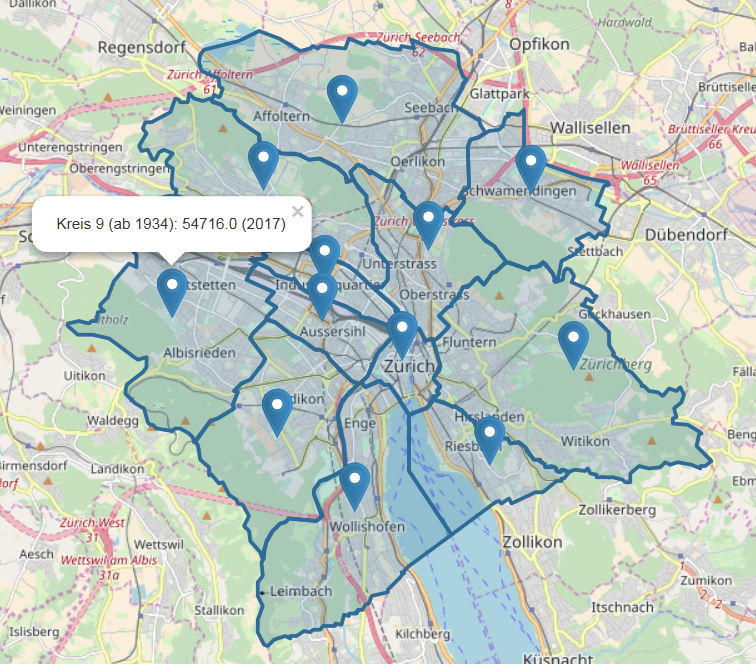

<a id="80" />

# 8 Federated queries

<a id="81" />

## 8.1 Zurich and Basel
Until now different datasets from a single SPARQL endpoint have been combined. Moreover, with **federated queries** a combination of datasets from **different SPARQL endpoints** is possible. The code below has to be executed from the Basel SPARQL endpoint ([https://ld.data-bs.ch/sparql/](https://ld.data-bs.ch/sparql/)). The Zurich datasets are embedded by the SERCIVE statement.

[code link](http://yasgui.org/short/B1bAJ7TPX)
```SPARQL
PREFIX rdf: <http://www.w3.org/1999/02/22-rdf-syntax-ns#>
PREFIX rdfs: <http://www.w3.org/2000/01/rdf-schema#>
PREFIX qb: <http://purl.org/linked-data/cube#>
PREFIX zhdataset: <https://ld.stadt-zuerich.ch/statistics/dataset/>
PREFIX zhmeasure: <https://ld.stadt-zuerich.ch/statistics/measure/>
PREFIX zhdimension: <https://ld.stadt-zuerich.ch/statistics/property/>
PREFIX zhcode: <https://ld.stadt-zuerich.ch/statistics/code/>
PREFIX bsDataset: <https://ld.data-bs.ch/dataset/>
PREFIX bsProperty: <https://ld.data-bs.ch/property/>
PREFIX skos: <http://www.w3.org/2004/02/skos/core#>
PREFIX geo: <http://www.opengis.net/ont/geosparql#>
SELECT ?shape ?shapeLabel 
WHERE {{
  SERVICE <http://ld.integ.stadt-zuerich.ch/query> {
    SELECT * 
      WHERE {GRAPH <https://linked.opendata.swiss/graph/zh/statistics> {
      ?obs a qb:Observation ;
	    qb:dataSet zhdataset:BEW-RAUM-ZEIT ;
        zhdimension:RAUM ?space ;
        zhdimension:ZEIT ?time ;
        zhmeasure:BEW ?population .
      ?space rdfs:label ?spaceLabel ;
        skos:broader zhcode:Kreis ;
        geo:hasGeometry/geo:asWKT ?shape .
	    BIND(CONCAT(STR(?spaceLabel), ": ", STR(?population), " (", STR(YEAR(?time)), ")") AS ?shapeLabel)
      FILTER(?time = "2016-12-31"^^xsd:date)
    }
  }
}} UNION {
  SELECT * 
    WHERE {GRAPH <https://linked.opendata.swiss/graph/bs/statistics> {
      ?observation qb:dataSet bsDataset:6623 ;
        bsProperty:jahr ?time ;
        bsProperty:bevolkerung ?population;
        bsProperty:raum ?space .
      ?space rdfs:label ?spaceLabel ;
        geo:hasGeometry/geo:asWKT ?shape .
      BIND(CONCAT(STR(?spaceLabel), ": ", STR(?population), " (", STR(YEAR(?time)), ")") AS ?shapeLabel)
      FILTER(?time = "2016-12-31"^^xsd:date)
    }}
}}
```

<a id="82" />

## 8.2 Fountain pictures from wikidata
With a federated query to wikidata the **fountains of Zurich with a picture** are shown on a map.

[code link](http://yasgui.org/short/rkjJgXTDQ)
```SPARQL
PREFIX rdf: <http://www.w3.org/1999/02/22-rdf-syntax-ns#>
PREFIX rdfs: <http://www.w3.org/2000/01/rdf-schema#>
PREFIX wdt: <http://www.wikidata.org/prop/direct/>
PREFIX wd: <http://www.wikidata.org/entity/>
PREFIX pq: <http://www.wikidata.org/prop/qualifier/>
PREFIX ps: <http://www.wikidata.org/prop/statement/>
PREFIX p: <http://www.wikidata.org/prop/>
SELECT ?item ?picture ?coord  ?coordLabel
WHERE {
  SERVICE <https://query.wikidata.org/bigdata/namespace/wdq/sparql> {
    SELECT ?item ?picture ?coord 
    WHERE{
      ?item p:P528 ?statement .
      ?statement pq:P972 wd:Q53629101 .
      ?item wdt:P18 ?picture ; 
        wdt:P625 ?coord .}
  } #end of wikidata service  
  BIND(CONCAT("") AS ?coordLabel)
} 
```
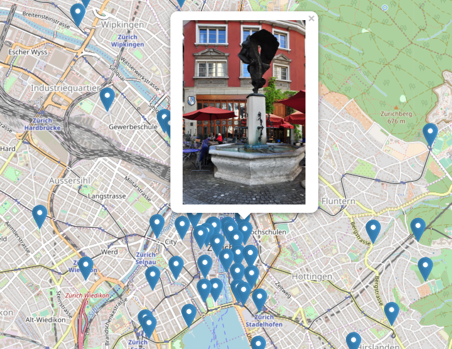

<a id="83" />

## 8.3 Edinburgh vs. Zurich
A federated query is used to compare the fertility rates of Edinburgh and Zurich. For this query, the Scottish SPARQL endpoint is used (https://statistics.gov.scot/sparql#).

```SPARQL
PREFIX dcat: <http://www.w3.org/ns/dcat#>
PREFIX dcterms: <http://purl.org/dc/terms/>
PREFIX owl: <http://www.w3.org/2002/07/owl#>
PREFIX qb: <http://purl.org/linked-data/cube#>
PREFIX rdf: <http://www.w3.org/1999/02/22-rdf-syntax-ns#>
PREFIX rdfs: <http://www.w3.org/2000/01/rdf-schema#>
PREFIX sdmx: <http://purl.org/linked-data/sdmx/2009/concept#>
PREFIX skos: <http://www.w3.org/2004/02/skos/core#>
PREFIX void: <http://rdfs.org/ns/void#>
PREFIX xsd: <http://www.w3.org/2001/XMLSchema#>
PREFIX geo: <http://www.opengis.net/ont/geosparql#>
PREFIX code: <https://ld.stadt-zuerich.ch/statistics/code/>
PREFIX dataset: <https://ld.stadt-zuerich.ch/statistics/dataset/>
PREFIX measure: <https://ld.stadt-zuerich.ch/statistics/measure/>
PREFIX dimension: <https://ld.stadt-zuerich.ch/statistics/property/>

SELECT *
WHERE{{
SELECT ?areaLabel ?yearLabel (SUM(?babies1) AS ?babies) (SUM(?women1) AS ?women) (SUM(?babies1/?women1 * 1000) AS ?fertility)

WHERE{{
SELECT ?areaLabel ?yearLabel (SUM(?countBabies) AS ?babies1)
WHERE{ 
    ?obser a qb:Observation ;
    	qb:dataSet <http://statistics.gov.scot/data/births> ;
	  <http://purl.org/linked-data/sdmx/2009/dimension#refPeriod> ?year ;
	  <http://statistics.gov.scot/def/dimension/timePeriod> <http://statistics.gov.scot/def/concept/time-period/calendar-year> ; 
	  <http://statistics.gov.scot/def/dimension/gender> <http://statistics.gov.scot/def/concept/gender/all> ; 
	  <http://purl.org/linked-data/sdmx/2009/dimension#refArea> ?area ;
	  <http://statistics.gov.scot/def/measure-properties/count> ?countBabies .
	?area <http://www.w3.org/2000/01/rdf-schema#label> ?areaLabel .  
	?year <http://www.w3.org/2000/01/rdf-schema#label> ?yearLabel .    
	FILTER(?area =  <http://statistics.gov.scot/id/statistical-geography/S12000036>) . 
  }
GROUP BY ?areaLabel ?yearLabel 
}
{
SELECT ?areaLabel ?yearLabel (SUM(?count) AS ?women1)
WHERE{ 
    ?obser a qb:Observation ;
      qb:dataSet <http://statistics.gov.scot/data/population-estimates-current-geographic-boundaries> ;
	  <http://statistics.gov.scot/def/dimension/age> ?age ;
	  <http://statistics.gov.scot/def/dimension/sex> <http://statistics.gov.scot/def/concept/sex/female> ;
	  <http://purl.org/linked-data/sdmx/2009/dimension#refPeriod> ?year ;
	  <http://purl.org/linked-data/sdmx/2009/dimension#refArea> ?area ;
	  <http://statistics.gov.scot/def/measure-properties/count> ?count .
	?area <http://www.w3.org/2000/01/rdf-schema#label> ?areaLabel .
	?year <http://www.w3.org/2000/01/rdf-schema#label> ?yearLabel .   
	FILTER(?area =  <http://statistics.gov.scot/id/statistical-geography/S12000036>) . 
	FILTER(
   	  ?age =  <http://statistics.gov.scot/def/concept/age/15-19> || 
  	  ?age =  <http://statistics.gov.scot/def/concept/age/20-24> ||
  	  ?age =  <http://statistics.gov.scot/def/concept/age/25-29> ||  
   	  ?age =  <http://statistics.gov.scot/def/concept/age/30-34> || 
          ?age =  <http://statistics.gov.scot/def/concept/age/35-39> || 
          ?age =  <http://statistics.gov.scot/def/concept/age/40-44> ||   
	  ?age =  <http://statistics.gov.scot/def/concept/age/45-49>) .  
  }
GROUP BY ?areaLabel ?yearLabel 
}}
GROUP BY ?areaLabel ?yearLabel
ORDER BY DESC (?yearLabel)
}
UNION
{
SERVICE <https://ld.stadt-zuerich.ch/query> 
	{SELECT *
        WHERE {          
SELECT ?areaLabel ?yearLabel (MIN(?birth) AS ?babies) (SUM(?population) AS ?women) ((?babies/?women*1000) AS ?fertility)
WHERE{ 
  GRAPH <https://linked.opendata.swiss/graph/zh/statistics>{   
    ?obpop a qb:Observation ;
      qb:dataSet dataset:BEW-RAUM-ZEIT-ALT-SEX ;  
      measure:BEW ?population ;
      dimension:ALT ?age ; 
      dimension:SEX code:SEX0002 ;       
      dimension:RAUM ?area ;
      dimension:ZEIT ?time .
    ?area rdfs:label ?areaLabel .    
    ?obgeb a qb:Observation ;
      qb:dataSet dataset:GEB-RAUM-ZEIT ;     
      measure:GEB ?birth ;
      dimension:RAUM ?area ;
      dimension:ZEIT ?time .    
    ?age rdfs:label ?ageLabel. 
    ?area rdfs:label ?areaLabel.    
    BIND(SUBSTR(STR(?age),45,7) AS ?agegroup)
    BIND(SUBSTR(STR(?time),1,4) AS ?yearLabel)  
    FILTER (?agegroup  IN ('ALT0504', 'ALT0505', 'ALT0506', 'ALT0507', 'ALT0508', 'ALT0509', 'ALT0510'))
    FILTER (?area = code:R30000)   
  }}

GROUP BY ?areaLabel ?yearLabel 
ORDER BY DESC (?yearLabel)
}}
}}
```


<a id="90" />

# 9 Zurich data to Wikidata query to R

<a id="91" />

## 9.1 Forested area per person
The Zurich data can be analyzed with federated queries with the **Wikidata query service** ([https://query.wikidata.org/](https://query.wikidata.org/)). Below a code is shown that calculates for each city quarter the proportion of forested area per person. 

[code link](http://tinyurl.com/y8tw9wyc)
```SPARQL
PREFIX qb: <http://purl.org/linked-data/cube#>
PREFIX rdfs: <http://www.w3.org/2000/01/rdf-schema#>
PREFIX dataset: <https://ld.stadt-zuerich.ch/statistics/dataset/>
PREFIX measure: <https://ld.stadt-zuerich.ch/statistics/measure/>
PREFIX dimension: <https://ld.stadt-zuerich.ch/statistics/property/>
PREFIX xsd: <http://www.w3.org/2001/XMLSchema#>
PREFIX code: <https://ld.stadt-zuerich.ch/statistics/code/>
PREFIX skos: <http://www.w3.org/2004/02/skos/core#>

SELECT ?spaceLabel ?forestHect ?population ?m2PerPerson
WHERE {

  SERVICE <https://ld.stadt-zuerich.ch/query> {
  SELECT * WHERE{ 

    ?obspop a qb:Observation ;
      qb:dataSet dataset:BEW-RAUM-ZEIT ;
      measure:BEW ?population ;
      dimension:RAUM ?space ;
      dimension:ZEIT ?time . 
    ?obsforest a qb:Observation ;
      qb:dataSet dataset:STF-RAUM-ZEIT-BBA ;
      measure:STF ?forestHect ; 
      dimension:BBA code:BBA2000 ;
      dimension:RAUM ?space ;
      dimension:ZEIT ?time .    
    ?space skos:broader code:Quartier ;
	  rdfs:label ?spaceLabel .  
    FILTER(?time = "2017-12-31"^^xsd:date) 
    BIND((ROUND(?forestHect * 10000 / ?population)) AS ?m2PerPerson)
  }}
  }
ORDER BY DESC(?m2PerPerson)
```

The query can also be executed from the **program R** (e.g. for further analysis or visualization). What has to be done? 
After executing the query in the Wikidata query service the 'code button' (bottom right) has to be used to copy the query to R. In R the query runs based on the SPARQL package.  

```R
#packages
    library(SPARQL)
    library(tidyverse)
    library(scales)
    library(emojifont)
    
#neutral design
    neutral <- theme_bw() + theme(panel.grid.major = element_blank(),
        panel.grid.minor = element_blank(),
        strip.background = element_rect(colour="grey85"),
        panel.border = element_rect(colour = "grey85"))
 
#SPARQL query (from wikidata)   
    endpoint <- "https://query.wikidata.org/sparql"
    query <- 'PREFIX qb: <http://purl.org/linked-data/cube#>\nPREFIX rdfs: <http://www.w3.org/2000/01/rdf-schema#>\nPREFIX dataset: <https://ld.stadt-zuerich.ch/statistics/dataset/>\nPREFIX measure: <https://ld.stadt-zuerich.ch/statistics/measure/>\nPREFIX dimension: <https://ld.stadt-zuerich.ch/statistics/property/>\nPREFIX xsd: <http://www.w3.org/2001/XMLSchema#>\nPREFIX code: <https://ld.stadt-zuerich.ch/statistics/code/>\nPREFIX skos: <http://www.w3.org/2004/02/skos/core#>\n\nSELECT ?spaceLabel ?forestHect ?population ?m2PerPerson\nWHERE {\n  SERVICE <https://ld.stadt-zuerich.ch/query> {\n  SELECT * WHERE{ \n    ?obspop a qb:Observation ;\n      qb:dataSet dataset:BEW-RAUM-ZEIT ;\n      measure:BEW ?population ;\n      dimension:RAUM ?space ;\n      dimension:ZEIT ?time . \n    ?obsforest a qb:Observation ;\n      qb:dataSet dataset:STF-RAUM-ZEIT-BBA ;\n      measure:STF ?forestHect ; \n      dimension:BBA code:BBA2000 ;\n      dimension:RAUM ?space ;\n      dimension:ZEIT ?time .    \n    ?space skos:broader code:Quartier ;\n	  rdfs:label ?spaceLabel .  \n    FILTER(?time = "2017-12-31"^^xsd:date) \n    BIND((ROUND(?forestHect * 10000 / ?population)) AS ?m2PerPerson)\n  }\n  }}\n\nORDER BY DESC(?m2PerPerson)\n\n'
    
    qd <- SPARQL(endpoint,query)
    df <- qd$results
    
#prepare plot data
    forestData <- as_tibble(df) %>% 
        mutate(space = if_else(spaceLabel == "Höngg", "Hoengg", 
                       if_else(spaceLabel == "Mühlebach", "Muehlebach", spaceLabel))) %>% 
        arrange(desc(m2PerPerson), space)
    forest <- mutate(forestData, 
        spaceFactor = parse_factor(space, forestData$space)) %>% 
        select(spaceFactor, m2PerPerson)
      
#barplot          
    pdf("E:/temp/forest_ggplot-bars.pdf", width = 6, height = 5)    
    
        ggplot() + neutral +
            geom_bar(data = forest, aes(x = spaceFactor, y = m2PerPerson), 
                fill = "#94BF69", stat = "identity", width = 0.7) +
            coord_flip() + scale_x_discrete(limits = rev(forestData$space)) + 
            scale_y_continuous(breaks = pretty_breaks()) + 
            labs (x = "", y = "m² forest per person")
                     
    dev.off()          
          
#with trees
    search_emoji('tree')    
    
    ggplot() + neutral +
        geom_bar(data = forest, aes(x = spaceFactor, y = m2PerPerson), 
            fill = "#4A807C", stat = "identity", width = 0.7) +
        coord_flip() + scale_x_discrete(limits = rev(forestData$space)) + 
        scale_y_continuous(breaks = pretty_breaks()) + 
        geom_emoji(alias = "evergreen_tree", color = "#2C3C3F", size = 5, 
            x = forest$spaceFactor, y = forest$m2PerPerson) +
        labs (x = "", y = "m² forest per person")    
    
```

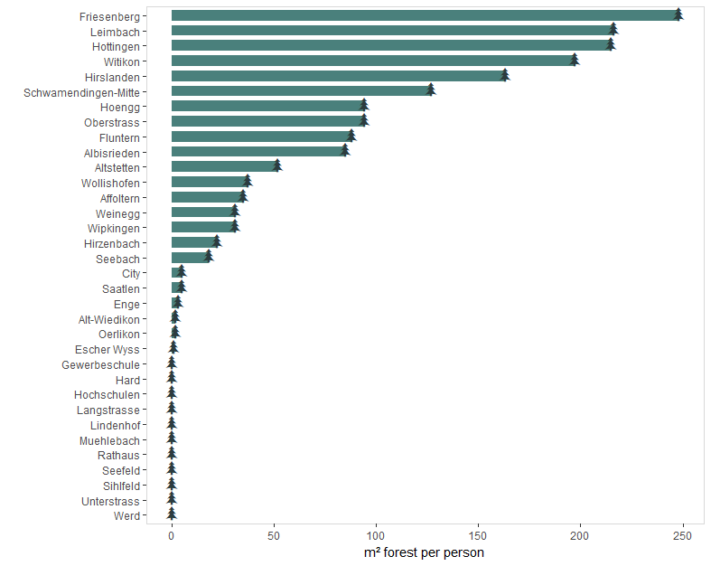

<a id="92" />

## 9.2 Musical instruments
Which are the most populare instruments at the 'Musikkonservatorium Zurich'? The previous example of the document (chapter 4) is simplified to produce a wordcloud image in R. First the instrument data are assessed with **Wikidata query service** ([https://query.wikidata.org/](https://query.wikidata.org/)). 

[code link](http://tinyurl.com/y8z5prua)

```SPARQL
PREFIX qb: <http://purl.org/linked-data/cube#>
PREFIX rdfs: <http://www.w3.org/2000/01/rdf-schema#>
PREFIX dataset: <https://ld.stadt-zuerich.ch/statistics/dataset/>
PREFIX measure: <https://ld.stadt-zuerich.ch/statistics/measure/>
PREFIX dimension: <https://ld.stadt-zuerich.ch/statistics/property/>
PREFIX code: <https://ld.stadt-zuerich.ch/statistics/code/>

SELECT ?instruLabel ?students ?instruComment
WHERE{ 

  SERVICE <https://ld.stadt-zuerich.ch/query> {
  SELECT * WHERE{ 

    ?obser a qb:Observation ;
      qb:dataSet dataset:SCH-RAUM-ZEIT-BTA-SST ; 
      measure:SCH ?students ;
      dimension:ZEIT ?time ; 
      dimension:BTA code:BTA7701 ; #music school (Musikkonservatorium Zuerich)          
      dimension:RAUM code:R30000; #entire city               
      dimension:SST ?instru . 
    ?instru rdfs:label ?instruLabel .
    ?instru rdfs:comment ?instruComment .
    FILTER(?time = "2017"^^xsd:gYear)
    FILTER(?students > 0)   
   
  }}
  }
ORDER BY DESC(?students)
```

Similarly as in the previous example (9.1 on forested area) the query is copied from Wikidata (code button at bottom right, select R) to the **program R**.   

```R
#packages
    library(SPARQL)
    library(tidyverse)
    library(ggwordcloud)

#plot design
    design <- theme_bw() + theme(panel.grid.major = element_blank(),
        panel.grid.minor = element_blank(),
        strip.background = element_rect(colour="darkblue"),
        panel.border = element_rect(colour = "darkblue"))
     
#SPARQL query (from wikidata)   
    endpoint <- "https://query.wikidata.org/sparql"
    query <- 'PREFIX qb: <http://purl.org/linked-data/cube#>\nPREFIX rdfs: <http://www.w3.org/2000/01/rdf-schema#>\nPREFIX dataset: <https://ld.stadt-zuerich.ch/statistics/dataset/>\nPREFIX measure: <https://ld.stadt-zuerich.ch/statistics/measure/>\nPREFIX dimension: <https://ld.stadt-zuerich.ch/statistics/property/>\nPREFIX code: <https://ld.stadt-zuerich.ch/statistics/code/>\n\nSELECT ?instruLabel ?students ?instruComment\nWHERE{ \n\n  SERVICE <https://ld.stadt-zuerich.ch/query> {\n  SELECT * WHERE{ \n\n    ?obser a qb:Observation ;\n      qb:dataSet dataset:SCH-RAUM-ZEIT-BTA-SST ; \n      measure:SCH ?students ;\n      dimension:ZEIT ?time ; \n      dimension:BTA code:BTA7701 ; #music school (Musikkonservatorium Zuerich)          \n      dimension:RAUM code:R30000; #entire city               \n      dimension:SST ?instru . \n    ?instru rdfs:label ?instruLabel .\n    ?instru rdfs:comment ?instruComment .\n    FILTER(?time = "2017"^^xsd:gYear)\n    FILTER(?students > 0)   \n   \n  }}\n  }\nORDER BY DESC(?students)\n'
    
    qd <- SPARQL(endpoint,query)
    df <- qd$results
        
#plot data
    instr <- as_tibble(df) %>% 
        mutate(instrument = 
            if_else(instruLabel == "Querflöte", "Querfloete", 
            if_else(instruLabel == "Blockflöte", "Blockfloete", 
            if_else(instruLabel == "Panflöte", "Panfloete", instruLabel))),
            size = students^0.6) %>% 
        select(instrument, students, size)
              
#word cloud          
    pdf("E:/temp/instruments_wordcloud.pdf", width = 6, height = 4)    
        ggplot(instr, aes(label = instrument, size = size)) + design +
            geom_text_wordcloud_area(shape = "circle", color = "gold") +
            scale_size_area(max_size = 20) +
            theme(panel.background = element_rect(fill = "darkblue"),
                plot.background = element_rect(fill = "darkblue"))
    dev.off()
```
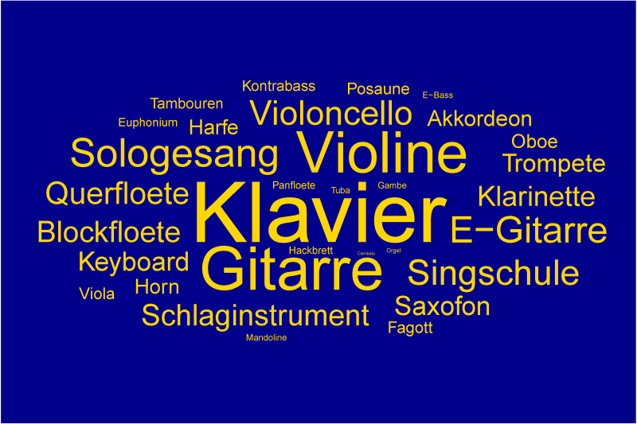

## 9.3 Baby names
How popular are traditional names such as Maria or Josef nowadays for babies living in the City of Zurich? How is the situation looking at different versions of 'Josef' such as Joseph (e.g. Englisch, French) or Guiseppe (Italian)? First, the query is run with the **Wikidata query service** ([https://query.wikidata.org/](https://query.wikidata.org/)).

[code link](http://tinyurl.com/y969w9k6)
```SPARQL
PREFIX qb: <http://purl.org/linked-data/cube#>
PREFIX rdfs: <http://www.w3.org/2000/01/rdf-schema#>
PREFIX dataset: <https://ld.stadt-zuerich.ch/statistics/dataset/>
PREFIX measure: <https://ld.stadt-zuerich.ch/statistics/measure/>
PREFIX dimension: <https://ld.stadt-zuerich.ch/statistics/property/>
PREFIX code: <https://ld.stadt-zuerich.ch/statistics/code/>

SELECT ?nameLabel ?year ?sexEN (SUM(?births) AS ?births)
WHERE 
{
  SERVICE <https://ld.stadt-zuerich.ch/query> {
    SELECT * WHERE {

    ?obser a qb:Observation ;
      qb:dataSet dataset:GEB-RAUM-ZEIT-NAF-NAM-SEX ;
	measure:GEB ?births ;
	dimension:RAUM code:R30000 ;
	#first names only (excluding middle names) 
	dimension:NAF code:NAF0001 ; 
	dimension:ZEIT ?time ;
	dimension:SEX ?sex ;
	dimension:NAM ?name .

    ?sex rdfs:label ?sexLabel.
    ?name rdfs:label ?nameLabel.

    FILTER (?nameLabel  IN ('Maria', 'Josef', 'Joseph', 'Giuseppe', 'José'))
    BIND(if(?sexLabel='weiblich','female','male') as ?sexEN)
    BIND(year(?time) AS ?year)   
    }} 
}
GROUP BY  ?nameLabel ?year ?sexEN
ORDER BY ?nameLabel ?year ?sexEN
```

Similarly as in the previous examples (9.1 and 9.2) the query is copied from Wikidata (code button at bottom right, select R) to the **program R**.   

```R
#packages
    library(SPARQL)
    library(tidyverse)
    library(scales)
    
#colors
    colorSSZ <- c("#CC6788", "#5182B3", "#60BF97", "#94BF69")
    
#neutral design
    neutral <- theme_bw() + theme(panel.grid.major = element_blank(),
        panel.grid.minor = element_blank(),
        strip.background = element_rect(colour="grey85"),
        panel.border = element_rect(colour = "grey85"))

#SPARQL query (from wikidata)   
    endpoint <- "https://query.wikidata.org/sparql"
    query <- 'PREFIX qb: <http://purl.org/linked-data/cube#>\nPREFIX rdfs: <http://www.w3.org/2000/01/rdf-schema#>\nPREFIX dataset: <https://ld.stadt-zuerich.ch/statistics/dataset/>\nPREFIX measure: <https://ld.stadt-zuerich.ch/statistics/measure/>\nPREFIX dimension: <https://ld.stadt-zuerich.ch/statistics/property/>\nPREFIX code: <https://ld.stadt-zuerich.ch/statistics/code/>\n\nSELECT ?nameLabel ?year ?sexEN (SUM(?births) AS ?births)\nWHERE \n{\n  SERVICE <https://ld.stadt-zuerich.ch/query> {\n    SELECT * WHERE {\n\n    ?obser a qb:Observation ;\n      qb:dataSet dataset:GEB-RAUM-ZEIT-NAF-NAM-SEX ;\n	measure:GEB ?births ;\n	dimension:RAUM code:R30000 ;\n	#first names only (excluding middle names) \n	dimension:NAF code:NAF0001 ; \n	dimension:ZEIT ?time ;\n	dimension:SEX ?sex ;\n	dimension:NAM ?name .\n\n    ?sex rdfs:label ?sexLabel.\n    ?name rdfs:label ?nameLabel.\n\n    FILTER (?nameLabel  IN (\'Maria\', \'Josef\', \'Joseph\', \'Giuseppe\'))\n    BIND(if(?sexLabel=\'weiblich\',\'female\',\'male\') as ?sexEN)\n    BIND(year(?time) AS ?year)   \n    }} \n}\nGROUP BY  ?nameLabel ?year ?sexEN\nORDER BY ?nameLabel ?year ?sexEN\n\n'
    
    qd <- SPARQL(endpoint,query)
    df <- qd$results
    
#data for plots
    names <- as_tibble(df) %>% 
        mutate(yearInt = parse_number(year),
          sex = parse_factor(sexEN, c("female", "male")),
          name = parse_factor(nameLabel, c("Maria", "Josef", "Joseph", "Giuseppe"))) %>% 
        filter(!((name == 'Maria') & (sex == 'male'))) %>% 
        select(yearInt, name, births)    
                       
#barplot          
    pdf("E:/temp/babynames.pdf", width = 8, height = 3)    
        ggplot() + neutral +
            geom_bar(data = names, aes(x = yearInt, y = births, fill = name), 
                stat = "identity", width = 0.6) +
            facet_wrap(~ name, nrow = 1) +
            scale_fill_manual(values = colorSSZ) +
            scale_x_continuous(breaks = pretty_breaks()) + 
            scale_y_continuous(breaks = pretty_breaks()) +          
            labs (x = "", y = "births per year") + 
            guides(fill = FALSE)                     
    dev.off()              
```
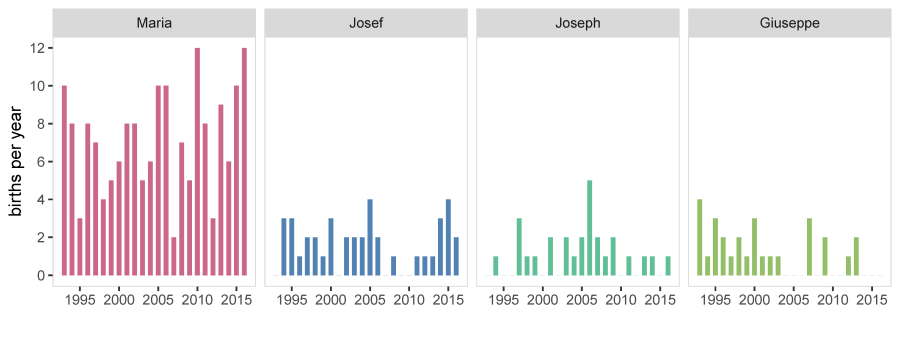
