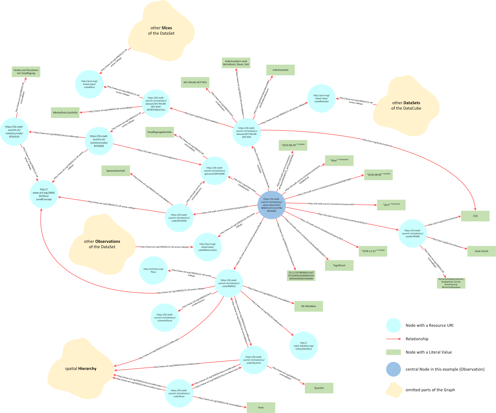
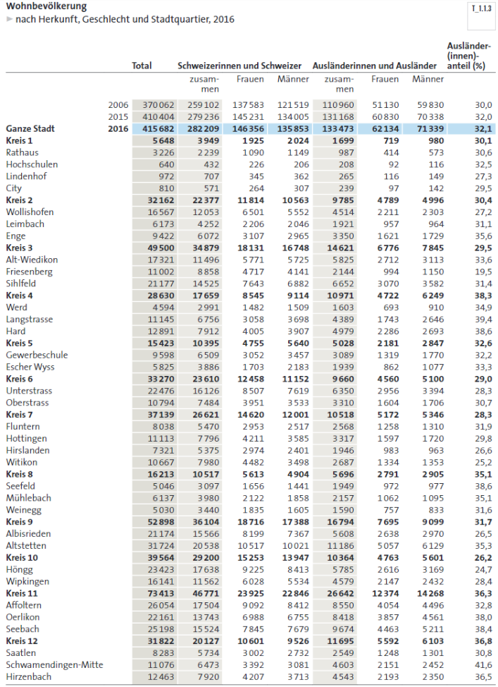
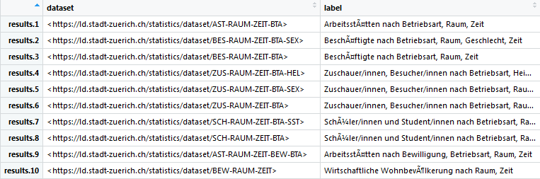
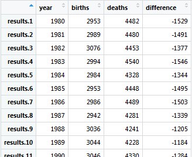
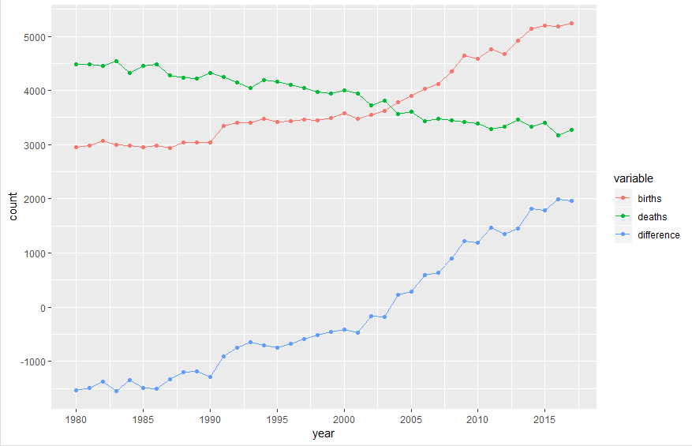

# Table of Contents
<p>
<a href="#1">1 Introduction</a><br>
<a href="#2">2 Linked Open Data</a><br>
&nbsp;&nbsp;&nbsp;&nbsp;&nbsp;<a href="#21">2&#46;1 The Semantic Web</a><br>
&nbsp;&nbsp;&nbsp;&nbsp;&nbsp;<a href="#22">2&#46;2 Open Data and Linked Data</a><br>
&nbsp;&nbsp;&nbsp;&nbsp;&nbsp;<a href="#23">2&#46;3 Graph Database vs&#46; Relational Database</a><br>
&nbsp;&nbsp;&nbsp;&nbsp;&nbsp;<a href="#24">2&#46;4 Triple Storage and Resource Description Framework</a><br>
&nbsp;&nbsp;&nbsp;&nbsp;&nbsp;<a href="#25">2&#46;5 RDF Vocabulary</a><br>
&nbsp;&nbsp;&nbsp;&nbsp;&nbsp;<a href="#26">2&#46;6 RDF Serialization</a><br>
&nbsp;&nbsp;&nbsp;&nbsp;&nbsp;<a href="#27">2&#46;7 RDF Data Cube model</a><br>
&nbsp;&nbsp;&nbsp;&nbsp;&nbsp;<a href="#28">2&#46;8 SPARQL and how to query Linked Data</a><br>
&nbsp;&nbsp;&nbsp;&nbsp;&nbsp;<a href="#29">2&#46;9 SPARQL vs&#46; SQL</a><br>
<a href="#3">3 Data Models</a><br>
&nbsp;&nbsp;&nbsp;&nbsp;&nbsp;<a href="#31">3&#46;1 The SDMX Standard</a><br>
&nbsp;&nbsp;&nbsp;&nbsp;&nbsp;<a href="#32">3&#46;2 Concepts of the Historic Data</a><br>
&nbsp;&nbsp;&nbsp;&nbsp;&nbsp;<a href="#33">3&#46;3 Concepts of the RDF Data Cube</a><br>
&nbsp;&nbsp;&nbsp;&nbsp;&nbsp;<a href="#34">3&#46;4 Other important Concepts</a><br>
<a href="#4">4 SPARQL</a><br>
&nbsp;&nbsp;&nbsp;&nbsp;&nbsp;<a href="#41">4&#46;1 SPARQL in this notebook</a><br>
&nbsp;&nbsp;&nbsp;&nbsp;&nbsp;<a href="#42">4&#46;2 Example Query&#58; all DataSets</a><br>
&nbsp;&nbsp;&nbsp;&nbsp;&nbsp;&nbsp;&nbsp;&nbsp;&nbsp;&nbsp;<a href="#421">4&#46;2&#46;1 Explanation</a><br>
&nbsp;&nbsp;&nbsp;&nbsp;&nbsp;<a href="#43">4&#46;3 Example Query&#58; the first 100 Triples</a><br>
&nbsp;&nbsp;&nbsp;&nbsp;&nbsp;&nbsp;&nbsp;&nbsp;&nbsp;&nbsp;<a href="#431">4&#46;3&#46;1 Explanation</a><br>
&nbsp;&nbsp;&nbsp;&nbsp;&nbsp;<a href="#44">4&#46;4 Example Query&#58; total number of Triples</a><br>
&nbsp;&nbsp;&nbsp;&nbsp;&nbsp;&nbsp;&nbsp;&nbsp;&nbsp;&nbsp;<a href="#441">4&#46;4&#46;1 Explanation</a><br>
&nbsp;&nbsp;&nbsp;&nbsp;&nbsp;<a href="#45">4&#46;5 Example Query&#58; number of Observations per DataSet</a><br>
&nbsp;&nbsp;&nbsp;&nbsp;&nbsp;&nbsp;&nbsp;&nbsp;&nbsp;&nbsp;<a href="#451">4&#46;5&#46;1 Explanation</a><br>
&nbsp;&nbsp;&nbsp;&nbsp;&nbsp;<a href="#46">4&#46;6 Example Query&#58; filter with regular expressions</a><br>
&nbsp;&nbsp;&nbsp;&nbsp;&nbsp;&nbsp;&nbsp;&nbsp;&nbsp;&nbsp;<a href="#461">4&#46;6&#46;1 Explanation</a><br>
&nbsp;&nbsp;&nbsp;&nbsp;&nbsp;<a href="#47">4&#46;7 Example Query&#58; Kennzahlen and measures</a><br>
&nbsp;&nbsp;&nbsp;&nbsp;&nbsp;&nbsp;&nbsp;&nbsp;&nbsp;&nbsp;<a href="#471">4&#46;7&#46;1 Explanation</a><br>
&nbsp;&nbsp;&nbsp;&nbsp;&nbsp;<a href="#48">4&#46;8 Example Query&#58; Groups and dimensions</a><br>
&nbsp;&nbsp;&nbsp;&nbsp;&nbsp;&nbsp;&nbsp;&nbsp;&nbsp;&nbsp;<a href="#481">4&#46;8&#46;1 Explanation</a><br>
&nbsp;&nbsp;&nbsp;&nbsp;&nbsp;<a href="#49">4&#46;9 Example Query&#58; DataSets of specific dimensions or topics</a><br>
&nbsp;&nbsp;&nbsp;&nbsp;&nbsp;&nbsp;&nbsp;&nbsp;&nbsp;&nbsp;<a href="#491">4&#46;9&#46;1 Explanation</a><br>
&nbsp;&nbsp;&nbsp;&nbsp;&nbsp;&nbsp;&nbsp;&nbsp;&nbsp;&nbsp;<a href="#492">4&#46;9&#46;2 Specific topics</a><br>
&nbsp;&nbsp;&nbsp;&nbsp;&nbsp;&nbsp;&nbsp;&nbsp;&nbsp;&nbsp;<a href="#493">4&#46;9&#46;3 Explanation</a><br>
&nbsp;&nbsp;&nbsp;&nbsp;&nbsp;<a href="#410">4&#46;10 Example Query&#58; Metadata and attributes</a><br>
&nbsp;&nbsp;&nbsp;&nbsp;&nbsp;&nbsp;&nbsp;&nbsp;&nbsp;&nbsp;<a href="#4101">4&#46;10&#46;1 Explanation</a><br>
&nbsp;&nbsp;&nbsp;&nbsp;&nbsp;<a href="#411">4&#46;11 Example Query&#58; Groupcodes</a><br>
&nbsp;&nbsp;&nbsp;&nbsp;&nbsp;&nbsp;&nbsp;&nbsp;&nbsp;&nbsp;<a href="#4111">4&#46;11&#46;1 Explanation</a><br>
&nbsp;&nbsp;&nbsp;&nbsp;&nbsp;<a href="#412">4&#46;12 Example Query&#58; Hierarchy of Groupcodes</a><br>
&nbsp;&nbsp;&nbsp;&nbsp;&nbsp;&nbsp;&nbsp;&nbsp;&nbsp;&nbsp;<a href="#4121">4&#46;12&#46;1 Explanation</a><br>
&nbsp;&nbsp;&nbsp;&nbsp;&nbsp;&nbsp;&nbsp;&nbsp;&nbsp;&nbsp;<a href="#4122">4&#46;12&#46;2 Hierarchy of topics</a><br>
&nbsp;&nbsp;&nbsp;&nbsp;&nbsp;&nbsp;&nbsp;&nbsp;&nbsp;&nbsp;<a href="#4123">4&#46;12&#46;3 Explanation</a><br>
&nbsp;&nbsp;&nbsp;&nbsp;&nbsp;<a href="#413">4&#46;13 Example Query&#58; spatial Hierarchies</a><br>
&nbsp;&nbsp;&nbsp;&nbsp;&nbsp;&nbsp;&nbsp;&nbsp;&nbsp;&nbsp;<a href="#4131">4&#46;13&#46;1 Explanation</a><br>
&nbsp;&nbsp;&nbsp;&nbsp;&nbsp;<a href="#414">4&#46;14 Example Query&#58; links to other Databases</a><br>
&nbsp;&nbsp;&nbsp;&nbsp;&nbsp;&nbsp;&nbsp;&nbsp;&nbsp;&nbsp;<a href="#4141">4&#46;14&#46;1 Explanation</a><br>
&nbsp;&nbsp;&nbsp;&nbsp;&nbsp;<a href="#415">4&#46;15 Example Query&#58; Slices of DataSets</a><br>
&nbsp;&nbsp;&nbsp;&nbsp;&nbsp;&nbsp;&nbsp;&nbsp;&nbsp;&nbsp;<a href="#4151">4&#46;15&#46;1 Explanation</a><br>
&nbsp;&nbsp;&nbsp;&nbsp;&nbsp;<a href="#416">4&#46;16 Example Query&#58; Shapes</a><br>
&nbsp;&nbsp;&nbsp;&nbsp;&nbsp;&nbsp;&nbsp;&nbsp;&nbsp;&nbsp;<a href="#4161">4&#46;16&#46;1 Explanation</a><br>
&nbsp;&nbsp;&nbsp;&nbsp;&nbsp;<a href="#417">4&#46;17 Example Query&#58; Metadata of Observations</a><br>
&nbsp;&nbsp;&nbsp;&nbsp;&nbsp;&nbsp;&nbsp;&nbsp;&nbsp;&nbsp;<a href="#4171">4&#46;17&#46;1 Explanation</a><br>
&nbsp;&nbsp;&nbsp;&nbsp;&nbsp;<a href="#418">4&#46;18 Example Query&#58; more Metadata of Observations</a><br>
&nbsp;&nbsp;&nbsp;&nbsp;&nbsp;&nbsp;&nbsp;&nbsp;&nbsp;&nbsp;<a href="#4181">4&#46;18&#46;1 Explanation</a><br>
&nbsp;&nbsp;&nbsp;&nbsp;&nbsp;<a href="#419">4&#46;19 Example Query&#58; relations of a DataSet</a><br>
&nbsp;&nbsp;&nbsp;&nbsp;&nbsp;&nbsp;&nbsp;&nbsp;&nbsp;&nbsp;<a href="#4191">4&#46;19&#46;1 Explanation</a><br>
&nbsp;&nbsp;&nbsp;&nbsp;&nbsp;<a href="#420">4&#46;20 Example Query&#58; relations of an Observation</a><br>
&nbsp;&nbsp;&nbsp;&nbsp;&nbsp;&nbsp;&nbsp;&nbsp;&nbsp;&nbsp;<a href="#4201">4&#46;20&#46;1 Explanation</a><br>
&nbsp;&nbsp;&nbsp;&nbsp;&nbsp;<a href="#421">4&#46;21 Example Query&#58; evolution of the plot area without forest</a><br>
&nbsp;&nbsp;&nbsp;&nbsp;&nbsp;&nbsp;&nbsp;&nbsp;&nbsp;&nbsp;<a href="#4211">4&#46;21&#46;1 Explanation</a><br>
&nbsp;&nbsp;&nbsp;&nbsp;&nbsp;<a href="#422">4&#46;22 Example Query&#58; females of swiss origin in 2016</a><br>
&nbsp;&nbsp;&nbsp;&nbsp;&nbsp;&nbsp;&nbsp;&nbsp;&nbsp;&nbsp;<a href="#4221">4&#46;22&#46;1 Explanation</a><br>
&nbsp;&nbsp;&nbsp;&nbsp;&nbsp;<a href="#423">4&#46;23 Example Query&#58; evolution of the number of unemployed over time</a><br>
&nbsp;&nbsp;&nbsp;&nbsp;&nbsp;&nbsp;&nbsp;&nbsp;&nbsp;&nbsp;<a href="#4231">4&#46;23&#46;1 Explanation</a><br>
&nbsp;&nbsp;&nbsp;&nbsp;&nbsp;<a href="#424">4&#46;24 Example Query&#58; conjunction of Kennzahlen</a><br>
&nbsp;&nbsp;&nbsp;&nbsp;&nbsp;&nbsp;&nbsp;&nbsp;&nbsp;&nbsp;<a href="#4241">4&#46;24&#46;1 Explanation</a><br>
&nbsp;&nbsp;&nbsp;&nbsp;&nbsp;<a href="#425">4&#46;25 Example Query&#58; differences in population numbers</a><br>
&nbsp;&nbsp;&nbsp;&nbsp;&nbsp;&nbsp;&nbsp;&nbsp;&nbsp;&nbsp;<a href="#4251">4&#46;25&#46;1 Explanation</a><br>
&nbsp;&nbsp;&nbsp;&nbsp;&nbsp;<a href="#426">4&#46;26 Example Query&#58; GeoSPARQL</a><br>
&nbsp;&nbsp;&nbsp;&nbsp;&nbsp;&nbsp;&nbsp;&nbsp;&nbsp;&nbsp;<a href="#4261">4&#46;26&#46;1 Explanation</a><br>
<a href="#6">6 SPARQL in R</a><br>
&nbsp;&nbsp;&nbsp;&nbsp;&nbsp;<a href="#61">6&#46;1 Plotting in R</a><br>
<a href="#7">7 SPARQL in Python</a><br>
&nbsp;&nbsp;&nbsp;&nbsp;&nbsp;<a href="#71">7&#46;1 Plotting in Python</a><br>
<a href="#8">8 SSZVIS</a><br>
<a href="#9">9 OpenSource and Repositories</a><br>
</p>

# 1 Introduction<a id="1"></a>

[Statistik Stadt Zürich](https://www.stadt-zuerich.ch/prd/de/index/statistik.html) (SSZ) is replacing its statistical yearbook with a web-based solution. The content can be accessed directly or programmatically:
* through a REST-interface
* through a SPARQL-interface

The purpose of this notebook is to give an overview of the available data and describe how interested parties are able to query it with SPARQL.

The [project page](https://data.stadt-zuerich.ch/dataset/stadt_zuerich_losd) is the home base and provides links to Github and all other resources.

# 2 Linked Open Data<a id="2"></a>

The data is provided in the form of Linked Open Statistical Data (LOSD), or more precisely, in the form of a graph database - also called triplestore - with the underlying structure being a RDF Data Cube. The data is queried by means of the [SPARQL Query Language](https://www.w3.org/TR/sparql11-query/) (or SPARQL in short). If you want to get a first impression of querying RDF Data Cubes via SPARQL, check out this [screencast](https://youtu.be/IUyzwwwIJSk).

* [This Linked Data course](http://linked-data-training.zazuko.com/) offers an introduction for users new to graph databases and triplestores (in contrast to relational databases)
* The RDF Data Cube model in particular, is introduced in section <a href="#33">3&#46;3</a>

Linked data is a topic far too big to be completely covered here. Likewise, a complete SPARQL tutorial would go far beyond the scope of this document (and was already done plenty of times). However, the most important concepts shall be mentioned and linked with their specifications or other useful sources.

## 2.1 The Semantic Web<a id="21"></a>
The Web started as a collection of documents published online, accessible at Web locations identified by a URL. These documents often contain data about real world resources which are mainly human readable and cannot be understood by machines.
<br>

The so called Semantic Web is about enabling the access to this data, by making it available in machine readable formats (JSON, Turtle, XML, etc.) and connecting it by using Uniform Resource Identifiers (URIs), thus enabling people and machines to  collect the data, and put it together to do all kinds of things with it (so far as the license permits it).

## 2.2 Open Data and Linked Data<a id="22"></a>
* The European Commission provides a nice [presentation](https://joinup.ec.europa.eu/sites/default/files/document/2015-05/d2.1.2_training_module_1.2_introduction_to_linked_data_v1.00_en.pdf) on the topic

> "Open means anyone can freely access, use, modify, and share for any purpose (subject, at most, to requirements that preserve provenance and openness)."
[OpenDefinition.org](https://opendefinition.org/od/2.1/en/)

> "Linked data is a set of design principles for sharing machine-readable
data on the Web for use by public administrations, business and
citizens."
[EC ISA](https://joinup.ec.europa.eu/sites/default/files/inline-files/D4.3.2_Case_Study_Linked_Data_eGov.pdf)

Tim Berners Lee proposed the following four [design principles](https://www.w3.org/DesignIssues/LinkedData.html) for Linked Data:
1. Use Uniform Resource Identifiers (URIs) as names for things.
2. Use HTTP URIs so that people can look up those names.
3. When someone looks up an URI, provide useful information, using the standards (RDF, SPARQL etc.).
4. Include links to other URIs so that they can discover more things.

The quality of Linked Open Data can be assessed with the help of the [5-star scheme](https://www.w3.org/DesignIssues/LinkedData.html), also proposed by Tim Berners Lee:
1. Make your stuff available on the Web (whatever format) under an open license.
2. Make it available as structured data (e.g., Excel instead of image scan of a table)
3. Use non-proprietary formats (e.g., CSV instead of Excel)
4. Use URIs to denote things, so that people can point at your stuff
5. Link your data to other data to provide context


> The Open Data projects of SSZ reached a solid three stars until now... <br> Linked Open Statistics Data (LOSD) will reach the top and earn its five stars!

An example of the 5-star qualities is the link between LOSD and Wikipedia:
<br>


Certain LOSData has a property &lt;sameAs&gt; - with a Wikidata entity as Resource URI - that establishes a link to the Wikidata store (more on &lt;sameAs&gt; shortly).

## 2.3 Graph Database vs. Relational Database<a id="23"></a>
* See [this section](http://www.linkeddatatools.com/introducing-rdf) of the Linked Data crash course
* or [this RDF/OWL lecture](https://www.scss.tcd.ie/Owen.Conlan/CS7063/06%20Introduction%20to%20OWL%20%281%20Lecture%29.ppt.pdf) for a more detailed introduction to the subject
* [This site](https://lod-cloud.net/) provides an interactive graph of worldwide LOData with a plethora of datasets and SPARQL endpoints

Data contained in the Semantic Web is stored in directed labelled graphs to  show not only the data itself, but also properties of the data and its relation to other relevant data. The following figure (click "view image" for higher resolution) shows a graph constructed from a single statistical measurement (a so called Observation) of our LOSData:
<br>




For our purposes a graph has nodes - with either a resource URI or a literal value - and directed relationships. A resource URI represents a link or "address" to another node whereas a literal value is just a String value, for example. Even the relations are defined through URIs! If you are familiar with the concept of Namespaces, you will certainly understand why this is so important. <a href="#25">Section 2&#46;5</a> about Vocabularies and Ontologies will make it even clearer.


In a graph there is no concept of roots or hierarchies. A graph consists of resources related to other resources, with no single resource having any particular intrinsic importance over another. So how do we express such a construct in de facto hierarchical form, let's say XML? Before we get to the answer (the Resource Description Framework or RDF), let's examine an enlarged section of the example above:
<br>


This subgraph is fairly intuitive and can be summarized by the following statements:
<br>
* ```dataset "AST-RAUM-ZEIT-BTA" has the label "Arbeitsstätten nach Betriebsart, Raum, Zeit" (translates to "number of Businesses depending on the Business sector, Area, Date)```
<br>

* ```dataset "AST-RAUM-ZEIT-BTA" is of type "DataSet"```
<br>

* ```data of the dataset "AST-RAUM-ZEIT-BTA" is measured in units of "arbeitsstaette" (translates to "Business"; literally "working place")```

These statements reveal the essence of graph description and RDF:

1. Graphs are expressed in a set of triple statements
2. Every statement has a **subject**, **predicate** and **object**
3. subjects and objects represent nodes whereas the predicates represent relationships

Hence the name "triplestore" for graph/RDF databases.

## 2.4 Triple Storage and Resource Description Framework<a id="24"></a>
* [RDF Specification](http://www.w3.org/TR/2014/REC-rdf11-concepts-20140225/Overview.html)
* See the aforementioned [RDF/OWL lecture](https://www.scss.tcd.ie/Owen.Conlan/CS7063/06%20Introduction%20to%20OWL%20%281%20Lecture%29.ppt.pdf) for one of the best introductions to the subject
* URIs for the designation, RDF for the description and SPARQL for the querying of data

> A Uniform Resource Identifier (URI) is a compact sequence of characters that
identifies an abstract or physical resource! Recall Namespaces..

> RDF is graphical formalism for expressing data models about "something" (resources) using statements expressed as triples

You can already see plenty of URIs in the graph example above.. URI references may be either absolute or relative. URIs often have fragmentIDs and are of the form &lt;<http://www.somedomain.com/some/path/to/file#fragmentID>&gt;. A corresponding relative URI is for example sd:fragmentID (more on that later).


RDF breaks every piece of information down in triples:
* **Subject**: a resource, which may be identified with an URI
* **Predicate**: an URI-identified reused specification of the relationship
* **Object**: a resource or literal to which the subject is related
<br>

An RDF model is an unordered collection of statements, each with a subject, predicate and object! The following code extracts RDF triples from the LOSD graph. Don't mind the code itself, we are only interested in the ouput in form of unordered RDF triples (in N-Triples syntax) for now:


```all-of-them
>SPARQL
%endpoint https://lindas-data.ch:8443/lindas/query
%auth basic public public
%format any
%display raw

PREFIX : <arbitrary:relation>

CONSTRUCT{?sub ?pred ?obj}
FROM <https://linked.opendata.swiss/graph/zh/statistics>
WHERE{<https://ld.stadt-zuerich.ch/statistics/dataset/AST-RAUM-ZEIT-BTA> ((:|!:)|^(:|!:))? ?sub. ?sub ?pred ?obj}
LIMIT 10
```


<div class="krn-spql"><div class="magic">Endpoint set to: https://lindas-data.ch:8443/lindas/query</div><div class="magic">HTTP authentication: ['basic', 'public', 'public']</div><div class="magic">Return format: ANY</div><div class="magic">Display: raw</div></div>


    <https://ld.stadt-zuerich.ch/statistics/observation/AST/R30000/Z30061966/BTA7100> <http://purl.org/linked-data/cube#dataSet> <https://ld.stadt-zuerich.ch/statistics/dataset/AST-RAUM-ZEIT-BTA> .
    <https://ld.stadt-zuerich.ch/statistics/observation/AST/R30000/Z30061966/BTA7100> <https://ld.stadt-zuerich.ch/statistics/property/RAUM> <https://ld.stadt-zuerich.ch/statistics/code/R30000> .
    <https://ld.stadt-zuerich.ch/statistics/observation/AST/R30000/Z30061966/BTA7100> <https://ld.stadt-zuerich.ch/statistics/attribute/QUELLE> <https://ld.stadt-zuerich.ch/statistics/quelle/SSD002> .
    <https://ld.stadt-zuerich.ch/statistics/observation/AST/R30000/Z30061966/BTA7100> <https://ld.stadt-zuerich.ch/statistics/attribute/KORREKTUR> "false"^^<http://www.w3.org/2001/XMLSchema#boolean> .
    <https://ld.stadt-zuerich.ch/statistics/observation/AST/R30000/Z30061966/BTA7100> <http://www.w3.org/2004/02/skos/core#notation> "Z30061966R30000ASTBTA7100XXX0000XXX0000XXX0000XXX0000"^^<http://www.w3.org/2001/XMLSchema#string> .
    <https://ld.stadt-zuerich.ch/statistics/observation/AST/R30000/Z30061966/BTA7100> <https://ld.stadt-zuerich.ch/statistics/attribute/DATENSTAND> "2018-08-08"^^<http://www.w3.org/2001/XMLSchema#date> .
    <https://ld.stadt-zuerich.ch/statistics/observation/AST/R30000/Z30061966/BTA7100> <https://ld.stadt-zuerich.ch/statistics/attribute/GLOSSAR> <https://ld.stadt-zuerich.ch/statistics/glossary/GBTA7100> .
    <https://ld.stadt-zuerich.ch/statistics/observation/AST/R30000/Z30061966/BTA7100> <http://www.w3.org/1999/02/22-rdf-syntax-ns#type> <http://purl.org/linked-data/cube#Observation> .
    <https://ld.stadt-zuerich.ch/statistics/observation/AST/R30000/Z30061966/BTA7100> <https://ld.stadt-zuerich.ch/statistics/attribute/ERWARTETE_AKTUALISIERUNG> "2019-08-22"^^<http://www.w3.org/2001/XMLSchema#date> .
    <https://ld.stadt-zuerich.ch/statistics/observation/AST/R30000/Z30061966/BTA7100> <https://ld.stadt-zuerich.ch/statistics/property/ZEIT> "1966-06-30"^^<http://www.w3.org/2001/XMLSchema#date> .
    
    


Example triples:

```<https://ld.stadt-zuerich.ch/statistics/attribute/ERWARTETE_AKTUALISIERUNG> <http://www.w3.org/1999/02/22-rdf-syntax-ns#type> <http://purl.org/linked-data/cube#AttributeProperty> .```

* Meaning: the resource **ERWARTETE_AKTUALISIERUNG** is a type of **AttributeProperty** (a resource from another namespace)

```<https://ld.stadt-zuerich.ch/schema/TopicEntity> <http://www.w3.org/2000/01/rdf-schema#label> "A topic entity"@en .```

* Meaning: the resource **TopicEntity** has the label **"A topic entity"** (a literal value with a language tag)

## 2.5 RDF Vocabulary<a id="25"></a>
* RDFS (RDF Scheme), OWL (Web Ontology Language) - and many more - extend the base vocabulary of RDF
* See [this introduction]() to semantic modelling and why we need vocabularies

> **Vocabulary**: A collection of terms given a well-defined meaning that is consistent across contexts.

> **Ontology**: Allows you to define contextual relationships behind a defined vocabulary. It is the cornerstone of defining a knowledge domain. A formal syntax for defining ontologies is OWL (Web Ontology Language) which is an extension to RDFS (RDF Schema).

Example: Do LOSD resources like "Heimatland" or "Raum" have a representation, for instance, in Wikidata? Is "Motherland" the Wikidata representation of "Heimatland"? How do we ensure that LOSD can properly "communicate" with Wikidata, or Wikidata is able to query the proper data on our side?

> Properly linking data is about adopting the same base ontology or a common vocabulary!

This notebook as well as the LOSData uses primarily the following vocabularies:

| Vocabulary | Namespace |
| :--------- | :-------- |
| [xsd](https://www.w3.org/XML/Schema) | &lt;<http://www.w3.org/2001/XMLSchema#>&gt; |
| [rdf](https://www.w3.org/TR/rdf11-concepts/) | &lt;<http://www.w3.org/1999/02/22-rdf-syntax-ns#>&gt; |
| [rdfs](https://www.w3.org/TR/rdf-schema/) | &lt;<http://www.w3.org/2000/01/rdf-schema#>&gt; |
| [owl](https://www.w3.org/TR/owl2-overview/) | &lt;<http://www.w3.org/2002/07/owl#>&gt; |
| [skos](https://www.w3.org/TR/swbp-skos-core-guide/) | &lt;<http://www.w3.org/2004/02/skos/core#>&gt; |
| [foaf](http://xmlns.com/foaf/spec/) | &lt;<http://xmlns.com/foaf/0.1/>&gt; |
| [qb](https://www.w3.org/TR/vocab-data-cube/) | &lt;<http://purl.org/linked-data/cube#>&gt; |
| [dcterms](http://dublincore.org/documents/dc-rdf/) | &lt;<http://purl.org/dc/terms/>&gt; |
| [qudt](http://www.qudt.org/release2/qudt-catalog.html) | &lt;<http://qudt.org/schema/qudt#unit>&gt; |

The vocabulary names are linked with the respective documentations.
<br>
<br>

See section [4.25](#4.25-Example-Query:-differences-in-population-numbers) for a nice example query that incorporates Wikidata!

## 2.6 RDF Serialization<a id="26"></a>
> RDF graphs can be expressed in a variety of formats!

* [JSON](https://www.w3.org/TR/json-ld/) is a common format for data serialization and messaging
* [TURTLE](https://www.w3.org/TR/turtle/) is especially useful because it conforms with the SPARQL syntax
* [N-Triples](https://www.w3.org/TR/n-triples/): simple notation, easy-to-parse, line-based format that is not as compact as Turtle
* [RDF/XML](https://www.w3.org/TR/rdf-syntax-grammar/): One of the first formats available. Due to its complexity we do not recommend to work with RDF/XML, unless you have a good reason to do so.

to name the most common ones. Note that you can always translate any RDF serialization to another one without loosing any information.

## 2.7 RDF Data Cube model<a id="27"></a>
* See section <a href="#33">3&#46;3</a> of this notebook and the [Specification](https://www.w3.org/TR/vocab-data-cube/)

## 2.8 SPARQL and how to query Linked Data<a id="28"></a>
* See the [Specification](https://www.w3.org/TR/sparql11-query/),
* the [cheat-sheet](http://www.iro.umontreal.ca/~lapalme/ift6281/sparql-1_1-cheat-sheet.pdf) for a summary of the syntax
* explore the [wikibook](https://en.wikibooks.org/wiki/SPARQL) for more examples
* and most importantly, watch [Zazuko's video](https://www.youtube.com/watch?v=IUyzwwwIJSk&feature=youtu.be) on querying our RDF DataCube with SPARQL and the [YASGUI interface](https://ld.stadt-zuerich.ch/sparql/)

> Learning by doing is our motto! 

Explore a variety of examples in the [SPARQL section](#SPARQL-Interface).

## 2.9 SPARQL vs. SQL<a id="29"></a>
* Interested paties are invited to explore [this](https://www.cambridgesemantics.com/blog/semantic-university/learn-sparql/sparql-vs-sql/) nice comparison

# 3 Data Models<a id="3"></a>

## 3.1 The SDMX Standard<a id="31"></a>
The data provided SSZ conforms with the Statistical Data and Metadata (SDMX) standard. Check out [this](https://www.youtube.com/watch?v=fWFdG2VDVIk) video for a nice introduction of SDMX. The part starting at 5:42 is especially descriptive because it illustrates SDMX with the aid of a statistical table. Illustrations of the statistical tables in the yearbooks of SSZ shall be presented in the next section.

The standard describes and universalizes the way to exchange statistical data, and provides standard formats for data and metadata, content guidelines as well as IT architecture for exchange of data and metadata. The specification with the definition of these terms is provided [here](https://sdmx.org/?page_id=5008). The following figure shows a high level schematic of the major artefacts in the SDMX Information Model. However, terms like Concept Scheme or Code List, which are of particular use to us, are explained in later sections in the context of our data model. 
<br>


## 3.2 Concepts of the Historic Data<a id="32"></a>
**Observation**:<br>
As the basis of the historic data, observations are the individual measurements of the statistics with a code structure of the form:
```
ZddmmyyyyRrrrrrKENGR10000GR20000GR30000GR40000GR50000
```
where the format(length) is equal to Char(53).

**Kennzahl** or **Measure**:<br>
The Kennzahl represents the dimension that is measured by an observation in dependance of other dimensions. If we look at an observation as a function, then the Kennzahl serves as its output (all other dimensions as input). Examples of Kennzahlen are: 
* "BEW" for population
* "STF" for plot area (in *m<sup>2</sup>*)
* "ZUZ" for in-migration 
* "WSS" for water pollutant (in *mg/l*) 
* etc. 

The format(length) is Char(3). "KEN" serves as the placeholder in the observation code. For an observation reading "residential population in dependance of homeland, sex and urban district in the year 2016", the Kennzahl would correspond to "BEW" for residential population:
```
Z31122016R00012BEWHEL1000SEX0001XXX0000XXX0000XXX0000, with a value of BEW = 206 persons
Z31122016R00011BEWHEL2000SEX0002XXX0000XXX0000XXX0000, with a value of BEW = 414 persons
```
are two examples with their respective measurements.

**Group** or **Dimension**:<br> 
Groups are equivalent to dimensions and describe how a Kennzahl is divided into subsets. In other words, groups correspond to the input parameters in the function analogy. They also determine the hierarchy of an observation or measurement. Group examples are: 
* "BEW" for residence permit (not to be confused with the Kennzahl!)
* "HEL" for homeland
* "SEX" for sex 
* "ALT" for age
* "TIG" for animal species 
* etc. 

The format(length) is also Char(3) and "GR1",...,"GR5" serve as the placeholders in the observation code. An observation may comprise a maximum of 5 groups where missing groups are denoted with "XXX" (see the examples above). It is important to note that, despite being dimensions as well, "Zeit" and "Raum" are regarded separately. Both are fixed parts of each and every observation with their own format(length). 

**Zeit**:<br> 
Represents date and time. Zeit is a special type of dimension with identifier "Z" and groupcode of format(length) Char(9). Missing or unknown groupvalues are denoted with "X". Examples are "ZXXXX2016" for the year 2016 or "Z24121950" for the 24th Dec. in 1950.

**Raum**:<br> 
Represents space or area. Raum is a special type of dimension with identifier "R" and groupcode of format(length) Char(6). Examples are "R30000" for Zurich or "R00011" for the urban district "Rathaus" in Zurich.

**Groupcodes**:<br> 
A groupcode is a group identifier paired with its respective value or measurement. A groupvalue has format(length) Char(4) which adds up to a total of Char(7) for the groupcode. In the observation code "0000" corresponds to missing or unknown groupvalues. 

**Metadata**:<br>
Having located an observation, we need certain metadata in order to be able to interpret it. What is the unit of measurement, when was it measured or where was it acquired? Other Metadata includes footnotes, glossary entries or even a date when the data will be updated. Metadata is provided as attributes and can be attached to individual observations or to higher levels. We distinguish two types of Metadata:

Literal values bound to a specific measurement (or higher level):
* **DATENSTAND**: a xsd:date value ("YYYY-MM-DD") that states the last date the data was updated or the last time the data was acquired, respectively
* **BEZUGSZEIT**: a string value that states in what intervals the data is acquired, e.g. "Tag;Monat", "Periode;Jahr", "Tag;Tag;Monat;Quartal;Trimester;Semester;Jahr" etc.
* **license**: a string value that states under what license the data is published, e.g. "CC0" or "CCBY" ([Creative Commons 0](https://creativecommons.org/publicdomain/zero/1.0/deed.de) and [Creative Commons BY](https://creativecommons.org/licenses/by/3.0/ch/))
* **KORREKTUR**: a xsd:boolean value that states if the data was updated or not 
* **ERWARTETE_AKTUALISIERUNG**: a xsd:date value ("YYYY-MM-DD") that states the next date the data is updated or the next time the data is acquired, respectively

URI resources that are possibly referenced by multiple measurements (or higher level):
* **Unit**: the unit of measurement, e.g. years, square meters, persons etc. Each unit is a resource with type, label, notation and rounding
* **QUELLE**: the source of the data with a creator, rights, license, label and notation
* **FUSSNOTE**: a footnote with a type, label and scheme
* **GLOSSAR**: a string value that further describes a resource, concept, Groupcode etc. A glossary resource has a description, comment, label and notation
<br>
<br>

The following figures show excerpts of the statistical yearbooks from the year 1941 and 2016 (taken from the [Statistik Stadt Zurich page](https://www.stadt-zuerich.ch/content/prd/de/index/statistik/publikationen-angebote/publikationen/ssz-magazin/2018-07-17_Das-Ende-der-Jahrbuch-Aera.html)). Such data is first of all mapped to the aforementioned observations, then equipped with metadata (version, source, glossary etc.) and subsequently collected in DataSets of the RDF Data Cube model. 
<br>





## 3.3 Concepts of the RDF Data Cube<a id="33"></a>
The Data Cube model further specifies the SDMX definitions and forms an actual data model which is described in terms of the Resource Description Framework. The basis of every Data Cube is its ensemble of observations. They represent the actual statistical measurements and every other concept serves to relate and structure these measurements in a meaningful way. The primary concepts shall be briefly explained here and in the following section:

**qb:DataSet**:<br>
A statistical data set comprises a collection of observations made at some points across some logical space. The collection can be characterized by a set of dimensions that define what the observation applies to (e.g. time, area, gender) along with metadata describing what has been measured (e.g. economic activity, population), how it was measured and how the observations are expressed (e.g. units, multipliers, status). We can think of the statistical data set as a multi-dimensional space, or hyper-cube, indexed by those dimensions.   
* Observations of the historic data are collected in DataSets according to the following rule:
```
ZddmmyyyyRrrrrrKENGR10000GR20000GR30000GR40000GR50000 
corresponds to the DataSet 
KEN-RAUM-ZEIT-GR1-GR2-GR3-GR4-GR5
```
where missing groups/dimensions ("XXX") are omitted in qb:DataSet notation.
<br>

* DataSets are accessed through the node https://ld.stadt-zuerich.ch/statistics/dataset/ followed by their respective notation

**qb:Observation**:<br>
This is the actual data, the measured values. In a statistical table (as in the statistical yearbooks), the observations would be the values in the table cells.
* Observations of the historic data are mapped according to the following rule:
```
ZddmmyyyyRrrrrrKENGR10000GR20000GR30000GR40000GR50000 
corresponds to the observation 
KEN/Rrrrrr/Zddmmyyyy/GR10000/GR20000/GR30000/GR40000/GR50000 
in our DataCube notation
```
where missing groups/dimensions ("XXX") are omitted in qb:Observation notation.
<br>
 
* Observations are accessed through the node https://ld.stadt-zuerich.ch/statistics/observation/ followed by their respective notation

**qb:MeasureProperty**:<br>
The measure components represent the observed phenomena.
* Kennzahlen or measures of the historic data are mapped to MeasureProperty.
* Measures are accessed through the node https://ld.stadt-zuerich.ch/statistics/measure/ followed by their respective notation

**qb:DimensionProperty**:<br>
The dimension components serve to identify the observations. A set of values for all the dimension components is sufficient to identify a single observation. Examples of dimensions include the time to which the observation applies, or a geographic region which the observation covers etc. 
* Dimensions of the historic data are mapped to DimensionProperty.
* Dimensions are accessed through the node https://ld.stadt-zuerich.ch/statistics/property/ followed by their respective notation

**qb:AttributeProperty**:<br>
The attribute components allow us to qualify and interpret the observed value(s). They enable specification of the units of measure, any scaling factors and metadata such as the status of the observation (e.g. estimated, provisional).
* Only meta and system attributes of the historic data are mapped to AttributeProperty! 
* Attributes are accessed through the node https://ld.stadt-zuerich.ch/statistics/attribute/ followed by their respective notation
* Units of the MeasureProperties, for instance, are mapped to an independent concept (see next section)

**qb:Slice**:<br>
A subset of observations within a DataSet. Produced by fixing one or more dimensions and refer to all observations with those dimension values as a single entity, a slice. In statistical applications it is common to work with slices in which a single dimension is left unspecified. In particular, to refer to such slices, in which the single free dimension is time, as "Time Series". Within the Data Cube vocabulary however, arbitrary dimensionality slices are allowed and particular types of slice are not denoted differently.
* Slices of a specific &lt;DataSet&gt; and &lt;SliceKey&gt; are accessed through the nodes https://ld.stadt-zuerich.ch/statistics/dataset/<DataSet\>/<SliceKey\>/slice
<br>
<br>

A diagram of the RDF Data Cube model is provided in the following figure. In addition to the official [Data Cube Documentation](https://www.w3.org/TR/vocab-data-cube/) a very informative presentation can be downloaded [here](https://www.google.com/url?sa=t&rct=j&q=&esrc=s&source=web&cd=11&ved=0ahUKEwjN68WrvprcAhVC8RQKHd50D2M4ChAWCDMwAA&url=https%3A%2F%2Fweb.imsi.athenarc.gr%2Fredmine%2Fattachments%2Fdownload%2F1018%2FData%2520Cube%2520Vocabulary%2520Overview%2520and%2520Example.pdf&usg=AOvVaw3ujILUzk2T1dLd9ebo2hYW).
<br>


## 3.4 Other important Concepts<a id="34"></a>

**Shapes**:<br>
Shape expressions (written in RDF) are used to declare various  constraints for the components of a RDF graph (or Data Cube). Informally, a shape is a set of conditions that determine how to validate a node (of a graph), based on the values of properties and other characteristics of the node, with the Shapes Constraint Language (SHACL). Shapes and SHACL represent a validation mechanism. Examples of such constraints are:
* Observations must be linked to a Raum and Zeit
* Observations must be linked to a measure
* Observations measure a double value
* Observations comprise 5 groups at most
* DataSets contain several slices and slices contain several observations
* and many more..

More information on shapes can be found in the official [SHACL Documentation](https://www.w3.org/TR/shacl/).

* Shapes of a specific &lt;DataSet&gt; are accessed through the nodes https://ld.stadt-zuerich.ch/statistics/dataset/<DataSet\>/shape

**sdmx:unitMeasure** and **qudt:unit**:<br>
The units of measurement of observations are mapped to these two concepts and accessed through the node https://ld.stadt-zuerich.ch/statistics/unit/. qudt:unit acts as the type and sdmx:unitMeasure as the relation of triples:<br>
* ```?sub sdmx:unitMeasure ?unit```<br>
* ```?unit a qudt:unit```

**skos:Concept**:<br>
Groupcodes of the historic data are mapped to skos:Concept and accessed through the node https://ld.stadt-zuerich.ch/statistics/code/. A skos:Concept can be viewed as an idea or notion. It is useful when describing the conceptual or intellectual structure of a knowledge organization system, and when referring to specific ideas or meanings established within a KOS. An Example:
* &lt;https://ld.stadt-zuerich.ch/statistics/code/R00012&gt; is a skos:Concept representing institutions of higher education (label "Hochschulen") or, more precisely, the occupied area 
* &lt;https://ld.stadt-zuerich.ch/statistics/code/ABT6000&gt; is a skos:Concept representing all apprentices (label "Lehrlinge")

**skos:Notation**: Is a string of characters, such as "R00012" or "ABT6000", used to uniquely identify a skos:Concept within the scope of a given concept scheme. A notation is different from a lexical label in that a notation is not normally recognizable as a word or sequence of words in any natural language. An Example:
* &lt;https://ld.stadt-zuerich.ch/statistics/code/R00012&gt; is a concept with skos:Notation "R00012"

**skos:inScheme**:<br>
Tells us to which scheme a concept belongs. A skos:ConceptScheme can be viewed as an aggregation of one or more skos:Concepts. Semantic relationships (links) between those concepts may also be viewed as part of a concept scheme. The notion of a concept scheme is useful when dealing with data that describes two or more different knowledge organization systems. An Example:
* the concept &lt;https://ld.stadt-zuerich.ch/statistics/code/R00012&gt; is in skos:inScheme &lt;https://ld.stadt-zuerich.ch/statistics/scheme/Raum&gt;
* note that "Raum" is not only used as a dimension but also as a concept!

**skos:broader** and **skos:narrower**:<br>
Are used to assert a direct hierarchical link between two skos:Concepts:
* A triple &lt;A&gt; skos:broader &lt;B&gt; asserts that &lt;B&gt;, the object of the triple, is a broader concept than &lt;A&gt;, the subject of the triple. 
* Similarly, a triple &lt;C&gt; skos:narrower &lt;D&gt; asserts that &lt;D&gt;, the object of the triple, is a narrower concept than &lt;C&gt;, the subject of the triple. 
* &lt;https://ld.stadt-zuerich.ch/statistics/code/R00012&gt; for instance has skos:broader <R30000>

**owl:sameAs**:<br>
The sameAs statement indicates that two URI resources actually refer to the same thing or represent the same concept. owl:sameAs statements are often used for mappings between ontologies. It is unrealistic to assume everyone will use the same name to refer to some resource or concept. Two concepts generally have different features and relations to other resources, despite being linked by sameAs! In this way, making a union between such ontologies or databases provides more complete data. The graph example in section <a href="#23">2&#46;3</a> had the following statement regarding the city district Alt-Wiedikon:
* &lt;https://ld.stadt-zuerich.ch/statistics/code/R00031&gt; owl:sameAs &lt;http://www.wikidata.org/entity/Q433012&gt;

This means, Wikidata's database entry - with its own location-/population information, images and references - is linked with  LOSD. As a result, Wikidata is able to use R00031 as a gateway to query and effectively incorporate the LOSData into its own database (and vice versa of course).

The challenge with owl:sameAs is that when there are many mappings of nodes between graphs, and especially when big chains of sameAs appear, it becomes inefficient. owl:sameAs is defined as symmetric and transitive, so given that &lt;A&gt; sameAs &lt;B&gt; sameAs &lt;C&gt;, also the statements &lt;A&gt; sameAs &lt;A&gt;, &lt;A&gt; sameAs &lt;C&gt;, &lt;B&gt; sameAs &lt;A&gt; etc. will be produced.

* See section <a href="#425">4&#46;25</a> for a nice example

**Topics**:<br>
The node <https://ld.stadt-zuerich.ch/schema/Category> contains the main categories of a topic tree. The following figure shows a simplified diagram:<br>


<br>
skos:narrower reveals a new topic level for each category and subtopic - and so on - until a DataSet is reached. Each topic  relates to a number of DataSets. 
<br>

* See section <a href="#492">4&#46;9&#46;2</a> and <a href="#4122">4&#46;12&#46;2</a> for examples on the topic hierarchy

# 4 SPARQL<a id="4"></a>
* The SPARQL interface is accessed through https://ld.stadt-zuerich.ch/sparql/
* The actual queries are done via https://ld.stadt-zuerich.ch/query which is the SPARQL endpoint as well
* The complete graph can be found at the opendata.swiss node <https://linked.opendata.swiss/graph/zh/statistics>
* The integration environment is accessed through https://ld.integ.stadt-zuerich.ch/sparql/, but it is to be noted that the URIs tend to point back to the production environment. While testing, the ".integ" has to be inserted by hand or programmatically

> **Don't forget to watch our [developer guide](https://www.youtube.com/watch?v=IUyzwwwIJSk&feature=youtu.be) on how to query our data with SPARQL!**

## 4.1 SPARQL in this notebook<a id="41"></a>
Before we get down to business, we have to prepare a few things for the queries to reach outside of this notebook:


```all-of-them
>SPARQL
%endpoint https://lindas-data.ch:8443/lindas/query
%auth basic public public
%format JSON
%display table
```


<div class="krn-spql"><div class="magic">Endpoint set to: https://lindas-data.ch:8443/lindas/query</div><div class="magic">HTTP authentication: ['basic', 'public', 'public']</div><div class="magic">Return format: JSON</div><div class="magic">Display: table</div></div>


These so called line magics control the behaviour of the SPARQL kernel, i.e., the queries in this notebook. The most important ones shall be briefly explained:
* **&gt;Kernelname**: defines the code format of the cell. This notebook includes SPARQL and R examples, so a cell is either declared &gt;SPARQL or &gt;R
* **%endpoint**: defines the mandatory SPARQL endpoint for all subsequent queries. It remains active until superseded by another endpoint magic.
* **%auth**: defines the HTTP authentification to send to the backend. For the lindas endpoint we can simply use "public" for the &lt;username&gt; and &lt;password&gt;
* **%format**: sets the data format requested to the SPARQL endpoint. We request the endpoint to provide results in JSON format if nothing else is mentioned
* **%display**: sets the output rendering shape. "raw" would display our results as specified by %format whereas "table" generates a table out of them. We will also see results displayed as diagrams later
* **%lsmagics**: displays all available magics

If at any point a query doesn't work as expected or throws an error, we advise the reader to rerun the cell with the magics or insert the line magics at the beginning of the query before trying again.

> **Be careful to remove all magics if you copy paste our examples!**

## 4.2 Example Query: all DataSets<a id="42"></a>
In our first SPARQL queries we want to get a feel for the data and how it is structured. It makes sense to start by exploring the DataSets, although the observations serve as the true foundation of the statistical data. The various DataSets and their labels help us in getting a good overview of the provided data and its partitioning.


```all-of-them
>SPARQL
PREFIX qb: <http://purl.org/linked-data/cube#>
PREFIX rdfs: <http://www.w3.org/2000/01/rdf-schema#>

SELECT ?dataset ?label 
FROM <https://linked.opendata.swiss/graph/zh/statistics>
WHERE{
    ?dataset a qb:DataSet;
        rdfs:label ?label.
}
```


<div class="krn-spql"><table><tr class=hdr><th>dataset</th>
<th>label</th></tr><tr class=odd><td class=val><a href="https://ld.stadt-zuerich.ch/statistics/dataset/AST-RAUM-ZEIT-BTA" target="_other">https://ld.stadt-zuerich.ch/statistics/dataset/AST-RAUM-ZEIT-BTA</a></td>
<td class=val>Arbeitsstätten nach Betriebsart, Raum, Zeit</td></tr><tr class=even><td class=val><a href="https://ld.stadt-zuerich.ch/statistics/dataset/BES-RAUM-ZEIT-BTA-SEX" target="_other">https://ld.stadt-zuerich.ch/statistics/dataset/BES-RAUM-ZEIT-BTA-SEX</a></td>
<td class=val>Beschäftigte nach Betriebsart, Raum, Geschlecht, Zeit</td></tr><tr class=odd><td class=val><a href="https://ld.stadt-zuerich.ch/statistics/dataset/BES-RAUM-ZEIT-BTA" target="_other">https://ld.stadt-zuerich.ch/statistics/dataset/BES-RAUM-ZEIT-BTA</a></td>
<td class=val>Beschäftigte nach Betriebsart, Raum, Zeit</td></tr><tr class=even><td class=val><a href="https://ld.stadt-zuerich.ch/statistics/dataset/ZUS-RAUM-ZEIT-BTA-HEL" target="_other">https://ld.stadt-zuerich.ch/statistics/dataset/ZUS-RAUM-ZEIT-BTA-HEL</a></td>
<td class=val>Zuschauer/innen, Besucher/innen nach Betriebsart, Heimatland, Raum, Zeit</td></tr><tr class=odd><td class=val><a href="https://ld.stadt-zuerich.ch/statistics/dataset/ZUS-RAUM-ZEIT-BTA-SEX" target="_other">https://ld.stadt-zuerich.ch/statistics/dataset/ZUS-RAUM-ZEIT-BTA-SEX</a></td>
<td class=val>Zuschauer/innen, Besucher/innen nach Betriebsart, Raum, Geschlecht, Zeit</td></tr><tr class=even><td class=val><a href="https://ld.stadt-zuerich.ch/statistics/dataset/ZUS-RAUM-ZEIT-BTA" target="_other">https://ld.stadt-zuerich.ch/statistics/dataset/ZUS-RAUM-ZEIT-BTA</a></td>
<td class=val>Zuschauer/innen, Besucher/innen nach Betriebsart, Raum, Zeit</td></tr><tr class=odd><td class=val><a href="https://ld.stadt-zuerich.ch/statistics/dataset/SCH-RAUM-ZEIT-BTA-SST" target="_other">https://ld.stadt-zuerich.ch/statistics/dataset/SCH-RAUM-ZEIT-BTA-SST</a></td>
<td class=val>Schüler/innen und Student/innen nach Betriebsart, Raum, Schulstufen und Fächer, Zeit</td></tr><tr class=even><td class=val><a href="https://ld.stadt-zuerich.ch/statistics/dataset/SCH-RAUM-ZEIT-BTA" target="_other">https://ld.stadt-zuerich.ch/statistics/dataset/SCH-RAUM-ZEIT-BTA</a></td>
<td class=val>Schüler/innen und Student/innen nach Betriebsart, Raum, Zeit</td></tr><tr class=odd><td class=val><a href="https://ld.stadt-zuerich.ch/statistics/dataset/AST-RAUM-ZEIT-BEW-BTA" target="_other">https://ld.stadt-zuerich.ch/statistics/dataset/AST-RAUM-ZEIT-BEW-BTA</a></td>
<td class=val>Arbeitsstätten nach Bewilligung, Betriebsart, Raum, Zeit</td></tr><tr class=even><td class=val><a href="https://ld.stadt-zuerich.ch/statistics/dataset/BEW-RAUM-ZEIT" target="_other">https://ld.stadt-zuerich.ch/statistics/dataset/BEW-RAUM-ZEIT</a></td>
<td class=val>Wirtschaftliche Wohnbevölkerung nach Raum, Zeit</td></tr><tr class=odd><td class=val><a href="https://ld.stadt-zuerich.ch/statistics/dataset/BEW-RAUM-ZEIT-SEX" target="_other">https://ld.stadt-zuerich.ch/statistics/dataset/BEW-RAUM-ZEIT-SEX</a></td>
<td class=val>Wirtschaftliche Wohnbevölkerung nach Raum, Geschlecht, Zeit</td></tr><tr class=even><td class=val><a href="https://ld.stadt-zuerich.ch/statistics/dataset/BEW-RAUM-ZEIT-HEL-SEX" target="_other">https://ld.stadt-zuerich.ch/statistics/dataset/BEW-RAUM-ZEIT-HEL-SEX</a></td>
<td class=val>Wirtschaftliche Wohnbevölkerung nach Heimatland, Raum, Geschlecht, Zeit</td></tr><tr class=odd><td class=val><a href="https://ld.stadt-zuerich.ch/statistics/dataset/BEW-RAUM-ZEIT-HEL" target="_other">https://ld.stadt-zuerich.ch/statistics/dataset/BEW-RAUM-ZEIT-HEL</a></td>
<td class=val>Wirtschaftliche Wohnbevölkerung nach Heimatland, Raum, Zeit</td></tr><tr class=even><td class=val><a href="https://ld.stadt-zuerich.ch/statistics/dataset/ANT-RAUM-ZEIT-GGH-HEL" target="_other">https://ld.stadt-zuerich.ch/statistics/dataset/ANT-RAUM-ZEIT-GGH-HEL</a></td>
<td class=val>Anteil nach Grundgesamtheit, Heimatland, Raum, Zeit</td></tr><tr class=odd><td class=val><a href="https://ld.stadt-zuerich.ch/statistics/dataset/BEW-RAUM-ZEIT-KON" target="_other">https://ld.stadt-zuerich.ch/statistics/dataset/BEW-RAUM-ZEIT-KON</a></td>
<td class=val>Wirtschaftliche Wohnbevölkerung nach Konfession, Raum, Zeit</td></tr><tr class=even><td class=val><a href="https://ld.stadt-zuerich.ch/statistics/dataset/BEW-RAUM-ZEIT-ALT" target="_other">https://ld.stadt-zuerich.ch/statistics/dataset/BEW-RAUM-ZEIT-ALT</a></td>
<td class=val>Wirtschaftliche Wohnbevölkerung nach Alter, Raum, Zeit</td></tr><tr class=odd><td class=val><a href="https://ld.stadt-zuerich.ch/statistics/dataset/VER-RAUM-ZEIT-BTA-PRA" target="_other">https://ld.stadt-zuerich.ch/statistics/dataset/VER-RAUM-ZEIT-BTA-PRA</a></td>
<td class=val>Veranstaltungen, Aufführungen nach Betriebsart, Produktionsart Kulturveranstaltung, Raum, Zeit</td></tr><tr class=even><td class=val><a href="https://ld.stadt-zuerich.ch/statistics/dataset/VER-RAUM-ZEIT-BTA" target="_other">https://ld.stadt-zuerich.ch/statistics/dataset/VER-RAUM-ZEIT-BTA</a></td>
<td class=val>Veranstaltungen, Aufführungen nach Betriebsart, Raum, Zeit</td></tr><tr class=odd><td class=val><a href="https://ld.stadt-zuerich.ch/statistics/dataset/VER-RAUM-ZEIT-BTA-VSA" target="_other">https://ld.stadt-zuerich.ch/statistics/dataset/VER-RAUM-ZEIT-BTA-VSA</a></td>
<td class=val>Veranstaltungen, Aufführungen nach Betriebsart, Raum, Veranstaltungsart, Zeit</td></tr><tr class=even><td class=val><a href="https://ld.stadt-zuerich.ch/statistics/dataset/PLB-RAUM-ZEIT-BTA-VSA" target="_other">https://ld.stadt-zuerich.ch/statistics/dataset/PLB-RAUM-ZEIT-BTA-VSA</a></td>
<td class=val>Platzbelegung nach Betriebsart, Raum, Veranstaltungsart, Zeit</td></tr></table><div class="tinfo">Total: 85, Shown: 20</div></div>


### 4.2.1 Explanation<a id="421"></a>
Note that ```?dataset a qb:DataSet``` is short for 

```?dataset http://www.w3.org/1999/02/22-rdf-syntax-ns#type qb:DataSet```

* rdf:type is generally shortened to just "a" as in "is a type of..".

## 4.3 Example Query: the first 100 Triples<a id="43"></a>
The following query SELECTS randomly 100 RDF triples:


```all-of-them
>SPARQL
SELECT * 
FROM <https://linked.opendata.swiss/graph/zh/statistics>
WHERE {
    ?sub ?pred ?obj.
} 
LIMIT 100
```


<div class="krn-spql"><table><tr class=hdr><th>sub</th>
<th>pred</th>
<th>obj</th></tr><tr class=odd><td class=val><a href="https://ld.stadt-zuerich.ch/.well-known/void" target="_other">https://ld.stadt-zuerich.ch/.well-known/void</a></td>
<td class=val><a href="http://www.w3.org/1999/02/22-rdf-syntax-ns#type" target="_other">http://www.w3.org/1999/02/22-rdf-syntax-ns#type</a></td>
<td class=val><a href="http://rdfs.org/ns/void#DatasetDescription" target="_other">http://rdfs.org/ns/void#DatasetDescription</a></td></tr><tr class=even><td class=val><a href="https://ld.stadt-zuerich.ch/.well-known/void" target="_other">https://ld.stadt-zuerich.ch/.well-known/void</a></td>
<td class=val><a href="http://purl.org/dc/terms/creator" target="_other">http://purl.org/dc/terms/creator</a></td>
<td class=val><a href="https://ld.stadt-zuerich.ch/org/SSZ" target="_other">https://ld.stadt-zuerich.ch/org/SSZ</a></td></tr><tr class=odd><td class=val><a href="https://ld.stadt-zuerich.ch/.well-known/void" target="_other">https://ld.stadt-zuerich.ch/.well-known/void</a></td>
<td class=val><a href="http://purl.org/dc/terms/title" target="_other">http://purl.org/dc/terms/title</a></td>
<td class=val>Description of Statistik Stadt Zürich Datasets</td></tr><tr class=even><td class=val><a href="https://ld.stadt-zuerich.ch/.well-known/void" target="_other">https://ld.stadt-zuerich.ch/.well-known/void</a></td>
<td class=val><a href="http://xmlns.com/foaf/0.1/topic" target="_other">http://xmlns.com/foaf/0.1/topic</a></td>
<td class=val><a href="https://ld.stadt-zuerich.ch/dataset/SSZ" target="_other">https://ld.stadt-zuerich.ch/dataset/SSZ</a></td></tr><tr class=odd><td class=val><a href="https://ld.stadt-zuerich.ch/org/SSZ" target="_other">https://ld.stadt-zuerich.ch/org/SSZ</a></td>
<td class=val><a href="http://www.w3.org/1999/02/22-rdf-syntax-ns#type" target="_other">http://www.w3.org/1999/02/22-rdf-syntax-ns#type</a></td>
<td class=val><a href="http://xmlns.com/foaf/0.1/Organization" target="_other">http://xmlns.com/foaf/0.1/Organization</a></td></tr><tr class=even><td class=val><a href="https://ld.stadt-zuerich.ch/org/SSZ" target="_other">https://ld.stadt-zuerich.ch/org/SSZ</a></td>
<td class=val><a href="http://www.w3.org/1999/02/22-rdf-syntax-ns#type" target="_other">http://www.w3.org/1999/02/22-rdf-syntax-ns#type</a></td>
<td class=val><a href="http://schema.org/GovernmentOrganization" target="_other">http://schema.org/GovernmentOrganization</a></td></tr><tr class=odd><td class=val><a href="https://ld.stadt-zuerich.ch/org/SSZ" target="_other">https://ld.stadt-zuerich.ch/org/SSZ</a></td>
<td class=val><a href="http://www.w3.org/2000/01/rdf-schema#label" target="_other">http://www.w3.org/2000/01/rdf-schema#label</a></td>
<td class=val>Statistik Stadt Zürich</td></tr><tr class=even><td class=val><a href="https://ld.stadt-zuerich.ch/org/SSZ" target="_other">https://ld.stadt-zuerich.ch/org/SSZ</a></td>
<td class=val><a href="http://xmlns.com/foaf/0.1/homepage" target="_other">http://xmlns.com/foaf/0.1/homepage</a></td>
<td class=val><a href="https://www.stadt-zuerich.ch/prd/de/index/statistik.html" target="_other">https://www.stadt-zuerich.ch/prd/de/index/statistik.html</a></td></tr><tr class=odd><td class=val><a href="https://ld.stadt-zuerich.ch/dataset/SSZ" target="_other">https://ld.stadt-zuerich.ch/dataset/SSZ</a></td>
<td class=val><a href="http://www.w3.org/1999/02/22-rdf-syntax-ns#type" target="_other">http://www.w3.org/1999/02/22-rdf-syntax-ns#type</a></td>
<td class=val><a href="http://rdfs.org/ns/void#Dataset" target="_other">http://rdfs.org/ns/void#Dataset</a></td></tr><tr class=even><td class=val><a href="https://ld.stadt-zuerich.ch/dataset/SSZ" target="_other">https://ld.stadt-zuerich.ch/dataset/SSZ</a></td>
<td class=val><a href="http://www.w3.org/1999/02/22-rdf-syntax-ns#type" target="_other">http://www.w3.org/1999/02/22-rdf-syntax-ns#type</a></td>
<td class=val><a href="http://www.w3.org/ns/dcat#Dataset" target="_other">http://www.w3.org/ns/dcat#Dataset</a></td></tr><tr class=odd><td class=val><a href="https://ld.stadt-zuerich.ch/dataset/SSZ" target="_other">https://ld.stadt-zuerich.ch/dataset/SSZ</a></td>
<td class=val><a href="http://purl.org/dc/terms/creator" target="_other">http://purl.org/dc/terms/creator</a></td>
<td class=val><a href="https://ld.stadt-zuerich.ch/org/SSZ" target="_other">https://ld.stadt-zuerich.ch/org/SSZ</a></td></tr><tr class=even><td class=val><a href="https://ld.stadt-zuerich.ch/dataset/SSZ" target="_other">https://ld.stadt-zuerich.ch/dataset/SSZ</a></td>
<td class=val><a href="http://purl.org/dc/terms/issued" target="_other">http://purl.org/dc/terms/issued</a></td>
<td class=val>2018-08-22</td></tr><tr class=odd><td class=val><a href="https://ld.stadt-zuerich.ch/dataset/SSZ" target="_other">https://ld.stadt-zuerich.ch/dataset/SSZ</a></td>
<td class=val><a href="http://purl.org/dc/terms/created" target="_other">http://purl.org/dc/terms/created</a></td>
<td class=val>2018-08-22T13:55:11Z</td></tr><tr class=even><td class=val><a href="https://ld.stadt-zuerich.ch/dataset/SSZ" target="_other">https://ld.stadt-zuerich.ch/dataset/SSZ</a></td>
<td class=val><a href="http://purl.org/dc/terms/title" target="_other">http://purl.org/dc/terms/title</a></td>
<td class=val>Statistische Daten der Stadt Zürich</td></tr><tr class=odd><td class=val><a href="https://ld.stadt-zuerich.ch/dataset/SSZ" target="_other">https://ld.stadt-zuerich.ch/dataset/SSZ</a></td>
<td class=val><a href="http://purl.org/dc/terms/description" target="_other">http://purl.org/dc/terms/description</a></td>
<td class=val>Dieser Datensatz enthält statistische Daten der Stadt Zürich im RDF Data Cube Vokabular</td></tr><tr class=even><td class=val><a href="https://ld.stadt-zuerich.ch/dataset/SSZ" target="_other">https://ld.stadt-zuerich.ch/dataset/SSZ</a></td>
<td class=val><a href="http://purl.org/dc/terms/publisher" target="_other">http://purl.org/dc/terms/publisher</a></td>
<td class=val><a href="https://ld.stadt-zuerich.ch/org/SSZ" target="_other">https://ld.stadt-zuerich.ch/org/SSZ</a></td></tr><tr class=odd><td class=val><a href="https://ld.stadt-zuerich.ch/dataset/SSZ" target="_other">https://ld.stadt-zuerich.ch/dataset/SSZ</a></td>
<td class=val><a href="http://purl.org/dc/terms/contributor" target="_other">http://purl.org/dc/terms/contributor</a></td>
<td class=val><a href="https://ld.stadt-zuerich.ch/org/Zazuko" target="_other">https://ld.stadt-zuerich.ch/org/Zazuko</a></td></tr><tr class=even><td class=val><a href="https://ld.stadt-zuerich.ch/dataset/SSZ" target="_other">https://ld.stadt-zuerich.ch/dataset/SSZ</a></td>
<td class=val><a href="http://usefulinc.com/ns/doap#repository" target="_other">http://usefulinc.com/ns/doap#repository</a></td>
<td class=val>Bce0c9b926b9a3dc615fb607462eac757</td></tr><tr class=odd><td class=val><a href="https://ld.stadt-zuerich.ch/dataset/SSZ" target="_other">https://ld.stadt-zuerich.ch/dataset/SSZ</a></td>
<td class=val><a href="http://rdfs.org/ns/void#sparqlEndpoint" target="_other">http://rdfs.org/ns/void#sparqlEndpoint</a></td>
<td class=val><a href="https://stat.stadt-zuerich.ch/query" target="_other">https://stat.stadt-zuerich.ch/query</a></td></tr><tr class=even><td class=val><a href="https://ld.stadt-zuerich.ch/org/Zazuko" target="_other">https://ld.stadt-zuerich.ch/org/Zazuko</a></td>
<td class=val><a href="http://www.w3.org/1999/02/22-rdf-syntax-ns#type" target="_other">http://www.w3.org/1999/02/22-rdf-syntax-ns#type</a></td>
<td class=val><a href="http://xmlns.com/foaf/0.1/Organization" target="_other">http://xmlns.com/foaf/0.1/Organization</a></td></tr></table><div class="tinfo">Total: 100, Shown: 20</div></div>


### 4.3.1 Explanation<a id="431"></a>
Example has no practical use but gives an overview of the stored data.

* ```SELECT *``` simply selects all variables declared in the query in order of appearance
* ```LIMIT 100``` limits the output to 100 matches

## 4.4 Example Query: total number of Triples<a id="44"></a>
The COUNT command allows us to count the number of matches of a variable or multiple variables: 


```all-of-them
>SPARQL
SELECT (COUNT(*) AS ?count) 
FROM <https://linked.opendata.swiss/graph/zh/statistics>
WHERE{
    ?sub ?pred ?obj.
}
```


<div class="krn-spql"><table><tr class=hdr><th>count</th></tr><tr class=odd><td class=val>3924445</td></tr></table><div class="tinfo">Total: 1, Shown: 1</div></div>


### 4.4.1 Explanation<a id="441"></a>
Example has no practical use but shows the sheer size of the graph.

* ```COUNT(*)``` simply counts all declared variables. Since all of them are part of the same statement, they are counted only once. In other cases ```COUNT(DISTINCT *)``` might be better suited to account for identical matches

## 4.5 Example Query: number of Observations per DataSet<a id="45"></a>
The following query lists all DataSets, labels them and counts the Observations:


```all-of-them
>SPARQL
PREFIX rdfs: <http://www.w3.org/2000/01/rdf-schema#>
PREFIX qb: <http://purl.org/linked-data/cube#>

SELECT ?dataset ?label (COUNT(DISTINCT ?observation) AS ?observations) 
FROM <https://linked.opendata.swiss/graph/zh/statistics>
WHERE{
    ?observation a qb:Observation;
        qb:dataSet ?dataset.
    ?dataset rdfs:label ?label.
}
GROUP BY ?dataset ?label
ORDER BY DESC(?observations)
```


<div class="krn-spql"><table><tr class=hdr><th>dataset</th>
<th>label</th>
<th>observations</th></tr><tr class=odd><td class=val><a href="https://ld.stadt-zuerich.ch/statistics/dataset/BEW-RAUM-ZEIT-ALT" target="_other">https://ld.stadt-zuerich.ch/statistics/dataset/BEW-RAUM-ZEIT-ALT</a></td>
<td class=val>Wirtschaftliche Wohnbevölkerung nach Alter, Raum, Zeit</td>
<td class=val>35919</td></tr><tr class=even><td class=val><a href="https://ld.stadt-zuerich.ch/statistics/dataset/STF-RAUM-ZEIT-BBA" target="_other">https://ld.stadt-zuerich.ch/statistics/dataset/STF-RAUM-ZEIT-BBA</a></td>
<td class=val>Grundstückfläche nach Bodenbedeckungsart, Raum, Zeit</td>
<td class=val>33118</td></tr><tr class=odd><td class=val><a href="https://ld.stadt-zuerich.ch/statistics/dataset/STF-RAUM-ZEIT-EIG" target="_other">https://ld.stadt-zuerich.ch/statistics/dataset/STF-RAUM-ZEIT-EIG</a></td>
<td class=val>Grundstückfläche nach Eigentümerart, Raum, Zeit</td>
<td class=val>32049</td></tr><tr class=even><td class=val><a href="https://ld.stadt-zuerich.ch/statistics/dataset/STF-RAUM-ZEIT-ZON" target="_other">https://ld.stadt-zuerich.ch/statistics/dataset/STF-RAUM-ZEIT-ZON</a></td>
<td class=val>Grundstückfläche nach Raum, Zeit, Zonenart</td>
<td class=val>29104</td></tr><tr class=odd><td class=val><a href="https://ld.stadt-zuerich.ch/statistics/dataset/AST-RAUM-ZEIT-BTA" target="_other">https://ld.stadt-zuerich.ch/statistics/dataset/AST-RAUM-ZEIT-BTA</a></td>
<td class=val>Arbeitsstätten nach Betriebsart, Raum, Zeit</td>
<td class=val>23566</td></tr><tr class=even><td class=val><a href="https://ld.stadt-zuerich.ch/statistics/dataset/BEW-RAUM-ZEIT-HEL-SEX" target="_other">https://ld.stadt-zuerich.ch/statistics/dataset/BEW-RAUM-ZEIT-HEL-SEX</a></td>
<td class=val>Wirtschaftliche Wohnbevölkerung nach Heimatland, Raum, Geschlecht, Zeit</td>
<td class=val>11276</td></tr><tr class=odd><td class=val><a href="https://ld.stadt-zuerich.ch/statistics/dataset/BEW-RAUM-ZEIT-ALT-HEL-SEX" target="_other">https://ld.stadt-zuerich.ch/statistics/dataset/BEW-RAUM-ZEIT-ALT-HEL-SEX</a></td>
<td class=val>Wirtschaftliche Wohnbevölkerung nach Alter, Heimatland, Raum, Geschlecht, Zeit</td>
<td class=val>7928</td></tr><tr class=even><td class=val><a href="https://ld.stadt-zuerich.ch/statistics/dataset/STF-RAUM-ZEIT-BBA-ZON" target="_other">https://ld.stadt-zuerich.ch/statistics/dataset/STF-RAUM-ZEIT-BBA-ZON</a></td>
<td class=val>Grundstückfläche nach Bodenbedeckungsart, Raum, Zeit, Zonenart</td>
<td class=val>7237</td></tr><tr class=odd><td class=val><a href="https://ld.stadt-zuerich.ch/statistics/dataset/BEW-RAUM-ZEIT-AUA-HEL" target="_other">https://ld.stadt-zuerich.ch/statistics/dataset/BEW-RAUM-ZEIT-AUA-HEL</a></td>
<td class=val>Wirtschaftliche Wohnbevölkerung nach Aufenthaltsart, Heimatland, Raum, Zeit</td>
<td class=val>6849</td></tr><tr class=even><td class=val><a href="https://ld.stadt-zuerich.ch/statistics/dataset/BEW-RAUM-ZEIT-ALT-HEL" target="_other">https://ld.stadt-zuerich.ch/statistics/dataset/BEW-RAUM-ZEIT-ALT-HEL</a></td>
<td class=val>Wirtschaftliche Wohnbevölkerung nach Alter, Heimatland, Raum, Zeit</td>
<td class=val>6682</td></tr><tr class=odd><td class=val><a href="https://ld.stadt-zuerich.ch/statistics/dataset/ZUS-RAUM-ZEIT-BTA" target="_other">https://ld.stadt-zuerich.ch/statistics/dataset/ZUS-RAUM-ZEIT-BTA</a></td>
<td class=val>Zuschauer/innen, Besucher/innen nach Betriebsart, Raum, Zeit</td>
<td class=val>6143</td></tr><tr class=even><td class=val><a href="https://ld.stadt-zuerich.ch/statistics/dataset/BEW-RAUM-ZEIT-HEL" target="_other">https://ld.stadt-zuerich.ch/statistics/dataset/BEW-RAUM-ZEIT-HEL</a></td>
<td class=val>Wirtschaftliche Wohnbevölkerung nach Heimatland, Raum, Zeit</td>
<td class=val>5640</td></tr><tr class=odd><td class=val><a href="https://ld.stadt-zuerich.ch/statistics/dataset/BEW-RAUM-ZEIT-SEX" target="_other">https://ld.stadt-zuerich.ch/statistics/dataset/BEW-RAUM-ZEIT-SEX</a></td>
<td class=val>Wirtschaftliche Wohnbevölkerung nach Raum, Geschlecht, Zeit</td>
<td class=val>5162</td></tr><tr class=even><td class=val><a href="https://ld.stadt-zuerich.ch/statistics/dataset/BEW-RAUM-ZEIT-ALT-SEX" target="_other">https://ld.stadt-zuerich.ch/statistics/dataset/BEW-RAUM-ZEIT-ALT-SEX</a></td>
<td class=val>Wirtschaftliche Wohnbevölkerung nach Alter, Raum, Geschlecht, Zeit</td>
<td class=val>3964</td></tr><tr class=odd><td class=val><a href="https://ld.stadt-zuerich.ch/statistics/dataset/ABL-RAUM-ZEIT-ALT-HEL" target="_other">https://ld.stadt-zuerich.ch/statistics/dataset/ABL-RAUM-ZEIT-ALT-HEL</a></td>
<td class=val>Arbeitslose nach Alter, Heimatland, Raum, Zeit</td>
<td class=val>3744</td></tr><tr class=even><td class=val><a href="https://ld.stadt-zuerich.ch/statistics/dataset/BEW-RAUM-ZEIT" target="_other">https://ld.stadt-zuerich.ch/statistics/dataset/BEW-RAUM-ZEIT</a></td>
<td class=val>Wirtschaftliche Wohnbevölkerung nach Raum, Zeit</td>
<td class=val>2669</td></tr><tr class=odd><td class=val><a href="https://ld.stadt-zuerich.ch/statistics/dataset/SCH-RAUM-ZEIT-BTA-SST" target="_other">https://ld.stadt-zuerich.ch/statistics/dataset/SCH-RAUM-ZEIT-BTA-SST</a></td>
<td class=val>Schüler/innen und Student/innen nach Betriebsart, Raum, Schulstufen und Fächer, Zeit</td>
<td class=val>2520</td></tr><tr class=even><td class=val><a href="https://ld.stadt-zuerich.ch/statistics/dataset/STF-RAUM-ZEIT" target="_other">https://ld.stadt-zuerich.ch/statistics/dataset/STF-RAUM-ZEIT</a></td>
<td class=val>Grundstückfläche nach Raum, Zeit</td>
<td class=val>2466</td></tr><tr class=odd><td class=val><a href="https://ld.stadt-zuerich.ch/statistics/dataset/ANT-RAUM-ZEIT-GGH-HEL" target="_other">https://ld.stadt-zuerich.ch/statistics/dataset/ANT-RAUM-ZEIT-GGH-HEL</a></td>
<td class=val>Anteil nach Grundgesamtheit, Heimatland, Raum, Zeit</td>
<td class=val>2379</td></tr><tr class=even><td class=val><a href="https://ld.stadt-zuerich.ch/statistics/dataset/VER-RAUM-ZEIT-BTA-VSA" target="_other">https://ld.stadt-zuerich.ch/statistics/dataset/VER-RAUM-ZEIT-BTA-VSA</a></td>
<td class=val>Veranstaltungen, Aufführungen nach Betriebsart, Raum, Veranstaltungsart, Zeit</td>
<td class=val>1531</td></tr></table><div class="tinfo">Total: 85, Shown: 20</div></div>


### 4.5.1 Explanation<a id="451"></a>
The example shows that you are ill advised to directly load the DataSet "AST-RAUM-ZEIT-BTA"..

## 4.6 Example Query: filter with regular expressions<a id="46"></a>
To search for specific names, terms or patterns in labels or code values etc., SPARQL offers the FILTER command and regular expressions. The following query searches for the term "Tier" in all available labels of the DataCube:


```all-of-them
>SPARQL
PREFIX rdfs: <http://www.w3.org/2000/01/rdf-schema#>

SELECT * 
FROM <https://linked.opendata.swiss/graph/zh/statistics>
WHERE{ 
    ?sub rdfs:label ?label.
    FILTER REGEX(?label, "Tiere*")
}
ORDER BY ?sub
LIMIT 100
```


<div class="krn-spql"><table><tr class=hdr><th>sub</th>
<th>label</th></tr><tr class=odd><td class=val><a href="https://ld.stadt-zuerich.ch/statistics/code/BER1000" target="_other">https://ld.stadt-zuerich.ch/statistics/code/BER1000</a></td>
<td class=val>Land- und forstwirtschaftliche Berufe, Berufe der Tierzucht</td></tr><tr class=even><td class=val><a href="https://ld.stadt-zuerich.ch/statistics/code/BER1100" target="_other">https://ld.stadt-zuerich.ch/statistics/code/BER1100</a></td>
<td class=val>Berufe der Land-, Forstwirtschaft und Tierzucht</td></tr><tr class=odd><td class=val><a href="https://ld.stadt-zuerich.ch/statistics/code/BER1130" target="_other">https://ld.stadt-zuerich.ch/statistics/code/BER1130</a></td>
<td class=val>Tierzüchter/innen und verwandte Berufe</td></tr><tr class=even><td class=val><a href="https://ld.stadt-zuerich.ch/statistics/code/BER1135" target="_other">https://ld.stadt-zuerich.ch/statistics/code/BER1135</a></td>
<td class=val>Übrige Berufe der Tierbetreuung</td></tr><tr class=odd><td class=val><a href="https://ld.stadt-zuerich.ch/statistics/code/BER5116" target="_other">https://ld.stadt-zuerich.ch/statistics/code/BER5116</a></td>
<td class=val>Tierhändler/innen</td></tr><tr class=even><td class=val><a href="https://ld.stadt-zuerich.ch/statistics/code/BER8640" target="_other">https://ld.stadt-zuerich.ch/statistics/code/BER8640</a></td>
<td class=val>Berufe der Tiermedizin</td></tr><tr class=odd><td class=val><a href="https://ld.stadt-zuerich.ch/statistics/code/BER8641" target="_other">https://ld.stadt-zuerich.ch/statistics/code/BER8641</a></td>
<td class=val>Tierärzte/-ärztinnen</td></tr><tr class=even><td class=val><a href="https://ld.stadt-zuerich.ch/statistics/code/BER8642" target="_other">https://ld.stadt-zuerich.ch/statistics/code/BER8642</a></td>
<td class=val>Tiermedizinische Praxisassistenten/-assistentinnen, Tierarztgehilfen/-gehilfinnen</td></tr><tr class=odd><td class=val><a href="https://ld.stadt-zuerich.ch/statistics/code/BGR1001" target="_other">https://ld.stadt-zuerich.ch/statistics/code/BGR1001</a></td>
<td class=val>Land-/Tierwirtschaft</td></tr><tr class=even><td class=val><a href="https://ld.stadt-zuerich.ch/statistics/code/EAP2101" target="_other">https://ld.stadt-zuerich.ch/statistics/code/EAP2101</a></td>
<td class=val>Tierkäufe</td></tr><tr class=odd><td class=val><a href="https://ld.stadt-zuerich.ch/statistics/code/ESA1707" target="_other">https://ld.stadt-zuerich.ch/statistics/code/ESA1707</a></td>
<td class=val>Tiereinsätze (Tierrettung/Insekten)</td></tr><tr class=even><td class=val><a href="https://ld.stadt-zuerich.ch/statistics/code/FZA1200" target="_other">https://ld.stadt-zuerich.ch/statistics/code/FZA1200</a></td>
<td class=val>Mit Tieren</td></tr><tr class=odd><td class=val><a href="https://ld.stadt-zuerich.ch/statistics/code/GEO5538" target="_other">https://ld.stadt-zuerich.ch/statistics/code/GEO5538</a></td>
<td class=val>Villars-Tiercelin</td></tr><tr class=even><td class=val><a href="https://ld.stadt-zuerich.ch/statistics/code/HEO5538" target="_other">https://ld.stadt-zuerich.ch/statistics/code/HEO5538</a></td>
<td class=val>Villars-Tiercelin</td></tr><tr class=odd><td class=val><a href="https://ld.stadt-zuerich.ch/statistics/code/LIS0020" target="_other">https://ld.stadt-zuerich.ch/statistics/code/LIS0020</a></td>
<td class=val>TPS - Tierpartei Schweiz</td></tr><tr class=even><td class=val><a href="https://ld.stadt-zuerich.ch/statistics/code/NAMT1KQ" target="_other">https://ld.stadt-zuerich.ch/statistics/code/NAMT1KQ</a></td>
<td class=val>Tiernan</td></tr><tr class=odd><td class=val><a href="https://ld.stadt-zuerich.ch/statistics/code/NAMT1KR" target="_other">https://ld.stadt-zuerich.ch/statistics/code/NAMT1KR</a></td>
<td class=val>Tierney</td></tr><tr class=even><td class=val><a href="https://ld.stadt-zuerich.ch/statistics/code/NAMT1KS" target="_other">https://ld.stadt-zuerich.ch/statistics/code/NAMT1KS</a></td>
<td class=val>Tierry</td></tr><tr class=odd><td class=val><a href="https://ld.stadt-zuerich.ch/statistics/code/ORT5538" target="_other">https://ld.stadt-zuerich.ch/statistics/code/ORT5538</a></td>
<td class=val>Villars-Tiercelin</td></tr><tr class=even><td class=val><a href="https://ld.stadt-zuerich.ch/statistics/code/PAT0020" target="_other">https://ld.stadt-zuerich.ch/statistics/code/PAT0020</a></td>
<td class=val>Tierpartei Schweiz (TPS)</td></tr></table><div class="tinfo">Total: 44, Shown: 20</div></div>


### 4.6.1 Explanation<a id="461"></a>
Various types of matches are included in the (complete) results:
* Topic, e.g. https://stat.stadt-zuerich.ch/topic/WIR009 (Tierhaltung der Landwirtschaftsbetriebe)
* DataSet, e.g. https://ld.stadt-zuerich.ch/statistics/dataset/AST-RAUM-ZEIT-BTA-TIG/ASTBTA9200TIG9000/slice (Anzahl Ladwirtschaftsbetriebe mit übrigen Tierarten)
* Measure, e.g. https://ld.stadt-zuerich.ch/statistics/measure/TII (Tierindividuen)
* Code, e.g. https://ld.stadt-zuerich.ch/statistics/code/PAT1200 (Tierpartei Schweiz "TPS")
* Property, e.g. https://ld.stadt-zuerich.ch/statistics/property/TIG (Tiergattung)
* external applications and glossary are not yet supported (<span class="mark">coming later</span>)

Regular expressions in FILTER are used as follows:

```FILTER REGEX( string, pattern )```

where pattern is the actual regular expression. The asterisk denotes that the string may contain "Tier" more than once. More on regular expressions [here](https://en.wikibooks.org/wiki/SPARQL/Expressions_and_Functions#REGEX). See also section <a href="#4191">4&#46;19&#46;1</a>.

## 4.7 Example Query: Kennzahlen and measures<a id="47"></a>
As explained in section <a href="#33">3&#46;3</a>, the measures or Kennzahlen of the statistical data are mapped to qb:MeasureProperty. With this very intuitive query all those properties are extracted with their label, unit and additional comments or notes:


```all-of-them
>SPARQL
PREFIX rdfs: <http://www.w3.org/2000/01/rdf-schema#>
PREFIX qudt: <http://qudt.org/schema/qudt#>
PREFIX qb: <http://purl.org/linked-data/cube#>
PREFIX skos: <http://www.w3.org/2004/02/skos/core#>

SELECT ?measure ?label ?unit ?comment ?note
FROM <https://linked.opendata.swiss/graph/zh/statistics>
WHERE {
    ?measure a qb:MeasureProperty;
        rdfs:label ?label;
        qudt:unit ?unit;
        rdfs:comment ?comment.
    OPTIONAL{?measure skos:scopeNote ?note}
} 
ORDER BY ?measure
```


<div class="krn-spql"><table><tr class=hdr><th>measure</th>
<th>label</th>
<th>unit</th>
<th>comment</th>
<th>note</th></tr><tr class=odd><td class=val><a href="https://ld.stadt-zuerich.ch/statistics/measure/ABF" target="_other">https://ld.stadt-zuerich.ch/statistics/measure/ABF</a></td>
<td class=val>Abfall</td>
<td class=val><a href="https://ld.stadt-zuerich.ch/statistics/unit/tonnen" target="_other">https://ld.stadt-zuerich.ch/statistics/unit/tonnen</a></td>
<td class=val>Abfall in Tonnen</td>
<td class=val>Abfälle sind alle Stoffe oder Gegenstände, deren sich der Besitzer entledigt.</td></tr><tr class=even><td class=val><a href="https://ld.stadt-zuerich.ch/statistics/measure/ABG" target="_other">https://ld.stadt-zuerich.ch/statistics/measure/ABG</a></td>
<td class=val>Stimmen</td>
<td class=val><a href="https://ld.stadt-zuerich.ch/statistics/unit/stimmen" target="_other">https://ld.stadt-zuerich.ch/statistics/unit/stimmen</a></td>
<td class=val>Anzahl Stimmen</td>
<td class=val>Die Parteistimmen ergeben sich aus der Summe der Kandidaten- und der Zusatzstimmen jeder Wahlliste.</td></tr><tr class=odd><td class=val><a href="https://ld.stadt-zuerich.ch/statistics/measure/ABL" target="_other">https://ld.stadt-zuerich.ch/statistics/measure/ABL</a></td>
<td class=val>Arbeitslose</td>
<td class=val><a href="https://ld.stadt-zuerich.ch/statistics/unit/personen" target="_other">https://ld.stadt-zuerich.ch/statistics/unit/personen</a></td>
<td class=val>Anzahl Arbeitslose</td>
<td class=val>Beim Regionalen Arbeitsvermittlungszentrum (RAV) registrierte Personen aus der Wohnbevölkerung, die am Stichtag 
keine Erwerbstätigkeit ausüben, sodass sie zu einem sofortigen Stellenantritt bereit sind. Nicht dazu zählen Personen, die zeitlich befristet arbeiten (Zwischenverdienst) oder ein Beschäftigungsprogramm durchlaufen. Ausgesteuerte Arbeitslose sind in den Zahlen enthalten, sofern sie sich beim RAV um eine Arbeit bemühen.</td></tr><tr class=even><td class=val><a href="https://ld.stadt-zuerich.ch/statistics/measure/ABP" target="_other">https://ld.stadt-zuerich.ch/statistics/measure/ABP</a></td>
<td class=val>Abfall pro Einwohner/ -in</td>
<td class=val><a href="https://ld.stadt-zuerich.ch/statistics/unit/kgproeinwohner" target="_other">https://ld.stadt-zuerich.ch/statistics/unit/kgproeinwohner</a></td>
<td class=val>Abfall pro Einwohner/ -in in Kilogramm</td>
<td class=val>Die durchschnittliche Menge des Abfalls, die pro Einwohner/-in anfällt. Die Menge wird in Kilogramm angegeben.</td></tr><tr class=odd><td class=val><a href="https://ld.stadt-zuerich.ch/statistics/measure/ABS" target="_other">https://ld.stadt-zuerich.ch/statistics/measure/ABS</a></td>
<td class=val>Abschlüsse</td>
<td class=val><a href="https://ld.stadt-zuerich.ch/statistics/unit/abschluss" target="_other">https://ld.stadt-zuerich.ch/statistics/unit/abschluss</a></td>
<td class=val>Abschlüsse (Lehrdiplome)</td>
<td class=val>Die Berufslehre wird mit einem eidgenössisch anerkanntem Diplom (Fähigkeitszeugnis) abgeschlossen. Die Lernenden müssen dazu eine Lehrabschlussprüfung bestehen. Die Prüfungs- und Erfahrungsnoten werden gleich gewichtet. Der Abschluss (Lehrdiplom) ist meist eine Voraussetzung für eine Arbeitsstelle.</td></tr><tr class=even><td class=val><a href="https://ld.stadt-zuerich.ch/statistics/measure/ABW" target="_other">https://ld.stadt-zuerich.ch/statistics/measure/ABW</a></td>
<td class=val>Abwassermenge</td>
<td class=val><a href="https://ld.stadt-zuerich.ch/statistics/unit/miom3" target="_other">https://ld.stadt-zuerich.ch/statistics/unit/miom3</a></td>
<td class=val>Abwassermenge in Mio. m³</td>
<td class=val></td></tr><tr class=odd><td class=val><a href="https://ld.stadt-zuerich.ch/statistics/measure/ADA" target="_other">https://ld.stadt-zuerich.ch/statistics/measure/ADA</a></td>
<td class=val>Ausstellungsdauer</td>
<td class=val><a href="https://ld.stadt-zuerich.ch/statistics/unit/tage" target="_other">https://ld.stadt-zuerich.ch/statistics/unit/tage</a></td>
<td class=val>Dauer der Ausstellung/Messe in Tagen</td>
<td class=val></td></tr><tr class=even><td class=val><a href="https://ld.stadt-zuerich.ch/statistics/measure/AEH" target="_other">https://ld.stadt-zuerich.ch/statistics/measure/AEH</a></td>
<td class=val>Ehelösungen durch Tod eines Partners</td>
<td class=val><a href="https://ld.stadt-zuerich.ch/statistics/unit/anzahl" target="_other">https://ld.stadt-zuerich.ch/statistics/unit/anzahl</a></td>
<td class=val>Ehelösungen durch Tod eines Partners</td>
<td class=val></td></tr><tr class=odd><td class=val><a href="https://ld.stadt-zuerich.ch/statistics/measure/AGT" target="_other">https://ld.stadt-zuerich.ch/statistics/measure/AGT</a></td>
<td class=val>Agglomerationstyp</td>
<td class=val><a href="https://ld.stadt-zuerich.ch/statistics/unit/klasse" target="_other">https://ld.stadt-zuerich.ch/statistics/unit/klasse</a></td>
<td class=val>Unterscheidung von Kernstadt, Hauptkern, Nebenkern, Agglomerationsgürtelgemeinde</td>
<td class=val>Die Agglomeration Zürich besteht aus 150 Gemeinden und sie wird unterteilt in eine Kernstadt (Stadt Zürich), einen Hauptkern (31 Gemeinden), einen Nebenkern (32 Gemeinden) sowie in einen Agglomerationsgürtel (86 Gemeinden). Die Kernstadt gilt als Teil des Hauptkerns. Agglomerationen müssen sowohl über einen dichten Kern verfügen als auch eine bestimmte Grösse erreichen.</td></tr><tr class=even><td class=val><a href="https://ld.stadt-zuerich.ch/statistics/measure/ALQ" target="_other">https://ld.stadt-zuerich.ch/statistics/measure/ALQ</a></td>
<td class=val>Arbeitslosenquote</td>
<td class=val><a href="https://ld.stadt-zuerich.ch/statistics/unit/prozent" target="_other">https://ld.stadt-zuerich.ch/statistics/unit/prozent</a></td>
<td class=val>Arbeitslosenquote</td>
<td class=val>Die Arbeitslosenquote berechnet sich aufgrund der aktuellen Arbeitslosenzahlen dividiert durch die Erwerbspersonen gemäss der Volkszählung 2010. Zu den Erwerbspersonen zählen Erwerbstätige und Erwerbslose.</td></tr><tr class=odd><td class=val><a href="https://ld.stadt-zuerich.ch/statistics/measure/ANK" target="_other">https://ld.stadt-zuerich.ch/statistics/measure/ANK</a></td>
<td class=val>Ankünfte von Personen</td>
<td class=val><a href="https://ld.stadt-zuerich.ch/statistics/unit/personen" target="_other">https://ld.stadt-zuerich.ch/statistics/unit/personen</a></td>
<td class=val>Anzahl Ankünfte von Personen</td>
<td class=val></td></tr><tr class=even><td class=val><a href="https://ld.stadt-zuerich.ch/statistics/measure/ANR" target="_other">https://ld.stadt-zuerich.ch/statistics/measure/ANR</a></td>
<td class=val>Anrufe</td>
<td class=val><a href="https://ld.stadt-zuerich.ch/statistics/unit/anrufe" target="_other">https://ld.stadt-zuerich.ch/statistics/unit/anrufe</a></td>
<td class=val>Anrufe (Notrufe)</td>
<td class=val></td></tr><tr class=odd><td class=val><a href="https://ld.stadt-zuerich.ch/statistics/measure/ANT" target="_other">https://ld.stadt-zuerich.ch/statistics/measure/ANT</a></td>
<td class=val>Anteil</td>
<td class=val><a href="https://ld.stadt-zuerich.ch/statistics/unit/prozent" target="_other">https://ld.stadt-zuerich.ch/statistics/unit/prozent</a></td>
<td class=val>Anteil in Bezug auf (benötigt immer eine Dimension Grundgesamtheit)</td>
<td class=val>Anteil in Bezug auf (benötigt immer eine Dimension Grundgesamtheit)</td></tr><tr class=even><td class=val><a href="https://ld.stadt-zuerich.ch/statistics/measure/APA" target="_other">https://ld.stadt-zuerich.ch/statistics/measure/APA</a></td>
<td class=val>Anteil nach Partei</td>
<td class=val><a href="https://ld.stadt-zuerich.ch/statistics/unit/prozent" target="_other">https://ld.stadt-zuerich.ch/statistics/unit/prozent</a></td>
<td class=val>Anteil nach Partei in Prozent</td>
<td class=val></td></tr><tr class=odd><td class=val><a href="https://ld.stadt-zuerich.ch/statistics/measure/APL" target="_other">https://ld.stadt-zuerich.ch/statistics/measure/APL</a></td>
<td class=val>Arbeitsplätze</td>
<td class=val><a href="https://ld.stadt-zuerich.ch/statistics/unit/anzahl" target="_other">https://ld.stadt-zuerich.ch/statistics/unit/anzahl</a></td>
<td class=val>Anzahl Arbeitsplätze (Anzahl Beschäftigte mit vertraglich vereinbarter Arbeitstätigkeit &gt; 6h/Woche)</td>
<td class=val></td></tr><tr class=even><td class=val><a href="https://ld.stadt-zuerich.ch/statistics/measure/ASL" target="_other">https://ld.stadt-zuerich.ch/statistics/measure/ASL</a></td>
<td class=val>Anschlussleitungen</td>
<td class=val><a href="https://ld.stadt-zuerich.ch/statistics/unit/leitung" target="_other">https://ld.stadt-zuerich.ch/statistics/unit/leitung</a></td>
<td class=val>Anzahl Anschlussleitungen</td>
<td class=val></td></tr><tr class=odd><td class=val><a href="https://ld.stadt-zuerich.ch/statistics/measure/AST" target="_other">https://ld.stadt-zuerich.ch/statistics/measure/AST</a></td>
<td class=val>Arbeitsstätten</td>
<td class=val><a href="https://ld.stadt-zuerich.ch/statistics/unit/arbeitsstaette" target="_other">https://ld.stadt-zuerich.ch/statistics/unit/arbeitsstaette</a></td>
<td class=val>Anzahl Arbeitsstätten</td>
<td class=val>Eine Arbeitsstätte ist eine örtlich abgegrenzte Einheit, in welcher mindestens 20 Stunden pro Woche gearbeitet wird. Die Begriffe «Arbeitsstätten» und «Betriebe» werden synonym verwendet.</td></tr><tr class=even><td class=val><a href="https://ld.stadt-zuerich.ch/statistics/measure/AUD" target="_other">https://ld.stadt-zuerich.ch/statistics/measure/AUD</a></td>
<td class=val>Aufenthaltsdauer in Tagen</td>
<td class=val><a href="https://ld.stadt-zuerich.ch/statistics/unit/tage" target="_other">https://ld.stadt-zuerich.ch/statistics/unit/tage</a></td>
<td class=val>Aufenthaltsdauer in Tagen</td>
<td class=val>Die durchschnittliche Aufenthaltsdauer in einem Betrieb errechnet sich aus der Anzahl Logiernächte dividiert durch die Anzahl Ankünfte.</td></tr><tr class=odd><td class=val><a href="https://ld.stadt-zuerich.ch/statistics/measure/AUF" target="_other">https://ld.stadt-zuerich.ch/statistics/measure/AUF</a></td>
<td class=val>Auflage</td>
<td class=val><a href="https://ld.stadt-zuerich.ch/statistics/unit/exemplare" target="_other">https://ld.stadt-zuerich.ch/statistics/unit/exemplare</a></td>
<td class=val>Auflagegrösse (Anzahl Exemplare) von Zeitungen oder Publikationen</td>
<td class=val></td></tr><tr class=even><td class=val><a href="https://ld.stadt-zuerich.ch/statistics/measure/AUG" target="_other">https://ld.stadt-zuerich.ch/statistics/measure/AUG</a></td>
<td class=val>Aufgelöste Partnerschaften</td>
<td class=val><a href="https://ld.stadt-zuerich.ch/statistics/unit/aufloesungen" target="_other">https://ld.stadt-zuerich.ch/statistics/unit/aufloesungen</a></td>
<td class=val>Anzahl aufgelöste Partnerschaften</td>
<td class=val></td></tr></table><div class="tinfo">Total: 287, Shown: 20</div></div>


### 4.7.1 Explanation<a id="471"></a>
Important to consider in this query is that not every measure defines a skos:scopeNote! As a result we have to use OPTIONAL or else only measures will be matched that have such a scopeNote (measures without one would be omitted in the results). OPTIONAL tells SELECT that if such a note exists, please match it or else proceed normally. 

Note that the DataCube model also offers the relation **qb:measure** to access the MeasureProperties, but only with qb:SliceKey and qb:ComponentSpecification as the subject (see the diagram in section <a href="#33">3&#46;3</a>). To select specific Kennzahlen, one could do the following:
* use the absolute URI as relation:<br> 
```?sub <https://ld.stadt-zuerich.ch/statistics/measure/<measure>> ?measure```
* use the relative URI as relation (with the respective PREFIX defined):<br> 
```?sub measure:<measure> ?measure```

## 4.8 Example Query: Groups and dimensions<a id="48"></a>
As explained in section <a href="#33">3&#46;3</a>, the groups or dimensions of the statistical data are mapped to qb:DimensionProperty. With this very intuitive query all those properties are extracted with their label:


```all-of-them
>SPARQL
PREFIX rdfs: <http://www.w3.org/2000/01/rdf-schema#>
PREFIX qb: <http://purl.org/linked-data/cube#>

SELECT ?dimension ?label 
FROM <https://linked.opendata.swiss/graph/zh/statistics>
WHERE {
    ?dimension a qb:DimensionProperty;
        rdfs:label ?label;
} 
ORDER BY ?dimension
```


<div class="krn-spql"><table><tr class=hdr><th>dimension</th>
<th>label</th></tr><tr class=odd><td class=val><a href="https://ld.stadt-zuerich.ch/statistics/property/ABG" target="_other">https://ld.stadt-zuerich.ch/statistics/property/ABG</a></td>
<td class=val>Arbeitslosengrad</td></tr><tr class=even><td class=val><a href="https://ld.stadt-zuerich.ch/statistics/property/ABT" target="_other">https://ld.stadt-zuerich.ch/statistics/property/ABT</a></td>
<td class=val>Abteilung</td></tr><tr class=odd><td class=val><a href="https://ld.stadt-zuerich.ch/statistics/property/ALF" target="_other">https://ld.stadt-zuerich.ch/statistics/property/ALF</a></td>
<td class=val>Alter der Frau</td></tr><tr class=even><td class=val><a href="https://ld.stadt-zuerich.ch/statistics/property/ALM" target="_other">https://ld.stadt-zuerich.ch/statistics/property/ALM</a></td>
<td class=val>Alter des Mannes</td></tr><tr class=odd><td class=val><a href="https://ld.stadt-zuerich.ch/statistics/property/ALT" target="_other">https://ld.stadt-zuerich.ch/statistics/property/ALT</a></td>
<td class=val>Alter</td></tr><tr class=even><td class=val><a href="https://ld.stadt-zuerich.ch/statistics/property/AMP" target="_other">https://ld.stadt-zuerich.ch/statistics/property/AMP</a></td>
<td class=val>Amtsperiode</td></tr><tr class=odd><td class=val><a href="https://ld.stadt-zuerich.ch/statistics/property/ARA" target="_other">https://ld.stadt-zuerich.ch/statistics/property/ARA</a></td>
<td class=val>Arbeitsart</td></tr><tr class=even><td class=val><a href="https://ld.stadt-zuerich.ch/statistics/property/ARO" target="_other">https://ld.stadt-zuerich.ch/statistics/property/ARO</a></td>
<td class=val>Arbeits-/Schulort</td></tr><tr class=odd><td class=val><a href="https://ld.stadt-zuerich.ch/statistics/property/ART" target="_other">https://ld.stadt-zuerich.ch/statistics/property/ART</a></td>
<td class=val>Artikel</td></tr><tr class=even><td class=val><a href="https://ld.stadt-zuerich.ch/statistics/property/ASM" target="_other">https://ld.stadt-zuerich.ch/statistics/property/ASM</a></td>
<td class=val>Ein- und Ausstiegsmöhlichkeit</td></tr><tr class=odd><td class=val><a href="https://ld.stadt-zuerich.ch/statistics/property/ATG" target="_other">https://ld.stadt-zuerich.ch/statistics/property/ATG</a></td>
<td class=val>Auftraggeber</td></tr><tr class=even><td class=val><a href="https://ld.stadt-zuerich.ch/statistics/property/AUA" target="_other">https://ld.stadt-zuerich.ch/statistics/property/AUA</a></td>
<td class=val>Aufenthaltsart</td></tr><tr class=odd><td class=val><a href="https://ld.stadt-zuerich.ch/statistics/property/AUD" target="_other">https://ld.stadt-zuerich.ch/statistics/property/AUD</a></td>
<td class=val>Aufenthaltsdauer</td></tr><tr class=even><td class=val><a href="https://ld.stadt-zuerich.ch/statistics/property/AUS" target="_other">https://ld.stadt-zuerich.ch/statistics/property/AUS</a></td>
<td class=val>Höchste abgeschlossene Ausbildung</td></tr><tr class=odd><td class=val><a href="https://ld.stadt-zuerich.ch/statistics/property/BAI" target="_other">https://ld.stadt-zuerich.ch/statistics/property/BAI</a></td>
<td class=val>Börsenaktienindizes</td></tr><tr class=even><td class=val><a href="https://ld.stadt-zuerich.ch/statistics/property/BAJ" target="_other">https://ld.stadt-zuerich.ch/statistics/property/BAJ</a></td>
<td class=val>Basisjahr Indexberechnung</td></tr><tr class=odd><td class=val><a href="https://ld.stadt-zuerich.ch/statistics/property/BAP" target="_other">https://ld.stadt-zuerich.ch/statistics/property/BAP</a></td>
<td class=val>Bauperiode</td></tr><tr class=even><td class=val><a href="https://ld.stadt-zuerich.ch/statistics/property/BBA" target="_other">https://ld.stadt-zuerich.ch/statistics/property/BBA</a></td>
<td class=val>Bodenbedeckungsart</td></tr><tr class=odd><td class=val><a href="https://ld.stadt-zuerich.ch/statistics/property/BBV" target="_other">https://ld.stadt-zuerich.ch/statistics/property/BBV</a></td>
<td class=val>Betriebsbereite Velos</td></tr><tr class=even><td class=val><a href="https://ld.stadt-zuerich.ch/statistics/property/BEA" target="_other">https://ld.stadt-zuerich.ch/statistics/property/BEA</a></td>
<td class=val>Betreibungsart</td></tr></table><div class="tinfo">Total: 202, Shown: 20</div></div>


### 4.8.1 Explanation<a id="481"></a>
Note that the DataCube model also offers the relation **qb:dimension** to access the DimensionProperties, but only with qb:SliceKey and qb:ComponentSpecification as the subject (see the diagram in section <a href="#33">3&#46;3</a>). To select specific dimensions, one could do the following (see also the next example):
* use the absolute URI as relation:<br> 
```?sub <https://ld.stadt-zuerich.ch/statistics/property/<dimension>> ?dimension```
* use the relative URI as relation (with the respective PREFIX defined):<br> 
```?sub property:<dimension> ?dimension```

## 4.9 Example Query: DataSets of specific dimensions or topics<a id="49"></a>
As explained in section <a href="#33">3&#46;3</a>, groups or dimensions of the statistical data are accessed through the node https://ld.stadt-zuerich.ch/statistics/property/. If we want to query all DataSets of particular dimensions, we can do this by asking for the property relation as follows. An example is given with property:SEX where all observations of the resulting DataSets are counted:


```all-of-them
>SPARQL
PREFIX qb: <http://purl.org/linked-data/cube#>
PREFIX property: <https://ld.stadt-zuerich.ch/statistics/property/>

SELECT ?dataset (COUNT(DISTINCT ?sub) AS ?observations) 
FROM <https://linked.opendata.swiss/graph/zh/statistics>
WHERE {
    ?sub a qb:Observation;
        qb:dataSet ?dataset;
        property:SEX ?code.
} 
GROUP BY ?dataset
ORDER BY DESC(?observations)
```


<div class="krn-spql"><table><tr class=hdr><th>dataset</th>
<th>observations</th></tr><tr class=odd><td class=val><a href="https://ld.stadt-zuerich.ch/statistics/dataset/BEW-RAUM-ZEIT-HEL-SEX" target="_other">https://ld.stadt-zuerich.ch/statistics/dataset/BEW-RAUM-ZEIT-HEL-SEX</a></td>
<td class=val>11276</td></tr><tr class=even><td class=val><a href="https://ld.stadt-zuerich.ch/statistics/dataset/BEW-RAUM-ZEIT-ALT-HEL-SEX" target="_other">https://ld.stadt-zuerich.ch/statistics/dataset/BEW-RAUM-ZEIT-ALT-HEL-SEX</a></td>
<td class=val>7928</td></tr><tr class=odd><td class=val><a href="https://ld.stadt-zuerich.ch/statistics/dataset/BEW-RAUM-ZEIT-SEX" target="_other">https://ld.stadt-zuerich.ch/statistics/dataset/BEW-RAUM-ZEIT-SEX</a></td>
<td class=val>5162</td></tr><tr class=even><td class=val><a href="https://ld.stadt-zuerich.ch/statistics/dataset/BEW-RAUM-ZEIT-ALT-SEX" target="_other">https://ld.stadt-zuerich.ch/statistics/dataset/BEW-RAUM-ZEIT-ALT-SEX</a></td>
<td class=val>3964</td></tr><tr class=odd><td class=val><a href="https://ld.stadt-zuerich.ch/statistics/dataset/BEW-RAUM-ZEIT-HEL-KON-SEX" target="_other">https://ld.stadt-zuerich.ch/statistics/dataset/BEW-RAUM-ZEIT-HEL-KON-SEX</a></td>
<td class=val>200</td></tr><tr class=even><td class=val><a href="https://ld.stadt-zuerich.ch/statistics/dataset/BST-RAUM-ZEIT-HEL-SEX-ZIV" target="_other">https://ld.stadt-zuerich.ch/statistics/dataset/BST-RAUM-ZEIT-HEL-SEX-ZIV</a></td>
<td class=val>152</td></tr><tr class=odd><td class=val><a href="https://ld.stadt-zuerich.ch/statistics/dataset/BES-RAUM-ZEIT-BTA-SEX" target="_other">https://ld.stadt-zuerich.ch/statistics/dataset/BES-RAUM-ZEIT-BTA-SEX</a></td>
<td class=val>104</td></tr><tr class=even><td class=val><a href="https://ld.stadt-zuerich.ch/statistics/dataset/ZUS-RAUM-ZEIT-BTA-SEX" target="_other">https://ld.stadt-zuerich.ch/statistics/dataset/ZUS-RAUM-ZEIT-BTA-SEX</a></td>
<td class=val>104</td></tr><tr class=odd><td class=val><a href="https://ld.stadt-zuerich.ch/statistics/dataset/BST-RAUM-ZEIT-SEX-ZIV" target="_other">https://ld.stadt-zuerich.ch/statistics/dataset/BST-RAUM-ZEIT-SEX-ZIV</a></td>
<td class=val>76</td></tr><tr class=even><td class=val><a href="https://ld.stadt-zuerich.ch/statistics/dataset/AVA-RAUM-ZEIT-GGH-HEL-SEX" target="_other">https://ld.stadt-zuerich.ch/statistics/dataset/AVA-RAUM-ZEIT-GGH-HEL-SEX</a></td>
<td class=val>48</td></tr><tr class=odd><td class=val><a href="https://ld.stadt-zuerich.ch/statistics/dataset/BST-RAUM-ZEIT-HEL-SEX" target="_other">https://ld.stadt-zuerich.ch/statistics/dataset/BST-RAUM-ZEIT-HEL-SEX</a></td>
<td class=val>36</td></tr><tr class=even><td class=val><a href="https://ld.stadt-zuerich.ch/statistics/dataset/AVA-RAUM-ZEIT-GGH-SEX" target="_other">https://ld.stadt-zuerich.ch/statistics/dataset/AVA-RAUM-ZEIT-GGH-SEX</a></td>
<td class=val>24</td></tr><tr class=odd><td class=val><a href="https://ld.stadt-zuerich.ch/statistics/dataset/BST-RAUM-ZEIT-SEX" target="_other">https://ld.stadt-zuerich.ch/statistics/dataset/BST-RAUM-ZEIT-SEX</a></td>
<td class=val>18</td></tr></table><div class="tinfo">Total: 13, Shown: 13</div></div>


### 4.9.1 Explanation<a id="491"></a>
COUNT counts all the subjects that fulfill these statements where the last statement requires the subject to have a particular dimension SEX. GROUP BY is always necessary for COUNT.

### 4.9.2 Specific topics<a id="492"></a>
See section <a href="#34">3&#46;4</a> for an explanation on the topics. The following query selects for each topic all the related DataSets. To limit the number of matches, only topics up to topic level two  are selected. See also example <a href="#4122">4&#46;12&#46;2</a> for the hierarchies.


```all-of-them
>SPARQL
PREFIX rdf: <http://www.w3.org/1999/02/22-rdf-syntax-ns#>
PREFIX rdfs: <http://www.w3.org/2000/01/rdf-schema#>
PREFIX skos: <http://www.w3.org/2004/02/skos/core#>
PREFIX qb: <http://purl.org/linked-data/cube#>
PREFIX xsd: <http://www.w3.org/2001/XMLSchema#>
PREFIX schema: <https://ld.stadt-zuerich.ch/schema/>

SELECT DISTINCT ?topicLevel ?topicLabel ?dataset ?datasetLabel
FROM <https://linked.opendata.swiss/graph/zh/statistics>
WHERE{
    {
    SELECT *
    WHERE{
        ?category a schema:Category. 
        {?category skos:narrower ?topic. BIND("1" AS ?topicLevel)}
        UNION
        {?category skos:narrower/skos:narrower ?topic. BIND("2" AS ?topicLevel)}
        UNION
        {?topic a schema:Category. BIND("0" AS ?topicLevel)}
    }
    ORDER BY ?topic
    }
    ?dataset a qb:DataSet;
        rdfs:label ?datasetLabel.
  
    ?topic rdfs:label ?topicLabel;
          skos:narrower+ ?dataset.
} 
ORDER BY ?topicLabel ?dataset
```


<div class="krn-spql"><table><tr class=hdr><th>topicLevel</th>
<th>topicLabel</th>
<th>dataset</th>
<th>datasetLabel</th></tr><tr class=odd><td class=val>2</td>
<td class=val>Aktueller Bestand</td>
<td class=val><a href="https://ld.stadt-zuerich.ch/statistics/dataset/ANT-RAUM-ZEIT-GGH-HEL" target="_other">https://ld.stadt-zuerich.ch/statistics/dataset/ANT-RAUM-ZEIT-GGH-HEL</a></td>
<td class=val>Anteil nach Grundgesamtheit, Heimatland, Raum, Zeit</td></tr><tr class=even><td class=val>2</td>
<td class=val>Aktueller Bestand</td>
<td class=val><a href="https://ld.stadt-zuerich.ch/statistics/dataset/BEW-RAUM-ZEIT" target="_other">https://ld.stadt-zuerich.ch/statistics/dataset/BEW-RAUM-ZEIT</a></td>
<td class=val>Wirtschaftliche Wohnbevölkerung nach Raum, Zeit</td></tr><tr class=odd><td class=val>2</td>
<td class=val>Aktueller Bestand</td>
<td class=val><a href="https://ld.stadt-zuerich.ch/statistics/dataset/BEW-RAUM-ZEIT-ALT" target="_other">https://ld.stadt-zuerich.ch/statistics/dataset/BEW-RAUM-ZEIT-ALT</a></td>
<td class=val>Wirtschaftliche Wohnbevölkerung nach Alter, Raum, Zeit</td></tr><tr class=even><td class=val>2</td>
<td class=val>Aktueller Bestand</td>
<td class=val><a href="https://ld.stadt-zuerich.ch/statistics/dataset/BEW-RAUM-ZEIT-ALT-HEL" target="_other">https://ld.stadt-zuerich.ch/statistics/dataset/BEW-RAUM-ZEIT-ALT-HEL</a></td>
<td class=val>Wirtschaftliche Wohnbevölkerung nach Alter, Heimatland, Raum, Zeit</td></tr><tr class=odd><td class=val>2</td>
<td class=val>Aktueller Bestand</td>
<td class=val><a href="https://ld.stadt-zuerich.ch/statistics/dataset/BEW-RAUM-ZEIT-ALT-HEL-SEX" target="_other">https://ld.stadt-zuerich.ch/statistics/dataset/BEW-RAUM-ZEIT-ALT-HEL-SEX</a></td>
<td class=val>Wirtschaftliche Wohnbevölkerung nach Alter, Heimatland, Raum, Geschlecht, Zeit</td></tr><tr class=even><td class=val>2</td>
<td class=val>Aktueller Bestand</td>
<td class=val><a href="https://ld.stadt-zuerich.ch/statistics/dataset/BEW-RAUM-ZEIT-ALT-SEX" target="_other">https://ld.stadt-zuerich.ch/statistics/dataset/BEW-RAUM-ZEIT-ALT-SEX</a></td>
<td class=val>Wirtschaftliche Wohnbevölkerung nach Alter, Raum, Geschlecht, Zeit</td></tr><tr class=odd><td class=val>2</td>
<td class=val>Aktueller Bestand</td>
<td class=val><a href="https://ld.stadt-zuerich.ch/statistics/dataset/BEW-RAUM-ZEIT-AUA-HEL" target="_other">https://ld.stadt-zuerich.ch/statistics/dataset/BEW-RAUM-ZEIT-AUA-HEL</a></td>
<td class=val>Wirtschaftliche Wohnbevölkerung nach Aufenthaltsart, Heimatland, Raum, Zeit</td></tr><tr class=even><td class=val>2</td>
<td class=val>Aktueller Bestand</td>
<td class=val><a href="https://ld.stadt-zuerich.ch/statistics/dataset/BEW-RAUM-ZEIT-HEL" target="_other">https://ld.stadt-zuerich.ch/statistics/dataset/BEW-RAUM-ZEIT-HEL</a></td>
<td class=val>Wirtschaftliche Wohnbevölkerung nach Heimatland, Raum, Zeit</td></tr><tr class=odd><td class=val>2</td>
<td class=val>Aktueller Bestand</td>
<td class=val><a href="https://ld.stadt-zuerich.ch/statistics/dataset/BEW-RAUM-ZEIT-HEL-SEX" target="_other">https://ld.stadt-zuerich.ch/statistics/dataset/BEW-RAUM-ZEIT-HEL-SEX</a></td>
<td class=val>Wirtschaftliche Wohnbevölkerung nach Heimatland, Raum, Geschlecht, Zeit</td></tr><tr class=even><td class=val>2</td>
<td class=val>Aktueller Bestand</td>
<td class=val><a href="https://ld.stadt-zuerich.ch/statistics/dataset/BEW-RAUM-ZEIT-SEX" target="_other">https://ld.stadt-zuerich.ch/statistics/dataset/BEW-RAUM-ZEIT-SEX</a></td>
<td class=val>Wirtschaftliche Wohnbevölkerung nach Raum, Geschlecht, Zeit</td></tr><tr class=odd><td class=val>2</td>
<td class=val>Aktueller Bestand</td>
<td class=val><a href="https://ld.stadt-zuerich.ch/statistics/dataset/GEB-RAUM-ZEIT" target="_other">https://ld.stadt-zuerich.ch/statistics/dataset/GEB-RAUM-ZEIT</a></td>
<td class=val>Geborene (wirtschaftlich) nach Raum, Zeit</td></tr><tr class=even><td class=val>2</td>
<td class=val>Aktueller Bestand</td>
<td class=val><a href="https://ld.stadt-zuerich.ch/statistics/dataset/GES-RAUM-ZEIT" target="_other">https://ld.stadt-zuerich.ch/statistics/dataset/GES-RAUM-ZEIT</a></td>
<td class=val>Sterbefälle (wirtschaftlich) nach Raum, Zeit</td></tr><tr class=odd><td class=val>2</td>
<td class=val>Aktueller Bestand</td>
<td class=val><a href="https://ld.stadt-zuerich.ch/statistics/dataset/SAB-RAUM-ZEIT" target="_other">https://ld.stadt-zuerich.ch/statistics/dataset/SAB-RAUM-ZEIT</a></td>
<td class=val>Saldo aller Bevölkerungsbewegungen (wirtschaftlich) nach Raum, Zeit</td></tr><tr class=even><td class=val>2</td>
<td class=val>Aktueller Bestand</td>
<td class=val><a href="https://ld.stadt-zuerich.ch/statistics/dataset/SNB-RAUM-ZEIT" target="_other">https://ld.stadt-zuerich.ch/statistics/dataset/SNB-RAUM-ZEIT</a></td>
<td class=val>Saldo der natürlichen Bevölkerungsbewegungen (wirtschaftlich) nach Raum, Zeit</td></tr><tr class=odd><td class=val>2</td>
<td class=val>Aktueller Bestand</td>
<td class=val><a href="https://ld.stadt-zuerich.ch/statistics/dataset/SUB-RAUM-ZEIT" target="_other">https://ld.stadt-zuerich.ch/statistics/dataset/SUB-RAUM-ZEIT</a></td>
<td class=val>Saldo von Umzügen (Personen, wirtschaftlich) nach Raum, Zeit</td></tr><tr class=even><td class=val>2</td>
<td class=val>Aktueller Bestand</td>
<td class=val><a href="https://ld.stadt-zuerich.ch/statistics/dataset/SWB-RAUM-ZEIT" target="_other">https://ld.stadt-zuerich.ch/statistics/dataset/SWB-RAUM-ZEIT</a></td>
<td class=val>Saldo der Wanderungsbewegungen (Personen, wirtschaftlich) nach Raum, Zeit</td></tr><tr class=odd><td class=val>2</td>
<td class=val>Alter</td>
<td class=val><a href="https://ld.stadt-zuerich.ch/statistics/dataset/AVA-RAUM-ZEIT" target="_other">https://ld.stadt-zuerich.ch/statistics/dataset/AVA-RAUM-ZEIT</a></td>
<td class=val>Altersdurchschnitt nach Raum, Zeit</td></tr><tr class=even><td class=val>2</td>
<td class=val>Alter</td>
<td class=val><a href="https://ld.stadt-zuerich.ch/statistics/dataset/AVA-RAUM-ZEIT-GGH-HEL" target="_other">https://ld.stadt-zuerich.ch/statistics/dataset/AVA-RAUM-ZEIT-GGH-HEL</a></td>
<td class=val>Altersdurchschnitt nach Grundgesamtheit, Heimatland, Raum, Zeit</td></tr><tr class=odd><td class=val>2</td>
<td class=val>Alter</td>
<td class=val><a href="https://ld.stadt-zuerich.ch/statistics/dataset/AVA-RAUM-ZEIT-GGH-HEL-SEX" target="_other">https://ld.stadt-zuerich.ch/statistics/dataset/AVA-RAUM-ZEIT-GGH-HEL-SEX</a></td>
<td class=val>Altersdurchschnitt nach Grundgesamtheit, Heimatland, Raum, Geschlecht, Zeit</td></tr><tr class=even><td class=val>2</td>
<td class=val>Alter</td>
<td class=val><a href="https://ld.stadt-zuerich.ch/statistics/dataset/AVA-RAUM-ZEIT-GGH-SEX" target="_other">https://ld.stadt-zuerich.ch/statistics/dataset/AVA-RAUM-ZEIT-GGH-SEX</a></td>
<td class=val>Altersdurchschnitt nach Grundgesamtheit, Raum, Geschlecht, Zeit</td></tr></table><div class="tinfo">Total: 412, Shown: 20</div></div>


### 4.9.4 Explanation<a id="494"></a>
The sub SELECT matches all topics up to topic level two by narrowing of the main categories "Bevölkerung" and "Bildung, Kultur & Sport". After the subquery, we make use of the fact that all topics lead to a DataSet sooner or later. The property path skos:narrower+ is traversed as many times as it takes to reach a DataSet (but at least once, because zero times would mean that the topic already is a DataSet).

## 4.10 Example Query: Metadata and attributes<a id="410"></a>
As explained in section <a href="#33">3&#46;3</a>, the primary metadata of the statistical data is mapped to qb:AttributeProperty. With this very intuitive query all those properties are extracted with their label:


```all-of-them
>SPARQL
PREFIX rdfs: <http://www.w3.org/2000/01/rdf-schema#>
PREFIX qb: <http://purl.org/linked-data/cube#>

SELECT * 
FROM <https://linked.opendata.swiss/graph/zh/statistics>
WHERE {
    ?attribute a qb:AttributeProperty;
        rdfs:label ?label;
} 
ORDER BY ?attribute
```


<div class="krn-spql"><table><tr class=hdr><th>attribute</th>
<th>label</th></tr><tr class=odd><td class=val><a href="https://ld.stadt-zuerich.ch/schema/korrektur" target="_other">https://ld.stadt-zuerich.ch/schema/korrektur</a></td>
<td class=val>Wert ist korrigiert</td></tr><tr class=even><td class=val><a href="https://ld.stadt-zuerich.ch/schema/lastUpdate" target="_other">https://ld.stadt-zuerich.ch/schema/lastUpdate</a></td>
<td class=val>Letzte Aktuallisierung</td></tr><tr class=odd><td class=val><a href="https://ld.stadt-zuerich.ch/schema/nextUpdate" target="_other">https://ld.stadt-zuerich.ch/schema/nextUpdate</a></td>
<td class=val>Nächste Aktuallisierung</td></tr><tr class=even><td class=val><a href="https://ld.stadt-zuerich.ch/statistics/attribute/DATENSTAND" target="_other">https://ld.stadt-zuerich.ch/statistics/attribute/DATENSTAND</a></td>
<td class=val>Datenstand</td></tr><tr class=odd><td class=val><a href="https://ld.stadt-zuerich.ch/statistics/attribute/ERWARTETE_AKTUALISIERUNG" target="_other">https://ld.stadt-zuerich.ch/statistics/attribute/ERWARTETE_AKTUALISIERUNG</a></td>
<td class=val>Erwartete Aktualisierung</td></tr><tr class=even><td class=val><a href="https://ld.stadt-zuerich.ch/statistics/attribute/FUSSNOTE" target="_other">https://ld.stadt-zuerich.ch/statistics/attribute/FUSSNOTE</a></td>
<td class=val>Fussnote</td></tr><tr class=odd><td class=val><a href="https://ld.stadt-zuerich.ch/statistics/attribute/GLOSSAR" target="_other">https://ld.stadt-zuerich.ch/statistics/attribute/GLOSSAR</a></td>
<td class=val>Glossar</td></tr><tr class=even><td class=val><a href="https://ld.stadt-zuerich.ch/statistics/attribute/KORREKTUR" target="_other">https://ld.stadt-zuerich.ch/statistics/attribute/KORREKTUR</a></td>
<td class=val>Korrektur</td></tr><tr class=odd><td class=val><a href="https://ld.stadt-zuerich.ch/statistics/attribute/QUELLE" target="_other">https://ld.stadt-zuerich.ch/statistics/attribute/QUELLE</a></td>
<td class=val>Quelle</td></tr><tr class=even><td class=val><a href="https://ld.stadt-zuerich.ch/statistics/attribute/UPDATE" target="_other">https://ld.stadt-zuerich.ch/statistics/attribute/UPDATE</a></td>
<td class=val>Update</td></tr></table><div class="tinfo">Total: 10, Shown: 10</div></div>


### 4.10.1 Explanation<a id="4101"></a>
Note that the DataCube model also offers the relation **qb:attribute** to access the AttributeProperties, but only with qb:SliceKey and qb:ComponentSpecification as the subject (see the diagram in section <a href="#33">3&#46;3</a>). To select specific attributes, one could do the following:
* use the absolute URI as relation:<br> 
```?sub <https://ld.stadt-zuerich.ch/statistics/attribute/<attribute>> ?attribute```
* use the relative URI as relation (with the respective PREFIX defined):<br> 
```?sub attribute:<attribute> ?attribute```

See section <a href="#417">4&#46;17</a> and <a href="#418">4&#46;18</a> for more examples on metadata.

## 4.11 Example Query: Groupcodes<a id="411"></a>
As explained in section <a href="#33">3&#46;3</a> and <a href="#34">3&#46;4</a>, the Groupcodes of the statistical data are mapped to skos:Concept. With this very intuitive query all those codes are extracted with their label:


```all-of-them
>SPARQL
PREFIX qb: <http://purl.org/linked-data/cube#>                                                                                                                   
PREFIX skos: <http://www.w3.org/2004/02/skos/core#>                                                              
PREFIX rdfs: <http://www.w3.org/2000/01/rdf-schema#>                   

SELECT ?code ?label 
FROM <https://linked.opendata.swiss/graph/zh/statistics>
WHERE{  
    ?code a skos:Concept;
        rdfs:label ?label.
}
ORDER BY ?code
```


<div class="krn-spql"><table><tr class=hdr><th>code</th>
<th>label</th></tr><tr class=odd><td class=val><a href="https://ld.stadt-zuerich.ch/statistics/code/%20Ausserhalb%20von%20Agglomeration" target="_other">https://ld.stadt-zuerich.ch/statistics/code/%20Ausserhalb%20von%20Agglomeration</a></td>
<td class=val> Ausserhalb von Agglomeration</td></tr><tr class=even><td class=val><a href="https://ld.stadt-zuerich.ch/statistics/code/ABG1100" target="_other">https://ld.stadt-zuerich.ch/statistics/code/ABG1100</a></td>
<td class=val>Vollzeitarbeitslos</td></tr><tr class=odd><td class=val><a href="https://ld.stadt-zuerich.ch/statistics/code/ABG1200" target="_other">https://ld.stadt-zuerich.ch/statistics/code/ABG1200</a></td>
<td class=val>Teilzeitarbeitslos</td></tr><tr class=even><td class=val><a href="https://ld.stadt-zuerich.ch/statistics/code/ABT1000" target="_other">https://ld.stadt-zuerich.ch/statistics/code/ABT1000</a></td>
<td class=val>Direktion, Stab, Finanzen, Personal</td></tr><tr class=odd><td class=val><a href="https://ld.stadt-zuerich.ch/statistics/code/ABT2000" target="_other">https://ld.stadt-zuerich.ch/statistics/code/ABT2000</a></td>
<td class=val>Markt (Verkauf, Marketing)</td></tr><tr class=even><td class=val><a href="https://ld.stadt-zuerich.ch/statistics/code/ABT3000" target="_other">https://ld.stadt-zuerich.ch/statistics/code/ABT3000</a></td>
<td class=val>Betrieb (inklusive Fahrdienst)</td></tr><tr class=odd><td class=val><a href="https://ld.stadt-zuerich.ch/statistics/code/ABT4000" target="_other">https://ld.stadt-zuerich.ch/statistics/code/ABT4000</a></td>
<td class=val>Technik</td></tr><tr class=even><td class=val><a href="https://ld.stadt-zuerich.ch/statistics/code/ABT5000" target="_other">https://ld.stadt-zuerich.ch/statistics/code/ABT5000</a></td>
<td class=val>Infrastruktur</td></tr><tr class=odd><td class=val><a href="https://ld.stadt-zuerich.ch/statistics/code/ABT6000" target="_other">https://ld.stadt-zuerich.ch/statistics/code/ABT6000</a></td>
<td class=val>Lehrlinge</td></tr><tr class=even><td class=val><a href="https://ld.stadt-zuerich.ch/statistics/code/ALF0505" target="_other">https://ld.stadt-zuerich.ch/statistics/code/ALF0505</a></td>
<td class=val>Frau 20–24 Jahre alt</td></tr><tr class=odd><td class=val><a href="https://ld.stadt-zuerich.ch/statistics/code/ALF0506" target="_other">https://ld.stadt-zuerich.ch/statistics/code/ALF0506</a></td>
<td class=val>Frau 25–29 Jahre alt</td></tr><tr class=even><td class=val><a href="https://ld.stadt-zuerich.ch/statistics/code/ALF0507" target="_other">https://ld.stadt-zuerich.ch/statistics/code/ALF0507</a></td>
<td class=val>Frau 30–34 Jahre alt</td></tr><tr class=odd><td class=val><a href="https://ld.stadt-zuerich.ch/statistics/code/ALF0508" target="_other">https://ld.stadt-zuerich.ch/statistics/code/ALF0508</a></td>
<td class=val>Frau 35–39 Jahre alt</td></tr><tr class=even><td class=val><a href="https://ld.stadt-zuerich.ch/statistics/code/ALF0509" target="_other">https://ld.stadt-zuerich.ch/statistics/code/ALF0509</a></td>
<td class=val>Frau 40–44 Jahre alt</td></tr><tr class=odd><td class=val><a href="https://ld.stadt-zuerich.ch/statistics/code/ALF0510" target="_other">https://ld.stadt-zuerich.ch/statistics/code/ALF0510</a></td>
<td class=val>Frau 45–49 Jahre alt</td></tr><tr class=even><td class=val><a href="https://ld.stadt-zuerich.ch/statistics/code/ALF0511" target="_other">https://ld.stadt-zuerich.ch/statistics/code/ALF0511</a></td>
<td class=val>Frau 50–54 Jahre alt</td></tr><tr class=odd><td class=val><a href="https://ld.stadt-zuerich.ch/statistics/code/ALF0512" target="_other">https://ld.stadt-zuerich.ch/statistics/code/ALF0512</a></td>
<td class=val>Frau 55–59 Jahre alt</td></tr><tr class=even><td class=val><a href="https://ld.stadt-zuerich.ch/statistics/code/ALF1006" target="_other">https://ld.stadt-zuerich.ch/statistics/code/ALF1006</a></td>
<td class=val>Frau 50–59 Jahre alt</td></tr><tr class=odd><td class=val><a href="https://ld.stadt-zuerich.ch/statistics/code/ALF8020" target="_other">https://ld.stadt-zuerich.ch/statistics/code/ALF8020</a></td>
<td class=val>Frau unter 20 Jahre alt</td></tr><tr class=even><td class=val><a href="https://ld.stadt-zuerich.ch/statistics/code/ALF8025" target="_other">https://ld.stadt-zuerich.ch/statistics/code/ALF8025</a></td>
<td class=val>Frau unter 25 Jahre alt</td></tr></table><div class="tinfo">Total: 96862, Shown: 20</div></div>


### 4.11.1 Explanation<a id="4111"></a>
skos:Concept is explained in section <a href="#34">3&#46;4</a>!

## 4.12 Example Query: Hierarchy of Groupcodes and topics<a id="412"></a>
Most codes have hierarchies as explained in section <a href="#34">3&#46;4</a>. We have to consider that there are two types of hierarchies: skos:broader and skos:narrower. To extract all of them, our query requires a UNION of subqueries - one for each type of hierarchy - to match both to the same variable ?hierarchy:


```all-of-them
>SPARQL
PREFIX qb: <http://purl.org/linked-data/cube#>                                                                                                                   
PREFIX skos: <http://www.w3.org/2004/02/skos/core#>                                                              
PREFIX rdfs: <http://www.w3.org/2000/01/rdf-schema#>                   

SELECT ?code ?codelabel ?pred ?hierarchy ?hierarchylabel
FROM <https://linked.opendata.swiss/graph/zh/statistics>
WHERE{
    {
    ?code a skos:Concept;
        rdfs:label ?codelabel.
    }    
    {?code skos:broader ?hierarchy. ?code ?pred ?hierarchy. ?hierarchy rdfs:label ?hierarchylabel.}
    UNION
    {?code skos:narrower ?hierarchy. ?code ?pred ?hierarchy. ?hierarchy rdfs:label ?hierarchylabel.}
}
ORDER BY ?code
```


<div class="krn-spql"><table><tr class=hdr><th>code</th>
<th>codelabel</th>
<th>pred</th>
<th>hierarchy</th>
<th>hierarchylabel</th></tr><tr class=odd><td class=val><a href="https://ld.stadt-zuerich.ch/statistics/code/%20Ausserhalb%20von%20Agglomeration" target="_other">https://ld.stadt-zuerich.ch/statistics/code/%20Ausserhalb%20von%20Agglomeration</a></td>
<td class=val> Ausserhalb von Agglomeration</td>
<td class=val><a href="http://www.w3.org/2004/02/skos/core#broader" target="_other">http://www.w3.org/2004/02/skos/core#broader</a></td>
<td class=val><a href="https://ld.stadt-zuerich.ch/statistics/code/Land" target="_other">https://ld.stadt-zuerich.ch/statistics/code/Land</a></td>
<td class=val>Land</td></tr><tr class=even><td class=val><a href="https://ld.stadt-zuerich.ch/statistics/code/%20Ausserhalb%20von%20Agglomeration" target="_other">https://ld.stadt-zuerich.ch/statistics/code/%20Ausserhalb%20von%20Agglomeration</a></td>
<td class=val> Ausserhalb von Agglomeration</td>
<td class=val><a href="http://www.w3.org/2004/02/skos/core#narrower" target="_other">http://www.w3.org/2004/02/skos/core#narrower</a></td>
<td class=val><a href="https://ld.stadt-zuerich.ch/statistics/code/R4A000" target="_other">https://ld.stadt-zuerich.ch/statistics/code/R4A000</a></td>
<td class=val>keine Agglomerationsgemeinde und keine Kerngemeinde ausserhalb von Agglomerationen</td></tr><tr class=odd><td class=val><a href="https://ld.stadt-zuerich.ch/statistics/code/ARA2091" target="_other">https://ld.stadt-zuerich.ch/statistics/code/ARA2091</a></td>
<td class=val>Erstaufnahme</td>
<td class=val><a href="http://www.w3.org/2004/02/skos/core#broader" target="_other">http://www.w3.org/2004/02/skos/core#broader</a></td>
<td class=val><a href="https://ld.stadt-zuerich.ch/statistics/code/ARA2090" target="_other">https://ld.stadt-zuerich.ch/statistics/code/ARA2090</a></td>
<td class=val>Korrekturen</td></tr><tr class=even><td class=val><a href="https://ld.stadt-zuerich.ch/statistics/code/ARA2092" target="_other">https://ld.stadt-zuerich.ch/statistics/code/ARA2092</a></td>
<td class=val>Löschung</td>
<td class=val><a href="http://www.w3.org/2004/02/skos/core#broader" target="_other">http://www.w3.org/2004/02/skos/core#broader</a></td>
<td class=val><a href="https://ld.stadt-zuerich.ch/statistics/code/ARA2090" target="_other">https://ld.stadt-zuerich.ch/statistics/code/ARA2090</a></td>
<td class=val>Korrekturen</td></tr><tr class=odd><td class=val><a href="https://ld.stadt-zuerich.ch/statistics/code/ARA2093" target="_other">https://ld.stadt-zuerich.ch/statistics/code/ARA2093</a></td>
<td class=val>übrige Korrekuren</td>
<td class=val><a href="http://www.w3.org/2004/02/skos/core#broader" target="_other">http://www.w3.org/2004/02/skos/core#broader</a></td>
<td class=val><a href="https://ld.stadt-zuerich.ch/statistics/code/ARA2090" target="_other">https://ld.stadt-zuerich.ch/statistics/code/ARA2090</a></td>
<td class=val>Korrekturen</td></tr><tr class=even><td class=val><a href="https://ld.stadt-zuerich.ch/statistics/code/ART1101" target="_other">https://ld.stadt-zuerich.ch/statistics/code/ART1101</a></td>
<td class=val>Entrecôte (Rind) [1 kg]</td>
<td class=val><a href="http://www.w3.org/2004/02/skos/core#broader" target="_other">http://www.w3.org/2004/02/skos/core#broader</a></td>
<td class=val><a href="https://ld.stadt-zuerich.ch/statistics/code/ART1100" target="_other">https://ld.stadt-zuerich.ch/statistics/code/ART1100</a></td>
<td class=val>Fleisch</td></tr><tr class=odd><td class=val><a href="https://ld.stadt-zuerich.ch/statistics/code/ART1102" target="_other">https://ld.stadt-zuerich.ch/statistics/code/ART1102</a></td>
<td class=val>Rindsbraten [1 kg]</td>
<td class=val><a href="http://www.w3.org/2004/02/skos/core#broader" target="_other">http://www.w3.org/2004/02/skos/core#broader</a></td>
<td class=val><a href="https://ld.stadt-zuerich.ch/statistics/code/ART1100" target="_other">https://ld.stadt-zuerich.ch/statistics/code/ART1100</a></td>
<td class=val>Fleisch</td></tr><tr class=even><td class=val><a href="https://ld.stadt-zuerich.ch/statistics/code/ART1103" target="_other">https://ld.stadt-zuerich.ch/statistics/code/ART1103</a></td>
<td class=val>Rindsvoressen [1 kg]</td>
<td class=val><a href="http://www.w3.org/2004/02/skos/core#broader" target="_other">http://www.w3.org/2004/02/skos/core#broader</a></td>
<td class=val><a href="https://ld.stadt-zuerich.ch/statistics/code/ART1100" target="_other">https://ld.stadt-zuerich.ch/statistics/code/ART1100</a></td>
<td class=val>Fleisch</td></tr><tr class=odd><td class=val><a href="https://ld.stadt-zuerich.ch/statistics/code/ART1104" target="_other">https://ld.stadt-zuerich.ch/statistics/code/ART1104</a></td>
<td class=val>Gehacktes Rindfleisch [1 kg]</td>
<td class=val><a href="http://www.w3.org/2004/02/skos/core#broader" target="_other">http://www.w3.org/2004/02/skos/core#broader</a></td>
<td class=val><a href="https://ld.stadt-zuerich.ch/statistics/code/ART1100" target="_other">https://ld.stadt-zuerich.ch/statistics/code/ART1100</a></td>
<td class=val>Fleisch</td></tr><tr class=even><td class=val><a href="https://ld.stadt-zuerich.ch/statistics/code/ART1105" target="_other">https://ld.stadt-zuerich.ch/statistics/code/ART1105</a></td>
<td class=val>Kalbsplätzli [1 kg]</td>
<td class=val><a href="http://www.w3.org/2004/02/skos/core#broader" target="_other">http://www.w3.org/2004/02/skos/core#broader</a></td>
<td class=val><a href="https://ld.stadt-zuerich.ch/statistics/code/ART1100" target="_other">https://ld.stadt-zuerich.ch/statistics/code/ART1100</a></td>
<td class=val>Fleisch</td></tr><tr class=odd><td class=val><a href="https://ld.stadt-zuerich.ch/statistics/code/ART1106" target="_other">https://ld.stadt-zuerich.ch/statistics/code/ART1106</a></td>
<td class=val>Kalbsbraten [1 kg]</td>
<td class=val><a href="http://www.w3.org/2004/02/skos/core#broader" target="_other">http://www.w3.org/2004/02/skos/core#broader</a></td>
<td class=val><a href="https://ld.stadt-zuerich.ch/statistics/code/ART1100" target="_other">https://ld.stadt-zuerich.ch/statistics/code/ART1100</a></td>
<td class=val>Fleisch</td></tr><tr class=even><td class=val><a href="https://ld.stadt-zuerich.ch/statistics/code/ART1107" target="_other">https://ld.stadt-zuerich.ch/statistics/code/ART1107</a></td>
<td class=val>Kalbsvoressen [1 kg]</td>
<td class=val><a href="http://www.w3.org/2004/02/skos/core#broader" target="_other">http://www.w3.org/2004/02/skos/core#broader</a></td>
<td class=val><a href="https://ld.stadt-zuerich.ch/statistics/code/ART1100" target="_other">https://ld.stadt-zuerich.ch/statistics/code/ART1100</a></td>
<td class=val>Fleisch</td></tr><tr class=odd><td class=val><a href="https://ld.stadt-zuerich.ch/statistics/code/ART1108" target="_other">https://ld.stadt-zuerich.ch/statistics/code/ART1108</a></td>
<td class=val>Geschnetzeltes Kalbfleisch [1 kg]</td>
<td class=val><a href="http://www.w3.org/2004/02/skos/core#broader" target="_other">http://www.w3.org/2004/02/skos/core#broader</a></td>
<td class=val><a href="https://ld.stadt-zuerich.ch/statistics/code/ART1100" target="_other">https://ld.stadt-zuerich.ch/statistics/code/ART1100</a></td>
<td class=val>Fleisch</td></tr><tr class=even><td class=val><a href="https://ld.stadt-zuerich.ch/statistics/code/ART1109" target="_other">https://ld.stadt-zuerich.ch/statistics/code/ART1109</a></td>
<td class=val>Schweinsplätzli [1 kg]</td>
<td class=val><a href="http://www.w3.org/2004/02/skos/core#broader" target="_other">http://www.w3.org/2004/02/skos/core#broader</a></td>
<td class=val><a href="https://ld.stadt-zuerich.ch/statistics/code/ART1100" target="_other">https://ld.stadt-zuerich.ch/statistics/code/ART1100</a></td>
<td class=val>Fleisch</td></tr><tr class=odd><td class=val><a href="https://ld.stadt-zuerich.ch/statistics/code/ART1110" target="_other">https://ld.stadt-zuerich.ch/statistics/code/ART1110</a></td>
<td class=val>Schweinsfilet [1 kg]</td>
<td class=val><a href="http://www.w3.org/2004/02/skos/core#broader" target="_other">http://www.w3.org/2004/02/skos/core#broader</a></td>
<td class=val><a href="https://ld.stadt-zuerich.ch/statistics/code/ART1100" target="_other">https://ld.stadt-zuerich.ch/statistics/code/ART1100</a></td>
<td class=val>Fleisch</td></tr><tr class=even><td class=val><a href="https://ld.stadt-zuerich.ch/statistics/code/ART1111" target="_other">https://ld.stadt-zuerich.ch/statistics/code/ART1111</a></td>
<td class=val>Schweinskoteletts [1 kg]</td>
<td class=val><a href="http://www.w3.org/2004/02/skos/core#broader" target="_other">http://www.w3.org/2004/02/skos/core#broader</a></td>
<td class=val><a href="https://ld.stadt-zuerich.ch/statistics/code/ART1100" target="_other">https://ld.stadt-zuerich.ch/statistics/code/ART1100</a></td>
<td class=val>Fleisch</td></tr><tr class=odd><td class=val><a href="https://ld.stadt-zuerich.ch/statistics/code/ART1112" target="_other">https://ld.stadt-zuerich.ch/statistics/code/ART1112</a></td>
<td class=val>Schweinsbraten [1 kg]</td>
<td class=val><a href="http://www.w3.org/2004/02/skos/core#broader" target="_other">http://www.w3.org/2004/02/skos/core#broader</a></td>
<td class=val><a href="https://ld.stadt-zuerich.ch/statistics/code/ART1100" target="_other">https://ld.stadt-zuerich.ch/statistics/code/ART1100</a></td>
<td class=val>Fleisch</td></tr><tr class=even><td class=val><a href="https://ld.stadt-zuerich.ch/statistics/code/ART1113" target="_other">https://ld.stadt-zuerich.ch/statistics/code/ART1113</a></td>
<td class=val>Schweinsvoressen [1 kg]</td>
<td class=val><a href="http://www.w3.org/2004/02/skos/core#broader" target="_other">http://www.w3.org/2004/02/skos/core#broader</a></td>
<td class=val><a href="https://ld.stadt-zuerich.ch/statistics/code/ART1100" target="_other">https://ld.stadt-zuerich.ch/statistics/code/ART1100</a></td>
<td class=val>Fleisch</td></tr><tr class=odd><td class=val><a href="https://ld.stadt-zuerich.ch/statistics/code/ART1201" target="_other">https://ld.stadt-zuerich.ch/statistics/code/ART1201</a></td>
<td class=val>Cervelat [1 Stück]</td>
<td class=val><a href="http://www.w3.org/2004/02/skos/core#broader" target="_other">http://www.w3.org/2004/02/skos/core#broader</a></td>
<td class=val><a href="https://ld.stadt-zuerich.ch/statistics/code/ART1200" target="_other">https://ld.stadt-zuerich.ch/statistics/code/ART1200</a></td>
<td class=val>Wurst- und Fleischwaren</td></tr><tr class=even><td class=val><a href="https://ld.stadt-zuerich.ch/statistics/code/ART1202" target="_other">https://ld.stadt-zuerich.ch/statistics/code/ART1202</a></td>
<td class=val>Kalbsbratwurst [1 Stück]</td>
<td class=val><a href="http://www.w3.org/2004/02/skos/core#broader" target="_other">http://www.w3.org/2004/02/skos/core#broader</a></td>
<td class=val><a href="https://ld.stadt-zuerich.ch/statistics/code/ART1200" target="_other">https://ld.stadt-zuerich.ch/statistics/code/ART1200</a></td>
<td class=val>Wurst- und Fleischwaren</td></tr></table><div class="tinfo">Total: 25507, Shown: 20</div></div>


### 4.12.1 Explanation<a id="4121"></a>
The first part of the query simply SELECTS all the codes and labels them. The two subqueries then match each type of the hierarchy to the same variable:
* ```?code skos:broader(narrower) ?hierarchy.``` matches the hierarchies to the variable ?hierarchy
* ```?code ?pred ?hierarchy.``` matches the respective relation to ?pred (without it ?pred would be empty)

The hierarchies are also labeled for the sake of clarity.

### 4.12.2 Hierarchy of topics<a id="4122"></a>
If we want to reveal the absolute hierarchies of the topic tree, we can use the following query. Starting with the main categories "Bevölkerung" and "Bildung, Kultur & Sport", we traverse the graph by using skos:narrower up to topic level three (where already many of the topics reach a DataSet). UNION is used to merge the matches of the different topic levels, and MINUS to account for the cases where skos:narrower already reached a DataSet (and we do no longer have a topic):


```all-of-them
>SPARQL
PREFIX rdf: <http://www.w3.org/1999/02/22-rdf-syntax-ns#>
PREFIX rdfs: <http://www.w3.org/2000/01/rdf-schema#>
PREFIX skos: <http://www.w3.org/2004/02/skos/core#>
PREFIX qb: <http://purl.org/linked-data/cube#>
PREFIX schema: <https://ld.stadt-zuerich.ch/schema/>

SELECT DISTINCT ?categoryLabel ?topic ?topicLabel ?topicLevel
FROM <https://linked.opendata.swiss/graph/zh/statistics>
WHERE{
    ?category a schema:Category; rdfs:label ?categoryLabel. 
    {?category skos:narrower ?topic. BIND("1" AS ?topicLevel)}
    UNION
    {?category skos:narrower/skos:narrower ?topic. BIND("2" AS ?topicLevel)}
    UNION
    {?category skos:narrower/skos:narrower/skos:narrower ?topic. BIND("3" AS ?topicLevel)}
    MINUS{?topic a qb:DataSet}.
    ?topic rdfs:label ?topicLabel.
}
ORDER BY ?topicLabel
```


<div class="krn-spql"><table><tr class=hdr><th>categoryLabel</th>
<th>topic</th>
<th>topicLabel</th>
<th>topicLevel</th></tr><tr class=odd><td class=val>Bevölkerung</td>
<td class=val><a href="https://stat.stadt-zuerich.ch/code/aktuellerbestand" target="_other">https://stat.stadt-zuerich.ch/code/aktuellerbestand</a></td>
<td class=val>Aktueller Bestand</td>
<td class=val>2</td></tr><tr class=even><td class=val>Bevölkerung</td>
<td class=val><a href="https://stat.stadt-zuerich.ch/code/alter" target="_other">https://stat.stadt-zuerich.ch/code/alter</a></td>
<td class=val>Alter</td>
<td class=val>2</td></tr><tr class=odd><td class=val>Bevölkerung</td>
<td class=val><a href="https://stat.stadt-zuerich.ch/code/altergeschlecht" target="_other">https://stat.stadt-zuerich.ch/code/altergeschlecht</a></td>
<td class=val>Alter &amp; Geschlecht</td>
<td class=val>1</td></tr><tr class=even><td class=val>Bevölkerung</td>
<td class=val><a href="https://stat.stadt-zuerich.ch/topic/BEV028" target="_other">https://stat.stadt-zuerich.ch/topic/BEV028</a></td>
<td class=val>Altersklasse der Mutter bei der Geburt</td>
<td class=val>3</td></tr><tr class=odd><td class=val>Bevölkerung</td>
<td class=val><a href="https://stat.stadt-zuerich.ch/code/anteilauslaendischewohnbevoelkerung" target="_other">https://stat.stadt-zuerich.ch/code/anteilauslaendischewohnbevoelkerung</a></td>
<td class=val>Anteil ausländische Wohnbevölkerung</td>
<td class=val>2</td></tr><tr class=even><td class=val>Bevölkerung</td>
<td class=val><a href="https://stat.stadt-zuerich.ch/code/aufenthaltsart" target="_other">https://stat.stadt-zuerich.ch/code/aufenthaltsart</a></td>
<td class=val>Aufenthaltsart</td>
<td class=val>2</td></tr><tr class=odd><td class=val>Bevölkerung</td>
<td class=val><a href="https://stat.stadt-zuerich.ch/code/aufenthaltsdauer" target="_other">https://stat.stadt-zuerich.ch/code/aufenthaltsdauer</a></td>
<td class=val>Aufenthaltsdauer</td>
<td class=val>2</td></tr><tr class=even><td class=val>Bevölkerung</td>
<td class=val><a href="https://stat.stadt-zuerich.ch/topic/BEV011" target="_other">https://stat.stadt-zuerich.ch/topic/BEV011</a></td>
<td class=val>Ausländische Wohnbevölkerung nach Geschlecht, Altersklasse und Heimat</td>
<td class=val>3</td></tr><tr class=odd><td class=val>Bevölkerung</td>
<td class=val><a href="https://stat.stadt-zuerich.ch/topic/BEV012" target="_other">https://stat.stadt-zuerich.ch/topic/BEV012</a></td>
<td class=val>Ausländische Wohnbevölkerung nach Geschlecht, Aufenthaltsart und Heimat</td>
<td class=val>3</td></tr><tr class=even><td class=val>Bildung, Kultur &amp; Sport</td>
<td class=val><a href="https://stat.stadt-zuerich.ch/topic/KUL020" target="_other">https://stat.stadt-zuerich.ch/topic/KUL020</a></td>
<td class=val>Bade- und Schulschwimmanlagen</td>
<td class=val>2</td></tr><tr class=odd><td class=val>Bevölkerung</td>
<td class=val><a href="https://stat.stadt-zuerich.ch/code/bestand" target="_other">https://stat.stadt-zuerich.ch/code/bestand</a></td>
<td class=val>Bestand</td>
<td class=val>1</td></tr><tr class=even><td class=val>Bevölkerung</td>
<td class=val><a href="https://stat.stadt-zuerich.ch/code/bestandnachdefinition" target="_other">https://stat.stadt-zuerich.ch/code/bestandnachdefinition</a></td>
<td class=val>Bestand nach Definition</td>
<td class=val>2</td></tr><tr class=odd><td class=val>Bevölkerung</td>
<td class=val><a href="https://stat.stadt-zuerich.ch/topic/BEV057" target="_other">https://stat.stadt-zuerich.ch/topic/BEV057</a></td>
<td class=val>Bevölkerungsbilanz nach Stadtquartier</td>
<td class=val>3</td></tr><tr class=even><td class=val>Bildung, Kultur &amp; Sport</td>
<td class=val><a href="https://stat.stadt-zuerich.ch/topic/KUL022" target="_other">https://stat.stadt-zuerich.ch/topic/KUL022</a></td>
<td class=val>Bibliotheken</td>
<td class=val>2</td></tr><tr class=odd><td class=val>Bevölkerung</td>
<td class=val><a href="https://stat.stadt-zuerich.ch/code/buergerrechtderstadtzuerich" target="_other">https://stat.stadt-zuerich.ch/code/buergerrechtderstadtzuerich</a></td>
<td class=val>Bürgerrecht der Stadt Zürich</td>
<td class=val>2</td></tr><tr class=even><td class=val>Bevölkerung</td>
<td class=val><a href="https://stat.stadt-zuerich.ch/code/dauerderehe" target="_other">https://stat.stadt-zuerich.ch/code/dauerderehe</a></td>
<td class=val>Dauer der Ehe</td>
<td class=val>2</td></tr><tr class=odd><td class=val>Bevölkerung</td>
<td class=val><a href="https://stat.stadt-zuerich.ch/topic/BEV022" target="_other">https://stat.stadt-zuerich.ch/topic/BEV022</a></td>
<td class=val>Durchschnittsalter der Eheschliessenden</td>
<td class=val>3</td></tr><tr class=even><td class=val>Bevölkerung</td>
<td class=val><a href="https://stat.stadt-zuerich.ch/topic/BEV027" target="_other">https://stat.stadt-zuerich.ch/topic/BEV027</a></td>
<td class=val>Durchschnittsalter der Mutter bei der Geburt</td>
<td class=val>3</td></tr><tr class=odd><td class=val>Bevölkerung</td>
<td class=val><a href="https://stat.stadt-zuerich.ch/topic/BEV009" target="_other">https://stat.stadt-zuerich.ch/topic/BEV009</a></td>
<td class=val>Durchschnittsalter der Wohnbevölkerung</td>
<td class=val>3</td></tr><tr class=even><td class=val>Bevölkerung</td>
<td class=val><a href="https://stat.stadt-zuerich.ch/topic/BEV025" target="_other">https://stat.stadt-zuerich.ch/topic/BEV025</a></td>
<td class=val>Ehescheidungen nach Altersklassen Anteile</td>
<td class=val>3</td></tr></table><div class="tinfo">Total: 130, Shown: 20</div></div>


> If we change the query slightly, we can reveal the relative parent topics:


```all-of-them
>SPARQL
PREFIX rdf: <http://www.w3.org/1999/02/22-rdf-syntax-ns#>
PREFIX rdfs: <http://www.w3.org/2000/01/rdf-schema#>
PREFIX skos: <http://www.w3.org/2004/02/skos/core#>
PREFIX qb: <http://purl.org/linked-data/cube#>
PREFIX schema: <https://ld.stadt-zuerich.ch/schema/>

SELECT DISTINCT ?parentTopic ?topic ?topicLabel ?topicLevel
FROM <https://linked.opendata.swiss/graph/zh/statistics>
WHERE{
    ?category0 a schema:Category. 
    {?category0 rdfs:label ?parentTopic; skos:narrower ?topic. BIND("1" AS ?topicLevel)}
    UNION
    {?category0 skos:narrower [rdfs:label ?parentTopic; skos:narrower ?topic]. BIND("2" AS ?topicLevel)}
    UNION
    {?category0 skos:narrower/skos:narrower [rdfs:label ?parentTopic; skos:narrower ?topic]. BIND("3" AS ?topicLevel)}
    MINUS{?topic a qb:DataSet}.
    ?topic rdfs:label ?topicLabel.
}
ORDER BY ?topicLabel
```


<div class="krn-spql"><table><tr class=hdr><th>parentTopic</th>
<th>topic</th>
<th>topicLabel</th>
<th>topicLevel</th></tr><tr class=odd><td class=val>Bestand</td>
<td class=val><a href="https://stat.stadt-zuerich.ch/code/aktuellerbestand" target="_other">https://stat.stadt-zuerich.ch/code/aktuellerbestand</a></td>
<td class=val>Aktueller Bestand</td>
<td class=val>2</td></tr><tr class=even><td class=val>Alter &amp; Geschlecht</td>
<td class=val><a href="https://stat.stadt-zuerich.ch/code/alter" target="_other">https://stat.stadt-zuerich.ch/code/alter</a></td>
<td class=val>Alter</td>
<td class=val>2</td></tr><tr class=odd><td class=val>Bevölkerung</td>
<td class=val><a href="https://stat.stadt-zuerich.ch/code/altergeschlecht" target="_other">https://stat.stadt-zuerich.ch/code/altergeschlecht</a></td>
<td class=val>Alter &amp; Geschlecht</td>
<td class=val>1</td></tr><tr class=even><td class=val>Geburten</td>
<td class=val><a href="https://stat.stadt-zuerich.ch/topic/BEV028" target="_other">https://stat.stadt-zuerich.ch/topic/BEV028</a></td>
<td class=val>Altersklasse der Mutter bei der Geburt</td>
<td class=val>3</td></tr><tr class=odd><td class=val>Alter</td>
<td class=val><a href="https://stat.stadt-zuerich.ch/topic/BEV028" target="_other">https://stat.stadt-zuerich.ch/topic/BEV028</a></td>
<td class=val>Altersklasse der Mutter bei der Geburt</td>
<td class=val>3</td></tr><tr class=even><td class=val>Geschlecht</td>
<td class=val><a href="https://stat.stadt-zuerich.ch/topic/BEV028" target="_other">https://stat.stadt-zuerich.ch/topic/BEV028</a></td>
<td class=val>Altersklasse der Mutter bei der Geburt</td>
<td class=val>3</td></tr><tr class=odd><td class=val>Nationalität, Einbürgerung, Sprache</td>
<td class=val><a href="https://stat.stadt-zuerich.ch/code/anteilauslaendischewohnbevoelkerung" target="_other">https://stat.stadt-zuerich.ch/code/anteilauslaendischewohnbevoelkerung</a></td>
<td class=val>Anteil ausländische Wohnbevölkerung</td>
<td class=val>2</td></tr><tr class=even><td class=val>Nationalität, Einbürgerung, Sprache</td>
<td class=val><a href="https://stat.stadt-zuerich.ch/code/aufenthaltsart" target="_other">https://stat.stadt-zuerich.ch/code/aufenthaltsart</a></td>
<td class=val>Aufenthaltsart</td>
<td class=val>2</td></tr><tr class=odd><td class=val>Zuzug, Wegzug, Umzug</td>
<td class=val><a href="https://stat.stadt-zuerich.ch/code/aufenthaltsdauer" target="_other">https://stat.stadt-zuerich.ch/code/aufenthaltsdauer</a></td>
<td class=val>Aufenthaltsdauer</td>
<td class=val>2</td></tr><tr class=even><td class=val>Herkunft</td>
<td class=val><a href="https://stat.stadt-zuerich.ch/topic/BEV011" target="_other">https://stat.stadt-zuerich.ch/topic/BEV011</a></td>
<td class=val>Ausländische Wohnbevölkerung nach Geschlecht, Altersklasse und Heimat</td>
<td class=val>3</td></tr><tr class=odd><td class=val>Nationalität, Heimat</td>
<td class=val><a href="https://stat.stadt-zuerich.ch/topic/BEV011" target="_other">https://stat.stadt-zuerich.ch/topic/BEV011</a></td>
<td class=val>Ausländische Wohnbevölkerung nach Geschlecht, Altersklasse und Heimat</td>
<td class=val>3</td></tr><tr class=even><td class=val>Geschlecht</td>
<td class=val><a href="https://stat.stadt-zuerich.ch/topic/BEV011" target="_other">https://stat.stadt-zuerich.ch/topic/BEV011</a></td>
<td class=val>Ausländische Wohnbevölkerung nach Geschlecht, Altersklasse und Heimat</td>
<td class=val>3</td></tr><tr class=odd><td class=val>Alter</td>
<td class=val><a href="https://stat.stadt-zuerich.ch/topic/BEV011" target="_other">https://stat.stadt-zuerich.ch/topic/BEV011</a></td>
<td class=val>Ausländische Wohnbevölkerung nach Geschlecht, Altersklasse und Heimat</td>
<td class=val>3</td></tr><tr class=even><td class=val>Herkunft</td>
<td class=val><a href="https://stat.stadt-zuerich.ch/topic/BEV012" target="_other">https://stat.stadt-zuerich.ch/topic/BEV012</a></td>
<td class=val>Ausländische Wohnbevölkerung nach Geschlecht, Aufenthaltsart und Heimat</td>
<td class=val>3</td></tr><tr class=odd><td class=val>Aufenthaltsart</td>
<td class=val><a href="https://stat.stadt-zuerich.ch/topic/BEV012" target="_other">https://stat.stadt-zuerich.ch/topic/BEV012</a></td>
<td class=val>Ausländische Wohnbevölkerung nach Geschlecht, Aufenthaltsart und Heimat</td>
<td class=val>3</td></tr><tr class=even><td class=val>Geschlecht</td>
<td class=val><a href="https://stat.stadt-zuerich.ch/topic/BEV012" target="_other">https://stat.stadt-zuerich.ch/topic/BEV012</a></td>
<td class=val>Ausländische Wohnbevölkerung nach Geschlecht, Aufenthaltsart und Heimat</td>
<td class=val>3</td></tr><tr class=odd><td class=val>Nationalität, Heimat</td>
<td class=val><a href="https://stat.stadt-zuerich.ch/topic/BEV012" target="_other">https://stat.stadt-zuerich.ch/topic/BEV012</a></td>
<td class=val>Ausländische Wohnbevölkerung nach Geschlecht, Aufenthaltsart und Heimat</td>
<td class=val>3</td></tr><tr class=even><td class=val>Sport</td>
<td class=val><a href="https://stat.stadt-zuerich.ch/topic/KUL020" target="_other">https://stat.stadt-zuerich.ch/topic/KUL020</a></td>
<td class=val>Bade- und Schulschwimmanlagen</td>
<td class=val>2</td></tr><tr class=odd><td class=val>Bevölkerung</td>
<td class=val><a href="https://stat.stadt-zuerich.ch/code/bestand" target="_other">https://stat.stadt-zuerich.ch/code/bestand</a></td>
<td class=val>Bestand</td>
<td class=val>1</td></tr><tr class=even><td class=val>Bestand</td>
<td class=val><a href="https://stat.stadt-zuerich.ch/code/bestandnachdefinition" target="_other">https://stat.stadt-zuerich.ch/code/bestandnachdefinition</a></td>
<td class=val>Bestand nach Definition</td>
<td class=val>2</td></tr></table><div class="tinfo">Total: 236, Shown: 20</div></div>


### 4.12.3 Explanation<a id="4123"></a>
```?category0 skos:narrower [rdfs:label ?parentTopic; skos:narrower ?topic]```<br>

is the short form for the following two statements:<br>

```?category0 skos:narrower/rdfs:label ?parentTopic;```<br> 
```?category0 skos:narrower/skos:narrower ?topic.```<br>

We also match the parent topic in each UNION, and omit cases for which the path ```skos:narrower/skos:narrower/skos:narrower``` already matches a DataSet (and we no longer have topics). This is achieved by ```MINUS{?topic a qb:DataSet}``` which simply excludes everything matching the statement in brackets.

## 4.13 Example Query: spatial Hierarchies<a id="413"></a>
The codes are categorized according to their Scheme. To get an overview of all the spatial hierarchies, we have to SELECT those codes with skos:inScheme https://ld.stadt-zuerich.ch/statistics/scheme/Raum. We also have to consider that there are two types of hierarchies: skos:broader and skos:narrower. To extract all of them, our query requires a UNION of subqueries - one for each type of hierarchy - to match both to the same variable ?hierarchy:


```all-of-them
>SPARQL
BASE <https://ld.stadt-zuerich.ch/statistics/>
PREFIX qb: <http://purl.org/linked-data/cube#>                                                                                                                   
PREFIX skos: <http://www.w3.org/2004/02/skos/core#>                                                              
PREFIX rdfs: <http://www.w3.org/2000/01/rdf-schema#>                   

SELECT ?code ?labelcode ?pred ?hierarchy ?labelhierarchy
FROM <https://linked.opendata.swiss/graph/zh/statistics>
WHERE{  
    {
    ?code a skos:Concept;
        skos:inScheme <scheme/Raum>;
        rdfs:label ?labelcode.
    }    
    {?code skos:broader ?hierarchy. ?code ?pred ?hierarchy. ?hierarchy rdfs:label ?labelhierarchy.}
    UNION
    {?code skos:narrower ?hierarchy. ?code ?pred ?hierarchy. ?hierarchy rdfs:label ?labelhierarchy.}
}
ORDER BY ?code
```


<div class="krn-spql"><table><tr class=hdr><th>code</th>
<th>labelcode</th>
<th>pred</th>
<th>hierarchy</th>
<th>labelhierarchy</th></tr><tr class=odd><td class=val><a href="https://ld.stadt-zuerich.ch/statistics/code/%20Ausserhalb%20von%20Agglomeration" target="_other">https://ld.stadt-zuerich.ch/statistics/code/%20Ausserhalb%20von%20Agglomeration</a></td>
<td class=val> Ausserhalb von Agglomeration</td>
<td class=val><a href="http://www.w3.org/2004/02/skos/core#narrower" target="_other">http://www.w3.org/2004/02/skos/core#narrower</a></td>
<td class=val><a href="https://ld.stadt-zuerich.ch/statistics/code/R4A000" target="_other">https://ld.stadt-zuerich.ch/statistics/code/R4A000</a></td>
<td class=val>keine Agglomerationsgemeinde und keine Kerngemeinde ausserhalb von Agglomerationen</td></tr><tr class=even><td class=val><a href="https://ld.stadt-zuerich.ch/statistics/code/%20Ausserhalb%20von%20Agglomeration" target="_other">https://ld.stadt-zuerich.ch/statistics/code/%20Ausserhalb%20von%20Agglomeration</a></td>
<td class=val> Ausserhalb von Agglomeration</td>
<td class=val><a href="http://www.w3.org/2004/02/skos/core#broader" target="_other">http://www.w3.org/2004/02/skos/core#broader</a></td>
<td class=val><a href="https://ld.stadt-zuerich.ch/statistics/code/Land" target="_other">https://ld.stadt-zuerich.ch/statistics/code/Land</a></td>
<td class=val>Land</td></tr><tr class=odd><td class=val><a href="https://ld.stadt-zuerich.ch/statistics/code/Agglomeration" target="_other">https://ld.stadt-zuerich.ch/statistics/code/Agglomeration</a></td>
<td class=val>Agglomeration</td>
<td class=val><a href="http://www.w3.org/2004/02/skos/core#narrower" target="_other">http://www.w3.org/2004/02/skos/core#narrower</a></td>
<td class=val><a href="https://ld.stadt-zuerich.ch/statistics/code/R4A0WO" target="_other">https://ld.stadt-zuerich.ch/statistics/code/R4A0WO</a></td>
<td class=val>Agglomeration Wohlen (AG)</td></tr><tr class=even><td class=val><a href="https://ld.stadt-zuerich.ch/statistics/code/Agglomeration" target="_other">https://ld.stadt-zuerich.ch/statistics/code/Agglomeration</a></td>
<td class=val>Agglomeration</td>
<td class=val><a href="http://www.w3.org/2004/02/skos/core#narrower" target="_other">http://www.w3.org/2004/02/skos/core#narrower</a></td>
<td class=val><a href="https://ld.stadt-zuerich.ch/statistics/code/R4A0VE" target="_other">https://ld.stadt-zuerich.ch/statistics/code/R4A0VE</a></td>
<td class=val>Agglomeration Vevey – Montreux</td></tr><tr class=odd><td class=val><a href="https://ld.stadt-zuerich.ch/statistics/code/Agglomeration" target="_other">https://ld.stadt-zuerich.ch/statistics/code/Agglomeration</a></td>
<td class=val>Agglomeration</td>
<td class=val><a href="http://www.w3.org/2004/02/skos/core#narrower" target="_other">http://www.w3.org/2004/02/skos/core#narrower</a></td>
<td class=val><a href="https://ld.stadt-zuerich.ch/statistics/code/R4A0WL" target="_other">https://ld.stadt-zuerich.ch/statistics/code/R4A0WL</a></td>
<td class=val>Agglomeration Wil (SG)</td></tr><tr class=even><td class=val><a href="https://ld.stadt-zuerich.ch/statistics/code/Agglomeration" target="_other">https://ld.stadt-zuerich.ch/statistics/code/Agglomeration</a></td>
<td class=val>Agglomeration</td>
<td class=val><a href="http://www.w3.org/2004/02/skos/core#narrower" target="_other">http://www.w3.org/2004/02/skos/core#narrower</a></td>
<td class=val><a href="https://ld.stadt-zuerich.ch/statistics/code/R4A0RH" target="_other">https://ld.stadt-zuerich.ch/statistics/code/R4A0RH</a></td>
<td class=val>Agglomeration Rheintal (CH)</td></tr><tr class=odd><td class=val><a href="https://ld.stadt-zuerich.ch/statistics/code/Agglomeration" target="_other">https://ld.stadt-zuerich.ch/statistics/code/Agglomeration</a></td>
<td class=val>Agglomeration</td>
<td class=val><a href="http://www.w3.org/2004/02/skos/core#narrower" target="_other">http://www.w3.org/2004/02/skos/core#narrower</a></td>
<td class=val><a href="https://ld.stadt-zuerich.ch/statistics/code/R4A0OL" target="_other">https://ld.stadt-zuerich.ch/statistics/code/R4A0OL</a></td>
<td class=val>Agglomeration Olten – Zofingen</td></tr><tr class=even><td class=val><a href="https://ld.stadt-zuerich.ch/statistics/code/Agglomeration" target="_other">https://ld.stadt-zuerich.ch/statistics/code/Agglomeration</a></td>
<td class=val>Agglomeration</td>
<td class=val><a href="http://www.w3.org/2004/02/skos/core#narrower" target="_other">http://www.w3.org/2004/02/skos/core#narrower</a></td>
<td class=val><a href="https://ld.stadt-zuerich.ch/statistics/code/R4A0WI" target="_other">https://ld.stadt-zuerich.ch/statistics/code/R4A0WI</a></td>
<td class=val>Agglomeration Winterthur</td></tr><tr class=odd><td class=val><a href="https://ld.stadt-zuerich.ch/statistics/code/Agglomeration" target="_other">https://ld.stadt-zuerich.ch/statistics/code/Agglomeration</a></td>
<td class=val>Agglomeration</td>
<td class=val><a href="http://www.w3.org/2004/02/skos/core#narrower" target="_other">http://www.w3.org/2004/02/skos/core#narrower</a></td>
<td class=val><a href="https://ld.stadt-zuerich.ch/statistics/code/R4A0TH" target="_other">https://ld.stadt-zuerich.ch/statistics/code/R4A0TH</a></td>
<td class=val>Agglomeration Thun</td></tr><tr class=even><td class=val><a href="https://ld.stadt-zuerich.ch/statistics/code/Agglomeration" target="_other">https://ld.stadt-zuerich.ch/statistics/code/Agglomeration</a></td>
<td class=val>Agglomeration</td>
<td class=val><a href="http://www.w3.org/2004/02/skos/core#narrower" target="_other">http://www.w3.org/2004/02/skos/core#narrower</a></td>
<td class=val><a href="https://ld.stadt-zuerich.ch/statistics/code/R4A0SO" target="_other">https://ld.stadt-zuerich.ch/statistics/code/R4A0SO</a></td>
<td class=val>Agglomeration Solothurn</td></tr><tr class=odd><td class=val><a href="https://ld.stadt-zuerich.ch/statistics/code/Agglomeration" target="_other">https://ld.stadt-zuerich.ch/statistics/code/Agglomeration</a></td>
<td class=val>Agglomeration</td>
<td class=val><a href="http://www.w3.org/2004/02/skos/core#narrower" target="_other">http://www.w3.org/2004/02/skos/core#narrower</a></td>
<td class=val><a href="https://ld.stadt-zuerich.ch/statistics/code/R4A0LA" target="_other">https://ld.stadt-zuerich.ch/statistics/code/R4A0LA</a></td>
<td class=val>Agglomeration Lachen</td></tr><tr class=even><td class=val><a href="https://ld.stadt-zuerich.ch/statistics/code/Agglomeration" target="_other">https://ld.stadt-zuerich.ch/statistics/code/Agglomeration</a></td>
<td class=val>Agglomeration</td>
<td class=val><a href="http://www.w3.org/2004/02/skos/core#narrower" target="_other">http://www.w3.org/2004/02/skos/core#narrower</a></td>
<td class=val><a href="https://ld.stadt-zuerich.ch/statistics/code/R4A0KL" target="_other">https://ld.stadt-zuerich.ch/statistics/code/R4A0KL</a></td>
<td class=val>Agglomeration Kreuzlingen (CH)</td></tr><tr class=odd><td class=val><a href="https://ld.stadt-zuerich.ch/statistics/code/Agglomeration" target="_other">https://ld.stadt-zuerich.ch/statistics/code/Agglomeration</a></td>
<td class=val>Agglomeration</td>
<td class=val><a href="http://www.w3.org/2004/02/skos/core#narrower" target="_other">http://www.w3.org/2004/02/skos/core#narrower</a></td>
<td class=val><a href="https://ld.stadt-zuerich.ch/statistics/code/R4A0LG" target="_other">https://ld.stadt-zuerich.ch/statistics/code/R4A0LG</a></td>
<td class=val>Agglomeration Lugano (CH)</td></tr><tr class=even><td class=val><a href="https://ld.stadt-zuerich.ch/statistics/code/Agglomeration" target="_other">https://ld.stadt-zuerich.ch/statistics/code/Agglomeration</a></td>
<td class=val>Agglomeration</td>
<td class=val><a href="http://www.w3.org/2004/02/skos/core#narrower" target="_other">http://www.w3.org/2004/02/skos/core#narrower</a></td>
<td class=val><a href="https://ld.stadt-zuerich.ch/statistics/code/R4A0ST" target="_other">https://ld.stadt-zuerich.ch/statistics/code/R4A0ST</a></td>
<td class=val>Agglomeration Stein (AG) (CH)</td></tr><tr class=odd><td class=val><a href="https://ld.stadt-zuerich.ch/statistics/code/Agglomeration" target="_other">https://ld.stadt-zuerich.ch/statistics/code/Agglomeration</a></td>
<td class=val>Agglomeration</td>
<td class=val><a href="http://www.w3.org/2004/02/skos/core#narrower" target="_other">http://www.w3.org/2004/02/skos/core#narrower</a></td>
<td class=val><a href="https://ld.stadt-zuerich.ch/statistics/code/R4A0GE" target="_other">https://ld.stadt-zuerich.ch/statistics/code/R4A0GE</a></td>
<td class=val>Agglomeration Genève (CH)</td></tr><tr class=even><td class=val><a href="https://ld.stadt-zuerich.ch/statistics/code/Agglomeration" target="_other">https://ld.stadt-zuerich.ch/statistics/code/Agglomeration</a></td>
<td class=val>Agglomeration</td>
<td class=val><a href="http://www.w3.org/2004/02/skos/core#narrower" target="_other">http://www.w3.org/2004/02/skos/core#narrower</a></td>
<td class=val><a href="https://ld.stadt-zuerich.ch/statistics/code/R4A0FR" target="_other">https://ld.stadt-zuerich.ch/statistics/code/R4A0FR</a></td>
<td class=val>Agglomeration Fribourg</td></tr><tr class=odd><td class=val><a href="https://ld.stadt-zuerich.ch/statistics/code/Agglomeration" target="_other">https://ld.stadt-zuerich.ch/statistics/code/Agglomeration</a></td>
<td class=val>Agglomeration</td>
<td class=val><a href="http://www.w3.org/2004/02/skos/core#narrower" target="_other">http://www.w3.org/2004/02/skos/core#narrower</a></td>
<td class=val><a href="https://ld.stadt-zuerich.ch/statistics/code/R4A0CH" target="_other">https://ld.stadt-zuerich.ch/statistics/code/R4A0CH</a></td>
<td class=val>Agglomeration Chiasso – Mendrisio (CH)</td></tr><tr class=even><td class=val><a href="https://ld.stadt-zuerich.ch/statistics/code/Agglomeration" target="_other">https://ld.stadt-zuerich.ch/statistics/code/Agglomeration</a></td>
<td class=val>Agglomeration</td>
<td class=val><a href="http://www.w3.org/2004/02/skos/core#narrower" target="_other">http://www.w3.org/2004/02/skos/core#narrower</a></td>
<td class=val><a href="https://ld.stadt-zuerich.ch/statistics/code/R4A0CH" target="_other">https://ld.stadt-zuerich.ch/statistics/code/R4A0CH</a></td>
<td class=val>Agglomeration Chur</td></tr><tr class=odd><td class=val><a href="https://ld.stadt-zuerich.ch/statistics/code/Agglomeration" target="_other">https://ld.stadt-zuerich.ch/statistics/code/Agglomeration</a></td>
<td class=val>Agglomeration</td>
<td class=val><a href="http://www.w3.org/2004/02/skos/core#narrower" target="_other">http://www.w3.org/2004/02/skos/core#narrower</a></td>
<td class=val><a href="https://ld.stadt-zuerich.ch/statistics/code/R4A0DE" target="_other">https://ld.stadt-zuerich.ch/statistics/code/R4A0DE</a></td>
<td class=val>Agglomeration Delémont (CH)</td></tr><tr class=even><td class=val><a href="https://ld.stadt-zuerich.ch/statistics/code/Agglomeration" target="_other">https://ld.stadt-zuerich.ch/statistics/code/Agglomeration</a></td>
<td class=val>Agglomeration</td>
<td class=val><a href="http://www.w3.org/2004/02/skos/core#narrower" target="_other">http://www.w3.org/2004/02/skos/core#narrower</a></td>
<td class=val><a href="https://ld.stadt-zuerich.ch/statistics/code/R4A0FF" target="_other">https://ld.stadt-zuerich.ch/statistics/code/R4A0FF</a></td>
<td class=val>Agglomeration Frauenfeld</td></tr></table><div class="tinfo">Total: 8118, Shown: 20</div></div>


### 4.13.1 Explanation<a id="4131"></a>
The spatial hierarchy of Raum (area) is complex. A Raum code typically has multiple skos:broader and skos:narrower relations to other Raum codes:
* R10000: Kreis 1 has skos:broader https://ld.stadt-zuerich.ch/statistics/code/Kreis
* R20000: City after 1. incorporation in 1893 has skos:broader https://ld.stadt-zuerich.ch/statistics/code/R00081 (Seefeld)
* R30000: Zurich City since 1934 has skos:broader https://ld.stadt-zuerich.ch/statistics/code/Gemeinde

to name a few examples. See also the graph visualization in section <a href="#23">2&#46;3</a>.

The first part of the query simply SELECTS all the Raum codes and labels them. The two subqueries then match each type of the hierarchy to the same variable:
* ```?code skos:broader(narrower) ?hierarchy.``` matches the hierarchies to the variable ?hierarchy
* ```?code ?pred ?hierarchy.``` matches the respective relation to ?pred (without it ?pred would be empty)

The hierarchies are also labeled for the sake of clarity.

## 4.14 Example Query: links to other Databases<a id="414"></a>
In addition to the example in section <a href="#34">3&#46;4</a>, other sameAs relations shall be given here:


```all-of-them
>SPARQL
PREFIX owl: <http://www.w3.org/2002/07/owl#>

SELECT *
FROM <https://linked.opendata.swiss/graph/zh/statistics>
WHERE {
    ?sub owl:sameAs ?obj.
}
ORDER BY ?sub
```


<div class="krn-spql"><table><tr class=hdr><th>sub</th>
<th>obj</th></tr><tr class=odd><td class=val><a href="https://ld.stadt-zuerich.ch/statistics/code/R00011" target="_other">https://ld.stadt-zuerich.ch/statistics/code/R00011</a></td>
<td class=val><a href="http://www.wikidata.org/entity/Q692511" target="_other">http://www.wikidata.org/entity/Q692511</a></td></tr><tr class=even><td class=val><a href="https://ld.stadt-zuerich.ch/statistics/code/R00012" target="_other">https://ld.stadt-zuerich.ch/statistics/code/R00012</a></td>
<td class=val><a href="http://www.wikidata.org/entity/Q39240" target="_other">http://www.wikidata.org/entity/Q39240</a></td></tr><tr class=odd><td class=val><a href="https://ld.stadt-zuerich.ch/statistics/code/R00013" target="_other">https://ld.stadt-zuerich.ch/statistics/code/R00013</a></td>
<td class=val><a href="http://www.wikidata.org/entity/Q10987378" target="_other">http://www.wikidata.org/entity/Q10987378</a></td></tr><tr class=even><td class=val><a href="https://ld.stadt-zuerich.ch/statistics/code/R00014" target="_other">https://ld.stadt-zuerich.ch/statistics/code/R00014</a></td>
<td class=val><a href="http://www.wikidata.org/entity/Q1093831" target="_other">http://www.wikidata.org/entity/Q1093831</a></td></tr><tr class=odd><td class=val><a href="https://ld.stadt-zuerich.ch/statistics/code/R00021" target="_other">https://ld.stadt-zuerich.ch/statistics/code/R00021</a></td>
<td class=val><a href="http://www.wikidata.org/entity/Q642353" target="_other">http://www.wikidata.org/entity/Q642353</a></td></tr><tr class=even><td class=val><a href="https://ld.stadt-zuerich.ch/statistics/code/R00023" target="_other">https://ld.stadt-zuerich.ch/statistics/code/R00023</a></td>
<td class=val><a href="http://www.wikidata.org/entity/Q691367" target="_other">http://www.wikidata.org/entity/Q691367</a></td></tr><tr class=odd><td class=val><a href="https://ld.stadt-zuerich.ch/statistics/code/R00024" target="_other">https://ld.stadt-zuerich.ch/statistics/code/R00024</a></td>
<td class=val><a href="http://www.wikidata.org/entity/Q648218" target="_other">http://www.wikidata.org/entity/Q648218</a></td></tr><tr class=even><td class=val><a href="https://ld.stadt-zuerich.ch/statistics/code/R00031" target="_other">https://ld.stadt-zuerich.ch/statistics/code/R00031</a></td>
<td class=val><a href="http://www.wikidata.org/entity/Q433012" target="_other">http://www.wikidata.org/entity/Q433012</a></td></tr><tr class=odd><td class=val><a href="https://ld.stadt-zuerich.ch/statistics/code/R00033" target="_other">https://ld.stadt-zuerich.ch/statistics/code/R00033</a></td>
<td class=val><a href="http://www.wikidata.org/entity/Q693357" target="_other">http://www.wikidata.org/entity/Q693357</a></td></tr><tr class=even><td class=val><a href="https://ld.stadt-zuerich.ch/statistics/code/R00034" target="_other">https://ld.stadt-zuerich.ch/statistics/code/R00034</a></td>
<td class=val><a href="http://www.wikidata.org/entity/Q370104" target="_other">http://www.wikidata.org/entity/Q370104</a></td></tr><tr class=odd><td class=val><a href="https://ld.stadt-zuerich.ch/statistics/code/R00041" target="_other">https://ld.stadt-zuerich.ch/statistics/code/R00041</a></td>
<td class=val><a href="http://www.wikidata.org/entity/Q531899" target="_other">http://www.wikidata.org/entity/Q531899</a></td></tr><tr class=even><td class=val><a href="https://ld.stadt-zuerich.ch/statistics/code/R00042" target="_other">https://ld.stadt-zuerich.ch/statistics/code/R00042</a></td>
<td class=val><a href="http://www.wikidata.org/entity/Q1805410" target="_other">http://www.wikidata.org/entity/Q1805410</a></td></tr><tr class=odd><td class=val><a href="https://ld.stadt-zuerich.ch/statistics/code/R00044" target="_other">https://ld.stadt-zuerich.ch/statistics/code/R00044</a></td>
<td class=val><a href="http://www.wikidata.org/entity/Q870084" target="_other">http://www.wikidata.org/entity/Q870084</a></td></tr><tr class=even><td class=val><a href="https://ld.stadt-zuerich.ch/statistics/code/R00051" target="_other">https://ld.stadt-zuerich.ch/statistics/code/R00051</a></td>
<td class=val><a href="http://www.wikidata.org/entity/Q693413" target="_other">http://www.wikidata.org/entity/Q693413</a></td></tr><tr class=odd><td class=val><a href="https://ld.stadt-zuerich.ch/statistics/code/R00052" target="_other">https://ld.stadt-zuerich.ch/statistics/code/R00052</a></td>
<td class=val><a href="http://www.wikidata.org/entity/Q687052" target="_other">http://www.wikidata.org/entity/Q687052</a></td></tr><tr class=even><td class=val><a href="https://ld.stadt-zuerich.ch/statistics/code/R00061" target="_other">https://ld.stadt-zuerich.ch/statistics/code/R00061</a></td>
<td class=val><a href="http://www.wikidata.org/entity/Q656446" target="_other">http://www.wikidata.org/entity/Q656446</a></td></tr><tr class=odd><td class=val><a href="https://ld.stadt-zuerich.ch/statistics/code/R00063" target="_other">https://ld.stadt-zuerich.ch/statistics/code/R00063</a></td>
<td class=val><a href="http://www.wikidata.org/entity/Q693483" target="_other">http://www.wikidata.org/entity/Q693483</a></td></tr><tr class=even><td class=val><a href="https://ld.stadt-zuerich.ch/statistics/code/R00071" target="_other">https://ld.stadt-zuerich.ch/statistics/code/R00071</a></td>
<td class=val><a href="http://www.wikidata.org/entity/Q693269" target="_other">http://www.wikidata.org/entity/Q693269</a></td></tr><tr class=odd><td class=val><a href="https://ld.stadt-zuerich.ch/statistics/code/R00072" target="_other">https://ld.stadt-zuerich.ch/statistics/code/R00072</a></td>
<td class=val><a href="http://www.wikidata.org/entity/Q693454" target="_other">http://www.wikidata.org/entity/Q693454</a></td></tr><tr class=even><td class=val><a href="https://ld.stadt-zuerich.ch/statistics/code/R00073" target="_other">https://ld.stadt-zuerich.ch/statistics/code/R00073</a></td>
<td class=val><a href="http://www.wikidata.org/entity/Q476940" target="_other">http://www.wikidata.org/entity/Q476940</a></td></tr></table><div class="tinfo">Total: 217, Shown: 20</div></div>


### 4.14.1 Explanation<a id="4141"></a>
The query simply lists all sameAs relations. Note that not only Wikidata links are present! sameAs is also used to link DataSets or Slices etc. to the corresponding plots of the [SSZVIS-Interface](https://stat.stadt-zuerich.ch/).

## 4.15 Example Query: Slices of DataSets<a id="415"></a>
Select all Slices of the DataCube:


```all-of-them
>SPARQL
PREFIX qb: <http://purl.org/linked-data/cube#>
PREFIX rdfs: <http://www.w3.org/2000/01/rdf-schema#> 

SELECT DISTINCT ?slice ?label
FROM <https://linked.opendata.swiss/graph/zh/statistics>
WHERE{
    {?dataset a qb:slice. ?sub ?pred ?obj. ?obj rdfs:label ?label.}
    UNION
    {?dataset qb:slice ?slice. ?slice rdfs:label ?label.}
}
```


<div class="krn-spql"><table><tr class=hdr><th>slice</th>
<th>label</th></tr><tr class=odd><td class=val><a href="https://ld.stadt-zuerich.ch/statistics/dataset/AST-RAUM-ZEIT-BTA/slice" target="_other">https://ld.stadt-zuerich.ch/statistics/dataset/AST-RAUM-ZEIT-BTA/slice</a></td>
<td class=val>Arbeitsstätten nach Betriebsart, Raum, Zeit</td></tr><tr class=even><td class=val><a href="https://ld.stadt-zuerich.ch/statistics/dataset/AST-RAUM-ZEIT-BTA/ASTBTA7100/slice" target="_other">https://ld.stadt-zuerich.ch/statistics/dataset/AST-RAUM-ZEIT-BTA/ASTBTA7100/slice</a></td>
<td class=val>Anzahl Horte</td></tr><tr class=odd><td class=val><a href="https://ld.stadt-zuerich.ch/statistics/dataset/AST-RAUM-ZEIT-BTA/ASTBTA7101/slice" target="_other">https://ld.stadt-zuerich.ch/statistics/dataset/AST-RAUM-ZEIT-BTA/ASTBTA7101/slice</a></td>
<td class=val>Anzahl Tageshorte</td></tr><tr class=even><td class=val><a href="https://ld.stadt-zuerich.ch/statistics/dataset/AST-RAUM-ZEIT-BTA/ASTBTA7102/slice" target="_other">https://ld.stadt-zuerich.ch/statistics/dataset/AST-RAUM-ZEIT-BTA/ASTBTA7102/slice</a></td>
<td class=val>Anzahl Mittagshorte</td></tr><tr class=odd><td class=val><a href="https://ld.stadt-zuerich.ch/statistics/dataset/AST-RAUM-ZEIT-BTA/ASTBTA5007/slice" target="_other">https://ld.stadt-zuerich.ch/statistics/dataset/AST-RAUM-ZEIT-BTA/ASTBTA5007/slice</a></td>
<td class=val>Kostengebereien und Privatpensionen</td></tr><tr class=even><td class=val><a href="https://ld.stadt-zuerich.ch/statistics/dataset/AST-RAUM-ZEIT-BTA/ASTBTA5000/slice" target="_other">https://ld.stadt-zuerich.ch/statistics/dataset/AST-RAUM-ZEIT-BTA/ASTBTA5000/slice</a></td>
<td class=val>Anzahl Verpflegungsbetriebe</td></tr><tr class=odd><td class=val><a href="https://ld.stadt-zuerich.ch/statistics/dataset/AST-RAUM-ZEIT-BTA/ASTBTA5091/slice" target="_other">https://ld.stadt-zuerich.ch/statistics/dataset/AST-RAUM-ZEIT-BTA/ASTBTA5091/slice</a></td>
<td class=val>Total (Summe aller aktiven Verpflegungsbetriebe)</td></tr><tr class=even><td class=val><a href="https://ld.stadt-zuerich.ch/statistics/dataset/AST-RAUM-ZEIT-BTA/ASTBTA5008/slice" target="_other">https://ld.stadt-zuerich.ch/statistics/dataset/AST-RAUM-ZEIT-BTA/ASTBTA5008/slice</a></td>
<td class=val>Konditoreiwirtschaften</td></tr><tr class=odd><td class=val><a href="https://ld.stadt-zuerich.ch/statistics/dataset/AST-RAUM-ZEIT-BTA/ASTBTA5002/slice" target="_other">https://ld.stadt-zuerich.ch/statistics/dataset/AST-RAUM-ZEIT-BTA/ASTBTA5002/slice</a></td>
<td class=val>Alkoholfreie Gasthöfe</td></tr><tr class=even><td class=val><a href="https://ld.stadt-zuerich.ch/statistics/dataset/AST-RAUM-ZEIT-BTA/ASTBTA5006/slice" target="_other">https://ld.stadt-zuerich.ch/statistics/dataset/AST-RAUM-ZEIT-BTA/ASTBTA5006/slice</a></td>
<td class=val>Alkoholfreie Wirtschaften, Tea Rooms</td></tr><tr class=odd><td class=val><a href="https://ld.stadt-zuerich.ch/statistics/dataset/AST-RAUM-ZEIT-BTA/ASTBTA5001/slice" target="_other">https://ld.stadt-zuerich.ch/statistics/dataset/AST-RAUM-ZEIT-BTA/ASTBTA5001/slice</a></td>
<td class=val>Hotels und Gasthöfe</td></tr><tr class=even><td class=val><a href="https://ld.stadt-zuerich.ch/statistics/dataset/AST-RAUM-ZEIT-BTA/ASTBTA5001/slice" target="_other">https://ld.stadt-zuerich.ch/statistics/dataset/AST-RAUM-ZEIT-BTA/ASTBTA5001/slice</a></td>
<td class=val>Hotels und Gasth��fe</td></tr><tr class=odd><td class=val><a href="https://ld.stadt-zuerich.ch/statistics/dataset/AST-RAUM-ZEIT-BTA/ASTBTA5003/slice" target="_other">https://ld.stadt-zuerich.ch/statistics/dataset/AST-RAUM-ZEIT-BTA/ASTBTA5003/slice</a></td>
<td class=val>Fremdenpesionen</td></tr><tr class=even><td class=val><a href="https://ld.stadt-zuerich.ch/statistics/dataset/AST-RAUM-ZEIT-BTA/ASTBTA5004/slice" target="_other">https://ld.stadt-zuerich.ch/statistics/dataset/AST-RAUM-ZEIT-BTA/ASTBTA5004/slice</a></td>
<td class=val>Hotel garni</td></tr><tr class=odd><td class=val><a href="https://ld.stadt-zuerich.ch/statistics/dataset/AST-RAUM-ZEIT-BTA/ASTBTA5005/slice" target="_other">https://ld.stadt-zuerich.ch/statistics/dataset/AST-RAUM-ZEIT-BTA/ASTBTA5005/slice</a></td>
<td class=val>Speisewirtschaft</td></tr><tr class=even><td class=val><a href="https://ld.stadt-zuerich.ch/statistics/dataset/AST-RAUM-ZEIT-BTA/ASTBTA5010/slice" target="_other">https://ld.stadt-zuerich.ch/statistics/dataset/AST-RAUM-ZEIT-BTA/ASTBTA5010/slice</a></td>
<td class=val>Hotes und Pesionen mit Verpflegung</td></tr><tr class=odd><td class=val><a href="https://ld.stadt-zuerich.ch/statistics/dataset/AST-RAUM-ZEIT-BTA/ASTBTA5009/slice" target="_other">https://ld.stadt-zuerich.ch/statistics/dataset/AST-RAUM-ZEIT-BTA/ASTBTA5009/slice</a></td>
<td class=val>Kleinbetriebe</td></tr><tr class=even><td class=val><a href="https://ld.stadt-zuerich.ch/statistics/dataset/AST-RAUM-ZEIT-BTA/ASTBTA5011/slice" target="_other">https://ld.stadt-zuerich.ch/statistics/dataset/AST-RAUM-ZEIT-BTA/ASTBTA5011/slice</a></td>
<td class=val>Verpflegungsbetrieb mit Alkohol</td></tr><tr class=odd><td class=val><a href="https://ld.stadt-zuerich.ch/statistics/dataset/AST-RAUM-ZEIT-BTA/ASTBTA5013/slice" target="_other">https://ld.stadt-zuerich.ch/statistics/dataset/AST-RAUM-ZEIT-BTA/ASTBTA5013/slice</a></td>
<td class=val>Verpflegungsbetrieb ohne Alkohol</td></tr><tr class=even><td class=val><a href="https://ld.stadt-zuerich.ch/statistics/dataset/AST-RAUM-ZEIT-BTA/ASTBTA5012/slice" target="_other">https://ld.stadt-zuerich.ch/statistics/dataset/AST-RAUM-ZEIT-BTA/ASTBTA5012/slice</a></td>
<td class=val>Verpflegungsbetrieb mit gebrannten Wassern</td></tr></table><div class="tinfo">Total: 3337, Shown: 20</div></div>


### 4.15.1 Explanation<a id="4151"></a>
The URI of a Slice already reveals which dimension is fixed. The Slice "BEWSEX0002" for example, fixes the sex and reduces the DataSet "population as a function of area, sex, date" to "female population as a function of area, date". See <a href="#33">3&#46;3</a> for more details on Slices.

## 4.16 Example Query: Shapes<a id="416"></a>
Select all Shapes of the DataCube:


```all-of-them
>SPARQL
PREFIX shacl: <http://www.w3.org/ns/shacl#>

SELECT DISTINCT ?shape
FROM <https://linked.opendata.swiss/graph/zh/statistics>
WHERE{
    {?shape a shacl:NodeShape.}
    UNION
    {?dataset shacl:shapesGraph ?shape.}
}
```


<div class="krn-spql"><table><tr class=hdr><th>shape</th></tr><tr class=odd><td class=val><a href="https://ld.stadt-zuerich.ch/statistics/dataset/AST-RAUM-ZEIT-BTA/shape" target="_other">https://ld.stadt-zuerich.ch/statistics/dataset/AST-RAUM-ZEIT-BTA/shape</a></td></tr><tr class=even><td class=val><a href="https://ld.stadt-zuerich.ch/statistics/dataset/BES-RAUM-ZEIT-BTA-SEX/shape" target="_other">https://ld.stadt-zuerich.ch/statistics/dataset/BES-RAUM-ZEIT-BTA-SEX/shape</a></td></tr><tr class=odd><td class=val><a href="https://ld.stadt-zuerich.ch/statistics/dataset/BES-RAUM-ZEIT-BTA/shape" target="_other">https://ld.stadt-zuerich.ch/statistics/dataset/BES-RAUM-ZEIT-BTA/shape</a></td></tr><tr class=even><td class=val><a href="https://ld.stadt-zuerich.ch/statistics/dataset/ZUS-RAUM-ZEIT-BTA-HEL/shape" target="_other">https://ld.stadt-zuerich.ch/statistics/dataset/ZUS-RAUM-ZEIT-BTA-HEL/shape</a></td></tr><tr class=odd><td class=val><a href="https://ld.stadt-zuerich.ch/statistics/dataset/ZUS-RAUM-ZEIT-BTA-SEX/shape" target="_other">https://ld.stadt-zuerich.ch/statistics/dataset/ZUS-RAUM-ZEIT-BTA-SEX/shape</a></td></tr><tr class=even><td class=val><a href="https://ld.stadt-zuerich.ch/statistics/dataset/ZUS-RAUM-ZEIT-BTA/shape" target="_other">https://ld.stadt-zuerich.ch/statistics/dataset/ZUS-RAUM-ZEIT-BTA/shape</a></td></tr><tr class=odd><td class=val><a href="https://ld.stadt-zuerich.ch/statistics/dataset/SCH-RAUM-ZEIT-BTA-SST/shape" target="_other">https://ld.stadt-zuerich.ch/statistics/dataset/SCH-RAUM-ZEIT-BTA-SST/shape</a></td></tr><tr class=even><td class=val><a href="https://ld.stadt-zuerich.ch/statistics/dataset/SCH-RAUM-ZEIT-BTA/shape" target="_other">https://ld.stadt-zuerich.ch/statistics/dataset/SCH-RAUM-ZEIT-BTA/shape</a></td></tr><tr class=odd><td class=val><a href="https://ld.stadt-zuerich.ch/statistics/dataset/AST-RAUM-ZEIT-BEW-BTA/shape" target="_other">https://ld.stadt-zuerich.ch/statistics/dataset/AST-RAUM-ZEIT-BEW-BTA/shape</a></td></tr><tr class=even><td class=val><a href="https://ld.stadt-zuerich.ch/statistics/dataset/BEW-RAUM-ZEIT/shape" target="_other">https://ld.stadt-zuerich.ch/statistics/dataset/BEW-RAUM-ZEIT/shape</a></td></tr><tr class=odd><td class=val><a href="https://ld.stadt-zuerich.ch/statistics/dataset/BEW-RAUM-ZEIT-SEX/shape" target="_other">https://ld.stadt-zuerich.ch/statistics/dataset/BEW-RAUM-ZEIT-SEX/shape</a></td></tr><tr class=even><td class=val><a href="https://ld.stadt-zuerich.ch/statistics/dataset/BEW-RAUM-ZEIT-HEL-SEX/shape" target="_other">https://ld.stadt-zuerich.ch/statistics/dataset/BEW-RAUM-ZEIT-HEL-SEX/shape</a></td></tr><tr class=odd><td class=val><a href="https://ld.stadt-zuerich.ch/statistics/dataset/BEW-RAUM-ZEIT-HEL/shape" target="_other">https://ld.stadt-zuerich.ch/statistics/dataset/BEW-RAUM-ZEIT-HEL/shape</a></td></tr><tr class=even><td class=val><a href="https://ld.stadt-zuerich.ch/statistics/dataset/ANT-RAUM-ZEIT-GGH-HEL/shape" target="_other">https://ld.stadt-zuerich.ch/statistics/dataset/ANT-RAUM-ZEIT-GGH-HEL/shape</a></td></tr><tr class=odd><td class=val><a href="https://ld.stadt-zuerich.ch/statistics/dataset/BEW-RAUM-ZEIT-KON/shape" target="_other">https://ld.stadt-zuerich.ch/statistics/dataset/BEW-RAUM-ZEIT-KON/shape</a></td></tr><tr class=even><td class=val><a href="https://ld.stadt-zuerich.ch/statistics/dataset/BEW-RAUM-ZEIT-ALT/shape" target="_other">https://ld.stadt-zuerich.ch/statistics/dataset/BEW-RAUM-ZEIT-ALT/shape</a></td></tr><tr class=odd><td class=val><a href="https://ld.stadt-zuerich.ch/statistics/dataset/VER-RAUM-ZEIT-BTA-PRA/shape" target="_other">https://ld.stadt-zuerich.ch/statistics/dataset/VER-RAUM-ZEIT-BTA-PRA/shape</a></td></tr><tr class=even><td class=val><a href="https://ld.stadt-zuerich.ch/statistics/dataset/VER-RAUM-ZEIT-BTA/shape" target="_other">https://ld.stadt-zuerich.ch/statistics/dataset/VER-RAUM-ZEIT-BTA/shape</a></td></tr><tr class=odd><td class=val><a href="https://ld.stadt-zuerich.ch/statistics/dataset/VER-RAUM-ZEIT-BTA-VSA/shape" target="_other">https://ld.stadt-zuerich.ch/statistics/dataset/VER-RAUM-ZEIT-BTA-VSA/shape</a></td></tr><tr class=even><td class=val><a href="https://ld.stadt-zuerich.ch/statistics/dataset/PLB-RAUM-ZEIT-BTA-VSA/shape" target="_other">https://ld.stadt-zuerich.ch/statistics/dataset/PLB-RAUM-ZEIT-BTA-VSA/shape</a></td></tr></table><div class="tinfo">Total: 85, Shown: 20</div></div>


### 4.16.1 Explanation<a id="4161"></a>
See section <a href="#34">3&#46;4</a> for details on shapes.

## 4.17 Example Query: Metadata of Observations<a id="417"></a>
Metadata is extracted from five randomly selected observations of a random DataSet:


```all-of-them
>SPARQL
PREFIX qb: <http://purl.org/linked-data/cube#>
PREFIX schema: <https://ld.stadt-zuerich.ch/schema/>
PREFIX attribute: <https://ld.stadt-zuerich.ch/statistics/attribute/>

SELECT DISTINCT ?observation ?predicate ?attribute
FROM <https://linked.opendata.swiss/graph/zh/statistics>
WHERE{
    {
    SELECT ?dataset WHERE{
        ?dataset a qb:DataSet
        }
    ORDER BY RAND()
    LIMIT 1
    }
    {
    SELECT ?observation WHERE{
        ?observation qb:dataSet ?dataset
        }
    ORDER BY RAND()
    LIMIT 5
    }
    {?observation schema:korrektur ?attribute. ?observation ?predicate ?attribute}
    UNION
    {?observation schema:lastUpdate ?attribute. ?observation ?predicate ?attribute}
    UNION
    {?observation schema:nextUpdate ?attribute. ?observation ?predicate ?attribute}
    UNION
    {?observation attribute:DATENSTAND ?attribute. ?observation ?predicate ?attribute} 
    UNION
    {?observation attribute:RWARTETE_AKTUALISIERUNG ?attribute. ?observation ?predicate ?attribute}
    UNION
    {?observation attribute:FUSSNOTE ?attribute. ?observation ?predicate ?attribute}
    UNION
    {?observation attribute:GLOSSAR ?attribute. ?observation ?predicate ?attribute}
    UNION
    {?observation attribute:KORREKTUR ?attribute. ?observation ?predicate ?attribute}
    UNION
    {?observation attribute:QUELLE ?attribute. ?observation ?predicate ?attribute}
    UNION
    {?observation attribute:UPDATE ?attribute. ?observation ?predicate ?attribute}
    UNION
    {?observation attribute:BEZUGSZEIT ?attribute. ?observation ?predicate ?attribute}
}
ORDER BY DESC(?attribute)
```


<div class="krn-spql"><table><tr class=hdr><th>observation</th>
<th>predicate</th>
<th>attribute</th></tr><tr class=odd><td class=val><a href="https://ld.stadt-zuerich.ch/statistics/observation/STF/R00012/Z31121986/BBA3100" target="_other">https://ld.stadt-zuerich.ch/statistics/observation/STF/R00012/Z31121986/BBA3100</a></td>
<td class=val><a href="https://ld.stadt-zuerich.ch/statistics/attribute/KORREKTUR" target="_other">https://ld.stadt-zuerich.ch/statistics/attribute/KORREKTUR</a></td>
<td class=val>false</td></tr><tr class=even><td class=val><a href="https://ld.stadt-zuerich.ch/statistics/observation/VER/R30000/ZXXXX1962/BTA1102" target="_other">https://ld.stadt-zuerich.ch/statistics/observation/VER/R30000/ZXXXX1962/BTA1102</a></td>
<td class=val><a href="https://ld.stadt-zuerich.ch/statistics/attribute/KORREKTUR" target="_other">https://ld.stadt-zuerich.ch/statistics/attribute/KORREKTUR</a></td>
<td class=val>false</td></tr><tr class=odd><td class=val><a href="https://ld.stadt-zuerich.ch/statistics/observation/STF/R01100/Z31121990/BBA1224" target="_other">https://ld.stadt-zuerich.ch/statistics/observation/STF/R01100/Z31121990/BBA1224</a></td>
<td class=val><a href="https://ld.stadt-zuerich.ch/statistics/attribute/KORREKTUR" target="_other">https://ld.stadt-zuerich.ch/statistics/attribute/KORREKTUR</a></td>
<td class=val>false</td></tr><tr class=even><td class=val><a href="https://ld.stadt-zuerich.ch/statistics/observation/STF/R00063/Z31121984/BBA3310" target="_other">https://ld.stadt-zuerich.ch/statistics/observation/STF/R00063/Z31121984/BBA3310</a></td>
<td class=val><a href="https://ld.stadt-zuerich.ch/statistics/attribute/KORREKTUR" target="_other">https://ld.stadt-zuerich.ch/statistics/attribute/KORREKTUR</a></td>
<td class=val>false</td></tr><tr class=odd><td class=val><a href="https://ld.stadt-zuerich.ch/statistics/observation/BEW/R00011/Z31121995/HEL1000/SEX0002" target="_other">https://ld.stadt-zuerich.ch/statistics/observation/BEW/R00011/Z31121995/HEL1000/SEX0002</a></td>
<td class=val><a href="https://ld.stadt-zuerich.ch/statistics/attribute/KORREKTUR" target="_other">https://ld.stadt-zuerich.ch/statistics/attribute/KORREKTUR</a></td>
<td class=val>false</td></tr><tr class=even><td class=val><a href="https://ld.stadt-zuerich.ch/statistics/observation/VER/R30000/ZXXXX1962/BTA1102" target="_other">https://ld.stadt-zuerich.ch/statistics/observation/VER/R30000/ZXXXX1962/BTA1102</a></td>
<td class=val><a href="https://ld.stadt-zuerich.ch/statistics/attribute/BEZUGSZEIT" target="_other">https://ld.stadt-zuerich.ch/statistics/attribute/BEZUGSZEIT</a></td>
<td class=val>Tag;Tag;Monat;Quartal;Trimester;Semester;Jahr</td></tr><tr class=odd><td class=val><a href="https://ld.stadt-zuerich.ch/statistics/observation/STF/R00012/Z31121986/BBA3100" target="_other">https://ld.stadt-zuerich.ch/statistics/observation/STF/R00012/Z31121986/BBA3100</a></td>
<td class=val><a href="https://ld.stadt-zuerich.ch/statistics/attribute/BEZUGSZEIT" target="_other">https://ld.stadt-zuerich.ch/statistics/attribute/BEZUGSZEIT</a></td>
<td class=val>Tag;Monat</td></tr><tr class=even><td class=val><a href="https://ld.stadt-zuerich.ch/statistics/observation/BEW/R00011/Z31121995/HEL1000/SEX0002" target="_other">https://ld.stadt-zuerich.ch/statistics/observation/BEW/R00011/Z31121995/HEL1000/SEX0002</a></td>
<td class=val><a href="https://ld.stadt-zuerich.ch/statistics/attribute/BEZUGSZEIT" target="_other">https://ld.stadt-zuerich.ch/statistics/attribute/BEZUGSZEIT</a></td>
<td class=val>Tag;Monat</td></tr><tr class=odd><td class=val><a href="https://ld.stadt-zuerich.ch/statistics/observation/STF/R01100/Z31121990/BBA1224" target="_other">https://ld.stadt-zuerich.ch/statistics/observation/STF/R01100/Z31121990/BBA1224</a></td>
<td class=val><a href="https://ld.stadt-zuerich.ch/statistics/attribute/BEZUGSZEIT" target="_other">https://ld.stadt-zuerich.ch/statistics/attribute/BEZUGSZEIT</a></td>
<td class=val>Tag;Monat</td></tr><tr class=even><td class=val><a href="https://ld.stadt-zuerich.ch/statistics/observation/STF/R00063/Z31121984/BBA3310" target="_other">https://ld.stadt-zuerich.ch/statistics/observation/STF/R00063/Z31121984/BBA3310</a></td>
<td class=val><a href="https://ld.stadt-zuerich.ch/statistics/attribute/BEZUGSZEIT" target="_other">https://ld.stadt-zuerich.ch/statistics/attribute/BEZUGSZEIT</a></td>
<td class=val>Tag;Monat</td></tr><tr class=odd><td class=val><a href="https://ld.stadt-zuerich.ch/statistics/observation/VER/R30000/ZXXXX1962/BTA1102" target="_other">https://ld.stadt-zuerich.ch/statistics/observation/VER/R30000/ZXXXX1962/BTA1102</a></td>
<td class=val><a href="https://ld.stadt-zuerich.ch/statistics/attribute/DATENSTAND" target="_other">https://ld.stadt-zuerich.ch/statistics/attribute/DATENSTAND</a></td>
<td class=val>2018-08-21</td></tr><tr class=even><td class=val><a href="https://ld.stadt-zuerich.ch/statistics/observation/BEW/R00011/Z31121995/HEL1000/SEX0002" target="_other">https://ld.stadt-zuerich.ch/statistics/observation/BEW/R00011/Z31121995/HEL1000/SEX0002</a></td>
<td class=val><a href="https://ld.stadt-zuerich.ch/statistics/attribute/DATENSTAND" target="_other">https://ld.stadt-zuerich.ch/statistics/attribute/DATENSTAND</a></td>
<td class=val>2018-08-17</td></tr><tr class=odd><td class=val><a href="https://ld.stadt-zuerich.ch/statistics/observation/STF/R00063/Z31121984/BBA3310" target="_other">https://ld.stadt-zuerich.ch/statistics/observation/STF/R00063/Z31121984/BBA3310</a></td>
<td class=val><a href="https://ld.stadt-zuerich.ch/statistics/attribute/DATENSTAND" target="_other">https://ld.stadt-zuerich.ch/statistics/attribute/DATENSTAND</a></td>
<td class=val>2018-08-09</td></tr><tr class=even><td class=val><a href="https://ld.stadt-zuerich.ch/statistics/observation/STF/R00012/Z31121986/BBA3100" target="_other">https://ld.stadt-zuerich.ch/statistics/observation/STF/R00012/Z31121986/BBA3100</a></td>
<td class=val><a href="https://ld.stadt-zuerich.ch/statistics/attribute/DATENSTAND" target="_other">https://ld.stadt-zuerich.ch/statistics/attribute/DATENSTAND</a></td>
<td class=val>2018-08-09</td></tr><tr class=odd><td class=val><a href="https://ld.stadt-zuerich.ch/statistics/observation/STF/R01100/Z31121990/BBA1224" target="_other">https://ld.stadt-zuerich.ch/statistics/observation/STF/R01100/Z31121990/BBA1224</a></td>
<td class=val><a href="https://ld.stadt-zuerich.ch/statistics/attribute/DATENSTAND" target="_other">https://ld.stadt-zuerich.ch/statistics/attribute/DATENSTAND</a></td>
<td class=val>2018-08-09</td></tr><tr class=even><td class=val><a href="https://ld.stadt-zuerich.ch/statistics/observation/STF/R01100/Z31121990/BBA1224" target="_other">https://ld.stadt-zuerich.ch/statistics/observation/STF/R01100/Z31121990/BBA1224</a></td>
<td class=val><a href="https://ld.stadt-zuerich.ch/statistics/attribute/QUELLE" target="_other">https://ld.stadt-zuerich.ch/statistics/attribute/QUELLE</a></td>
<td class=val><a href="https://ld.stadt-zuerich.ch/statistics/quelle/TED003" target="_other">https://ld.stadt-zuerich.ch/statistics/quelle/TED003</a></td></tr><tr class=odd><td class=val><a href="https://ld.stadt-zuerich.ch/statistics/observation/STF/R00063/Z31121984/BBA3310" target="_other">https://ld.stadt-zuerich.ch/statistics/observation/STF/R00063/Z31121984/BBA3310</a></td>
<td class=val><a href="https://ld.stadt-zuerich.ch/statistics/attribute/QUELLE" target="_other">https://ld.stadt-zuerich.ch/statistics/attribute/QUELLE</a></td>
<td class=val><a href="https://ld.stadt-zuerich.ch/statistics/quelle/TED003" target="_other">https://ld.stadt-zuerich.ch/statistics/quelle/TED003</a></td></tr><tr class=even><td class=val><a href="https://ld.stadt-zuerich.ch/statistics/observation/STF/R00012/Z31121986/BBA3100" target="_other">https://ld.stadt-zuerich.ch/statistics/observation/STF/R00012/Z31121986/BBA3100</a></td>
<td class=val><a href="https://ld.stadt-zuerich.ch/statistics/attribute/QUELLE" target="_other">https://ld.stadt-zuerich.ch/statistics/attribute/QUELLE</a></td>
<td class=val><a href="https://ld.stadt-zuerich.ch/statistics/quelle/TED003" target="_other">https://ld.stadt-zuerich.ch/statistics/quelle/TED003</a></td></tr><tr class=odd><td class=val><a href="https://ld.stadt-zuerich.ch/statistics/observation/BEW/R00011/Z31121995/HEL1000/SEX0002" target="_other">https://ld.stadt-zuerich.ch/statistics/observation/BEW/R00011/Z31121995/HEL1000/SEX0002</a></td>
<td class=val><a href="https://ld.stadt-zuerich.ch/statistics/attribute/QUELLE" target="_other">https://ld.stadt-zuerich.ch/statistics/attribute/QUELLE</a></td>
<td class=val><a href="https://ld.stadt-zuerich.ch/statistics/quelle/SSZ002" target="_other">https://ld.stadt-zuerich.ch/statistics/quelle/SSZ002</a></td></tr><tr class=even><td class=val><a href="https://ld.stadt-zuerich.ch/statistics/observation/STF/R00012/Z31121986/BBA3100" target="_other">https://ld.stadt-zuerich.ch/statistics/observation/STF/R00012/Z31121986/BBA3100</a></td>
<td class=val><a href="https://ld.stadt-zuerich.ch/statistics/attribute/QUELLE" target="_other">https://ld.stadt-zuerich.ch/statistics/attribute/QUELLE</a></td>
<td class=val><a href="https://ld.stadt-zuerich.ch/statistics/quelle/SSZ001" target="_other">https://ld.stadt-zuerich.ch/statistics/quelle/SSZ001</a></td></tr></table><div class="tinfo">Total: 26, Shown: 20</div></div>


### 4.17.1 Explanation<a id="4171"></a>
The first two subqueries select randomly a DataSet and Observations of it. Then the Metadata is extracted individually and merged by UNION. DESC orders the list in a way that the literal values come first.

## 4.18 Example Query: more Metadata of Observations<a id="418"></a>
Every DataSet and all of the Observations with the respective metadata are queried. Per DataSet, a particular metadata value is only selected once (thanks to DISTINCT):


```all-of-them
>SPARQL
PREFIX attribute: <https://ld.stadt-zuerich.ch/statistics/attribute/>
PREFIX rdfs: <http://www.w3.org/2000/01/rdf-schema#>
PREFIX qb: <http://purl.org/linked-data/cube#>

SELECT ?dataset ?pred ?obj 
FROM <https://linked.opendata.swiss/graph/zh/statistics>
WHERE{  
    ?dataset a qb:DataSet.
    
    {
    #Unit
    ?dataset <http://purl.org/linked-data/sdmx/2009/attribute#unitMeasure> ?obj.
    ?dataset ?pred ?obj.
    } 

    UNION

    {
    #Lizenz
    ?dataset <http://purl.org/dc/terms/license> ?obj.
    ?dataset ?pred ?obj.
    }

    UNION

    {
    #Fussnoten
    SELECT DISTINCT ?dataset ?pred ?obj WHERE{
        ?obs a qb:Observation;
            attribute:FUSSNOTE ?obj;
            ?pred ?obj;
            qb:dataSet ?dataset.
      }
    }

    UNION

    {
    #Glossar
    SELECT DISTINCT ?dataset ?pred ?obj WHERE{
        ?obs a qb:Observation;
            attribute:GLOSSAR ?obj;
            ?pred ?obj;
            qb:dataSet ?dataset.
      }   
    }  

    UNION

    {
    #Quelle
    SELECT DISTINCT ?dataset ?pred ?obj WHERE{
        ?obs a qb:Observation;
            attribute:QUELLE ?obj;
            ?pred ?obj;
            qb:dataSet ?dataset.
      }   
    }   

    UNION

    {
    #Erwartetes Aktualisierungsdatum
    SELECT DISTINCT ?dataset ?pred ?obj WHERE{
        ?obs a qb:Observation;
            attribute:ERWARTETE_AKTUALISIERUNG ?obj;
            ?pred ?obj;
            qb:dataSet ?dataset.
      }   
    }     

    UNION

    {
    #Letztes Aktualisierungsdatum
    SELECT DISTINCT ?dataset ?pred ?obj WHERE{
        ?obs a qb:Observation;
            attribute:DATENSTAND ?obj;
            ?pred ?obj;
            qb:dataSet ?dataset.
      }   
    }     

    UNION

    {
    #Korrektur
    SELECT DISTINCT ?dataset ?pred ?obj WHERE{
        ?obs a qb:Observation;
            attribute:KORREKTUR ?obj;
            ?pred ?obj;
            qb:dataSet ?dataset.
      }   
    }   
    
    UNION
    
    {
    #Bezugszeit
    SELECT DISTINCT ?dataset ?pred ?obj WHERE{
        ?obs a qb:Observation;
            attribute:BEZUGSZEIT ?obj;
            ?pred ?obj;
            qb:dataSet ?dataset.
      }   
    } 
}
ORDER BY ?pred
```


<div class="krn-spql"><table><tr class=hdr><th>dataset</th>
<th>pred</th>
<th>obj</th></tr><tr class=odd><td class=val><a href="https://ld.stadt-zuerich.ch/statistics/dataset/AVA-RAUM-ZEIT-GGH-HEL" target="_other">https://ld.stadt-zuerich.ch/statistics/dataset/AVA-RAUM-ZEIT-GGH-HEL</a></td>
<td class=val><a href="http://purl.org/dc/terms/license" target="_other">http://purl.org/dc/terms/license</a></td>
<td class=val>CCBY</td></tr><tr class=even><td class=val><a href="https://ld.stadt-zuerich.ch/statistics/dataset/AVA-RAUM-ZEIT-GGH-SEX" target="_other">https://ld.stadt-zuerich.ch/statistics/dataset/AVA-RAUM-ZEIT-GGH-SEX</a></td>
<td class=val><a href="http://purl.org/dc/terms/license" target="_other">http://purl.org/dc/terms/license</a></td>
<td class=val>CCBY</td></tr><tr class=odd><td class=val><a href="https://ld.stadt-zuerich.ch/statistics/dataset/AVA-RAUM-ZEIT-GGH-HEL-SEX" target="_other">https://ld.stadt-zuerich.ch/statistics/dataset/AVA-RAUM-ZEIT-GGH-HEL-SEX</a></td>
<td class=val><a href="http://purl.org/dc/terms/license" target="_other">http://purl.org/dc/terms/license</a></td>
<td class=val>CCBY</td></tr><tr class=even><td class=val><a href="https://ld.stadt-zuerich.ch/statistics/dataset/NAF-RAUM-ZEIT-BTA" target="_other">https://ld.stadt-zuerich.ch/statistics/dataset/NAF-RAUM-ZEIT-BTA</a></td>
<td class=val><a href="http://purl.org/dc/terms/license" target="_other">http://purl.org/dc/terms/license</a></td>
<td class=val>CCBY</td></tr><tr class=odd><td class=val><a href="https://ld.stadt-zuerich.ch/statistics/dataset/ADA-RAUM-ZEIT-BTA" target="_other">https://ld.stadt-zuerich.ch/statistics/dataset/ADA-RAUM-ZEIT-BTA</a></td>
<td class=val><a href="http://purl.org/dc/terms/license" target="_other">http://purl.org/dc/terms/license</a></td>
<td class=val>CCBY</td></tr><tr class=even><td class=val><a href="https://ld.stadt-zuerich.ch/statistics/dataset/FAU-RAUM-ZEIT-BTA" target="_other">https://ld.stadt-zuerich.ch/statistics/dataset/FAU-RAUM-ZEIT-BTA</a></td>
<td class=val><a href="http://purl.org/dc/terms/license" target="_other">http://purl.org/dc/terms/license</a></td>
<td class=val>CCBY</td></tr><tr class=odd><td class=val><a href="https://ld.stadt-zuerich.ch/statistics/dataset/TIA-RAUM-ZEIT-BTA-TIG" target="_other">https://ld.stadt-zuerich.ch/statistics/dataset/TIA-RAUM-ZEIT-BTA-TIG</a></td>
<td class=val><a href="http://purl.org/dc/terms/license" target="_other">http://purl.org/dc/terms/license</a></td>
<td class=val>CCBY</td></tr><tr class=even><td class=val><a href="https://ld.stadt-zuerich.ch/statistics/dataset/TII-RAUM-ZEIT-BTA-TIG" target="_other">https://ld.stadt-zuerich.ch/statistics/dataset/TII-RAUM-ZEIT-BTA-TIG</a></td>
<td class=val><a href="http://purl.org/dc/terms/license" target="_other">http://purl.org/dc/terms/license</a></td>
<td class=val>CCBY</td></tr><tr class=odd><td class=val><a href="https://ld.stadt-zuerich.ch/statistics/dataset/WRT-RAUM-ZEIT-BTA-EAP" target="_other">https://ld.stadt-zuerich.ch/statistics/dataset/WRT-RAUM-ZEIT-BTA-EAP</a></td>
<td class=val><a href="http://purl.org/dc/terms/license" target="_other">http://purl.org/dc/terms/license</a></td>
<td class=val>CCBY</td></tr><tr class=even><td class=val><a href="https://ld.stadt-zuerich.ch/statistics/dataset/TII-RAUM-ZEIT-BTA" target="_other">https://ld.stadt-zuerich.ch/statistics/dataset/TII-RAUM-ZEIT-BTA</a></td>
<td class=val><a href="http://purl.org/dc/terms/license" target="_other">http://purl.org/dc/terms/license</a></td>
<td class=val>CCBY</td></tr><tr class=odd><td class=val><a href="https://ld.stadt-zuerich.ch/statistics/dataset/TIA-RAUM-ZEIT-BTA" target="_other">https://ld.stadt-zuerich.ch/statistics/dataset/TIA-RAUM-ZEIT-BTA</a></td>
<td class=val><a href="http://purl.org/dc/terms/license" target="_other">http://purl.org/dc/terms/license</a></td>
<td class=val>CCBY</td></tr><tr class=even><td class=val><a href="https://ld.stadt-zuerich.ch/statistics/dataset/AUL-RAUM-ZEIT-BTA-MEA" target="_other">https://ld.stadt-zuerich.ch/statistics/dataset/AUL-RAUM-ZEIT-BTA-MEA</a></td>
<td class=val><a href="http://purl.org/dc/terms/license" target="_other">http://purl.org/dc/terms/license</a></td>
<td class=val>CCBY</td></tr><tr class=odd><td class=val><a href="https://ld.stadt-zuerich.ch/statistics/dataset/PUB-RAUM-ZEIT-BTA-SGR" target="_other">https://ld.stadt-zuerich.ch/statistics/dataset/PUB-RAUM-ZEIT-BTA-SGR</a></td>
<td class=val><a href="http://purl.org/dc/terms/license" target="_other">http://purl.org/dc/terms/license</a></td>
<td class=val>CCBY</td></tr><tr class=even><td class=val><a href="https://ld.stadt-zuerich.ch/statistics/dataset/MED-RAUM-ZEIT-BTA" target="_other">https://ld.stadt-zuerich.ch/statistics/dataset/MED-RAUM-ZEIT-BTA</a></td>
<td class=val><a href="http://purl.org/dc/terms/license" target="_other">http://purl.org/dc/terms/license</a></td>
<td class=val>CCBY</td></tr><tr class=odd><td class=val><a href="https://ld.stadt-zuerich.ch/statistics/dataset/AUL-RAUM-ZEIT-BTA" target="_other">https://ld.stadt-zuerich.ch/statistics/dataset/AUL-RAUM-ZEIT-BTA</a></td>
<td class=val><a href="http://purl.org/dc/terms/license" target="_other">http://purl.org/dc/terms/license</a></td>
<td class=val>CCBY</td></tr><tr class=even><td class=val><a href="https://ld.stadt-zuerich.ch/statistics/dataset/TXA-RAUM-ZEIT-BTA" target="_other">https://ld.stadt-zuerich.ch/statistics/dataset/TXA-RAUM-ZEIT-BTA</a></td>
<td class=val><a href="http://purl.org/dc/terms/license" target="_other">http://purl.org/dc/terms/license</a></td>
<td class=val>CC0</td></tr><tr class=odd><td class=val><a href="https://ld.stadt-zuerich.ch/statistics/dataset/AUF-RAUM-ZEIT-BTA" target="_other">https://ld.stadt-zuerich.ch/statistics/dataset/AUF-RAUM-ZEIT-BTA</a></td>
<td class=val><a href="http://purl.org/dc/terms/license" target="_other">http://purl.org/dc/terms/license</a></td>
<td class=val>CCBY</td></tr><tr class=even><td class=val><a href="https://ld.stadt-zuerich.ch/statistics/dataset/ZUV-RAUM-ZEIT-BTA" target="_other">https://ld.stadt-zuerich.ch/statistics/dataset/ZUV-RAUM-ZEIT-BTA</a></td>
<td class=val><a href="http://purl.org/dc/terms/license" target="_other">http://purl.org/dc/terms/license</a></td>
<td class=val>CC0</td></tr><tr class=odd><td class=val><a href="https://ld.stadt-zuerich.ch/statistics/dataset/MED-RAUM-ZEIT-BTA-MEA" target="_other">https://ld.stadt-zuerich.ch/statistics/dataset/MED-RAUM-ZEIT-BTA-MEA</a></td>
<td class=val><a href="http://purl.org/dc/terms/license" target="_other">http://purl.org/dc/terms/license</a></td>
<td class=val>CCBY</td></tr><tr class=even><td class=val><a href="https://ld.stadt-zuerich.ch/statistics/dataset/PLA-RAUM-ZEIT-BTA" target="_other">https://ld.stadt-zuerich.ch/statistics/dataset/PLA-RAUM-ZEIT-BTA</a></td>
<td class=val><a href="http://purl.org/dc/terms/license" target="_other">http://purl.org/dc/terms/license</a></td>
<td class=val>CCBY</td></tr></table><div class="tinfo">Total: 921, Shown: 20</div></div>


### 4.18.1 Explanation<a id="4181"></a>
The first two subqueries simply extract the license and unitMeasure for every DataSet. The other subqueries SELECT all DISTINCT metadata of the Observations of an individual DataSet.

## 4.19 Example Query: relations of a DataSet<a id="419"></a>
For a randomly selected DataSet, this query extracts all nodes with a path length equal to one, originating from the central node:


```all-of-them
>SPARQL
PREFIX qb: <http://purl.org/linked-data/cube#>
PREFIX rdfs: <http://www.w3.org/2000/01/rdf-schema#>
PREFIX skos: <http://www.w3.org/2004/02/skos/core#>
PREFIX : <arbitrary:relation>

SELECT DISTINCT ?dataset ?pred ?property
FROM <https://linked.opendata.swiss/graph/zh/statistics>
WHERE{
    {
    SELECT ?dataset WHERE{
        ?dataset skos:notation "AST-RAUM-ZEIT-BTA".
        
        #?dataset a qb:DataSet.
        #FILTER REGEX(STR(?dataset), "stadt-zuerich").
        }
    ORDER BY RAND()
    LIMIT 1
    }
    {?dataset (:|!:) ?property. ?dataset ?pred ?property}
}
ORDER BY DESC(?property)
```


<div class="krn-spql"><table><tr class=hdr><th>dataset</th>
<th>pred</th>
<th>property</th></tr><tr class=odd><td class=val><a href="https://ld.stadt-zuerich.ch/statistics/dataset/AST-RAUM-ZEIT-BTA" target="_other">https://ld.stadt-zuerich.ch/statistics/dataset/AST-RAUM-ZEIT-BTA</a></td>
<td class=val><a href="http://purl.org/dc/terms/license" target="_other">http://purl.org/dc/terms/license</a></td>
<td class=val>CC0</td></tr><tr class=even><td class=val><a href="https://ld.stadt-zuerich.ch/statistics/dataset/AST-RAUM-ZEIT-BTA" target="_other">https://ld.stadt-zuerich.ch/statistics/dataset/AST-RAUM-ZEIT-BTA</a></td>
<td class=val><a href="http://www.w3.org/2000/01/rdf-schema#label" target="_other">http://www.w3.org/2000/01/rdf-schema#label</a></td>
<td class=val>Arbeitsstätten nach Betriebsart, Raum, Zeit</td></tr><tr class=odd><td class=val><a href="https://ld.stadt-zuerich.ch/statistics/dataset/AST-RAUM-ZEIT-BTA" target="_other">https://ld.stadt-zuerich.ch/statistics/dataset/AST-RAUM-ZEIT-BTA</a></td>
<td class=val><a href="http://www.w3.org/2004/02/skos/core#notation" target="_other">http://www.w3.org/2004/02/skos/core#notation</a></td>
<td class=val>AST-RAUM-ZEIT-BTA</td></tr><tr class=even><td class=val><a href="https://ld.stadt-zuerich.ch/statistics/dataset/AST-RAUM-ZEIT-BTA" target="_other">https://ld.stadt-zuerich.ch/statistics/dataset/AST-RAUM-ZEIT-BTA</a></td>
<td class=val><a href="http://www.w3.org/2002/07/owl#sameAs" target="_other">http://www.w3.org/2002/07/owl#sameAs</a></td>
<td class=val><a href="https://stat.stadt-zuerich.ch/dataset/AST-RAUM-ZEIT-BTA" target="_other">https://stat.stadt-zuerich.ch/dataset/AST-RAUM-ZEIT-BTA</a></td></tr><tr class=odd><td class=val><a href="https://ld.stadt-zuerich.ch/statistics/dataset/AST-RAUM-ZEIT-BTA" target="_other">https://ld.stadt-zuerich.ch/statistics/dataset/AST-RAUM-ZEIT-BTA</a></td>
<td class=val><a href="http://purl.org/linked-data/sdmx/2009/attribute#unitMeasure" target="_other">http://purl.org/linked-data/sdmx/2009/attribute#unitMeasure</a></td>
<td class=val><a href="https://ld.stadt-zuerich.ch/statistics/unit/arbeitsstaette" target="_other">https://ld.stadt-zuerich.ch/statistics/unit/arbeitsstaette</a></td></tr><tr class=even><td class=val><a href="https://ld.stadt-zuerich.ch/statistics/dataset/AST-RAUM-ZEIT-BTA" target="_other">https://ld.stadt-zuerich.ch/statistics/dataset/AST-RAUM-ZEIT-BTA</a></td>
<td class=val><a href="http://purl.org/linked-data/cube#slice" target="_other">http://purl.org/linked-data/cube#slice</a></td>
<td class=val><a href="https://ld.stadt-zuerich.ch/statistics/dataset/AST-RAUM-ZEIT-BTA/slice" target="_other">https://ld.stadt-zuerich.ch/statistics/dataset/AST-RAUM-ZEIT-BTA/slice</a></td></tr><tr class=odd><td class=val><a href="https://ld.stadt-zuerich.ch/statistics/dataset/AST-RAUM-ZEIT-BTA" target="_other">https://ld.stadt-zuerich.ch/statistics/dataset/AST-RAUM-ZEIT-BTA</a></td>
<td class=val><a href="http://purl.org/linked-data/cube#slice" target="_other">http://purl.org/linked-data/cube#slice</a></td>
<td class=val><a href="https://ld.stadt-zuerich.ch/statistics/dataset/AST-RAUM-ZEIT-BTA/ASTBTA7102/slice" target="_other">https://ld.stadt-zuerich.ch/statistics/dataset/AST-RAUM-ZEIT-BTA/ASTBTA7102/slice</a></td></tr><tr class=even><td class=val><a href="https://ld.stadt-zuerich.ch/statistics/dataset/AST-RAUM-ZEIT-BTA" target="_other">https://ld.stadt-zuerich.ch/statistics/dataset/AST-RAUM-ZEIT-BTA</a></td>
<td class=val><a href="http://purl.org/linked-data/cube#slice" target="_other">http://purl.org/linked-data/cube#slice</a></td>
<td class=val><a href="https://ld.stadt-zuerich.ch/statistics/dataset/AST-RAUM-ZEIT-BTA/ASTBTA7101/slice" target="_other">https://ld.stadt-zuerich.ch/statistics/dataset/AST-RAUM-ZEIT-BTA/ASTBTA7101/slice</a></td></tr><tr class=odd><td class=val><a href="https://ld.stadt-zuerich.ch/statistics/dataset/AST-RAUM-ZEIT-BTA" target="_other">https://ld.stadt-zuerich.ch/statistics/dataset/AST-RAUM-ZEIT-BTA</a></td>
<td class=val><a href="http://purl.org/linked-data/cube#slice" target="_other">http://purl.org/linked-data/cube#slice</a></td>
<td class=val><a href="https://ld.stadt-zuerich.ch/statistics/dataset/AST-RAUM-ZEIT-BTA/ASTBTA7100/slice" target="_other">https://ld.stadt-zuerich.ch/statistics/dataset/AST-RAUM-ZEIT-BTA/ASTBTA7100/slice</a></td></tr><tr class=even><td class=val><a href="https://ld.stadt-zuerich.ch/statistics/dataset/AST-RAUM-ZEIT-BTA" target="_other">https://ld.stadt-zuerich.ch/statistics/dataset/AST-RAUM-ZEIT-BTA</a></td>
<td class=val><a href="http://purl.org/linked-data/cube#slice" target="_other">http://purl.org/linked-data/cube#slice</a></td>
<td class=val><a href="https://ld.stadt-zuerich.ch/statistics/dataset/AST-RAUM-ZEIT-BTA/ASTBTA5091/slice" target="_other">https://ld.stadt-zuerich.ch/statistics/dataset/AST-RAUM-ZEIT-BTA/ASTBTA5091/slice</a></td></tr><tr class=odd><td class=val><a href="https://ld.stadt-zuerich.ch/statistics/dataset/AST-RAUM-ZEIT-BTA" target="_other">https://ld.stadt-zuerich.ch/statistics/dataset/AST-RAUM-ZEIT-BTA</a></td>
<td class=val><a href="http://purl.org/linked-data/cube#slice" target="_other">http://purl.org/linked-data/cube#slice</a></td>
<td class=val><a href="https://ld.stadt-zuerich.ch/statistics/dataset/AST-RAUM-ZEIT-BTA/ASTBTA5090/slice" target="_other">https://ld.stadt-zuerich.ch/statistics/dataset/AST-RAUM-ZEIT-BTA/ASTBTA5090/slice</a></td></tr><tr class=even><td class=val><a href="https://ld.stadt-zuerich.ch/statistics/dataset/AST-RAUM-ZEIT-BTA" target="_other">https://ld.stadt-zuerich.ch/statistics/dataset/AST-RAUM-ZEIT-BTA</a></td>
<td class=val><a href="http://purl.org/linked-data/cube#slice" target="_other">http://purl.org/linked-data/cube#slice</a></td>
<td class=val><a href="https://ld.stadt-zuerich.ch/statistics/dataset/AST-RAUM-ZEIT-BTA/ASTBTA5013/slice" target="_other">https://ld.stadt-zuerich.ch/statistics/dataset/AST-RAUM-ZEIT-BTA/ASTBTA5013/slice</a></td></tr><tr class=odd><td class=val><a href="https://ld.stadt-zuerich.ch/statistics/dataset/AST-RAUM-ZEIT-BTA" target="_other">https://ld.stadt-zuerich.ch/statistics/dataset/AST-RAUM-ZEIT-BTA</a></td>
<td class=val><a href="http://purl.org/linked-data/cube#slice" target="_other">http://purl.org/linked-data/cube#slice</a></td>
<td class=val><a href="https://ld.stadt-zuerich.ch/statistics/dataset/AST-RAUM-ZEIT-BTA/ASTBTA5012/slice" target="_other">https://ld.stadt-zuerich.ch/statistics/dataset/AST-RAUM-ZEIT-BTA/ASTBTA5012/slice</a></td></tr><tr class=even><td class=val><a href="https://ld.stadt-zuerich.ch/statistics/dataset/AST-RAUM-ZEIT-BTA" target="_other">https://ld.stadt-zuerich.ch/statistics/dataset/AST-RAUM-ZEIT-BTA</a></td>
<td class=val><a href="http://purl.org/linked-data/cube#slice" target="_other">http://purl.org/linked-data/cube#slice</a></td>
<td class=val><a href="https://ld.stadt-zuerich.ch/statistics/dataset/AST-RAUM-ZEIT-BTA/ASTBTA5011/slice" target="_other">https://ld.stadt-zuerich.ch/statistics/dataset/AST-RAUM-ZEIT-BTA/ASTBTA5011/slice</a></td></tr><tr class=odd><td class=val><a href="https://ld.stadt-zuerich.ch/statistics/dataset/AST-RAUM-ZEIT-BTA" target="_other">https://ld.stadt-zuerich.ch/statistics/dataset/AST-RAUM-ZEIT-BTA</a></td>
<td class=val><a href="http://purl.org/linked-data/cube#slice" target="_other">http://purl.org/linked-data/cube#slice</a></td>
<td class=val><a href="https://ld.stadt-zuerich.ch/statistics/dataset/AST-RAUM-ZEIT-BTA/ASTBTA5010/slice" target="_other">https://ld.stadt-zuerich.ch/statistics/dataset/AST-RAUM-ZEIT-BTA/ASTBTA5010/slice</a></td></tr><tr class=even><td class=val><a href="https://ld.stadt-zuerich.ch/statistics/dataset/AST-RAUM-ZEIT-BTA" target="_other">https://ld.stadt-zuerich.ch/statistics/dataset/AST-RAUM-ZEIT-BTA</a></td>
<td class=val><a href="http://purl.org/linked-data/cube#slice" target="_other">http://purl.org/linked-data/cube#slice</a></td>
<td class=val><a href="https://ld.stadt-zuerich.ch/statistics/dataset/AST-RAUM-ZEIT-BTA/ASTBTA5009/slice" target="_other">https://ld.stadt-zuerich.ch/statistics/dataset/AST-RAUM-ZEIT-BTA/ASTBTA5009/slice</a></td></tr><tr class=odd><td class=val><a href="https://ld.stadt-zuerich.ch/statistics/dataset/AST-RAUM-ZEIT-BTA" target="_other">https://ld.stadt-zuerich.ch/statistics/dataset/AST-RAUM-ZEIT-BTA</a></td>
<td class=val><a href="http://purl.org/linked-data/cube#slice" target="_other">http://purl.org/linked-data/cube#slice</a></td>
<td class=val><a href="https://ld.stadt-zuerich.ch/statistics/dataset/AST-RAUM-ZEIT-BTA/ASTBTA5008/slice" target="_other">https://ld.stadt-zuerich.ch/statistics/dataset/AST-RAUM-ZEIT-BTA/ASTBTA5008/slice</a></td></tr><tr class=even><td class=val><a href="https://ld.stadt-zuerich.ch/statistics/dataset/AST-RAUM-ZEIT-BTA" target="_other">https://ld.stadt-zuerich.ch/statistics/dataset/AST-RAUM-ZEIT-BTA</a></td>
<td class=val><a href="http://purl.org/linked-data/cube#slice" target="_other">http://purl.org/linked-data/cube#slice</a></td>
<td class=val><a href="https://ld.stadt-zuerich.ch/statistics/dataset/AST-RAUM-ZEIT-BTA/ASTBTA5007/slice" target="_other">https://ld.stadt-zuerich.ch/statistics/dataset/AST-RAUM-ZEIT-BTA/ASTBTA5007/slice</a></td></tr><tr class=odd><td class=val><a href="https://ld.stadt-zuerich.ch/statistics/dataset/AST-RAUM-ZEIT-BTA" target="_other">https://ld.stadt-zuerich.ch/statistics/dataset/AST-RAUM-ZEIT-BTA</a></td>
<td class=val><a href="http://purl.org/linked-data/cube#slice" target="_other">http://purl.org/linked-data/cube#slice</a></td>
<td class=val><a href="https://ld.stadt-zuerich.ch/statistics/dataset/AST-RAUM-ZEIT-BTA/ASTBTA5006/slice" target="_other">https://ld.stadt-zuerich.ch/statistics/dataset/AST-RAUM-ZEIT-BTA/ASTBTA5006/slice</a></td></tr><tr class=even><td class=val><a href="https://ld.stadt-zuerich.ch/statistics/dataset/AST-RAUM-ZEIT-BTA" target="_other">https://ld.stadt-zuerich.ch/statistics/dataset/AST-RAUM-ZEIT-BTA</a></td>
<td class=val><a href="http://purl.org/linked-data/cube#slice" target="_other">http://purl.org/linked-data/cube#slice</a></td>
<td class=val><a href="https://ld.stadt-zuerich.ch/statistics/dataset/AST-RAUM-ZEIT-BTA/ASTBTA5005/slice" target="_other">https://ld.stadt-zuerich.ch/statistics/dataset/AST-RAUM-ZEIT-BTA/ASTBTA5005/slice</a></td></tr></table><div class="tinfo">Total: 27, Shown: 20</div></div>


### 4.19.1 Explanation<a id="4191"></a>
* Property Paths are specified [here](https://www.w3.org/TR/sparql11-query/#propertypaths) and explained in more detail [here](https://en.wikibooks.org/wiki/SPARQL/Property_paths)

First a DataSet is selected, either randomly (switch the comments in the subselect) or a specific one, then the query tests the relationships originating from the cetral node https://ld.stadt-zuerich.ch/statistics/dataset/<DataSet\>. The property path ```(:|!:)``` checks wheter there is a relation connecting two resources and ```?dataset ?pred ?property``` matches these relation. The following list gives an overview of the required regular expressions:
* **(a|b)** means either path __a__ OR **b**
* **!a** means negation, i.e. NOT **a**
* **^a** means the inverse path of __a__ (graph is traversed in reverse direction)
* **a/b** means a sequence of path __a__ followed by **b**
* **a?** is a path that connects the subject and object by zero OR one match of **a**
* **a*** is a path that connects the subject and object by zero or more matches of **a**
* **a+** is a path that connects the subject and object by one or more matches of **a**
* **:** is an empty and arbitrary relation, e.g. PREFIX : <arbitrary:relation>

Every relation is certainly either **:** OR __!:__ which implies that the property path simply matches all paths of lenght or depth equal to one. 

Let's say we want to CONSTRUCT the whole LOSD graph or subgraphs for visualisation purposes. Would the expression above be enough to completely traverse a graph? NO, because if we want to traverse a directed graph in both directions, we have to consider inverse paths of the form ```^(:|!:)``` as well. To match every single path one would need the following subquery:

```{<origin> ((:|!:)|^(:|!:))* ?sub. ?sub ?pred ?obj}```

which can then be used in a CONSTRUCT query (after **replacing** <source> with an arbitrary node):


```all-of-them
>SPARQL
PREFIX : <arbitrary:relation>

CONSTRUCT{?sub ?pred ?obj}
FROM <https://linked.opendata.swiss/graph/zh/statistics>
WHERE{<origin> ((:|!:)|^(:|!:))* ?sub. ?sub ?pred ?obj}
LIMIT 100
```


<div class="krn-spql"><div class="krn-error"><span class="title">Error:</span> Unexpected response format: text/turtle</div></div>


Note that you can change the output format of such CONSTRUCT queries through the SPARQL-Interface (RDF-XML, JSON, Turtle etc.). Other options are available such as URL arguments or HTTP headers:
<br>


## 4.20 Example Query: relations of an Observation<a id="420"></a>
For a randomly selected Observation, this query extracts all nodes with a path length equal to one, originating from the central node:


```all-of-them
>SPARQL
PREFIX qb: <http://purl.org/linked-data/cube#>
PREFIX rdfs: <http://www.w3.org/2000/01/rdf-schema#>
PREFIX skos: <http://www.w3.org/2004/02/skos/core#>
PREFIX : <arbitrary:relation>

SELECT DISTINCT ?observation ?pred ?property
FROM <https://linked.opendata.swiss/graph/zh/statistics>
WHERE{
    {
    SELECT ?observation WHERE{
        ?observation skos:notation "Z31121978R00031ASTBTA5005XXX0000XXX0000XXX0000XXX0000".
        
        #?observation a qb:Observation.
        #FILTER REGEX(STR(?observation), "stadt-zuerich").
        }
    ORDER BY RAND()
    LIMIT 1
    }
    {?observation (:|!:) ?property. ?observation ?pred ?property}
}
ORDER BY ?property
```


<div class="krn-spql"><table><tr class=hdr><th>observation</th>
<th>pred</th>
<th>property</th></tr><tr class=odd><td class=val><a href="https://ld.stadt-zuerich.ch/statistics/observation/AST/R00031/Z31121978/BTA5005" target="_other">https://ld.stadt-zuerich.ch/statistics/observation/AST/R00031/Z31121978/BTA5005</a></td>
<td class=val><a href="http://www.w3.org/1999/02/22-rdf-syntax-ns#type" target="_other">http://www.w3.org/1999/02/22-rdf-syntax-ns#type</a></td>
<td class=val><a href="http://purl.org/linked-data/cube#Observation" target="_other">http://purl.org/linked-data/cube#Observation</a></td></tr><tr class=even><td class=val><a href="https://ld.stadt-zuerich.ch/statistics/observation/AST/R00031/Z31121978/BTA5005" target="_other">https://ld.stadt-zuerich.ch/statistics/observation/AST/R00031/Z31121978/BTA5005</a></td>
<td class=val><a href="https://ld.stadt-zuerich.ch/statistics/property/BTA" target="_other">https://ld.stadt-zuerich.ch/statistics/property/BTA</a></td>
<td class=val><a href="https://ld.stadt-zuerich.ch/statistics/code/BTA5005" target="_other">https://ld.stadt-zuerich.ch/statistics/code/BTA5005</a></td></tr><tr class=odd><td class=val><a href="https://ld.stadt-zuerich.ch/statistics/observation/AST/R00031/Z31121978/BTA5005" target="_other">https://ld.stadt-zuerich.ch/statistics/observation/AST/R00031/Z31121978/BTA5005</a></td>
<td class=val><a href="https://ld.stadt-zuerich.ch/statistics/property/RAUM" target="_other">https://ld.stadt-zuerich.ch/statistics/property/RAUM</a></td>
<td class=val><a href="https://ld.stadt-zuerich.ch/statistics/code/R00031" target="_other">https://ld.stadt-zuerich.ch/statistics/code/R00031</a></td></tr><tr class=even><td class=val><a href="https://ld.stadt-zuerich.ch/statistics/observation/AST/R00031/Z31121978/BTA5005" target="_other">https://ld.stadt-zuerich.ch/statistics/observation/AST/R00031/Z31121978/BTA5005</a></td>
<td class=val><a href="http://purl.org/linked-data/cube#dataSet" target="_other">http://purl.org/linked-data/cube#dataSet</a></td>
<td class=val><a href="https://ld.stadt-zuerich.ch/statistics/dataset/AST-RAUM-ZEIT-BTA" target="_other">https://ld.stadt-zuerich.ch/statistics/dataset/AST-RAUM-ZEIT-BTA</a></td></tr><tr class=odd><td class=val><a href="https://ld.stadt-zuerich.ch/statistics/observation/AST/R00031/Z31121978/BTA5005" target="_other">https://ld.stadt-zuerich.ch/statistics/observation/AST/R00031/Z31121978/BTA5005</a></td>
<td class=val><a href="https://ld.stadt-zuerich.ch/statistics/attribute/GLOSSAR" target="_other">https://ld.stadt-zuerich.ch/statistics/attribute/GLOSSAR</a></td>
<td class=val><a href="https://ld.stadt-zuerich.ch/statistics/glossary/GBTA5000" target="_other">https://ld.stadt-zuerich.ch/statistics/glossary/GBTA5000</a></td></tr><tr class=even><td class=val><a href="https://ld.stadt-zuerich.ch/statistics/observation/AST/R00031/Z31121978/BTA5005" target="_other">https://ld.stadt-zuerich.ch/statistics/observation/AST/R00031/Z31121978/BTA5005</a></td>
<td class=val><a href="https://ld.stadt-zuerich.ch/statistics/attribute/QUELLE" target="_other">https://ld.stadt-zuerich.ch/statistics/attribute/QUELLE</a></td>
<td class=val><a href="https://ld.stadt-zuerich.ch/statistics/quelle/PD006" target="_other">https://ld.stadt-zuerich.ch/statistics/quelle/PD006</a></td></tr><tr class=odd><td class=val><a href="https://ld.stadt-zuerich.ch/statistics/observation/AST/R00031/Z31121978/BTA5005" target="_other">https://ld.stadt-zuerich.ch/statistics/observation/AST/R00031/Z31121978/BTA5005</a></td>
<td class=val><a href="https://ld.stadt-zuerich.ch/statistics/property/ZEIT" target="_other">https://ld.stadt-zuerich.ch/statistics/property/ZEIT</a></td>
<td class=val>1978-12-31</td></tr><tr class=even><td class=val><a href="https://ld.stadt-zuerich.ch/statistics/observation/AST/R00031/Z31121978/BTA5005" target="_other">https://ld.stadt-zuerich.ch/statistics/observation/AST/R00031/Z31121978/BTA5005</a></td>
<td class=val><a href="https://ld.stadt-zuerich.ch/statistics/measure/AST" target="_other">https://ld.stadt-zuerich.ch/statistics/measure/AST</a></td>
<td class=val>20.0</td></tr><tr class=odd><td class=val><a href="https://ld.stadt-zuerich.ch/statistics/observation/AST/R00031/Z31121978/BTA5005" target="_other">https://ld.stadt-zuerich.ch/statistics/observation/AST/R00031/Z31121978/BTA5005</a></td>
<td class=val><a href="https://ld.stadt-zuerich.ch/statistics/attribute/DATENSTAND" target="_other">https://ld.stadt-zuerich.ch/statistics/attribute/DATENSTAND</a></td>
<td class=val>2018-08-08</td></tr><tr class=even><td class=val><a href="https://ld.stadt-zuerich.ch/statistics/observation/AST/R00031/Z31121978/BTA5005" target="_other">https://ld.stadt-zuerich.ch/statistics/observation/AST/R00031/Z31121978/BTA5005</a></td>
<td class=val><a href="https://ld.stadt-zuerich.ch/statistics/attribute/ERWARTETE_AKTUALISIERUNG" target="_other">https://ld.stadt-zuerich.ch/statistics/attribute/ERWARTETE_AKTUALISIERUNG</a></td>
<td class=val>2019-08-22</td></tr><tr class=odd><td class=val><a href="https://ld.stadt-zuerich.ch/statistics/observation/AST/R00031/Z31121978/BTA5005" target="_other">https://ld.stadt-zuerich.ch/statistics/observation/AST/R00031/Z31121978/BTA5005</a></td>
<td class=val><a href="https://ld.stadt-zuerich.ch/statistics/attribute/BEZUGSZEIT" target="_other">https://ld.stadt-zuerich.ch/statistics/attribute/BEZUGSZEIT</a></td>
<td class=val>Tag;Monat</td></tr><tr class=even><td class=val><a href="https://ld.stadt-zuerich.ch/statistics/observation/AST/R00031/Z31121978/BTA5005" target="_other">https://ld.stadt-zuerich.ch/statistics/observation/AST/R00031/Z31121978/BTA5005</a></td>
<td class=val><a href="http://www.w3.org/2004/02/skos/core#notation" target="_other">http://www.w3.org/2004/02/skos/core#notation</a></td>
<td class=val>Z31121978R00031ASTBTA5005XXX0000XXX0000XXX0000XXX0000</td></tr><tr class=odd><td class=val><a href="https://ld.stadt-zuerich.ch/statistics/observation/AST/R00031/Z31121978/BTA5005" target="_other">https://ld.stadt-zuerich.ch/statistics/observation/AST/R00031/Z31121978/BTA5005</a></td>
<td class=val><a href="https://ld.stadt-zuerich.ch/statistics/attribute/KORREKTUR" target="_other">https://ld.stadt-zuerich.ch/statistics/attribute/KORREKTUR</a></td>
<td class=val>false</td></tr></table><div class="tinfo">Total: 13, Shown: 13</div></div>


### 4.20.1 Explanation<a id="4201"></a>
First an Observation is selected, either randomly (switch the comments in the subselect) or a specific one, then the query tests the relationships originating from the cetral node https://ld.stadt-zuerich.ch/statistics/dataset/<Observation\>. The property path **(:|!:)** checks wheter there is a relation connecting two resources and ```?dataset ?pred ?property``` matches these relations. For more detail see the <a href="#419">previous section</a>.

## 4.21 Example Query: evolution of the plot area without forest<a id="421"></a>
This query shall display the evolution of plot area, without forest, in Zurich over the years. We can extract the respective DataSet and code with the help of a FILTER REGEX(), for instance. The data is then plotted with the Google Chart feature of the SPARQL-Interface (a plot via notebook is not possible):


```all-of-them
>SPARQL
BASE <https://ld.stadt-zuerich.ch/statistics/>
PREFIX qb: <http://purl.org/linked-data/cube#>                                                                                                                   
PREFIX skos: <http://www.w3.org/2004/02/skos/core#>                                                              
PREFIX rdfs: <http://www.w3.org/2000/01/rdf-schema#>                   

SELECT ?year ?area 
FROM <https://linked.opendata.swiss/graph/zh/statistics>
WHERE{ 
    ?observation qb:dataSet <dataset/STF-RAUM-ZEIT-BBA>;
        <measure/STF> ?area;
        <property/ZEIT> ?date;
        <property/BBA>/skos:notation ?Bodenbedeckungsart;
        <property/RAUM>/skos:notation ?Raum.
    
    #required for Google Chart
    BIND(SUBSTR(STR(?date),1,4) AS ?year).  
    
    #set Raum=Zurich and Bodenbedeckungsart=Land area without forest
    FILTER(?Raum IN ("R30000")).                                                                         
    FILTER(?Bodenbedeckungsart IN ("BBA1000")).                                                                                                                                                                                                                                                                                                      
} 
ORDER BY ?year
```


<div class="krn-spql"><table><tr class=hdr><th>year</th>
<th>area</th></tr><tr class=odd><td class=val>1934</td>
<td class=val>6473.1</td></tr><tr class=even><td class=val>1935</td>
<td class=val>6473.1</td></tr><tr class=odd><td class=val>1936</td>
<td class=val>6473.1</td></tr><tr class=even><td class=val>1937</td>
<td class=val>6473.1</td></tr><tr class=odd><td class=val>1938</td>
<td class=val>6504.4</td></tr><tr class=even><td class=val>1939</td>
<td class=val>6504.4</td></tr><tr class=odd><td class=val>1940</td>
<td class=val>6504.4</td></tr><tr class=even><td class=val>1941</td>
<td class=val>6382.2</td></tr><tr class=odd><td class=val>1942</td>
<td class=val>6403.6</td></tr><tr class=even><td class=val>1943</td>
<td class=val>6403.6</td></tr><tr class=odd><td class=val>1944</td>
<td class=val>6406.3</td></tr><tr class=even><td class=val>1945</td>
<td class=val>6530.6</td></tr><tr class=odd><td class=val>1946</td>
<td class=val>6493.4</td></tr><tr class=even><td class=val>1947</td>
<td class=val>6493.3</td></tr><tr class=odd><td class=val>1948</td>
<td class=val>6493.6</td></tr><tr class=even><td class=val>1949</td>
<td class=val>6494.4</td></tr><tr class=odd><td class=val>1950</td>
<td class=val>6494.4</td></tr><tr class=even><td class=val>1951</td>
<td class=val>6495.4</td></tr><tr class=odd><td class=val>1952</td>
<td class=val>6494.0</td></tr><tr class=even><td class=val>1953</td>
<td class=val>6494.0</td></tr></table><div class="tinfo">Total: 69, Shown: 20</div></div>


### 4.21.1 Explanation<a id="4211"></a>
* R30000: Zurich City
* BBA: Bodenbedeckungsart https://ld.stadt-zuerich.ch/statistics/property/BBA
* BBA1000: Plot area without forest https://ld.stadt-zuerich.ch/statistics/code/BBA1000
* unitMeasure of plot area: Hectare https://ld.stadt-zuerich.ch/statistics/measure/STF
* the year has to be extracted from the date and bound to a String value for Google Chart to plot it properly

This query uses the Google Chart feature of the [SPARQL interface](https://ld.stadt-zuerich.ch/sparql/) and is not displayable by the notebook. Google Chart offers various chart types along with font, color, axis and other customization options:
<br>


## 4.22 Example Query: females of swiss origin in 2016<a id="422"></a>
This query corresponds to the year book excerpt in section <a href="#32">3&#46;2</a>. A single measurement of the residential population in dependance of homeland, sex and urban district in the year 2016 shall be given for the district "Rathaus":


```all-of-them
>SPARQL
PREFIX qb: <http://purl.org/linked-data/cube#>
PREFIX dataset: <https://ld.stadt-zuerich.ch/statistics/dataset/>
PREFIX measure: <https://ld.stadt-zuerich.ch/statistics/measure/>
PREFIX property: <https://ld.stadt-zuerich.ch/statistics/property/>
PREFIX code: <https://ld.stadt-zuerich.ch/statistics/code/>

SELECT * 
FROM <https://linked.opendata.swiss/graph/zh/statistics>
WHERE {
    ?Observation a qb:Observation;
        qb:dataSet dataset:BEW-RAUM-ZEIT-HEL-SEX;
        measure:BEW   ?Bevoelkerung;
        property:RAUM ?Raum; 
        property:ZEIT ?Zeit;
        property:HEL  ?Herkunft;
        property:SEX  ?Geschlecht.
    
      FILTER (YEAR(?Zeit)=2016 && ?Raum=code:R00011 && ?Herkunft=code:HEL1000 && ?Geschlecht=code:SEX0002)
} 
ORDER BY ?Zeit
```


<div class="krn-spql"><table><tr class=hdr><th>Observation</th>
<th>Bevoelkerung</th>
<th>Raum</th>
<th>Zeit</th>
<th>Herkunft</th>
<th>Geschlecht</th></tr><tr class=odd><td class=val><a href="https://ld.stadt-zuerich.ch/statistics/observation/BEW/R00011/Z31122016/HEL1000/SEX0002" target="_other">https://ld.stadt-zuerich.ch/statistics/observation/BEW/R00011/Z31122016/HEL1000/SEX0002</a></td>
<td class=val>1090.0</td>
<td class=val><a href="https://ld.stadt-zuerich.ch/statistics/code/R00011" target="_other">https://ld.stadt-zuerich.ch/statistics/code/R00011</a></td>
<td class=val>2016-12-31</td>
<td class=val><a href="https://ld.stadt-zuerich.ch/statistics/code/HEL1000" target="_other">https://ld.stadt-zuerich.ch/statistics/code/HEL1000</a></td>
<td class=val><a href="https://ld.stadt-zuerich.ch/statistics/code/SEX0002" target="_other">https://ld.stadt-zuerich.ch/statistics/code/SEX0002</a></td></tr></table><div class="tinfo">Total: 1, Shown: 1</div></div>


### 4.22.1 Explanation<a id="4221"></a>
With HEL1000 corresponding to swiss origin and SEX0002 representing female, the query result indeed agrees with the statistical table of the yearbook: 
<br>


## 4.23 Example Query: evolution of the number of unemployed<a id="423"></a>
The number of unemployed citizens in the district "Rathaus" as a function of time shall be given:


```all-of-them
>SPARQL
PREFIX qb: <http://purl.org/linked-data/cube#>
PREFIX dataset: <https://ld.stadt-zuerich.ch/statistics/dataset/>
PREFIX measure: <https://ld.stadt-zuerich.ch/statistics/measure/>
PREFIX property: <https://ld.stadt-zuerich.ch/statistics/property/>
PREFIX code: <https://ld.stadt-zuerich.ch/statistics/code/>

SELECT ?unemployed ?year
FROM <https://linked.opendata.swiss/graph/zh/statistics>
WHERE {
    ?observation a qb:Observation;
        qb:dataSet dataset:ABL-RAUM-ZEIT;
        measure:ABL ?unemployed;
        property:RAUM ?Raum; 
        property:ZEIT ?Zeit.
    
    BIND(SUBSTR(STR(?Zeit), 1, 4) as ?year)
    
    FILTER (?Raum=code:R00011)
} 
ORDER BY ?Zeit
```


<div class="krn-spql"><table><tr class=hdr><th>unemployed</th>
<th>year</th></tr><tr class=odd><td class=val>88.0</td>
<td class=val>2004</td></tr><tr class=even><td class=val>60.0</td>
<td class=val>2005</td></tr><tr class=odd><td class=val>35.0</td>
<td class=val>2006</td></tr><tr class=even><td class=val>35.0</td>
<td class=val>2007</td></tr><tr class=odd><td class=val>37.0</td>
<td class=val>2008</td></tr><tr class=even><td class=val>55.0</td>
<td class=val>2009</td></tr><tr class=odd><td class=val>63.0</td>
<td class=val>2010</td></tr><tr class=even><td class=val>45.0</td>
<td class=val>2011</td></tr><tr class=odd><td class=val>47.0</td>
<td class=val>2012</td></tr><tr class=even><td class=val>59.0</td>
<td class=val>2013</td></tr><tr class=odd><td class=val>60.0</td>
<td class=val>2014</td></tr><tr class=even><td class=val>66.0</td>
<td class=val>2015</td></tr><tr class=odd><td class=val>62.0</td>
<td class=val>2016</td></tr></table><div class="tinfo">Total: 13, Shown: 13</div></div>


### 4.23.1 Explanation<a id="4231"></a>
All observations of the respective DataSet are extracted along with their values for the measure and dimensions (only Raum and Zeit in this case). The year is bound to a separate variable and the query then finalized by filtering out all measurements in the Rathaus district. Feel free to test this query in the interface and plot it in a Google Chart!

## 4.24 Example Query: conjunction of Kennzahlen<a id="424"></a>
The conjunction and combination of data is considerably simplified thanks to the data harmonization. As an example, the difference between births and deaths in Zurich as a function of the year shall be calculated:


```all-of-them
>SPARQL
PREFIX qb: <http://purl.org/linked-data/cube#>
PREFIX dataset: <https://ld.stadt-zuerich.ch/statistics/dataset/>
PREFIX measure: <https://ld.stadt-zuerich.ch/statistics/measure/>
PREFIX property: <https://ld.stadt-zuerich.ch/statistics/property/>
PREFIX code: <https://ld.stadt-zuerich.ch/statistics/code/>

SELECT ?year (SUM(?births) AS ?births) (SUM(?deaths) AS ?deaths) (SUM(?difference) AS ?difference) 
FROM <https://linked.opendata.swiss/graph/zh/statistics>
WHERE{
    ?observation a qb:Observation; 
        property:RAUM ?Raum;
        property:ZEIT ?Zeit.
  
    #extract births
    {
    ?observation qb:dataSet dataset:GEB-RAUM-ZEIT;
    measure:GEB ?births.
    BIND(?births AS ?difference)
    }
  
    UNION
  
    #extract deaths
    {
    ?observation qb:dataSet dataset:GES-RAUM-ZEIT;
    measure:GES ?deaths.
    BIND(?deaths*-1 AS ?difference)
    }
    
    #Raum = Zurich
    FILTER(?Raum = code:R30000)
  
    #date2year as string for Google Chart
    BIND(SUBSTR(STR(?Zeit),1,4) AS ?year)
}
GROUP BY ?year
ORDER BY ?year
```


<div class="krn-spql"><table><tr class=hdr><th>year</th>
<th>births</th>
<th>deaths</th>
<th>difference</th></tr><tr class=odd><td class=val>1980</td>
<td class=val>2953.0</td>
<td class=val>4482.0</td>
<td class=val>-1529.0</td></tr><tr class=even><td class=val>1981</td>
<td class=val>2989.0</td>
<td class=val>4480.0</td>
<td class=val>-1491.0</td></tr><tr class=odd><td class=val>1982</td>
<td class=val>3076.0</td>
<td class=val>4453.0</td>
<td class=val>-1377.0</td></tr><tr class=even><td class=val>1983</td>
<td class=val>2994.0</td>
<td class=val>4540.0</td>
<td class=val>-1546.0</td></tr><tr class=odd><td class=val>1984</td>
<td class=val>2984.0</td>
<td class=val>4328.0</td>
<td class=val>-1344.0</td></tr><tr class=even><td class=val>1985</td>
<td class=val>2953.0</td>
<td class=val>4448.0</td>
<td class=val>-1495.0</td></tr><tr class=odd><td class=val>1986</td>
<td class=val>2986.0</td>
<td class=val>4489.0</td>
<td class=val>-1503.0</td></tr><tr class=even><td class=val>1987</td>
<td class=val>2942.0</td>
<td class=val>4281.0</td>
<td class=val>-1339.0</td></tr><tr class=odd><td class=val>1988</td>
<td class=val>3036.0</td>
<td class=val>4241.0</td>
<td class=val>-1205.0</td></tr><tr class=even><td class=val>1989</td>
<td class=val>3044.0</td>
<td class=val>4228.0</td>
<td class=val>-1184.0</td></tr><tr class=odd><td class=val>1990</td>
<td class=val>3046.0</td>
<td class=val>4330.0</td>
<td class=val>-1284.0</td></tr><tr class=even><td class=val>1991</td>
<td class=val>3342.0</td>
<td class=val>4248.0</td>
<td class=val>-906.0</td></tr><tr class=odd><td class=val>1992</td>
<td class=val>3406.0</td>
<td class=val>4148.0</td>
<td class=val>-742.0</td></tr><tr class=even><td class=val>1993</td>
<td class=val>3400.0</td>
<td class=val>4048.0</td>
<td class=val>-648.0</td></tr><tr class=odd><td class=val>1994</td>
<td class=val>3483.0</td>
<td class=val>4187.0</td>
<td class=val>-704.0</td></tr><tr class=even><td class=val>1995</td>
<td class=val>3419.0</td>
<td class=val>4168.0</td>
<td class=val>-749.0</td></tr><tr class=odd><td class=val>1996</td>
<td class=val>3430.0</td>
<td class=val>4105.0</td>
<td class=val>-675.0</td></tr><tr class=even><td class=val>1997</td>
<td class=val>3459.0</td>
<td class=val>4046.0</td>
<td class=val>-587.0</td></tr><tr class=odd><td class=val>1998</td>
<td class=val>3455.0</td>
<td class=val>3972.0</td>
<td class=val>-517.0</td></tr><tr class=even><td class=val>1999</td>
<td class=val>3489.0</td>
<td class=val>3948.0</td>
<td class=val>-459.0</td></tr></table><div class="tinfo">Total: 38, Shown: 20</div></div>


### 4.24.1 Explanation<a id="4241"></a>
This query uses the Google Chart feature of the [SPARQL interface](https://ld.stadt-zuerich.ch/sparql/) and is not displayable by the notebook. Google Chart offers various chart types along with font, color, axis and other customization options. The BIND command merges the births AND the -deaths value (of every year) into ?difference thanks to the UNION of both subqueries (without UNION, BIND would overwrite ?difference). COUNT then adds or subtracts them respectively.

# 4.25 Example Query: differences in population numbers<a id="425"></a>
The following query is a bit more difficult because it relies on Wikidata vocabulary. Its objective is to show the differences in population numbers between SSZ and Wikidata. Only those entries are matched, for which the SSZ and Wikidata population numbers are different and the measurement happened in the same year. This example is a particular nice illustration of the benefits and significance of Linked Data. Without it and SPARQL, this comparison would have been possible only with multiple tools and a tremendous amount of work!


```all-of-them
>SPARQL
PREFIX rdf: <http://www.w3.org/1999/02/22-rdf-syntax-ns#>
PREFIX rdfs: <http://www.w3.org/2000/01/rdf-schema#>
PREFIX qb: <http://purl.org/linked-data/cube#>
PREFIX owl: <http://www.w3.org/2002/07/owl#>
PREFIX skos: <http://www.w3.org/2004/02/skos/core#>
PREFIX wdt: <http://www.wikidata.org/prop/direct/>
PREFIX wd: <http://www.wikidata.org/entity/>
PREFIX pq: <http://www.wikidata.org/prop/qualifier/>
PREFIX ps: <http://www.wikidata.org/prop/statement/>
PREFIX p: <http://www.wikidata.org/prop/>
PREFIX wikibase: <http://wikiba.se/ontology#>
PREFIX dataset: <https://ld.stadt-zuerich.ch/statistics/dataset/>
PREFIX measure: <https://ld.stadt-zuerich.ch/statistics/measure/>
PREFIX dimension: <https://ld.stadt-zuerich.ch/statistics/property/>
PREFIX attribute: <https://ld.stadt-zuerich.ch/statistics/attribute/>
PREFIX code: <https://ld.stadt-zuerich.ch/statistics/code/>

SELECT DISTINCT ?Raum ?RaumLabel ?ZeitSSZ ?WikiDate ?WikidataUID ?BevSSZ ?BevWiki ?Rank
FROM <https://linked.opendata.swiss/graph/zh/statistics>
WHERE{
    ?sub a qb:Observation;
        qb:dataSet dataset:BEW-RAUM-ZEIT;
        measure:BEW ?Bevoelkerung;
        dimension:RAUM ?Raum;
        dimension:ZEIT ?ZeitSSZ.

    ?Raum owl:sameAs ?WikidataUID;
        skos:broader code:Quartier;
        rdfs:label ?RaumLabel.

    BIND(xsd:decimal(?Bevoelkerung) AS ?BevSSZ)
    BIND(xsd:dateTime(CONCAT(SUBSTR(STR(?ZeitSSZ),1,4),"-01-01T00:00:00Z")) AS ?WikiDate)

    SERVICE <https://query.wikidata.org/bigdata/namespace/wdq/sparql>{
    SELECT ?BevWiki ?WikiDate ?WikidataUID ?Rank 
    WHERE{
        ?WikidataUID wdt:P31 wd:Q19644586;
            p:P1082 ?EinwohnerProperty.
    
        ?EinwohnerProperty ps:P1082 ?BevWiki;
            pq:P585 ?WikiDate;
            wikibase:rank ?Rank.
        }
    }
}
HAVING (?BevSSZ != ?BevWiki)
ORDER BY DESC(?ZeitSSZ)
LIMIT 100
```


<div class="krn-spql"><table><tr class=hdr><th>Raum</th>
<th>RaumLabel</th>
<th>ZeitSSZ</th>
<th>WikiDate</th>
<th>WikidataUID</th>
<th>BevSSZ</th>
<th>BevWiki</th>
<th>Rank</th></tr><tr class=odd><td class=val><a href="https://ld.stadt-zuerich.ch/statistics/code/R00061" target="_other">https://ld.stadt-zuerich.ch/statistics/code/R00061</a></td>
<td class=val>Unterstrass</td>
<td class=val>2013-12-31</td>
<td class=val>2013-01-01T00:00:00Z</td>
<td class=val><a href="http://www.wikidata.org/entity/Q656446" target="_other">http://www.wikidata.org/entity/Q656446</a></td>
<td class=val>21876</td>
<td class=val>21875</td>
<td class=val><a href="http://wikiba.se/ontology#PreferredRank" target="_other">http://wikiba.se/ontology#PreferredRank</a></td></tr><tr class=even><td class=val><a href="https://ld.stadt-zuerich.ch/statistics/code/R00092" target="_other">https://ld.stadt-zuerich.ch/statistics/code/R00092</a></td>
<td class=val>Altstetten</td>
<td class=val>2013-12-31</td>
<td class=val>2013-01-01T00:00:00Z</td>
<td class=val><a href="http://www.wikidata.org/entity/Q445711" target="_other">http://www.wikidata.org/entity/Q445711</a></td>
<td class=val>31115</td>
<td class=val>31116</td>
<td class=val><a href="http://wikiba.se/ontology#PreferredRank" target="_other">http://wikiba.se/ontology#PreferredRank</a></td></tr><tr class=odd><td class=val><a href="https://ld.stadt-zuerich.ch/statistics/code/R00091" target="_other">https://ld.stadt-zuerich.ch/statistics/code/R00091</a></td>
<td class=val>Albisrieden</td>
<td class=val>2013-12-31</td>
<td class=val>2013-01-01T00:00:00Z</td>
<td class=val><a href="http://www.wikidata.org/entity/Q80797" target="_other">http://www.wikidata.org/entity/Q80797</a></td>
<td class=val>19146</td>
<td class=val>19145</td>
<td class=val><a href="http://wikiba.se/ontology#NormalRank" target="_other">http://wikiba.se/ontology#NormalRank</a></td></tr><tr class=even><td class=val><a href="https://ld.stadt-zuerich.ch/statistics/code/R00024" target="_other">https://ld.stadt-zuerich.ch/statistics/code/R00024</a></td>
<td class=val>Enge</td>
<td class=val>2012-12-31</td>
<td class=val>2012-01-01T00:00:00Z</td>
<td class=val><a href="http://www.wikidata.org/entity/Q648218" target="_other">http://www.wikidata.org/entity/Q648218</a></td>
<td class=val>8702</td>
<td class=val>8699</td>
<td class=val><a href="http://wikiba.se/ontology#NormalRank" target="_other">http://wikiba.se/ontology#NormalRank</a></td></tr><tr class=odd><td class=val><a href="https://ld.stadt-zuerich.ch/statistics/code/R00122" target="_other">https://ld.stadt-zuerich.ch/statistics/code/R00122</a></td>
<td class=val>Schwamendingen-Mitte</td>
<td class=val>2012-12-31</td>
<td class=val>2012-01-01T00:00:00Z</td>
<td class=val><a href="http://www.wikidata.org/entity/Q692728" target="_other">http://www.wikidata.org/entity/Q692728</a></td>
<td class=val>10934</td>
<td class=val>10920</td>
<td class=val><a href="http://wikiba.se/ontology#NormalRank" target="_other">http://wikiba.se/ontology#NormalRank</a></td></tr><tr class=even><td class=val><a href="https://ld.stadt-zuerich.ch/statistics/code/R00013" target="_other">https://ld.stadt-zuerich.ch/statistics/code/R00013</a></td>
<td class=val>Lindenhof</td>
<td class=val>2001-12-31</td>
<td class=val>2001-01-01T00:00:00Z</td>
<td class=val><a href="http://www.wikidata.org/entity/Q10987378" target="_other">http://www.wikidata.org/entity/Q10987378</a></td>
<td class=val>948</td>
<td class=val>984</td>
<td class=val><a href="http://wikiba.se/ontology#NormalRank" target="_other">http://wikiba.se/ontology#NormalRank</a></td></tr><tr class=odd><td class=val><a href="https://ld.stadt-zuerich.ch/statistics/code/R00071" target="_other">https://ld.stadt-zuerich.ch/statistics/code/R00071</a></td>
<td class=val>Fluntern</td>
<td class=val>1989-12-31</td>
<td class=val>1989-01-01T00:00:00Z</td>
<td class=val><a href="http://www.wikidata.org/entity/Q693269" target="_other">http://www.wikidata.org/entity/Q693269</a></td>
<td class=val>7272</td>
<td class=val>7270</td>
<td class=val><a href="http://wikiba.se/ontology#NormalRank" target="_other">http://wikiba.se/ontology#NormalRank</a></td></tr><tr class=even><td class=val><a href="https://ld.stadt-zuerich.ch/statistics/code/R00024" target="_other">https://ld.stadt-zuerich.ch/statistics/code/R00024</a></td>
<td class=val>Enge</td>
<td class=val>1989-12-31</td>
<td class=val>1989-01-01T00:00:00Z</td>
<td class=val><a href="http://www.wikidata.org/entity/Q648218" target="_other">http://www.wikidata.org/entity/Q648218</a></td>
<td class=val>8169</td>
<td class=val>8171</td>
<td class=val><a href="http://wikiba.se/ontology#NormalRank" target="_other">http://wikiba.se/ontology#NormalRank</a></td></tr></table><div class="tinfo">Total: 8, Shown: 8</div></div>


### 4.25.1 Explanation<a id="4251"></a>
* [Here](https://www.mediawiki.org/wiki/Wikibase/Indexing/RDF_Dump_Format#Full_list_of_prefixes) is the list of the PREFIXes and explanations of them 
* [Here](https://www.wikidata.org/wiki/Wikidata:SPARQL_query_service/queries#Working_with_qualifiers) is the Wikidata introduction to SPARQL queries

Except for the Wikidata vocabulary, the query is not that difficult:
* BIND to display the SSZ population (double) in the same format as Wikidata (decimal) as well as extending the SSZ Zeit (xsd:date) to the WikidataDate (xsd:dateTime) with  matching years
* SERVICE to give the Wikidata SELECT access to the Wikidata SPARQL endpoint
* HAVING to select only those matches for which the population numbers are different

## 4.26 Example Query: GeoSPARQL<a id="426"></a>
The GeoSPARQL ontology in conjunction with the SPARQL interface enable us to query and visualize area maps. The following query extracts the "Kreis" districts of Zurich in the form of coordinate shapes (magic is deliberately false for proper display in markdown):


```all-of-them
SPARQLx
PREFIX rdf: <http://www.w3.org/1999/02/22-rdf-syntax-ns#>
PREFIX rdfs: <http://www.w3.org/2000/01/rdf-schema#>
PREFIX geo: <http://www.opengis.net/ont/geosparql#>
PREFIX skos: <http://www.w3.org/2004/02/skos/core#>
PREFIX code: <https://ld.stadt-zuerich.ch/statistics/code/>

SELECT * 
FROM <https://linked.opendata.swiss/graph/zh/statistics>
WHERE{
    ?raum rdfs:label ?raumLabel;
        skos:broader code:Kreis;
        geo:hasGeometry/geo:asWKT ?shape.
} 
```

### 4.26.1 Explanation<a id="4261"></a>
* ```?raum skos:broader code:Kreis``` matchtes all the "Kreis" districts of Zurich
* ```geo:hasGeometry``` connects ?raum to its geometries
* ```geo:asWKT``` links the geometry entities to the geometry literal representations. Values for these properties use the geo-sf:WKTLiteral data type.

> See the GeoSPARQL [documentation](http://www.semantic-web-journal.net/sites/default/files/swj176_1.pdf) for further explanations.

The result can then be visualized as a map with the Geo function of the SPARQL interface:
<br>


If we now incorporate the dataset "BEW-RAUM-ZEIT", for example, we are able to display the population measurements depending on the "Kreis" district for a given date (magic is deliberately false for proper display in markdown):


```all-of-them
SPARQLx
PREFIX rdf: <http://www.w3.org/1999/02/22-rdf-syntax-ns#>
PREFIX rdfs: <http://www.w3.org/2000/01/rdf-schema#>
PREFIX qb: <http://purl.org/linked-data/cube#>
PREFIX skos: <http://www.w3.org/2004/02/skos/core#>
PREFIX geo: <http://www.opengis.net/ont/geosparql#>
PREFIX dataset: <https://ld.stadt-zuerich.ch/statistics/dataset/>
PREFIX measure: <https://ld.stadt-zuerich.ch/statistics/measure/>
PREFIX property: <https://ld.stadt-zuerich.ch/statistics/property/>
PREFIX code: <https://ld.stadt-zuerich.ch/statistics/code/>

SELECT * 
FROM <https://linked.opendata.swiss/graph/zh/statistics>
WHERE{
    ?obs a qb:Observation;
        qb:dataSet dataset:BEW-RAUM-ZEIT;
        measure:BEW ?bew;
        property:RAUM ?raum;
        property:ZEIT "2000-12-31"^^xsd:date.
        
    ?raum rdfs:label ?raumLabel;
        skos:broader code:Kreis;
        geo:hasGeometry/geo:asWKT ?shape.
    
    BIND(CONCAT(STR(?raumLabel), ": ", STR(?bew)) AS ?shapeLabel)
} 
```

The result is again visualized as a map with the Geo function:
<br>


# 6 SPARQL in R<a id="6"></a>
The querying of LOSData in RStudio is made possible through the SPARQL package (has dependencies on the RCurl package). Its short documentation can be found [here](https://cran.r-project.org/web/packages/SPARQL/SPARQL.pdf). As a first example, we shall execute the query <a href="#42">all DataSets</a>. The main function is SPARQL() which, after receiving the endpoint, query and http auth credentials as input, fetches the results as a list. The do.call() method then converts this impractical list into a data.frame:


```all-of-them
>R
install.packages("RCurl")
install.packages("SPARQL")

library(RCurl)
library(SPARQL)

endpoint <- 'https://lindas-data.ch:8443/lindas/query'
query <- 'PREFIX qb: <http://purl.org/linked-data/cube#>
PREFIX rdfs: <http://www.w3.org/2000/01/rdf-schema#>

SELECT ?dataset ?label 
FROM <https://linked.opendata.swiss/graph/zh/statistics>
WHERE{
    ?dataset a qb:DataSet;
        rdfs:label ?label.
}
LIMIT 10'

rawResults <- SPARQL(endpoint,query,curl_args=c('userpwd'=paste('public',':','public',sep='')))
results <- do.call(rbind.data.frame, results)
View(results)
```

View(results):
<br>



## 6.1 Plotting in R<a id="61"></a>
The package ggplot2 allows us to plot data like we did with Google Chart in query <a href="#424">conjunction of Kennzahlen</a>, for example. For proper plotting we first we have to convert string values back to numeric values with the function as.numeric(). And for queries which select multiple y values for some x values (as it is the case in this particular example), we have to tell ggplot which column of the data.frame corresponds to the x values. This is done by the melt() function. Note that documentation of a method is displayed by ```??<function name>```. The following query executes and plots <a href="#424">conjunction of Kennzahlen</a> in RStudio:


```all-of-them
>R
install.packages("reshape")
install.packages("ggplot2")

library(RCurl)
library(SPARQL)
library(reshape)
library(ggplot2)

endpoint <- 'https://lindas-data.ch:8443/lindas/query'
query <- 'PREFIX qb: <http://purl.org/linked-data/cube#>
PREFIX dataset: <https://ld.stadt-zuerich.ch/statistics/dataset/>
PREFIX measure: <https://ld.stadt-zuerich.ch/statistics/measure/>
PREFIX property: <https://ld.stadt-zuerich.ch/statistics/property/>
PREFIX code: <https://ld.stadt-zuerich.ch/statistics/code/>

SELECT ?year (SUM(?births) AS ?births) (SUM(?deaths) AS ?deaths) (SUM(?difference) AS ?difference) 
FROM <https://linked.opendata.swiss/graph/zh/statistics>
WHERE{
?observation a qb:Observation; 
property:RAUM ?Raum;
property:ZEIT ?Zeit.

#extract births
{
  ?observation qb:dataSet dataset:GEB-RAUM-ZEIT;
  measure:GEB ?births.
  BIND(?births AS ?difference)
}

UNION

#extract deaths
{
  ?observation qb:dataSet dataset:GES-RAUM-ZEIT;
  measure:GES ?deaths.
  BIND(?deaths*-1 AS ?difference)
}

#Raum = Zurich
FILTER(?Raum = code:R30000)

#date2string for Google Chart
BIND(SUBSTR(STR(?Zeit),1,4) AS ?year)
}
GROUP BY ?year
ORDER BY ?year'
rawResults <- SPARQL(endpoint,query,curl_args=c('userpwd'=paste('public',':','public',sep='')))
results <- do.call(rbind.data.frame, rawResults)
View(results)

results$year = as.numeric(as.character(results$year))
results.melted <- melt(results, id = "year")
p <- ggplot(data = results.melted, aes(x = year, y = value, color = variable, group = variable)) + geom_point() + 
  geom_line() + scale_x_continuous(breaks = scales::pretty_breaks(n = 10)) +
  scale_y_continuous(breaks = scales::pretty_breaks(n = 10)) + labs(y = "count")
plot(p)
```

View(results):
<br>


<br>

plot(p):
<br>



# 7 SPARQL in Python<a id="7"></a>
To query the LOSData in Python, we need the library [SPARQLWrapper](https://github.com/RDFLib/sparqlwrapper). For visualization we use [Matplotlib](https://matplotlib.org/), which allows for simple MATLAB-like plotting. Other useful libraries for working with RDF and graph databases in general, include RDFLib and RDFLib-jsonld. The libraries can be installed with pip:<br>
```pip install sparqlwrapper```<br>
```pip install matplotlib```<br>
```pip install rdflib```<br>
```pip install rdflib-jsonld```<br>

As a first example, we shall execute the query <a href="#42">all DataSets</a>. SPARQLWrapper first creates the sparql instance from the endpoint, then various [methods](https://rdflib.github.io/sparqlwrapper/doc/latest/SPARQLWrapper.Wrapper.SPARQLWrapper-class.html#setReturnFormat) are called to set the http auth credentials, potential http headers, the query and return format. The allowed parameters are best examined in the configuration tab of the [SPARQL interface](https://ld.stadt-zuerich.ch/sparql/) whereas the format of these parameters can be found on the [YASGUI github page](https://github.com/OpenTriply/YASGUI.YASQE/blob/fd5646e7ab15b040393c212f0a02efa51db55dfa/src/defaults.js). The main function is queryAndconvert() which, after receiving the endpoint, query and http auth credentials as input, fetches the results as a Python dictionary in json format:


```all-of-them
>Python3
from SPARQLWrapper import SPARQLWrapper, JSON #XML, CSV etc.

sparql = SPARQLWrapper("https://lindas-data.ch:8443/lindas/query")
sparql.setHTTPAuth("BASIC")
sparql.setCredentials("public","public")
#sparql.addCustomHttpHeader("acceptHeaderSelect","application/sparql-results+xml")
sparql.setQuery("""
PREFIX qb: <http://purl.org/linked-data/cube#>
PREFIX rdfs: <http://www.w3.org/2000/01/rdf-schema#>

SELECT ?dataset ?label 
FROM <https://linked.opendata.swiss/graph/zh/statistics>
WHERE{
    ?dataset a qb:DataSet;
        rdfs:label ?label.
}
LIMIT 10
""")

sparql.setReturnFormat(JSON)
results = sparql.queryAndConvert()

for result in results["results"]["bindings"]:
    print('%s \t %s' % (result["dataset"]["value"], result["label"]["value"]))
```

    https://ld.stadt-zuerich.ch/statistics/dataset/AST-RAUM-ZEIT-BTA 	 Arbeitsstätten nach Betriebsart, Raum, Zeit
    https://ld.stadt-zuerich.ch/statistics/dataset/BES-RAUM-ZEIT-BTA-SEX 	 Beschäftigte nach Betriebsart, Raum, Geschlecht, Zeit
    https://ld.stadt-zuerich.ch/statistics/dataset/BES-RAUM-ZEIT-BTA 	 Beschäftigte nach Betriebsart, Raum, Zeit
    https://ld.stadt-zuerich.ch/statistics/dataset/ZUS-RAUM-ZEIT-BTA-HEL 	 Zuschauer/innen, Besucher/innen nach Betriebsart, Heimatland, Raum, Zeit
    https://ld.stadt-zuerich.ch/statistics/dataset/ZUS-RAUM-ZEIT-BTA-SEX 	 Zuschauer/innen, Besucher/innen nach Betriebsart, Raum, Geschlecht, Zeit
    https://ld.stadt-zuerich.ch/statistics/dataset/ZUS-RAUM-ZEIT-BTA 	 Zuschauer/innen, Besucher/innen nach Betriebsart, Raum, Zeit
    https://ld.stadt-zuerich.ch/statistics/dataset/SCH-RAUM-ZEIT-BTA-SST 	 Schüler/innen und Student/innen nach Betriebsart, Raum, Schulstufen und Fächer, Zeit
    https://ld.stadt-zuerich.ch/statistics/dataset/SCH-RAUM-ZEIT-BTA 	 Schüler/innen und Student/innen nach Betriebsart, Raum, Zeit
    https://ld.stadt-zuerich.ch/statistics/dataset/AST-RAUM-ZEIT-BEW-BTA 	 Arbeitsstätten nach Bewilligung, Betriebsart, Raum, Zeit
    https://ld.stadt-zuerich.ch/statistics/dataset/BEW-RAUM-ZEIT 	 Wirtschaftliche Wohnbevölkerung nach Raum, Zeit
    

## 7.1 Plotting in Python<a id="71"></a>
The execution and plotting of example query <a href="#424">conjunction of Kennzahlen</a> in Python is even simpler than R (with the exception of the legend). We have to convert the dictionary values to float() (remember that ?year was selected as string) and consider that ```label='births'``` would add a label in every loop iteration. We can avoid this by checking with ```get_legend_handles_labels()``` if the legend already includes a particular label.


```all-of-them
>Python3
import matplotlib.pyplot as plt
from SPARQLWrapper import SPARQLWrapper, JSON #XML, CSV etc.

sparql = SPARQLWrapper("https://lindas-data.ch:8443/lindas/query")
sparql.setHTTPAuth("BASIC")
sparql.setCredentials("public","public")
sparql.addCustomHttpHeader("acceptHeaderSelect","application/sparql-results+json")
sparql.setQuery("""
PREFIX qb: <http://purl.org/linked-data/cube#>
PREFIX dataset: <https://ld.stadt-zuerich.ch/statistics/dataset/>
PREFIX measure: <https://ld.stadt-zuerich.ch/statistics/measure/>
PREFIX property: <https://ld.stadt-zuerich.ch/statistics/property/>
PREFIX code: <https://ld.stadt-zuerich.ch/statistics/code/>

SELECT ?year (SUM(?births) AS ?births) (SUM(?deaths) AS ?deaths) (SUM(?difference) AS ?difference) 
FROM <https://linked.opendata.swiss/graph/zh/statistics>
WHERE{
    ?observation a qb:Observation; 
        property:RAUM ?Raum;
        property:ZEIT ?Zeit.
  
    #extract births
    {
    ?observation qb:dataSet dataset:GEB-RAUM-ZEIT;
    measure:GEB ?births.
    BIND(?births AS ?difference)
    }
  
    UNION
  
    #extract deaths
    {
    ?observation qb:dataSet dataset:GES-RAUM-ZEIT;
    measure:GES ?deaths.
    BIND(?deaths*-1 AS ?difference)
    }
    
    #Raum = Zurich
    FILTER(?Raum = code:R30000)
  
    #date2year as string for plotting
    BIND(SUBSTR(STR(?Zeit),1,4) AS ?year)
}
GROUP BY ?year
ORDER BY ?year
""")
sparql.setReturnFormat(JSON)
results = sparql.queryAndConvert()

for result in results["results"]["bindings"]:
    print('%s \t %s \t %s \t %s' %(result["year"]["value"], result["births"]["value"], result["deaths"]["value"], result["difference"]["value"]))

plt.xlabel('year')
plt.ylabel('count')
plt.grid(True)
for result in results["results"]["bindings"]:
    plt.plot(float(result["year"]["value"]), float(result["births"]["value"]),'bo', label='births' if 'births' not in plt.gca().get_legend_handles_labels()[1] else '')
    plt.plot(float(result["year"]["value"]), float(result["deaths"]["value"]),'ro', label='deaths' if 'deaths' not in plt.gca().get_legend_handles_labels()[1] else '')
    plt.plot(float(result["year"]["value"]), float(result["difference"]["value"]),'go', label='difference' if 'difference' not in plt.gca().get_legend_handles_labels()[1] else '')
plt.legend()
plt.show()
```

    1980 	 2953.0 	 4482.0 	 -1529.0
    1981 	 2989.0 	 4480.0 	 -1491.0
    1982 	 3076.0 	 4453.0 	 -1377.0
    1983 	 2994.0 	 4540.0 	 -1546.0
    1984 	 2984.0 	 4328.0 	 -1344.0
    1985 	 2953.0 	 4448.0 	 -1495.0
    1986 	 2986.0 	 4489.0 	 -1503.0
    1987 	 2942.0 	 4281.0 	 -1339.0
    1988 	 3036.0 	 4241.0 	 -1205.0
    1989 	 3044.0 	 4228.0 	 -1184.0
    1990 	 3046.0 	 4330.0 	 -1284.0
    1991 	 3342.0 	 4248.0 	 -906.0
    1992 	 3406.0 	 4148.0 	 -742.0
    1993 	 3400.0 	 4048.0 	 -648.0
    1994 	 3483.0 	 4187.0 	 -704.0
    1995 	 3419.0 	 4168.0 	 -749.0
    1996 	 3430.0 	 4105.0 	 -675.0
    1997 	 3459.0 	 4046.0 	 -587.0
    1998 	 3455.0 	 3972.0 	 -517.0
    1999 	 3489.0 	 3948.0 	 -459.0
    2000 	 3577.0 	 3996.0 	 -419.0
    2001 	 3472.0 	 3943.0 	 -471.0
    2002 	 3553.0 	 3726.0 	 -173.0
    2003 	 3629.0 	 3809.0 	 -180.0
    2004 	 3791.0 	 3568.0 	 223.0
    2005 	 3895.0 	 3604.0 	 291.0
    2006 	 4029.0 	 3438.0 	 591.0
    2007 	 4119.0 	 3480.0 	 639.0
    2008 	 4349.0 	 3448.0 	 901.0
    2009 	 4639.0 	 3417.0 	 1222.0
    2010 	 4588.0 	 3395.0 	 1193.0
    2011 	 4760.0 	 3290.0 	 1470.0
    2012 	 4678.0 	 3330.0 	 1348.0
    2013 	 4920.0 	 3465.0 	 1455.0
    2014 	 5145.0 	 3334.0 	 1811.0
    2015 	 5191.0 	 3400.0 	 1791.0
    2016 	 5176.0 	 3178.0 	 1998.0
    2017 	 5240.0 	 3279.0 	 1961.0
    


# 8 SSZVIS<a id="8"></a>

SSZVIS is a visualization library of Statistik Stadt Zürich. The data model and the chart system is defined [here](https://sszvis-components.netlify.com/#/chart-system).

The resources can be found here:
* https://www.npmjs.com/package/sszvis
* https://github.com/statistikstadtzuerich/sszvis-components
* https://github.com/statistikstadtzuerich/stip-frontend
* http://stip-frontend-docs.interactivethings.io/
* http://www.catalog.style/

An example:
<br>


# 9 OpenSource and Repositories<a id="9"></a>
Statistik Stadt Zürich provides the code for LOSD under the BSD-3-Clause license. The code can freely be used but no support will be provided by Statistik Stadt Zürich.

Relevant repositories:
* [The documentation](https://github.com/statistikstadtzuerich/documentation)
* [The pipeline from the internal data format of SSZ to RDF](https://github.com/statistikstadtzuerich/ld-data)
* [The server for managing the Linked Data](https://github.com/statistikstadtzuerich/ld.stadt-zuerich.ch)
* [The server to create the API](https://github.com/statistikstadtzuerich/stat.stadt-zuerich.ch)
* [The visualization library](https://github.com/statistikstadtzuerich/sszvis-components)

