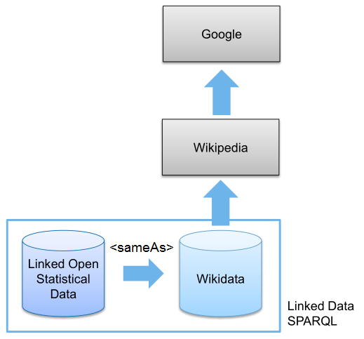
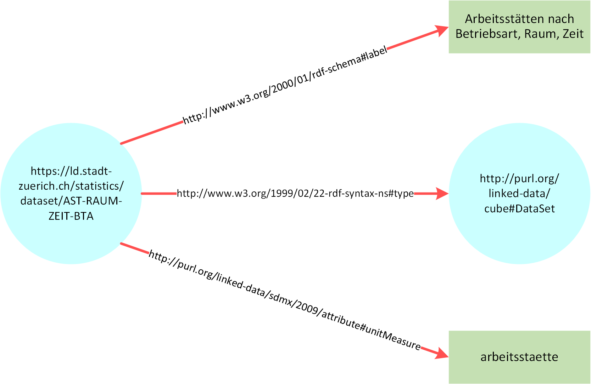
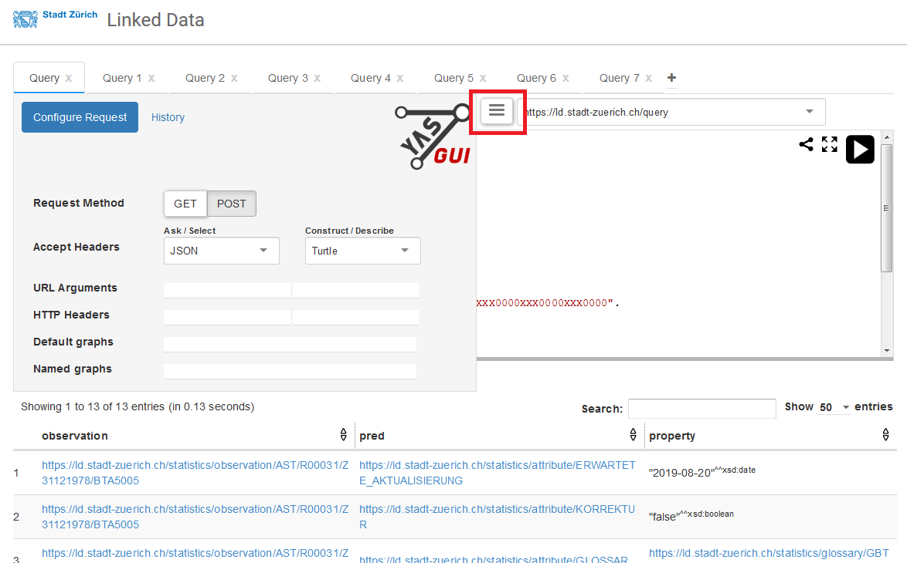
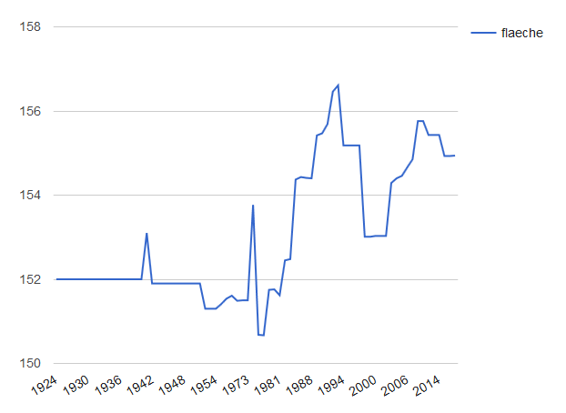
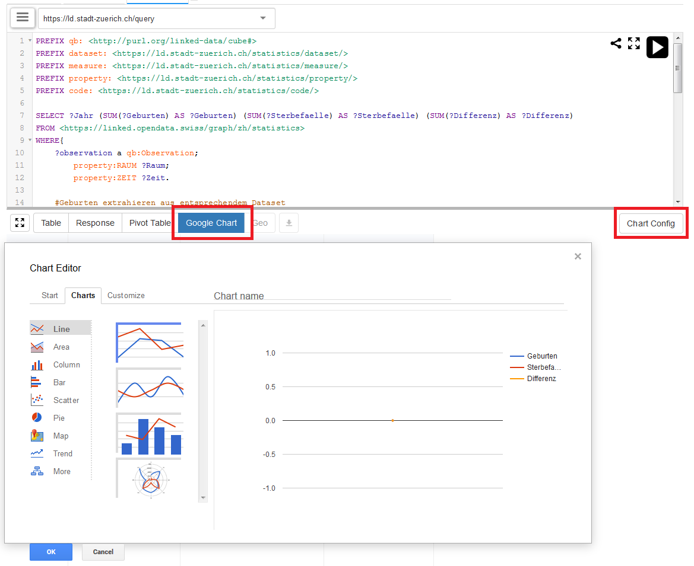

# Table of Contents
<p>
<a href="#1">1 Introduction</a><br>
<a href="#2">2 Linked Open Data</a><br>
&nbsp;&nbsp;&nbsp;&nbsp;&nbsp;<a href="#21">2&#46;1 The Semantic Web</a><br>
&nbsp;&nbsp;&nbsp;&nbsp;&nbsp;<a href="#22">2&#46;2 Open Data and Linked Data</a><br>
&nbsp;&nbsp;&nbsp;&nbsp;&nbsp;<a href="#23">2&#46;3 Graph Database vs&#46; Relational Database</a><br>
&nbsp;&nbsp;&nbsp;&nbsp;&nbsp;<a href="#24">2&#46;4 Triple Storage and Resource Description Framework</a><br>
&nbsp;&nbsp;&nbsp;&nbsp;&nbsp;<a href="#25">2&#46;5 RDF Vocabulary</a><br>
&nbsp;&nbsp;&nbsp;&nbsp;&nbsp;<a href="#26">2&#46;6 RDF Serialization</a><br>
&nbsp;&nbsp;&nbsp;&nbsp;&nbsp;<a href="#27">2&#46;7 RDF Data Cube model</a><br>
&nbsp;&nbsp;&nbsp;&nbsp;&nbsp;<a href="#28">2&#46;8 SPARQL and how to query Linked Data</a><br>
&nbsp;&nbsp;&nbsp;&nbsp;&nbsp;<a href="#29">2&#46;9 SPARQL vs&#46; SQL</a><br>
<a href="#3">3 Data Models</a><br>
&nbsp;&nbsp;&nbsp;&nbsp;&nbsp;<a href="#31">3&#46;1 The SDMX Standard</a><br>
&nbsp;&nbsp;&nbsp;&nbsp;&nbsp;<a href="#32">3&#46;2 Concepts of the Historic Data</a><br>
&nbsp;&nbsp;&nbsp;&nbsp;&nbsp;<a href="#33">3&#46;3 Concepts of the RDF Data Cube</a><br>
&nbsp;&nbsp;&nbsp;&nbsp;&nbsp;<a href="#34">3&#46;4 Other important Concepts</a><br>
<a href="#4">4 SPARQL</a><br>
&nbsp;&nbsp;&nbsp;&nbsp;&nbsp;<a href="#41">4&#46;1 SPARQL in this notebook</a><br>
&nbsp;&nbsp;&nbsp;&nbsp;&nbsp;<a href="#42">4&#46;2 Example Query&#58; all DataSets</a><br>
&nbsp;&nbsp;&nbsp;&nbsp;&nbsp;&nbsp;&nbsp;&nbsp;&nbsp;&nbsp;<a href="#421">4&#46;2&#46;1 Explanation</a><br>
&nbsp;&nbsp;&nbsp;&nbsp;&nbsp;<a href="#43">4&#46;3 Example Query&#58; the first 100 Triples</a><br>
&nbsp;&nbsp;&nbsp;&nbsp;&nbsp;&nbsp;&nbsp;&nbsp;&nbsp;&nbsp;<a href="#431">4&#46;3&#46;1 Explanation</a><br>
&nbsp;&nbsp;&nbsp;&nbsp;&nbsp;<a href="#44">4&#46;4 Example Query&#58; total number of Triples</a><br>
&nbsp;&nbsp;&nbsp;&nbsp;&nbsp;&nbsp;&nbsp;&nbsp;&nbsp;&nbsp;<a href="#441">4&#46;4&#46;1 Explanation</a><br>
&nbsp;&nbsp;&nbsp;&nbsp;&nbsp;<a href="#45">4&#46;5 Example Query&#58; number of Observations per DataSet</a><br>
&nbsp;&nbsp;&nbsp;&nbsp;&nbsp;&nbsp;&nbsp;&nbsp;&nbsp;&nbsp;<a href="#451">4&#46;5&#46;1 Explanation</a><br>
&nbsp;&nbsp;&nbsp;&nbsp;&nbsp;<a href="#46">4&#46;6 Example Query&#58; filter with regular expressions</a><br>
&nbsp;&nbsp;&nbsp;&nbsp;&nbsp;&nbsp;&nbsp;&nbsp;&nbsp;&nbsp;<a href="#461">4&#46;6&#46;1 Explanation</a><br>
&nbsp;&nbsp;&nbsp;&nbsp;&nbsp;<a href="#47">4&#46;7 Example Query&#58; Kennzahlen and measures</a><br>
&nbsp;&nbsp;&nbsp;&nbsp;&nbsp;&nbsp;&nbsp;&nbsp;&nbsp;&nbsp;<a href="#471">4&#46;7&#46;1 Explanation</a><br>
&nbsp;&nbsp;&nbsp;&nbsp;&nbsp;<a href="#48">4&#46;8 Example Query&#58; Groups and dimensions</a><br>
&nbsp;&nbsp;&nbsp;&nbsp;&nbsp;&nbsp;&nbsp;&nbsp;&nbsp;&nbsp;<a href="#481">4&#46;8&#46;1 Explanation</a><br>
&nbsp;&nbsp;&nbsp;&nbsp;&nbsp;<a href="#49">4&#46;9 Example Query&#58; DataSets of specific dimensions or topics</a><br>
&nbsp;&nbsp;&nbsp;&nbsp;&nbsp;&nbsp;&nbsp;&nbsp;&nbsp;&nbsp;<a href="#491">4&#46;9&#46;1 Explanation</a><br>
&nbsp;&nbsp;&nbsp;&nbsp;&nbsp;&nbsp;&nbsp;&nbsp;&nbsp;&nbsp;<a href="#492">4&#46;9&#46;2 Specific topics</a><br>
&nbsp;&nbsp;&nbsp;&nbsp;&nbsp;&nbsp;&nbsp;&nbsp;&nbsp;&nbsp;<a href="#493">4&#46;9&#46;3 Explanation</a><br>
&nbsp;&nbsp;&nbsp;&nbsp;&nbsp;<a href="#410">4&#46;10 Example Query&#58; Metadata and attributes</a><br>
&nbsp;&nbsp;&nbsp;&nbsp;&nbsp;&nbsp;&nbsp;&nbsp;&nbsp;&nbsp;<a href="#4101">4&#46;10&#46;1 Explanation</a><br>
&nbsp;&nbsp;&nbsp;&nbsp;&nbsp;<a href="#411">4&#46;11 Example Query&#58; Groupcodes</a><br>
&nbsp;&nbsp;&nbsp;&nbsp;&nbsp;&nbsp;&nbsp;&nbsp;&nbsp;&nbsp;<a href="#4111">4&#46;11&#46;1 Explanation</a><br>
&nbsp;&nbsp;&nbsp;&nbsp;&nbsp;<a href="#412">4&#46;12 Example Query&#58; Hierarchy of Groupcodes</a><br>
&nbsp;&nbsp;&nbsp;&nbsp;&nbsp;&nbsp;&nbsp;&nbsp;&nbsp;&nbsp;<a href="#4121">4&#46;12&#46;1 Explanation</a><br>
&nbsp;&nbsp;&nbsp;&nbsp;&nbsp;&nbsp;&nbsp;&nbsp;&nbsp;&nbsp;<a href="#4122">4&#46;12&#46;2 Hierarchy of topics</a><br>
&nbsp;&nbsp;&nbsp;&nbsp;&nbsp;&nbsp;&nbsp;&nbsp;&nbsp;&nbsp;<a href="#4123">4&#46;12&#46;3 Explanation</a><br>
&nbsp;&nbsp;&nbsp;&nbsp;&nbsp;<a href="#413">4&#46;13 Example Query&#58; spatial Hierarchies</a><br>
&nbsp;&nbsp;&nbsp;&nbsp;&nbsp;&nbsp;&nbsp;&nbsp;&nbsp;&nbsp;<a href="#4131">4&#46;13&#46;1 Explanation</a><br>
&nbsp;&nbsp;&nbsp;&nbsp;&nbsp;<a href="#414">4&#46;14 Example Query&#58; links to other Databases</a><br>
&nbsp;&nbsp;&nbsp;&nbsp;&nbsp;&nbsp;&nbsp;&nbsp;&nbsp;&nbsp;<a href="#4141">4&#46;14&#46;1 Explanation</a><br>
&nbsp;&nbsp;&nbsp;&nbsp;&nbsp;<a href="#415">4&#46;15 Example Query&#58; Slices of DataSets</a><br>
&nbsp;&nbsp;&nbsp;&nbsp;&nbsp;&nbsp;&nbsp;&nbsp;&nbsp;&nbsp;<a href="#4151">4&#46;15&#46;1 Explanation</a><br>
&nbsp;&nbsp;&nbsp;&nbsp;&nbsp;<a href="#416">4&#46;16 Example Query&#58; Shapes</a><br>
&nbsp;&nbsp;&nbsp;&nbsp;&nbsp;&nbsp;&nbsp;&nbsp;&nbsp;&nbsp;<a href="#4161">4&#46;16&#46;1 Explanation</a><br>
&nbsp;&nbsp;&nbsp;&nbsp;&nbsp;<a href="#417">4&#46;17 Example Query&#58; Metadata of Observations</a><br>
&nbsp;&nbsp;&nbsp;&nbsp;&nbsp;&nbsp;&nbsp;&nbsp;&nbsp;&nbsp;<a href="#4171">4&#46;17&#46;1 Explanation</a><br>
&nbsp;&nbsp;&nbsp;&nbsp;&nbsp;<a href="#418">4&#46;18 Example Query&#58; more Metadata of Observations</a><br>
&nbsp;&nbsp;&nbsp;&nbsp;&nbsp;&nbsp;&nbsp;&nbsp;&nbsp;&nbsp;<a href="#4181">4&#46;18&#46;1 Explanation</a><br>
&nbsp;&nbsp;&nbsp;&nbsp;&nbsp;<a href="#419">4&#46;19 Example Query&#58; relations of a DataSet</a><br>
&nbsp;&nbsp;&nbsp;&nbsp;&nbsp;&nbsp;&nbsp;&nbsp;&nbsp;&nbsp;<a href="#4191">4&#46;19&#46;1 Explanation</a><br>
&nbsp;&nbsp;&nbsp;&nbsp;&nbsp;<a href="#420">4&#46;20 Example Query&#58; relations of an Observation</a><br>
&nbsp;&nbsp;&nbsp;&nbsp;&nbsp;&nbsp;&nbsp;&nbsp;&nbsp;&nbsp;<a href="#4201">4&#46;20&#46;1 Explanation</a><br>
&nbsp;&nbsp;&nbsp;&nbsp;&nbsp;<a href="#421">4&#46;21 Example Query&#58; evolution of the plot area without forest</a><br>
&nbsp;&nbsp;&nbsp;&nbsp;&nbsp;&nbsp;&nbsp;&nbsp;&nbsp;&nbsp;<a href="#4211">4&#46;21&#46;1 Explanation</a><br>
&nbsp;&nbsp;&nbsp;&nbsp;&nbsp;<a href="#422">4&#46;22 Example Query&#58; females of swiss origin in 2016</a><br>
&nbsp;&nbsp;&nbsp;&nbsp;&nbsp;&nbsp;&nbsp;&nbsp;&nbsp;&nbsp;<a href="#4221">4&#46;22&#46;1 Explanation</a><br>
&nbsp;&nbsp;&nbsp;&nbsp;&nbsp;<a href="#423">4&#46;23 Example Query&#58; evolution of the number of unemployed over time</a><br>
&nbsp;&nbsp;&nbsp;&nbsp;&nbsp;&nbsp;&nbsp;&nbsp;&nbsp;&nbsp;<a href="#4231">4&#46;23&#46;1 Explanation</a><br>
&nbsp;&nbsp;&nbsp;&nbsp;&nbsp;<a href="#424">4&#46;24 Example Query&#58; conjunction of Kennzahlen</a><br>
&nbsp;&nbsp;&nbsp;&nbsp;&nbsp;&nbsp;&nbsp;&nbsp;&nbsp;&nbsp;<a href="#4241">4&#46;24&#46;1 Explanation</a><br>
&nbsp;&nbsp;&nbsp;&nbsp;&nbsp;<a href="#425">4&#46;25 Example Query&#58; differences in population numbers</a><br>
&nbsp;&nbsp;&nbsp;&nbsp;&nbsp;&nbsp;&nbsp;&nbsp;&nbsp;&nbsp;<a href="#4251">4&#46;25&#46;1 Explanation</a><br>
&nbsp;&nbsp;&nbsp;&nbsp;&nbsp;<a href="#426">4&#46;26 Example Query&#58; GeoSPARQL</a><br>
&nbsp;&nbsp;&nbsp;&nbsp;&nbsp;&nbsp;&nbsp;&nbsp;&nbsp;&nbsp;<a href="#4261">4&#46;26&#46;1 Explanation</a><br>
<a href="#5">5 SSZVIS</a><br>
<a href="#6">6 OpenSource and Repositories</a><br>
</p>

# 1 Introduction<a id="1"></a>

[Statistik Stadt Zürich](https://www.stadt-zuerich.ch/prd/de/index/statistik.html) (SSZ) is replacing its statistical yearbook with a web-based solution. The content can be accessed directly or programmatically:
* through a REST-interface
* through a SPARQL-interface

The purpose of this notebook is to give an overview of the available data and describe how interested parties are able to query it with SPARQL.

The [project page](https://data.stadt-zuerich.ch/dataset/stadt_zuerich_losd) is the home base and provides links to Github and all other resources.

# 2 Linked Open Data<a id="2"></a>

The data is provided in the form of Linked Open Statistical Data (LOSD), or more precisely, in the form of a graph database - also called triplestore - with the underlying structure being a RDF Data Cube. The data is queried by means of the [SPARQL Query Language](https://www.w3.org/TR/sparql11-query/) (or SPARQL in short). If you want to get a first impression of querying RDF Data Cubes via SPARQL, check out this [screencast](https://youtu.be/IUyzwwwIJSk).

* [This Linked Data course](http://linked-data-training.zazuko.com/) offers an introduction for users new to graph databases and triplestores (in contrast to relational databases)
* The RDF Data Cube model in particular, is introduced in section <a href="#33">3&#46;3</a>

Linked data is a topic far too big to be completely covered here. Likewise, a complete SPARQL tutorial would go far beyond the scope of this document (and was already done plenty of times). However, the most important concepts shall be mentioned and linked with their specifications or other useful sources.

## 2.1 The Semantic Web<a id="21"></a>
The Web started as a collection of documents published online, accessible at Web locations identified by a URL. These documents often contain data about real world resources which are mainly human readable and cannot be understood by machines.
<br>

The so called Semantic Web is about enabling the access to this data, by making it available in machine readable formats (JSON, Turtle, XML, etc.) and connecting it by using Uniform Resource Identifiers (URIs), thus enabling people and machines to  collect the data, and put it together to do all kinds of things with it (so far as the license permits it).

## 2.2 Open Data and Linked Data<a id="22"></a>
* The European Commission provides a nice [presentation](https://joinup.ec.europa.eu/sites/default/files/document/2015-05/d2.1.2_training_module_1.2_introduction_to_linked_data_v1.00_en.pdf) on the topic

> "Open means anyone can freely access, use, modify, and share for any purpose (subject, at most, to requirements that preserve provenance and openness)."
[OpenDefinition.org](https://opendefinition.org/od/2.1/en/)

> "Linked data is a set of design principles for sharing machine-readable
data on the Web for use by public administrations, business and
citizens."
[EC ISA](https://joinup.ec.europa.eu/sites/default/files/inline-files/D4.3.2_Case_Study_Linked_Data_eGov.pdf)

Tim Berners Lee proposed the following four [design principles](https://www.w3.org/DesignIssues/LinkedData.html) for Linked Data:
1. Use Uniform Resource Identifiers (URIs) as names for things.
2. Use HTTP URIs so that people can look up those names.
3. When someone looks up an URI, provide useful information, using the standards (RDF, SPARQL etc.).
4. Include links to other URIs so that they can discover more things.

The quality of Linked Open Data can be assessed with the help of the [5-star scheme](https://www.w3.org/DesignIssues/LinkedData.html), also proposed by Tim Berners Lee:
1. Make your stuff available on the Web (whatever format) under an open license.
2. Make it available as structured data (e.g., Excel instead of image scan of a table)
3. Use non-proprietary formats (e.g., CSV instead of Excel)
4. Use URIs to denote things, so that people can point at your stuff
5. Link your data to other data to provide context


> The Open Data projects of SSZ reached a solid three stars until now... <br> Linked Open Statistics Data (LOSD) will reach the top and earn its five stars!

An example of the 5-star qualities is the link between LOSD and Wikipedia:
<br>




Certain LOSData has a property &lt;sameAs&gt; - with a Wikidata entity as Resource URI - that establishes a link to the Wikidata store (more on &lt;sameAs&gt; shortly).

## 2.3 Graph Database vs. Relational Database<a id="23"></a>
* See [this section](http://www.linkeddatatools.com/introducing-rdf) of the Linked Data crash course
* or [this RDF/OWL lecture](https://www.scss.tcd.ie/Owen.Conlan/CS7063/06%20Introduction%20to%20OWL%20%281%20Lecture%29.ppt.pdf) for a more detailed introduction to the subject
* [This site](https://lod-cloud.net/) provides an interactive graph of worldwide LOData with a plethora of datasets and SPARQL endpoints

Data contained in the Semantic Web is stored in directed labelled graphs to  show not only the data itself, but also properties of the data and its relation to other relevant data. The following figure (click "view image" for higher resolution) shows a graph constructed from a single statistical measurement (a so called Observation) of our LOSData:
<br>


For our purposes a graph has nodes - with either a resource URI or a literal value - and directed relationships. A resource URI represents a link or "address" to another node whereas a literal value is just a String value, for example. Even the relations are defined through URIs! If you are familiar with the concept of Namespaces, you will certainly understand why this is so important. <a href="#25">Section 2&#46;5</a> about Vocabularies and Ontologies will make it even clearer.


In a graph there is no concept of roots or hierarchies. A graph consists of resources related to other resources, with no single resource having any particular intrinsic importance over another. So how do we express such a construct in de facto hierarchical form, let's say XML? Before we get to the answer (the Resource Description Framework or RDF), let's examine an enlarged section of the example above:
<br>




This subgraph is fairly intuitive and can be summarized by the following statements:
<br>
* ```dataset "AST-RAUM-ZEIT-BTA" has the label "Arbeitsstätten nach Betriebsart, Raum, Zeit" (translates to "number of Businesses depending on the Business sector, Area, Date)```
<br>

* ```dataset "AST-RAUM-ZEIT-BTA" is of type "DataSet"```
<br>

* ```data of the dataset "AST-RAUM-ZEIT-BTA" is measured in units of "arbeitsstaette" (translates to "Business"; literally "working place")```

These statements reveal the essence of graph description and RDF:

1. Graphs are expressed in a set of triple statements
2. Every statement has a **subject**, **predicate** and **object**
3. subjects and objects represent nodes whereas the predicates represent relationships

Hence the name "triplestore" for graph/RDF databases.

## 2.4 Triple Storage and Resource Description Framework<a id="24"></a>
* [RDF Specification](http://www.w3.org/TR/2014/REC-rdf11-concepts-20140225/Overview.html)
* See the aforementioned [RDF/OWL lecture](https://www.scss.tcd.ie/Owen.Conlan/CS7063/06%20Introduction%20to%20OWL%20%281%20Lecture%29.ppt.pdf) for one of the best introductions to the subject
* URIs for the designation, RDF for the description and SPARQL for the querying of data

> A Uniform Resource Identifier (URI) is a compact sequence of characters that
identifies an abstract or physical resource! Recall Namespaces..

> RDF is graphical formalism for expressing data models about "something" (resources) using statements expressed as triples

You can already see plenty of URIs in the graph example above.. URI references may be either absolute or relative. URIs often have fragmentIDs and are of the form &lt;<http://www.somedomain.com/some/path/to/file#fragmentID>&gt;. A corresponding relative URI is for example sd:fragmentID (more on that later).


RDF breaks every piece of information down in triples:
* **Subject**: a resource, which may be identified with an URI
* **Predicate**: an URI-identified reused specification of the relationship
* **Object**: a resource or literal to which the subject is related
<br>

An RDF model is an unordered collection of statements, each with a subject, predicate and object! The following code extracts RDF triples from the LOSD graph. Don't mind the code itself, we are only interested in the ouput in form of unordered RDF triples (in N-Triples syntax) for now:


```all-of-them
>SPARQL
%endpoint https://lindas-data.ch:8443/lindas/query
%auth basic public public
%format any
%display raw

PREFIX : <arbitrary:relation>

CONSTRUCT{?sub ?pred ?obj}
FROM <https://linked.opendata.swiss/graph/zh/statistics>
WHERE{<https://ld.stadt-zuerich.ch/statistics/dataset/AST-RAUM-ZEIT-BTA> ((:|!:)|^(:|!:))? ?sub. ?sub ?pred ?obj}
LIMIT 10
```


<div class="krn-spql"><div class="magic">Endpoint set to: https://lindas-data.ch:8443/lindas/query</div><div class="magic">HTTP authentication: ['basic', 'public', 'public']</div><div class="magic">Return format: ANY</div><div class="magic">Display: raw</div></div>


    <https://ld.stadt-zuerich.ch/statistics/observation/AST/R30000/Z30061966/BTA7100> <http://purl.org/linked-data/cube#dataSet> <https://ld.stadt-zuerich.ch/statistics/dataset/AST-RAUM-ZEIT-BTA> .
    <https://ld.stadt-zuerich.ch/statistics/observation/AST/R30000/Z30061966/BTA7100> <https://ld.stadt-zuerich.ch/statistics/property/RAUM> <https://ld.stadt-zuerich.ch/statistics/code/R30000> .
    <https://ld.stadt-zuerich.ch/statistics/observation/AST/R30000/Z30061966/BTA7100> <https://ld.stadt-zuerich.ch/statistics/attribute/QUELLE> <https://ld.stadt-zuerich.ch/statistics/quelle/SSD002> .
    <https://ld.stadt-zuerich.ch/statistics/observation/AST/R30000/Z30061966/BTA7100> <https://ld.stadt-zuerich.ch/statistics/attribute/KORREKTUR> "false"^^<http://www.w3.org/2001/XMLSchema#boolean> .
    <https://ld.stadt-zuerich.ch/statistics/observation/AST/R30000/Z30061966/BTA7100> <http://www.w3.org/2004/02/skos/core#notation> "Z30061966R30000ASTBTA7100XXX0000XXX0000XXX0000XXX0000"^^<http://www.w3.org/2001/XMLSchema#string> .
    <https://ld.stadt-zuerich.ch/statistics/observation/AST/R30000/Z30061966/BTA7100> <https://ld.stadt-zuerich.ch/statistics/attribute/DATENSTAND> "2018-08-08"^^<http://www.w3.org/2001/XMLSchema#date> .
    <https://ld.stadt-zuerich.ch/statistics/observation/AST/R30000/Z30061966/BTA7100> <https://ld.stadt-zuerich.ch/statistics/attribute/GLOSSAR> <https://ld.stadt-zuerich.ch/statistics/glossary/GBTA7100> .
    <https://ld.stadt-zuerich.ch/statistics/observation/AST/R30000/Z30061966/BTA7100> <http://www.w3.org/1999/02/22-rdf-syntax-ns#type> <http://purl.org/linked-data/cube#Observation> .
    <https://ld.stadt-zuerich.ch/statistics/observation/AST/R30000/Z30061966/BTA7100> <https://ld.stadt-zuerich.ch/statistics/attribute/ERWARTETE_AKTUALISIERUNG> "2019-08-22"^^<http://www.w3.org/2001/XMLSchema#date> .
    <https://ld.stadt-zuerich.ch/statistics/observation/AST/R30000/Z30061966/BTA7100> <https://ld.stadt-zuerich.ch/statistics/property/ZEIT> "1966-06-30"^^<http://www.w3.org/2001/XMLSchema#date> .
    
    


Example triples:

```<https://ld.stadt-zuerich.ch/statistics/attribute/ERWARTETE_AKTUALISIERUNG> <http://www.w3.org/1999/02/22-rdf-syntax-ns#type> <http://purl.org/linked-data/cube#AttributeProperty> .```

* Meaning: the resource **ERWARTETE_AKTUALISIERUNG** is a type of **AttributeProperty** (a resource from another namespace)

```<https://ld.stadt-zuerich.ch/schema/TopicEntity> <http://www.w3.org/2000/01/rdf-schema#label> "A topic entity"@en .```

* Meaning: the resource **TopicEntity** has the label **"A topic entity"** (a literal value with a language tag)

## 2.5 RDF Vocabulary<a id="25"></a>
* RDFS (RDF Scheme), OWL (Web Ontology Language) - and many more - extend the base vocabulary of RDF
* See [this introduction]() to semantic modelling and why we need vocabularies

> **Vocabulary**: A collection of terms given a well-defined meaning that is consistent across contexts.

> **Ontology**: Allows you to define contextual relationships behind a defined vocabulary. It is the cornerstone of defining a knowledge domain. A formal syntax for defining ontologies is OWL (Web Ontology Language) which is an extension to RDFS (RDF Schema).

Example: Do LOSD resources like "Heimatland" or "Raum" have a representation, for instance, in Wikidata? Is "Motherland" the Wikidata representation of "Heimatland"? How do we ensure that LOSD can properly "communicate" with Wikidata, or Wikidata is able to query the proper data on our side?

> Properly linking data is about adopting the same base ontology or a common vocabulary!

This notebook as well as the LOSData uses primarily the following vocabularies:

| Vocabulary | Namespace |
| :--------- | :-------- |
| [xsd](https://www.w3.org/XML/Schema) | &lt;<http://www.w3.org/2001/XMLSchema#>&gt; |
| [rdf](https://www.w3.org/TR/rdf11-concepts/) | &lt;<http://www.w3.org/1999/02/22-rdf-syntax-ns#>&gt; |
| [rdfs](https://www.w3.org/TR/rdf-schema/) | &lt;<http://www.w3.org/2000/01/rdf-schema#>&gt; |
| [owl](https://www.w3.org/TR/owl2-overview/) | &lt;<http://www.w3.org/2002/07/owl#>&gt; |
| [skos](https://www.w3.org/TR/swbp-skos-core-guide/) | &lt;<http://www.w3.org/2004/02/skos/core#>&gt; |
| [foaf](http://xmlns.com/foaf/spec/) | &lt;<http://xmlns.com/foaf/0.1/>&gt; |
| [qb](https://www.w3.org/TR/vocab-data-cube/) | &lt;<http://purl.org/linked-data/cube#>&gt; |
| [dcterms](http://dublincore.org/documents/dc-rdf/) | &lt;<http://purl.org/dc/terms/>&gt; |
| [qudt](http://www.qudt.org/release2/qudt-catalog.html) | &lt;<http://qudt.org/schema/qudt#unit>&gt; |

The vocabulary names are linked with the respective documentations.
<br>
<br>

See section [4.25](#4.25-Example-Query:-differences-in-population-numbers) for a nice example query that incorporates Wikidata!

## 2.6 RDF Serialization<a id="26"></a>
> RDF graphs can be expressed in a variety of formats!

* [JSON](https://www.w3.org/TR/json-ld/) is a common format for data serialization and messaging
* [TURTLE](https://www.w3.org/TR/turtle/) is especially useful because it conforms with the SPARQL syntax
* [N-Triples](https://www.w3.org/TR/n-triples/): simple notation, easy-to-parse, line-based format that is not as compact as Turtle
* [RDF/XML](https://www.w3.org/TR/rdf-syntax-grammar/): One of the first formats available. Due to its complexity we do not recommend to work with RDF/XML, unless you have a good reason to do so.

to name the most common ones. Note that you can always translate any RDF serialization to another one without loosing any information.

## 2.7 RDF Data Cube model<a id="27"></a>
* See section <a href="#33">3&#46;3</a> of this notebook and the [Specification](https://www.w3.org/TR/vocab-data-cube/)

## 2.8 SPARQL and how to query Linked Data<a id="28"></a>
* See the [Specification](https://www.w3.org/TR/sparql11-query/),
* the [cheat-sheet](http://www.iro.umontreal.ca/~lapalme/ift6281/sparql-1_1-cheat-sheet.pdf) for a summary of the syntax
* explore the [wikibook](https://en.wikibooks.org/wiki/SPARQL) for more examples
* and most importantly, watch [Zazuko's video](https://www.youtube.com/watch?v=IUyzwwwIJSk&feature=youtu.be) on querying our RDF DataCube with SPARQL and the [YASGUI interface](https://ld.stadt-zuerich.ch/sparql/)

> Learning by doing is our motto! 

Explore a variety of examples in the [SPARQL section](#SPARQL-Interface).

## 2.9 SPARQL vs. SQL<a id="29"></a>
* Interested paties are invited to explore [this](https://www.cambridgesemantics.com/blog/semantic-university/learn-sparql/sparql-vs-sql/) nice comparison

# 3 Data Models<a id="3"></a>

## 3.1 The SDMX Standard<a id="31"></a>
The data provided SSZ conforms with the Statistical Data and Metadata (SDMX) standard. Check out [this](https://www.youtube.com/watch?v=fWFdG2VDVIk) video for a nice introduction of SDMX. The part starting at 5:42 is especially descriptive because it illustrates SDMX with the aid of a statistical table. Illustrations of the statistical tables in the yearbooks of SSZ shall be presented in the next section.

The standard describes and universalizes the way to exchange statistical data, and provides standard formats for data and metadata, content guidelines as well as IT architecture for exchange of data and metadata. The specification with the definition of these terms is provided [here](https://sdmx.org/?page_id=5008). The following figure shows a high level schematic of the major artefacts in the SDMX Information Model. However, terms like Concept Scheme or Code List, which are of particular use to us, are explained in later sections in the context of our data model. 
<br>


## 3.2 Concepts of the Historic Data<a id="32"></a>
**Observation**:<br>
As the basis of the historic data, observations are the individual measurements of the statistics with a code structure of the form:
```
ZddmmyyyyRrrrrrKENGR10000GR20000GR30000GR40000GR50000
```
where the format(length) is equal to Char(53).

**Kennzahl** or **Measure**:<br>
The Kennzahl represents the dimension that is measured by an observation in dependance of other dimensions. If we look at an observation as a function, then the Kennzahl serves as its output (all other dimensions as input). Examples of Kennzahlen are: 
* "BEW" for population
* "STF" for plot area (in *m<sup>2</sup>*)
* "ZUZ" for in-migration 
* "WSS" for water pollutant (in *mg/l*) 
* etc. 

The format(length) is Char(3). "KEN" serves as the placeholder in the observation code. For an observation reading "residential population in dependance of homeland, sex and urban district in the year 2016", the Kennzahl would correspond to "BEW" for residential population:
```
Z31122016R00012BEWHEL1000SEX0001XXX0000XXX0000XXX0000, with a value of BEW = 206 persons
Z31122016R00011BEWHEL2000SEX0002XXX0000XXX0000XXX0000, with a value of BEW = 414 persons
```
are two examples with their respective measurements.

**Group** or **Dimension**:<br> 
Groups are equivalent to dimensions and describe how a Kennzahl is divided into subsets. In other words, groups correspond to the input parameters in the function analogy. They also determine the hierarchy of an observation or measurement. Group examples are: 
* "BEW" for residence permit (not to be confused with the Kennzahl!)
* "HEL" for homeland
* "SEX" for sex 
* "ALT" for age
* "TIG" for animal species 
* etc. 

The format(length) is also Char(3) and "GR1",...,"GR5" serve as the placeholders in the observation code. An observation may comprise a maximum of 5 groups where missing groups are denoted with "XXX" (see the examples above). It is important to note that, despite being dimensions as well, "Zeit" and "Raum" are regarded separately. Both are fixed parts of each and every observation with their own format(length). 

**Zeit**:<br> 
Represents date and time. Zeit is a special type of dimension with identifier "Z" and groupcode of format(length) Char(9). Missing or unknown groupvalues are denoted with "X". Examples are "ZXXXX2016" for the year 2016 or "Z24121950" for the 24th Dec. in 1950.

**Raum**:<br> 
Represents space or area. Raum is a special type of dimension with identifier "R" and groupcode of format(length) Char(6). Examples are "R30000" for Zurich or "R00011" for the urban district "Rathaus" in Zurich.

**Groupcodes**:<br> 
A groupcode is a group identifier paired with its respective value or measurement. A groupvalue has format(length) Char(4) which adds up to a total of Char(7) for the groupcode. In the observation code "0000" corresponds to missing or unknown groupvalues. 

**Metadata**:<br>
Having located an observation, we need certain metadata in order to be able to interpret it. What is the unit of measurement, when was it measured or where was it acquired? Other Metadata includes footnotes, glossary entries or even a date when the data will be updated. Metadata is provided as attributes and can be attached to individual observations or to higher levels. We distinguish two types of Metadata:

Literal values bound to a specific measurement (or higher level):
* **DATENSTAND**: a xsd:date value ("YYYY-MM-DD") that states the last date the data was updated or the last time the data was acquired, respectively
* **BEZUGSZEIT**: a string value that states in what intervals the data is acquired, e.g. "Tag;Monat", "Periode;Jahr", "Tag;Tag;Monat;Quartal;Trimester;Semester;Jahr" etc.
* **license**: a string value that states under what license the data is published, e.g. "CC0" or "CCBY" ([Creative Commons 0](https://creativecommons.org/publicdomain/zero/1.0/deed.de) and [Creative Commons BY](https://creativecommons.org/licenses/by/3.0/ch/))
* **KORREKTUR**: a xsd:boolean value that states if the data was updated or not 
* **ERWARTETE_AKTUALISIERUNG**: a xsd:date value ("YYYY-MM-DD") that states the next date the data is updated or the next time the data is acquired, respectively

URI resources that are possibly referenced by multiple measurements (or higher level):
* **Unit**: the unit of measurement, e.g. years, square meters, persons etc. Each unit is a resource with type, label, notation and rounding
* **QUELLE**: the source of the data with a creator, rights, license, label and notation
* **FUSSNOTE**: a footnote with a type, label and scheme
* **GLOSSAR**: a string value that further describes a resource, concept, Groupcode etc. A glossary resource has a description, comment, label and notation
<br>
<br>

The following figures show excerpts of the statistical yearbooks from the year 1941 and 2016 (taken from the [Statistik Stadt Zurich page](https://www.stadt-zuerich.ch/content/prd/de/index/statistik/publikationen-angebote/publikationen/ssz-magazin/2018-07-17_Das-Ende-der-Jahrbuch-Aera.html)). Such data is first of all mapped to the aforementioned observations, then equipped with metadata (version, source, glossary etc.) and subsequently collected in DataSets of the RDF Data Cube model. 
<br>


## 3.3 Concepts of the RDF Data Cube<a id="33"></a>
The Data Cube model further specifies the SDMX definitions and forms an actual data model which is described in terms of the Resource Description Framework. The basis of every Data Cube is its ensemble of observations. They represent the actual statistical measurements and every other concept serves to relate and structure these measurements in a meaningful way. The primary concepts shall be briefly explained here and in the following section:

**qb:DataSet**:<br>
A statistical data set comprises a collection of observations made at some points across some logical space. The collection can be characterized by a set of dimensions that define what the observation applies to (e.g. time, area, gender) along with metadata describing what has been measured (e.g. economic activity, population), how it was measured and how the observations are expressed (e.g. units, multipliers, status). We can think of the statistical data set as a multi-dimensional space, or hyper-cube, indexed by those dimensions.   
* Observations of the historic data are collected in DataSets according to the following rule:
```
ZddmmyyyyRrrrrrKENGR10000GR20000GR30000GR40000GR50000 
corresponds to the DataSet 
KEN-RAUM-ZEIT-GR1-GR2-GR3-GR4-GR5
```
where missing groups/dimensions ("XXX") are omitted in qb:DataSet notation.
<br>

* DataSets are accessed through the node https://ld.stadt-zuerich.ch/statistics/dataset/&lt;dataset>

**qb:Observation**:<br>
This is the actual data, the measured values. In a statistical table (as in the statistical yearbooks), the observations would be the values in the table cells.
* Observations of the historic data are mapped according to the following rule:
```
ZddmmyyyyRrrrrrKENGR10000GR20000GR30000GR40000GR50000 
corresponds to the observation 
KEN/Rrrrrr/Zddmmyyyy/GR10000/GR20000/GR30000/GR40000/GR50000 
in our DataCube notation
```
where missing groups/dimensions ("XXX") are omitted in qb:Observation notation.
<br>
 
* Observations are accessed through the node https://ld.stadt-zuerich.ch/statistics/observation/&lt;observation>

**qb:MeasureProperty**:<br>
The measure components represent the observed phenomena.
* Kennzahlen or measures of the historic data are mapped to MeasureProperty.
* Measures are accessed through the node https://ld.stadt-zuerich.ch/statistics/measure/&lt;measure>

**qb:DimensionProperty**:<br>
The dimension components serve to identify the observations. A set of values for all the dimension components is sufficient to identify a single observation. Examples of dimensions include the time to which the observation applies, or a geographic region which the observation covers etc. 
* Dimensions of the historic data are mapped to DimensionProperty.
* Dimensions are accessed through the node https://ld.stadt-zuerich.ch/statistics/property/&lt;dimension>

**qb:AttributeProperty**:<br>
The attribute components allow us to qualify and interpret the observed value(s). They enable specification of the units of measure, any scaling factors and metadata such as the status of the observation (e.g. estimated, provisional).
* Only meta and system attributes of the historic data are mapped to AttributeProperty! 
* Attributes are accessed through the node https://ld.stadt-zuerich.ch/statistics/attribute/&lt;attribute>
* Units of the MeasureProperties, for instance, are mapped to an independent concept (see next section)

**qb:Slice**:<br>
A subset of observations within a DataSet. Produced by fixing one or more dimensions and refer to all observations with those dimension values as a single entity, a slice. In statistical applications it is common to work with slices in which a single dimension is left unspecified. In particular, to refer to such slices, in which the single free dimension is time, as "Time Series". Within the Data Cube vocabulary however, arbitrary dimensionality slices are allowed and particular types of slice are not denoted differently.
* Slices of a specific &lt;DataSet&gt; and &lt;SliceKey&gt; are accessed through the nodes https://ld.stadt-zuerich.ch/statistics/dataset/&lt;DataSet&gt;/&lt;SliceKey&gt;/slice
<br>
<br>

A diagram of the RDF Data Cube model is provided in the following figure. In addition to the official [Data Cube Documentation](https://www.w3.org/TR/vocab-data-cube/) a very informative presentation can be downloaded [here](https://www.google.com/url?sa=t&rct=j&q=&esrc=s&source=web&cd=11&ved=0ahUKEwjN68WrvprcAhVC8RQKHd50D2M4ChAWCDMwAA&url=https%3A%2F%2Fweb.imsi.athenarc.gr%2Fredmine%2Fattachments%2Fdownload%2F1018%2FData%2520Cube%2520Vocabulary%2520Overview%2520and%2520Example.pdf&usg=AOvVaw3ujILUzk2T1dLd9ebo2hYW).
<br>


## 3.4 Other important Concepts<a id="34"></a>

**Shapes**:<br>
Shape expressions (written in RDF) are used to declare various  constraints for the components of a RDF graph (or Data Cube). Informally, a shape is a set of conditions that determine how to validate a node (of a graph), based on the values of properties and other characteristics of the node, with the Shapes Constraint Language (SHACL). Shapes and SHACL represent a validation mechanism. Examples of such constraints are:
* Observations must be linked to a Raum and Zeit
* Observations must be linked to a measure
* Observations measure a double value
* Observations comprise 5 groups at most
* DataSets contain several slices and slices contain several observations
* and many more..

More information on shapes can be found in the official [SHACL Documentation](https://www.w3.org/TR/shacl/).

* Shapes of a specific &lt;DataSet&gt; are accessed through the nodes https://ld.stadt-zuerich.ch/statistics/dataset/&lt;DataSet&gt;/shape

**sdmx:unitMeasure** and **qudt:unit**:<br>
The units of measurement of observations are mapped to these two concepts and accessed through the node https://ld.stadt-zuerich.ch/statistics/unit/. qudt:unit acts as the type and sdmx:unitMeasure as the relation of triples:<br>
* ```?sub sdmx:unitMeasure ?unit```<br>
* ```?unit a qudt:unit```

**skos:Concept**:<br>
Groupcodes of the historic data are mapped to skos:Concept and accessed through the node https://ld.stadt-zuerich.ch/statistics/code/. A skos:Concept can be viewed as an idea or notion. It is useful when describing the conceptual or intellectual structure of a knowledge organization system, and when referring to specific ideas or meanings established within a KOS. An Example:
* &lt;<https://ld.stadt-zuerich.ch/statistics/code/R00012>&gt; is a skos:Concept representing institutions of higher education (label "Hochschulen") or, more precisely, the occupied area 
* &lt;<https://ld.stadt-zuerich.ch/statistics/code/ABT6000>&gt; is a skos:Concept representing all apprentices (label "Lehrlinge")

**skos:Notation**: Is a string of characters, such as "R00012" or "ABT6000", used to uniquely identify a skos:Concept within the scope of a given concept scheme. A notation is different from a lexical label in that a notation is not normally recognizable as a word or sequence of words in any natural language. An Example:
* &lt;<https://ld.stadt-zuerich.ch/statistics/code/R00012>&gt; is a concept with skos:Notation "R00012"

**skos:inScheme**:<br>
Tells us to which scheme a concept belongs. A skos:ConceptScheme can be viewed as an aggregation of one or more skos:Concepts. Semantic relationships (links) between those concepts may also be viewed as part of a concept scheme. The notion of a concept scheme is useful when dealing with data that describes two or more different knowledge organization systems. An Example:
* the concept &lt;<https://ld.stadt-zuerich.ch/statistics/code/R00012>&gt; is in skos:inScheme &lt;<https://ld.stadt-zuerich.ch/statistics/scheme/Raum>&gt;
* note that "Raum" is not only used as a dimension but also as a concept!

**skos:broader** and **skos:narrower**:<br>
Are used to assert a direct hierarchical link between two skos:Concepts:
* A triple &lt;A&gt; skos:broader &lt;B&gt; asserts that &lt;B&gt;, the object of the triple, is a broader concept than &lt;A&gt;, the subject of the triple. 
* Similarly, a triple &lt;C&gt; skos:narrower &lt;D&gt; asserts that &lt;D&gt;, the object of the triple, is a narrower concept than &lt;C&gt;, the subject of the triple. 
* &lt;<https://ld.stadt-zuerich.ch/statistics/code/R00012>&gt; for instance has skos:broader <R30000>

**owl:sameAs**:<br>
The sameAs statement indicates that two URI resources actually refer to the same thing or represent the same concept. owl:sameAs statements are often used for mappings between ontologies. It is unrealistic to assume everyone will use the same name to refer to some resource or concept. Two concepts generally have different features and relations to other resources, despite being linked by sameAs! In this way, making a union between such ontologies or databases provides more complete data. The graph example in section <a href="#23">2&#46;3</a> had the following statement regarding the city district Alt-Wiedikon:
* &lt;<https://ld.stadt-zuerich.ch/statistics/code/R00031>&gt; owl:sameAs &lt;<http://www.wikidata.org/entity/Q433012>&gt;

This means, Wikidata's database entry - with its own location-/population information, images and references - is linked with  LOSD. As a result, Wikidata is able to use R00031 as a gateway to query and effectively incorporate the LOSData into its own database (and vice versa of course).

The challenge with owl:sameAs is that when there are many mappings of nodes between graphs, and especially when big chains of sameAs appear, it becomes inefficient. owl:sameAs is defined as symmetric and transitive, so given that &lt;A&gt; sameAs &lt;B&gt; sameAs &lt;C&gt;, also the statements &lt;A&gt; sameAs &lt;A&gt;, &lt;A&gt; sameAs &lt;C&gt;, &lt;B&gt; sameAs &lt;A&gt; etc. will be produced.

* See section <a href="#425">4&#46;25</a> for a nice example

**Topics**:<br>
The node <https://ld.stadt-zuerich.ch/schema/Category> contains the main categories of a topic tree. The following figure shows a simplified diagram:<br>


<br>
skos:narrower reveals a new topic level for each category and subtopic - and so on - until a DataSet is reached. Each topic  relates to a number of DataSets. 
<br>

* See section <a href="#492">4&#46;9&#46;2</a> and <a href="#4122">4&#46;12&#46;2</a> for examples on the topic hierarchy

# 4 SPARQL<a id="4"></a>
* The SPARQL interface is accessed through https://ld.stadt-zuerich.ch/sparql/
* The actual queries are done via https://ld.stadt-zuerich.ch/query which is the SPARQL endpoint as well
* The complete graph can be found at the opendata.swiss node <https://linked.opendata.swiss/graph/zh/statistics>
* The integration environment is accessed through https://ld.integ.stadt-zuerich.ch/sparql/, but it is to be noted that the URIs tend to point back to the production environment. While testing, the ".integ" has to be inserted by hand or programmatically

> **Don't forget to watch our [developer guide](https://www.youtube.com/watch?v=IUyzwwwIJSk&feature=youtu.be) on how to query our data with SPARQL!**

## 4.1 SPARQL in this notebook<a id="41"></a>
Before we get down to business, we have to prepare a few things for the queries to reach outside of this notebook:


```all-of-them
>SPARQL
%endpoint https://lindas-data.ch:8443/lindas/query
%auth basic public public
%format JSON
%display table
```


<div class="krn-spql"><div class="magic">Endpoint set to: https://lindas-data.ch:8443/lindas/query</div><div class="magic">HTTP authentication: ['basic', 'public', 'public']</div><div class="magic">Return format: JSON</div><div class="magic">Display: table</div></div>


These so called line magics control the behaviour of the SPARQL kernel, i.e., the queries in this notebook. The most important ones shall be briefly explained:
* **&gt;Kernelname**: defines the code format of the cell. This notebook includes SPARQL and R examples, so a cell is either declared &gt;SPARQL or &gt;R
* **%endpoint**: defines the mandatory SPARQL endpoint for all subsequent queries. It remains active until superseded by another endpoint magic.
* **%auth**: defines the HTTP authentification to send to the backend. For the lindas endpoint we can simply use "public" for the &lt;username&gt; and &lt;password&gt;
* **%format**: sets the data format requested to the SPARQL endpoint. We request the endpoint to provide results in JSON format if nothing else is mentioned
* **%display**: sets the output rendering shape. "raw" would display our results as specified by %format whereas "table" generates a table out of them. We will also see results displayed as diagrams later
* **%lsmagics**: displays all available magics

If at any point a query doesn't work as expected or throws an error, we advise the reader to rerun the cell with the magics or insert the line magics at the beginning of the query before trying again.

> **Be careful to remove all magics if you copy paste our examples!**

## 4.2 Example Query: all DataSets<a id="42"></a>
In our first SPARQL queries we want to get a feel for the data and how it is structured. It makes sense to start by exploring the DataSets, although the observations serve as the true foundation of the statistical data. The various DataSets and their labels help us in getting a good overview of the provided data and its partitioning.


```all-of-them
>SPARQL
PREFIX qb: <http://purl.org/linked-data/cube#>
PREFIX rdfs: <http://www.w3.org/2000/01/rdf-schema#>

SELECT ?dataset ?label 
FROM <https://linked.opendata.swiss/graph/zh/statistics>
WHERE{
    ?dataset a qb:DataSet;
        rdfs:label ?label.
}
```


<div class="krn-spql"><table><tr class=hdr><th>dataset</th>
<th>label</th></tr><tr class=odd><td class=val><a href="https://ld.stadt-zuerich.ch/statistics/dataset/AST-RAUM-ZEIT-BTA" target="_other">https://ld.stadt-zuerich.ch/statistics/dataset/AST-RAUM-ZEIT-BTA</a></td>
<td class=val>Arbeitsstätten nach Betriebsart, Raum, Zeit</td></tr><tr class=even><td class=val><a href="https://ld.stadt-zuerich.ch/statistics/dataset/BES-RAUM-ZEIT-BTA-SEX" target="_other">https://ld.stadt-zuerich.ch/statistics/dataset/BES-RAUM-ZEIT-BTA-SEX</a></td>
<td class=val>Beschäftigte nach Betriebsart, Raum, Geschlecht, Zeit</td></tr><tr class=odd><td class=val><a href="https://ld.stadt-zuerich.ch/statistics/dataset/BES-RAUM-ZEIT-BTA" target="_other">https://ld.stadt-zuerich.ch/statistics/dataset/BES-RAUM-ZEIT-BTA</a></td>
<td class=val>Beschäftigte nach Betriebsart, Raum, Zeit</td></tr><tr class=even><td class=val><a href="https://ld.stadt-zuerich.ch/statistics/dataset/ZUS-RAUM-ZEIT-BTA-HEL" target="_other">https://ld.stadt-zuerich.ch/statistics/dataset/ZUS-RAUM-ZEIT-BTA-HEL</a></td>
<td class=val>Zuschauer/innen, Besucher/innen nach Betriebsart, Heimatland, Raum, Zeit</td></tr><tr class=odd><td class=val><a href="https://ld.stadt-zuerich.ch/statistics/dataset/ZUS-RAUM-ZEIT-BTA-SEX" target="_other">https://ld.stadt-zuerich.ch/statistics/dataset/ZUS-RAUM-ZEIT-BTA-SEX</a></td>
<td class=val>Zuschauer/innen, Besucher/innen nach Betriebsart, Raum, Geschlecht, Zeit</td></tr><tr class=even><td class=val><a href="https://ld.stadt-zuerich.ch/statistics/dataset/ZUS-RAUM-ZEIT-BTA" target="_other">https://ld.stadt-zuerich.ch/statistics/dataset/ZUS-RAUM-ZEIT-BTA</a></td>
<td class=val>Zuschauer/innen, Besucher/innen nach Betriebsart, Raum, Zeit</td></tr><tr class=odd><td class=val><a href="https://ld.stadt-zuerich.ch/statistics/dataset/SCH-RAUM-ZEIT-BTA-SST" target="_other">https://ld.stadt-zuerich.ch/statistics/dataset/SCH-RAUM-ZEIT-BTA-SST</a></td>
<td class=val>Schüler/innen und Student/innen nach Betriebsart, Raum, Schulstufen und Fächer, Zeit</td></tr><tr class=even><td class=val><a href="https://ld.stadt-zuerich.ch/statistics/dataset/SCH-RAUM-ZEIT-BTA" target="_other">https://ld.stadt-zuerich.ch/statistics/dataset/SCH-RAUM-ZEIT-BTA</a></td>
<td class=val>Schüler/innen und Student/innen nach Betriebsart, Raum, Zeit</td></tr><tr class=odd><td class=val><a href="https://ld.stadt-zuerich.ch/statistics/dataset/AST-RAUM-ZEIT-BEW-BTA" target="_other">https://ld.stadt-zuerich.ch/statistics/dataset/AST-RAUM-ZEIT-BEW-BTA</a></td>
<td class=val>Arbeitsstätten nach Bewilligung, Betriebsart, Raum, Zeit</td></tr><tr class=even><td class=val><a href="https://ld.stadt-zuerich.ch/statistics/dataset/BEW-RAUM-ZEIT" target="_other">https://ld.stadt-zuerich.ch/statistics/dataset/BEW-RAUM-ZEIT</a></td>
<td class=val>Wirtschaftliche Wohnbevölkerung nach Raum, Zeit</td></tr><tr class=odd><td class=val><a href="https://ld.stadt-zuerich.ch/statistics/dataset/BEW-RAUM-ZEIT-SEX" target="_other">https://ld.stadt-zuerich.ch/statistics/dataset/BEW-RAUM-ZEIT-SEX</a></td>
<td class=val>Wirtschaftliche Wohnbevölkerung nach Raum, Geschlecht, Zeit</td></tr><tr class=even><td class=val><a href="https://ld.stadt-zuerich.ch/statistics/dataset/BEW-RAUM-ZEIT-HEL-SEX" target="_other">https://ld.stadt-zuerich.ch/statistics/dataset/BEW-RAUM-ZEIT-HEL-SEX</a></td>
<td class=val>Wirtschaftliche Wohnbevölkerung nach Heimatland, Raum, Geschlecht, Zeit</td></tr><tr class=odd><td class=val><a href="https://ld.stadt-zuerich.ch/statistics/dataset/BEW-RAUM-ZEIT-HEL" target="_other">https://ld.stadt-zuerich.ch/statistics/dataset/BEW-RAUM-ZEIT-HEL</a></td>
<td class=val>Wirtschaftliche Wohnbevölkerung nach Heimatland, Raum, Zeit</td></tr><tr class=even><td class=val><a href="https://ld.stadt-zuerich.ch/statistics/dataset/ANT-RAUM-ZEIT-GGH-HEL" target="_other">https://ld.stadt-zuerich.ch/statistics/dataset/ANT-RAUM-ZEIT-GGH-HEL</a></td>
<td class=val>Anteil nach Grundgesamtheit, Heimatland, Raum, Zeit</td></tr><tr class=odd><td class=val><a href="https://ld.stadt-zuerich.ch/statistics/dataset/BEW-RAUM-ZEIT-KON" target="_other">https://ld.stadt-zuerich.ch/statistics/dataset/BEW-RAUM-ZEIT-KON</a></td>
<td class=val>Wirtschaftliche Wohnbevölkerung nach Konfession, Raum, Zeit</td></tr><tr class=even><td class=val><a href="https://ld.stadt-zuerich.ch/statistics/dataset/BEW-RAUM-ZEIT-ALT" target="_other">https://ld.stadt-zuerich.ch/statistics/dataset/BEW-RAUM-ZEIT-ALT</a></td>
<td class=val>Wirtschaftliche Wohnbevölkerung nach Alter, Raum, Zeit</td></tr><tr class=odd><td class=val><a href="https://ld.stadt-zuerich.ch/statistics/dataset/VER-RAUM-ZEIT-BTA-PRA" target="_other">https://ld.stadt-zuerich.ch/statistics/dataset/VER-RAUM-ZEIT-BTA-PRA</a></td>
<td class=val>Veranstaltungen, Aufführungen nach Betriebsart, Produktionsart Kulturveranstaltung, Raum, Zeit</td></tr><tr class=even><td class=val><a href="https://ld.stadt-zuerich.ch/statistics/dataset/VER-RAUM-ZEIT-BTA" target="_other">https://ld.stadt-zuerich.ch/statistics/dataset/VER-RAUM-ZEIT-BTA</a></td>
<td class=val>Veranstaltungen, Aufführungen nach Betriebsart, Raum, Zeit</td></tr><tr class=odd><td class=val><a href="https://ld.stadt-zuerich.ch/statistics/dataset/VER-RAUM-ZEIT-BTA-VSA" target="_other">https://ld.stadt-zuerich.ch/statistics/dataset/VER-RAUM-ZEIT-BTA-VSA</a></td>
<td class=val>Veranstaltungen, Aufführungen nach Betriebsart, Raum, Veranstaltungsart, Zeit</td></tr><tr class=even><td class=val><a href="https://ld.stadt-zuerich.ch/statistics/dataset/PLB-RAUM-ZEIT-BTA-VSA" target="_other">https://ld.stadt-zuerich.ch/statistics/dataset/PLB-RAUM-ZEIT-BTA-VSA</a></td>
<td class=val>Platzbelegung nach Betriebsart, Raum, Veranstaltungsart, Zeit</td></tr></table><div class="tinfo">Total: 85, Shown: 20</div></div>


### 4.2.1 Explanation<a id="421"></a>
Note that ```?dataset a qb:DataSet``` is short for 

```?dataset http://www.w3.org/1999/02/22-rdf-syntax-ns#type qb:DataSet```

* rdf:type is generally shortened to just "a" as in "is a type of..".

## 4.3 Example Query: the first 100 Triples<a id="43"></a>
The following query SELECTS randomly 100 RDF triples:


```all-of-them
>SPARQL
SELECT * 
FROM <https://linked.opendata.swiss/graph/zh/statistics>
WHERE {
    ?sub ?pred ?obj.
} 
LIMIT 100
```


<div class="krn-spql"><table><tr class=hdr><th>sub</th>
<th>pred</th>
<th>obj</th></tr><tr class=odd><td class=val><a href="https://ld.stadt-zuerich.ch/.well-known/void" target="_other">https://ld.stadt-zuerich.ch/.well-known/void</a></td>
<td class=val><a href="http://www.w3.org/1999/02/22-rdf-syntax-ns#type" target="_other">http://www.w3.org/1999/02/22-rdf-syntax-ns#type</a></td>
<td class=val><a href="http://rdfs.org/ns/void#DatasetDescription" target="_other">http://rdfs.org/ns/void#DatasetDescription</a></td></tr><tr class=even><td class=val><a href="https://ld.stadt-zuerich.ch/.well-known/void" target="_other">https://ld.stadt-zuerich.ch/.well-known/void</a></td>
<td class=val><a href="http://purl.org/dc/terms/creator" target="_other">http://purl.org/dc/terms/creator</a></td>
<td class=val><a href="https://ld.stadt-zuerich.ch/org/SSZ" target="_other">https://ld.stadt-zuerich.ch/org/SSZ</a></td></tr><tr class=odd><td class=val><a href="https://ld.stadt-zuerich.ch/.well-known/void" target="_other">https://ld.stadt-zuerich.ch/.well-known/void</a></td>
<td class=val><a href="http://purl.org/dc/terms/title" target="_other">http://purl.org/dc/terms/title</a></td>
<td class=val>Description of Statistik Stadt Zürich Datasets</td></tr><tr class=even><td class=val><a href="https://ld.stadt-zuerich.ch/.well-known/void" target="_other">https://ld.stadt-zuerich.ch/.well-known/void</a></td>
<td class=val><a href="http://xmlns.com/foaf/0.1/topic" target="_other">http://xmlns.com/foaf/0.1/topic</a></td>
<td class=val><a href="https://ld.stadt-zuerich.ch/dataset/SSZ" target="_other">https://ld.stadt-zuerich.ch/dataset/SSZ</a></td></tr><tr class=odd><td class=val><a href="https://ld.stadt-zuerich.ch/org/SSZ" target="_other">https://ld.stadt-zuerich.ch/org/SSZ</a></td>
<td class=val><a href="http://www.w3.org/1999/02/22-rdf-syntax-ns#type" target="_other">http://www.w3.org/1999/02/22-rdf-syntax-ns#type</a></td>
<td class=val><a href="http://xmlns.com/foaf/0.1/Organization" target="_other">http://xmlns.com/foaf/0.1/Organization</a></td></tr><tr class=even><td class=val><a href="https://ld.stadt-zuerich.ch/org/SSZ" target="_other">https://ld.stadt-zuerich.ch/org/SSZ</a></td>
<td class=val><a href="http://www.w3.org/1999/02/22-rdf-syntax-ns#type" target="_other">http://www.w3.org/1999/02/22-rdf-syntax-ns#type</a></td>
<td class=val><a href="http://schema.org/GovernmentOrganization" target="_other">http://schema.org/GovernmentOrganization</a></td></tr><tr class=odd><td class=val><a href="https://ld.stadt-zuerich.ch/org/SSZ" target="_other">https://ld.stadt-zuerich.ch/org/SSZ</a></td>
<td class=val><a href="http://www.w3.org/2000/01/rdf-schema#label" target="_other">http://www.w3.org/2000/01/rdf-schema#label</a></td>
<td class=val>Statistik Stadt Zürich</td></tr><tr class=even><td class=val><a href="https://ld.stadt-zuerich.ch/org/SSZ" target="_other">https://ld.stadt-zuerich.ch/org/SSZ</a></td>
<td class=val><a href="http://xmlns.com/foaf/0.1/homepage" target="_other">http://xmlns.com/foaf/0.1/homepage</a></td>
<td class=val><a href="https://www.stadt-zuerich.ch/prd/de/index/statistik.html" target="_other">https://www.stadt-zuerich.ch/prd/de/index/statistik.html</a></td></tr><tr class=odd><td class=val><a href="https://ld.stadt-zuerich.ch/dataset/SSZ" target="_other">https://ld.stadt-zuerich.ch/dataset/SSZ</a></td>
<td class=val><a href="http://www.w3.org/1999/02/22-rdf-syntax-ns#type" target="_other">http://www.w3.org/1999/02/22-rdf-syntax-ns#type</a></td>
<td class=val><a href="http://rdfs.org/ns/void#Dataset" target="_other">http://rdfs.org/ns/void#Dataset</a></td></tr><tr class=even><td class=val><a href="https://ld.stadt-zuerich.ch/dataset/SSZ" target="_other">https://ld.stadt-zuerich.ch/dataset/SSZ</a></td>
<td class=val><a href="http://www.w3.org/1999/02/22-rdf-syntax-ns#type" target="_other">http://www.w3.org/1999/02/22-rdf-syntax-ns#type</a></td>
<td class=val><a href="http://www.w3.org/ns/dcat#Dataset" target="_other">http://www.w3.org/ns/dcat#Dataset</a></td></tr><tr class=odd><td class=val><a href="https://ld.stadt-zuerich.ch/dataset/SSZ" target="_other">https://ld.stadt-zuerich.ch/dataset/SSZ</a></td>
<td class=val><a href="http://purl.org/dc/terms/creator" target="_other">http://purl.org/dc/terms/creator</a></td>
<td class=val><a href="https://ld.stadt-zuerich.ch/org/SSZ" target="_other">https://ld.stadt-zuerich.ch/org/SSZ</a></td></tr><tr class=even><td class=val><a href="https://ld.stadt-zuerich.ch/dataset/SSZ" target="_other">https://ld.stadt-zuerich.ch/dataset/SSZ</a></td>
<td class=val><a href="http://purl.org/dc/terms/issued" target="_other">http://purl.org/dc/terms/issued</a></td>
<td class=val>2018-08-22</td></tr><tr class=odd><td class=val><a href="https://ld.stadt-zuerich.ch/dataset/SSZ" target="_other">https://ld.stadt-zuerich.ch/dataset/SSZ</a></td>
<td class=val><a href="http://purl.org/dc/terms/created" target="_other">http://purl.org/dc/terms/created</a></td>
<td class=val>2018-08-22T13:55:11Z</td></tr><tr class=even><td class=val><a href="https://ld.stadt-zuerich.ch/dataset/SSZ" target="_other">https://ld.stadt-zuerich.ch/dataset/SSZ</a></td>
<td class=val><a href="http://purl.org/dc/terms/title" target="_other">http://purl.org/dc/terms/title</a></td>
<td class=val>Statistische Daten der Stadt Zürich</td></tr><tr class=odd><td class=val><a href="https://ld.stadt-zuerich.ch/dataset/SSZ" target="_other">https://ld.stadt-zuerich.ch/dataset/SSZ</a></td>
<td class=val><a href="http://purl.org/dc/terms/description" target="_other">http://purl.org/dc/terms/description</a></td>
<td class=val>Dieser Datensatz enthält statistische Daten der Stadt Zürich im RDF Data Cube Vokabular</td></tr><tr class=even><td class=val><a href="https://ld.stadt-zuerich.ch/dataset/SSZ" target="_other">https://ld.stadt-zuerich.ch/dataset/SSZ</a></td>
<td class=val><a href="http://purl.org/dc/terms/publisher" target="_other">http://purl.org/dc/terms/publisher</a></td>
<td class=val><a href="https://ld.stadt-zuerich.ch/org/SSZ" target="_other">https://ld.stadt-zuerich.ch/org/SSZ</a></td></tr><tr class=odd><td class=val><a href="https://ld.stadt-zuerich.ch/dataset/SSZ" target="_other">https://ld.stadt-zuerich.ch/dataset/SSZ</a></td>
<td class=val><a href="http://purl.org/dc/terms/contributor" target="_other">http://purl.org/dc/terms/contributor</a></td>
<td class=val><a href="https://ld.stadt-zuerich.ch/org/Zazuko" target="_other">https://ld.stadt-zuerich.ch/org/Zazuko</a></td></tr><tr class=even><td class=val><a href="https://ld.stadt-zuerich.ch/dataset/SSZ" target="_other">https://ld.stadt-zuerich.ch/dataset/SSZ</a></td>
<td class=val><a href="http://usefulinc.com/ns/doap#repository" target="_other">http://usefulinc.com/ns/doap#repository</a></td>
<td class=val>Bce0c9b926b9a3dc615fb607462eac757</td></tr><tr class=odd><td class=val><a href="https://ld.stadt-zuerich.ch/dataset/SSZ" target="_other">https://ld.stadt-zuerich.ch/dataset/SSZ</a></td>
<td class=val><a href="http://rdfs.org/ns/void#sparqlEndpoint" target="_other">http://rdfs.org/ns/void#sparqlEndpoint</a></td>
<td class=val><a href="https://stat.stadt-zuerich.ch/query" target="_other">https://stat.stadt-zuerich.ch/query</a></td></tr><tr class=even><td class=val><a href="https://ld.stadt-zuerich.ch/org/Zazuko" target="_other">https://ld.stadt-zuerich.ch/org/Zazuko</a></td>
<td class=val><a href="http://www.w3.org/1999/02/22-rdf-syntax-ns#type" target="_other">http://www.w3.org/1999/02/22-rdf-syntax-ns#type</a></td>
<td class=val><a href="http://xmlns.com/foaf/0.1/Organization" target="_other">http://xmlns.com/foaf/0.1/Organization</a></td></tr></table><div class="tinfo">Total: 100, Shown: 20</div></div>


### 4.3.1 Explanation<a id="431"></a>
Example has no practical use but gives an overview of the stored data.

* ```SELECT *``` simply selects all variables declared in the query in order of appearance
* ```LIMIT 100``` limits the output to 100 matches

## 4.4 Example Query: total number of Triples<a id="44"></a>
The COUNT command allows us to count the number of matches of a variable or multiple variables: 


```all-of-them
>SPARQL
SELECT (COUNT(*) AS ?count) 
FROM <https://linked.opendata.swiss/graph/zh/statistics>
WHERE{
    ?sub ?pred ?obj.
}
```


<div class="krn-spql"><table><tr class=hdr><th>count</th></tr><tr class=odd><td class=val>3924445</td></tr></table><div class="tinfo">Total: 1, Shown: 1</div></div>


### 4.4.1 Explanation<a id="441"></a>
Example has no practical use but shows the sheer size of the graph.

* ```COUNT(*)``` simply counts all declared variables. Since all of them are part of the same statement, they are counted only once. In other cases ```COUNT(DISTINCT *)``` might be better suited to account for identical matches

## 4.5 Example Query: number of Observations per DataSet<a id="45"></a>
The following query lists all DataSets, labels them and counts the Observations:


```all-of-them
>SPARQL
PREFIX rdfs: <http://www.w3.org/2000/01/rdf-schema#>
PREFIX qb: <http://purl.org/linked-data/cube#>

SELECT ?dataset ?label (COUNT(DISTINCT ?observation) AS ?observations) 
FROM <https://linked.opendata.swiss/graph/zh/statistics>
WHERE{
    ?observation a qb:Observation;
        qb:dataSet ?dataset.
    ?dataset rdfs:label ?label.
}
GROUP BY ?dataset ?label
ORDER BY DESC(?observations)
```


<div class="krn-spql"><table><tr class=hdr><th>dataset</th>
<th>label</th>
<th>observations</th></tr><tr class=odd><td class=val><a href="https://ld.stadt-zuerich.ch/statistics/dataset/BEW-RAUM-ZEIT-ALT" target="_other">https://ld.stadt-zuerich.ch/statistics/dataset/BEW-RAUM-ZEIT-ALT</a></td>
<td class=val>Wirtschaftliche Wohnbevölkerung nach Alter, Raum, Zeit</td>
<td class=val>35919</td></tr><tr class=even><td class=val><a href="https://ld.stadt-zuerich.ch/statistics/dataset/STF-RAUM-ZEIT-BBA" target="_other">https://ld.stadt-zuerich.ch/statistics/dataset/STF-RAUM-ZEIT-BBA</a></td>
<td class=val>Grundstückfläche nach Bodenbedeckungsart, Raum, Zeit</td>
<td class=val>33118</td></tr><tr class=odd><td class=val><a href="https://ld.stadt-zuerich.ch/statistics/dataset/STF-RAUM-ZEIT-EIG" target="_other">https://ld.stadt-zuerich.ch/statistics/dataset/STF-RAUM-ZEIT-EIG</a></td>
<td class=val>Grundstückfläche nach Eigentümerart, Raum, Zeit</td>
<td class=val>32049</td></tr><tr class=even><td class=val><a href="https://ld.stadt-zuerich.ch/statistics/dataset/STF-RAUM-ZEIT-ZON" target="_other">https://ld.stadt-zuerich.ch/statistics/dataset/STF-RAUM-ZEIT-ZON</a></td>
<td class=val>Grundstückfläche nach Raum, Zeit, Zonenart</td>
<td class=val>29104</td></tr><tr class=odd><td class=val><a href="https://ld.stadt-zuerich.ch/statistics/dataset/AST-RAUM-ZEIT-BTA" target="_other">https://ld.stadt-zuerich.ch/statistics/dataset/AST-RAUM-ZEIT-BTA</a></td>
<td class=val>Arbeitsstätten nach Betriebsart, Raum, Zeit</td>
<td class=val>23566</td></tr><tr class=even><td class=val><a href="https://ld.stadt-zuerich.ch/statistics/dataset/BEW-RAUM-ZEIT-HEL-SEX" target="_other">https://ld.stadt-zuerich.ch/statistics/dataset/BEW-RAUM-ZEIT-HEL-SEX</a></td>
<td class=val>Wirtschaftliche Wohnbevölkerung nach Heimatland, Raum, Geschlecht, Zeit</td>
<td class=val>11276</td></tr><tr class=odd><td class=val><a href="https://ld.stadt-zuerich.ch/statistics/dataset/BEW-RAUM-ZEIT-ALT-HEL-SEX" target="_other">https://ld.stadt-zuerich.ch/statistics/dataset/BEW-RAUM-ZEIT-ALT-HEL-SEX</a></td>
<td class=val>Wirtschaftliche Wohnbevölkerung nach Alter, Heimatland, Raum, Geschlecht, Zeit</td>
<td class=val>7928</td></tr><tr class=even><td class=val><a href="https://ld.stadt-zuerich.ch/statistics/dataset/STF-RAUM-ZEIT-BBA-ZON" target="_other">https://ld.stadt-zuerich.ch/statistics/dataset/STF-RAUM-ZEIT-BBA-ZON</a></td>
<td class=val>Grundstückfläche nach Bodenbedeckungsart, Raum, Zeit, Zonenart</td>
<td class=val>7237</td></tr><tr class=odd><td class=val><a href="https://ld.stadt-zuerich.ch/statistics/dataset/BEW-RAUM-ZEIT-AUA-HEL" target="_other">https://ld.stadt-zuerich.ch/statistics/dataset/BEW-RAUM-ZEIT-AUA-HEL</a></td>
<td class=val>Wirtschaftliche Wohnbevölkerung nach Aufenthaltsart, Heimatland, Raum, Zeit</td>
<td class=val>6849</td></tr><tr class=even><td class=val><a href="https://ld.stadt-zuerich.ch/statistics/dataset/BEW-RAUM-ZEIT-ALT-HEL" target="_other">https://ld.stadt-zuerich.ch/statistics/dataset/BEW-RAUM-ZEIT-ALT-HEL</a></td>
<td class=val>Wirtschaftliche Wohnbevölkerung nach Alter, Heimatland, Raum, Zeit</td>
<td class=val>6682</td></tr><tr class=odd><td class=val><a href="https://ld.stadt-zuerich.ch/statistics/dataset/ZUS-RAUM-ZEIT-BTA" target="_other">https://ld.stadt-zuerich.ch/statistics/dataset/ZUS-RAUM-ZEIT-BTA</a></td>
<td class=val>Zuschauer/innen, Besucher/innen nach Betriebsart, Raum, Zeit</td>
<td class=val>6143</td></tr><tr class=even><td class=val><a href="https://ld.stadt-zuerich.ch/statistics/dataset/BEW-RAUM-ZEIT-HEL" target="_other">https://ld.stadt-zuerich.ch/statistics/dataset/BEW-RAUM-ZEIT-HEL</a></td>
<td class=val>Wirtschaftliche Wohnbevölkerung nach Heimatland, Raum, Zeit</td>
<td class=val>5640</td></tr><tr class=odd><td class=val><a href="https://ld.stadt-zuerich.ch/statistics/dataset/BEW-RAUM-ZEIT-SEX" target="_other">https://ld.stadt-zuerich.ch/statistics/dataset/BEW-RAUM-ZEIT-SEX</a></td>
<td class=val>Wirtschaftliche Wohnbevölkerung nach Raum, Geschlecht, Zeit</td>
<td class=val>5162</td></tr><tr class=even><td class=val><a href="https://ld.stadt-zuerich.ch/statistics/dataset/BEW-RAUM-ZEIT-ALT-SEX" target="_other">https://ld.stadt-zuerich.ch/statistics/dataset/BEW-RAUM-ZEIT-ALT-SEX</a></td>
<td class=val>Wirtschaftliche Wohnbevölkerung nach Alter, Raum, Geschlecht, Zeit</td>
<td class=val>3964</td></tr><tr class=odd><td class=val><a href="https://ld.stadt-zuerich.ch/statistics/dataset/ABL-RAUM-ZEIT-ALT-HEL" target="_other">https://ld.stadt-zuerich.ch/statistics/dataset/ABL-RAUM-ZEIT-ALT-HEL</a></td>
<td class=val>Arbeitslose nach Alter, Heimatland, Raum, Zeit</td>
<td class=val>3744</td></tr><tr class=even><td class=val><a href="https://ld.stadt-zuerich.ch/statistics/dataset/BEW-RAUM-ZEIT" target="_other">https://ld.stadt-zuerich.ch/statistics/dataset/BEW-RAUM-ZEIT</a></td>
<td class=val>Wirtschaftliche Wohnbevölkerung nach Raum, Zeit</td>
<td class=val>2669</td></tr><tr class=odd><td class=val><a href="https://ld.stadt-zuerich.ch/statistics/dataset/SCH-RAUM-ZEIT-BTA-SST" target="_other">https://ld.stadt-zuerich.ch/statistics/dataset/SCH-RAUM-ZEIT-BTA-SST</a></td>
<td class=val>Schüler/innen und Student/innen nach Betriebsart, Raum, Schulstufen und Fächer, Zeit</td>
<td class=val>2520</td></tr><tr class=even><td class=val><a href="https://ld.stadt-zuerich.ch/statistics/dataset/STF-RAUM-ZEIT" target="_other">https://ld.stadt-zuerich.ch/statistics/dataset/STF-RAUM-ZEIT</a></td>
<td class=val>Grundstückfläche nach Raum, Zeit</td>
<td class=val>2466</td></tr><tr class=odd><td class=val><a href="https://ld.stadt-zuerich.ch/statistics/dataset/ANT-RAUM-ZEIT-GGH-HEL" target="_other">https://ld.stadt-zuerich.ch/statistics/dataset/ANT-RAUM-ZEIT-GGH-HEL</a></td>
<td class=val>Anteil nach Grundgesamtheit, Heimatland, Raum, Zeit</td>
<td class=val>2379</td></tr><tr class=even><td class=val><a href="https://ld.stadt-zuerich.ch/statistics/dataset/VER-RAUM-ZEIT-BTA-VSA" target="_other">https://ld.stadt-zuerich.ch/statistics/dataset/VER-RAUM-ZEIT-BTA-VSA</a></td>
<td class=val>Veranstaltungen, Aufführungen nach Betriebsart, Raum, Veranstaltungsart, Zeit</td>
<td class=val>1531</td></tr></table><div class="tinfo">Total: 85, Shown: 20</div></div>


### 4.5.1 Explanation<a id="451"></a>
The example shows that you are ill advised to directly load the DataSet "AST-RAUM-ZEIT-BTA"..

## 4.6 Example Query: filter with regular expressions<a id="46"></a>
To search for specific names, terms or patterns in labels or code values etc., SPARQL offers the FILTER command and regular expressions. The following query searches for the term "Tier" in all available labels of the DataCube:


```all-of-them
>SPARQL
PREFIX rdfs: <http://www.w3.org/2000/01/rdf-schema#>

SELECT * 
FROM <https://linked.opendata.swiss/graph/zh/statistics>
WHERE{ 
    ?sub rdfs:label ?label.
    FILTER REGEX(?label, "Tiere*")
}
ORDER BY ?sub
LIMIT 100
```


<div class="krn-spql"><table><tr class=hdr><th>sub</th>
<th>label</th></tr><tr class=odd><td class=val><a href="https://ld.stadt-zuerich.ch/statistics/code/BER1000" target="_other">https://ld.stadt-zuerich.ch/statistics/code/BER1000</a></td>
<td class=val>Land- und forstwirtschaftliche Berufe, Berufe der Tierzucht</td></tr><tr class=even><td class=val><a href="https://ld.stadt-zuerich.ch/statistics/code/BER1100" target="_other">https://ld.stadt-zuerich.ch/statistics/code/BER1100</a></td>
<td class=val>Berufe der Land-, Forstwirtschaft und Tierzucht</td></tr><tr class=odd><td class=val><a href="https://ld.stadt-zuerich.ch/statistics/code/BER1130" target="_other">https://ld.stadt-zuerich.ch/statistics/code/BER1130</a></td>
<td class=val>Tierzüchter/innen und verwandte Berufe</td></tr><tr class=even><td class=val><a href="https://ld.stadt-zuerich.ch/statistics/code/BER1135" target="_other">https://ld.stadt-zuerich.ch/statistics/code/BER1135</a></td>
<td class=val>Übrige Berufe der Tierbetreuung</td></tr><tr class=odd><td class=val><a href="https://ld.stadt-zuerich.ch/statistics/code/BER5116" target="_other">https://ld.stadt-zuerich.ch/statistics/code/BER5116</a></td>
<td class=val>Tierhändler/innen</td></tr><tr class=even><td class=val><a href="https://ld.stadt-zuerich.ch/statistics/code/BER8640" target="_other">https://ld.stadt-zuerich.ch/statistics/code/BER8640</a></td>
<td class=val>Berufe der Tiermedizin</td></tr><tr class=odd><td class=val><a href="https://ld.stadt-zuerich.ch/statistics/code/BER8641" target="_other">https://ld.stadt-zuerich.ch/statistics/code/BER8641</a></td>
<td class=val>Tierärzte/-ärztinnen</td></tr><tr class=even><td class=val><a href="https://ld.stadt-zuerich.ch/statistics/code/BER8642" target="_other">https://ld.stadt-zuerich.ch/statistics/code/BER8642</a></td>
<td class=val>Tiermedizinische Praxisassistenten/-assistentinnen, Tierarztgehilfen/-gehilfinnen</td></tr><tr class=odd><td class=val><a href="https://ld.stadt-zuerich.ch/statistics/code/BGR1001" target="_other">https://ld.stadt-zuerich.ch/statistics/code/BGR1001</a></td>
<td class=val>Land-/Tierwirtschaft</td></tr><tr class=even><td class=val><a href="https://ld.stadt-zuerich.ch/statistics/code/EAP2101" target="_other">https://ld.stadt-zuerich.ch/statistics/code/EAP2101</a></td>
<td class=val>Tierkäufe</td></tr><tr class=odd><td class=val><a href="https://ld.stadt-zuerich.ch/statistics/code/ESA1707" target="_other">https://ld.stadt-zuerich.ch/statistics/code/ESA1707</a></td>
<td class=val>Tiereinsätze (Tierrettung/Insekten)</td></tr><tr class=even><td class=val><a href="https://ld.stadt-zuerich.ch/statistics/code/FZA1200" target="_other">https://ld.stadt-zuerich.ch/statistics/code/FZA1200</a></td>
<td class=val>Mit Tieren</td></tr><tr class=odd><td class=val><a href="https://ld.stadt-zuerich.ch/statistics/code/GEO5538" target="_other">https://ld.stadt-zuerich.ch/statistics/code/GEO5538</a></td>
<td class=val>Villars-Tiercelin</td></tr><tr class=even><td class=val><a href="https://ld.stadt-zuerich.ch/statistics/code/HEO5538" target="_other">https://ld.stadt-zuerich.ch/statistics/code/HEO5538</a></td>
<td class=val>Villars-Tiercelin</td></tr><tr class=odd><td class=val><a href="https://ld.stadt-zuerich.ch/statistics/code/LIS0020" target="_other">https://ld.stadt-zuerich.ch/statistics/code/LIS0020</a></td>
<td class=val>TPS - Tierpartei Schweiz</td></tr><tr class=even><td class=val><a href="https://ld.stadt-zuerich.ch/statistics/code/NAMT1KQ" target="_other">https://ld.stadt-zuerich.ch/statistics/code/NAMT1KQ</a></td>
<td class=val>Tiernan</td></tr><tr class=odd><td class=val><a href="https://ld.stadt-zuerich.ch/statistics/code/NAMT1KR" target="_other">https://ld.stadt-zuerich.ch/statistics/code/NAMT1KR</a></td>
<td class=val>Tierney</td></tr><tr class=even><td class=val><a href="https://ld.stadt-zuerich.ch/statistics/code/NAMT1KS" target="_other">https://ld.stadt-zuerich.ch/statistics/code/NAMT1KS</a></td>
<td class=val>Tierry</td></tr><tr class=odd><td class=val><a href="https://ld.stadt-zuerich.ch/statistics/code/ORT5538" target="_other">https://ld.stadt-zuerich.ch/statistics/code/ORT5538</a></td>
<td class=val>Villars-Tiercelin</td></tr><tr class=even><td class=val><a href="https://ld.stadt-zuerich.ch/statistics/code/PAT0020" target="_other">https://ld.stadt-zuerich.ch/statistics/code/PAT0020</a></td>
<td class=val>Tierpartei Schweiz (TPS)</td></tr></table><div class="tinfo">Total: 44, Shown: 20</div></div>


### 4.6.1 Explanation<a id="461"></a>
Various types of matches are included in the (complete) results:
* Topic, e.g. https://stat.stadt-zuerich.ch/topic/WIR009 (Tierhaltung der Landwirtschaftsbetriebe)
* DataSet, e.g. https://ld.stadt-zuerich.ch/statistics/dataset/AST-RAUM-ZEIT-BTA-TIG/ASTBTA9200TIG9000/slice (Anzahl Ladwirtschaftsbetriebe mit übrigen Tierarten)
* Measure, e.g. https://ld.stadt-zuerich.ch/statistics/measure/TII (Tierindividuen)
* Code, e.g. https://ld.stadt-zuerich.ch/statistics/code/PAT1200 (Tierpartei Schweiz "TPS")
* Property, e.g. https://ld.stadt-zuerich.ch/statistics/property/TIG (Tiergattung)
* external applications and glossary are not yet supported (<span class="mark">coming later</span>)

Regular expressions in FILTER are used as follows:

```FILTER REGEX( string, pattern )```

where pattern is the actual regular expression. The asterisk denotes that the string may contain "Tier" more than once. More on regular expressions [here](https://en.wikibooks.org/wiki/SPARQL/Expressions_and_Functions#REGEX). See also section <a href="#4191">4&#46;19&#46;1</a>.

## 4.7 Example Query: Kennzahlen and measures<a id="47"></a>
As explained in section <a href="#33">3&#46;3</a>, the measures or Kennzahlen of the statistical data are mapped to qb:MeasureProperty. With this very intuitive query all those properties are extracted with their label, unit and additional comments or notes:


```all-of-them
>SPARQL
PREFIX rdfs: <http://www.w3.org/2000/01/rdf-schema#>
PREFIX qudt: <http://qudt.org/schema/qudt#>
PREFIX qb: <http://purl.org/linked-data/cube#>
PREFIX skos: <http://www.w3.org/2004/02/skos/core#>

SELECT ?measure ?label ?unit ?comment ?note
FROM <https://linked.opendata.swiss/graph/zh/statistics>
WHERE {
    ?measure a qb:MeasureProperty;
        rdfs:label ?label;
        qudt:unit ?unit;
        rdfs:comment ?comment.
    OPTIONAL{?measure skos:scopeNote ?note}
} 
ORDER BY ?measure
```


<div class="krn-spql"><table><tr class=hdr><th>measure</th>
<th>label</th>
<th>unit</th>
<th>comment</th>
<th>note</th></tr><tr class=odd><td class=val><a href="https://ld.stadt-zuerich.ch/statistics/measure/ABF" target="_other">https://ld.stadt-zuerich.ch/statistics/measure/ABF</a></td>
<td class=val>Abfall</td>
<td class=val><a href="https://ld.stadt-zuerich.ch/statistics/unit/tonnen" target="_other">https://ld.stadt-zuerich.ch/statistics/unit/tonnen</a></td>
<td class=val>Abfall in Tonnen</td>
<td class=val>Abfälle sind alle Stoffe oder Gegenstände, deren sich der Besitzer entledigt.</td></tr><tr class=even><td class=val><a href="https://ld.stadt-zuerich.ch/statistics/measure/ABG" target="_other">https://ld.stadt-zuerich.ch/statistics/measure/ABG</a></td>
<td class=val>Stimmen</td>
<td class=val><a href="https://ld.stadt-zuerich.ch/statistics/unit/stimmen" target="_other">https://ld.stadt-zuerich.ch/statistics/unit/stimmen</a></td>
<td class=val>Anzahl Stimmen</td>
<td class=val>Die Parteistimmen ergeben sich aus der Summe der Kandidaten- und der Zusatzstimmen jeder Wahlliste.</td></tr><tr class=odd><td class=val><a href="https://ld.stadt-zuerich.ch/statistics/measure/ABL" target="_other">https://ld.stadt-zuerich.ch/statistics/measure/ABL</a></td>
<td class=val>Arbeitslose</td>
<td class=val><a href="https://ld.stadt-zuerich.ch/statistics/unit/personen" target="_other">https://ld.stadt-zuerich.ch/statistics/unit/personen</a></td>
<td class=val>Anzahl Arbeitslose</td>
<td class=val>Beim Regionalen Arbeitsvermittlungszentrum (RAV) registrierte Personen aus der Wohnbevölkerung, die am Stichtag 
keine Erwerbstätigkeit ausüben, sodass sie zu einem sofortigen Stellenantritt bereit sind. Nicht dazu zählen Personen, die zeitlich befristet arbeiten (Zwischenverdienst) oder ein Beschäftigungsprogramm durchlaufen. Ausgesteuerte Arbeitslose sind in den Zahlen enthalten, sofern sie sich beim RAV um eine Arbeit bemühen.</td></tr><tr class=even><td class=val><a href="https://ld.stadt-zuerich.ch/statistics/measure/ABP" target="_other">https://ld.stadt-zuerich.ch/statistics/measure/ABP</a></td>
<td class=val>Abfall pro Einwohner/ -in</td>
<td class=val><a href="https://ld.stadt-zuerich.ch/statistics/unit/kgproeinwohner" target="_other">https://ld.stadt-zuerich.ch/statistics/unit/kgproeinwohner</a></td>
<td class=val>Abfall pro Einwohner/ -in in Kilogramm</td>
<td class=val>Die durchschnittliche Menge des Abfalls, die pro Einwohner/-in anfällt. Die Menge wird in Kilogramm angegeben.</td></tr><tr class=odd><td class=val><a href="https://ld.stadt-zuerich.ch/statistics/measure/ABS" target="_other">https://ld.stadt-zuerich.ch/statistics/measure/ABS</a></td>
<td class=val>Abschlüsse</td>
<td class=val><a href="https://ld.stadt-zuerich.ch/statistics/unit/abschluss" target="_other">https://ld.stadt-zuerich.ch/statistics/unit/abschluss</a></td>
<td class=val>Abschlüsse (Lehrdiplome)</td>
<td class=val>Die Berufslehre wird mit einem eidgenössisch anerkanntem Diplom (Fähigkeitszeugnis) abgeschlossen. Die Lernenden müssen dazu eine Lehrabschlussprüfung bestehen. Die Prüfungs- und Erfahrungsnoten werden gleich gewichtet. Der Abschluss (Lehrdiplom) ist meist eine Voraussetzung für eine Arbeitsstelle.</td></tr><tr class=even><td class=val><a href="https://ld.stadt-zuerich.ch/statistics/measure/ABW" target="_other">https://ld.stadt-zuerich.ch/statistics/measure/ABW</a></td>
<td class=val>Abwassermenge</td>
<td class=val><a href="https://ld.stadt-zuerich.ch/statistics/unit/miom3" target="_other">https://ld.stadt-zuerich.ch/statistics/unit/miom3</a></td>
<td class=val>Abwassermenge in Mio. m³</td>
<td class=val></td></tr><tr class=odd><td class=val><a href="https://ld.stadt-zuerich.ch/statistics/measure/ADA" target="_other">https://ld.stadt-zuerich.ch/statistics/measure/ADA</a></td>
<td class=val>Ausstellungsdauer</td>
<td class=val><a href="https://ld.stadt-zuerich.ch/statistics/unit/tage" target="_other">https://ld.stadt-zuerich.ch/statistics/unit/tage</a></td>
<td class=val>Dauer der Ausstellung/Messe in Tagen</td>
<td class=val></td></tr><tr class=even><td class=val><a href="https://ld.stadt-zuerich.ch/statistics/measure/AEH" target="_other">https://ld.stadt-zuerich.ch/statistics/measure/AEH</a></td>
<td class=val>Ehelösungen durch Tod eines Partners</td>
<td class=val><a href="https://ld.stadt-zuerich.ch/statistics/unit/anzahl" target="_other">https://ld.stadt-zuerich.ch/statistics/unit/anzahl</a></td>
<td class=val>Ehelösungen durch Tod eines Partners</td>
<td class=val></td></tr><tr class=odd><td class=val><a href="https://ld.stadt-zuerich.ch/statistics/measure/AGT" target="_other">https://ld.stadt-zuerich.ch/statistics/measure/AGT</a></td>
<td class=val>Agglomerationstyp</td>
<td class=val><a href="https://ld.stadt-zuerich.ch/statistics/unit/klasse" target="_other">https://ld.stadt-zuerich.ch/statistics/unit/klasse</a></td>
<td class=val>Unterscheidung von Kernstadt, Hauptkern, Nebenkern, Agglomerationsgürtelgemeinde</td>
<td class=val>Die Agglomeration Zürich besteht aus 150 Gemeinden und sie wird unterteilt in eine Kernstadt (Stadt Zürich), einen Hauptkern (31 Gemeinden), einen Nebenkern (32 Gemeinden) sowie in einen Agglomerationsgürtel (86 Gemeinden). Die Kernstadt gilt als Teil des Hauptkerns. Agglomerationen müssen sowohl über einen dichten Kern verfügen als auch eine bestimmte Grösse erreichen.</td></tr><tr class=even><td class=val><a href="https://ld.stadt-zuerich.ch/statistics/measure/ALQ" target="_other">https://ld.stadt-zuerich.ch/statistics/measure/ALQ</a></td>
<td class=val>Arbeitslosenquote</td>
<td class=val><a href="https://ld.stadt-zuerich.ch/statistics/unit/prozent" target="_other">https://ld.stadt-zuerich.ch/statistics/unit/prozent</a></td>
<td class=val>Arbeitslosenquote</td>
<td class=val>Die Arbeitslosenquote berechnet sich aufgrund der aktuellen Arbeitslosenzahlen dividiert durch die Erwerbspersonen gemäss der Volkszählung 2010. Zu den Erwerbspersonen zählen Erwerbstätige und Erwerbslose.</td></tr><tr class=odd><td class=val><a href="https://ld.stadt-zuerich.ch/statistics/measure/ANK" target="_other">https://ld.stadt-zuerich.ch/statistics/measure/ANK</a></td>
<td class=val>Ankünfte von Personen</td>
<td class=val><a href="https://ld.stadt-zuerich.ch/statistics/unit/personen" target="_other">https://ld.stadt-zuerich.ch/statistics/unit/personen</a></td>
<td class=val>Anzahl Ankünfte von Personen</td>
<td class=val></td></tr><tr class=even><td class=val><a href="https://ld.stadt-zuerich.ch/statistics/measure/ANR" target="_other">https://ld.stadt-zuerich.ch/statistics/measure/ANR</a></td>
<td class=val>Anrufe</td>
<td class=val><a href="https://ld.stadt-zuerich.ch/statistics/unit/anrufe" target="_other">https://ld.stadt-zuerich.ch/statistics/unit/anrufe</a></td>
<td class=val>Anrufe (Notrufe)</td>
<td class=val></td></tr><tr class=odd><td class=val><a href="https://ld.stadt-zuerich.ch/statistics/measure/ANT" target="_other">https://ld.stadt-zuerich.ch/statistics/measure/ANT</a></td>
<td class=val>Anteil</td>
<td class=val><a href="https://ld.stadt-zuerich.ch/statistics/unit/prozent" target="_other">https://ld.stadt-zuerich.ch/statistics/unit/prozent</a></td>
<td class=val>Anteil in Bezug auf (benötigt immer eine Dimension Grundgesamtheit)</td>
<td class=val>Anteil in Bezug auf (benötigt immer eine Dimension Grundgesamtheit)</td></tr><tr class=even><td class=val><a href="https://ld.stadt-zuerich.ch/statistics/measure/APA" target="_other">https://ld.stadt-zuerich.ch/statistics/measure/APA</a></td>
<td class=val>Anteil nach Partei</td>
<td class=val><a href="https://ld.stadt-zuerich.ch/statistics/unit/prozent" target="_other">https://ld.stadt-zuerich.ch/statistics/unit/prozent</a></td>
<td class=val>Anteil nach Partei in Prozent</td>
<td class=val></td></tr><tr class=odd><td class=val><a href="https://ld.stadt-zuerich.ch/statistics/measure/APL" target="_other">https://ld.stadt-zuerich.ch/statistics/measure/APL</a></td>
<td class=val>Arbeitsplätze</td>
<td class=val><a href="https://ld.stadt-zuerich.ch/statistics/unit/anzahl" target="_other">https://ld.stadt-zuerich.ch/statistics/unit/anzahl</a></td>
<td class=val>Anzahl Arbeitsplätze (Anzahl Beschäftigte mit vertraglich vereinbarter Arbeitstätigkeit &gt; 6h/Woche)</td>
<td class=val></td></tr><tr class=even><td class=val><a href="https://ld.stadt-zuerich.ch/statistics/measure/ASL" target="_other">https://ld.stadt-zuerich.ch/statistics/measure/ASL</a></td>
<td class=val>Anschlussleitungen</td>
<td class=val><a href="https://ld.stadt-zuerich.ch/statistics/unit/leitung" target="_other">https://ld.stadt-zuerich.ch/statistics/unit/leitung</a></td>
<td class=val>Anzahl Anschlussleitungen</td>
<td class=val></td></tr><tr class=odd><td class=val><a href="https://ld.stadt-zuerich.ch/statistics/measure/AST" target="_other">https://ld.stadt-zuerich.ch/statistics/measure/AST</a></td>
<td class=val>Arbeitsstätten</td>
<td class=val><a href="https://ld.stadt-zuerich.ch/statistics/unit/arbeitsstaette" target="_other">https://ld.stadt-zuerich.ch/statistics/unit/arbeitsstaette</a></td>
<td class=val>Anzahl Arbeitsstätten</td>
<td class=val>Eine Arbeitsstätte ist eine örtlich abgegrenzte Einheit, in welcher mindestens 20 Stunden pro Woche gearbeitet wird. Die Begriffe «Arbeitsstätten» und «Betriebe» werden synonym verwendet.</td></tr><tr class=even><td class=val><a href="https://ld.stadt-zuerich.ch/statistics/measure/AUD" target="_other">https://ld.stadt-zuerich.ch/statistics/measure/AUD</a></td>
<td class=val>Aufenthaltsdauer in Tagen</td>
<td class=val><a href="https://ld.stadt-zuerich.ch/statistics/unit/tage" target="_other">https://ld.stadt-zuerich.ch/statistics/unit/tage</a></td>
<td class=val>Aufenthaltsdauer in Tagen</td>
<td class=val>Die durchschnittliche Aufenthaltsdauer in einem Betrieb errechnet sich aus der Anzahl Logiernächte dividiert durch die Anzahl Ankünfte.</td></tr><tr class=odd><td class=val><a href="https://ld.stadt-zuerich.ch/statistics/measure/AUF" target="_other">https://ld.stadt-zuerich.ch/statistics/measure/AUF</a></td>
<td class=val>Auflage</td>
<td class=val><a href="https://ld.stadt-zuerich.ch/statistics/unit/exemplare" target="_other">https://ld.stadt-zuerich.ch/statistics/unit/exemplare</a></td>
<td class=val>Auflagegrösse (Anzahl Exemplare) von Zeitungen oder Publikationen</td>
<td class=val></td></tr><tr class=even><td class=val><a href="https://ld.stadt-zuerich.ch/statistics/measure/AUG" target="_other">https://ld.stadt-zuerich.ch/statistics/measure/AUG</a></td>
<td class=val>Aufgelöste Partnerschaften</td>
<td class=val><a href="https://ld.stadt-zuerich.ch/statistics/unit/aufloesungen" target="_other">https://ld.stadt-zuerich.ch/statistics/unit/aufloesungen</a></td>
<td class=val>Anzahl aufgelöste Partnerschaften</td>
<td class=val></td></tr></table><div class="tinfo">Total: 287, Shown: 20</div></div>


### 4.7.1 Explanation<a id="471"></a>
Important to consider in this query is that not every measure defines a skos:scopeNote! As a result we have to use OPTIONAL or else only measures will be matched that have such a scopeNote (measures without one would be omitted in the results). OPTIONAL tells SELECT that if such a note exists, please match it or else proceed normally. 

Note that the DataCube model also offers the relation **qb:measure** to access the MeasureProperties, but only with qb:SliceKey and qb:ComponentSpecification as the subject (see the diagram in section <a href="#33">3&#46;3</a>). To select specific Kennzahlen, one could do the following:
* use the absolute URI as relation:<br> 
```?sub <https://ld.stadt-zuerich.ch/statistics/measure/<measure>> ?measure```
* use the relative URI as relation (with the respective PREFIX defined):<br> 
```?sub measure:<measure> ?measure```

## 4.8 Example Query: Groups and dimensions<a id="48"></a>
As explained in section <a href="#33">3&#46;3</a>, the groups or dimensions of the statistical data are mapped to qb:DimensionProperty. With this very intuitive query all those properties are extracted with their label:


```all-of-them
>SPARQL
PREFIX rdfs: <http://www.w3.org/2000/01/rdf-schema#>
PREFIX qb: <http://purl.org/linked-data/cube#>

SELECT ?dimension ?label 
FROM <https://linked.opendata.swiss/graph/zh/statistics>
WHERE {
    ?dimension a qb:DimensionProperty;
        rdfs:label ?label;
} 
ORDER BY ?dimension
```


<div class="krn-spql"><table><tr class=hdr><th>dimension</th>
<th>label</th></tr><tr class=odd><td class=val><a href="https://ld.stadt-zuerich.ch/statistics/property/ABG" target="_other">https://ld.stadt-zuerich.ch/statistics/property/ABG</a></td>
<td class=val>Arbeitslosengrad</td></tr><tr class=even><td class=val><a href="https://ld.stadt-zuerich.ch/statistics/property/ABT" target="_other">https://ld.stadt-zuerich.ch/statistics/property/ABT</a></td>
<td class=val>Abteilung</td></tr><tr class=odd><td class=val><a href="https://ld.stadt-zuerich.ch/statistics/property/ALF" target="_other">https://ld.stadt-zuerich.ch/statistics/property/ALF</a></td>
<td class=val>Alter der Frau</td></tr><tr class=even><td class=val><a href="https://ld.stadt-zuerich.ch/statistics/property/ALM" target="_other">https://ld.stadt-zuerich.ch/statistics/property/ALM</a></td>
<td class=val>Alter des Mannes</td></tr><tr class=odd><td class=val><a href="https://ld.stadt-zuerich.ch/statistics/property/ALT" target="_other">https://ld.stadt-zuerich.ch/statistics/property/ALT</a></td>
<td class=val>Alter</td></tr><tr class=even><td class=val><a href="https://ld.stadt-zuerich.ch/statistics/property/AMP" target="_other">https://ld.stadt-zuerich.ch/statistics/property/AMP</a></td>
<td class=val>Amtsperiode</td></tr><tr class=odd><td class=val><a href="https://ld.stadt-zuerich.ch/statistics/property/ARA" target="_other">https://ld.stadt-zuerich.ch/statistics/property/ARA</a></td>
<td class=val>Arbeitsart</td></tr><tr class=even><td class=val><a href="https://ld.stadt-zuerich.ch/statistics/property/ARO" target="_other">https://ld.stadt-zuerich.ch/statistics/property/ARO</a></td>
<td class=val>Arbeits-/Schulort</td></tr><tr class=odd><td class=val><a href="https://ld.stadt-zuerich.ch/statistics/property/ART" target="_other">https://ld.stadt-zuerich.ch/statistics/property/ART</a></td>
<td class=val>Artikel</td></tr><tr class=even><td class=val><a href="https://ld.stadt-zuerich.ch/statistics/property/ASM" target="_other">https://ld.stadt-zuerich.ch/statistics/property/ASM</a></td>
<td class=val>Ein- und Ausstiegsmöhlichkeit</td></tr><tr class=odd><td class=val><a href="https://ld.stadt-zuerich.ch/statistics/property/ATG" target="_other">https://ld.stadt-zuerich.ch/statistics/property/ATG</a></td>
<td class=val>Auftraggeber</td></tr><tr class=even><td class=val><a href="https://ld.stadt-zuerich.ch/statistics/property/AUA" target="_other">https://ld.stadt-zuerich.ch/statistics/property/AUA</a></td>
<td class=val>Aufenthaltsart</td></tr><tr class=odd><td class=val><a href="https://ld.stadt-zuerich.ch/statistics/property/AUD" target="_other">https://ld.stadt-zuerich.ch/statistics/property/AUD</a></td>
<td class=val>Aufenthaltsdauer</td></tr><tr class=even><td class=val><a href="https://ld.stadt-zuerich.ch/statistics/property/AUS" target="_other">https://ld.stadt-zuerich.ch/statistics/property/AUS</a></td>
<td class=val>Höchste abgeschlossene Ausbildung</td></tr><tr class=odd><td class=val><a href="https://ld.stadt-zuerich.ch/statistics/property/BAI" target="_other">https://ld.stadt-zuerich.ch/statistics/property/BAI</a></td>
<td class=val>Börsenaktienindizes</td></tr><tr class=even><td class=val><a href="https://ld.stadt-zuerich.ch/statistics/property/BAJ" target="_other">https://ld.stadt-zuerich.ch/statistics/property/BAJ</a></td>
<td class=val>Basisjahr Indexberechnung</td></tr><tr class=odd><td class=val><a href="https://ld.stadt-zuerich.ch/statistics/property/BAP" target="_other">https://ld.stadt-zuerich.ch/statistics/property/BAP</a></td>
<td class=val>Bauperiode</td></tr><tr class=even><td class=val><a href="https://ld.stadt-zuerich.ch/statistics/property/BBA" target="_other">https://ld.stadt-zuerich.ch/statistics/property/BBA</a></td>
<td class=val>Bodenbedeckungsart</td></tr><tr class=odd><td class=val><a href="https://ld.stadt-zuerich.ch/statistics/property/BBV" target="_other">https://ld.stadt-zuerich.ch/statistics/property/BBV</a></td>
<td class=val>Betriebsbereite Velos</td></tr><tr class=even><td class=val><a href="https://ld.stadt-zuerich.ch/statistics/property/BEA" target="_other">https://ld.stadt-zuerich.ch/statistics/property/BEA</a></td>
<td class=val>Betreibungsart</td></tr></table><div class="tinfo">Total: 202, Shown: 20</div></div>


### 4.8.1 Explanation<a id="481"></a>
Note that the DataCube model also offers the relation **qb:dimension** to access the DimensionProperties, but only with qb:SliceKey and qb:ComponentSpecification as the subject (see the diagram in section <a href="#33">3&#46;3</a>). To select specific dimensions, one could do the following (see also the next example):
* use the absolute URI as relation:<br> 
```?sub <https://ld.stadt-zuerich.ch/statistics/property/<dimension>> ?dimension```
* use the relative URI as relation (with the respective PREFIX defined):<br> 
```?sub property:<dimension> ?dimension```

## 4.9 Example Query: DataSets of specific dimensions or topics<a id="49"></a>
As explained in section <a href="#33">3&#46;3</a>, groups or dimensions of the statistical data are accessed through the node https://ld.stadt-zuerich.ch/statistics/property/. If we want to query all DataSets of particular dimensions, we can do this by asking for the property relation as follows. An example is given with property:SEX where all observations of the resulting DataSets are counted:


```all-of-them
>SPARQL
PREFIX qb: <http://purl.org/linked-data/cube#>
PREFIX property: <https://ld.stadt-zuerich.ch/statistics/property/>

SELECT ?dataset (COUNT(DISTINCT ?sub) AS ?observations) 
FROM <https://linked.opendata.swiss/graph/zh/statistics>
WHERE {
    ?sub a qb:Observation;
        qb:dataSet ?dataset;
        property:SEX ?code.
} 
GROUP BY ?dataset
ORDER BY DESC(?observations)
```


<div class="krn-spql"><table><tr class=hdr><th>dataset</th>
<th>observations</th></tr><tr class=odd><td class=val><a href="https://ld.stadt-zuerich.ch/statistics/dataset/BEW-RAUM-ZEIT-HEL-SEX" target="_other">https://ld.stadt-zuerich.ch/statistics/dataset/BEW-RAUM-ZEIT-HEL-SEX</a></td>
<td class=val>11276</td></tr><tr class=even><td class=val><a href="https://ld.stadt-zuerich.ch/statistics/dataset/BEW-RAUM-ZEIT-ALT-HEL-SEX" target="_other">https://ld.stadt-zuerich.ch/statistics/dataset/BEW-RAUM-ZEIT-ALT-HEL-SEX</a></td>
<td class=val>7928</td></tr><tr class=odd><td class=val><a href="https://ld.stadt-zuerich.ch/statistics/dataset/BEW-RAUM-ZEIT-SEX" target="_other">https://ld.stadt-zuerich.ch/statistics/dataset/BEW-RAUM-ZEIT-SEX</a></td>
<td class=val>5162</td></tr><tr class=even><td class=val><a href="https://ld.stadt-zuerich.ch/statistics/dataset/BEW-RAUM-ZEIT-ALT-SEX" target="_other">https://ld.stadt-zuerich.ch/statistics/dataset/BEW-RAUM-ZEIT-ALT-SEX</a></td>
<td class=val>3964</td></tr><tr class=odd><td class=val><a href="https://ld.stadt-zuerich.ch/statistics/dataset/BEW-RAUM-ZEIT-HEL-KON-SEX" target="_other">https://ld.stadt-zuerich.ch/statistics/dataset/BEW-RAUM-ZEIT-HEL-KON-SEX</a></td>
<td class=val>200</td></tr><tr class=even><td class=val><a href="https://ld.stadt-zuerich.ch/statistics/dataset/BST-RAUM-ZEIT-HEL-SEX-ZIV" target="_other">https://ld.stadt-zuerich.ch/statistics/dataset/BST-RAUM-ZEIT-HEL-SEX-ZIV</a></td>
<td class=val>152</td></tr><tr class=odd><td class=val><a href="https://ld.stadt-zuerich.ch/statistics/dataset/BES-RAUM-ZEIT-BTA-SEX" target="_other">https://ld.stadt-zuerich.ch/statistics/dataset/BES-RAUM-ZEIT-BTA-SEX</a></td>
<td class=val>104</td></tr><tr class=even><td class=val><a href="https://ld.stadt-zuerich.ch/statistics/dataset/ZUS-RAUM-ZEIT-BTA-SEX" target="_other">https://ld.stadt-zuerich.ch/statistics/dataset/ZUS-RAUM-ZEIT-BTA-SEX</a></td>
<td class=val>104</td></tr><tr class=odd><td class=val><a href="https://ld.stadt-zuerich.ch/statistics/dataset/BST-RAUM-ZEIT-SEX-ZIV" target="_other">https://ld.stadt-zuerich.ch/statistics/dataset/BST-RAUM-ZEIT-SEX-ZIV</a></td>
<td class=val>76</td></tr><tr class=even><td class=val><a href="https://ld.stadt-zuerich.ch/statistics/dataset/AVA-RAUM-ZEIT-GGH-HEL-SEX" target="_other">https://ld.stadt-zuerich.ch/statistics/dataset/AVA-RAUM-ZEIT-GGH-HEL-SEX</a></td>
<td class=val>48</td></tr><tr class=odd><td class=val><a href="https://ld.stadt-zuerich.ch/statistics/dataset/BST-RAUM-ZEIT-HEL-SEX" target="_other">https://ld.stadt-zuerich.ch/statistics/dataset/BST-RAUM-ZEIT-HEL-SEX</a></td>
<td class=val>36</td></tr><tr class=even><td class=val><a href="https://ld.stadt-zuerich.ch/statistics/dataset/AVA-RAUM-ZEIT-GGH-SEX" target="_other">https://ld.stadt-zuerich.ch/statistics/dataset/AVA-RAUM-ZEIT-GGH-SEX</a></td>
<td class=val>24</td></tr><tr class=odd><td class=val><a href="https://ld.stadt-zuerich.ch/statistics/dataset/BST-RAUM-ZEIT-SEX" target="_other">https://ld.stadt-zuerich.ch/statistics/dataset/BST-RAUM-ZEIT-SEX</a></td>
<td class=val>18</td></tr></table><div class="tinfo">Total: 13, Shown: 13</div></div>


### 4.9.1 Explanation<a id="491"></a>
COUNT counts all the subjects that fulfill these statements where the last statement requires the subject to have a particular dimension SEX. GROUP BY is always necessary for COUNT.

### 4.9.2 Specific topics<a id="492"></a>
See section <a href="#34">3&#46;4</a> for an explanation on the topics. The following query selects for each topic all the related DataSets. To limit the number of matches, only topics up to topic level two  are selected. See also example <a href="#4122">4&#46;12&#46;2</a> for the hierarchies.


```all-of-them
>SPARQL
PREFIX rdf: <http://www.w3.org/1999/02/22-rdf-syntax-ns#>
PREFIX rdfs: <http://www.w3.org/2000/01/rdf-schema#>
PREFIX skos: <http://www.w3.org/2004/02/skos/core#>
PREFIX qb: <http://purl.org/linked-data/cube#>
PREFIX xsd: <http://www.w3.org/2001/XMLSchema#>
PREFIX schema: <https://ld.stadt-zuerich.ch/schema/>

SELECT DISTINCT ?topicLevel ?topicLabel ?dataset ?datasetLabel
FROM <https://linked.opendata.swiss/graph/zh/statistics>
WHERE{
    {
    SELECT *
    WHERE{
        ?category a schema:Category. 
        {?category skos:narrower ?topic. BIND("1" AS ?topicLevel)}
        UNION
        {?category skos:narrower/skos:narrower ?topic. BIND("2" AS ?topicLevel)}
        UNION
        {?topic a schema:Category. BIND("0" AS ?topicLevel)}
    }
    ORDER BY ?topic
    }
    ?dataset a qb:DataSet;
        rdfs:label ?datasetLabel.
  
    ?topic rdfs:label ?topicLabel;
          skos:narrower+ ?dataset.
} 
ORDER BY ?topicLabel ?dataset
```


<div class="krn-spql"><table><tr class=hdr><th>topicLevel</th>
<th>topicLabel</th>
<th>dataset</th>
<th>datasetLabel</th></tr><tr class=odd><td class=val>2</td>
<td class=val>Aktueller Bestand</td>
<td class=val><a href="https://ld.stadt-zuerich.ch/statistics/dataset/ANT-RAUM-ZEIT-GGH-HEL" target="_other">https://ld.stadt-zuerich.ch/statistics/dataset/ANT-RAUM-ZEIT-GGH-HEL</a></td>
<td class=val>Anteil nach Grundgesamtheit, Heimatland, Raum, Zeit</td></tr><tr class=even><td class=val>2</td>
<td class=val>Aktueller Bestand</td>
<td class=val><a href="https://ld.stadt-zuerich.ch/statistics/dataset/BEW-RAUM-ZEIT" target="_other">https://ld.stadt-zuerich.ch/statistics/dataset/BEW-RAUM-ZEIT</a></td>
<td class=val>Wirtschaftliche Wohnbevölkerung nach Raum, Zeit</td></tr><tr class=odd><td class=val>2</td>
<td class=val>Aktueller Bestand</td>
<td class=val><a href="https://ld.stadt-zuerich.ch/statistics/dataset/BEW-RAUM-ZEIT-ALT" target="_other">https://ld.stadt-zuerich.ch/statistics/dataset/BEW-RAUM-ZEIT-ALT</a></td>
<td class=val>Wirtschaftliche Wohnbevölkerung nach Alter, Raum, Zeit</td></tr><tr class=even><td class=val>2</td>
<td class=val>Aktueller Bestand</td>
<td class=val><a href="https://ld.stadt-zuerich.ch/statistics/dataset/BEW-RAUM-ZEIT-ALT-HEL" target="_other">https://ld.stadt-zuerich.ch/statistics/dataset/BEW-RAUM-ZEIT-ALT-HEL</a></td>
<td class=val>Wirtschaftliche Wohnbevölkerung nach Alter, Heimatland, Raum, Zeit</td></tr><tr class=odd><td class=val>2</td>
<td class=val>Aktueller Bestand</td>
<td class=val><a href="https://ld.stadt-zuerich.ch/statistics/dataset/BEW-RAUM-ZEIT-ALT-HEL-SEX" target="_other">https://ld.stadt-zuerich.ch/statistics/dataset/BEW-RAUM-ZEIT-ALT-HEL-SEX</a></td>
<td class=val>Wirtschaftliche Wohnbevölkerung nach Alter, Heimatland, Raum, Geschlecht, Zeit</td></tr><tr class=even><td class=val>2</td>
<td class=val>Aktueller Bestand</td>
<td class=val><a href="https://ld.stadt-zuerich.ch/statistics/dataset/BEW-RAUM-ZEIT-ALT-SEX" target="_other">https://ld.stadt-zuerich.ch/statistics/dataset/BEW-RAUM-ZEIT-ALT-SEX</a></td>
<td class=val>Wirtschaftliche Wohnbevölkerung nach Alter, Raum, Geschlecht, Zeit</td></tr><tr class=odd><td class=val>2</td>
<td class=val>Aktueller Bestand</td>
<td class=val><a href="https://ld.stadt-zuerich.ch/statistics/dataset/BEW-RAUM-ZEIT-AUA-HEL" target="_other">https://ld.stadt-zuerich.ch/statistics/dataset/BEW-RAUM-ZEIT-AUA-HEL</a></td>
<td class=val>Wirtschaftliche Wohnbevölkerung nach Aufenthaltsart, Heimatland, Raum, Zeit</td></tr><tr class=even><td class=val>2</td>
<td class=val>Aktueller Bestand</td>
<td class=val><a href="https://ld.stadt-zuerich.ch/statistics/dataset/BEW-RAUM-ZEIT-HEL" target="_other">https://ld.stadt-zuerich.ch/statistics/dataset/BEW-RAUM-ZEIT-HEL</a></td>
<td class=val>Wirtschaftliche Wohnbevölkerung nach Heimatland, Raum, Zeit</td></tr><tr class=odd><td class=val>2</td>
<td class=val>Aktueller Bestand</td>
<td class=val><a href="https://ld.stadt-zuerich.ch/statistics/dataset/BEW-RAUM-ZEIT-HEL-SEX" target="_other">https://ld.stadt-zuerich.ch/statistics/dataset/BEW-RAUM-ZEIT-HEL-SEX</a></td>
<td class=val>Wirtschaftliche Wohnbevölkerung nach Heimatland, Raum, Geschlecht, Zeit</td></tr><tr class=even><td class=val>2</td>
<td class=val>Aktueller Bestand</td>
<td class=val><a href="https://ld.stadt-zuerich.ch/statistics/dataset/BEW-RAUM-ZEIT-SEX" target="_other">https://ld.stadt-zuerich.ch/statistics/dataset/BEW-RAUM-ZEIT-SEX</a></td>
<td class=val>Wirtschaftliche Wohnbevölkerung nach Raum, Geschlecht, Zeit</td></tr><tr class=odd><td class=val>2</td>
<td class=val>Aktueller Bestand</td>
<td class=val><a href="https://ld.stadt-zuerich.ch/statistics/dataset/GEB-RAUM-ZEIT" target="_other">https://ld.stadt-zuerich.ch/statistics/dataset/GEB-RAUM-ZEIT</a></td>
<td class=val>Geborene (wirtschaftlich) nach Raum, Zeit</td></tr><tr class=even><td class=val>2</td>
<td class=val>Aktueller Bestand</td>
<td class=val><a href="https://ld.stadt-zuerich.ch/statistics/dataset/GES-RAUM-ZEIT" target="_other">https://ld.stadt-zuerich.ch/statistics/dataset/GES-RAUM-ZEIT</a></td>
<td class=val>Sterbefälle (wirtschaftlich) nach Raum, Zeit</td></tr><tr class=odd><td class=val>2</td>
<td class=val>Aktueller Bestand</td>
<td class=val><a href="https://ld.stadt-zuerich.ch/statistics/dataset/SAB-RAUM-ZEIT" target="_other">https://ld.stadt-zuerich.ch/statistics/dataset/SAB-RAUM-ZEIT</a></td>
<td class=val>Saldo aller Bevölkerungsbewegungen (wirtschaftlich) nach Raum, Zeit</td></tr><tr class=even><td class=val>2</td>
<td class=val>Aktueller Bestand</td>
<td class=val><a href="https://ld.stadt-zuerich.ch/statistics/dataset/SNB-RAUM-ZEIT" target="_other">https://ld.stadt-zuerich.ch/statistics/dataset/SNB-RAUM-ZEIT</a></td>
<td class=val>Saldo der natürlichen Bevölkerungsbewegungen (wirtschaftlich) nach Raum, Zeit</td></tr><tr class=odd><td class=val>2</td>
<td class=val>Aktueller Bestand</td>
<td class=val><a href="https://ld.stadt-zuerich.ch/statistics/dataset/SUB-RAUM-ZEIT" target="_other">https://ld.stadt-zuerich.ch/statistics/dataset/SUB-RAUM-ZEIT</a></td>
<td class=val>Saldo von Umzügen (Personen, wirtschaftlich) nach Raum, Zeit</td></tr><tr class=even><td class=val>2</td>
<td class=val>Aktueller Bestand</td>
<td class=val><a href="https://ld.stadt-zuerich.ch/statistics/dataset/SWB-RAUM-ZEIT" target="_other">https://ld.stadt-zuerich.ch/statistics/dataset/SWB-RAUM-ZEIT</a></td>
<td class=val>Saldo der Wanderungsbewegungen (Personen, wirtschaftlich) nach Raum, Zeit</td></tr><tr class=odd><td class=val>2</td>
<td class=val>Alter</td>
<td class=val><a href="https://ld.stadt-zuerich.ch/statistics/dataset/AVA-RAUM-ZEIT" target="_other">https://ld.stadt-zuerich.ch/statistics/dataset/AVA-RAUM-ZEIT</a></td>
<td class=val>Altersdurchschnitt nach Raum, Zeit</td></tr><tr class=even><td class=val>2</td>
<td class=val>Alter</td>
<td class=val><a href="https://ld.stadt-zuerich.ch/statistics/dataset/AVA-RAUM-ZEIT-GGH-HEL" target="_other">https://ld.stadt-zuerich.ch/statistics/dataset/AVA-RAUM-ZEIT-GGH-HEL</a></td>
<td class=val>Altersdurchschnitt nach Grundgesamtheit, Heimatland, Raum, Zeit</td></tr><tr class=odd><td class=val>2</td>
<td class=val>Alter</td>
<td class=val><a href="https://ld.stadt-zuerich.ch/statistics/dataset/AVA-RAUM-ZEIT-GGH-HEL-SEX" target="_other">https://ld.stadt-zuerich.ch/statistics/dataset/AVA-RAUM-ZEIT-GGH-HEL-SEX</a></td>
<td class=val>Altersdurchschnitt nach Grundgesamtheit, Heimatland, Raum, Geschlecht, Zeit</td></tr><tr class=even><td class=val>2</td>
<td class=val>Alter</td>
<td class=val><a href="https://ld.stadt-zuerich.ch/statistics/dataset/AVA-RAUM-ZEIT-GGH-SEX" target="_other">https://ld.stadt-zuerich.ch/statistics/dataset/AVA-RAUM-ZEIT-GGH-SEX</a></td>
<td class=val>Altersdurchschnitt nach Grundgesamtheit, Raum, Geschlecht, Zeit</td></tr></table><div class="tinfo">Total: 412, Shown: 20</div></div>


### 4.9.4 Explanation<a id="494"></a>
The sub SELECT matches all topics up to topic level two by narrowing of the main categories "Bevölkerung" and "Bildung, Kultur & Sport". After the subquery, we make use of the fact that all topics lead to a DataSet sooner or later. The property path skos:narrower+ is traversed as many times as it takes to reach a DataSet (but at least once, because zero times would mean that the topic already is a DataSet).

## 4.10 Example Query: Metadata and attributes<a id="410"></a>
As explained in section <a href="#33">3&#46;3</a>, the primary metadata of the statistical data is mapped to qb:AttributeProperty. With this very intuitive query all those properties are extracted with their label:


```all-of-them
>SPARQL
PREFIX rdfs: <http://www.w3.org/2000/01/rdf-schema#>
PREFIX qb: <http://purl.org/linked-data/cube#>

SELECT * 
FROM <https://linked.opendata.swiss/graph/zh/statistics>
WHERE {
    ?attribute a qb:AttributeProperty;
        rdfs:label ?label;
} 
ORDER BY ?attribute
```


<div class="krn-spql"><table><tr class=hdr><th>attribute</th>
<th>label</th></tr><tr class=odd><td class=val><a href="https://ld.stadt-zuerich.ch/schema/korrektur" target="_other">https://ld.stadt-zuerich.ch/schema/korrektur</a></td>
<td class=val>Wert ist korrigiert</td></tr><tr class=even><td class=val><a href="https://ld.stadt-zuerich.ch/schema/lastUpdate" target="_other">https://ld.stadt-zuerich.ch/schema/lastUpdate</a></td>
<td class=val>Letzte Aktuallisierung</td></tr><tr class=odd><td class=val><a href="https://ld.stadt-zuerich.ch/schema/nextUpdate" target="_other">https://ld.stadt-zuerich.ch/schema/nextUpdate</a></td>
<td class=val>Nächste Aktuallisierung</td></tr><tr class=even><td class=val><a href="https://ld.stadt-zuerich.ch/statistics/attribute/DATENSTAND" target="_other">https://ld.stadt-zuerich.ch/statistics/attribute/DATENSTAND</a></td>
<td class=val>Datenstand</td></tr><tr class=odd><td class=val><a href="https://ld.stadt-zuerich.ch/statistics/attribute/ERWARTETE_AKTUALISIERUNG" target="_other">https://ld.stadt-zuerich.ch/statistics/attribute/ERWARTETE_AKTUALISIERUNG</a></td>
<td class=val>Erwartete Aktualisierung</td></tr><tr class=even><td class=val><a href="https://ld.stadt-zuerich.ch/statistics/attribute/FUSSNOTE" target="_other">https://ld.stadt-zuerich.ch/statistics/attribute/FUSSNOTE</a></td>
<td class=val>Fussnote</td></tr><tr class=odd><td class=val><a href="https://ld.stadt-zuerich.ch/statistics/attribute/GLOSSAR" target="_other">https://ld.stadt-zuerich.ch/statistics/attribute/GLOSSAR</a></td>
<td class=val>Glossar</td></tr><tr class=even><td class=val><a href="https://ld.stadt-zuerich.ch/statistics/attribute/KORREKTUR" target="_other">https://ld.stadt-zuerich.ch/statistics/attribute/KORREKTUR</a></td>
<td class=val>Korrektur</td></tr><tr class=odd><td class=val><a href="https://ld.stadt-zuerich.ch/statistics/attribute/QUELLE" target="_other">https://ld.stadt-zuerich.ch/statistics/attribute/QUELLE</a></td>
<td class=val>Quelle</td></tr><tr class=even><td class=val><a href="https://ld.stadt-zuerich.ch/statistics/attribute/UPDATE" target="_other">https://ld.stadt-zuerich.ch/statistics/attribute/UPDATE</a></td>
<td class=val>Update</td></tr></table><div class="tinfo">Total: 10, Shown: 10</div></div>


### 4.10.1 Explanation<a id="4101"></a>
Note that the DataCube model also offers the relation **qb:attribute** to access the AttributeProperties, but only with qb:SliceKey and qb:ComponentSpecification as the subject (see the diagram in section <a href="#33">3&#46;3</a>). To select specific attributes, one could do the following:
* use the absolute URI as relation:<br> 
```?sub <https://ld.stadt-zuerich.ch/statistics/attribute/<attribute>> ?attribute```
* use the relative URI as relation (with the respective PREFIX defined):<br> 
```?sub attribute:<attribute> ?attribute```

See section <a href="#417">4&#46;17</a> and <a href="#418">4&#46;18</a> for more examples on metadata.

## 4.11 Example Query: Groupcodes<a id="411"></a>
As explained in section <a href="#33">3&#46;3</a> and <a href="#34">3&#46;4</a>, the Groupcodes of the statistical data are mapped to skos:Concept. With this very intuitive query all those codes are extracted with their label:


```all-of-them
>SPARQL
PREFIX qb: <http://purl.org/linked-data/cube#>                                                                                                                   
PREFIX skos: <http://www.w3.org/2004/02/skos/core#>                                                              
PREFIX rdfs: <http://www.w3.org/2000/01/rdf-schema#>                   

SELECT ?code ?label 
FROM <https://linked.opendata.swiss/graph/zh/statistics>
WHERE{  
    ?code a skos:Concept;
        rdfs:label ?label.
}
ORDER BY ?code
```


<div class="krn-spql"><table><tr class=hdr><th>code</th>
<th>label</th></tr><tr class=odd><td class=val><a href="https://ld.stadt-zuerich.ch/statistics/code/%20Ausserhalb%20von%20Agglomeration" target="_other">https://ld.stadt-zuerich.ch/statistics/code/%20Ausserhalb%20von%20Agglomeration</a></td>
<td class=val> Ausserhalb von Agglomeration</td></tr><tr class=even><td class=val><a href="https://ld.stadt-zuerich.ch/statistics/code/ABG1100" target="_other">https://ld.stadt-zuerich.ch/statistics/code/ABG1100</a></td>
<td class=val>Vollzeitarbeitslos</td></tr><tr class=odd><td class=val><a href="https://ld.stadt-zuerich.ch/statistics/code/ABG1200" target="_other">https://ld.stadt-zuerich.ch/statistics/code/ABG1200</a></td>
<td class=val>Teilzeitarbeitslos</td></tr><tr class=even><td class=val><a href="https://ld.stadt-zuerich.ch/statistics/code/ABT1000" target="_other">https://ld.stadt-zuerich.ch/statistics/code/ABT1000</a></td>
<td class=val>Direktion, Stab, Finanzen, Personal</td></tr><tr class=odd><td class=val><a href="https://ld.stadt-zuerich.ch/statistics/code/ABT2000" target="_other">https://ld.stadt-zuerich.ch/statistics/code/ABT2000</a></td>
<td class=val>Markt (Verkauf, Marketing)</td></tr><tr class=even><td class=val><a href="https://ld.stadt-zuerich.ch/statistics/code/ABT3000" target="_other">https://ld.stadt-zuerich.ch/statistics/code/ABT3000</a></td>
<td class=val>Betrieb (inklusive Fahrdienst)</td></tr><tr class=odd><td class=val><a href="https://ld.stadt-zuerich.ch/statistics/code/ABT4000" target="_other">https://ld.stadt-zuerich.ch/statistics/code/ABT4000</a></td>
<td class=val>Technik</td></tr><tr class=even><td class=val><a href="https://ld.stadt-zuerich.ch/statistics/code/ABT5000" target="_other">https://ld.stadt-zuerich.ch/statistics/code/ABT5000</a></td>
<td class=val>Infrastruktur</td></tr><tr class=odd><td class=val><a href="https://ld.stadt-zuerich.ch/statistics/code/ABT6000" target="_other">https://ld.stadt-zuerich.ch/statistics/code/ABT6000</a></td>
<td class=val>Lehrlinge</td></tr><tr class=even><td class=val><a href="https://ld.stadt-zuerich.ch/statistics/code/ALF0505" target="_other">https://ld.stadt-zuerich.ch/statistics/code/ALF0505</a></td>
<td class=val>Frau 20–24 Jahre alt</td></tr><tr class=odd><td class=val><a href="https://ld.stadt-zuerich.ch/statistics/code/ALF0506" target="_other">https://ld.stadt-zuerich.ch/statistics/code/ALF0506</a></td>
<td class=val>Frau 25–29 Jahre alt</td></tr><tr class=even><td class=val><a href="https://ld.stadt-zuerich.ch/statistics/code/ALF0507" target="_other">https://ld.stadt-zuerich.ch/statistics/code/ALF0507</a></td>
<td class=val>Frau 30–34 Jahre alt</td></tr><tr class=odd><td class=val><a href="https://ld.stadt-zuerich.ch/statistics/code/ALF0508" target="_other">https://ld.stadt-zuerich.ch/statistics/code/ALF0508</a></td>
<td class=val>Frau 35–39 Jahre alt</td></tr><tr class=even><td class=val><a href="https://ld.stadt-zuerich.ch/statistics/code/ALF0509" target="_other">https://ld.stadt-zuerich.ch/statistics/code/ALF0509</a></td>
<td class=val>Frau 40–44 Jahre alt</td></tr><tr class=odd><td class=val><a href="https://ld.stadt-zuerich.ch/statistics/code/ALF0510" target="_other">https://ld.stadt-zuerich.ch/statistics/code/ALF0510</a></td>
<td class=val>Frau 45–49 Jahre alt</td></tr><tr class=even><td class=val><a href="https://ld.stadt-zuerich.ch/statistics/code/ALF0511" target="_other">https://ld.stadt-zuerich.ch/statistics/code/ALF0511</a></td>
<td class=val>Frau 50–54 Jahre alt</td></tr><tr class=odd><td class=val><a href="https://ld.stadt-zuerich.ch/statistics/code/ALF0512" target="_other">https://ld.stadt-zuerich.ch/statistics/code/ALF0512</a></td>
<td class=val>Frau 55–59 Jahre alt</td></tr><tr class=even><td class=val><a href="https://ld.stadt-zuerich.ch/statistics/code/ALF1006" target="_other">https://ld.stadt-zuerich.ch/statistics/code/ALF1006</a></td>
<td class=val>Frau 50–59 Jahre alt</td></tr><tr class=odd><td class=val><a href="https://ld.stadt-zuerich.ch/statistics/code/ALF8020" target="_other">https://ld.stadt-zuerich.ch/statistics/code/ALF8020</a></td>
<td class=val>Frau unter 20 Jahre alt</td></tr><tr class=even><td class=val><a href="https://ld.stadt-zuerich.ch/statistics/code/ALF8025" target="_other">https://ld.stadt-zuerich.ch/statistics/code/ALF8025</a></td>
<td class=val>Frau unter 25 Jahre alt</td></tr></table><div class="tinfo">Total: 96862, Shown: 20</div></div>


### 4.11.1 Explanation<a id="4111"></a>
skos:Concept is explained in section <a href="#34">3&#46;4</a>!

## 4.12 Example Query: Hierarchy of Groupcodes and topics<a id="412"></a>
Most codes have hierarchies as explained in section <a href="#34">3&#46;4</a>. We have to consider that there are two types of hierarchies: skos:broader and skos:narrower. To extract all of them, our query requires a UNION of subqueries - one for each type of hierarchy - to match both to the same variable ?hierarchy:


```all-of-them
>SPARQL
PREFIX qb: <http://purl.org/linked-data/cube#>                                                                                                                   
PREFIX skos: <http://www.w3.org/2004/02/skos/core#>                                                              
PREFIX rdfs: <http://www.w3.org/2000/01/rdf-schema#>                   

SELECT ?code ?codelabel ?pred ?hierarchy ?hierarchylabel
FROM <https://linked.opendata.swiss/graph/zh/statistics>
WHERE{
    {
    ?code a skos:Concept;
        rdfs:label ?codelabel.
    }    
    {?code skos:broader ?hierarchy. ?code ?pred ?hierarchy. ?hierarchy rdfs:label ?hierarchylabel.}
    UNION
    {?code skos:narrower ?hierarchy. ?code ?pred ?hierarchy. ?hierarchy rdfs:label ?hierarchylabel.}
}
ORDER BY ?code
```


<div class="krn-spql"><table><tr class=hdr><th>code</th>
<th>codelabel</th>
<th>pred</th>
<th>hierarchy</th>
<th>hierarchylabel</th></tr><tr class=odd><td class=val><a href="https://ld.stadt-zuerich.ch/statistics/code/%20Ausserhalb%20von%20Agglomeration" target="_other">https://ld.stadt-zuerich.ch/statistics/code/%20Ausserhalb%20von%20Agglomeration</a></td>
<td class=val> Ausserhalb von Agglomeration</td>
<td class=val><a href="http://www.w3.org/2004/02/skos/core#broader" target="_other">http://www.w3.org/2004/02/skos/core#broader</a></td>
<td class=val><a href="https://ld.stadt-zuerich.ch/statistics/code/Land" target="_other">https://ld.stadt-zuerich.ch/statistics/code/Land</a></td>
<td class=val>Land</td></tr><tr class=even><td class=val><a href="https://ld.stadt-zuerich.ch/statistics/code/%20Ausserhalb%20von%20Agglomeration" target="_other">https://ld.stadt-zuerich.ch/statistics/code/%20Ausserhalb%20von%20Agglomeration</a></td>
<td class=val> Ausserhalb von Agglomeration</td>
<td class=val><a href="http://www.w3.org/2004/02/skos/core#narrower" target="_other">http://www.w3.org/2004/02/skos/core#narrower</a></td>
<td class=val><a href="https://ld.stadt-zuerich.ch/statistics/code/R4A000" target="_other">https://ld.stadt-zuerich.ch/statistics/code/R4A000</a></td>
<td class=val>keine Agglomerationsgemeinde und keine Kerngemeinde ausserhalb von Agglomerationen</td></tr><tr class=odd><td class=val><a href="https://ld.stadt-zuerich.ch/statistics/code/ARA2091" target="_other">https://ld.stadt-zuerich.ch/statistics/code/ARA2091</a></td>
<td class=val>Erstaufnahme</td>
<td class=val><a href="http://www.w3.org/2004/02/skos/core#broader" target="_other">http://www.w3.org/2004/02/skos/core#broader</a></td>
<td class=val><a href="https://ld.stadt-zuerich.ch/statistics/code/ARA2090" target="_other">https://ld.stadt-zuerich.ch/statistics/code/ARA2090</a></td>
<td class=val>Korrekturen</td></tr><tr class=even><td class=val><a href="https://ld.stadt-zuerich.ch/statistics/code/ARA2092" target="_other">https://ld.stadt-zuerich.ch/statistics/code/ARA2092</a></td>
<td class=val>Löschung</td>
<td class=val><a href="http://www.w3.org/2004/02/skos/core#broader" target="_other">http://www.w3.org/2004/02/skos/core#broader</a></td>
<td class=val><a href="https://ld.stadt-zuerich.ch/statistics/code/ARA2090" target="_other">https://ld.stadt-zuerich.ch/statistics/code/ARA2090</a></td>
<td class=val>Korrekturen</td></tr><tr class=odd><td class=val><a href="https://ld.stadt-zuerich.ch/statistics/code/ARA2093" target="_other">https://ld.stadt-zuerich.ch/statistics/code/ARA2093</a></td>
<td class=val>übrige Korrekuren</td>
<td class=val><a href="http://www.w3.org/2004/02/skos/core#broader" target="_other">http://www.w3.org/2004/02/skos/core#broader</a></td>
<td class=val><a href="https://ld.stadt-zuerich.ch/statistics/code/ARA2090" target="_other">https://ld.stadt-zuerich.ch/statistics/code/ARA2090</a></td>
<td class=val>Korrekturen</td></tr><tr class=even><td class=val><a href="https://ld.stadt-zuerich.ch/statistics/code/ART1101" target="_other">https://ld.stadt-zuerich.ch/statistics/code/ART1101</a></td>
<td class=val>Entrecôte (Rind) [1 kg]</td>
<td class=val><a href="http://www.w3.org/2004/02/skos/core#broader" target="_other">http://www.w3.org/2004/02/skos/core#broader</a></td>
<td class=val><a href="https://ld.stadt-zuerich.ch/statistics/code/ART1100" target="_other">https://ld.stadt-zuerich.ch/statistics/code/ART1100</a></td>
<td class=val>Fleisch</td></tr><tr class=odd><td class=val><a href="https://ld.stadt-zuerich.ch/statistics/code/ART1102" target="_other">https://ld.stadt-zuerich.ch/statistics/code/ART1102</a></td>
<td class=val>Rindsbraten [1 kg]</td>
<td class=val><a href="http://www.w3.org/2004/02/skos/core#broader" target="_other">http://www.w3.org/2004/02/skos/core#broader</a></td>
<td class=val><a href="https://ld.stadt-zuerich.ch/statistics/code/ART1100" target="_other">https://ld.stadt-zuerich.ch/statistics/code/ART1100</a></td>
<td class=val>Fleisch</td></tr><tr class=even><td class=val><a href="https://ld.stadt-zuerich.ch/statistics/code/ART1103" target="_other">https://ld.stadt-zuerich.ch/statistics/code/ART1103</a></td>
<td class=val>Rindsvoressen [1 kg]</td>
<td class=val><a href="http://www.w3.org/2004/02/skos/core#broader" target="_other">http://www.w3.org/2004/02/skos/core#broader</a></td>
<td class=val><a href="https://ld.stadt-zuerich.ch/statistics/code/ART1100" target="_other">https://ld.stadt-zuerich.ch/statistics/code/ART1100</a></td>
<td class=val>Fleisch</td></tr><tr class=odd><td class=val><a href="https://ld.stadt-zuerich.ch/statistics/code/ART1104" target="_other">https://ld.stadt-zuerich.ch/statistics/code/ART1104</a></td>
<td class=val>Gehacktes Rindfleisch [1 kg]</td>
<td class=val><a href="http://www.w3.org/2004/02/skos/core#broader" target="_other">http://www.w3.org/2004/02/skos/core#broader</a></td>
<td class=val><a href="https://ld.stadt-zuerich.ch/statistics/code/ART1100" target="_other">https://ld.stadt-zuerich.ch/statistics/code/ART1100</a></td>
<td class=val>Fleisch</td></tr><tr class=even><td class=val><a href="https://ld.stadt-zuerich.ch/statistics/code/ART1105" target="_other">https://ld.stadt-zuerich.ch/statistics/code/ART1105</a></td>
<td class=val>Kalbsplätzli [1 kg]</td>
<td class=val><a href="http://www.w3.org/2004/02/skos/core#broader" target="_other">http://www.w3.org/2004/02/skos/core#broader</a></td>
<td class=val><a href="https://ld.stadt-zuerich.ch/statistics/code/ART1100" target="_other">https://ld.stadt-zuerich.ch/statistics/code/ART1100</a></td>
<td class=val>Fleisch</td></tr><tr class=odd><td class=val><a href="https://ld.stadt-zuerich.ch/statistics/code/ART1106" target="_other">https://ld.stadt-zuerich.ch/statistics/code/ART1106</a></td>
<td class=val>Kalbsbraten [1 kg]</td>
<td class=val><a href="http://www.w3.org/2004/02/skos/core#broader" target="_other">http://www.w3.org/2004/02/skos/core#broader</a></td>
<td class=val><a href="https://ld.stadt-zuerich.ch/statistics/code/ART1100" target="_other">https://ld.stadt-zuerich.ch/statistics/code/ART1100</a></td>
<td class=val>Fleisch</td></tr><tr class=even><td class=val><a href="https://ld.stadt-zuerich.ch/statistics/code/ART1107" target="_other">https://ld.stadt-zuerich.ch/statistics/code/ART1107</a></td>
<td class=val>Kalbsvoressen [1 kg]</td>
<td class=val><a href="http://www.w3.org/2004/02/skos/core#broader" target="_other">http://www.w3.org/2004/02/skos/core#broader</a></td>
<td class=val><a href="https://ld.stadt-zuerich.ch/statistics/code/ART1100" target="_other">https://ld.stadt-zuerich.ch/statistics/code/ART1100</a></td>
<td class=val>Fleisch</td></tr><tr class=odd><td class=val><a href="https://ld.stadt-zuerich.ch/statistics/code/ART1108" target="_other">https://ld.stadt-zuerich.ch/statistics/code/ART1108</a></td>
<td class=val>Geschnetzeltes Kalbfleisch [1 kg]</td>
<td class=val><a href="http://www.w3.org/2004/02/skos/core#broader" target="_other">http://www.w3.org/2004/02/skos/core#broader</a></td>
<td class=val><a href="https://ld.stadt-zuerich.ch/statistics/code/ART1100" target="_other">https://ld.stadt-zuerich.ch/statistics/code/ART1100</a></td>
<td class=val>Fleisch</td></tr><tr class=even><td class=val><a href="https://ld.stadt-zuerich.ch/statistics/code/ART1109" target="_other">https://ld.stadt-zuerich.ch/statistics/code/ART1109</a></td>
<td class=val>Schweinsplätzli [1 kg]</td>
<td class=val><a href="http://www.w3.org/2004/02/skos/core#broader" target="_other">http://www.w3.org/2004/02/skos/core#broader</a></td>
<td class=val><a href="https://ld.stadt-zuerich.ch/statistics/code/ART1100" target="_other">https://ld.stadt-zuerich.ch/statistics/code/ART1100</a></td>
<td class=val>Fleisch</td></tr><tr class=odd><td class=val><a href="https://ld.stadt-zuerich.ch/statistics/code/ART1110" target="_other">https://ld.stadt-zuerich.ch/statistics/code/ART1110</a></td>
<td class=val>Schweinsfilet [1 kg]</td>
<td class=val><a href="http://www.w3.org/2004/02/skos/core#broader" target="_other">http://www.w3.org/2004/02/skos/core#broader</a></td>
<td class=val><a href="https://ld.stadt-zuerich.ch/statistics/code/ART1100" target="_other">https://ld.stadt-zuerich.ch/statistics/code/ART1100</a></td>
<td class=val>Fleisch</td></tr><tr class=even><td class=val><a href="https://ld.stadt-zuerich.ch/statistics/code/ART1111" target="_other">https://ld.stadt-zuerich.ch/statistics/code/ART1111</a></td>
<td class=val>Schweinskoteletts [1 kg]</td>
<td class=val><a href="http://www.w3.org/2004/02/skos/core#broader" target="_other">http://www.w3.org/2004/02/skos/core#broader</a></td>
<td class=val><a href="https://ld.stadt-zuerich.ch/statistics/code/ART1100" target="_other">https://ld.stadt-zuerich.ch/statistics/code/ART1100</a></td>
<td class=val>Fleisch</td></tr><tr class=odd><td class=val><a href="https://ld.stadt-zuerich.ch/statistics/code/ART1112" target="_other">https://ld.stadt-zuerich.ch/statistics/code/ART1112</a></td>
<td class=val>Schweinsbraten [1 kg]</td>
<td class=val><a href="http://www.w3.org/2004/02/skos/core#broader" target="_other">http://www.w3.org/2004/02/skos/core#broader</a></td>
<td class=val><a href="https://ld.stadt-zuerich.ch/statistics/code/ART1100" target="_other">https://ld.stadt-zuerich.ch/statistics/code/ART1100</a></td>
<td class=val>Fleisch</td></tr><tr class=even><td class=val><a href="https://ld.stadt-zuerich.ch/statistics/code/ART1113" target="_other">https://ld.stadt-zuerich.ch/statistics/code/ART1113</a></td>
<td class=val>Schweinsvoressen [1 kg]</td>
<td class=val><a href="http://www.w3.org/2004/02/skos/core#broader" target="_other">http://www.w3.org/2004/02/skos/core#broader</a></td>
<td class=val><a href="https://ld.stadt-zuerich.ch/statistics/code/ART1100" target="_other">https://ld.stadt-zuerich.ch/statistics/code/ART1100</a></td>
<td class=val>Fleisch</td></tr><tr class=odd><td class=val><a href="https://ld.stadt-zuerich.ch/statistics/code/ART1201" target="_other">https://ld.stadt-zuerich.ch/statistics/code/ART1201</a></td>
<td class=val>Cervelat [1 Stück]</td>
<td class=val><a href="http://www.w3.org/2004/02/skos/core#broader" target="_other">http://www.w3.org/2004/02/skos/core#broader</a></td>
<td class=val><a href="https://ld.stadt-zuerich.ch/statistics/code/ART1200" target="_other">https://ld.stadt-zuerich.ch/statistics/code/ART1200</a></td>
<td class=val>Wurst- und Fleischwaren</td></tr><tr class=even><td class=val><a href="https://ld.stadt-zuerich.ch/statistics/code/ART1202" target="_other">https://ld.stadt-zuerich.ch/statistics/code/ART1202</a></td>
<td class=val>Kalbsbratwurst [1 Stück]</td>
<td class=val><a href="http://www.w3.org/2004/02/skos/core#broader" target="_other">http://www.w3.org/2004/02/skos/core#broader</a></td>
<td class=val><a href="https://ld.stadt-zuerich.ch/statistics/code/ART1200" target="_other">https://ld.stadt-zuerich.ch/statistics/code/ART1200</a></td>
<td class=val>Wurst- und Fleischwaren</td></tr></table><div class="tinfo">Total: 25507, Shown: 20</div></div>


### 4.12.1 Explanation<a id="4121"></a>
The first part of the query simply SELECTS all the codes and labels them. The two subqueries then match each type of the hierarchy to the same variable:
* ```?code skos:broader(narrower) ?hierarchy.``` matches the hierarchies to the variable ?hierarchy
* ```?code ?pred ?hierarchy.``` matches the respective relation to ?pred (without it ?pred would be empty)

The hierarchies are also labeled for the sake of clarity.

### 4.12.2 Hierarchy of topics<a id="4122"></a>
If we want to reveal the absolute hierarchies of the topic tree, we can use the following query. Starting with the main categories "Bevölkerung" and "Bildung, Kultur & Sport", we traverse the graph by using skos:narrower up to topic level three (where already many of the topics reach a DataSet). UNION is used to merge the matches of the different topic levels, and MINUS to account for the cases where skos:narrower already reached a DataSet (and we do no longer have a topic):


```all-of-them
>SPARQL
PREFIX rdf: <http://www.w3.org/1999/02/22-rdf-syntax-ns#>
PREFIX rdfs: <http://www.w3.org/2000/01/rdf-schema#>
PREFIX skos: <http://www.w3.org/2004/02/skos/core#>
PREFIX qb: <http://purl.org/linked-data/cube#>
PREFIX schema: <https://ld.stadt-zuerich.ch/schema/>

SELECT DISTINCT ?categoryLabel ?topic ?topicLabel ?topicLevel
FROM <https://linked.opendata.swiss/graph/zh/statistics>
WHERE{
    ?category a schema:Category; rdfs:label ?categoryLabel. 
    {?category skos:narrower ?topic. BIND("1" AS ?topicLevel)}
    UNION
    {?category skos:narrower/skos:narrower ?topic. BIND("2" AS ?topicLevel)}
    UNION
    {?category skos:narrower/skos:narrower/skos:narrower ?topic. BIND("3" AS ?topicLevel)}
    MINUS{?topic a qb:DataSet}.
    ?topic rdfs:label ?topicLabel.
}
ORDER BY ?topicLabel
```


<div class="krn-spql"><table><tr class=hdr><th>categoryLabel</th>
<th>topic</th>
<th>topicLabel</th>
<th>topicLevel</th></tr><tr class=odd><td class=val>Bevölkerung</td>
<td class=val><a href="https://stat.stadt-zuerich.ch/code/aktuellerbestand" target="_other">https://stat.stadt-zuerich.ch/code/aktuellerbestand</a></td>
<td class=val>Aktueller Bestand</td>
<td class=val>2</td></tr><tr class=even><td class=val>Bevölkerung</td>
<td class=val><a href="https://stat.stadt-zuerich.ch/code/alter" target="_other">https://stat.stadt-zuerich.ch/code/alter</a></td>
<td class=val>Alter</td>
<td class=val>2</td></tr><tr class=odd><td class=val>Bevölkerung</td>
<td class=val><a href="https://stat.stadt-zuerich.ch/code/altergeschlecht" target="_other">https://stat.stadt-zuerich.ch/code/altergeschlecht</a></td>
<td class=val>Alter &amp; Geschlecht</td>
<td class=val>1</td></tr><tr class=even><td class=val>Bevölkerung</td>
<td class=val><a href="https://stat.stadt-zuerich.ch/topic/BEV028" target="_other">https://stat.stadt-zuerich.ch/topic/BEV028</a></td>
<td class=val>Altersklasse der Mutter bei der Geburt</td>
<td class=val>3</td></tr><tr class=odd><td class=val>Bevölkerung</td>
<td class=val><a href="https://stat.stadt-zuerich.ch/code/anteilauslaendischewohnbevoelkerung" target="_other">https://stat.stadt-zuerich.ch/code/anteilauslaendischewohnbevoelkerung</a></td>
<td class=val>Anteil ausländische Wohnbevölkerung</td>
<td class=val>2</td></tr><tr class=even><td class=val>Bevölkerung</td>
<td class=val><a href="https://stat.stadt-zuerich.ch/code/aufenthaltsart" target="_other">https://stat.stadt-zuerich.ch/code/aufenthaltsart</a></td>
<td class=val>Aufenthaltsart</td>
<td class=val>2</td></tr><tr class=odd><td class=val>Bevölkerung</td>
<td class=val><a href="https://stat.stadt-zuerich.ch/code/aufenthaltsdauer" target="_other">https://stat.stadt-zuerich.ch/code/aufenthaltsdauer</a></td>
<td class=val>Aufenthaltsdauer</td>
<td class=val>2</td></tr><tr class=even><td class=val>Bevölkerung</td>
<td class=val><a href="https://stat.stadt-zuerich.ch/topic/BEV011" target="_other">https://stat.stadt-zuerich.ch/topic/BEV011</a></td>
<td class=val>Ausländische Wohnbevölkerung nach Geschlecht, Altersklasse und Heimat</td>
<td class=val>3</td></tr><tr class=odd><td class=val>Bevölkerung</td>
<td class=val><a href="https://stat.stadt-zuerich.ch/topic/BEV012" target="_other">https://stat.stadt-zuerich.ch/topic/BEV012</a></td>
<td class=val>Ausländische Wohnbevölkerung nach Geschlecht, Aufenthaltsart und Heimat</td>
<td class=val>3</td></tr><tr class=even><td class=val>Bildung, Kultur &amp; Sport</td>
<td class=val><a href="https://stat.stadt-zuerich.ch/topic/KUL020" target="_other">https://stat.stadt-zuerich.ch/topic/KUL020</a></td>
<td class=val>Bade- und Schulschwimmanlagen</td>
<td class=val>2</td></tr><tr class=odd><td class=val>Bevölkerung</td>
<td class=val><a href="https://stat.stadt-zuerich.ch/code/bestand" target="_other">https://stat.stadt-zuerich.ch/code/bestand</a></td>
<td class=val>Bestand</td>
<td class=val>1</td></tr><tr class=even><td class=val>Bevölkerung</td>
<td class=val><a href="https://stat.stadt-zuerich.ch/code/bestandnachdefinition" target="_other">https://stat.stadt-zuerich.ch/code/bestandnachdefinition</a></td>
<td class=val>Bestand nach Definition</td>
<td class=val>2</td></tr><tr class=odd><td class=val>Bevölkerung</td>
<td class=val><a href="https://stat.stadt-zuerich.ch/topic/BEV057" target="_other">https://stat.stadt-zuerich.ch/topic/BEV057</a></td>
<td class=val>Bevölkerungsbilanz nach Stadtquartier</td>
<td class=val>3</td></tr><tr class=even><td class=val>Bildung, Kultur &amp; Sport</td>
<td class=val><a href="https://stat.stadt-zuerich.ch/topic/KUL022" target="_other">https://stat.stadt-zuerich.ch/topic/KUL022</a></td>
<td class=val>Bibliotheken</td>
<td class=val>2</td></tr><tr class=odd><td class=val>Bevölkerung</td>
<td class=val><a href="https://stat.stadt-zuerich.ch/code/buergerrechtderstadtzuerich" target="_other">https://stat.stadt-zuerich.ch/code/buergerrechtderstadtzuerich</a></td>
<td class=val>Bürgerrecht der Stadt Zürich</td>
<td class=val>2</td></tr><tr class=even><td class=val>Bevölkerung</td>
<td class=val><a href="https://stat.stadt-zuerich.ch/code/dauerderehe" target="_other">https://stat.stadt-zuerich.ch/code/dauerderehe</a></td>
<td class=val>Dauer der Ehe</td>
<td class=val>2</td></tr><tr class=odd><td class=val>Bevölkerung</td>
<td class=val><a href="https://stat.stadt-zuerich.ch/topic/BEV022" target="_other">https://stat.stadt-zuerich.ch/topic/BEV022</a></td>
<td class=val>Durchschnittsalter der Eheschliessenden</td>
<td class=val>3</td></tr><tr class=even><td class=val>Bevölkerung</td>
<td class=val><a href="https://stat.stadt-zuerich.ch/topic/BEV027" target="_other">https://stat.stadt-zuerich.ch/topic/BEV027</a></td>
<td class=val>Durchschnittsalter der Mutter bei der Geburt</td>
<td class=val>3</td></tr><tr class=odd><td class=val>Bevölkerung</td>
<td class=val><a href="https://stat.stadt-zuerich.ch/topic/BEV009" target="_other">https://stat.stadt-zuerich.ch/topic/BEV009</a></td>
<td class=val>Durchschnittsalter der Wohnbevölkerung</td>
<td class=val>3</td></tr><tr class=even><td class=val>Bevölkerung</td>
<td class=val><a href="https://stat.stadt-zuerich.ch/topic/BEV025" target="_other">https://stat.stadt-zuerich.ch/topic/BEV025</a></td>
<td class=val>Ehescheidungen nach Altersklassen Anteile</td>
<td class=val>3</td></tr></table><div class="tinfo">Total: 130, Shown: 20</div></div>


> If we change the query slightly, we can reveal the relative parent topics:


```all-of-them
>SPARQL
PREFIX rdf: <http://www.w3.org/1999/02/22-rdf-syntax-ns#>
PREFIX rdfs: <http://www.w3.org/2000/01/rdf-schema#>
PREFIX skos: <http://www.w3.org/2004/02/skos/core#>
PREFIX qb: <http://purl.org/linked-data/cube#>
PREFIX schema: <https://ld.stadt-zuerich.ch/schema/>

SELECT DISTINCT ?parentTopic ?topic ?topicLabel ?topicLevel
FROM <https://linked.opendata.swiss/graph/zh/statistics>
WHERE{
    ?category0 a schema:Category. 
    {?category0 rdfs:label ?parentTopic; skos:narrower ?topic. BIND("1" AS ?topicLevel)}
    UNION
    {?category0 skos:narrower [rdfs:label ?parentTopic; skos:narrower ?topic]. BIND("2" AS ?topicLevel)}
    UNION
    {?category0 skos:narrower/skos:narrower [rdfs:label ?parentTopic; skos:narrower ?topic]. BIND("3" AS ?topicLevel)}
    MINUS{?topic a qb:DataSet}.
    ?topic rdfs:label ?topicLabel.
}
ORDER BY ?topicLabel
```


<div class="krn-spql"><table><tr class=hdr><th>parentTopic</th>
<th>topic</th>
<th>topicLabel</th>
<th>topicLevel</th></tr><tr class=odd><td class=val>Bestand</td>
<td class=val><a href="https://stat.stadt-zuerich.ch/code/aktuellerbestand" target="_other">https://stat.stadt-zuerich.ch/code/aktuellerbestand</a></td>
<td class=val>Aktueller Bestand</td>
<td class=val>2</td></tr><tr class=even><td class=val>Alter &amp; Geschlecht</td>
<td class=val><a href="https://stat.stadt-zuerich.ch/code/alter" target="_other">https://stat.stadt-zuerich.ch/code/alter</a></td>
<td class=val>Alter</td>
<td class=val>2</td></tr><tr class=odd><td class=val>Bevölkerung</td>
<td class=val><a href="https://stat.stadt-zuerich.ch/code/altergeschlecht" target="_other">https://stat.stadt-zuerich.ch/code/altergeschlecht</a></td>
<td class=val>Alter &amp; Geschlecht</td>
<td class=val>1</td></tr><tr class=even><td class=val>Geburten</td>
<td class=val><a href="https://stat.stadt-zuerich.ch/topic/BEV028" target="_other">https://stat.stadt-zuerich.ch/topic/BEV028</a></td>
<td class=val>Altersklasse der Mutter bei der Geburt</td>
<td class=val>3</td></tr><tr class=odd><td class=val>Alter</td>
<td class=val><a href="https://stat.stadt-zuerich.ch/topic/BEV028" target="_other">https://stat.stadt-zuerich.ch/topic/BEV028</a></td>
<td class=val>Altersklasse der Mutter bei der Geburt</td>
<td class=val>3</td></tr><tr class=even><td class=val>Geschlecht</td>
<td class=val><a href="https://stat.stadt-zuerich.ch/topic/BEV028" target="_other">https://stat.stadt-zuerich.ch/topic/BEV028</a></td>
<td class=val>Altersklasse der Mutter bei der Geburt</td>
<td class=val>3</td></tr><tr class=odd><td class=val>Nationalität, Einbürgerung, Sprache</td>
<td class=val><a href="https://stat.stadt-zuerich.ch/code/anteilauslaendischewohnbevoelkerung" target="_other">https://stat.stadt-zuerich.ch/code/anteilauslaendischewohnbevoelkerung</a></td>
<td class=val>Anteil ausländische Wohnbevölkerung</td>
<td class=val>2</td></tr><tr class=even><td class=val>Nationalität, Einbürgerung, Sprache</td>
<td class=val><a href="https://stat.stadt-zuerich.ch/code/aufenthaltsart" target="_other">https://stat.stadt-zuerich.ch/code/aufenthaltsart</a></td>
<td class=val>Aufenthaltsart</td>
<td class=val>2</td></tr><tr class=odd><td class=val>Zuzug, Wegzug, Umzug</td>
<td class=val><a href="https://stat.stadt-zuerich.ch/code/aufenthaltsdauer" target="_other">https://stat.stadt-zuerich.ch/code/aufenthaltsdauer</a></td>
<td class=val>Aufenthaltsdauer</td>
<td class=val>2</td></tr><tr class=even><td class=val>Herkunft</td>
<td class=val><a href="https://stat.stadt-zuerich.ch/topic/BEV011" target="_other">https://stat.stadt-zuerich.ch/topic/BEV011</a></td>
<td class=val>Ausländische Wohnbevölkerung nach Geschlecht, Altersklasse und Heimat</td>
<td class=val>3</td></tr><tr class=odd><td class=val>Nationalität, Heimat</td>
<td class=val><a href="https://stat.stadt-zuerich.ch/topic/BEV011" target="_other">https://stat.stadt-zuerich.ch/topic/BEV011</a></td>
<td class=val>Ausländische Wohnbevölkerung nach Geschlecht, Altersklasse und Heimat</td>
<td class=val>3</td></tr><tr class=even><td class=val>Geschlecht</td>
<td class=val><a href="https://stat.stadt-zuerich.ch/topic/BEV011" target="_other">https://stat.stadt-zuerich.ch/topic/BEV011</a></td>
<td class=val>Ausländische Wohnbevölkerung nach Geschlecht, Altersklasse und Heimat</td>
<td class=val>3</td></tr><tr class=odd><td class=val>Alter</td>
<td class=val><a href="https://stat.stadt-zuerich.ch/topic/BEV011" target="_other">https://stat.stadt-zuerich.ch/topic/BEV011</a></td>
<td class=val>Ausländische Wohnbevölkerung nach Geschlecht, Altersklasse und Heimat</td>
<td class=val>3</td></tr><tr class=even><td class=val>Herkunft</td>
<td class=val><a href="https://stat.stadt-zuerich.ch/topic/BEV012" target="_other">https://stat.stadt-zuerich.ch/topic/BEV012</a></td>
<td class=val>Ausländische Wohnbevölkerung nach Geschlecht, Aufenthaltsart und Heimat</td>
<td class=val>3</td></tr><tr class=odd><td class=val>Aufenthaltsart</td>
<td class=val><a href="https://stat.stadt-zuerich.ch/topic/BEV012" target="_other">https://stat.stadt-zuerich.ch/topic/BEV012</a></td>
<td class=val>Ausländische Wohnbevölkerung nach Geschlecht, Aufenthaltsart und Heimat</td>
<td class=val>3</td></tr><tr class=even><td class=val>Geschlecht</td>
<td class=val><a href="https://stat.stadt-zuerich.ch/topic/BEV012" target="_other">https://stat.stadt-zuerich.ch/topic/BEV012</a></td>
<td class=val>Ausländische Wohnbevölkerung nach Geschlecht, Aufenthaltsart und Heimat</td>
<td class=val>3</td></tr><tr class=odd><td class=val>Nationalität, Heimat</td>
<td class=val><a href="https://stat.stadt-zuerich.ch/topic/BEV012" target="_other">https://stat.stadt-zuerich.ch/topic/BEV012</a></td>
<td class=val>Ausländische Wohnbevölkerung nach Geschlecht, Aufenthaltsart und Heimat</td>
<td class=val>3</td></tr><tr class=even><td class=val>Sport</td>
<td class=val><a href="https://stat.stadt-zuerich.ch/topic/KUL020" target="_other">https://stat.stadt-zuerich.ch/topic/KUL020</a></td>
<td class=val>Bade- und Schulschwimmanlagen</td>
<td class=val>2</td></tr><tr class=odd><td class=val>Bevölkerung</td>
<td class=val><a href="https://stat.stadt-zuerich.ch/code/bestand" target="_other">https://stat.stadt-zuerich.ch/code/bestand</a></td>
<td class=val>Bestand</td>
<td class=val>1</td></tr><tr class=even><td class=val>Bestand</td>
<td class=val><a href="https://stat.stadt-zuerich.ch/code/bestandnachdefinition" target="_other">https://stat.stadt-zuerich.ch/code/bestandnachdefinition</a></td>
<td class=val>Bestand nach Definition</td>
<td class=val>2</td></tr></table><div class="tinfo">Total: 236, Shown: 20</div></div>


### 4.12.3 Explanation<a id="4123"></a>
```?category0 skos:narrower [rdfs:label ?parentTopic; skos:narrower ?topic]```<br>

is the short form for the following two statements:<br>

```?category0 skos:narrower/rdfs:label ?parentTopic;```<br> 
```?category0 skos:narrower/skos:narrower ?topic.```<br>

We also match the parent topic in each UNION, and omit cases for which the path ```skos:narrower/skos:narrower/skos:narrower``` already matches a DataSet (and we no longer have topics). This is achieved by ```MINUS{?topic a qb:DataSet}``` which simply excludes everything matching the statement in brackets.

## 4.13 Example Query: spatial Hierarchies<a id="413"></a>
The codes are categorized according to their Scheme. To get an overview of all the spatial hierarchies, we have to SELECT those codes with skos:inScheme https://ld.stadt-zuerich.ch/statistics/scheme/Raum. We also have to consider that there are two types of hierarchies: skos:broader and skos:narrower. To extract all of them, our query requires a UNION of subqueries - one for each type of hierarchy - to match both to the same variable ?hierarchy:


```all-of-them
>SPARQL
BASE <https://ld.stadt-zuerich.ch/statistics/>
PREFIX qb: <http://purl.org/linked-data/cube#>                                                                                                                   
PREFIX skos: <http://www.w3.org/2004/02/skos/core#>                                                              
PREFIX rdfs: <http://www.w3.org/2000/01/rdf-schema#>                   

SELECT ?code ?labelcode ?pred ?hierarchy ?labelhierarchy
FROM <https://linked.opendata.swiss/graph/zh/statistics>
WHERE{  
    {
    ?code a skos:Concept;
        skos:inScheme <scheme/Raum>;
        rdfs:label ?labelcode.
    }    
    {?code skos:broader ?hierarchy. ?code ?pred ?hierarchy. ?hierarchy rdfs:label ?labelhierarchy.}
    UNION
    {?code skos:narrower ?hierarchy. ?code ?pred ?hierarchy. ?hierarchy rdfs:label ?labelhierarchy.}
}
ORDER BY ?code
```


<div class="krn-spql"><table><tr class=hdr><th>code</th>
<th>labelcode</th>
<th>pred</th>
<th>hierarchy</th>
<th>labelhierarchy</th></tr><tr class=odd><td class=val><a href="https://ld.stadt-zuerich.ch/statistics/code/%20Ausserhalb%20von%20Agglomeration" target="_other">https://ld.stadt-zuerich.ch/statistics/code/%20Ausserhalb%20von%20Agglomeration</a></td>
<td class=val> Ausserhalb von Agglomeration</td>
<td class=val><a href="http://www.w3.org/2004/02/skos/core#narrower" target="_other">http://www.w3.org/2004/02/skos/core#narrower</a></td>
<td class=val><a href="https://ld.stadt-zuerich.ch/statistics/code/R4A000" target="_other">https://ld.stadt-zuerich.ch/statistics/code/R4A000</a></td>
<td class=val>keine Agglomerationsgemeinde und keine Kerngemeinde ausserhalb von Agglomerationen</td></tr><tr class=even><td class=val><a href="https://ld.stadt-zuerich.ch/statistics/code/%20Ausserhalb%20von%20Agglomeration" target="_other">https://ld.stadt-zuerich.ch/statistics/code/%20Ausserhalb%20von%20Agglomeration</a></td>
<td class=val> Ausserhalb von Agglomeration</td>
<td class=val><a href="http://www.w3.org/2004/02/skos/core#broader" target="_other">http://www.w3.org/2004/02/skos/core#broader</a></td>
<td class=val><a href="https://ld.stadt-zuerich.ch/statistics/code/Land" target="_other">https://ld.stadt-zuerich.ch/statistics/code/Land</a></td>
<td class=val>Land</td></tr><tr class=odd><td class=val><a href="https://ld.stadt-zuerich.ch/statistics/code/Agglomeration" target="_other">https://ld.stadt-zuerich.ch/statistics/code/Agglomeration</a></td>
<td class=val>Agglomeration</td>
<td class=val><a href="http://www.w3.org/2004/02/skos/core#narrower" target="_other">http://www.w3.org/2004/02/skos/core#narrower</a></td>
<td class=val><a href="https://ld.stadt-zuerich.ch/statistics/code/R4A0WO" target="_other">https://ld.stadt-zuerich.ch/statistics/code/R4A0WO</a></td>
<td class=val>Agglomeration Wohlen (AG)</td></tr><tr class=even><td class=val><a href="https://ld.stadt-zuerich.ch/statistics/code/Agglomeration" target="_other">https://ld.stadt-zuerich.ch/statistics/code/Agglomeration</a></td>
<td class=val>Agglomeration</td>
<td class=val><a href="http://www.w3.org/2004/02/skos/core#narrower" target="_other">http://www.w3.org/2004/02/skos/core#narrower</a></td>
<td class=val><a href="https://ld.stadt-zuerich.ch/statistics/code/R4A0VE" target="_other">https://ld.stadt-zuerich.ch/statistics/code/R4A0VE</a></td>
<td class=val>Agglomeration Vevey – Montreux</td></tr><tr class=odd><td class=val><a href="https://ld.stadt-zuerich.ch/statistics/code/Agglomeration" target="_other">https://ld.stadt-zuerich.ch/statistics/code/Agglomeration</a></td>
<td class=val>Agglomeration</td>
<td class=val><a href="http://www.w3.org/2004/02/skos/core#narrower" target="_other">http://www.w3.org/2004/02/skos/core#narrower</a></td>
<td class=val><a href="https://ld.stadt-zuerich.ch/statistics/code/R4A0WL" target="_other">https://ld.stadt-zuerich.ch/statistics/code/R4A0WL</a></td>
<td class=val>Agglomeration Wil (SG)</td></tr><tr class=even><td class=val><a href="https://ld.stadt-zuerich.ch/statistics/code/Agglomeration" target="_other">https://ld.stadt-zuerich.ch/statistics/code/Agglomeration</a></td>
<td class=val>Agglomeration</td>
<td class=val><a href="http://www.w3.org/2004/02/skos/core#narrower" target="_other">http://www.w3.org/2004/02/skos/core#narrower</a></td>
<td class=val><a href="https://ld.stadt-zuerich.ch/statistics/code/R4A0RH" target="_other">https://ld.stadt-zuerich.ch/statistics/code/R4A0RH</a></td>
<td class=val>Agglomeration Rheintal (CH)</td></tr><tr class=odd><td class=val><a href="https://ld.stadt-zuerich.ch/statistics/code/Agglomeration" target="_other">https://ld.stadt-zuerich.ch/statistics/code/Agglomeration</a></td>
<td class=val>Agglomeration</td>
<td class=val><a href="http://www.w3.org/2004/02/skos/core#narrower" target="_other">http://www.w3.org/2004/02/skos/core#narrower</a></td>
<td class=val><a href="https://ld.stadt-zuerich.ch/statistics/code/R4A0OL" target="_other">https://ld.stadt-zuerich.ch/statistics/code/R4A0OL</a></td>
<td class=val>Agglomeration Olten – Zofingen</td></tr><tr class=even><td class=val><a href="https://ld.stadt-zuerich.ch/statistics/code/Agglomeration" target="_other">https://ld.stadt-zuerich.ch/statistics/code/Agglomeration</a></td>
<td class=val>Agglomeration</td>
<td class=val><a href="http://www.w3.org/2004/02/skos/core#narrower" target="_other">http://www.w3.org/2004/02/skos/core#narrower</a></td>
<td class=val><a href="https://ld.stadt-zuerich.ch/statistics/code/R4A0WI" target="_other">https://ld.stadt-zuerich.ch/statistics/code/R4A0WI</a></td>
<td class=val>Agglomeration Winterthur</td></tr><tr class=odd><td class=val><a href="https://ld.stadt-zuerich.ch/statistics/code/Agglomeration" target="_other">https://ld.stadt-zuerich.ch/statistics/code/Agglomeration</a></td>
<td class=val>Agglomeration</td>
<td class=val><a href="http://www.w3.org/2004/02/skos/core#narrower" target="_other">http://www.w3.org/2004/02/skos/core#narrower</a></td>
<td class=val><a href="https://ld.stadt-zuerich.ch/statistics/code/R4A0TH" target="_other">https://ld.stadt-zuerich.ch/statistics/code/R4A0TH</a></td>
<td class=val>Agglomeration Thun</td></tr><tr class=even><td class=val><a href="https://ld.stadt-zuerich.ch/statistics/code/Agglomeration" target="_other">https://ld.stadt-zuerich.ch/statistics/code/Agglomeration</a></td>
<td class=val>Agglomeration</td>
<td class=val><a href="http://www.w3.org/2004/02/skos/core#narrower" target="_other">http://www.w3.org/2004/02/skos/core#narrower</a></td>
<td class=val><a href="https://ld.stadt-zuerich.ch/statistics/code/R4A0SO" target="_other">https://ld.stadt-zuerich.ch/statistics/code/R4A0SO</a></td>
<td class=val>Agglomeration Solothurn</td></tr><tr class=odd><td class=val><a href="https://ld.stadt-zuerich.ch/statistics/code/Agglomeration" target="_other">https://ld.stadt-zuerich.ch/statistics/code/Agglomeration</a></td>
<td class=val>Agglomeration</td>
<td class=val><a href="http://www.w3.org/2004/02/skos/core#narrower" target="_other">http://www.w3.org/2004/02/skos/core#narrower</a></td>
<td class=val><a href="https://ld.stadt-zuerich.ch/statistics/code/R4A0LA" target="_other">https://ld.stadt-zuerich.ch/statistics/code/R4A0LA</a></td>
<td class=val>Agglomeration Lachen</td></tr><tr class=even><td class=val><a href="https://ld.stadt-zuerich.ch/statistics/code/Agglomeration" target="_other">https://ld.stadt-zuerich.ch/statistics/code/Agglomeration</a></td>
<td class=val>Agglomeration</td>
<td class=val><a href="http://www.w3.org/2004/02/skos/core#narrower" target="_other">http://www.w3.org/2004/02/skos/core#narrower</a></td>
<td class=val><a href="https://ld.stadt-zuerich.ch/statistics/code/R4A0KL" target="_other">https://ld.stadt-zuerich.ch/statistics/code/R4A0KL</a></td>
<td class=val>Agglomeration Kreuzlingen (CH)</td></tr><tr class=odd><td class=val><a href="https://ld.stadt-zuerich.ch/statistics/code/Agglomeration" target="_other">https://ld.stadt-zuerich.ch/statistics/code/Agglomeration</a></td>
<td class=val>Agglomeration</td>
<td class=val><a href="http://www.w3.org/2004/02/skos/core#narrower" target="_other">http://www.w3.org/2004/02/skos/core#narrower</a></td>
<td class=val><a href="https://ld.stadt-zuerich.ch/statistics/code/R4A0LG" target="_other">https://ld.stadt-zuerich.ch/statistics/code/R4A0LG</a></td>
<td class=val>Agglomeration Lugano (CH)</td></tr><tr class=even><td class=val><a href="https://ld.stadt-zuerich.ch/statistics/code/Agglomeration" target="_other">https://ld.stadt-zuerich.ch/statistics/code/Agglomeration</a></td>
<td class=val>Agglomeration</td>
<td class=val><a href="http://www.w3.org/2004/02/skos/core#narrower" target="_other">http://www.w3.org/2004/02/skos/core#narrower</a></td>
<td class=val><a href="https://ld.stadt-zuerich.ch/statistics/code/R4A0ST" target="_other">https://ld.stadt-zuerich.ch/statistics/code/R4A0ST</a></td>
<td class=val>Agglomeration Stein (AG) (CH)</td></tr><tr class=odd><td class=val><a href="https://ld.stadt-zuerich.ch/statistics/code/Agglomeration" target="_other">https://ld.stadt-zuerich.ch/statistics/code/Agglomeration</a></td>
<td class=val>Agglomeration</td>
<td class=val><a href="http://www.w3.org/2004/02/skos/core#narrower" target="_other">http://www.w3.org/2004/02/skos/core#narrower</a></td>
<td class=val><a href="https://ld.stadt-zuerich.ch/statistics/code/R4A0GE" target="_other">https://ld.stadt-zuerich.ch/statistics/code/R4A0GE</a></td>
<td class=val>Agglomeration Genève (CH)</td></tr><tr class=even><td class=val><a href="https://ld.stadt-zuerich.ch/statistics/code/Agglomeration" target="_other">https://ld.stadt-zuerich.ch/statistics/code/Agglomeration</a></td>
<td class=val>Agglomeration</td>
<td class=val><a href="http://www.w3.org/2004/02/skos/core#narrower" target="_other">http://www.w3.org/2004/02/skos/core#narrower</a></td>
<td class=val><a href="https://ld.stadt-zuerich.ch/statistics/code/R4A0FR" target="_other">https://ld.stadt-zuerich.ch/statistics/code/R4A0FR</a></td>
<td class=val>Agglomeration Fribourg</td></tr><tr class=odd><td class=val><a href="https://ld.stadt-zuerich.ch/statistics/code/Agglomeration" target="_other">https://ld.stadt-zuerich.ch/statistics/code/Agglomeration</a></td>
<td class=val>Agglomeration</td>
<td class=val><a href="http://www.w3.org/2004/02/skos/core#narrower" target="_other">http://www.w3.org/2004/02/skos/core#narrower</a></td>
<td class=val><a href="https://ld.stadt-zuerich.ch/statistics/code/R4A0CH" target="_other">https://ld.stadt-zuerich.ch/statistics/code/R4A0CH</a></td>
<td class=val>Agglomeration Chiasso – Mendrisio (CH)</td></tr><tr class=even><td class=val><a href="https://ld.stadt-zuerich.ch/statistics/code/Agglomeration" target="_other">https://ld.stadt-zuerich.ch/statistics/code/Agglomeration</a></td>
<td class=val>Agglomeration</td>
<td class=val><a href="http://www.w3.org/2004/02/skos/core#narrower" target="_other">http://www.w3.org/2004/02/skos/core#narrower</a></td>
<td class=val><a href="https://ld.stadt-zuerich.ch/statistics/code/R4A0CH" target="_other">https://ld.stadt-zuerich.ch/statistics/code/R4A0CH</a></td>
<td class=val>Agglomeration Chur</td></tr><tr class=odd><td class=val><a href="https://ld.stadt-zuerich.ch/statistics/code/Agglomeration" target="_other">https://ld.stadt-zuerich.ch/statistics/code/Agglomeration</a></td>
<td class=val>Agglomeration</td>
<td class=val><a href="http://www.w3.org/2004/02/skos/core#narrower" target="_other">http://www.w3.org/2004/02/skos/core#narrower</a></td>
<td class=val><a href="https://ld.stadt-zuerich.ch/statistics/code/R4A0DE" target="_other">https://ld.stadt-zuerich.ch/statistics/code/R4A0DE</a></td>
<td class=val>Agglomeration Delémont (CH)</td></tr><tr class=even><td class=val><a href="https://ld.stadt-zuerich.ch/statistics/code/Agglomeration" target="_other">https://ld.stadt-zuerich.ch/statistics/code/Agglomeration</a></td>
<td class=val>Agglomeration</td>
<td class=val><a href="http://www.w3.org/2004/02/skos/core#narrower" target="_other">http://www.w3.org/2004/02/skos/core#narrower</a></td>
<td class=val><a href="https://ld.stadt-zuerich.ch/statistics/code/R4A0FF" target="_other">https://ld.stadt-zuerich.ch/statistics/code/R4A0FF</a></td>
<td class=val>Agglomeration Frauenfeld</td></tr></table><div class="tinfo">Total: 8118, Shown: 20</div></div>


### 4.13.1 Explanation<a id="4131"></a>
The spatial hierarchy of Raum (area) is complex. A Raum code typically has multiple skos:broader and skos:narrower relations to other Raum codes:
* R10000: Kreis 1 has skos:broader https://ld.stadt-zuerich.ch/statistics/code/Kreis
* R20000: City after 1. incorporation in 1893 has skos:broader https://ld.stadt-zuerich.ch/statistics/code/R00081 (Seefeld)
* R30000: Zurich City since 1934 has skos:broader https://ld.stadt-zuerich.ch/statistics/code/Gemeinde

to name a few examples. See also the graph visualization in section <a href="#23">2&#46;3</a>.

The first part of the query simply SELECTS all the Raum codes and labels them. The two subqueries then match each type of the hierarchy to the same variable:
* ```?code skos:broader(narrower) ?hierarchy.``` matches the hierarchies to the variable ?hierarchy
* ```?code ?pred ?hierarchy.``` matches the respective relation to ?pred (without it ?pred would be empty)

The hierarchies are also labeled for the sake of clarity.

## 4.14 Example Query: links to other Databases<a id="414"></a>
In addition to the example in section <a href="#34">3&#46;4</a>, other sameAs relations shall be given here:


```all-of-them
>SPARQL
PREFIX owl: <http://www.w3.org/2002/07/owl#>

SELECT *
FROM <https://linked.opendata.swiss/graph/zh/statistics>
WHERE {
    ?sub owl:sameAs ?obj.
}
ORDER BY ?sub
```


<div class="krn-spql"><table><tr class=hdr><th>sub</th>
<th>obj</th></tr><tr class=odd><td class=val><a href="https://ld.stadt-zuerich.ch/statistics/code/R00011" target="_other">https://ld.stadt-zuerich.ch/statistics/code/R00011</a></td>
<td class=val><a href="http://www.wikidata.org/entity/Q692511" target="_other">http://www.wikidata.org/entity/Q692511</a></td></tr><tr class=even><td class=val><a href="https://ld.stadt-zuerich.ch/statistics/code/R00012" target="_other">https://ld.stadt-zuerich.ch/statistics/code/R00012</a></td>
<td class=val><a href="http://www.wikidata.org/entity/Q39240" target="_other">http://www.wikidata.org/entity/Q39240</a></td></tr><tr class=odd><td class=val><a href="https://ld.stadt-zuerich.ch/statistics/code/R00013" target="_other">https://ld.stadt-zuerich.ch/statistics/code/R00013</a></td>
<td class=val><a href="http://www.wikidata.org/entity/Q10987378" target="_other">http://www.wikidata.org/entity/Q10987378</a></td></tr><tr class=even><td class=val><a href="https://ld.stadt-zuerich.ch/statistics/code/R00014" target="_other">https://ld.stadt-zuerich.ch/statistics/code/R00014</a></td>
<td class=val><a href="http://www.wikidata.org/entity/Q1093831" target="_other">http://www.wikidata.org/entity/Q1093831</a></td></tr><tr class=odd><td class=val><a href="https://ld.stadt-zuerich.ch/statistics/code/R00021" target="_other">https://ld.stadt-zuerich.ch/statistics/code/R00021</a></td>
<td class=val><a href="http://www.wikidata.org/entity/Q642353" target="_other">http://www.wikidata.org/entity/Q642353</a></td></tr><tr class=even><td class=val><a href="https://ld.stadt-zuerich.ch/statistics/code/R00023" target="_other">https://ld.stadt-zuerich.ch/statistics/code/R00023</a></td>
<td class=val><a href="http://www.wikidata.org/entity/Q691367" target="_other">http://www.wikidata.org/entity/Q691367</a></td></tr><tr class=odd><td class=val><a href="https://ld.stadt-zuerich.ch/statistics/code/R00024" target="_other">https://ld.stadt-zuerich.ch/statistics/code/R00024</a></td>
<td class=val><a href="http://www.wikidata.org/entity/Q648218" target="_other">http://www.wikidata.org/entity/Q648218</a></td></tr><tr class=even><td class=val><a href="https://ld.stadt-zuerich.ch/statistics/code/R00031" target="_other">https://ld.stadt-zuerich.ch/statistics/code/R00031</a></td>
<td class=val><a href="http://www.wikidata.org/entity/Q433012" target="_other">http://www.wikidata.org/entity/Q433012</a></td></tr><tr class=odd><td class=val><a href="https://ld.stadt-zuerich.ch/statistics/code/R00033" target="_other">https://ld.stadt-zuerich.ch/statistics/code/R00033</a></td>
<td class=val><a href="http://www.wikidata.org/entity/Q693357" target="_other">http://www.wikidata.org/entity/Q693357</a></td></tr><tr class=even><td class=val><a href="https://ld.stadt-zuerich.ch/statistics/code/R00034" target="_other">https://ld.stadt-zuerich.ch/statistics/code/R00034</a></td>
<td class=val><a href="http://www.wikidata.org/entity/Q370104" target="_other">http://www.wikidata.org/entity/Q370104</a></td></tr><tr class=odd><td class=val><a href="https://ld.stadt-zuerich.ch/statistics/code/R00041" target="_other">https://ld.stadt-zuerich.ch/statistics/code/R00041</a></td>
<td class=val><a href="http://www.wikidata.org/entity/Q531899" target="_other">http://www.wikidata.org/entity/Q531899</a></td></tr><tr class=even><td class=val><a href="https://ld.stadt-zuerich.ch/statistics/code/R00042" target="_other">https://ld.stadt-zuerich.ch/statistics/code/R00042</a></td>
<td class=val><a href="http://www.wikidata.org/entity/Q1805410" target="_other">http://www.wikidata.org/entity/Q1805410</a></td></tr><tr class=odd><td class=val><a href="https://ld.stadt-zuerich.ch/statistics/code/R00044" target="_other">https://ld.stadt-zuerich.ch/statistics/code/R00044</a></td>
<td class=val><a href="http://www.wikidata.org/entity/Q870084" target="_other">http://www.wikidata.org/entity/Q870084</a></td></tr><tr class=even><td class=val><a href="https://ld.stadt-zuerich.ch/statistics/code/R00051" target="_other">https://ld.stadt-zuerich.ch/statistics/code/R00051</a></td>
<td class=val><a href="http://www.wikidata.org/entity/Q693413" target="_other">http://www.wikidata.org/entity/Q693413</a></td></tr><tr class=odd><td class=val><a href="https://ld.stadt-zuerich.ch/statistics/code/R00052" target="_other">https://ld.stadt-zuerich.ch/statistics/code/R00052</a></td>
<td class=val><a href="http://www.wikidata.org/entity/Q687052" target="_other">http://www.wikidata.org/entity/Q687052</a></td></tr><tr class=even><td class=val><a href="https://ld.stadt-zuerich.ch/statistics/code/R00061" target="_other">https://ld.stadt-zuerich.ch/statistics/code/R00061</a></td>
<td class=val><a href="http://www.wikidata.org/entity/Q656446" target="_other">http://www.wikidata.org/entity/Q656446</a></td></tr><tr class=odd><td class=val><a href="https://ld.stadt-zuerich.ch/statistics/code/R00063" target="_other">https://ld.stadt-zuerich.ch/statistics/code/R00063</a></td>
<td class=val><a href="http://www.wikidata.org/entity/Q693483" target="_other">http://www.wikidata.org/entity/Q693483</a></td></tr><tr class=even><td class=val><a href="https://ld.stadt-zuerich.ch/statistics/code/R00071" target="_other">https://ld.stadt-zuerich.ch/statistics/code/R00071</a></td>
<td class=val><a href="http://www.wikidata.org/entity/Q693269" target="_other">http://www.wikidata.org/entity/Q693269</a></td></tr><tr class=odd><td class=val><a href="https://ld.stadt-zuerich.ch/statistics/code/R00072" target="_other">https://ld.stadt-zuerich.ch/statistics/code/R00072</a></td>
<td class=val><a href="http://www.wikidata.org/entity/Q693454" target="_other">http://www.wikidata.org/entity/Q693454</a></td></tr><tr class=even><td class=val><a href="https://ld.stadt-zuerich.ch/statistics/code/R00073" target="_other">https://ld.stadt-zuerich.ch/statistics/code/R00073</a></td>
<td class=val><a href="http://www.wikidata.org/entity/Q476940" target="_other">http://www.wikidata.org/entity/Q476940</a></td></tr></table><div class="tinfo">Total: 217, Shown: 20</div></div>


### 4.14.1 Explanation<a id="4141"></a>
The query simply lists all sameAs relations. Note that not only Wikidata links are present! sameAs is also used to link DataSets or Slices etc. to the corresponding plots of the [SSZVIS-Interface](https://stat.stadt-zuerich.ch/).

## 4.15 Example Query: Slices of DataSets<a id="415"></a>
Select all Slices of the DataCube:


```all-of-them
>SPARQL
PREFIX qb: <http://purl.org/linked-data/cube#>
PREFIX rdfs: <http://www.w3.org/2000/01/rdf-schema#> 

SELECT DISTINCT ?slice ?label
FROM <https://linked.opendata.swiss/graph/zh/statistics>
WHERE{
    {?dataset a qb:slice. ?sub ?pred ?obj. ?obj rdfs:label ?label.}
    UNION
    {?dataset qb:slice ?slice. ?slice rdfs:label ?label.}
}
```


<div class="krn-spql"><table><tr class=hdr><th>slice</th>
<th>label</th></tr><tr class=odd><td class=val><a href="https://ld.stadt-zuerich.ch/statistics/dataset/AST-RAUM-ZEIT-BTA/slice" target="_other">https://ld.stadt-zuerich.ch/statistics/dataset/AST-RAUM-ZEIT-BTA/slice</a></td>
<td class=val>Arbeitsstätten nach Betriebsart, Raum, Zeit</td></tr><tr class=even><td class=val><a href="https://ld.stadt-zuerich.ch/statistics/dataset/AST-RAUM-ZEIT-BTA/ASTBTA7100/slice" target="_other">https://ld.stadt-zuerich.ch/statistics/dataset/AST-RAUM-ZEIT-BTA/ASTBTA7100/slice</a></td>
<td class=val>Anzahl Horte</td></tr><tr class=odd><td class=val><a href="https://ld.stadt-zuerich.ch/statistics/dataset/AST-RAUM-ZEIT-BTA/ASTBTA7101/slice" target="_other">https://ld.stadt-zuerich.ch/statistics/dataset/AST-RAUM-ZEIT-BTA/ASTBTA7101/slice</a></td>
<td class=val>Anzahl Tageshorte</td></tr><tr class=even><td class=val><a href="https://ld.stadt-zuerich.ch/statistics/dataset/AST-RAUM-ZEIT-BTA/ASTBTA7102/slice" target="_other">https://ld.stadt-zuerich.ch/statistics/dataset/AST-RAUM-ZEIT-BTA/ASTBTA7102/slice</a></td>
<td class=val>Anzahl Mittagshorte</td></tr><tr class=odd><td class=val><a href="https://ld.stadt-zuerich.ch/statistics/dataset/AST-RAUM-ZEIT-BTA/ASTBTA5007/slice" target="_other">https://ld.stadt-zuerich.ch/statistics/dataset/AST-RAUM-ZEIT-BTA/ASTBTA5007/slice</a></td>
<td class=val>Kostengebereien und Privatpensionen</td></tr><tr class=even><td class=val><a href="https://ld.stadt-zuerich.ch/statistics/dataset/AST-RAUM-ZEIT-BTA/ASTBTA5000/slice" target="_other">https://ld.stadt-zuerich.ch/statistics/dataset/AST-RAUM-ZEIT-BTA/ASTBTA5000/slice</a></td>
<td class=val>Anzahl Verpflegungsbetriebe</td></tr><tr class=odd><td class=val><a href="https://ld.stadt-zuerich.ch/statistics/dataset/AST-RAUM-ZEIT-BTA/ASTBTA5091/slice" target="_other">https://ld.stadt-zuerich.ch/statistics/dataset/AST-RAUM-ZEIT-BTA/ASTBTA5091/slice</a></td>
<td class=val>Total (Summe aller aktiven Verpflegungsbetriebe)</td></tr><tr class=even><td class=val><a href="https://ld.stadt-zuerich.ch/statistics/dataset/AST-RAUM-ZEIT-BTA/ASTBTA5008/slice" target="_other">https://ld.stadt-zuerich.ch/statistics/dataset/AST-RAUM-ZEIT-BTA/ASTBTA5008/slice</a></td>
<td class=val>Konditoreiwirtschaften</td></tr><tr class=odd><td class=val><a href="https://ld.stadt-zuerich.ch/statistics/dataset/AST-RAUM-ZEIT-BTA/ASTBTA5002/slice" target="_other">https://ld.stadt-zuerich.ch/statistics/dataset/AST-RAUM-ZEIT-BTA/ASTBTA5002/slice</a></td>
<td class=val>Alkoholfreie Gasthöfe</td></tr><tr class=even><td class=val><a href="https://ld.stadt-zuerich.ch/statistics/dataset/AST-RAUM-ZEIT-BTA/ASTBTA5006/slice" target="_other">https://ld.stadt-zuerich.ch/statistics/dataset/AST-RAUM-ZEIT-BTA/ASTBTA5006/slice</a></td>
<td class=val>Alkoholfreie Wirtschaften, Tea Rooms</td></tr><tr class=odd><td class=val><a href="https://ld.stadt-zuerich.ch/statistics/dataset/AST-RAUM-ZEIT-BTA/ASTBTA5001/slice" target="_other">https://ld.stadt-zuerich.ch/statistics/dataset/AST-RAUM-ZEIT-BTA/ASTBTA5001/slice</a></td>
<td class=val>Hotels und Gasthöfe</td></tr><tr class=even><td class=val><a href="https://ld.stadt-zuerich.ch/statistics/dataset/AST-RAUM-ZEIT-BTA/ASTBTA5001/slice" target="_other">https://ld.stadt-zuerich.ch/statistics/dataset/AST-RAUM-ZEIT-BTA/ASTBTA5001/slice</a></td>
<td class=val>Hotels und Gasth��fe</td></tr><tr class=odd><td class=val><a href="https://ld.stadt-zuerich.ch/statistics/dataset/AST-RAUM-ZEIT-BTA/ASTBTA5003/slice" target="_other">https://ld.stadt-zuerich.ch/statistics/dataset/AST-RAUM-ZEIT-BTA/ASTBTA5003/slice</a></td>
<td class=val>Fremdenpesionen</td></tr><tr class=even><td class=val><a href="https://ld.stadt-zuerich.ch/statistics/dataset/AST-RAUM-ZEIT-BTA/ASTBTA5004/slice" target="_other">https://ld.stadt-zuerich.ch/statistics/dataset/AST-RAUM-ZEIT-BTA/ASTBTA5004/slice</a></td>
<td class=val>Hotel garni</td></tr><tr class=odd><td class=val><a href="https://ld.stadt-zuerich.ch/statistics/dataset/AST-RAUM-ZEIT-BTA/ASTBTA5005/slice" target="_other">https://ld.stadt-zuerich.ch/statistics/dataset/AST-RAUM-ZEIT-BTA/ASTBTA5005/slice</a></td>
<td class=val>Speisewirtschaft</td></tr><tr class=even><td class=val><a href="https://ld.stadt-zuerich.ch/statistics/dataset/AST-RAUM-ZEIT-BTA/ASTBTA5010/slice" target="_other">https://ld.stadt-zuerich.ch/statistics/dataset/AST-RAUM-ZEIT-BTA/ASTBTA5010/slice</a></td>
<td class=val>Hotes und Pesionen mit Verpflegung</td></tr><tr class=odd><td class=val><a href="https://ld.stadt-zuerich.ch/statistics/dataset/AST-RAUM-ZEIT-BTA/ASTBTA5009/slice" target="_other">https://ld.stadt-zuerich.ch/statistics/dataset/AST-RAUM-ZEIT-BTA/ASTBTA5009/slice</a></td>
<td class=val>Kleinbetriebe</td></tr><tr class=even><td class=val><a href="https://ld.stadt-zuerich.ch/statistics/dataset/AST-RAUM-ZEIT-BTA/ASTBTA5011/slice" target="_other">https://ld.stadt-zuerich.ch/statistics/dataset/AST-RAUM-ZEIT-BTA/ASTBTA5011/slice</a></td>
<td class=val>Verpflegungsbetrieb mit Alkohol</td></tr><tr class=odd><td class=val><a href="https://ld.stadt-zuerich.ch/statistics/dataset/AST-RAUM-ZEIT-BTA/ASTBTA5013/slice" target="_other">https://ld.stadt-zuerich.ch/statistics/dataset/AST-RAUM-ZEIT-BTA/ASTBTA5013/slice</a></td>
<td class=val>Verpflegungsbetrieb ohne Alkohol</td></tr><tr class=even><td class=val><a href="https://ld.stadt-zuerich.ch/statistics/dataset/AST-RAUM-ZEIT-BTA/ASTBTA5012/slice" target="_other">https://ld.stadt-zuerich.ch/statistics/dataset/AST-RAUM-ZEIT-BTA/ASTBTA5012/slice</a></td>
<td class=val>Verpflegungsbetrieb mit gebrannten Wassern</td></tr></table><div class="tinfo">Total: 3337, Shown: 20</div></div>


### 4.15.1 Explanation<a id="4151"></a>
The URI of a Slice already reveals which dimension is fixed. The Slice "BEWSEX0002" for example, fixes the sex and reduces the DataSet "population as a function of area, sex, date" to "female population as a function of area, date". See <a href="#33">3&#46;3</a> for more details on Slices.

## 4.16 Example Query: Shapes<a id="416"></a>
Select all Shapes of the DataCube:


```all-of-them
>SPARQL
PREFIX shacl: <http://www.w3.org/ns/shacl#>

SELECT DISTINCT ?shape
FROM <https://linked.opendata.swiss/graph/zh/statistics>
WHERE{
    {?shape a shacl:NodeShape.}
    UNION
    {?dataset shacl:shapesGraph ?shape.}
}
```


<div class="krn-spql"><table><tr class=hdr><th>shape</th></tr><tr class=odd><td class=val><a href="https://ld.stadt-zuerich.ch/statistics/dataset/AST-RAUM-ZEIT-BTA/shape" target="_other">https://ld.stadt-zuerich.ch/statistics/dataset/AST-RAUM-ZEIT-BTA/shape</a></td></tr><tr class=even><td class=val><a href="https://ld.stadt-zuerich.ch/statistics/dataset/BES-RAUM-ZEIT-BTA-SEX/shape" target="_other">https://ld.stadt-zuerich.ch/statistics/dataset/BES-RAUM-ZEIT-BTA-SEX/shape</a></td></tr><tr class=odd><td class=val><a href="https://ld.stadt-zuerich.ch/statistics/dataset/BES-RAUM-ZEIT-BTA/shape" target="_other">https://ld.stadt-zuerich.ch/statistics/dataset/BES-RAUM-ZEIT-BTA/shape</a></td></tr><tr class=even><td class=val><a href="https://ld.stadt-zuerich.ch/statistics/dataset/ZUS-RAUM-ZEIT-BTA-HEL/shape" target="_other">https://ld.stadt-zuerich.ch/statistics/dataset/ZUS-RAUM-ZEIT-BTA-HEL/shape</a></td></tr><tr class=odd><td class=val><a href="https://ld.stadt-zuerich.ch/statistics/dataset/ZUS-RAUM-ZEIT-BTA-SEX/shape" target="_other">https://ld.stadt-zuerich.ch/statistics/dataset/ZUS-RAUM-ZEIT-BTA-SEX/shape</a></td></tr><tr class=even><td class=val><a href="https://ld.stadt-zuerich.ch/statistics/dataset/ZUS-RAUM-ZEIT-BTA/shape" target="_other">https://ld.stadt-zuerich.ch/statistics/dataset/ZUS-RAUM-ZEIT-BTA/shape</a></td></tr><tr class=odd><td class=val><a href="https://ld.stadt-zuerich.ch/statistics/dataset/SCH-RAUM-ZEIT-BTA-SST/shape" target="_other">https://ld.stadt-zuerich.ch/statistics/dataset/SCH-RAUM-ZEIT-BTA-SST/shape</a></td></tr><tr class=even><td class=val><a href="https://ld.stadt-zuerich.ch/statistics/dataset/SCH-RAUM-ZEIT-BTA/shape" target="_other">https://ld.stadt-zuerich.ch/statistics/dataset/SCH-RAUM-ZEIT-BTA/shape</a></td></tr><tr class=odd><td class=val><a href="https://ld.stadt-zuerich.ch/statistics/dataset/AST-RAUM-ZEIT-BEW-BTA/shape" target="_other">https://ld.stadt-zuerich.ch/statistics/dataset/AST-RAUM-ZEIT-BEW-BTA/shape</a></td></tr><tr class=even><td class=val><a href="https://ld.stadt-zuerich.ch/statistics/dataset/BEW-RAUM-ZEIT/shape" target="_other">https://ld.stadt-zuerich.ch/statistics/dataset/BEW-RAUM-ZEIT/shape</a></td></tr><tr class=odd><td class=val><a href="https://ld.stadt-zuerich.ch/statistics/dataset/BEW-RAUM-ZEIT-SEX/shape" target="_other">https://ld.stadt-zuerich.ch/statistics/dataset/BEW-RAUM-ZEIT-SEX/shape</a></td></tr><tr class=even><td class=val><a href="https://ld.stadt-zuerich.ch/statistics/dataset/BEW-RAUM-ZEIT-HEL-SEX/shape" target="_other">https://ld.stadt-zuerich.ch/statistics/dataset/BEW-RAUM-ZEIT-HEL-SEX/shape</a></td></tr><tr class=odd><td class=val><a href="https://ld.stadt-zuerich.ch/statistics/dataset/BEW-RAUM-ZEIT-HEL/shape" target="_other">https://ld.stadt-zuerich.ch/statistics/dataset/BEW-RAUM-ZEIT-HEL/shape</a></td></tr><tr class=even><td class=val><a href="https://ld.stadt-zuerich.ch/statistics/dataset/ANT-RAUM-ZEIT-GGH-HEL/shape" target="_other">https://ld.stadt-zuerich.ch/statistics/dataset/ANT-RAUM-ZEIT-GGH-HEL/shape</a></td></tr><tr class=odd><td class=val><a href="https://ld.stadt-zuerich.ch/statistics/dataset/BEW-RAUM-ZEIT-KON/shape" target="_other">https://ld.stadt-zuerich.ch/statistics/dataset/BEW-RAUM-ZEIT-KON/shape</a></td></tr><tr class=even><td class=val><a href="https://ld.stadt-zuerich.ch/statistics/dataset/BEW-RAUM-ZEIT-ALT/shape" target="_other">https://ld.stadt-zuerich.ch/statistics/dataset/BEW-RAUM-ZEIT-ALT/shape</a></td></tr><tr class=odd><td class=val><a href="https://ld.stadt-zuerich.ch/statistics/dataset/VER-RAUM-ZEIT-BTA-PRA/shape" target="_other">https://ld.stadt-zuerich.ch/statistics/dataset/VER-RAUM-ZEIT-BTA-PRA/shape</a></td></tr><tr class=even><td class=val><a href="https://ld.stadt-zuerich.ch/statistics/dataset/VER-RAUM-ZEIT-BTA/shape" target="_other">https://ld.stadt-zuerich.ch/statistics/dataset/VER-RAUM-ZEIT-BTA/shape</a></td></tr><tr class=odd><td class=val><a href="https://ld.stadt-zuerich.ch/statistics/dataset/VER-RAUM-ZEIT-BTA-VSA/shape" target="_other">https://ld.stadt-zuerich.ch/statistics/dataset/VER-RAUM-ZEIT-BTA-VSA/shape</a></td></tr><tr class=even><td class=val><a href="https://ld.stadt-zuerich.ch/statistics/dataset/PLB-RAUM-ZEIT-BTA-VSA/shape" target="_other">https://ld.stadt-zuerich.ch/statistics/dataset/PLB-RAUM-ZEIT-BTA-VSA/shape</a></td></tr></table><div class="tinfo">Total: 85, Shown: 20</div></div>


### 4.16.1 Explanation<a id="4161"></a>
See section <a href="#34">3&#46;4</a> for details on shapes.

## 4.17 Example Query: Metadata of Observations<a id="417"></a>
Metadata is extracted from five randomly selected observations of a random DataSet:


```all-of-them
>SPARQL
PREFIX qb: <http://purl.org/linked-data/cube#>
PREFIX schema: <https://ld.stadt-zuerich.ch/schema/>
PREFIX attribute: <https://ld.stadt-zuerich.ch/statistics/attribute/>

SELECT DISTINCT ?observation ?predicate ?attribute
FROM <https://linked.opendata.swiss/graph/zh/statistics>
WHERE{
    {
    SELECT ?dataset WHERE{
        ?dataset a qb:DataSet
        }
    ORDER BY RAND()
    LIMIT 1
    }
    {
    SELECT ?observation WHERE{
        ?observation qb:dataSet ?dataset
        }
    ORDER BY RAND()
    LIMIT 5
    }
    {?observation schema:korrektur ?attribute. ?observation ?predicate ?attribute}
    UNION
    {?observation schema:lastUpdate ?attribute. ?observation ?predicate ?attribute}
    UNION
    {?observation schema:nextUpdate ?attribute. ?observation ?predicate ?attribute}
    UNION
    {?observation attribute:DATENSTAND ?attribute. ?observation ?predicate ?attribute} 
    UNION
    {?observation attribute:RWARTETE_AKTUALISIERUNG ?attribute. ?observation ?predicate ?attribute}
    UNION
    {?observation attribute:FUSSNOTE ?attribute. ?observation ?predicate ?attribute}
    UNION
    {?observation attribute:GLOSSAR ?attribute. ?observation ?predicate ?attribute}
    UNION
    {?observation attribute:KORREKTUR ?attribute. ?observation ?predicate ?attribute}
    UNION
    {?observation attribute:QUELLE ?attribute. ?observation ?predicate ?attribute}
    UNION
    {?observation attribute:UPDATE ?attribute. ?observation ?predicate ?attribute}
    UNION
    {?observation attribute:BEZUGSZEIT ?attribute. ?observation ?predicate ?attribute}
}
ORDER BY DESC(?attribute)
```


<div class="krn-spql"><table><tr class=hdr><th>observation</th>
<th>predicate</th>
<th>attribute</th></tr><tr class=odd><td class=val><a href="https://ld.stadt-zuerich.ch/statistics/observation/STF/R00012/Z31121986/BBA3100" target="_other">https://ld.stadt-zuerich.ch/statistics/observation/STF/R00012/Z31121986/BBA3100</a></td>
<td class=val><a href="https://ld.stadt-zuerich.ch/statistics/attribute/KORREKTUR" target="_other">https://ld.stadt-zuerich.ch/statistics/attribute/KORREKTUR</a></td>
<td class=val>false</td></tr><tr class=even><td class=val><a href="https://ld.stadt-zuerich.ch/statistics/observation/VER/R30000/ZXXXX1962/BTA1102" target="_other">https://ld.stadt-zuerich.ch/statistics/observation/VER/R30000/ZXXXX1962/BTA1102</a></td>
<td class=val><a href="https://ld.stadt-zuerich.ch/statistics/attribute/KORREKTUR" target="_other">https://ld.stadt-zuerich.ch/statistics/attribute/KORREKTUR</a></td>
<td class=val>false</td></tr><tr class=odd><td class=val><a href="https://ld.stadt-zuerich.ch/statistics/observation/STF/R01100/Z31121990/BBA1224" target="_other">https://ld.stadt-zuerich.ch/statistics/observation/STF/R01100/Z31121990/BBA1224</a></td>
<td class=val><a href="https://ld.stadt-zuerich.ch/statistics/attribute/KORREKTUR" target="_other">https://ld.stadt-zuerich.ch/statistics/attribute/KORREKTUR</a></td>
<td class=val>false</td></tr><tr class=even><td class=val><a href="https://ld.stadt-zuerich.ch/statistics/observation/STF/R00063/Z31121984/BBA3310" target="_other">https://ld.stadt-zuerich.ch/statistics/observation/STF/R00063/Z31121984/BBA3310</a></td>
<td class=val><a href="https://ld.stadt-zuerich.ch/statistics/attribute/KORREKTUR" target="_other">https://ld.stadt-zuerich.ch/statistics/attribute/KORREKTUR</a></td>
<td class=val>false</td></tr><tr class=odd><td class=val><a href="https://ld.stadt-zuerich.ch/statistics/observation/BEW/R00011/Z31121995/HEL1000/SEX0002" target="_other">https://ld.stadt-zuerich.ch/statistics/observation/BEW/R00011/Z31121995/HEL1000/SEX0002</a></td>
<td class=val><a href="https://ld.stadt-zuerich.ch/statistics/attribute/KORREKTUR" target="_other">https://ld.stadt-zuerich.ch/statistics/attribute/KORREKTUR</a></td>
<td class=val>false</td></tr><tr class=even><td class=val><a href="https://ld.stadt-zuerich.ch/statistics/observation/VER/R30000/ZXXXX1962/BTA1102" target="_other">https://ld.stadt-zuerich.ch/statistics/observation/VER/R30000/ZXXXX1962/BTA1102</a></td>
<td class=val><a href="https://ld.stadt-zuerich.ch/statistics/attribute/BEZUGSZEIT" target="_other">https://ld.stadt-zuerich.ch/statistics/attribute/BEZUGSZEIT</a></td>
<td class=val>Tag;Tag;Monat;Quartal;Trimester;Semester;Jahr</td></tr><tr class=odd><td class=val><a href="https://ld.stadt-zuerich.ch/statistics/observation/STF/R00012/Z31121986/BBA3100" target="_other">https://ld.stadt-zuerich.ch/statistics/observation/STF/R00012/Z31121986/BBA3100</a></td>
<td class=val><a href="https://ld.stadt-zuerich.ch/statistics/attribute/BEZUGSZEIT" target="_other">https://ld.stadt-zuerich.ch/statistics/attribute/BEZUGSZEIT</a></td>
<td class=val>Tag;Monat</td></tr><tr class=even><td class=val><a href="https://ld.stadt-zuerich.ch/statistics/observation/BEW/R00011/Z31121995/HEL1000/SEX0002" target="_other">https://ld.stadt-zuerich.ch/statistics/observation/BEW/R00011/Z31121995/HEL1000/SEX0002</a></td>
<td class=val><a href="https://ld.stadt-zuerich.ch/statistics/attribute/BEZUGSZEIT" target="_other">https://ld.stadt-zuerich.ch/statistics/attribute/BEZUGSZEIT</a></td>
<td class=val>Tag;Monat</td></tr><tr class=odd><td class=val><a href="https://ld.stadt-zuerich.ch/statistics/observation/STF/R01100/Z31121990/BBA1224" target="_other">https://ld.stadt-zuerich.ch/statistics/observation/STF/R01100/Z31121990/BBA1224</a></td>
<td class=val><a href="https://ld.stadt-zuerich.ch/statistics/attribute/BEZUGSZEIT" target="_other">https://ld.stadt-zuerich.ch/statistics/attribute/BEZUGSZEIT</a></td>
<td class=val>Tag;Monat</td></tr><tr class=even><td class=val><a href="https://ld.stadt-zuerich.ch/statistics/observation/STF/R00063/Z31121984/BBA3310" target="_other">https://ld.stadt-zuerich.ch/statistics/observation/STF/R00063/Z31121984/BBA3310</a></td>
<td class=val><a href="https://ld.stadt-zuerich.ch/statistics/attribute/BEZUGSZEIT" target="_other">https://ld.stadt-zuerich.ch/statistics/attribute/BEZUGSZEIT</a></td>
<td class=val>Tag;Monat</td></tr><tr class=odd><td class=val><a href="https://ld.stadt-zuerich.ch/statistics/observation/VER/R30000/ZXXXX1962/BTA1102" target="_other">https://ld.stadt-zuerich.ch/statistics/observation/VER/R30000/ZXXXX1962/BTA1102</a></td>
<td class=val><a href="https://ld.stadt-zuerich.ch/statistics/attribute/DATENSTAND" target="_other">https://ld.stadt-zuerich.ch/statistics/attribute/DATENSTAND</a></td>
<td class=val>2018-08-21</td></tr><tr class=even><td class=val><a href="https://ld.stadt-zuerich.ch/statistics/observation/BEW/R00011/Z31121995/HEL1000/SEX0002" target="_other">https://ld.stadt-zuerich.ch/statistics/observation/BEW/R00011/Z31121995/HEL1000/SEX0002</a></td>
<td class=val><a href="https://ld.stadt-zuerich.ch/statistics/attribute/DATENSTAND" target="_other">https://ld.stadt-zuerich.ch/statistics/attribute/DATENSTAND</a></td>
<td class=val>2018-08-17</td></tr><tr class=odd><td class=val><a href="https://ld.stadt-zuerich.ch/statistics/observation/STF/R00063/Z31121984/BBA3310" target="_other">https://ld.stadt-zuerich.ch/statistics/observation/STF/R00063/Z31121984/BBA3310</a></td>
<td class=val><a href="https://ld.stadt-zuerich.ch/statistics/attribute/DATENSTAND" target="_other">https://ld.stadt-zuerich.ch/statistics/attribute/DATENSTAND</a></td>
<td class=val>2018-08-09</td></tr><tr class=even><td class=val><a href="https://ld.stadt-zuerich.ch/statistics/observation/STF/R00012/Z31121986/BBA3100" target="_other">https://ld.stadt-zuerich.ch/statistics/observation/STF/R00012/Z31121986/BBA3100</a></td>
<td class=val><a href="https://ld.stadt-zuerich.ch/statistics/attribute/DATENSTAND" target="_other">https://ld.stadt-zuerich.ch/statistics/attribute/DATENSTAND</a></td>
<td class=val>2018-08-09</td></tr><tr class=odd><td class=val><a href="https://ld.stadt-zuerich.ch/statistics/observation/STF/R01100/Z31121990/BBA1224" target="_other">https://ld.stadt-zuerich.ch/statistics/observation/STF/R01100/Z31121990/BBA1224</a></td>
<td class=val><a href="https://ld.stadt-zuerich.ch/statistics/attribute/DATENSTAND" target="_other">https://ld.stadt-zuerich.ch/statistics/attribute/DATENSTAND</a></td>
<td class=val>2018-08-09</td></tr><tr class=even><td class=val><a href="https://ld.stadt-zuerich.ch/statistics/observation/STF/R01100/Z31121990/BBA1224" target="_other">https://ld.stadt-zuerich.ch/statistics/observation/STF/R01100/Z31121990/BBA1224</a></td>
<td class=val><a href="https://ld.stadt-zuerich.ch/statistics/attribute/QUELLE" target="_other">https://ld.stadt-zuerich.ch/statistics/attribute/QUELLE</a></td>
<td class=val><a href="https://ld.stadt-zuerich.ch/statistics/quelle/TED003" target="_other">https://ld.stadt-zuerich.ch/statistics/quelle/TED003</a></td></tr><tr class=odd><td class=val><a href="https://ld.stadt-zuerich.ch/statistics/observation/STF/R00063/Z31121984/BBA3310" target="_other">https://ld.stadt-zuerich.ch/statistics/observation/STF/R00063/Z31121984/BBA3310</a></td>
<td class=val><a href="https://ld.stadt-zuerich.ch/statistics/attribute/QUELLE" target="_other">https://ld.stadt-zuerich.ch/statistics/attribute/QUELLE</a></td>
<td class=val><a href="https://ld.stadt-zuerich.ch/statistics/quelle/TED003" target="_other">https://ld.stadt-zuerich.ch/statistics/quelle/TED003</a></td></tr><tr class=even><td class=val><a href="https://ld.stadt-zuerich.ch/statistics/observation/STF/R00012/Z31121986/BBA3100" target="_other">https://ld.stadt-zuerich.ch/statistics/observation/STF/R00012/Z31121986/BBA3100</a></td>
<td class=val><a href="https://ld.stadt-zuerich.ch/statistics/attribute/QUELLE" target="_other">https://ld.stadt-zuerich.ch/statistics/attribute/QUELLE</a></td>
<td class=val><a href="https://ld.stadt-zuerich.ch/statistics/quelle/TED003" target="_other">https://ld.stadt-zuerich.ch/statistics/quelle/TED003</a></td></tr><tr class=odd><td class=val><a href="https://ld.stadt-zuerich.ch/statistics/observation/BEW/R00011/Z31121995/HEL1000/SEX0002" target="_other">https://ld.stadt-zuerich.ch/statistics/observation/BEW/R00011/Z31121995/HEL1000/SEX0002</a></td>
<td class=val><a href="https://ld.stadt-zuerich.ch/statistics/attribute/QUELLE" target="_other">https://ld.stadt-zuerich.ch/statistics/attribute/QUELLE</a></td>
<td class=val><a href="https://ld.stadt-zuerich.ch/statistics/quelle/SSZ002" target="_other">https://ld.stadt-zuerich.ch/statistics/quelle/SSZ002</a></td></tr><tr class=even><td class=val><a href="https://ld.stadt-zuerich.ch/statistics/observation/STF/R00012/Z31121986/BBA3100" target="_other">https://ld.stadt-zuerich.ch/statistics/observation/STF/R00012/Z31121986/BBA3100</a></td>
<td class=val><a href="https://ld.stadt-zuerich.ch/statistics/attribute/QUELLE" target="_other">https://ld.stadt-zuerich.ch/statistics/attribute/QUELLE</a></td>
<td class=val><a href="https://ld.stadt-zuerich.ch/statistics/quelle/SSZ001" target="_other">https://ld.stadt-zuerich.ch/statistics/quelle/SSZ001</a></td></tr></table><div class="tinfo">Total: 26, Shown: 20</div></div>


### 4.17.1 Explanation<a id="4171"></a>
The first two subqueries select randomly a DataSet and Observations of it. Then the Metadata is extracted individually and merged by UNION. DESC orders the list in a way that the literal values come first.

## 4.18 Example Query: more Metadata of Observations<a id="418"></a>
Every DataSet and all of the Observations with the respective metadata are queried. Per DataSet, a particular metadata value is only selected once (thanks to DISTINCT):


```all-of-them
>SPARQL
PREFIX attribute: <https://ld.stadt-zuerich.ch/statistics/attribute/>
PREFIX rdfs: <http://www.w3.org/2000/01/rdf-schema#>
PREFIX qb: <http://purl.org/linked-data/cube#>

SELECT ?dataset ?pred ?obj 
FROM <https://linked.opendata.swiss/graph/zh/statistics>
WHERE{  
    ?dataset a qb:DataSet.
    
    {
    #Unit
    ?dataset <http://purl.org/linked-data/sdmx/2009/attribute#unitMeasure> ?obj.
    ?dataset ?pred ?obj.
    } 

    UNION

    {
    #Lizenz
    ?dataset <http://purl.org/dc/terms/license> ?obj.
    ?dataset ?pred ?obj.
    }

    UNION

    {
    #Fussnoten
    SELECT DISTINCT ?dataset ?pred ?obj WHERE{
        ?obs a qb:Observation;
            attribute:FUSSNOTE ?obj;
            ?pred ?obj;
            qb:dataSet ?dataset.
      }
    }

    UNION

    {
    #Glossar
    SELECT DISTINCT ?dataset ?pred ?obj WHERE{
        ?obs a qb:Observation;
            attribute:GLOSSAR ?obj;
            ?pred ?obj;
            qb:dataSet ?dataset.
      }   
    }  

    UNION

    {
    #Quelle
    SELECT DISTINCT ?dataset ?pred ?obj WHERE{
        ?obs a qb:Observation;
            attribute:QUELLE ?obj;
            ?pred ?obj;
            qb:dataSet ?dataset.
      }   
    }   

    UNION

    {
    #Erwartetes Aktualisierungsdatum
    SELECT DISTINCT ?dataset ?pred ?obj WHERE{
        ?obs a qb:Observation;
            attribute:ERWARTETE_AKTUALISIERUNG ?obj;
            ?pred ?obj;
            qb:dataSet ?dataset.
      }   
    }     

    UNION

    {
    #Letztes Aktualisierungsdatum
    SELECT DISTINCT ?dataset ?pred ?obj WHERE{
        ?obs a qb:Observation;
            attribute:DATENSTAND ?obj;
            ?pred ?obj;
            qb:dataSet ?dataset.
      }   
    }     

    UNION

    {
    #Korrektur
    SELECT DISTINCT ?dataset ?pred ?obj WHERE{
        ?obs a qb:Observation;
            attribute:KORREKTUR ?obj;
            ?pred ?obj;
            qb:dataSet ?dataset.
      }   
    }   
    
    UNION
    
    {
    #Bezugszeit
    SELECT DISTINCT ?dataset ?pred ?obj WHERE{
        ?obs a qb:Observation;
            attribute:BEZUGSZEIT ?obj;
            ?pred ?obj;
            qb:dataSet ?dataset.
      }   
    } 
}
ORDER BY ?pred
```


<div class="krn-spql"><table><tr class=hdr><th>dataset</th>
<th>pred</th>
<th>obj</th></tr><tr class=odd><td class=val><a href="https://ld.stadt-zuerich.ch/statistics/dataset/AVA-RAUM-ZEIT-GGH-HEL" target="_other">https://ld.stadt-zuerich.ch/statistics/dataset/AVA-RAUM-ZEIT-GGH-HEL</a></td>
<td class=val><a href="http://purl.org/dc/terms/license" target="_other">http://purl.org/dc/terms/license</a></td>
<td class=val>CCBY</td></tr><tr class=even><td class=val><a href="https://ld.stadt-zuerich.ch/statistics/dataset/AVA-RAUM-ZEIT-GGH-SEX" target="_other">https://ld.stadt-zuerich.ch/statistics/dataset/AVA-RAUM-ZEIT-GGH-SEX</a></td>
<td class=val><a href="http://purl.org/dc/terms/license" target="_other">http://purl.org/dc/terms/license</a></td>
<td class=val>CCBY</td></tr><tr class=odd><td class=val><a href="https://ld.stadt-zuerich.ch/statistics/dataset/AVA-RAUM-ZEIT-GGH-HEL-SEX" target="_other">https://ld.stadt-zuerich.ch/statistics/dataset/AVA-RAUM-ZEIT-GGH-HEL-SEX</a></td>
<td class=val><a href="http://purl.org/dc/terms/license" target="_other">http://purl.org/dc/terms/license</a></td>
<td class=val>CCBY</td></tr><tr class=even><td class=val><a href="https://ld.stadt-zuerich.ch/statistics/dataset/NAF-RAUM-ZEIT-BTA" target="_other">https://ld.stadt-zuerich.ch/statistics/dataset/NAF-RAUM-ZEIT-BTA</a></td>
<td class=val><a href="http://purl.org/dc/terms/license" target="_other">http://purl.org/dc/terms/license</a></td>
<td class=val>CCBY</td></tr><tr class=odd><td class=val><a href="https://ld.stadt-zuerich.ch/statistics/dataset/ADA-RAUM-ZEIT-BTA" target="_other">https://ld.stadt-zuerich.ch/statistics/dataset/ADA-RAUM-ZEIT-BTA</a></td>
<td class=val><a href="http://purl.org/dc/terms/license" target="_other">http://purl.org/dc/terms/license</a></td>
<td class=val>CCBY</td></tr><tr class=even><td class=val><a href="https://ld.stadt-zuerich.ch/statistics/dataset/FAU-RAUM-ZEIT-BTA" target="_other">https://ld.stadt-zuerich.ch/statistics/dataset/FAU-RAUM-ZEIT-BTA</a></td>
<td class=val><a href="http://purl.org/dc/terms/license" target="_other">http://purl.org/dc/terms/license</a></td>
<td class=val>CCBY</td></tr><tr class=odd><td class=val><a href="https://ld.stadt-zuerich.ch/statistics/dataset/TIA-RAUM-ZEIT-BTA-TIG" target="_other">https://ld.stadt-zuerich.ch/statistics/dataset/TIA-RAUM-ZEIT-BTA-TIG</a></td>
<td class=val><a href="http://purl.org/dc/terms/license" target="_other">http://purl.org/dc/terms/license</a></td>
<td class=val>CCBY</td></tr><tr class=even><td class=val><a href="https://ld.stadt-zuerich.ch/statistics/dataset/TII-RAUM-ZEIT-BTA-TIG" target="_other">https://ld.stadt-zuerich.ch/statistics/dataset/TII-RAUM-ZEIT-BTA-TIG</a></td>
<td class=val><a href="http://purl.org/dc/terms/license" target="_other">http://purl.org/dc/terms/license</a></td>
<td class=val>CCBY</td></tr><tr class=odd><td class=val><a href="https://ld.stadt-zuerich.ch/statistics/dataset/WRT-RAUM-ZEIT-BTA-EAP" target="_other">https://ld.stadt-zuerich.ch/statistics/dataset/WRT-RAUM-ZEIT-BTA-EAP</a></td>
<td class=val><a href="http://purl.org/dc/terms/license" target="_other">http://purl.org/dc/terms/license</a></td>
<td class=val>CCBY</td></tr><tr class=even><td class=val><a href="https://ld.stadt-zuerich.ch/statistics/dataset/TII-RAUM-ZEIT-BTA" target="_other">https://ld.stadt-zuerich.ch/statistics/dataset/TII-RAUM-ZEIT-BTA</a></td>
<td class=val><a href="http://purl.org/dc/terms/license" target="_other">http://purl.org/dc/terms/license</a></td>
<td class=val>CCBY</td></tr><tr class=odd><td class=val><a href="https://ld.stadt-zuerich.ch/statistics/dataset/TIA-RAUM-ZEIT-BTA" target="_other">https://ld.stadt-zuerich.ch/statistics/dataset/TIA-RAUM-ZEIT-BTA</a></td>
<td class=val><a href="http://purl.org/dc/terms/license" target="_other">http://purl.org/dc/terms/license</a></td>
<td class=val>CCBY</td></tr><tr class=even><td class=val><a href="https://ld.stadt-zuerich.ch/statistics/dataset/AUL-RAUM-ZEIT-BTA-MEA" target="_other">https://ld.stadt-zuerich.ch/statistics/dataset/AUL-RAUM-ZEIT-BTA-MEA</a></td>
<td class=val><a href="http://purl.org/dc/terms/license" target="_other">http://purl.org/dc/terms/license</a></td>
<td class=val>CCBY</td></tr><tr class=odd><td class=val><a href="https://ld.stadt-zuerich.ch/statistics/dataset/PUB-RAUM-ZEIT-BTA-SGR" target="_other">https://ld.stadt-zuerich.ch/statistics/dataset/PUB-RAUM-ZEIT-BTA-SGR</a></td>
<td class=val><a href="http://purl.org/dc/terms/license" target="_other">http://purl.org/dc/terms/license</a></td>
<td class=val>CCBY</td></tr><tr class=even><td class=val><a href="https://ld.stadt-zuerich.ch/statistics/dataset/MED-RAUM-ZEIT-BTA" target="_other">https://ld.stadt-zuerich.ch/statistics/dataset/MED-RAUM-ZEIT-BTA</a></td>
<td class=val><a href="http://purl.org/dc/terms/license" target="_other">http://purl.org/dc/terms/license</a></td>
<td class=val>CCBY</td></tr><tr class=odd><td class=val><a href="https://ld.stadt-zuerich.ch/statistics/dataset/AUL-RAUM-ZEIT-BTA" target="_other">https://ld.stadt-zuerich.ch/statistics/dataset/AUL-RAUM-ZEIT-BTA</a></td>
<td class=val><a href="http://purl.org/dc/terms/license" target="_other">http://purl.org/dc/terms/license</a></td>
<td class=val>CCBY</td></tr><tr class=even><td class=val><a href="https://ld.stadt-zuerich.ch/statistics/dataset/TXA-RAUM-ZEIT-BTA" target="_other">https://ld.stadt-zuerich.ch/statistics/dataset/TXA-RAUM-ZEIT-BTA</a></td>
<td class=val><a href="http://purl.org/dc/terms/license" target="_other">http://purl.org/dc/terms/license</a></td>
<td class=val>CC0</td></tr><tr class=odd><td class=val><a href="https://ld.stadt-zuerich.ch/statistics/dataset/AUF-RAUM-ZEIT-BTA" target="_other">https://ld.stadt-zuerich.ch/statistics/dataset/AUF-RAUM-ZEIT-BTA</a></td>
<td class=val><a href="http://purl.org/dc/terms/license" target="_other">http://purl.org/dc/terms/license</a></td>
<td class=val>CCBY</td></tr><tr class=even><td class=val><a href="https://ld.stadt-zuerich.ch/statistics/dataset/ZUV-RAUM-ZEIT-BTA" target="_other">https://ld.stadt-zuerich.ch/statistics/dataset/ZUV-RAUM-ZEIT-BTA</a></td>
<td class=val><a href="http://purl.org/dc/terms/license" target="_other">http://purl.org/dc/terms/license</a></td>
<td class=val>CC0</td></tr><tr class=odd><td class=val><a href="https://ld.stadt-zuerich.ch/statistics/dataset/MED-RAUM-ZEIT-BTA-MEA" target="_other">https://ld.stadt-zuerich.ch/statistics/dataset/MED-RAUM-ZEIT-BTA-MEA</a></td>
<td class=val><a href="http://purl.org/dc/terms/license" target="_other">http://purl.org/dc/terms/license</a></td>
<td class=val>CCBY</td></tr><tr class=even><td class=val><a href="https://ld.stadt-zuerich.ch/statistics/dataset/PLA-RAUM-ZEIT-BTA" target="_other">https://ld.stadt-zuerich.ch/statistics/dataset/PLA-RAUM-ZEIT-BTA</a></td>
<td class=val><a href="http://purl.org/dc/terms/license" target="_other">http://purl.org/dc/terms/license</a></td>
<td class=val>CCBY</td></tr></table><div class="tinfo">Total: 921, Shown: 20</div></div>


### 4.18.1 Explanation<a id="4181"></a>
The first two subqueries simply extract the license and unitMeasure for every DataSet. The other subqueries SELECT all DISTINCT metadata of the Observations of an individual DataSet.

## 4.19 Example Query: relations of a DataSet<a id="419"></a>
For a randomly selected DataSet, this query extracts all nodes with a path length equal to one, originating from the central node:


```all-of-them
>SPARQL
PREFIX qb: <http://purl.org/linked-data/cube#>
PREFIX rdfs: <http://www.w3.org/2000/01/rdf-schema#>
PREFIX skos: <http://www.w3.org/2004/02/skos/core#>
PREFIX : <arbitrary:relation>

SELECT DISTINCT ?dataset ?pred ?property
FROM <https://linked.opendata.swiss/graph/zh/statistics>
WHERE{
    {
    SELECT ?dataset WHERE{
        ?dataset skos:notation "AST-RAUM-ZEIT-BTA".
        
        #?dataset a qb:DataSet.
        #FILTER REGEX(STR(?dataset), "stadt-zuerich").
        }
    ORDER BY RAND()
    LIMIT 1
    }
    {?dataset (:|!:) ?property. ?dataset ?pred ?property}
}
ORDER BY DESC(?property)
```


<div class="krn-spql"><table><tr class=hdr><th>dataset</th>
<th>pred</th>
<th>property</th></tr><tr class=odd><td class=val><a href="https://ld.stadt-zuerich.ch/statistics/dataset/AST-RAUM-ZEIT-BTA" target="_other">https://ld.stadt-zuerich.ch/statistics/dataset/AST-RAUM-ZEIT-BTA</a></td>
<td class=val><a href="http://purl.org/dc/terms/license" target="_other">http://purl.org/dc/terms/license</a></td>
<td class=val>CC0</td></tr><tr class=even><td class=val><a href="https://ld.stadt-zuerich.ch/statistics/dataset/AST-RAUM-ZEIT-BTA" target="_other">https://ld.stadt-zuerich.ch/statistics/dataset/AST-RAUM-ZEIT-BTA</a></td>
<td class=val><a href="http://www.w3.org/2000/01/rdf-schema#label" target="_other">http://www.w3.org/2000/01/rdf-schema#label</a></td>
<td class=val>Arbeitsstätten nach Betriebsart, Raum, Zeit</td></tr><tr class=odd><td class=val><a href="https://ld.stadt-zuerich.ch/statistics/dataset/AST-RAUM-ZEIT-BTA" target="_other">https://ld.stadt-zuerich.ch/statistics/dataset/AST-RAUM-ZEIT-BTA</a></td>
<td class=val><a href="http://www.w3.org/2004/02/skos/core#notation" target="_other">http://www.w3.org/2004/02/skos/core#notation</a></td>
<td class=val>AST-RAUM-ZEIT-BTA</td></tr><tr class=even><td class=val><a href="https://ld.stadt-zuerich.ch/statistics/dataset/AST-RAUM-ZEIT-BTA" target="_other">https://ld.stadt-zuerich.ch/statistics/dataset/AST-RAUM-ZEIT-BTA</a></td>
<td class=val><a href="http://www.w3.org/2002/07/owl#sameAs" target="_other">http://www.w3.org/2002/07/owl#sameAs</a></td>
<td class=val><a href="https://stat.stadt-zuerich.ch/dataset/AST-RAUM-ZEIT-BTA" target="_other">https://stat.stadt-zuerich.ch/dataset/AST-RAUM-ZEIT-BTA</a></td></tr><tr class=odd><td class=val><a href="https://ld.stadt-zuerich.ch/statistics/dataset/AST-RAUM-ZEIT-BTA" target="_other">https://ld.stadt-zuerich.ch/statistics/dataset/AST-RAUM-ZEIT-BTA</a></td>
<td class=val><a href="http://purl.org/linked-data/sdmx/2009/attribute#unitMeasure" target="_other">http://purl.org/linked-data/sdmx/2009/attribute#unitMeasure</a></td>
<td class=val><a href="https://ld.stadt-zuerich.ch/statistics/unit/arbeitsstaette" target="_other">https://ld.stadt-zuerich.ch/statistics/unit/arbeitsstaette</a></td></tr><tr class=even><td class=val><a href="https://ld.stadt-zuerich.ch/statistics/dataset/AST-RAUM-ZEIT-BTA" target="_other">https://ld.stadt-zuerich.ch/statistics/dataset/AST-RAUM-ZEIT-BTA</a></td>
<td class=val><a href="http://purl.org/linked-data/cube#slice" target="_other">http://purl.org/linked-data/cube#slice</a></td>
<td class=val><a href="https://ld.stadt-zuerich.ch/statistics/dataset/AST-RAUM-ZEIT-BTA/slice" target="_other">https://ld.stadt-zuerich.ch/statistics/dataset/AST-RAUM-ZEIT-BTA/slice</a></td></tr><tr class=odd><td class=val><a href="https://ld.stadt-zuerich.ch/statistics/dataset/AST-RAUM-ZEIT-BTA" target="_other">https://ld.stadt-zuerich.ch/statistics/dataset/AST-RAUM-ZEIT-BTA</a></td>
<td class=val><a href="http://purl.org/linked-data/cube#slice" target="_other">http://purl.org/linked-data/cube#slice</a></td>
<td class=val><a href="https://ld.stadt-zuerich.ch/statistics/dataset/AST-RAUM-ZEIT-BTA/ASTBTA7102/slice" target="_other">https://ld.stadt-zuerich.ch/statistics/dataset/AST-RAUM-ZEIT-BTA/ASTBTA7102/slice</a></td></tr><tr class=even><td class=val><a href="https://ld.stadt-zuerich.ch/statistics/dataset/AST-RAUM-ZEIT-BTA" target="_other">https://ld.stadt-zuerich.ch/statistics/dataset/AST-RAUM-ZEIT-BTA</a></td>
<td class=val><a href="http://purl.org/linked-data/cube#slice" target="_other">http://purl.org/linked-data/cube#slice</a></td>
<td class=val><a href="https://ld.stadt-zuerich.ch/statistics/dataset/AST-RAUM-ZEIT-BTA/ASTBTA7101/slice" target="_other">https://ld.stadt-zuerich.ch/statistics/dataset/AST-RAUM-ZEIT-BTA/ASTBTA7101/slice</a></td></tr><tr class=odd><td class=val><a href="https://ld.stadt-zuerich.ch/statistics/dataset/AST-RAUM-ZEIT-BTA" target="_other">https://ld.stadt-zuerich.ch/statistics/dataset/AST-RAUM-ZEIT-BTA</a></td>
<td class=val><a href="http://purl.org/linked-data/cube#slice" target="_other">http://purl.org/linked-data/cube#slice</a></td>
<td class=val><a href="https://ld.stadt-zuerich.ch/statistics/dataset/AST-RAUM-ZEIT-BTA/ASTBTA7100/slice" target="_other">https://ld.stadt-zuerich.ch/statistics/dataset/AST-RAUM-ZEIT-BTA/ASTBTA7100/slice</a></td></tr><tr class=even><td class=val><a href="https://ld.stadt-zuerich.ch/statistics/dataset/AST-RAUM-ZEIT-BTA" target="_other">https://ld.stadt-zuerich.ch/statistics/dataset/AST-RAUM-ZEIT-BTA</a></td>
<td class=val><a href="http://purl.org/linked-data/cube#slice" target="_other">http://purl.org/linked-data/cube#slice</a></td>
<td class=val><a href="https://ld.stadt-zuerich.ch/statistics/dataset/AST-RAUM-ZEIT-BTA/ASTBTA5091/slice" target="_other">https://ld.stadt-zuerich.ch/statistics/dataset/AST-RAUM-ZEIT-BTA/ASTBTA5091/slice</a></td></tr><tr class=odd><td class=val><a href="https://ld.stadt-zuerich.ch/statistics/dataset/AST-RAUM-ZEIT-BTA" target="_other">https://ld.stadt-zuerich.ch/statistics/dataset/AST-RAUM-ZEIT-BTA</a></td>
<td class=val><a href="http://purl.org/linked-data/cube#slice" target="_other">http://purl.org/linked-data/cube#slice</a></td>
<td class=val><a href="https://ld.stadt-zuerich.ch/statistics/dataset/AST-RAUM-ZEIT-BTA/ASTBTA5090/slice" target="_other">https://ld.stadt-zuerich.ch/statistics/dataset/AST-RAUM-ZEIT-BTA/ASTBTA5090/slice</a></td></tr><tr class=even><td class=val><a href="https://ld.stadt-zuerich.ch/statistics/dataset/AST-RAUM-ZEIT-BTA" target="_other">https://ld.stadt-zuerich.ch/statistics/dataset/AST-RAUM-ZEIT-BTA</a></td>
<td class=val><a href="http://purl.org/linked-data/cube#slice" target="_other">http://purl.org/linked-data/cube#slice</a></td>
<td class=val><a href="https://ld.stadt-zuerich.ch/statistics/dataset/AST-RAUM-ZEIT-BTA/ASTBTA5013/slice" target="_other">https://ld.stadt-zuerich.ch/statistics/dataset/AST-RAUM-ZEIT-BTA/ASTBTA5013/slice</a></td></tr><tr class=odd><td class=val><a href="https://ld.stadt-zuerich.ch/statistics/dataset/AST-RAUM-ZEIT-BTA" target="_other">https://ld.stadt-zuerich.ch/statistics/dataset/AST-RAUM-ZEIT-BTA</a></td>
<td class=val><a href="http://purl.org/linked-data/cube#slice" target="_other">http://purl.org/linked-data/cube#slice</a></td>
<td class=val><a href="https://ld.stadt-zuerich.ch/statistics/dataset/AST-RAUM-ZEIT-BTA/ASTBTA5012/slice" target="_other">https://ld.stadt-zuerich.ch/statistics/dataset/AST-RAUM-ZEIT-BTA/ASTBTA5012/slice</a></td></tr><tr class=even><td class=val><a href="https://ld.stadt-zuerich.ch/statistics/dataset/AST-RAUM-ZEIT-BTA" target="_other">https://ld.stadt-zuerich.ch/statistics/dataset/AST-RAUM-ZEIT-BTA</a></td>
<td class=val><a href="http://purl.org/linked-data/cube#slice" target="_other">http://purl.org/linked-data/cube#slice</a></td>
<td class=val><a href="https://ld.stadt-zuerich.ch/statistics/dataset/AST-RAUM-ZEIT-BTA/ASTBTA5011/slice" target="_other">https://ld.stadt-zuerich.ch/statistics/dataset/AST-RAUM-ZEIT-BTA/ASTBTA5011/slice</a></td></tr><tr class=odd><td class=val><a href="https://ld.stadt-zuerich.ch/statistics/dataset/AST-RAUM-ZEIT-BTA" target="_other">https://ld.stadt-zuerich.ch/statistics/dataset/AST-RAUM-ZEIT-BTA</a></td>
<td class=val><a href="http://purl.org/linked-data/cube#slice" target="_other">http://purl.org/linked-data/cube#slice</a></td>
<td class=val><a href="https://ld.stadt-zuerich.ch/statistics/dataset/AST-RAUM-ZEIT-BTA/ASTBTA5010/slice" target="_other">https://ld.stadt-zuerich.ch/statistics/dataset/AST-RAUM-ZEIT-BTA/ASTBTA5010/slice</a></td></tr><tr class=even><td class=val><a href="https://ld.stadt-zuerich.ch/statistics/dataset/AST-RAUM-ZEIT-BTA" target="_other">https://ld.stadt-zuerich.ch/statistics/dataset/AST-RAUM-ZEIT-BTA</a></td>
<td class=val><a href="http://purl.org/linked-data/cube#slice" target="_other">http://purl.org/linked-data/cube#slice</a></td>
<td class=val><a href="https://ld.stadt-zuerich.ch/statistics/dataset/AST-RAUM-ZEIT-BTA/ASTBTA5009/slice" target="_other">https://ld.stadt-zuerich.ch/statistics/dataset/AST-RAUM-ZEIT-BTA/ASTBTA5009/slice</a></td></tr><tr class=odd><td class=val><a href="https://ld.stadt-zuerich.ch/statistics/dataset/AST-RAUM-ZEIT-BTA" target="_other">https://ld.stadt-zuerich.ch/statistics/dataset/AST-RAUM-ZEIT-BTA</a></td>
<td class=val><a href="http://purl.org/linked-data/cube#slice" target="_other">http://purl.org/linked-data/cube#slice</a></td>
<td class=val><a href="https://ld.stadt-zuerich.ch/statistics/dataset/AST-RAUM-ZEIT-BTA/ASTBTA5008/slice" target="_other">https://ld.stadt-zuerich.ch/statistics/dataset/AST-RAUM-ZEIT-BTA/ASTBTA5008/slice</a></td></tr><tr class=even><td class=val><a href="https://ld.stadt-zuerich.ch/statistics/dataset/AST-RAUM-ZEIT-BTA" target="_other">https://ld.stadt-zuerich.ch/statistics/dataset/AST-RAUM-ZEIT-BTA</a></td>
<td class=val><a href="http://purl.org/linked-data/cube#slice" target="_other">http://purl.org/linked-data/cube#slice</a></td>
<td class=val><a href="https://ld.stadt-zuerich.ch/statistics/dataset/AST-RAUM-ZEIT-BTA/ASTBTA5007/slice" target="_other">https://ld.stadt-zuerich.ch/statistics/dataset/AST-RAUM-ZEIT-BTA/ASTBTA5007/slice</a></td></tr><tr class=odd><td class=val><a href="https://ld.stadt-zuerich.ch/statistics/dataset/AST-RAUM-ZEIT-BTA" target="_other">https://ld.stadt-zuerich.ch/statistics/dataset/AST-RAUM-ZEIT-BTA</a></td>
<td class=val><a href="http://purl.org/linked-data/cube#slice" target="_other">http://purl.org/linked-data/cube#slice</a></td>
<td class=val><a href="https://ld.stadt-zuerich.ch/statistics/dataset/AST-RAUM-ZEIT-BTA/ASTBTA5006/slice" target="_other">https://ld.stadt-zuerich.ch/statistics/dataset/AST-RAUM-ZEIT-BTA/ASTBTA5006/slice</a></td></tr><tr class=even><td class=val><a href="https://ld.stadt-zuerich.ch/statistics/dataset/AST-RAUM-ZEIT-BTA" target="_other">https://ld.stadt-zuerich.ch/statistics/dataset/AST-RAUM-ZEIT-BTA</a></td>
<td class=val><a href="http://purl.org/linked-data/cube#slice" target="_other">http://purl.org/linked-data/cube#slice</a></td>
<td class=val><a href="https://ld.stadt-zuerich.ch/statistics/dataset/AST-RAUM-ZEIT-BTA/ASTBTA5005/slice" target="_other">https://ld.stadt-zuerich.ch/statistics/dataset/AST-RAUM-ZEIT-BTA/ASTBTA5005/slice</a></td></tr></table><div class="tinfo">Total: 27, Shown: 20</div></div>


### 4.19.1 Explanation<a id="4191"></a>
* Property Paths are specified [here](https://www.w3.org/TR/sparql11-query/#propertypaths) and explained in more detail [here](https://en.wikibooks.org/wiki/SPARQL/Property_paths)

First a DataSet is selected, either randomly (switch the comments in the subselect) or a specific one, then the query tests the relationships originating from the cetral node https://ld.stadt-zuerich.ch/statistics/dataset/&lt;DataSet&gt;. The property path ```(:|!:)``` checks wheter there is a relation connecting two resources and ```?dataset ?pred ?property``` matches these relation. The following list gives an overview of the required regular expressions:
* **(a|b)** means either path __a__ OR **b**
* **!a** means negation, i.e. NOT **a**
* **^a** means the inverse path of __a__ (graph is traversed in reverse direction)
* **a/b** means a sequence of path __a__ followed by **b**
* **a?** is a path that connects the subject and object by zero OR one match of **a**
* **a*** is a path that connects the subject and object by zero or more matches of **a**
* **a+** is a path that connects the subject and object by one or more matches of **a**
* **:** is an empty and arbitrary relation, e.g. PREFIX : <arbitrary:relation>

Every relation is certainly either **:** OR __!:__ which implies that the property path simply matches all paths of lenght or depth equal to one. 

Let's say we want to CONSTRUCT the whole LOSD graph or subgraphs for visualisation purposes. Would the expression above be enough to completely traverse a graph? NO, because if we want to traverse a directed graph in both directions, we have to consider inverse paths of the form ```^(:|!:)``` as well. To match every single path one would need the following subquery:

```{<origin> ((:|!:)|^(:|!:))* ?sub. ?sub ?pred ?obj}```

which can then be used in a CONSTRUCT query (after **replacing** <source> with an arbitrary node):


```all-of-them
>SPARQL
PREFIX : <arbitrary:relation>

CONSTRUCT{?sub ?pred ?obj}
FROM <https://linked.opendata.swiss/graph/zh/statistics>
WHERE{<origin> ((:|!:)|^(:|!:))* ?sub. ?sub ?pred ?obj}
LIMIT 100
```


<div class="krn-spql"><div class="krn-error"><span class="title">Error:</span> Unexpected response format: text/turtle</div></div>


Note that you can change the output format of such CONSTRUCT queries through the SPARQL-Interface (RDF-XML, JSON, Turtle etc.). Other options are available such as URL arguments or HTTP headers:
<br>




## 4.20 Example Query: relations of an Observation<a id="420"></a>
For a randomly selected Observation, this query extracts all nodes with a path length equal to one, originating from the central node:


```all-of-them
>SPARQL
PREFIX qb: <http://purl.org/linked-data/cube#>
PREFIX rdfs: <http://www.w3.org/2000/01/rdf-schema#>
PREFIX skos: <http://www.w3.org/2004/02/skos/core#>
PREFIX : <arbitrary:relation>

SELECT DISTINCT ?observation ?pred ?property
FROM <https://linked.opendata.swiss/graph/zh/statistics>
WHERE{
    {
    SELECT ?observation WHERE{
        ?observation skos:notation "Z31121978R00031ASTBTA5005XXX0000XXX0000XXX0000XXX0000".
        
        #?observation a qb:Observation.
        #FILTER REGEX(STR(?observation), "stadt-zuerich").
        }
    ORDER BY RAND()
    LIMIT 1
    }
    {?observation (:|!:) ?property. ?observation ?pred ?property}
}
ORDER BY ?property
```


<div class="krn-spql"><table><tr class=hdr><th>observation</th>
<th>pred</th>
<th>property</th></tr><tr class=odd><td class=val><a href="https://ld.stadt-zuerich.ch/statistics/observation/AST/R00031/Z31121978/BTA5005" target="_other">https://ld.stadt-zuerich.ch/statistics/observation/AST/R00031/Z31121978/BTA5005</a></td>
<td class=val><a href="http://www.w3.org/1999/02/22-rdf-syntax-ns#type" target="_other">http://www.w3.org/1999/02/22-rdf-syntax-ns#type</a></td>
<td class=val><a href="http://purl.org/linked-data/cube#Observation" target="_other">http://purl.org/linked-data/cube#Observation</a></td></tr><tr class=even><td class=val><a href="https://ld.stadt-zuerich.ch/statistics/observation/AST/R00031/Z31121978/BTA5005" target="_other">https://ld.stadt-zuerich.ch/statistics/observation/AST/R00031/Z31121978/BTA5005</a></td>
<td class=val><a href="https://ld.stadt-zuerich.ch/statistics/property/BTA" target="_other">https://ld.stadt-zuerich.ch/statistics/property/BTA</a></td>
<td class=val><a href="https://ld.stadt-zuerich.ch/statistics/code/BTA5005" target="_other">https://ld.stadt-zuerich.ch/statistics/code/BTA5005</a></td></tr><tr class=odd><td class=val><a href="https://ld.stadt-zuerich.ch/statistics/observation/AST/R00031/Z31121978/BTA5005" target="_other">https://ld.stadt-zuerich.ch/statistics/observation/AST/R00031/Z31121978/BTA5005</a></td>
<td class=val><a href="https://ld.stadt-zuerich.ch/statistics/property/RAUM" target="_other">https://ld.stadt-zuerich.ch/statistics/property/RAUM</a></td>
<td class=val><a href="https://ld.stadt-zuerich.ch/statistics/code/R00031" target="_other">https://ld.stadt-zuerich.ch/statistics/code/R00031</a></td></tr><tr class=even><td class=val><a href="https://ld.stadt-zuerich.ch/statistics/observation/AST/R00031/Z31121978/BTA5005" target="_other">https://ld.stadt-zuerich.ch/statistics/observation/AST/R00031/Z31121978/BTA5005</a></td>
<td class=val><a href="http://purl.org/linked-data/cube#dataSet" target="_other">http://purl.org/linked-data/cube#dataSet</a></td>
<td class=val><a href="https://ld.stadt-zuerich.ch/statistics/dataset/AST-RAUM-ZEIT-BTA" target="_other">https://ld.stadt-zuerich.ch/statistics/dataset/AST-RAUM-ZEIT-BTA</a></td></tr><tr class=odd><td class=val><a href="https://ld.stadt-zuerich.ch/statistics/observation/AST/R00031/Z31121978/BTA5005" target="_other">https://ld.stadt-zuerich.ch/statistics/observation/AST/R00031/Z31121978/BTA5005</a></td>
<td class=val><a href="https://ld.stadt-zuerich.ch/statistics/attribute/GLOSSAR" target="_other">https://ld.stadt-zuerich.ch/statistics/attribute/GLOSSAR</a></td>
<td class=val><a href="https://ld.stadt-zuerich.ch/statistics/glossary/GBTA5000" target="_other">https://ld.stadt-zuerich.ch/statistics/glossary/GBTA5000</a></td></tr><tr class=even><td class=val><a href="https://ld.stadt-zuerich.ch/statistics/observation/AST/R00031/Z31121978/BTA5005" target="_other">https://ld.stadt-zuerich.ch/statistics/observation/AST/R00031/Z31121978/BTA5005</a></td>
<td class=val><a href="https://ld.stadt-zuerich.ch/statistics/attribute/QUELLE" target="_other">https://ld.stadt-zuerich.ch/statistics/attribute/QUELLE</a></td>
<td class=val><a href="https://ld.stadt-zuerich.ch/statistics/quelle/PD006" target="_other">https://ld.stadt-zuerich.ch/statistics/quelle/PD006</a></td></tr><tr class=odd><td class=val><a href="https://ld.stadt-zuerich.ch/statistics/observation/AST/R00031/Z31121978/BTA5005" target="_other">https://ld.stadt-zuerich.ch/statistics/observation/AST/R00031/Z31121978/BTA5005</a></td>
<td class=val><a href="https://ld.stadt-zuerich.ch/statistics/property/ZEIT" target="_other">https://ld.stadt-zuerich.ch/statistics/property/ZEIT</a></td>
<td class=val>1978-12-31</td></tr><tr class=even><td class=val><a href="https://ld.stadt-zuerich.ch/statistics/observation/AST/R00031/Z31121978/BTA5005" target="_other">https://ld.stadt-zuerich.ch/statistics/observation/AST/R00031/Z31121978/BTA5005</a></td>
<td class=val><a href="https://ld.stadt-zuerich.ch/statistics/measure/AST" target="_other">https://ld.stadt-zuerich.ch/statistics/measure/AST</a></td>
<td class=val>20.0</td></tr><tr class=odd><td class=val><a href="https://ld.stadt-zuerich.ch/statistics/observation/AST/R00031/Z31121978/BTA5005" target="_other">https://ld.stadt-zuerich.ch/statistics/observation/AST/R00031/Z31121978/BTA5005</a></td>
<td class=val><a href="https://ld.stadt-zuerich.ch/statistics/attribute/DATENSTAND" target="_other">https://ld.stadt-zuerich.ch/statistics/attribute/DATENSTAND</a></td>
<td class=val>2018-08-08</td></tr><tr class=even><td class=val><a href="https://ld.stadt-zuerich.ch/statistics/observation/AST/R00031/Z31121978/BTA5005" target="_other">https://ld.stadt-zuerich.ch/statistics/observation/AST/R00031/Z31121978/BTA5005</a></td>
<td class=val><a href="https://ld.stadt-zuerich.ch/statistics/attribute/ERWARTETE_AKTUALISIERUNG" target="_other">https://ld.stadt-zuerich.ch/statistics/attribute/ERWARTETE_AKTUALISIERUNG</a></td>
<td class=val>2019-08-22</td></tr><tr class=odd><td class=val><a href="https://ld.stadt-zuerich.ch/statistics/observation/AST/R00031/Z31121978/BTA5005" target="_other">https://ld.stadt-zuerich.ch/statistics/observation/AST/R00031/Z31121978/BTA5005</a></td>
<td class=val><a href="https://ld.stadt-zuerich.ch/statistics/attribute/BEZUGSZEIT" target="_other">https://ld.stadt-zuerich.ch/statistics/attribute/BEZUGSZEIT</a></td>
<td class=val>Tag;Monat</td></tr><tr class=even><td class=val><a href="https://ld.stadt-zuerich.ch/statistics/observation/AST/R00031/Z31121978/BTA5005" target="_other">https://ld.stadt-zuerich.ch/statistics/observation/AST/R00031/Z31121978/BTA5005</a></td>
<td class=val><a href="http://www.w3.org/2004/02/skos/core#notation" target="_other">http://www.w3.org/2004/02/skos/core#notation</a></td>
<td class=val>Z31121978R00031ASTBTA5005XXX0000XXX0000XXX0000XXX0000</td></tr><tr class=odd><td class=val><a href="https://ld.stadt-zuerich.ch/statistics/observation/AST/R00031/Z31121978/BTA5005" target="_other">https://ld.stadt-zuerich.ch/statistics/observation/AST/R00031/Z31121978/BTA5005</a></td>
<td class=val><a href="https://ld.stadt-zuerich.ch/statistics/attribute/KORREKTUR" target="_other">https://ld.stadt-zuerich.ch/statistics/attribute/KORREKTUR</a></td>
<td class=val>false</td></tr></table><div class="tinfo">Total: 13, Shown: 13</div></div>


### 4.20.1 Explanation<a id="4201"></a>
First an Observation is selected, either randomly (switch the comments in the subselect) or a specific one, then the query tests the relationships originating from the cetral node https://ld.stadt-zuerich.ch/statistics/dataset/&lt;Observation&gt;. The property path **(:|!:)** checks wheter there is a relation connecting two resources and ```?dataset ?pred ?property``` matches these relations. For more detail see the <a href="#419">previous section</a>.

## 4.21 Example Query: evolution of the plot area without forest<a id="421"></a>
This query shall display the evolution of plot area, without forest, in Zurich over the years. We can extract the respective DataSet and code with the help of a FILTER REGEX(), for instance. The data is then plotted with the Google Chart feature of the SPARQL-Interface (a plot via notebook is not possible):


```all-of-them
>SPARQL
BASE <https://ld.stadt-zuerich.ch/statistics/>
PREFIX qb: <http://purl.org/linked-data/cube#>                                                                                                                   
PREFIX skos: <http://www.w3.org/2004/02/skos/core#>                                                              
PREFIX rdfs: <http://www.w3.org/2000/01/rdf-schema#>                   

SELECT ?year ?area 
FROM <https://linked.opendata.swiss/graph/zh/statistics>
WHERE{ 
    ?observation qb:dataSet <dataset/STF-RAUM-ZEIT-BBA>;
        <measure/STF> ?area;
        <property/ZEIT> ?date;
        <property/BBA>/skos:notation ?Bodenbedeckungsart;
        <property/RAUM>/skos:notation ?Raum.
    
    #required for Google Chart
    BIND(SUBSTR(STR(?date),1,4) AS ?year).  
    
    #set Raum=Zurich and Bodenbedeckungsart=Land area without forest
    FILTER(?Raum IN ("R30000")).                                                                         
    FILTER(?Bodenbedeckungsart IN ("BBA1000")).                                                                                                                                                                                                                                                                                                      
} 
ORDER BY ?year
```


<div class="krn-spql"><table><tr class=hdr><th>year</th>
<th>area</th></tr><tr class=odd><td class=val>1934</td>
<td class=val>6473.1</td></tr><tr class=even><td class=val>1935</td>
<td class=val>6473.1</td></tr><tr class=odd><td class=val>1936</td>
<td class=val>6473.1</td></tr><tr class=even><td class=val>1937</td>
<td class=val>6473.1</td></tr><tr class=odd><td class=val>1938</td>
<td class=val>6504.4</td></tr><tr class=even><td class=val>1939</td>
<td class=val>6504.4</td></tr><tr class=odd><td class=val>1940</td>
<td class=val>6504.4</td></tr><tr class=even><td class=val>1941</td>
<td class=val>6382.2</td></tr><tr class=odd><td class=val>1942</td>
<td class=val>6403.6</td></tr><tr class=even><td class=val>1943</td>
<td class=val>6403.6</td></tr><tr class=odd><td class=val>1944</td>
<td class=val>6406.3</td></tr><tr class=even><td class=val>1945</td>
<td class=val>6530.6</td></tr><tr class=odd><td class=val>1946</td>
<td class=val>6493.4</td></tr><tr class=even><td class=val>1947</td>
<td class=val>6493.3</td></tr><tr class=odd><td class=val>1948</td>
<td class=val>6493.6</td></tr><tr class=even><td class=val>1949</td>
<td class=val>6494.4</td></tr><tr class=odd><td class=val>1950</td>
<td class=val>6494.4</td></tr><tr class=even><td class=val>1951</td>
<td class=val>6495.4</td></tr><tr class=odd><td class=val>1952</td>
<td class=val>6494.0</td></tr><tr class=even><td class=val>1953</td>
<td class=val>6494.0</td></tr></table><div class="tinfo">Total: 69, Shown: 20</div></div>





### 4.21.1 Explanation<a id="4211"></a>
* R30000: Zurich City
* BBA: Bodenbedeckungsart https://ld.stadt-zuerich.ch/statistics/property/BBA
* BBA1000: Plot area without forest https://ld.stadt-zuerich.ch/statistics/code/BBA1000
* unitMeasure of plot area: Hectare https://ld.stadt-zuerich.ch/statistics/measure/STF
* the year has to be extracted from the date and bound to a String value for Google Chart to plot it properly

This query uses the Google Chart feature of the [SPARQL interface](https://ld.stadt-zuerich.ch/sparql/) and is not displayable by the notebook. Google Chart offers various chart types along with font, color, axis and other customization options:
<br>




## 4.22 Example Query: females of swiss origin in 2016<a id="422"></a>
This query corresponds to the year book excerpt in section <a href="#32">3&#46;2</a>. A single measurement of the residential population in dependance of homeland, sex and urban district in the year 2016 shall be given for the district "Rathaus":


```all-of-them
>SPARQL
PREFIX qb: <http://purl.org/linked-data/cube#>
PREFIX dataset: <https://ld.stadt-zuerich.ch/statistics/dataset/>
PREFIX measure: <https://ld.stadt-zuerich.ch/statistics/measure/>
PREFIX property: <https://ld.stadt-zuerich.ch/statistics/property/>
PREFIX code: <https://ld.stadt-zuerich.ch/statistics/code/>

SELECT * 
FROM <https://linked.opendata.swiss/graph/zh/statistics>
WHERE {
    ?Observation a qb:Observation;
        qb:dataSet dataset:BEW-RAUM-ZEIT-HEL-SEX;
        measure:BEW   ?Bevoelkerung;
        property:RAUM ?Raum; 
        property:ZEIT ?Zeit;
        property:HEL  ?Herkunft;
        property:SEX  ?Geschlecht.
    
      FILTER (YEAR(?Zeit)=2016 && ?Raum=code:R00011 && ?Herkunft=code:HEL1000 && ?Geschlecht=code:SEX0002)
} 
ORDER BY ?Zeit
```


<div class="krn-spql"><table><tr class=hdr><th>Observation</th>
<th>Bevoelkerung</th>
<th>Raum</th>
<th>Zeit</th>
<th>Herkunft</th>
<th>Geschlecht</th></tr><tr class=odd><td class=val><a href="https://ld.stadt-zuerich.ch/statistics/observation/BEW/R00011/Z31122016/HEL1000/SEX0002" target="_other">https://ld.stadt-zuerich.ch/statistics/observation/BEW/R00011/Z31122016/HEL1000/SEX0002</a></td>
<td class=val>1090.0</td>
<td class=val><a href="https://ld.stadt-zuerich.ch/statistics/code/R00011" target="_other">https://ld.stadt-zuerich.ch/statistics/code/R00011</a></td>
<td class=val>2016-12-31</td>
<td class=val><a href="https://ld.stadt-zuerich.ch/statistics/code/HEL1000" target="_other">https://ld.stadt-zuerich.ch/statistics/code/HEL1000</a></td>
<td class=val><a href="https://ld.stadt-zuerich.ch/statistics/code/SEX0002" target="_other">https://ld.stadt-zuerich.ch/statistics/code/SEX0002</a></td></tr></table><div class="tinfo">Total: 1, Shown: 1</div></div>


### 4.22.1 Explanation<a id="4221"></a>
With HEL1000 corresponding to swiss origin and SEX0002 representing female, the query result indeed agrees with the statistical table of the yearbook: 
<br>


## 4.23 Example Query: evolution of the number of unemployed<a id="423"></a>
The number of unemployed citizens in the district "Rathaus" as a function of time shall be given:


```all-of-them
>SPARQL
PREFIX qb: <http://purl.org/linked-data/cube#>
PREFIX dataset: <https://ld.stadt-zuerich.ch/statistics/dataset/>
PREFIX measure: <https://ld.stadt-zuerich.ch/statistics/measure/>
PREFIX property: <https://ld.stadt-zuerich.ch/statistics/property/>
PREFIX code: <https://ld.stadt-zuerich.ch/statistics/code/>

SELECT ?unemployed ?year
FROM <https://linked.opendata.swiss/graph/zh/statistics>
WHERE {
    ?observation a qb:Observation;
        qb:dataSet dataset:ABL-RAUM-ZEIT;
        measure:ABL ?unemployed;
        property:RAUM ?Raum; 
        property:ZEIT ?Zeit.
    
    BIND(SUBSTR(STR(?Zeit), 1, 4) as ?year)
    
    FILTER (?Raum=code:R00011)
} 
ORDER BY ?Zeit
```


<div class="krn-spql"><table><tr class=hdr><th>unemployed</th>
<th>year</th></tr><tr class=odd><td class=val>88.0</td>
<td class=val>2004</td></tr><tr class=even><td class=val>60.0</td>
<td class=val>2005</td></tr><tr class=odd><td class=val>35.0</td>
<td class=val>2006</td></tr><tr class=even><td class=val>35.0</td>
<td class=val>2007</td></tr><tr class=odd><td class=val>37.0</td>
<td class=val>2008</td></tr><tr class=even><td class=val>55.0</td>
<td class=val>2009</td></tr><tr class=odd><td class=val>63.0</td>
<td class=val>2010</td></tr><tr class=even><td class=val>45.0</td>
<td class=val>2011</td></tr><tr class=odd><td class=val>47.0</td>
<td class=val>2012</td></tr><tr class=even><td class=val>59.0</td>
<td class=val>2013</td></tr><tr class=odd><td class=val>60.0</td>
<td class=val>2014</td></tr><tr class=even><td class=val>66.0</td>
<td class=val>2015</td></tr><tr class=odd><td class=val>62.0</td>
<td class=val>2016</td></tr></table><div class="tinfo">Total: 13, Shown: 13</div></div>


### 4.23.1 Explanation<a id="4231"></a>
All observations of the respective DataSet are extracted along with their values for the measure and dimensions (only Raum and Zeit in this case). The year is bound to a separate variable and the query then finalized by filtering out all measurements in the Rathaus district. Feel free to test this query in the interface and plot it in a Google Chart!

## 4.24 Example Query: conjunction of Kennzahlen<a id="424"></a>
The conjunction and combination of data is considerably simplified thanks to the data harmonization. As an example, the difference between births and deaths in Zurich as a function of the year shall be calculated:


```all-of-them
>SPARQL
PREFIX qb: <http://purl.org/linked-data/cube#>
PREFIX dataset: <https://ld.stadt-zuerich.ch/statistics/dataset/>
PREFIX measure: <https://ld.stadt-zuerich.ch/statistics/measure/>
PREFIX property: <https://ld.stadt-zuerich.ch/statistics/property/>
PREFIX code: <https://ld.stadt-zuerich.ch/statistics/code/>

SELECT ?year (SUM(?births) AS ?births) (SUM(?deaths) AS ?deaths) (SUM(?difference) AS ?difference) 
FROM <https://linked.opendata.swiss/graph/zh/statistics>
WHERE{
    ?observation a qb:Observation; 
        property:RAUM ?Raum;
        property:ZEIT ?Zeit.
  
    #extract births
    {
    ?observation qb:dataSet dataset:GEB-RAUM-ZEIT;
    measure:GEB ?births.
    BIND(?births AS ?difference)
    }
  
    UNION
  
    #extract deaths
    {
    ?observation qb:dataSet dataset:GES-RAUM-ZEIT;
    measure:GES ?deaths.
    BIND(?deaths*-1 AS ?difference)
    }
    
    #Raum = Zurich
    FILTER(?Raum = code:R30000)
  
    #date2string for Google Chart
    BIND(STR(?Zeit) AS ?year)
}
GROUP BY ?year
ORDER BY ?year
```


<div class="krn-spql"><table><tr class=hdr><th>year</th>
<th>births</th>
<th>deaths</th>
<th>difference</th></tr><tr class=odd><td class=val>1980-12-31</td>
<td class=val>2953.0</td>
<td class=val>4482.0</td>
<td class=val>-1529.0</td></tr><tr class=even><td class=val>1981-12-31</td>
<td class=val>2989.0</td>
<td class=val>4480.0</td>
<td class=val>-1491.0</td></tr><tr class=odd><td class=val>1982-12-31</td>
<td class=val>3076.0</td>
<td class=val>4453.0</td>
<td class=val>-1377.0</td></tr><tr class=even><td class=val>1983-12-31</td>
<td class=val>2994.0</td>
<td class=val>4540.0</td>
<td class=val>-1546.0</td></tr><tr class=odd><td class=val>1984-12-31</td>
<td class=val>2984.0</td>
<td class=val>4328.0</td>
<td class=val>-1344.0</td></tr><tr class=even><td class=val>1985-12-31</td>
<td class=val>2953.0</td>
<td class=val>4448.0</td>
<td class=val>-1495.0</td></tr><tr class=odd><td class=val>1986-12-31</td>
<td class=val>2986.0</td>
<td class=val>4489.0</td>
<td class=val>-1503.0</td></tr><tr class=even><td class=val>1987-12-31</td>
<td class=val>2942.0</td>
<td class=val>4281.0</td>
<td class=val>-1339.0</td></tr><tr class=odd><td class=val>1988-12-31</td>
<td class=val>3036.0</td>
<td class=val>4241.0</td>
<td class=val>-1205.0</td></tr><tr class=even><td class=val>1989-12-31</td>
<td class=val>3044.0</td>
<td class=val>4228.0</td>
<td class=val>-1184.0</td></tr><tr class=odd><td class=val>1990-12-31</td>
<td class=val>3046.0</td>
<td class=val>4330.0</td>
<td class=val>-1284.0</td></tr><tr class=even><td class=val>1991-12-31</td>
<td class=val>3342.0</td>
<td class=val>4248.0</td>
<td class=val>-906.0</td></tr><tr class=odd><td class=val>1992-12-31</td>
<td class=val>3406.0</td>
<td class=val>4148.0</td>
<td class=val>-742.0</td></tr><tr class=even><td class=val>1993-12-31</td>
<td class=val>3400.0</td>
<td class=val>4048.0</td>
<td class=val>-648.0</td></tr><tr class=odd><td class=val>1994-12-31</td>
<td class=val>3483.0</td>
<td class=val>4187.0</td>
<td class=val>-704.0</td></tr><tr class=even><td class=val>1995-12-31</td>
<td class=val>3419.0</td>
<td class=val>4168.0</td>
<td class=val>-749.0</td></tr><tr class=odd><td class=val>1996-12-31</td>
<td class=val>3430.0</td>
<td class=val>4105.0</td>
<td class=val>-675.0</td></tr><tr class=even><td class=val>1997-12-31</td>
<td class=val>3459.0</td>
<td class=val>4046.0</td>
<td class=val>-587.0</td></tr><tr class=odd><td class=val>1998-12-31</td>
<td class=val>3455.0</td>
<td class=val>3972.0</td>
<td class=val>-517.0</td></tr><tr class=even><td class=val>1999-12-31</td>
<td class=val>3489.0</td>
<td class=val>3948.0</td>
<td class=val>-459.0</td></tr></table><div class="tinfo">Total: 38, Shown: 20</div></div>


### 4.24.1 Explanation<a id="4241"></a>
This query uses the Google Chart feature of the [SPARQL interface](https://ld.stadt-zuerich.ch/sparql/) and is not displayable by the notebook. Google Chart offers various chart types along with font, color, axis and other customization options. The BIND command merges the births AND the -deaths value (of every year) into ?difference thanks to the UNION of both subqueries (without UNION, BIND would overwrite ?difference). COUNT then adds or subtracts them respectively.

# 4.25 Example Query: differences in population numbers<a id="425"></a>
The following query is a bit more difficult because it relies on Wikidata vocabulary. Its objective is to show the differences in population numbers between SSZ and Wikidata. Only those entries are matched, for which the SSZ and Wikidata population numbers are different and the measurement happened in the same year. This example is a particular nice illustration of the benefits and significance of Linked Data. Without it and SPARQL, this comparison would have been possible only with multiple tools and a tremendous amount of work!


```all-of-them
>SPARQL
PREFIX rdf: <http://www.w3.org/1999/02/22-rdf-syntax-ns#>
PREFIX rdfs: <http://www.w3.org/2000/01/rdf-schema#>
PREFIX qb: <http://purl.org/linked-data/cube#>
PREFIX owl: <http://www.w3.org/2002/07/owl#>
PREFIX skos: <http://www.w3.org/2004/02/skos/core#>
PREFIX wdt: <http://www.wikidata.org/prop/direct/>
PREFIX wd: <http://www.wikidata.org/entity/>
PREFIX pq: <http://www.wikidata.org/prop/qualifier/>
PREFIX ps: <http://www.wikidata.org/prop/statement/>
PREFIX p: <http://www.wikidata.org/prop/>
PREFIX wikibase: <http://wikiba.se/ontology#>
PREFIX dataset: <https://ld.stadt-zuerich.ch/statistics/dataset/>
PREFIX measure: <https://ld.stadt-zuerich.ch/statistics/measure/>
PREFIX dimension: <https://ld.stadt-zuerich.ch/statistics/property/>
PREFIX attribute: <https://ld.stadt-zuerich.ch/statistics/attribute/>
PREFIX code: <https://ld.stadt-zuerich.ch/statistics/code/>

SELECT DISTINCT ?Raum ?RaumLabel ?ZeitSSZ ?WikiDate ?WikidataUID ?BevSSZ ?BevWiki ?Rank
FROM <https://linked.opendata.swiss/graph/zh/statistics>
WHERE{
    ?sub a qb:Observation;
        qb:dataSet dataset:BEW-RAUM-ZEIT;
        measure:BEW ?Bevoelkerung;
        dimension:RAUM ?Raum;
        dimension:ZEIT ?ZeitSSZ.

    ?Raum owl:sameAs ?WikidataUID;
        skos:broader code:Quartier;
        rdfs:label ?RaumLabel.

    BIND(xsd:decimal(?Bevoelkerung) AS ?BevSSZ)
    BIND(xsd:dateTime(CONCAT(SUBSTR(STR(?ZeitSSZ),1,4),"-01-01T00:00:00Z")) AS ?WikiDate)

    SERVICE <https://query.wikidata.org/bigdata/namespace/wdq/sparql>{
    SELECT ?BevWiki ?WikiDate ?WikidataUID ?Rank 
    WHERE{
        ?WikidataUID wdt:P31 wd:Q19644586;
            p:P1082 ?EinwohnerProperty.
    
        ?EinwohnerProperty ps:P1082 ?BevWiki;
            pq:P585 ?WikiDate;
            wikibase:rank ?Rank.
        }
    }
}
HAVING (?BevSSZ != ?BevWiki)
ORDER BY DESC(?ZeitSSZ)
LIMIT 100
```


<div class="krn-spql"><table><tr class=hdr><th>Raum</th>
<th>RaumLabel</th>
<th>ZeitSSZ</th>
<th>WikiDate</th>
<th>WikidataUID</th>
<th>BevSSZ</th>
<th>BevWiki</th>
<th>Rank</th></tr><tr class=odd><td class=val><a href="https://ld.stadt-zuerich.ch/statistics/code/R00061" target="_other">https://ld.stadt-zuerich.ch/statistics/code/R00061</a></td>
<td class=val>Unterstrass</td>
<td class=val>2013-12-31</td>
<td class=val>2013-01-01T00:00:00Z</td>
<td class=val><a href="http://www.wikidata.org/entity/Q656446" target="_other">http://www.wikidata.org/entity/Q656446</a></td>
<td class=val>21876</td>
<td class=val>21875</td>
<td class=val><a href="http://wikiba.se/ontology#PreferredRank" target="_other">http://wikiba.se/ontology#PreferredRank</a></td></tr><tr class=even><td class=val><a href="https://ld.stadt-zuerich.ch/statistics/code/R00092" target="_other">https://ld.stadt-zuerich.ch/statistics/code/R00092</a></td>
<td class=val>Altstetten</td>
<td class=val>2013-12-31</td>
<td class=val>2013-01-01T00:00:00Z</td>
<td class=val><a href="http://www.wikidata.org/entity/Q445711" target="_other">http://www.wikidata.org/entity/Q445711</a></td>
<td class=val>31115</td>
<td class=val>31116</td>
<td class=val><a href="http://wikiba.se/ontology#PreferredRank" target="_other">http://wikiba.se/ontology#PreferredRank</a></td></tr><tr class=odd><td class=val><a href="https://ld.stadt-zuerich.ch/statistics/code/R00091" target="_other">https://ld.stadt-zuerich.ch/statistics/code/R00091</a></td>
<td class=val>Albisrieden</td>
<td class=val>2013-12-31</td>
<td class=val>2013-01-01T00:00:00Z</td>
<td class=val><a href="http://www.wikidata.org/entity/Q80797" target="_other">http://www.wikidata.org/entity/Q80797</a></td>
<td class=val>19146</td>
<td class=val>19145</td>
<td class=val><a href="http://wikiba.se/ontology#NormalRank" target="_other">http://wikiba.se/ontology#NormalRank</a></td></tr><tr class=even><td class=val><a href="https://ld.stadt-zuerich.ch/statistics/code/R00024" target="_other">https://ld.stadt-zuerich.ch/statistics/code/R00024</a></td>
<td class=val>Enge</td>
<td class=val>2012-12-31</td>
<td class=val>2012-01-01T00:00:00Z</td>
<td class=val><a href="http://www.wikidata.org/entity/Q648218" target="_other">http://www.wikidata.org/entity/Q648218</a></td>
<td class=val>8702</td>
<td class=val>8699</td>
<td class=val><a href="http://wikiba.se/ontology#NormalRank" target="_other">http://wikiba.se/ontology#NormalRank</a></td></tr><tr class=odd><td class=val><a href="https://ld.stadt-zuerich.ch/statistics/code/R00122" target="_other">https://ld.stadt-zuerich.ch/statistics/code/R00122</a></td>
<td class=val>Schwamendingen-Mitte</td>
<td class=val>2012-12-31</td>
<td class=val>2012-01-01T00:00:00Z</td>
<td class=val><a href="http://www.wikidata.org/entity/Q692728" target="_other">http://www.wikidata.org/entity/Q692728</a></td>
<td class=val>10934</td>
<td class=val>10920</td>
<td class=val><a href="http://wikiba.se/ontology#NormalRank" target="_other">http://wikiba.se/ontology#NormalRank</a></td></tr><tr class=even><td class=val><a href="https://ld.stadt-zuerich.ch/statistics/code/R00013" target="_other">https://ld.stadt-zuerich.ch/statistics/code/R00013</a></td>
<td class=val>Lindenhof</td>
<td class=val>2001-12-31</td>
<td class=val>2001-01-01T00:00:00Z</td>
<td class=val><a href="http://www.wikidata.org/entity/Q10987378" target="_other">http://www.wikidata.org/entity/Q10987378</a></td>
<td class=val>948</td>
<td class=val>984</td>
<td class=val><a href="http://wikiba.se/ontology#NormalRank" target="_other">http://wikiba.se/ontology#NormalRank</a></td></tr><tr class=odd><td class=val><a href="https://ld.stadt-zuerich.ch/statistics/code/R00071" target="_other">https://ld.stadt-zuerich.ch/statistics/code/R00071</a></td>
<td class=val>Fluntern</td>
<td class=val>1989-12-31</td>
<td class=val>1989-01-01T00:00:00Z</td>
<td class=val><a href="http://www.wikidata.org/entity/Q693269" target="_other">http://www.wikidata.org/entity/Q693269</a></td>
<td class=val>7272</td>
<td class=val>7270</td>
<td class=val><a href="http://wikiba.se/ontology#NormalRank" target="_other">http://wikiba.se/ontology#NormalRank</a></td></tr><tr class=even><td class=val><a href="https://ld.stadt-zuerich.ch/statistics/code/R00024" target="_other">https://ld.stadt-zuerich.ch/statistics/code/R00024</a></td>
<td class=val>Enge</td>
<td class=val>1989-12-31</td>
<td class=val>1989-01-01T00:00:00Z</td>
<td class=val><a href="http://www.wikidata.org/entity/Q648218" target="_other">http://www.wikidata.org/entity/Q648218</a></td>
<td class=val>8169</td>
<td class=val>8171</td>
<td class=val><a href="http://wikiba.se/ontology#NormalRank" target="_other">http://wikiba.se/ontology#NormalRank</a></td></tr></table><div class="tinfo">Total: 8, Shown: 8</div></div>


### 4.25.1 Explanation<a id="4251"></a>
* [Here](https://www.mediawiki.org/wiki/Wikibase/Indexing/RDF_Dump_Format#Full_list_of_prefixes) is the list of the PREFIXes and explanations of them 
* [Here](https://www.wikidata.org/wiki/Wikidata:SPARQL_query_service/queries#Working_with_qualifiers) is the Wikidata introduction to SPARQL queries

Except for the Wikidata vocabulary, the query is not that difficult:
* BIND to display the SSZ population (double) in the same format as Wikidata (decimal) as well as extending the SSZ Zeit (xsd:date) to the WikidataDate (xsd:dateTime) with  matching years
* SERVICE to give the Wikidata SELECT access to the Wikidata SPARQL endpoint
* HAVING to select only those matches for which the population numbers are different

## 4.26 Example Query: GeoSPARQL<a id="426"></a>
The GeoSPARQL ontology in conjunction with the SPARQL interface enable us to query and visualize area maps. The following query extracts the "Kreis" districts of Zurich in the form of coordinate shapes:


```all-of-them
>SPARQL
PREFIX rdf: <http://www.w3.org/1999/02/22-rdf-syntax-ns#>
PREFIX rdfs: <http://www.w3.org/2000/01/rdf-schema#>
PREFIX geo: <http://www.opengis.net/ont/geosparql#>
PREFIX skos: <http://www.w3.org/2004/02/skos/core#>
PREFIX code: <https://ld.stadt-zuerich.ch/statistics/code/>

SELECT * 
FROM <https://linked.opendata.swiss/graph/zh/statistics>
WHERE{
    ?raum rdfs:label ?raumLabel;
        skos:broader code:Kreis;
        geo:hasGeometry/geo:asWKT ?shape.
} 
```


<div class="krn-spql"><table><tr class=hdr><th>raum</th>
<th>raumLabel</th>
<th>shape</th></tr><tr class=odd><td class=val><a href="https://ld.stadt-zuerich.ch/statistics/code/R00200" target="_other">https://ld.stadt-zuerich.ch/statistics/code/R00200</a></td>
<td class=val>Kreis 2 (ab 1893)</td>
<td class=val>MULTIPOLYGON (((8.52819595706993 47.3688489047927, 8.52900672537197 47.3693773458549, 8.52921716635131 47.3692049820915, 8.52943007186393 47.3690308315998, 8.52947054649959 47.3689977610063, 8.52953839769231 47.3689424656947, 8.52960536861696 47.3688875114759, 8.53000013996517 47.3685651829976, 8.53029887404328 47.3683203994786, 8.53037613395665 47.3682571799473, 8.53042129713662 47.3682908266371, 8.53048962492543 47.3683338791294, 8.53056265041027 47.3683729203112, 8.53064098738899 47.368405596638, 8.53070404344655 47.3684284957557, 8.53090704119938 47.3685013797871, 8.53109983298924 47.3685743510055, 8.53119323994623 47.368609699898, 8.53139502615227 47.368686066666, 8.5316862441433 47.3687962810298, 8.53204169845348 47.3689306591986, 8.53207220262763 47.368942190037, 8.53226298079002 47.3690143058668, 8.53247604393921 47.3690948456745, 8.53265075806312 47.3691183593208, 8.53310002911672 47.36928706158, 8.53358166821963 47.3694682643489, 8.53358359043618 47.3694657994467, 8.53365355095093 47.3694920946453, 8.53369683614019 47.3694489933053, 8.53369963225677 47.3694503970233, 8.53378697053025 47.3693635573476, 8.53400360424081 47.3693960174319, 8.5340408449668 47.3694015740563, 8.53432495861871 47.3694439718303, 8.5347119350279 47.3695093648695, 8.53478671502669 47.3695221029399, 8.53510584718093 47.3690235760506, 8.53511843459719 47.369006042667, 8.53513321243585 47.3689893168166, 8.53515006937741 47.3689735244909, 8.53516887844145 47.3689587846489, 8.53518949794307 47.3689452083218, 8.53521177256022 47.3689328977761, 8.53523553671949 47.3689219176641, 8.53526061324638 47.3689123793558, 8.53528681310445 47.3689043547545, 8.53531393878948 47.3688979043525, 8.5353417858183 47.368893076775, 8.53537014427018 47.3688899084142, 8.53600287154506 47.3688381132049, 8.53663710688653 47.3687863091727, 8.53677276082239 47.3687711669443, 8.53690131865773 47.368744497281, 8.5370259408896 47.3687099671568, 8.53714283058008 47.3686651570199, 8.53715679115811 47.3686821150299, 8.53723092249715 47.3686447726716, 8.5372320880855 47.3686454362211, 8.53727812704202 47.368614702621, 8.53734750214848 47.3685585965616, 8.53738501807665 47.3685171318198, 8.5373807531537 47.3685151304928, 8.53742359703291 47.3684681459981, 8.53757481269613 47.3683023298537, 8.53754733330924 47.3682911314861, 8.53769523890031 47.3681298532335, 8.53785031738583 47.3679607526842, 8.53789322573645 47.3679130837536, 8.53789593472118 47.3679102604767, 8.53814697660227 47.3676365229522, 8.53825946267631 47.3675131808576, 8.53827926259957 47.3674916468323, 8.53833302975164 47.367433197083, 8.53873415970226 47.3669947488755, 8.53873881114533 47.3669898201979, 8.5389337515495 47.3667759652423, 8.53912739599502 47.3665635435132, 8.53922824681712 47.3664559358561, 8.53932291205664 47.3663488637981, 8.53951703008924 47.366134520875, 8.53954863062976 47.3660933546226, 8.53957497054005 47.3660526163051, 8.53961488134769 47.365986885977, 8.53962783279997 47.3659921596091, 8.53965574013939 47.3659638556359, 8.53966021339409 47.3659656929802, 8.5396748665816 47.3659501535638, 8.53986162146631 47.365744830394, 8.5398577485922 47.3657428888103, 8.53985415173649 47.3657407159179, 8.53985086072498 47.3657383297347, 8.53984790284733 47.3657357500475, 8.53984530263078 47.3657329982475, 8.53984308163674 47.3657300971531, 8.53984125828209 47.3657270708208, 8.53983984768633 47.3657239443456, 8.53983896521139 47.3657207018568, 8.53983852259912 47.3657174181426, 8.53983852355409 47.3657141206877, 8.53983896806826 47.365710837092, 8.53983985242092 47.3657075948394, 8.53984116920994 47.3657044210676, 8.53984290741367 47.3657013423411, 8.53984505248322 47.3656983844291, 8.5399515571011 47.3655672357952, 8.54033222703049 47.3651561330431, 8.54213927407042 47.3632045408421, 8.54205460985776 47.3526763181196, 8.55388329369648 47.3408644699794, 8.54297386413684 47.3354317541156, 8.54285279265513 47.3353724373427, 8.54276955185902 47.3353316485951, 8.54207690424376 47.3350163502541, 8.54186317240644 47.3348637019829, 8.54176386571766 47.3347517067485, 8.54170004576449 47.3347100120072, 8.54156717456835 47.3346231822504, 8.54154453310782 47.3346083855256, 8.54140545316759 47.3345060261409, 8.54138637440301 47.3344869046119, 8.54133438084233 47.3344347971177, 8.54120996420594 47.3343101061264, 8.54100152531385 47.334099584238, 8.54081726606337 47.3339097270526, 8.54076631782546 47.3338274662323, 8.54073836080702 47.3337583797895, 8.54031189212931 47.3339577830327, 8.54020426160615 47.3337186280917, 8.54022228106609 47.3337064630653, 8.54024044356782 47.3336943967542, 8.54025874794122 47.3336824299358, 8.54027719300697 47.3336705633808, 8.54029577757674 47.3336587978539, 8.54031450045318 47.333647134113, 8.54033331237774 47.3336356059496, 8.54035225917641 47.3336241803277, 8.54037133963975 47.3336128579768, 8.54039055254983 47.3336016396195, 8.54040989668025 47.3335905259717, 8.54042937079622 47.3335795177429, 8.54035124294675 47.3335009703675, 8.54031281415376 47.3334623337584, 8.54006533879429 47.333213512194, 8.53985113212957 47.3329981318754, 8.53956943571165 47.3327149050806, 8.53948786915682 47.3327318385554, 8.53939563622529 47.3327300916107, 8.53931228743387 47.3326914333056, 8.53925130684981 47.3326332308453, 8.53895501152079 47.3322558715268, 8.53888452868239 47.332166087174, 8.53880759153927 47.3320809069044, 8.53871154700147 47.3320097613937, 8.53854589172392 47.3319359869418, 8.53818201590594 47.3317991280996, 8.53782700940126 47.3315956097845, 8.53779762401562 47.3315796082292, 8.53769937837028 47.3315261045497, 8.53747114721024 47.3314018044152, 8.53743942387861 47.3313879119271, 8.53728530641348 47.3313203944807, 8.53710516715313 47.3312266964419, 8.53689416908217 47.3310974276975, 8.53677754299149 47.3310051486973, 8.53663752696967 47.3308969006468, 8.53653385071182 47.3308275620335, 8.53643092624743 47.330758737902, 8.53643279358899 47.3307478925884, 8.53643450654156 47.3307370355022, 8.53643606494496 47.3307261676593, 8.53643746865347 47.3307152900765, 8.53643871753585 47.3307044037715, 8.53643981147535 47.330693509763, 8.53644153873032 47.3306715323141, 8.53644262984819 47.3306495360198, 8.53644308440761 47.3306275293902, 8.53644290223352 47.3306055209391, 8.53644208339719 47.3305835191812, 8.53644062821618 47.3305615326284, 8.53643390889217 47.3304703306952, 8.53643160869838 47.3304554638554, 8.5364276438448 47.3304407600341, 8.53642203752962 47.3304263052578, 8.53641482255453 47.3304121840957, 8.53640604113275 47.3303984791652, 8.53639574464206 47.3303852706483, 8.53638399332418 47.3303726358229, 8.53637085593226 47.33036064861, 8.53635642532106 47.3303493884669, 8.53634077149242 47.3303389108181, 8.53632398595795 47.3303292769151, 8.53630616684491 47.3303205430767, 8.53628741832263 47.3303127603603, 8.53626784999352 47.3303059742627, 8.53624757625236 47.3303002244549, 8.53622671561759 47.3302955445497, 8.53623108734628 47.3301794192174, 8.53594864305744 47.3301270359963, 8.53590863394353 47.330120619984, 8.53586855435741 47.330114410618, 8.53582840660801 47.330108408256, 8.5357881930082 47.3301026132439, 8.53574791587462 47.3300970259155, 8.53570757752758 47.3300916465926, 8.53569166183117 47.3300895827568, 8.53567573718685 47.3300875510781, 8.53565980373518 47.3300855515742, 8.53564386161677 47.3300835842628, 8.53562791097236 47.3300816491613, 8.53561195194271 47.3300797462868, 8.53558748179873 47.3300768947627, 8.53556299252695 47.3300741201831, 8.53553848465078 47.3300714226072, 8.53551395869401 47.3300688020927, 8.53548941518084 47.3300662586956, 8.53546485463581 47.3300637924702, 8.53542418447261 47.3300599035455, 8.53538347150848 47.3300562274653, 8.53534271815311 47.3300527644471, 8.53530192681858 47.3300495146959, 8.53526109991919 47.3300464784041, 8.53522023987137 47.3300436557513, 8.53520184114594 47.3300424584235, 8.53518343634702 47.3300413050512, 8.53516502570182 47.3300401956487, 8.53514660943755 47.3300391302296, 8.53512818778154 47.330038108807, 8.53510976096117 47.3300371313937, 8.5350873174773 47.3300359961789, 8.53506486707998 47.3300349260196, 8.53504241017714 47.3300339209353, 8.53501994717684 47.3300329809442, 8.53499747848724 47.3300321060633, 8.53497500451662 47.3300312963087, 8.5344500657312 47.3300122643009, 8.53439036971018 47.3300099343909, 8.53433071206585 47.330007187482, 8.53427109910036 47.3300040238641, 8.53421153711115 47.3300004438717, 8.53415203239025 47.3299964478829, 8.53409259122366 47.3299920363198, 8.53409149787351 47.3299919510658, 8.53409040454485 47.3299918656845, 8.53408931123773 47.3299917801759, 8.53408821795216 47.3299916945399, 8.53408712468818 47.3299916087767, 8.53408603144583 47.3299915228861, 8.53402566910658 47.329986563791, 8.53396538654953 47.329981174785, 8.53390519039919 47.3299753564603, 8.53384508727055 47.3299691094563, 8.53378508376838 47.3299624344593, 8.53372518648649 47.329955332203, 8.53368171816416 47.3299499273281, 8.53363831088847 47.3299443002592, 8.53359496711672 47.329938451315, 8.53355168930259 47.3299323808265, 8.53350847989605 47.3299260891374, 8.53346534134319 47.3299195766038, 8.53344913328698 47.3299170689469, 8.53343293573954 47.3299145301007, 8.53341674883073 47.3299119600854, 8.53340057269032 47.3299093589216, 8.53338440744799 47.3299067266302, 8.53336825323332 47.3299040632324, 8.53330913510435 47.3298940295513, 8.53325017376973 47.3298835781428, 8.53319137561532 47.3298727101387, 8.53313274700934 47.3298614267162, 8.53307429430158 47.3298497290973, 8.53301602382279 47.3298376185489, 8.53298121458915 47.329830176206, 8.53294648135589 47.3298225715156, 8.53291182576118 47.3298148048363, 8.53287724943947 47.3298068765345, 8.53284275402152 47.3297987869841, 8.53280834113424 47.3297905365666, 8.53277403441085 47.3297821272884, 8.53273981359449 47.3297735577527, 8.53270568030477 47.3297648283651, 8.53267163615714 47.3297559395387, 8.53263768276285 47.3297468916942, 8.53260382172882 47.3297376852599, 8.53243812952159 47.3296923184767, 8.53202051359396 47.3295779520764, 8.53187234122288 47.3295307184067, 8.53186163800806 47.3295265109733, 8.53185108075131 47.3295221364026, 8.53184067509798 47.3295175970339, 8.53183042661234 47.3295128952946, 8.53182034077459 47.3295080336987, 8.53181042297798 47.3295030148461, 8.53180067651534 47.3294978326402, 8.53179110968629 47.3294924979526, 8.53178172765055 47.3294870136603, 8.53177253546819 47.3294813827213, 8.53176353809683 47.3294756081725, 8.53175474038909 47.3294696931284, 8.53179032282077 47.329446058412, 8.53168630058378 47.3293438861145, 8.53162592060298 47.3292298044972, 8.53159033963088 47.3290552468133, 8.5316006967922 47.3289808659544, 8.53152790567063 47.3286232294671, 8.53145697212992 47.3284569852757, 8.53119352185638 47.3281207184163, 8.5310347007562 47.3278866002017, 8.53010967648754 47.3277990490912, 8.52974910338311 47.3277649304363, 8.52973605694628 47.3275158043767, 8.52972234086949 47.3272539833343, 8.52971138979938 47.3270451991245, 8.52970957230098 47.327044955445, 8.52970657528457 47.3269870363633, 8.529700212576 47.3268641673948, 8.52943023144046 47.3268656220711, 8.52926011536234 47.3269119812106, 8.5290011858168 47.3269796974047, 8.52894636547291 47.3269760505307, 8.52888265572533 47.3269718129649, 8.52856816405148 47.3269225480966, 8.52813911227635 47.3268492042222, 8.52805157035604 47.3265116922676, 8.52803047879902 47.3263962124358, 8.52802743012603 47.3263453910581, 8.52756258560479 47.3263894561306, 8.5276320612964 47.3261557516023, 8.52701448607092 47.3261670466435, 8.52696806661978 47.3261678891964, 8.52580099689583 47.326189215851, 8.52575269133514 47.3260539955638, 8.52564230358162 47.325744987121, 8.52426675674965 47.3260797312079, 8.52422486465152 47.3259032067762, 8.52421251407571 47.3257676116663, 8.52419583383084 47.3255843734714, 8.52416721904214 47.3255402061117, 8.52418789767844 47.3255369891974, 8.52420912158587 47.325443535821, 8.52422520858884 47.3253726548606, 8.52419968459212 47.3251676413839, 8.52420683988399 47.3248561045883, 8.5241284084749 47.3247913839179, 8.52403260078881 47.324626862417, 8.52386528713573 47.3243861578736, 8.52372959407418 47.3241604656851, 8.52345326843437 47.3242500026616, 8.5230516879991 47.3243324583923, 8.52263308836216 47.3243593200294, 8.52194616075071 47.3243544274208, 8.52195271844155 47.3239391902094, 8.52135756892872 47.3239258855413, 8.52112933720766 47.323919975887, 8.52086401762754 47.3239131002887, 8.52039210984828 47.3239270777916, 8.51993195948785 47.3240120506069, 8.51982180889474 47.3240112116355, 8.51973769765839 47.3240105783837, 8.51932816248529 47.3240074609168, 8.51898793747069 47.323948255475, 8.51890420561809 47.3239336844326, 8.51869251235573 47.3238592333027, 8.51864327528617 47.3238351550837, 8.5186346680053 47.3238310884455, 8.51862620151799 47.3238268873815, 8.5186178803642 47.3238225541442, 8.51860970900597 47.3238180910573, 8.51860169182503 47.3238135005141, 8.51859383312039 47.3238087849762, 8.51858656844775 47.3238042220594, 8.51857945155191 47.3237995527133, 8.51857248580454 47.3237947791502, 8.5185656745057 47.3237899036316, 8.51855902088232 47.3237849284673, 8.51855252808656 47.3237798560145, 8.51847630354489 47.3237178634512, 8.51846862546956 47.3237115879716, 8.51846074596593 47.3237054290113, 8.51845266885752 47.3236993895589, 8.51844439806375 47.323693472545, 8.518435937598 47.3236876808408, 8.51842729156571 47.3236820172567, 8.51841798840382 47.3236761915566, 8.51840848906982 47.3236705141078, 8.51839879867233 47.3236649879636, 8.51838892242271 47.3236596160958, 8.51837886563226 47.3236544013933, 8.51836863370939 47.3236493466605, 8.51815549162447 47.3235568096826, 8.51814269390084 47.3235513578383, 8.51813026166597 47.3235455280903, 8.51811821903915 47.3235393317489, 8.51810658938377 47.3235327808353, 8.51809539526199 47.3235258880587, 8.51808465839101 47.3235186667916, 8.51807509426961 47.3235116629704, 8.51806596015682 47.3235043986112, 8.51805727138883 47.3234968859111, 8.5180490425541 47.323489137484, 8.5180412874688 47.3234811663397, 8.51803401915367 47.3234729858619, 8.5178935077473 47.3233040110956, 8.5178845905994 47.3232936552092, 8.51787482719623 47.3232836584411, 8.5178642487302 47.3232740527289, 8.5178528889976 47.3232648687606, 8.51784078429065 47.3232561358771, 8.51782797328154 47.3232478819779, 8.51781379521872 47.3232395688249, 8.51779890990088 47.3232318484072, 8.51778337084484 47.3232247484818, 8.51776723391773 47.3232182945748, 8.51775055713612 47.3232125098895, 8.51773340045739 47.3232074152235, 8.51771738232274 47.3232035181482, 8.51770107626703 47.3232002190272, 8.51768453052931 47.3231975276204, 8.51766779405766 47.3231954518898, 8.51765091636441 47.3231939979763, 8.51763394737965 47.323193170181, 8.51725149448955 47.3231774147201, 8.51689717612391 47.3231640846942, 8.5167903466329 47.3231540186749, 8.51671897077547 47.323142631874, 8.5166881270812 47.3231377117701, 8.5166072410711 47.323114611985, 8.51655899857453 47.3230977737605, 8.51648684222245 47.3230850718067, 8.51642998571517 47.3230786135359, 8.51635568783252 47.3230869443859, 8.51629738031222 47.3230996864508, 8.51618209204639 47.3230893390521, 8.51590449618071 47.3231162988672, 8.51573365635281 47.3231510230101, 8.51565432662142 47.3231519163311, 8.51561411955712 47.3231523725289, 8.51554089777482 47.3231340668981, 8.51541658967246 47.3230890902753, 8.51530262112268 47.323033339704, 8.51521102744657 47.3229922314283, 8.51513030613117 47.3229523349648, 8.51500578182642 47.3228841432065, 8.51494500311502 47.3228452119932, 8.51487255583746 47.3227839464479, 8.51479607048261 47.3227375966418, 8.51472760502511 47.322716322692, 8.5146562579578 47.3227069672781, 8.51464998467481 47.3227066060776, 8.5146437013235 47.3227063377258, 8.51463741087573 47.3227061623497, 8.51463111630673 47.322706080032, 8.51462482059364 47.322706090812, 8.51461852671415 47.3227061946843, 8.51461079900342 47.3227064451022, 8.51460308379471 47.3227068349425, 8.51459538652754 47.3227073639303, 8.51458771262876 47.3227080316929, 8.51458006750876 47.3227088377592, 8.51457245655762 47.3227097815611, 8.51449446803158 47.3227200796013, 8.51431256474452 47.3227440835161, 8.51424831076745 47.3227525622589, 8.51364971907248 47.322831568158, 8.51363927026423 47.3228331732449, 8.51362889828925 47.3228349942193, 8.51361861279262 47.3228370293878, 8.51360842333899 47.3228392768579, 8.51359833940371 47.3228417345397, 8.513588370364 47.3228444001477, 8.51357884243506 47.3228471721875, 8.51356943866461 47.3228501337724, 8.51356016720605 47.3228532823347, 8.5135510360981 47.3228566151444, 8.51354205325775 47.3228601293118, 8.51353322647348 47.3228638217902, 8.51347686045381 47.3228816806223, 8.51342114504092 47.3228950627339, 8.51331915411736 47.3229038204525, 8.51327556399514 47.3228965624425, 8.51318876003126 47.3228935028015, 8.51313362649373 47.3228838875294, 8.51308297443932 47.3228905388703, 8.5130288411903 47.3228865812343, 8.51296058665745 47.3228934953493, 8.51288389136802 47.3228616105854, 8.51283517866564 47.3228574854612, 8.51282673163938 47.3228453125776, 8.51276643779591 47.3228303840039, 8.51271871834579 47.3228052816893, 8.51267062998251 47.3227953667481, 8.51262753348797 47.3227725331458, 8.51258602233306 47.3227732522935, 8.51252000719485 47.3227586556886, 8.51249134805236 47.3227380174507, 8.51245332599689 47.3227293670277, 8.51224218255123 47.3225993624529, 8.51218868935862 47.322562107101, 8.512147645507 47.3225538265088, 8.5120373588153 47.3224467656456, 8.51200535169713 47.3224221105735, 8.5118882351743 47.3223319341878, 8.51171784532043 47.3222548464108, 8.5116267563564 47.3222136316759, 8.51152746316074 47.322203211879, 8.5114934859819 47.3221996418263, 8.51137515512973 47.3221707247792, 8.51133720036103 47.3221614437001, 8.5111128245831 47.3221264418332, 8.51088352569814 47.3220906667098, 8.5102657737863 47.3220355792325, 8.50979555378279 47.322005718028, 8.50958234294096 47.3220226919642, 8.50954885816968 47.32184393459, 8.50951470643234 47.3216470939715, 8.50934097385949 47.3216912265319, 8.50900961577368 47.3217258468042, 8.50880737100982 47.3217493470875, 8.50870032739001 47.3217950010638, 8.50853124480171 47.3218579972521, 8.50821623641751 47.3219777744228, 8.50810774296155 47.3220052619122, 8.50788829414024 47.3220298195306, 8.50786952203209 47.3220165905717, 8.50762506372882 47.3218605392898, 8.50761450636533 47.3218420079633, 8.50735919340341 47.3217238276501, 8.50709387238092 47.3217155532197, 8.50676683719236 47.3216311560916, 8.5062932611383 47.3215489774694, 8.5060148874585 47.3214985257583, 8.50572352741859 47.3214462684863, 8.50530381890507 47.3214334446435, 8.50476838218429 47.3212071973037, 8.50448825506329 47.3209270829653, 8.50431046935912 47.3207398791006, 8.50413286501344 47.3206511260697, 8.5039332851376 47.3205568816613, 8.50371413584422 47.3204782713374, 8.50357988617916 47.3204347680874, 8.50336302006762 47.3203207038272, 8.50318279409542 47.3202184177293, 8.50312688037684 47.3203232961701, 8.50285565904005 47.3203736344102, 8.50261653559298 47.3204587934266, 8.50242164495939 47.3205265971771, 8.50228105828414 47.3208134915209, 8.50214754312551 47.3208579261584, 8.50193970505472 47.3209167002485, 8.50176854504192 47.321066230692, 8.5015268276388 47.321288372555, 8.50136472299845 47.3215346795101, 8.50124741726055 47.3216624934256, 8.50103510513155 47.3219777877658, 8.50102769958598 47.3220330596115, 8.50100938282422 47.3221695148197, 8.50097387342469 47.3224909260777, 8.50095791003002 47.3225848032123, 8.50079282516283 47.322706318998, 8.50061351507644 47.3227831332786, 8.50062322811389 47.3228537373107, 8.50063972937209 47.32299953286, 8.5007395150205 47.3233151831969, 8.50078765365363 47.3236991956859, 8.50077070094188 47.3238417639667, 8.50072938080413 47.3241352353427, 8.50073673501714 47.3241996363617, 8.50071662305102 47.3243290556982, 8.5006757152433 47.3245103529027, 8.50084751144397 47.324818018221, 8.50082453717842 47.3250555143898, 8.50087692975401 47.3252264809041, 8.50088956521807 47.3252677425768, 8.50092289694645 47.3253770424268, 8.50099548517555 47.3259496480385, 8.50102013495265 47.3259743738418, 8.50114451873783 47.3260991707037, 8.50124046390833 47.3262142445962, 8.50141740907552 47.3263927533434, 8.50150963215256 47.3265028959327, 8.5015606802971 47.3266453776565, 8.50156398280907 47.3270913746621, 8.50158994016473 47.3272301655266, 8.50159951587906 47.3273229888321, 8.501779481451 47.3274490001475, 8.50189524869408 47.3276437143563, 8.50132653627468 47.3288285295344, 8.50141518726841 47.3290248161258, 8.50084219223528 47.3294947741414, 8.50070434715699 47.3297907344376, 8.50079220851718 47.3300550504093, 8.50088447453752 47.3305245871938, 8.5007507016682 47.3307899532713, 8.5006452187005 47.3310973632681, 8.50074585068735 47.3313816569519, 8.50096410809841 47.3316207555354, 8.50113174577897 47.3318253463747, 8.5007652571721 47.3320207848522, 8.50079449405821 47.3322372190165, 8.50091252949408 47.3324258953454, 8.50106814544004 47.3325967659699, 8.50134702767882 47.3327776825503, 8.50167474947946 47.3329420202856, 8.50192053215726 47.3330300861166, 8.50204341776802 47.3331697287969, 8.50208823428537 47.3332912637193, 8.50210776063415 47.3333441914299, 8.50213369450949 47.3334145467533, 8.50221548095812 47.3336363162246, 8.50211436233134 47.3337025530275, 8.50191645083782 47.3338914403264, 8.5017850449475 47.3341137435243, 8.50163386600141 47.3344573758517, 8.50160560131568 47.334806577493, 8.50153165695931 47.3350427614253, 8.50165274132913 47.3354417612852, 8.50170601417608 47.3358859836588, 8.50184128361319 47.3361188554756, 8.50202286217511 47.336358775521, 8.50225598993306 47.3365048412914, 8.50251005655952 47.3366285494802, 8.50243609537193 47.3369082707239, 8.50240170892531 47.3371838672104, 8.50222151146642 47.3375682456867, 8.50224472705446 47.337921578379, 8.50248614114703 47.3380090177037, 8.50267145419785 47.3382293737265, 8.50283517011404 47.3386439276032, 8.50297230039662 47.3390198581778, 8.50306202541924 47.339309260308, 8.50301499303956 47.3395226817985, 8.50307089500782 47.3397510666269, 8.50331412798406 47.3397455043398, 8.50356258263575 47.3399676782514, 8.50372039215659 47.3401852369175, 8.50389803700618 47.3404251902225, 8.5039575880314 47.3407300269123, 8.50409254762336 47.3409144777896, 8.50429806223456 47.3410548754974, 8.50449487929489 47.3413162483037, 8.50479269216934 47.3415224291795, 8.50503063884488 47.3416743547221, 8.5052856011793 47.3418584961965, 8.50562256389212 47.3421188419661, 8.50574197886286 47.3422045236535, 8.5060769749981 47.3423022445325, 8.50650632369371 47.3425166766408, 8.50663788315498 47.3426601919907, 8.50698225904245 47.3428995784572, 8.50769149247256 47.3431333639853, 8.50808200378914 47.3432998368485, 8.50845777178989 47.3435400525508, 8.50890221605113 47.3437598679871, 8.50918858189519 47.3439243162027, 8.5094347839272 47.3440037450501, 8.50969307570292 47.3440241697982, 8.5099335149238 47.3440320854316, 8.51011001757147 47.344028693366, 8.5106472029663 47.3439264235893, 8.51064044525442 47.3439352296526, 8.51071429526617 47.3439241994232, 8.51079171515393 47.3439189288872, 8.51086688359885 47.3438964624389, 8.51093331911656 47.3438951437627, 8.51106867471233 47.3439061558866, 8.51121886884158 47.3438936245369, 8.51141894836461 47.3438998071642, 8.51154981209362 47.3439131722262, 8.51164893321151 47.343911054631, 8.51182743531469 47.3439024781158, 8.511964133185 47.3439117856192, 8.51208071271214 47.3439025610579, 8.51211432456764 47.3438997838431, 8.5123104309805 47.3438946409563, 8.51238931009821 47.3438829781921, 8.51250603919927 47.3438647566275, 8.51255354062663 47.3438734988431, 8.51257960042489 47.3438696403606, 8.51263478258004 47.3438792825718, 8.51272171712941 47.3438700452995, 8.51278405216911 47.3438576636529, 8.51283275528826 47.3438583888615, 8.5128924381065 47.3438496838778, 8.51305881303757 47.3438027908825, 8.51310420431218 47.3437902159388, 8.51314734615252 47.3437816018034, 8.51319711122142 47.3437765780472, 8.51324989632035 47.343779567851, 8.51332028799222 47.3438005460104, 8.51340114660207 47.3437905911986, 8.51345922329158 47.3438046406939, 8.51349548080901 47.3437965582716, 8.51359089186596 47.3437902907874, 8.51372230294227 47.3437631699679, 8.51378941615908 47.3437317994217, 8.51384736901944 47.3437337963299, 8.51388718739844 47.3437290448174, 8.51393022258828 47.3437098980209, 8.51405197620689 47.3436849356661, 8.5140656069384 47.3436809767419, 8.51416724690301 47.3436574429659, 8.51428106309823 47.3436306743209, 8.51433838302616 47.343603262626, 8.51439847282621 47.3435865473511, 8.51444586927965 47.3435474353845, 8.51447433738321 47.3435278304453, 8.51449062530677 47.3435073315481, 8.51456502276993 47.3434775837524, 8.51459761155418 47.3434365768125, 8.51470378038359 47.3433640215605, 8.51471436279696 47.3433585348045, 8.51472721104198 47.3433518755433, 8.51478847993466 47.343369348766, 8.51487327121443 47.3433962724955, 8.5149820298537 47.3434160014379, 8.51517321054787 47.3434678661032, 8.51527723680218 47.343451793082, 8.51533968405732 47.3434666554159, 8.51539380191001 47.3434694608985, 8.51548958355055 47.3435078045046, 8.51552291888985 47.343523469004, 8.51559556840122 47.3435192561883, 8.5156422992996 47.3435225982157, 8.51568081614362 47.3435091149015, 8.5157072840875 47.3435097584891, 8.51573361304231 47.3435067962975, 8.51581248055363 47.3435005194042, 8.51585284371435 47.3435063764473, 8.51597974783198 47.3435064965374, 8.51603468386762 47.3434960801545, 8.51606698164716 47.343476753907, 8.51620990650418 47.3434818334895, 8.51626071134289 47.3434968579693, 8.51639170993919 47.343509676572, 8.51656627066118 47.3435000051003, 8.5166152290625 47.3434911104696, 8.51665891329772 47.3434884177771, 8.51666255052426 47.343497477948, 8.51666393043806 47.3435009282099, 8.5166889807571 47.3435407768456, 8.51672025292298 47.3435905340417, 8.51674298225256 47.3436045971452, 8.51688083414422 47.3436899603541, 8.51699724650794 47.3437536923446, 8.51720696032117 47.3438684817926, 8.51735033892806 47.34394697446, 8.51778523273683 47.3441846287414, 8.51797284643048 47.3442790334092, 8.51806861607452 47.3443270808159, 8.51805126246063 47.3443654906124, 8.51836198925022 47.3444425521536, 8.51739425421348 47.3462437725065, 8.51716792361504 47.3466664028183, 8.51694039581777 47.3470895655018, 8.51671380392112 47.3475127189106, 8.51653186855665 47.3478509721817, 8.51638094763592 47.3481325718329, 8.51628816603892 47.3483348308654, 8.51622437065636 47.3485424052734, 8.51619034790249 47.3487535876797, 8.51614732493331 47.3489667430422, 8.51616742987237 47.3491816119981, 8.51623783007537 47.3493899307925, 8.51634330825018 47.3495925070242, 8.51645606382924 47.3497916600208, 8.51659887869421 47.3499816540303, 8.51675307424679 47.3501682223757, 8.51694791523513 47.3503376349297, 8.5171615500352 47.3504958075445, 8.51739597713851 47.3506407694935, 8.51766046914329 47.3507604614241, 8.51793528004573 47.3508667614349, 8.51822281966104 47.3509557969866, 8.51840280364759 47.3509794083763, 8.5188913598408 47.3511089744702, 8.51943335862705 47.3512532221166, 8.520050017019 47.3514166563275, 8.52066627260177 47.351580270948, 8.52106525379269 47.3516861644609, 8.52171658264652 47.3518838782349, 8.52241650122766 47.3520950028529, 8.52277659265462 47.3522082627678, 8.5234653896815 47.3524747698522, 8.52378892811968 47.3526310071937, 8.52398582254705 47.3527319714298, 8.52417565514111 47.352841016427, 8.52433919685308 47.3529680648046, 8.52448510975664 47.3531042829082, 8.52463894584694 47.3532986880548, 8.52474341185137 47.353508102593, 8.52477602008025 47.353674782278, 8.52479471256459 47.3538211108393, 8.52475886322273 47.3540613403301, 8.5246777562651 47.3545069054863, 8.52459612447833 47.3549547152467, 8.52452496083302 47.3553439758261, 8.52449467245351 47.355555782048, 8.52447840529257 47.3557684008898, 8.5244564188712 47.3562936555402, 8.52444861919493 47.3565236273361, 8.52442983882244 47.3567526139521, 8.52439556389882 47.3569741273346, 8.5243463461522 47.3571918682897, 8.52428177533807 47.3574078015999, 8.52420740551832 47.3576275059967, 8.52405946725129 47.3580680044628, 8.52392069471084 47.3584828612682, 8.52376758116984 47.3589431432178, 8.52362123631481 47.3593822856287, 8.52349649879149 47.3597559649359, 8.5233706045706 47.3601002047798, 8.52329357561173 47.3603509486071, 8.52297080241839 47.361660102758, 8.52291439800495 47.36191814548, 8.5228347089802 47.3623638206536, 8.52280346169505 47.3630035969574, 8.52280560479302 47.3631727845181, 8.52282380745142 47.3634533251178, 8.52285830704915 47.36372927809, 8.52288665791803 47.3638936140563, 8.52294039849546 47.3641118174177, 8.52300657999728 47.3643285006905, 8.52308375555033 47.3645434705527, 8.52317815466264 47.364755112325, 8.52328765168578 47.3649637067898, 8.52341224519256 47.3651685253132, 8.52354889966313 47.3653693804802, 8.52370037576564 47.3655653018234, 8.52386324936646 47.3657571759994, 8.52403815311245 47.3659435577936, 8.52422445859825 47.3661254425249, 8.52442493730033 47.3662997907127, 8.52463519746913 47.3664713390431, 8.52485314523499 47.3666380382746, 8.52507864599655 47.3668004293389, 8.52531141613795 47.3669575883616, 8.52588536526046 47.3673340034217, 8.52645682121433 47.3677085231781, 8.52703587264091 47.368088266698, 8.52761483947537 47.3684679991486, 8.52819595706993 47.3688489047927)))</td></tr><tr class=even><td class=val><a href="https://ld.stadt-zuerich.ch/statistics/code/R00600" target="_other">https://ld.stadt-zuerich.ch/statistics/code/R00600</a></td>
<td class=val>Kreis 3 (ab 1915)</td>
<td class=val>MULTIPOLYGON (((8.52819595706993 47.3688489047927, 8.52761483947537 47.3684679991486, 8.52703587264091 47.368088266698, 8.52645682121433 47.3677085231781, 8.52588536526046 47.3673340034217, 8.52531141613795 47.3669575883616, 8.52507864599655 47.3668004293389, 8.52485314523499 47.3666380382746, 8.52463519746913 47.3664713390431, 8.52442493730033 47.3662997907127, 8.52422445859825 47.3661254425249, 8.52403815311245 47.3659435577936, 8.52386324936646 47.3657571759994, 8.52370037576564 47.3655653018234, 8.52354889966313 47.3653693804802, 8.52341224519256 47.3651685253132, 8.52328765168578 47.3649637067898, 8.52317815466264 47.364755112325, 8.52308375555033 47.3645434705527, 8.52300657999728 47.3643285006905, 8.52294039849546 47.3641118174177, 8.52288665791803 47.3638936140563, 8.52285830704915 47.36372927809, 8.52282380745142 47.3634533251178, 8.52280560479302 47.3631727845181, 8.52280346169505 47.3630035969574, 8.5228347089802 47.3623638206536, 8.52291439800495 47.36191814548, 8.52297080241839 47.361660102758, 8.52329357561173 47.3603509486071, 8.5233706045706 47.3601002047798, 8.52349649879149 47.3597559649359, 8.52362123631481 47.3593822856287, 8.52376758116984 47.3589431432178, 8.52392069471084 47.3584828612682, 8.52405946725129 47.3580680044628, 8.52420740551832 47.3576275059967, 8.52428177533807 47.3574078015999, 8.5243463461522 47.3571918682897, 8.52439556389882 47.3569741273346, 8.52442983882244 47.3567526139521, 8.52444861919493 47.3565236273361, 8.5244564188712 47.3562936555402, 8.52447840529257 47.3557684008898, 8.52449467245351 47.355555782048, 8.52452496083302 47.3553439758261, 8.52459612447833 47.3549547152467, 8.5246777562651 47.3545069054863, 8.52475886322273 47.3540613403301, 8.52479471256459 47.3538211108393, 8.52477602008025 47.353674782278, 8.52474341185137 47.353508102593, 8.52463894584694 47.3532986880548, 8.52448510975664 47.3531042829082, 8.52433919685308 47.3529680648046, 8.52417565514111 47.352841016427, 8.52398582254705 47.3527319714298, 8.52378892811968 47.3526310071937, 8.5234653896815 47.3524747698522, 8.52277659265462 47.3522082627678, 8.52241650122766 47.3520950028529, 8.52171658264652 47.3518838782349, 8.52106525379269 47.3516861644609, 8.52066627260177 47.351580270948, 8.520050017019 47.3514166563275, 8.51943335862705 47.3512532221166, 8.5188913598408 47.3511089744702, 8.51840280364759 47.3509794083763, 8.51822281966104 47.3509557969866, 8.51793528004573 47.3508667614349, 8.51766046914329 47.3507604614241, 8.51739597713851 47.3506407694935, 8.5171615500352 47.3504958075445, 8.51694791523513 47.3503376349297, 8.51675307424679 47.3501682223757, 8.51659887869421 47.3499816540303, 8.51645606382924 47.3497916600208, 8.51634330825018 47.3495925070242, 8.51623783007537 47.3493899307925, 8.51616742987237 47.3491816119981, 8.51614732493331 47.3489667430422, 8.51619034790249 47.3487535876797, 8.51622437065636 47.3485424052734, 8.51628816603892 47.3483348308654, 8.51638094763592 47.3481325718329, 8.51653186855665 47.3478509721817, 8.51671380392112 47.3475127189106, 8.51694039581777 47.3470895655018, 8.51716792361504 47.3466664028183, 8.51739425421348 47.3462437725065, 8.51836198925022 47.3444425521536, 8.51805126246063 47.3443654906124, 8.51806861607452 47.3443270808159, 8.51797284643048 47.3442790334092, 8.51778523273683 47.3441846287414, 8.51735033892806 47.34394697446, 8.51720696032117 47.3438684817926, 8.51699724650794 47.3437536923446, 8.51688083414422 47.3436899603541, 8.51674298225256 47.3436045971452, 8.51672025292298 47.3435905340417, 8.5166889807571 47.3435407768456, 8.51666393043806 47.3435009282099, 8.51666255052426 47.343497477948, 8.51665891329772 47.3434884177771, 8.5166152290625 47.3434911104696, 8.51656627066118 47.3435000051003, 8.51639170993919 47.343509676572, 8.51626071134289 47.3434968579693, 8.51620990650418 47.3434818334895, 8.51606698164716 47.343476753907, 8.51603468386762 47.3434960801545, 8.51597974783198 47.3435064965374, 8.51585284371435 47.3435063764473, 8.51581248055363 47.3435005194042, 8.51573361304231 47.3435067962975, 8.5157072840875 47.3435097584891, 8.51568081614362 47.3435091149015, 8.5156422992996 47.3435225982157, 8.51559556840122 47.3435192561883, 8.51552291888985 47.343523469004, 8.51548958355055 47.3435078045046, 8.51539380191001 47.3434694608985, 8.51533968405732 47.3434666554159, 8.51527723680218 47.343451793082, 8.51517321054787 47.3434678661032, 8.5149820298537 47.3434160014379, 8.51487327121443 47.3433962724955, 8.51478847993466 47.343369348766, 8.51472721104198 47.3433518755433, 8.51471436279696 47.3433585348045, 8.51470378038359 47.3433640215605, 8.51459761155418 47.3434365768125, 8.51456502276993 47.3434775837524, 8.51449062530677 47.3435073315481, 8.51447433738321 47.3435278304453, 8.51444586927965 47.3435474353845, 8.51439847282621 47.3435865473511, 8.51433838302616 47.343603262626, 8.51428106309823 47.3436306743209, 8.51416724690301 47.3436574429659, 8.5140656069384 47.3436809767419, 8.51405197620689 47.3436849356661, 8.51393022258828 47.3437098980209, 8.51388718739844 47.3437290448174, 8.51384736901944 47.3437337963299, 8.51378941615908 47.3437317994217, 8.51372230294227 47.3437631699679, 8.51359089186596 47.3437902907874, 8.51349548080901 47.3437965582716, 8.51345922329158 47.3438046406939, 8.51340114660207 47.3437905911986, 8.51332028799222 47.3438005460104, 8.51324989632035 47.343779567851, 8.51319711122142 47.3437765780472, 8.51314734615252 47.3437816018034, 8.51310420431218 47.3437902159388, 8.51305881303757 47.3438027908825, 8.5128924381065 47.3438496838778, 8.51283275528826 47.3438583888615, 8.51278405216911 47.3438576636529, 8.51272171712941 47.3438700452995, 8.51263478258004 47.3438792825718, 8.51257960042489 47.3438696403606, 8.51255354062663 47.3438734988431, 8.51250603919927 47.3438647566275, 8.51238931009821 47.3438829781921, 8.5123104309805 47.3438946409563, 8.51211432456764 47.3438997838431, 8.51208071271214 47.3439025610579, 8.511964133185 47.3439117856192, 8.51182743531469 47.3439024781158, 8.51164893321151 47.343911054631, 8.51154981209362 47.3439131722262, 8.51141894836461 47.3438998071642, 8.51121886884158 47.3438936245369, 8.51106867471233 47.3439061558866, 8.51093331911656 47.3438951437627, 8.51086688359885 47.3438964624389, 8.51079171515393 47.3439189288872, 8.51071429526617 47.3439241994232, 8.51064044525442 47.3439352296526, 8.5106472029663 47.3439264235893, 8.51011001757147 47.344028693366, 8.5099335149238 47.3440320854316, 8.50969307570292 47.3440241697982, 8.5094347839272 47.3440037450501, 8.50918858189519 47.3439243162027, 8.50890221605113 47.3437598679871, 8.50845777178989 47.3435400525508, 8.50808200378914 47.3432998368485, 8.50769149247256 47.3431333639853, 8.50698225904245 47.3428995784572, 8.50663788315498 47.3426601919907, 8.50650632369371 47.3425166766408, 8.5060769749981 47.3423022445325, 8.50574197886286 47.3422045236535, 8.50562256389212 47.3421188419661, 8.5052856011793 47.3418584961965, 8.50503063884488 47.3416743547221, 8.50479269216934 47.3415224291795, 8.50449487929489 47.3413162483037, 8.50429806223456 47.3410548754974, 8.50409254762336 47.3409144777896, 8.5039575880314 47.3407300269123, 8.50389803700618 47.3404251902225, 8.50372039215659 47.3401852369175, 8.50356258263575 47.3399676782514, 8.50331412798406 47.3397455043398, 8.50307089500782 47.3397510666269, 8.50301499303956 47.3395226817985, 8.50306202541924 47.339309260308, 8.50297230039662 47.3390198581778, 8.50283517011404 47.3386439276032, 8.50267145419785 47.3382293737265, 8.50248614114703 47.3380090177037, 8.50224472705446 47.337921578379, 8.50222151146642 47.3375682456867, 8.50240170892531 47.3371838672104, 8.50243609537193 47.3369082707239, 8.50251005655952 47.3366285494802, 8.50225598993306 47.3365048412914, 8.50202286217511 47.336358775521, 8.50197438577931 47.3363936286718, 8.50200814905802 47.3365267701949, 8.50199808827927 47.3366619705367, 8.50196634504343 47.3367954546336, 8.50190746273128 47.336924331304, 8.50182517070383 47.3370471719027, 8.50173243387816 47.3371664925654, 8.50161998374794 47.3372773593066, 8.50121501192522 47.3376159334395, 8.50110562081918 47.3377004425971, 8.50104206303456 47.3377495295818, 8.5003493944331 47.3382291838042, 8.50025855143177 47.3382983196734, 8.5001804037684 47.3383743729496, 8.49996167811165 47.3386150711299, 8.49981107277448 47.3387692657381, 8.49937727426637 47.339178584228, 8.49921157933832 47.3393247580319, 8.49885625445457 47.3396127641594, 8.49878208014387 47.3396825282868, 8.49873660601665 47.3397628320055, 8.49856121708576 47.3402138141952, 8.49838822782885 47.3406518479463, 8.49834040806189 47.3408306341049, 8.49830625379346 47.3409985455685, 8.49816536727013 47.341519327522, 8.49808779896519 47.3416928904977, 8.49795650578495 47.341850674155, 8.4978269726187 47.3419705088976, 8.49770448843012 47.3420628165873, 8.4975603020627 47.3421392038779, 8.49722788806118 47.3422834045855, 8.49713626734301 47.3423339069707, 8.4970687198029 47.3423998041718, 8.49703119242357 47.3424720105674, 8.49701908998755 47.3425483645018, 8.49701751712032 47.3428265632391, 8.49703416262565 47.3430044878057, 8.49707290247832 47.3432007578151, 8.49709719274654 47.34326040689, 8.49714679179594 47.3433123219476, 8.49721742513701 47.3433518376829, 8.49777372173777 47.3435786755848, 8.49788734126494 47.3436355709751, 8.4979962601578 47.3436490177955, 8.49806852577944 47.3437806464541, 8.49810790002219 47.3438687255194, 8.49812368999053 47.3439607450057, 8.49814353301168 47.3441088930581, 8.49817943244367 47.3442332184881, 8.49819615301293 47.3443234393797, 8.49818392170025 47.3445324731551, 8.49815046000127 47.3446434566567, 8.49803235107589 47.3448123991272, 8.49791031620773 47.3449869454838, 8.49773896275408 47.3452051658545, 8.49751713070313 47.3453506913447, 8.49733928220105 47.3454538686656, 8.49725476811641 47.3455292944144, 8.49689808773239 47.3459070055868, 8.4964377562498 47.3464119212008, 8.4963744420458 47.3464813681388, 8.49629631666366 47.3465200523883, 8.49599277603981 47.3466288315225, 8.49589383906969 47.3466778975915, 8.49571607247086 47.3467742352386, 8.49569344346413 47.3467871375364, 8.49566955370476 47.3467989433706, 8.49564451798244 47.346809596014, 8.49561845659345 47.3468190442807, 8.4955914947626 47.3468272427715, 8.49556376204155 47.3468341520926, 8.49553541143556 47.3468397944846, 8.49550655397072 47.3468440889364, 8.49547732821029 47.3468470148276, 8.49544787448608 47.346848558109, 8.49541833422452 47.3468487113704, 8.49538884926757 47.3468474738758, 8.49536193163451 47.3468449702193, 8.49533478983964 47.346844151336, 8.49530765167984 47.3468450240986, 8.49528074492148 47.3468475811822, 8.49525429538889 47.3468518011255, 8.49522852506909 47.3468576485113, 8.49520424671609 47.3468648974274, 8.49518101823253 47.3468735914538, 8.49515902536676 47.3468836610683, 8.49513844398668 47.3468950257487, 8.4951194386735 47.3469075946165, 8.49510216140563 47.3469212671641, 8.49508520803468 47.346935387451, 8.49506938703349 47.3469501022739, 8.49505474345305 47.3469653697326, 8.4950413189918 47.3469811463531, 8.49502915187685 47.3469973872116, 8.49501827675512 47.3470140460626, 8.49500871365676 47.3470309886941, 8.49500048863914 47.3470482527478, 8.49499362494206 47.347065789447, 8.49498814195917 47.3470835492444, 8.49498405518316 47.3471014819624, 8.49498137616204 47.347119536935, 8.49497201748769 47.3472283738626, 8.4949546682415 47.3472344783856, 8.49495330191936 47.347248721538, 8.49495129735598 47.3472629297606, 8.49494865641428 47.3472770898455, 8.49494538154875 47.3472911886296, 8.49494147580319 47.3473052130068, 8.49493694280785 47.3473191499401, 8.49493488722233 47.3473248702049, 8.49493272779465 47.3473305727699, 8.49493046485449 47.3473362567644, 8.49492809874735 47.3473419213205, 8.49492562983448 47.3473475655734, 8.49492305849282 47.347353188661, 8.4949134968838 47.3473721889689, 8.49490274809708 47.3473908938841, 8.49489083181102 47.3474092691604, 8.49487776984157 47.3474272811552, 8.49486358610237 47.3474448968908, 8.49484830656092 47.3474620841152, 8.49483267440166 47.3474790132609, 8.49481633590492 47.3474956314721, 8.49479930445001 47.3475119251397, 8.49478159398375 47.3475278809205, 8.49476321900904 47.347543485748, 8.49474419457302 47.347558726843, 8.49472456423988 47.3475735090321, 8.49470432301211 47.3475879056334, 8.49468348727883 47.3476019049898, 8.49466207391053 47.3476154957657, 8.49464010024552 47.3476286669566, 8.49461758407579 47.3476414078974, 8.49451336632927 47.3476939751727, 8.4944040066075 47.3477442056581, 8.49429225209171 47.3477904730857, 8.49422315791605 47.3478162012613, 8.49417718701226 47.3478333165344, 8.49374068483166 47.3479753997527, 8.49371504796758 47.3479832827117, 8.49368894009202 47.3479904159628, 8.49366240864336 47.3479967865447, 8.49363550182965 47.348002382882, 8.49360826854104 47.3480071948059, 8.49358075826093 47.3480112135731, 8.49357489086942 47.3480119599435, 8.49356901384257 47.3480126704354, 8.49356312765537 47.3480133449914, 8.49355723278349 47.3480139835571, 8.49355132970335 47.3480145860809, 8.49354541889203 47.3480151525139, 8.49356151637057 47.3480795635559, 8.49345507743526 47.3480921937336, 8.49286340159585 47.3482798033048, 8.49208888105759 47.3494264575121, 8.49207081140452 47.3495020105977, 8.49196741966686 47.3495350575062, 8.49146414498262 47.3496413107062, 8.49128767886215 47.3498332656702, 8.49118276661144 47.3501279851057, 8.49099977034169 47.3502540917849, 8.49089436389031 47.3505077886172, 8.49089971329803 47.3506702278854, 8.49009868569592 47.3505703932175, 8.4900113528904 47.3505594948122, 8.48986401248568 47.350646128162, 8.48959915609361 47.3508680293209, 8.48923436082232 47.3511736303494, 8.48909560177768 47.3513358965602, 8.48889229050178 47.3515297829426, 8.48879987054747 47.3516027374508, 8.48874468695855 47.3516462989906, 8.48854633057738 47.351767935811, 8.48855858451682 47.3517711615781, 8.48840140325287 47.3518066552368, 8.48821752943588 47.3518551733846, 8.48814398896018 47.3519210474786, 8.48814265308235 47.3519997849253, 8.48784040239785 47.3520372799218, 8.48776047897937 47.3520471901486, 8.48760220351264 47.3520668252526, 8.48740834333607 47.3520908761358, 8.4873740917596 47.3520863478596, 8.48701261290557 47.3520385741616, 8.48692608838824 47.3520271353586, 8.48680681364457 47.352197983044, 8.48699172764294 47.3526802866651, 8.48728657932458 47.3531076928447, 8.48720987841414 47.3531960827869, 8.4871157059349 47.3534029980555, 8.48684672626298 47.353660172787, 8.48650523532028 47.3537719242401, 8.4861398279796 47.3540287309412, 8.48573839568671 47.3542172304118, 8.48572520076821 47.3542894638745, 8.48543341956155 47.3544240856254, 8.48544267147683 47.3544786740366, 8.48522902763255 47.3545662080849, 8.48501811209254 47.3546835357941, 8.48503733372537 47.3547241004624, 8.48484919178302 47.3549807805857, 8.48463683519596 47.3553601480991, 8.48460342470317 47.3556098130868, 8.4846130081096 47.355821695957, 8.48465348377544 47.3562419224579, 8.48464485898168 47.356703107614, 8.48454045435615 47.3567245980952, 8.484478153869 47.3570199138788, 8.48430049254125 47.3572722432315, 8.48426905106618 47.3573639181613, 8.48412294728304 47.3575575832445, 8.48385613016051 47.3577587272977, 8.48342754605383 47.3580219523513, 8.48354675508992 47.3581957744491, 8.48364026443975 47.358334163423, 8.48404929229081 47.3587242217432, 8.48459476605875 47.3592065738882, 8.48501648536454 47.3596517257518, 8.48534505067484 47.3599725806589, 8.48585426792893 47.3604309147699, 8.48631179710529 47.3608528086948, 8.48667629435394 47.3611865026771, 8.48695380928554 47.3614281197635, 8.48722000665295 47.3616622740731, 8.48769924164235 47.3621453659616, 8.48832755226771 47.362239034677, 8.48865039258406 47.3623359274522, 8.48903545594356 47.3624509542187, 8.48960485547559 47.3626216191222, 8.48989909084973 47.3627392955466, 8.49066301038 47.3630445950888, 8.49134757121034 47.36334453233, 8.49207399168516 47.363567580451, 8.49253272034911 47.3637167617124, 8.4932447023631 47.3639455922, 8.49373674734174 47.3640673442688, 8.49380304267342 47.3640837483263, 8.49397057407709 47.3641253760746, 8.49403686803999 47.3641216399873, 8.49406678201124 47.3641199723812, 8.49414182783837 47.364115607553, 8.49420451500899 47.3644432477502, 8.49427652892664 47.3646882546385, 8.49427518285808 47.3647005092684, 8.49426509756443 47.364786918396, 8.49417424700496 47.3649640076528, 8.49408682707987 47.3649887335325, 8.49390034547774 47.3650152370318, 8.49386151106291 47.36511473579, 8.49382524816429 47.3652077075834, 8.49382870701551 47.3652011881344, 8.49383293144203 47.3651948803631, 8.49383789370413 47.3651888256891, 8.49384356121716 47.3651830638701, 8.4938498967655 47.3651776327407, 8.49385685874697 47.3651725679641, 8.49386440144599 47.3651679027978, 8.49387247533378 47.3651636678754, 8.49388088806498 47.3651597919801, 8.49388973407157 47.3651563903993, 8.49389895555212 47.3651534853597, 8.49390849225186 47.3651510958431, 8.49391828185632 47.3651492374631, 8.49392826039855 47.3651479223627, 8.49393836267705 47.365147159135, 8.49394852268185 47.365146952767, 8.49395804422197 47.36514724531, 8.4939674883751 47.3651481188569, 8.49397677849566 47.3651495663182, 8.49398583918812 47.3651515759468, 8.49399459691886 47.3651541314332, 8.49400298061303 47.3651572120381, 8.49401092223125 47.3651607927602, 8.49401835732188 47.3651648445394, 8.49402256455183 47.3651674763106, 8.49402655633708 47.3651702586874, 8.49403032101501 47.3651731835407, 8.4940338475865 47.3651762423252, 8.49403712574811 47.3651794261041, 8.49404014592215 47.3651827255756, 8.49404347586288 47.3651869136922, 8.49404638945438 47.3651912426952, 8.4940488738551 47.3651956935047, 8.49405091811515 47.3652002465042, 8.49405251322447 47.3652048816266, 8.49405365215263 47.365209578443, 8.49405586737974 47.3652211618721, 8.49406170643 47.3652510070146, 8.4940680598308 47.3652808036203, 8.49407492671055 47.3653105475974, 8.49408230612714 47.3653402348617, 8.4940901970681 47.3653698613364, 8.49409859845069 47.3653994229531, 8.49410096980124 47.3654074479342, 8.49410337932297 47.365415467665, 8.49410582699071 47.3654234820618, 8.49410831277892 47.3654314910408, 8.49411083666161 47.3654394945182, 8.49411339861244 47.3654474924107, 8.49412590595449 47.3654847821983, 8.49413922874605 47.3655219413899, 8.49415336403781 47.3655589617548, 8.49416830870045 47.3655958350928, 8.4941840594254 47.3656325532364, 8.49420061272547 47.3656691080525, 8.49416456206159 47.3656811761266, 8.49434095533732 47.3660624130861, 8.49452014204232 47.3664481937243, 8.49456674711298 47.3664375582188, 8.4945926181235 47.3664857663015, 8.49461897868054 47.3665338518203, 8.49464582752754 47.3665818124805, 8.49467316338467 47.3666296459937, 8.49470098494881 47.3666773500774, 8.4947292908937 47.3667249224551, 8.49485761083975 47.3669380840948, 8.49487441163783 47.3669661210685, 8.49488852291057 47.366988752213, 8.49490340965174 47.3670111528669, 8.49491906371282 47.3670333107674, 8.49493547652521 47.3670552137844, 8.49495263910493 47.3670768499276, 8.49497054205749 47.3670982073526, 8.49496328500656 47.3671128277817, 8.49504345922864 47.3672461213548, 8.4951263771528 47.3674076073727, 8.49520612022775 47.3675631946062, 8.49514871448694 47.3676214682071, 8.49511953319186 47.3676233665618, 8.49509029012369 47.3676247586687, 8.49506100430738 47.3676256436224, 8.49503169479572 47.3676260208471, 8.49500238065687 47.3676258900973, 8.49497308096207 47.3676252514581, 8.49494380318699 47.3676241457839, 8.4949145764845 47.367622532824, 8.49488541989469 47.3676204136292, 8.494856352412 47.3676177895802, 8.49482739297278 47.3676146623863, 8.49479856044304 47.3676110340849, 8.49476306999582 47.3676058137238, 8.49472784108717 47.3675998313258, 8.49469290915739 47.3675930929093, 8.49465830934795 47.367585605253, 8.49462407646618 47.3675773758897, 8.49459024495023 47.367568413098, 8.49455685683006 47.3675587432568, 8.49452393777376 47.3675483576222, 8.49449152101819 47.3675372666803, 8.494459639293 47.3675254816291, 8.49442832478757 47.3675130143675, 8.49439760911853 47.3674998774833, 8.49426834198261 47.3676306782477, 8.49429961636698 47.3676452656308, 8.49433024642059 47.3676604709714, 8.49436020569749 47.3676762811416, 8.4943894683308 47.3676926824912, 8.49441800905505 47.3677096608595, 8.49444580322798 47.3677272015878, 8.49447286054813 47.3677453318408, 8.4944991209716 47.3677639951072, 8.49452456175885 47.3677831752267, 8.49454916088001 47.3678028555914, 8.49457289703393 47.3678230191601, 8.49459574966662 47.3678436484734, 8.49460004531564 47.3678479579727, 8.49460383634642 47.3678524807231, 8.49460709994616 47.3678571895088, 8.49460981647589 47.3678620559944, 8.49461196958862 47.3678670508956, 8.49461354632775 47.3678721441555, 8.49461453720501 47.3678773051252, 8.49461493625759 47.3678825027482, 8.49461467097157 47.3678877253031, 8.49461380801984 47.3678929179754, 8.49461235264057 47.3678980492441, 8.49461031366813 47.3679030879611, 8.4946077034795 47.36790800354, 8.49460453791906 47.3679127661417, 8.49460083620252 47.3679173468562, 8.49459662080019 47.367921717877, 8.49467116236963 47.368154971617, 8.4946801208563 47.3681519100321, 8.49468928486853 47.3681491434148, 8.49469863337896 47.3681466781133, 8.49470814493691 47.3681445197843, 8.49471779771758 47.3681426733804, 8.49472756957216 47.368141143138, 8.49473740874157 47.3681399304978, 8.49474732195473 47.3681390386175, 8.49475728656926 47.3681384695342, 8.49476727982535 47.3681382245478, 8.4947772788978 47.3681383042178, 8.49478726094811 47.3681387083623, 8.49479878164451 47.3681394397295, 8.49481022269963 47.3681406140161, 8.49482154725052 47.3681422274384, 8.49483271880962 47.3681442747981, 8.49484370138225 47.3681467494985, 8.49485445958269 47.3681496435662, 8.49486493223367 47.3681529625781, 8.49487511147244 47.3681566791154, 8.49488496463925 47.3681607812539, 8.49489446012049 47.3681652558319, 8.49490356745017 47.368170088493, 8.49491225740764 47.3681752637316, 8.49512583198546 47.3683134268514, 8.49516089098456 47.3683409310322, 8.49519646224441 47.3683681299489, 8.49523254000733 47.3683950191984, 8.49526911843364 47.3684215944276, 8.49530619160255 47.3684478513344, 8.49534375351318 47.3684737856684, 8.49538964862066 47.3685045488116, 8.49543623138991 47.3685348311587, 8.49548349091012 47.3685646256163, 8.49553141611185 47.3685939252049, 8.49557999576968 47.3686227230611, 8.49562921850487 47.3686510124389, 8.49562228485313 47.3686993075518, 8.49562697792004 47.3687018678316, 8.49563167558475 47.368704424217, 8.49563637784026 47.3687069767039, 8.49564108467955 47.3687095252888, 8.49564579609563 47.3687120699676, 8.49565051208147 47.3687146107367, 8.49566672377952 47.3687234905227, 8.49568299959984 47.3687323160063, 8.49569933914835 47.3687410869737, 8.49571574202943 47.3687498032127, 8.49573220784594 47.3687584645121, 8.49574873619921 47.3687670706622, 8.49577040419741 47.3687780079447, 8.49579217406758 47.3687888514615, 8.49581404493062 47.3687996007747, 8.49583601590336 47.3688102554501, 8.49585808609857 47.3688208150574, 8.49588025462502 47.3688312791702, 8.49590934973762 47.3688449454784, 8.4959386111654 47.3688584469093, 8.49596803688407 47.3688717825285, 8.49599762485797 47.3688849514138, 8.49602737304023 47.3688979526538, 8.49605727937286 47.3689107853493, 8.49611022687695 47.3689330791748, 8.49616364848325 47.3689548447497, 8.49621753277376 47.3689760774218, 8.49627186823156 47.3689967726527, 8.49632664324323 47.3690169260188, 8.49638184610137 47.3690365332126, 8.49658992126311 47.3691087110732, 8.49764406189169 47.3694755672695, 8.49769196337471 47.3694925959926, 8.49773968594273 47.3695098550263, 8.49778722719658 47.3695273435029, 8.49783458474615 47.3695450605433, 8.49788175621061 47.3695630052567, 8.49792873921844 47.3695811767413, 8.49790309397297 47.3695972522839, 8.49794191357848 47.3696125713211, 8.49798059921918 47.3696280459893, 8.49801914954316 47.3696436757476, 8.4980575632033 47.36965946005, 8.49809583885719 47.3696753983449, 8.49813397516729 47.3696914900754, 8.49819755146151 47.3697186326474, 8.49826073176362 47.3697461987013, 8.49832350996178 47.3697741855707, 8.49838587998306 47.3698025905485, 8.49844783579394 47.3698314108871, 8.49850937140096 47.369860643799, 8.49856391181485 47.3698607639824, 8.49864859184517 47.3699070312009, 8.49866565689235 47.3699155818361, 8.49870683931794 47.3699366237044, 8.49874781065054 47.3699578549227, 8.49878856900369 47.3699792745133, 8.49882911250078 47.3700008814904, 8.49886943927505 47.3700226748591, 8.49890954746972 47.3700446536161, 8.49894962773497 47.3700667880934, 8.49898948476314 47.3700891078501, 8.49902911669831 47.370111611847, 8.49906852169506 47.3701342990364, 8.4991076979185 47.3701571683621, 8.49914664354439 47.3701802187592, 8.49918522264275 47.3702035335258, 8.49922356848361 47.370227025229, 8.49926167930852 47.370250692792, 8.49929955336981 47.3702745351294, 8.49933718893062 47.3702985511481, 8.49937458426506 47.370322739747, 8.49940541593609 47.3703429292651, 8.4994360789208 47.3703632370082, 8.4994665722368 47.3703836623257, 8.49949689490713 47.3704042045633, 8.49952704596031 47.370424863063, 8.49955702443032 47.3704456371631, 8.49956323098168 47.3704499531193, 8.49956943009213 47.3704542740085, 8.49957562175316 47.3704585998247, 8.49958180595631 47.3704629305619, 8.49958798269307 47.3704672662144, 8.49959415195501 47.370471606776, 8.49960275810955 47.3704702594177, 8.49968379991728 47.3705275904517, 8.49976354295403 47.3705857559771, 8.49984196860025 47.3706447424159, 8.49991905854376 47.3707045359979, 8.499994794784 47.370765122765, 8.50006915963623 47.3708264885735, 8.50012502508168 47.3708745141569, 8.50018005509189 47.3709229828684, 8.50023424204953 47.3709718880008, 8.50028757845386 47.3710212227867, 8.50034005692178 47.3710709803989, 8.50039167018885 47.371121153952, 8.50039323286973 47.3711227005821, 8.50039479454063 47.3711242476828, 8.50039635520127 47.371125795254, 8.50039791485132 47.3711273432953, 8.50039947349048 47.3711288918064, 8.50040103111845 47.3711304407871, 8.50045007516876 47.371179474262, 8.50049829253758 47.3712288846894, 8.5005456769457 47.3712786656372, 8.50059222222226 47.3713288106246, 8.50063792230563 47.3713793131239, 8.50068277124411 47.3714301665605, 8.50133357447336 47.3721777983305, 8.50131977050653 47.372184770589, 8.50163077886189 47.3725213924791, 8.50191950572944 47.3728347684477, 8.50221305642297 47.3731541439774, 8.50269081087496 47.3736047424676, 8.50268247314738 47.3737382973392, 8.50233437310765 47.374000786643, 8.5021396919166 47.3742847099706, 8.50214468870322 47.374290611232, 8.50214884101017 47.3742968072093, 8.50215211157202 47.3743032422964, 8.50215447103658 47.3743098587412, 8.50215589822836 47.3743165971639, 8.50215638033857 47.3743233970901, 8.50215591101814 47.3743302762381, 8.50215447494188 47.3743370933245, 8.50215208528569 47.3743437858012, 8.50214876397482 47.3743502922633, 8.50214454148265 47.3743565530128, 8.50213945655111 47.3743625106059, 8.50211356525604 47.3743896420083, 8.50208739512932 47.3744166496884, 8.50206094745175 47.3744435323239, 8.50203422351771 47.3744702885988, 8.50200722463514 47.3744969172032, 8.50197995212541 47.3745234168334, 8.50195242701815 47.3745497875652, 8.50192463107718 47.3745760268892, 8.50189656566165 47.374602133522, 8.50186823214394 47.3746281061866, 8.50183963190951 47.3746539436126, 8.50181076635687 47.3746796445363, 8.50165153771536 47.3748199490044, 8.50132217687641 47.3751103722337, 8.50082057539491 47.3755530369124, 8.50070623515388 47.3756536187469, 8.50032170130897 47.375993434435, 8.49982031112744 47.3764355708393, 8.49971050456515 47.3765325929049, 8.49928542309178 47.3769076692459, 8.49901431287049 47.3771466565219, 8.49900954550503 47.3771507571271, 8.4990046044505 47.3771547617414, 8.49899949389362 47.3771586669714, 8.49899421816472 47.3771624695082, 8.4989887817341 47.3771661661296, 8.49898318920824 47.3771697537034, 8.49897743815062 47.3771732816311, 8.49897153801134 47.3771766940845, 8.49896549381362 47.3771799881585, 8.49895931070335 47.3771831610485, 8.49895299394465 47.3771862100532, 8.49894654891548 47.3771891325767, 8.49896420766045 47.3772074373717, 8.49878612043669 47.3772858447598, 8.49856323088763 47.3773834356534, 8.49886395429514 47.3776350925882, 8.49882976895002 47.3777080055231, 8.49905744408204 47.3779241271797, 8.49908071427003 47.3779462393298, 8.49913154422687 47.3779942602388, 8.49918284032406 47.3780420519292, 8.49923460032235 47.3780896123133, 8.4992868219622 47.378136939314, 8.49933950296388 47.378184030864, 8.49939264102761 47.3782308849066, 8.49941480814061 47.3782502234985, 8.49943705226978 47.37826952125, 8.49945937325212 47.3782887780195, 8.49948177092403 47.3783079936657, 8.49950424512137 47.3783271680478, 8.49952679567944 47.3783463010252, 8.49955444369205 47.3783695246906, 8.49958220538775 47.3783926857065, 8.49961008045897 47.3784157838163, 8.49963806859688 47.3784388187639, 8.49966616949139 47.3784617902941, 8.49969438283117 47.3784846981522, 8.49969883953836 47.3784883436217, 8.49970329942943 47.3784919872945, 8.49970776250281 47.3784956291691, 8.49971222875694 47.3784992692445, 8.49971669819024 47.3785029075192, 8.49972117080114 47.3785065439921, 8.49975381091778 47.3785327573903, 8.49978659826175 47.378558885889, 8.49981953235462 47.3785849291069, 8.49985261271574 47.3786108866637, 8.49988583886238 47.3786367581804, 8.49991921030967 47.3786625432794, 8.49994343569803 47.3786810743457, 8.49996773656223 47.3786995597673, 8.49999211271594 47.3787179994022, 8.50001656397222 47.3787363931091, 8.50004109014358 47.3787547407467, 8.50006569104193 47.3787730421743, 8.50011055238501 47.3788062848228, 8.50015565886949 47.3788393740872, 8.50020100935904 47.3788723091337, 8.50024660271115 47.3789050891321, 8.5002924377772 47.3789377132564, 8.50033851340247 47.3789701806843, 8.50035292960631 47.3789802545831, 8.50036736966259 47.3789903127099, 8.50038183353391 47.379000355039, 8.50039632118284 47.3790103815442, 8.50041083257183 47.3790203921995, 8.50042536766334 47.3790303869791, 8.50061753616452 47.3791627010591, 8.50092623495711 47.3793749799031, 8.50110169425919 47.3794953844463, 8.50121003869949 47.3795699555265, 8.50127082195098 47.3796116912449, 8.5017747838956 47.3799575113696, 8.50180678736827 47.3799796577783, 8.50183867850125 47.3800018788339, 8.50187045691707 47.3800241742733, 8.50190212223956 47.3800465438328, 8.50193367409389 47.3800689872477, 8.5019651121066 47.3800915042525, 8.50199651322999 47.3801140599931, 8.50202779992425 47.3801366889829, 8.50205897181891 47.3801593909542, 8.50209002854486 47.3801821656383, 8.50212096973433 47.3802050127655, 8.50215179502095 47.3802279320654, 8.50254536182066 47.3805214603207, 8.50260318655382 47.3805648147169, 8.50293838348617 47.3808153250869, 8.50306069180598 47.3809064786374, 8.50307154707164 47.3809144627819, 8.50308255131413 47.3809223522829, 8.50309370274496 47.3809301458584, 8.50310499955178 47.3809378422414, 8.50311643989855 47.3809454401813, 8.50312802192594 47.3809529384429, 8.503139845284 47.3809603658173, 8.50315180920729 47.3809676886156, 8.503163911691 47.3809749056107, 8.5031761507071 47.3809820155932, 8.5031885242047 47.3809890173716, 8.50320103011036 47.3809959097728, 8.50320729516143 47.3809990622072, 8.50321395357661 47.3810018176779, 8.50322095099629 47.3810041536889, 8.5032282302932 47.3810060511688, 8.50323573203876 47.3810074946267, 8.50324339498832 47.381008472278, 8.50325131081103 47.3810089404064, 8.50325925647435 47.3810089123025, 8.50326716468966 47.3810083882042, 8.50327496848548 47.38100737255, 8.50328260177464 47.3810058739412, 8.50328999991392 47.3810039050686, 8.50345622331377 47.3809531521118, 8.5034673185634 47.3809499160479, 8.50347853384954 47.3809468768665, 8.50348986160077 47.3809440366193, 8.50350129416974 47.3809413972237, 8.50351282383833 47.3809389604616, 8.50352444282289 47.380936727978, 8.50353605109567 47.3809347190268, 8.50354773180022 47.3809329141225, 8.50355947716333 47.3809313144663, 8.50357127936872 47.3809299211226, 8.50358313056232 47.3809287350187, 8.50359502285743 47.380927756944, 8.50409331732034 47.3808906453341, 8.50410929419285 47.3808892577788, 8.5041251802886 47.3808874523246, 8.50414095192254 47.3808852316632, 8.50415658558026 47.3808825991054, 8.50417205795308 47.3808795585763, 8.5041873459728 47.380876114609, 8.50420233947388 47.3808722558368, 8.5042171042076 47.3808680095772, 8.50423161847622 47.3808633820704, 8.50424586095008 47.3808583801168, 8.50425981069896 47.3808530110671, 8.50427344722287 47.3808472828115, 8.50494862365517 47.3805522752591, 8.50494134995538 47.3805441748716, 8.50512705915292 47.3804693307238, 8.50527898908766 47.380407957943, 8.5054048248852 47.3803529695464, 8.50546932397766 47.3803247500833, 8.50566497684298 47.3802392979868, 8.50585029669005 47.3801583395964, 8.50598462366532 47.3800995571472, 8.50623524327963 47.3799901100739, 8.50626796768488 47.379975748764, 8.50630062878797 47.3799613211346, 8.50633322629763 47.3799468273143, 8.50636575992308 47.3799322674322, 8.50639822937414 47.3799176416185, 8.50643063436122 47.3799029500035, 8.50665767286623 47.3797997826262, 8.50709546405313 47.3796010000695, 8.50754254149825 47.3793979022022, 8.50810418407576 47.3791428568655, 8.50841388115657 47.3790022207792, 8.50864501903348 47.3788971584461, 8.50880463751775 47.3788247177148, 8.50903578727435 47.3787196634644, 8.50926720092569 47.3786146062936, 8.50925078807813 47.3785978746338, 8.50952856497076 47.3784717885018, 8.50950659901704 47.3784495673837, 8.50963852396293 47.3783896244856, 8.50967298135877 47.3783639119071, 8.50965609228289 47.378285919207, 8.50983564154304 47.3781088952803, 8.50998373970925 47.378018902338, 8.51012906479577 47.3779365717471, 8.51035720145965 47.3779566193726, 8.51058638643936 47.377976764762, 8.51070885867234 47.3779875107525, 8.51083666951124 47.3779364647935, 8.51103138616417 47.3778586488967, 8.51127416958693 47.3777615866295, 8.51142901142121 47.3777021844338, 8.51162677008272 47.3776203184567, 8.512099347995 47.3774311509001, 8.5123642602941 47.3773251104441, 8.51280997870664 47.3771360096619, 8.51361229828816 47.3767400752686, 8.51379761613235 47.3766483906704, 8.51398744519443 47.3765545499241, 8.514139250034 47.3764794938309, 8.51443516329469 47.3763332486353, 8.51443820641937 47.3763318080648, 8.51460483564075 47.3762590959294, 8.51469795582107 47.3762184702064, 8.51482047896897 47.3761649953383, 8.51500007374747 47.376087160553, 8.51524153905623 47.3759826271024, 8.51536007895465 47.3759313026195, 8.51549015245902 47.3758780085092, 8.51556829027832 47.3758489724948, 8.51566231805175 47.3758140134217, 8.51574250385272 47.3757854169425, 8.51578403646251 47.3757706105263, 8.51590442335006 47.3757288210453, 8.51609461486275 47.3756689748424, 8.51630478123246 47.3756061624865, 8.51649953034727 47.3754469401799, 8.51650364180295 47.3754459483352, 8.51658096946268 47.3754279831555, 8.51658427676005 47.375427169719, 8.51684343813392 47.375372921234, 8.51684209410012 47.3753789200407, 8.5168415601913 47.3753849770766, 8.5168418408483 47.375391041965, 8.51684293373715 47.375397064264, 8.51684482976852 47.3754029938858, 8.51684751317324 47.3754087815133, 8.51685096163354 47.3754143790104, 8.51685514646858 47.3754197398225, 8.51686003287302 47.3754248193632, 8.51686558020649 47.3754295753858, 8.51687174233159 47.375433968334, 8.51687846799761 47.3754379616713, 8.51688571837308 47.3754415350961, 8.51689341868301 47.3754446440229, 8.51690150462861 47.3754472624917, 8.51690990869094 47.3754493686378, 8.51691856069468 47.3754509448745, 8.51692738839414 47.37545197804, 8.51693631807655 47.3754524595073, 8.51694527517752 47.3754523852558, 8.51695418490373 47.3754517559057, 8.51696297285745 47.3754505767121, 8.51697156565777 47.3754488575215, 8.51697989155338 47.3754466126895, 8.51757263171932 47.3753046761177, 8.51782661656315 47.3752446719162, 8.51800685336979 47.375202177125, 8.51817661169826 47.3751621097089, 8.51833526120289 47.3751247274694, 8.51840821936942 47.375107485523, 8.51852117551676 47.3750808025475, 8.51894944026252 47.3749635497103, 8.51895592251535 47.3749619329329, 8.51895446936464 47.3749647170161, 8.5193060455058 47.3748858515372, 8.51930750210037 47.374883238324, 8.51937046135648 47.3747817151927, 8.51945939652146 47.3746460194255, 8.51955773077093 47.3745134828616, 8.51966653395421 47.3743846261761, 8.51978233726334 47.3742588251631, 8.51990820437072 47.3741376252677, 8.52004252162374 47.3740204658771, 8.52018307988586 47.3739074575975, 8.52018850927367 47.3739094306613, 8.5201983156524 47.3739019718454, 8.52036059745652 47.3737808712199, 8.52039156776345 47.3737964395711, 8.52039368183668 47.373794908594, 8.52072869076346 47.3735579247935, 8.520729885653 47.3735587321551, 8.52125602458856 47.373187691943, 8.52178218267155 47.3728166490428, 8.52179462560318 47.3728249248067, 8.52222101391207 47.3725241047319, 8.52264738398312 47.3722232741856, 8.52264990676686 47.3722242669583, 8.52266037076842 47.3722166218491, 8.52283573535255 47.3720928132, 8.5228765066489 47.3721098180636, 8.52361901665238 47.3716138979896, 8.52361828348711 47.3716122919021, 8.52361777408181 47.3716106463536, 8.52361749287973 47.3716089756973, 8.52361744233361 47.3716072945055, 8.52361762288434 47.3716056174423, 8.52361803295703 47.3716039591359, 8.52361866897482 47.3716023340508, 8.52361952539006 47.3716007563617, 8.52362059473265 47.3715992398299, 8.5236218676753 47.3715977976834, 8.52362333311477 47.3715964425013, 8.52362497826882 47.371595186104, 8.52363040423169 47.3715911413009, 8.52363424061558 47.3715935699279, 8.52383740914395 47.3714503478943, 8.52419466204056 47.3710847481704, 8.5242441963664 47.3710424822656, 8.52438869009704 47.3709193840602, 8.5244404511401 47.3709474480203, 8.52458414761209 47.3708248967623, 8.52472759702522 47.3707025995014, 8.52479831496185 47.3706420899264, 8.52484731845451 47.3706004583996, 8.52495008336715 47.3705128778452, 8.52515087301473 47.3703416649219, 8.52529496743601 47.3702186592258, 8.52547006498926 47.3700693836779, 8.52559376549337 47.3699638221444, 8.52571719465935 47.3698586138343, 8.52584606441559 47.3697488206258, 8.52596947916356 47.3696436031702, 8.52613851031533 47.3697351923584, 8.52624758948128 47.3697943876853, 8.52634677539293 47.3697100417987, 8.52647087248553 47.3696045745012, 8.52656980616756 47.3695202307869, 8.52671742906696 47.3694938157291, 8.52698899555488 47.3694452919641, 8.52726479717168 47.3693960530022, 8.52727565384442 47.3693940796859, 8.527520996436 47.3693504163311, 8.5277772103367 47.3693048688999, 8.52786710463779 47.3692888823671, 8.52788454815631 47.3692862700955, 8.52790225379932 47.3692846664705, 8.52792009543078 47.3692840829164, 8.52793794594585 47.3692845235905, 8.52795567817639 47.3692859853534, 8.52797316579693 47.3692884577914, 8.52800485604817 47.3690444716433, 8.52796144367803 47.3690167622923, 8.52798130360124 47.3690024706077, 8.52819595706993 47.3688489047927)))</td></tr><tr class=odd><td class=val><a href="https://ld.stadt-zuerich.ch/statistics/code/R00700" target="_other">https://ld.stadt-zuerich.ch/statistics/code/R00700</a></td>
<td class=val>Kreis 4 (ab 1915)</td>
<td class=val>MULTIPOLYGON (((8.52819595706993 47.3688489047927, 8.52900672537197 47.3693773458549, 8.52921716635131 47.3692049820915, 8.52957052723437 47.3694365170984, 8.52972322571105 47.3695397781324, 8.52987198119693 47.3696457297855, 8.53001624468834 47.3697547190756, 8.53015568743943 47.3698668570675, 8.53028992052102 47.3699806092858, 8.53042026356403 47.3700976993359, 8.53054992162818 47.3702213981471, 8.5306650473712 47.3703382539849, 8.5307797852308 47.3704620036517, 8.53088981733174 47.3705880554847, 8.53099447473568 47.3707160740079, 8.53109331781728 47.3708465761164, 8.53101642033731 47.3708791641812, 8.53106040804866 47.3709490091723, 8.53103998756565 47.3709546803445, 8.53116795539922 47.3711617703704, 8.53118792181944 47.3711565532283, 8.53133661506994 47.3713986269997, 8.53161156104975 47.3718181583577, 8.53173829155685 47.3720111910541, 8.53181635027671 47.3721300786124, 8.53202144643698 47.3724426432409, 8.53208883097239 47.3725504147198, 8.53229145444955 47.3728571824149, 8.53234377965045 47.3729363208935, 8.53244855262172 47.3730947405396, 8.53242988702318 47.3730994958163, 8.53251286311467 47.3732281410242, 8.53254012472279 47.3732693054384, 8.5325700931592 47.3733171905604, 8.53257210819997 47.3733166587542, 8.53282636373635 47.3737213432448, 8.53289516546214 47.3738283272356, 8.53296700779 47.3739344098502, 8.53298899085458 47.3739241810054, 8.53300513956209 47.3739425849668, 8.53309645418622 47.3740515683443, 8.53343533978325 47.3744346888141, 8.53349473230798 47.3744109814101, 8.53404022991211 47.3749690398332, 8.53406515382635 47.3749955819804, 8.53403841950542 47.3750065936817, 8.5340773926214 47.3750485731677, 8.53410345482006 47.3750370730997, 8.53414144466661 47.3750795296361, 8.53443752648143 47.3753760342222, 8.53457627390414 47.3755072791603, 8.53472605503456 47.3756328422555, 8.53485024204218 47.3757127998696, 8.53545270410257 47.3760885014978, 8.53546016269081 47.3760931621161, 8.53540184613965 47.3761222303863, 8.53561078886904 47.3762737572511, 8.53575385301527 47.3763777135462, 8.53579170872411 47.3763537147996, 8.53590295368501 47.3764403786516, 8.53589357438051 47.3764466294082, 8.53591107171602 47.3764590563842, 8.5366899927183 47.3769987116338, 8.53698066849729 47.3772565820895, 8.5371108502264 47.3773713274311, 8.53747474483644 47.3776958199229, 8.53748290401049 47.3777032195373, 8.53749087679418 47.3777107123085, 8.53749866088267 47.3777182960704, 8.53750625402567 47.3777259686309, 8.53751365402808 47.3777337277718, 8.53752085875063 47.3777415712504, 8.53752798176688 47.3777494984196, 8.53753490485693 47.3777575068949, 8.53754162600975 47.3777655943502, 8.537548143273 47.3777737584362, 8.53755445475354 47.3777819967816, 8.53756055861797 47.3777903069935, 8.5375589876862 47.377790546816, 8.53756170731048 47.3777952793671, 8.53755576793515 47.3777968830306, 8.53763160749738 47.3779034374482, 8.53766270996931 47.3779468848562, 8.53776438733753 47.3780984298649, 8.53785977524559 47.3782519146119, 8.53833267206732 47.3790591970437, 8.53842421017358 47.3792165588777, 8.53768581250385 47.3795829234767, 8.53756748331065 47.379381793813, 8.53754006690695 47.3793938382292, 8.53747650789398 47.3794160491087, 8.53746202350063 47.3794208578899, 8.53744749685489 47.3794256075077, 8.53743292848057 47.3794302977908, 8.53741831890297 47.3794349285701, 8.5374036686489 47.3794394996786, 8.53738897824661 47.3794440109515, 8.53737424376726 47.3794484500701, 8.53735946945701 47.379452827687, 8.53734465587226 47.3794571436373, 8.53732980357093 47.3794613977584, 8.53731491311237 47.3794655898902, 8.53729998505738 47.3794697198746, 8.53700825100599 47.3795486467443, 8.53702810682682 47.3795829182706, 8.53665401246179 47.3796836848719, 8.53665723280404 47.3796846140318, 8.53666032030175 47.3796857320364, 8.53666325100857 47.3796870302146, 8.53666600219422 47.3796884984977, 8.53666855252076 47.379690125498, 8.53667088220808 47.3796918985967, 8.53667297318734 47.3796938040416, 8.53667480924108 47.3796958270544, 8.53667637612899 47.3796979519448, 8.53667766169843 47.3797001622324, 8.5366786559786 47.3797024407742, 8.53667935125792 47.3797047698983, 8.53667974214381 47.3797071315401, 8.53667982560458 47.3797095073829, 8.5366796423018 47.3797118882829, 8.53667915036259 47.3797142489052, 8.53667835362587 47.3797165708279, 8.53667725830914 47.3797188359314, 8.53667587295994 47.3797210265394, 8.53667420838915 47.3797231255569, 8.53667227758662 47.3797251166038, 8.53667009561983 47.3797269841423, 8.5366676795163 47.3797287135987, 8.53666504813066 47.3797302914767, 8.53666222199758 47.379731705463, 8.53665922317151 47.3797329445232, 8.53665607505452 47.3797339989879, 8.53665280221375 47.3797348606284, 8.53659982692156 47.3797495134628, 8.53607901562598 47.3798904504945, 8.53605437701662 47.3799132982867, 8.53504156666724 47.3801876234727, 8.53416078583705 47.3804267041311, 8.53325838896945 47.3806711819719, 8.53235838091637 47.3809150093836, 8.53164521638282 47.3811084345114, 8.53119455637956 47.3812306322816, 8.53114590557023 47.3811559742189, 8.53111838972845 47.3811618942525, 8.53109080994394 47.3811676753975, 8.53106316773637 47.3811733173352, 8.53103546462884 47.381178819755, 8.53100770214783 47.3811841823535, 8.5309798818231 47.3811894048353, 8.53095200810536 47.3811944847992, 8.53092407947687 47.3811994236785, 8.53089609748561 47.3812042211995, 8.53086806368253 47.3812088770964, 8.53083997962144 47.3812133911111, 8.53081184685894 47.3812177629932, 8.5307995264509 47.3812196386801, 8.53078720339614 47.38122150633, 8.53077487770603 47.3812233659413, 8.53076254939192 47.3812252175123, 8.53075021846519 47.3812270610413, 8.53073788493721 47.3812288965265, 8.5307255507859 47.3812307222852, 8.53071321375293 47.3812325390412, 8.53070087385252 47.3812343467923, 8.53068853109894 47.3812361455364, 8.53067618550643 47.3812379352715, 8.53066383708927 47.3812397159955, 8.52982356175463 47.3813605893289, 8.52981173391875 47.3813622686107, 8.52979989452753 47.3813639098991, 8.5297880438455 47.3813655131572, 8.52977618213748 47.3813670783495, 8.52976430966853 47.3813686054407, 8.52975242670394 47.3813700943968, 8.52974053366718 47.3813715449046, 8.52972863025566 47.381372955608, 8.52971671675816 47.3813743264727, 8.52970479346372 47.3813756574654, 8.52969286066161 47.3813769485538, 8.52968091864131 47.3813781997067, 8.52908710701004 47.3814397827404, 8.5287397101915 47.3815243410433, 8.5288757402645 47.3817537818153, 8.5287028286477 47.3819122790718, 8.52870466356742 47.381914150641, 8.52870626262418 47.3819161195013, 8.52870761470767 47.3819181719731, 8.52870871042356 47.3819202937957, 8.52870954215877 47.3819224702268, 8.52871010413434 47.3819246861444, 8.52871039244563 47.3819269261522, 8.52871040508941 47.3819291746866, 8.52871014197779 47.3819314161248, 8.52870960493885 47.3819336348932, 8.52870879770391 47.3819358155758, 8.52870772588163 47.381937943021, 8.52870639691902 47.3819400024474, 8.52870482004973 47.381941979546, 8.52870300622986 47.3819438605799, 8.52870096806187 47.3819456324795, 8.5284553214515 47.3821747525316, 8.52839366039588 47.3822059265269, 8.52835631321719 47.382238319362, 8.52687739877408 47.3827248082283, 8.52686709849912 47.3827280684821, 8.52685677193632 47.3827312901475, 8.52684641939903 47.3827344731267, 8.52683604120144 47.3827376173232, 8.52682563765851 47.3827407226415, 8.52681520908595 47.3827437889874, 8.52675850577011 47.3827596521611, 8.52670113009882 47.3827743579016, 8.5266431332751 47.3827878930849, 8.52658456705646 47.382800245632, 8.52652548370864 47.3828114045192, 8.526465935959 47.3828213597879, 8.52646230542126 47.3828219246837, 8.52628269586165 47.3828500253454, 8.5262532755154 47.3828547983505, 8.52622396908101 47.3828598843683, 8.52619478377721 47.3828652821461, 8.52616572679284 47.3828709903543, 8.52613680528519 47.3828770075868, 8.52610802637819 47.3828833323616, 8.52603194631456 47.3829005094955, 8.52599035855717 47.38291018752, 8.52594904100931 47.3829203854761, 8.52590800776058 47.3829310998864, 8.52586727280367 47.3829423270972, 8.52582685002956 47.3829540632799, 8.5257867532228 47.3829663044324, 8.52569050123853 47.3829964082115, 8.52561892563304 47.3830357515762, 8.52556740121093 47.3830650972237, 8.52551742103049 47.3830956500457, 8.52546904637305 47.3831273725826, 8.5254223365518 47.3831602259409, 8.52537734883905 47.3831941698399, 8.52533413839603 47.3832291626623, 8.52501272997443 47.3833167033192, 8.52479237229173 47.3833775941153, 8.52213264894911 47.3840840454215, 8.52056639347265 47.3844970977617, 8.51911690103273 47.3848793439119, 8.51849265579473 47.3850480810132, 8.51795013761374 47.3851945530112, 8.51749029707996 47.3853185453105, 8.51752100988991 47.3853368063635, 8.51753104628354 47.3853471289408, 8.51744858691508 47.3853694151497, 8.51719730987388 47.3854373532447, 8.51718124163827 47.385420862355, 8.51711449719634 47.3854376135711, 8.516415916452 47.385616450996, 8.51602741988524 47.3857143607576, 8.51573002216838 47.3857941134486, 8.51511849508725 47.3859607795537, 8.51482802515811 47.3860393949293, 8.5147867016856 47.3860505379369, 8.51443966092888 47.3861441522895, 8.51405101998863 47.3862490548224, 8.51329840589976 47.386451502379, 8.51254958472934 47.386766860734, 8.51236458863922 47.3868448132411, 8.51198605843268 47.3871049414973, 8.51195178201883 47.3871390890932, 8.51191900377191 47.3871739085248, 8.51188775222506 47.3872093694851, 8.51185805458278 47.387245441109, 8.51182993669718 47.3872820919995, 8.5118034230455 47.3873192902554, 8.5117887950604 47.387341100478, 8.5117747189721 47.3873630775649, 8.51176119890644 47.3873852150755, 8.51174823882634 47.3874075065221, 8.51173584253061 47.3874299453718, 8.51172401365283 47.3874525250488, 8.51171580292081 47.3874689677523, 8.5117078925365 47.3874854782244, 8.51170028371245 47.387502053935, 8.51169297761502 47.3875186923437, 8.51168597536416 47.3875353909008, 8.51167927803327 47.387552147047, 8.51158136544663 47.3877775190595, 8.51155981127055 47.3878259177861, 8.5115356551997 47.3878737464804, 8.51150892979704 47.3879209406544, 8.51147967109006 47.3879674366754, 8.51144791852228 47.3880131718521, 8.51141371490002 47.3880580845187, 8.51137710051883 47.388102108775, 8.51133812975367 47.3881451900025, 8.51129685519354 47.3881872700591, 8.51125333253703 47.3882282921538, 8.51120762051717 47.3882682009232, 8.51115978082214 47.3883069425064, 8.51112999911203 47.3883314008777, 8.5110998877701 47.3883556724038, 8.51106944933758 47.3883797550359, 8.51103868638333 47.3884036467412, 8.51100760150358 47.3884273455032, 8.51097619732177 47.3884508493213, 8.51094447457037 47.3884741580028, 8.51091243828062 47.3884972680714, 8.51088009114834 47.3885201775822, 8.51084743589553 47.3885428846071, 8.51081447527011 47.3885653872351, 8.51078121204572 47.3885876835722, 8.51075078916091 47.3887194286121, 8.51061836685304 47.3887611260127, 8.51059366610691 47.388769774547, 8.51060472833375 47.3886856131207, 8.51068081090352 47.3884624954724, 8.51004864541411 47.3882953572147, 8.50974552953139 47.3883757858825, 8.50892500022678 47.3885841410118, 8.50862292712925 47.388659276939, 8.50777420008071 47.3887651524286, 8.50751315257091 47.3888432969408, 8.50738429392425 47.3888818633405, 8.50711583260851 47.3889622253324, 8.50673718102634 47.3890755737432, 8.50669069909853 47.389097885953, 8.50664500630199 47.3891209376628, 8.50660012814199 47.3891447160056, 8.50655608966921 47.3891692077093, 8.50651291546574 47.3891943991031, 8.50647062963137 47.3892202761261, 8.50631669881791 47.3891016596811, 8.50557365526631 47.389290043294, 8.50506169779574 47.3894796086861, 8.50483821398284 47.3895825864936, 8.50463249106264 47.3897014291714, 8.50360594953109 47.3904219261208, 8.50335952160573 47.3905589247918, 8.50309533049451 47.3906787171379, 8.50287154951181 47.3907566425758, 8.50236067988946 47.3909036751241, 8.50072763081353 47.391373710776, 8.49896515845339 47.390387562719, 8.49891302542501 47.3903583754822, 8.49888612270694 47.3903163996517, 8.49840141234848 47.3895599113473, 8.49796360899187 47.3888769571025, 8.49789117804114 47.3887640677937, 8.49761977256155 47.3883410273771, 8.49829873582943 47.3881406087256, 8.4989760679997 47.3879403449113, 8.4996537021619 47.3877402002218, 8.50033156583326 47.3875398604915, 8.50024679115524 47.3874078815899, 8.50091908871725 47.3872090286793, 8.50124586974479 47.3871128351533, 8.50159197343234 47.3870106431314, 8.5016383213165 47.3869969040636, 8.50223620027666 47.3868200012938, 8.50253006412576 47.3867331381175, 8.50270667660173 47.3866810495205, 8.50292019453823 47.386617979563, 8.50293674244936 47.3866129338263, 8.5031338961039 47.3865548445475, 8.50334754365452 47.3864916826432, 8.50352629882649 47.3864388624196, 8.50364055439531 47.3864047255142, 8.50371496930135 47.3863824964139, 8.50397267885268 47.3863066579016, 8.5041831818142 47.386244638809, 8.50428219861047 47.3862154721386, 8.50439182576438 47.3861830682373, 8.50460174455209 47.3861210267736, 8.50478300119834 47.3860675788282, 8.50495489537326 47.3860168705423, 8.50510651470051 47.3859722678893, 8.50509967383444 47.385974061769, 8.50509264541133 47.3859754823974, 8.50508547350718 47.3859765208657, 8.5050782030978 47.3859771706616, 8.50507087977673 47.38597742771, 8.50506354946933 47.385977290399, 8.50505625814478 47.3859767595897, 8.50504905152779 47.3859758386109, 8.50504195390842 47.3859745321163, 8.50503503111686 47.3859728476273, 8.50502832672222 47.3859707957453, 8.50502188291905 47.385968389384, 8.50501574026185 47.3859656436879, 8.50500993740982 47.3859625759374, 8.50500451088358 47.3859592054395, 8.50499949483526 47.3859555534067, 8.50485370774134 47.3858415102889, 8.50439462274051 47.3854824986195, 8.50421336138495 47.3853408882545, 8.50419874465626 47.3853497572588, 8.50383586816066 47.3850659182409, 8.50334556374887 47.3846822289848, 8.50333709079229 47.3846749863559, 8.50332956220064 47.3846672775315, 8.50332303328783 47.3846591591501, 8.50331755202283 47.3846506908593, 8.50331315867727 47.3846419348776, 8.50330988552947 47.3846329555372, 8.50330775662744 47.3846238188113, 8.50330678761208 47.3846145918293, 8.50330698560234 47.384605342384, 8.50330834914296 47.384596138433, 8.50331092586277 47.3845870318143, 8.50331464426508 47.3845781090698, 8.50331947688964 47.3845694360924, 8.50332538804796 47.3845610769301, 8.5033323340868 47.3845530933138, 8.50334026371064 47.3845455442009, 8.50334911836045 47.3845384853399, 8.50335883264616 47.3845319688591, 8.50336933482951 47.3845260428813, 8.50338054735393 47.3845207511685, 8.5031622448734 47.3846143684182, 8.50297755902677 47.3844700801728, 8.50298481923952 47.3844668830106, 8.50358406145141 47.3842087258998, 8.50415261853938 47.3839641792793, 8.50472090557293 47.3837196322843, 8.50528830290284 47.3834752255656, 8.50576085398582 47.3832717650896, 8.50577026350811 47.383267398557, 8.50577918849086 47.3832625855952, 8.50578758310913 47.3832573509164, 8.50579540426117 47.3832517213979, 8.5058026117897 47.3832457259442, 8.50580916868811 47.3832393953388, 8.50581497127688 47.3832327646512, 8.50582006061844 47.3832258690286, 8.50582441063593 47.3832187438033, 8.50582799904072 47.3832114254842, 8.50583080744659 47.3832039515691, 8.505832821464 47.3831963603536, 8.50583410074473 47.3831886552859, 8.50583456028104 47.3831809076678, 8.5058341976902 47.3831731576774, 8.50583301485291 47.3831654455049, 8.50583101790353 47.3831578111444, 8.5058282171983 47.3831502941868, 8.50582457837202 47.3831429770903, 8.50582019441998 47.3831358509198, 8.50581508684537 47.3831289506284, 8.50580928070064 47.3831223100614, 8.50580280446468 47.3831159617901, 8.50579568990303 47.3831099369524, 8.50556477416927 47.3829295867978, 8.50512878909168 47.382588894416, 8.5046926635791 47.3822481837089, 8.5042575417694 47.3819077139735, 8.50390132347327 47.3816298403524, 8.50388481132214 47.3816178701443, 8.50386705882986 47.3816067489995, 8.50384816038743 47.3815965360496, 8.50382821647874 47.3815872855968, 8.50380733314624 47.3815790468258, 8.50378562142716 47.3815718635423, 8.50376309149376 47.3815657362017, 8.5037399608489 47.3815607471336, 8.50371635396403 47.3815569231855, 8.50369239787331 47.3815542849347, 8.50366822148994 47.3815528465784, 8.50364395491256 47.3815526158568, 8.5034018031363 47.3815568897559, 8.50306774656849 47.3813591802435, 8.50307565598206 47.3813056227152, 8.50320103011036 47.3809959097728, 8.50320729516143 47.3809990622072, 8.50321395357661 47.3810018176779, 8.50322095099629 47.3810041536889, 8.5032282302932 47.3810060511688, 8.50323573203876 47.3810074946267, 8.50324339498832 47.381008472278, 8.50325131081103 47.3810089404064, 8.50325925647435 47.3810089123025, 8.50326716468966 47.3810083882042, 8.50327496848548 47.38100737255, 8.50328260177464 47.3810058739412, 8.50328999991392 47.3810039050686, 8.50345622331377 47.3809531521118, 8.5034673185634 47.3809499160479, 8.50347853384954 47.3809468768665, 8.50348986160077 47.3809440366193, 8.50350129416974 47.3809413972237, 8.50351282383833 47.3809389604616, 8.50352444282289 47.380936727978, 8.50353605109567 47.3809347190268, 8.50354773180022 47.3809329141225, 8.50355947716333 47.3809313144663, 8.50357127936872 47.3809299211226, 8.50358313056232 47.3809287350187, 8.50359502285743 47.380927756944, 8.50409331732034 47.3808906453341, 8.50410929419285 47.3808892577788, 8.5041251802886 47.3808874523246, 8.50414095192254 47.3808852316632, 8.50415658558026 47.3808825991054, 8.50417205795308 47.3808795585763, 8.5041873459728 47.380876114609, 8.50420233947388 47.3808722558368, 8.5042171042076 47.3808680095772, 8.50423161847622 47.3808633820704, 8.50424586095008 47.3808583801168, 8.50425981069896 47.3808530110671, 8.50427344722287 47.3808472828115, 8.50494862365517 47.3805522752591, 8.50494134995538 47.3805441748716, 8.50512705915292 47.3804693307238, 8.50527898908766 47.380407957943, 8.5054048248852 47.3803529695464, 8.50546932397766 47.3803247500833, 8.50566497684298 47.3802392979868, 8.50585029669005 47.3801583395964, 8.50598462366532 47.3800995571472, 8.50623524327963 47.3799901100739, 8.50626796768488 47.379975748764, 8.50630062878797 47.3799613211346, 8.50633322629763 47.3799468273143, 8.50636575992308 47.3799322674322, 8.50639822937414 47.3799176416185, 8.50643063436122 47.3799029500035, 8.50665767286623 47.3797997826262, 8.50709546405313 47.3796010000695, 8.50754254149825 47.3793979022022, 8.50810418407576 47.3791428568655, 8.50841388115657 47.3790022207792, 8.50864501903348 47.3788971584461, 8.50880463751775 47.3788247177148, 8.50903578727435 47.3787196634644, 8.50926720092569 47.3786146062936, 8.50925078807813 47.3785978746338, 8.50952856497076 47.3784717885018, 8.50950659901704 47.3784495673837, 8.50963852396293 47.3783896244856, 8.50967298135877 47.3783639119071, 8.50965609228289 47.378285919207, 8.50983564154304 47.3781088952803, 8.50998373970925 47.378018902338, 8.51012906479577 47.3779365717471, 8.51035720145965 47.3779566193726, 8.51058638643936 47.377976764762, 8.51070885867234 47.3779875107525, 8.51083666951124 47.3779364647935, 8.51103138616417 47.3778586488967, 8.51127416958693 47.3777615866295, 8.51142901142121 47.3777021844338, 8.51162677008272 47.3776203184567, 8.512099347995 47.3774311509001, 8.5123642602941 47.3773251104441, 8.51280997870664 47.3771360096619, 8.51361229828816 47.3767400752686, 8.51379761613235 47.3766483906704, 8.51398744519443 47.3765545499241, 8.514139250034 47.3764794938309, 8.51443516329469 47.3763332486353, 8.51443820641937 47.3763318080648, 8.51460483564075 47.3762590959294, 8.51469795582107 47.3762184702064, 8.51482047896897 47.3761649953383, 8.51500007374747 47.376087160553, 8.51524153905623 47.3759826271024, 8.51536007895465 47.3759313026195, 8.51549015245902 47.3758780085092, 8.51556829027832 47.3758489724948, 8.51566231805175 47.3758140134217, 8.51574250385272 47.3757854169425, 8.51578403646251 47.3757706105263, 8.51590442335006 47.3757288210453, 8.51609461486275 47.3756689748424, 8.51630478123246 47.3756061624865, 8.51649953034727 47.3754469401799, 8.51650364180295 47.3754459483352, 8.51658096946268 47.3754279831555, 8.51658427676005 47.375427169719, 8.51684343813392 47.375372921234, 8.51684209410012 47.3753789200407, 8.5168415601913 47.3753849770766, 8.5168418408483 47.375391041965, 8.51684293373715 47.375397064264, 8.51684482976852 47.3754029938858, 8.51684751317324 47.3754087815133, 8.51685096163354 47.3754143790104, 8.51685514646858 47.3754197398225, 8.51686003287302 47.3754248193632, 8.51686558020649 47.3754295753858, 8.51687174233159 47.375433968334, 8.51687846799761 47.3754379616713, 8.51688571837308 47.3754415350961, 8.51689341868301 47.3754446440229, 8.51690150462861 47.3754472624917, 8.51690990869094 47.3754493686378, 8.51691856069468 47.3754509448745, 8.51692738839414 47.37545197804, 8.51693631807655 47.3754524595073, 8.51694527517752 47.3754523852558, 8.51695418490373 47.3754517559057, 8.51696297285745 47.3754505767121, 8.51697156565777 47.3754488575215, 8.51697989155338 47.3754466126895, 8.51757263171932 47.3753046761177, 8.51782661656315 47.3752446719162, 8.51800685336979 47.375202177125, 8.51817661169826 47.3751621097089, 8.51833526120289 47.3751247274694, 8.51840821936942 47.375107485523, 8.51852117551676 47.3750808025475, 8.51894944026252 47.3749635497103, 8.51895592251535 47.3749619329329, 8.51895446936464 47.3749647170161, 8.5193060455058 47.3748858515372, 8.51930750210037 47.374883238324, 8.51937046135648 47.3747817151927, 8.51945939652146 47.3746460194255, 8.51955773077093 47.3745134828616, 8.51966653395421 47.3743846261761, 8.51978233726334 47.3742588251631, 8.51990820437072 47.3741376252677, 8.52004252162374 47.3740204658771, 8.52018307988586 47.3739074575975, 8.52018850927367 47.3739094306613, 8.5201983156524 47.3739019718454, 8.52036059745652 47.3737808712199, 8.52039156776345 47.3737964395711, 8.52039368183668 47.373794908594, 8.52072869076346 47.3735579247935, 8.520729885653 47.3735587321551, 8.52125602458856 47.373187691943, 8.52178218267155 47.3728166490428, 8.52179462560318 47.3728249248067, 8.52222101391207 47.3725241047319, 8.52264738398312 47.3722232741856, 8.52264990676686 47.3722242669583, 8.52266037076842 47.3722166218491, 8.52283573535255 47.3720928132, 8.5228765066489 47.3721098180636, 8.52361901665238 47.3716138979896, 8.52361828348711 47.3716122919021, 8.52361777408181 47.3716106463536, 8.52361749287973 47.3716089756973, 8.52361744233361 47.3716072945055, 8.52361762288434 47.3716056174423, 8.52361803295703 47.3716039591359, 8.52361866897482 47.3716023340508, 8.52361952539006 47.3716007563617, 8.52362059473265 47.3715992398299, 8.5236218676753 47.3715977976834, 8.52362333311477 47.3715964425013, 8.52362497826882 47.371595186104, 8.52363040423169 47.3715911413009, 8.52363424061558 47.3715935699279, 8.52383740914395 47.3714503478943, 8.52419466204056 47.3710847481704, 8.5242441963664 47.3710424822656, 8.52438869009704 47.3709193840602, 8.5244404511401 47.3709474480203, 8.52458414761209 47.3708248967623, 8.52472759702522 47.3707025995014, 8.52479831496185 47.3706420899264, 8.52484731845451 47.3706004583996, 8.52495008336715 47.3705128778452, 8.52515087301473 47.3703416649219, 8.52529496743601 47.3702186592258, 8.52547006498926 47.3700693836779, 8.52559376549337 47.3699638221444, 8.52571719465935 47.3698586138343, 8.52584606441559 47.3697488206258, 8.52596947916356 47.3696436031702, 8.52613851031533 47.3697351923584, 8.52624758948128 47.3697943876853, 8.52634677539293 47.3697100417987, 8.52647087248553 47.3696045745012, 8.52656980616756 47.3695202307869, 8.52671742906696 47.3694938157291, 8.52698899555488 47.3694452919641, 8.52726479717168 47.3693960530022, 8.52727565384442 47.3693940796859, 8.527520996436 47.3693504163311, 8.5277772103367 47.3693048688999, 8.52786710463779 47.3692888823671, 8.52788454815631 47.3692862700955, 8.52790225379932 47.3692846664705, 8.52792009543078 47.3692840829164, 8.52793794594585 47.3692845235905, 8.52795567817639 47.3692859853534, 8.52797316579693 47.3692884577914, 8.52800485604817 47.3690444716433, 8.52796144367803 47.3690167622923, 8.52798130360124 47.3690024706077, 8.52819595706993 47.3688489047927)))</td></tr><tr class=even><td class=val><a href="https://ld.stadt-zuerich.ch/statistics/code/R00800" target="_other">https://ld.stadt-zuerich.ch/statistics/code/R00800</a></td>
<td class=val>Kreis 5 (ab 1915)</td>
<td class=val>MULTIPOLYGON (((8.50542933524507 47.3949510719379, 8.50545963864337 47.3949468167037, 8.50548997430806 47.3949426688376, 8.50552034141417 47.3949386284525, 8.50555073913584 47.3949346956583, 8.50558116664641 47.3949308705618, 8.50561162311839 47.3949271532672, 8.50571537065906 47.3949152758962, 8.50581941092068 47.3949046445785, 8.50592371145062 47.3948952626303, 8.50602823971514 47.394887132978, 8.50613296310947 47.3948802581575, 8.50623784896806 47.394874640313, 8.50798821025702 47.3947916499815, 8.50995924647958 47.3946981860561, 8.51063088131642 47.394666357565, 8.51182008883024 47.3946099395141, 8.51194789508092 47.3946030154944, 8.51207547980639 47.3945944116429, 8.51220279512291 47.3945841311886, 8.5123297932479 47.39457217799, 8.51245642651794 47.3945585565331, 8.51258264740664 47.3945432719302, 8.51270839785998 47.3945263462759, 8.51283364231642 47.394507771219, 8.51295833385738 47.3944875537182, 8.51308242577156 47.3944657013473, 8.51320587157244 47.3944422222927, 8.51332862501575 47.3944171253499, 8.51345066462084 47.3943904068285, 8.51357191995113 47.3943620898079, 8.51369234560079 47.3943321848922, 8.51381189647488 47.3943007032799, 8.51393052780629 47.3942676567601, 8.5140481951725 47.3942330577077, 8.51416480803129 47.3941969185132, 8.51428036815285 47.3941592524434, 8.51439483218329 47.3941200736302, 8.51450815718018 47.3940793967724, 8.51462030062878 47.3940372371315, 8.51473122045791 47.3939936105246, 8.51482293729038 47.3939567402174, 8.51481437220309 47.3939215953776, 8.51580411807482 47.3935303177911, 8.51626055005225 47.3933663999894, 8.51701255642039 47.3930962522514, 8.51862997143169 47.3926610236361, 8.52026768548123 47.3922201850129, 8.52109025265471 47.3920638928969, 8.5218987781831 47.3919201756765, 8.52334553747624 47.3915715372573, 8.52342302868955 47.3915527566885, 8.52359576737227 47.3915109718948, 8.52424154529843 47.3913546258747, 8.52483740678018 47.3911338550001, 8.52556629959743 47.3908374853912, 8.52608826025539 47.3905872875572, 8.52742573488951 47.3899172241407, 8.52834300397761 47.3893897137649, 8.52862048676224 47.3891942688831, 8.52988248385303 47.388305309027, 8.53015156814227 47.3881271742035, 8.53152790214675 47.3872157880125, 8.53287590204672 47.3863929399493, 8.5336903341869 47.3859267794459, 8.53620019175017 47.3844903811997, 8.53695382050038 47.3840591897673, 8.53885974946126 47.3829682796526, 8.53848042348257 47.3826625224517, 8.53857226454881 47.3824960749584, 8.53861432960054 47.3824198456119, 8.53863569219235 47.3824249943047, 8.5387833672535 47.3820807931597, 8.53876169714881 47.3820767808081, 8.53878085172375 47.3820301476105, 8.53880082082163 47.3820338793182, 8.5388468430855 47.3819261202725, 8.53888325121506 47.3818164828351, 8.5389441381663 47.3815954595398, 8.5389897272162 47.3813724590541, 8.53901619336179 47.3811482284453, 8.53902641209019 47.380923477939, 8.53902318737323 47.3807891035347, 8.53902103921835 47.3806991727682, 8.5389964211744 47.3804740974106, 8.53895086329343 47.3802514702612, 8.53888737466673 47.3800307769027, 8.53881316994602 47.379811867643, 8.53880374643321 47.3797916104148, 8.53873237821712 47.3796382305546, 8.53868012025423 47.3796548834324, 8.53846656159057 47.3792890881555, 8.53842421017358 47.3792165588777, 8.53768581250385 47.3795829234767, 8.53756748331065 47.379381793813, 8.53754006690695 47.3793938382292, 8.53747650789398 47.3794160491087, 8.53746202350063 47.3794208578899, 8.53744749685489 47.3794256075077, 8.53743292848057 47.3794302977908, 8.53741831890297 47.3794349285701, 8.5374036686489 47.3794394996786, 8.53738897824661 47.3794440109515, 8.53737424376726 47.3794484500701, 8.53735946945701 47.379452827687, 8.53734465587226 47.3794571436373, 8.53732980357093 47.3794613977584, 8.53731491311237 47.3794655898902, 8.53729998505738 47.3794697198746, 8.53700825100599 47.3795486467443, 8.53702810682682 47.3795829182706, 8.53665401246179 47.3796836848719, 8.53665723280404 47.3796846140318, 8.53666032030175 47.3796857320364, 8.53666325100857 47.3796870302146, 8.53666600219422 47.3796884984977, 8.53666855252076 47.379690125498, 8.53667088220808 47.3796918985967, 8.53667297318734 47.3796938040416, 8.53667480924108 47.3796958270544, 8.53667637612899 47.3796979519448, 8.53667766169843 47.3797001622324, 8.5366786559786 47.3797024407742, 8.53667935125792 47.3797047698983, 8.53667974214381 47.3797071315401, 8.53667982560458 47.3797095073829, 8.5366796423018 47.3797118882829, 8.53667915036259 47.3797142489052, 8.53667835362587 47.3797165708279, 8.53667725830914 47.3797188359314, 8.53667587295994 47.3797210265394, 8.53667420838915 47.3797231255569, 8.53667227758662 47.3797251166038, 8.53667009561983 47.3797269841423, 8.5366676795163 47.3797287135987, 8.53666504813066 47.3797302914767, 8.53666222199758 47.379731705463, 8.53665922317151 47.3797329445232, 8.53665607505452 47.3797339989879, 8.53665280221375 47.3797348606284, 8.53659982692156 47.3797495134628, 8.53607901562598 47.3798904504945, 8.53605437701662 47.3799132982867, 8.53504156666724 47.3801876234727, 8.53416078583705 47.3804267041311, 8.53325838896945 47.3806711819719, 8.53235838091637 47.3809150093836, 8.53164521638282 47.3811084345114, 8.53119455637956 47.3812306322816, 8.53114590557023 47.3811559742189, 8.53111838972845 47.3811618942525, 8.53109080994394 47.3811676753975, 8.53106316773637 47.3811733173352, 8.53103546462884 47.381178819755, 8.53100770214783 47.3811841823535, 8.5309798818231 47.3811894048353, 8.53095200810536 47.3811944847992, 8.53092407947687 47.3811994236785, 8.53089609748561 47.3812042211995, 8.53086806368253 47.3812088770964, 8.53083997962144 47.3812133911111, 8.53081184685894 47.3812177629932, 8.5307995264509 47.3812196386801, 8.53078720339614 47.38122150633, 8.53077487770603 47.3812233659413, 8.53076254939192 47.3812252175123, 8.53075021846519 47.3812270610413, 8.53073788493721 47.3812288965265, 8.5307255507859 47.3812307222852, 8.53071321375293 47.3812325390412, 8.53070087385252 47.3812343467923, 8.53068853109894 47.3812361455364, 8.53067618550643 47.3812379352715, 8.53066383708927 47.3812397159955, 8.52982356175463 47.3813605893289, 8.52981173391875 47.3813622686107, 8.52979989452753 47.3813639098991, 8.5297880438455 47.3813655131572, 8.52977618213748 47.3813670783495, 8.52976430966853 47.3813686054407, 8.52975242670394 47.3813700943968, 8.52974053366718 47.3813715449046, 8.52972863025566 47.381372955608, 8.52971671675816 47.3813743264727, 8.52970479346372 47.3813756574654, 8.52969286066161 47.3813769485538, 8.52968091864131 47.3813781997067, 8.52908710701004 47.3814397827404, 8.5287397101915 47.3815243410433, 8.5288757402645 47.3817537818153, 8.5287028286477 47.3819122790718, 8.52870466356742 47.381914150641, 8.52870626262418 47.3819161195013, 8.52870761470767 47.3819181719731, 8.52870871042356 47.3819202937957, 8.52870954215877 47.3819224702268, 8.52871010413434 47.3819246861444, 8.52871039244563 47.3819269261522, 8.52871040508941 47.3819291746866, 8.52871014197779 47.3819314161248, 8.52870960493885 47.3819336348932, 8.52870879770391 47.3819358155758, 8.52870772588163 47.381937943021, 8.52870639691902 47.3819400024474, 8.52870482004973 47.381941979546, 8.52870300622986 47.3819438605799, 8.52870096806187 47.3819456324795, 8.5284553214515 47.3821747525316, 8.52839366039588 47.3822059265269, 8.52835631321719 47.382238319362, 8.52687739877408 47.3827248082283, 8.52686709849912 47.3827280684821, 8.52685677193632 47.3827312901475, 8.52684641939903 47.3827344731267, 8.52683604120144 47.3827376173232, 8.52682563765851 47.3827407226415, 8.52681520908595 47.3827437889874, 8.52675850577011 47.3827596521611, 8.52670113009882 47.3827743579016, 8.5266431332751 47.3827878930849, 8.52658456705646 47.382800245632, 8.52652548370864 47.3828114045192, 8.526465935959 47.3828213597879, 8.52646230542126 47.3828219246837, 8.52628269586165 47.3828500253454, 8.5262532755154 47.3828547983505, 8.52622396908101 47.3828598843683, 8.52619478377721 47.3828652821461, 8.52616572679284 47.3828709903543, 8.52613680528519 47.3828770075868, 8.52610802637819 47.3828833323616, 8.52603194631456 47.3829005094955, 8.52599035855717 47.38291018752, 8.52594904100931 47.3829203854761, 8.52590800776058 47.3829310998864, 8.52586727280367 47.3829423270972, 8.52582685002956 47.3829540632799, 8.5257867532228 47.3829663044324, 8.52569050123853 47.3829964082115, 8.52561892563304 47.3830357515762, 8.52556740121093 47.3830650972237, 8.52551742103049 47.3830956500457, 8.52546904637305 47.3831273725826, 8.5254223365518 47.3831602259409, 8.52537734883905 47.3831941698399, 8.52533413839603 47.3832291626623, 8.52501272997443 47.3833167033192, 8.52479237229173 47.3833775941153, 8.52213264894911 47.3840840454215, 8.52056639347265 47.3844970977617, 8.51911690103273 47.3848793439119, 8.51849265579473 47.3850480810132, 8.51795013761374 47.3851945530112, 8.51749029707996 47.3853185453105, 8.51752100988991 47.3853368063635, 8.51753104628354 47.3853471289408, 8.51744858691508 47.3853694151497, 8.51719730987388 47.3854373532447, 8.51718124163827 47.385420862355, 8.51711449719634 47.3854376135711, 8.516415916452 47.385616450996, 8.51602741988524 47.3857143607576, 8.51573002216838 47.3857941134486, 8.51511849508725 47.3859607795537, 8.51482802515811 47.3860393949293, 8.5147867016856 47.3860505379369, 8.51443966092888 47.3861441522895, 8.51405101998863 47.3862490548224, 8.51329840589976 47.386451502379, 8.51254958472934 47.386766860734, 8.51236458863922 47.3868448132411, 8.51198605843268 47.3871049414973, 8.51195178201883 47.3871390890932, 8.51191900377191 47.3871739085248, 8.51188775222506 47.3872093694851, 8.51185805458278 47.387245441109, 8.51182993669718 47.3872820919995, 8.5118034230455 47.3873192902554, 8.5117887950604 47.387341100478, 8.5117747189721 47.3873630775649, 8.51176119890644 47.3873852150755, 8.51174823882634 47.3874075065221, 8.51173584253061 47.3874299453718, 8.51172401365283 47.3874525250488, 8.51171580292081 47.3874689677523, 8.5117078925365 47.3874854782244, 8.51170028371245 47.387502053935, 8.51169297761502 47.3875186923437, 8.51168597536416 47.3875353909008, 8.51167927803327 47.387552147047, 8.51158136544663 47.3877775190595, 8.51155981127055 47.3878259177861, 8.5115356551997 47.3878737464804, 8.51150892979704 47.3879209406544, 8.51147967109006 47.3879674366754, 8.51144791852228 47.3880131718521, 8.51141371490002 47.3880580845187, 8.51137710051883 47.388102108775, 8.51133812975367 47.3881451900025, 8.51129685519354 47.3881872700591, 8.51125333253703 47.3882282921538, 8.51120762051717 47.3882682009232, 8.51115978082214 47.3883069425064, 8.51112999911203 47.3883314008777, 8.5110998877701 47.3883556724038, 8.51106944933758 47.3883797550359, 8.51103868638333 47.3884036467412, 8.51100760150358 47.3884273455032, 8.51097619732177 47.3884508493213, 8.51094447457037 47.3884741580028, 8.51091243828062 47.3884972680714, 8.51088009114834 47.3885201775822, 8.51084743589553 47.3885428846071, 8.51081447527011 47.3885653872351, 8.51078121204572 47.3885876835722, 8.51075078916091 47.3887194286121, 8.51061836685304 47.3887611260127, 8.51059366610691 47.388769774547, 8.51060472833375 47.3886856131207, 8.51068081090352 47.3884624954724, 8.51004864541411 47.3882953572147, 8.50974552953139 47.3883757858825, 8.50892500022678 47.3885841410118, 8.50862292712925 47.388659276939, 8.50777420008071 47.3887651524286, 8.50751315257091 47.3888432969408, 8.50738429392425 47.3888818633405, 8.50711583260851 47.3889622253324, 8.50673718102634 47.3890755737432, 8.50669069909853 47.389097885953, 8.50664500630199 47.3891209376628, 8.50660012814199 47.3891447160056, 8.50655608966921 47.3891692077093, 8.50651291546574 47.3891943991031, 8.50647062963137 47.3892202761261, 8.50631669881791 47.3891016596811, 8.50557365526631 47.389290043294, 8.50506169779574 47.3894796086861, 8.50483821398284 47.3895825864936, 8.50463249106264 47.3897014291714, 8.50360594953109 47.3904219261208, 8.50335952160573 47.3905589247918, 8.50309533049451 47.3906787171379, 8.50287154951181 47.3907566425758, 8.50236067988946 47.3909036751241, 8.50072763081353 47.391373710776, 8.49917741010344 47.3918199175642, 8.49851140933147 47.3920116046265, 8.49837087772318 47.3920520488804, 8.49898941862029 47.3920500625612, 8.49962933730477 47.3920480025721, 8.50026936188882 47.3920459380631, 8.50090928047319 47.3920438709803, 8.5015491857637 47.3920418004727, 8.50157706784309 47.3920418446047, 8.50160494632575 47.3920421519038, 8.50163281582556 47.3920427223108, 8.50166067095809 47.3920435557156, 8.5016885063417 47.3920446519569, 8.50171631659858 47.3920460108231, 8.50174410091814 47.3920476311242, 8.50177184937379 47.3920495136241, 8.50179955660011 47.3920516579587, 8.50182721723968 47.3920540637135, 8.5018548259441 47.3920567304233, 8.50188237737498 47.3920596575725, 8.50189821873125 47.3920616542433, 8.5019140361952 47.3920637364311, 8.50192982876575 47.3920659040043, 8.5019455954434 47.3920681568257, 8.50196133523029 47.3920704947526, 8.50197704713022 47.3920729176372, 8.50227594628906 47.3922401548576, 8.50263225011246 47.3924773928093, 8.50292635999293 47.3926732226977, 8.50289897428799 47.3926912465812, 8.50287181480873 47.3927094276331, 8.50284488351134 47.3927277645441, 8.50281818233555 47.3927462559936, 8.50279171320457 47.3927649006499, 8.50276547802487 47.3927836971703, 8.50261091407657 47.3928955074654, 8.50219498395741 47.3931963793164, 8.50217735246498 47.3932088249963, 8.50216064247155 47.3932218437242, 8.50214489431516 47.3932354040732, 8.50213014601212 47.3932494733091, 8.50211643316517 47.3932640174692, 8.50210378887762 47.3932790014443, 8.50209122413594 47.3932940690197, 8.50207976895621 47.3933095390312, 8.50206945121601 47.393325373832, 8.502060296025 47.3933415348874, 8.50205232566381 47.3933579828689, 8.50204555952975 47.3933746777494, 8.50203883319506 47.3933946979136, 8.50203511506787 47.3934150766937, 8.50203444307938 47.3934356062107, 8.50203682408791 47.3934560770474, 8.5020422338088 47.3934762803853, 8.50205061706196 47.393496010134, 8.50206188621506 47.3935150757038, 8.50207593103954 47.3935332717739, 8.50209260816041 47.3935504125881, 8.50211174733016 47.3935663231631, 8.5021331531667 47.3935808410738, 8.50215660714792 47.3935938181128, 8.50217535447614 47.3936029609189, 8.50219457173489 47.3936116421902, 8.50221423429436 47.3936198508001, 8.50223431695398 47.3936275762281, 8.50225479397476 47.3936348085727, 8.50227563911219 47.3936415385646, 8.50229685656295 47.3936477727167, 8.50231838941664 47.3936534865015, 8.50234021000611 47.3936586725772, 8.50236229029448 47.3936633242804, 8.50238460191118 47.3936674356343, 8.50240711618838 47.3936710013561, 8.50266388800151 47.3937075408207, 8.50270732098612 47.393713682663, 8.50275084090971 47.3937195338724, 8.50279444355456 47.3937250938817, 8.50283812469488 47.3937303621521, 8.5028818800973 47.393735338173, 8.50292570552125 47.3937400214622, 8.50294494432235 47.3937419841826, 8.5029641953492 47.3937438908298, 8.50298345824733 47.3937457413686, 8.50300273266208 47.3937475357648, 8.50302201823857 47.3937492739856, 8.50304131462171 47.3937509559988, 8.50306604174233 47.3937530277166, 8.50309078536359 47.3937550065133, 8.5031155447282 47.3937568923283, 8.50314031907836 47.393758685104, 8.50316510765581 47.3937603847854, 8.50318990970185 47.3937619913204, 8.50417050796953 47.3938088036227, 8.5041699732731 47.3938151860305, 8.50467777506668 47.3938394125573, 8.50496516584047 47.3940270508482, 8.50520370842928 47.3940428034749, 8.50513584697251 47.3940911664409, 8.50514285246284 47.3941115834741, 8.50521183356522 47.3943137128225, 8.50530565419236 47.39458869747, 8.50531432526629 47.3946142262843, 8.50531463518557 47.3946151499118, 8.50542933524507 47.3949510719379)))</td></tr><tr class=odd><td class=val><a href="https://ld.stadt-zuerich.ch/statistics/code/R01100" target="_other">https://ld.stadt-zuerich.ch/statistics/code/R01100</a></td>
<td class=val>Kreis 8 (ab 1915)</td>
<td class=val>MULTIPOLYGON (((8.55388329369648 47.3408644699794, 8.56441987150129 47.3461068639545, 8.56457798102875 47.3461855057528, 8.56493238868432 47.3463618009262, 8.5650975755487 47.3464439710777, 8.56511663171122 47.3464463757713, 8.56524066996821 47.3464620584845, 8.56527246262482 47.3464740717301, 8.56572479364835 47.3466450461278, 8.56576248365224 47.3466592954557, 8.5657013028846 47.3467428020537, 8.56570802137258 47.3467450752306, 8.56564373404502 47.3468369057502, 8.56570627000407 47.3468550863454, 8.56588939880287 47.3469112278439, 8.56607156846092 47.3469457718109, 8.56611264262159 47.3469535563674, 8.56638388456289 47.3470049955536, 8.56665838265186 47.3470570499496, 8.56682266786813 47.3471263992311, 8.56692097382226 47.3470173424853, 8.56696163821008 47.3469738487705, 8.5669900073589 47.3469435003476, 8.56704894595617 47.3468804611958, 8.56715415895781 47.3469302290024, 8.56736414023549 47.346726709352, 8.56742184357853 47.3467341509528, 8.56770058798145 47.346839881052, 8.56794599128057 47.3469329654669, 8.5680371990096 47.3469675685357, 8.56844021632618 47.3471204395879, 8.56969267181885 47.3475954852888, 8.57030222226939 47.3467199126477, 8.57153036455841 47.3470637560013, 8.57153730140736 47.347065702869, 8.57171016092217 47.3471140920915, 8.5716442285752 47.3472738024786, 8.5716894250026 47.3472643816342, 8.57205114184985 47.3473465829049, 8.57209696307673 47.347339782385, 8.57220665577949 47.3473640450436, 8.57215220406504 47.3474392853801, 8.57272761397639 47.3475791417865, 8.57301079495383 47.34764695451, 8.57309637409555 47.3475125698414, 8.57322964829693 47.3475552829789, 8.57367653483142 47.3476628093715, 8.57372615975305 47.3476767678712, 8.57379149648874 47.3476951504553, 8.57432449718192 47.3478450768579, 8.57445927243173 47.347882988339, 8.57460947999776 47.3479252364565, 8.57483362159563 47.3479874189131, 8.57520473792895 47.3480903779, 8.57557621508601 47.3481934310986, 8.57606244885031 47.3483283202385, 8.57626208227914 47.3483836981033, 8.5764994009702 47.3484609495158, 8.57660693163188 47.3484959516972, 8.57689512472752 47.3485897648625, 8.5768669744949 47.3487783494147, 8.57716404688631 47.348739322159, 8.57732419809914 47.3487195452622, 8.57747711532229 47.3487006670655, 8.57787272754468 47.3486518325439, 8.57828029595106 47.3488800769891, 8.57852268558837 47.3487280656496, 8.57853344595363 47.3487361091261, 8.5785405075292 47.3487413915916, 8.57869403212564 47.3488561845521, 8.57875491030118 47.3488509777921, 8.57874974913875 47.3488683446632, 8.57883790433907 47.3488636870563, 8.57887495864875 47.3488541549134, 8.57906612076798 47.3489575474491, 8.57911696446098 47.3489850474898, 8.57920638628286 47.3490334132293, 8.58246939970582 47.3506147667718, 8.58229414883099 47.3509014552148, 8.58221772119848 47.3510062605956, 8.58222696363409 47.3510062460072, 8.58223620592925 47.3510062084326, 8.58224544796019 47.3510061478725, 8.58225468960312 47.3510060643275, 8.58226393073427 47.3510059577988, 8.58227317122987 47.3510058282879, 8.5822777743333 47.3510057856997, 8.58228237730808 47.3510057371119, 8.58228698013727 47.3510056825247, 8.58229158280393 47.3510056219383, 8.58229618529116 47.351005555353, 8.582300787582 47.351005482769, 8.5823426922661 47.3510045866472, 8.58238457036846 47.3510032332812, 8.58242641108687 47.35100142302, 8.58246820362878 47.3509991563307, 8.58250993721409 47.3509964337978, 8.58255160107788 47.3509932561237, 8.58272901777974 47.3509784460156, 8.58276345319821 47.3509754894407, 8.58279782780775 47.3509722223614, 8.58283213554638 47.3509686453539, 8.5828663703639 47.3509647590489, 8.58290052622296 47.3509605641318, 8.58293459710016 47.3509560613424, 8.58296881559113 47.3509512690414, 8.58300293667886 47.350946166061, 8.58303695425609 47.3509407533147, 8.58307086223408 47.3509350317714, 8.58310465454376 47.3509290024549, 8.58313832513669 47.3509226664446, 8.58313791434791 47.3509214111781, 8.58315675627695 47.3509175589397, 8.5831755546467 47.3509136096392, 8.58319430837457 47.3509095635042, 8.58321301638053 47.3509054207676, 8.58323167758719 47.350901181668, 8.58325029091985 47.3508968464495, 8.58326891889261 47.3508925091377, 8.5832874982429 47.3508880765534, 8.5833060279157 47.3508835489484, 8.5833245068588 47.3508789265798, 8.5833429340229 47.35087420971, 8.58336130836162 47.350869398607, 8.58348770340912 47.3510403419139, 8.58350137944975 47.3510360822431, 8.58351501185586 47.351031758457, 8.58352859997663 47.3510273707621, 8.58354214316337 47.3510229193677, 8.58355564076954 47.3510184044864, 8.58356909215076 47.3510138263338, 8.58358697251778 47.3510075862015, 8.58360282684006 47.3510019415505, 8.58361860944353 47.3509962048269, 8.58363431917049 47.3509903764514, 8.58364995486859 47.3509844568517, 8.58366551539091 47.350978446462, 8.58368099959603 47.3509723457231, 8.5836991542929 47.3509650086763, 8.58371720018283 47.3509575486886, 8.58373513546331 47.3509499665052, 8.58375295834288 47.3509422628835, 8.5837706670413 47.350934438593, 8.58378825978975 47.3509264944151, 8.58380584852068 47.3509198768528, 8.58382339111898 47.3509132029759, 8.58384088719425 47.3509064729332, 8.58385833635715 47.3508996868743, 8.58387573821937 47.3508928449503, 8.58389309239366 47.3508859473134, 8.58391037702485 47.3508790014192, 8.58392761345515 47.3508720004249, 8.58394480130426 47.350864944485, 8.58396194019294 47.3508578337553, 8.58397902974306 47.3508506683927, 8.58399606957754 47.3508434485552, 8.58406632383234 47.350935744759, 8.58410801205864 47.3509841665218, 8.58416665514819 47.3510522726234, 8.58423190937154 47.3511280580306, 8.58432352086144 47.3511454993499, 8.58438893492142 47.3511578663786, 8.5841789498012 47.3512918657727, 8.58421698694024 47.3512929276079, 8.58437907220814 47.351329036434, 8.58463324263878 47.3514125986498, 8.58459769763269 47.3514517480891, 8.58477932567854 47.351521358692, 8.58480040720311 47.3515433497551, 8.58492980725582 47.3516783075562, 8.5850618195184 47.3517457297227, 8.58506929111548 47.3517558741676, 8.58518435037867 47.3519120500166, 8.58530946295063 47.3520118874363, 8.58549309108354 47.3521232781185, 8.58557329645124 47.3521567893808, 8.58569414548887 47.352207275678, 8.58591729168309 47.3523054008374, 8.58605782854482 47.3524748155722, 8.58610851074413 47.3525990493799, 8.58624294316082 47.3527885840221, 8.58628700789333 47.3528507081744, 8.58619112422042 47.352872332356, 8.58602619354122 47.3528592822159, 8.58593020049231 47.3528278441369, 8.58587255267983 47.3527022222397, 8.58581344776585 47.3526085300281, 8.58564167979969 47.3524781859179, 8.5855147509859 47.3524909157878, 8.58533556453871 47.3525387333821, 8.58518328375335 47.3526503928362, 8.58497010870355 47.3527611814614, 8.58484238065527 47.3527650941539, 8.5847879909966 47.3527952375362, 8.5847860261088 47.352830680429, 8.58472343771366 47.3528618136898, 8.58465569661209 47.3529050967029, 8.58458661240635 47.3529271551658, 8.5845062821919 47.3529439100437, 8.58426920399367 47.3529082936336, 8.58416884270695 47.3528663279973, 8.58414236462942 47.352834675472, 8.58402107701684 47.3527643843202, 8.58387963731184 47.3526377126711, 8.58369776475691 47.3525950529101, 8.58364851640022 47.3525835596194, 8.58357705602815 47.3525948197322, 8.58338358297689 47.3526456094555, 8.58333106460788 47.3526926626927, 8.58328966554759 47.3527409819448, 8.5831926742639 47.3527961489764, 8.58307304637689 47.3528166926229, 8.58286632429406 47.3528243995089, 8.58284475076621 47.3528331318277, 8.58277569093418 47.3528822647217, 8.58273618271108 47.3529983803677, 8.58267853744983 47.3531205406241, 8.58265252566167 47.3532173175989, 8.58257646113965 47.3532842584358, 8.58256044341768 47.3532983867855, 8.58255477908492 47.3533403878421, 8.58237865236509 47.3533971927172, 8.58230456512941 47.3534193443309, 8.58200413592386 47.3534343644458, 8.58191744604329 47.3534539959995, 8.58181924975934 47.3534506145826, 8.58168563257338 47.35357692669, 8.58166940519271 47.3536615618837, 8.58163292776227 47.3537648288376, 8.581518584401 47.3537856423549, 8.58126149249623 47.3536617854054, 8.58114712278738 47.3536029097613, 8.5809964496619 47.3534843228127, 8.58089131434449 47.3534023276737, 8.58089065590866 47.3533963073597, 8.58083744524851 47.353388315247, 8.58078584021343 47.3533996650379, 8.58069137277264 47.3534585110016, 8.58065842679172 47.3534875677522, 8.58058140586702 47.3535044220709, 8.58048934165511 47.3535877381994, 8.58035171227841 47.3536362523826, 8.58023102250012 47.353656794553, 8.5801520074928 47.3536528622517, 8.58004373147595 47.353623213858, 8.57993585789392 47.3536024666964, 8.57984043112013 47.3535930473824, 8.57972753617699 47.3535893956814, 8.57967459590496 47.3535915650076, 8.57955602476328 47.3536096748028, 8.57947294358257 47.3536749108098, 8.57944477928333 47.3537350885414, 8.57944477083754 47.3537377872035, 8.57944493422401 47.3537961558452, 8.57948320359458 47.353852537824, 8.57952598764498 47.3539262810116, 8.57947680387509 47.354018662585, 8.57939041655752 47.3541044943512, 8.57918546475017 47.3542317241084, 8.57907378055839 47.3542698877557, 8.57897201855359 47.3542985172717, 8.57862462339416 47.3543465552015, 8.57847480695695 47.3543737607171, 8.57826690173212 47.3544075482271, 8.5781763964762 47.3544482275166, 8.57809344510552 47.3545153412122, 8.57808604247227 47.354565985605, 8.57812194628398 47.3546362170691, 8.5781622193092 47.3547473698035, 8.57810003564562 47.3548231208697, 8.57801535652772 47.3548880836885, 8.57794562254012 47.3549004206492, 8.57771598333848 47.3548779943477, 8.57759937434233 47.3548480750516, 8.57743168644668 47.3548195229757, 8.57734036881035 47.3548432985228, 8.57726244113921 47.3548959336631, 8.57719829638213 47.3549642195124, 8.57717368445315 47.3549801409316, 8.5769033262019 47.3550506397065, 8.57674397520027 47.3550393472935, 8.57647659900346 47.3549326541406, 8.57637692367163 47.3549127943449, 8.57629778987576 47.3549269410209, 8.57626683108563 47.3549537460697, 8.57625281192413 47.3549741684921, 8.57621168240052 47.355046670672, 8.57610787449124 47.3553003340308, 8.57605671487276 47.3552799510288, 8.57604251005906 47.3553382182774, 8.57606407930797 47.3553515256682, 8.57600309028637 47.3554133301409, 8.57592012731221 47.3554496875618, 8.57581941512072 47.3554675186017, 8.57566165369253 47.3554699807599, 8.57563161462152 47.3554691791402, 8.57558343480213 47.3554681063773, 8.57554968416967 47.3554627177236, 8.57544116271322 47.3554569948002, 8.57536280972504 47.3554618680267, 8.57530696529807 47.3554787891437, 8.57526713658231 47.355498134214, 8.57524808252242 47.3555102854621, 8.57518164503249 47.3555487914501, 8.57512846775436 47.3556212948617, 8.5750924918659 47.3556959587145, 8.57508772559634 47.3557058554242, 8.57507054028027 47.355766562596, 8.57504992983006 47.3558578603358, 8.57505579470538 47.3559783839278, 8.57509673236324 47.3560719094012, 8.5751217600517 47.3561363029249, 8.57513236455562 47.3561866708889, 8.57513038187923 47.3562159969231, 8.57512443423694 47.3562412691443, 8.57512259600315 47.3562537726418, 8.57511689769095 47.3562646590063, 8.57509534563958 47.3563049539555, 8.57507059958224 47.3563320303351, 8.57503831205908 47.356372331983, 8.57497387982786 47.3564236183314, 8.57491790717596 47.3564594215305, 8.57484591597343 47.3564902010637, 8.57474096216124 47.3565165733801, 8.57468246932541 47.3565415889713, 8.57460902452113 47.3565824393406, 8.57455754813179 47.3566373130234, 8.57453877492013 47.3566887706077, 8.57453666362939 47.3566996486393, 8.57451236672205 47.3568938521397, 8.57450297256502 47.356923889723, 8.57449344913957 47.356937296368, 8.57444170358479 47.3569913630643, 8.57422374994959 47.3571102200538, 8.57406837729462 47.3571741119996, 8.57398793237431 47.3572157683961, 8.57392797259861 47.357246545973, 8.57382050747886 47.3573017898637, 8.57365151053377 47.3573736860116, 8.57353120514792 47.3574320782402, 8.57349335163279 47.3574485427661, 8.57349480244363 47.3574495359744, 8.57336775899986 47.3575160270016, 8.5732045681122 47.3576020419218, 8.57314343426595 47.3576380298642, 8.57295206859552 47.3577605630579, 8.57292347755536 47.3577855718325, 8.57289105549223 47.3578271334928, 8.57286685338898 47.3578667973627, 8.57284118093878 47.3579250868208, 8.57281631063539 47.3579619687172, 8.57280466904361 47.3579778876991, 8.57280598734893 47.3579782525506, 8.57279010528014 47.3579920993, 8.57273742193972 47.3580351912114, 8.57272326085995 47.3580409523185, 8.57266543060869 47.3580561645269, 8.5726030927784 47.3580673281382, 8.5725427297758 47.3580730032177, 8.57234907503532 47.3580693456513, 8.57225337266405 47.3580659495256, 8.57215753364124 47.3580611064287, 8.5721583210099 47.358055800504, 8.57204527870526 47.358043138417, 8.57197843811764 47.3580467449101, 8.57164551654291 47.3580179350134, 8.57158661200205 47.3580118834824, 8.57143729459238 47.3579965543109, 8.57142405657468 47.3579952989118, 8.57111483101099 47.3579745756203, 8.57096009799487 47.3579722610829, 8.57085738998999 47.3579911597294, 8.5707996736763 47.3579930569312, 8.57063076676951 47.3579815708525, 8.57048793220227 47.357958566933, 8.57041538394891 47.3579327600744, 8.57021482383406 47.3578725326102, 8.57013062198879 47.3578514993073, 8.57011767101714 47.3578481720419, 8.57002434035122 47.3578342443974, 8.56997073075447 47.3578319091684, 8.56992136439597 47.3578367735077, 8.56982023760069 47.3578572029198, 8.56974930318878 47.3578918458068, 8.56968300483189 47.3579528352575, 8.56963815831703 47.3580397277219, 8.5696442749432 47.3581152727563, 8.56965991981233 47.358153232326, 8.56971806129238 47.3582599759696, 8.56974297774752 47.3583250013202, 8.56974141388186 47.3583960519999, 8.56972012580917 47.3584583816074, 8.56967064434008 47.3585383481625, 8.56959680345997 47.3586113840754, 8.56951952302552 47.3586658155011, 8.569416424865 47.3587125928889, 8.56932669353082 47.3587404842387, 8.56926222652756 47.3587505694583, 8.56916150194053 47.3587675851373, 8.56896110523056 47.3587988174053, 8.56872933792303 47.3588395944412, 8.56870590407769 47.3588363516178, 8.56869782450289 47.3588430151965, 8.56843919110396 47.3589172559572, 8.56833688807262 47.3589547684918, 8.56813185345658 47.3589883384633, 8.56793817418266 47.3589549084926, 8.56781691614406 47.3589200234324, 8.56767405966677 47.3588585346484, 8.56748844233285 47.3587687959277, 8.5674054350407 47.3587460488625, 8.5673114437434 47.358732845095, 8.56721918060627 47.3587312372013, 8.56713262470078 47.3587428414203, 8.56704805019018 47.3587767613635, 8.56696930138859 47.3588176136103, 8.56689810544297 47.3588719478131, 8.56676709951302 47.3590088488053, 8.56664111177627 47.3591145411518, 8.56647157134721 47.3592290512849, 8.56628230411552 47.3593316102436, 8.56623002547336 47.3593659787772, 8.56613528278173 47.359434341089, 8.566133834189 47.3594353267174, 8.56604343669606 47.359499463744, 8.56599618686665 47.3595387754189, 8.56596203955556 47.359567290825, 8.56595410089684 47.3595718749332, 8.56587349132325 47.3596005740304, 8.56580492911178 47.3596174077127, 8.56571015491391 47.359631096999, 8.56568381478324 47.3596312821218, 8.5655733971987 47.3595988255594, 8.56541850966602 47.3595543264542, 8.56533419005678 47.3595371497544, 8.56529062830468 47.3595298748697, 8.56526719408281 47.3595222326873, 8.56522854528823 47.3595125261118, 8.56520854953724 47.3595091051119, 8.56516500315967 47.3595038089792, 8.56516036980137 47.3595038092042, 8.5651131153128 47.3595047109544, 8.56501038114715 47.3594981661038, 8.56484094852253 47.3594832584644, 8.5647317301764 47.3594843505825, 8.56470592597505 47.3594729264195, 8.56463629205688 47.3594778871682, 8.56443958210193 47.3594714305718, 8.56425267641391 47.3595117521721, 8.56415062597352 47.3595175233456, 8.56410391347497 47.3595309317525, 8.56388417293621 47.3595503800268, 8.5638230208219 47.3595332103456, 8.56381110412715 47.3595255725804, 8.56376542450781 47.3594963424336, 8.56368851217496 47.3594876288287, 8.56358168651944 47.3594904416192, 8.56349696882861 47.3594756961709, 8.56334063291544 47.3594597052621, 8.56316537501761 47.3594560419585, 8.56305775864369 47.3594583942131, 8.56298852770878 47.3594692868873, 8.56297105775123 47.3594795406276, 8.56293174105348 47.3594883609472, 8.5628377680227 47.3595325338631, 8.56281672406279 47.3595459437148, 8.56273161254075 47.359586603094, 8.56266478274394 47.3596247457006, 8.56265842666954 47.3596278029777, 8.5626279796224 47.3596422848004, 8.56257742868465 47.359675213589, 8.56255386211694 47.3596989564641, 8.56242774254694 47.3597856744602, 8.5623725564105 47.3598285789842, 8.56227978835181 47.3598966849736, 8.56226351259092 47.3599061952673, 8.5622466955983 47.3599152603806, 8.56222936373011 47.359923866106, 8.56221154414946 47.3599319989562, 8.56219326478388 47.3599396461851, 8.56217455428157 47.3599467958075, 8.56215536162915 47.3599535037067, 8.56213579183806 47.3599596880779, 8.56211587582361 47.3599653391513, 8.56209564504806 47.3599704479995, 8.56207513147097 47.3599750065519, 8.56205436749866 47.3599790076071, 8.5619340534219 47.3600007860668, 8.56192623547892 47.3600079773319, 8.56185542837401 47.3600188756521, 8.56184258357374 47.3600224727439, 8.56181054684398 47.3600230991839, 8.56177826057767 47.3600703232615, 8.56169301932817 47.3600709633987, 8.56168678592827 47.3600710510065, 8.56167831904648 47.3600694332537, 8.5616580585686 47.3600603562231, 8.56164005802404 47.3600523546275, 8.56163675427098 47.3600582876179, 8.56162511097035 47.3600793327147, 8.56160181337897 47.3601215309535, 8.56150414018477 47.3602044631378, 8.56141494464337 47.3602750793147, 8.561282723364 47.3603833808877, 8.56105945157523 47.3605654375579, 8.56103100737883 47.3606185069345, 8.56098750328625 47.3606995088867, 8.56083767755382 47.3609784762705, 8.56063230202252 47.3613612841571, 8.56062463341242 47.3613755890881, 8.56054483900929 47.3615244434873, 8.56049733441087 47.361612950108, 8.56049563647077 47.3616159030124, 8.56049378570706 47.3616188132133, 8.560491784441 47.3616216770605, 8.56048963518265 47.361624490962, 8.56048734062768 47.3616272513885, 8.56048490365399 47.3616299548778, 8.56048236818525 47.3616326410102, 8.56047969498233 47.361635264767, 8.56047688736568 47.3616378228892, 8.56047394882274 47.3616403121991, 8.56047088300355 47.3616427296048, 8.56046769371628 47.3616450721034, 8.56041038229024 47.3616846590545, 8.5604071631443 47.361686859052, 8.56040367731158 47.361688862665, 8.56039995065328 47.3616906550287, 8.56039601081727 47.3616922228456, 8.56039188703304 47.3616935544842, 8.56038760989474 47.3616946400652, 8.56038329405324 47.3616955562369, 8.56037887874102 47.3616962183651, 8.56037439628524 47.3616966216018, 8.56036987950472 47.3616967629948, 8.56036536146959 47.3616966415087, 8.56036087525915 47.3616962580332, 8.56014260401572 47.3617671553836, 8.5603936187626 47.3620148291263, 8.56038033476992 47.3620119057639, 8.56036679603564 47.3620095837919, 8.56035306146389 47.3620078733127, 8.56033919081086 47.3620067817682, 8.56032524442478 47.3620063139076, 8.56031128298334 47.3620064717664, 8.56030690205831 47.362006787264, 8.56030252602871 47.3620071327055, 8.56029815533782 47.362007508056, 8.56029379042843 47.3620079132775, 8.56028943174272 47.3620083483287, 8.56028507972227 47.3620088131658, 8.56028071095241 47.3620093230358, 8.56027635002465 47.3620098630106, 8.56027199738831 47.3620104330344, 8.56026765349189 47.3620110330486, 8.56026331878296 47.3620116629912, 8.56025899370815 47.3620123227975, 8.56021472050081 47.3620194185104, 8.56017066873573 47.3620271242883, 8.5601268566195 47.3620354369467, 8.5600833022597 47.3620443530499, 8.56004002365739 47.3620538689127, 8.5599970386997 47.3620639806024, 8.5599544565977 47.3620747540001, 8.55991220550893 47.3620861131527, 8.55987030288449 47.3620980533686, 8.55982876603156 47.362110569716, 8.55978761210634 47.3621236570255, 8.55974685810686 47.3621373098916, 8.55973224694698 47.3621423309775, 8.55971769081528 47.3621474253175, 8.55970319050724 47.362152592633, 8.55968874681534 47.3621578326418, 8.55967436052894 47.3621631450575, 8.55966003243427 47.3621685295896, 8.55963468269056 47.3621782919545, 8.55960952242697 47.3621882780582, 8.55958455592073 47.3621984862032, 8.55955978741613 47.3622089146541, 8.5595352211238 47.362219561638, 8.55951086122003 47.3622304253451, 8.55947317055255 47.3622475344535, 8.55943559765939 47.3622647627504, 8.55939814335702 47.3622821098615, 8.55936080845927 47.3622995754097, 8.55932359377744 47.3623171590157, 8.5592865001202 47.3623348602975, 8.55924959608432 47.3623527177721, 8.55921281292322 47.362370690022, 8.55917615141018 47.3623887766695, 8.5591396123159 47.3624069773344, 8.55910319640852 47.3624252916342, 8.55906690445358 47.3624437191839, 8.55903069258742 47.3624622514258, 8.55899460745207 47.3624808974499, 8.55895864982201 47.3624996568562, 8.55892282046898 47.362518529242, 8.55888712016197 47.3625375142024, 8.55885154966722 47.36255661133, 8.55882587439303 47.3625704971287, 8.55880026834692 47.3625844418225, 8.55877473182153 47.3625984452519, 8.55874926510875 47.362612507257, 8.55872386849963 47.3626266276771, 8.55869854228445 47.3626408063508, 8.55856749431858 47.3627153792225, 8.55851481035244 47.3627465997551, 8.5583452736875 47.3628494217329, 8.55832663172397 47.3628609897505, 8.55830803331188 47.3628725900881, 8.55828947857263 47.3628842226702, 8.55827096762731 47.3628958874208, 8.55825250059677 47.3629075842637, 8.55823407760152 47.3629193131228, 8.55820146798208 47.3629402575642, 8.55816900095055 47.3629613040294, 8.55813667719847 47.3629824520702, 8.55810449741431 47.3630037012364, 8.5580724622835 47.3630250510754, 8.55804057248839 47.3630465011326, 8.5580054901772 47.3630705165581, 8.55785234892771 47.3631787378969, 8.55766451942621 47.3633115012385, 8.55747458200496 47.3634473250596, 8.55731112077818 47.3635641640823, 8.55725949598648 47.3636011396813, 8.55704903694233 47.363751535874, 8.55703711631304 47.3637437085582, 8.55703581028885 47.3637435831977, 8.55703449369605 47.363743529161, 8.55703317495864 47.3637435467939, 8.55703186251433 47.3637436359835, 8.55703056476059 47.3637437961592, 8.55702929000088 47.3637440262961, 8.55702804639153 47.3637443249217, 8.55702684188958 47.3637446901253, 8.55702568420183 47.3637451195702, 8.55702458073556 47.3637456105087, 8.55702353855112 47.3637461597997, 8.55702256431676 47.3637467639285, 8.55700098179778 47.3637624176923, 8.55698086649688 47.3637495604555, 8.55687205497535 47.3638272711994, 8.55689006346737 47.3638387815851, 8.55688608781727 47.3638417525162, 8.55677424413018 47.3639213545289, 8.55675557173209 47.3639097516059, 8.55665974798923 47.3639780263636, 8.55666993629234 47.3640143582779, 8.5567170615634 47.3640285642134, 8.55670541392281 47.3640463795277, 8.55670396290432 47.3640485830758, 8.55670276527442 47.3640508558361, 8.55670182810877 47.3640531843812, 8.55670115694425 47.3640555549538, 8.55670075574617 47.3640579535486, 8.55670062688486 47.3640603659944, 8.55670077112168 47.3640627780385, 8.5567011876045 47.3640651754302, 8.55661739470809 47.3641598065339, 8.55639873389694 47.3641970493477, 8.55639399428554 47.364194413486, 8.55638891655402 47.3641920863788, 8.55638354412834 47.3641900879281, 8.55637792295473 47.3641884352251, 8.55637210110675 47.364187142404, 8.55636612837418 47.3641862205215, 8.55636005583717 47.3641856774615, 8.5563539354294 47.3641855178685, 8.556347819494 47.3641857431073, 8.55634176033581 47.3641863512517, 8.5563358097741 47.3641873371007, 8.55633001869943 47.3641886922231, 8.5561408613547 47.3642395105984, 8.55600504606469 47.3642758520271, 8.55577682765934 47.3643372032949, 8.55545131804488 47.3644247265204, 8.55544614660968 47.3644262959007, 8.55544119158816 47.3644281599286, 8.55543648926431 47.3644303049544, 8.55543207407166 47.3644327152709, 8.55542797834124 47.3644353732281, 8.55542423206476 47.3644382593627, 8.55542086267499 47.3644413525404, 8.55541789484492 47.3644446301111, 8.55541535030707 47.364448068074, 8.5554132476943 47.3644516412542, 8.55541160240348 47.3644553234865, 8.5554104264826 47.364459087807, 8.55533827645293 47.3645642286776, 8.55511443373452 47.364658233826, 8.55498790554457 47.3647113952142, 8.55485632312006 47.3647666202341, 8.55447399928133 47.3646365743586, 8.55446181938287 47.364632797122, 8.55422234453642 47.364579016638, 8.55416356915359 47.3646515099328, 8.55409036555394 47.3647146526261, 8.55399095253365 47.364783724363, 8.55388477967826 47.3648378842975, 8.55383376796316 47.3647847205885, 8.55382825924558 47.364778971885, 8.55378285256304 47.3648051455791, 8.55363511871474 47.3648902272639, 8.55329635709262 47.365040163956, 8.55295996849321 47.3651821069956, 8.55282599557812 47.3652257309443, 8.55282281468793 47.3652217677689, 8.55249172570121 47.3653304210696, 8.55248568682086 47.3653324265639, 8.55247967947865 47.3653344753146, 8.55247370434578 47.3653365670929, 8.55246776208988 47.365338701665, 8.55246185337487 47.3653408787924, 8.55245597886095 47.3653430982319, 8.55245017487793 47.3653453496862, 8.55244440586238 47.3653476422503, 8.55243867244508 47.3653499756733, 8.55243297525292 47.3653523497001, 8.55242731490881 47.3653547640712, 8.55242169203166 47.3653572185226, 8.55239812798977 47.3653674754065, 8.55239879369782 47.3653682875484, 8.55234213250992 47.3653932109227, 8.55234147056004 47.3653925786479, 8.55222312176767 47.3654451903228, 8.55219980949053 47.3654452671779, 8.5521765157142 47.3654459027308, 8.55215326943623 47.3654470961901, 8.55213009959504 47.3654488460703, 8.55210703503392 47.3654511501929, 8.5520841044651 47.3654540056897, 8.55207442085653 47.3654553797327, 8.55206476860639 47.365456852107, 8.55205514987765 47.3654584224826, 8.55204556682576 47.3654600905075, 8.55203602159817 47.3654618558081, 8.55202651633387 47.3654637179888, 8.55201371491046 47.3654663990703, 8.55200099645907 47.3654692566251, 8.55198836624932 47.3654722894695, 8.55197582951429 47.3654754963466, 8.55196339144832 47.3654788759279, 8.55195105720486 47.3654824268132, 8.55193253069409 47.3654886362836, 8.55191394745146 47.3654947670051, 8.55189530820211 47.3655008187383, 8.55187661367339 47.3655067912471, 8.55185786459477 47.3655126842985, 8.55183906169788 47.3655184976625, 8.55182021420303 47.3655242295428, 8.55180131428118 47.3655298811782, 8.55178236267249 47.3655354523476, 8.5517633601191 47.3655409428327, 8.5517443073652 47.3655463524185, 8.5517252051569 47.3655516808932, 8.55172574224266 47.3655526741823, 8.55171898978665 47.3655545652849, 8.55168745897707 47.3655630839335, 8.55165577967828 47.3655713443768, 8.55162395647086 47.3655793454202, 8.55159199395616 47.3655870859069, 8.55155989675573 47.3655945647176, 8.55152766951058 47.365601780771, 8.55149534513571 47.3656087272973, 8.5514628999865 47.3656154088753, 8.5514303387675 47.3656218245361, 8.55139766620014 47.3656279733493, 8.55136488702196 47.3656338544235, 8.55133200598598 47.3656394669058, 8.55131555393184 47.3656420197045, 8.55129908931734 47.365644534848, 8.55128261232919 47.3656470123078, 8.55126612315425 47.3656494520558, 8.55124962197952 47.3656518540642, 8.55123310899213 47.365654218306, 8.5512167204095 47.3656565257204, 8.55120032101784 47.365658797411, 8.55118391098585 47.3656610333544, 8.55116749048236 47.3656632335276, 8.55115105967628 47.365665397908, 8.55113461873665 47.3656675264733, 8.55112220761487 47.3656690698838, 8.55110979172984 47.365670595509, 8.55109737113676 47.3656721033422, 8.55108494589088 47.3656735933768, 8.55107251604746 47.3656750656059, 8.55106008166176 47.3656765200233, 8.55104762569955 47.3656779593944, 8.55103516526462 47.3656793807847, 8.55102270041319 47.3656807841878, 8.55101023120152 47.3656821695974, 8.55099775768588 47.3656835370072, 8.55098527992259 47.3656848864111, 8.55098567495405 47.3656860519801, 8.55093193418093 47.3656910851574, 8.55093166964441 47.3656898283795, 8.55067113142454 47.3657123066599, 8.55047717661519 47.365728494386, 8.5504651262503 47.3657315608158, 8.55046141854502 47.3657239146243, 8.55043070323556 47.3657303000554, 8.55043030604486 47.3657296652211, 8.55037563907667 47.3657417143015, 8.55033366305625 47.3657445920413, 8.55031473948104 47.3657355091588, 8.55022046500725 47.3657586256861, 8.55015639085395 47.365756372914, 8.55014977168396 47.3657322755608, 8.55011972307828 47.3657362137913, 8.55008976197396 47.3657404485928, 8.55005989471168 47.365744979069, 8.55003012761225 47.3657498042613, 8.5500004669753 47.3657549231484, 8.54997091907792 47.365760334647, 8.54994457707712 47.3657653483068, 8.54991833295374 47.3657705935606, 8.54989219111856 47.3657760695267, 8.54986615596514 47.3657817752848, 8.54984023186914 47.365787709876, 8.54981442318755 47.3657938723029, 8.5497278484697 47.3658154571225, 8.54965437221199 47.36583344373, 8.54966456705161 47.3658525143854, 8.54955746589836 47.3658789560428, 8.54956275996182 47.3658890336915, 8.54950066828672 47.3659044100281, 8.54949841082569 47.3659002759685, 8.54937344245313 47.3659308471891, 8.54937542380072 47.3659350738584, 8.54932975023102 47.3659460464736, 8.54908999901825 47.3659756343312, 8.54908845807483 47.365976733282, 8.5490868179618 47.3659777638529, 8.54908508523988 47.3659787219215, 8.54908326684024 47.3659796036555, 8.54908137003679 47.3659804055277, 8.54907940241708 47.3659811243304, 8.54907733315403 47.3659817808331, 8.54907520560014 47.365982344813, 8.54907302870659 47.3659828138974, 8.54907081163218 47.3659831861127, 8.5490685637047 47.3659834598928, 8.54906629438181 47.3659836340858, 8.54903439571695 47.3659853440311, 8.54900831201554 47.3660113390156, 8.54885055413828 47.3660199438511, 8.54862853450769 47.3658036479834, 8.54862749907919 47.3658041526699, 8.54862114714629 47.365797944079, 8.54844502072773 47.3656256609452, 8.54843355433593 47.3656154446657, 8.54841654363172 47.3656002893376, 8.54828066248306 47.365467863651, 8.54824799782739 47.3654359387703, 8.54819037574032 47.365379166103, 8.54804792693834 47.3652409203947, 8.54781385476342 47.365011362917, 8.54761826558492 47.3648216079147, 8.54742504249274 47.3646341506234, 8.54742428570869 47.3646334112892, 8.54742310468706 47.364633917363, 8.54736626895479 47.3645785849615, 8.54695991389201 47.3644220114046, 8.54686761722887 47.364396928045, 8.54663710256384 47.364334293607, 8.54635418258755 47.36425741828, 8.54618817801699 47.3642129641003, 8.54612214086907 47.3642142630377, 8.54585812461188 47.3642194571404, 8.54581989781424 47.3642090204195, 8.54541450418447 47.3640983976195, 8.54213927407042 47.3632045408421, 8.54205460985776 47.3526763181196, 8.55388329369648 47.3408644699794)))</td></tr><tr class=even><td class=val><a href="https://ld.stadt-zuerich.ch/statistics/code/R01200" target="_other">https://ld.stadt-zuerich.ch/statistics/code/R01200</a></td>
<td class=val>Kreis 6 (ab 1934)</td>
<td class=val>MULTIPOLYGON (((8.55561961270345 47.4012865914212, 8.55542885332649 47.4013741132402, 8.55526493921796 47.4012096387258, 8.55512880762161 47.401072951269, 8.55499259611895 47.4009362104539, 8.55485643924121 47.4007995139268, 8.55472001871375 47.4006628467715, 8.55453471742298 47.4004764498438, 8.55449684098304 47.4005454211419, 8.55445255063868 47.4005656110017, 8.55444153997546 47.4005706106418, 8.55379751380362 47.400863176722, 8.55332974506244 47.4010756289881, 8.552660291599 47.4017804267732, 8.55254865077742 47.4018979172775, 8.5525367563365 47.40189033876, 8.55252478452407 47.4018828166119, 8.55251273591966 47.4018753511973, 8.55250061110653 47.4018679428776, 8.55248841067162 47.4018605920114, 8.55247613520554 47.4018532989545, 8.55245031318449 47.4018382891041, 8.55242417212585 47.401823536019, 8.55239771756806 47.4018090428247, 8.55237095511598 47.4017948125917, 8.55234389043968 47.4017808483349, 8.55231652927325 47.4017671530126, 8.5520617577208 47.4016435507128, 8.55205528483548 47.4016401608371, 8.55204918630004 47.4016364648106, 8.55204349345883 47.4016324816298, 8.55203823557106 47.4016282317669, 8.55203343966041 47.4016237370647, 8.55202913037612 47.4016190206244, 8.55202526377099 47.4016140239558, 8.55202194326862 47.4016088494082, 8.55201918649506 47.4016035244497, 8.55201700808393 47.4015980773467, 8.55201541959866 47.4015925370139, 8.55201442947124 47.4015869328612, 8.55190193297985 47.4015918844751, 8.55162000261227 47.4014536469668, 8.55155640751583 47.4014220296394, 8.55149332934261 47.4013899385555, 8.55143077574806 47.4013573776104, 8.55136875432393 47.4013243507562, 8.55130727259731 47.4012908620017, 8.55124633802979 47.4012569154117, 8.55118595341512 47.4012225184072, 8.55112613172339 47.4011876709624, 8.55106688024265 47.4011523773235, 8.55100820619144 47.4011166417908, 8.55095011671791 47.4010804687187, 8.55089261889893 47.4010438625148, 8.55087550132698 47.4010328393631, 8.55085839594978 47.4010218074911, 8.55084130277699 47.4010107669048, 8.55082422181821 47.4009997176105, 8.55080715308308 47.4009886596145, 8.55079009658119 47.4009775929229, 8.55077305170589 47.4009665142076, 8.55075601691698 47.4009554283456, 8.55073899222096 47.4009443353413, 8.55072197762434 47.4009332351987, 8.5507049731336 47.4009221279222, 8.55068797875521 47.4009110135161, 8.55052116693376 47.4008017991017, 8.55049778625871 47.4007865259349, 8.55047435441862 47.4007712889616, 8.55045087153506 47.4007560882608, 8.55042733772986 47.4007409239114, 8.55040375312512 47.4007257959918, 8.5503801178432 47.4007107045808, 8.55035644018103 47.400695650201, 8.55033271277331 47.4006806319747, 8.55030893573979 47.4006656499777, 8.55028510920052 47.4006507042855, 8.55026123327579 47.4006357949736, 8.55023730808609 47.4006209221173, 8.55022750680496 47.4006148337151, 8.55021770058995 47.4006087489773, 8.55020788944403 47.4006026679056, 8.55019807337018 47.4005965905018, 8.55018825237138 47.4005905167679, 8.5501784264506 47.4005844467057, 8.55014746854308 47.4005654358572, 8.55011645552465 47.4005464664698, 8.55008538751581 47.4005275386171, 8.55005426463725 47.4005086523726, 8.55002308700989 47.4004898078097, 8.54999185475486 47.4004710050015, 8.54995061537782 47.4004462744495, 8.54990928368378 47.4004216150597, 8.54986785993918 47.4003970269908, 8.54982634441107 47.4003725104013, 8.54978473736707 47.4003480654492, 8.54974303907541 47.400323692292, 8.54939881359852 47.4001231367164, 8.54940746354674 47.4000455609146, 8.54929276956705 47.399997703002, 8.549283127118 47.3999939069736, 8.54927352134543 47.3999900683191, 8.54926395265809 47.3999861872019, 8.54925442146316 47.3999822637872, 8.54924492816621 47.3999782982418, 8.5492354731712 47.3999742907346, 8.54921879889337 47.3999670735087, 8.54920225088389 47.3999597235321, 8.54918583143525 47.3999522418231, 8.54916954282211 47.3999446294182, 8.54915338730101 47.399936887372, 8.54913736711005 47.399929016757, 8.54911261470863 47.3999164646333, 8.5490882053079 47.3999036065914, 8.54906414710821 47.3998904469511, 8.5490404481919 47.3998769901334, 8.5490171165206 47.3998632406592, 8.54899415993249 47.399849203148, 8.54894879616508 47.3998218420595, 8.54890361269605 47.3997943438006, 8.54885861042496 47.3997667089191, 8.54881379024777 47.3997389379653, 8.54876915305677 47.3997110314924, 8.54872469974063 47.3996829900559, 8.54868043176694 47.3996548156353, 8.54863634791876 47.3996265084539, 8.54859244905957 47.3995980690663, 8.54854873604921 47.3995694980299, 8.54850520974388 47.3995407959044, 8.54846187099613 47.3995119632521, 8.5484189595162 47.3994828293072, 8.54837636438723 47.3994534821433, 8.54833408790692 47.3994239233437, 8.54829213235579 47.3993941545031, 8.54825049999699 47.3993641772279, 8.54820919307626 47.3993339931354, 8.54816821671476 47.3993036105552, 8.54812757024194 47.3992730243883, 8.5480872558514 47.3992422362859, 8.54804727571883 47.39921124791, 8.54800763200187 47.3991800609334, 8.54796832683993 47.3991486770395, 8.54793746253863 47.3991653893433, 8.54746365588157 47.3993834707803, 8.54746674879703 47.3993985388653, 8.54746934246937 47.3994136503172, 8.54747143558951 47.3994287975112, 8.54747302710092 47.3994439728048, 8.54747411620016 47.3994591685411, 8.54747470233728 47.399474377053, 8.54747478631016 47.3994896161092, 8.54747436571129 47.3995048525959, 8.54747344075283 47.3995200788124, 8.54747201190182 47.399535287063, 8.54747007988001 47.3995504696612, 8.54746764566346 47.3995656189332, 8.54746381890686 47.3995817570336, 8.54745892492288 47.3995977616497, 8.54745297365438 47.3996136002624, 8.54744597719251 47.3996292406903, 8.5474379497521 47.3996446511542, 8.54742890764282 47.3996598003424, 8.54741886382934 47.399674662196, 8.5474078454186 47.3996892021985, 8.54739587472291 47.3997033909054, 8.5473829759831 47.3997171995835, 8.54736917531945 47.399730600269, 8.54735450067873 47.3997435658245, 8.54732309073686 47.3997711769493, 8.54728921751951 47.3997974113024, 8.5472530116169 47.3998221677407, 8.54721461261316 47.399845350819, 8.5471741685483 47.3998668711577, 8.54713183534735 47.3998866457877, 8.54708785738518 47.3999045644728, 8.54704232999511 47.3999206003046, 8.54699542782136 47.3999346917689, 8.54694733078237 47.3999467848099, 8.54689822338052 47.3999568330381, 8.5468482939944 47.3999647979079, 8.54680415787936 47.3999704876713, 8.54675983685796 47.3999754709851, 8.54671535545578 47.3999797450916, 8.54667073828717 47.3999833076258, 8.54662601004163 47.3999861566162, 8.54658119547016 47.3999882904864, 8.54651327653598 47.4003637486361, 8.54649011770933 47.4003608600607, 8.54646699855657 47.4003578285218, 8.5464439209922 47.4003546542705, 8.5464208869272 47.4003513375694, 8.54639789826902 47.4003478786934, 8.54637495692129 47.4003442779288, 8.54635324405194 47.40034071966, 8.54633157681031 47.4003370354099, 8.54630995678203 47.400333225448, 8.54628838554931 47.4003292900534, 8.54626686469077 47.4003252295139, 8.54624539578134 47.4003210441266, 8.54624183881327 47.400320189815, 8.54623817910305 47.4003195668827, 8.5462344492211 47.4003191808738, 8.54623068236232 47.4003190352236, 8.5462269120507 47.4003191312283, 8.54622317184097 47.4003194680336, 8.54621949501993 47.400320042642, 8.5462159143103 47.4003208499395, 8.54621253597061 47.4003218917283, 8.54620931466289 47.4003231419575, 8.54620627820887 47.4003245898289, 8.54620345283379 47.4003262228377, 8.54620086293984 47.40032802688, 8.54619853089541 47.4003299863745, 8.5461964768419 47.4003320843975, 8.54619471851979 47.4003343028289, 8.54618820928484 47.4003462027364, 8.54613159481397 47.4003396121995, 8.54571201971946 47.4002598341507, 8.54514271296766 47.4001512918355, 8.54437742070034 47.40000538557, 8.54414134492227 47.3999604019699, 8.54405843248161 47.400161272581, 8.5438348099609 47.4003187473446, 8.54451869397089 47.4007665194518, 8.54448172669564 47.4007924821717, 8.54479215671319 47.4009957144237, 8.54463594903856 47.4011057080524, 8.54461224208785 47.4010901305811, 8.54453782102665 47.4010414148222, 8.54450903907177 47.4010226026915, 8.54429771791359 47.4011715771659, 8.544332531263 47.4011943794269, 8.54442437567393 47.4012546581833, 8.54428816636332 47.401350346697, 8.54406482678798 47.4014290852248, 8.54409818906027 47.4014726170884, 8.54399862652579 47.4015409604845, 8.54376427943542 47.4016243282168, 8.54377751813403 47.4016417330171, 8.54361125335789 47.4017358821038, 8.54353755464198 47.4017775682674, 8.54353511923462 47.4017789588018, 8.54323474452743 47.4019488505982, 8.5430073457402 47.4020773865503, 8.54293979120136 47.4021157663861, 8.54275917010927 47.4022179850314, 8.54264248788996 47.4022838102363, 8.54258961142597 47.4023138281524, 8.54236485860609 47.4024410512258, 8.54229239993052 47.4024819331583, 8.54213017417709 47.4025736847598, 8.54203976188548 47.4026247494598, 8.54199906180849 47.4026477966026, 8.54196633553877 47.4026713882668, 8.54182270411514 47.4027743676478, 8.54168676414991 47.4028719573492, 8.54167426751565 47.4028807748475, 8.5414256838856 47.4030589736218, 8.5412815316845 47.4031624969705, 8.54119779648332 47.40322259129, 8.54121524857814 47.4032361872439, 8.54124486583681 47.4032572631117, 8.54127569948401 47.4032775189495, 8.54130770030268 47.4032969224239, 8.5413408172125 47.4033154425619, 8.54137499735141 47.4033330498006, 8.54141018615998 47.4033497160343, 8.54145019732873 47.403368232879, 8.54123453856334 47.4035229367334, 8.54107030477376 47.4036408185912, 8.54102066353238 47.4036115184409, 8.54083967424019 47.4034792811766, 8.54056151274569 47.4036786016345, 8.54047078221887 47.4036414175466, 8.54034837256778 47.4037726890419, 8.5401833051661 47.4039497020784, 8.54020370033929 47.4039583625236, 8.54022403728816 47.4039670858545, 8.54024431559203 47.4039758718908, 8.54026453483143 47.4039847204507, 8.54028469458813 47.4039936313511, 8.5403047944451 47.4040026044079, 8.54032394158796 47.4040111503446, 8.5403430356359 47.4040197508653, 8.54036207625133 47.4040284058177, 8.54038106309756 47.404037115049, 8.54039999583893 47.4040458784052, 8.54041887414065 47.4040546957312, 8.54043327418487 47.4040615811332, 8.5404476409347 47.4040684985204, 8.54046197423598 47.4040754478185, 8.54047627393494 47.404082428953, 8.54049053987815 47.404089441849, 8.54050477191256 47.4040964864313, 8.54051903427731 47.4041035719999, 8.54053326179782 47.4041106897854, 8.5405474543162 47.4041178397086, 8.54056161167495 47.4041250216903, 8.54057573371695 47.4041322356507, 8.54058982028549 47.4041394815099, 8.54060663297594 47.4041481853877, 8.54062339466061 47.4041569344935, 8.54064010507553 47.4041657286897, 8.54065676395754 47.4041745678377, 8.54067337104427 47.4041834517982, 8.54068992607418 47.4041923804315, 8.54071163475766 47.4042042831623, 8.54073325267852 47.4042162617948, 8.54075477926097 47.4042283160101, 8.54077621393165 47.4042404454871, 8.54079755611965 47.4042526499029, 8.54081880525652 47.4042649289322, 8.54082479212496 47.4042681091076, 8.54083114268848 47.4042709455388, 8.54083781423634 47.4042734191493, 8.54084476189895 47.4042755133028, 8.54085193894971 47.404277213915, 8.54085929711923 47.4042785095484, 8.54086678692003 47.4042793914892, 8.54087435797927 47.4042798538059, 8.54088195937766 47.4042798933892, 8.54088953999183 47.4042795099728, 8.54089697330212 47.4042787275741, 8.54090428879588 47.40427753885, 8.5409114383672 47.4042759516176, 8.54091837500124 47.4042739763142, 8.54092505308344 47.4042716259293, 8.54093142869946 47.4042689159187, 8.54093745992398 47.4042658641033, 8.54094310709636 47.4042624905513, 8.54094833308149 47.4042588174469, 8.54095310351394 47.4042548689441, 8.5410124786314 47.4043089026464, 8.54098616313164 47.4043320020955, 8.54095967753351 47.4043550117703, 8.54093302250128 47.4043779310936, 8.54090619870347 47.4044007594902, 8.54087920681285 47.4044234963875, 8.54085204750638 47.4044461412151, 8.54083930051581 47.4044565979821, 8.54082651813096 47.4044670348171, 8.54081370041943 47.4044774516648, 8.54080084744901 47.4044878484701, 8.54078795928769 47.4044982251781, 8.54077503600363 47.4045085817337, 8.5407603705107 47.4045203465625, 8.54074565887231 47.4045320848082, 8.54073090119296 47.4045437963874, 8.54071609757751 47.4045554812169, 8.54070124813114 47.4045671392137, 8.54068635295932 47.4045787702949, 8.54067438902129 47.404588037341, 8.54066239613891 47.4045972871282, 8.54065037436617 47.4046065196146, 8.54063832375723 47.4046157347588, 8.54062624436633 47.4046249325192, 8.54061413624789 47.4046341128545, 8.54059522500403 47.4046483494394, 8.54057624581222 47.4046625442899, 8.54055719887223 47.4046766972566, 8.54053808438456 47.4046908081903, 8.54051890255043 47.4047048769425, 8.54049965357176 47.4047189033651, 8.5404950917846 47.4047222062287, 8.54049052619008 47.4047255066668, 8.540485956791 47.4047288046774, 8.54048138359017 47.4047321002584, 8.54047680659037 47.404735393408, 8.54047222579442 47.4047386841241, 8.54046820427736 47.4047416147714, 8.54046417971511 47.4047445434915, 8.54046015210964 47.4047474702829, 8.540456121463 47.4047503951441, 8.54045208777718 47.4047533180737, 8.54044805105419 47.4047562390703, 8.54026753478455 47.4048853298359, 8.54005354868745 47.4050387290843, 8.53992123811971 47.4051335024932, 8.53973869558201 47.4052640419138, 8.53951512802469 47.4054238998974, 8.53905949995285 47.4057502257739, 8.53860357838683 47.4060767234658, 8.53850727909379 47.4061453636413, 8.5381660781682 47.4063895694441, 8.53816336285202 47.406391538206, 8.53814856401608 47.4064034507916, 8.53813534059385 47.4064161887716, 8.5381237919698 47.4064296564113, 8.53811400494131 47.4064437524917, 8.5381060530663 47.4064583710707, 8.53809999611038 47.4064734022792, 8.53809587603762 47.4064891651547, 8.53809383606181 47.406505114253, 8.53809389233336 47.4065211233201, 8.53809604440871 47.4065370656272, 8.53810027525374 47.4065528149737, 8.53810655137858 47.4065682466866, 8.53790815167513 47.4066801162659, 8.53790113070537 47.4066654911211, 8.53789392145644 47.4066509082531, 8.53788652448074 47.4066363687789, 8.53787894034504 47.4066218738121, 8.53787116963045 47.4066074244634, 8.53786321293239 47.4065930218393, 8.53785510189209 47.4065786456318, 8.53784680786797 47.4065643176231, 8.53783833148153 47.4065500388866, 8.53782967336794 47.4065358104921, 8.53782083417597 47.4065216335055, 8.53781181456799 47.4065075089888, 8.53775962191874 47.4064252328907, 8.53776059158804 47.4064269936661, 8.5377613409533 47.4064288033265, 8.53776186476418 47.4064306491929, 8.53776215935067 47.4064325183323, 8.53776222264879 47.4064343976491, 8.53776205421501 47.4064362739761, 8.53776165522942 47.4064381341671, 8.53776102848741 47.406439965189, 8.53776017838013 47.4064417542132, 8.53775911086368 47.4064434887049, 8.53775783585204 47.4064450943665, 8.53775637328768 47.4064466245672, 8.5377547327996 47.4064480692328, 8.53775292518818 47.4064494188521, 8.53775096235407 47.4064506645397, 8.53774885721987 47.4064517980944, 8.53774662364504 47.4064528120533, 8.53774427633462 47.4064536997409, 8.53774183074249 47.4064544553129, 8.53773930296955 47.4064550737949, 8.5375074181992 47.4065058069341, 8.53734330578661 47.4065417641613, 8.53719156619041 47.4065750399658, 8.53717999696725 47.406577506629, 8.53669352559825 47.4066833595452, 8.5362600371094 47.4067782100309, 8.53625402798864 47.4067793498005, 8.53624788758846 47.4067801007913, 8.53624167035867 47.4067804563441, 8.53623543143035 47.4067804133058, 8.536229226127 47.4067799720583, 8.53622310947394 47.4067791365141, 8.5362171357104 47.4067779140825, 8.53621135780852 47.4067763156034, 8.53620578493123 47.4067743057742, 8.53620051062702 47.4067719537455, 8.53619558035592 47.4067692797897, 8.53619103661262 47.4067663069542, 8.5361869185603 47.4067630608623, 8.53618326169297 47.4067595694924, 8.53618009752966 47.4067558629373, 8.53617745334263 47.4067519731443, 8.53601047254026 47.4068307901017, 8.53609143357376 47.4069686260477, 8.53605789820451 47.4069602732394, 8.5359426389694 47.4069314140412, 8.53576868108761 47.4069783824575, 8.53573901926035 47.4069856891405, 8.53453976617261 47.4074093179585, 8.53390975885847 47.4076325108834, 8.53318755715752 47.4078881999516, 8.53244781408628 47.4081501220672, 8.53237951455344 47.4081742544219, 8.53198330015392 47.4083146555576, 8.5319443854454 47.4083282733395, 8.53171768191453 47.4084087372388, 8.53159422679154 47.4084525321399, 8.53156523227197 47.408464014115, 8.53149544054451 47.4083450580607, 8.53149133814352 47.40833803228, 8.53148719206268 47.4083310183259, 8.53148300237601 47.4083240163236, 8.53147876915827 47.4083170263979, 8.53147449248501 47.4083100486735, 8.53147017243255 47.4083030832751, 8.53146747776932 47.4082989710371, 8.5314564705689 47.4082823595823, 8.53144520807416 47.4082658271802, 8.5314336915171 47.4082493756388, 8.53142192215749 47.4082330067575, 8.53140990128275 47.4082167223265, 8.5313976302078 47.4082005241266, 8.53138650217882 47.4081858600099, 8.53137516918647 47.4081712684137, 8.53136363225631 47.4081567506583, 8.53135189243236 47.4081423080574, 8.53133995077698 47.4081279419176, 8.53132780837081 47.4081136535388, 8.53132110373264 47.408105900237, 8.53132458924095 47.4081104092425, 8.5313274710433 47.4081151105869, 8.53132972636097 47.4081199671095, 8.53133133736719 47.4081249404231, 8.53133229132794 47.4081299912173, 8.53133258070266 47.4081350795691, 8.53133206028752 47.408140130163, 8.53133085626607 47.4081451266849, 8.53132897889133 47.4081500265853, 8.53132644415044 47.4081547881379, 8.53132327362854 47.4081593707943, 8.53131949432499 47.4081637355294, 8.53125715143358 47.4082289451926, 8.53112723298806 47.408364612997, 8.53100316816913 47.4084943515663, 8.53098371914802 47.4085154929676, 8.53096539240737 47.4085370914974, 8.53094821123483 47.4085591197124, 8.53093219746257 47.4085815496229, 8.53091737143954 47.408604352729, 8.53090375200556 47.4086275000567, 8.53089191001995 47.4086499451676, 8.5308812010791 47.4086726510729, 8.53087163761225 47.408695591422, 8.53086323071937 47.4087187395926, 8.53085599015827 47.4087420687209, 8.53084992433324 47.4087655517332, 8.53084651239516 47.4087814998932, 8.5308436419276 47.4087974971264, 8.530841314451 47.4088135349615, 8.53083953119832 47.4088296049063, 8.53083829311434 47.4088456984513, 8.53083760085514 47.4088618070745, 8.53082438523042 47.4088615631546, 8.53058575459631 47.4088574582633, 8.53055814015047 47.4088684142256, 8.53048409833371 47.4088982125822, 8.53046165244988 47.4089072757167, 8.53033221273798 47.4089591583331, 8.53025726209659 47.4089892349756, 8.53008150767685 47.4090596706884, 8.53004759944468 47.409073231549, 8.53003616796491 47.4090779359481, 8.53002477180436 47.4090824241318, 8.52985332964909 47.4091512356476, 8.52970445464064 47.4092110907193, 8.52949570158611 47.4092949427573, 8.5293039288663 47.4093720228422, 8.52912728173851 47.4094429872058, 8.52899196259777 47.4092737990148, 8.52896040420998 47.4092345185868, 8.52898477326178 47.4091879823141, 8.52880031453854 47.4093524692018, 8.52860716918128 47.4095257088936, 8.5284536723845 47.4094465697974, 8.52840316907679 47.4094911497253, 8.5283518366716 47.4095352911281, 8.52829968342929 47.4095789869005, 8.52824671774239 47.4096222300097, 8.52819294813425 47.409665013495, 8.52813838325771 47.4097073304701, 8.52813265622156 47.409711729048, 8.52812408791902 47.4097048386654, 8.52808775210008 47.4096755515347, 8.52791360502078 47.4095351973283, 8.52787941356183 47.4095077339047, 8.52774060847215 47.4093959833842, 8.52733634497435 47.4090703399979, 8.52697570126492 47.4088910023573, 8.52693575813766 47.408872524873, 8.52667548154912 47.408752534916, 8.52648017074423 47.4086623091697, 8.52635400225486 47.4086039584682, 8.52624568634916 47.4085529504935, 8.52601600370125 47.4084444456765, 8.52617574881016 47.408250395252, 8.52620425958551 47.4082151654116, 8.52623185698049 47.4081796019628, 8.52625853252926 47.4081437158174, 8.52628427804889 47.4081075179862, 8.52630908564185 47.4080710195759, 8.52633294769842 47.4080342317849, 8.5263502947194 47.4080058061695, 8.52642211766822 47.4079821479647, 8.52646650068632 47.4079008020065, 8.52647329187207 47.4078868767544, 8.5265067400688 47.4078183436639, 8.52669745666429 47.4074029211337, 8.52671003088829 47.4073757909501, 8.52672312295778 47.4073487738933, 8.52673673066459 47.4073218745185, 8.52675085171363 47.4072950973609, 8.52676548372327 47.4072684469353, 8.52678062422573 47.4072419277351, 8.52679638769788 47.4072155623432, 8.52681265335553 47.4071893379094, 8.52682941846378 47.4071632588418, 8.52684668020382 47.4071373295242, 8.52686443567334 47.4071115543151, 8.52688268188708 47.4070859375471, 8.527173369203 47.4066831462835, 8.52745717112988 47.4062905114862, 8.52768384543084 47.4059767339628, 8.52770053727333 47.4059545907825, 8.52771759895716 47.4059325779037, 8.52773502827527 47.4059106981734, 8.52775282297306 47.4058889544212, 8.52777098074869 47.4058673494592, 8.52778949925337 47.4058458860816, 8.52780838463559 47.4058245532146, 8.52782762748039 47.4058033680926, 8.52784722527983 47.4057823334762, 8.52786717547977 47.4057614521062, 8.52788747548013 47.4057407267038, 8.52790812263527 47.4057201599697, 8.52792893856087 47.4056994181621, 8.52795027199762 47.4056789201367, 8.52797211675189 47.4056586718439, 8.52799446648167 47.4056386791619, 8.52801731469834 47.4056189478944, 8.52804065476861 47.4055994837692, 8.52806444054087 47.4055803206352, 8.52808870384844 47.4055614354509, 8.52811343764501 47.4055428337003, 8.52813863474771 47.4055245207852, 8.52816428783911 47.4055065020233, 8.52819038946942 47.4054887826473, 8.52821239035102 47.4054774483854, 8.52835198040785 47.405525686032, 8.52854126260478 47.4052750355772, 8.52854572580643 47.4052690682751, 8.52855067920468 47.4052632819831, 8.52855610692766 47.4052576952415, 8.52856199158369 47.4052523259516, 8.52856831431702 47.4052471913176, 8.52857505486821 47.4052423077919, 8.52858214323919 47.4052377196853, 8.52858960003261 47.4052334091344, 8.52859740170212 47.4052293897506, 8.52860552361235 47.4052256742258, 8.52861394011677 47.4052222742924, 8.52862262463857 47.4052192006866, 8.52948371264654 47.404910831406, 8.52950153057513 47.4049041620454, 8.52951922907553 47.4048973476964, 8.52953680558816 47.4048903893445, 8.52955425757102 47.4048832879961, 8.52957158250017 47.4048760446782, 8.52958877787003 47.4048686604385, 8.52960581496924 47.4048611299043, 8.52962271897629 47.4048534623774, 8.52963948750139 47.4048456589416, 8.52965611817393 47.4048377207003, 8.52967260864274 47.4048296487756, 8.52968895657652 47.4048214443089, 8.52974844187421 47.4047895350363, 8.52980488635206 47.404755360705, 8.52985869164918 47.4047191244134, 8.52990904731681 47.4046807168815, 8.52995596162857 47.4046398951696, 8.52999916489846 47.4045977232434, 8.53003853201533 47.4045539144471, 8.53007431540983 47.404508502381, 8.53010547357258 47.4044617397502, 8.53013503450074 47.4044139757541, 8.53036968178062 47.4040346153447, 8.53064104836036 47.4035968983992, 8.53063501329224 47.4032837389215, 8.53058860990036 47.402898235866, 8.53058455085271 47.4028476810381, 8.53058481736732 47.4027970514775, 8.53058940853461 47.402746517637, 8.53059830888541 47.4026962496468, 8.53061148844319 47.4026464167418, 8.53062890282518 47.4025971866914, 8.53063741264436 47.4025768306957, 8.53064664546237 47.4025566204627, 8.5306565958717 47.4025365678271, 8.53066725804462 47.402516684532, 8.53067862573665 47.4024969822207, 8.53069069229017 47.4024774724308, 8.53070812489144 47.4024516391944, 8.53072678587174 47.4024262045933, 8.5307466554818 47.4024011955428, 8.53076771269344 47.4023766385083, 8.53078993522184 47.4023525594764, 8.53081329954908 47.4023289839281, 8.53124909050508 47.4019032757739, 8.53127993140349 47.401872676877, 8.53131016500621 47.4018417998756, 8.53133978587464 47.4018106503252, 8.53136878868042 47.40177923383, 8.53139716820646 47.4017475560427, 8.5314249193478 47.4017156226627, 8.53145203923526 47.4016834602534, 8.53147852207393 47.4016510540654, 8.53150436311202 47.4016184099148, 8.53152955771292 47.4015855336601, 8.53155410135612 47.4015524312018, 8.53157798963791 47.4015191084809, 8.53159742053284 47.4014910837582, 8.53161638946566 47.4014629135229, 8.53163489407354 47.401434601285, 8.5316529320515 47.4014061505722, 8.53167050115272 47.4013775649296, 8.53168759918882 47.401348847919, 8.53169091091377 47.4013431793483, 8.53169420357572 47.4013375056608, 8.53169747715755 47.4013318268863, 8.53170073164221 47.4013261430541, 8.53170396701274 47.401320454194, 8.53170718325231 47.4013147603355, 8.53172631443594 47.4012800599297, 8.53174475798698 47.401245188331, 8.53176251058482 47.4012101518203, 8.53177956903332 47.4011749567081, 8.53179593026138 47.4011396093336, 8.5318115913235 47.4011041160634, 8.5319502783386 47.40078338073, 8.53196604980473 47.4007456649415, 8.53198087546494 47.4007077727139, 8.53199475104376 47.40066971498, 8.53200767253987 47.40063150272, 8.53201963622724 47.400593146959, 8.53203063865621 47.4005546587633, 8.5320337330755 47.4005431488991, 8.53203674223742 47.4005316286189, 8.53203966606598 47.4005200982136, 8.53204250448734 47.4005085579748, 8.53204525742983 47.400497008194, 8.53204792482394 47.400485449163, 8.53205379662013 47.4004582599531, 8.53205919071834 47.4004310251588, 8.53206410635304 47.4004037486488, 8.53206854282668 47.400376434298, 8.53207249950979 47.4003490859864, 8.53207597584103 47.4003217075991, 8.53208019998517 47.4002826626826, 8.5320834388503 47.4002435743819, 8.53208569148896 47.4002044541577, 8.53208695724283 47.4001653134799, 8.53208723574298 47.4001261638246, 8.53208652690994 47.4000870166704, 8.53194062716991 47.4000890806466, 8.53191610189854 47.3998029459959, 8.53186482012763 47.3995260594896, 8.53185279752977 47.3994553641144, 8.53182969425067 47.399318551927, 8.53175832068344 47.3992362296489, 8.53184621859063 47.3991069847206, 8.53199737769428 47.3988642621979, 8.5320105496326 47.3988424864647, 8.53202911105138 47.3988115567361, 8.53211804898974 47.3986633401406, 8.53220820347779 47.3985040660161, 8.53221691086694 47.398488513887, 8.53222558169859 47.398472952345, 8.53223421595068 47.3984573814297, 8.53224281360129 47.3984418011807, 8.53225137462854 47.3984262116376, 8.53225989901067 47.3984106128403, 8.53226759600576 47.3983964669552, 8.53227526325327 47.3983823136247, 8.53228290073761 47.3983681528777, 8.53229050844326 47.3983539847431, 8.53229808635473 47.3983398092496, 8.53230563445659 47.3983256264263, 8.53231439326554 47.398296039727, 8.53232261097996 47.3982252517622, 8.53232313767631 47.3982153024468, 8.53232231942344 47.3982053622205, 8.53232016310733 47.3981955147266, 8.53231668687326 47.3981858428274, 8.53231191997299 47.3981764279081, 8.53230590251866 47.3981673491914, 8.53229868514524 47.3981586830706, 8.5322903285844 47.3981505024676, 8.53228089479368 47.3981428829347, 8.53227047317159 47.39813588188, 8.53225915126638 47.3981295581165, 8.5322470241891 47.3981239647675, 8.53223419381465 47.3981191488206, 8.53222076792592 47.3981151507325, 8.53220685930841 47.3981120040895, 8.53219258480275 47.3981097353254, 8.53224680586981 47.3979921874506, 8.53225505662893 47.3979930763562, 8.53226339172185 47.397993457524, 8.53227174351488 47.3979933278612, 8.53228004423884 47.3979926884198, 8.53228822653891 47.3979915443885, 8.53229622402126 47.3979899050504, 8.5323039717917 47.3979877837076, 8.53231140698234 47.3979851975733, 8.53231846926166 47.3979821676322, 8.53232510132411 47.3979787184704, 8.53233124236143 47.3979748794988, 8.53233684966197 47.397970680856, 8.53234187772065 47.3979661566153, 8.5323462857332 47.3979613434928, 8.53235003792724 47.3979562805484, 8.53235310385264 47.3979510088696, 8.53235545862855 47.3979455712379, 8.53235708314543 47.3979400117817, 8.53235796422 47.3979343756176, 8.53235809470227 47.3979287084851, 8.53235794564341 47.3979252445761, 8.53235777742954 47.3979217810716, 8.53235759006302 47.3979183180203, 8.53235738354651 47.3979148554712, 8.5323571578829 47.3979113934731, 8.5323569130754 47.3979079320746, 8.53235674914531 47.3979057486903, 8.53235657634036 47.3979035656215, 8.53235639466185 47.3979013828849, 8.53235620411119 47.3978992004971, 8.53235600468981 47.3978970184747, 8.53235579639925 47.3978948368344, 8.53235524972445 47.3978892177249, 8.53235465304123 47.3978836009614, 8.5323540063714 47.3978779867493, 8.53235330973861 47.3978723752936, 8.53235256316831 47.3978667667993, 8.53235176668779 47.3978611614711, 8.53235029332902 47.3978528112156, 8.5323483555168 47.397844504812, 8.53234595602889 47.3978362541663, 8.53234309830472 47.3978280711042, 8.53233978644056 47.3978199673547, 8.53233602518358 47.397811954533, 8.53233047458275 47.3978017141842, 8.53232419213755 47.3977916706683, 8.53231719292132 47.3977818480818, 8.53230949372703 47.3977722699911, 8.53230111302703 47.3977629593762, 8.53229207092872 47.397753938575, 8.53231088663239 47.3973991930237, 8.53275316259276 47.3975156662874, 8.5327456831778 47.3975112706115, 8.53273828961585 47.3975068084755, 8.53273098318768 47.3975022806524, 8.53272376515901 47.3974976879266, 8.53271663678021 47.3974930310935, 8.53270959928613 47.3974883109601, 8.5327026542957 47.3974835279117, 8.532695801911 47.3974786836754, 8.5326890433012 47.3974737790777, 8.53268237961946 47.3974688149556, 8.53267581200275 47.397463792156, 8.53266934157165 47.3974587115359, 8.53261287972489 47.3971838261135, 8.53258448235516 47.3969647142474, 8.53258054791558 47.3969363586717, 8.53257618630369 47.3969080319211, 8.53257139797701 47.3968797369627, 8.53256618343773 47.39685147676, 8.53256054323272 47.3968232542729, 8.53255447795338 47.3967950724574, 8.5325479753509 47.3967668806585, 8.53254104709436 47.3967387356459, 8.5325336939138 47.3967106403828, 8.53252591658403 47.3966825978268, 8.53251771592447 47.3966546109301, 8.53250909279912 47.3966266826391, 8.53248739082719 47.3965581477534, 8.53239041551508 47.3962526756232, 8.53238035991487 47.3962210092092, 8.53241242516833 47.3962148948977, 8.53227482162261 47.3957809798005, 8.53226654054529 47.3957496475188, 8.5322615518003 47.3957179954196, 8.53225988048972 47.3956861828055, 8.53226153501917 47.3956543697866, 8.53226650705562 47.395622716475, 8.53227477156943 47.3955913821784, 8.53228489097486 47.3955638094704, 8.53229756084014 47.3955367270928, 8.53231273032883 47.3955102437023, 8.53233033857604 47.3954844655526, 8.53235031493269 47.3954594960675, 8.53237257924898 47.3954354354262, 8.53247897304678 47.3953338184933, 8.53274159632806 47.3950745499059, 8.53269776110364 47.3950538535007, 8.53279369231035 47.3949633902553, 8.53280600872826 47.3949509773696, 8.53288047712116 47.3948758739692, 8.532908838977 47.3948455708444, 8.53296382424382 47.3947867530649, 8.53304333783754 47.3946961032592, 8.53309977950378 47.3946269452702, 8.53311613731075 47.394606570298, 8.53313229352907 47.3945861212979, 8.53314824743243 47.3945655991898, 8.53316399830361 47.3945450048964, 8.53317954543452 47.394524339344, 8.53319488812623 47.3945036034618, 8.53321001432851 47.3944828103625, 8.5332249336164 47.394461948449, 8.53323964531123 47.3944410186704, 8.53325414874377 47.3944200219794, 8.53326844325426 47.3943989593313, 8.53328252819244 47.3943778316848, 8.53332120583275 47.3943190152826, 8.53339860860771 47.3941966145934, 8.53340907786477 47.3941800634122, 8.53347746547911 47.3940721491896, 8.53350755125997 47.3940245680163, 8.53351536355889 47.3940121617438, 8.53353776406866 47.393976724773, 8.53356784992654 47.3939291525758, 8.5335979338825 47.3938814904369, 8.53365570373097 47.3937900207598, 8.53367519321256 47.3937592617993, 8.53371534473452 47.3936993698591, 8.53373562497244 47.393669062142, 8.53374768367266 47.3936525138523, 8.53378147391392 47.3936060218739, 8.53380028334163 47.3935802076326, 8.53381618317283 47.393560420682, 8.53385223008021 47.393515454446, 8.53387011823895 47.3934931570047, 8.53394445734722 47.3934080695379, 8.53394565009378 47.3934068079159, 8.53396008298326 47.3933917032948, 8.5340238046621 47.3933249764263, 8.53404580595146 47.3933036564084, 8.53408926351143 47.3932615702259, 8.53410727597013 47.3932440389585, 8.53420544995414 47.3931527616066, 8.53437398568657 47.3929962772616, 8.53440603251339 47.3930125602974, 8.53441385347022 47.3930051011696, 8.53441599099233 47.3930035314574, 8.53441832354689 47.3930020954947, 8.53442083305417 47.3930008044116, 8.53442350006287 47.3929996682155, 8.53442630390094 47.3929986957129, 8.53442922283572 47.3929978944418, 8.53443223424247 47.3929972706129, 8.53443531477967 47.3929968290614, 8.53443846646112 47.392996590839, 8.53444163681059 47.3929965425814, 8.53444480104599 47.3929966846657, 8.53444793443304 47.3929970159813, 8.53445101247856 47.3929975339383, 8.53445401112201 47.392998234488, 8.53445690692349 47.3929991121543, 8.53445967724698 47.3930001600766, 8.53449783817114 47.3929646364002, 8.5344991633331 47.3929633735163, 8.53459481621643 47.3928745214106, 8.53464476567338 47.3928647287433, 8.53472227311637 47.392790809565, 8.53471473871606 47.39272397561, 8.53485385802884 47.3925942060984, 8.5349609124555 47.3924942984845, 8.53505005843474 47.39241246091, 8.53501720956309 47.3923958168631, 8.53503576996653 47.392378550094, 8.53504597713996 47.3923499478207, 8.53545508902833 47.391988330643, 8.53556385846932 47.3919029961797, 8.53567898783812 47.3918126179481, 8.5357825856242 47.3917334760126, 8.53588260938191 47.3916570394592, 8.53621682750957 47.3914270990656, 8.5360413825999 47.3912662601998, 8.5361429957942 47.3911873076676, 8.53614459114619 47.391148361768, 8.5361516594896 47.3909757688119, 8.53615860304745 47.3908067660721, 8.53616673672926 47.3906080862085, 8.53616778724683 47.3905819185056, 8.53617566119387 47.3903886381488, 8.53618512927108 47.3901589305041, 8.53619900757879 47.3898192339273, 8.53622181248739 47.3892621490244, 8.53623742215146 47.3888869232593, 8.53625394549934 47.3884776153397, 8.53625384552556 47.3884737914572, 8.5362532506758 47.3884699883671, 8.53625216556123 47.3884662355497, 8.53625059859337 47.3884625620952, 8.53624856191885 47.3884589964792, 8.53624607132532 47.3884555663407, 8.53624314611899 47.3884522982691, 8.53623980897506 47.388449217597, 8.53623608576186 47.3884463482048, 8.5362320053404 47.388443712335, 8.53622759934058 47.3884413304196, 8.53622290191609 47.3884392209225, 8.53621794947959 47.3884374001956, 8.5362127804205 47.3884358823526, 8.53620742228278 47.3884346708355, 8.53620192769992 47.3884337849291, 8.53619633948536 47.3884332315364, 8.53619070118209 47.3884330149693, 8.53618505672337 47.3884331369153, 8.53617945009042 47.3884335964243, 8.53617392496978 47.3884343899157, 8.53616852441279 47.3884355112068, 8.53616329050023 47.3884369515605, 8.53615826401443 47.3884386997537, 8.53615348412144 47.3884407421645, 8.5361489880659 47.3884430628787, 8.53614481088082 47.3884456438133, 8.53614098511462 47.388448464858, 8.5359966583467 47.3883375499069, 8.53600908799817 47.3883160129391, 8.5360199349958 47.3882940850791, 8.53602917282675 47.3882718199279, 8.53603677891179 47.3882492719114, 8.53604273466046 47.3882264961466, 8.53604702551649 47.3882035483071, 8.53604924295198 47.388184929503, 8.53605036492638 47.3881662654456, 8.53605038965462 47.3881475858487, 8.53604931709848 47.3881289204512, 8.53604714896667 47.388110298969, 8.53604388871207 47.3880917510481, 8.53604306832691 47.3880873439354, 8.5360421874833 47.3880829422079, 8.5360412462578 47.3880785462481, 8.53604024473222 47.3880741564378, 8.5360391829936 47.3880697731587, 8.53603806113423 47.3880653967915, 8.53603048137992 47.3880427717562, 8.53602125837491 47.3880204299167, 8.53601041482941 47.3879984262813, 8.53599797744354 47.3879768150257, 8.53598397684151 47.3879556493592, 8.53596844749626 47.3879349813944, 8.53595546117964 47.3879186077202, 8.53594085285358 47.3879005334618, 8.53592578010582 47.387882635942, 8.53591024757154 47.387864920664, 8.53589426002727 47.3878473930751, 8.53587782238942 47.3878300585649, 8.53586093971281 47.3878129224634, 8.53585700149005 47.3878090713584, 8.53585304051716 47.3878052310295, 8.53584905685807 47.3878014015387, 8.53584505057709 47.3877975829479, 8.53584102173888 47.3877937753187, 8.53583697040849 47.3877899787124, 8.53581596088926 47.3877704702667, 8.53579436634316 47.3877512587113, 8.53577219586456 47.3877323521364, 8.53574945879036 47.3877137585038, 8.53572616469604 47.3876954856436, 8.53570232339159 47.3876775412507, 8.53569543620276 47.3876724074785, 8.53533289341286 47.3874086588911, 8.53509786630793 47.3872377338851, 8.53497022142044 47.3871448924134, 8.53496385576933 47.3871406182879, 8.53495701541714 47.3871366969624, 8.53494974263779 47.3871331526709, 8.53494208237756 47.3871300073173, 8.53493408197743 47.3871272803402, 8.53492579088037 47.3871249885923, 8.53491726032589 47.3871231462369, 8.53490854303334 47.3871217646598, 8.5348996928761 47.3871208523992, 8.53489076454865 47.387120415093, 8.53470962791202 47.3869949249323, 8.53453233473437 47.3868656470787, 8.53441590326851 47.3869392968591, 8.53438558076349 47.3869171596578, 8.53428861896258 47.3869792098772, 8.53421086656709 47.3870318129127, 8.53416332612418 47.387059950608, 8.53412397834648 47.3870336802151, 8.53398362021131 47.3869885062942, 8.53401860088832 47.3869009132165, 8.53400802039275 47.3868688020813, 8.53399845865148 47.3868693144497, 8.53398887912102 47.3868696392126, 8.53397928978041 47.3868697760995, 8.53396969861688 47.3868697249964, 8.53396011361916 47.3868694859458, 8.53395054277088 47.3868690591469, 8.53394097831648 47.3868685065242, 8.53393144142334 47.3868677661145, 8.53392194008367 47.3868668385381, 8.5339124822599 47.3868657245726, 8.53390307587796 47.3868644251514, 8.5338937288207 47.3868629413635, 8.53389466703116 47.3868596132786, 8.53361920097898 47.3868197224321, 8.53361244931515 47.386824391909, 8.53349047986815 47.3868064781667, 8.53348466130818 47.3868057970051, 8.53347877648785 47.3868054709486, 8.53347287229961 47.3868055025954, 8.5334669957903 47.3868058916933, 8.53346119378614 47.3868066351418, 8.53345551251973 47.3868077270168, 8.53345006124737 47.3868090749256, 8.53344480509614 47.3868107424013, 8.53343978459153 47.3868127165875, 8.53343503844222 47.3868149822628, 8.53343060324158 47.3868175219588, 8.53342651318552 47.386820316094, 8.53336810344854 47.386853854566, 8.5332229862236 47.3867394265949, 8.5332121719965 47.3867307318418, 8.53321336245211 47.386730009951, 8.53320130468813 47.3867207422966, 8.5332046283303 47.3867187678685, 8.53325138699987 47.3866912496401, 8.53287590204672 47.3863929399493, 8.5336903341869 47.3859267794459, 8.53620019175017 47.3844903811997, 8.53695382050038 47.3840591897673, 8.53885974946126 47.3829682796526, 8.53925997914513 47.3827392206975, 8.5400070491137 47.3819526649092, 8.54049718802191 47.3812744453442, 8.54167362402884 47.3796465783283, 8.5419526825927 47.3797143543137, 8.54195816636274 47.3797156871896, 8.54214004117389 47.3797595013405, 8.54217685538179 47.3797683696811, 8.5424268548119 47.3798288752034, 8.54269061745061 47.3798575588063, 8.54297207718551 47.3799260559934, 8.54302303658221 47.3798250572336, 8.54305755483312 47.3797474050804, 8.5431962763411 47.3794214894141, 8.54333476285776 47.3790958186483, 8.54337587372557 47.3789893458841, 8.54340938822244 47.3788818483421, 8.5434402515294 47.37874739973, 8.54365424461298 47.3788841298954, 8.54387833519161 47.3789004171431, 8.54397166157374 47.3789005766297, 8.54404623463792 47.3789038658978, 8.54413985010077 47.3789077464685, 8.54416634493276 47.3789088151993, 8.54417018982834 47.378909153692, 8.54417396800709 47.3789097446426, 8.54417764362781 47.3789105824448, 8.54418118182223 47.3789116591511, 8.54418454902572 47.3789129645474, 8.54418771329574 47.3789144862503, 8.54419064461484 47.3789162098243, 8.54419331517543 47.3789181189189, 8.54442961349469 47.3790140661313, 8.54449667158089 47.3790413001374, 8.5447552780593 47.3791477373465, 8.54500845714213 47.3792440254778, 8.54502622727011 47.3792203240093, 8.54503527082871 47.3792119618689, 8.54530868035633 47.3790260760263, 8.54532932803872 47.3790325436179, 8.54538753160028 47.3789420166374, 8.54541879482613 47.3788933862345, 8.5454436009858 47.378855863718, 8.5455027919931 47.3787663526557, 8.54552379751551 47.3787345784489, 8.5455990090049 47.3786187739496, 8.5456692930216 47.3785105815274, 8.54570075788942 47.3784621200121, 8.54592259162538 47.3781205982173, 8.54612206560249 47.3778114209517, 8.54654764449508 47.3771526375016, 8.54655347180773 47.3771447398892, 8.54655988131598 47.3771370532007, 8.54656685652111 47.3771295972222, 8.54657437946827 47.3771223911458, 8.54658243079272 47.3771154535203, 8.54659098976966 47.3771088022037, 8.54660006464142 47.3771024324473, 8.54660960467901 47.3770963844284, 8.54661958519154 47.3770906738, 8.54662998034819 47.3770853153417, 8.54664076324499 47.3770803229219, 8.54665190597449 47.3770757094616, 8.54666110565197 47.3770691537091, 8.54668669489567 47.3770611004679, 8.5467000988339 47.377060585102, 8.54716748261672 47.3771587804353, 8.54717023544305 47.3771601470903, 8.54717293242347 47.3771615641903, 8.54717557155512 47.3771630306826, 8.54717815087808 47.3771645454784, 8.54718066847684 47.3771661074526, 8.54718312248175 47.3771677154453, 8.54718550744458 47.3771693736309, 8.54718782492873 47.3771710753912, 8.54719007320937 47.3771728194596, 8.54719225061321 47.3771746045379, 8.54719435551968 47.3771764292977, 8.54719638636219 47.3771782923808, 8.54718627958291 47.3772004454687, 8.54736761993405 47.3772384996116, 8.54810315890989 47.3773928464015, 8.54815430671102 47.3773657295092, 8.54850349263991 47.3774391306767, 8.54866436423255 47.3770881684052, 8.54866745038369 47.3770823266519, 8.54867126591566 47.3770766871998, 8.54867578246102 47.3770712919761, 8.54868096644051 47.3770661810927, 8.54868677931277 47.3770613925473, 8.54869317786086 47.3770569619412, 8.54870011451359 47.3770529222143, 8.54870753769913 47.3770493034008, 8.54871539222854 47.3770461324052, 8.54872361970596 47.377043432803, 8.5487321549784 47.3770412127823, 8.54874094008207 47.3770395004925, 8.54874990969278 47.3770383086657, 8.54875899711439 47.3770376461642, 8.54876813477477 47.3770375179139, 8.54877725472823 47.3770379248689, 8.54878628916072 47.3770388640028, 8.54879517089413 47.3770403283326, 8.54880383388575 47.3770423069698, 8.54881221371938 47.3770447852016, 8.54901244237139 47.377110989957, 8.54921941463772 47.3772110052654, 8.54939951962196 47.3772672293133, 8.54993436816876 47.3774308431306, 8.55031864967215 47.3775486700586, 8.55033082377595 47.3775524266051, 8.55034295728358 47.3775562432723, 8.55035504955158 47.3775601198579, 8.55036709993864 47.3775640561562, 8.5503791078057 47.3775680519586, 8.55039107251594 47.3775721070531, 8.55043153510936 47.3775863627269, 8.55047146163987 47.3776012995134, 8.55051082726306 47.3776169081182, 8.55054960748343 47.3776331788289, 8.55058777816973 47.3776501015212, 8.5506253155699 47.3776676656652, 8.55062935983857 47.3776696185721, 8.55063339556516 47.3776715796155, 8.55063742271421 47.377673548778, 8.55064144125031 47.3776755260424, 8.55064545113814 47.3776775113913, 8.55064945234243 47.3776795048072, 8.55068367344421 47.3776969490754, 8.55071728353466 47.3777149331056, 8.55075026416545 47.3777334470267, 8.55078259723369 47.3777524806768, 8.55081426499188 47.377772023609, 8.55084525005761 47.3777920650966, 8.55087186510585 47.3778084318773, 8.55097433969488 47.3778618568315, 8.55099654596234 47.3778751174195, 8.55101718452131 47.3778894991321, 8.55103613303786 47.3779049167235, 8.55105327919533 47.3779212788078, 8.55106852136003 47.3779384884004, 8.55108176918371 47.3779564434932, 8.55109294413914 47.3779750376592, 8.5511019799856 47.3779941606831, 8.55110883347505 47.378013703806, 8.551113452141 47.3780335472603, 8.55111580857888 47.378053573317, 8.55111588880564 47.3780736631635, 8.55111369234272 47.3780936976086, 8.55110923221898 47.3781135577895, 8.55110253489347 47.3781331258776, 8.55109364009851 47.3781522857766, 8.55123756435064 47.3781885263746, 8.55125715871741 47.3781730638865, 8.55124828674199 47.3781680221026, 8.55126867935819 47.3781521021665, 8.55125491776633 47.3781437432925, 8.55127345806139 47.3781291724784, 8.55128921345751 47.3781385196028, 8.55128020731423 47.3781460813183, 8.5512889390924 47.3781513853095, 8.55128721918326 47.3781527331577, 8.55132072032982 47.3781728834338, 8.55130575413093 47.3781848472167, 8.55142732313078 47.3782565279107, 8.55140732011941 47.3782727139758, 8.5514293107409 47.3782857609902, 8.55140096188842 47.3783081531468, 8.55160117192027 47.3784257159453, 8.5515912422457 47.3784340781554, 8.55164103279005 47.3784637591744, 8.55163029903086 47.3784723000428, 8.55168259813646 47.378502883375, 8.55167227134727 47.3785106197576, 8.55171623377193 47.3785370646748, 8.55170538094092 47.3785449770368, 8.55174721924125 47.378569265583, 8.55178614580539 47.3786069489641, 8.55189697723125 47.3786735964075, 8.5520506999831 47.3787870189025, 8.55232213836291 47.3790080937239, 8.55235577182074 47.3790357983528, 8.5524432963743 47.3791081120423, 8.55244754723923 47.3791119461279, 8.55245127945874 47.3791160217178, 8.55245446347757 47.3791203065381, 8.55245707408161 47.3791247666575, 8.55245909059753 47.3791293667566, 8.55246049705654 47.3791340704076, 8.55246128232084 47.3791388403627, 8.55246144017182 47.379143638849, 8.55262231423203 47.3792753147567, 8.55285509982401 47.3794748039119, 8.55287112530256 47.3794640980318, 8.55297294853734 47.3795481919785, 8.55306272529551 47.379628066388, 8.55310470965729 47.3796751017697, 8.55289760200872 47.3798088605545, 8.5527668958493 47.3798933173316, 8.55264454254693 47.3799763531287, 8.55262600035006 47.3799889452383, 8.55252972645327 47.3800556910704, 8.55248576029723 47.3800861767768, 8.55245504432976 47.3801081242509, 8.55234923368426 47.3801836871669, 8.55234447490288 47.3801872771324, 8.55221470190468 47.3802841555517, 8.5520847912868 47.3803865131873, 8.55196912639355 47.3804861607669, 8.55191542388049 47.3805324096192, 8.55174048818959 47.3806989853035, 8.55172948505672 47.3807111358191, 8.5515769368804 47.3808799601932, 8.55141975837979 47.3810598479982, 8.55140453124808 47.3810536441027, 8.55139225327362 47.3810655612867, 8.55137974510441 47.3810773675195, 8.55136700891338 47.3810890607499, 8.55135404691308 47.3811006389464, 8.55134086135529 47.3811121000976, 8.55132745453064 47.3811234422122, 8.55131379884468 47.3811346555304, 8.55129992605413 47.381145745228, 8.55128583858449 47.381156709366, 8.55127153889873 47.3811675460275, 8.55125702949698 47.3811782533176, 8.55124231291602 47.3811888293642, 8.55116974911702 47.3812400988832, 8.55058363958457 47.3816468260895, 8.55055490050513 47.381870245106, 8.55066427508124 47.3818446086239, 8.55071884863573 47.3818552192768, 8.55097706556048 47.3819785303301, 8.5510177056626 47.3819979643046, 8.55112284910368 47.3820481521745, 8.55117687938508 47.3820739606339, 8.55133392531683 47.3821488798332, 8.55152236676293 47.3822387341517, 8.55154146882091 47.3822509994084, 8.55186639466243 47.3824597043484, 8.55198730299037 47.3825290520896, 8.55216647965906 47.382631749762, 8.55233730310069 47.38272761942, 8.55255582101057 47.3828755605765, 8.55265726240301 47.3829442677709, 8.552831263055 47.3830621531541, 8.55290568981188 47.3831126086739, 8.55296952982043 47.3831558622093, 8.55297578213507 47.383150215921, 8.55307579843887 47.3832007573227, 8.55321134791615 47.3832373281979, 8.55321627777049 47.3832339938855, 8.55322161815311 47.383230965233, 8.55322732812462 47.383228265458, 8.55323336391237 47.3832259152569, 8.55323967924604 47.3832239326463, 8.55324622571234 47.383222332825, 8.5532529531261 47.3832211280571, 8.55325980991507 47.3832203275784, 8.5532667356858 47.38321998316, 8.5532736792733 47.383220051246, 8.55328058751801 47.3832205313151, 8.55328740753093 47.3832214196919, 8.55329408709857 47.383222709575, 8.55330057508263 47.3832243910894, 8.55330682181159 47.3832264513613, 8.55331277946091 47.3832288746175, 8.55339342940251 47.3832646616765, 8.55356916684222 47.3833736420057, 8.55353301357385 47.3833978460132, 8.55372027595466 47.383524003551, 8.55373947950222 47.3835113239489, 8.55374332160236 47.3835089615247, 8.55374748504491 47.3835068652466, 8.55375193002261 47.3835050551574, 8.5537566140364 47.3835035485635, 8.55376149230176 47.3835023598699, 8.55376651817693 47.3835015004416, 8.55377164360883 47.3835009784959, 8.55377681959255 47.3835007990231, 8.55378102588625 47.3835009510422, 8.5537852010684 47.3835013297175, 8.55378931870445 47.3835019326514, 8.55379335272422 47.3835027560267, 8.5537972775869 47.3835037946302, 8.5538010684428 47.3835050418861, 8.55380470129066 47.3835064898976, 8.55380815312965 47.383508129497, 8.55381140210494 47.3835099503032, 8.55381442764608 47.3835119407882, 8.55388634711657 47.3835621230464, 8.55388835808075 47.383563529402, 8.55389021214125 47.3835650319252, 8.55389189935807 47.3835666225606, 8.5538934106857 47.3835682927806, 8.55389473802162 47.3835700336307, 8.55389587424968 47.3835718357779, 8.55389676708116 47.3835737052166, 8.55389745695858 47.3835756138741, 8.55389794021354 47.3835775516013, 8.55389821427637 47.3835795080945, 8.55389827768974 47.3835814729501, 8.55389813011642 47.3835834357203, 8.55389767230832 47.3835925588817, 8.55389667011985 47.3836016619278, 8.55389512519969 47.3836107298808, 8.55389304008951 47.3836197478205, 8.55389041821981 47.3836287009093, 8.55388726390426 47.3836375744159, 8.55388364925899 47.3836463743176, 8.55387951074777 47.3836550671146, 8.55387485521606 47.3836636384276, 8.55386969036453 47.3836720740786, 8.55386402473637 47.3836803601136, 8.55385786770315 47.3836884828263, 8.55385612952335 47.38369083564, 8.55385473690582 47.3836932922203, 8.55385370308479 47.383695829222, 8.55385303788483 47.3836984225358, 8.55385274762745 47.383701047517, 8.55385283507106 47.3837036792203, 8.55385351314875 47.3837063213702, 8.55385457309269 47.3837089049351, 8.55385600448524 47.3837114045222, 8.55385779325795 47.3837137955643, 8.55385992182984 47.383716054561, 8.55386236928019 47.3837181593094, 8.55384753220815 47.383852159186, 8.55392061374375 47.3839192410644, 8.55423246554077 47.3841003426207, 8.55424385293236 47.3841078065659, 8.55453173772546 47.3842966407018, 8.55460362307784 47.3843438454566, 8.55464799255839 47.3843729838795, 8.55468864406216 47.3844016634695, 8.55502760007703 47.3846403308093, 8.55514582900558 47.3847235896668, 8.55526088749187 47.3848065912031, 8.55542600372016 47.3849252961913, 8.55554291156032 47.3850092870282, 8.5555629025011 47.385042384768, 8.55561824170363 47.3850684663648, 8.55570100390338 47.3851511050732, 8.55578464337037 47.3853002182995, 8.5558195624901 47.3854174021079, 8.55582790635068 47.3854451883579, 8.55585659717263 47.3855603095261, 8.55587484481049 47.3856334254399, 8.5558994545045 47.3857231837937, 8.55594511667767 47.3858258894358, 8.55594895324833 47.3858345236439, 8.5560154090363 47.3859226629305, 8.55629362139725 47.3861648554612, 8.55617850119509 47.3862256517778, 8.55628551404816 47.3862999238871, 8.55622709088174 47.3863308566176, 8.55624072880299 47.3863363376586, 8.55626643380279 47.3863557613635, 8.55642785658694 47.3865398862938, 8.55651526645674 47.3866342900611, 8.55660215000063 47.3867282131181, 8.55666639982441 47.3867521391169, 8.55706142326686 47.3868994880651, 8.55762259193039 47.3871072750952, 8.55763742915173 47.3870771326175, 8.55818522777357 47.3870839691654, 8.5583598392669 47.3870607606763, 8.55851299927094 47.3870340358635, 8.55865462634197 47.3871448593451, 8.55896890003455 47.38738907964, 8.55933007544916 47.3876967995785, 8.55955201190927 47.3878598962697, 8.55989542193213 47.3880456508529, 8.56009078595296 47.3882279931267, 8.56024560693433 47.3883725622951, 8.5605727069829 47.3885905228885, 8.56092946851482 47.3888217950991, 8.56111357821499 47.3886814725118, 8.56128650856101 47.3885688463271, 8.56148397959656 47.3884020555289, 8.56191701779458 47.3880819729917, 8.56227736430395 47.3878882938206, 8.56242566568392 47.3878057602495, 8.56297803706598 47.38749407463, 8.56301616883164 47.3874507157572, 8.56299059104502 47.3873998002991, 8.56330624246791 47.3876323378618, 8.56372113919321 47.388059786407, 8.56378432323557 47.3881358816904, 8.56385386446407 47.3882727851543, 8.56389839500304 47.3883605848146, 8.56411212392983 47.3887356873325, 8.56453179425365 47.3890416790482, 8.56494487400524 47.3893433258833, 8.56534485220544 47.3896340260011, 8.56540274432544 47.3896613643734, 8.56538898114407 47.389687629476, 8.56554369046479 47.3896863635225, 8.5656684786865 47.3897433809015, 8.56570067915776 47.3897628021412, 8.56574598229883 47.3898036389182, 8.56627008792661 47.3900483291362, 8.56666261966901 47.3902307059701, 8.56679509900541 47.3903048997391, 8.56689408648093 47.3904000462651, 8.56714918114014 47.390701770692, 8.56742212369259 47.3910242518861, 8.56819164200222 47.3913593475767, 8.56897241980314 47.3916989875341, 8.56879946183676 47.3917438380722, 8.5682829743104 47.3923627799803, 8.566894659405 47.3934654483857, 8.56547047882497 47.3945930685845, 8.56332171820265 47.3956275641334, 8.56308352398328 47.3957438234069, 8.56292520058697 47.395960734066, 8.56275487708903 47.3960930361981, 8.56254399615232 47.3962432370375, 8.56236357832642 47.3963348079043, 8.56208200657147 47.3965741802368, 8.56179281171927 47.3967524411613, 8.56147517128429 47.3969482393579, 8.56132405687502 47.3970777260501, 8.56076432543604 47.3976502145338, 8.56033200573129 47.3979851619148, 8.55987940934961 47.398325674408, 8.55939919411885 47.3986118166248, 8.55884654734945 47.3987536848158, 8.55825903349447 47.3987854462624, 8.55791005040778 47.3987302957282, 8.55793158902264 47.3987799919458, 8.55758133637142 47.3988807288479, 8.5574192565946 47.3990470703656, 8.55716422457011 47.3987286568434, 8.55558862552026 47.3985360106377, 8.55519355522531 47.3985060249043, 8.55497936514494 47.3984896452657, 8.55463187017334 47.3984622653499, 8.55460956210346 47.3984604298979, 8.55459163540724 47.3984660090683, 8.55430059019748 47.3985525186561, 8.55413539295486 47.3987089729927, 8.55410336798862 47.3987397485128, 8.55395696277134 47.3988794792001, 8.5539287505672 47.3989063409838, 8.5538955260539 47.3989393138273, 8.55365183157197 47.3991685396857, 8.55352545448148 47.3992873518434, 8.553575752929 47.3993466479797, 8.55374793160176 47.3995495171531, 8.55395323050255 47.3997763621778, 8.5542753574574 47.4000267795909, 8.55447036899947 47.4001525372067, 8.5545328035019 47.4001927990668, 8.55483088598878 47.4003405882234, 8.55511568040495 47.4004813449017, 8.55523507592381 47.4005401976329, 8.55527262793392 47.4006087552069, 8.55536087880468 47.4007675563798, 8.55544192424527 47.4009150393264, 8.55544653737527 47.4009271741022, 8.55551653669497 47.4010943730418, 8.55553756753152 47.4011458196123, 8.55559467029932 47.4012470022233, 8.55561961270345 47.4012865914212)))</td></tr><tr class=odd><td class=val><a href="https://ld.stadt-zuerich.ch/statistics/code/R01300" target="_other">https://ld.stadt-zuerich.ch/statistics/code/R01300</a></td>
<td class=val>Kreis 7 (ab 1934)</td>
<td class=val>MULTIPOLYGON (((8.54885055413828 47.3660199438511, 8.54900831201554 47.3660113390156, 8.54903439571695 47.3659853440311, 8.54906629438181 47.3659836340858, 8.5490685637047 47.3659834598928, 8.54907081163218 47.3659831861127, 8.54907302870659 47.3659828138974, 8.54907520560014 47.365982344813, 8.54907733315403 47.3659817808331, 8.54907940241708 47.3659811243304, 8.54908137003679 47.3659804055277, 8.54908326684024 47.3659796036555, 8.54908508523988 47.3659787219215, 8.5490868179618 47.3659777638529, 8.54908845807483 47.365976733282, 8.54908999901825 47.3659756343312, 8.54932975023102 47.3659460464736, 8.54937542380072 47.3659350738584, 8.54937344245313 47.3659308471891, 8.54949841082569 47.3659002759685, 8.54950066828672 47.3659044100281, 8.54956275996182 47.3658890336915, 8.54955746589836 47.3658789560428, 8.54966456705161 47.3658525143854, 8.54965437221199 47.36583344373, 8.5497278484697 47.3658154571225, 8.54981442318755 47.3657938723029, 8.54984023186914 47.365787709876, 8.54986615596514 47.3657817752848, 8.54989219111856 47.3657760695267, 8.54991833295374 47.3657705935606, 8.54994457707712 47.3657653483068, 8.54997091907792 47.365760334647, 8.5500004669753 47.3657549231484, 8.55003012761225 47.3657498042613, 8.55005989471168 47.365744979069, 8.55008976197396 47.3657404485928, 8.55011972307828 47.3657362137913, 8.55014977168396 47.3657322755608, 8.55015639085395 47.365756372914, 8.55022046500725 47.3657586256861, 8.55031473948104 47.3657355091588, 8.55033366305625 47.3657445920413, 8.55037563907667 47.3657417143015, 8.55043030604486 47.3657296652211, 8.55043070323556 47.3657303000554, 8.55046141854502 47.3657239146243, 8.5504651262503 47.3657315608158, 8.55047717661519 47.365728494386, 8.55067113142454 47.3657123066599, 8.55093166964441 47.3656898283795, 8.55093193418093 47.3656910851574, 8.55098567495405 47.3656860519801, 8.55098527992259 47.3656848864111, 8.55099775768588 47.3656835370072, 8.55101023120152 47.3656821695974, 8.55102270041319 47.3656807841878, 8.55103516526462 47.3656793807847, 8.55104762569955 47.3656779593944, 8.55106008166176 47.3656765200233, 8.55107251604746 47.3656750656059, 8.55108494589088 47.3656735933768, 8.55109737113676 47.3656721033422, 8.55110979172984 47.365670595509, 8.55112220761487 47.3656690698838, 8.55113461873665 47.3656675264733, 8.55115105967628 47.365665397908, 8.55116749048236 47.3656632335276, 8.55118391098585 47.3656610333544, 8.55120032101784 47.365658797411, 8.5512167204095 47.3656565257204, 8.55123310899213 47.365654218306, 8.55124962197952 47.3656518540642, 8.55126612315425 47.3656494520558, 8.55128261232919 47.3656470123078, 8.55129908931734 47.365644534848, 8.55131555393184 47.3656420197045, 8.55133200598598 47.3656394669058, 8.55136488702196 47.3656338544235, 8.55139766620014 47.3656279733493, 8.5514303387675 47.3656218245361, 8.5514628999865 47.3656154088753, 8.55149534513571 47.3656087272973, 8.55152766951058 47.365601780771, 8.55155989675573 47.3655945647176, 8.55159199395616 47.3655870859069, 8.55162395647086 47.3655793454202, 8.55165577967828 47.3655713443768, 8.55168745897707 47.3655630839335, 8.55171898978665 47.3655545652849, 8.55172574224266 47.3655526741823, 8.5517252051569 47.3655516808932, 8.5517443073652 47.3655463524185, 8.5517633601191 47.3655409428327, 8.55178236267249 47.3655354523476, 8.55180131428118 47.3655298811782, 8.55182021420303 47.3655242295428, 8.55183906169788 47.3655184976625, 8.55185786459477 47.3655126842985, 8.55187661367339 47.3655067912471, 8.55189530820211 47.3655008187383, 8.55191394745146 47.3654947670051, 8.55193253069409 47.3654886362836, 8.55195105720486 47.3654824268132, 8.55196339144832 47.3654788759279, 8.55197582951429 47.3654754963466, 8.55198836624932 47.3654722894695, 8.55200099645907 47.3654692566251, 8.55201371491046 47.3654663990703, 8.55202651633387 47.3654637179888, 8.55203602159817 47.3654618558081, 8.55204556682576 47.3654600905075, 8.55205514987765 47.3654584224826, 8.55206476860639 47.365456852107, 8.55207442085653 47.3654553797327, 8.5520841044651 47.3654540056897, 8.55210703503392 47.3654511501929, 8.55213009959504 47.3654488460703, 8.55215326943623 47.3654470961901, 8.5521765157142 47.3654459027308, 8.55219980949053 47.3654452671779, 8.55222312176767 47.3654451903228, 8.55234147056004 47.3653925786479, 8.55234213250992 47.3653932109227, 8.55239879369782 47.3653682875484, 8.55239812798977 47.3653674754065, 8.55242169203166 47.3653572185226, 8.55242731490881 47.3653547640712, 8.55243297525292 47.3653523497001, 8.55243867244508 47.3653499756733, 8.55244440586238 47.3653476422503, 8.55245017487793 47.3653453496862, 8.55245597886095 47.3653430982319, 8.55246185337487 47.3653408787924, 8.55246776208988 47.365338701665, 8.55247370434578 47.3653365670929, 8.55247967947865 47.3653344753146, 8.55248568682086 47.3653324265639, 8.55249172570121 47.3653304210696, 8.55282281468793 47.3652217677689, 8.55282599557812 47.3652257309443, 8.55295996849321 47.3651821069956, 8.55329635709262 47.365040163956, 8.55363511871474 47.3648902272639, 8.55378285256304 47.3648051455791, 8.55382825924558 47.364778971885, 8.55383376796316 47.3647847205885, 8.55388477967826 47.3648378842975, 8.55399095253365 47.364783724363, 8.55409036555394 47.3647146526261, 8.55416356915359 47.3646515099328, 8.55422234453642 47.364579016638, 8.55446181938287 47.364632797122, 8.55447399928133 47.3646365743586, 8.55485632312006 47.3647666202341, 8.55498790554457 47.3647113952142, 8.55511443373452 47.364658233826, 8.55533827645293 47.3645642286776, 8.5554104264826 47.364459087807, 8.55541160240348 47.3644553234865, 8.5554132476943 47.3644516412542, 8.55541535030707 47.364448068074, 8.55541789484492 47.3644446301111, 8.55542086267499 47.3644413525404, 8.55542423206476 47.3644382593627, 8.55542797834124 47.3644353732281, 8.55543207407166 47.3644327152709, 8.55543648926431 47.3644303049544, 8.55544119158816 47.3644281599286, 8.55544614660968 47.3644262959007, 8.55545131804488 47.3644247265204, 8.55577682765934 47.3643372032949, 8.55600504606469 47.3642758520271, 8.5561408613547 47.3642395105984, 8.55633001869943 47.3641886922231, 8.5563358097741 47.3641873371007, 8.55634176033581 47.3641863512517, 8.556347819494 47.3641857431073, 8.5563539354294 47.3641855178685, 8.55636005583717 47.3641856774615, 8.55636612837418 47.3641862205215, 8.55637210110675 47.364187142404, 8.55637792295473 47.3641884352251, 8.55638354412834 47.3641900879281, 8.55638891655402 47.3641920863788, 8.55639399428554 47.364194413486, 8.55639873389694 47.3641970493477, 8.55661739470809 47.3641598065339, 8.5567011876045 47.3640651754302, 8.55670077112168 47.3640627780385, 8.55670062688486 47.3640603659944, 8.55670075574617 47.3640579535486, 8.55670115694425 47.3640555549538, 8.55670182810877 47.3640531843812, 8.55670276527442 47.3640508558361, 8.55670396290432 47.3640485830758, 8.55670541392281 47.3640463795277, 8.5567170615634 47.3640285642134, 8.55666993629234 47.3640143582779, 8.55665974798923 47.3639780263636, 8.55675557173209 47.3639097516059, 8.55677424413018 47.3639213545289, 8.55688608781727 47.3638417525162, 8.55689006346737 47.3638387815851, 8.55687205497535 47.3638272711994, 8.55698086649688 47.3637495604555, 8.55700098179778 47.3637624176923, 8.55702256431676 47.3637467639285, 8.55702353855112 47.3637461597997, 8.55702458073556 47.3637456105087, 8.55702568420183 47.3637451195702, 8.55702684188958 47.3637446901253, 8.55702804639153 47.3637443249217, 8.55702929000088 47.3637440262961, 8.55703056476059 47.3637437961592, 8.55703186251433 47.3637436359835, 8.55703317495864 47.3637435467939, 8.55703449369605 47.363743529161, 8.55703581028885 47.3637435831977, 8.55703711631304 47.3637437085582, 8.55704903694233 47.363751535874, 8.55725949598648 47.3636011396813, 8.55731112077818 47.3635641640823, 8.55747458200496 47.3634473250596, 8.55766451942621 47.3633115012385, 8.55785234892771 47.3631787378969, 8.5580054901772 47.3630705165581, 8.55804057248839 47.3630465011326, 8.5580724622835 47.3630250510754, 8.55810449741431 47.3630037012364, 8.55813667719847 47.3629824520702, 8.55816900095055 47.3629613040294, 8.55820146798208 47.3629402575642, 8.55823407760152 47.3629193131228, 8.55825250059677 47.3629075842637, 8.55827096762731 47.3628958874208, 8.55828947857263 47.3628842226702, 8.55830803331188 47.3628725900881, 8.55832663172397 47.3628609897505, 8.5583452736875 47.3628494217329, 8.55851481035244 47.3627465997551, 8.55856749431858 47.3627153792225, 8.55869854228445 47.3626408063508, 8.55872386849963 47.3626266276771, 8.55874926510874 47.362612507257, 8.55877473182153 47.3625984452519, 8.55880026834692 47.3625844418225, 8.55882587439303 47.3625704971287, 8.55885154966722 47.36255661133, 8.55888712016197 47.3625375142024, 8.55892282046898 47.362518529242, 8.55895864982201 47.3624996568562, 8.55899460745207 47.3624808974499, 8.55903069258742 47.3624622514258, 8.55906690445358 47.3624437191839, 8.55910319640852 47.3624252916342, 8.5591396123159 47.3624069773344, 8.55917615141018 47.3623887766695, 8.55921281292322 47.362370690022, 8.55924959608432 47.3623527177721, 8.5592865001202 47.3623348602975, 8.55932359377744 47.3623171590157, 8.55936080845927 47.3622995754097, 8.55939814335702 47.3622821098615, 8.55943559765939 47.3622647627504, 8.55947317055255 47.3622475344535, 8.55951086122003 47.3622304253451, 8.5595352211238 47.362219561638, 8.55955978741613 47.3622089146541, 8.55958455592073 47.3621984862032, 8.55960952242697 47.3621882780582, 8.55963468269056 47.3621782919545, 8.55966003243427 47.3621685295896, 8.55967436052894 47.3621631450575, 8.55968874681534 47.3621578326418, 8.55970319050724 47.362152592633, 8.55971769081528 47.3621474253175, 8.55973224694698 47.3621423309775, 8.55974685810686 47.3621373098916, 8.55978761210634 47.3621236570255, 8.55982876603156 47.362110569716, 8.55987030288449 47.3620980533686, 8.55991220550893 47.3620861131527, 8.5599544565977 47.3620747540001, 8.5599970386997 47.3620639806024, 8.56004002365739 47.3620538689127, 8.5600833022597 47.3620443530499, 8.5601268566195 47.3620354369467, 8.56017066873573 47.3620271242883, 8.56021472050081 47.3620194185104, 8.56025899370815 47.3620123227975, 8.56026331878296 47.3620116629912, 8.56026765349189 47.3620110330486, 8.56027199738831 47.3620104330344, 8.56027635002465 47.3620098630106, 8.56028071095241 47.3620093230358, 8.56028507972227 47.3620088131658, 8.56028943174272 47.3620083483287, 8.56029379042843 47.3620079132775, 8.56029815533782 47.362007508056, 8.56030252602871 47.3620071327055, 8.56030690205831 47.362006787264, 8.56031128298334 47.3620064717664, 8.56032524442478 47.3620063139076, 8.56033919081086 47.3620067817682, 8.56035306146389 47.3620078733127, 8.56036679603564 47.3620095837919, 8.56038033476992 47.3620119057639, 8.5603936187626 47.3620148291263, 8.56014260401572 47.3617671553836, 8.56036087525915 47.3616962580332, 8.56036536146959 47.3616966415087, 8.56036987950472 47.3616967629948, 8.56037439628524 47.3616966216018, 8.56037887874102 47.3616962183651, 8.56038329405324 47.3616955562369, 8.56038760989474 47.3616946400652, 8.56039188703304 47.3616935544842, 8.56039601081727 47.3616922228456, 8.56039995065328 47.3616906550287, 8.56040367731158 47.361688862665, 8.5604071631443 47.361686859052, 8.56041038229024 47.3616846590545, 8.56046769371628 47.3616450721034, 8.56047088300355 47.3616427296048, 8.56047394882274 47.3616403121991, 8.56047688736568 47.3616378228892, 8.56047969498233 47.361635264767, 8.56048236818525 47.3616326410102, 8.56048490365399 47.3616299548778, 8.56048734062768 47.3616272513885, 8.56048963518265 47.361624490962, 8.560491784441 47.3616216770605, 8.56049378570706 47.3616188132133, 8.56049563647077 47.3616159030124, 8.56049733441087 47.361612950108, 8.56054483900929 47.3615244434873, 8.56062463341242 47.3613755890881, 8.56063230202252 47.3613612841571, 8.56083767755382 47.3609784762705, 8.56098750328625 47.3606995088867, 8.56103100737883 47.3606185069345, 8.56105945157523 47.3605654375579, 8.561282723364 47.3603833808877, 8.56141494464337 47.3602750793147, 8.56150414018477 47.3602044631378, 8.56160181337897 47.3601215309535, 8.56162511097035 47.3600793327147, 8.56163675427098 47.3600582876179, 8.56164005802404 47.3600523546275, 8.5616580585686 47.3600603562231, 8.56167831904648 47.3600694332537, 8.56168678592827 47.3600710510065, 8.56169301932817 47.3600709633987, 8.56177826057767 47.3600703232615, 8.56181054684398 47.3600230991839, 8.56184258357374 47.3600224727439, 8.56185542837401 47.3600188756521, 8.56192623547892 47.3600079773319, 8.5619340534219 47.3600007860668, 8.56205436749866 47.3599790076071, 8.56207513147097 47.3599750065519, 8.56209564504806 47.3599704479995, 8.56211587582361 47.3599653391513, 8.56213579183806 47.3599596880779, 8.56215536162915 47.3599535037067, 8.56217455428157 47.3599467958075, 8.56219326478388 47.3599396461851, 8.56221154414946 47.3599319989562, 8.56222936373011 47.359923866106, 8.5622466955983 47.3599152603806, 8.56226351259092 47.3599061952673, 8.56227978835181 47.3598966849736, 8.5623725564105 47.3598285789842, 8.56242774254694 47.3597856744602, 8.56255386211694 47.3596989564641, 8.56257742868465 47.359675213589, 8.5626279796224 47.3596422848004, 8.56265842666954 47.3596278029777, 8.56266478274394 47.3596247457006, 8.56273161254075 47.359586603094, 8.56281672406279 47.3595459437148, 8.5628377680227 47.3595325338631, 8.56293174105348 47.3594883609472, 8.56297105775123 47.3594795406276, 8.56298852770878 47.3594692868873, 8.56305775864369 47.3594583942131, 8.56316537501761 47.3594560419585, 8.56334063291544 47.3594597052621, 8.56349696882861 47.3594756961709, 8.56358168651944 47.3594904416192, 8.56368851217496 47.3594876288287, 8.56376542450781 47.3594963424336, 8.56381110412715 47.3595255725804, 8.5638230208219 47.3595332103456, 8.56388417293621 47.3595503800268, 8.56410391347497 47.3595309317525, 8.56415062597352 47.3595175233456, 8.56425267641391 47.3595117521721, 8.56443958210193 47.3594714305718, 8.56463629205688 47.3594778871682, 8.56470592597505 47.3594729264195, 8.5647317301764 47.3594843505825, 8.56484094852253 47.3594832584644, 8.56501038114715 47.3594981661038, 8.5651131153128 47.3595047109544, 8.56516036980137 47.3595038092042, 8.56516500315967 47.3595038089792, 8.56520854953724 47.3595091051119, 8.56522854528823 47.3595125261118, 8.56526719408281 47.3595222326873, 8.56529062830468 47.3595298748697, 8.56533419005678 47.3595371497544, 8.56541850966602 47.3595543264542, 8.5655733971987 47.3595988255594, 8.56568381478324 47.3596312821218, 8.56571015491391 47.359631096999, 8.56580492911178 47.3596174077127, 8.56587349132325 47.3596005740304, 8.56595410089684 47.3595718749332, 8.56596203955556 47.359567290825, 8.56599618686665 47.3595387754189, 8.56604343669606 47.359499463744, 8.566133834189 47.3594353267174, 8.56613528278173 47.359434341089, 8.56623002547336 47.3593659787772, 8.56628230411552 47.3593316102436, 8.56647157134721 47.3592290512849, 8.56664111177627 47.3591145411518, 8.56676709951302 47.3590088488053, 8.56689810544297 47.3588719478131, 8.56696930138859 47.3588176136103, 8.56704805019018 47.3587767613635, 8.56713262470078 47.3587428414203, 8.56721918060627 47.3587312372013, 8.5673114437434 47.358732845095, 8.5674054350407 47.3587460488625, 8.56748844233285 47.3587687959277, 8.56767405966677 47.3588585346484, 8.56781691614406 47.3589200234324, 8.56793817418266 47.3589549084926, 8.56813185345658 47.3589883384633, 8.56833688807262 47.3589547684918, 8.56843919110396 47.3589172559572, 8.56869782450289 47.3588430151965, 8.56870590407769 47.3588363516178, 8.56872933792303 47.3588395944412, 8.56896110523056 47.3587988174053, 8.56916150194053 47.3587675851373, 8.56926222652756 47.3587505694583, 8.56932669353082 47.3587404842387, 8.569416424865 47.3587125928889, 8.56951952302552 47.3586658155011, 8.56959680345997 47.3586113840754, 8.56967064434008 47.3585383481625, 8.56972012580917 47.3584583816074, 8.56974141388186 47.3583960519999, 8.56974297774752 47.3583250013202, 8.56971806129238 47.3582599759696, 8.56965991981233 47.358153232326, 8.5696442749432 47.3581152727563, 8.56963815831703 47.3580397277219, 8.56968300483189 47.3579528352575, 8.56974930318878 47.3578918458068, 8.56982023760069 47.3578572029198, 8.56992136439597 47.3578367735077, 8.56997073075447 47.3578319091684, 8.57002434035122 47.3578342443974, 8.57011767101714 47.3578481720419, 8.57013062198879 47.3578514993073, 8.57021482383406 47.3578725326102, 8.57041538394891 47.3579327600744, 8.57048793220227 47.357958566933, 8.57063076676951 47.3579815708525, 8.5707996736763 47.3579930569312, 8.57085738998999 47.3579911597294, 8.57096009799487 47.3579722610829, 8.57111483101099 47.3579745756203, 8.57142405657468 47.3579952989118, 8.57143729459238 47.3579965543109, 8.57158661200205 47.3580118834824, 8.57164551654291 47.3580179350134, 8.57197843811764 47.3580467449101, 8.57204527870526 47.358043138417, 8.5721583210099 47.358055800504, 8.57215753364124 47.3580611064287, 8.57225337266405 47.3580659495256, 8.57234907503532 47.3580693456513, 8.5725427297758 47.3580730032177, 8.5726030927784 47.3580673281382, 8.57266543060869 47.3580561645269, 8.57272326085995 47.3580409523185, 8.57273742193972 47.3580351912114, 8.57279010528014 47.3579920993, 8.57280598734893 47.3579782525506, 8.57280466904361 47.3579778876991, 8.57281631063539 47.3579619687172, 8.57284118093878 47.3579250868208, 8.57286685338898 47.3578667973627, 8.57289105549223 47.3578271334928, 8.57292347755536 47.3577855718325, 8.57295206859552 47.3577605630579, 8.57314343426595 47.3576380298642, 8.5732045681122 47.3576020419218, 8.57336775899986 47.3575160270016, 8.57349480244363 47.3574495359744, 8.57349335163279 47.3574485427661, 8.57353120514792 47.3574320782402, 8.57365151053377 47.3573736860116, 8.57382050747886 47.3573017898637, 8.57392797259861 47.357246545973, 8.57398793237431 47.3572157683961, 8.57406837729462 47.3571741119996, 8.57422374994959 47.3571102200538, 8.57444170358479 47.3569913630643, 8.57449344913957 47.356937296368, 8.57450297256502 47.356923889723, 8.57451236672205 47.3568938521397, 8.57453666362939 47.3566996486393, 8.57453877492013 47.3566887706077, 8.57455754813179 47.3566373130234, 8.57460902452113 47.3565824393406, 8.57468246932541 47.3565415889713, 8.57474096216124 47.3565165733801, 8.57484591597343 47.3564902010637, 8.57491790717596 47.3564594215305, 8.57497387982786 47.3564236183314, 8.57503831205908 47.356372331983, 8.57507059958224 47.3563320303351, 8.57509534563958 47.3563049539555, 8.57511689769095 47.3562646590063, 8.57512259600315 47.3562537726418, 8.57512443423694 47.3562412691443, 8.57513038187923 47.3562159969231, 8.57513236455562 47.3561866708889, 8.5751217600517 47.3561363029249, 8.57509673236324 47.3560719094012, 8.57505579470538 47.3559783839278, 8.57504992983006 47.3558578603358, 8.57507054028027 47.355766562596, 8.57508772559634 47.3557058554242, 8.5750924918659 47.3556959587145, 8.57512846775436 47.3556212948617, 8.57518164503249 47.3555487914501, 8.57524808252242 47.3555102854621, 8.57526713658231 47.355498134214, 8.57530696529807 47.3554787891437, 8.57536280972504 47.3554618680267, 8.57544116271322 47.3554569948002, 8.57554968416967 47.3554627177236, 8.57558343480213 47.3554681063773, 8.57563161462152 47.3554691791402, 8.57566165369253 47.3554699807599, 8.57581941512072 47.3554675186017, 8.57592012731221 47.3554496875618, 8.57600309028637 47.3554133301409, 8.57606407930797 47.3553515256682, 8.57604251005906 47.3553382182774, 8.57605671487276 47.3552799510288, 8.57610787449124 47.3553003340308, 8.57621168240052 47.355046670672, 8.57625281192413 47.3549741684921, 8.57626683108563 47.3549537460697, 8.57629778987576 47.3549269410209, 8.57637692367163 47.3549127943449, 8.57647659900346 47.3549326541406, 8.57674397520027 47.3550393472935, 8.5769033262019 47.3550506397065, 8.57717368445315 47.3549801409316, 8.57719829638213 47.3549642195124, 8.57726244113921 47.3548959336631, 8.57734036881035 47.3548432985228, 8.57743168644668 47.3548195229757, 8.57759937434233 47.3548480750516, 8.57771598333848 47.3548779943477, 8.57794562254012 47.3549004206492, 8.57801535652772 47.3548880836885, 8.57810003564562 47.3548231208697, 8.5781622193092 47.3547473698035, 8.57812194628398 47.3546362170691, 8.57808604247227 47.354565985605, 8.57809344510552 47.3545153412122, 8.5781763964762 47.3544482275166, 8.57826690173212 47.3544075482271, 8.57847480695695 47.3543737607171, 8.57862462339416 47.3543465552015, 8.57897201855359 47.3542985172717, 8.57907378055839 47.3542698877557, 8.57918546475017 47.3542317241084, 8.57939041655752 47.3541044943512, 8.57947680387509 47.354018662585, 8.57952598764498 47.3539262810116, 8.57948320359458 47.353852537824, 8.57944493422401 47.3537961558452, 8.57944477083754 47.3537377872035, 8.57944477928333 47.3537350885414, 8.57947294358257 47.3536749108098, 8.57955602476328 47.3536096748028, 8.57967459590496 47.3535915650076, 8.57972753617699 47.3535893956814, 8.57984043112013 47.3535930473824, 8.57993585789392 47.3536024666964, 8.58004373147595 47.353623213858, 8.5801520074928 47.3536528622517, 8.58023102250012 47.353656794553, 8.58035171227841 47.3536362523826, 8.58048934165511 47.3535877381994, 8.58058140586702 47.3535044220709, 8.58065842679172 47.3534875677522, 8.58069137277264 47.3534585110016, 8.58078584021343 47.3533996650379, 8.58083744524851 47.353388315247, 8.58089065590866 47.3533963073597, 8.58089131434449 47.3534023276737, 8.5809964496619 47.3534843228127, 8.58114712278738 47.3536029097613, 8.58126149249623 47.3536617854054, 8.581518584401 47.3537856423549, 8.58163292776227 47.3537648288376, 8.58166940519271 47.3536615618837, 8.58168563257338 47.35357692669, 8.58181924975934 47.3534506145826, 8.58191744604329 47.3534539959995, 8.58200413592386 47.3534343644458, 8.58230456512941 47.3534193443309, 8.58237865236509 47.3533971927172, 8.58255477908492 47.3533403878421, 8.58256044341768 47.3532983867855, 8.58257646113965 47.3532842584358, 8.58265252566167 47.3532173175989, 8.58267853744983 47.3531205406241, 8.58273618271108 47.3529983803677, 8.58277569093418 47.3528822647217, 8.58284475076621 47.3528331318277, 8.58286632429406 47.3528243995089, 8.58307304637689 47.3528166926229, 8.5831926742639 47.3527961489764, 8.58328966554759 47.3527409819448, 8.58333106460788 47.3526926626927, 8.58338358297689 47.3526456094555, 8.58357705602815 47.3525948197322, 8.58364851640022 47.3525835596194, 8.58369776475691 47.3525950529101, 8.58387963731184 47.3526377126711, 8.58402107701684 47.3527643843202, 8.58414236462942 47.352834675472, 8.58416884270695 47.3528663279973, 8.58426920399367 47.3529082936336, 8.5845062821919 47.3529439100437, 8.58458661240635 47.3529271551658, 8.58465569661209 47.3529050967029, 8.58472343771366 47.3528618136898, 8.5847860261088 47.352830680429, 8.5847879909966 47.3527952375362, 8.58484238065527 47.3527650941539, 8.58497010870355 47.3527611814614, 8.58518328375335 47.3526503928362, 8.58533556453871 47.3525387333821, 8.5855147509859 47.3524909157878, 8.58564167979969 47.3524781859179, 8.58581344776585 47.3526085300281, 8.58587255267983 47.3527022222397, 8.58593020049231 47.3528278441369, 8.58602619354122 47.3528592822159, 8.58619112422042 47.352872332356, 8.58628700789333 47.3528507081744, 8.58630675484631 47.352880133333, 8.58643401214226 47.3528518824836, 8.58653070266985 47.3528117917696, 8.58664231526986 47.3528315510986, 8.58682620292145 47.3528576079117, 8.58694789142149 47.3528535192142, 8.58707613501142 47.3527850399576, 8.58721784924295 47.3527397333132, 8.58735577061047 47.3526904163528, 8.58748734830032 47.35267228601, 8.58765970614807 47.3527284104977, 8.58773771235642 47.3528225343538, 8.58778258048539 47.3529329096242, 8.58785430617653 47.3530365409518, 8.58793836719903 47.3530676374584, 8.58798031445868 47.3530670399932, 8.58804621978861 47.3530541503363, 8.58813475549825 47.3529858043264, 8.58822709531881 47.3529220079609, 8.58847669649261 47.3528832714998, 8.58864647862595 47.3528689871375, 8.58880228764301 47.3528512436097, 8.58893370073652 47.352819350478, 8.58904386285149 47.3528025111514, 8.58921211447782 47.3528584043934, 8.58943098344549 47.3528492967258, 8.58947533324684 47.3528618978321, 8.58960032899027 47.3528761237441, 8.58972143717305 47.3528758159229, 8.58985329891052 47.3528524627842, 8.59000951298203 47.352852884053, 8.59014840260337 47.3528607640741, 8.59021967550158 47.3528267706728, 8.59027343005865 47.3527722628138, 8.59038643264909 47.3527153648575, 8.59047712843167 47.3527104122085, 8.59057805296384 47.3527622975789, 8.59063202020462 47.3528463147906, 8.59075688631428 47.3529647960792, 8.59085072760082 47.3530808882641, 8.59098512837524 47.3531505197231, 8.59105785858341 47.3531962094691, 8.59119015955824 47.3532054133482, 8.5913304467964 47.3531615551247, 8.59137501415027 47.3531352037564, 8.59141775996143 47.3531041930097, 8.59151746647713 47.3530200810344, 8.59166444839549 47.3529308193117, 8.5917902184909 47.352870644118, 8.59190608863626 47.3527811530873, 8.59192658384894 47.3527373212302, 8.59194389723296 47.3526810177046, 8.59194425208523 47.3526178672523, 8.59199981715826 47.3524941667282, 8.5920313739128 47.3524538224614, 8.59213218743106 47.352384271223, 8.59230299287315 47.3522950404844, 8.5924819402736 47.3522334336035, 8.59259197354771 47.3522107452134, 8.59273153123433 47.3521945080635, 8.59284658147527 47.3521834631544, 8.59303764312345 47.3521923473134, 8.59317523724457 47.3521954691297, 8.59331913832499 47.352171991602, 8.59341322852413 47.3521465833768, 8.59351307310442 47.3521118523657, 8.59363712037582 47.3520334318974, 8.59369773022052 47.351959513933, 8.59373009174733 47.3518647396172, 8.59376897974715 47.3518091194618, 8.59378748038965 47.3517710641847, 8.5938582843862 47.3516606131986, 8.59391562655272 47.3516069672072, 8.59397043790239 47.3515953545257, 8.59404193732435 47.3515964380828, 8.59419494445898 47.3516451005096, 8.59428110443511 47.3516630382878, 8.5945534827632 47.3517473770453, 8.59471768930122 47.3516715217553, 8.59487565920768 47.3516193863054, 8.59495134600595 47.3516060348942, 8.59514515019455 47.3516987242206, 8.59533029803243 47.3517767476676, 8.59548880259041 47.3518590856695, 8.59558032379285 47.3518922607651, 8.59565242713942 47.3518967554885, 8.5957237123298 47.3518879453308, 8.59581801132974 47.3518356371023, 8.59584208697048 47.3517495806828, 8.59597174346357 47.3516858537164, 8.59621119850095 47.3517107088889, 8.59635543801554 47.3517212263699, 8.59646017670573 47.3516925605029, 8.5965699870341 47.3516414453863, 8.59666793148889 47.3516107785504, 8.59672757319936 47.3515351595425, 8.59672354609192 47.3514533427333, 8.59679941284318 47.3514117430632, 8.59690121742184 47.3514003771893, 8.59704695567696 47.3514677290462, 8.59708102264272 47.3514761126699, 8.59713865089917 47.3514845297246, 8.59720048986831 47.3514857082586, 8.59728291209312 47.3514595143975, 8.59733106258803 47.3514642484449, 8.59763089982643 47.351563335545, 8.59775420650251 47.3516094938906, 8.59792605287127 47.3516539143794, 8.5981236923756 47.3516548981479, 8.59824685053772 47.3516515923133, 8.59839622424531 47.3515756108493, 8.59852163267778 47.3514932134276, 8.59859870599227 47.3514462932126, 8.59867819524146 47.3514380284624, 8.59885323962868 47.3514530008087, 8.59889454217172 47.3514593322219, 8.5990321499418 47.351475310182, 8.5991915005227 47.3514685811673, 8.59933276558733 47.3514579858668, 8.59944406053868 47.3514448132275, 8.59952852545859 47.3514516999237, 8.5996120475832 47.3514517596091, 8.59974797702228 47.3513602597302, 8.59988203216406 47.3513407409594, 8.59997545719888 47.3513093071677, 8.60004358843531 47.3512469140419, 8.60018789971912 47.3511513713751, 8.60027073868237 47.3511140169871, 8.6003356633102 47.3510988812903, 8.60063557087772 47.3510491775804, 8.60068177848774 47.3510497919435, 8.60080607708356 47.351044223056, 8.60087942563867 47.3510390769956, 8.60094508906633 47.3510457021547, 8.60105227829429 47.3510446139978, 8.60118296197105 47.3509797913037, 8.60133219700767 47.3508552327036, 8.60141162340646 47.3508071174794, 8.60151394008408 47.3507525648801, 8.60161131451063 47.3507263072368, 8.60172803191371 47.3507069609398, 8.60181079901098 47.3507027988334, 8.601941695272 47.3507054379249, 8.60201110530516 47.3507084715774, 8.60239486790879 47.3507252481276, 8.60263058812095 47.3507245809397, 8.60284851231048 47.3507575552765, 8.60295288407306 47.3507608205024, 8.60300836798513 47.3507577062762, 8.60300740297814 47.350790494917, 8.60300156124614 47.3509897099811, 8.60303330442009 47.3510431817888, 8.60304436071292 47.3511251974507, 8.60298591384724 47.3511823673951, 8.60301895205402 47.3512102794682, 8.60303037302907 47.3512665648677, 8.6030745406539 47.3513616495859, 8.60308337032348 47.3514023092777, 8.6030597875229 47.3514800866818, 8.60299615253204 47.3515300227476, 8.60301813050222 47.3516030229002, 8.6030180539001 47.3516783143953, 8.60295423491514 47.3517440840282, 8.60304320803549 47.3519088802852, 8.60310549149229 47.3519303805709, 8.60319947300182 47.3520093109674, 8.60321326458558 47.352065032709, 8.60305903987929 47.3521853262837, 8.603141629124 47.3522638319024, 8.60320426609507 47.352289376459, 8.60333780567278 47.3524098168558, 8.60342824050554 47.3525262932697, 8.60342253311933 47.3525861696311, 8.60357115889272 47.3527548612994, 8.6037231646197 47.352787419701, 8.60375082622947 47.3528115178393, 8.60376649019726 47.3529104880327, 8.6038149726067 47.3530030102199, 8.60395159068409 47.353015843991, 8.60401325081617 47.3530450860499, 8.6041024382564 47.3531770464542, 8.6041334603525 47.3531792519886, 8.60423730146614 47.3531459105627, 8.60431879217097 47.3531619090664, 8.60432581075578 47.3531741617737, 8.60430655926 47.3532259891927, 8.60431976763516 47.3532428569662, 8.60439790603908 47.3532447666313, 8.60469248164009 47.3533140242703, 8.60476669107816 47.3533844276435, 8.60495985693393 47.3535013044893, 8.6050684203804 47.3535870124643, 8.60516272193498 47.3535713973852, 8.60528903064345 47.3536150976942, 8.60542194312604 47.3535794824843, 8.60552732079023 47.3535982071973, 8.60571012949377 47.3536046351622, 8.60595784377779 47.3536070783763, 8.60608027174335 47.3536246407176, 8.60627874692929 47.3535546291636, 8.60640713809484 47.3535422754244, 8.60676302466166 47.3534740890416, 8.60686167459257 47.3534273947562, 8.60700363987567 47.3534304558919, 8.6071474604619 47.3534215343145, 8.60717880608838 47.3533962101107, 8.60729559012102 47.3533857629177, 8.60738180423519 47.3533695982027, 8.60751780012553 47.353378116317, 8.60760920338744 47.3533571403774, 8.60777504592587 47.3533263163479, 8.60808271606592 47.3533285076645, 8.60823501370322 47.3533922709348, 8.60826906952493 47.3534120754387, 8.608362586729 47.3534331665483, 8.60847963033723 47.3533802576535, 8.60861098151469 47.3534485504146, 8.60875278293083 47.3534561986694, 8.6090724794571 47.3534761751393, 8.60917149644129 47.3534583500923, 8.60928017555455 47.3535007855449, 8.60936434485979 47.3534939952031, 8.60947384203287 47.3535133941781, 8.60955268624483 47.3534871378694, 8.60976253150915 47.3534046813779, 8.60985096897419 47.3533873228676, 8.60989583577501 47.3534412893763, 8.60994474572817 47.3534563550931, 8.61007979775801 47.3534158553051, 8.61022766122946 47.3534282977123, 8.61032985399789 47.3534224931625, 8.61043165124506 47.3533685765948, 8.61054104990765 47.3533955316239, 8.61068674868498 47.3534118634009, 8.6107728251143 47.3534737768801, 8.61087850207383 47.3534638885807, 8.61107954524016 47.353516988501, 8.61114680037841 47.35357171667, 8.61121077170333 47.3535854595094, 8.61130978837639 47.3536398650148, 8.61136876852947 47.3537817517606, 8.6114098092507 47.3538362063211, 8.61143554517859 47.3538628408985, 8.61145460224383 47.3538686741815, 8.61153609007795 47.3538783709253, 8.61157230789312 47.3539422295512, 8.61163689068586 47.3539717077491, 8.61171429353452 47.3539702017251, 8.61181801381319 47.353944140886, 8.61202247032291 47.3540740245008, 8.61203963320715 47.3540779879219, 8.61205477392281 47.3540923165055, 8.61206102374014 47.3541417272263, 8.61211746079156 47.3541619328159, 8.61222345532821 47.3542446018731, 8.61234944357533 47.354249348057, 8.61246992866882 47.354322793311, 8.61256217223952 47.3543640435009, 8.6126136939757 47.3543593818005, 8.61263316023495 47.3542936080113, 8.61273698673893 47.3543018174271, 8.61285520166272 47.3542901806769, 8.61317749526854 47.3542468733437, 8.61322775325726 47.35422090532, 8.61339165997985 47.3541683242432, 8.61357584476046 47.3541529571018, 8.61361717931288 47.3541125072954, 8.61369636785772 47.354083905861, 8.61370512368674 47.3540925961811, 8.6137414041754 47.3540792916662, 8.61381105851977 47.3540931731315, 8.61386453100491 47.3540707342528, 8.61387619401295 47.3540191443197, 8.61395840563975 47.3540238126035, 8.61401454476099 47.354074910232, 8.61408113290371 47.3540607843378, 8.61412980911479 47.3540657669216, 8.61420682292644 47.3541018456333, 8.61435275187071 47.3540792477152, 8.61441936884684 47.3540526268315, 8.614715864114 47.3540550672251, 8.61477238380726 47.3540747759414, 8.61496875524626 47.3540580320773, 8.61505210140676 47.35411591334, 8.61517204442757 47.354141839051, 8.6151811773491 47.3541310145669, 8.61520907872213 47.3540979243064, 8.61523331550651 47.3541138852729, 8.61525631305783 47.3541306716941, 8.61527801058012 47.3541482391944, 8.61529835071387 47.3541665413335, 8.61531727968772 47.3541855297291, 8.6153347474606 47.3542051541844, 8.61536285505768 47.354237790599, 8.6154238928898 47.3543086543209, 8.61543604190696 47.3543219117222, 8.61544959466566 47.3543345251133, 8.61546447756228 47.3543464259912, 8.61548060976914 47.3543575497228, 8.6154979036734 47.3543678358953, 8.61551626535291 47.3543772286447, 8.61553960456666 47.3543872708448, 8.61556415953151 47.3543958706457, 8.61558973771638 47.3544029606179, 8.61561613856697 47.3544084851699, 8.61564315507839 47.3544124009847, 8.6156705754183 47.3544146773586, 8.6156943924567 47.354415307826, 8.6157182108594 47.3544147016268, 8.61574189178014 47.3544128622949, 8.61576529717411 47.3544098005523, 8.61578829060275 47.3544055342472, 8.61581073802901 47.3544000882494, 8.61583519460411 47.3543925809514, 8.61585861207487 47.3543836740945, 8.615880817409 47.3543734334919, 8.615901646531 47.3543619348117, 8.61592094553459 47.3543492630182, 8.61593857181987 47.3543355117438, 8.61596362759915 47.3543653995792, 8.61608983413104 47.3543668111899, 8.61613633816734 47.3543657339943, 8.61618256321119 47.3543621135915, 8.61622820857696 47.3543559735316, 8.61627297734999 47.3543473537545, 8.61631657831804 47.3543363103304, 8.61635872786571 47.3543229150946, 8.61655110711066 47.3542548639593, 8.61683048554546 47.3541781078131, 8.61687278947084 47.3541673161305, 8.61691583473497 47.3541579758595, 8.61695951358301 47.3541501103814, 8.61700371667422 47.3541437393858, 8.61704833335568 47.3541388788211, 8.61709325193925 47.3541355408546, 8.61713827099518 47.3541337340426, 8.61718336665061 47.3541334568601, 8.6172284264337 47.3541347099985, 8.6172733379621 47.3541374903324, 8.61731798922315 47.3541417909275, 8.61736226885327 47.3541476010577, 8.61760709065474 47.3541842940256, 8.61763329422647 47.3541880721494, 8.61765966758886 47.3541912583266, 8.61768618179319 47.3541938490599, 8.61771280773614 47.3541958415056, 8.61773951619169 47.3541972334767, 8.61776627784328 47.3541980234453, 8.61806887572294 47.3542028216468, 8.61809736644669 47.3542034297814, 8.61812581647356 47.354204629772, 8.61815419918607 47.3542064204961, 8.61818248802972 47.3542088002781, 8.61821065653783 47.3542117668917, 8.61823867835629 47.3542153175613, 8.61826645045669 47.3542194377216, 8.61829402462644 47.3542241318329, 8.61832137518672 47.3542293955238, 8.6183484766669 47.3542352238923, 8.61837530382831 47.3542416115107, 8.61840183168768 47.3542485524305, 8.61844435022515 47.3540242782498, 8.6184504251943 47.3539351084598, 8.61845608235522 47.353815691649, 8.61853279712267 47.3538219870271, 8.61899753722061 47.3538425766182, 8.61938242816438 47.3538671473135, 8.61977047698978 47.3538454304367, 8.61981289559002 47.3538344179778, 8.61981217545729 47.353683600642, 8.61987747293835 47.3536704560802, 8.61989669791915 47.3536647092692, 8.61991081033091 47.3536723291716, 8.61992584123194 47.3536790894435, 8.61994167756217 47.3536849392351, 8.61995820020308 47.3536898345449, 8.61997528487372 47.3536937385512, 8.61999280306551 47.3536966218884, 8.62001060535542 47.3536984567515, 8.62002857452526 47.3536992377357, 8.62004657573516 47.3536989589804, 8.62006447390485 47.3536976225775, 8.62008213472724 47.3536952385553, 8.62009942567636 47.3536918248034, 8.62072458115197 47.3535427599888, 8.62074644243411 47.3535376649519, 8.62076841158504 47.3535327888942, 8.62079048385542 47.3535281328701, 8.62081265447363 47.3535236978858, 8.62083491864679 47.3535194849003, 8.6208572715618 47.3535154948242, 8.62087974536928 47.3535117236843, 8.62090229892415 47.3535081792269, 8.62092492727577 47.3535048622301, 8.6209476254571 47.3535017734221, 8.62097038848576 47.3534989134807, 8.62099321136515 47.3534962830339, 8.62169297421461 47.3534180427257, 8.62204565624714 47.353345901874, 8.62205751119481 47.3533439063677, 8.62206958676811 47.353342663872, 8.62208177962776 47.3533421850196, 8.62209398543082 47.3533424739086, 8.62210609972358 47.3533435280666, 8.62211801883541 47.3533453384726, 8.62212964076599 47.3533478896335, 8.62214086605814 47.3533511597173, 8.62215159384567 47.3533551174127, 8.62216173839509 47.3533597310121, 8.62217121312299 47.3533649611386, 8.6221799371628 47.3533707631535, 8.62218783605495 47.3533770875367, 8.6221948423824 47.3533838803099, 8.62220089634606 47.3533910834971, 8.62220594627516 47.3533986356191, 8.62221994510561 47.3534222308033, 8.62226770444822 47.3535027711771, 8.62228057657906 47.3535217334049, 8.62229562459085 47.3535399408365, 8.62231275337906 47.3535572783972, 8.62233185468791 47.3535736365095, 8.62235280779452 47.3535889117867, 8.62237548027185 47.3536030076852, 8.62239445194206 47.3536132209414, 8.62241432688266 47.3536226074295, 8.622435027194 47.3536311303592, 8.62245647174126 47.3536387563246, 8.62247857647243 47.3536454554357, 8.62250125474784 47.3536512014351, 8.62250756093034 47.3536526088249, 8.62251390216029 47.3536539415082, 8.62252027652144 47.3536551990824, 8.62252668208753 47.3536563811674, 8.62253311692288 47.353657487406, 8.62253957908296 47.3536585174638, 8.62293670180391 47.3537188602618, 8.62345475002347 47.3538050637798, 8.62392035026633 47.3539017612665, 8.62397205795225 47.3539132077088, 8.62402313230815 47.353925899551, 8.62407350840433 47.3539398206581, 8.62412312219862 47.3539549533327, 8.62417191061779 47.3539712783371, 8.6242198116377 47.3539887749177, 8.62426685926748 47.3540074607755, 8.62431289364078 47.3540272778778, 8.62435785588297 47.3540482008806, 8.62440168849037 47.3540702030251, 8.62444433540376 47.3540932561727, 8.62448574208015 47.3541173308407, 8.62453524703421 47.3541482161003, 8.62460931000631 47.3542185275173, 8.62456621711136 47.3542378783535, 8.62458957292952 47.3542672960783, 8.62469115479457 47.3542726932758, 8.62486515369367 47.35438684663, 8.62508218667589 47.3544599345744, 8.62530693865436 47.3545497280805, 8.62535071501511 47.3545836853109, 8.62537233403094 47.3546004642914, 8.62545284242837 47.3546629189639, 8.62541954752052 47.3546620541704, 8.62538623728143 47.3546625798221, 8.62535303733429 47.3546644939366, 8.62532007288636 47.3546677892951, 8.62528746825678 47.3546724534699, 8.62525534640782 47.3546784688708, 8.62522377750991 47.3546858343347, 8.6251929339986 47.354694503648, 8.62516293236112 47.3547044440694, 8.62513388590533 47.3547156180569, 8.62510590433188 47.3547279834093, 8.62507909331985 47.3547414934265, 8.62451697004362 47.3550404982977, 8.62397766230011 47.3553401296647, 8.6235687637241 47.3555861842681, 8.62354597300333 47.3556007424551, 8.62352422091366 47.355616016759, 8.62350355612992 47.3556319730011, 8.62348402489404 47.3556485754765, 8.62346567091158 47.3556657870343, 8.62344853525388 47.3556835691608, 8.62339533717274 47.3557843770037, 8.62352344647044 47.3558831534444, 8.6234942373745 47.3559018846218, 8.62351986714992 47.3559216362201, 8.62351130532363 47.3559175889989, 8.62350238627988 47.3559139152435, 8.62349314524754 47.3559106294648, 8.62348361872722 47.3559077446409, 8.62347384434715 47.3559052721666, 8.62346386071456 47.3559032218076, 8.62345418660521 47.3559016710701, 8.62344439397211 47.3559005137659, 8.62343451743337 47.3558997539864, 8.62342459190373 47.3558993944174, 8.62341465247113 47.35589943633, 8.62340473427262 47.355899879576, 8.62332774905697 47.3559715347184, 8.62309796145893 47.3561908685583, 8.6228426392364 47.3563906470882, 8.62282583815081 47.3563774163621, 8.62274666130647 47.3564404580538, 8.62250343418045 47.3566055876876, 8.62233478725806 47.3567200731513, 8.62204338741606 47.356867983819, 8.62186537841648 47.3569722738696, 8.62184411702158 47.3569847253873, 8.62169607732474 47.3570842373788, 8.62155202824083 47.3571810636634, 8.62153738001169 47.3571910922868, 8.62152327170385 47.357201472198, 8.62150972154986 47.3572121899829, 8.62149674706102 47.3572232317909, 8.62148436500469 47.3572345833526, 8.62147259138267 47.3572462299983, 8.62147138334196 47.357247483561, 8.62147018076675 47.357248739548, 8.62146898366758 47.357249997948, 8.62146779205495 47.3572512587503, 8.62146660593929 47.3572525219438, 8.62146542533099 47.3572537875173, 8.62145577537741 47.3572646103669, 8.62144664494324 47.3572756393858, 8.62143804355831 47.3572868630628, 8.6214299802003 47.3572982696835, 8.62142246328538 47.3573098473429, 8.62141550065937 47.3573215839571, 8.62135739929267 47.3574218023142, 8.62134000447345 47.357455542508, 8.62132575020926 47.3574899561123, 8.62131469235518 47.3575249082928, 8.62130687424286 47.3575602621049, 8.62130232651066 47.3575958790298, 8.6213010669835 47.3576316195179, 8.62130136054115 47.3576430102361, 8.62130198830086 47.3576543947117, 8.62130295001321 47.3576657684178, 8.62130424529599 47.3576771268315, 8.62130587363432 47.3576884654359, 8.6213078343809 47.3576997797223, 8.62131311420143 47.3577237796689, 8.62131989076893 47.3577476053943, 8.62132815183234 47.3577712138181, 8.62133788245638 47.3577945622526, 8.62134906504847 47.3578176084802, 8.6213616793906 47.3578403108297, 8.62167090583505 47.3583594383679, 8.62168199049121 47.3583791150157, 8.62169220893866 47.3583990069924, 8.6217015521341 47.3584190966953, 8.62171001180872 47.3584393663472, 8.62171758047551 47.3584597980113, 8.62172425143588 47.3584803736076, 8.62172754363466 47.358491777338, 8.62173056001362 47.3585032162404, 8.6217332997604 47.3585146872346, 8.6217357621371 47.3585261872318, 8.62173794648053 47.3585377131356, 8.62173985220232 47.3585492618426, 8.62176865653184 47.3589924090019, 8.62183482293528 47.3592197623653, 8.62185680250276 47.3593935245986, 8.62186000567825 47.3594110662485, 8.62186500077549 47.3594284134864, 8.62187176349054 47.3594454819022, 8.62188026091828 47.3594621884426, 8.62189045171255 47.3594784518149, 8.62190228628726 47.3594941928828, 8.62191566154357 47.3595092885058, 8.62193055091463 47.3595237148251, 8.62194688215741 47.3595374018431, 8.6219645760326 47.3595502831495, 8.62198354668918 47.3595622962432, 8.62200370208083 47.3595733828358, 8.62246422285912 47.3598094130933, 8.622496243807 47.3598140592147, 8.62257902516055 47.3598260557856, 8.62241182297124 47.3598546210469, 8.62238700159232 47.3598612082108, 8.62221294954981 47.3599074202537, 8.6219050343335 47.3600092905872, 8.6217506139531 47.3600686228121, 8.62169405482026 47.3601012346234, 8.62110653954827 47.3604400161851, 8.62078577047794 47.3606137976915, 8.62035008346265 47.3608315720539, 8.62002754853485 47.3609814419266, 8.61994192455107 47.3610019276796, 8.61996784578242 47.3610335868582, 8.61988644595704 47.3610535256167, 8.61968875935342 47.3610926803475, 8.61930445334946 47.3612116603587, 8.6186550800887 47.3613013787428, 8.6181864766644 47.3613532388444, 8.61811641819675 47.3613532888057, 8.6175282279638 47.3613536641496, 8.61655922272929 47.3613827127706, 8.61562554053677 47.3614106915813, 8.61525565602988 47.3614487961473, 8.61489940494712 47.3614976089814, 8.61471582599845 47.3615073677059, 8.61474164715374 47.3617518578492, 8.61476897584348 47.3620106621287, 8.61481109832857 47.3624095344183, 8.61481521334045 47.3624484331517, 8.61482005148114 47.3624943048706, 8.61482552296218 47.3625460800486, 8.61483138222032 47.3626016293011, 8.6148342940542 47.3626291972164, 8.6156674901898 47.3627254939053, 8.61565302135722 47.3627825276512, 8.61565225526293 47.3627898036612, 8.61565177413766 47.3627943961674, 8.61564041452651 47.3629023116088, 8.61558704674277 47.3634095966438, 8.61558631239735 47.3634165125163, 8.615454836508 47.3635612014749, 8.61521838512177 47.3640076186204, 8.61521527001982 47.3640134433287, 8.61520134755475 47.364039482631, 8.61520007591299 47.3640418523542, 8.61505005332834 47.3643877205994, 8.61496911552322 47.3645633056417, 8.61496176229171 47.3645792662308, 8.61501629266443 47.3645923116404, 8.61506459758689 47.364631623732, 8.61514198309738 47.3646346313829, 8.61517744032536 47.3645951136357, 8.61526897422838 47.3645649193521, 8.61537534658945 47.3645657784669, 8.6154733352308 47.3646120771902, 8.61549821122658 47.3646779930628, 8.61553392307264 47.3646872001141, 8.61554838420654 47.3646801623423, 8.61556453842871 47.3646604599308, 8.6156196282558 47.3646550590037, 8.61565890761603 47.3646531474548, 8.61568964258572 47.3646666059859, 8.61571178390589 47.3646824099208, 8.61573707284828 47.3647004575773, 8.61583022429546 47.3647531110074, 8.61587789865157 47.3647830201149, 8.6159459184501 47.3648133514587, 8.61597811185908 47.364842482838, 8.61602241449447 47.3648599947653, 8.61607317277825 47.3649012424026, 8.61610150874633 47.3649175677981, 8.61611362441774 47.3649565917836, 8.61613255428527 47.3649648543461, 8.61617844301698 47.3649702513719, 8.61624040542269 47.3649930612774, 8.61625878866898 47.3650029485463, 8.6162929150935 47.3650110920973, 8.61632546581792 47.3650228228391, 8.61636835313291 47.3650715447477, 8.61639426613154 47.365106434083, 8.61641453371052 47.3651296961023, 8.6164462552368 47.365140445785, 8.61646501444334 47.3651511657494, 8.61650987283251 47.3651902155525, 8.6165808995733 47.3652169807073, 8.61661420647676 47.3652173875761, 8.61664260937471 47.3652247438499, 8.61666613164151 47.3652454989198, 8.61668750937832 47.3652602760006, 8.6167259051851 47.3652668916494, 8.61676665530443 47.3653147356851, 8.61683522201454 47.3653439994878, 8.61684808771379 47.3653582247158, 8.61685626977033 47.3653827793482, 8.6168486803696 47.3654036089216, 8.6168731961838 47.3654363625303, 8.61687654612857 47.3654513504923, 8.61686562364262 47.3654753264443, 8.61687120142845 47.3654910742671, 8.61688779379228 47.3655049826145, 8.61689580046779 47.3655281897388, 8.61690742342353 47.3655502805307, 8.61692630593246 47.3655929234593, 8.61694940758217 47.3656102105803, 8.61696100369377 47.3656292882173, 8.61697262479263 47.3656692616642, 8.61695680675871 47.3656897884057, 8.61698501584661 47.3657368787844, 8.61698983718599 47.3657567361728, 8.61700097983104 47.3657678755887, 8.61699835855109 47.3657954369271, 8.61700715521212 47.3658058626659, 8.61703283376229 47.3658929989106, 8.61704872301302 47.365904440704, 8.61705099576775 47.365934182936, 8.61702681607331 47.3659459976117, 8.61702167095155 47.365965398986, 8.61704181992872 47.3659766803758, 8.61705328643722 47.3660006707546, 8.61705241539147 47.366015171059, 8.61702702871458 47.3660556390608, 8.61702610622079 47.3660767964058, 8.61706242725977 47.366112308006, 8.61708299304082 47.3661526219386, 8.6171132898761 47.3661833375379, 8.61712446423124 47.3662042904816, 8.61710816193774 47.3662310649138, 8.61710431399208 47.3662600330388, 8.61712393754611 47.3662810796679, 8.61716138309084 47.36629079026, 8.61718726713452 47.3663099469458, 8.61730539038641 47.3663606622382, 8.61732271100681 47.3663955131253, 8.61735772505972 47.366418003795, 8.61734001952424 47.3664753226011, 8.61740821145304 47.3665085118438, 8.61745683001063 47.3665474779245, 8.61741182993294 47.3665823352487, 8.61751419881211 47.3666582180469, 8.61750716031719 47.3666871917667, 8.61753878052073 47.366750780531, 8.61760115265624 47.3667848116614, 8.6176480270818 47.366811948669, 8.61763403519627 47.3668229401541, 8.61762080835603 47.3668343605087, 8.61760837500287 47.3668461851757, 8.61759676187248 47.366858388729, 8.61758599393685 47.3668709449275, 8.61757609435061 47.366883826772, 8.61735902197607 47.3672089464729, 8.61720755376309 47.3674850105678, 8.61706112303497 47.3678165239477, 8.61691177832506 47.3680216830443, 8.61666356090765 47.3682781431387, 8.61646213694622 47.3684053399508, 8.61555467674434 47.3677069411144, 8.61550615612314 47.3676933849322, 8.61367390174375 47.3680163700995, 8.61364562363844 47.3679558587041, 8.61363153417332 47.3679295077313, 8.61361383573609 47.3679041814054, 8.61359268733801 47.3678801072629, 8.6135682789847 47.3678575015904, 8.613540829969 47.3678365674812, 8.61351058690073 47.3678174930107, 8.61347782149102 47.367800449547, 8.61344282811122 47.3677855902107, 8.61343522662435 47.3677827578305, 8.61342754526979 47.3677800267154, 8.6134197869699 47.3677773979045, 8.61341195467635 47.3677748723979, 8.61340405136895 47.3677724511564, 8.61339608005451 47.3677701351013, 8.61335954429678 47.367761145477, 8.6133219739932 47.3677544055249, 8.61328366860257 47.3677499689667, 8.61324493344249 47.3677478711642, 8.61320607725591 47.3677481288385, 8.61316740975038 47.3677507399356, 8.61312923912966 47.3677556836434, 8.61309186963719 47.3677629205576, 8.61281005134253 47.3675238040998, 8.61201358571287 47.366841889063, 8.61188878394755 47.3668996203949, 8.6118570921212 47.3669141493707, 8.61182512231268 47.3669283944731, 8.6117928800304 47.3669423532479, 8.61176037082972 47.3669560232895, 8.61172760031203 47.3669694022427, 8.61169457412375 47.3669824878022, 8.61166137107554 47.3669952518156, 8.6116279239955 47.3670077182851, 8.61159423866003 47.3670198850576, 8.61156032088671 47.3670317500317, 8.61152617653325 47.3670433111584, 8.61149181149654 47.3670545664409, 8.61095501593283 47.3672255748367, 8.61091049395455 47.3672394557984, 8.61086554939991 47.36725269329, 8.61082020241495 47.3672652813778, 8.61077447332617 47.3672772144192, 8.61072838263137 47.3672884870653, 8.61068195099047 47.367299094263, 8.61063525171841 47.3673090247361, 8.61058825254321 47.3673182791578, 8.61054097466638 47.3673268533531, 8.61049343941523 47.3673347434544, 8.61044566823317 47.3673419459021, 8.61039768267009 47.3673484574474, 8.60933649734877 47.3674874201917, 8.60864936150498 47.3675945459751, 8.60863179678517 47.3675970734629, 8.6086141409305 47.367599288562, 8.60859640597586 47.3676011897627, 8.60857860401008 47.3676027757689, 8.60856074716765 47.3676040454997, 8.60854284762047 47.3676049980894, 8.60852488377152 47.3676056310345, 8.60850690172305 47.3676059451477, 8.60848891373309 47.3676059402147, 8.60847093206374 47.3676056162389, 8.60845296897277 47.3676049734411, 8.60843503670532 47.3676040122597, 8.60828062484779 47.3675929918233, 8.60825835881075 47.3675920524241, 8.60823605511605 47.3675923807238, 8.60821386986037 47.3675939744246, 8.60819195831148 47.3675968223729, 8.60817047382162 47.3676009046364, 8.60814956675429 47.367606192645, 8.60812938343184 47.3676126493893, 8.60811006511156 47.3676202296805, 8.60809183874039 47.3676288359006, 8.60807472892835 47.367638442049, 8.608058854203 47.3676489815796, 8.60804432453612 47.3676603814807, 8.6080312405819 47.3676725627801, 8.60801969297963 47.3676854410928, 8.60800976172579 47.3676989272048, 8.60800151561986 47.3677129276919, 8.60798486176171 47.3677436629022, 8.60796620274974 47.3677738617612, 8.60794557586572 47.3678034639243, 8.60792302232386 47.3678324102395, 8.60789858718854 47.3678606428648, 8.60787231928424 47.3678881053846, 8.60784426658121 47.3679147388243, 8.60781449196124 47.3679404950118, 8.60778305477563 47.3679653226038, 8.60775001769017 47.3679891721081, 8.6077154465602 47.3680119959822, 8.60767941029936 47.368033748728, 8.60745764030821 47.3681614684019, 8.60699662582781 47.3683839626267, 8.60670803395973 47.3685367339734, 8.60668451852196 47.3685486724452, 8.60666035807906 47.3685600009074, 8.6066355868974 47.3685707032927, 8.60661024010959 47.368580764422, 8.60658435366473 47.3685901700256, 8.60655796427733 47.3685989067635, 8.60653090375923 47.3686070163308, 8.60650340967944 47.3686144222944, 8.60647552165863 47.3686211139817, 8.60644727988522 47.3686270817496, 8.60641872505747 47.368632316998, 8.6063898983248 47.3686368121828, 8.60623811192864 47.3686581184193, 8.60620769011288 47.3686632967224, 8.60617796342713 47.3686700873524, 8.60614911670058 47.3686784480877, 8.60612132929141 47.3686883269445, 8.60609477397163 47.3686996624999, 8.60606961585292 47.3687123842737, 8.60604601135999 47.3687264131668, 8.60602410725807 47.3687416619527, 8.60600403335349 47.368758038273, 8.60598592158482 47.3687754384294, 8.60596988461927 47.3687937541835, 8.60595602221796 47.3688128716008, 8.60594442061525 47.3688326717602, 8.60593515198233 47.3688530314935, 8.6059282739782 47.368873824151, 8.6059238293909 47.3688949203904, 8.60591848949253 47.3689279959808, 8.60591575224997 47.3689422620776, 8.60591205687034 47.3689564281244, 8.60590741109641 47.3689704644369, 8.60590182466247 47.3689843416026, 8.60589530927394 47.3689980305423, 8.60588787858289 47.3690115025713, 8.6058795296677 47.369024750741, 8.6058702960664 47.3690377251292, 8.60586019717113 47.3690503984869, 8.60584925419138 47.3690627441969, 8.6058374901095 47.3690747363301, 8.60582492963237 47.3690863497002, 8.6056307781363 47.3692537075958, 8.6053797518455 47.3694625951562, 8.60490620359961 47.3698308676302, 8.6048780836798 47.3698524090474, 8.60484949593054 47.3698736643736, 8.60482044665729 47.3698946289203, 8.60479094226733 47.3699152980631, 8.60476098926838 47.3699356672424, 8.60473059426711 47.3699557319654, 8.60470010695872 47.369975268708, 8.60466920112516 47.3699944995679, 8.60463788341514 47.3700134204078, 8.60460616056595 47.370032027157, 8.6045740394021 47.3700503158124, 8.60454152683379 47.3700682824394, 8.60452421037563 47.3700778832506, 8.60450747261076 47.3700879465904, 8.60449134028959 47.3700984563759, 8.60447583919497 47.3701093958103, 8.60446099410096 47.3701207474104, 8.60444682873327 47.3701324930342, 8.60443330576049 47.370144661132, 8.60442050849763 47.3701571862299, 8.60440845734229 47.3701700483646, 8.60439717150295 47.3701832270355, 8.60438666896832 47.3701967012376, 8.60437696647864 47.3702104494948, 8.60427152556814 47.3703677253749, 8.60425588162947 47.3703901759019, 8.60423919921936 47.3704122786883, 8.60422149506373 47.3704340115718, 8.60420278691307 47.3704553527612, 8.60418309352461 47.3704762808581, 8.60416243464353 47.3704967748779, 8.60414085682666 47.3705167929039, 8.60411835611876 47.3705363363756, 8.60409495511756 47.3705553856645, 8.60407067732504 47.3705739216384, 8.60404554712392 47.3705919256803, 8.60401958975307 47.370609379708, 8.60391190705937 47.3706805482547, 8.6038817828148 47.3707006927331, 8.60385236066904 47.3707213105629, 8.60382365673465 47.3707423904536, 8.603795686731 47.3707639208618, 8.60376846597556 47.3707858899971, 8.60374200937558 47.370808285829, 8.60371636753236 47.3708310645818, 8.60369151773042 47.3708542449232, 8.60366747359346 47.3708778141455, 8.60364424830357 47.3709017593283, 8.60362185459401 47.3709260673448, 8.6036003047422 47.3709507248691, 8.60342109725545 47.3711584607002, 8.60339377765068 47.3711887284497, 8.60336422789376 47.3712180133602, 8.60333252442986 47.371246239668, 8.60329874927644 47.3712733343482, 8.60326298981107 47.3712992273034, 8.6032253385454 47.3713238515451, 8.60318586605678 47.3713471613694, 8.60314469868823 47.371369076505, 8.60310194310229 47.37138954017, 8.60305771007694 47.371408499343, 8.60301211421863 47.3714259049008, 8.60296527366523 47.3714417117454, 8.60269241706422 47.3715292783218, 8.60266998142824 47.3715363367938, 8.60264730737017 47.3715430344523, 8.60262440746157 47.3715493675837, 8.60260129439924 47.3715553326768, 8.60257798099816 47.3715609264242, 8.60255448018444 47.3715661457243, 8.60253051889339 47.3715710444402, 8.60250639315323 47.3715755553179, 8.60248211656467 47.3715796758147, 8.60245770281344 47.3715834036075, 8.60243316566265 47.3715867365949, 8.60240851894494 47.3715896728979, 8.60223532518771 47.3716097861925, 8.60221259815042 47.3716127214935, 8.6021900368551 47.3716161971346, 8.60216766912976 47.3716202088288, 8.60214552256365 47.371624751628, 8.6021236244733 47.3716298199289, 8.60210200186876 47.3716354074799, 8.60208072162323 47.3716414892253, 8.60205976847936 47.3716480742871, 8.60203916822282 47.3716551545614, 8.60201894620506 47.3716627213352, 8.60199912731204 47.3716707652966, 8.60197973593371 47.3716792765462, 8.60196670879751 47.3716855356156, 8.60195432621029 47.3716923718588, 8.60194264348599 47.3716997547377, 8.60193171281236 47.3717076512726, 8.60192158301768 47.3717160261893, 8.60191229935279 47.3717248420764, 8.60190400693599 47.3717339366926, 8.60189661480761 47.3717433827824, 8.60189015510722 47.3717531392765, 8.60188465592048 47.3717631637562, 8.60188014115701 47.3717734126377, 8.60187663044645 47.3717838413612, 8.6018546184616 47.3718582468844, 8.60185213517089 47.371918594044, 8.60195105558054 47.3719802136901, 8.60188839111908 47.372013902379, 8.60173085255001 47.372098587043, 8.6013925592423 47.372521567583, 8.60121528226402 47.3728129810894, 8.60097101490356 47.3731147653212, 8.60053909477484 47.3733976488295, 8.60020864176308 47.3733038059485, 8.59989777227832 47.3734778954478, 8.59950737985358 47.3736986141154, 8.59913304643068 47.373980751482, 8.59864612539351 47.3742062689108, 8.598141083151 47.3744651675622, 8.59836921158728 47.3745818122787, 8.59856571633025 47.3747305812852, 8.59829433504803 47.3750994573238, 8.59779213512642 47.3755698846445, 8.59742245888602 47.3757389532454, 8.59706071198302 47.3758885024127, 8.59731393157885 47.3762393492674, 8.59761486133504 47.3766039293305, 8.59745290383432 47.3767463745611, 8.59717918308652 47.3770017512584, 8.59702731383268 47.3771575875097, 8.59699176879485 47.3773841649415, 8.59678629086872 47.3777069590985, 8.59675341494235 47.3778157081715, 8.59682883343524 47.3778961788942, 8.59694664189013 47.3779790580036, 8.59712006424867 47.3782200370373, 8.5972256010007 47.3784900856423, 8.59687147263878 47.3786961464365, 8.59677548270203 47.3787520067132, 8.59657844391886 47.3788844757368, 8.59654883629481 47.3789023311998, 8.59627509956691 47.3790674475415, 8.59575671618595 47.3792726321077, 8.59574648115862 47.3792904102387, 8.59569014876287 47.3793881948356, 8.59556833283231 47.379599651188, 8.59543417792357 47.3796404927178, 8.59513264780357 47.3797322946893, 8.59499275267529 47.3798266067655, 8.59472054326228 47.3799642775756, 8.59457939467083 47.380035663875, 8.59428276528818 47.3801856855412, 8.59415313013481 47.3802512441602, 8.59407297251891 47.380291777805, 8.59407485708076 47.3803548783732, 8.59408225780598 47.3806039897611, 8.59403330685912 47.3806460012748, 8.59384963322438 47.3808036532731, 8.59367339798843 47.3809153190259, 8.5935145505852 47.3810159714398, 8.59350036272772 47.3810249555712, 8.59327863263573 47.3811573327213, 8.59314881566676 47.3812348376134, 8.59298949252643 47.3813307355642, 8.59284258866476 47.3814191691112, 8.59283063963901 47.3814263587319, 8.59271569838572 47.3814924434933, 8.59266783553131 47.3815199612418, 8.59261128220431 47.3815754959037, 8.5925040888139 47.3816807671318, 8.59245691107911 47.3817270959196, 8.59212142256242 47.381968909205, 8.59183185710488 47.3821958617284, 8.59152097073379 47.3824395414584, 8.59166662740825 47.3825478742219, 8.59188285953593 47.3827087269066, 8.59184605181073 47.3827288028363, 8.59195839778201 47.382824127867, 8.59207133786371 47.3829199595844, 8.59219461370832 47.3830515068863, 8.59219727537601 47.383054657699, 8.59219955430457 47.3830579440203, 8.59220143565235 47.3830613444479, 8.5922029071669 47.3830648368364, 8.59220395926484 47.3830683984415, 8.59220458509428 47.3830720060681, 8.59220478057936 47.3830756362214, 8.59220454444691 47.3830792652598, 8.59220387823467 47.383082869549, 8.59220278628126 47.383086425616, 8.5922012717487 47.383089913004, 8.59219934741378 47.3830933059078, 8.59219702585239 47.3830965821538, 8.59219432223645 47.3830997203312, 8.59219125423465 47.3831026999311, 8.59218784189709 47.383105501481, 8.59218410752415 47.3831081066723, 8.59218007552084 47.3831104984793, 8.59217577223725 47.383112661271, 8.59217122579636 47.383114580913, 8.59204783485043 47.3831606810048, 8.59193451086214 47.3831970645908, 8.5917884893753 47.3832439660149, 8.591754396087 47.3832539312888, 8.59172014628057 47.3832636458397, 8.59168574395307 47.3832731085337, 8.59165119311934 47.3832823182666, 8.59161649781159 47.3832912739635, 8.59158166207888 47.3832999745792, 8.59154665000727 47.3833084326696, 8.59151150535328 47.3833166332045, 8.59147623222413 47.3833245752255, 8.59144083474205 47.3833322578044, 8.59140531704384 47.3833396800433, 8.59136968328033 47.383346841075, 8.59096889985286 47.3834257785023, 8.59098520342339 47.3834674255686, 8.59080301667873 47.383501751367, 8.5903078079598 47.3835963802922, 8.58981974261341 47.3836864023117, 8.58957332723011 47.3837296597272, 8.58955480168364 47.383758628919, 8.58967484441012 47.3839982253681, 8.58989209502089 47.3839082854709, 8.59013798760418 47.383806482851, 8.59031521665294 47.3840973029907, 8.59046886350522 47.3842939533807, 8.59083049708382 47.3847568201723, 8.5913647022184 47.3845584722025, 8.59169001316071 47.3844562606311, 8.59196282593492 47.3843903371507, 8.59223538761217 47.3843244694962, 8.592747644357 47.3841704736244, 8.59300673366845 47.3843711406015, 8.59304165051583 47.3844098668536, 8.59311741453189 47.384493889527, 8.59323594624601 47.3846867674266, 8.59332942373034 47.384838859515, 8.59339021405946 47.3849377748017, 8.59341742560273 47.3849845566999, 8.59355570055332 47.3852223478432, 8.59350650211156 47.3852232084634, 8.59300400441406 47.3852319545418, 8.59306038650662 47.385521117505, 8.59308501755745 47.385647478789, 8.59283764068926 47.3858276505939, 8.59266584503822 47.3859635391357, 8.59238852806 47.3861282404205, 8.59213275737786 47.3862506553671, 8.59182242077966 47.3863763309459, 8.59151418459662 47.3864761055417, 8.59117907353878 47.3865924287034, 8.59107158851826 47.3866186694662, 8.59076290125415 47.3866940335721, 8.59075573769702 47.3866745224785, 8.59071826608938 47.3866879301814, 8.59043847806897 47.386790845338, 8.59029603420315 47.386843232091, 8.59011228074795 47.3869281971877, 8.58963327007706 47.3870831899713, 8.5894625549917 47.3871384299469, 8.58926441429006 47.3872055735846, 8.58861432859173 47.3874258257069, 8.58826066101448 47.3875328889951, 8.58820263955881 47.3875509619566, 8.58699264033399 47.3879278756512, 8.58742687864026 47.3886106466574, 8.58763495119666 47.3889730352945, 8.58765170482873 47.3890239253198, 8.58766083239233 47.3890516296503, 8.58756138164702 47.3890809804463, 8.58755528838912 47.3890877244564, 8.58752303478868 47.3891767736284, 8.5874733902059 47.3892160904641, 8.58737335927392 47.3893752202953, 8.58732675376608 47.3893970022308, 8.58727632089647 47.3894421646829, 8.58725713272521 47.3894767979771, 8.58707229504926 47.3895784728505, 8.58702899976079 47.389598368752, 8.58702780476508 47.3896080684349, 8.58702636164842 47.3896197765083, 8.58703353912564 47.3896498120241, 8.5870126387926 47.3896928997666, 8.58692366896989 47.3897581355184, 8.58691665966038 47.389764789649, 8.58691574087103 47.3897774729833, 8.58685515135639 47.3899180760462, 8.58685412090921 47.3899716795417, 8.58687840264304 47.3899846881241, 8.58691321701845 47.3900033309467, 8.58696978781943 47.3900149121986, 8.58697601791005 47.3900200404947, 8.58696744368275 47.390085610589, 8.58697213044404 47.3901690932041, 8.5869431301693 47.3901713153921, 8.58685094562356 47.3901783842391, 8.58648843026528 47.390187482322, 8.58619943799622 47.3902332689692, 8.5858614419934 47.390279973234, 8.58535460990792 47.3903825302097, 8.58531910663211 47.3903897188972, 8.58529366601434 47.3903948647525, 8.58526557130629 47.3903628509023, 8.58513994176409 47.3902745686419, 8.58509368056678 47.3902127001357, 8.58503694084719 47.3901446209695, 8.58493505568496 47.3901071504927, 8.58491383137683 47.3900693834462, 8.58491709770301 47.3899983251632, 8.58488593016228 47.3899453649654, 8.58482268095982 47.3898351179391, 8.58482209913595 47.3897655820329, 8.58483969351389 47.3897343651496, 8.58481278780709 47.3897021774802, 8.58475355052105 47.3896638879759, 8.58466905996204 47.3895181137464, 8.58464608403814 47.3894241351952, 8.58459037731368 47.3893153334062, 8.58453801412884 47.3892671438878, 8.58448846373779 47.3892450394385, 8.58446166598366 47.3891999875183, 8.58446609257823 47.3890836899939, 8.58441369787165 47.3889952113476, 8.58433247092923 47.3889419918236, 8.58432948759433 47.3888494430748, 8.58436601894032 47.3888057150814, 8.58439788031887 47.3887333027986, 8.58437479174181 47.3886759356575, 8.58434946310609 47.3886234211335, 8.58435003874207 47.3884937229907, 8.58436893527106 47.3884226626157, 8.58438224531156 47.3883338831683, 8.5843557400597 47.3883332105129, 8.58422648781884 47.3883299586044, 8.58418466275289 47.3883289070955, 8.58346243706087 47.3883106813493, 8.58317083199931 47.3883047641576, 8.5826824232921 47.388129014329, 8.58228055507268 47.3878874966866, 8.58219258805731 47.3879409531888, 8.58213404264543 47.3879766947794, 8.58202330311389 47.3880441841232, 8.58224919407667 47.3883530104662, 8.58247616097223 47.3886624733641, 8.58201350395319 47.3890560219793, 8.58159593864122 47.3894148509785, 8.58123283696755 47.3897423043525, 8.58086008623544 47.390079566676, 8.58085057530088 47.3900881971114, 8.58083704803369 47.3901004023502, 8.58046444378043 47.3903946649803, 8.58034111980143 47.3904915022388, 8.58011427701728 47.3906698957913, 8.57985731613004 47.3908386197175, 8.57968437940666 47.3911412338092, 8.57953277503371 47.3914114342877, 8.5791163179288 47.3915408572506, 8.57859735958006 47.3917006142213, 8.57852891450843 47.3913773199012, 8.57837347441247 47.3912542433695, 8.57826995049746 47.3909059285429, 8.57773702322414 47.3910143492031, 8.57745402562104 47.3907536257092, 8.57725909052973 47.3906051388514, 8.57660460790096 47.3906510034459, 8.57609779767163 47.3906612290557, 8.57567568177618 47.3905684070566, 8.57523783114064 47.3903190966849, 8.57514320357986 47.3902359228128, 8.57425991885483 47.3905280809953, 8.57381355760338 47.3906667109078, 8.57364700536228 47.3907184321258, 8.57353095763011 47.3906369695654, 8.57337267144425 47.3905997820772, 8.57320815674408 47.3905991488627, 8.57223701930962 47.3908519816742, 8.57143493069996 47.3910686076019, 8.57068887777028 47.3912701697107, 8.57060716778033 47.3912922347638, 8.56981763213724 47.391505524047, 8.5690219787864 47.3917204508504, 8.56897241980314 47.3916989875341, 8.56819164200222 47.3913593475767, 8.56742212369259 47.3910242518861, 8.56714918114014 47.390701770692, 8.56689408648093 47.3904000462651, 8.56679509900541 47.3903048997391, 8.56666261966901 47.3902307059701, 8.56627008792661 47.3900483291362, 8.56574598229883 47.3898036389182, 8.56570067915776 47.3897628021412, 8.5656684786865 47.3897433809015, 8.56554369046479 47.3896863635225, 8.56538898114407 47.389687629476, 8.56540274432544 47.3896613643734, 8.56534485220544 47.3896340260011, 8.56494487400524 47.3893433258833, 8.56453179425365 47.3890416790482, 8.56411212392983 47.3887356873325, 8.56389839500304 47.3883605848146, 8.56385386446407 47.3882727851543, 8.56378432323557 47.3881358816904, 8.56372113919321 47.388059786407, 8.56330624246791 47.3876323378618, 8.56299059104502 47.3873998002991, 8.56301616883164 47.3874507157572, 8.56297803706598 47.38749407463, 8.56242566568392 47.3878057602495, 8.56227736430395 47.3878882938206, 8.56191701779458 47.3880819729917, 8.56148397959656 47.3884020555289, 8.56128650856101 47.3885688463271, 8.56111357821499 47.3886814725118, 8.56092946851482 47.3888217950991, 8.5605727069829 47.3885905228885, 8.56024560693433 47.3883725622951, 8.56009078595296 47.3882279931267, 8.55989542193213 47.3880456508529, 8.55955201190927 47.3878598962697, 8.55933007544916 47.3876967995785, 8.55896890003455 47.38738907964, 8.55865462634197 47.3871448593451, 8.55851299927094 47.3870340358635, 8.5583598392669 47.3870607606763, 8.55818522777357 47.3870839691654, 8.55763742915173 47.3870771326175, 8.55762259193039 47.3871072750952, 8.55706142326686 47.3868994880651, 8.55666639982441 47.3867521391169, 8.55660215000063 47.3867282131181, 8.55651526645674 47.3866342900611, 8.55642785658694 47.3865398862938, 8.55626643380279 47.3863557613635, 8.55624072880299 47.3863363376586, 8.55622709088174 47.3863308566176, 8.55628551404816 47.3862999238871, 8.55617850119509 47.3862256517778, 8.55629362139725 47.3861648554612, 8.5560154090363 47.3859226629305, 8.55594895324833 47.3858345236439, 8.55594511667767 47.3858258894358, 8.5558994545045 47.3857231837937, 8.55587484481049 47.3856334254399, 8.55585659717263 47.3855603095261, 8.55582790635068 47.3854451883579, 8.5558195624901 47.3854174021079, 8.55578464337037 47.3853002182995, 8.55570100390338 47.3851511050732, 8.55561824170363 47.3850684663648, 8.5555629025011 47.385042384768, 8.55554291156032 47.3850092870282, 8.55542600372016 47.3849252961913, 8.55526088749187 47.3848065912031, 8.55514582900558 47.3847235896668, 8.55502760007703 47.3846403308093, 8.55468864406216 47.3844016634695, 8.55464799255839 47.3843729838795, 8.55460362307784 47.3843438454566, 8.55453173772546 47.3842966407018, 8.55424385293236 47.3841078065659, 8.55423246554077 47.3841003426207, 8.55392061374375 47.3839192410644, 8.55384753220815 47.383852159186, 8.55386236928019 47.3837181593094, 8.55385992182984 47.383716054561, 8.55385779325795 47.3837137955643, 8.55385600448524 47.3837114045222, 8.55385457309269 47.3837089049351, 8.55385351314875 47.3837063213702, 8.55385283507106 47.3837036792203, 8.55385274762745 47.383701047517, 8.55385303788483 47.3836984225358, 8.55385370308479 47.383695829222, 8.55385473690582 47.3836932922203, 8.55385612952335 47.38369083564, 8.55385786770315 47.3836884828263, 8.55386402473637 47.3836803601136, 8.55386969036453 47.3836720740786, 8.55387485521606 47.3836636384276, 8.55387951074777 47.3836550671146, 8.55388364925899 47.3836463743176, 8.55388726390426 47.3836375744159, 8.55389041821981 47.3836287009093, 8.55389304008951 47.3836197478205, 8.55389512519969 47.3836107298808, 8.55389667011985 47.3836016619278, 8.55389767230832 47.3835925588817, 8.55389813011642 47.3835834357203, 8.55389827768974 47.3835814729501, 8.55389821427637 47.3835795080945, 8.55389794021354 47.3835775516013, 8.55389745695858 47.3835756138741, 8.55389676708116 47.3835737052166, 8.55389587424968 47.3835718357779, 8.55389473802162 47.3835700336307, 8.5538934106857 47.3835682927806, 8.55389189935807 47.3835666225606, 8.55389021214125 47.3835650319252, 8.55388835808075 47.383563529402, 8.55388634711657 47.3835621230464, 8.55381442764608 47.3835119407882, 8.55381140210494 47.3835099503032, 8.55380815312965 47.383508129497, 8.55380470129066 47.3835064898976, 8.5538010684428 47.3835050418861, 8.5537972775869 47.3835037946302, 8.55379335272422 47.3835027560267, 8.55378931870445 47.3835019326514, 8.5537852010684 47.3835013297175, 8.55378102588625 47.3835009510422, 8.55377681959255 47.3835007990231, 8.55377164360883 47.3835009784959, 8.55376651817693 47.3835015004416, 8.55376149230176 47.3835023598699, 8.5537566140364 47.3835035485635, 8.55375193002261 47.3835050551574, 8.55374748504491 47.3835068652466, 8.55374332160236 47.3835089615247, 8.55373947950222 47.3835113239489, 8.55372027595466 47.383524003551, 8.55353301357385 47.3833978460132, 8.55356916684222 47.3833736420057, 8.55339342940251 47.3832646616765, 8.55331277946091 47.3832288746175, 8.55330682181159 47.3832264513613, 8.55330057508263 47.3832243910894, 8.55329408709857 47.383222709575, 8.55328740753093 47.3832214196919, 8.55328058751801 47.3832205313151, 8.5532736792733 47.383220051246, 8.5532667356858 47.38321998316, 8.55325980991507 47.3832203275784, 8.5532529531261 47.3832211280571, 8.55324622571234 47.383222332825, 8.55323967924604 47.3832239326463, 8.55323336391237 47.3832259152569, 8.55322732812462 47.383228265458, 8.55322161815311 47.383230965233, 8.55321627777049 47.3832339938855, 8.55321134791615 47.3832373281979, 8.55307579843887 47.3832007573227, 8.55297578213507 47.383150215921, 8.55296952982043 47.3831558622093, 8.55290568981188 47.3831126086739, 8.552831263055 47.3830621531541, 8.55265726240301 47.3829442677709, 8.55255582101057 47.3828755605765, 8.55233730310069 47.38272761942, 8.55216647965906 47.382631749762, 8.55198730299037 47.3825290520896, 8.55186639466243 47.3824597043484, 8.55154146882091 47.3822509994084, 8.55152236676293 47.3822387341517, 8.55133392531683 47.3821488798332, 8.55117687938508 47.3820739606339, 8.55112284910368 47.3820481521745, 8.5510177056626 47.3819979643046, 8.55097706556048 47.3819785303301, 8.55071884863573 47.3818552192768, 8.55066427508124 47.3818446086239, 8.55055490050513 47.381870245106, 8.55058363958457 47.3816468260895, 8.55116974911702 47.3812400988832, 8.55124231291602 47.3811888293642, 8.55125702949698 47.3811782533176, 8.55127153889873 47.3811675460275, 8.55128583858449 47.381156709366, 8.55129992605413 47.381145745228, 8.55131379884468 47.3811346555304, 8.55132745453064 47.3811234422122, 8.55134086135529 47.3811121000976, 8.55135404691308 47.3811006389464, 8.55136700891338 47.3810890607499, 8.55137974510441 47.3810773675195, 8.55139225327362 47.3810655612867, 8.55140453124808 47.3810536441027, 8.55141975837979 47.3810598479982, 8.5515769368804 47.3808799601932, 8.55172948505672 47.3807111358191, 8.55174048818959 47.3806989853035, 8.55191542388049 47.3805324096192, 8.55196912639355 47.3804861607669, 8.5520847912868 47.3803865131873, 8.55221470190468 47.3802841555517, 8.55234447490288 47.3801872771324, 8.55234923368426 47.3801836871669, 8.55245504432976 47.3801081242509, 8.55248576029723 47.3800861767768, 8.55252972645327 47.3800556910704, 8.55262600035006 47.3799889452383, 8.55264454254693 47.3799763531287, 8.5527668958493 47.3798933173316, 8.55289760200872 47.3798088605545, 8.55310470965729 47.3796751017697, 8.55306272529551 47.379628066388, 8.55297294853734 47.3795481919785, 8.55287112530256 47.3794640980318, 8.55285509982401 47.3794748039119, 8.55262231423203 47.3792753147567, 8.55246144017182 47.379143638849, 8.55246128232084 47.3791388403627, 8.55246049705654 47.3791340704076, 8.55245909059753 47.3791293667566, 8.55245707408161 47.3791247666575, 8.55245446347757 47.3791203065381, 8.55245127945874 47.3791160217178, 8.55244754723923 47.3791119461279, 8.5524432963743 47.3791081120423, 8.55235577182074 47.3790357983528, 8.55232213836291 47.3790080937239, 8.5520506999831 47.3787870189025, 8.55189697723125 47.3786735964075, 8.55178614580539 47.3786069489641, 8.55174721924125 47.378569265583, 8.55170538094092 47.3785449770368, 8.55171623377193 47.3785370646748, 8.55167227134727 47.3785106197576, 8.55168259813646 47.378502883375, 8.55163029903086 47.3784723000428, 8.55164103279005 47.3784637591744, 8.5515912422457 47.3784340781554, 8.55160117192027 47.3784257159453, 8.55140096188842 47.3783081531468, 8.5514293107409 47.3782857609902, 8.55140732011941 47.3782727139758, 8.55142732313078 47.3782565279107, 8.55130575413093 47.3781848472167, 8.55132072032982 47.3781728834338, 8.55128721918326 47.3781527331577, 8.5512889390924 47.3781513853095, 8.55128020731423 47.3781460813183, 8.55128921345751 47.3781385196028, 8.55127345806139 47.3781291724784, 8.55125491776633 47.3781437432925, 8.55126867935819 47.3781521021665, 8.55124828674199 47.3781680221026, 8.55125715871741 47.3781730638865, 8.55123756435064 47.3781885263746, 8.55109364009851 47.3781522857766, 8.55110253489347 47.3781331258776, 8.55110923221898 47.3781135577895, 8.55111369234272 47.3780936976086, 8.55111588880564 47.3780736631635, 8.55111580857888 47.378053573317, 8.551113452141 47.3780335472603, 8.55110883347505 47.378013703806, 8.5511019799856 47.3779941606831, 8.55109294413914 47.3779750376592, 8.55108176918371 47.3779564434932, 8.55106852136003 47.3779384884004, 8.55105327919533 47.3779212788078, 8.55103613303786 47.3779049167235, 8.55101718452131 47.3778894991321, 8.55099654596234 47.3778751174195, 8.55097433969488 47.3778618568315, 8.55087186510585 47.3778084318773, 8.55084525005761 47.3777920650966, 8.55081426499188 47.377772023609, 8.55078259723369 47.3777524806768, 8.55075026416545 47.3777334470267, 8.55071728353466 47.3777149331056, 8.55068367344421 47.3776969490754, 8.55064945234243 47.3776795048072, 8.55064545113814 47.3776775113913, 8.55064144125031 47.3776755260424, 8.55063742271421 47.377673548778, 8.55063339556516 47.3776715796155, 8.55062935983857 47.3776696185721, 8.5506253155699 47.3776676656652, 8.55058777816973 47.3776501015212, 8.55054960748343 47.3776331788289, 8.55051082726306 47.3776169081182, 8.55047146163987 47.3776012995134, 8.55043153510936 47.3775863627269, 8.55039107251594 47.3775721070531, 8.5503791078057 47.3775680519586, 8.55036709993864 47.3775640561562, 8.55035504955158 47.3775601198579, 8.55034295728358 47.3775562432723, 8.55033082377595 47.3775524266051, 8.55031864967215 47.3775486700586, 8.54993436816876 47.3774308431306, 8.54939951962196 47.3772672293133, 8.54921941463772 47.3772110052654, 8.54901244237139 47.377110989957, 8.54881221371938 47.3770447852016, 8.54880383388575 47.3770423069698, 8.54879517089413 47.3770403283326, 8.54878628916072 47.3770388640028, 8.54877725472823 47.3770379248689, 8.54876813477477 47.3770375179139, 8.54875899711439 47.3770376461642, 8.54874990969278 47.3770383086657, 8.54874094008207 47.3770395004925, 8.5487321549784 47.3770412127823, 8.54872361970596 47.377043432803, 8.54871539222854 47.3770461324052, 8.54870753769913 47.3770493034008, 8.54870011451359 47.3770529222143, 8.54869317786086 47.3770569619412, 8.54868677931277 47.3770613925473, 8.54868096644051 47.3770661810927, 8.54867578246102 47.3770712919761, 8.54867126591566 47.3770766871998, 8.54866745038369 47.3770823266519, 8.54866436423255 47.3770881684052, 8.54875812497565 47.3768651861562, 8.54875610270537 47.3768605557179, 8.54875462445587 47.3768558313521, 8.54875369943938 47.3768510425007, 8.54875333342041 47.3768462190076, 8.54875352867982 47.3768413909327, 8.54875428400062 47.3768365883641, 8.54875559467552 47.3768318412313, 8.54875745253635 47.3768271791181, 8.54898593419553 47.3763273804132, 8.54914033837182 47.3759898282693, 8.54926827751352 47.3757619653591, 8.5492909861515 47.3757676028615, 8.54931011507536 47.3757336331395, 8.54928777240543 47.3757271285875, 8.54932211696792 47.3756652175396, 8.54932344173764 47.3756629695544, 8.54932487399923 47.3756607521932, 8.54932641222122 47.3756585678269, 8.54932805475881 47.3756564187912, 8.54932979985571 47.3756543073841, 8.54933164564592 47.3756522358631, 8.54933366434486 47.3756501923756, 8.5493357817848 47.37564819553, 8.5493379956322 47.3756462475268, 8.54934030344728 47.3756443505129, 8.54934270268672 47.3756425065788, 8.54934519070641 47.3756407177567, 8.5494554716206 47.3755606708494, 8.54944732148741 47.3755552891665, 8.54943628001071 47.3755475475292, 8.54942618481095 47.3755392311616, 8.54941710048784 47.3755303932808, 8.54940908517229 47.3755210904413, 8.54940219015445 47.3755113821729, 8.54939645955553 47.3755013305995, 8.54939194771709 47.3754910401716, 8.54938865477548 47.3754805386214, 8.5493866015845 47.3754698924564, 8.54938580114645 47.3754591690995, 8.54938625852982 47.3754484364629, 8.54938797083721 47.3754377625172, 8.54938937227235 47.3754316684321, 8.54939080334084 47.3754255775256, 8.54939226402707 47.3754194898643, 8.54939375431507 47.3754134055143, 8.54939527418858 47.3754073245424, 8.54939682363098 47.3754012470146, 8.54940081990589 47.3753860695889, 8.54940500690432 47.3753709159069, 8.54940938432057 47.3753557870745, 8.54941395183502 47.3753406841958, 8.54941870911417 47.3753256083728, 8.54942365581069 47.375310560706, 8.54943086173077 47.375289551012, 8.54943843737309 47.3752686014181, 8.5494463816516 47.3752477149267, 8.54945469342747 47.3752268945305, 8.54946337150917 47.3752061432133, 8.54947241465272 47.3751854639486, 8.54953896147659 47.3750370605528, 8.54989636130398 47.3742557485726, 8.54994830392112 47.374139283262, 8.5499613958579 47.3741098921783, 8.54997428005623 47.3740804587647, 8.54998695621989 47.374050983699, 8.54999942405744 47.3740214676594, 8.55001168328221 47.3739919113254, 8.55002373361237 47.3739623153775, 8.55003551177917 47.3739326912812, 8.55004707965085 47.3739030289723, 8.55005843695912 47.3738733291399, 8.55006958344057 47.3738435924736, 8.55008051883671 47.3738138196639, 8.55009124289395 47.3737840114024, 8.55018763677694 47.3735138766712, 8.55022746587102 47.3734096622385, 8.55030533255955 47.3732175767779, 8.55049825350779 47.3727899518601, 8.55065663664848 47.3725171330093, 8.55073749876212 47.3723392846705, 8.55074096279478 47.3723315030845, 8.55074429603165 47.3723236951807, 8.55074749803967 47.3723158619737, 8.55075056840288 47.3723080044811, 8.55075350672237 47.3723001237239, 8.55075631261642 47.3722922207262, 8.5507617798098 47.3722755145544, 8.55076666071082 47.3722587247959, 8.55077095256009 47.3722418609444, 8.55077465293134 47.3722249325357, 8.55077775973275 47.3722079491421, 8.55078027120815 47.3721909203667, 8.55078285327425 47.3721657264037, 8.55078413262091 47.3721404864115, 8.55078410767483 47.3721152314663, 8.55078277846855 47.3720899926628, 8.5507801466405 47.3720648010756, 8.55077621543287 47.3720396877211, 8.55076414681541 47.3720038682375, 8.55075083508128 47.3719751039363, 8.5507334098329 47.3719459204861, 8.55071170702251 47.3719179745748, 8.55062880326611 47.3718309979185, 8.55043650866978 47.3716313843147, 8.55029055938536 47.3714768488887, 8.55024549668866 47.3714335211007, 8.55024045653269 47.3714286672419, 8.55008291470043 47.3712616948642, 8.54993299767725 47.3711028345128, 8.55000967032703 47.3710695162901, 8.54974708818575 47.3707925807412, 8.54959445999562 47.3706318570456, 8.54935423946003 47.3704086225527, 8.54932466696055 47.370401359989, 8.5492380140352 47.3703096149714, 8.549042653896 47.3701027964172, 8.54894363993891 47.3699992064433, 8.54914116261533 47.3698414481831, 8.54919747215733 47.3697974421058, 8.54945514472793 47.3695894425722, 8.54945621243981 47.3695885777622, 8.54966438743189 47.3694198589359, 8.54973990793015 47.3693593235535, 8.55007781933133 47.3690861721756, 8.5500658878828 47.3690797385066, 8.55017939264907 47.3689880018402, 8.55019080537687 47.3689943235525, 8.55021094601444 47.3689779024236, 8.55019969307953 47.3689716241513, 8.55023033161836 47.3689468624062, 8.55024126290528 47.3689529548726, 8.55025652728151 47.3689407994031, 8.55037547546993 47.3688440897827, 8.55040590617531 47.3688195278828, 8.55048964626204 47.3687519595911, 8.55073708146518 47.3685519353583, 8.55085322803106 47.3684593719843, 8.55077854620168 47.3684666935983, 8.5503969859733 47.368187396891, 8.55005646834266 47.3679382875843, 8.54979007168653 47.367744405201, 8.54994454226777 47.3676147107164, 8.55009042424693 47.3674922408357, 8.55027504072017 47.3673371322408, 8.55046709885996 47.3671757630109, 8.55043729700283 47.3671580595468, 8.55039537378372 47.3671311447582, 8.55015831515796 47.3669789522891, 8.54989255908046 47.3668079656879, 8.54973494514705 47.3667079715358, 8.54953297401772 47.3665779191831, 8.54944756478625 47.3665919635991, 8.54923598674137 47.3666908944336, 8.54916853385232 47.3666231077434, 8.54909465781297 47.3665488702642, 8.54893001420545 47.366379508838, 8.54891623985781 47.366365923612, 8.54891410816878 47.3663665557771, 8.548843351063 47.366294554939, 8.5488653855489 47.366210166243, 8.54886602753448 47.3660350149472, 8.54885055413828 47.3660199438511)))</td></tr><tr class=even><td class=val><a href="https://ld.stadt-zuerich.ch/statistics/code/R01400" target="_other">https://ld.stadt-zuerich.ch/statistics/code/R01400</a></td>
<td class=val>Kreis 9 (ab 1934)</td>
<td class=val>MULTIPOLYGON (((8.50320103011036 47.3809959097728, 8.50307565598206 47.3813056227152, 8.50306774656849 47.3813591802435, 8.5034018031363 47.3815568897559, 8.50364395491256 47.3815526158568, 8.50366822148994 47.3815528465784, 8.50369239787331 47.3815542849347, 8.50371635396403 47.3815569231855, 8.5037399608489 47.3815607471336, 8.50376309149376 47.3815657362017, 8.50378562142716 47.3815718635423, 8.50380733314624 47.3815790468258, 8.50382821647874 47.3815872855968, 8.50384816038743 47.3815965360496, 8.50386705882986 47.3816067489995, 8.50388481132214 47.3816178701443, 8.50390132347327 47.3816298403524, 8.5042575417694 47.3819077139735, 8.5046926635791 47.3822481837089, 8.50512878909168 47.382588894416, 8.50556477416927 47.3829295867978, 8.50579568990303 47.3831099369524, 8.50580280446468 47.3831159617901, 8.50580928070064 47.3831223100614, 8.50581508684537 47.3831289506284, 8.50582019441998 47.3831358509198, 8.50582457837202 47.3831429770903, 8.5058282171983 47.3831502941868, 8.50583101790353 47.3831578111444, 8.50583301485291 47.3831654455049, 8.5058341976902 47.3831731576774, 8.50583456028104 47.3831809076678, 8.50583410074473 47.3831886552859, 8.505832821464 47.3831963603536, 8.50583080744659 47.3832039515691, 8.50582799904072 47.3832114254842, 8.50582441063593 47.3832187438033, 8.50582006061844 47.3832258690286, 8.50581497127688 47.3832327646512, 8.50580916868811 47.3832393953388, 8.5058026117897 47.3832457259442, 8.50579540426117 47.3832517213979, 8.50578758310913 47.3832573509164, 8.50577918849086 47.3832625855952, 8.50577026350811 47.383267398557, 8.50576085398582 47.3832717650896, 8.50528830290284 47.3834752255656, 8.50472090557293 47.3837196322843, 8.50415261853938 47.3839641792793, 8.50358406145141 47.3842087258998, 8.50298481923952 47.3844668830106, 8.50297755902677 47.3844700801728, 8.5031622448734 47.3846143684182, 8.50338054735393 47.3845207511685, 8.50336933482951 47.3845260428813, 8.50335883264616 47.3845319688591, 8.50334911836045 47.3845384853399, 8.50334026371064 47.3845455442009, 8.5033323340868 47.3845530933138, 8.50332538804796 47.3845610769301, 8.50331947688964 47.3845694360924, 8.50331464426508 47.3845781090698, 8.50331092586277 47.3845870318143, 8.50330834914296 47.384596138433, 8.50330698560234 47.384605342384, 8.50330678761208 47.3846145918293, 8.50330775662744 47.3846238188113, 8.50330988552947 47.3846329555372, 8.50331315867727 47.3846419348776, 8.50331755202283 47.3846506908593, 8.50332303328783 47.3846591591501, 8.50332956220064 47.3846672775315, 8.50333709079229 47.3846749863559, 8.50334556374887 47.3846822289848, 8.50383586816066 47.3850659182409, 8.50419874465626 47.3853497572588, 8.50421336138495 47.3853408882545, 8.50439462274051 47.3854824986195, 8.50485370774134 47.3858415102889, 8.50499949483526 47.3859555534067, 8.50500451088358 47.3859592054395, 8.50500993740982 47.3859625759374, 8.50501574026185 47.3859656436879, 8.50502188291905 47.385968389384, 8.50502832672222 47.3859707957453, 8.50503503111686 47.3859728476273, 8.50504195390842 47.3859745321163, 8.50504905152779 47.3859758386109, 8.50505625814478 47.3859767595897, 8.50506354946933 47.385977290399, 8.50507087977673 47.38597742771, 8.5050782030978 47.3859771706616, 8.50508547350718 47.3859765208657, 8.50509264541133 47.3859754823974, 8.50509967383444 47.385974061769, 8.50510651470051 47.3859722678893, 8.50495489537326 47.3860168705423, 8.50478300119834 47.3860675788282, 8.50460174455209 47.3861210267736, 8.50439182576438 47.3861830682373, 8.50428219861047 47.3862154721386, 8.5041831818142 47.386244638809, 8.50397267885268 47.3863066579016, 8.50371496930135 47.3863824964139, 8.50364055439531 47.3864047255142, 8.50352629882649 47.3864388624196, 8.50334754365452 47.3864916826432, 8.5031338961039 47.3865548445475, 8.50293674244936 47.3866129338263, 8.50292019453823 47.386617979563, 8.50270667660173 47.3866810495205, 8.50253006412576 47.3867331381175, 8.50223620027666 47.3868200012938, 8.5016383213165 47.3869969040636, 8.50159197343234 47.3870106431314, 8.50124586974479 47.3871128351533, 8.50091908871725 47.3872090286793, 8.50024679115524 47.3874078815899, 8.50033156583326 47.3875398604915, 8.4996537021619 47.3877402002218, 8.4989760679997 47.3879403449113, 8.49829873582943 47.3881406087256, 8.49761977256155 47.3883410273771, 8.49789117804114 47.3887640677937, 8.49796360899187 47.3888769571025, 8.49840141234848 47.3895599113473, 8.49888612270694 47.3903163996517, 8.49891302542501 47.3903583754822, 8.49896515845339 47.390387562719, 8.50072763081353 47.391373710776, 8.49917741010344 47.3918199175642, 8.49851140933147 47.3920116046265, 8.49837087772318 47.3920520488804, 8.49898941862029 47.3920500625612, 8.49962933730477 47.3920480025721, 8.50026936188882 47.3920459380631, 8.50090928047319 47.3920438709803, 8.5015491857637 47.3920418004727, 8.50157706784309 47.3920418446047, 8.50160494632575 47.3920421519038, 8.50163281582556 47.3920427223108, 8.50166067095809 47.3920435557156, 8.5016885063417 47.3920446519569, 8.50171631659858 47.3920460108231, 8.50174410091814 47.3920476311242, 8.50177184937379 47.3920495136241, 8.50179955660011 47.3920516579587, 8.50182721723968 47.3920540637135, 8.5018548259441 47.3920567304233, 8.50188237737498 47.3920596575725, 8.50189821873125 47.3920616542433, 8.5019140361952 47.3920637364311, 8.50192982876575 47.3920659040043, 8.5019455954434 47.3920681568257, 8.50196133523029 47.3920704947526, 8.50197704713022 47.3920729176372, 8.50227594628906 47.3922401548576, 8.50263225011246 47.3924773928093, 8.50292635999293 47.3926732226977, 8.50289897428799 47.3926912465812, 8.50287181480873 47.3927094276331, 8.50284488351134 47.3927277645441, 8.50281818233555 47.3927462559936, 8.50279171320457 47.3927649006499, 8.50276547802487 47.3927836971703, 8.50261091407657 47.3928955074654, 8.50219498395741 47.3931963793164, 8.50217735246498 47.3932088249963, 8.50216064247155 47.3932218437242, 8.50214489431516 47.3932354040732, 8.50213014601212 47.3932494733091, 8.50211643316517 47.3932640174692, 8.50210378887762 47.3932790014443, 8.50209122413594 47.3932940690197, 8.50207976895621 47.3933095390312, 8.50206945121601 47.393325373832, 8.502060296025 47.3933415348874, 8.50205232566381 47.3933579828689, 8.50204555952975 47.3933746777494, 8.50203883319506 47.3933946979136, 8.50203511506787 47.3934150766937, 8.50203444307938 47.3934356062107, 8.50203682408791 47.3934560770474, 8.5020422338088 47.3934762803853, 8.50205061706196 47.393496010134, 8.50206188621506 47.3935150757038, 8.50207593103954 47.3935332717739, 8.50209260816041 47.3935504125881, 8.50211174733016 47.3935663231631, 8.5021331531667 47.3935808410738, 8.50215660714792 47.3935938181128, 8.50217535447614 47.3936029609189, 8.50219457173489 47.3936116421902, 8.50221423429436 47.3936198508001, 8.50223431695398 47.3936275762281, 8.50225479397476 47.3936348085727, 8.50227563911219 47.3936415385646, 8.50229685656295 47.3936477727167, 8.50231838941664 47.3936534865015, 8.50234021000611 47.3936586725772, 8.50236229029448 47.3936633242804, 8.50238460191118 47.3936674356343, 8.50240711618838 47.3936710013561, 8.50266388800151 47.3937075408207, 8.50270732098612 47.393713682663, 8.50275084090971 47.3937195338724, 8.50279444355456 47.3937250938817, 8.50283812469488 47.3937303621521, 8.5028818800973 47.393735338173, 8.50292570552125 47.3937400214622, 8.50294494432235 47.3937419841826, 8.5029641953492 47.3937438908298, 8.50298345824733 47.3937457413686, 8.50300273266208 47.3937475357648, 8.50302201823857 47.3937492739856, 8.50304131462171 47.3937509559988, 8.50306604174233 47.3937530277166, 8.50309078536359 47.3937550065133, 8.5031155447282 47.3937568923283, 8.50314031907836 47.393758685104, 8.50316510765581 47.3937603847854, 8.50318990970185 47.3937619913204, 8.50417050796953 47.3938088036227, 8.5041699732731 47.3938151860305, 8.50467777506668 47.3938394125573, 8.50496516584047 47.3940270508482, 8.50520370842928 47.3940428034749, 8.50513584697251 47.3940911664409, 8.50514285246284 47.3941115834741, 8.50521183356522 47.3943137128225, 8.50530565419236 47.39458869747, 8.50531432526629 47.3946142262843, 8.50531463518557 47.3946151499118, 8.50542933524507 47.3949510719379, 8.50535677451244 47.3949617508504, 8.50528441532389 47.3949730427672, 8.50521226890997 47.3949849459356, 8.50514034646825 47.3949974585084, 8.50506865916153 47.3950105785435, 8.50499721811616 47.3950243040046, 8.50489639251418 47.3950447805635, 8.50479611472795 47.39506646211, 8.50469641598642 47.395089341892, 8.50459732733834 47.3951134127843, 8.50449887964258 47.3951386672908, 8.50440110355854 47.3951650975467, 8.50430407470021 47.3951926697276, 8.50420777748231 47.3952214003239, 8.50411224189643 47.3952512803879, 8.50401749769712 47.3952823006138, 8.50392357439263 47.3953144513407, 8.50383050123567 47.3953477225558, 8.50373826090134 47.3953821531931, 8.50364692964055 47.3954176837193, 8.50355653589528 47.3954543030702, 8.50346710781574 47.3954919998427, 8.50337867325161 47.395530762298, 8.50329125974337 47.3955705783657, 8.50320492911916 47.3956113979711, 8.5031196735562 47.3956532464762, 8.5030355196481 47.3956961108285, 8.50295249364509 47.3957399776587, 8.50287062144574 47.3957848332845, 8.50278992858899 47.3958306637156, 8.50271041530669 47.3958774467417, 8.50263212923171 47.3959251745473, 8.50255509471033 47.3959738322915, 8.50247933569987 47.3960234048442, 8.50240487576121 47.3960738767906, 8.50233173805151 47.3961252324365, 8.50225997053571 47.39617747538, 8.50218957176764 47.3962305700845, 8.50212056367209 47.3962845000174, 8.50205296774099 47.3963392483859, 8.50198680502675 47.3963947981425, 8.5019220961357 47.3964511319901, 8.50112857460103 47.3971519823424, 8.50106944940388 47.3972036087268, 8.50100922463669 47.3972546457934, 8.50094791303563 47.3973050827461, 8.50088552756691 47.3973549089163, 8.50082208142398 47.397404113764, 8.50075758802478 47.3974526868809, 8.50069204126945 47.3975006111155, 8.50062547466755 47.3975478828571, 8.50055790230407 47.3975944921016, 8.50048933847691 47.397640428985, 8.50041979769393 47.3976856837855, 8.50034929466989 47.3977302469256, 8.50027789670474 47.3977741172906, 8.50020556642354 47.3978172778531, 8.50013231912938 47.3978597194798, 8.50005817031947 47.3979014331904, 8.49998313568192 47.3979424101577, 8.49990723109239 47.3979826417111, 8.49983042331684 47.398022120013, 8.49975277809196 47.3980608357427, 8.49967431183774 47.3980987807118, 8.49959504114797 47.398135946895, 8.49951498278666 47.3981723264319, 8.49943415368455 47.3982079116281, 8.4993526007574 47.3982426865687, 8.49927031193484 47.3982766529403, 8.49918730460421 47.3983098035655, 8.49910359630485 47.398342131439, 8.49901920472428 47.3983736297296, 8.4989341476945 47.3984042917812, 8.49884841139027 47.3984341181909, 8.49876204479245 47.3984630941965, 8.49867506619653 47.3984912136597, 8.49858749402772 47.3985184706233, 8.49849934683707 47.3985448593131, 8.49841064329754 47.3985703741387, 8.49832144440019 47.3985950137559, 8.49823172697342 47.398618769676, 8.49814151000701 47.3986416368706, 8.49805081259655 47.3986636104995, 8.49795965393941 47.3986846859114, 8.49786805333065 47.3987048586453, 8.49777604056458 47.3987241339605, 8.49768362455415 47.3987424984576, 8.49759082485622 47.3987599482502, 8.49749766110892 47.3987764796455, 8.49740415302744 47.3987920891453, 8.49731032039996 47.398806773446, 8.49563690939241 47.3990590461835, 8.49552701682203 47.3990750076948, 8.49541674139425 47.3990897016756, 8.49530611482198 47.3991031239002, 8.49519516891925 47.3991152705088, 8.49508393559194 47.399126138008, 8.49497244682867 47.3991357232726, 8.49486074052463 47.3991440070347, 8.49474884331069 47.3991510029421, 8.49463678739381 47.3991567089813, 8.49452460502669 47.3991611235098, 8.49441232849841 47.399164245257, 8.49429999012521 47.3991660733245, 8.49418757827414 47.3991665948061, 8.4940751695583 47.3991658222343, 8.49396279629149 47.3991637558312, 8.4938504907773 47.3991603961909, 8.49373828529983 47.399155744279, 8.49362621211441 47.3991498014331, 8.49351433654708 47.3991425692599, 8.49340265773297 47.3991340498604, 8.4932912077989 47.3991242456853, 8.49318001880581 47.399113159555, 8.4930691227395 47.3991007946586, 8.49295855150145 47.3990871545533, 8.49222496281627 47.3989919223302, 8.49019025461431 47.3987280829757, 8.49006884046303 47.3987133616627, 8.48994692568055 47.3987006907, 8.4898245853557 47.3986900778916, 8.48970189483926 47.3986815297743, 8.48957892969757 47.3986750516127, 8.48945576566601 47.3986706473971, 8.4893325105733 47.3986683023085, 8.48920920773157 47.3986680347709, 8.4890859330835 47.3986698449489, 8.48896276255442 47.3986737317277, 8.48883977200557 47.3986796927134, 8.4887170371874 47.3986877242346, 8.48859465680877 47.3986978276097, 8.48847268332295 47.3987099897697, 8.48835119184015 47.3987242032254, 8.48823025717399 47.3987404592242, 8.48810995379536 47.3987587477558, 8.48799035578664 47.3987790575583, 8.48787145836951 47.3988013789176, 8.48775341423755 47.3988256987932, 8.48763629624177 47.3988520021762, 8.48752017666194 47.3988802728337, 8.48740512716202 47.3989104933186, 8.48729121874588 47.3989426449806, 8.48717855589883 47.3989766959581, 8.48706717248512 47.399012635171, 8.48695713713728 47.3990504404749, 8.48684851765761 47.3990900885756, 8.48674138097647 47.3991315550434, 8.48663579311102 47.3991748143283, 8.48653183050822 47.3992198455931, 8.48642954583822 47.3992666148565, 8.4863290021134 47.3993150933084, 8.48623026127426 47.3993652510856, 8.48613338415118 47.3994170572904, 8.486038430427 47.3994704800096, 8.48594545631602 47.399525493073, 8.48585452062326 47.3995820551489, 8.48576567931876 47.3996401314279, 8.48567898708417 47.3996996861685, 8.48559449727906 47.3997606827195, 8.48551226190814 47.3998230835421, 8.48543234676525 47.3998868464342, 8.48535478748178 47.3999519366582, 8.48527963186912 47.4000183140966, 8.4852069262577 47.4000859378382, 8.48513671546844 47.4001547662037, 8.48506904278508 47.4002247567711, 8.48473888929922 47.4005757615293, 8.48402533662059 47.4013344502407, 8.48359962522635 47.4017869695857, 8.4834660615842 47.4019233348752, 8.4833252732 47.4020563080056, 8.48317744673387 47.4021857126283, 8.48302277818411 47.4023113771263, 8.48286147262739 47.4024331348411, 8.48269374394694 47.4025508242949, 8.48251980392716 47.4026641591977, 8.48233990334792 47.4027731210254, 8.4821542805605 47.4028775653926, 8.48196318150311 47.4029773538991, 8.48176685937497 47.4030723543135, 8.48156557430072 47.4031624407487, 8.48135957150411 47.4032477581065, 8.48114912675109 47.4033279232581, 8.48093451947588 47.4034028297512, 8.4807160346439 47.403472378116, 8.48049396237323 47.4035364759973, 8.4802685975491 47.4035950382775, 8.48004030366942 47.4036478641314, 8.47980932794695 47.403695011701, 8.47957597669897 47.4037364184585, 8.47934055939553 47.4037720294898, 8.47910338824872 47.4038017975668, 8.47886477779839 47.4038256832104, 8.47874780760853 47.4038355837156, 8.47863070325642 47.4038447241378, 8.47851347545898 47.4038531036404, 8.4783961349444 47.4038607214566, 8.47827869245126 47.4038675768893, 8.47816115872745 47.403873669311, 8.47805116491903 47.4038786289892, 8.47794111010711 47.4038829199124, 8.4778310031142 47.4038865417367, 8.47772085276702 47.4038894941717, 8.47761066789577 47.4038917769807, 8.4775004573334 47.4038933899807, 8.47736240694698 47.4038944892607, 8.47722434708144 47.4038945365316, 8.47708629513177 47.4038935317875, 8.47694826849198 47.403891475155, 8.47681028455287 47.4038883668931, 8.47667236069986 47.4038842073936, 8.47658894486449 47.4038811927698, 8.47650556101829 47.4038777946858, 8.47642221298619 47.4038740132974, 8.47633890459147 47.4038698487781, 8.47625563965558 47.4038653013189, 8.47617242199801 47.4038603711283, 8.47606304371556 47.4038535277117, 8.47595375955909 47.4038460232077, 8.47584457819845 47.4038378582116, 8.47573550829532 47.4038290333711, 8.47562655850254 47.4038195493863, 8.4755177374634 47.4038094070097, 8.47540862580612 47.4037981053729, 8.47529966817135 47.4037861384996, 8.47519087335946 47.4037735073564, 8.47508225015764 47.4037602129635, 8.47497380733921 47.4037462563946, 8.4748655536629 47.4037316387771, 8.47480473169058 47.4037232277313, 8.47474397264703 47.4037146096289, 8.47468327806171 47.4037057846868, 8.47462264946244 47.403696753127, 8.47456208837541 47.403687515177, 8.47450159632509 47.4036780710693, 8.47070729817788 47.4030798037755, 8.47064809312349 47.4030704492793, 8.47058878450655 47.403061402255, 8.47052937579094 47.4030526632311, 8.47046987044642 47.4030442327178, 8.47041027194832 47.4030361112076, 8.47035058377746 47.4030282991749, 8.47024189433066 47.4030152010744, 8.47013294726059 47.403003129891, 8.47002376361353 47.4029920879566, 8.46991436448145 47.4029820774042, 8.46980477099789 47.4029731001676, 8.46969500433393 47.402965157981, 8.46958508417704 47.4029582397462, 8.46947503322173 47.4029523577018, 8.46936487265601 47.4029475129804, 8.46925462368901 47.4029437065147, 8.46914430754684 47.4029409390374, 8.46903394546857 47.4029392110815, 8.46892365241186 47.4029385400876, 8.46881335626255 47.402938908528, 8.46870307826939 47.4029403163319, 8.46859283967765 47.402942763228, 8.46848266172505 47.4029462487449, 8.46837256563759 47.4029507722112, 8.46833693289434 47.4029524047391, 8.46830131134161 47.4029541462121, 8.46826570170197 47.4029559965946, 8.46823010469774 47.4029579558494, 8.46819452105096 47.4029600239366, 8.46815895148345 47.4029622008142, 8.468084597564 47.402967148093, 8.4680103156704 47.4029725712599, 8.46793611240968 47.4029784698326, 8.4678619943819 47.4029848432863, 8.46778796817954 47.4029916910543, 8.46771404038693 47.4029990125274, 8.46758988064526 47.4026214394936, 8.4662540722171 47.4002285142886, 8.46625246677671 47.4002256411823, 8.46615855188301 47.4000573799964, 8.46747570858926 47.3997190012589, 8.46807275781877 47.3995656007175, 8.46799468275709 47.399425453031, 8.46760408166941 47.3987243649758, 8.46568911385177 47.399216503413, 8.4656252666691 47.3991021062246, 8.46537445032869 47.3986527248577, 8.46536686218774 47.3986391199329, 8.46518487584048 47.3983130501819, 8.46517070149266 47.3982876393931, 8.4660515973475 47.3980539031648, 8.46651239459964 47.3979272853704, 8.46743716793376 47.3976798446312, 8.467896758077 47.3975527912324, 8.46835688298743 47.3974288434738, 8.46881923287023 47.3973042893514, 8.46879588532077 47.3972642539842, 8.47349959719867 47.3959949910294, 8.47326336944844 47.3955334779695, 8.47302254631836 47.3950629475837, 8.47301316273105 47.3950668919192, 8.4730036901217 47.395070736891, 8.47299413077209 47.395074481573, 8.47298448698487 47.3950781250632, 8.47297476108306 47.395081666484, 8.47296495540944 47.3950851049822, 8.47295506842165 47.3950884404633, 8.47294510692955 47.3950916721182, 8.47293507329763 47.39509479918, 8.47292496990754 47.3950978209062, 8.47291479915746 47.3951007365797, 8.4729045634616 47.3951035455085, 8.4728942674966 47.3951062431036, 8.47288392679512 47.3951088606117, 8.47287354270819 47.3951113976909, 8.4728631165925 47.3951138540097, 8.47285264981027 47.395116229247, 8.472842143729 47.3951185230927, 8.472831614676 47.3951207327773, 8.47282104899586 47.3951228603254, 8.4728104480782 47.3951249054571, 8.47279981331726 47.3951268679036, 8.47278914611174 47.3951287474066, 8.47277844786462 47.3951305437191, 8.47275684457214 47.3951336801772, 8.47273520386526 47.3951366953703, 8.47271352722029 47.3951395890929, 8.47269181611601 47.3951423611474, 8.47267007203351 47.3951450113447, 8.47264829645618 47.3951475395041, 8.47262651666279 47.3951499438919, 8.47260470765126 47.3951522228993, 8.47258287098701 47.395154376363, 8.47256100823745 47.3951564041283, 8.47253912097186 47.3951583060495, 8.47251721076129 47.3951600819903, 8.47249815825667 47.3951617685558, 8.47247908540102 47.395163345504, 8.47245999356217 47.395164812722, 8.47244088410932 47.3951661701044, 8.47242175841292 47.3951674175539, 8.4724026178446 47.3951685549811, 8.47238345196173 47.3951695738991, 8.47236427410941 47.3951704830667, 8.47234508565068 47.3951712824193, 8.47232588794935 47.3951719719002, 8.47230668236989 47.3951725514602, 8.47228747027731 47.3951730210582, 8.47225875215209 47.3951733115187, 8.47223003426437 47.3951730104262, 8.47220134303582 47.3951721180579, 8.47217270486357 47.3951706352347, 8.47214414609597 47.3951685633208, 8.47211569300827 47.3951659042226, 8.47208737822319 47.3951626516846, 8.47205922141841 47.3951588186136, 8.47203124840262 47.3951544085231, 8.472003484816 47.3951494254554, 8.47197595610677 47.3951438739779, 8.47194868750785 47.3951377591792, 8.47192795473327 47.395132565423, 8.47190742877066 47.3951270058033, 8.4718871236198 47.3951210841119, 8.47186705312986 47.3951148043878, 8.47184723098992 47.3951081709142, 8.4718276707197 47.3951011882153, 8.47180841095086 47.3950938658135, 8.4717894388116 47.3950862050133, 8.47177076719415 47.3950782110207, 8.47175240878657 47.3950698892677, 8.47173437606402 47.3950612454095, 8.47171668128036 47.3950522853199, 8.47169949430384 47.3950428416915, 8.47168272418016 47.3950330586071, 8.47166638544465 47.3950229445464, 8.47165049225875 47.3950125082756, 8.47163505839766 47.3950017588405, 8.47162009723846 47.3949907055582, 8.47160561018321 47.3949793601566, 8.47159162071766 47.3949677303899, 8.47157814094102 47.3949558263167, 8.47156518251166 47.3949436582329, 8.47155275663699 47.3949312366627, 8.47154087406381 47.3949185723495, 8.47153971864091 47.394917310189, 8.47153854934244 47.3949160539342, 8.47153736623385 47.3949148036555, 8.47153616938141 47.3949135594228, 8.4715349588521 47.394912321306, 8.47153373471371 47.3949110893741, 8.47153248669705 47.3949098619984, 8.47153122324595 47.3949086419253, 8.47152994445306 47.3949074292446, 8.47152865041218 47.394906224045, 8.47152734121823 47.394905026415, 8.47152601696723 47.3949038364425, 8.47149851256798 47.3948673296301, 8.47147555696001 47.3948294010024, 8.47145730797202 47.3947903113497, 8.47144389106999 47.3947503294448, 8.4714353984947 47.3947097301945, 8.47143188862787 47.3946687927503, 8.47143338559098 47.3946277985878, 8.47143987907979 47.3945870295724, 8.47144574867439 47.3945664223854, 8.47145280118923 47.394545986926, 8.47146102582193 47.3945257544915, 8.47147040997504 47.3945057560681, 8.47148093927535 47.3944860222835, 8.47149259759588 47.3944665833601, 8.47150535679481 47.3944474806855, 8.47151920520813 47.394428731045, 8.47153412169369 47.394410363062, 8.47155008347888 47.3943924047768, 8.47156706619541 47.3943748836048, 8.47158504391651 47.3943578262936, 8.47153559177023 47.3943023465203, 8.47209513557023 47.3940745741685, 8.47192538395121 47.3938820973586, 8.47187562518064 47.393902340226, 8.47164770152334 47.3939950563108, 8.47140317767951 47.3940945316044, 8.47135841281542 47.3941127417225, 8.47108443447123 47.3942242000068, 8.47093585267521 47.3942846423838, 8.47088893197377 47.3943037260969, 8.47067017888774 47.394392715327, 8.47053646317639 47.3942645886017, 8.47050092543574 47.3942305361147, 8.47043947159663 47.3941715560589, 8.47040787427654 47.394141237257, 8.47030287960755 47.394125381017, 8.47024472971175 47.3940646173417, 8.47019060130135 47.3940049331167, 8.47002288343285 47.3940807196659, 8.4699170438727 47.3941300212482, 8.46985643057135 47.3941582397029, 8.46968269076163 47.3942295550093, 8.4696111876316 47.3942570429539, 8.46950854788887 47.39429649309, 8.46933194329914 47.3943663042667, 8.4692622245106 47.3943929215534, 8.46915688324222 47.3944331240571, 8.46900401445361 47.3944809462173, 8.46897034632074 47.3944914736913, 8.46889555142922 47.3945104363109, 8.46878184301623 47.394539262457, 8.46860450110944 47.3945902076146, 8.46855135352297 47.3946065574221, 8.46838592073107 47.3946061337397, 8.46819886924901 47.3946530091094, 8.46800328014224 47.3946947521313, 8.46791067070438 47.3947049497731, 8.46776468460478 47.3947210286725, 8.46763899040204 47.3947431782094, 8.46760532579846 47.3947491088179, 8.46753773616027 47.3947591463443, 8.46741222569852 47.3947777859571, 8.46739169647432 47.3947752072567, 8.46725850864399 47.3947584658586, 8.46719793020373 47.3947508556066, 8.46699925716711 47.3947742566313, 8.46601521329536 47.3948623088721, 8.46542186255814 47.3949164790234, 8.46536401580884 47.3949206989091, 8.4652412632644 47.3950082850724, 8.46517535516133 47.3950300087251, 8.46489588495466 47.3950807578994, 8.46484329027823 47.3948260107068, 8.46484744405259 47.3948092071985, 8.46488253244795 47.3947616360357, 8.465113725591 47.3945277463535, 8.46538323845047 47.3942938215441, 8.46540388897484 47.3942758999819, 8.46544848545336 47.394247466406, 8.46551526911612 47.3941969958675, 8.46565403240387 47.3940921226633, 8.46567844767078 47.3940736638727, 8.46594018450738 47.3938846287494, 8.46606990225864 47.3937909262356, 8.46608249643615 47.3937818282828, 8.46621768538425 47.3937245785565, 8.46625352232784 47.3937138616924, 8.46642334174228 47.3936630320057, 8.46645163376232 47.3936526070577, 8.46660862765082 47.393594776141, 8.46674695720872 47.3935438213127, 8.4667575718881 47.3935392383829, 8.46682496440342 47.3935101337024, 8.46688578858041 47.3934838758694, 8.46695650446963 47.3934533293277, 8.46700528400654 47.3934186513728, 8.46711402829586 47.3933413432358, 8.46719863461105 47.3932240872679, 8.46724943890091 47.3931536451426, 8.46728591036682 47.3931030925428, 8.4673405603171 47.3930047496989, 8.46737104108492 47.3929499148179, 8.46739846187215 47.3929005671209, 8.46743300656144 47.3927948294378, 8.46738283733189 47.3926236878611, 8.4673571141519 47.3925359099821, 8.46731140390271 47.3923692891245, 8.4672905571499 47.3922932602349, 8.46728039816384 47.3922562463749, 8.46726688230961 47.3922086483186, 8.46724331808199 47.3921256455128, 8.46720157707337 47.3919786522926, 8.46719196464523 47.3919445569262, 8.46709143695893 47.3915881710262, 8.46698379947638 47.3913060119114, 8.46697955778491 47.3912179977782, 8.46708981329438 47.3909851888483, 8.46720128518202 47.3907948612645, 8.46727967559475 47.3906989065889, 8.46724243191843 47.3906826063958, 8.46727771370868 47.3906501082736, 8.46724900473094 47.390634037937, 8.46692024880088 47.3907542765082, 8.46670671338727 47.3908496523745, 8.46618909177596 47.3911283155418, 8.46606667022331 47.3911638458763, 8.46593394587838 47.391169280517, 8.46564939645 47.3911292815834, 8.46557165787783 47.391130026443, 8.46548279183998 47.3911678395011, 8.46519339228917 47.3913229836544, 8.46516132417079 47.3913044240518, 8.46381871987475 47.3905261792893, 8.46347547059254 47.3902306447143, 8.46345038147878 47.3902078130937, 8.46178687974765 47.3886947660827, 8.46105450043191 47.3880285950026, 8.46122437988493 47.3879505264228, 8.46112394173315 47.3877799528807, 8.46099311928087 47.3873690592589, 8.46088766122386 47.387043024618, 8.46051581907648 47.3867345385857, 8.4604207546041 47.3865725160891, 8.46029765712744 47.3863610260992, 8.46004853673786 47.3859435045428, 8.45968750470119 47.3855411745295, 8.45935535954948 47.3851600502383, 8.4589271564481 47.384793328717, 8.4584807297558 47.3844110882085, 8.45824097555211 47.3841752417781, 8.45808111587022 47.3838773171306, 8.4575673287851 47.3837096942106, 8.45767595023394 47.3834690557412, 8.45768031988639 47.3834552433203, 8.45768307939316 47.3834412405325, 8.45768421171996 47.3834271338227, 8.4576837098778 47.3834130102773, 8.45768157696604 47.3833989570866, 8.45767782615324 47.3833850610063, 8.45767248059591 47.3833714078224, 8.4576655732954 47.3833580818212, 8.45765714689426 47.3833451652692, 8.45764725341287 47.383332737905, 8.4576348249539 47.3833197881241, 8.45762080443395 47.3833076113973, 8.45760529552309 47.3832962977607, 8.45758841289651 47.3832859308682, 8.45757028138653 47.3832765873735, 8.45755103505959 47.3832683363632, 8.457530816225 47.3832612388458, 8.45750977438265 47.383255347301, 8.45748806511766 47.3832507052912, 8.45746584894997 47.3832473471399, 8.45748689142415 47.3832206477311, 8.45751053288302 47.3831949711415, 8.45753666603273 47.383170433897, 8.45756517227208 47.383147147353, 8.45759592223083 47.3831252171887, 8.45762877635674 47.3831047429276, 8.45766296520338 47.3830871898984, 8.45769778603296 47.3830702196256, 8.45773321731698 47.3830538426012, 8.45776923714956 47.3830380689502, 8.45780582326105 47.3830229084247, 8.45784295303174 47.3830083703976, 8.45790024054322 47.3829817817515, 8.45795627031691 47.3829539842718, 8.4580109870779 47.3829250053826, 8.45806433684696 47.3828948736731, 8.45811626699371 47.3828636188701, 8.45816672628859 47.3828312718084, 8.45820926419965 47.3828023479017, 8.45825062764234 47.3827726486166, 8.45829078599108 47.3827421959439, 8.45832970951278 47.3827110124324, 8.45836736938881 47.3826791211716, 8.45840373773636 47.3826465457754, 8.45841980662665 47.3826324594673, 8.45843474496897 47.3826178104063, 8.45844851012799 47.3826026404032, 8.45846106281695 47.3825869927551, 8.45847236720975 47.3825709121228, 8.45848239104319 47.3825544444027, 8.45849134754829 47.3825371286616, 8.45849888921311 47.382519504737, 8.45850499323769 47.3825016259128, 8.4585096411687 47.3824835462436, 8.45851281895516 47.382465320391, 8.45851451699094 47.3824470034587, 8.45851013709544 47.3824212453005, 8.45850199863533 47.3823959119658, 8.45849018268471 47.3823712558048, 8.45847480694943 47.3823475224221, 8.45845602459445 47.3823249482301, 8.45843402271797 47.3823037580938, 8.45841122374302 47.3822857380908, 8.45838609456137 47.3822692093145, 8.45835884567038 47.3822543102187, 8.45832970532267 47.382241165606, 8.45829891761408 47.3822298855826, 8.4582667404391 47.3822205646356, 8.45824410839411 47.3822164353169, 8.45822130249339 47.3822127737507, 8.45819834368809 47.3822095833005, 8.45817525306979 47.3822068668974, 8.45815205185118 47.382204627037, 8.45812876134652 47.3822028657768, 8.45810308910805 47.3822014830321, 8.45807736334548 47.3822006812236, 8.4580516125478 47.3822004612393, 8.4580258652317 47.3822008233227, 8.45800014991005 47.3822017670729, 8.45797449506028 47.3822032914448, 8.45755072078491 47.3822175086649, 8.45747616519633 47.3822206833171, 8.45740201567063 47.3822268424003, 8.45732853094759 47.3822359644229, 8.45725596744753 47.3822480175541, 8.45718457837666 47.3822629597353, 8.45711461284372 47.3822807388267, 8.45704694325818 47.3823010926745, 8.45698114335504 47.3823241013199, 8.45691743867307 47.3823496858981, 8.45685604757035 47.3823777587153, 8.45679718047586 47.3824082235484, 8.45674103916827 47.3824409759755, 8.45670119456547 47.3809381287414, 8.45667972450971 47.3809310182383, 8.45665847420361 47.3809236094551, 8.45663745262864 47.380915905523, 8.45661666866956 47.3809079096982, 8.45659613111073 47.3808996253602, 8.4565758486323 47.3808910560103, 8.45655589159165 47.3808822298746, 8.45653620569838 47.3808731271553, 8.45651679926008 47.3808637516938, 8.4564976804664 47.3808541074469, 8.45647885738557 47.3808441984844, 8.45646033796105 47.3808340289881, 8.45643465489566 47.3808207402366, 8.45640834856253 47.3808080263834, 8.45638144684506 47.3807959009045, 8.45635397825768 47.3807843766519, 8.45632597191559 47.3807734658407, 8.45629745750394 47.3807631800356, 8.45626824361239 47.3807534604852, 8.45623857629622 47.3807443966701, 8.45620848744937 47.3807359983342, 8.45617800941886 47.3807282745062, 8.45614717497009 47.3807212334895, 8.45611601725158 47.3807148828536, 8.45602935171386 47.3807000201211, 8.45594250783213 47.3806856457271, 8.4558554915702 47.3806717606585, 8.45576830890371 47.380658365869, 8.45568096581969 47.3806454622783, 8.4555934683162 47.3806330507726, 8.45549911561489 47.3806202388832, 8.45540459878663 47.3806079978941, 8.45530992531806 47.3805963287749, 8.45521510270824 47.3805852324498, 8.455120138468 47.3805747097979, 8.45502504011939 47.3805647616527, 8.45497783851657 47.3805601457272, 8.4549308731779 47.3805545269618, 8.45488419027617 47.3805479108803, 8.45483783570646 47.3805403039871, 8.45479185504098 47.3805317137609, 8.45474629348432 47.3805221486468, 8.45470149849513 47.3805116986735, 8.45465720379344 47.3805003072902, 8.45461345225331 47.380487985523, 8.45457028622295 47.3804747452986, 8.45452774748376 47.3804605994327, 8.45448587720986 47.3804455616173, 8.45438998476057 47.380408787674, 8.45427081330985 47.3803630973743, 8.45425736177892 47.3803575141553, 8.45424358241285 47.380352312827, 8.45422949869908 47.3803475022553, 8.45421513464388 47.38034309064, 8.45420051473132 47.3803390855008, 8.45418566388156 47.3803354936647, 8.4541688857494 47.3803319883162, 8.45415188784937 47.3803290112423, 8.4541347062147 47.380326568754, 8.45411737726813 47.3803246660291, 8.45409993774464 47.380323307101, 8.45408242461362 47.3803224948504, 8.45405868902277 47.3803203135941, 8.45403502095506 47.3803178166883, 8.45401142950862 47.380315005093, 8.4539879237521 47.3803118798888, 8.45396451272119 47.3803084422772, 8.45394120541519 47.3803046935795, 8.45391885798698 47.3803007888193, 8.45389662356907 47.3802965969875, 8.45387451015417 47.3802921195911, 8.45385252569143 47.3802873582396, 8.45383067808373 47.3802823146446, 8.45380897518465 47.3802769906191, 8.45376440654632 47.3802712892359, 8.45371944742856 47.3802672423042, 8.45367423085279 47.3802648617977, 8.45362889060208 47.3802641547597, 8.45358356082541 47.3802651232821, 8.45353837564075 47.3802677644993, 8.45349541311137 47.3802718524013, 8.45345282139255 47.3802774512323, 8.45341071558274 47.3802845458623, 8.45336920946743 47.380293117119, 8.45332841521166 47.3803031418397, 8.45328844305692 47.380314592934, 8.45324141215576 47.3803304084016, 8.45319405755629 47.3803457718166, 8.45314638867636 47.3803606801235, 8.45309841499632 47.3803751303574, 8.45305014605722 47.3803891196442, 8.4530015914588 47.3804026452016, 8.45294874189085 47.3804167497596, 8.45289558174452 47.3804303051987, 8.45284212338646 47.3804433083655, 8.45278837925274 47.380455756235, 8.45273436184596 47.3804676459115, 8.45268008373227 47.3804789746289, 8.45263184417895 47.3804901471591, 8.45258306454766 47.3805001797405, 8.45253380321113 47.3805090603674, 8.45248411911866 47.3805167784128, 8.4524340717255 47.3805233246406, 8.45238372092175 47.3805286912173, 8.45233926188789 47.3805324290792, 8.45229465604824 47.3805352468132, 8.45224994467181 47.3805371418125, 8.45220516912522 47.3805381123239, 8.45216037083449 47.3805381574493, 8.45211559124668 47.380537277147, 8.45208313746743 47.3805361806305, 8.45205064871679 47.3805365738023, 8.4520182730449 47.3805384548706, 8.45198615798669 47.3805418152636, 8.45195444988949 47.380546639668, 8.45192329324626 47.3805529060992, 8.45189268345985 47.3805606306857, 8.45186291563105 47.3805697477917, 8.45183412689166 47.3805802154175, 8.45180644986332 47.3805919853419, 8.4517800120466 47.3806050033443, 8.45175493523365 47.3806192094548, 8.45168990893108 47.3806086348653, 8.4516611219291 47.3806039490319, 8.45111312585392 47.380527581929, 8.45039868536057 47.3804104115164, 8.44990233545645 47.3803560738661, 8.44935045268936 47.3802937556382, 8.44855574240045 47.3802682693431, 8.44801822120754 47.3802473940439, 8.44848346497645 47.3796645280088, 8.44911261067299 47.3792391589308, 8.45048018765128 47.3783548191079, 8.45117474047866 47.3781654518297, 8.45178073065059 47.3781304825643, 8.45257206840552 47.3781375812392, 8.45340021618129 47.378145133732, 8.45421732755464 47.3780988702721, 8.45524154808192 47.3781010607576, 8.45639183246716 47.3780058671214, 8.45741622435927 47.3777745984163, 8.45782102284113 47.3777172468099, 8.45864389254264 47.3777094447237, 8.45927978684489 47.3776363749359, 8.45995978498117 47.3774994609299, 8.46060717336015 47.3772069568096, 8.46137640948147 47.3768108991127, 8.46211728235177 47.3764292995556, 8.46289051898065 47.3760310282341, 8.46393227180283 47.3754458808169, 8.46419342015461 47.3752678629464, 8.4644847856351 47.3750692563695, 8.46461150263325 47.3749828851763, 8.46545050495455 47.3744344337728, 8.46620292312474 47.3741184761893, 8.46691638163911 47.3738186017039, 8.4676200006179 47.3735718990379, 8.46814142191278 47.373735730145, 8.46869525021613 47.3738229021194, 8.47020084231534 47.3739476936409, 8.47023638671907 47.3739506414208, 8.47035320432742 47.3735566050343, 8.470435194648 47.3733602306704, 8.4704920782299 47.3730776381931, 8.47048881197245 47.3728411788247, 8.47043387365622 47.3728418494601, 8.47043154807549 47.3725985634337, 8.47007128973133 47.3721843030408, 8.46987227779361 47.371937996695, 8.46983183931385 47.3718880124648, 8.46969268489801 47.3717159561957, 8.46938838979151 47.3713610381256, 8.46910742789717 47.3712225116841, 8.46827552643527 47.370812353342, 8.46820852586239 47.3707793270954, 8.46772710415438 47.3705419563946, 8.46762743668249 47.3704888920526, 8.46729010665498 47.3703092613019, 8.46718431268618 47.3702529229752, 8.46683998933235 47.3700695842727, 8.46679701916626 47.3700466965963, 8.46614965159637 47.3696972339953, 8.46588995241092 47.3695570444642, 8.46523522011328 47.3692143615803, 8.46522474730779 47.3692088777348, 8.46483478061652 47.3691112927044, 8.46491263616482 47.3689676697911, 8.4648822820673 47.3689599021795, 8.46485209627445 47.3689518375421, 8.46482208508337 47.3689434775613, 8.46479225475471 47.3689348239809, 8.46476261151143 47.3689258786064, 8.46473316153739 47.3689166433039, 8.46463410452559 47.3688605846276, 8.46448493446897 47.3687529796161, 8.46418827793924 47.3683787937088, 8.46419769886911 47.3678306241693, 8.46428030687519 47.3672740509417, 8.46486164329047 47.3668063260672, 8.46532920223444 47.3666184650252, 8.46545767781155 47.3666416995082, 8.46549250851328 47.3665528695861, 8.4655593609701 47.3664301044709, 8.46558790207858 47.3663776794245, 8.46583799355156 47.3660970227491, 8.46609047743879 47.3659193465288, 8.46613167136781 47.3658962855572, 8.46641125289694 47.3657398117426, 8.46658119058427 47.3656688486189, 8.46704543610215 47.365466527871, 8.46713982062118 47.3654253805874, 8.4674679356221 47.3653116122245, 8.46833578537785 47.3649623810221, 8.46935565667838 47.3644669481285, 8.46951895550765 47.3643810180777, 8.46945138852573 47.364310101421, 8.46948924462118 47.3642412211844, 8.46959075986903 47.3640822538595, 8.46968820702648 47.363871097422, 8.4697036965081 47.3638375424879, 8.46995417777762 47.3633310068633, 8.47007546506584 47.3630999919176, 8.47017767573904 47.36288890037, 8.47030770534173 47.3624228739101, 8.47042784855116 47.3619126438292, 8.47052986775142 47.3616911642676, 8.4705462758232 47.3616565665475, 8.47087308157044 47.3615587930352, 8.47103972851229 47.3615089369422, 8.47123576306414 47.3614562722459, 8.47133485354096 47.3614296513276, 8.47170183419585 47.3613161166233, 8.47228510216077 47.3609642635874, 8.47276634214515 47.3607888600389, 8.47340817880607 47.3607509085644, 8.47366082230059 47.360809091498, 8.47418356963121 47.3607058372767, 8.47456689711658 47.3606629200291, 8.47489383511559 47.3606264442478, 8.47535279084463 47.3605582981734, 8.4759147139273 47.3604480459955, 8.47645931935069 47.3603446030449, 8.47698954114802 47.3602850928795, 8.47705581016215 47.3603101779841, 8.47707890895101 47.3603189203903, 8.47710456830095 47.3603286292259, 8.47729460024688 47.360400554016, 8.4775180672612 47.3604851216521, 8.47805620166948 47.3606413454468, 8.478090878791 47.3606477706521, 8.47817351950124 47.3606630920198, 8.47879747175634 47.3607787726095, 8.47917189665552 47.3606183184848, 8.47927890665241 47.3605724598024, 8.47980625549617 47.3604526325368, 8.48022081651854 47.3602923437974, 8.48070987577425 47.3601034245969, 8.48117341021021 47.3599626595472, 8.48170180148422 47.3597538526465, 8.48206273319963 47.3595399000729, 8.48273428779255 47.3590675697563, 8.48309912088746 47.3585855786612, 8.48321316303558 47.3583456373927, 8.48321845250253 47.3582365599748, 8.48322122630174 47.3581348902837, 8.48342754605383 47.3580219523513, 8.48354675508992 47.3581957744491, 8.48364026443975 47.358334163423, 8.48404929229081 47.3587242217432, 8.48459476605875 47.3592065738882, 8.48501648536454 47.3596517257518, 8.48534505067484 47.3599725806589, 8.48585426792893 47.3604309147699, 8.48631179710529 47.3608528086948, 8.48667629435394 47.3611865026771, 8.48695380928554 47.3614281197635, 8.48722000665295 47.3616622740731, 8.48769924164235 47.3621453659616, 8.48832755226771 47.362239034677, 8.48865039258406 47.3623359274522, 8.48903545594356 47.3624509542187, 8.48960485547559 47.3626216191222, 8.48989909084973 47.3627392955466, 8.49066301038 47.3630445950888, 8.49134757121034 47.36334453233, 8.49207399168516 47.363567580451, 8.49253272034911 47.3637167617124, 8.4932447023631 47.3639455922, 8.49373674734174 47.3640673442688, 8.49380304267342 47.3640837483263, 8.49397057407709 47.3641253760746, 8.49403686803999 47.3641216399873, 8.49406678201124 47.3641199723812, 8.49414182783837 47.364115607553, 8.49420451500899 47.3644432477502, 8.49427652892664 47.3646882546385, 8.49427518285808 47.3647005092684, 8.49426509756443 47.364786918396, 8.49417424700496 47.3649640076528, 8.49408682707987 47.3649887335325, 8.49390034547774 47.3650152370318, 8.49386151106291 47.36511473579, 8.49382524816429 47.3652077075834, 8.49382870701551 47.3652011881344, 8.49383293144203 47.3651948803631, 8.49383789370413 47.3651888256891, 8.49384356121716 47.3651830638701, 8.4938498967655 47.3651776327407, 8.49385685874697 47.3651725679641, 8.49386440144599 47.3651679027978, 8.49387247533378 47.3651636678754, 8.49388088806498 47.3651597919801, 8.49388973407157 47.3651563903993, 8.49389895555212 47.3651534853597, 8.49390849225186 47.3651510958431, 8.49391828185632 47.3651492374631, 8.49392826039855 47.3651479223627, 8.49393836267705 47.365147159135, 8.49394852268185 47.365146952767, 8.49395804422197 47.36514724531, 8.4939674883751 47.3651481188569, 8.49397677849566 47.3651495663182, 8.49398583918812 47.3651515759468, 8.49399459691886 47.3651541314332, 8.49400298061303 47.3651572120381, 8.49401092223125 47.3651607927602, 8.49401835732188 47.3651648445394, 8.49402256455183 47.3651674763106, 8.49402655633708 47.3651702586874, 8.49403032101501 47.3651731835407, 8.4940338475865 47.3651762423252, 8.49403712574811 47.3651794261041, 8.49404014592215 47.3651827255756, 8.49404347586288 47.3651869136922, 8.49404638945438 47.3651912426952, 8.4940488738551 47.3651956935047, 8.49405091811515 47.3652002465042, 8.49405251322447 47.3652048816266, 8.49405365215263 47.365209578443, 8.49405586737974 47.3652211618721, 8.49406170643 47.3652510070146, 8.4940680598308 47.3652808036203, 8.49407492671055 47.3653105475974, 8.49408230612714 47.3653402348617, 8.4940901970681 47.3653698613364, 8.49409859845069 47.3653994229531, 8.49410096980124 47.3654074479342, 8.49410337932297 47.365415467665, 8.49410582699071 47.3654234820618, 8.49410831277892 47.3654314910408, 8.49411083666161 47.3654394945182, 8.49411339861244 47.3654474924107, 8.49412590595449 47.3654847821983, 8.49413922874605 47.3655219413899, 8.49415336403781 47.3655589617548, 8.49416830870045 47.3655958350928, 8.4941840594254 47.3656325532364, 8.49420061272547 47.3656691080525, 8.49416456206159 47.3656811761266, 8.49434095533732 47.3660624130861, 8.49452014204232 47.3664481937243, 8.49456674711298 47.3664375582188, 8.4945926181235 47.3664857663015, 8.49461897868054 47.3665338518203, 8.49464582752754 47.3665818124805, 8.49467316338467 47.3666296459937, 8.49470098494881 47.3666773500774, 8.4947292908937 47.3667249224551, 8.49485761083975 47.3669380840948, 8.49487441163783 47.3669661210685, 8.49488852291057 47.366988752213, 8.49490340965174 47.3670111528669, 8.49491906371282 47.3670333107674, 8.49493547652521 47.3670552137844, 8.49495263910493 47.3670768499276, 8.49497054205749 47.3670982073526, 8.49496328500656 47.3671128277817, 8.49504345922864 47.3672461213548, 8.4951263771528 47.3674076073727, 8.49520612022775 47.3675631946062, 8.49514871448694 47.3676214682071, 8.49511953319186 47.3676233665618, 8.49509029012369 47.3676247586687, 8.49506100430738 47.3676256436224, 8.49503169479572 47.3676260208471, 8.49500238065687 47.3676258900973, 8.49497308096207 47.3676252514581, 8.49494380318699 47.3676241457839, 8.4949145764845 47.367622532824, 8.49488541989469 47.3676204136292, 8.494856352412 47.3676177895802, 8.49482739297278 47.3676146623863, 8.49479856044304 47.3676110340849, 8.49476306999582 47.3676058137238, 8.49472784108717 47.3675998313258, 8.49469290915739 47.3675930929093, 8.49465830934795 47.367585605253, 8.49462407646618 47.3675773758897, 8.49459024495023 47.367568413098, 8.49455685683006 47.3675587432568, 8.49452393777376 47.3675483576222, 8.49449152101819 47.3675372666803, 8.494459639293 47.3675254816291, 8.49442832478757 47.3675130143675, 8.49439760911853 47.3674998774833, 8.49426834198261 47.3676306782477, 8.49429961636698 47.3676452656308, 8.49433024642059 47.3676604709714, 8.49436020569749 47.3676762811416, 8.4943894683308 47.3676926824912, 8.49441800905505 47.3677096608595, 8.49444580322798 47.3677272015878, 8.49447286054813 47.3677453318408, 8.4944991209716 47.3677639951072, 8.49452456175885 47.3677831752267, 8.49454916088001 47.3678028555914, 8.49457289703393 47.3678230191601, 8.49459574966662 47.3678436484734, 8.49460004531564 47.3678479579727, 8.49460383634642 47.3678524807231, 8.49460709994616 47.3678571895088, 8.49460981647589 47.3678620559944, 8.49461196958862 47.3678670508956, 8.49461354632775 47.3678721441555, 8.49461453720501 47.3678773051252, 8.49461493625759 47.3678825027482, 8.49461467097157 47.3678877253031, 8.49461380801984 47.3678929179754, 8.49461235264057 47.3678980492441, 8.49461031366813 47.3679030879611, 8.4946077034795 47.36790800354, 8.49460453791906 47.3679127661417, 8.49460083620252 47.3679173468562, 8.49459662080019 47.367921717877, 8.49467116236963 47.368154971617, 8.4946801208563 47.3681519100321, 8.49468928486853 47.3681491434148, 8.49469863337896 47.3681466781133, 8.49470814493691 47.3681445197843, 8.49471779771758 47.3681426733804, 8.49472756957216 47.368141143138, 8.49473740874157 47.3681399304978, 8.49474732195473 47.3681390386175, 8.49475728656926 47.3681384695342, 8.49476727982535 47.3681382245478, 8.4947772788978 47.3681383042178, 8.49478726094811 47.3681387083623, 8.49479878164451 47.3681394397295, 8.49481022269963 47.3681406140161, 8.49482154725052 47.3681422274384, 8.49483271880962 47.3681442747981, 8.49484370138225 47.3681467494985, 8.49485445958269 47.3681496435662, 8.49486493223367 47.3681529625781, 8.49487511147244 47.3681566791154, 8.49488496463925 47.3681607812539, 8.49489446012049 47.3681652558319, 8.49490356745017 47.368170088493, 8.49491225740764 47.3681752637316, 8.49512583198546 47.3683134268514, 8.49516089098456 47.3683409310322, 8.49519646224441 47.3683681299489, 8.49523254000733 47.3683950191984, 8.49526911843364 47.3684215944276, 8.49530619160255 47.3684478513344, 8.49534375351318 47.3684737856684, 8.49538964862066 47.3685045488116, 8.49543623138991 47.3685348311587, 8.49548349091012 47.3685646256163, 8.49553141611185 47.3685939252049, 8.49557999576968 47.3686227230611, 8.49562921850487 47.3686510124389, 8.49562228485313 47.3686993075518, 8.49562697792004 47.3687018678316, 8.49563167558475 47.368704424217, 8.49563637784026 47.3687069767039, 8.49564108467955 47.3687095252888, 8.49564579609563 47.3687120699676, 8.49565051208147 47.3687146107367, 8.49566672377952 47.3687234905227, 8.49568299959984 47.3687323160063, 8.49569933914835 47.3687410869737, 8.49571574202943 47.3687498032127, 8.49573220784594 47.3687584645121, 8.49574873619921 47.3687670706622, 8.49577040419741 47.3687780079447, 8.49579217406758 47.3687888514615, 8.49581404493062 47.3687996007747, 8.49583601590336 47.3688102554501, 8.49585808609857 47.3688208150574, 8.49588025462502 47.3688312791702, 8.49590934973762 47.3688449454784, 8.4959386111654 47.3688584469093, 8.49596803688407 47.3688717825285, 8.49599762485797 47.3688849514138, 8.49602737304023 47.3688979526538, 8.49605727937286 47.3689107853493, 8.49611022687695 47.3689330791748, 8.49616364848325 47.3689548447497, 8.49621753277376 47.3689760774218, 8.49627186823156 47.3689967726527, 8.49632664324323 47.3690169260188, 8.49638184610137 47.3690365332126, 8.49658992126311 47.3691087110732, 8.49764406189169 47.3694755672695, 8.49769196337471 47.3694925959926, 8.49773968594273 47.3695098550263, 8.49778722719658 47.3695273435029, 8.49783458474615 47.3695450605433, 8.49788175621061 47.3695630052567, 8.49792873921844 47.3695811767413, 8.49790309397297 47.3695972522839, 8.49794191357848 47.3696125713211, 8.49798059921918 47.3696280459893, 8.49801914954316 47.3696436757476, 8.4980575632033 47.36965946005, 8.49809583885719 47.3696753983449, 8.49813397516729 47.3696914900754, 8.49819755146151 47.3697186326474, 8.49826073176362 47.3697461987013, 8.49832350996178 47.3697741855707, 8.49838587998306 47.3698025905485, 8.49844783579394 47.3698314108871, 8.49850937140096 47.369860643799, 8.49856391181485 47.3698607639824, 8.49864859184517 47.3699070312009, 8.49866565689235 47.3699155818361, 8.49870683931794 47.3699366237044, 8.49874781065054 47.3699578549227, 8.49878856900369 47.3699792745133, 8.49882911250078 47.3700008814904, 8.49886943927505 47.3700226748591, 8.49890954746972 47.3700446536161, 8.49894962773497 47.3700667880934, 8.49898948476314 47.3700891078501, 8.49902911669831 47.370111611847, 8.49906852169506 47.3701342990364, 8.4991076979185 47.3701571683621, 8.49914664354439 47.3701802187592, 8.49918522264275 47.3702035335258, 8.49922356848361 47.370227025229, 8.49926167930852 47.370250692792, 8.49929955336981 47.3702745351294, 8.49933718893062 47.3702985511481, 8.49937458426506 47.370322739747, 8.49940541593609 47.3703429292651, 8.4994360789208 47.3703632370082, 8.4994665722368 47.3703836623257, 8.49949689490713 47.3704042045633, 8.49952704596031 47.370424863063, 8.49955702443032 47.3704456371631, 8.49956323098168 47.3704499531193, 8.49956943009213 47.3704542740085, 8.49957562175316 47.3704585998247, 8.49958180595631 47.3704629305619, 8.49958798269307 47.3704672662144, 8.49959415195501 47.370471606776, 8.49960275810955 47.3704702594177, 8.49968379991728 47.3705275904517, 8.49976354295403 47.3705857559771, 8.49984196860025 47.3706447424159, 8.49991905854376 47.3707045359979, 8.499994794784 47.370765122765, 8.50006915963623 47.3708264885735, 8.50012502508168 47.3708745141569, 8.50018005509189 47.3709229828684, 8.50023424204953 47.3709718880008, 8.50028757845386 47.3710212227867, 8.50034005692178 47.3710709803989, 8.50039167018885 47.371121153952, 8.50039323286973 47.3711227005821, 8.50039479454063 47.3711242476828, 8.50039635520127 47.371125795254, 8.50039791485132 47.3711273432953, 8.50039947349048 47.3711288918064, 8.50040103111845 47.3711304407871, 8.50045007516876 47.371179474262, 8.50049829253758 47.3712288846894, 8.5005456769457 47.3712786656372, 8.50059222222226 47.3713288106246, 8.50063792230563 47.3713793131239, 8.50068277124411 47.3714301665605, 8.50133357447336 47.3721777983305, 8.50131977050653 47.372184770589, 8.50163077886189 47.3725213924791, 8.50191950572944 47.3728347684477, 8.50221305642297 47.3731541439774, 8.50269081087496 47.3736047424676, 8.50268247314738 47.3737382973392, 8.50233437310765 47.374000786643, 8.5021396919166 47.3742847099706, 8.50214468870322 47.374290611232, 8.50214884101017 47.3742968072093, 8.50215211157202 47.3743032422964, 8.50215447103658 47.3743098587412, 8.50215589822836 47.3743165971639, 8.50215638033857 47.3743233970901, 8.50215591101814 47.3743302762381, 8.50215447494188 47.3743370933245, 8.50215208528569 47.3743437858012, 8.50214876397482 47.3743502922633, 8.50214454148265 47.3743565530128, 8.50213945655111 47.3743625106059, 8.50211356525604 47.3743896420083, 8.50208739512932 47.3744166496884, 8.50206094745175 47.3744435323239, 8.50203422351771 47.3744702885988, 8.50200722463514 47.3744969172032, 8.50197995212541 47.3745234168334, 8.50195242701815 47.3745497875652, 8.50192463107718 47.3745760268892, 8.50189656566165 47.374602133522, 8.50186823214394 47.3746281061866, 8.50183963190951 47.3746539436126, 8.50181076635687 47.3746796445363, 8.50165153771536 47.3748199490044, 8.50132217687641 47.3751103722337, 8.50082057539491 47.3755530369124, 8.50070623515388 47.3756536187469, 8.50032170130897 47.375993434435, 8.49982031112744 47.3764355708393, 8.49971050456515 47.3765325929049, 8.49928542309178 47.3769076692459, 8.49901431287049 47.3771466565219, 8.49900954550503 47.3771507571271, 8.4990046044505 47.3771547617414, 8.49899949389362 47.3771586669714, 8.49899421816472 47.3771624695082, 8.4989887817341 47.3771661661296, 8.49898318920824 47.3771697537034, 8.49897743815062 47.3771732816311, 8.49897153801134 47.3771766940845, 8.49896549381362 47.3771799881585, 8.49895931070335 47.3771831610485, 8.49895299394465 47.3771862100532, 8.49894654891548 47.3771891325767, 8.49896420766045 47.3772074373717, 8.49878612043669 47.3772858447598, 8.49856323088763 47.3773834356534, 8.49886395429514 47.3776350925882, 8.49882976895002 47.3777080055231, 8.49905744408204 47.3779241271797, 8.49908071427003 47.3779462393298, 8.49913154422687 47.3779942602388, 8.49918284032406 47.3780420519292, 8.49923460032235 47.3780896123133, 8.4992868219622 47.378136939314, 8.49933950296388 47.378184030864, 8.49939264102761 47.3782308849066, 8.49941480814061 47.3782502234985, 8.49943705226978 47.37826952125, 8.49945937325212 47.3782887780195, 8.49948177092403 47.3783079936657, 8.49950424512137 47.3783271680478, 8.49952679567944 47.3783463010252, 8.49955444369205 47.3783695246906, 8.49958220538775 47.3783926857065, 8.49961008045897 47.3784157838163, 8.49963806859688 47.3784388187639, 8.49966616949139 47.3784617902941, 8.49969438283117 47.3784846981522, 8.49969883953836 47.3784883436217, 8.49970329942943 47.3784919872945, 8.49970776250281 47.3784956291691, 8.49971222875694 47.3784992692445, 8.49971669819024 47.3785029075192, 8.49972117080114 47.3785065439921, 8.49975381091778 47.3785327573903, 8.49978659826175 47.378558885889, 8.49981953235462 47.3785849291069, 8.49985261271574 47.3786108866637, 8.49988583886238 47.3786367581804, 8.49991921030967 47.3786625432794, 8.49994343569803 47.3786810743457, 8.49996773656223 47.3786995597673, 8.49999211271594 47.3787179994022, 8.50001656397222 47.3787363931091, 8.50004109014358 47.3787547407467, 8.50006569104193 47.3787730421743, 8.50011055238501 47.3788062848228, 8.50015565886949 47.3788393740872, 8.50020100935904 47.3788723091337, 8.50024660271115 47.3789050891321, 8.5002924377772 47.3789377132564, 8.50033851340247 47.3789701806843, 8.50035292960631 47.3789802545831, 8.50036736966259 47.3789903127099, 8.50038183353391 47.379000355039, 8.50039632118284 47.3790103815442, 8.50041083257183 47.3790203921995, 8.50042536766334 47.3790303869791, 8.50061753616452 47.3791627010591, 8.50092623495711 47.3793749799031, 8.50110169425919 47.3794953844463, 8.50121003869949 47.3795699555265, 8.50127082195098 47.3796116912449, 8.5017747838956 47.3799575113696, 8.50180678736827 47.3799796577783, 8.50183867850125 47.3800018788339, 8.50187045691707 47.3800241742733, 8.50190212223956 47.3800465438328, 8.50193367409389 47.3800689872477, 8.5019651121066 47.3800915042525, 8.50199651322999 47.3801140599931, 8.50202779992425 47.3801366889829, 8.50205897181891 47.3801593909542, 8.50209002854486 47.3801821656383, 8.50212096973433 47.3802050127655, 8.50215179502095 47.3802279320654, 8.50254536182066 47.3805214603207, 8.50260318655382 47.3805648147169, 8.50293838348617 47.3808153250869, 8.50306069180598 47.3809064786374, 8.50307154707164 47.3809144627819, 8.50308255131413 47.3809223522829, 8.50309370274496 47.3809301458584, 8.50310499955178 47.3809378422414, 8.50311643989855 47.3809454401813, 8.50312802192594 47.3809529384429, 8.503139845284 47.3809603658173, 8.50315180920729 47.3809676886156, 8.503163911691 47.3809749056107, 8.5031761507071 47.3809820155932, 8.5031885242047 47.3809890173716, 8.50320103011036 47.3809959097728)))</td></tr><tr class=odd><td class=val><a href="https://ld.stadt-zuerich.ch/statistics/code/R01500" target="_other">https://ld.stadt-zuerich.ch/statistics/code/R01500</a></td>
<td class=val>Kreis 10 (ab 1934)</td>
<td class=val>MULTIPOLYGON (((8.50542933524507 47.3949510719379, 8.50535677451244 47.3949617508504, 8.50528441532389 47.3949730427672, 8.50521226890997 47.3949849459356, 8.50514034646825 47.3949974585084, 8.50506865916153 47.3950105785435, 8.50499721811616 47.3950243040046, 8.50489639251418 47.3950447805635, 8.50479611472795 47.39506646211, 8.50469641598642 47.395089341892, 8.50459732733834 47.3951134127843, 8.50449887964258 47.3951386672908, 8.50440110355854 47.3951650975467, 8.50430407470021 47.3951926697276, 8.50420777748231 47.3952214003239, 8.50411224189643 47.3952512803879, 8.50401749769712 47.3952823006138, 8.50392357439263 47.3953144513407, 8.50383050123567 47.3953477225558, 8.50373826090134 47.3953821531931, 8.50364692964055 47.3954176837193, 8.50355653589528 47.3954543030702, 8.50346710781574 47.3954919998427, 8.50337867325161 47.395530762298, 8.50329125974337 47.3955705783657, 8.50320492911916 47.3956113979711, 8.5031196735562 47.3956532464762, 8.5030355196481 47.3956961108285, 8.50295249364509 47.3957399776587, 8.50287062144574 47.3957848332845, 8.50278992858899 47.3958306637156, 8.50271041530669 47.3958774467417, 8.50263212923171 47.3959251745473, 8.50255509471033 47.3959738322915, 8.50247933569987 47.3960234048442, 8.50240487576121 47.3960738767906, 8.50233173805151 47.3961252324365, 8.50225997053571 47.39617747538, 8.50218957176764 47.3962305700845, 8.50212056367209 47.3962845000174, 8.50205296774099 47.3963392483859, 8.50198680502675 47.3963947981425, 8.5019220961357 47.3964511319901, 8.50112857460103 47.3971519823424, 8.50106944940388 47.3972036087268, 8.50100922463669 47.3972546457934, 8.50094791303563 47.3973050827461, 8.50088552756691 47.3973549089163, 8.50082208142398 47.397404113764, 8.50075758802478 47.3974526868809, 8.50069204126945 47.3975006111155, 8.50062547466755 47.3975478828571, 8.50055790230407 47.3975944921016, 8.50048933847691 47.397640428985, 8.50041979769393 47.3976856837855, 8.50034929466989 47.3977302469256, 8.50027789670474 47.3977741172906, 8.50020556642354 47.3978172778531, 8.50013231912938 47.3978597194798, 8.50005817031947 47.3979014331904, 8.49998313568192 47.3979424101577, 8.49990723109239 47.3979826417111, 8.49983042331684 47.398022120013, 8.49975277809196 47.3980608357427, 8.49967431183774 47.3980987807118, 8.49959504114797 47.398135946895, 8.49951498278666 47.3981723264319, 8.49943415368455 47.3982079116281, 8.4993526007574 47.3982426865687, 8.49927031193484 47.3982766529403, 8.49918730460421 47.3983098035655, 8.49910359630485 47.398342131439, 8.49901920472428 47.3983736297296, 8.4989341476945 47.3984042917812, 8.49884841139027 47.3984341181909, 8.49876204479245 47.3984630941965, 8.49867506619653 47.3984912136597, 8.49858749402772 47.3985184706233, 8.49849934683707 47.3985448593131, 8.49841064329754 47.3985703741387, 8.49832144440019 47.3985950137559, 8.49823172697342 47.398618769676, 8.49814151000701 47.3986416368706, 8.49805081259655 47.3986636104995, 8.49795965393941 47.3986846859114, 8.49786805333065 47.3987048586453, 8.49777604056458 47.3987241339605, 8.49768362455415 47.3987424984576, 8.49759082485622 47.3987599482502, 8.49749766110892 47.3987764796455, 8.49740415302744 47.3987920891453, 8.49731032039996 47.398806773446, 8.49563690939241 47.3990590461835, 8.49552701682203 47.3990750076948, 8.49541674139425 47.3990897016756, 8.49530611482198 47.3991031239002, 8.49519516891925 47.3991152705088, 8.49508393559194 47.399126138008, 8.49497244682867 47.3991357232726, 8.49486074052463 47.3991440070347, 8.49474884331069 47.3991510029421, 8.49463678739381 47.3991567089813, 8.49452460502669 47.3991611235098, 8.49441232849841 47.399164245257, 8.49429999012521 47.3991660733245, 8.49418757827414 47.3991665948061, 8.4940751695583 47.3991658222343, 8.49396279629149 47.3991637558312, 8.4938504907773 47.3991603961909, 8.49373828529983 47.399155744279, 8.49362621211441 47.3991498014331, 8.49351433654708 47.3991425692599, 8.49340265773297 47.3991340498604, 8.4932912077989 47.3991242456853, 8.49318001880581 47.399113159555, 8.4930691227395 47.3991007946586, 8.49295855150145 47.3990871545533, 8.49222496281627 47.3989919223302, 8.49019025461431 47.3987280829757, 8.49006884046303 47.3987133616627, 8.48994692568055 47.3987006907, 8.4898245853557 47.3986900778916, 8.48970189483926 47.3986815297743, 8.48957892969757 47.3986750516127, 8.48945576566601 47.3986706473971, 8.4893325105733 47.3986683023085, 8.48920920773157 47.3986680347709, 8.4890859330835 47.3986698449489, 8.48896276255442 47.3986737317277, 8.48883977200557 47.3986796927134, 8.4887170371874 47.3986877242346, 8.48859465680877 47.3986978276097, 8.48847268332295 47.3987099897697, 8.48835119184015 47.3987242032254, 8.48823025717399 47.3987404592242, 8.48810995379536 47.3987587477558, 8.48799035578664 47.3987790575583, 8.48787145836951 47.3988013789176, 8.48775341423755 47.3988256987932, 8.48763629624177 47.3988520021762, 8.48752017666194 47.3988802728337, 8.48740512716202 47.3989104933186, 8.48729121874588 47.3989426449806, 8.48717855589883 47.3989766959581, 8.48706717248512 47.399012635171, 8.48695713713728 47.3990504404749, 8.48684851765761 47.3990900885756, 8.48674138097647 47.3991315550434, 8.48663579311102 47.3991748143283, 8.48653183050822 47.3992198455931, 8.48642954583822 47.3992666148565, 8.4863290021134 47.3993150933084, 8.48623026127426 47.3993652510856, 8.48613338415118 47.3994170572904, 8.486038430427 47.3994704800096, 8.48594545631602 47.399525493073, 8.48585452062326 47.3995820551489, 8.48576567931876 47.3996401314279, 8.48567898708417 47.3996996861685, 8.48559449727906 47.3997606827195, 8.48551226190814 47.3998230835421, 8.48543234676525 47.3998868464342, 8.48535478748178 47.3999519366582, 8.48527963186912 47.4000183140966, 8.4852069262577 47.4000859378382, 8.48513671546844 47.4001547662037, 8.48506904278508 47.4002247567711, 8.48473888929922 47.4005757615293, 8.48402533662059 47.4013344502407, 8.48359962522635 47.4017869695857, 8.4834660615842 47.4019233348752, 8.4833252732 47.4020563080056, 8.48317744673387 47.4021857126283, 8.48302277818411 47.4023113771263, 8.48286147262739 47.4024331348411, 8.48269374394694 47.4025508242949, 8.48251980392716 47.4026641591977, 8.48233990334792 47.4027731210254, 8.4821542805605 47.4028775653926, 8.48196318150311 47.4029773538991, 8.48176685937497 47.4030723543135, 8.48156557430072 47.4031624407487, 8.48135957150411 47.4032477581065, 8.48114912675109 47.4033279232581, 8.48093451947588 47.4034028297512, 8.4807160346439 47.403472378116, 8.48049396237323 47.4035364759973, 8.4802685975491 47.4035950382775, 8.48004030366942 47.4036478641314, 8.47980932794695 47.403695011701, 8.47957597669897 47.4037364184585, 8.47934055939553 47.4037720294898, 8.47910338824872 47.4038017975668, 8.47886477779839 47.4038256832104, 8.47874780760853 47.4038355837156, 8.47863070325642 47.4038447241378, 8.47851347545898 47.4038531036404, 8.4783961349444 47.4038607214566, 8.47827869245126 47.4038675768893, 8.47816115872745 47.403873669311, 8.47819888515322 47.404232498877, 8.47818882286723 47.4042328592272, 8.4781865263592 47.4042570763316, 8.47818468951925 47.4042763330771, 8.47816426549871 47.404491208527, 8.47814048592406 47.4047412214693, 8.47813868370247 47.4047602170457, 8.4781433148995 47.4047734879371, 8.47814580089045 47.4047874977183, 8.4781471722789 47.4047953110007, 8.47816070695099 47.4048717273967, 8.47819754677178 47.40507984528, 8.47809943934709 47.4050949756335, 8.47800350147767 47.4051079006185, 8.47790210501128 47.4051187967684, 8.47784910604122 47.4051234649444, 8.47754518544447 47.4051502496082, 8.47738933637239 47.4051639824161, 8.47740509296581 47.405326541622, 8.47735927268188 47.4053616739432, 8.47735829835971 47.4055977823535, 8.47735809514708 47.405642082499, 8.47735295110642 47.405686244995, 8.47734289576632 47.4057300162282, 8.47732798686004 47.4057731448315, 8.47730830999416 47.4058153831278, 8.47728397815728 47.4058564885521, 8.47728323565354 47.405857592484, 8.47728248957885 47.4058586953055, 8.47728173993682 47.4058597970117, 8.47728098673106 47.4058608975969, 8.47728022996521 47.4058619970561, 8.47727946964292 47.4058630953837, 8.4772744173352 47.4058704790925, 8.47726921619659 47.4058778150195, 8.47726386720726 47.4058851017822, 8.47725837137524 47.4058923380071, 8.47725272973624 47.4058995223307, 8.47724694335345 47.4059066533988, 8.47723984169666 47.4059149772568, 8.47723254097218 47.4059232213592, 8.47722504312285 47.4059313835118, 8.47721735014395 47.4059394615427, 8.47720946408273 47.4059474533019, 8.47720138703778 47.4059553566626, 8.47706623394058 47.4061928504623, 8.47706099564614 47.4070592465355, 8.47705926144509 47.4073461651218, 8.47705750779534 47.4076354855087, 8.47713438724403 47.4078266391402, 8.47727195209947 47.4081686414513, 8.47727094830422 47.4082313272829, 8.47727069657491 47.4082462791515, 8.47726992950532 47.4082939232983, 8.47726890164666 47.4083580935102, 8.47726081849822 47.4086774688444, 8.47727347217579 47.4088364757853, 8.47726305016418 47.4090223061109, 8.4772997552308 47.4091379211758, 8.47703853010983 47.4093448132165, 8.47648249903804 47.4094784975209, 8.47635062586066 47.4095102013041, 8.47544410951414 47.4097040813504, 8.47552016805766 47.4099076652854, 8.47556070593966 47.4100161314627, 8.47567231350157 47.4103243673651, 8.47567797962788 47.410339077232, 8.47568773358991 47.4103643374712, 8.47584327729069 47.4107676063407, 8.47605811844323 47.410715585621, 8.47616417005642 47.4108267917309, 8.47623670587575 47.4109390991366, 8.47629124767982 47.4110235307902, 8.47639139183646 47.4110014936939, 8.47650845415082 47.4109840629376, 8.47665947740717 47.4109679551928, 8.47667963647061 47.4110327896041, 8.47674500589305 47.4112430529885, 8.47683815322162 47.4114596151689, 8.47701941028496 47.4116484819736, 8.47726156547694 47.4119370049827, 8.47689710695582 47.4120232123031, 8.47647079102691 47.4121644921407, 8.47616995601134 47.4122368134102, 8.47583273968231 47.4123054125954, 8.47557643109575 47.412344600218, 8.47489242812003 47.4124123580405, 8.47485815461399 47.4124147700823, 8.47481107181548 47.4124180974789, 8.47476527239752 47.4124213234039, 8.47450663401838 47.4123673510008, 8.47415901590518 47.412262984951, 8.47394845970271 47.4122209036454, 8.47372804313713 47.4121153070746, 8.47359145457341 47.4120622815777, 8.4735014333109 47.4119309699118, 8.47303757246237 47.4114562492577, 8.47291320572281 47.41097612404, 8.47277691967032 47.4107412352752, 8.47269390725774 47.4105816791249, 8.47248111359644 47.4106219008818, 8.47197043621196 47.4107354856366, 8.47158213542937 47.4108255772647, 8.47102169348011 47.4109348441349, 8.47110898800028 47.4111241364102, 8.47113876627917 47.4113670124507, 8.47094180261709 47.4115945532921, 8.47086287980343 47.4116718049106, 8.47055260295985 47.4116119793499, 8.4704544310496 47.4115916725977, 8.4704474186663 47.4116873063204, 8.47038803880762 47.4124964893958, 8.4703206288094 47.4125319913361, 8.4700498513405 47.4124934896559, 8.46942611766721 47.4123742124577, 8.46876855008007 47.4122470480327, 8.46875302802043 47.4122872137701, 8.46846846272288 47.4126923709999, 8.46815513241445 47.4131390703076, 8.46803764102467 47.4133102105605, 8.46802846475009 47.4133235957605, 8.468017895982 47.4133389812367, 8.46802883669033 47.4133428415807, 8.46807506258767 47.4133623087278, 8.46811934093354 47.413418132683, 8.46815970159164 47.413422090814, 8.46818632937968 47.4134422721447, 8.46818713943211 47.4134841812645, 8.46822626917459 47.4135204331079, 8.4683150148257 47.4135465375004, 8.46838651656369 47.4135779225337, 8.46840659229022 47.413581341674, 8.46848644660638 47.4135718152992, 8.46854292669232 47.4135938803929, 8.4686419716701 47.4136249209407, 8.46866329359576 47.4136722241508, 8.46863644270232 47.4137227539944, 8.46864874539533 47.413790187244, 8.4686380519532 47.4138265320525, 8.46868522711057 47.4138744954052, 8.46864416150243 47.4139505985316, 8.46862200020441 47.4139558331371, 8.46858493303063 47.413957062876, 8.46857556443423 47.4139933958727, 8.4685790861721 47.4140247567693, 8.46857181151038 47.4140528767372, 8.46857893870063 47.4140788085596, 8.46858337814409 47.4140808738191, 8.46862119414027 47.4140984907628, 8.4686389567951 47.4141330439016, 8.46869823985563 47.4141568019773, 8.46870709157896 47.4141759722357, 8.46873266870579 47.4141966125485, 8.4687696803713 47.4142123746626, 8.46877861592109 47.4142290255908, 8.46878965654225 47.4142654465843, 8.46881016656009 47.4142707507195, 8.4688229569032 47.4142811607986, 8.46883518664658 47.4143105461584, 8.46890454961998 47.4143415901377, 8.46893525743186 47.4143602867533, 8.46897197158436 47.414429850071, 8.46898502524444 47.4144401678363, 8.46906616326516 47.4144900860532, 8.46906983182929 47.4145153200838, 8.46908430267793 47.4145303925134, 8.46913885340403 47.4145492453413, 8.46915962439053 47.4145680304737, 8.46918645845539 47.4145988237415, 8.46920656419961 47.4146037716143, 8.46925928857273 47.4146515053643, 8.46928579035777 47.4146651212748, 8.46928186924705 47.4146747807962, 8.46933382840176 47.4147028224605, 8.46938760160718 47.4147294177352, 8.46940522247934 47.4147497600467, 8.4694701633275 47.4147638427205, 8.46948105708776 47.4147933298734, 8.46950716652926 47.4148140552186, 8.46953679937899 47.4148319607135, 8.46956447813654 47.4148379113886, 8.46959094535721 47.4148709565643, 8.46961095086195 47.4149049498566, 8.46964243110645 47.4149642064839, 8.46968749869366 47.4150195730514, 8.46967979914288 47.4150462576865, 8.46969615850035 47.4150561860931, 8.46971433004877 47.4151193392608, 8.46974768795935 47.4151585204418, 8.46979693628785 47.4152388465565, 8.46981456199123 47.4152532611106, 8.46985799129313 47.4152992785129, 8.46987563202384 47.4153137828729, 8.4699003176948 47.4153506127392, 8.47000762903543 47.4154319409446, 8.47001497131026 47.4154689345058, 8.47004950190981 47.4155077453404, 8.47004677291863 47.4155379026641, 8.4700844504317 47.4155736091503, 8.47006886448055 47.4155844701491, 8.46997942836905 47.4156468022819, 8.46975906822002 47.4157908696183, 8.46957407612393 47.4159280728293, 8.46945605025327 47.4160751037563, 8.46943217333431 47.4161081390987, 8.46914706703935 47.4164881794027, 8.46914338650558 47.4169260396304, 8.46963645476493 47.4175232953044, 8.46979574987264 47.4175322637635, 8.4707107223221 47.4175794810612, 8.47159535097735 47.4176254600913, 8.47268695703882 47.4180133759827, 8.47362055710648 47.4183454795881, 8.47399026372894 47.4184769851434, 8.47435005654364 47.4186056280058, 8.47454381957848 47.4186749069034, 8.47473372318205 47.4187433295693, 8.47482836168277 47.4187774356552, 8.47492123847616 47.4188109008262, 8.4750420225761 47.4188544239302, 8.47522299235792 47.4189213427793, 8.4753960197505 47.4189853102783, 8.47543790851225 47.4190008016713, 8.47555645230607 47.4190285942339, 8.4757447071353 47.4191061328961, 8.47597783880547 47.4192021579365, 8.47639107337029 47.4193721053724, 8.47652197270589 47.4194238294629, 8.47672719416909 47.4195156510698, 8.47697228929228 47.4196194462519, 8.47721440491661 47.4197437041357, 8.47715009972361 47.4199155629746, 8.47689162525067 47.4201582015703, 8.47706198063007 47.420508957484, 8.47720849049841 47.4208145929619, 8.47737643678916 47.4211591725207, 8.47761678395018 47.4216509326185, 8.47772434154751 47.4218842295289, 8.47784122001075 47.4221142673509, 8.4784245406394 47.4218912021873, 8.47896430930518 47.4217178540083, 8.47922157157526 47.4213332280557, 8.47937948104667 47.4211329381486, 8.47973072347837 47.4214056410013, 8.47995023420572 47.4214202958112, 8.48016029017742 47.4214129978299, 8.48085374328305 47.4213606590197, 8.48116685285777 47.4213477258686, 8.48132294415414 47.421341281144, 8.48138100889487 47.4213894289901, 8.48134128611534 47.4214116448864, 8.48134157120944 47.421412667736, 8.48138150319869 47.421558852815, 8.48142991252315 47.4217548652208, 8.48154994345647 47.4221971870265, 8.48162390103047 47.4224422969917, 8.48171780505074 47.4230013293826, 8.48177733964993 47.4229958450776, 8.48220022693111 47.4228990665908, 8.48262817443862 47.4227711274328, 8.48286008729146 47.4226886186217, 8.48295562939641 47.4226546274263, 8.48291693419626 47.4224649862728, 8.48291894886402 47.4224284936844, 8.48293027197555 47.4222232533078, 8.48325164057018 47.422130455021, 8.48354217500517 47.4220508961714, 8.48397457002682 47.4219407306456, 8.48441816450252 47.4218542897312, 8.48468164101405 47.4218014987422, 8.4850915610551 47.4217193536212, 8.48567114508479 47.4216133363029, 8.48610398222277 47.421552999598, 8.48641403519912 47.4215692774458, 8.48658863581728 47.4216413364852, 8.48668509154182 47.421775880795, 8.48670486510945 47.4218034598935, 8.48683763749805 47.4218633318072, 8.48727160553429 47.4219007733244, 8.48753921247134 47.4219562102643, 8.48784369758413 47.4220133088124, 8.48797592456945 47.4220057224286, 8.48790710759079 47.4216402264491, 8.48817103197277 47.4215343892949, 8.48839559189173 47.4214628018341, 8.48885000537135 47.4212958038968, 8.48961521413858 47.4211352261813, 8.49013876553102 47.4210341121335, 8.49072934255011 47.4208722366665, 8.4912149278148 47.4207105584613, 8.49140461928197 47.4206662043465, 8.49137587264088 47.4205656148777, 8.49145444316678 47.4205169564197, 8.49144820919534 47.4203886554411, 8.49143161314692 47.4202141878525, 8.49159336488568 47.4201745133283, 8.49190758761756 47.4201412572514, 8.49222311787819 47.4200655862587, 8.49224513257231 47.420060294504, 8.49259813563452 47.4199903525619, 8.49275885072003 47.4199593119869, 8.49306943015691 47.419904129297, 8.49312159925901 47.4198950183479, 8.49329557413384 47.4198864333829, 8.49341090669496 47.4198813155262, 8.49351740157651 47.419852216722, 8.49362168157104 47.4198243793311, 8.49372807264664 47.4197960728322, 8.49382536505688 47.4197700890167, 8.49390562486003 47.4197473278599, 8.49409170764677 47.419694367061, 8.49429268495684 47.419637321179, 8.49433971610378 47.4196244337376, 8.49431061596823 47.4195791400667, 8.49426743637096 47.4195128728062, 8.49416528416143 47.4193056534849, 8.49414216281304 47.4191079668061, 8.49425526594175 47.419036593689, 8.49455709740956 47.4188326384312, 8.49477185503595 47.418601224691, 8.49479911807342 47.4185719309504, 8.49503523052442 47.4183087943002, 8.49532717223512 47.4181070321045, 8.49561129205781 47.417907238585, 8.49599898976535 47.4176412836615, 8.49613892444577 47.4175485970336, 8.49617661358407 47.4175231923399, 8.49643547071911 47.4173515571183, 8.49686205943046 47.417159145869, 8.49745159347555 47.4169579638358, 8.4979261685867 47.4168205269973, 8.49795787819167 47.4168117092244, 8.49852909508334 47.4165988070981, 8.49855176702585 47.4165886867935, 8.49917086700115 47.4163222631579, 8.49990130918655 47.4159988563914, 8.50032864621988 47.4157553967463, 8.50067032064828 47.4154748176807, 8.50070839414584 47.41544361517, 8.50091779094778 47.4152716683785, 8.50130769954711 47.4145708399401, 8.50114072144344 47.4142250880113, 8.50118992527088 47.4139222068873, 8.50135933529517 47.4134268436859, 8.50137956259224 47.4133700073978, 8.50153644727851 47.4130825248655, 8.50171154485289 47.4127648673544, 8.50196902020126 47.41285197226, 8.5020410501682 47.4128763246934, 8.50210255483096 47.4128971669271, 8.50212550091964 47.4129048714063, 8.50216378361883 47.4128842805114, 8.50217884399153 47.4128627249171, 8.50220768462715 47.4128802696204, 8.50267951383513 47.4131716283693, 8.502952065422 47.4132636654991, 8.50288281292206 47.41338566328, 8.50289324106759 47.4133969009424, 8.50293838095705 47.4134475768114, 8.50296791386242 47.4134805053542, 8.50303365089188 47.4135539377245, 8.50311287157797 47.4136721308172, 8.5037083110099 47.4133107691057, 8.50438211262045 47.4128852581939, 8.50505154741915 47.4124592617719, 8.50510662047385 47.4124235743258, 8.50570066175848 47.4125460998972, 8.50595651973372 47.4125971770049, 8.50596382884409 47.4125984892859, 8.50597123985966 47.4125995046168, 8.50597872662197 47.4126002194135, 8.50598626270519 47.4126006311533, 8.50599382150943 47.4126007383827, 8.50600137635454 47.4126005407234, 8.50600889345633 47.4126000292348, 8.5060163525416 47.4125992156194, 8.50602372728027 47.4125981027491, 8.50603099164001 47.4125966945523, 8.50603811997814 47.4125949959998, 8.50604508713212 47.4125930130874, 8.50606917613496 47.4121036165279, 8.50631089331997 47.4121758446943, 8.50691812349625 47.4117937854782, 8.50714958244827 47.4117912864067, 8.50955855205985 47.4117600438132, 8.50982257470509 47.4117565270902, 8.51096561856908 47.4117418094706, 8.51096142539158 47.4115934220086, 8.51188108306429 47.4115814779472, 8.51193154954018 47.41158107293, 8.51198201930989 47.4115811770226, 8.51203248122859 47.411581790202, 8.51208292415319 47.4115829123327, 8.51213333694478 47.4115845431671, 8.51218370847113 47.4115866823449, 8.51219044363537 47.411578974049, 8.51228080157332 47.4114744135582, 8.51265248702532 47.4113368363546, 8.51323934909062 47.4111196309422, 8.51385887994038 47.4111740374088, 8.51439627681105 47.4109486419556, 8.51484388205773 47.4107527740242, 8.51518930026894 47.4108941971506, 8.51552474579034 47.4109355078527, 8.51578294992996 47.4109452363315, 8.51600040131743 47.4109520249153, 8.5162066624249 47.4109552114671, 8.51662430221633 47.4109460013716, 8.51694635642792 47.4109547719845, 8.51749500279816 47.4109499134676, 8.51774281407186 47.4109247440007, 8.51768787281992 47.4108559054033, 8.51801776114639 47.4107418990263, 8.51858561839115 47.4105481316823, 8.51916475636685 47.4103502082924, 8.51975939909977 47.410146038314, 8.52035022791382 47.409944158658, 8.52094288522745 47.4097411883977, 8.52160605490631 47.4095146351255, 8.52220997775576 47.4093083504718, 8.52250641154749 47.4092071387307, 8.5225253604438 47.4092006645335, 8.52265140949862 47.4091575746973, 8.52264339740785 47.409148025168, 8.52290185461581 47.4089785005689, 8.52322676178989 47.4087667319118, 8.52355884579232 47.4085502984841, 8.52383758616283 47.4083685549765, 8.52408150889642 47.4082137540103, 8.52455597163833 47.4078900550684, 8.52460348689844 47.4079271179034, 8.52495866497885 47.4074447862413, 8.52497233131428 47.4074262179939, 8.52505337713194 47.4072804744107, 8.52513164077344 47.4071282714982, 8.52521706458607 47.406956859791, 8.52527879922292 47.4068329665785, 8.52500657189184 47.4067805479739, 8.52506755482404 47.4065671614039, 8.52508967182086 47.4065731600795, 8.52538489121621 47.4066537326251, 8.52544499643777 47.4066701680819, 8.52573860664496 47.4067503950609, 8.52582838231489 47.4067748086894, 8.52611029460005 47.406851816603, 8.52636653188503 47.4069218064714, 8.52644292164394 47.4069427745713, 8.52671044385402 47.4070164173969, 8.52672945787103 47.4070216264242, 8.52688268188708 47.4070859375471, 8.527173369203 47.4066831462835, 8.52745717112988 47.4062905114862, 8.52768384543084 47.4059767339628, 8.52770053727333 47.4059545907825, 8.52771759895716 47.4059325779037, 8.52773502827527 47.4059106981734, 8.52775282297306 47.4058889544212, 8.52777098074869 47.4058673494592, 8.52778949925337 47.4058458860816, 8.52780838463559 47.4058245532146, 8.52782762748039 47.4058033680926, 8.52784722527983 47.4057823334762, 8.52786717547977 47.4057614521062, 8.52788747548013 47.4057407267038, 8.52790812263527 47.4057201599697, 8.52792893856087 47.4056994181621, 8.52795027199762 47.4056789201367, 8.52797211675189 47.4056586718439, 8.52799446648167 47.4056386791619, 8.52801731469834 47.4056189478944, 8.52804065476861 47.4055994837692, 8.52806444054087 47.4055803206352, 8.52808870384844 47.4055614354509, 8.52811343764501 47.4055428337003, 8.52813863474771 47.4055245207852, 8.52816428783911 47.4055065020233, 8.52819038946942 47.4054887826473, 8.52821239035102 47.4054774483854, 8.52835198040785 47.405525686032, 8.52854126260478 47.4052750355772, 8.52854572580643 47.4052690682751, 8.52855067920468 47.4052632819831, 8.52855610692766 47.4052576952415, 8.52856199158369 47.4052523259516, 8.52856831431702 47.4052471913176, 8.52857505486821 47.4052423077919, 8.52858214323919 47.4052377196853, 8.52858960003261 47.4052334091344, 8.52859740170212 47.4052293897506, 8.52860552361235 47.4052256742258, 8.52861394011677 47.4052222742924, 8.52862262463857 47.4052192006866, 8.52948371264654 47.404910831406, 8.52950153057513 47.4049041620454, 8.52951922907553 47.4048973476964, 8.52953680558816 47.4048903893445, 8.52955425757102 47.4048832879961, 8.52957158250017 47.4048760446782, 8.52958877787003 47.4048686604385, 8.52960581496924 47.4048611299043, 8.52962271897629 47.4048534623774, 8.52963948750139 47.4048456589416, 8.52965611817393 47.4048377207003, 8.52967260864274 47.4048296487756, 8.52968895657652 47.4048214443089, 8.52974844187421 47.4047895350363, 8.52980488635206 47.404755360705, 8.52985869164918 47.4047191244134, 8.52990904731681 47.4046807168815, 8.52995596162857 47.4046398951696, 8.52999916489846 47.4045977232434, 8.53003853201533 47.4045539144471, 8.53007431540983 47.404508502381, 8.53010547357258 47.4044617397502, 8.53013503450074 47.4044139757541, 8.53036968178062 47.4040346153447, 8.53064104836036 47.4035968983992, 8.53063501329224 47.4032837389215, 8.53058860990036 47.402898235866, 8.53058455085271 47.4028476810381, 8.53058481736732 47.4027970514775, 8.53058940853461 47.402746517637, 8.53059830888541 47.4026962496468, 8.53061148844319 47.4026464167418, 8.53062890282518 47.4025971866914, 8.53063741264436 47.4025768306957, 8.53064664546237 47.4025566204627, 8.5306565958717 47.4025365678271, 8.53066725804462 47.402516684532, 8.53067862573665 47.4024969822207, 8.53069069229017 47.4024774724308, 8.53070812489144 47.4024516391944, 8.53072678587174 47.4024262045933, 8.5307466554818 47.4024011955428, 8.53076771269344 47.4023766385083, 8.53078993522184 47.4023525594764, 8.53081329954908 47.4023289839281, 8.53124909050508 47.4019032757739, 8.53127993140349 47.401872676877, 8.53131016500621 47.4018417998756, 8.53133978587464 47.4018106503252, 8.53136878868042 47.40177923383, 8.53139716820646 47.4017475560427, 8.5314249193478 47.4017156226627, 8.53145203923526 47.4016834602534, 8.53147852207393 47.4016510540654, 8.53150436311202 47.4016184099148, 8.53152955771292 47.4015855336601, 8.53155410135612 47.4015524312018, 8.53157798963791 47.4015191084809, 8.53159742053284 47.4014910837582, 8.53161638946566 47.4014629135229, 8.53163489407354 47.401434601285, 8.5316529320515 47.4014061505722, 8.53167050115272 47.4013775649296, 8.53168759918882 47.401348847919, 8.53169091091377 47.4013431793483, 8.53169420357572 47.4013375056608, 8.53169747715755 47.4013318268863, 8.53170073164221 47.4013261430541, 8.53170396701274 47.401320454194, 8.53170718325231 47.4013147603355, 8.53172631443594 47.4012800599297, 8.53174475798698 47.401245188331, 8.53176251058482 47.4012101518203, 8.53177956903332 47.4011749567081, 8.53179593026138 47.4011396093336, 8.5318115913235 47.4011041160634, 8.5319502783386 47.40078338073, 8.53196604980473 47.4007456649415, 8.53198087546494 47.4007077727139, 8.53199475104376 47.40066971498, 8.53200767253987 47.40063150272, 8.53201963622724 47.400593146959, 8.53203063865621 47.4005546587633, 8.5320337330755 47.4005431488991, 8.53203674223742 47.4005316286189, 8.53203966606598 47.4005200982136, 8.53204250448734 47.4005085579748, 8.53204525742983 47.400497008194, 8.53204792482394 47.400485449163, 8.53205379662013 47.4004582599531, 8.53205919071834 47.4004310251588, 8.53206410635304 47.4004037486488, 8.53206854282668 47.400376434298, 8.53207249950979 47.4003490859864, 8.53207597584103 47.4003217075991, 8.53208019998517 47.4002826626826, 8.5320834388503 47.4002435743819, 8.53208569148896 47.4002044541577, 8.53208695724283 47.4001653134799, 8.53208723574298 47.4001261638246, 8.53208652690994 47.4000870166704, 8.53194062716991 47.4000890806466, 8.53191610189854 47.3998029459959, 8.53186482012763 47.3995260594896, 8.53185279752977 47.3994553641144, 8.53182969425067 47.399318551927, 8.53175832068344 47.3992362296489, 8.53184621859063 47.3991069847206, 8.53199737769428 47.3988642621979, 8.5320105496326 47.3988424864647, 8.53202911105138 47.3988115567361, 8.53211804898974 47.3986633401406, 8.53220820347779 47.3985040660161, 8.53221691086694 47.398488513887, 8.53222558169859 47.398472952345, 8.53223421595068 47.3984573814297, 8.53224281360129 47.3984418011807, 8.53225137462854 47.3984262116376, 8.53225989901067 47.3984106128403, 8.53226759600576 47.3983964669552, 8.53227526325327 47.3983823136247, 8.53228290073761 47.3983681528777, 8.53229050844326 47.3983539847431, 8.53229808635473 47.3983398092496, 8.53230563445659 47.3983256264263, 8.53231439326554 47.398296039727, 8.53232261097996 47.3982252517622, 8.53232313767631 47.3982153024468, 8.53232231942344 47.3982053622205, 8.53232016310733 47.3981955147266, 8.53231668687326 47.3981858428274, 8.53231191997299 47.3981764279081, 8.53230590251866 47.3981673491914, 8.53229868514524 47.3981586830706, 8.5322903285844 47.3981505024676, 8.53228089479368 47.3981428829347, 8.53227047317159 47.39813588188, 8.53225915126638 47.3981295581165, 8.5322470241891 47.3981239647675, 8.53223419381465 47.3981191488206, 8.53222076792592 47.3981151507325, 8.53220685930841 47.3981120040895, 8.53219258480275 47.3981097353254, 8.53224680586981 47.3979921874506, 8.53225505662893 47.3979930763562, 8.53226339172185 47.397993457524, 8.53227174351488 47.3979933278612, 8.53228004423884 47.3979926884198, 8.53228822653891 47.3979915443885, 8.53229622402126 47.3979899050504, 8.5323039717917 47.3979877837076, 8.53231140698234 47.3979851975733, 8.53231846926166 47.3979821676322, 8.53232510132411 47.3979787184704, 8.53233124236143 47.3979748794988, 8.53233684966197 47.397970680856, 8.53234187772065 47.3979661566153, 8.5323462857332 47.3979613434928, 8.53235003792724 47.3979562805484, 8.53235310385264 47.3979510088696, 8.53235545862855 47.3979455712379, 8.53235708314543 47.3979400117817, 8.53235796422 47.3979343756176, 8.53235809470227 47.3979287084851, 8.53235794564341 47.3979252445761, 8.53235777742954 47.3979217810716, 8.53235759006302 47.3979183180203, 8.53235738354651 47.3979148554712, 8.5323571578829 47.3979113934731, 8.5323569130754 47.3979079320746, 8.53235674914531 47.3979057486903, 8.53235657634036 47.3979035656215, 8.53235639466185 47.3979013828849, 8.53235620411119 47.3978992004971, 8.53235600468981 47.3978970184747, 8.53235579639925 47.3978948368344, 8.53235524972445 47.3978892177249, 8.53235465304123 47.3978836009614, 8.5323540063714 47.3978779867493, 8.53235330973861 47.3978723752936, 8.53235256316831 47.3978667667993, 8.53235176668779 47.3978611614711, 8.53235029332902 47.3978528112156, 8.5323483555168 47.397844504812, 8.53234595602889 47.3978362541663, 8.53234309830472 47.3978280711042, 8.53233978644056 47.3978199673547, 8.53233602518358 47.397811954533, 8.53233047458275 47.3978017141842, 8.53232419213755 47.3977916706683, 8.53231719292132 47.3977818480818, 8.53230949372703 47.3977722699911, 8.53230111302703 47.3977629593762, 8.53229207092872 47.397753938575, 8.53231088663239 47.3973991930237, 8.53275316259276 47.3975156662874, 8.5327456831778 47.3975112706115, 8.53273828961585 47.3975068084755, 8.53273098318768 47.3975022806524, 8.53272376515901 47.3974976879266, 8.53271663678021 47.3974930310935, 8.53270959928613 47.3974883109601, 8.5327026542957 47.3974835279117, 8.532695801911 47.3974786836754, 8.5326890433012 47.3974737790777, 8.53268237961946 47.3974688149556, 8.53267581200275 47.397463792156, 8.53266934157165 47.3974587115359, 8.53261287972489 47.3971838261135, 8.53258448235516 47.3969647142474, 8.53258054791558 47.3969363586717, 8.53257618630369 47.3969080319211, 8.53257139797701 47.3968797369627, 8.53256618343773 47.39685147676, 8.53256054323272 47.3968232542729, 8.53255447795338 47.3967950724574, 8.5325479753509 47.3967668806585, 8.53254104709436 47.3967387356459, 8.5325336939138 47.3967106403828, 8.53252591658403 47.3966825978268, 8.53251771592447 47.3966546109301, 8.53250909279912 47.3966266826391, 8.53248739082719 47.3965581477534, 8.53239041551508 47.3962526756232, 8.53238035991487 47.3962210092092, 8.53241242516833 47.3962148948977, 8.53227482162261 47.3957809798005, 8.53226654054529 47.3957496475188, 8.5322615518003 47.3957179954196, 8.53225988048972 47.3956861828055, 8.53226153501917 47.3956543697866, 8.53226650705562 47.395622716475, 8.53227477156943 47.3955913821784, 8.53228489097486 47.3955638094704, 8.53229756084014 47.3955367270928, 8.53231273032883 47.3955102437023, 8.53233033857604 47.3954844655526, 8.53235031493269 47.3954594960675, 8.53237257924898 47.3954354354262, 8.53247897304678 47.3953338184933, 8.53274159632806 47.3950745499059, 8.53269776110364 47.3950538535007, 8.53279369231035 47.3949633902553, 8.53280600872826 47.3949509773696, 8.53288047712116 47.3948758739692, 8.532908838977 47.3948455708444, 8.53296382424382 47.3947867530649, 8.53304333783754 47.3946961032592, 8.53309977950378 47.3946269452702, 8.53311613731075 47.394606570298, 8.53313229352907 47.3945861212979, 8.53314824743243 47.3945655991898, 8.53316399830361 47.3945450048964, 8.53317954543452 47.394524339344, 8.53319488812623 47.3945036034618, 8.53321001432851 47.3944828103625, 8.5332249336164 47.394461948449, 8.53323964531123 47.3944410186704, 8.53325414874377 47.3944200219794, 8.53326844325426 47.3943989593313, 8.53328252819244 47.3943778316848, 8.53332120583275 47.3943190152826, 8.53339860860771 47.3941966145934, 8.53340907786477 47.3941800634122, 8.53347746547911 47.3940721491896, 8.53350755125997 47.3940245680163, 8.53351536355889 47.3940121617438, 8.53353776406866 47.393976724773, 8.53356784992654 47.3939291525758, 8.5335979338825 47.3938814904369, 8.53365570373097 47.3937900207598, 8.53367519321256 47.3937592617993, 8.53371534473452 47.3936993698591, 8.53373562497244 47.393669062142, 8.53374768367266 47.3936525138523, 8.53378147391392 47.3936060218739, 8.53380028334163 47.3935802076326, 8.53381618317283 47.393560420682, 8.53385223008021 47.393515454446, 8.53387011823895 47.3934931570047, 8.53394445734722 47.3934080695379, 8.53394565009378 47.3934068079159, 8.53396008298326 47.3933917032948, 8.5340238046621 47.3933249764263, 8.53404580595146 47.3933036564084, 8.53408926351143 47.3932615702259, 8.53410727597013 47.3932440389585, 8.53420544995414 47.3931527616066, 8.53437398568657 47.3929962772616, 8.53440603251339 47.3930125602974, 8.53441385347022 47.3930051011696, 8.53441599099233 47.3930035314574, 8.53441832354689 47.3930020954947, 8.53442083305417 47.3930008044116, 8.53442350006287 47.3929996682155, 8.53442630390094 47.3929986957129, 8.53442922283572 47.3929978944418, 8.53443223424247 47.3929972706129, 8.53443531477967 47.3929968290614, 8.53443846646112 47.392996590839, 8.53444163681059 47.3929965425814, 8.53444480104599 47.3929966846657, 8.53444793443304 47.3929970159813, 8.53445101247856 47.3929975339383, 8.53445401112201 47.392998234488, 8.53445690692349 47.3929991121543, 8.53445967724698 47.3930001600766, 8.53449783817114 47.3929646364002, 8.5344991633331 47.3929633735163, 8.53459481621643 47.3928745214106, 8.53464476567338 47.3928647287433, 8.53472227311637 47.392790809565, 8.53471473871606 47.39272397561, 8.53485385802884 47.3925942060984, 8.5349609124555 47.3924942984845, 8.53505005843474 47.39241246091, 8.53501720956309 47.3923958168631, 8.53503576996653 47.392378550094, 8.53504597713996 47.3923499478207, 8.53545508902833 47.391988330643, 8.53556385846932 47.3919029961797, 8.53567898783812 47.3918126179481, 8.5357825856242 47.3917334760126, 8.53588260938191 47.3916570394592, 8.53621682750957 47.3914270990656, 8.5360413825999 47.3912662601998, 8.5361429957942 47.3911873076676, 8.53614459114619 47.391148361768, 8.5361516594896 47.3909757688119, 8.53615860304745 47.3908067660721, 8.53616673672926 47.3906080862085, 8.53616778724683 47.3905819185056, 8.53617566119387 47.3903886381488, 8.53618512927108 47.3901589305041, 8.53619900757879 47.3898192339273, 8.53622181248739 47.3892621490244, 8.53623742215146 47.3888869232593, 8.53625394549934 47.3884776153397, 8.53625384552556 47.3884737914572, 8.5362532506758 47.3884699883671, 8.53625216556123 47.3884662355497, 8.53625059859337 47.3884625620952, 8.53624856191885 47.3884589964792, 8.53624607132532 47.3884555663407, 8.53624314611899 47.3884522982691, 8.53623980897506 47.388449217597, 8.53623608576186 47.3884463482048, 8.5362320053404 47.388443712335, 8.53622759934058 47.3884413304196, 8.53622290191609 47.3884392209225, 8.53621794947959 47.3884374001956, 8.5362127804205 47.3884358823526, 8.53620742228278 47.3884346708355, 8.53620192769992 47.3884337849291, 8.53619633948536 47.3884332315364, 8.53619070118209 47.3884330149693, 8.53618505672337 47.3884331369153, 8.53617945009042 47.3884335964243, 8.53617392496978 47.3884343899157, 8.53616852441279 47.3884355112068, 8.53616329050023 47.3884369515605, 8.53615826401443 47.3884386997537, 8.53615348412144 47.3884407421645, 8.5361489880659 47.3884430628787, 8.53614481088082 47.3884456438133, 8.53614098511462 47.388448464858, 8.5359966583467 47.3883375499069, 8.53600908799817 47.3883160129391, 8.5360199349958 47.3882940850791, 8.53602917282675 47.3882718199279, 8.53603677891179 47.3882492719114, 8.53604273466046 47.3882264961466, 8.53604702551649 47.3882035483071, 8.53604924295198 47.388184929503, 8.53605036492638 47.3881662654456, 8.53605038965462 47.3881475858487, 8.53604931709848 47.3881289204512, 8.53604714896667 47.388110298969, 8.53604388871207 47.3880917510481, 8.53604306832691 47.3880873439354, 8.5360421874833 47.3880829422079, 8.5360412462578 47.3880785462481, 8.53604024473222 47.3880741564378, 8.5360391829936 47.3880697731587, 8.53603806113423 47.3880653967915, 8.53603048137992 47.3880427717562, 8.53602125837491 47.3880204299167, 8.53601041482941 47.3879984262813, 8.53599797744354 47.3879768150257, 8.53598397684151 47.3879556493592, 8.53596844749626 47.3879349813944, 8.53595546117964 47.3879186077202, 8.53594085285358 47.3879005334618, 8.53592578010582 47.387882635942, 8.53591024757154 47.387864920664, 8.53589426002727 47.3878473930751, 8.53587782238942 47.3878300585649, 8.53586093971281 47.3878129224634, 8.53585700149005 47.3878090713584, 8.53585304051716 47.3878052310295, 8.53584905685807 47.3878014015387, 8.53584505057709 47.3877975829479, 8.53584102173888 47.3877937753187, 8.53583697040849 47.3877899787124, 8.53581596088926 47.3877704702667, 8.53579436634316 47.3877512587113, 8.53577219586456 47.3877323521364, 8.53574945879036 47.3877137585038, 8.53572616469604 47.3876954856436, 8.53570232339159 47.3876775412507, 8.53569543620276 47.3876724074785, 8.53533289341286 47.3874086588911, 8.53509786630793 47.3872377338851, 8.53497022142044 47.3871448924134, 8.53496385576933 47.3871406182879, 8.53495701541714 47.3871366969624, 8.53494974263779 47.3871331526709, 8.53494208237756 47.3871300073173, 8.53493408197743 47.3871272803402, 8.53492579088037 47.3871249885923, 8.53491726032589 47.3871231462369, 8.53490854303334 47.3871217646598, 8.5348996928761 47.3871208523992, 8.53489076454865 47.387120415093, 8.53470962791202 47.3869949249323, 8.53453233473437 47.3868656470787, 8.53441590326851 47.3869392968591, 8.53438558076349 47.3869171596578, 8.53428861896258 47.3869792098772, 8.53421086656709 47.3870318129127, 8.53416332612418 47.387059950608, 8.53412397834648 47.3870336802151, 8.53398362021131 47.3869885062942, 8.53401860088832 47.3869009132165, 8.53400802039275 47.3868688020813, 8.53399845865148 47.3868693144497, 8.53398887912102 47.3868696392126, 8.53397928978041 47.3868697760995, 8.53396969861688 47.3868697249964, 8.53396011361916 47.3868694859458, 8.53395054277088 47.3868690591469, 8.53394097831648 47.3868685065242, 8.53393144142334 47.3868677661145, 8.53392194008367 47.3868668385381, 8.5339124822599 47.3868657245726, 8.53390307587796 47.3868644251514, 8.5338937288207 47.3868629413635, 8.53389466703116 47.3868596132786, 8.53361920097898 47.3868197224321, 8.53361244931515 47.386824391909, 8.53349047986815 47.3868064781667, 8.53348466130818 47.3868057970051, 8.53347877648785 47.3868054709486, 8.53347287229961 47.3868055025954, 8.5334669957903 47.3868058916933, 8.53346119378614 47.3868066351418, 8.53345551251973 47.3868077270168, 8.53345006124737 47.3868090749256, 8.53344480509614 47.3868107424013, 8.53343978459153 47.3868127165875, 8.53343503844222 47.3868149822628, 8.53343060324158 47.3868175219588, 8.53342651318552 47.386820316094, 8.53336810344854 47.386853854566, 8.5332229862236 47.3867394265949, 8.5332121719965 47.3867307318418, 8.53321336245211 47.386730009951, 8.53320130468813 47.3867207422966, 8.5332046283303 47.3867187678685, 8.53325138699987 47.3866912496401, 8.53287590204672 47.3863929399493, 8.53152790214675 47.3872157880125, 8.53015156814227 47.3881271742035, 8.52988248385303 47.388305309027, 8.52862048676224 47.3891942688831, 8.52834300397761 47.3893897137649, 8.52742573488951 47.3899172241407, 8.52608826025539 47.3905872875572, 8.52556629959743 47.3908374853912, 8.52483740678018 47.3911338550001, 8.52424154529843 47.3913546258747, 8.52359576737227 47.3915109718948, 8.52342302868955 47.3915527566885, 8.52334553747624 47.3915715372573, 8.5218987781831 47.3919201756765, 8.52109025265471 47.3920638928969, 8.52026768548123 47.3922201850129, 8.51862997143169 47.3926610236361, 8.51701255642039 47.3930962522514, 8.51626055005225 47.3933663999894, 8.51580411807482 47.3935303177911, 8.51481437220309 47.3939215953776, 8.51482293729038 47.3939567402174, 8.51473122045791 47.3939936105246, 8.51462030062878 47.3940372371315, 8.51450815718018 47.3940793967724, 8.51439483218329 47.3941200736302, 8.51428036815285 47.3941592524434, 8.51416480803129 47.3941969185132, 8.5140481951725 47.3942330577077, 8.51393052780629 47.3942676567601, 8.51381189647488 47.3943007032799, 8.51369234560079 47.3943321848922, 8.51357191995113 47.3943620898079, 8.51345066462084 47.3943904068285, 8.51332862501575 47.3944171253499, 8.51320587157244 47.3944422222927, 8.51308242577156 47.3944657013473, 8.51295833385738 47.3944875537182, 8.51283364231642 47.394507771219, 8.51270839785998 47.3945263462759, 8.51258264740664 47.3945432719302, 8.51245642651794 47.3945585565331, 8.5123297932479 47.39457217799, 8.51220279512291 47.3945841311886, 8.51207547980639 47.3945944116429, 8.51194789508092 47.3946030154944, 8.51182008883024 47.3946099395141, 8.51063088131642 47.394666357565, 8.50995924647958 47.3946981860561, 8.50798821025702 47.3947916499815, 8.50623784896806 47.394874640313, 8.50613296310947 47.3948802581575, 8.50602823971514 47.394887132978, 8.50592371145062 47.3948952626303, 8.50581941092068 47.3949046445785, 8.50571537065906 47.3949152758962, 8.50561162311839 47.3949271532672, 8.50558116664641 47.3949308705618, 8.50555073913584 47.3949346956583, 8.50552034141417 47.3949386284525, 8.50548997430806 47.3949426688376, 8.50545963864337 47.3949468167037, 8.50542933524507 47.3949510719379)))</td></tr><tr class=even><td class=val><a href="https://ld.stadt-zuerich.ch/statistics/code/R01700" target="_other">https://ld.stadt-zuerich.ch/statistics/code/R01700</a></td>
<td class=val>altes Quartier Schwamendingen (1934-1969); Kreis 12 (ab 1970)</td>
<td class=val>MULTIPOLYGON (((8.58317083199931 47.3883047641576, 8.58315024838907 47.3885057853114, 8.58312628682446 47.3886987802343, 8.58312057810214 47.3887296182643, 8.5830921803624 47.3888832042834, 8.58306464758083 47.3890320502588, 8.58306214386327 47.3890456037967, 8.58332793671812 47.3894041718784, 8.58336213461387 47.3894503021142, 8.58339243130927 47.3894911728371, 8.58342023195681 47.3895286860992, 8.58343325103432 47.3895538964992, 8.58352749578519 47.3897364461477, 8.58370468268097 47.3900797000082, 8.58378611960578 47.3904705245793, 8.58399815924967 47.3909357128315, 8.58402031194021 47.3910462597272, 8.58404738965953 47.3911813325897, 8.58406623337487 47.3912753521705, 8.58414428761193 47.3915468260753, 8.58426259099684 47.3917335711657, 8.5842944006137 47.3917794099639, 8.58437102025377 47.3918898304805, 8.58442848226951 47.3919507966035, 8.5844930291259 47.392002427417, 8.58461405342179 47.3920624482522, 8.5848309176208 47.3921699932265, 8.5850604484635 47.3922881073745, 8.5854427404384 47.3924820364356, 8.58568131083399 47.3925922788268, 8.58577435228471 47.3926352695493, 8.58621523655482 47.3927718998412, 8.58619712777506 47.3928001536067, 8.58668290779912 47.3929448096814, 8.58674158230815 47.3929622799875, 8.58686255990186 47.3929762706895, 8.58748697776592 47.392972663538, 8.58753663055085 47.3932112344149, 8.58762109523409 47.393229860081, 8.58796920643139 47.3933798465478, 8.58803223577551 47.3934155420731, 8.5881509050021 47.3934827248358, 8.58818857516072 47.3935040554106, 8.58862932631627 47.3938210759947, 8.58895111057617 47.3940441194463, 8.58930509223001 47.3942894642324, 8.58937351668972 47.3943368889781, 8.58982591765767 47.3946553631861, 8.58992954480623 47.3947551035907, 8.58996113506944 47.3947745422209, 8.58987346672069 47.3947714938101, 8.58975289190708 47.3947763740698, 8.58941463854729 47.3948712421029, 8.58918107453576 47.3949501168141, 8.58909485416758 47.3949938912171, 8.58905712992275 47.3950130667003, 8.58894674434863 47.3950910922928, 8.58870529985432 47.3953131035533, 8.58853805327527 47.3954818261846, 8.58829353080302 47.3957958696655, 8.58834571077593 47.3958142403426, 8.58836804438181 47.3958240027577, 8.58957080578619 47.3963496340772, 8.58983441457533 47.3964648358155, 8.59045782203909 47.3966681118186, 8.59149364835777 47.397002629853, 8.59173618724211 47.3968062651232, 8.59208911824681 47.3969061781373, 8.59257389294492 47.3965432046106, 8.59292513242044 47.3963388164642, 8.5932279380075 47.3961919405359, 8.59336068836104 47.396138082246, 8.59348767231256 47.3961720652869, 8.59357800665924 47.3962026455293, 8.59367675185591 47.396272270615, 8.5938094013054 47.3964092813129, 8.59388245303586 47.3964913965062, 8.59393392908545 47.3964704628292, 8.59402394290512 47.3965717479601, 8.59428524309606 47.3968499551773, 8.59454161186561 47.3971205562476, 8.59468929999769 47.3970633447506, 8.5948978783154 47.3969825411398, 8.59504816685107 47.39692432268, 8.59617546500667 47.3964876270417, 8.59624080788491 47.3964623166908, 8.59626860591861 47.396495464271, 8.59637340634367 47.3966204276915, 8.59638197401561 47.3966306323287, 8.59638122520482 47.3966772528157, 8.59637905210165 47.396813173652, 8.59638668057334 47.3969081761901, 8.5964041915863 47.39700073197, 8.59645167128647 47.3971494861452, 8.59653749722223 47.3973314890048, 8.59670643314409 47.3976564017421, 8.59678240680891 47.3977739178229, 8.59685174562289 47.3978811649034, 8.59695253876589 47.3980141736508, 8.59714730992296 47.3982408693582, 8.59729484085228 47.3984456494343, 8.59725927115556 47.3985035661614, 8.59679448399495 47.3986317290096, 8.59573153854866 47.398924816498, 8.59571088926014 47.3989305103094, 8.59562953007796 47.3989529492968, 8.59561003970344 47.398958325651, 8.59521854458966 47.3990662647128, 8.59480818961014 47.3991794104235, 8.59505848682359 47.3995956667302, 8.5955217628936 47.400366133849, 8.59622967668164 47.401543356573, 8.5938081268884 47.4022152385912, 8.59378993966422 47.4022202867627, 8.59391727429968 47.4024316503147, 8.59454902768423 47.403480239578, 8.59506603587096 47.4043400859269, 8.59506929341628 47.4043454953959, 8.5951129084733 47.4044180276091, 8.59524070328644 47.4046305724151, 8.59530481450248 47.4047372159224, 8.59532137815166 47.4047647552038, 8.59550753998418 47.4050743488669, 8.59550431923559 47.4051389662641, 8.59583703652123 47.4056924439098, 8.59587288731072 47.4057520735715, 8.59609143151928 47.4061156187247, 8.59639202664194 47.4060843361868, 8.59716635676069 47.4060037430924, 8.59723323627131 47.4059967850552, 8.59729128683555 47.4063069764465, 8.59703414086528 47.4063384195154, 8.59685609319001 47.4064239397516, 8.5965776204982 47.4065050508241, 8.59312756685719 47.4070353502233, 8.59245515493205 47.4071339502855, 8.59173070032942 47.4072401807898, 8.59149106289479 47.4072746570079, 8.59066475866558 47.407393509377, 8.58993239645824 47.4073990348851, 8.58968412789533 47.4074223134158, 8.58927515307222 47.4075562393999, 8.58895431927542 47.4075614389306, 8.58807125543034 47.4079633924667, 8.58773063946099 47.4080405933958, 8.58508640122121 47.4086398504164, 8.58415644555106 47.4088505885553, 8.58279638848784 47.4091639751048, 8.57972991827204 47.4098704699602, 8.57696973009652 47.4105063132651, 8.57479108236539 47.4110081320224, 8.57325910942979 47.4113609730069, 8.57301372047108 47.4114366375377, 8.57295798868983 47.4114809276049, 8.57275250879496 47.4116442258766, 8.57265635559047 47.4118276976353, 8.57261517215879 47.411921119896, 8.57260244446088 47.4119718511346, 8.57260054167955 47.4119807316414, 8.57259926434711 47.4119896636008, 8.57259861536488 47.4119986267271, 8.57259859620713 47.4120076006634, 8.57259920691769 47.4120165650287, 8.57260044610984 47.4120254994635, 8.5726023067713 47.4120343548971, 8.5726047836348 47.4120431405175, 8.57260787113374 47.4120518365788, 8.57261156232912 47.412060423536, 8.57261584892507 47.4120688820896, 8.57262072128754 47.4120771932283, 8.57279625355589 47.4121795262435, 8.5730796826121 47.4123666492407, 8.57332600058895 47.4125713794421, 8.57344729747535 47.4126985755822, 8.57368935385523 47.4129960682286, 8.57371421534669 47.4130266142864, 8.57385302876611 47.4132363118494, 8.57385215791065 47.4132650866939, 8.57384475998748 47.4135105003662, 8.57385194588081 47.4135258060626, 8.57385809800442 47.4135413179118, 8.57386320360526 47.4135570037608, 8.57386725209943 47.4135728310957, 8.57387023509424 47.4135887671096, 8.57387214640553 47.41360477877, 8.57390310547848 47.4138741204355, 8.57390531588019 47.4139049166294, 8.57390646331968 47.4139357395117, 8.57390654716586 47.4139665721803, 8.57390556737091 47.4139973977274, 8.57390352447029 47.4140281992492, 8.57390041958239 47.4140589598551, 8.57388342341773 47.4142476098, 8.57385544562925 47.414328282637, 8.57385397325797 47.4143325640861, 8.57385307586324 47.414336918233, 8.57385276076216 47.414341309576, 8.57385303052411 47.4143457023098, 8.57385388294968 47.4143500606181, 8.57385531108869 47.4143543489649, 8.57385730329686 47.4143585323849, 8.57385984333067 47.4143625767683, 8.57386291047988 47.4143664491389, 8.57386647973633 47.4143701179229, 8.5738705219979 47.4143735532066, 8.57387500430572 47.4143767269802, 8.57385980516421 47.4144128206072, 8.57375796322461 47.414410267666, 8.5737419255374 47.4152607213961, 8.57374128442849 47.4152946841268, 8.5736952163524 47.415413889556, 8.57365814187114 47.4154613788212, 8.57356872927504 47.4156018963502, 8.57355435836957 47.4156600916946, 8.57357260203968 47.4157935794776, 8.57354892020308 47.415915461448, 8.57355528894324 47.4159848499334, 8.57354939799037 47.4161250691006, 8.57356991001917 47.4162990754169, 8.57358321844139 47.4163614065838, 8.57358749156923 47.4164487428249, 8.57356752989422 47.4166083945602, 8.57356739430567 47.4166088726306, 8.5735578858789 47.416640907504, 8.57355630357185 47.4166462571198, 8.57355512398023 47.4166506043283, 8.57354360807312 47.4166929132975, 8.57352661693607 47.4167631157827, 8.57351094039479 47.4168278453458, 8.57350939536782 47.4168368106157, 8.57349916426944 47.4168958827829, 8.57347664949201 47.4169687030781, 8.5734495163783 47.4170387352544, 8.57343383339305 47.4171062803219, 8.57343717923308 47.4171631683206, 8.57344657117014 47.4172164619011, 8.57349085024978 47.4172911990725, 8.57351881458786 47.4173596739088, 8.57353367228684 47.4174903434325, 8.57354349988066 47.4175211630257, 8.57363605275595 47.4176366596302, 8.57365531698932 47.4176737280903, 8.57366910717613 47.4177915990821, 8.57369019242792 47.4178009358302, 8.57379538873947 47.4177964128095, 8.57368701247498 47.4200344973222, 8.57362948579332 47.4199682287568, 8.57325970540366 47.4196496642021, 8.57310554683409 47.4194805496362, 8.57297528025572 47.4193815418771, 8.57285122873032 47.4192687914962, 8.57234451451571 47.4190292758345, 8.57228059897982 47.4189603437508, 8.5722472438624 47.4189243577387, 8.5721805327757 47.4189407532545, 8.57215018695186 47.4189486639364, 8.57211968080637 47.4189562852784, 8.57208902032774 47.4189636157843, 8.57205821153478 47.418970654015, 8.57202726047545 47.4189773985891, 8.57199617322562 47.4189838481823, 8.57194761991724 47.4189932780957, 8.57189877571875 47.4190019885619, 8.57184966376957 47.4190099754543, 8.57180030733604 47.4190172349892, 8.57175072980029 47.4190237637275, 8.57170095464929 47.4190295585763, 8.57064960040506 47.4191283697516, 8.57062568971834 47.4191312399829, 8.57060186535513 47.4191344237653, 8.57057813624022 47.4191379199063, 8.57055451126273 47.4191417270961, 8.57053099927277 47.4191458439086, 8.57050760907814 47.4191502688016, 8.57047726580536 47.4191565080276, 8.57044716440834 47.4191632654609, 8.57041732409525 47.4191705367894, 8.57038776390766 47.4191783173731, 8.57035850270841 47.4191866022472, 8.5703295591696 47.419195386125, 8.57031320922779 47.4192006147015, 8.57029697242961 47.4192060032513, 8.57028085217267 47.4192115506469, 8.57026485183019 47.4192172557277, 8.57024897475029 47.4192231172996, 8.57023322425531 47.4192291341362, 8.5702186065408 47.4191773846889, 8.57020963158416 47.4191809574245, 8.57020069015691 47.4191845686808, 8.57019178261795 47.419188218313, 8.5701829093248 47.4191919061746, 8.57017407063366 47.4191956321176, 8.57016526689928 47.4191993959924, 8.56945509047259 47.4192593618153, 8.56937922303163 47.4191679044987, 8.56963858655115 47.4188871679984, 8.5696129271131 47.4186830241606, 8.56941998006609 47.4187455383717, 8.56903829381078 47.4187079838516, 8.56875819596213 47.4185525981232, 8.56859397621536 47.4183107159775, 8.56853061376442 47.4181820042443, 8.56847618442242 47.4180714291701, 8.56843428913821 47.4179863135397, 8.56838014923882 47.4179955678547, 8.56831399278707 47.4177007354374, 8.56824417776472 47.417552657247, 8.56816304007751 47.4173805828643, 8.56812498389729 47.4173245916094, 8.5680198168323 47.4171698605171, 8.56796882046686 47.4170948361367, 8.56795950483592 47.4170811287092, 8.56793775462409 47.4170491208562, 8.56787260051681 47.4169532672356, 8.56784173135126 47.4168980692062, 8.56781088913052 47.4168428888951, 8.56757203273961 47.4166155956809, 8.5673621056863 47.4164901045418, 8.56693541862965 47.4162848917673, 8.56679305196328 47.4162831509552, 8.56673552216592 47.4162824530758, 8.56643260455917 47.4163520891923, 8.566229361844 47.4163230568711, 8.56571884249911 47.4162078164446, 8.56567624364773 47.4161981393072, 8.56540123543343 47.4161356509303, 8.56433669737765 47.4158937916489, 8.56402929426579 47.4158239426973, 8.5632462159839 47.4156460224037, 8.56322221757658 47.4156912671715, 8.56314108571805 47.4156561178437, 8.56305986028638 47.4156210682804, 8.56297854154787 47.4155861185964, 8.56289712976914 47.4155512689061, 8.56281562521708 47.4155165193237, 8.56273402815892 47.4154818699632, 8.56271977305551 47.4154758678593, 8.56270551515827 47.4154698688154, 8.56269125446864 47.415463872832, 8.56267699098802 47.4154578799097, 8.56266272471785 47.415451890049, 8.56264845565956 47.4154459032507, 8.56258093846081 47.4154174261222, 8.56251335889048 47.4153890172774, 8.56244571709847 47.4153606767791, 8.56237801323482 47.4153324046902, 8.56231024744972 47.4153042010734, 8.56224241989348 47.4152760659912, 8.56214633257547 47.4152371132213, 8.56204927092863 47.415199289846, 8.56195126376265 47.4151626070914, 8.56185234016766 47.4151270758447, 8.56175252950561 47.4150927066514, 8.56165186140156 47.4150595097123, 8.56156888622247 47.4150332664883, 8.56148537442655 47.4150078196373, 8.56140134260202 47.4149831742138, 8.56131680744028 47.414959335113, 8.56123178573267 47.4149363070699, 8.56114629436709 47.4149140946584, 8.56111806862222 47.4149069598437, 8.56108979667481 47.4148999098214, 8.56106147907768 47.4148929447291, 8.56103311638457 47.4148860647031, 8.56100470915007 47.414879269878, 8.56097625792967 47.4148725603867, 8.56092868817614 47.4148615803171, 8.56088099455531 47.4148508506925, 8.56083317992882 47.4148403721567, 8.56078524716557 47.4148301453384, 8.56073719914152 47.4148201708511, 8.56068903873955 47.4148104492933, 8.56062064456205 47.4147971300326, 8.56055203939086 47.414784320518, 8.56048323147112 47.414772022289, 8.5604142290723 47.4147602368237, 8.56034504048723 47.4147489655385, 8.56027567403111 47.4147382097878, 8.56020650569234 47.414728063847, 8.56013717840056 47.4147184307516, 8.56006770040799 47.4147093116483, 8.55999807998474 47.4147007076225, 8.55992832541787 47.4146926196983, 8.55985844501041 47.4146850488384, 8.5597941843486 47.4146785070589, 8.5597298303553 47.4146724026473, 8.55966538949079 47.4146667362164, 8.55960086822409 47.414661508335, 8.55953627303224 47.4146567195279, 8.55947161039972 47.4146523702758, 8.55946563810746 47.4146519932446, 8.55945966539593 47.4146516192862, 8.55945369226854 47.414651248401, 8.55944771872874 47.4146508805891, 8.55944174477997 47.4146505158507, 8.55943577042565 47.414650154186, 8.55945958859937 47.4144709035467, 8.55938584290336 47.4144668108777, 8.55931203571595 47.4144632655741, 8.55923817585395 47.4144602680595, 8.55916427214049 47.414457818692, 8.55909033340389 47.4144559177642, 8.5590163684767 47.414454565503, 8.55895487359196 47.4144536323468, 8.55891133520363 47.4144256209123, 8.55885474631362 47.4144248200588, 8.55885050355785 47.4143680123933, 8.55868466218654 47.4131142685649, 8.55864142974762 47.4130868837187, 8.55886171017076 47.4130888149365, 8.55886212495103 47.4130524618627, 8.55843456960881 47.4130488598104, 8.5584377325107 47.4130108430167, 8.55845540205239 47.4127980645115, 8.55845578798559 47.4127880582613, 8.55845874063825 47.4127104202416, 8.55847276519803 47.4123438254258, 8.55847575149646 47.4122658992262, 8.55850145041483 47.4115917578412, 8.55852855346352 47.4108835923377, 8.55853493277012 47.4107206298124, 8.55855484088868 47.4101933887283, 8.55858013876638 47.4095242160313, 8.55858149809404 47.4094880336686, 8.55860224731393 47.4089378197849, 8.55860548885587 47.4088525150591, 8.55861636220542 47.4085630111153, 8.55861787676253 47.4085216100921, 8.55865166224673 47.4085221012634, 8.55866190670409 47.4082594177022, 8.55872699267554 47.4082228966238, 8.55875024942341 47.4081064458429, 8.55875384507054 47.4079882156694, 8.55875871665597 47.4078298460794, 8.55876479636058 47.407634414041, 8.55877163530167 47.4074120793425, 8.55877438827375 47.4073230913194, 8.55877900209007 47.4071833440095, 8.55878425977882 47.4070250695808, 8.55879009317433 47.4068500677074, 8.55879424529179 47.4067135720745, 8.5588089064198 47.4065733855463, 8.55870503548206 47.4061030588477, 8.5587044504393 47.4060995187185, 8.55870428007023 47.4060959582568, 8.55870452544426 47.4060923998139, 8.55870518502095 47.4060888657284, 8.55870625465964 47.4060853781861, 8.55870772764542 47.4060819590805, 8.55870959473138 47.4060786298755, 8.55871184419652 47.4060754114707, 8.55871446191947 47.4060723240699, 8.55871743146707 47.4060693870549, 8.55872075487339 47.4060666284914, 8.55872438957008 47.4060640572286, 8.55872831273545 47.4060616894108, 8.55873249973659 47.4060595399054, 8.55873692428402 47.4060576222084, 8.55874155859674 47.406055948361, 8.55874637357671 47.4060545288728, 8.55875133899148 47.4060533726566, 8.55875642366409 47.4060524869721, 8.55876159566877 47.4060518773803, 8.5587247302573 47.4059691110861, 8.55871958395404 47.4059695002001, 8.55871440842645 47.4059696114796, 8.55870923616792 47.4059694442258, 8.55870409965128 47.4059689994889, 8.55869903112499 47.4059682800611, 8.55869406241064 47.4059672904591, 8.55868922470316 47.4059660368959, 8.55868454837498 47.4059645272417, 8.55868006278534 47.4059627709745, 8.55867579609596 47.4059607791207, 8.55867175701405 47.4059585597483, 8.55866799096366 47.4059561291534, 8.55866452184374 47.4059535027603, 8.55866137166891 47.4059506972359, 8.5586585604298 47.4059477303838, 8.55865610596619 47.4059446210312, 8.55865402385379 47.4059413889098, 8.55865232730539 47.4059380545304, 8.55865102708702 47.4059346390524, 8.55865013144966 47.4059311641501, 8.55859383437953 47.4056753497853, 8.55857024544473 47.4055679971491, 8.55854050110775 47.4054331791889, 8.55852432997273 47.4053597560836, 8.55847212110739 47.4053657939327, 8.55835521283324 47.405379312848, 8.55831734354487 47.4053833189894, 8.55827929469585 47.405386444099, 8.55824111074579 47.405388684525, 8.55820283631222 47.4053900376495, 8.55816451611844 47.4053905018914, 8.55812619494117 47.4053900767083, 8.55808219532303 47.4053884873592, 8.55803832153628 47.4053857265195, 8.55799464122963 47.4053817984462, 8.55795122175347 47.405376709196, 8.55790813005595 47.4053704666159, 8.55786543257973 47.4053630803312, 8.55784113601452 47.4053587920525, 8.55781697843921 47.4053541559672, 8.55779297065511 47.4053491741483, 8.55776912339652 47.4053438488232, 8.55774544732597 47.4053381823731, 8.55772195302946 47.4053321773315, 8.55770977075185 47.4053289078508, 8.55769764252414 47.4053255470309, 8.55768556983217 47.4053220952836, 8.55767355415495 47.4053185530315, 8.55766159696451 47.4053149207088, 8.5576496997257 47.4053111987605, 8.55764835265714 47.4053126690065, 8.55760035400365 47.4052971134761, 8.5574821063741 47.4052481286405, 8.55720789630699 47.4051132120212, 8.55719265864826 47.405100076615, 8.55717780546173 47.4050867397825, 8.55716334252264 47.4050732067097, 8.5571492754545 47.4050594826588, 8.55713560972684 47.4050455729664, 8.55712235065317 47.405031483041, 8.55711881142975 47.4050276181828, 8.55711530357569 47.4050237401656, 8.55711182719714 47.4050198491068, 8.55710838239928 47.4050159451241, 8.55710496928636 47.4050120283357, 8.55710158796163 47.4050080988601, 8.55708618181464 47.4049895753662, 8.55707146663492 47.4049707947234, 8.55705745172783 47.4049517688088, 8.55704414595584 47.4049325096546, 8.55703155773293 47.4049130294407, 8.55701969501926 47.4048933404865, 8.55700755943852 47.4048744513045, 8.55683204625672 47.4046012507587, 8.55661951226361 47.404270407749, 8.55657114918484 47.4041951279551, 8.55656772524293 47.4041898089986, 8.55654973127789 47.4041626421276, 8.55653084047065 47.404135757345, 8.55651106240998 47.4041091682954, 8.55649040713486 47.4040828884731, 8.55646888512945 47.4040569312155, 8.55644650731773 47.4040313096964, 8.55643552718866 47.404019200544, 8.55642435569518 47.4040071723407, 8.55641299413201 47.4039952264803, 8.5564014438159 47.4039833643472, 8.55638970608549 47.4039715873161, 8.55637778230113 47.4039598967517, 8.55635702036308 47.403940157205, 8.55633572850589 47.4039206795823, 8.55631391389718 47.4039014704402, 8.55629158388053 47.4038825362444, 8.55626874597296 47.4038638833685, 8.55624540786245 47.4038455180911, 8.5562436005694 47.4038441255416, 8.55624179171952 47.4038427339242, 8.55623998131385 47.4038413432397, 8.55623816935343 47.4038399534888, 8.5562363558393 47.4038385646723, 8.55623454077253 47.4038371767912, 8.55588132575837 47.4035690841887, 8.555856457296 47.4035501380717, 8.55596121122015 47.4035314950159, 8.55633375976399 47.4034656736927, 8.5572298249205 47.4036992511092, 8.55728610625354 47.40353074108, 8.55729872089876 47.403492956543, 8.55732782239507 47.4033096697695, 8.55737729481645 47.4029967734247, 8.5573888355412 47.4029223712571, 8.55734479943183 47.402809603308, 8.55699840137046 47.4026793697862, 8.5569771195828 47.4026713517743, 8.55695598169454 47.4026631601839, 8.55693499077689 47.4026547962051, 8.55691414987974 47.4026462610534, 8.55689346203115 47.4026375559687, 8.55687293023692 47.4026286822159, 8.55685899615124 47.4026223959478, 8.55684513916032 47.4026160316137, 8.55683136021297 47.4026095896492, 8.55681766025267 47.4026030704956, 8.55680404021746 47.4025964745992, 8.55679050103994 47.4025898024116, 8.55646791592195 47.4023384339096, 8.55627617313048 47.4021474336116, 8.55610716797841 47.4019792405755, 8.55583049429848 47.4016323752374, 8.55581196341049 47.4016028705709, 8.55561961270345 47.4012865914212, 8.55559467029932 47.4012470022233, 8.55553756753152 47.4011458196123, 8.55551653669497 47.4010943730418, 8.55544653737527 47.4009271741022, 8.55544192424527 47.4009150393264, 8.55536087880468 47.4007675563798, 8.55527262793392 47.4006087552069, 8.55523507592381 47.4005401976329, 8.55511568040495 47.4004813449017, 8.55483088598878 47.4003405882234, 8.5545328035019 47.4001927990668, 8.55447036899947 47.4001525372067, 8.5542753574574 47.4000267795909, 8.55395323050255 47.3997763621778, 8.55374793160176 47.3995495171531, 8.553575752929 47.3993466479797, 8.55352545448148 47.3992873518434, 8.55365183157197 47.3991685396857, 8.5538955260539 47.3989393138273, 8.5539287505672 47.3989063409838, 8.55395696277134 47.3988794792001, 8.55410336798862 47.3987397485128, 8.55413539295486 47.3987089729927, 8.55430059019748 47.3985525186561, 8.55459163540724 47.3984660090683, 8.55460956210346 47.3984604298979, 8.55463187017334 47.3984622653499, 8.55497936514494 47.3984896452657, 8.55519355522531 47.3985060249043, 8.55558862552026 47.3985360106377, 8.55716422457011 47.3987286568434, 8.5574192565946 47.3990470703656, 8.55758133637142 47.3988807288479, 8.55793158902264 47.3987799919458, 8.55791005040778 47.3987302957282, 8.55825903349447 47.3987854462624, 8.55884654734945 47.3987536848158, 8.55939919411885 47.3986118166248, 8.55987940934961 47.398325674408, 8.56033200573129 47.3979851619148, 8.56076432543604 47.3976502145338, 8.56132405687502 47.3970777260501, 8.56147517128429 47.3969482393579, 8.56179281171927 47.3967524411613, 8.56208200657147 47.3965741802368, 8.56236357832642 47.3963348079043, 8.56254399615232 47.3962432370375, 8.56275487708903 47.3960930361981, 8.56292520058697 47.395960734066, 8.56308352398328 47.3957438234069, 8.56332171820265 47.3956275641334, 8.56547047882497 47.3945930685845, 8.566894659405 47.3934654483857, 8.5682829743104 47.3923627799803, 8.56879946183676 47.3917438380722, 8.56897241980314 47.3916989875341, 8.5690219787864 47.3917204508504, 8.56981763213724 47.391505524047, 8.57060716778033 47.3912922347638, 8.57068887777028 47.3912701697107, 8.57143493069996 47.3910686076019, 8.57223701930962 47.3908519816742, 8.57320815674408 47.3905991488627, 8.57337267144425 47.3905997820772, 8.57353095763011 47.3906369695654, 8.57364700536228 47.3907184321258, 8.57381355760338 47.3906667109078, 8.57425991885483 47.3905280809953, 8.57514320357986 47.3902359228128, 8.57523783114064 47.3903190966849, 8.57567568177618 47.3905684070566, 8.57609779767163 47.3906612290557, 8.57660460790096 47.3906510034459, 8.57725909052973 47.3906051388514, 8.57745402562104 47.3907536257092, 8.57773702322414 47.3910143492031, 8.57826995049746 47.3909059285429, 8.57837347441247 47.3912542433695, 8.57852891450843 47.3913773199012, 8.57859735958006 47.3917006142213, 8.5791163179288 47.3915408572506, 8.57953277503371 47.3914114342877, 8.57968437940666 47.3911412338092, 8.57985731613004 47.3908386197175, 8.58011427701728 47.3906698957913, 8.58034111980143 47.3904915022388, 8.58046444378043 47.3903946649803, 8.58083704803369 47.3901004023502, 8.58085057530088 47.3900881971114, 8.58086008623544 47.390079566676, 8.58123283696755 47.3897423043525, 8.58159593864122 47.3894148509785, 8.58201350395319 47.3890560219793, 8.58247616097223 47.3886624733641, 8.58224919407667 47.3883530104662, 8.58202330311389 47.3880441841232, 8.58213404264543 47.3879766947794, 8.58219258805731 47.3879409531888, 8.58228055507268 47.3878874966866, 8.5826824232921 47.388129014329, 8.58317083199931 47.3883047641576)))</td></tr><tr class=odd><td class=val><a href="https://ld.stadt-zuerich.ch/statistics/code/R10000" target="_other">https://ld.stadt-zuerich.ch/statistics/code/R10000</a></td>
<td class=val>Kreis 1 (Stadtgebiet vor 1893)</td>
<td class=val>MULTIPOLYGON (((8.54213927407042 47.3632045408421, 8.54541450418447 47.3640983976195, 8.54581989781424 47.3642090204195, 8.54585812461188 47.3642194571404, 8.54612214086907 47.3642142630377, 8.54618817801699 47.3642129641003, 8.54635418258755 47.36425741828, 8.54663710256384 47.364334293607, 8.54686761722887 47.364396928045, 8.54695991389201 47.3644220114046, 8.54736626895479 47.3645785849615, 8.54742310468706 47.364633917363, 8.54742428570869 47.3646334112892, 8.54742504249274 47.3646341506234, 8.54761826558492 47.3648216079147, 8.54781385476342 47.365011362917, 8.54804792693834 47.3652409203947, 8.54819037574032 47.365379166103, 8.54824799782739 47.3654359387703, 8.54828066248306 47.365467863651, 8.54841654363172 47.3656002893376, 8.54843355433593 47.3656154446657, 8.54844502072773 47.3656256609452, 8.54862114714629 47.365797944079, 8.54862749907919 47.3658041526699, 8.54862853450769 47.3658036479834, 8.54885055413828 47.3660199438511, 8.54886602753448 47.3660350149472, 8.5488653855489 47.366210166243, 8.548843351063 47.366294554939, 8.54891410816878 47.3663665557771, 8.54891623985781 47.366365923612, 8.54893001420545 47.366379508838, 8.54909465781297 47.3665488702642, 8.54916853385232 47.3666231077434, 8.54923598674137 47.3666908944336, 8.54944756478625 47.3665919635991, 8.54953297401772 47.3665779191831, 8.54973494514705 47.3667079715358, 8.54989255908046 47.3668079656879, 8.55015831515796 47.3669789522891, 8.55039537378372 47.3671311447582, 8.55043729700283 47.3671580595468, 8.55046709885996 47.3671757630109, 8.55027504072017 47.3673371322408, 8.55009042424693 47.3674922408357, 8.54994454226777 47.3676147107164, 8.54979007168653 47.367744405201, 8.55005646834266 47.3679382875843, 8.5503969859733 47.368187396891, 8.55077854620168 47.3684666935983, 8.55085322803106 47.3684593719843, 8.55073708146518 47.3685519353583, 8.55048964626204 47.3687519595911, 8.55040590617531 47.3688195278828, 8.55037547546993 47.3688440897827, 8.55025652728151 47.3689407994031, 8.55024126290528 47.3689529548726, 8.55023033161836 47.3689468624062, 8.55019969307953 47.3689716241513, 8.55021094601444 47.3689779024236, 8.55019080537687 47.3689943235525, 8.55017939264907 47.3689880018402, 8.5500658878828 47.3690797385066, 8.55007781933133 47.3690861721756, 8.54973990793015 47.3693593235535, 8.54966438743189 47.3694198589359, 8.54945621243981 47.3695885777622, 8.54945514472793 47.3695894425722, 8.54919747215733 47.3697974421058, 8.54914116261533 47.3698414481831, 8.54894363993891 47.3699992064433, 8.549042653896 47.3701027964172, 8.5492380140352 47.3703096149714, 8.54932466696055 47.370401359989, 8.54935423946003 47.3704086225527, 8.54959445999562 47.3706318570456, 8.54974708818575 47.3707925807412, 8.55000967032703 47.3710695162901, 8.54993299767725 47.3711028345128, 8.55008291470043 47.3712616948642, 8.55024045653269 47.3714286672419, 8.55024549668866 47.3714335211007, 8.55029055938536 47.3714768488887, 8.55043650866978 47.3716313843147, 8.55062880326611 47.3718309979185, 8.55071170702251 47.3719179745748, 8.5507334098329 47.3719459204861, 8.55075083508128 47.3719751039363, 8.55076414681541 47.3720038682375, 8.55077621543287 47.3720396877211, 8.5507801466405 47.3720648010756, 8.55078277846855 47.3720899926628, 8.55078410767483 47.3721152314663, 8.55078413262091 47.3721404864115, 8.55078285327425 47.3721657264037, 8.55078027120815 47.3721909203667, 8.55077775973275 47.3722079491421, 8.55077465293134 47.3722249325357, 8.55077095256009 47.3722418609444, 8.55076666071082 47.3722587247959, 8.5507617798098 47.3722755145544, 8.55075631261642 47.3722922207262, 8.55075350672237 47.3723001237239, 8.55075056840288 47.3723080044811, 8.55074749803967 47.3723158619737, 8.55074429603165 47.3723236951807, 8.55074096279478 47.3723315030845, 8.55073749876212 47.3723392846705, 8.55065663664848 47.3725171330093, 8.55049825350779 47.3727899518601, 8.55030533255955 47.3732175767779, 8.55022746587102 47.3734096622385, 8.55018763677694 47.3735138766712, 8.55009124289395 47.3737840114024, 8.55008051883671 47.3738138196639, 8.55006958344057 47.3738435924736, 8.55005843695912 47.3738733291399, 8.55004707965085 47.3739030289723, 8.55003551177917 47.3739326912812, 8.55002373361237 47.3739623153775, 8.55001168328221 47.3739919113254, 8.54999942405744 47.3740214676594, 8.54998695621989 47.374050983699, 8.54997428005623 47.3740804587647, 8.5499613958579 47.3741098921783, 8.54994830392112 47.374139283262, 8.54989636130398 47.3742557485726, 8.54953896147659 47.3750370605528, 8.54947241465272 47.3751854639486, 8.54946337150917 47.3752061432133, 8.54945469342747 47.3752268945305, 8.5494463816516 47.3752477149267, 8.54943843737309 47.3752686014181, 8.54943086173077 47.375289551012, 8.54942365581069 47.375310560706, 8.54941870911417 47.3753256083728, 8.54941395183502 47.3753406841958, 8.54940938432057 47.3753557870745, 8.54940500690432 47.3753709159069, 8.54940081990589 47.3753860695889, 8.54939682363098 47.3754012470146, 8.54939527418858 47.3754073245424, 8.54939375431507 47.3754134055143, 8.54939226402707 47.3754194898643, 8.54939080334084 47.3754255775256, 8.54938937227235 47.3754316684321, 8.54938797083721 47.3754377625172, 8.54938625852982 47.3754484364629, 8.54938580114645 47.3754591690995, 8.5493866015845 47.3754698924564, 8.54938865477548 47.3754805386214, 8.54939194771709 47.3754910401716, 8.54939645955553 47.3755013305995, 8.54940219015445 47.3755113821729, 8.54940908517229 47.3755210904413, 8.54941710048784 47.3755303932808, 8.54942618481095 47.3755392311616, 8.54943628001071 47.3755475475292, 8.54944732148741 47.3755552891665, 8.5494554716206 47.3755606708494, 8.54934519070641 47.3756407177567, 8.54934270268672 47.3756425065788, 8.54934030344728 47.3756443505129, 8.5493379956322 47.3756462475268, 8.5493357817848 47.37564819553, 8.54933366434486 47.3756501923756, 8.54933164564592 47.3756522358631, 8.54932979985571 47.3756543073841, 8.54932805475881 47.3756564187912, 8.54932641222122 47.3756585678269, 8.54932487399923 47.3756607521932, 8.54932344173764 47.3756629695544, 8.54932211696792 47.3756652175396, 8.54928777240543 47.3757271285875, 8.54931011507536 47.3757336331395, 8.5492909861515 47.3757676028615, 8.54926827751352 47.3757619653591, 8.54914033837182 47.3759898282693, 8.54898593419553 47.3763273804132, 8.54875745253635 47.3768271791181, 8.54875559467552 47.3768318412313, 8.54875428400062 47.3768365883641, 8.54875352867982 47.3768413909327, 8.54875333342041 47.3768462190076, 8.54875369943938 47.3768510425007, 8.54875462445587 47.3768558313521, 8.54875610270537 47.3768605557179, 8.54875812497565 47.3768651861562, 8.54866436423255 47.3770881684052, 8.54850349263991 47.3774391306767, 8.54815430671102 47.3773657295092, 8.54810315890989 47.3773928464015, 8.54736761993405 47.3772384996116, 8.54718627958291 47.3772004454687, 8.54719638636219 47.3771782923808, 8.54719435551968 47.3771764292977, 8.54719225061321 47.3771746045379, 8.54719007320937 47.3771728194596, 8.54718782492873 47.3771710753912, 8.54718550744458 47.3771693736309, 8.54718312248175 47.3771677154453, 8.54718066847684 47.3771661074526, 8.54717815087808 47.3771645454784, 8.54717557155512 47.3771630306826, 8.54717293242347 47.3771615641903, 8.54717023544305 47.3771601470903, 8.54716748261672 47.3771587804353, 8.5467000988339 47.377060585102, 8.54668669489567 47.3770611004679, 8.54666110565197 47.3770691537091, 8.54665190597449 47.3770757094616, 8.54664076324499 47.3770803229219, 8.54662998034819 47.3770853153417, 8.54661958519154 47.3770906738, 8.54660960467901 47.3770963844284, 8.54660006464142 47.3771024324473, 8.54659098976966 47.3771088022037, 8.54658243079272 47.3771154535203, 8.54657437946827 47.3771223911458, 8.54656685652111 47.3771295972222, 8.54655988131598 47.3771370532007, 8.54655347180773 47.3771447398892, 8.54654764449508 47.3771526375016, 8.54612206560249 47.3778114209517, 8.54592259162538 47.3781205982173, 8.54570075788942 47.3784621200121, 8.5456692930216 47.3785105815274, 8.5455990090049 47.3786187739496, 8.54552379751551 47.3787345784489, 8.5455027919931 47.3787663526557, 8.5454436009858 47.378855863718, 8.54541879482613 47.3788933862345, 8.54538753160028 47.3789420166374, 8.54532932803872 47.3790325436179, 8.54530868035633 47.3790260760263, 8.54503527082871 47.3792119618689, 8.54502622727011 47.3792203240093, 8.54500845714213 47.3792440254778, 8.5447552780593 47.3791477373465, 8.54449667158089 47.3790413001374, 8.54442961349469 47.3790140661313, 8.54419331517543 47.3789181189189, 8.54419064461484 47.3789162098243, 8.54418771329574 47.3789144862503, 8.54418454902572 47.3789129645474, 8.54418118182223 47.3789116591511, 8.54417764362781 47.3789105824448, 8.54417396800709 47.3789097446426, 8.54417018982834 47.378909153692, 8.54416634493276 47.3789088151993, 8.54413985010077 47.3789077464685, 8.54404623463792 47.3789038658978, 8.54397166157374 47.3789005766297, 8.54387833519161 47.3789004171431, 8.54365424461298 47.3788841298954, 8.5434402515294 47.37874739973, 8.54340938822244 47.3788818483421, 8.54337587372557 47.3789893458841, 8.54333476285776 47.3790958186483, 8.5431962763411 47.3794214894141, 8.54305755483312 47.3797474050804, 8.54302303658221 47.3798250572336, 8.54297207718551 47.3799260559934, 8.54269061745061 47.3798575588063, 8.5424268548119 47.3798288752034, 8.54217685538179 47.3797683696811, 8.54214004117389 47.3797595013405, 8.54195816636274 47.3797156871896, 8.5419526825927 47.3797143543137, 8.54167362402884 47.3796465783283, 8.54049718802191 47.3812744453442, 8.5400070491137 47.3819526649092, 8.53925997914513 47.3827392206975, 8.53885974946126 47.3829682796526, 8.53848042348257 47.3826625224517, 8.53857226454881 47.3824960749584, 8.53861432960054 47.3824198456119, 8.53863569219235 47.3824249943047, 8.5387833672535 47.3820807931597, 8.53876169714881 47.3820767808081, 8.53878085172375 47.3820301476105, 8.53880082082163 47.3820338793182, 8.5388468430855 47.3819261202725, 8.53888325121506 47.3818164828351, 8.5389441381663 47.3815954595398, 8.5389897272162 47.3813724590541, 8.53901619336179 47.3811482284453, 8.53902641209019 47.380923477939, 8.53902318737323 47.3807891035347, 8.53902103921835 47.3806991727682, 8.5389964211744 47.3804740974106, 8.53895086329343 47.3802514702612, 8.53888737466673 47.3800307769027, 8.53881316994602 47.379811867643, 8.53880374643321 47.3797916104148, 8.53873237821712 47.3796382305546, 8.53868012025423 47.3796548834324, 8.53846656159057 47.3792890881555, 8.53842421017358 47.3792165588777, 8.53833267206732 47.3790591970437, 8.53785977524559 47.3782519146119, 8.53776438733753 47.3780984298649, 8.53766270996931 47.3779468848562, 8.53763160749738 47.3779034374482, 8.53755576793515 47.3777968830306, 8.53756170731048 47.3777952793671, 8.5375589876862 47.377790546816, 8.53756055861797 47.3777903069935, 8.53755445475354 47.3777819967816, 8.537548143273 47.3777737584362, 8.53754162600975 47.3777655943502, 8.53753490485693 47.3777575068949, 8.53752798176688 47.3777494984196, 8.53752085875063 47.3777415712504, 8.53751365402808 47.3777337277718, 8.53750625402567 47.3777259686309, 8.53749866088267 47.3777182960704, 8.53749087679418 47.3777107123085, 8.53748290401049 47.3777032195373, 8.53747474483644 47.3776958199229, 8.5371108502264 47.3773713274311, 8.53698066849729 47.3772565820895, 8.5366899927183 47.3769987116338, 8.53591107171602 47.3764590563842, 8.53589357438051 47.3764466294082, 8.53590295368501 47.3764403786516, 8.53579170872411 47.3763537147996, 8.53575385301527 47.3763777135462, 8.53561078886904 47.3762737572511, 8.53540184613965 47.3761222303863, 8.53546016269081 47.3760931621161, 8.53545270410257 47.3760885014978, 8.53485024204218 47.3757127998696, 8.53472605503456 47.3756328422555, 8.53457627390414 47.3755072791603, 8.53443752648143 47.3753760342222, 8.53414144466661 47.3750795296361, 8.53410345482006 47.3750370730997, 8.5340773926214 47.3750485731677, 8.53403841950542 47.3750065936817, 8.53406515382635 47.3749955819804, 8.53404022991211 47.3749690398332, 8.53349473230798 47.3744109814101, 8.53343533978325 47.3744346888141, 8.53309645418622 47.3740515683443, 8.53300513956209 47.3739425849668, 8.53298899085458 47.3739241810054, 8.53296700779 47.3739344098502, 8.53289516546214 47.3738283272356, 8.53282636373635 47.3737213432448, 8.53257210819997 47.3733166587542, 8.5325700931592 47.3733171905604, 8.53254012472279 47.3732693054384, 8.53251286311467 47.3732281410242, 8.53242988702318 47.3730994958163, 8.53244855262172 47.3730947405396, 8.53234377965045 47.3729363208935, 8.53229145444955 47.3728571824149, 8.53208883097239 47.3725504147198, 8.53202144643698 47.3724426432409, 8.53181635027671 47.3721300786124, 8.53173829155685 47.3720111910541, 8.53161156104975 47.3718181583577, 8.53133661506994 47.3713986269997, 8.53118792181944 47.3711565532283, 8.53116795539922 47.3711617703704, 8.53103998756565 47.3709546803445, 8.53106040804866 47.3709490091723, 8.53101642033731 47.3708791641812, 8.53109331781728 47.3708465761164, 8.53099447473568 47.3707160740079, 8.53088981733174 47.3705880554847, 8.5307797852308 47.3704620036517, 8.5306650473712 47.3703382539849, 8.53054992162818 47.3702213981471, 8.53042026356403 47.3700976993359, 8.53028992052102 47.3699806092858, 8.53015568743943 47.3698668570675, 8.53001624468834 47.3697547190756, 8.52987198119693 47.3696457297855, 8.52972322571105 47.3695397781324, 8.52957052723437 47.3694365170984, 8.52921716635131 47.3692049820915, 8.52943007186393 47.3690308315998, 8.52947054649959 47.3689977610063, 8.52953839769231 47.3689424656947, 8.52960536861696 47.3688875114759, 8.53000013996517 47.3685651829976, 8.53029887404328 47.3683203994786, 8.53037613395665 47.3682571799473, 8.53042129713662 47.3682908266371, 8.53048962492543 47.3683338791294, 8.53056265041027 47.3683729203112, 8.53064098738899 47.368405596638, 8.53070404344655 47.3684284957557, 8.53090704119938 47.3685013797871, 8.53109983298924 47.3685743510055, 8.53119323994623 47.368609699898, 8.53139502615227 47.368686066666, 8.5316862441433 47.3687962810298, 8.53204169845348 47.3689306591986, 8.53207220262763 47.368942190037, 8.53226298079002 47.3690143058668, 8.53247604393921 47.3690948456745, 8.53265075806312 47.3691183593208, 8.53310002911672 47.36928706158, 8.53358166821963 47.3694682643489, 8.53358359043618 47.3694657994467, 8.53365355095093 47.3694920946453, 8.53369683614019 47.3694489933053, 8.53369963225677 47.3694503970233, 8.53378697053025 47.3693635573476, 8.53400360424081 47.3693960174319, 8.5340408449668 47.3694015740563, 8.53432495861871 47.3694439718303, 8.5347119350279 47.3695093648695, 8.53478671502669 47.3695221029399, 8.53510584718093 47.3690235760506, 8.53511843459719 47.369006042667, 8.53513321243585 47.3689893168166, 8.53515006937741 47.3689735244909, 8.53516887844145 47.3689587846489, 8.53518949794307 47.3689452083218, 8.53521177256022 47.3689328977761, 8.53523553671949 47.3689219176641, 8.53526061324638 47.3689123793558, 8.53528681310445 47.3689043547545, 8.53531393878948 47.3688979043525, 8.5353417858183 47.368893076775, 8.53537014427018 47.3688899084142, 8.53600287154506 47.3688381132049, 8.53663710688653 47.3687863091727, 8.53677276082239 47.3687711669443, 8.53690131865773 47.368744497281, 8.5370259408896 47.3687099671568, 8.53714283058008 47.3686651570199, 8.53715679115811 47.3686821150299, 8.53723092249715 47.3686447726716, 8.5372320880855 47.3686454362211, 8.53727812704202 47.368614702621, 8.53734750214848 47.3685585965616, 8.53738501807665 47.3685171318198, 8.5373807531537 47.3685151304928, 8.53742359703291 47.3684681459981, 8.53757481269613 47.3683023298537, 8.53754733330924 47.3682911314861, 8.53769523890031 47.3681298532335, 8.53785031738583 47.3679607526842, 8.53789322573645 47.3679130837536, 8.53789593472118 47.3679102604767, 8.53814697660227 47.3676365229522, 8.53825946267631 47.3675131808576, 8.53827926259957 47.3674916468323, 8.53833302975164 47.367433197083, 8.53873415970226 47.3669947488755, 8.53873881114533 47.3669898201979, 8.5389337515495 47.3667759652423, 8.53912739599502 47.3665635435132, 8.53922824681712 47.3664559358561, 8.53932291205664 47.3663488637981, 8.53951703008924 47.366134520875, 8.53954863062976 47.3660933546226, 8.53957497054005 47.3660526163051, 8.53961488134769 47.365986885977, 8.53962783279997 47.3659921596091, 8.53965574013939 47.3659638556359, 8.53966021339409 47.3659656929802, 8.5396748665816 47.3659501535638, 8.53986162146631 47.365744830394, 8.5398577485922 47.3657428888103, 8.53985415173649 47.3657407159179, 8.53985086072498 47.3657383297347, 8.53984790284733 47.3657357500475, 8.53984530263078 47.3657329982475, 8.53984308163674 47.3657300971531, 8.53984125828209 47.3657270708208, 8.53983984768633 47.3657239443456, 8.53983896521139 47.3657207018568, 8.53983852259912 47.3657174181426, 8.53983852355409 47.3657141206877, 8.53983896806826 47.365710837092, 8.53983985242092 47.3657075948394, 8.53984116920994 47.3657044210676, 8.53984290741367 47.3657013423411, 8.53984505248322 47.3656983844291, 8.5399515571011 47.3655672357952, 8.54033222703049 47.3651561330431, 8.54213927407042 47.3632045408421)))</td></tr><tr class=even><td class=val><a href="https://ld.stadt-zuerich.ch/statistics/code/R01800" target="_other">https://ld.stadt-zuerich.ch/statistics/code/R01800</a></td>
<td class=val>Kreis 11 (ab 1970)</td>
<td class=val>MULTIPOLYGON (((8.55561961270345 47.4012865914212, 8.55542885332649 47.4013741132402, 8.55526493921796 47.4012096387258, 8.55512880762161 47.401072951269, 8.55499259611895 47.4009362104539, 8.55485643924121 47.4007995139268, 8.55472001871375 47.4006628467715, 8.55453471742298 47.4004764498438, 8.55449684098304 47.4005454211419, 8.55445255063868 47.4005656110017, 8.55444153997546 47.4005706106418, 8.55379751380362 47.400863176722, 8.55332974506244 47.4010756289881, 8.552660291599 47.4017804267732, 8.55254865077742 47.4018979172775, 8.5525367563365 47.40189033876, 8.55252478452407 47.4018828166119, 8.55251273591966 47.4018753511973, 8.55250061110653 47.4018679428776, 8.55248841067162 47.4018605920114, 8.55247613520554 47.4018532989545, 8.55245031318449 47.4018382891041, 8.55242417212585 47.401823536019, 8.55239771756806 47.4018090428247, 8.55237095511598 47.4017948125917, 8.55234389043968 47.4017808483349, 8.55231652927325 47.4017671530126, 8.5520617577208 47.4016435507128, 8.55205528483548 47.4016401608371, 8.55204918630004 47.4016364648106, 8.55204349345883 47.4016324816298, 8.55203823557106 47.4016282317669, 8.55203343966041 47.4016237370647, 8.55202913037612 47.4016190206244, 8.55202526377099 47.4016140239558, 8.55202194326862 47.4016088494082, 8.55201918649506 47.4016035244497, 8.55201700808393 47.4015980773467, 8.55201541959866 47.4015925370139, 8.55201442947124 47.4015869328612, 8.55190193297985 47.4015918844751, 8.55162000261227 47.4014536469668, 8.55155640751583 47.4014220296394, 8.55149332934261 47.4013899385555, 8.55143077574806 47.4013573776104, 8.55136875432393 47.4013243507562, 8.55130727259731 47.4012908620017, 8.55124633802979 47.4012569154117, 8.55118595341512 47.4012225184072, 8.55112613172339 47.4011876709624, 8.55106688024265 47.4011523773235, 8.55100820619144 47.4011166417908, 8.55095011671791 47.4010804687187, 8.55089261889893 47.4010438625148, 8.55087550132698 47.4010328393631, 8.55085839594978 47.4010218074911, 8.55084130277699 47.4010107669048, 8.55082422181821 47.4009997176105, 8.55080715308308 47.4009886596145, 8.55079009658119 47.4009775929229, 8.55077305170589 47.4009665142076, 8.55075601691698 47.4009554283456, 8.55073899222096 47.4009443353413, 8.55072197762434 47.4009332351987, 8.5507049731336 47.4009221279222, 8.55068797875521 47.4009110135161, 8.55052116693376 47.4008017991017, 8.55049778625871 47.4007865259349, 8.55047435441862 47.4007712889616, 8.55045087153506 47.4007560882608, 8.55042733772986 47.4007409239114, 8.55040375312512 47.4007257959918, 8.5503801178432 47.4007107045808, 8.55035644018103 47.400695650201, 8.55033271277331 47.4006806319747, 8.55030893573979 47.4006656499777, 8.55028510920052 47.4006507042855, 8.55026123327579 47.4006357949736, 8.55023730808609 47.4006209221173, 8.55022750680496 47.4006148337151, 8.55021770058995 47.4006087489773, 8.55020788944403 47.4006026679056, 8.55019807337018 47.4005965905018, 8.55018825237138 47.4005905167679, 8.5501784264506 47.4005844467057, 8.55014746854308 47.4005654358572, 8.55011645552465 47.4005464664698, 8.55008538751581 47.4005275386171, 8.55005426463725 47.4005086523726, 8.55002308700989 47.4004898078097, 8.54999185475486 47.4004710050015, 8.54995061537782 47.4004462744495, 8.54990928368378 47.4004216150597, 8.54986785993918 47.4003970269908, 8.54982634441107 47.4003725104013, 8.54978473736707 47.4003480654492, 8.54974303907541 47.400323692292, 8.54939881359852 47.4001231367164, 8.54940746354674 47.4000455609146, 8.54929276956705 47.399997703002, 8.549283127118 47.3999939069736, 8.54927352134543 47.3999900683191, 8.54926395265809 47.3999861872019, 8.54925442146316 47.3999822637872, 8.54924492816621 47.3999782982418, 8.5492354731712 47.3999742907346, 8.54921879889337 47.3999670735087, 8.54920225088389 47.3999597235321, 8.54918583143525 47.3999522418231, 8.54916954282211 47.3999446294182, 8.54915338730101 47.399936887372, 8.54913736711005 47.399929016757, 8.54911261470863 47.3999164646333, 8.5490882053079 47.3999036065914, 8.54906414710821 47.3998904469511, 8.5490404481919 47.3998769901334, 8.5490171165206 47.3998632406592, 8.54899415993249 47.399849203148, 8.54894879616508 47.3998218420595, 8.54890361269605 47.3997943438006, 8.54885861042496 47.3997667089191, 8.54881379024777 47.3997389379653, 8.54876915305677 47.3997110314924, 8.54872469974063 47.3996829900559, 8.54868043176694 47.3996548156353, 8.54863634791876 47.3996265084539, 8.54859244905957 47.3995980690663, 8.54854873604921 47.3995694980299, 8.54850520974388 47.3995407959044, 8.54846187099613 47.3995119632521, 8.5484189595162 47.3994828293072, 8.54837636438723 47.3994534821433, 8.54833408790692 47.3994239233437, 8.54829213235579 47.3993941545031, 8.54825049999699 47.3993641772279, 8.54820919307626 47.3993339931354, 8.54816821671476 47.3993036105552, 8.54812757024194 47.3992730243883, 8.5480872558514 47.3992422362859, 8.54804727571883 47.39921124791, 8.54800763200187 47.3991800609334, 8.54796832683993 47.3991486770395, 8.54793746253863 47.3991653893433, 8.54746365588157 47.3993834707803, 8.54746674879703 47.3993985388653, 8.54746934246937 47.3994136503172, 8.54747143558951 47.3994287975112, 8.54747302710092 47.3994439728048, 8.54747411620016 47.3994591685411, 8.54747470233728 47.399474377053, 8.54747478631016 47.3994896161092, 8.54747436571129 47.3995048525959, 8.54747344075283 47.3995200788124, 8.54747201190182 47.399535287063, 8.54747007988001 47.3995504696612, 8.54746764566346 47.3995656189332, 8.54746381890686 47.3995817570336, 8.54745892492288 47.3995977616497, 8.54745297365438 47.3996136002624, 8.54744597719251 47.3996292406903, 8.5474379497521 47.3996446511542, 8.54742890764282 47.3996598003424, 8.54741886382934 47.399674662196, 8.5474078454186 47.3996892021985, 8.54739587472291 47.3997033909054, 8.5473829759831 47.3997171995835, 8.54736917531945 47.399730600269, 8.54735450067873 47.3997435658245, 8.54732309073686 47.3997711769493, 8.54728921751951 47.3997974113024, 8.5472530116169 47.3998221677407, 8.54721461261316 47.399845350819, 8.5471741685483 47.3998668711577, 8.54713183534735 47.3998866457877, 8.54708785738518 47.3999045644728, 8.54704232999511 47.3999206003046, 8.54699542782136 47.3999346917689, 8.54694733078237 47.3999467848099, 8.54689822338052 47.3999568330381, 8.5468482939944 47.3999647979079, 8.54680415787936 47.3999704876713, 8.54675983685796 47.3999754709851, 8.54671535545578 47.3999797450916, 8.54667073828717 47.3999833076258, 8.54662601004163 47.3999861566162, 8.54658119547016 47.3999882904864, 8.54651327653598 47.4003637486361, 8.54649011770933 47.4003608600607, 8.54646699855657 47.4003578285218, 8.5464439209922 47.4003546542705, 8.5464208869272 47.4003513375694, 8.54639789826902 47.4003478786934, 8.54637495692129 47.4003442779288, 8.54635324405194 47.40034071966, 8.54633157681031 47.4003370354099, 8.54630995678203 47.400333225448, 8.54628838554931 47.4003292900534, 8.54626686469077 47.4003252295139, 8.54624539578134 47.4003210441266, 8.54624183881327 47.400320189815, 8.54623817910305 47.4003195668827, 8.5462344492211 47.4003191808738, 8.54623068236232 47.4003190352236, 8.5462269120507 47.4003191312283, 8.54622317184097 47.4003194680336, 8.54621949501993 47.400320042642, 8.5462159143103 47.4003208499395, 8.54621253597061 47.4003218917283, 8.54620931466289 47.4003231419575, 8.54620627820887 47.4003245898289, 8.54620345283379 47.4003262228377, 8.54620086293984 47.40032802688, 8.54619853089541 47.4003299863745, 8.5461964768419 47.4003320843975, 8.54619471851979 47.4003343028289, 8.54618820928484 47.4003462027364, 8.54613159481397 47.4003396121995, 8.54571201971946 47.4002598341507, 8.54514271296766 47.4001512918355, 8.54437742070034 47.40000538557, 8.54414134492227 47.3999604019699, 8.54405843248161 47.400161272581, 8.5438348099609 47.4003187473446, 8.54451869397089 47.4007665194518, 8.54448172669564 47.4007924821717, 8.54479215671319 47.4009957144237, 8.54463594903856 47.4011057080524, 8.54461224208785 47.4010901305811, 8.54453782102665 47.4010414148222, 8.54450903907177 47.4010226026915, 8.54429771791359 47.4011715771659, 8.544332531263 47.4011943794269, 8.54442437567393 47.4012546581833, 8.54428816636332 47.401350346697, 8.54406482678798 47.4014290852248, 8.54409818906027 47.4014726170884, 8.54399862652579 47.4015409604845, 8.54376427943542 47.4016243282168, 8.54377751813403 47.4016417330171, 8.54361125335789 47.4017358821038, 8.54353755464198 47.4017775682674, 8.54353511923462 47.4017789588018, 8.54323474452743 47.4019488505982, 8.5430073457402 47.4020773865503, 8.54293979120136 47.4021157663861, 8.54275917010927 47.4022179850314, 8.54264248788996 47.4022838102363, 8.54258961142597 47.4023138281524, 8.54236485860609 47.4024410512258, 8.54229239993052 47.4024819331583, 8.54213017417709 47.4025736847598, 8.54203976188548 47.4026247494598, 8.54199906180849 47.4026477966026, 8.54196633553877 47.4026713882668, 8.54182270411514 47.4027743676478, 8.54168676414991 47.4028719573492, 8.54167426751565 47.4028807748475, 8.5414256838856 47.4030589736218, 8.5412815316845 47.4031624969705, 8.54119779648332 47.40322259129, 8.54121524857814 47.4032361872439, 8.54124486583681 47.4032572631117, 8.54127569948401 47.4032775189495, 8.54130770030268 47.4032969224239, 8.5413408172125 47.4033154425619, 8.54137499735141 47.4033330498006, 8.54141018615998 47.4033497160343, 8.54145019732873 47.403368232879, 8.54123453856334 47.4035229367334, 8.54107030477376 47.4036408185912, 8.54102066353238 47.4036115184409, 8.54083967424019 47.4034792811766, 8.54056151274569 47.4036786016345, 8.54047078221887 47.4036414175466, 8.54034837256778 47.4037726890419, 8.5401833051661 47.4039497020784, 8.54020370033929 47.4039583625236, 8.54022403728816 47.4039670858545, 8.54024431559203 47.4039758718908, 8.54026453483143 47.4039847204507, 8.54028469458813 47.4039936313511, 8.5403047944451 47.4040026044079, 8.54032394158796 47.4040111503446, 8.5403430356359 47.4040197508653, 8.54036207625133 47.4040284058177, 8.54038106309756 47.404037115049, 8.54039999583893 47.4040458784052, 8.54041887414065 47.4040546957312, 8.54043327418487 47.4040615811332, 8.5404476409347 47.4040684985204, 8.54046197423598 47.4040754478185, 8.54047627393494 47.404082428953, 8.54049053987815 47.404089441849, 8.54050477191256 47.4040964864313, 8.54051903427731 47.4041035719999, 8.54053326179782 47.4041106897854, 8.5405474543162 47.4041178397086, 8.54056161167495 47.4041250216903, 8.54057573371695 47.4041322356507, 8.54058982028549 47.4041394815099, 8.54060663297594 47.4041481853877, 8.54062339466061 47.4041569344935, 8.54064010507553 47.4041657286897, 8.54065676395754 47.4041745678377, 8.54067337104427 47.4041834517982, 8.54068992607418 47.4041923804315, 8.54071163475766 47.4042042831623, 8.54073325267852 47.4042162617948, 8.54075477926097 47.4042283160101, 8.54077621393165 47.4042404454871, 8.54079755611965 47.4042526499029, 8.54081880525652 47.4042649289322, 8.54082479212496 47.4042681091076, 8.54083114268848 47.4042709455388, 8.54083781423634 47.4042734191493, 8.54084476189895 47.4042755133028, 8.54085193894971 47.404277213915, 8.54085929711923 47.4042785095484, 8.54086678692003 47.4042793914892, 8.54087435797927 47.4042798538059, 8.54088195937766 47.4042798933892, 8.54088953999183 47.4042795099728, 8.54089697330212 47.4042787275741, 8.54090428879588 47.40427753885, 8.5409114383672 47.4042759516176, 8.54091837500124 47.4042739763142, 8.54092505308344 47.4042716259293, 8.54093142869946 47.4042689159187, 8.54093745992398 47.4042658641033, 8.54094310709636 47.4042624905513, 8.54094833308149 47.4042588174469, 8.54095310351394 47.4042548689441, 8.5410124786314 47.4043089026464, 8.54098616313164 47.4043320020955, 8.54095967753351 47.4043550117703, 8.54093302250128 47.4043779310936, 8.54090619870347 47.4044007594902, 8.54087920681285 47.4044234963875, 8.54085204750638 47.4044461412151, 8.54083930051581 47.4044565979821, 8.54082651813096 47.4044670348171, 8.54081370041943 47.4044774516648, 8.54080084744901 47.4044878484701, 8.54078795928769 47.4044982251781, 8.54077503600363 47.4045085817337, 8.5407603705107 47.4045203465625, 8.54074565887231 47.4045320848082, 8.54073090119296 47.4045437963874, 8.54071609757751 47.4045554812169, 8.54070124813114 47.4045671392137, 8.54068635295932 47.4045787702949, 8.54067438902129 47.404588037341, 8.54066239613891 47.4045972871282, 8.54065037436617 47.4046065196146, 8.54063832375723 47.4046157347588, 8.54062624436633 47.4046249325192, 8.54061413624789 47.4046341128545, 8.54059522500403 47.4046483494394, 8.54057624581222 47.4046625442899, 8.54055719887223 47.4046766972566, 8.54053808438456 47.4046908081903, 8.54051890255043 47.4047048769425, 8.54049965357176 47.4047189033651, 8.5404950917846 47.4047222062287, 8.54049052619008 47.4047255066668, 8.540485956791 47.4047288046774, 8.54048138359017 47.4047321002584, 8.54047680659037 47.404735393408, 8.54047222579442 47.4047386841241, 8.54046820427736 47.4047416147714, 8.54046417971511 47.4047445434915, 8.54046015210964 47.4047474702829, 8.540456121463 47.4047503951441, 8.54045208777718 47.4047533180737, 8.54044805105419 47.4047562390703, 8.54026753478455 47.4048853298359, 8.54005354868745 47.4050387290843, 8.53992123811971 47.4051335024932, 8.53973869558201 47.4052640419138, 8.53951512802469 47.4054238998974, 8.53905949995285 47.4057502257739, 8.53860357838683 47.4060767234658, 8.53850727909379 47.4061453636413, 8.5381660781682 47.4063895694441, 8.53816336285202 47.406391538206, 8.53814856401608 47.4064034507916, 8.53813534059385 47.4064161887716, 8.5381237919698 47.4064296564113, 8.53811400494131 47.4064437524917, 8.5381060530663 47.4064583710707, 8.53809999611038 47.4064734022792, 8.53809587603762 47.4064891651547, 8.53809383606181 47.406505114253, 8.53809389233336 47.4065211233201, 8.53809604440871 47.4065370656272, 8.53810027525374 47.4065528149737, 8.53810655137858 47.4065682466866, 8.53790815167513 47.4066801162659, 8.53790113070537 47.4066654911211, 8.53789392145644 47.4066509082531, 8.53788652448074 47.4066363687789, 8.53787894034504 47.4066218738121, 8.53787116963045 47.4066074244634, 8.53786321293239 47.4065930218393, 8.53785510189209 47.4065786456318, 8.53784680786797 47.4065643176231, 8.53783833148153 47.4065500388866, 8.53782967336794 47.4065358104921, 8.53782083417597 47.4065216335055, 8.53781181456799 47.4065075089888, 8.53775962191874 47.4064252328907, 8.53776059158804 47.4064269936661, 8.5377613409533 47.4064288033265, 8.53776186476418 47.4064306491929, 8.53776215935067 47.4064325183323, 8.53776222264879 47.4064343976491, 8.53776205421501 47.4064362739761, 8.53776165522942 47.4064381341671, 8.53776102848741 47.406439965189, 8.53776017838013 47.4064417542132, 8.53775911086368 47.4064434887049, 8.53775783585204 47.4064450943665, 8.53775637328768 47.4064466245672, 8.5377547327996 47.4064480692328, 8.53775292518818 47.4064494188521, 8.53775096235407 47.4064506645397, 8.53774885721987 47.4064517980944, 8.53774662364504 47.4064528120533, 8.53774427633462 47.4064536997409, 8.53774183074249 47.4064544553129, 8.53773930296955 47.4064550737949, 8.5375074181992 47.4065058069341, 8.53734330578661 47.4065417641613, 8.53719156619041 47.4065750399658, 8.53717999696725 47.406577506629, 8.53669352559825 47.4066833595452, 8.5362600371094 47.4067782100309, 8.53625402798864 47.4067793498005, 8.53624788758846 47.4067801007913, 8.53624167035867 47.4067804563441, 8.53623543143035 47.4067804133058, 8.536229226127 47.4067799720583, 8.53622310947394 47.4067791365141, 8.5362171357104 47.4067779140825, 8.53621135780852 47.4067763156034, 8.53620578493123 47.4067743057742, 8.53620051062702 47.4067719537455, 8.53619558035592 47.4067692797897, 8.53619103661262 47.4067663069542, 8.5361869185603 47.4067630608623, 8.53618326169297 47.4067595694924, 8.53618009752966 47.4067558629373, 8.53617745334263 47.4067519731443, 8.53601047254026 47.4068307901017, 8.53609143357376 47.4069686260477, 8.53605789820451 47.4069602732394, 8.5359426389694 47.4069314140412, 8.53576868108761 47.4069783824575, 8.53573901926035 47.4069856891405, 8.53453976617261 47.4074093179585, 8.53390975885847 47.4076325108834, 8.53318755715752 47.4078881999516, 8.53244781408628 47.4081501220672, 8.53237951455344 47.4081742544219, 8.53198330015392 47.4083146555576, 8.5319443854454 47.4083282733395, 8.53171768191453 47.4084087372388, 8.53159422679154 47.4084525321399, 8.53156523227197 47.408464014115, 8.53149544054451 47.4083450580607, 8.53149133814352 47.40833803228, 8.53148719206268 47.4083310183259, 8.53148300237601 47.4083240163236, 8.53147876915827 47.4083170263979, 8.53147449248501 47.4083100486735, 8.53147017243255 47.4083030832751, 8.53146747776932 47.4082989710371, 8.5314564705689 47.4082823595823, 8.53144520807416 47.4082658271802, 8.5314336915171 47.4082493756388, 8.53142192215749 47.4082330067575, 8.53140990128275 47.4082167223265, 8.5313976302078 47.4082005241266, 8.53138650217882 47.4081858600099, 8.53137516918647 47.4081712684137, 8.53136363225631 47.4081567506583, 8.53135189243236 47.4081423080574, 8.53133995077698 47.4081279419176, 8.53132780837081 47.4081136535388, 8.53132110373264 47.408105900237, 8.53132458924095 47.4081104092425, 8.5313274710433 47.4081151105869, 8.53132972636097 47.4081199671095, 8.53133133736719 47.4081249404231, 8.53133229132794 47.4081299912173, 8.53133258070266 47.4081350795691, 8.53133206028752 47.408140130163, 8.53133085626607 47.4081451266849, 8.53132897889133 47.4081500265853, 8.53132644415044 47.4081547881379, 8.53132327362854 47.4081593707943, 8.53131949432499 47.4081637355294, 8.53125715143358 47.4082289451926, 8.53112723298806 47.408364612997, 8.53100316816913 47.4084943515663, 8.53098371914802 47.4085154929676, 8.53096539240737 47.4085370914974, 8.53094821123483 47.4085591197124, 8.53093219746257 47.4085815496229, 8.53091737143954 47.408604352729, 8.53090375200556 47.4086275000567, 8.53089191001995 47.4086499451676, 8.5308812010791 47.4086726510729, 8.53087163761225 47.408695591422, 8.53086323071937 47.4087187395926, 8.53085599015827 47.4087420687209, 8.53084992433324 47.4087655517332, 8.53084651239516 47.4087814998932, 8.5308436419276 47.4087974971264, 8.530841314451 47.4088135349615, 8.53083953119832 47.4088296049063, 8.53083829311434 47.4088456984513, 8.53083760085514 47.4088618070745, 8.53082438523042 47.4088615631546, 8.53058575459631 47.4088574582633, 8.53055814015047 47.4088684142256, 8.53048409833371 47.4088982125822, 8.53046165244988 47.4089072757167, 8.53033221273798 47.4089591583331, 8.53025726209659 47.4089892349756, 8.53008150767685 47.4090596706884, 8.53004759944468 47.409073231549, 8.53003616796491 47.4090779359481, 8.53002477180436 47.4090824241318, 8.52985332964909 47.4091512356476, 8.52970445464064 47.4092110907193, 8.52949570158611 47.4092949427573, 8.5293039288663 47.4093720228422, 8.52912728173851 47.4094429872058, 8.52899196259777 47.4092737990148, 8.52896040420998 47.4092345185868, 8.52898477326178 47.4091879823141, 8.52880031453854 47.4093524692018, 8.52860716918128 47.4095257088936, 8.5284536723845 47.4094465697974, 8.52840316907679 47.4094911497253, 8.5283518366716 47.4095352911281, 8.52829968342929 47.4095789869005, 8.52824671774239 47.4096222300097, 8.52819294813425 47.409665013495, 8.52813838325771 47.4097073304701, 8.52813265622156 47.409711729048, 8.52812408791902 47.4097048386654, 8.52808775210008 47.4096755515347, 8.52791360502078 47.4095351973283, 8.52787941356183 47.4095077339047, 8.52774060847215 47.4093959833842, 8.52733634497435 47.4090703399979, 8.52697570126492 47.4088910023573, 8.52693575813766 47.408872524873, 8.52667548154912 47.408752534916, 8.52648017074423 47.4086623091697, 8.52635400225486 47.4086039584682, 8.52624568634916 47.4085529504935, 8.52601600370125 47.4084444456765, 8.52617574881016 47.408250395252, 8.52620425958551 47.4082151654116, 8.52623185698049 47.4081796019628, 8.52625853252926 47.4081437158174, 8.52628427804889 47.4081075179862, 8.52630908564185 47.4080710195759, 8.52633294769842 47.4080342317849, 8.5263502947194 47.4080058061695, 8.52642211766822 47.4079821479647, 8.52646650068632 47.4079008020065, 8.52647329187207 47.4078868767544, 8.5265067400688 47.4078183436639, 8.52669745666429 47.4074029211337, 8.52671003088829 47.4073757909501, 8.52672312295778 47.4073487738933, 8.52673673066459 47.4073218745185, 8.52675085171363 47.4072950973609, 8.52676548372327 47.4072684469353, 8.52678062422573 47.4072419277351, 8.52679638769788 47.4072155623432, 8.52681265335553 47.4071893379094, 8.52682941846378 47.4071632588418, 8.52684668020382 47.4071373295242, 8.52686443567334 47.4071115543151, 8.52688268188708 47.4070859375471, 8.52672945787103 47.4070216264242, 8.52671044385402 47.4070164173969, 8.52644292164394 47.4069427745713, 8.52636653188503 47.4069218064714, 8.52611029460005 47.406851816603, 8.52582838231489 47.4067748086894, 8.52573860664496 47.4067503950609, 8.52544499643777 47.4066701680819, 8.52538489121621 47.4066537326251, 8.52508967182086 47.4065731600795, 8.52506755482404 47.4065671614039, 8.52500657189184 47.4067805479739, 8.52527879922292 47.4068329665785, 8.52521706458607 47.406956859791, 8.52513164077344 47.4071282714982, 8.52505337713194 47.4072804744107, 8.52497233131428 47.4074262179939, 8.52495866497885 47.4074447862413, 8.52460348689844 47.4079271179034, 8.52455597163833 47.4078900550684, 8.52408150889642 47.4082137540103, 8.52383758616283 47.4083685549765, 8.52355884579232 47.4085502984841, 8.52322676178989 47.4087667319118, 8.52290185461581 47.4089785005689, 8.52264339740785 47.409148025168, 8.52265140949862 47.4091575746973, 8.5225253604438 47.4092006645335, 8.52250641154749 47.4092071387307, 8.52220997775576 47.4093083504718, 8.52160605490631 47.4095146351255, 8.52094288522745 47.4097411883977, 8.52035022791382 47.409944158658, 8.51975939909977 47.410146038314, 8.51916475636685 47.4103502082924, 8.51858561839115 47.4105481316823, 8.51801776114639 47.4107418990263, 8.51768787281992 47.4108559054033, 8.51774281407186 47.4109247440007, 8.51749500279816 47.4109499134676, 8.51694635642792 47.4109547719845, 8.51662430221633 47.4109460013716, 8.5162066624249 47.4109552114671, 8.51600040131743 47.4109520249153, 8.51578294992996 47.4109452363315, 8.51552474579034 47.4109355078527, 8.51518930026894 47.4108941971506, 8.51484388205773 47.4107527740242, 8.51439627681105 47.4109486419556, 8.51385887994038 47.4111740374088, 8.51323934909062 47.4111196309422, 8.51265248702532 47.4113368363546, 8.51228080157332 47.4114744135582, 8.51219044363537 47.411578974049, 8.51218370847113 47.4115866823449, 8.51213333694478 47.4115845431671, 8.51208292415319 47.4115829123327, 8.51203248122859 47.411581790202, 8.51198201930989 47.4115811770226, 8.51193154954018 47.41158107293, 8.51188108306429 47.4115814779472, 8.51096142539158 47.4115934220086, 8.51096561856908 47.4117418094706, 8.50982257470509 47.4117565270902, 8.50955855205985 47.4117600438132, 8.50714958244827 47.4117912864067, 8.50691812349625 47.4117937854782, 8.50631089331997 47.4121758446943, 8.50606917613496 47.4121036165279, 8.50604508713212 47.4125930130874, 8.50603811997814 47.4125949959998, 8.50603099164001 47.4125966945523, 8.50602372728027 47.4125981027491, 8.5060163525416 47.4125992156194, 8.50600889345633 47.4126000292348, 8.50600137635454 47.4126005407234, 8.50599382150943 47.4126007383827, 8.50598626270519 47.4126006311533, 8.50597872662197 47.4126002194135, 8.50597123985966 47.4125995046168, 8.50596382884409 47.4125984892859, 8.50595651973372 47.4125971770049, 8.50570066175848 47.4125460998972, 8.50510662047385 47.4124235743258, 8.50505154741915 47.4124592617719, 8.50438211262045 47.4128852581939, 8.5037083110099 47.4133107691057, 8.50311287157797 47.4136721308172, 8.50303365089188 47.4135539377245, 8.50296791386242 47.4134805053542, 8.50293838095705 47.4134475768114, 8.50289324106759 47.4133969009424, 8.50288281292206 47.41338566328, 8.502952065422 47.4132636654991, 8.50267951383513 47.4131716283693, 8.50220768462715 47.4128802696204, 8.50217884399153 47.4128627249171, 8.50216378361883 47.4128842805114, 8.50212550091964 47.4129048714063, 8.50210255483096 47.4128971669271, 8.5020410501682 47.4128763246934, 8.50196902020126 47.41285197226, 8.50171154485289 47.4127648673544, 8.50153644727851 47.4130825248655, 8.50137956259224 47.4133700073978, 8.50135933529517 47.4134268436859, 8.50118992527088 47.4139222068873, 8.50114072144344 47.4142250880113, 8.50130769954711 47.4145708399401, 8.50091779094778 47.4152716683785, 8.50070839414584 47.41544361517, 8.50067032064828 47.4154748176807, 8.50032864621988 47.4157553967463, 8.49990130918655 47.4159988563914, 8.49917086700115 47.4163222631579, 8.49855176702585 47.4165886867935, 8.49852909508334 47.4165988070981, 8.49795787819167 47.4168117092244, 8.4979261685867 47.4168205269973, 8.49745159347555 47.4169579638358, 8.49686205943046 47.417159145869, 8.49643547071911 47.4173515571183, 8.49617661358407 47.4175231923399, 8.49613892444577 47.4175485970336, 8.49599898976535 47.4176412836615, 8.49561129205781 47.417907238585, 8.49532717223512 47.4181070321045, 8.49503523052442 47.4183087943002, 8.49479911807342 47.4185719309504, 8.49477185503595 47.418601224691, 8.49455709740956 47.4188326384312, 8.49425526594175 47.419036593689, 8.49414216281304 47.4191079668061, 8.49416528416143 47.4193056534849, 8.49426743637096 47.4195128728062, 8.49431061596823 47.4195791400667, 8.49433971610378 47.4196244337376, 8.49429268495684 47.419637321179, 8.49409170764677 47.419694367061, 8.49390562486003 47.4197473278599, 8.49382536505688 47.4197700890167, 8.49372807264664 47.4197960728322, 8.49362168157104 47.4198243793311, 8.49351740157651 47.419852216722, 8.49341090669496 47.4198813155262, 8.49329557413384 47.4198864333829, 8.49312159925901 47.4198950183479, 8.49306943015691 47.419904129297, 8.49275885072003 47.4199593119869, 8.49259813563452 47.4199903525619, 8.49224513257231 47.420060294504, 8.49222311787819 47.4200655862587, 8.49190758761756 47.4201412572514, 8.49159336488568 47.4201745133283, 8.49143161314692 47.4202141878525, 8.49144820919534 47.4203886554411, 8.49145444316678 47.4205169564197, 8.49137587264088 47.4205656148777, 8.49140461928197 47.4206662043465, 8.4912149278148 47.4207105584613, 8.49072934255011 47.4208722366665, 8.49013876553102 47.4210341121335, 8.48961521413858 47.4211352261813, 8.48885000537135 47.4212958038968, 8.48839559189173 47.4214628018341, 8.48817103197277 47.4215343892949, 8.48790710759079 47.4216402264491, 8.48797592456945 47.4220057224286, 8.48799433458422 47.4221066583189, 8.48801444964464 47.4221320213462, 8.48811718729989 47.4222616142245, 8.48814367682291 47.4222950148019, 8.48825088820083 47.4224552036696, 8.48852684037856 47.4227071916695, 8.48854877206059 47.4227016495327, 8.48928762541507 47.4225147875299, 8.49014394903951 47.4223008301415, 8.49019913244283 47.4223348238177, 8.49020658372743 47.422349057986, 8.49024649928758 47.4224253497332, 8.49071375408199 47.4233181451774, 8.4907382577401 47.4233649656796, 8.49076743067711 47.4234207026347, 8.49078128978408 47.4234473094435, 8.49099508621807 47.4238576552021, 8.4910160954268 47.4238979771304, 8.49093245549136 47.4239378662986, 8.49052658359286 47.4241314423038, 8.49047672747922 47.4241552196976, 8.49025873636447 47.4242591960112, 8.49018678137539 47.4242935094344, 8.49007162701593 47.4243484272464, 8.49011724451956 47.4249040695353, 8.49009981680406 47.4250968092878, 8.49008694625954 47.4252390910535, 8.49008098469887 47.4253050240639, 8.49007984361332 47.4253177172783, 8.49010328106901 47.4253226042694, 8.4902841389893 47.4253602852694, 8.49027700903762 47.4253898624522, 8.49022272495455 47.4256150132871, 8.49021024065522 47.4256667666609, 8.49018322599254 47.4257787562277, 8.49011752253184 47.4258008605832, 8.48936452835598 47.4260014021572, 8.48905227785725 47.4260766662581, 8.48873312694817 47.4261314028093, 8.48832329139058 47.4262455096517, 8.48831538824988 47.4262944237856, 8.48817837551626 47.4263435294432, 8.48771642392555 47.4264564970428, 8.48747418948532 47.4265369682573, 8.4869301434672 47.4267176893891, 8.48656612999666 47.4268093369429, 8.48600955287146 47.4270776877049, 8.48564314994371 47.4271093579071, 8.48553173399853 47.427119001803, 8.48525583750039 47.4272634480059, 8.48482756543143 47.4278425838635, 8.48471893640961 47.4281014595485, 8.48478620575459 47.4283537876786, 8.48476702644503 47.4284638069557, 8.48467365852603 47.4287310806291, 8.48445053098766 47.4289307258194, 8.48438670132419 47.4289608153526, 8.48442791407816 47.4289939936198, 8.48438233439169 47.4290354315713, 8.48438670381681 47.429089181565, 8.48440133120894 47.4291826682102, 8.48442258089121 47.4293183979778, 8.48444454348047 47.4294586996931, 8.48447986091654 47.4296843681413, 8.48448160387837 47.429695497058, 8.48445986802368 47.4297901400812, 8.48458892363564 47.4299082451936, 8.48481142771664 47.4301118468061, 8.48485630958137 47.4301529252249, 8.48491691497048 47.4302035668584, 8.48496070121041 47.4302401487058, 8.48500433925065 47.4302766059491, 8.48504803142412 47.4303131166555, 8.48516548281061 47.4304112495198, 8.48519780472098 47.4304398126361, 8.48535235955394 47.4305763955111, 8.48541288958645 47.4306298979458, 8.48541452188131 47.4306313403436, 8.48544554910736 47.4306587637638, 8.48551527937142 47.4307203862079, 8.48553565304628 47.4307419424324, 8.48580419543005 47.4310261154024, 8.49563004468344 47.4328116463596, 8.49567516689715 47.4328282343016, 8.500282775986 47.4344176134699, 8.50088490592396 47.434563729454, 8.50157721008132 47.4346055180922, 8.50192535367476 47.4346265409648, 8.50200327386167 47.4346449836768, 8.50207804522436 47.4346650653813, 8.50340064105236 47.4341227174169, 8.5036569758129 47.4340175990879, 8.50392072782992 47.4339347372358, 8.50414129633367 47.4338880004698, 8.50641168855764 47.4332010215869, 8.50998084044124 47.4321260023114, 8.51015583498302 47.4320601571286, 8.51029163722786 47.4320038497163, 8.51037982140238 47.4319592990992, 8.51028733693495 47.4319285030386, 8.51038580815135 47.4318589501131, 8.51039287445096 47.4318594098234, 8.51039997310618 47.4318594274229, 8.51040704416782 47.431859002763, 8.51041402791976 47.4318581394301, 8.51042086538321 47.4318568447149, 8.51042749881483 47.4318551295517, 8.51043387219435 47.4318530084252, 8.51043993169771 47.4318504992486, 8.51044562615161 47.4318476232123, 8.51045090746565 47.4318444046049, 8.5114024663376 47.4312483017162, 8.51142804286282 47.4312326288653, 8.51145428791652 47.4312174734593, 8.51148117877137 47.4312028486219, 8.51150869214087 47.4311887670175, 8.51153680419951 47.4311752408398, 8.51156549060341 47.4311622818019, 8.5115946942231 47.4311499230948, 8.51162441981253 47.4311381513292, 8.51165464175956 47.4311269766475, 8.51168533402441 47.4311164086781, 8.51171647016214 47.4311064565263, 8.51174802334538 47.431097128767, 8.51243483687054 47.4308999614693, 8.512485282188 47.4308865385823, 8.51253667248692 47.4308748825599, 8.51258887346692 47.4308650238633, 8.51264174870929 47.4308569882563, 8.51269516003344 47.4308507967389, 8.512748967858 47.4308464654913, 8.5128030382414 47.4308440093565, 8.51285722300487 47.4308434339431, 8.51291138017259 47.4308447407588, 8.51296536784102 47.4308479263794, 8.51301904455072 47.430852982458, 8.51307226965689 47.4308598957464, 8.51310196291409 47.4308650154225, 8.51313155255482 47.4308704042601, 8.51316103328057 47.4308760612943, 8.51319039981232 47.4308819855121, 8.51321964689152 47.4308881758525, 8.51324876928095 47.4308946312073, 8.51327781832003 47.4309013631872, 8.51330673116679 47.4309083599317, 8.51333550258069 47.4309156201727, 8.51336412734681 47.4309231425943, 8.51339260027682 47.4309309258331, 8.51342091620991 47.4309389684782, 8.51505071597458 47.4314114786216, 8.51513276585853 47.4314356327633, 8.51521440679324 47.4314604167886, 8.51529562827759 47.4314858275095, 8.51537641986434 47.4315118616577, 8.51545677116154 47.4315385158849, 8.51553667183378 47.4315657867628, 8.5156134372465 47.4315927167514, 8.5156897637177 47.4316202152561, 8.51576564210362 47.4316482789829, 8.51584106331408 47.4316769045699, 8.51591601831365 47.4317060885882, 8.5159904981227 47.4317358275416, 8.51599791239284 47.4317384488853, 8.51600562201975 47.4317406431282, 8.51601357368152 47.4317423950945, 8.51602171238221 47.431743692667, 8.51602998183228 47.4317445268714, 8.51603832483787 47.431744891938, 8.51604668369636 47.4317447853419, 8.51605500059552 47.4317442078205, 8.51606321801331 47.431743163368, 8.51607127911575 47.4317416592081, 8.51607910904929 47.4317397123746, 8.51608667455266 47.4317373323323, 8.51609392367497 47.4317345354244, 8.51610080663784 47.4317313408568, 8.5161072761773 47.431727770566, 8.51611328786831 47.4317238490687, 8.51611880042979 47.4317196032928, 8.51612377600814 47.4317150623934, 8.51612818043714 47.431710257552, 8.51613198347258 47.4317052217626, 8.51629373739214 47.43175322262, 8.51639134300833 47.4316072515286, 8.51641264673905 47.4315792277006, 8.51643769060278 47.4315526660856, 8.51646625851292 47.4315277958602, 8.51649810397804 47.4315048316071, 8.51653295222872 47.4314839714639, 8.51657050258835 47.4314653954134, 8.51658198378885 47.4314623490097, 8.51659374816925 47.431459849083, 8.51660573931432 47.4314579076215, 8.51661789972137 47.4314565339353, 8.5166301710761 47.431455734612, 8.51664249453212 47.4314555134845, 8.51665476826728 47.4314558712563, 8.51666697639771 47.4314568026684, 8.51667906076574 47.4314583032837, 8.51669096380327 47.4314603659536, 8.51670262880599 47.4314629808518, 8.51671400020355 47.4314661355213, 8.51678406719918 47.4314875378757, 8.51679436120648 47.4314734997358, 8.51681761114438 47.4313307400779, 8.51687052899422 47.4313487038289, 8.51692330731236 47.4313668556281, 8.51697594464755 47.4313851949765, 8.5170284395524 47.4314037213698, 8.51708079058344 47.4314224342985, 8.51713299630114 47.4314413332483, 8.51747625014625 47.4315664802434, 8.51751510984156 47.4315807028551, 8.51755405621287 47.4315948158949, 8.5175930885892 47.4316088191195, 8.51763220629803 47.4316227122876, 8.5176714086654 47.4316364951599, 8.51771069501587 47.431650167499, 8.51774175969357 47.4316608846782, 8.51777287616238 47.4316715324622, 8.51780404408561 47.4316821107356, 8.517835263126 47.431692619384, 8.51786653294575 47.4317030582936, 8.51789785320651 47.4317134273516, 8.51790623981299 47.4317161864824, 8.51791462929167 47.4317189415905, 8.51792302163836 47.4317216926744, 8.51793141684887 47.4317244397329, 8.51793981491901 47.4317271827644, 8.51794821584457 47.4317299217677, 8.51797286065553 47.4317377473178, 8.51799767194186 47.431745326793, 8.51802264436754 47.4317526585631, 8.51804777256193 47.4317597410515, 8.51807305112086 47.4317665727347, 8.51809847460783 47.4317731521437, 8.51812399185083 47.4317794620773, 8.51814964317367 47.4317855165331, 8.51817542302132 47.4317913142002, 8.51820132581099 47.4317968538228, 8.51822734593318 47.4318021342015, 8.51825347775305 47.4318071541925, 8.51869761524721 47.4318904646596, 8.5187056501062 47.4318918320978, 8.5187137726955 47.4318929353772, 8.51872196416468 47.4318937719373, 8.51873020550345 47.4318943398368, 8.51873847758579 47.4318946377575, 8.51874676121434 47.4318946650083, 8.51875500854738 47.4318944234445, 8.51876322940135 47.4318939143963, 8.51877140494547 47.4318931390294, 8.51877951645274 47.43189209912, 8.51878754534288 47.4318907970502, 8.51879547322481 47.4318892358025, 8.51980680265605 47.431670364334, 8.52007889291609 47.4316428051179, 8.52117867470784 47.4315500130467, 8.52366522293715 47.4313392535335, 8.52463856831603 47.4312567265941, 8.52464303946191 47.4312881129828, 8.52547565278303 47.4330691442659, 8.52550280828007 47.4331551776274, 8.52557411531485 47.4331443031538, 8.5256450841037 47.4331324536765, 8.52571568569295 47.4331196340298, 8.52578589127884 47.4331058494437, 8.5258556722192 47.4330911055422, 8.52592500004521 47.4330754083403, 8.52692917258167 47.4328387228393, 8.52768295278015 47.4326610641154, 8.52768077317033 47.4326556067129, 8.52791199898395 47.4326009972753, 8.52902730364021 47.4323375838343, 8.52915092658663 47.4323095321488, 8.52927593477174 47.4322811614361, 8.53001545578789 47.4321264600133, 8.53016940788572 47.432093884351, 8.53031057036011 47.4320640287669, 8.53027954747545 47.4321039444481, 8.53049445052406 47.4325658487347, 8.53050100001501 47.4325775696152, 8.5305091236148 47.4325888277092, 8.53051875127016 47.4325995259321, 8.53052979995735 47.4326095720271, 8.53054217439817 47.4326188793612, 8.53055576788151 47.4326273676719, 8.53057046318361 47.4326349637597, 8.53058613357893 47.4326416021194, 8.53060271564138 47.4326472469713, 8.53062000095454 47.4326518184522, 8.53063783900544 47.4326552767555, 8.53065607446804 47.4326575917678, 8.53067454855571 47.432658743331, 8.53069310040391 47.4326587214176, 8.53071156847101 47.4326575262186, 8.53072979194491 47.4326551681413, 8.53163757513798 47.4325030138476, 8.53201418841178 47.4324398888679, 8.53246054016078 47.4323650661901, 8.5326491496579 47.4323334456682, 8.53295890127544 47.4322815282026, 8.53298278785811 47.4322782937264, 8.53300694581825 47.4322761821691, 8.53303126064364 47.4322752035399, 8.53305561707852 47.4322753624776, 8.53307989966991 47.4322766582288, 8.53310399331487 47.4322790846515, 8.5331278663125 47.432282645803, 8.53315132055701 47.4322873155748, 8.53317424437601 47.4322930717328, 8.53319652862248 47.4322998868704, 8.53321806719452 47.4323077285387, 8.53323875754044 47.4323165594011, 8.53366399429061 47.4325049447807, 8.53375116320444 47.4325092464397, 8.53398105302577 47.4324344797185, 8.5341259819051 47.4323538611598, 8.53418856820866 47.4323037869097, 8.53441011733509 47.4321265556792, 8.5346861340746 47.4320001780269, 8.53522231122602 47.4318781690605, 8.53562361371494 47.4318350637646, 8.53565823263211 47.4318360576077, 8.53572455228753 47.4318379560141, 8.53582880684508 47.4318409426421, 8.53582779643593 47.4318819693061, 8.53607346909737 47.4318638158783, 8.53627634317377 47.4318169964301, 8.53632255941159 47.4318063304434, 8.53669653896483 47.4316462042864, 8.53702962447631 47.4315035737831, 8.5371604064315 47.4314475790247, 8.53740796154383 47.4313987139899, 8.53782271819137 47.431364818938, 8.53887495543804 47.4313014447537, 8.53953883283154 47.4312670438888, 8.53961468740054 47.4312621030442, 8.53962826930061 47.4312611545047, 8.53964180972108 47.4312599638181, 8.53965529928746 47.4312585318089, 8.53966872866048 47.4312568594683, 8.53968208854256 47.4312549479543, 8.5396953696842 47.4312527985902, 8.53970859685844 47.4312504109881, 8.5397217267324 47.4312477877327, 8.53973475018969 47.4312449306455, 8.5397476581878 47.4312418417101, 8.5397604417644 47.4312385230714, 8.53977309204354 47.4312349770335, 8.53995966284053 47.4311795272009, 8.54011275996767 47.4310951442391, 8.54021355672112 47.4317934538955, 8.54034284530348 47.4318588839872, 8.54177332695792 47.4316739729545, 8.5419555342406 47.4316504217603, 8.54241653752576 47.4315959111883, 8.54245258494542 47.4315909976452, 8.54288754580345 47.4315316965812, 8.54292003729156 47.4315272665978, 8.54300293162869 47.431515968807, 8.54306598459892 47.4315073700637, 8.54363893872763 47.4314320682819, 8.54361063154677 47.4314848155327, 8.54330092106893 47.4320619335214, 8.54315902414364 47.4323263472648, 8.54285708930608 47.4328889525998, 8.54315396106904 47.4328209757515, 8.54312075165294 47.4328828546023, 8.54390279306131 47.4326622643701, 8.5445265391666 47.4324993204299, 8.54459812734525 47.4326150308837, 8.54492813402754 47.4325042042343, 8.54515997830927 47.4324176939483, 8.54538135258987 47.4323185824736, 8.5456063798893 47.4322236992181, 8.54584111344197 47.4321391837493, 8.54608160618531 47.4320645521012, 8.54675036445858 47.4318669479604, 8.54699476519988 47.4318012269478, 8.54805535182888 47.4315329360901, 8.54812118801932 47.4315157628078, 8.54818742392131 47.4314993124768, 8.54825404229498 47.4314835893785, 8.54832102580091 47.4314685976054, 8.54838835700474 47.4314543410594, 8.54845601838164 47.4314408234511, 8.54852421844389 47.431428004999, 8.54859271548187 47.431415937698, 8.54866149152983 47.4314046247132, 8.54873052854882 47.4313940690116, 8.5487998084315 47.431384273362, 8.54886931300688 47.4313752403335, 8.54994681622195 47.4312660259169, 8.5500669515333 47.4312264716377, 8.55010626658247 47.4312816108744, 8.55029725131594 47.4312183841152, 8.55065960349127 47.4310984147894, 8.55084018670134 47.4310386332853, 8.55099314779793 47.431021537633, 8.55116620535759 47.431061564567, 8.55137733535625 47.4310864191084, 8.55200177964018 47.4310380419302, 8.55208891965669 47.4310257792243, 8.55250159555019 47.4309677268022, 8.55276208988318 47.4309310811922, 8.55334177724436 47.4309117320789, 8.55354773623389 47.4309048531585, 8.55431251403775 47.4307671391355, 8.55507572482038 47.4306693010095, 8.55536292943811 47.4306605999526, 8.55537307508579 47.4306248097781, 8.55538898440177 47.4305686711994, 8.55546450745662 47.4303022022436, 8.5555214916029 47.4301011350951, 8.55553322877177 47.4300597076442, 8.55554705249668 47.4300109560886, 8.55560685035625 47.4297999761776, 8.55565171373242 47.4296416803507, 8.55566311815176 47.4296014614245, 8.55569876090683 47.4294756546735, 8.55573673809104 47.4293417118506, 8.55582347663465 47.4290356730436, 8.55593500813906 47.4286421339267, 8.55603838121945 47.4282774215497, 8.55604591042762 47.4282509034413, 8.55610757923674 47.4280332577157, 8.55629988821307 47.4275673370248, 8.55651862481809 47.4270402011545, 8.55685201398799 47.4262367352542, 8.55692790745101 47.4262592983516, 8.55692710202122 47.4261957023323, 8.55697836641526 47.4262005135582, 8.55706165372833 47.4260702515591, 8.55754210076744 47.4256578676285, 8.55758762354582 47.4256278964083, 8.55764263770137 47.4255916717169, 8.55765372594872 47.4255863472863, 8.55784237268763 47.4255381339905, 8.55776268783928 47.4254789354689, 8.55698592437969 47.4249018466434, 8.55737077331436 47.4247198330247, 8.55690975648839 47.4242412958944, 8.5572395373864 47.4240949858135, 8.55720050232755 47.4240526460757, 8.55676703825416 47.4235824770028, 8.55636758376125 47.4231491899625, 8.55596007945247 47.4227071552126, 8.55585338288965 47.4225914127991, 8.5550901918979 47.4217635335533, 8.55505708374906 47.4217279894985, 8.55502385448637 47.4216924975495, 8.55499050428808 47.4216570578964, 8.55495703333308 47.4216216707289, 8.55492344180092 47.4215863362366, 8.55488972987175 47.4215510546089, 8.55485591368136 47.4215158308884, 8.55482197613524 47.4214806609796, 8.55478791741951 47.421445545075, 8.55475373772094 47.421410483367, 8.55471943722698 47.4213754760476, 8.55468501612572 47.4213405233085, 8.55455405792815 47.4212064391585, 8.55456220365436 47.4211935426098, 8.55450888073837 47.4211351578093, 8.55422893497851 47.4208286821826, 8.55422623572398 47.4208257308729, 8.55420298592463 47.4208002654024, 8.55596583584654 47.4201016965245, 8.5563721271866 47.4199406887206, 8.56062419150162 47.418255501967, 8.56083174592644 47.4181732335187, 8.5609411411591 47.4181993455971, 8.56130128184098 47.4182853135285, 8.56134238850457 47.4182059377545, 8.56142712296165 47.4180423223277, 8.56145493454539 47.4179886125899, 8.56146822906029 47.4179629375097, 8.56194552723307 47.4170808688569, 8.56235736500407 47.4163197880904, 8.56282989934926 47.4164307622668, 8.56284739835476 47.4163977691125, 8.56290810371328 47.4162833462346, 8.56322221757658 47.4156912671715, 8.56314108571805 47.4156561178437, 8.56305986028638 47.4156210682804, 8.56297854154787 47.4155861185964, 8.56289712976914 47.4155512689061, 8.56281562521708 47.4155165193237, 8.56273402815892 47.4154818699632, 8.56271977305551 47.4154758678593, 8.56270551515827 47.4154698688154, 8.56269125446864 47.415463872832, 8.56267699098802 47.4154578799097, 8.56266272471785 47.415451890049, 8.56264845565956 47.4154459032507, 8.56258093846081 47.4154174261222, 8.56251335889048 47.4153890172774, 8.56244571709847 47.4153606767791, 8.56237801323482 47.4153324046902, 8.56231024744972 47.4153042010734, 8.56224241989348 47.4152760659912, 8.56214633257547 47.4152371132213, 8.56204927092863 47.415199289846, 8.56195126376265 47.4151626070914, 8.56185234016766 47.4151270758447, 8.56175252950561 47.4150927066514, 8.56165186140156 47.4150595097123, 8.56156888622247 47.4150332664883, 8.56148537442655 47.4150078196373, 8.56140134260202 47.4149831742138, 8.56131680744028 47.414959335113, 8.56123178573267 47.4149363070699, 8.56114629436709 47.4149140946584, 8.56111806862222 47.4149069598437, 8.56108979667481 47.4148999098214, 8.56106147907768 47.4148929447291, 8.56103311638457 47.4148860647031, 8.56100470915007 47.414879269878, 8.56097625792967 47.4148725603867, 8.56092868817614 47.4148615803171, 8.56088099455531 47.4148508506925, 8.56083317992882 47.4148403721567, 8.56078524716557 47.4148301453384, 8.56073719914152 47.4148201708511, 8.56068903873955 47.4148104492933, 8.56062064456205 47.4147971300326, 8.56055203939086 47.414784320518, 8.56048323147112 47.414772022289, 8.5604142290723 47.4147602368237, 8.56034504048723 47.4147489655385, 8.56027567403111 47.4147382097878, 8.56020650569234 47.414728063847, 8.56013717840056 47.4147184307516, 8.56006770040799 47.4147093116483, 8.55999807998474 47.4147007076225, 8.55992832541787 47.4146926196983, 8.55985844501041 47.4146850488384, 8.5597941843486 47.4146785070589, 8.5597298303553 47.4146724026473, 8.55966538949079 47.4146667362164, 8.55960086822409 47.414661508335, 8.55953627303224 47.4146567195279, 8.55947161039972 47.4146523702758, 8.55946563810746 47.4146519932446, 8.55945966539593 47.4146516192862, 8.55945369226854 47.414651248401, 8.55944771872874 47.4146508805891, 8.55944174477997 47.4146505158507, 8.55943577042565 47.414650154186, 8.55945958859937 47.4144709035467, 8.55938584290336 47.4144668108777, 8.55931203571595 47.4144632655741, 8.55923817585395 47.4144602680595, 8.55916427214049 47.414457818692, 8.55909033340389 47.4144559177642, 8.5590163684767 47.414454565503, 8.55895487359196 47.4144536323468, 8.55891133520363 47.4144256209123, 8.55885474631362 47.4144248200588, 8.55885050355785 47.4143680123933, 8.55868466218654 47.4131142685649, 8.55864142974762 47.4130868837187, 8.55886171017076 47.4130888149365, 8.55886212495103 47.4130524618627, 8.55843456960881 47.4130488598104, 8.5584377325107 47.4130108430167, 8.55845540205239 47.4127980645115, 8.55845578798559 47.4127880582613, 8.55845874063825 47.4127104202416, 8.55847276519803 47.4123438254258, 8.55847575149646 47.4122658992262, 8.55850145041483 47.4115917578412, 8.55852855346352 47.4108835923377, 8.55853493277012 47.4107206298124, 8.55855484088868 47.4101933887283, 8.55858013876638 47.4095242160313, 8.55858149809404 47.4094880336686, 8.55860224731393 47.4089378197849, 8.55860548885587 47.4088525150591, 8.55861636220542 47.4085630111153, 8.55861787676253 47.4085216100921, 8.55865166224673 47.4085221012634, 8.55866190670409 47.4082594177022, 8.55872699267554 47.4082228966238, 8.55875024942341 47.4081064458429, 8.55875384507054 47.4079882156694, 8.55875871665597 47.4078298460794, 8.55876479636058 47.407634414041, 8.55877163530167 47.4074120793425, 8.55877438827375 47.4073230913194, 8.55877900209007 47.4071833440095, 8.55878425977882 47.4070250695808, 8.55879009317433 47.4068500677074, 8.55879424529179 47.4067135720745, 8.5588089064198 47.4065733855463, 8.55870503548206 47.4061030588477, 8.5587044504393 47.4060995187185, 8.55870428007023 47.4060959582568, 8.55870452544426 47.4060923998139, 8.55870518502095 47.4060888657284, 8.55870625465964 47.4060853781861, 8.55870772764542 47.4060819590805, 8.55870959473138 47.4060786298755, 8.55871184419652 47.4060754114707, 8.55871446191947 47.4060723240699, 8.55871743146707 47.4060693870549, 8.55872075487339 47.4060666284914, 8.55872438957008 47.4060640572286, 8.55872831273545 47.4060616894108, 8.55873249973659 47.4060595399054, 8.55873692428402 47.4060576222084, 8.55874155859674 47.406055948361, 8.55874637357671 47.4060545288728, 8.55875133899148 47.4060533726566, 8.55875642366409 47.4060524869721, 8.55876159566877 47.4060518773803, 8.5587247302573 47.4059691110861, 8.55871958395404 47.4059695002001, 8.55871440842645 47.4059696114796, 8.55870923616792 47.4059694442258, 8.55870409965128 47.4059689994889, 8.55869903112499 47.4059682800611, 8.55869406241064 47.4059672904591, 8.55868922470316 47.4059660368959, 8.55868454837498 47.4059645272417, 8.55868006278534 47.4059627709745, 8.55867579609596 47.4059607791207, 8.55867175701405 47.4059585597483, 8.55866799096366 47.4059561291534, 8.55866452184374 47.4059535027603, 8.55866137166891 47.4059506972359, 8.5586585604298 47.4059477303838, 8.55865610596619 47.4059446210312, 8.55865402385379 47.4059413889098, 8.55865232730539 47.4059380545304, 8.55865102708702 47.4059346390524, 8.55865013144966 47.4059311641501, 8.55859383437953 47.4056753497853, 8.55857024544473 47.4055679971491, 8.55854050110775 47.4054331791889, 8.55852432997273 47.4053597560836, 8.55847212110739 47.4053657939327, 8.55835521283324 47.405379312848, 8.55831734354487 47.4053833189894, 8.55827929469585 47.405386444099, 8.55824111074579 47.405388684525, 8.55820283631222 47.4053900376495, 8.55816451611844 47.4053905018914, 8.55812619494117 47.4053900767083, 8.55808219532303 47.4053884873592, 8.55803832153628 47.4053857265195, 8.55799464122963 47.4053817984462, 8.55795122175347 47.405376709196, 8.55790813005595 47.4053704666159, 8.55786543257973 47.4053630803312, 8.55784113601452 47.4053587920525, 8.55781697843921 47.4053541559672, 8.55779297065511 47.4053491741483, 8.55776912339652 47.4053438488232, 8.55774544732597 47.4053381823731, 8.55772195302946 47.4053321773315, 8.55770977075185 47.4053289078508, 8.55769764252414 47.4053255470309, 8.55768556983217 47.4053220952836, 8.55767355415495 47.4053185530315, 8.55766159696451 47.4053149207088, 8.5576496997257 47.4053111987605, 8.55764835265714 47.4053126690065, 8.55760035400365 47.4052971134761, 8.5574821063741 47.4052481286405, 8.55720789630699 47.4051132120212, 8.55719265864826 47.405100076615, 8.55717780546173 47.4050867397825, 8.55716334252264 47.4050732067097, 8.5571492754545 47.4050594826588, 8.55713560972684 47.4050455729664, 8.55712235065317 47.405031483041, 8.55711881142975 47.4050276181828, 8.55711530357569 47.4050237401656, 8.55711182719714 47.4050198491068, 8.55710838239928 47.4050159451241, 8.55710496928636 47.4050120283357, 8.55710158796163 47.4050080988601, 8.55708618181464 47.4049895753662, 8.55707146663492 47.4049707947234, 8.55705745172783 47.4049517688088, 8.55704414595584 47.4049325096546, 8.55703155773293 47.4049130294407, 8.55701969501926 47.4048933404865, 8.55700755943852 47.4048744513045, 8.55683204625672 47.4046012507587, 8.55661951226361 47.404270407749, 8.55657114918484 47.4041951279551, 8.55656772524293 47.4041898089986, 8.55654973127789 47.4041626421276, 8.55653084047065 47.404135757345, 8.55651106240998 47.4041091682954, 8.55649040713486 47.4040828884731, 8.55646888512945 47.4040569312155, 8.55644650731773 47.4040313096964, 8.55643552718866 47.404019200544, 8.55642435569518 47.4040071723407, 8.55641299413201 47.4039952264803, 8.5564014438159 47.4039833643472, 8.55638970608549 47.4039715873161, 8.55637778230113 47.4039598967517, 8.55635702036308 47.403940157205, 8.55633572850589 47.4039206795823, 8.55631391389718 47.4039014704402, 8.55629158388053 47.4038825362444, 8.55626874597296 47.4038638833685, 8.55624540786245 47.4038455180911, 8.5562436005694 47.4038441255416, 8.55624179171952 47.4038427339242, 8.55623998131385 47.4038413432397, 8.55623816935343 47.4038399534888, 8.5562363558393 47.4038385646723, 8.55623454077253 47.4038371767912, 8.55588132575837 47.4035690841887, 8.555856457296 47.4035501380717, 8.55596121122015 47.4035314950159, 8.55633375976399 47.4034656736927, 8.5572298249205 47.4036992511092, 8.55728610625354 47.40353074108, 8.55729872089876 47.403492956543, 8.55732782239507 47.4033096697695, 8.55737729481645 47.4029967734247, 8.5573888355412 47.4029223712571, 8.55734479943183 47.402809603308, 8.55699840137046 47.4026793697862, 8.5569771195828 47.4026713517743, 8.55695598169454 47.4026631601839, 8.55693499077689 47.4026547962051, 8.55691414987974 47.4026462610534, 8.55689346203115 47.4026375559687, 8.55687293023692 47.4026286822159, 8.55685899615124 47.4026223959478, 8.55684513916032 47.4026160316137, 8.55683136021297 47.4026095896492, 8.55681766025267 47.4026030704956, 8.55680404021746 47.4025964745992, 8.55679050103994 47.4025898024116, 8.55646791592195 47.4023384339096, 8.55627617313048 47.4021474336116, 8.55610716797841 47.4019792405755, 8.55583049429848 47.4016323752374, 8.55581196341049 47.4016028705709, 8.55561961270345 47.4012865914212)))</td></tr></table><div class="tinfo">Total: 12, Shown: 12</div></div>


### 4.26.1 Explanation<a id="4261"></a>
* ```?raum skos:broader code:Kreis``` matchtes all the "Kreis" districts of Zurich
* ```geo:hasGeometry``` connects ?raum to its geometries
* ```geo:asWKT``` links the geometry entities to the geometry literal representations. Values for these properties use the geo-sf:WKTLiteral data type.

> See the GeoSPARQL [documentation](http://www.semantic-web-journal.net/sites/default/files/swj176_1.pdf) for further explanations.

The result can then be visualized as a map with the Geo function of the SPARQL interface:
<br>


If we now incorporate the dataset "BEW-RAUM-ZEIT", for example, we are able to display the population measurements depending on the "Kreis" district for a given date:


```all-of-them
>SPARQL
PREFIX rdf: <http://www.w3.org/1999/02/22-rdf-syntax-ns#>
PREFIX rdfs: <http://www.w3.org/2000/01/rdf-schema#>
PREFIX qb: <http://purl.org/linked-data/cube#>
PREFIX skos: <http://www.w3.org/2004/02/skos/core#>
PREFIX geo: <http://www.opengis.net/ont/geosparql#>
PREFIX dataset: <https://ld.stadt-zuerich.ch/statistics/dataset/>
PREFIX measure: <https://ld.stadt-zuerich.ch/statistics/measure/>
PREFIX property: <https://ld.stadt-zuerich.ch/statistics/property/>
PREFIX code: <https://ld.stadt-zuerich.ch/statistics/code/>

SELECT * 
FROM <https://linked.opendata.swiss/graph/zh/statistics>
WHERE{
    ?obs a qb:Observation;
        qb:dataSet dataset:BEW-RAUM-ZEIT;
        measure:BEW ?bew;
        property:RAUM ?raum;
        property:ZEIT "2000-12-31"^^xsd:date.
        
    ?raum rdfs:label ?raumLabel;
        skos:broader code:Kreis;
        geo:hasGeometry/geo:asWKT ?shape.
    
    BIND(CONCAT(STR(?raumLabel), ": ", STR(?bew)) AS ?shapeLabel)
} 
```


<div class="krn-spql"><table><tr class=hdr><th>obs</th>
<th>bew</th>
<th>raum</th>
<th>raumLabel</th>
<th>shape</th>
<th>shapeLabel</th></tr><tr class=odd><td class=val><a href="https://ld.stadt-zuerich.ch/statistics/observation/BEW/R00200/Z31122000" target="_other">https://ld.stadt-zuerich.ch/statistics/observation/BEW/R00200/Z31122000</a></td>
<td class=val>28935.0</td>
<td class=val><a href="https://ld.stadt-zuerich.ch/statistics/code/R00200" target="_other">https://ld.stadt-zuerich.ch/statistics/code/R00200</a></td>
<td class=val>Kreis 2 (ab 1893)</td>
<td class=val>MULTIPOLYGON (((8.52819595706993 47.3688489047927, 8.52900672537197 47.3693773458549, 8.52921716635131 47.3692049820915, 8.52943007186393 47.3690308315998, 8.52947054649959 47.3689977610063, 8.52953839769231 47.3689424656947, 8.52960536861696 47.3688875114759, 8.53000013996517 47.3685651829976, 8.53029887404328 47.3683203994786, 8.53037613395665 47.3682571799473, 8.53042129713662 47.3682908266371, 8.53048962492543 47.3683338791294, 8.53056265041027 47.3683729203112, 8.53064098738899 47.368405596638, 8.53070404344655 47.3684284957557, 8.53090704119938 47.3685013797871, 8.53109983298924 47.3685743510055, 8.53119323994623 47.368609699898, 8.53139502615227 47.368686066666, 8.5316862441433 47.3687962810298, 8.53204169845348 47.3689306591986, 8.53207220262763 47.368942190037, 8.53226298079002 47.3690143058668, 8.53247604393921 47.3690948456745, 8.53265075806312 47.3691183593208, 8.53310002911672 47.36928706158, 8.53358166821963 47.3694682643489, 8.53358359043618 47.3694657994467, 8.53365355095093 47.3694920946453, 8.53369683614019 47.3694489933053, 8.53369963225677 47.3694503970233, 8.53378697053025 47.3693635573476, 8.53400360424081 47.3693960174319, 8.5340408449668 47.3694015740563, 8.53432495861871 47.3694439718303, 8.5347119350279 47.3695093648695, 8.53478671502669 47.3695221029399, 8.53510584718093 47.3690235760506, 8.53511843459719 47.369006042667, 8.53513321243585 47.3689893168166, 8.53515006937741 47.3689735244909, 8.53516887844145 47.3689587846489, 8.53518949794307 47.3689452083218, 8.53521177256022 47.3689328977761, 8.53523553671949 47.3689219176641, 8.53526061324638 47.3689123793558, 8.53528681310445 47.3689043547545, 8.53531393878948 47.3688979043525, 8.5353417858183 47.368893076775, 8.53537014427018 47.3688899084142, 8.53600287154506 47.3688381132049, 8.53663710688653 47.3687863091727, 8.53677276082239 47.3687711669443, 8.53690131865773 47.368744497281, 8.5370259408896 47.3687099671568, 8.53714283058008 47.3686651570199, 8.53715679115811 47.3686821150299, 8.53723092249715 47.3686447726716, 8.5372320880855 47.3686454362211, 8.53727812704202 47.368614702621, 8.53734750214848 47.3685585965616, 8.53738501807665 47.3685171318198, 8.5373807531537 47.3685151304928, 8.53742359703291 47.3684681459981, 8.53757481269613 47.3683023298537, 8.53754733330924 47.3682911314861, 8.53769523890031 47.3681298532335, 8.53785031738583 47.3679607526842, 8.53789322573645 47.3679130837536, 8.53789593472118 47.3679102604767, 8.53814697660227 47.3676365229522, 8.53825946267631 47.3675131808576, 8.53827926259957 47.3674916468323, 8.53833302975164 47.367433197083, 8.53873415970226 47.3669947488755, 8.53873881114533 47.3669898201979, 8.5389337515495 47.3667759652423, 8.53912739599502 47.3665635435132, 8.53922824681712 47.3664559358561, 8.53932291205664 47.3663488637981, 8.53951703008924 47.366134520875, 8.53954863062976 47.3660933546226, 8.53957497054005 47.3660526163051, 8.53961488134769 47.365986885977, 8.53962783279997 47.3659921596091, 8.53965574013939 47.3659638556359, 8.53966021339409 47.3659656929802, 8.5396748665816 47.3659501535638, 8.53986162146631 47.365744830394, 8.5398577485922 47.3657428888103, 8.53985415173649 47.3657407159179, 8.53985086072498 47.3657383297347, 8.53984790284733 47.3657357500475, 8.53984530263078 47.3657329982475, 8.53984308163674 47.3657300971531, 8.53984125828209 47.3657270708208, 8.53983984768633 47.3657239443456, 8.53983896521139 47.3657207018568, 8.53983852259912 47.3657174181426, 8.53983852355409 47.3657141206877, 8.53983896806826 47.365710837092, 8.53983985242092 47.3657075948394, 8.53984116920994 47.3657044210676, 8.53984290741367 47.3657013423411, 8.53984505248322 47.3656983844291, 8.5399515571011 47.3655672357952, 8.54033222703049 47.3651561330431, 8.54213927407042 47.3632045408421, 8.54205460985776 47.3526763181196, 8.55388329369648 47.3408644699794, 8.54297386413684 47.3354317541156, 8.54285279265513 47.3353724373427, 8.54276955185902 47.3353316485951, 8.54207690424376 47.3350163502541, 8.54186317240644 47.3348637019829, 8.54176386571766 47.3347517067485, 8.54170004576449 47.3347100120072, 8.54156717456835 47.3346231822504, 8.54154453310782 47.3346083855256, 8.54140545316759 47.3345060261409, 8.54138637440301 47.3344869046119, 8.54133438084233 47.3344347971177, 8.54120996420594 47.3343101061264, 8.54100152531385 47.334099584238, 8.54081726606337 47.3339097270526, 8.54076631782546 47.3338274662323, 8.54073836080702 47.3337583797895, 8.54031189212931 47.3339577830327, 8.54020426160615 47.3337186280917, 8.54022228106609 47.3337064630653, 8.54024044356782 47.3336943967542, 8.54025874794122 47.3336824299358, 8.54027719300697 47.3336705633808, 8.54029577757674 47.3336587978539, 8.54031450045318 47.333647134113, 8.54033331237774 47.3336356059496, 8.54035225917641 47.3336241803277, 8.54037133963975 47.3336128579768, 8.54039055254983 47.3336016396195, 8.54040989668025 47.3335905259717, 8.54042937079622 47.3335795177429, 8.54035124294675 47.3335009703675, 8.54031281415376 47.3334623337584, 8.54006533879429 47.333213512194, 8.53985113212957 47.3329981318754, 8.53956943571165 47.3327149050806, 8.53948786915682 47.3327318385554, 8.53939563622529 47.3327300916107, 8.53931228743387 47.3326914333056, 8.53925130684981 47.3326332308453, 8.53895501152079 47.3322558715268, 8.53888452868239 47.332166087174, 8.53880759153927 47.3320809069044, 8.53871154700147 47.3320097613937, 8.53854589172392 47.3319359869418, 8.53818201590594 47.3317991280996, 8.53782700940126 47.3315956097845, 8.53779762401562 47.3315796082292, 8.53769937837028 47.3315261045497, 8.53747114721024 47.3314018044152, 8.53743942387861 47.3313879119271, 8.53728530641348 47.3313203944807, 8.53710516715313 47.3312266964419, 8.53689416908217 47.3310974276975, 8.53677754299149 47.3310051486973, 8.53663752696967 47.3308969006468, 8.53653385071182 47.3308275620335, 8.53643092624743 47.330758737902, 8.53643279358899 47.3307478925884, 8.53643450654156 47.3307370355022, 8.53643606494496 47.3307261676593, 8.53643746865347 47.3307152900765, 8.53643871753585 47.3307044037715, 8.53643981147535 47.330693509763, 8.53644153873032 47.3306715323141, 8.53644262984819 47.3306495360198, 8.53644308440761 47.3306275293902, 8.53644290223352 47.3306055209391, 8.53644208339719 47.3305835191812, 8.53644062821618 47.3305615326284, 8.53643390889217 47.3304703306952, 8.53643160869838 47.3304554638554, 8.5364276438448 47.3304407600341, 8.53642203752962 47.3304263052578, 8.53641482255453 47.3304121840957, 8.53640604113275 47.3303984791652, 8.53639574464206 47.3303852706483, 8.53638399332418 47.3303726358229, 8.53637085593226 47.33036064861, 8.53635642532106 47.3303493884669, 8.53634077149242 47.3303389108181, 8.53632398595795 47.3303292769151, 8.53630616684491 47.3303205430767, 8.53628741832263 47.3303127603603, 8.53626784999352 47.3303059742627, 8.53624757625236 47.3303002244549, 8.53622671561759 47.3302955445497, 8.53623108734628 47.3301794192174, 8.53594864305744 47.3301270359963, 8.53590863394353 47.330120619984, 8.53586855435741 47.330114410618, 8.53582840660801 47.330108408256, 8.5357881930082 47.3301026132439, 8.53574791587462 47.3300970259155, 8.53570757752758 47.3300916465926, 8.53569166183117 47.3300895827568, 8.53567573718685 47.3300875510781, 8.53565980373518 47.3300855515742, 8.53564386161677 47.3300835842628, 8.53562791097236 47.3300816491613, 8.53561195194271 47.3300797462868, 8.53558748179873 47.3300768947627, 8.53556299252695 47.3300741201831, 8.53553848465078 47.3300714226072, 8.53551395869401 47.3300688020927, 8.53548941518084 47.3300662586956, 8.53546485463581 47.3300637924702, 8.53542418447261 47.3300599035455, 8.53538347150848 47.3300562274653, 8.53534271815311 47.3300527644471, 8.53530192681858 47.3300495146959, 8.53526109991919 47.3300464784041, 8.53522023987137 47.3300436557513, 8.53520184114594 47.3300424584235, 8.53518343634702 47.3300413050512, 8.53516502570182 47.3300401956487, 8.53514660943755 47.3300391302296, 8.53512818778154 47.330038108807, 8.53510976096117 47.3300371313937, 8.5350873174773 47.3300359961789, 8.53506486707998 47.3300349260196, 8.53504241017714 47.3300339209353, 8.53501994717684 47.3300329809442, 8.53499747848724 47.3300321060633, 8.53497500451662 47.3300312963087, 8.5344500657312 47.3300122643009, 8.53439036971018 47.3300099343909, 8.53433071206585 47.330007187482, 8.53427109910036 47.3300040238641, 8.53421153711115 47.3300004438717, 8.53415203239025 47.3299964478829, 8.53409259122366 47.3299920363198, 8.53409149787351 47.3299919510658, 8.53409040454485 47.3299918656845, 8.53408931123773 47.3299917801759, 8.53408821795216 47.3299916945399, 8.53408712468818 47.3299916087767, 8.53408603144583 47.3299915228861, 8.53402566910658 47.329986563791, 8.53396538654953 47.329981174785, 8.53390519039919 47.3299753564603, 8.53384508727055 47.3299691094563, 8.53378508376838 47.3299624344593, 8.53372518648649 47.329955332203, 8.53368171816416 47.3299499273281, 8.53363831088847 47.3299443002592, 8.53359496711672 47.329938451315, 8.53355168930259 47.3299323808265, 8.53350847989605 47.3299260891374, 8.53346534134319 47.3299195766038, 8.53344913328698 47.3299170689469, 8.53343293573954 47.3299145301007, 8.53341674883073 47.3299119600854, 8.53340057269032 47.3299093589216, 8.53338440744799 47.3299067266302, 8.53336825323332 47.3299040632324, 8.53330913510435 47.3298940295513, 8.53325017376973 47.3298835781428, 8.53319137561532 47.3298727101387, 8.53313274700934 47.3298614267162, 8.53307429430158 47.3298497290973, 8.53301602382279 47.3298376185489, 8.53298121458915 47.329830176206, 8.53294648135589 47.3298225715156, 8.53291182576118 47.3298148048363, 8.53287724943947 47.3298068765345, 8.53284275402152 47.3297987869841, 8.53280834113424 47.3297905365666, 8.53277403441085 47.3297821272884, 8.53273981359449 47.3297735577527, 8.53270568030477 47.3297648283651, 8.53267163615714 47.3297559395387, 8.53263768276285 47.3297468916942, 8.53260382172882 47.3297376852599, 8.53243812952159 47.3296923184767, 8.53202051359396 47.3295779520764, 8.53187234122288 47.3295307184067, 8.53186163800806 47.3295265109733, 8.53185108075131 47.3295221364026, 8.53184067509798 47.3295175970339, 8.53183042661234 47.3295128952946, 8.53182034077459 47.3295080336987, 8.53181042297798 47.3295030148461, 8.53180067651534 47.3294978326402, 8.53179110968629 47.3294924979526, 8.53178172765055 47.3294870136603, 8.53177253546819 47.3294813827213, 8.53176353809683 47.3294756081725, 8.53175474038909 47.3294696931284, 8.53179032282077 47.329446058412, 8.53168630058378 47.3293438861145, 8.53162592060298 47.3292298044972, 8.53159033963088 47.3290552468133, 8.5316006967922 47.3289808659544, 8.53152790567063 47.3286232294671, 8.53145697212992 47.3284569852757, 8.53119352185638 47.3281207184163, 8.5310347007562 47.3278866002017, 8.53010967648754 47.3277990490912, 8.52974910338311 47.3277649304363, 8.52973605694628 47.3275158043767, 8.52972234086949 47.3272539833343, 8.52971138979938 47.3270451991245, 8.52970957230098 47.327044955445, 8.52970657528457 47.3269870363633, 8.529700212576 47.3268641673948, 8.52943023144046 47.3268656220711, 8.52926011536234 47.3269119812106, 8.5290011858168 47.3269796974047, 8.52894636547291 47.3269760505307, 8.52888265572533 47.3269718129649, 8.52856816405148 47.3269225480966, 8.52813911227635 47.3268492042222, 8.52805157035604 47.3265116922676, 8.52803047879902 47.3263962124358, 8.52802743012603 47.3263453910581, 8.52756258560479 47.3263894561306, 8.5276320612964 47.3261557516023, 8.52701448607092 47.3261670466435, 8.52696806661978 47.3261678891964, 8.52580099689583 47.326189215851, 8.52575269133514 47.3260539955638, 8.52564230358162 47.325744987121, 8.52426675674965 47.3260797312079, 8.52422486465152 47.3259032067762, 8.52421251407571 47.3257676116663, 8.52419583383084 47.3255843734714, 8.52416721904214 47.3255402061117, 8.52418789767844 47.3255369891974, 8.52420912158587 47.325443535821, 8.52422520858884 47.3253726548606, 8.52419968459212 47.3251676413839, 8.52420683988399 47.3248561045883, 8.5241284084749 47.3247913839179, 8.52403260078881 47.324626862417, 8.52386528713573 47.3243861578736, 8.52372959407418 47.3241604656851, 8.52345326843437 47.3242500026616, 8.5230516879991 47.3243324583923, 8.52263308836216 47.3243593200294, 8.52194616075071 47.3243544274208, 8.52195271844155 47.3239391902094, 8.52135756892872 47.3239258855413, 8.52112933720766 47.323919975887, 8.52086401762754 47.3239131002887, 8.52039210984828 47.3239270777916, 8.51993195948785 47.3240120506069, 8.51982180889474 47.3240112116355, 8.51973769765839 47.3240105783837, 8.51932816248529 47.3240074609168, 8.51898793747069 47.323948255475, 8.51890420561809 47.3239336844326, 8.51869251235573 47.3238592333027, 8.51864327528617 47.3238351550837, 8.5186346680053 47.3238310884455, 8.51862620151799 47.3238268873815, 8.5186178803642 47.3238225541442, 8.51860970900597 47.3238180910573, 8.51860169182503 47.3238135005141, 8.51859383312039 47.3238087849762, 8.51858656844775 47.3238042220594, 8.51857945155191 47.3237995527133, 8.51857248580454 47.3237947791502, 8.5185656745057 47.3237899036316, 8.51855902088232 47.3237849284673, 8.51855252808656 47.3237798560145, 8.51847630354489 47.3237178634512, 8.51846862546956 47.3237115879716, 8.51846074596593 47.3237054290113, 8.51845266885752 47.3236993895589, 8.51844439806375 47.323693472545, 8.518435937598 47.3236876808408, 8.51842729156571 47.3236820172567, 8.51841798840382 47.3236761915566, 8.51840848906982 47.3236705141078, 8.51839879867233 47.3236649879636, 8.51838892242271 47.3236596160958, 8.51837886563226 47.3236544013933, 8.51836863370939 47.3236493466605, 8.51815549162447 47.3235568096826, 8.51814269390084 47.3235513578383, 8.51813026166597 47.3235455280903, 8.51811821903915 47.3235393317489, 8.51810658938377 47.3235327808353, 8.51809539526199 47.3235258880587, 8.51808465839101 47.3235186667916, 8.51807509426961 47.3235116629704, 8.51806596015682 47.3235043986112, 8.51805727138883 47.3234968859111, 8.5180490425541 47.323489137484, 8.5180412874688 47.3234811663397, 8.51803401915367 47.3234729858619, 8.5178935077473 47.3233040110956, 8.5178845905994 47.3232936552092, 8.51787482719623 47.3232836584411, 8.5178642487302 47.3232740527289, 8.5178528889976 47.3232648687606, 8.51784078429065 47.3232561358771, 8.51782797328154 47.3232478819779, 8.51781379521872 47.3232395688249, 8.51779890990088 47.3232318484072, 8.51778337084484 47.3232247484818, 8.51776723391773 47.3232182945748, 8.51775055713612 47.3232125098895, 8.51773340045739 47.3232074152235, 8.51771738232274 47.3232035181482, 8.51770107626703 47.3232002190272, 8.51768453052931 47.3231975276204, 8.51766779405766 47.3231954518898, 8.51765091636441 47.3231939979763, 8.51763394737965 47.323193170181, 8.51725149448955 47.3231774147201, 8.51689717612391 47.3231640846942, 8.5167903466329 47.3231540186749, 8.51671897077547 47.323142631874, 8.5166881270812 47.3231377117701, 8.5166072410711 47.323114611985, 8.51655899857453 47.3230977737605, 8.51648684222245 47.3230850718067, 8.51642998571517 47.3230786135359, 8.51635568783252 47.3230869443859, 8.51629738031222 47.3230996864508, 8.51618209204639 47.3230893390521, 8.51590449618071 47.3231162988672, 8.51573365635281 47.3231510230101, 8.51565432662142 47.3231519163311, 8.51561411955712 47.3231523725289, 8.51554089777482 47.3231340668981, 8.51541658967246 47.3230890902753, 8.51530262112268 47.323033339704, 8.51521102744657 47.3229922314283, 8.51513030613117 47.3229523349648, 8.51500578182642 47.3228841432065, 8.51494500311502 47.3228452119932, 8.51487255583746 47.3227839464479, 8.51479607048261 47.3227375966418, 8.51472760502511 47.322716322692, 8.5146562579578 47.3227069672781, 8.51464998467481 47.3227066060776, 8.5146437013235 47.3227063377258, 8.51463741087573 47.3227061623497, 8.51463111630673 47.322706080032, 8.51462482059364 47.322706090812, 8.51461852671415 47.3227061946843, 8.51461079900342 47.3227064451022, 8.51460308379471 47.3227068349425, 8.51459538652754 47.3227073639303, 8.51458771262876 47.3227080316929, 8.51458006750876 47.3227088377592, 8.51457245655762 47.3227097815611, 8.51449446803158 47.3227200796013, 8.51431256474452 47.3227440835161, 8.51424831076745 47.3227525622589, 8.51364971907248 47.322831568158, 8.51363927026423 47.3228331732449, 8.51362889828925 47.3228349942193, 8.51361861279262 47.3228370293878, 8.51360842333899 47.3228392768579, 8.51359833940371 47.3228417345397, 8.513588370364 47.3228444001477, 8.51357884243506 47.3228471721875, 8.51356943866461 47.3228501337724, 8.51356016720605 47.3228532823347, 8.5135510360981 47.3228566151444, 8.51354205325775 47.3228601293118, 8.51353322647348 47.3228638217902, 8.51347686045381 47.3228816806223, 8.51342114504092 47.3228950627339, 8.51331915411736 47.3229038204525, 8.51327556399514 47.3228965624425, 8.51318876003126 47.3228935028015, 8.51313362649373 47.3228838875294, 8.51308297443932 47.3228905388703, 8.5130288411903 47.3228865812343, 8.51296058665745 47.3228934953493, 8.51288389136802 47.3228616105854, 8.51283517866564 47.3228574854612, 8.51282673163938 47.3228453125776, 8.51276643779591 47.3228303840039, 8.51271871834579 47.3228052816893, 8.51267062998251 47.3227953667481, 8.51262753348797 47.3227725331458, 8.51258602233306 47.3227732522935, 8.51252000719485 47.3227586556886, 8.51249134805236 47.3227380174507, 8.51245332599689 47.3227293670277, 8.51224218255123 47.3225993624529, 8.51218868935862 47.322562107101, 8.512147645507 47.3225538265088, 8.5120373588153 47.3224467656456, 8.51200535169713 47.3224221105735, 8.5118882351743 47.3223319341878, 8.51171784532043 47.3222548464108, 8.5116267563564 47.3222136316759, 8.51152746316074 47.322203211879, 8.5114934859819 47.3221996418263, 8.51137515512973 47.3221707247792, 8.51133720036103 47.3221614437001, 8.5111128245831 47.3221264418332, 8.51088352569814 47.3220906667098, 8.5102657737863 47.3220355792325, 8.50979555378279 47.322005718028, 8.50958234294096 47.3220226919642, 8.50954885816968 47.32184393459, 8.50951470643234 47.3216470939715, 8.50934097385949 47.3216912265319, 8.50900961577368 47.3217258468042, 8.50880737100982 47.3217493470875, 8.50870032739001 47.3217950010638, 8.50853124480171 47.3218579972521, 8.50821623641751 47.3219777744228, 8.50810774296155 47.3220052619122, 8.50788829414024 47.3220298195306, 8.50786952203209 47.3220165905717, 8.50762506372882 47.3218605392898, 8.50761450636533 47.3218420079633, 8.50735919340341 47.3217238276501, 8.50709387238092 47.3217155532197, 8.50676683719236 47.3216311560916, 8.5062932611383 47.3215489774694, 8.5060148874585 47.3214985257583, 8.50572352741859 47.3214462684863, 8.50530381890507 47.3214334446435, 8.50476838218429 47.3212071973037, 8.50448825506329 47.3209270829653, 8.50431046935912 47.3207398791006, 8.50413286501344 47.3206511260697, 8.5039332851376 47.3205568816613, 8.50371413584422 47.3204782713374, 8.50357988617916 47.3204347680874, 8.50336302006762 47.3203207038272, 8.50318279409542 47.3202184177293, 8.50312688037684 47.3203232961701, 8.50285565904005 47.3203736344102, 8.50261653559298 47.3204587934266, 8.50242164495939 47.3205265971771, 8.50228105828414 47.3208134915209, 8.50214754312551 47.3208579261584, 8.50193970505472 47.3209167002485, 8.50176854504192 47.321066230692, 8.5015268276388 47.321288372555, 8.50136472299845 47.3215346795101, 8.50124741726055 47.3216624934256, 8.50103510513155 47.3219777877658, 8.50102769958598 47.3220330596115, 8.50100938282422 47.3221695148197, 8.50097387342469 47.3224909260777, 8.50095791003002 47.3225848032123, 8.50079282516283 47.322706318998, 8.50061351507644 47.3227831332786, 8.50062322811389 47.3228537373107, 8.50063972937209 47.32299953286, 8.5007395150205 47.3233151831969, 8.50078765365363 47.3236991956859, 8.50077070094188 47.3238417639667, 8.50072938080413 47.3241352353427, 8.50073673501714 47.3241996363617, 8.50071662305102 47.3243290556982, 8.5006757152433 47.3245103529027, 8.50084751144397 47.324818018221, 8.50082453717842 47.3250555143898, 8.50087692975401 47.3252264809041, 8.50088956521807 47.3252677425768, 8.50092289694645 47.3253770424268, 8.50099548517555 47.3259496480385, 8.50102013495265 47.3259743738418, 8.50114451873783 47.3260991707037, 8.50124046390833 47.3262142445962, 8.50141740907552 47.3263927533434, 8.50150963215256 47.3265028959327, 8.5015606802971 47.3266453776565, 8.50156398280907 47.3270913746621, 8.50158994016473 47.3272301655266, 8.50159951587906 47.3273229888321, 8.501779481451 47.3274490001475, 8.50189524869408 47.3276437143563, 8.50132653627468 47.3288285295344, 8.50141518726841 47.3290248161258, 8.50084219223528 47.3294947741414, 8.50070434715699 47.3297907344376, 8.50079220851718 47.3300550504093, 8.50088447453752 47.3305245871938, 8.5007507016682 47.3307899532713, 8.5006452187005 47.3310973632681, 8.50074585068735 47.3313816569519, 8.50096410809841 47.3316207555354, 8.50113174577897 47.3318253463747, 8.5007652571721 47.3320207848522, 8.50079449405821 47.3322372190165, 8.50091252949408 47.3324258953454, 8.50106814544004 47.3325967659699, 8.50134702767882 47.3327776825503, 8.50167474947946 47.3329420202856, 8.50192053215726 47.3330300861166, 8.50204341776802 47.3331697287969, 8.50208823428537 47.3332912637193, 8.50210776063415 47.3333441914299, 8.50213369450949 47.3334145467533, 8.50221548095812 47.3336363162246, 8.50211436233134 47.3337025530275, 8.50191645083782 47.3338914403264, 8.5017850449475 47.3341137435243, 8.50163386600141 47.3344573758517, 8.50160560131568 47.334806577493, 8.50153165695931 47.3350427614253, 8.50165274132913 47.3354417612852, 8.50170601417608 47.3358859836588, 8.50184128361319 47.3361188554756, 8.50202286217511 47.336358775521, 8.50225598993306 47.3365048412914, 8.50251005655952 47.3366285494802, 8.50243609537193 47.3369082707239, 8.50240170892531 47.3371838672104, 8.50222151146642 47.3375682456867, 8.50224472705446 47.337921578379, 8.50248614114703 47.3380090177037, 8.50267145419785 47.3382293737265, 8.50283517011404 47.3386439276032, 8.50297230039662 47.3390198581778, 8.50306202541924 47.339309260308, 8.50301499303956 47.3395226817985, 8.50307089500782 47.3397510666269, 8.50331412798406 47.3397455043398, 8.50356258263575 47.3399676782514, 8.50372039215659 47.3401852369175, 8.50389803700618 47.3404251902225, 8.5039575880314 47.3407300269123, 8.50409254762336 47.3409144777896, 8.50429806223456 47.3410548754974, 8.50449487929489 47.3413162483037, 8.50479269216934 47.3415224291795, 8.50503063884488 47.3416743547221, 8.5052856011793 47.3418584961965, 8.50562256389212 47.3421188419661, 8.50574197886286 47.3422045236535, 8.5060769749981 47.3423022445325, 8.50650632369371 47.3425166766408, 8.50663788315498 47.3426601919907, 8.50698225904245 47.3428995784572, 8.50769149247256 47.3431333639853, 8.50808200378914 47.3432998368485, 8.50845777178989 47.3435400525508, 8.50890221605113 47.3437598679871, 8.50918858189519 47.3439243162027, 8.5094347839272 47.3440037450501, 8.50969307570292 47.3440241697982, 8.5099335149238 47.3440320854316, 8.51011001757147 47.344028693366, 8.5106472029663 47.3439264235893, 8.51064044525442 47.3439352296526, 8.51071429526617 47.3439241994232, 8.51079171515393 47.3439189288872, 8.51086688359885 47.3438964624389, 8.51093331911656 47.3438951437627, 8.51106867471233 47.3439061558866, 8.51121886884158 47.3438936245369, 8.51141894836461 47.3438998071642, 8.51154981209362 47.3439131722262, 8.51164893321151 47.343911054631, 8.51182743531469 47.3439024781158, 8.511964133185 47.3439117856192, 8.51208071271214 47.3439025610579, 8.51211432456764 47.3438997838431, 8.5123104309805 47.3438946409563, 8.51238931009821 47.3438829781921, 8.51250603919927 47.3438647566275, 8.51255354062663 47.3438734988431, 8.51257960042489 47.3438696403606, 8.51263478258004 47.3438792825718, 8.51272171712941 47.3438700452995, 8.51278405216911 47.3438576636529, 8.51283275528826 47.3438583888615, 8.5128924381065 47.3438496838778, 8.51305881303757 47.3438027908825, 8.51310420431218 47.3437902159388, 8.51314734615252 47.3437816018034, 8.51319711122142 47.3437765780472, 8.51324989632035 47.343779567851, 8.51332028799222 47.3438005460104, 8.51340114660207 47.3437905911986, 8.51345922329158 47.3438046406939, 8.51349548080901 47.3437965582716, 8.51359089186596 47.3437902907874, 8.51372230294227 47.3437631699679, 8.51378941615908 47.3437317994217, 8.51384736901944 47.3437337963299, 8.51388718739844 47.3437290448174, 8.51393022258828 47.3437098980209, 8.51405197620689 47.3436849356661, 8.5140656069384 47.3436809767419, 8.51416724690301 47.3436574429659, 8.51428106309823 47.3436306743209, 8.51433838302616 47.343603262626, 8.51439847282621 47.3435865473511, 8.51444586927965 47.3435474353845, 8.51447433738321 47.3435278304453, 8.51449062530677 47.3435073315481, 8.51456502276993 47.3434775837524, 8.51459761155418 47.3434365768125, 8.51470378038359 47.3433640215605, 8.51471436279696 47.3433585348045, 8.51472721104198 47.3433518755433, 8.51478847993466 47.343369348766, 8.51487327121443 47.3433962724955, 8.5149820298537 47.3434160014379, 8.51517321054787 47.3434678661032, 8.51527723680218 47.343451793082, 8.51533968405732 47.3434666554159, 8.51539380191001 47.3434694608985, 8.51548958355055 47.3435078045046, 8.51552291888985 47.343523469004, 8.51559556840122 47.3435192561883, 8.5156422992996 47.3435225982157, 8.51568081614362 47.3435091149015, 8.5157072840875 47.3435097584891, 8.51573361304231 47.3435067962975, 8.51581248055363 47.3435005194042, 8.51585284371435 47.3435063764473, 8.51597974783198 47.3435064965374, 8.51603468386762 47.3434960801545, 8.51606698164716 47.343476753907, 8.51620990650418 47.3434818334895, 8.51626071134289 47.3434968579693, 8.51639170993919 47.343509676572, 8.51656627066118 47.3435000051003, 8.5166152290625 47.3434911104696, 8.51665891329772 47.3434884177771, 8.51666255052426 47.343497477948, 8.51666393043806 47.3435009282099, 8.5166889807571 47.3435407768456, 8.51672025292298 47.3435905340417, 8.51674298225256 47.3436045971452, 8.51688083414422 47.3436899603541, 8.51699724650794 47.3437536923446, 8.51720696032117 47.3438684817926, 8.51735033892806 47.34394697446, 8.51778523273683 47.3441846287414, 8.51797284643048 47.3442790334092, 8.51806861607452 47.3443270808159, 8.51805126246063 47.3443654906124, 8.51836198925022 47.3444425521536, 8.51739425421348 47.3462437725065, 8.51716792361504 47.3466664028183, 8.51694039581777 47.3470895655018, 8.51671380392112 47.3475127189106, 8.51653186855665 47.3478509721817, 8.51638094763592 47.3481325718329, 8.51628816603892 47.3483348308654, 8.51622437065636 47.3485424052734, 8.51619034790249 47.3487535876797, 8.51614732493331 47.3489667430422, 8.51616742987237 47.3491816119981, 8.51623783007537 47.3493899307925, 8.51634330825018 47.3495925070242, 8.51645606382924 47.3497916600208, 8.51659887869421 47.3499816540303, 8.51675307424679 47.3501682223757, 8.51694791523513 47.3503376349297, 8.5171615500352 47.3504958075445, 8.51739597713851 47.3506407694935, 8.51766046914329 47.3507604614241, 8.51793528004573 47.3508667614349, 8.51822281966104 47.3509557969866, 8.51840280364759 47.3509794083763, 8.5188913598408 47.3511089744702, 8.51943335862705 47.3512532221166, 8.520050017019 47.3514166563275, 8.52066627260177 47.351580270948, 8.52106525379269 47.3516861644609, 8.52171658264652 47.3518838782349, 8.52241650122766 47.3520950028529, 8.52277659265462 47.3522082627678, 8.5234653896815 47.3524747698522, 8.52378892811968 47.3526310071937, 8.52398582254705 47.3527319714298, 8.52417565514111 47.352841016427, 8.52433919685308 47.3529680648046, 8.52448510975664 47.3531042829082, 8.52463894584694 47.3532986880548, 8.52474341185137 47.353508102593, 8.52477602008025 47.353674782278, 8.52479471256459 47.3538211108393, 8.52475886322273 47.3540613403301, 8.5246777562651 47.3545069054863, 8.52459612447833 47.3549547152467, 8.52452496083302 47.3553439758261, 8.52449467245351 47.355555782048, 8.52447840529257 47.3557684008898, 8.5244564188712 47.3562936555402, 8.52444861919493 47.3565236273361, 8.52442983882244 47.3567526139521, 8.52439556389882 47.3569741273346, 8.5243463461522 47.3571918682897, 8.52428177533807 47.3574078015999, 8.52420740551832 47.3576275059967, 8.52405946725129 47.3580680044628, 8.52392069471084 47.3584828612682, 8.52376758116984 47.3589431432178, 8.52362123631481 47.3593822856287, 8.52349649879149 47.3597559649359, 8.5233706045706 47.3601002047798, 8.52329357561173 47.3603509486071, 8.52297080241839 47.361660102758, 8.52291439800495 47.36191814548, 8.5228347089802 47.3623638206536, 8.52280346169505 47.3630035969574, 8.52280560479302 47.3631727845181, 8.52282380745142 47.3634533251178, 8.52285830704915 47.36372927809, 8.52288665791803 47.3638936140563, 8.52294039849546 47.3641118174177, 8.52300657999728 47.3643285006905, 8.52308375555033 47.3645434705527, 8.52317815466264 47.364755112325, 8.52328765168578 47.3649637067898, 8.52341224519256 47.3651685253132, 8.52354889966313 47.3653693804802, 8.52370037576564 47.3655653018234, 8.52386324936646 47.3657571759994, 8.52403815311245 47.3659435577936, 8.52422445859825 47.3661254425249, 8.52442493730033 47.3662997907127, 8.52463519746913 47.3664713390431, 8.52485314523499 47.3666380382746, 8.52507864599655 47.3668004293389, 8.52531141613795 47.3669575883616, 8.52588536526046 47.3673340034217, 8.52645682121433 47.3677085231781, 8.52703587264091 47.368088266698, 8.52761483947537 47.3684679991486, 8.52819595706993 47.3688489047927)))</td>
<td class=val>Kreis 2 (ab 1893): 28935.0</td></tr><tr class=even><td class=val><a href="https://ld.stadt-zuerich.ch/statistics/observation/BEW/R00600/Z31122000" target="_other">https://ld.stadt-zuerich.ch/statistics/observation/BEW/R00600/Z31122000</a></td>
<td class=val>45648.0</td>
<td class=val><a href="https://ld.stadt-zuerich.ch/statistics/code/R00600" target="_other">https://ld.stadt-zuerich.ch/statistics/code/R00600</a></td>
<td class=val>Kreis 3 (ab 1915)</td>
<td class=val>MULTIPOLYGON (((8.52819595706993 47.3688489047927, 8.52761483947537 47.3684679991486, 8.52703587264091 47.368088266698, 8.52645682121433 47.3677085231781, 8.52588536526046 47.3673340034217, 8.52531141613795 47.3669575883616, 8.52507864599655 47.3668004293389, 8.52485314523499 47.3666380382746, 8.52463519746913 47.3664713390431, 8.52442493730033 47.3662997907127, 8.52422445859825 47.3661254425249, 8.52403815311245 47.3659435577936, 8.52386324936646 47.3657571759994, 8.52370037576564 47.3655653018234, 8.52354889966313 47.3653693804802, 8.52341224519256 47.3651685253132, 8.52328765168578 47.3649637067898, 8.52317815466264 47.364755112325, 8.52308375555033 47.3645434705527, 8.52300657999728 47.3643285006905, 8.52294039849546 47.3641118174177, 8.52288665791803 47.3638936140563, 8.52285830704915 47.36372927809, 8.52282380745142 47.3634533251178, 8.52280560479302 47.3631727845181, 8.52280346169505 47.3630035969574, 8.5228347089802 47.3623638206536, 8.52291439800495 47.36191814548, 8.52297080241839 47.361660102758, 8.52329357561173 47.3603509486071, 8.5233706045706 47.3601002047798, 8.52349649879149 47.3597559649359, 8.52362123631481 47.3593822856287, 8.52376758116984 47.3589431432178, 8.52392069471084 47.3584828612682, 8.52405946725129 47.3580680044628, 8.52420740551832 47.3576275059967, 8.52428177533807 47.3574078015999, 8.5243463461522 47.3571918682897, 8.52439556389882 47.3569741273346, 8.52442983882244 47.3567526139521, 8.52444861919493 47.3565236273361, 8.5244564188712 47.3562936555402, 8.52447840529257 47.3557684008898, 8.52449467245351 47.355555782048, 8.52452496083302 47.3553439758261, 8.52459612447833 47.3549547152467, 8.5246777562651 47.3545069054863, 8.52475886322273 47.3540613403301, 8.52479471256459 47.3538211108393, 8.52477602008025 47.353674782278, 8.52474341185137 47.353508102593, 8.52463894584694 47.3532986880548, 8.52448510975664 47.3531042829082, 8.52433919685308 47.3529680648046, 8.52417565514111 47.352841016427, 8.52398582254705 47.3527319714298, 8.52378892811968 47.3526310071937, 8.5234653896815 47.3524747698522, 8.52277659265462 47.3522082627678, 8.52241650122766 47.3520950028529, 8.52171658264652 47.3518838782349, 8.52106525379269 47.3516861644609, 8.52066627260177 47.351580270948, 8.520050017019 47.3514166563275, 8.51943335862705 47.3512532221166, 8.5188913598408 47.3511089744702, 8.51840280364759 47.3509794083763, 8.51822281966104 47.3509557969866, 8.51793528004573 47.3508667614349, 8.51766046914329 47.3507604614241, 8.51739597713851 47.3506407694935, 8.5171615500352 47.3504958075445, 8.51694791523513 47.3503376349297, 8.51675307424679 47.3501682223757, 8.51659887869421 47.3499816540303, 8.51645606382924 47.3497916600208, 8.51634330825018 47.3495925070242, 8.51623783007537 47.3493899307925, 8.51616742987237 47.3491816119981, 8.51614732493331 47.3489667430422, 8.51619034790249 47.3487535876797, 8.51622437065636 47.3485424052734, 8.51628816603892 47.3483348308654, 8.51638094763592 47.3481325718329, 8.51653186855665 47.3478509721817, 8.51671380392112 47.3475127189106, 8.51694039581777 47.3470895655018, 8.51716792361504 47.3466664028183, 8.51739425421348 47.3462437725065, 8.51836198925022 47.3444425521536, 8.51805126246063 47.3443654906124, 8.51806861607452 47.3443270808159, 8.51797284643048 47.3442790334092, 8.51778523273683 47.3441846287414, 8.51735033892806 47.34394697446, 8.51720696032117 47.3438684817926, 8.51699724650794 47.3437536923446, 8.51688083414422 47.3436899603541, 8.51674298225256 47.3436045971452, 8.51672025292298 47.3435905340417, 8.5166889807571 47.3435407768456, 8.51666393043806 47.3435009282099, 8.51666255052426 47.343497477948, 8.51665891329772 47.3434884177771, 8.5166152290625 47.3434911104696, 8.51656627066118 47.3435000051003, 8.51639170993919 47.343509676572, 8.51626071134289 47.3434968579693, 8.51620990650418 47.3434818334895, 8.51606698164716 47.343476753907, 8.51603468386762 47.3434960801545, 8.51597974783198 47.3435064965374, 8.51585284371435 47.3435063764473, 8.51581248055363 47.3435005194042, 8.51573361304231 47.3435067962975, 8.5157072840875 47.3435097584891, 8.51568081614362 47.3435091149015, 8.5156422992996 47.3435225982157, 8.51559556840122 47.3435192561883, 8.51552291888985 47.343523469004, 8.51548958355055 47.3435078045046, 8.51539380191001 47.3434694608985, 8.51533968405732 47.3434666554159, 8.51527723680218 47.343451793082, 8.51517321054787 47.3434678661032, 8.5149820298537 47.3434160014379, 8.51487327121443 47.3433962724955, 8.51478847993466 47.343369348766, 8.51472721104198 47.3433518755433, 8.51471436279696 47.3433585348045, 8.51470378038359 47.3433640215605, 8.51459761155418 47.3434365768125, 8.51456502276993 47.3434775837524, 8.51449062530677 47.3435073315481, 8.51447433738321 47.3435278304453, 8.51444586927965 47.3435474353845, 8.51439847282621 47.3435865473511, 8.51433838302616 47.343603262626, 8.51428106309823 47.3436306743209, 8.51416724690301 47.3436574429659, 8.5140656069384 47.3436809767419, 8.51405197620689 47.3436849356661, 8.51393022258828 47.3437098980209, 8.51388718739844 47.3437290448174, 8.51384736901944 47.3437337963299, 8.51378941615908 47.3437317994217, 8.51372230294227 47.3437631699679, 8.51359089186596 47.3437902907874, 8.51349548080901 47.3437965582716, 8.51345922329158 47.3438046406939, 8.51340114660207 47.3437905911986, 8.51332028799222 47.3438005460104, 8.51324989632035 47.343779567851, 8.51319711122142 47.3437765780472, 8.51314734615252 47.3437816018034, 8.51310420431218 47.3437902159388, 8.51305881303757 47.3438027908825, 8.5128924381065 47.3438496838778, 8.51283275528826 47.3438583888615, 8.51278405216911 47.3438576636529, 8.51272171712941 47.3438700452995, 8.51263478258004 47.3438792825718, 8.51257960042489 47.3438696403606, 8.51255354062663 47.3438734988431, 8.51250603919927 47.3438647566275, 8.51238931009821 47.3438829781921, 8.5123104309805 47.3438946409563, 8.51211432456764 47.3438997838431, 8.51208071271214 47.3439025610579, 8.511964133185 47.3439117856192, 8.51182743531469 47.3439024781158, 8.51164893321151 47.343911054631, 8.51154981209362 47.3439131722262, 8.51141894836461 47.3438998071642, 8.51121886884158 47.3438936245369, 8.51106867471233 47.3439061558866, 8.51093331911656 47.3438951437627, 8.51086688359885 47.3438964624389, 8.51079171515393 47.3439189288872, 8.51071429526617 47.3439241994232, 8.51064044525442 47.3439352296526, 8.5106472029663 47.3439264235893, 8.51011001757147 47.344028693366, 8.5099335149238 47.3440320854316, 8.50969307570292 47.3440241697982, 8.5094347839272 47.3440037450501, 8.50918858189519 47.3439243162027, 8.50890221605113 47.3437598679871, 8.50845777178989 47.3435400525508, 8.50808200378914 47.3432998368485, 8.50769149247256 47.3431333639853, 8.50698225904245 47.3428995784572, 8.50663788315498 47.3426601919907, 8.50650632369371 47.3425166766408, 8.5060769749981 47.3423022445325, 8.50574197886286 47.3422045236535, 8.50562256389212 47.3421188419661, 8.5052856011793 47.3418584961965, 8.50503063884488 47.3416743547221, 8.50479269216934 47.3415224291795, 8.50449487929489 47.3413162483037, 8.50429806223456 47.3410548754974, 8.50409254762336 47.3409144777896, 8.5039575880314 47.3407300269123, 8.50389803700618 47.3404251902225, 8.50372039215659 47.3401852369175, 8.50356258263575 47.3399676782514, 8.50331412798406 47.3397455043398, 8.50307089500782 47.3397510666269, 8.50301499303956 47.3395226817985, 8.50306202541924 47.339309260308, 8.50297230039662 47.3390198581778, 8.50283517011404 47.3386439276032, 8.50267145419785 47.3382293737265, 8.50248614114703 47.3380090177037, 8.50224472705446 47.337921578379, 8.50222151146642 47.3375682456867, 8.50240170892531 47.3371838672104, 8.50243609537193 47.3369082707239, 8.50251005655952 47.3366285494802, 8.50225598993306 47.3365048412914, 8.50202286217511 47.336358775521, 8.50197438577931 47.3363936286718, 8.50200814905802 47.3365267701949, 8.50199808827927 47.3366619705367, 8.50196634504343 47.3367954546336, 8.50190746273128 47.336924331304, 8.50182517070383 47.3370471719027, 8.50173243387816 47.3371664925654, 8.50161998374794 47.3372773593066, 8.50121501192522 47.3376159334395, 8.50110562081918 47.3377004425971, 8.50104206303456 47.3377495295818, 8.5003493944331 47.3382291838042, 8.50025855143177 47.3382983196734, 8.5001804037684 47.3383743729496, 8.49996167811165 47.3386150711299, 8.49981107277448 47.3387692657381, 8.49937727426637 47.339178584228, 8.49921157933832 47.3393247580319, 8.49885625445457 47.3396127641594, 8.49878208014387 47.3396825282868, 8.49873660601665 47.3397628320055, 8.49856121708576 47.3402138141952, 8.49838822782885 47.3406518479463, 8.49834040806189 47.3408306341049, 8.49830625379346 47.3409985455685, 8.49816536727013 47.341519327522, 8.49808779896519 47.3416928904977, 8.49795650578495 47.341850674155, 8.4978269726187 47.3419705088976, 8.49770448843012 47.3420628165873, 8.4975603020627 47.3421392038779, 8.49722788806118 47.3422834045855, 8.49713626734301 47.3423339069707, 8.4970687198029 47.3423998041718, 8.49703119242357 47.3424720105674, 8.49701908998755 47.3425483645018, 8.49701751712032 47.3428265632391, 8.49703416262565 47.3430044878057, 8.49707290247832 47.3432007578151, 8.49709719274654 47.34326040689, 8.49714679179594 47.3433123219476, 8.49721742513701 47.3433518376829, 8.49777372173777 47.3435786755848, 8.49788734126494 47.3436355709751, 8.4979962601578 47.3436490177955, 8.49806852577944 47.3437806464541, 8.49810790002219 47.3438687255194, 8.49812368999053 47.3439607450057, 8.49814353301168 47.3441088930581, 8.49817943244367 47.3442332184881, 8.49819615301293 47.3443234393797, 8.49818392170025 47.3445324731551, 8.49815046000127 47.3446434566567, 8.49803235107589 47.3448123991272, 8.49791031620773 47.3449869454838, 8.49773896275408 47.3452051658545, 8.49751713070313 47.3453506913447, 8.49733928220105 47.3454538686656, 8.49725476811641 47.3455292944144, 8.49689808773239 47.3459070055868, 8.4964377562498 47.3464119212008, 8.4963744420458 47.3464813681388, 8.49629631666366 47.3465200523883, 8.49599277603981 47.3466288315225, 8.49589383906969 47.3466778975915, 8.49571607247086 47.3467742352386, 8.49569344346413 47.3467871375364, 8.49566955370476 47.3467989433706, 8.49564451798244 47.346809596014, 8.49561845659345 47.3468190442807, 8.4955914947626 47.3468272427715, 8.49556376204155 47.3468341520926, 8.49553541143556 47.3468397944846, 8.49550655397072 47.3468440889364, 8.49547732821029 47.3468470148276, 8.49544787448608 47.346848558109, 8.49541833422452 47.3468487113704, 8.49538884926757 47.3468474738758, 8.49536193163451 47.3468449702193, 8.49533478983964 47.346844151336, 8.49530765167984 47.3468450240986, 8.49528074492148 47.3468475811822, 8.49525429538889 47.3468518011255, 8.49522852506909 47.3468576485113, 8.49520424671609 47.3468648974274, 8.49518101823253 47.3468735914538, 8.49515902536676 47.3468836610683, 8.49513844398668 47.3468950257487, 8.4951194386735 47.3469075946165, 8.49510216140563 47.3469212671641, 8.49508520803468 47.346935387451, 8.49506938703349 47.3469501022739, 8.49505474345305 47.3469653697326, 8.4950413189918 47.3469811463531, 8.49502915187685 47.3469973872116, 8.49501827675512 47.3470140460626, 8.49500871365676 47.3470309886941, 8.49500048863914 47.3470482527478, 8.49499362494206 47.347065789447, 8.49498814195917 47.3470835492444, 8.49498405518316 47.3471014819624, 8.49498137616204 47.347119536935, 8.49497201748769 47.3472283738626, 8.4949546682415 47.3472344783856, 8.49495330191936 47.347248721538, 8.49495129735598 47.3472629297606, 8.49494865641428 47.3472770898455, 8.49494538154875 47.3472911886296, 8.49494147580319 47.3473052130068, 8.49493694280785 47.3473191499401, 8.49493488722233 47.3473248702049, 8.49493272779465 47.3473305727699, 8.49493046485449 47.3473362567644, 8.49492809874735 47.3473419213205, 8.49492562983448 47.3473475655734, 8.49492305849282 47.347353188661, 8.4949134968838 47.3473721889689, 8.49490274809708 47.3473908938841, 8.49489083181102 47.3474092691604, 8.49487776984157 47.3474272811552, 8.49486358610237 47.3474448968908, 8.49484830656092 47.3474620841152, 8.49483267440166 47.3474790132609, 8.49481633590492 47.3474956314721, 8.49479930445001 47.3475119251397, 8.49478159398375 47.3475278809205, 8.49476321900904 47.347543485748, 8.49474419457302 47.347558726843, 8.49472456423988 47.3475735090321, 8.49470432301211 47.3475879056334, 8.49468348727883 47.3476019049898, 8.49466207391053 47.3476154957657, 8.49464010024552 47.3476286669566, 8.49461758407579 47.3476414078974, 8.49451336632927 47.3476939751727, 8.4944040066075 47.3477442056581, 8.49429225209171 47.3477904730857, 8.49422315791605 47.3478162012613, 8.49417718701226 47.3478333165344, 8.49374068483166 47.3479753997527, 8.49371504796758 47.3479832827117, 8.49368894009202 47.3479904159628, 8.49366240864336 47.3479967865447, 8.49363550182965 47.348002382882, 8.49360826854104 47.3480071948059, 8.49358075826093 47.3480112135731, 8.49357489086942 47.3480119599435, 8.49356901384257 47.3480126704354, 8.49356312765537 47.3480133449914, 8.49355723278349 47.3480139835571, 8.49355132970335 47.3480145860809, 8.49354541889203 47.3480151525139, 8.49356151637057 47.3480795635559, 8.49345507743526 47.3480921937336, 8.49286340159585 47.3482798033048, 8.49208888105759 47.3494264575121, 8.49207081140452 47.3495020105977, 8.49196741966686 47.3495350575062, 8.49146414498262 47.3496413107062, 8.49128767886215 47.3498332656702, 8.49118276661144 47.3501279851057, 8.49099977034169 47.3502540917849, 8.49089436389031 47.3505077886172, 8.49089971329803 47.3506702278854, 8.49009868569592 47.3505703932175, 8.4900113528904 47.3505594948122, 8.48986401248568 47.350646128162, 8.48959915609361 47.3508680293209, 8.48923436082232 47.3511736303494, 8.48909560177768 47.3513358965602, 8.48889229050178 47.3515297829426, 8.48879987054747 47.3516027374508, 8.48874468695855 47.3516462989906, 8.48854633057738 47.351767935811, 8.48855858451682 47.3517711615781, 8.48840140325287 47.3518066552368, 8.48821752943588 47.3518551733846, 8.48814398896018 47.3519210474786, 8.48814265308235 47.3519997849253, 8.48784040239785 47.3520372799218, 8.48776047897937 47.3520471901486, 8.48760220351264 47.3520668252526, 8.48740834333607 47.3520908761358, 8.4873740917596 47.3520863478596, 8.48701261290557 47.3520385741616, 8.48692608838824 47.3520271353586, 8.48680681364457 47.352197983044, 8.48699172764294 47.3526802866651, 8.48728657932458 47.3531076928447, 8.48720987841414 47.3531960827869, 8.4871157059349 47.3534029980555, 8.48684672626298 47.353660172787, 8.48650523532028 47.3537719242401, 8.4861398279796 47.3540287309412, 8.48573839568671 47.3542172304118, 8.48572520076821 47.3542894638745, 8.48543341956155 47.3544240856254, 8.48544267147683 47.3544786740366, 8.48522902763255 47.3545662080849, 8.48501811209254 47.3546835357941, 8.48503733372537 47.3547241004624, 8.48484919178302 47.3549807805857, 8.48463683519596 47.3553601480991, 8.48460342470317 47.3556098130868, 8.4846130081096 47.355821695957, 8.48465348377544 47.3562419224579, 8.48464485898168 47.356703107614, 8.48454045435615 47.3567245980952, 8.484478153869 47.3570199138788, 8.48430049254125 47.3572722432315, 8.48426905106618 47.3573639181613, 8.48412294728304 47.3575575832445, 8.48385613016051 47.3577587272977, 8.48342754605383 47.3580219523513, 8.48354675508992 47.3581957744491, 8.48364026443975 47.358334163423, 8.48404929229081 47.3587242217432, 8.48459476605875 47.3592065738882, 8.48501648536454 47.3596517257518, 8.48534505067484 47.3599725806589, 8.48585426792893 47.3604309147699, 8.48631179710529 47.3608528086948, 8.48667629435394 47.3611865026771, 8.48695380928554 47.3614281197635, 8.48722000665295 47.3616622740731, 8.48769924164235 47.3621453659616, 8.48832755226771 47.362239034677, 8.48865039258406 47.3623359274522, 8.48903545594356 47.3624509542187, 8.48960485547559 47.3626216191222, 8.48989909084973 47.3627392955466, 8.49066301038 47.3630445950888, 8.49134757121034 47.36334453233, 8.49207399168516 47.363567580451, 8.49253272034911 47.3637167617124, 8.4932447023631 47.3639455922, 8.49373674734174 47.3640673442688, 8.49380304267342 47.3640837483263, 8.49397057407709 47.3641253760746, 8.49403686803999 47.3641216399873, 8.49406678201124 47.3641199723812, 8.49414182783837 47.364115607553, 8.49420451500899 47.3644432477502, 8.49427652892664 47.3646882546385, 8.49427518285808 47.3647005092684, 8.49426509756443 47.364786918396, 8.49417424700496 47.3649640076528, 8.49408682707987 47.3649887335325, 8.49390034547774 47.3650152370318, 8.49386151106291 47.36511473579, 8.49382524816429 47.3652077075834, 8.49382870701551 47.3652011881344, 8.49383293144203 47.3651948803631, 8.49383789370413 47.3651888256891, 8.49384356121716 47.3651830638701, 8.4938498967655 47.3651776327407, 8.49385685874697 47.3651725679641, 8.49386440144599 47.3651679027978, 8.49387247533378 47.3651636678754, 8.49388088806498 47.3651597919801, 8.49388973407157 47.3651563903993, 8.49389895555212 47.3651534853597, 8.49390849225186 47.3651510958431, 8.49391828185632 47.3651492374631, 8.49392826039855 47.3651479223627, 8.49393836267705 47.365147159135, 8.49394852268185 47.365146952767, 8.49395804422197 47.36514724531, 8.4939674883751 47.3651481188569, 8.49397677849566 47.3651495663182, 8.49398583918812 47.3651515759468, 8.49399459691886 47.3651541314332, 8.49400298061303 47.3651572120381, 8.49401092223125 47.3651607927602, 8.49401835732188 47.3651648445394, 8.49402256455183 47.3651674763106, 8.49402655633708 47.3651702586874, 8.49403032101501 47.3651731835407, 8.4940338475865 47.3651762423252, 8.49403712574811 47.3651794261041, 8.49404014592215 47.3651827255756, 8.49404347586288 47.3651869136922, 8.49404638945438 47.3651912426952, 8.4940488738551 47.3651956935047, 8.49405091811515 47.3652002465042, 8.49405251322447 47.3652048816266, 8.49405365215263 47.365209578443, 8.49405586737974 47.3652211618721, 8.49406170643 47.3652510070146, 8.4940680598308 47.3652808036203, 8.49407492671055 47.3653105475974, 8.49408230612714 47.3653402348617, 8.4940901970681 47.3653698613364, 8.49409859845069 47.3653994229531, 8.49410096980124 47.3654074479342, 8.49410337932297 47.365415467665, 8.49410582699071 47.3654234820618, 8.49410831277892 47.3654314910408, 8.49411083666161 47.3654394945182, 8.49411339861244 47.3654474924107, 8.49412590595449 47.3654847821983, 8.49413922874605 47.3655219413899, 8.49415336403781 47.3655589617548, 8.49416830870045 47.3655958350928, 8.4941840594254 47.3656325532364, 8.49420061272547 47.3656691080525, 8.49416456206159 47.3656811761266, 8.49434095533732 47.3660624130861, 8.49452014204232 47.3664481937243, 8.49456674711298 47.3664375582188, 8.4945926181235 47.3664857663015, 8.49461897868054 47.3665338518203, 8.49464582752754 47.3665818124805, 8.49467316338467 47.3666296459937, 8.49470098494881 47.3666773500774, 8.4947292908937 47.3667249224551, 8.49485761083975 47.3669380840948, 8.49487441163783 47.3669661210685, 8.49488852291057 47.366988752213, 8.49490340965174 47.3670111528669, 8.49491906371282 47.3670333107674, 8.49493547652521 47.3670552137844, 8.49495263910493 47.3670768499276, 8.49497054205749 47.3670982073526, 8.49496328500656 47.3671128277817, 8.49504345922864 47.3672461213548, 8.4951263771528 47.3674076073727, 8.49520612022775 47.3675631946062, 8.49514871448694 47.3676214682071, 8.49511953319186 47.3676233665618, 8.49509029012369 47.3676247586687, 8.49506100430738 47.3676256436224, 8.49503169479572 47.3676260208471, 8.49500238065687 47.3676258900973, 8.49497308096207 47.3676252514581, 8.49494380318699 47.3676241457839, 8.4949145764845 47.367622532824, 8.49488541989469 47.3676204136292, 8.494856352412 47.3676177895802, 8.49482739297278 47.3676146623863, 8.49479856044304 47.3676110340849, 8.49476306999582 47.3676058137238, 8.49472784108717 47.3675998313258, 8.49469290915739 47.3675930929093, 8.49465830934795 47.367585605253, 8.49462407646618 47.3675773758897, 8.49459024495023 47.367568413098, 8.49455685683006 47.3675587432568, 8.49452393777376 47.3675483576222, 8.49449152101819 47.3675372666803, 8.494459639293 47.3675254816291, 8.49442832478757 47.3675130143675, 8.49439760911853 47.3674998774833, 8.49426834198261 47.3676306782477, 8.49429961636698 47.3676452656308, 8.49433024642059 47.3676604709714, 8.49436020569749 47.3676762811416, 8.4943894683308 47.3676926824912, 8.49441800905505 47.3677096608595, 8.49444580322798 47.3677272015878, 8.49447286054813 47.3677453318408, 8.4944991209716 47.3677639951072, 8.49452456175885 47.3677831752267, 8.49454916088001 47.3678028555914, 8.49457289703393 47.3678230191601, 8.49459574966662 47.3678436484734, 8.49460004531564 47.3678479579727, 8.49460383634642 47.3678524807231, 8.49460709994616 47.3678571895088, 8.49460981647589 47.3678620559944, 8.49461196958862 47.3678670508956, 8.49461354632775 47.3678721441555, 8.49461453720501 47.3678773051252, 8.49461493625759 47.3678825027482, 8.49461467097157 47.3678877253031, 8.49461380801984 47.3678929179754, 8.49461235264057 47.3678980492441, 8.49461031366813 47.3679030879611, 8.4946077034795 47.36790800354, 8.49460453791906 47.3679127661417, 8.49460083620252 47.3679173468562, 8.49459662080019 47.367921717877, 8.49467116236963 47.368154971617, 8.4946801208563 47.3681519100321, 8.49468928486853 47.3681491434148, 8.49469863337896 47.3681466781133, 8.49470814493691 47.3681445197843, 8.49471779771758 47.3681426733804, 8.49472756957216 47.368141143138, 8.49473740874157 47.3681399304978, 8.49474732195473 47.3681390386175, 8.49475728656926 47.3681384695342, 8.49476727982535 47.3681382245478, 8.4947772788978 47.3681383042178, 8.49478726094811 47.3681387083623, 8.49479878164451 47.3681394397295, 8.49481022269963 47.3681406140161, 8.49482154725052 47.3681422274384, 8.49483271880962 47.3681442747981, 8.49484370138225 47.3681467494985, 8.49485445958269 47.3681496435662, 8.49486493223367 47.3681529625781, 8.49487511147244 47.3681566791154, 8.49488496463925 47.3681607812539, 8.49489446012049 47.3681652558319, 8.49490356745017 47.368170088493, 8.49491225740764 47.3681752637316, 8.49512583198546 47.3683134268514, 8.49516089098456 47.3683409310322, 8.49519646224441 47.3683681299489, 8.49523254000733 47.3683950191984, 8.49526911843364 47.3684215944276, 8.49530619160255 47.3684478513344, 8.49534375351318 47.3684737856684, 8.49538964862066 47.3685045488116, 8.49543623138991 47.3685348311587, 8.49548349091012 47.3685646256163, 8.49553141611185 47.3685939252049, 8.49557999576968 47.3686227230611, 8.49562921850487 47.3686510124389, 8.49562228485313 47.3686993075518, 8.49562697792004 47.3687018678316, 8.49563167558475 47.368704424217, 8.49563637784026 47.3687069767039, 8.49564108467955 47.3687095252888, 8.49564579609563 47.3687120699676, 8.49565051208147 47.3687146107367, 8.49566672377952 47.3687234905227, 8.49568299959984 47.3687323160063, 8.49569933914835 47.3687410869737, 8.49571574202943 47.3687498032127, 8.49573220784594 47.3687584645121, 8.49574873619921 47.3687670706622, 8.49577040419741 47.3687780079447, 8.49579217406758 47.3687888514615, 8.49581404493062 47.3687996007747, 8.49583601590336 47.3688102554501, 8.49585808609857 47.3688208150574, 8.49588025462502 47.3688312791702, 8.49590934973762 47.3688449454784, 8.4959386111654 47.3688584469093, 8.49596803688407 47.3688717825285, 8.49599762485797 47.3688849514138, 8.49602737304023 47.3688979526538, 8.49605727937286 47.3689107853493, 8.49611022687695 47.3689330791748, 8.49616364848325 47.3689548447497, 8.49621753277376 47.3689760774218, 8.49627186823156 47.3689967726527, 8.49632664324323 47.3690169260188, 8.49638184610137 47.3690365332126, 8.49658992126311 47.3691087110732, 8.49764406189169 47.3694755672695, 8.49769196337471 47.3694925959926, 8.49773968594273 47.3695098550263, 8.49778722719658 47.3695273435029, 8.49783458474615 47.3695450605433, 8.49788175621061 47.3695630052567, 8.49792873921844 47.3695811767413, 8.49790309397297 47.3695972522839, 8.49794191357848 47.3696125713211, 8.49798059921918 47.3696280459893, 8.49801914954316 47.3696436757476, 8.4980575632033 47.36965946005, 8.49809583885719 47.3696753983449, 8.49813397516729 47.3696914900754, 8.49819755146151 47.3697186326474, 8.49826073176362 47.3697461987013, 8.49832350996178 47.3697741855707, 8.49838587998306 47.3698025905485, 8.49844783579394 47.3698314108871, 8.49850937140096 47.369860643799, 8.49856391181485 47.3698607639824, 8.49864859184517 47.3699070312009, 8.49866565689235 47.3699155818361, 8.49870683931794 47.3699366237044, 8.49874781065054 47.3699578549227, 8.49878856900369 47.3699792745133, 8.49882911250078 47.3700008814904, 8.49886943927505 47.3700226748591, 8.49890954746972 47.3700446536161, 8.49894962773497 47.3700667880934, 8.49898948476314 47.3700891078501, 8.49902911669831 47.370111611847, 8.49906852169506 47.3701342990364, 8.4991076979185 47.3701571683621, 8.49914664354439 47.3701802187592, 8.49918522264275 47.3702035335258, 8.49922356848361 47.370227025229, 8.49926167930852 47.370250692792, 8.49929955336981 47.3702745351294, 8.49933718893062 47.3702985511481, 8.49937458426506 47.370322739747, 8.49940541593609 47.3703429292651, 8.4994360789208 47.3703632370082, 8.4994665722368 47.3703836623257, 8.49949689490713 47.3704042045633, 8.49952704596031 47.370424863063, 8.49955702443032 47.3704456371631, 8.49956323098168 47.3704499531193, 8.49956943009213 47.3704542740085, 8.49957562175316 47.3704585998247, 8.49958180595631 47.3704629305619, 8.49958798269307 47.3704672662144, 8.49959415195501 47.370471606776, 8.49960275810955 47.3704702594177, 8.49968379991728 47.3705275904517, 8.49976354295403 47.3705857559771, 8.49984196860025 47.3706447424159, 8.49991905854376 47.3707045359979, 8.499994794784 47.370765122765, 8.50006915963623 47.3708264885735, 8.50012502508168 47.3708745141569, 8.50018005509189 47.3709229828684, 8.50023424204953 47.3709718880008, 8.50028757845386 47.3710212227867, 8.50034005692178 47.3710709803989, 8.50039167018885 47.371121153952, 8.50039323286973 47.3711227005821, 8.50039479454063 47.3711242476828, 8.50039635520127 47.371125795254, 8.50039791485132 47.3711273432953, 8.50039947349048 47.3711288918064, 8.50040103111845 47.3711304407871, 8.50045007516876 47.371179474262, 8.50049829253758 47.3712288846894, 8.5005456769457 47.3712786656372, 8.50059222222226 47.3713288106246, 8.50063792230563 47.3713793131239, 8.50068277124411 47.3714301665605, 8.50133357447336 47.3721777983305, 8.50131977050653 47.372184770589, 8.50163077886189 47.3725213924791, 8.50191950572944 47.3728347684477, 8.50221305642297 47.3731541439774, 8.50269081087496 47.3736047424676, 8.50268247314738 47.3737382973392, 8.50233437310765 47.374000786643, 8.5021396919166 47.3742847099706, 8.50214468870322 47.374290611232, 8.50214884101017 47.3742968072093, 8.50215211157202 47.3743032422964, 8.50215447103658 47.3743098587412, 8.50215589822836 47.3743165971639, 8.50215638033857 47.3743233970901, 8.50215591101814 47.3743302762381, 8.50215447494188 47.3743370933245, 8.50215208528569 47.3743437858012, 8.50214876397482 47.3743502922633, 8.50214454148265 47.3743565530128, 8.50213945655111 47.3743625106059, 8.50211356525604 47.3743896420083, 8.50208739512932 47.3744166496884, 8.50206094745175 47.3744435323239, 8.50203422351771 47.3744702885988, 8.50200722463514 47.3744969172032, 8.50197995212541 47.3745234168334, 8.50195242701815 47.3745497875652, 8.50192463107718 47.3745760268892, 8.50189656566165 47.374602133522, 8.50186823214394 47.3746281061866, 8.50183963190951 47.3746539436126, 8.50181076635687 47.3746796445363, 8.50165153771536 47.3748199490044, 8.50132217687641 47.3751103722337, 8.50082057539491 47.3755530369124, 8.50070623515388 47.3756536187469, 8.50032170130897 47.375993434435, 8.49982031112744 47.3764355708393, 8.49971050456515 47.3765325929049, 8.49928542309178 47.3769076692459, 8.49901431287049 47.3771466565219, 8.49900954550503 47.3771507571271, 8.4990046044505 47.3771547617414, 8.49899949389362 47.3771586669714, 8.49899421816472 47.3771624695082, 8.4989887817341 47.3771661661296, 8.49898318920824 47.3771697537034, 8.49897743815062 47.3771732816311, 8.49897153801134 47.3771766940845, 8.49896549381362 47.3771799881585, 8.49895931070335 47.3771831610485, 8.49895299394465 47.3771862100532, 8.49894654891548 47.3771891325767, 8.49896420766045 47.3772074373717, 8.49878612043669 47.3772858447598, 8.49856323088763 47.3773834356534, 8.49886395429514 47.3776350925882, 8.49882976895002 47.3777080055231, 8.49905744408204 47.3779241271797, 8.49908071427003 47.3779462393298, 8.49913154422687 47.3779942602388, 8.49918284032406 47.3780420519292, 8.49923460032235 47.3780896123133, 8.4992868219622 47.378136939314, 8.49933950296388 47.378184030864, 8.49939264102761 47.3782308849066, 8.49941480814061 47.3782502234985, 8.49943705226978 47.37826952125, 8.49945937325212 47.3782887780195, 8.49948177092403 47.3783079936657, 8.49950424512137 47.3783271680478, 8.49952679567944 47.3783463010252, 8.49955444369205 47.3783695246906, 8.49958220538775 47.3783926857065, 8.49961008045897 47.3784157838163, 8.49963806859688 47.3784388187639, 8.49966616949139 47.3784617902941, 8.49969438283117 47.3784846981522, 8.49969883953836 47.3784883436217, 8.49970329942943 47.3784919872945, 8.49970776250281 47.3784956291691, 8.49971222875694 47.3784992692445, 8.49971669819024 47.3785029075192, 8.49972117080114 47.3785065439921, 8.49975381091778 47.3785327573903, 8.49978659826175 47.378558885889, 8.49981953235462 47.3785849291069, 8.49985261271574 47.3786108866637, 8.49988583886238 47.3786367581804, 8.49991921030967 47.3786625432794, 8.49994343569803 47.3786810743457, 8.49996773656223 47.3786995597673, 8.49999211271594 47.3787179994022, 8.50001656397222 47.3787363931091, 8.50004109014358 47.3787547407467, 8.50006569104193 47.3787730421743, 8.50011055238501 47.3788062848228, 8.50015565886949 47.3788393740872, 8.50020100935904 47.3788723091337, 8.50024660271115 47.3789050891321, 8.5002924377772 47.3789377132564, 8.50033851340247 47.3789701806843, 8.50035292960631 47.3789802545831, 8.50036736966259 47.3789903127099, 8.50038183353391 47.379000355039, 8.50039632118284 47.3790103815442, 8.50041083257183 47.3790203921995, 8.50042536766334 47.3790303869791, 8.50061753616452 47.3791627010591, 8.50092623495711 47.3793749799031, 8.50110169425919 47.3794953844463, 8.50121003869949 47.3795699555265, 8.50127082195098 47.3796116912449, 8.5017747838956 47.3799575113696, 8.50180678736827 47.3799796577783, 8.50183867850125 47.3800018788339, 8.50187045691707 47.3800241742733, 8.50190212223956 47.3800465438328, 8.50193367409389 47.3800689872477, 8.5019651121066 47.3800915042525, 8.50199651322999 47.3801140599931, 8.50202779992425 47.3801366889829, 8.50205897181891 47.3801593909542, 8.50209002854486 47.3801821656383, 8.50212096973433 47.3802050127655, 8.50215179502095 47.3802279320654, 8.50254536182066 47.3805214603207, 8.50260318655382 47.3805648147169, 8.50293838348617 47.3808153250869, 8.50306069180598 47.3809064786374, 8.50307154707164 47.3809144627819, 8.50308255131413 47.3809223522829, 8.50309370274496 47.3809301458584, 8.50310499955178 47.3809378422414, 8.50311643989855 47.3809454401813, 8.50312802192594 47.3809529384429, 8.503139845284 47.3809603658173, 8.50315180920729 47.3809676886156, 8.503163911691 47.3809749056107, 8.5031761507071 47.3809820155932, 8.5031885242047 47.3809890173716, 8.50320103011036 47.3809959097728, 8.50320729516143 47.3809990622072, 8.50321395357661 47.3810018176779, 8.50322095099629 47.3810041536889, 8.5032282302932 47.3810060511688, 8.50323573203876 47.3810074946267, 8.50324339498832 47.381008472278, 8.50325131081103 47.3810089404064, 8.50325925647435 47.3810089123025, 8.50326716468966 47.3810083882042, 8.50327496848548 47.38100737255, 8.50328260177464 47.3810058739412, 8.50328999991392 47.3810039050686, 8.50345622331377 47.3809531521118, 8.5034673185634 47.3809499160479, 8.50347853384954 47.3809468768665, 8.50348986160077 47.3809440366193, 8.50350129416974 47.3809413972237, 8.50351282383833 47.3809389604616, 8.50352444282289 47.380936727978, 8.50353605109567 47.3809347190268, 8.50354773180022 47.3809329141225, 8.50355947716333 47.3809313144663, 8.50357127936872 47.3809299211226, 8.50358313056232 47.3809287350187, 8.50359502285743 47.380927756944, 8.50409331732034 47.3808906453341, 8.50410929419285 47.3808892577788, 8.5041251802886 47.3808874523246, 8.50414095192254 47.3808852316632, 8.50415658558026 47.3808825991054, 8.50417205795308 47.3808795585763, 8.5041873459728 47.380876114609, 8.50420233947388 47.3808722558368, 8.5042171042076 47.3808680095772, 8.50423161847622 47.3808633820704, 8.50424586095008 47.3808583801168, 8.50425981069896 47.3808530110671, 8.50427344722287 47.3808472828115, 8.50494862365517 47.3805522752591, 8.50494134995538 47.3805441748716, 8.50512705915292 47.3804693307238, 8.50527898908766 47.380407957943, 8.5054048248852 47.3803529695464, 8.50546932397766 47.3803247500833, 8.50566497684298 47.3802392979868, 8.50585029669005 47.3801583395964, 8.50598462366532 47.3800995571472, 8.50623524327963 47.3799901100739, 8.50626796768488 47.379975748764, 8.50630062878797 47.3799613211346, 8.50633322629763 47.3799468273143, 8.50636575992308 47.3799322674322, 8.50639822937414 47.3799176416185, 8.50643063436122 47.3799029500035, 8.50665767286623 47.3797997826262, 8.50709546405313 47.3796010000695, 8.50754254149825 47.3793979022022, 8.50810418407576 47.3791428568655, 8.50841388115657 47.3790022207792, 8.50864501903348 47.3788971584461, 8.50880463751775 47.3788247177148, 8.50903578727435 47.3787196634644, 8.50926720092569 47.3786146062936, 8.50925078807813 47.3785978746338, 8.50952856497076 47.3784717885018, 8.50950659901704 47.3784495673837, 8.50963852396293 47.3783896244856, 8.50967298135877 47.3783639119071, 8.50965609228289 47.378285919207, 8.50983564154304 47.3781088952803, 8.50998373970925 47.378018902338, 8.51012906479577 47.3779365717471, 8.51035720145965 47.3779566193726, 8.51058638643936 47.377976764762, 8.51070885867234 47.3779875107525, 8.51083666951124 47.3779364647935, 8.51103138616417 47.3778586488967, 8.51127416958693 47.3777615866295, 8.51142901142121 47.3777021844338, 8.51162677008272 47.3776203184567, 8.512099347995 47.3774311509001, 8.5123642602941 47.3773251104441, 8.51280997870664 47.3771360096619, 8.51361229828816 47.3767400752686, 8.51379761613235 47.3766483906704, 8.51398744519443 47.3765545499241, 8.514139250034 47.3764794938309, 8.51443516329469 47.3763332486353, 8.51443820641937 47.3763318080648, 8.51460483564075 47.3762590959294, 8.51469795582107 47.3762184702064, 8.51482047896897 47.3761649953383, 8.51500007374747 47.376087160553, 8.51524153905623 47.3759826271024, 8.51536007895465 47.3759313026195, 8.51549015245902 47.3758780085092, 8.51556829027832 47.3758489724948, 8.51566231805175 47.3758140134217, 8.51574250385272 47.3757854169425, 8.51578403646251 47.3757706105263, 8.51590442335006 47.3757288210453, 8.51609461486275 47.3756689748424, 8.51630478123246 47.3756061624865, 8.51649953034727 47.3754469401799, 8.51650364180295 47.3754459483352, 8.51658096946268 47.3754279831555, 8.51658427676005 47.375427169719, 8.51684343813392 47.375372921234, 8.51684209410012 47.3753789200407, 8.5168415601913 47.3753849770766, 8.5168418408483 47.375391041965, 8.51684293373715 47.375397064264, 8.51684482976852 47.3754029938858, 8.51684751317324 47.3754087815133, 8.51685096163354 47.3754143790104, 8.51685514646858 47.3754197398225, 8.51686003287302 47.3754248193632, 8.51686558020649 47.3754295753858, 8.51687174233159 47.375433968334, 8.51687846799761 47.3754379616713, 8.51688571837308 47.3754415350961, 8.51689341868301 47.3754446440229, 8.51690150462861 47.3754472624917, 8.51690990869094 47.3754493686378, 8.51691856069468 47.3754509448745, 8.51692738839414 47.37545197804, 8.51693631807655 47.3754524595073, 8.51694527517752 47.3754523852558, 8.51695418490373 47.3754517559057, 8.51696297285745 47.3754505767121, 8.51697156565777 47.3754488575215, 8.51697989155338 47.3754466126895, 8.51757263171932 47.3753046761177, 8.51782661656315 47.3752446719162, 8.51800685336979 47.375202177125, 8.51817661169826 47.3751621097089, 8.51833526120289 47.3751247274694, 8.51840821936942 47.375107485523, 8.51852117551676 47.3750808025475, 8.51894944026252 47.3749635497103, 8.51895592251535 47.3749619329329, 8.51895446936464 47.3749647170161, 8.5193060455058 47.3748858515372, 8.51930750210037 47.374883238324, 8.51937046135648 47.3747817151927, 8.51945939652146 47.3746460194255, 8.51955773077093 47.3745134828616, 8.51966653395421 47.3743846261761, 8.51978233726334 47.3742588251631, 8.51990820437072 47.3741376252677, 8.52004252162374 47.3740204658771, 8.52018307988586 47.3739074575975, 8.52018850927367 47.3739094306613, 8.5201983156524 47.3739019718454, 8.52036059745652 47.3737808712199, 8.52039156776345 47.3737964395711, 8.52039368183668 47.373794908594, 8.52072869076346 47.3735579247935, 8.520729885653 47.3735587321551, 8.52125602458856 47.373187691943, 8.52178218267155 47.3728166490428, 8.52179462560318 47.3728249248067, 8.52222101391207 47.3725241047319, 8.52264738398312 47.3722232741856, 8.52264990676686 47.3722242669583, 8.52266037076842 47.3722166218491, 8.52283573535255 47.3720928132, 8.5228765066489 47.3721098180636, 8.52361901665238 47.3716138979896, 8.52361828348711 47.3716122919021, 8.52361777408181 47.3716106463536, 8.52361749287973 47.3716089756973, 8.52361744233361 47.3716072945055, 8.52361762288434 47.3716056174423, 8.52361803295703 47.3716039591359, 8.52361866897482 47.3716023340508, 8.52361952539006 47.3716007563617, 8.52362059473265 47.3715992398299, 8.5236218676753 47.3715977976834, 8.52362333311477 47.3715964425013, 8.52362497826882 47.371595186104, 8.52363040423169 47.3715911413009, 8.52363424061558 47.3715935699279, 8.52383740914395 47.3714503478943, 8.52419466204056 47.3710847481704, 8.5242441963664 47.3710424822656, 8.52438869009704 47.3709193840602, 8.5244404511401 47.3709474480203, 8.52458414761209 47.3708248967623, 8.52472759702522 47.3707025995014, 8.52479831496185 47.3706420899264, 8.52484731845451 47.3706004583996, 8.52495008336715 47.3705128778452, 8.52515087301473 47.3703416649219, 8.52529496743601 47.3702186592258, 8.52547006498926 47.3700693836779, 8.52559376549337 47.3699638221444, 8.52571719465935 47.3698586138343, 8.52584606441559 47.3697488206258, 8.52596947916356 47.3696436031702, 8.52613851031533 47.3697351923584, 8.52624758948128 47.3697943876853, 8.52634677539293 47.3697100417987, 8.52647087248553 47.3696045745012, 8.52656980616756 47.3695202307869, 8.52671742906696 47.3694938157291, 8.52698899555488 47.3694452919641, 8.52726479717168 47.3693960530022, 8.52727565384442 47.3693940796859, 8.527520996436 47.3693504163311, 8.5277772103367 47.3693048688999, 8.52786710463779 47.3692888823671, 8.52788454815631 47.3692862700955, 8.52790225379932 47.3692846664705, 8.52792009543078 47.3692840829164, 8.52793794594585 47.3692845235905, 8.52795567817639 47.3692859853534, 8.52797316579693 47.3692884577914, 8.52800485604817 47.3690444716433, 8.52796144367803 47.3690167622923, 8.52798130360124 47.3690024706077, 8.52819595706993 47.3688489047927)))</td>
<td class=val>Kreis 3 (ab 1915): 45648.0</td></tr><tr class=odd><td class=val><a href="https://ld.stadt-zuerich.ch/statistics/observation/BEW/R00700/Z31122000" target="_other">https://ld.stadt-zuerich.ch/statistics/observation/BEW/R00700/Z31122000</a></td>
<td class=val>27029.0</td>
<td class=val><a href="https://ld.stadt-zuerich.ch/statistics/code/R00700" target="_other">https://ld.stadt-zuerich.ch/statistics/code/R00700</a></td>
<td class=val>Kreis 4 (ab 1915)</td>
<td class=val>MULTIPOLYGON (((8.52819595706993 47.3688489047927, 8.52900672537197 47.3693773458549, 8.52921716635131 47.3692049820915, 8.52957052723437 47.3694365170984, 8.52972322571105 47.3695397781324, 8.52987198119693 47.3696457297855, 8.53001624468834 47.3697547190756, 8.53015568743943 47.3698668570675, 8.53028992052102 47.3699806092858, 8.53042026356403 47.3700976993359, 8.53054992162818 47.3702213981471, 8.5306650473712 47.3703382539849, 8.5307797852308 47.3704620036517, 8.53088981733174 47.3705880554847, 8.53099447473568 47.3707160740079, 8.53109331781728 47.3708465761164, 8.53101642033731 47.3708791641812, 8.53106040804866 47.3709490091723, 8.53103998756565 47.3709546803445, 8.53116795539922 47.3711617703704, 8.53118792181944 47.3711565532283, 8.53133661506994 47.3713986269997, 8.53161156104975 47.3718181583577, 8.53173829155685 47.3720111910541, 8.53181635027671 47.3721300786124, 8.53202144643698 47.3724426432409, 8.53208883097239 47.3725504147198, 8.53229145444955 47.3728571824149, 8.53234377965045 47.3729363208935, 8.53244855262172 47.3730947405396, 8.53242988702318 47.3730994958163, 8.53251286311467 47.3732281410242, 8.53254012472279 47.3732693054384, 8.5325700931592 47.3733171905604, 8.53257210819997 47.3733166587542, 8.53282636373635 47.3737213432448, 8.53289516546214 47.3738283272356, 8.53296700779 47.3739344098502, 8.53298899085458 47.3739241810054, 8.53300513956209 47.3739425849668, 8.53309645418622 47.3740515683443, 8.53343533978325 47.3744346888141, 8.53349473230798 47.3744109814101, 8.53404022991211 47.3749690398332, 8.53406515382635 47.3749955819804, 8.53403841950542 47.3750065936817, 8.5340773926214 47.3750485731677, 8.53410345482006 47.3750370730997, 8.53414144466661 47.3750795296361, 8.53443752648143 47.3753760342222, 8.53457627390414 47.3755072791603, 8.53472605503456 47.3756328422555, 8.53485024204218 47.3757127998696, 8.53545270410257 47.3760885014978, 8.53546016269081 47.3760931621161, 8.53540184613965 47.3761222303863, 8.53561078886904 47.3762737572511, 8.53575385301527 47.3763777135462, 8.53579170872411 47.3763537147996, 8.53590295368501 47.3764403786516, 8.53589357438051 47.3764466294082, 8.53591107171602 47.3764590563842, 8.5366899927183 47.3769987116338, 8.53698066849729 47.3772565820895, 8.5371108502264 47.3773713274311, 8.53747474483644 47.3776958199229, 8.53748290401049 47.3777032195373, 8.53749087679418 47.3777107123085, 8.53749866088267 47.3777182960704, 8.53750625402567 47.3777259686309, 8.53751365402808 47.3777337277718, 8.53752085875063 47.3777415712504, 8.53752798176688 47.3777494984196, 8.53753490485693 47.3777575068949, 8.53754162600975 47.3777655943502, 8.537548143273 47.3777737584362, 8.53755445475354 47.3777819967816, 8.53756055861797 47.3777903069935, 8.5375589876862 47.377790546816, 8.53756170731048 47.3777952793671, 8.53755576793515 47.3777968830306, 8.53763160749738 47.3779034374482, 8.53766270996931 47.3779468848562, 8.53776438733753 47.3780984298649, 8.53785977524559 47.3782519146119, 8.53833267206732 47.3790591970437, 8.53842421017358 47.3792165588777, 8.53768581250385 47.3795829234767, 8.53756748331065 47.379381793813, 8.53754006690695 47.3793938382292, 8.53747650789398 47.3794160491087, 8.53746202350063 47.3794208578899, 8.53744749685489 47.3794256075077, 8.53743292848057 47.3794302977908, 8.53741831890297 47.3794349285701, 8.5374036686489 47.3794394996786, 8.53738897824661 47.3794440109515, 8.53737424376726 47.3794484500701, 8.53735946945701 47.379452827687, 8.53734465587226 47.3794571436373, 8.53732980357093 47.3794613977584, 8.53731491311237 47.3794655898902, 8.53729998505738 47.3794697198746, 8.53700825100599 47.3795486467443, 8.53702810682682 47.3795829182706, 8.53665401246179 47.3796836848719, 8.53665723280404 47.3796846140318, 8.53666032030175 47.3796857320364, 8.53666325100857 47.3796870302146, 8.53666600219422 47.3796884984977, 8.53666855252076 47.379690125498, 8.53667088220808 47.3796918985967, 8.53667297318734 47.3796938040416, 8.53667480924108 47.3796958270544, 8.53667637612899 47.3796979519448, 8.53667766169843 47.3797001622324, 8.5366786559786 47.3797024407742, 8.53667935125792 47.3797047698983, 8.53667974214381 47.3797071315401, 8.53667982560458 47.3797095073829, 8.5366796423018 47.3797118882829, 8.53667915036259 47.3797142489052, 8.53667835362587 47.3797165708279, 8.53667725830914 47.3797188359314, 8.53667587295994 47.3797210265394, 8.53667420838915 47.3797231255569, 8.53667227758662 47.3797251166038, 8.53667009561983 47.3797269841423, 8.5366676795163 47.3797287135987, 8.53666504813066 47.3797302914767, 8.53666222199758 47.379731705463, 8.53665922317151 47.3797329445232, 8.53665607505452 47.3797339989879, 8.53665280221375 47.3797348606284, 8.53659982692156 47.3797495134628, 8.53607901562598 47.3798904504945, 8.53605437701662 47.3799132982867, 8.53504156666724 47.3801876234727, 8.53416078583705 47.3804267041311, 8.53325838896945 47.3806711819719, 8.53235838091637 47.3809150093836, 8.53164521638282 47.3811084345114, 8.53119455637956 47.3812306322816, 8.53114590557023 47.3811559742189, 8.53111838972845 47.3811618942525, 8.53109080994394 47.3811676753975, 8.53106316773637 47.3811733173352, 8.53103546462884 47.381178819755, 8.53100770214783 47.3811841823535, 8.5309798818231 47.3811894048353, 8.53095200810536 47.3811944847992, 8.53092407947687 47.3811994236785, 8.53089609748561 47.3812042211995, 8.53086806368253 47.3812088770964, 8.53083997962144 47.3812133911111, 8.53081184685894 47.3812177629932, 8.5307995264509 47.3812196386801, 8.53078720339614 47.38122150633, 8.53077487770603 47.3812233659413, 8.53076254939192 47.3812252175123, 8.53075021846519 47.3812270610413, 8.53073788493721 47.3812288965265, 8.5307255507859 47.3812307222852, 8.53071321375293 47.3812325390412, 8.53070087385252 47.3812343467923, 8.53068853109894 47.3812361455364, 8.53067618550643 47.3812379352715, 8.53066383708927 47.3812397159955, 8.52982356175463 47.3813605893289, 8.52981173391875 47.3813622686107, 8.52979989452753 47.3813639098991, 8.5297880438455 47.3813655131572, 8.52977618213748 47.3813670783495, 8.52976430966853 47.3813686054407, 8.52975242670394 47.3813700943968, 8.52974053366718 47.3813715449046, 8.52972863025566 47.381372955608, 8.52971671675816 47.3813743264727, 8.52970479346372 47.3813756574654, 8.52969286066161 47.3813769485538, 8.52968091864131 47.3813781997067, 8.52908710701004 47.3814397827404, 8.5287397101915 47.3815243410433, 8.5288757402645 47.3817537818153, 8.5287028286477 47.3819122790718, 8.52870466356742 47.381914150641, 8.52870626262418 47.3819161195013, 8.52870761470767 47.3819181719731, 8.52870871042356 47.3819202937957, 8.52870954215877 47.3819224702268, 8.52871010413434 47.3819246861444, 8.52871039244563 47.3819269261522, 8.52871040508941 47.3819291746866, 8.52871014197779 47.3819314161248, 8.52870960493885 47.3819336348932, 8.52870879770391 47.3819358155758, 8.52870772588163 47.381937943021, 8.52870639691902 47.3819400024474, 8.52870482004973 47.381941979546, 8.52870300622986 47.3819438605799, 8.52870096806187 47.3819456324795, 8.5284553214515 47.3821747525316, 8.52839366039588 47.3822059265269, 8.52835631321719 47.382238319362, 8.52687739877408 47.3827248082283, 8.52686709849912 47.3827280684821, 8.52685677193632 47.3827312901475, 8.52684641939903 47.3827344731267, 8.52683604120144 47.3827376173232, 8.52682563765851 47.3827407226415, 8.52681520908595 47.3827437889874, 8.52675850577011 47.3827596521611, 8.52670113009882 47.3827743579016, 8.5266431332751 47.3827878930849, 8.52658456705646 47.382800245632, 8.52652548370864 47.3828114045192, 8.526465935959 47.3828213597879, 8.52646230542126 47.3828219246837, 8.52628269586165 47.3828500253454, 8.5262532755154 47.3828547983505, 8.52622396908101 47.3828598843683, 8.52619478377721 47.3828652821461, 8.52616572679284 47.3828709903543, 8.52613680528519 47.3828770075868, 8.52610802637819 47.3828833323616, 8.52603194631456 47.3829005094955, 8.52599035855717 47.38291018752, 8.52594904100931 47.3829203854761, 8.52590800776058 47.3829310998864, 8.52586727280367 47.3829423270972, 8.52582685002956 47.3829540632799, 8.5257867532228 47.3829663044324, 8.52569050123853 47.3829964082115, 8.52561892563304 47.3830357515762, 8.52556740121093 47.3830650972237, 8.52551742103049 47.3830956500457, 8.52546904637305 47.3831273725826, 8.5254223365518 47.3831602259409, 8.52537734883905 47.3831941698399, 8.52533413839603 47.3832291626623, 8.52501272997443 47.3833167033192, 8.52479237229173 47.3833775941153, 8.52213264894911 47.3840840454215, 8.52056639347265 47.3844970977617, 8.51911690103273 47.3848793439119, 8.51849265579473 47.3850480810132, 8.51795013761374 47.3851945530112, 8.51749029707996 47.3853185453105, 8.51752100988991 47.3853368063635, 8.51753104628354 47.3853471289408, 8.51744858691508 47.3853694151497, 8.51719730987388 47.3854373532447, 8.51718124163827 47.385420862355, 8.51711449719634 47.3854376135711, 8.516415916452 47.385616450996, 8.51602741988524 47.3857143607576, 8.51573002216838 47.3857941134486, 8.51511849508725 47.3859607795537, 8.51482802515811 47.3860393949293, 8.5147867016856 47.3860505379369, 8.51443966092888 47.3861441522895, 8.51405101998863 47.3862490548224, 8.51329840589976 47.386451502379, 8.51254958472934 47.386766860734, 8.51236458863922 47.3868448132411, 8.51198605843268 47.3871049414973, 8.51195178201883 47.3871390890932, 8.51191900377191 47.3871739085248, 8.51188775222506 47.3872093694851, 8.51185805458278 47.387245441109, 8.51182993669718 47.3872820919995, 8.5118034230455 47.3873192902554, 8.5117887950604 47.387341100478, 8.5117747189721 47.3873630775649, 8.51176119890644 47.3873852150755, 8.51174823882634 47.3874075065221, 8.51173584253061 47.3874299453718, 8.51172401365283 47.3874525250488, 8.51171580292081 47.3874689677523, 8.5117078925365 47.3874854782244, 8.51170028371245 47.387502053935, 8.51169297761502 47.3875186923437, 8.51168597536416 47.3875353909008, 8.51167927803327 47.387552147047, 8.51158136544663 47.3877775190595, 8.51155981127055 47.3878259177861, 8.5115356551997 47.3878737464804, 8.51150892979704 47.3879209406544, 8.51147967109006 47.3879674366754, 8.51144791852228 47.3880131718521, 8.51141371490002 47.3880580845187, 8.51137710051883 47.388102108775, 8.51133812975367 47.3881451900025, 8.51129685519354 47.3881872700591, 8.51125333253703 47.3882282921538, 8.51120762051717 47.3882682009232, 8.51115978082214 47.3883069425064, 8.51112999911203 47.3883314008777, 8.5110998877701 47.3883556724038, 8.51106944933758 47.3883797550359, 8.51103868638333 47.3884036467412, 8.51100760150358 47.3884273455032, 8.51097619732177 47.3884508493213, 8.51094447457037 47.3884741580028, 8.51091243828062 47.3884972680714, 8.51088009114834 47.3885201775822, 8.51084743589553 47.3885428846071, 8.51081447527011 47.3885653872351, 8.51078121204572 47.3885876835722, 8.51075078916091 47.3887194286121, 8.51061836685304 47.3887611260127, 8.51059366610691 47.388769774547, 8.51060472833375 47.3886856131207, 8.51068081090352 47.3884624954724, 8.51004864541411 47.3882953572147, 8.50974552953139 47.3883757858825, 8.50892500022678 47.3885841410118, 8.50862292712925 47.388659276939, 8.50777420008071 47.3887651524286, 8.50751315257091 47.3888432969408, 8.50738429392425 47.3888818633405, 8.50711583260851 47.3889622253324, 8.50673718102634 47.3890755737432, 8.50669069909853 47.389097885953, 8.50664500630199 47.3891209376628, 8.50660012814199 47.3891447160056, 8.50655608966921 47.3891692077093, 8.50651291546574 47.3891943991031, 8.50647062963137 47.3892202761261, 8.50631669881791 47.3891016596811, 8.50557365526631 47.389290043294, 8.50506169779574 47.3894796086861, 8.50483821398284 47.3895825864936, 8.50463249106264 47.3897014291714, 8.50360594953109 47.3904219261208, 8.50335952160573 47.3905589247918, 8.50309533049451 47.3906787171379, 8.50287154951181 47.3907566425758, 8.50236067988946 47.3909036751241, 8.50072763081353 47.391373710776, 8.49896515845339 47.390387562719, 8.49891302542501 47.3903583754822, 8.49888612270694 47.3903163996517, 8.49840141234848 47.3895599113473, 8.49796360899187 47.3888769571025, 8.49789117804114 47.3887640677937, 8.49761977256155 47.3883410273771, 8.49829873582943 47.3881406087256, 8.4989760679997 47.3879403449113, 8.4996537021619 47.3877402002218, 8.50033156583326 47.3875398604915, 8.50024679115524 47.3874078815899, 8.50091908871725 47.3872090286793, 8.50124586974479 47.3871128351533, 8.50159197343234 47.3870106431314, 8.5016383213165 47.3869969040636, 8.50223620027666 47.3868200012938, 8.50253006412576 47.3867331381175, 8.50270667660173 47.3866810495205, 8.50292019453823 47.386617979563, 8.50293674244936 47.3866129338263, 8.5031338961039 47.3865548445475, 8.50334754365452 47.3864916826432, 8.50352629882649 47.3864388624196, 8.50364055439531 47.3864047255142, 8.50371496930135 47.3863824964139, 8.50397267885268 47.3863066579016, 8.5041831818142 47.386244638809, 8.50428219861047 47.3862154721386, 8.50439182576438 47.3861830682373, 8.50460174455209 47.3861210267736, 8.50478300119834 47.3860675788282, 8.50495489537326 47.3860168705423, 8.50510651470051 47.3859722678893, 8.50509967383444 47.385974061769, 8.50509264541133 47.3859754823974, 8.50508547350718 47.3859765208657, 8.5050782030978 47.3859771706616, 8.50507087977673 47.38597742771, 8.50506354946933 47.385977290399, 8.50505625814478 47.3859767595897, 8.50504905152779 47.3859758386109, 8.50504195390842 47.3859745321163, 8.50503503111686 47.3859728476273, 8.50502832672222 47.3859707957453, 8.50502188291905 47.385968389384, 8.50501574026185 47.3859656436879, 8.50500993740982 47.3859625759374, 8.50500451088358 47.3859592054395, 8.50499949483526 47.3859555534067, 8.50485370774134 47.3858415102889, 8.50439462274051 47.3854824986195, 8.50421336138495 47.3853408882545, 8.50419874465626 47.3853497572588, 8.50383586816066 47.3850659182409, 8.50334556374887 47.3846822289848, 8.50333709079229 47.3846749863559, 8.50332956220064 47.3846672775315, 8.50332303328783 47.3846591591501, 8.50331755202283 47.3846506908593, 8.50331315867727 47.3846419348776, 8.50330988552947 47.3846329555372, 8.50330775662744 47.3846238188113, 8.50330678761208 47.3846145918293, 8.50330698560234 47.384605342384, 8.50330834914296 47.384596138433, 8.50331092586277 47.3845870318143, 8.50331464426508 47.3845781090698, 8.50331947688964 47.3845694360924, 8.50332538804796 47.3845610769301, 8.5033323340868 47.3845530933138, 8.50334026371064 47.3845455442009, 8.50334911836045 47.3845384853399, 8.50335883264616 47.3845319688591, 8.50336933482951 47.3845260428813, 8.50338054735393 47.3845207511685, 8.5031622448734 47.3846143684182, 8.50297755902677 47.3844700801728, 8.50298481923952 47.3844668830106, 8.50358406145141 47.3842087258998, 8.50415261853938 47.3839641792793, 8.50472090557293 47.3837196322843, 8.50528830290284 47.3834752255656, 8.50576085398582 47.3832717650896, 8.50577026350811 47.383267398557, 8.50577918849086 47.3832625855952, 8.50578758310913 47.3832573509164, 8.50579540426117 47.3832517213979, 8.5058026117897 47.3832457259442, 8.50580916868811 47.3832393953388, 8.50581497127688 47.3832327646512, 8.50582006061844 47.3832258690286, 8.50582441063593 47.3832187438033, 8.50582799904072 47.3832114254842, 8.50583080744659 47.3832039515691, 8.505832821464 47.3831963603536, 8.50583410074473 47.3831886552859, 8.50583456028104 47.3831809076678, 8.5058341976902 47.3831731576774, 8.50583301485291 47.3831654455049, 8.50583101790353 47.3831578111444, 8.5058282171983 47.3831502941868, 8.50582457837202 47.3831429770903, 8.50582019441998 47.3831358509198, 8.50581508684537 47.3831289506284, 8.50580928070064 47.3831223100614, 8.50580280446468 47.3831159617901, 8.50579568990303 47.3831099369524, 8.50556477416927 47.3829295867978, 8.50512878909168 47.382588894416, 8.5046926635791 47.3822481837089, 8.5042575417694 47.3819077139735, 8.50390132347327 47.3816298403524, 8.50388481132214 47.3816178701443, 8.50386705882986 47.3816067489995, 8.50384816038743 47.3815965360496, 8.50382821647874 47.3815872855968, 8.50380733314624 47.3815790468258, 8.50378562142716 47.3815718635423, 8.50376309149376 47.3815657362017, 8.5037399608489 47.3815607471336, 8.50371635396403 47.3815569231855, 8.50369239787331 47.3815542849347, 8.50366822148994 47.3815528465784, 8.50364395491256 47.3815526158568, 8.5034018031363 47.3815568897559, 8.50306774656849 47.3813591802435, 8.50307565598206 47.3813056227152, 8.50320103011036 47.3809959097728, 8.50320729516143 47.3809990622072, 8.50321395357661 47.3810018176779, 8.50322095099629 47.3810041536889, 8.5032282302932 47.3810060511688, 8.50323573203876 47.3810074946267, 8.50324339498832 47.381008472278, 8.50325131081103 47.3810089404064, 8.50325925647435 47.3810089123025, 8.50326716468966 47.3810083882042, 8.50327496848548 47.38100737255, 8.50328260177464 47.3810058739412, 8.50328999991392 47.3810039050686, 8.50345622331377 47.3809531521118, 8.5034673185634 47.3809499160479, 8.50347853384954 47.3809468768665, 8.50348986160077 47.3809440366193, 8.50350129416974 47.3809413972237, 8.50351282383833 47.3809389604616, 8.50352444282289 47.380936727978, 8.50353605109567 47.3809347190268, 8.50354773180022 47.3809329141225, 8.50355947716333 47.3809313144663, 8.50357127936872 47.3809299211226, 8.50358313056232 47.3809287350187, 8.50359502285743 47.380927756944, 8.50409331732034 47.3808906453341, 8.50410929419285 47.3808892577788, 8.5041251802886 47.3808874523246, 8.50414095192254 47.3808852316632, 8.50415658558026 47.3808825991054, 8.50417205795308 47.3808795585763, 8.5041873459728 47.380876114609, 8.50420233947388 47.3808722558368, 8.5042171042076 47.3808680095772, 8.50423161847622 47.3808633820704, 8.50424586095008 47.3808583801168, 8.50425981069896 47.3808530110671, 8.50427344722287 47.3808472828115, 8.50494862365517 47.3805522752591, 8.50494134995538 47.3805441748716, 8.50512705915292 47.3804693307238, 8.50527898908766 47.380407957943, 8.5054048248852 47.3803529695464, 8.50546932397766 47.3803247500833, 8.50566497684298 47.3802392979868, 8.50585029669005 47.3801583395964, 8.50598462366532 47.3800995571472, 8.50623524327963 47.3799901100739, 8.50626796768488 47.379975748764, 8.50630062878797 47.3799613211346, 8.50633322629763 47.3799468273143, 8.50636575992308 47.3799322674322, 8.50639822937414 47.3799176416185, 8.50643063436122 47.3799029500035, 8.50665767286623 47.3797997826262, 8.50709546405313 47.3796010000695, 8.50754254149825 47.3793979022022, 8.50810418407576 47.3791428568655, 8.50841388115657 47.3790022207792, 8.50864501903348 47.3788971584461, 8.50880463751775 47.3788247177148, 8.50903578727435 47.3787196634644, 8.50926720092569 47.3786146062936, 8.50925078807813 47.3785978746338, 8.50952856497076 47.3784717885018, 8.50950659901704 47.3784495673837, 8.50963852396293 47.3783896244856, 8.50967298135877 47.3783639119071, 8.50965609228289 47.378285919207, 8.50983564154304 47.3781088952803, 8.50998373970925 47.378018902338, 8.51012906479577 47.3779365717471, 8.51035720145965 47.3779566193726, 8.51058638643936 47.377976764762, 8.51070885867234 47.3779875107525, 8.51083666951124 47.3779364647935, 8.51103138616417 47.3778586488967, 8.51127416958693 47.3777615866295, 8.51142901142121 47.3777021844338, 8.51162677008272 47.3776203184567, 8.512099347995 47.3774311509001, 8.5123642602941 47.3773251104441, 8.51280997870664 47.3771360096619, 8.51361229828816 47.3767400752686, 8.51379761613235 47.3766483906704, 8.51398744519443 47.3765545499241, 8.514139250034 47.3764794938309, 8.51443516329469 47.3763332486353, 8.51443820641937 47.3763318080648, 8.51460483564075 47.3762590959294, 8.51469795582107 47.3762184702064, 8.51482047896897 47.3761649953383, 8.51500007374747 47.376087160553, 8.51524153905623 47.3759826271024, 8.51536007895465 47.3759313026195, 8.51549015245902 47.3758780085092, 8.51556829027832 47.3758489724948, 8.51566231805175 47.3758140134217, 8.51574250385272 47.3757854169425, 8.51578403646251 47.3757706105263, 8.51590442335006 47.3757288210453, 8.51609461486275 47.3756689748424, 8.51630478123246 47.3756061624865, 8.51649953034727 47.3754469401799, 8.51650364180295 47.3754459483352, 8.51658096946268 47.3754279831555, 8.51658427676005 47.375427169719, 8.51684343813392 47.375372921234, 8.51684209410012 47.3753789200407, 8.5168415601913 47.3753849770766, 8.5168418408483 47.375391041965, 8.51684293373715 47.375397064264, 8.51684482976852 47.3754029938858, 8.51684751317324 47.3754087815133, 8.51685096163354 47.3754143790104, 8.51685514646858 47.3754197398225, 8.51686003287302 47.3754248193632, 8.51686558020649 47.3754295753858, 8.51687174233159 47.375433968334, 8.51687846799761 47.3754379616713, 8.51688571837308 47.3754415350961, 8.51689341868301 47.3754446440229, 8.51690150462861 47.3754472624917, 8.51690990869094 47.3754493686378, 8.51691856069468 47.3754509448745, 8.51692738839414 47.37545197804, 8.51693631807655 47.3754524595073, 8.51694527517752 47.3754523852558, 8.51695418490373 47.3754517559057, 8.51696297285745 47.3754505767121, 8.51697156565777 47.3754488575215, 8.51697989155338 47.3754466126895, 8.51757263171932 47.3753046761177, 8.51782661656315 47.3752446719162, 8.51800685336979 47.375202177125, 8.51817661169826 47.3751621097089, 8.51833526120289 47.3751247274694, 8.51840821936942 47.375107485523, 8.51852117551676 47.3750808025475, 8.51894944026252 47.3749635497103, 8.51895592251535 47.3749619329329, 8.51895446936464 47.3749647170161, 8.5193060455058 47.3748858515372, 8.51930750210037 47.374883238324, 8.51937046135648 47.3747817151927, 8.51945939652146 47.3746460194255, 8.51955773077093 47.3745134828616, 8.51966653395421 47.3743846261761, 8.51978233726334 47.3742588251631, 8.51990820437072 47.3741376252677, 8.52004252162374 47.3740204658771, 8.52018307988586 47.3739074575975, 8.52018850927367 47.3739094306613, 8.5201983156524 47.3739019718454, 8.52036059745652 47.3737808712199, 8.52039156776345 47.3737964395711, 8.52039368183668 47.373794908594, 8.52072869076346 47.3735579247935, 8.520729885653 47.3735587321551, 8.52125602458856 47.373187691943, 8.52178218267155 47.3728166490428, 8.52179462560318 47.3728249248067, 8.52222101391207 47.3725241047319, 8.52264738398312 47.3722232741856, 8.52264990676686 47.3722242669583, 8.52266037076842 47.3722166218491, 8.52283573535255 47.3720928132, 8.5228765066489 47.3721098180636, 8.52361901665238 47.3716138979896, 8.52361828348711 47.3716122919021, 8.52361777408181 47.3716106463536, 8.52361749287973 47.3716089756973, 8.52361744233361 47.3716072945055, 8.52361762288434 47.3716056174423, 8.52361803295703 47.3716039591359, 8.52361866897482 47.3716023340508, 8.52361952539006 47.3716007563617, 8.52362059473265 47.3715992398299, 8.5236218676753 47.3715977976834, 8.52362333311477 47.3715964425013, 8.52362497826882 47.371595186104, 8.52363040423169 47.3715911413009, 8.52363424061558 47.3715935699279, 8.52383740914395 47.3714503478943, 8.52419466204056 47.3710847481704, 8.5242441963664 47.3710424822656, 8.52438869009704 47.3709193840602, 8.5244404511401 47.3709474480203, 8.52458414761209 47.3708248967623, 8.52472759702522 47.3707025995014, 8.52479831496185 47.3706420899264, 8.52484731845451 47.3706004583996, 8.52495008336715 47.3705128778452, 8.52515087301473 47.3703416649219, 8.52529496743601 47.3702186592258, 8.52547006498926 47.3700693836779, 8.52559376549337 47.3699638221444, 8.52571719465935 47.3698586138343, 8.52584606441559 47.3697488206258, 8.52596947916356 47.3696436031702, 8.52613851031533 47.3697351923584, 8.52624758948128 47.3697943876853, 8.52634677539293 47.3697100417987, 8.52647087248553 47.3696045745012, 8.52656980616756 47.3695202307869, 8.52671742906696 47.3694938157291, 8.52698899555488 47.3694452919641, 8.52726479717168 47.3693960530022, 8.52727565384442 47.3693940796859, 8.527520996436 47.3693504163311, 8.5277772103367 47.3693048688999, 8.52786710463779 47.3692888823671, 8.52788454815631 47.3692862700955, 8.52790225379932 47.3692846664705, 8.52792009543078 47.3692840829164, 8.52793794594585 47.3692845235905, 8.52795567817639 47.3692859853534, 8.52797316579693 47.3692884577914, 8.52800485604817 47.3690444716433, 8.52796144367803 47.3690167622923, 8.52798130360124 47.3690024706077, 8.52819595706993 47.3688489047927)))</td>
<td class=val>Kreis 4 (ab 1915): 27029.0</td></tr><tr class=even><td class=val><a href="https://ld.stadt-zuerich.ch/statistics/observation/BEW/R00800/Z31122000" target="_other">https://ld.stadt-zuerich.ch/statistics/observation/BEW/R00800/Z31122000</a></td>
<td class=val>11753.0</td>
<td class=val><a href="https://ld.stadt-zuerich.ch/statistics/code/R00800" target="_other">https://ld.stadt-zuerich.ch/statistics/code/R00800</a></td>
<td class=val>Kreis 5 (ab 1915)</td>
<td class=val>MULTIPOLYGON (((8.50542933524507 47.3949510719379, 8.50545963864337 47.3949468167037, 8.50548997430806 47.3949426688376, 8.50552034141417 47.3949386284525, 8.50555073913584 47.3949346956583, 8.50558116664641 47.3949308705618, 8.50561162311839 47.3949271532672, 8.50571537065906 47.3949152758962, 8.50581941092068 47.3949046445785, 8.50592371145062 47.3948952626303, 8.50602823971514 47.394887132978, 8.50613296310947 47.3948802581575, 8.50623784896806 47.394874640313, 8.50798821025702 47.3947916499815, 8.50995924647958 47.3946981860561, 8.51063088131642 47.394666357565, 8.51182008883024 47.3946099395141, 8.51194789508092 47.3946030154944, 8.51207547980639 47.3945944116429, 8.51220279512291 47.3945841311886, 8.5123297932479 47.39457217799, 8.51245642651794 47.3945585565331, 8.51258264740664 47.3945432719302, 8.51270839785998 47.3945263462759, 8.51283364231642 47.394507771219, 8.51295833385738 47.3944875537182, 8.51308242577156 47.3944657013473, 8.51320587157244 47.3944422222927, 8.51332862501575 47.3944171253499, 8.51345066462084 47.3943904068285, 8.51357191995113 47.3943620898079, 8.51369234560079 47.3943321848922, 8.51381189647488 47.3943007032799, 8.51393052780629 47.3942676567601, 8.5140481951725 47.3942330577077, 8.51416480803129 47.3941969185132, 8.51428036815285 47.3941592524434, 8.51439483218329 47.3941200736302, 8.51450815718018 47.3940793967724, 8.51462030062878 47.3940372371315, 8.51473122045791 47.3939936105246, 8.51482293729038 47.3939567402174, 8.51481437220309 47.3939215953776, 8.51580411807482 47.3935303177911, 8.51626055005225 47.3933663999894, 8.51701255642039 47.3930962522514, 8.51862997143169 47.3926610236361, 8.52026768548123 47.3922201850129, 8.52109025265471 47.3920638928969, 8.5218987781831 47.3919201756765, 8.52334553747624 47.3915715372573, 8.52342302868955 47.3915527566885, 8.52359576737227 47.3915109718948, 8.52424154529843 47.3913546258747, 8.52483740678018 47.3911338550001, 8.52556629959743 47.3908374853912, 8.52608826025539 47.3905872875572, 8.52742573488951 47.3899172241407, 8.52834300397761 47.3893897137649, 8.52862048676224 47.3891942688831, 8.52988248385303 47.388305309027, 8.53015156814227 47.3881271742035, 8.53152790214675 47.3872157880125, 8.53287590204672 47.3863929399493, 8.5336903341869 47.3859267794459, 8.53620019175017 47.3844903811997, 8.53695382050038 47.3840591897673, 8.53885974946126 47.3829682796526, 8.53848042348257 47.3826625224517, 8.53857226454881 47.3824960749584, 8.53861432960054 47.3824198456119, 8.53863569219235 47.3824249943047, 8.5387833672535 47.3820807931597, 8.53876169714881 47.3820767808081, 8.53878085172375 47.3820301476105, 8.53880082082163 47.3820338793182, 8.5388468430855 47.3819261202725, 8.53888325121506 47.3818164828351, 8.5389441381663 47.3815954595398, 8.5389897272162 47.3813724590541, 8.53901619336179 47.3811482284453, 8.53902641209019 47.380923477939, 8.53902318737323 47.3807891035347, 8.53902103921835 47.3806991727682, 8.5389964211744 47.3804740974106, 8.53895086329343 47.3802514702612, 8.53888737466673 47.3800307769027, 8.53881316994602 47.379811867643, 8.53880374643321 47.3797916104148, 8.53873237821712 47.3796382305546, 8.53868012025423 47.3796548834324, 8.53846656159057 47.3792890881555, 8.53842421017358 47.3792165588777, 8.53768581250385 47.3795829234767, 8.53756748331065 47.379381793813, 8.53754006690695 47.3793938382292, 8.53747650789398 47.3794160491087, 8.53746202350063 47.3794208578899, 8.53744749685489 47.3794256075077, 8.53743292848057 47.3794302977908, 8.53741831890297 47.3794349285701, 8.5374036686489 47.3794394996786, 8.53738897824661 47.3794440109515, 8.53737424376726 47.3794484500701, 8.53735946945701 47.379452827687, 8.53734465587226 47.3794571436373, 8.53732980357093 47.3794613977584, 8.53731491311237 47.3794655898902, 8.53729998505738 47.3794697198746, 8.53700825100599 47.3795486467443, 8.53702810682682 47.3795829182706, 8.53665401246179 47.3796836848719, 8.53665723280404 47.3796846140318, 8.53666032030175 47.3796857320364, 8.53666325100857 47.3796870302146, 8.53666600219422 47.3796884984977, 8.53666855252076 47.379690125498, 8.53667088220808 47.3796918985967, 8.53667297318734 47.3796938040416, 8.53667480924108 47.3796958270544, 8.53667637612899 47.3796979519448, 8.53667766169843 47.3797001622324, 8.5366786559786 47.3797024407742, 8.53667935125792 47.3797047698983, 8.53667974214381 47.3797071315401, 8.53667982560458 47.3797095073829, 8.5366796423018 47.3797118882829, 8.53667915036259 47.3797142489052, 8.53667835362587 47.3797165708279, 8.53667725830914 47.3797188359314, 8.53667587295994 47.3797210265394, 8.53667420838915 47.3797231255569, 8.53667227758662 47.3797251166038, 8.53667009561983 47.3797269841423, 8.5366676795163 47.3797287135987, 8.53666504813066 47.3797302914767, 8.53666222199758 47.379731705463, 8.53665922317151 47.3797329445232, 8.53665607505452 47.3797339989879, 8.53665280221375 47.3797348606284, 8.53659982692156 47.3797495134628, 8.53607901562598 47.3798904504945, 8.53605437701662 47.3799132982867, 8.53504156666724 47.3801876234727, 8.53416078583705 47.3804267041311, 8.53325838896945 47.3806711819719, 8.53235838091637 47.3809150093836, 8.53164521638282 47.3811084345114, 8.53119455637956 47.3812306322816, 8.53114590557023 47.3811559742189, 8.53111838972845 47.3811618942525, 8.53109080994394 47.3811676753975, 8.53106316773637 47.3811733173352, 8.53103546462884 47.381178819755, 8.53100770214783 47.3811841823535, 8.5309798818231 47.3811894048353, 8.53095200810536 47.3811944847992, 8.53092407947687 47.3811994236785, 8.53089609748561 47.3812042211995, 8.53086806368253 47.3812088770964, 8.53083997962144 47.3812133911111, 8.53081184685894 47.3812177629932, 8.5307995264509 47.3812196386801, 8.53078720339614 47.38122150633, 8.53077487770603 47.3812233659413, 8.53076254939192 47.3812252175123, 8.53075021846519 47.3812270610413, 8.53073788493721 47.3812288965265, 8.5307255507859 47.3812307222852, 8.53071321375293 47.3812325390412, 8.53070087385252 47.3812343467923, 8.53068853109894 47.3812361455364, 8.53067618550643 47.3812379352715, 8.53066383708927 47.3812397159955, 8.52982356175463 47.3813605893289, 8.52981173391875 47.3813622686107, 8.52979989452753 47.3813639098991, 8.5297880438455 47.3813655131572, 8.52977618213748 47.3813670783495, 8.52976430966853 47.3813686054407, 8.52975242670394 47.3813700943968, 8.52974053366718 47.3813715449046, 8.52972863025566 47.381372955608, 8.52971671675816 47.3813743264727, 8.52970479346372 47.3813756574654, 8.52969286066161 47.3813769485538, 8.52968091864131 47.3813781997067, 8.52908710701004 47.3814397827404, 8.5287397101915 47.3815243410433, 8.5288757402645 47.3817537818153, 8.5287028286477 47.3819122790718, 8.52870466356742 47.381914150641, 8.52870626262418 47.3819161195013, 8.52870761470767 47.3819181719731, 8.52870871042356 47.3819202937957, 8.52870954215877 47.3819224702268, 8.52871010413434 47.3819246861444, 8.52871039244563 47.3819269261522, 8.52871040508941 47.3819291746866, 8.52871014197779 47.3819314161248, 8.52870960493885 47.3819336348932, 8.52870879770391 47.3819358155758, 8.52870772588163 47.381937943021, 8.52870639691902 47.3819400024474, 8.52870482004973 47.381941979546, 8.52870300622986 47.3819438605799, 8.52870096806187 47.3819456324795, 8.5284553214515 47.3821747525316, 8.52839366039588 47.3822059265269, 8.52835631321719 47.382238319362, 8.52687739877408 47.3827248082283, 8.52686709849912 47.3827280684821, 8.52685677193632 47.3827312901475, 8.52684641939903 47.3827344731267, 8.52683604120144 47.3827376173232, 8.52682563765851 47.3827407226415, 8.52681520908595 47.3827437889874, 8.52675850577011 47.3827596521611, 8.52670113009882 47.3827743579016, 8.5266431332751 47.3827878930849, 8.52658456705646 47.382800245632, 8.52652548370864 47.3828114045192, 8.526465935959 47.3828213597879, 8.52646230542126 47.3828219246837, 8.52628269586165 47.3828500253454, 8.5262532755154 47.3828547983505, 8.52622396908101 47.3828598843683, 8.52619478377721 47.3828652821461, 8.52616572679284 47.3828709903543, 8.52613680528519 47.3828770075868, 8.52610802637819 47.3828833323616, 8.52603194631456 47.3829005094955, 8.52599035855717 47.38291018752, 8.52594904100931 47.3829203854761, 8.52590800776058 47.3829310998864, 8.52586727280367 47.3829423270972, 8.52582685002956 47.3829540632799, 8.5257867532228 47.3829663044324, 8.52569050123853 47.3829964082115, 8.52561892563304 47.3830357515762, 8.52556740121093 47.3830650972237, 8.52551742103049 47.3830956500457, 8.52546904637305 47.3831273725826, 8.5254223365518 47.3831602259409, 8.52537734883905 47.3831941698399, 8.52533413839603 47.3832291626623, 8.52501272997443 47.3833167033192, 8.52479237229173 47.3833775941153, 8.52213264894911 47.3840840454215, 8.52056639347265 47.3844970977617, 8.51911690103273 47.3848793439119, 8.51849265579473 47.3850480810132, 8.51795013761374 47.3851945530112, 8.51749029707996 47.3853185453105, 8.51752100988991 47.3853368063635, 8.51753104628354 47.3853471289408, 8.51744858691508 47.3853694151497, 8.51719730987388 47.3854373532447, 8.51718124163827 47.385420862355, 8.51711449719634 47.3854376135711, 8.516415916452 47.385616450996, 8.51602741988524 47.3857143607576, 8.51573002216838 47.3857941134486, 8.51511849508725 47.3859607795537, 8.51482802515811 47.3860393949293, 8.5147867016856 47.3860505379369, 8.51443966092888 47.3861441522895, 8.51405101998863 47.3862490548224, 8.51329840589976 47.386451502379, 8.51254958472934 47.386766860734, 8.51236458863922 47.3868448132411, 8.51198605843268 47.3871049414973, 8.51195178201883 47.3871390890932, 8.51191900377191 47.3871739085248, 8.51188775222506 47.3872093694851, 8.51185805458278 47.387245441109, 8.51182993669718 47.3872820919995, 8.5118034230455 47.3873192902554, 8.5117887950604 47.387341100478, 8.5117747189721 47.3873630775649, 8.51176119890644 47.3873852150755, 8.51174823882634 47.3874075065221, 8.51173584253061 47.3874299453718, 8.51172401365283 47.3874525250488, 8.51171580292081 47.3874689677523, 8.5117078925365 47.3874854782244, 8.51170028371245 47.387502053935, 8.51169297761502 47.3875186923437, 8.51168597536416 47.3875353909008, 8.51167927803327 47.387552147047, 8.51158136544663 47.3877775190595, 8.51155981127055 47.3878259177861, 8.5115356551997 47.3878737464804, 8.51150892979704 47.3879209406544, 8.51147967109006 47.3879674366754, 8.51144791852228 47.3880131718521, 8.51141371490002 47.3880580845187, 8.51137710051883 47.388102108775, 8.51133812975367 47.3881451900025, 8.51129685519354 47.3881872700591, 8.51125333253703 47.3882282921538, 8.51120762051717 47.3882682009232, 8.51115978082214 47.3883069425064, 8.51112999911203 47.3883314008777, 8.5110998877701 47.3883556724038, 8.51106944933758 47.3883797550359, 8.51103868638333 47.3884036467412, 8.51100760150358 47.3884273455032, 8.51097619732177 47.3884508493213, 8.51094447457037 47.3884741580028, 8.51091243828062 47.3884972680714, 8.51088009114834 47.3885201775822, 8.51084743589553 47.3885428846071, 8.51081447527011 47.3885653872351, 8.51078121204572 47.3885876835722, 8.51075078916091 47.3887194286121, 8.51061836685304 47.3887611260127, 8.51059366610691 47.388769774547, 8.51060472833375 47.3886856131207, 8.51068081090352 47.3884624954724, 8.51004864541411 47.3882953572147, 8.50974552953139 47.3883757858825, 8.50892500022678 47.3885841410118, 8.50862292712925 47.388659276939, 8.50777420008071 47.3887651524286, 8.50751315257091 47.3888432969408, 8.50738429392425 47.3888818633405, 8.50711583260851 47.3889622253324, 8.50673718102634 47.3890755737432, 8.50669069909853 47.389097885953, 8.50664500630199 47.3891209376628, 8.50660012814199 47.3891447160056, 8.50655608966921 47.3891692077093, 8.50651291546574 47.3891943991031, 8.50647062963137 47.3892202761261, 8.50631669881791 47.3891016596811, 8.50557365526631 47.389290043294, 8.50506169779574 47.3894796086861, 8.50483821398284 47.3895825864936, 8.50463249106264 47.3897014291714, 8.50360594953109 47.3904219261208, 8.50335952160573 47.3905589247918, 8.50309533049451 47.3906787171379, 8.50287154951181 47.3907566425758, 8.50236067988946 47.3909036751241, 8.50072763081353 47.391373710776, 8.49917741010344 47.3918199175642, 8.49851140933147 47.3920116046265, 8.49837087772318 47.3920520488804, 8.49898941862029 47.3920500625612, 8.49962933730477 47.3920480025721, 8.50026936188882 47.3920459380631, 8.50090928047319 47.3920438709803, 8.5015491857637 47.3920418004727, 8.50157706784309 47.3920418446047, 8.50160494632575 47.3920421519038, 8.50163281582556 47.3920427223108, 8.50166067095809 47.3920435557156, 8.5016885063417 47.3920446519569, 8.50171631659858 47.3920460108231, 8.50174410091814 47.3920476311242, 8.50177184937379 47.3920495136241, 8.50179955660011 47.3920516579587, 8.50182721723968 47.3920540637135, 8.5018548259441 47.3920567304233, 8.50188237737498 47.3920596575725, 8.50189821873125 47.3920616542433, 8.5019140361952 47.3920637364311, 8.50192982876575 47.3920659040043, 8.5019455954434 47.3920681568257, 8.50196133523029 47.3920704947526, 8.50197704713022 47.3920729176372, 8.50227594628906 47.3922401548576, 8.50263225011246 47.3924773928093, 8.50292635999293 47.3926732226977, 8.50289897428799 47.3926912465812, 8.50287181480873 47.3927094276331, 8.50284488351134 47.3927277645441, 8.50281818233555 47.3927462559936, 8.50279171320457 47.3927649006499, 8.50276547802487 47.3927836971703, 8.50261091407657 47.3928955074654, 8.50219498395741 47.3931963793164, 8.50217735246498 47.3932088249963, 8.50216064247155 47.3932218437242, 8.50214489431516 47.3932354040732, 8.50213014601212 47.3932494733091, 8.50211643316517 47.3932640174692, 8.50210378887762 47.3932790014443, 8.50209122413594 47.3932940690197, 8.50207976895621 47.3933095390312, 8.50206945121601 47.393325373832, 8.502060296025 47.3933415348874, 8.50205232566381 47.3933579828689, 8.50204555952975 47.3933746777494, 8.50203883319506 47.3933946979136, 8.50203511506787 47.3934150766937, 8.50203444307938 47.3934356062107, 8.50203682408791 47.3934560770474, 8.5020422338088 47.3934762803853, 8.50205061706196 47.393496010134, 8.50206188621506 47.3935150757038, 8.50207593103954 47.3935332717739, 8.50209260816041 47.3935504125881, 8.50211174733016 47.3935663231631, 8.5021331531667 47.3935808410738, 8.50215660714792 47.3935938181128, 8.50217535447614 47.3936029609189, 8.50219457173489 47.3936116421902, 8.50221423429436 47.3936198508001, 8.50223431695398 47.3936275762281, 8.50225479397476 47.3936348085727, 8.50227563911219 47.3936415385646, 8.50229685656295 47.3936477727167, 8.50231838941664 47.3936534865015, 8.50234021000611 47.3936586725772, 8.50236229029448 47.3936633242804, 8.50238460191118 47.3936674356343, 8.50240711618838 47.3936710013561, 8.50266388800151 47.3937075408207, 8.50270732098612 47.393713682663, 8.50275084090971 47.3937195338724, 8.50279444355456 47.3937250938817, 8.50283812469488 47.3937303621521, 8.5028818800973 47.393735338173, 8.50292570552125 47.3937400214622, 8.50294494432235 47.3937419841826, 8.5029641953492 47.3937438908298, 8.50298345824733 47.3937457413686, 8.50300273266208 47.3937475357648, 8.50302201823857 47.3937492739856, 8.50304131462171 47.3937509559988, 8.50306604174233 47.3937530277166, 8.50309078536359 47.3937550065133, 8.5031155447282 47.3937568923283, 8.50314031907836 47.393758685104, 8.50316510765581 47.3937603847854, 8.50318990970185 47.3937619913204, 8.50417050796953 47.3938088036227, 8.5041699732731 47.3938151860305, 8.50467777506668 47.3938394125573, 8.50496516584047 47.3940270508482, 8.50520370842928 47.3940428034749, 8.50513584697251 47.3940911664409, 8.50514285246284 47.3941115834741, 8.50521183356522 47.3943137128225, 8.50530565419236 47.39458869747, 8.50531432526629 47.3946142262843, 8.50531463518557 47.3946151499118, 8.50542933524507 47.3949510719379)))</td>
<td class=val>Kreis 5 (ab 1915): 11753.0</td></tr><tr class=odd><td class=val><a href="https://ld.stadt-zuerich.ch/statistics/observation/BEW/R01100/Z31122000" target="_other">https://ld.stadt-zuerich.ch/statistics/observation/BEW/R01100/Z31122000</a></td>
<td class=val>15338.0</td>
<td class=val><a href="https://ld.stadt-zuerich.ch/statistics/code/R01100" target="_other">https://ld.stadt-zuerich.ch/statistics/code/R01100</a></td>
<td class=val>Kreis 8 (ab 1915)</td>
<td class=val>MULTIPOLYGON (((8.55388329369648 47.3408644699794, 8.56441987150129 47.3461068639545, 8.56457798102875 47.3461855057528, 8.56493238868432 47.3463618009262, 8.5650975755487 47.3464439710777, 8.56511663171122 47.3464463757713, 8.56524066996821 47.3464620584845, 8.56527246262482 47.3464740717301, 8.56572479364835 47.3466450461278, 8.56576248365224 47.3466592954557, 8.5657013028846 47.3467428020537, 8.56570802137258 47.3467450752306, 8.56564373404502 47.3468369057502, 8.56570627000407 47.3468550863454, 8.56588939880287 47.3469112278439, 8.56607156846092 47.3469457718109, 8.56611264262159 47.3469535563674, 8.56638388456289 47.3470049955536, 8.56665838265186 47.3470570499496, 8.56682266786813 47.3471263992311, 8.56692097382226 47.3470173424853, 8.56696163821008 47.3469738487705, 8.5669900073589 47.3469435003476, 8.56704894595617 47.3468804611958, 8.56715415895781 47.3469302290024, 8.56736414023549 47.346726709352, 8.56742184357853 47.3467341509528, 8.56770058798145 47.346839881052, 8.56794599128057 47.3469329654669, 8.5680371990096 47.3469675685357, 8.56844021632618 47.3471204395879, 8.56969267181885 47.3475954852888, 8.57030222226939 47.3467199126477, 8.57153036455841 47.3470637560013, 8.57153730140736 47.347065702869, 8.57171016092217 47.3471140920915, 8.5716442285752 47.3472738024786, 8.5716894250026 47.3472643816342, 8.57205114184985 47.3473465829049, 8.57209696307673 47.347339782385, 8.57220665577949 47.3473640450436, 8.57215220406504 47.3474392853801, 8.57272761397639 47.3475791417865, 8.57301079495383 47.34764695451, 8.57309637409555 47.3475125698414, 8.57322964829693 47.3475552829789, 8.57367653483142 47.3476628093715, 8.57372615975305 47.3476767678712, 8.57379149648874 47.3476951504553, 8.57432449718192 47.3478450768579, 8.57445927243173 47.347882988339, 8.57460947999776 47.3479252364565, 8.57483362159563 47.3479874189131, 8.57520473792895 47.3480903779, 8.57557621508601 47.3481934310986, 8.57606244885031 47.3483283202385, 8.57626208227914 47.3483836981033, 8.5764994009702 47.3484609495158, 8.57660693163188 47.3484959516972, 8.57689512472752 47.3485897648625, 8.5768669744949 47.3487783494147, 8.57716404688631 47.348739322159, 8.57732419809914 47.3487195452622, 8.57747711532229 47.3487006670655, 8.57787272754468 47.3486518325439, 8.57828029595106 47.3488800769891, 8.57852268558837 47.3487280656496, 8.57853344595363 47.3487361091261, 8.5785405075292 47.3487413915916, 8.57869403212564 47.3488561845521, 8.57875491030118 47.3488509777921, 8.57874974913875 47.3488683446632, 8.57883790433907 47.3488636870563, 8.57887495864875 47.3488541549134, 8.57906612076798 47.3489575474491, 8.57911696446098 47.3489850474898, 8.57920638628286 47.3490334132293, 8.58246939970582 47.3506147667718, 8.58229414883099 47.3509014552148, 8.58221772119848 47.3510062605956, 8.58222696363409 47.3510062460072, 8.58223620592925 47.3510062084326, 8.58224544796019 47.3510061478725, 8.58225468960312 47.3510060643275, 8.58226393073427 47.3510059577988, 8.58227317122987 47.3510058282879, 8.5822777743333 47.3510057856997, 8.58228237730808 47.3510057371119, 8.58228698013727 47.3510056825247, 8.58229158280393 47.3510056219383, 8.58229618529116 47.351005555353, 8.582300787582 47.351005482769, 8.5823426922661 47.3510045866472, 8.58238457036846 47.3510032332812, 8.58242641108687 47.35100142302, 8.58246820362878 47.3509991563307, 8.58250993721409 47.3509964337978, 8.58255160107788 47.3509932561237, 8.58272901777974 47.3509784460156, 8.58276345319821 47.3509754894407, 8.58279782780775 47.3509722223614, 8.58283213554638 47.3509686453539, 8.5828663703639 47.3509647590489, 8.58290052622296 47.3509605641318, 8.58293459710016 47.3509560613424, 8.58296881559113 47.3509512690414, 8.58300293667886 47.350946166061, 8.58303695425609 47.3509407533147, 8.58307086223408 47.3509350317714, 8.58310465454376 47.3509290024549, 8.58313832513669 47.3509226664446, 8.58313791434791 47.3509214111781, 8.58315675627695 47.3509175589397, 8.5831755546467 47.3509136096392, 8.58319430837457 47.3509095635042, 8.58321301638053 47.3509054207676, 8.58323167758719 47.350901181668, 8.58325029091985 47.3508968464495, 8.58326891889261 47.3508925091377, 8.5832874982429 47.3508880765534, 8.5833060279157 47.3508835489484, 8.5833245068588 47.3508789265798, 8.5833429340229 47.35087420971, 8.58336130836162 47.350869398607, 8.58348770340912 47.3510403419139, 8.58350137944975 47.3510360822431, 8.58351501185586 47.351031758457, 8.58352859997663 47.3510273707621, 8.58354214316337 47.3510229193677, 8.58355564076954 47.3510184044864, 8.58356909215076 47.3510138263338, 8.58358697251778 47.3510075862015, 8.58360282684006 47.3510019415505, 8.58361860944353 47.3509962048269, 8.58363431917049 47.3509903764514, 8.58364995486859 47.3509844568517, 8.58366551539091 47.350978446462, 8.58368099959603 47.3509723457231, 8.5836991542929 47.3509650086763, 8.58371720018283 47.3509575486886, 8.58373513546331 47.3509499665052, 8.58375295834288 47.3509422628835, 8.5837706670413 47.350934438593, 8.58378825978975 47.3509264944151, 8.58380584852068 47.3509198768528, 8.58382339111898 47.3509132029759, 8.58384088719425 47.3509064729332, 8.58385833635715 47.3508996868743, 8.58387573821937 47.3508928449503, 8.58389309239366 47.3508859473134, 8.58391037702485 47.3508790014192, 8.58392761345515 47.3508720004249, 8.58394480130426 47.350864944485, 8.58396194019294 47.3508578337553, 8.58397902974306 47.3508506683927, 8.58399606957754 47.3508434485552, 8.58406632383234 47.350935744759, 8.58410801205864 47.3509841665218, 8.58416665514819 47.3510522726234, 8.58423190937154 47.3511280580306, 8.58432352086144 47.3511454993499, 8.58438893492142 47.3511578663786, 8.5841789498012 47.3512918657727, 8.58421698694024 47.3512929276079, 8.58437907220814 47.351329036434, 8.58463324263878 47.3514125986498, 8.58459769763269 47.3514517480891, 8.58477932567854 47.351521358692, 8.58480040720311 47.3515433497551, 8.58492980725582 47.3516783075562, 8.5850618195184 47.3517457297227, 8.58506929111548 47.3517558741676, 8.58518435037867 47.3519120500166, 8.58530946295063 47.3520118874363, 8.58549309108354 47.3521232781185, 8.58557329645124 47.3521567893808, 8.58569414548887 47.352207275678, 8.58591729168309 47.3523054008374, 8.58605782854482 47.3524748155722, 8.58610851074413 47.3525990493799, 8.58624294316082 47.3527885840221, 8.58628700789333 47.3528507081744, 8.58619112422042 47.352872332356, 8.58602619354122 47.3528592822159, 8.58593020049231 47.3528278441369, 8.58587255267983 47.3527022222397, 8.58581344776585 47.3526085300281, 8.58564167979969 47.3524781859179, 8.5855147509859 47.3524909157878, 8.58533556453871 47.3525387333821, 8.58518328375335 47.3526503928362, 8.58497010870355 47.3527611814614, 8.58484238065527 47.3527650941539, 8.5847879909966 47.3527952375362, 8.5847860261088 47.352830680429, 8.58472343771366 47.3528618136898, 8.58465569661209 47.3529050967029, 8.58458661240635 47.3529271551658, 8.5845062821919 47.3529439100437, 8.58426920399367 47.3529082936336, 8.58416884270695 47.3528663279973, 8.58414236462942 47.352834675472, 8.58402107701684 47.3527643843202, 8.58387963731184 47.3526377126711, 8.58369776475691 47.3525950529101, 8.58364851640022 47.3525835596194, 8.58357705602815 47.3525948197322, 8.58338358297689 47.3526456094555, 8.58333106460788 47.3526926626927, 8.58328966554759 47.3527409819448, 8.5831926742639 47.3527961489764, 8.58307304637689 47.3528166926229, 8.58286632429406 47.3528243995089, 8.58284475076621 47.3528331318277, 8.58277569093418 47.3528822647217, 8.58273618271108 47.3529983803677, 8.58267853744983 47.3531205406241, 8.58265252566167 47.3532173175989, 8.58257646113965 47.3532842584358, 8.58256044341768 47.3532983867855, 8.58255477908492 47.3533403878421, 8.58237865236509 47.3533971927172, 8.58230456512941 47.3534193443309, 8.58200413592386 47.3534343644458, 8.58191744604329 47.3534539959995, 8.58181924975934 47.3534506145826, 8.58168563257338 47.35357692669, 8.58166940519271 47.3536615618837, 8.58163292776227 47.3537648288376, 8.581518584401 47.3537856423549, 8.58126149249623 47.3536617854054, 8.58114712278738 47.3536029097613, 8.5809964496619 47.3534843228127, 8.58089131434449 47.3534023276737, 8.58089065590866 47.3533963073597, 8.58083744524851 47.353388315247, 8.58078584021343 47.3533996650379, 8.58069137277264 47.3534585110016, 8.58065842679172 47.3534875677522, 8.58058140586702 47.3535044220709, 8.58048934165511 47.3535877381994, 8.58035171227841 47.3536362523826, 8.58023102250012 47.353656794553, 8.5801520074928 47.3536528622517, 8.58004373147595 47.353623213858, 8.57993585789392 47.3536024666964, 8.57984043112013 47.3535930473824, 8.57972753617699 47.3535893956814, 8.57967459590496 47.3535915650076, 8.57955602476328 47.3536096748028, 8.57947294358257 47.3536749108098, 8.57944477928333 47.3537350885414, 8.57944477083754 47.3537377872035, 8.57944493422401 47.3537961558452, 8.57948320359458 47.353852537824, 8.57952598764498 47.3539262810116, 8.57947680387509 47.354018662585, 8.57939041655752 47.3541044943512, 8.57918546475017 47.3542317241084, 8.57907378055839 47.3542698877557, 8.57897201855359 47.3542985172717, 8.57862462339416 47.3543465552015, 8.57847480695695 47.3543737607171, 8.57826690173212 47.3544075482271, 8.5781763964762 47.3544482275166, 8.57809344510552 47.3545153412122, 8.57808604247227 47.354565985605, 8.57812194628398 47.3546362170691, 8.5781622193092 47.3547473698035, 8.57810003564562 47.3548231208697, 8.57801535652772 47.3548880836885, 8.57794562254012 47.3549004206492, 8.57771598333848 47.3548779943477, 8.57759937434233 47.3548480750516, 8.57743168644668 47.3548195229757, 8.57734036881035 47.3548432985228, 8.57726244113921 47.3548959336631, 8.57719829638213 47.3549642195124, 8.57717368445315 47.3549801409316, 8.5769033262019 47.3550506397065, 8.57674397520027 47.3550393472935, 8.57647659900346 47.3549326541406, 8.57637692367163 47.3549127943449, 8.57629778987576 47.3549269410209, 8.57626683108563 47.3549537460697, 8.57625281192413 47.3549741684921, 8.57621168240052 47.355046670672, 8.57610787449124 47.3553003340308, 8.57605671487276 47.3552799510288, 8.57604251005906 47.3553382182774, 8.57606407930797 47.3553515256682, 8.57600309028637 47.3554133301409, 8.57592012731221 47.3554496875618, 8.57581941512072 47.3554675186017, 8.57566165369253 47.3554699807599, 8.57563161462152 47.3554691791402, 8.57558343480213 47.3554681063773, 8.57554968416967 47.3554627177236, 8.57544116271322 47.3554569948002, 8.57536280972504 47.3554618680267, 8.57530696529807 47.3554787891437, 8.57526713658231 47.355498134214, 8.57524808252242 47.3555102854621, 8.57518164503249 47.3555487914501, 8.57512846775436 47.3556212948617, 8.5750924918659 47.3556959587145, 8.57508772559634 47.3557058554242, 8.57507054028027 47.355766562596, 8.57504992983006 47.3558578603358, 8.57505579470538 47.3559783839278, 8.57509673236324 47.3560719094012, 8.5751217600517 47.3561363029249, 8.57513236455562 47.3561866708889, 8.57513038187923 47.3562159969231, 8.57512443423694 47.3562412691443, 8.57512259600315 47.3562537726418, 8.57511689769095 47.3562646590063, 8.57509534563958 47.3563049539555, 8.57507059958224 47.3563320303351, 8.57503831205908 47.356372331983, 8.57497387982786 47.3564236183314, 8.57491790717596 47.3564594215305, 8.57484591597343 47.3564902010637, 8.57474096216124 47.3565165733801, 8.57468246932541 47.3565415889713, 8.57460902452113 47.3565824393406, 8.57455754813179 47.3566373130234, 8.57453877492013 47.3566887706077, 8.57453666362939 47.3566996486393, 8.57451236672205 47.3568938521397, 8.57450297256502 47.356923889723, 8.57449344913957 47.356937296368, 8.57444170358479 47.3569913630643, 8.57422374994959 47.3571102200538, 8.57406837729462 47.3571741119996, 8.57398793237431 47.3572157683961, 8.57392797259861 47.357246545973, 8.57382050747886 47.3573017898637, 8.57365151053377 47.3573736860116, 8.57353120514792 47.3574320782402, 8.57349335163279 47.3574485427661, 8.57349480244363 47.3574495359744, 8.57336775899986 47.3575160270016, 8.5732045681122 47.3576020419218, 8.57314343426595 47.3576380298642, 8.57295206859552 47.3577605630579, 8.57292347755536 47.3577855718325, 8.57289105549223 47.3578271334928, 8.57286685338898 47.3578667973627, 8.57284118093878 47.3579250868208, 8.57281631063539 47.3579619687172, 8.57280466904361 47.3579778876991, 8.57280598734893 47.3579782525506, 8.57279010528014 47.3579920993, 8.57273742193972 47.3580351912114, 8.57272326085995 47.3580409523185, 8.57266543060869 47.3580561645269, 8.5726030927784 47.3580673281382, 8.5725427297758 47.3580730032177, 8.57234907503532 47.3580693456513, 8.57225337266405 47.3580659495256, 8.57215753364124 47.3580611064287, 8.5721583210099 47.358055800504, 8.57204527870526 47.358043138417, 8.57197843811764 47.3580467449101, 8.57164551654291 47.3580179350134, 8.57158661200205 47.3580118834824, 8.57143729459238 47.3579965543109, 8.57142405657468 47.3579952989118, 8.57111483101099 47.3579745756203, 8.57096009799487 47.3579722610829, 8.57085738998999 47.3579911597294, 8.5707996736763 47.3579930569312, 8.57063076676951 47.3579815708525, 8.57048793220227 47.357958566933, 8.57041538394891 47.3579327600744, 8.57021482383406 47.3578725326102, 8.57013062198879 47.3578514993073, 8.57011767101714 47.3578481720419, 8.57002434035122 47.3578342443974, 8.56997073075447 47.3578319091684, 8.56992136439597 47.3578367735077, 8.56982023760069 47.3578572029198, 8.56974930318878 47.3578918458068, 8.56968300483189 47.3579528352575, 8.56963815831703 47.3580397277219, 8.5696442749432 47.3581152727563, 8.56965991981233 47.358153232326, 8.56971806129238 47.3582599759696, 8.56974297774752 47.3583250013202, 8.56974141388186 47.3583960519999, 8.56972012580917 47.3584583816074, 8.56967064434008 47.3585383481625, 8.56959680345997 47.3586113840754, 8.56951952302552 47.3586658155011, 8.569416424865 47.3587125928889, 8.56932669353082 47.3587404842387, 8.56926222652756 47.3587505694583, 8.56916150194053 47.3587675851373, 8.56896110523056 47.3587988174053, 8.56872933792303 47.3588395944412, 8.56870590407769 47.3588363516178, 8.56869782450289 47.3588430151965, 8.56843919110396 47.3589172559572, 8.56833688807262 47.3589547684918, 8.56813185345658 47.3589883384633, 8.56793817418266 47.3589549084926, 8.56781691614406 47.3589200234324, 8.56767405966677 47.3588585346484, 8.56748844233285 47.3587687959277, 8.5674054350407 47.3587460488625, 8.5673114437434 47.358732845095, 8.56721918060627 47.3587312372013, 8.56713262470078 47.3587428414203, 8.56704805019018 47.3587767613635, 8.56696930138859 47.3588176136103, 8.56689810544297 47.3588719478131, 8.56676709951302 47.3590088488053, 8.56664111177627 47.3591145411518, 8.56647157134721 47.3592290512849, 8.56628230411552 47.3593316102436, 8.56623002547336 47.3593659787772, 8.56613528278173 47.359434341089, 8.566133834189 47.3594353267174, 8.56604343669606 47.359499463744, 8.56599618686665 47.3595387754189, 8.56596203955556 47.359567290825, 8.56595410089684 47.3595718749332, 8.56587349132325 47.3596005740304, 8.56580492911178 47.3596174077127, 8.56571015491391 47.359631096999, 8.56568381478324 47.3596312821218, 8.5655733971987 47.3595988255594, 8.56541850966602 47.3595543264542, 8.56533419005678 47.3595371497544, 8.56529062830468 47.3595298748697, 8.56526719408281 47.3595222326873, 8.56522854528823 47.3595125261118, 8.56520854953724 47.3595091051119, 8.56516500315967 47.3595038089792, 8.56516036980137 47.3595038092042, 8.5651131153128 47.3595047109544, 8.56501038114715 47.3594981661038, 8.56484094852253 47.3594832584644, 8.5647317301764 47.3594843505825, 8.56470592597505 47.3594729264195, 8.56463629205688 47.3594778871682, 8.56443958210193 47.3594714305718, 8.56425267641391 47.3595117521721, 8.56415062597352 47.3595175233456, 8.56410391347497 47.3595309317525, 8.56388417293621 47.3595503800268, 8.5638230208219 47.3595332103456, 8.56381110412715 47.3595255725804, 8.56376542450781 47.3594963424336, 8.56368851217496 47.3594876288287, 8.56358168651944 47.3594904416192, 8.56349696882861 47.3594756961709, 8.56334063291544 47.3594597052621, 8.56316537501761 47.3594560419585, 8.56305775864369 47.3594583942131, 8.56298852770878 47.3594692868873, 8.56297105775123 47.3594795406276, 8.56293174105348 47.3594883609472, 8.5628377680227 47.3595325338631, 8.56281672406279 47.3595459437148, 8.56273161254075 47.359586603094, 8.56266478274394 47.3596247457006, 8.56265842666954 47.3596278029777, 8.5626279796224 47.3596422848004, 8.56257742868465 47.359675213589, 8.56255386211694 47.3596989564641, 8.56242774254694 47.3597856744602, 8.5623725564105 47.3598285789842, 8.56227978835181 47.3598966849736, 8.56226351259092 47.3599061952673, 8.5622466955983 47.3599152603806, 8.56222936373011 47.359923866106, 8.56221154414946 47.3599319989562, 8.56219326478388 47.3599396461851, 8.56217455428157 47.3599467958075, 8.56215536162915 47.3599535037067, 8.56213579183806 47.3599596880779, 8.56211587582361 47.3599653391513, 8.56209564504806 47.3599704479995, 8.56207513147097 47.3599750065519, 8.56205436749866 47.3599790076071, 8.5619340534219 47.3600007860668, 8.56192623547892 47.3600079773319, 8.56185542837401 47.3600188756521, 8.56184258357374 47.3600224727439, 8.56181054684398 47.3600230991839, 8.56177826057767 47.3600703232615, 8.56169301932817 47.3600709633987, 8.56168678592827 47.3600710510065, 8.56167831904648 47.3600694332537, 8.5616580585686 47.3600603562231, 8.56164005802404 47.3600523546275, 8.56163675427098 47.3600582876179, 8.56162511097035 47.3600793327147, 8.56160181337897 47.3601215309535, 8.56150414018477 47.3602044631378, 8.56141494464337 47.3602750793147, 8.561282723364 47.3603833808877, 8.56105945157523 47.3605654375579, 8.56103100737883 47.3606185069345, 8.56098750328625 47.3606995088867, 8.56083767755382 47.3609784762705, 8.56063230202252 47.3613612841571, 8.56062463341242 47.3613755890881, 8.56054483900929 47.3615244434873, 8.56049733441087 47.361612950108, 8.56049563647077 47.3616159030124, 8.56049378570706 47.3616188132133, 8.560491784441 47.3616216770605, 8.56048963518265 47.361624490962, 8.56048734062768 47.3616272513885, 8.56048490365399 47.3616299548778, 8.56048236818525 47.3616326410102, 8.56047969498233 47.361635264767, 8.56047688736568 47.3616378228892, 8.56047394882274 47.3616403121991, 8.56047088300355 47.3616427296048, 8.56046769371628 47.3616450721034, 8.56041038229024 47.3616846590545, 8.5604071631443 47.361686859052, 8.56040367731158 47.361688862665, 8.56039995065328 47.3616906550287, 8.56039601081727 47.3616922228456, 8.56039188703304 47.3616935544842, 8.56038760989474 47.3616946400652, 8.56038329405324 47.3616955562369, 8.56037887874102 47.3616962183651, 8.56037439628524 47.3616966216018, 8.56036987950472 47.3616967629948, 8.56036536146959 47.3616966415087, 8.56036087525915 47.3616962580332, 8.56014260401572 47.3617671553836, 8.5603936187626 47.3620148291263, 8.56038033476992 47.3620119057639, 8.56036679603564 47.3620095837919, 8.56035306146389 47.3620078733127, 8.56033919081086 47.3620067817682, 8.56032524442478 47.3620063139076, 8.56031128298334 47.3620064717664, 8.56030690205831 47.362006787264, 8.56030252602871 47.3620071327055, 8.56029815533782 47.362007508056, 8.56029379042843 47.3620079132775, 8.56028943174272 47.3620083483287, 8.56028507972227 47.3620088131658, 8.56028071095241 47.3620093230358, 8.56027635002465 47.3620098630106, 8.56027199738831 47.3620104330344, 8.56026765349189 47.3620110330486, 8.56026331878296 47.3620116629912, 8.56025899370815 47.3620123227975, 8.56021472050081 47.3620194185104, 8.56017066873573 47.3620271242883, 8.5601268566195 47.3620354369467, 8.5600833022597 47.3620443530499, 8.56004002365739 47.3620538689127, 8.5599970386997 47.3620639806024, 8.5599544565977 47.3620747540001, 8.55991220550893 47.3620861131527, 8.55987030288449 47.3620980533686, 8.55982876603156 47.362110569716, 8.55978761210634 47.3621236570255, 8.55974685810686 47.3621373098916, 8.55973224694698 47.3621423309775, 8.55971769081528 47.3621474253175, 8.55970319050724 47.362152592633, 8.55968874681534 47.3621578326418, 8.55967436052894 47.3621631450575, 8.55966003243427 47.3621685295896, 8.55963468269056 47.3621782919545, 8.55960952242697 47.3621882780582, 8.55958455592073 47.3621984862032, 8.55955978741613 47.3622089146541, 8.5595352211238 47.362219561638, 8.55951086122003 47.3622304253451, 8.55947317055255 47.3622475344535, 8.55943559765939 47.3622647627504, 8.55939814335702 47.3622821098615, 8.55936080845927 47.3622995754097, 8.55932359377744 47.3623171590157, 8.5592865001202 47.3623348602975, 8.55924959608432 47.3623527177721, 8.55921281292322 47.362370690022, 8.55917615141018 47.3623887766695, 8.5591396123159 47.3624069773344, 8.55910319640852 47.3624252916342, 8.55906690445358 47.3624437191839, 8.55903069258742 47.3624622514258, 8.55899460745207 47.3624808974499, 8.55895864982201 47.3624996568562, 8.55892282046898 47.362518529242, 8.55888712016197 47.3625375142024, 8.55885154966722 47.36255661133, 8.55882587439303 47.3625704971287, 8.55880026834692 47.3625844418225, 8.55877473182153 47.3625984452519, 8.55874926510875 47.362612507257, 8.55872386849963 47.3626266276771, 8.55869854228445 47.3626408063508, 8.55856749431858 47.3627153792225, 8.55851481035244 47.3627465997551, 8.5583452736875 47.3628494217329, 8.55832663172397 47.3628609897505, 8.55830803331188 47.3628725900881, 8.55828947857263 47.3628842226702, 8.55827096762731 47.3628958874208, 8.55825250059677 47.3629075842637, 8.55823407760152 47.3629193131228, 8.55820146798208 47.3629402575642, 8.55816900095055 47.3629613040294, 8.55813667719847 47.3629824520702, 8.55810449741431 47.3630037012364, 8.5580724622835 47.3630250510754, 8.55804057248839 47.3630465011326, 8.5580054901772 47.3630705165581, 8.55785234892771 47.3631787378969, 8.55766451942621 47.3633115012385, 8.55747458200496 47.3634473250596, 8.55731112077818 47.3635641640823, 8.55725949598648 47.3636011396813, 8.55704903694233 47.363751535874, 8.55703711631304 47.3637437085582, 8.55703581028885 47.3637435831977, 8.55703449369605 47.363743529161, 8.55703317495864 47.3637435467939, 8.55703186251433 47.3637436359835, 8.55703056476059 47.3637437961592, 8.55702929000088 47.3637440262961, 8.55702804639153 47.3637443249217, 8.55702684188958 47.3637446901253, 8.55702568420183 47.3637451195702, 8.55702458073556 47.3637456105087, 8.55702353855112 47.3637461597997, 8.55702256431676 47.3637467639285, 8.55700098179778 47.3637624176923, 8.55698086649688 47.3637495604555, 8.55687205497535 47.3638272711994, 8.55689006346737 47.3638387815851, 8.55688608781727 47.3638417525162, 8.55677424413018 47.3639213545289, 8.55675557173209 47.3639097516059, 8.55665974798923 47.3639780263636, 8.55666993629234 47.3640143582779, 8.5567170615634 47.3640285642134, 8.55670541392281 47.3640463795277, 8.55670396290432 47.3640485830758, 8.55670276527442 47.3640508558361, 8.55670182810877 47.3640531843812, 8.55670115694425 47.3640555549538, 8.55670075574617 47.3640579535486, 8.55670062688486 47.3640603659944, 8.55670077112168 47.3640627780385, 8.5567011876045 47.3640651754302, 8.55661739470809 47.3641598065339, 8.55639873389694 47.3641970493477, 8.55639399428554 47.364194413486, 8.55638891655402 47.3641920863788, 8.55638354412834 47.3641900879281, 8.55637792295473 47.3641884352251, 8.55637210110675 47.364187142404, 8.55636612837418 47.3641862205215, 8.55636005583717 47.3641856774615, 8.5563539354294 47.3641855178685, 8.556347819494 47.3641857431073, 8.55634176033581 47.3641863512517, 8.5563358097741 47.3641873371007, 8.55633001869943 47.3641886922231, 8.5561408613547 47.3642395105984, 8.55600504606469 47.3642758520271, 8.55577682765934 47.3643372032949, 8.55545131804488 47.3644247265204, 8.55544614660968 47.3644262959007, 8.55544119158816 47.3644281599286, 8.55543648926431 47.3644303049544, 8.55543207407166 47.3644327152709, 8.55542797834124 47.3644353732281, 8.55542423206476 47.3644382593627, 8.55542086267499 47.3644413525404, 8.55541789484492 47.3644446301111, 8.55541535030707 47.364448068074, 8.5554132476943 47.3644516412542, 8.55541160240348 47.3644553234865, 8.5554104264826 47.364459087807, 8.55533827645293 47.3645642286776, 8.55511443373452 47.364658233826, 8.55498790554457 47.3647113952142, 8.55485632312006 47.3647666202341, 8.55447399928133 47.3646365743586, 8.55446181938287 47.364632797122, 8.55422234453642 47.364579016638, 8.55416356915359 47.3646515099328, 8.55409036555394 47.3647146526261, 8.55399095253365 47.364783724363, 8.55388477967826 47.3648378842975, 8.55383376796316 47.3647847205885, 8.55382825924558 47.364778971885, 8.55378285256304 47.3648051455791, 8.55363511871474 47.3648902272639, 8.55329635709262 47.365040163956, 8.55295996849321 47.3651821069956, 8.55282599557812 47.3652257309443, 8.55282281468793 47.3652217677689, 8.55249172570121 47.3653304210696, 8.55248568682086 47.3653324265639, 8.55247967947865 47.3653344753146, 8.55247370434578 47.3653365670929, 8.55246776208988 47.365338701665, 8.55246185337487 47.3653408787924, 8.55245597886095 47.3653430982319, 8.55245017487793 47.3653453496862, 8.55244440586238 47.3653476422503, 8.55243867244508 47.3653499756733, 8.55243297525292 47.3653523497001, 8.55242731490881 47.3653547640712, 8.55242169203166 47.3653572185226, 8.55239812798977 47.3653674754065, 8.55239879369782 47.3653682875484, 8.55234213250992 47.3653932109227, 8.55234147056004 47.3653925786479, 8.55222312176767 47.3654451903228, 8.55219980949053 47.3654452671779, 8.5521765157142 47.3654459027308, 8.55215326943623 47.3654470961901, 8.55213009959504 47.3654488460703, 8.55210703503392 47.3654511501929, 8.5520841044651 47.3654540056897, 8.55207442085653 47.3654553797327, 8.55206476860639 47.365456852107, 8.55205514987765 47.3654584224826, 8.55204556682576 47.3654600905075, 8.55203602159817 47.3654618558081, 8.55202651633387 47.3654637179888, 8.55201371491046 47.3654663990703, 8.55200099645907 47.3654692566251, 8.55198836624932 47.3654722894695, 8.55197582951429 47.3654754963466, 8.55196339144832 47.3654788759279, 8.55195105720486 47.3654824268132, 8.55193253069409 47.3654886362836, 8.55191394745146 47.3654947670051, 8.55189530820211 47.3655008187383, 8.55187661367339 47.3655067912471, 8.55185786459477 47.3655126842985, 8.55183906169788 47.3655184976625, 8.55182021420303 47.3655242295428, 8.55180131428118 47.3655298811782, 8.55178236267249 47.3655354523476, 8.5517633601191 47.3655409428327, 8.5517443073652 47.3655463524185, 8.5517252051569 47.3655516808932, 8.55172574224266 47.3655526741823, 8.55171898978665 47.3655545652849, 8.55168745897707 47.3655630839335, 8.55165577967828 47.3655713443768, 8.55162395647086 47.3655793454202, 8.55159199395616 47.3655870859069, 8.55155989675573 47.3655945647176, 8.55152766951058 47.365601780771, 8.55149534513571 47.3656087272973, 8.5514628999865 47.3656154088753, 8.5514303387675 47.3656218245361, 8.55139766620014 47.3656279733493, 8.55136488702196 47.3656338544235, 8.55133200598598 47.3656394669058, 8.55131555393184 47.3656420197045, 8.55129908931734 47.365644534848, 8.55128261232919 47.3656470123078, 8.55126612315425 47.3656494520558, 8.55124962197952 47.3656518540642, 8.55123310899213 47.365654218306, 8.5512167204095 47.3656565257204, 8.55120032101784 47.365658797411, 8.55118391098585 47.3656610333544, 8.55116749048236 47.3656632335276, 8.55115105967628 47.365665397908, 8.55113461873665 47.3656675264733, 8.55112220761487 47.3656690698838, 8.55110979172984 47.365670595509, 8.55109737113676 47.3656721033422, 8.55108494589088 47.3656735933768, 8.55107251604746 47.3656750656059, 8.55106008166176 47.3656765200233, 8.55104762569955 47.3656779593944, 8.55103516526462 47.3656793807847, 8.55102270041319 47.3656807841878, 8.55101023120152 47.3656821695974, 8.55099775768588 47.3656835370072, 8.55098527992259 47.3656848864111, 8.55098567495405 47.3656860519801, 8.55093193418093 47.3656910851574, 8.55093166964441 47.3656898283795, 8.55067113142454 47.3657123066599, 8.55047717661519 47.365728494386, 8.5504651262503 47.3657315608158, 8.55046141854502 47.3657239146243, 8.55043070323556 47.3657303000554, 8.55043030604486 47.3657296652211, 8.55037563907667 47.3657417143015, 8.55033366305625 47.3657445920413, 8.55031473948104 47.3657355091588, 8.55022046500725 47.3657586256861, 8.55015639085395 47.365756372914, 8.55014977168396 47.3657322755608, 8.55011972307828 47.3657362137913, 8.55008976197396 47.3657404485928, 8.55005989471168 47.365744979069, 8.55003012761225 47.3657498042613, 8.5500004669753 47.3657549231484, 8.54997091907792 47.365760334647, 8.54994457707712 47.3657653483068, 8.54991833295374 47.3657705935606, 8.54989219111856 47.3657760695267, 8.54986615596514 47.3657817752848, 8.54984023186914 47.365787709876, 8.54981442318755 47.3657938723029, 8.5497278484697 47.3658154571225, 8.54965437221199 47.36583344373, 8.54966456705161 47.3658525143854, 8.54955746589836 47.3658789560428, 8.54956275996182 47.3658890336915, 8.54950066828672 47.3659044100281, 8.54949841082569 47.3659002759685, 8.54937344245313 47.3659308471891, 8.54937542380072 47.3659350738584, 8.54932975023102 47.3659460464736, 8.54908999901825 47.3659756343312, 8.54908845807483 47.365976733282, 8.5490868179618 47.3659777638529, 8.54908508523988 47.3659787219215, 8.54908326684024 47.3659796036555, 8.54908137003679 47.3659804055277, 8.54907940241708 47.3659811243304, 8.54907733315403 47.3659817808331, 8.54907520560014 47.365982344813, 8.54907302870659 47.3659828138974, 8.54907081163218 47.3659831861127, 8.5490685637047 47.3659834598928, 8.54906629438181 47.3659836340858, 8.54903439571695 47.3659853440311, 8.54900831201554 47.3660113390156, 8.54885055413828 47.3660199438511, 8.54862853450769 47.3658036479834, 8.54862749907919 47.3658041526699, 8.54862114714629 47.365797944079, 8.54844502072773 47.3656256609452, 8.54843355433593 47.3656154446657, 8.54841654363172 47.3656002893376, 8.54828066248306 47.365467863651, 8.54824799782739 47.3654359387703, 8.54819037574032 47.365379166103, 8.54804792693834 47.3652409203947, 8.54781385476342 47.365011362917, 8.54761826558492 47.3648216079147, 8.54742504249274 47.3646341506234, 8.54742428570869 47.3646334112892, 8.54742310468706 47.364633917363, 8.54736626895479 47.3645785849615, 8.54695991389201 47.3644220114046, 8.54686761722887 47.364396928045, 8.54663710256384 47.364334293607, 8.54635418258755 47.36425741828, 8.54618817801699 47.3642129641003, 8.54612214086907 47.3642142630377, 8.54585812461188 47.3642194571404, 8.54581989781424 47.3642090204195, 8.54541450418447 47.3640983976195, 8.54213927407042 47.3632045408421, 8.54205460985776 47.3526763181196, 8.55388329369648 47.3408644699794)))</td>
<td class=val>Kreis 8 (ab 1915): 15338.0</td></tr><tr class=even><td class=val><a href="https://ld.stadt-zuerich.ch/statistics/observation/BEW/R01200/Z31122000" target="_other">https://ld.stadt-zuerich.ch/statistics/observation/BEW/R01200/Z31122000</a></td>
<td class=val>29797.0</td>
<td class=val><a href="https://ld.stadt-zuerich.ch/statistics/code/R01200" target="_other">https://ld.stadt-zuerich.ch/statistics/code/R01200</a></td>
<td class=val>Kreis 6 (ab 1934)</td>
<td class=val>MULTIPOLYGON (((8.55561961270345 47.4012865914212, 8.55542885332649 47.4013741132402, 8.55526493921796 47.4012096387258, 8.55512880762161 47.401072951269, 8.55499259611895 47.4009362104539, 8.55485643924121 47.4007995139268, 8.55472001871375 47.4006628467715, 8.55453471742298 47.4004764498438, 8.55449684098304 47.4005454211419, 8.55445255063868 47.4005656110017, 8.55444153997546 47.4005706106418, 8.55379751380362 47.400863176722, 8.55332974506244 47.4010756289881, 8.552660291599 47.4017804267732, 8.55254865077742 47.4018979172775, 8.5525367563365 47.40189033876, 8.55252478452407 47.4018828166119, 8.55251273591966 47.4018753511973, 8.55250061110653 47.4018679428776, 8.55248841067162 47.4018605920114, 8.55247613520554 47.4018532989545, 8.55245031318449 47.4018382891041, 8.55242417212585 47.401823536019, 8.55239771756806 47.4018090428247, 8.55237095511598 47.4017948125917, 8.55234389043968 47.4017808483349, 8.55231652927325 47.4017671530126, 8.5520617577208 47.4016435507128, 8.55205528483548 47.4016401608371, 8.55204918630004 47.4016364648106, 8.55204349345883 47.4016324816298, 8.55203823557106 47.4016282317669, 8.55203343966041 47.4016237370647, 8.55202913037612 47.4016190206244, 8.55202526377099 47.4016140239558, 8.55202194326862 47.4016088494082, 8.55201918649506 47.4016035244497, 8.55201700808393 47.4015980773467, 8.55201541959866 47.4015925370139, 8.55201442947124 47.4015869328612, 8.55190193297985 47.4015918844751, 8.55162000261227 47.4014536469668, 8.55155640751583 47.4014220296394, 8.55149332934261 47.4013899385555, 8.55143077574806 47.4013573776104, 8.55136875432393 47.4013243507562, 8.55130727259731 47.4012908620017, 8.55124633802979 47.4012569154117, 8.55118595341512 47.4012225184072, 8.55112613172339 47.4011876709624, 8.55106688024265 47.4011523773235, 8.55100820619144 47.4011166417908, 8.55095011671791 47.4010804687187, 8.55089261889893 47.4010438625148, 8.55087550132698 47.4010328393631, 8.55085839594978 47.4010218074911, 8.55084130277699 47.4010107669048, 8.55082422181821 47.4009997176105, 8.55080715308308 47.4009886596145, 8.55079009658119 47.4009775929229, 8.55077305170589 47.4009665142076, 8.55075601691698 47.4009554283456, 8.55073899222096 47.4009443353413, 8.55072197762434 47.4009332351987, 8.5507049731336 47.4009221279222, 8.55068797875521 47.4009110135161, 8.55052116693376 47.4008017991017, 8.55049778625871 47.4007865259349, 8.55047435441862 47.4007712889616, 8.55045087153506 47.4007560882608, 8.55042733772986 47.4007409239114, 8.55040375312512 47.4007257959918, 8.5503801178432 47.4007107045808, 8.55035644018103 47.400695650201, 8.55033271277331 47.4006806319747, 8.55030893573979 47.4006656499777, 8.55028510920052 47.4006507042855, 8.55026123327579 47.4006357949736, 8.55023730808609 47.4006209221173, 8.55022750680496 47.4006148337151, 8.55021770058995 47.4006087489773, 8.55020788944403 47.4006026679056, 8.55019807337018 47.4005965905018, 8.55018825237138 47.4005905167679, 8.5501784264506 47.4005844467057, 8.55014746854308 47.4005654358572, 8.55011645552465 47.4005464664698, 8.55008538751581 47.4005275386171, 8.55005426463725 47.4005086523726, 8.55002308700989 47.4004898078097, 8.54999185475486 47.4004710050015, 8.54995061537782 47.4004462744495, 8.54990928368378 47.4004216150597, 8.54986785993918 47.4003970269908, 8.54982634441107 47.4003725104013, 8.54978473736707 47.4003480654492, 8.54974303907541 47.400323692292, 8.54939881359852 47.4001231367164, 8.54940746354674 47.4000455609146, 8.54929276956705 47.399997703002, 8.549283127118 47.3999939069736, 8.54927352134543 47.3999900683191, 8.54926395265809 47.3999861872019, 8.54925442146316 47.3999822637872, 8.54924492816621 47.3999782982418, 8.5492354731712 47.3999742907346, 8.54921879889337 47.3999670735087, 8.54920225088389 47.3999597235321, 8.54918583143525 47.3999522418231, 8.54916954282211 47.3999446294182, 8.54915338730101 47.399936887372, 8.54913736711005 47.399929016757, 8.54911261470863 47.3999164646333, 8.5490882053079 47.3999036065914, 8.54906414710821 47.3998904469511, 8.5490404481919 47.3998769901334, 8.5490171165206 47.3998632406592, 8.54899415993249 47.399849203148, 8.54894879616508 47.3998218420595, 8.54890361269605 47.3997943438006, 8.54885861042496 47.3997667089191, 8.54881379024777 47.3997389379653, 8.54876915305677 47.3997110314924, 8.54872469974063 47.3996829900559, 8.54868043176694 47.3996548156353, 8.54863634791876 47.3996265084539, 8.54859244905957 47.3995980690663, 8.54854873604921 47.3995694980299, 8.54850520974388 47.3995407959044, 8.54846187099613 47.3995119632521, 8.5484189595162 47.3994828293072, 8.54837636438723 47.3994534821433, 8.54833408790692 47.3994239233437, 8.54829213235579 47.3993941545031, 8.54825049999699 47.3993641772279, 8.54820919307626 47.3993339931354, 8.54816821671476 47.3993036105552, 8.54812757024194 47.3992730243883, 8.5480872558514 47.3992422362859, 8.54804727571883 47.39921124791, 8.54800763200187 47.3991800609334, 8.54796832683993 47.3991486770395, 8.54793746253863 47.3991653893433, 8.54746365588157 47.3993834707803, 8.54746674879703 47.3993985388653, 8.54746934246937 47.3994136503172, 8.54747143558951 47.3994287975112, 8.54747302710092 47.3994439728048, 8.54747411620016 47.3994591685411, 8.54747470233728 47.399474377053, 8.54747478631016 47.3994896161092, 8.54747436571129 47.3995048525959, 8.54747344075283 47.3995200788124, 8.54747201190182 47.399535287063, 8.54747007988001 47.3995504696612, 8.54746764566346 47.3995656189332, 8.54746381890686 47.3995817570336, 8.54745892492288 47.3995977616497, 8.54745297365438 47.3996136002624, 8.54744597719251 47.3996292406903, 8.5474379497521 47.3996446511542, 8.54742890764282 47.3996598003424, 8.54741886382934 47.399674662196, 8.5474078454186 47.3996892021985, 8.54739587472291 47.3997033909054, 8.5473829759831 47.3997171995835, 8.54736917531945 47.399730600269, 8.54735450067873 47.3997435658245, 8.54732309073686 47.3997711769493, 8.54728921751951 47.3997974113024, 8.5472530116169 47.3998221677407, 8.54721461261316 47.399845350819, 8.5471741685483 47.3998668711577, 8.54713183534735 47.3998866457877, 8.54708785738518 47.3999045644728, 8.54704232999511 47.3999206003046, 8.54699542782136 47.3999346917689, 8.54694733078237 47.3999467848099, 8.54689822338052 47.3999568330381, 8.5468482939944 47.3999647979079, 8.54680415787936 47.3999704876713, 8.54675983685796 47.3999754709851, 8.54671535545578 47.3999797450916, 8.54667073828717 47.3999833076258, 8.54662601004163 47.3999861566162, 8.54658119547016 47.3999882904864, 8.54651327653598 47.4003637486361, 8.54649011770933 47.4003608600607, 8.54646699855657 47.4003578285218, 8.5464439209922 47.4003546542705, 8.5464208869272 47.4003513375694, 8.54639789826902 47.4003478786934, 8.54637495692129 47.4003442779288, 8.54635324405194 47.40034071966, 8.54633157681031 47.4003370354099, 8.54630995678203 47.400333225448, 8.54628838554931 47.4003292900534, 8.54626686469077 47.4003252295139, 8.54624539578134 47.4003210441266, 8.54624183881327 47.400320189815, 8.54623817910305 47.4003195668827, 8.5462344492211 47.4003191808738, 8.54623068236232 47.4003190352236, 8.5462269120507 47.4003191312283, 8.54622317184097 47.4003194680336, 8.54621949501993 47.400320042642, 8.5462159143103 47.4003208499395, 8.54621253597061 47.4003218917283, 8.54620931466289 47.4003231419575, 8.54620627820887 47.4003245898289, 8.54620345283379 47.4003262228377, 8.54620086293984 47.40032802688, 8.54619853089541 47.4003299863745, 8.5461964768419 47.4003320843975, 8.54619471851979 47.4003343028289, 8.54618820928484 47.4003462027364, 8.54613159481397 47.4003396121995, 8.54571201971946 47.4002598341507, 8.54514271296766 47.4001512918355, 8.54437742070034 47.40000538557, 8.54414134492227 47.3999604019699, 8.54405843248161 47.400161272581, 8.5438348099609 47.4003187473446, 8.54451869397089 47.4007665194518, 8.54448172669564 47.4007924821717, 8.54479215671319 47.4009957144237, 8.54463594903856 47.4011057080524, 8.54461224208785 47.4010901305811, 8.54453782102665 47.4010414148222, 8.54450903907177 47.4010226026915, 8.54429771791359 47.4011715771659, 8.544332531263 47.4011943794269, 8.54442437567393 47.4012546581833, 8.54428816636332 47.401350346697, 8.54406482678798 47.4014290852248, 8.54409818906027 47.4014726170884, 8.54399862652579 47.4015409604845, 8.54376427943542 47.4016243282168, 8.54377751813403 47.4016417330171, 8.54361125335789 47.4017358821038, 8.54353755464198 47.4017775682674, 8.54353511923462 47.4017789588018, 8.54323474452743 47.4019488505982, 8.5430073457402 47.4020773865503, 8.54293979120136 47.4021157663861, 8.54275917010927 47.4022179850314, 8.54264248788996 47.4022838102363, 8.54258961142597 47.4023138281524, 8.54236485860609 47.4024410512258, 8.54229239993052 47.4024819331583, 8.54213017417709 47.4025736847598, 8.54203976188548 47.4026247494598, 8.54199906180849 47.4026477966026, 8.54196633553877 47.4026713882668, 8.54182270411514 47.4027743676478, 8.54168676414991 47.4028719573492, 8.54167426751565 47.4028807748475, 8.5414256838856 47.4030589736218, 8.5412815316845 47.4031624969705, 8.54119779648332 47.40322259129, 8.54121524857814 47.4032361872439, 8.54124486583681 47.4032572631117, 8.54127569948401 47.4032775189495, 8.54130770030268 47.4032969224239, 8.5413408172125 47.4033154425619, 8.54137499735141 47.4033330498006, 8.54141018615998 47.4033497160343, 8.54145019732873 47.403368232879, 8.54123453856334 47.4035229367334, 8.54107030477376 47.4036408185912, 8.54102066353238 47.4036115184409, 8.54083967424019 47.4034792811766, 8.54056151274569 47.4036786016345, 8.54047078221887 47.4036414175466, 8.54034837256778 47.4037726890419, 8.5401833051661 47.4039497020784, 8.54020370033929 47.4039583625236, 8.54022403728816 47.4039670858545, 8.54024431559203 47.4039758718908, 8.54026453483143 47.4039847204507, 8.54028469458813 47.4039936313511, 8.5403047944451 47.4040026044079, 8.54032394158796 47.4040111503446, 8.5403430356359 47.4040197508653, 8.54036207625133 47.4040284058177, 8.54038106309756 47.404037115049, 8.54039999583893 47.4040458784052, 8.54041887414065 47.4040546957312, 8.54043327418487 47.4040615811332, 8.5404476409347 47.4040684985204, 8.54046197423598 47.4040754478185, 8.54047627393494 47.404082428953, 8.54049053987815 47.404089441849, 8.54050477191256 47.4040964864313, 8.54051903427731 47.4041035719999, 8.54053326179782 47.4041106897854, 8.5405474543162 47.4041178397086, 8.54056161167495 47.4041250216903, 8.54057573371695 47.4041322356507, 8.54058982028549 47.4041394815099, 8.54060663297594 47.4041481853877, 8.54062339466061 47.4041569344935, 8.54064010507553 47.4041657286897, 8.54065676395754 47.4041745678377, 8.54067337104427 47.4041834517982, 8.54068992607418 47.4041923804315, 8.54071163475766 47.4042042831623, 8.54073325267852 47.4042162617948, 8.54075477926097 47.4042283160101, 8.54077621393165 47.4042404454871, 8.54079755611965 47.4042526499029, 8.54081880525652 47.4042649289322, 8.54082479212496 47.4042681091076, 8.54083114268848 47.4042709455388, 8.54083781423634 47.4042734191493, 8.54084476189895 47.4042755133028, 8.54085193894971 47.404277213915, 8.54085929711923 47.4042785095484, 8.54086678692003 47.4042793914892, 8.54087435797927 47.4042798538059, 8.54088195937766 47.4042798933892, 8.54088953999183 47.4042795099728, 8.54089697330212 47.4042787275741, 8.54090428879588 47.40427753885, 8.5409114383672 47.4042759516176, 8.54091837500124 47.4042739763142, 8.54092505308344 47.4042716259293, 8.54093142869946 47.4042689159187, 8.54093745992398 47.4042658641033, 8.54094310709636 47.4042624905513, 8.54094833308149 47.4042588174469, 8.54095310351394 47.4042548689441, 8.5410124786314 47.4043089026464, 8.54098616313164 47.4043320020955, 8.54095967753351 47.4043550117703, 8.54093302250128 47.4043779310936, 8.54090619870347 47.4044007594902, 8.54087920681285 47.4044234963875, 8.54085204750638 47.4044461412151, 8.54083930051581 47.4044565979821, 8.54082651813096 47.4044670348171, 8.54081370041943 47.4044774516648, 8.54080084744901 47.4044878484701, 8.54078795928769 47.4044982251781, 8.54077503600363 47.4045085817337, 8.5407603705107 47.4045203465625, 8.54074565887231 47.4045320848082, 8.54073090119296 47.4045437963874, 8.54071609757751 47.4045554812169, 8.54070124813114 47.4045671392137, 8.54068635295932 47.4045787702949, 8.54067438902129 47.404588037341, 8.54066239613891 47.4045972871282, 8.54065037436617 47.4046065196146, 8.54063832375723 47.4046157347588, 8.54062624436633 47.4046249325192, 8.54061413624789 47.4046341128545, 8.54059522500403 47.4046483494394, 8.54057624581222 47.4046625442899, 8.54055719887223 47.4046766972566, 8.54053808438456 47.4046908081903, 8.54051890255043 47.4047048769425, 8.54049965357176 47.4047189033651, 8.5404950917846 47.4047222062287, 8.54049052619008 47.4047255066668, 8.540485956791 47.4047288046774, 8.54048138359017 47.4047321002584, 8.54047680659037 47.404735393408, 8.54047222579442 47.4047386841241, 8.54046820427736 47.4047416147714, 8.54046417971511 47.4047445434915, 8.54046015210964 47.4047474702829, 8.540456121463 47.4047503951441, 8.54045208777718 47.4047533180737, 8.54044805105419 47.4047562390703, 8.54026753478455 47.4048853298359, 8.54005354868745 47.4050387290843, 8.53992123811971 47.4051335024932, 8.53973869558201 47.4052640419138, 8.53951512802469 47.4054238998974, 8.53905949995285 47.4057502257739, 8.53860357838683 47.4060767234658, 8.53850727909379 47.4061453636413, 8.5381660781682 47.4063895694441, 8.53816336285202 47.406391538206, 8.53814856401608 47.4064034507916, 8.53813534059385 47.4064161887716, 8.5381237919698 47.4064296564113, 8.53811400494131 47.4064437524917, 8.5381060530663 47.4064583710707, 8.53809999611038 47.4064734022792, 8.53809587603762 47.4064891651547, 8.53809383606181 47.406505114253, 8.53809389233336 47.4065211233201, 8.53809604440871 47.4065370656272, 8.53810027525374 47.4065528149737, 8.53810655137858 47.4065682466866, 8.53790815167513 47.4066801162659, 8.53790113070537 47.4066654911211, 8.53789392145644 47.4066509082531, 8.53788652448074 47.4066363687789, 8.53787894034504 47.4066218738121, 8.53787116963045 47.4066074244634, 8.53786321293239 47.4065930218393, 8.53785510189209 47.4065786456318, 8.53784680786797 47.4065643176231, 8.53783833148153 47.4065500388866, 8.53782967336794 47.4065358104921, 8.53782083417597 47.4065216335055, 8.53781181456799 47.4065075089888, 8.53775962191874 47.4064252328907, 8.53776059158804 47.4064269936661, 8.5377613409533 47.4064288033265, 8.53776186476418 47.4064306491929, 8.53776215935067 47.4064325183323, 8.53776222264879 47.4064343976491, 8.53776205421501 47.4064362739761, 8.53776165522942 47.4064381341671, 8.53776102848741 47.406439965189, 8.53776017838013 47.4064417542132, 8.53775911086368 47.4064434887049, 8.53775783585204 47.4064450943665, 8.53775637328768 47.4064466245672, 8.5377547327996 47.4064480692328, 8.53775292518818 47.4064494188521, 8.53775096235407 47.4064506645397, 8.53774885721987 47.4064517980944, 8.53774662364504 47.4064528120533, 8.53774427633462 47.4064536997409, 8.53774183074249 47.4064544553129, 8.53773930296955 47.4064550737949, 8.5375074181992 47.4065058069341, 8.53734330578661 47.4065417641613, 8.53719156619041 47.4065750399658, 8.53717999696725 47.406577506629, 8.53669352559825 47.4066833595452, 8.5362600371094 47.4067782100309, 8.53625402798864 47.4067793498005, 8.53624788758846 47.4067801007913, 8.53624167035867 47.4067804563441, 8.53623543143035 47.4067804133058, 8.536229226127 47.4067799720583, 8.53622310947394 47.4067791365141, 8.5362171357104 47.4067779140825, 8.53621135780852 47.4067763156034, 8.53620578493123 47.4067743057742, 8.53620051062702 47.4067719537455, 8.53619558035592 47.4067692797897, 8.53619103661262 47.4067663069542, 8.5361869185603 47.4067630608623, 8.53618326169297 47.4067595694924, 8.53618009752966 47.4067558629373, 8.53617745334263 47.4067519731443, 8.53601047254026 47.4068307901017, 8.53609143357376 47.4069686260477, 8.53605789820451 47.4069602732394, 8.5359426389694 47.4069314140412, 8.53576868108761 47.4069783824575, 8.53573901926035 47.4069856891405, 8.53453976617261 47.4074093179585, 8.53390975885847 47.4076325108834, 8.53318755715752 47.4078881999516, 8.53244781408628 47.4081501220672, 8.53237951455344 47.4081742544219, 8.53198330015392 47.4083146555576, 8.5319443854454 47.4083282733395, 8.53171768191453 47.4084087372388, 8.53159422679154 47.4084525321399, 8.53156523227197 47.408464014115, 8.53149544054451 47.4083450580607, 8.53149133814352 47.40833803228, 8.53148719206268 47.4083310183259, 8.53148300237601 47.4083240163236, 8.53147876915827 47.4083170263979, 8.53147449248501 47.4083100486735, 8.53147017243255 47.4083030832751, 8.53146747776932 47.4082989710371, 8.5314564705689 47.4082823595823, 8.53144520807416 47.4082658271802, 8.5314336915171 47.4082493756388, 8.53142192215749 47.4082330067575, 8.53140990128275 47.4082167223265, 8.5313976302078 47.4082005241266, 8.53138650217882 47.4081858600099, 8.53137516918647 47.4081712684137, 8.53136363225631 47.4081567506583, 8.53135189243236 47.4081423080574, 8.53133995077698 47.4081279419176, 8.53132780837081 47.4081136535388, 8.53132110373264 47.408105900237, 8.53132458924095 47.4081104092425, 8.5313274710433 47.4081151105869, 8.53132972636097 47.4081199671095, 8.53133133736719 47.4081249404231, 8.53133229132794 47.4081299912173, 8.53133258070266 47.4081350795691, 8.53133206028752 47.408140130163, 8.53133085626607 47.4081451266849, 8.53132897889133 47.4081500265853, 8.53132644415044 47.4081547881379, 8.53132327362854 47.4081593707943, 8.53131949432499 47.4081637355294, 8.53125715143358 47.4082289451926, 8.53112723298806 47.408364612997, 8.53100316816913 47.4084943515663, 8.53098371914802 47.4085154929676, 8.53096539240737 47.4085370914974, 8.53094821123483 47.4085591197124, 8.53093219746257 47.4085815496229, 8.53091737143954 47.408604352729, 8.53090375200556 47.4086275000567, 8.53089191001995 47.4086499451676, 8.5308812010791 47.4086726510729, 8.53087163761225 47.408695591422, 8.53086323071937 47.4087187395926, 8.53085599015827 47.4087420687209, 8.53084992433324 47.4087655517332, 8.53084651239516 47.4087814998932, 8.5308436419276 47.4087974971264, 8.530841314451 47.4088135349615, 8.53083953119832 47.4088296049063, 8.53083829311434 47.4088456984513, 8.53083760085514 47.4088618070745, 8.53082438523042 47.4088615631546, 8.53058575459631 47.4088574582633, 8.53055814015047 47.4088684142256, 8.53048409833371 47.4088982125822, 8.53046165244988 47.4089072757167, 8.53033221273798 47.4089591583331, 8.53025726209659 47.4089892349756, 8.53008150767685 47.4090596706884, 8.53004759944468 47.409073231549, 8.53003616796491 47.4090779359481, 8.53002477180436 47.4090824241318, 8.52985332964909 47.4091512356476, 8.52970445464064 47.4092110907193, 8.52949570158611 47.4092949427573, 8.5293039288663 47.4093720228422, 8.52912728173851 47.4094429872058, 8.52899196259777 47.4092737990148, 8.52896040420998 47.4092345185868, 8.52898477326178 47.4091879823141, 8.52880031453854 47.4093524692018, 8.52860716918128 47.4095257088936, 8.5284536723845 47.4094465697974, 8.52840316907679 47.4094911497253, 8.5283518366716 47.4095352911281, 8.52829968342929 47.4095789869005, 8.52824671774239 47.4096222300097, 8.52819294813425 47.409665013495, 8.52813838325771 47.4097073304701, 8.52813265622156 47.409711729048, 8.52812408791902 47.4097048386654, 8.52808775210008 47.4096755515347, 8.52791360502078 47.4095351973283, 8.52787941356183 47.4095077339047, 8.52774060847215 47.4093959833842, 8.52733634497435 47.4090703399979, 8.52697570126492 47.4088910023573, 8.52693575813766 47.408872524873, 8.52667548154912 47.408752534916, 8.52648017074423 47.4086623091697, 8.52635400225486 47.4086039584682, 8.52624568634916 47.4085529504935, 8.52601600370125 47.4084444456765, 8.52617574881016 47.408250395252, 8.52620425958551 47.4082151654116, 8.52623185698049 47.4081796019628, 8.52625853252926 47.4081437158174, 8.52628427804889 47.4081075179862, 8.52630908564185 47.4080710195759, 8.52633294769842 47.4080342317849, 8.5263502947194 47.4080058061695, 8.52642211766822 47.4079821479647, 8.52646650068632 47.4079008020065, 8.52647329187207 47.4078868767544, 8.5265067400688 47.4078183436639, 8.52669745666429 47.4074029211337, 8.52671003088829 47.4073757909501, 8.52672312295778 47.4073487738933, 8.52673673066459 47.4073218745185, 8.52675085171363 47.4072950973609, 8.52676548372327 47.4072684469353, 8.52678062422573 47.4072419277351, 8.52679638769788 47.4072155623432, 8.52681265335553 47.4071893379094, 8.52682941846378 47.4071632588418, 8.52684668020382 47.4071373295242, 8.52686443567334 47.4071115543151, 8.52688268188708 47.4070859375471, 8.527173369203 47.4066831462835, 8.52745717112988 47.4062905114862, 8.52768384543084 47.4059767339628, 8.52770053727333 47.4059545907825, 8.52771759895716 47.4059325779037, 8.52773502827527 47.4059106981734, 8.52775282297306 47.4058889544212, 8.52777098074869 47.4058673494592, 8.52778949925337 47.4058458860816, 8.52780838463559 47.4058245532146, 8.52782762748039 47.4058033680926, 8.52784722527983 47.4057823334762, 8.52786717547977 47.4057614521062, 8.52788747548013 47.4057407267038, 8.52790812263527 47.4057201599697, 8.52792893856087 47.4056994181621, 8.52795027199762 47.4056789201367, 8.52797211675189 47.4056586718439, 8.52799446648167 47.4056386791619, 8.52801731469834 47.4056189478944, 8.52804065476861 47.4055994837692, 8.52806444054087 47.4055803206352, 8.52808870384844 47.4055614354509, 8.52811343764501 47.4055428337003, 8.52813863474771 47.4055245207852, 8.52816428783911 47.4055065020233, 8.52819038946942 47.4054887826473, 8.52821239035102 47.4054774483854, 8.52835198040785 47.405525686032, 8.52854126260478 47.4052750355772, 8.52854572580643 47.4052690682751, 8.52855067920468 47.4052632819831, 8.52855610692766 47.4052576952415, 8.52856199158369 47.4052523259516, 8.52856831431702 47.4052471913176, 8.52857505486821 47.4052423077919, 8.52858214323919 47.4052377196853, 8.52858960003261 47.4052334091344, 8.52859740170212 47.4052293897506, 8.52860552361235 47.4052256742258, 8.52861394011677 47.4052222742924, 8.52862262463857 47.4052192006866, 8.52948371264654 47.404910831406, 8.52950153057513 47.4049041620454, 8.52951922907553 47.4048973476964, 8.52953680558816 47.4048903893445, 8.52955425757102 47.4048832879961, 8.52957158250017 47.4048760446782, 8.52958877787003 47.4048686604385, 8.52960581496924 47.4048611299043, 8.52962271897629 47.4048534623774, 8.52963948750139 47.4048456589416, 8.52965611817393 47.4048377207003, 8.52967260864274 47.4048296487756, 8.52968895657652 47.4048214443089, 8.52974844187421 47.4047895350363, 8.52980488635206 47.404755360705, 8.52985869164918 47.4047191244134, 8.52990904731681 47.4046807168815, 8.52995596162857 47.4046398951696, 8.52999916489846 47.4045977232434, 8.53003853201533 47.4045539144471, 8.53007431540983 47.404508502381, 8.53010547357258 47.4044617397502, 8.53013503450074 47.4044139757541, 8.53036968178062 47.4040346153447, 8.53064104836036 47.4035968983992, 8.53063501329224 47.4032837389215, 8.53058860990036 47.402898235866, 8.53058455085271 47.4028476810381, 8.53058481736732 47.4027970514775, 8.53058940853461 47.402746517637, 8.53059830888541 47.4026962496468, 8.53061148844319 47.4026464167418, 8.53062890282518 47.4025971866914, 8.53063741264436 47.4025768306957, 8.53064664546237 47.4025566204627, 8.5306565958717 47.4025365678271, 8.53066725804462 47.402516684532, 8.53067862573665 47.4024969822207, 8.53069069229017 47.4024774724308, 8.53070812489144 47.4024516391944, 8.53072678587174 47.4024262045933, 8.5307466554818 47.4024011955428, 8.53076771269344 47.4023766385083, 8.53078993522184 47.4023525594764, 8.53081329954908 47.4023289839281, 8.53124909050508 47.4019032757739, 8.53127993140349 47.401872676877, 8.53131016500621 47.4018417998756, 8.53133978587464 47.4018106503252, 8.53136878868042 47.40177923383, 8.53139716820646 47.4017475560427, 8.5314249193478 47.4017156226627, 8.53145203923526 47.4016834602534, 8.53147852207393 47.4016510540654, 8.53150436311202 47.4016184099148, 8.53152955771292 47.4015855336601, 8.53155410135612 47.4015524312018, 8.53157798963791 47.4015191084809, 8.53159742053284 47.4014910837582, 8.53161638946566 47.4014629135229, 8.53163489407354 47.401434601285, 8.5316529320515 47.4014061505722, 8.53167050115272 47.4013775649296, 8.53168759918882 47.401348847919, 8.53169091091377 47.4013431793483, 8.53169420357572 47.4013375056608, 8.53169747715755 47.4013318268863, 8.53170073164221 47.4013261430541, 8.53170396701274 47.401320454194, 8.53170718325231 47.4013147603355, 8.53172631443594 47.4012800599297, 8.53174475798698 47.401245188331, 8.53176251058482 47.4012101518203, 8.53177956903332 47.4011749567081, 8.53179593026138 47.4011396093336, 8.5318115913235 47.4011041160634, 8.5319502783386 47.40078338073, 8.53196604980473 47.4007456649415, 8.53198087546494 47.4007077727139, 8.53199475104376 47.40066971498, 8.53200767253987 47.40063150272, 8.53201963622724 47.400593146959, 8.53203063865621 47.4005546587633, 8.5320337330755 47.4005431488991, 8.53203674223742 47.4005316286189, 8.53203966606598 47.4005200982136, 8.53204250448734 47.4005085579748, 8.53204525742983 47.400497008194, 8.53204792482394 47.400485449163, 8.53205379662013 47.4004582599531, 8.53205919071834 47.4004310251588, 8.53206410635304 47.4004037486488, 8.53206854282668 47.400376434298, 8.53207249950979 47.4003490859864, 8.53207597584103 47.4003217075991, 8.53208019998517 47.4002826626826, 8.5320834388503 47.4002435743819, 8.53208569148896 47.4002044541577, 8.53208695724283 47.4001653134799, 8.53208723574298 47.4001261638246, 8.53208652690994 47.4000870166704, 8.53194062716991 47.4000890806466, 8.53191610189854 47.3998029459959, 8.53186482012763 47.3995260594896, 8.53185279752977 47.3994553641144, 8.53182969425067 47.399318551927, 8.53175832068344 47.3992362296489, 8.53184621859063 47.3991069847206, 8.53199737769428 47.3988642621979, 8.5320105496326 47.3988424864647, 8.53202911105138 47.3988115567361, 8.53211804898974 47.3986633401406, 8.53220820347779 47.3985040660161, 8.53221691086694 47.398488513887, 8.53222558169859 47.398472952345, 8.53223421595068 47.3984573814297, 8.53224281360129 47.3984418011807, 8.53225137462854 47.3984262116376, 8.53225989901067 47.3984106128403, 8.53226759600576 47.3983964669552, 8.53227526325327 47.3983823136247, 8.53228290073761 47.3983681528777, 8.53229050844326 47.3983539847431, 8.53229808635473 47.3983398092496, 8.53230563445659 47.3983256264263, 8.53231439326554 47.398296039727, 8.53232261097996 47.3982252517622, 8.53232313767631 47.3982153024468, 8.53232231942344 47.3982053622205, 8.53232016310733 47.3981955147266, 8.53231668687326 47.3981858428274, 8.53231191997299 47.3981764279081, 8.53230590251866 47.3981673491914, 8.53229868514524 47.3981586830706, 8.5322903285844 47.3981505024676, 8.53228089479368 47.3981428829347, 8.53227047317159 47.39813588188, 8.53225915126638 47.3981295581165, 8.5322470241891 47.3981239647675, 8.53223419381465 47.3981191488206, 8.53222076792592 47.3981151507325, 8.53220685930841 47.3981120040895, 8.53219258480275 47.3981097353254, 8.53224680586981 47.3979921874506, 8.53225505662893 47.3979930763562, 8.53226339172185 47.397993457524, 8.53227174351488 47.3979933278612, 8.53228004423884 47.3979926884198, 8.53228822653891 47.3979915443885, 8.53229622402126 47.3979899050504, 8.5323039717917 47.3979877837076, 8.53231140698234 47.3979851975733, 8.53231846926166 47.3979821676322, 8.53232510132411 47.3979787184704, 8.53233124236143 47.3979748794988, 8.53233684966197 47.397970680856, 8.53234187772065 47.3979661566153, 8.5323462857332 47.3979613434928, 8.53235003792724 47.3979562805484, 8.53235310385264 47.3979510088696, 8.53235545862855 47.3979455712379, 8.53235708314543 47.3979400117817, 8.53235796422 47.3979343756176, 8.53235809470227 47.3979287084851, 8.53235794564341 47.3979252445761, 8.53235777742954 47.3979217810716, 8.53235759006302 47.3979183180203, 8.53235738354651 47.3979148554712, 8.5323571578829 47.3979113934731, 8.5323569130754 47.3979079320746, 8.53235674914531 47.3979057486903, 8.53235657634036 47.3979035656215, 8.53235639466185 47.3979013828849, 8.53235620411119 47.3978992004971, 8.53235600468981 47.3978970184747, 8.53235579639925 47.3978948368344, 8.53235524972445 47.3978892177249, 8.53235465304123 47.3978836009614, 8.5323540063714 47.3978779867493, 8.53235330973861 47.3978723752936, 8.53235256316831 47.3978667667993, 8.53235176668779 47.3978611614711, 8.53235029332902 47.3978528112156, 8.5323483555168 47.397844504812, 8.53234595602889 47.3978362541663, 8.53234309830472 47.3978280711042, 8.53233978644056 47.3978199673547, 8.53233602518358 47.397811954533, 8.53233047458275 47.3978017141842, 8.53232419213755 47.3977916706683, 8.53231719292132 47.3977818480818, 8.53230949372703 47.3977722699911, 8.53230111302703 47.3977629593762, 8.53229207092872 47.397753938575, 8.53231088663239 47.3973991930237, 8.53275316259276 47.3975156662874, 8.5327456831778 47.3975112706115, 8.53273828961585 47.3975068084755, 8.53273098318768 47.3975022806524, 8.53272376515901 47.3974976879266, 8.53271663678021 47.3974930310935, 8.53270959928613 47.3974883109601, 8.5327026542957 47.3974835279117, 8.532695801911 47.3974786836754, 8.5326890433012 47.3974737790777, 8.53268237961946 47.3974688149556, 8.53267581200275 47.397463792156, 8.53266934157165 47.3974587115359, 8.53261287972489 47.3971838261135, 8.53258448235516 47.3969647142474, 8.53258054791558 47.3969363586717, 8.53257618630369 47.3969080319211, 8.53257139797701 47.3968797369627, 8.53256618343773 47.39685147676, 8.53256054323272 47.3968232542729, 8.53255447795338 47.3967950724574, 8.5325479753509 47.3967668806585, 8.53254104709436 47.3967387356459, 8.5325336939138 47.3967106403828, 8.53252591658403 47.3966825978268, 8.53251771592447 47.3966546109301, 8.53250909279912 47.3966266826391, 8.53248739082719 47.3965581477534, 8.53239041551508 47.3962526756232, 8.53238035991487 47.3962210092092, 8.53241242516833 47.3962148948977, 8.53227482162261 47.3957809798005, 8.53226654054529 47.3957496475188, 8.5322615518003 47.3957179954196, 8.53225988048972 47.3956861828055, 8.53226153501917 47.3956543697866, 8.53226650705562 47.395622716475, 8.53227477156943 47.3955913821784, 8.53228489097486 47.3955638094704, 8.53229756084014 47.3955367270928, 8.53231273032883 47.3955102437023, 8.53233033857604 47.3954844655526, 8.53235031493269 47.3954594960675, 8.53237257924898 47.3954354354262, 8.53247897304678 47.3953338184933, 8.53274159632806 47.3950745499059, 8.53269776110364 47.3950538535007, 8.53279369231035 47.3949633902553, 8.53280600872826 47.3949509773696, 8.53288047712116 47.3948758739692, 8.532908838977 47.3948455708444, 8.53296382424382 47.3947867530649, 8.53304333783754 47.3946961032592, 8.53309977950378 47.3946269452702, 8.53311613731075 47.394606570298, 8.53313229352907 47.3945861212979, 8.53314824743243 47.3945655991898, 8.53316399830361 47.3945450048964, 8.53317954543452 47.394524339344, 8.53319488812623 47.3945036034618, 8.53321001432851 47.3944828103625, 8.5332249336164 47.394461948449, 8.53323964531123 47.3944410186704, 8.53325414874377 47.3944200219794, 8.53326844325426 47.3943989593313, 8.53328252819244 47.3943778316848, 8.53332120583275 47.3943190152826, 8.53339860860771 47.3941966145934, 8.53340907786477 47.3941800634122, 8.53347746547911 47.3940721491896, 8.53350755125997 47.3940245680163, 8.53351536355889 47.3940121617438, 8.53353776406866 47.393976724773, 8.53356784992654 47.3939291525758, 8.5335979338825 47.3938814904369, 8.53365570373097 47.3937900207598, 8.53367519321256 47.3937592617993, 8.53371534473452 47.3936993698591, 8.53373562497244 47.393669062142, 8.53374768367266 47.3936525138523, 8.53378147391392 47.3936060218739, 8.53380028334163 47.3935802076326, 8.53381618317283 47.393560420682, 8.53385223008021 47.393515454446, 8.53387011823895 47.3934931570047, 8.53394445734722 47.3934080695379, 8.53394565009378 47.3934068079159, 8.53396008298326 47.3933917032948, 8.5340238046621 47.3933249764263, 8.53404580595146 47.3933036564084, 8.53408926351143 47.3932615702259, 8.53410727597013 47.3932440389585, 8.53420544995414 47.3931527616066, 8.53437398568657 47.3929962772616, 8.53440603251339 47.3930125602974, 8.53441385347022 47.3930051011696, 8.53441599099233 47.3930035314574, 8.53441832354689 47.3930020954947, 8.53442083305417 47.3930008044116, 8.53442350006287 47.3929996682155, 8.53442630390094 47.3929986957129, 8.53442922283572 47.3929978944418, 8.53443223424247 47.3929972706129, 8.53443531477967 47.3929968290614, 8.53443846646112 47.392996590839, 8.53444163681059 47.3929965425814, 8.53444480104599 47.3929966846657, 8.53444793443304 47.3929970159813, 8.53445101247856 47.3929975339383, 8.53445401112201 47.392998234488, 8.53445690692349 47.3929991121543, 8.53445967724698 47.3930001600766, 8.53449783817114 47.3929646364002, 8.5344991633331 47.3929633735163, 8.53459481621643 47.3928745214106, 8.53464476567338 47.3928647287433, 8.53472227311637 47.392790809565, 8.53471473871606 47.39272397561, 8.53485385802884 47.3925942060984, 8.5349609124555 47.3924942984845, 8.53505005843474 47.39241246091, 8.53501720956309 47.3923958168631, 8.53503576996653 47.392378550094, 8.53504597713996 47.3923499478207, 8.53545508902833 47.391988330643, 8.53556385846932 47.3919029961797, 8.53567898783812 47.3918126179481, 8.5357825856242 47.3917334760126, 8.53588260938191 47.3916570394592, 8.53621682750957 47.3914270990656, 8.5360413825999 47.3912662601998, 8.5361429957942 47.3911873076676, 8.53614459114619 47.391148361768, 8.5361516594896 47.3909757688119, 8.53615860304745 47.3908067660721, 8.53616673672926 47.3906080862085, 8.53616778724683 47.3905819185056, 8.53617566119387 47.3903886381488, 8.53618512927108 47.3901589305041, 8.53619900757879 47.3898192339273, 8.53622181248739 47.3892621490244, 8.53623742215146 47.3888869232593, 8.53625394549934 47.3884776153397, 8.53625384552556 47.3884737914572, 8.5362532506758 47.3884699883671, 8.53625216556123 47.3884662355497, 8.53625059859337 47.3884625620952, 8.53624856191885 47.3884589964792, 8.53624607132532 47.3884555663407, 8.53624314611899 47.3884522982691, 8.53623980897506 47.388449217597, 8.53623608576186 47.3884463482048, 8.5362320053404 47.388443712335, 8.53622759934058 47.3884413304196, 8.53622290191609 47.3884392209225, 8.53621794947959 47.3884374001956, 8.5362127804205 47.3884358823526, 8.53620742228278 47.3884346708355, 8.53620192769992 47.3884337849291, 8.53619633948536 47.3884332315364, 8.53619070118209 47.3884330149693, 8.53618505672337 47.3884331369153, 8.53617945009042 47.3884335964243, 8.53617392496978 47.3884343899157, 8.53616852441279 47.3884355112068, 8.53616329050023 47.3884369515605, 8.53615826401443 47.3884386997537, 8.53615348412144 47.3884407421645, 8.5361489880659 47.3884430628787, 8.53614481088082 47.3884456438133, 8.53614098511462 47.388448464858, 8.5359966583467 47.3883375499069, 8.53600908799817 47.3883160129391, 8.5360199349958 47.3882940850791, 8.53602917282675 47.3882718199279, 8.53603677891179 47.3882492719114, 8.53604273466046 47.3882264961466, 8.53604702551649 47.3882035483071, 8.53604924295198 47.388184929503, 8.53605036492638 47.3881662654456, 8.53605038965462 47.3881475858487, 8.53604931709848 47.3881289204512, 8.53604714896667 47.388110298969, 8.53604388871207 47.3880917510481, 8.53604306832691 47.3880873439354, 8.5360421874833 47.3880829422079, 8.5360412462578 47.3880785462481, 8.53604024473222 47.3880741564378, 8.5360391829936 47.3880697731587, 8.53603806113423 47.3880653967915, 8.53603048137992 47.3880427717562, 8.53602125837491 47.3880204299167, 8.53601041482941 47.3879984262813, 8.53599797744354 47.3879768150257, 8.53598397684151 47.3879556493592, 8.53596844749626 47.3879349813944, 8.53595546117964 47.3879186077202, 8.53594085285358 47.3879005334618, 8.53592578010582 47.387882635942, 8.53591024757154 47.387864920664, 8.53589426002727 47.3878473930751, 8.53587782238942 47.3878300585649, 8.53586093971281 47.3878129224634, 8.53585700149005 47.3878090713584, 8.53585304051716 47.3878052310295, 8.53584905685807 47.3878014015387, 8.53584505057709 47.3877975829479, 8.53584102173888 47.3877937753187, 8.53583697040849 47.3877899787124, 8.53581596088926 47.3877704702667, 8.53579436634316 47.3877512587113, 8.53577219586456 47.3877323521364, 8.53574945879036 47.3877137585038, 8.53572616469604 47.3876954856436, 8.53570232339159 47.3876775412507, 8.53569543620276 47.3876724074785, 8.53533289341286 47.3874086588911, 8.53509786630793 47.3872377338851, 8.53497022142044 47.3871448924134, 8.53496385576933 47.3871406182879, 8.53495701541714 47.3871366969624, 8.53494974263779 47.3871331526709, 8.53494208237756 47.3871300073173, 8.53493408197743 47.3871272803402, 8.53492579088037 47.3871249885923, 8.53491726032589 47.3871231462369, 8.53490854303334 47.3871217646598, 8.5348996928761 47.3871208523992, 8.53489076454865 47.387120415093, 8.53470962791202 47.3869949249323, 8.53453233473437 47.3868656470787, 8.53441590326851 47.3869392968591, 8.53438558076349 47.3869171596578, 8.53428861896258 47.3869792098772, 8.53421086656709 47.3870318129127, 8.53416332612418 47.387059950608, 8.53412397834648 47.3870336802151, 8.53398362021131 47.3869885062942, 8.53401860088832 47.3869009132165, 8.53400802039275 47.3868688020813, 8.53399845865148 47.3868693144497, 8.53398887912102 47.3868696392126, 8.53397928978041 47.3868697760995, 8.53396969861688 47.3868697249964, 8.53396011361916 47.3868694859458, 8.53395054277088 47.3868690591469, 8.53394097831648 47.3868685065242, 8.53393144142334 47.3868677661145, 8.53392194008367 47.3868668385381, 8.5339124822599 47.3868657245726, 8.53390307587796 47.3868644251514, 8.5338937288207 47.3868629413635, 8.53389466703116 47.3868596132786, 8.53361920097898 47.3868197224321, 8.53361244931515 47.386824391909, 8.53349047986815 47.3868064781667, 8.53348466130818 47.3868057970051, 8.53347877648785 47.3868054709486, 8.53347287229961 47.3868055025954, 8.5334669957903 47.3868058916933, 8.53346119378614 47.3868066351418, 8.53345551251973 47.3868077270168, 8.53345006124737 47.3868090749256, 8.53344480509614 47.3868107424013, 8.53343978459153 47.3868127165875, 8.53343503844222 47.3868149822628, 8.53343060324158 47.3868175219588, 8.53342651318552 47.386820316094, 8.53336810344854 47.386853854566, 8.5332229862236 47.3867394265949, 8.5332121719965 47.3867307318418, 8.53321336245211 47.386730009951, 8.53320130468813 47.3867207422966, 8.5332046283303 47.3867187678685, 8.53325138699987 47.3866912496401, 8.53287590204672 47.3863929399493, 8.5336903341869 47.3859267794459, 8.53620019175017 47.3844903811997, 8.53695382050038 47.3840591897673, 8.53885974946126 47.3829682796526, 8.53925997914513 47.3827392206975, 8.5400070491137 47.3819526649092, 8.54049718802191 47.3812744453442, 8.54167362402884 47.3796465783283, 8.5419526825927 47.3797143543137, 8.54195816636274 47.3797156871896, 8.54214004117389 47.3797595013405, 8.54217685538179 47.3797683696811, 8.5424268548119 47.3798288752034, 8.54269061745061 47.3798575588063, 8.54297207718551 47.3799260559934, 8.54302303658221 47.3798250572336, 8.54305755483312 47.3797474050804, 8.5431962763411 47.3794214894141, 8.54333476285776 47.3790958186483, 8.54337587372557 47.3789893458841, 8.54340938822244 47.3788818483421, 8.5434402515294 47.37874739973, 8.54365424461298 47.3788841298954, 8.54387833519161 47.3789004171431, 8.54397166157374 47.3789005766297, 8.54404623463792 47.3789038658978, 8.54413985010077 47.3789077464685, 8.54416634493276 47.3789088151993, 8.54417018982834 47.378909153692, 8.54417396800709 47.3789097446426, 8.54417764362781 47.3789105824448, 8.54418118182223 47.3789116591511, 8.54418454902572 47.3789129645474, 8.54418771329574 47.3789144862503, 8.54419064461484 47.3789162098243, 8.54419331517543 47.3789181189189, 8.54442961349469 47.3790140661313, 8.54449667158089 47.3790413001374, 8.5447552780593 47.3791477373465, 8.54500845714213 47.3792440254778, 8.54502622727011 47.3792203240093, 8.54503527082871 47.3792119618689, 8.54530868035633 47.3790260760263, 8.54532932803872 47.3790325436179, 8.54538753160028 47.3789420166374, 8.54541879482613 47.3788933862345, 8.5454436009858 47.378855863718, 8.5455027919931 47.3787663526557, 8.54552379751551 47.3787345784489, 8.5455990090049 47.3786187739496, 8.5456692930216 47.3785105815274, 8.54570075788942 47.3784621200121, 8.54592259162538 47.3781205982173, 8.54612206560249 47.3778114209517, 8.54654764449508 47.3771526375016, 8.54655347180773 47.3771447398892, 8.54655988131598 47.3771370532007, 8.54656685652111 47.3771295972222, 8.54657437946827 47.3771223911458, 8.54658243079272 47.3771154535203, 8.54659098976966 47.3771088022037, 8.54660006464142 47.3771024324473, 8.54660960467901 47.3770963844284, 8.54661958519154 47.3770906738, 8.54662998034819 47.3770853153417, 8.54664076324499 47.3770803229219, 8.54665190597449 47.3770757094616, 8.54666110565197 47.3770691537091, 8.54668669489567 47.3770611004679, 8.5467000988339 47.377060585102, 8.54716748261672 47.3771587804353, 8.54717023544305 47.3771601470903, 8.54717293242347 47.3771615641903, 8.54717557155512 47.3771630306826, 8.54717815087808 47.3771645454784, 8.54718066847684 47.3771661074526, 8.54718312248175 47.3771677154453, 8.54718550744458 47.3771693736309, 8.54718782492873 47.3771710753912, 8.54719007320937 47.3771728194596, 8.54719225061321 47.3771746045379, 8.54719435551968 47.3771764292977, 8.54719638636219 47.3771782923808, 8.54718627958291 47.3772004454687, 8.54736761993405 47.3772384996116, 8.54810315890989 47.3773928464015, 8.54815430671102 47.3773657295092, 8.54850349263991 47.3774391306767, 8.54866436423255 47.3770881684052, 8.54866745038369 47.3770823266519, 8.54867126591566 47.3770766871998, 8.54867578246102 47.3770712919761, 8.54868096644051 47.3770661810927, 8.54868677931277 47.3770613925473, 8.54869317786086 47.3770569619412, 8.54870011451359 47.3770529222143, 8.54870753769913 47.3770493034008, 8.54871539222854 47.3770461324052, 8.54872361970596 47.377043432803, 8.5487321549784 47.3770412127823, 8.54874094008207 47.3770395004925, 8.54874990969278 47.3770383086657, 8.54875899711439 47.3770376461642, 8.54876813477477 47.3770375179139, 8.54877725472823 47.3770379248689, 8.54878628916072 47.3770388640028, 8.54879517089413 47.3770403283326, 8.54880383388575 47.3770423069698, 8.54881221371938 47.3770447852016, 8.54901244237139 47.377110989957, 8.54921941463772 47.3772110052654, 8.54939951962196 47.3772672293133, 8.54993436816876 47.3774308431306, 8.55031864967215 47.3775486700586, 8.55033082377595 47.3775524266051, 8.55034295728358 47.3775562432723, 8.55035504955158 47.3775601198579, 8.55036709993864 47.3775640561562, 8.5503791078057 47.3775680519586, 8.55039107251594 47.3775721070531, 8.55043153510936 47.3775863627269, 8.55047146163987 47.3776012995134, 8.55051082726306 47.3776169081182, 8.55054960748343 47.3776331788289, 8.55058777816973 47.3776501015212, 8.5506253155699 47.3776676656652, 8.55062935983857 47.3776696185721, 8.55063339556516 47.3776715796155, 8.55063742271421 47.377673548778, 8.55064144125031 47.3776755260424, 8.55064545113814 47.3776775113913, 8.55064945234243 47.3776795048072, 8.55068367344421 47.3776969490754, 8.55071728353466 47.3777149331056, 8.55075026416545 47.3777334470267, 8.55078259723369 47.3777524806768, 8.55081426499188 47.377772023609, 8.55084525005761 47.3777920650966, 8.55087186510585 47.3778084318773, 8.55097433969488 47.3778618568315, 8.55099654596234 47.3778751174195, 8.55101718452131 47.3778894991321, 8.55103613303786 47.3779049167235, 8.55105327919533 47.3779212788078, 8.55106852136003 47.3779384884004, 8.55108176918371 47.3779564434932, 8.55109294413914 47.3779750376592, 8.5511019799856 47.3779941606831, 8.55110883347505 47.378013703806, 8.551113452141 47.3780335472603, 8.55111580857888 47.378053573317, 8.55111588880564 47.3780736631635, 8.55111369234272 47.3780936976086, 8.55110923221898 47.3781135577895, 8.55110253489347 47.3781331258776, 8.55109364009851 47.3781522857766, 8.55123756435064 47.3781885263746, 8.55125715871741 47.3781730638865, 8.55124828674199 47.3781680221026, 8.55126867935819 47.3781521021665, 8.55125491776633 47.3781437432925, 8.55127345806139 47.3781291724784, 8.55128921345751 47.3781385196028, 8.55128020731423 47.3781460813183, 8.5512889390924 47.3781513853095, 8.55128721918326 47.3781527331577, 8.55132072032982 47.3781728834338, 8.55130575413093 47.3781848472167, 8.55142732313078 47.3782565279107, 8.55140732011941 47.3782727139758, 8.5514293107409 47.3782857609902, 8.55140096188842 47.3783081531468, 8.55160117192027 47.3784257159453, 8.5515912422457 47.3784340781554, 8.55164103279005 47.3784637591744, 8.55163029903086 47.3784723000428, 8.55168259813646 47.378502883375, 8.55167227134727 47.3785106197576, 8.55171623377193 47.3785370646748, 8.55170538094092 47.3785449770368, 8.55174721924125 47.378569265583, 8.55178614580539 47.3786069489641, 8.55189697723125 47.3786735964075, 8.5520506999831 47.3787870189025, 8.55232213836291 47.3790080937239, 8.55235577182074 47.3790357983528, 8.5524432963743 47.3791081120423, 8.55244754723923 47.3791119461279, 8.55245127945874 47.3791160217178, 8.55245446347757 47.3791203065381, 8.55245707408161 47.3791247666575, 8.55245909059753 47.3791293667566, 8.55246049705654 47.3791340704076, 8.55246128232084 47.3791388403627, 8.55246144017182 47.379143638849, 8.55262231423203 47.3792753147567, 8.55285509982401 47.3794748039119, 8.55287112530256 47.3794640980318, 8.55297294853734 47.3795481919785, 8.55306272529551 47.379628066388, 8.55310470965729 47.3796751017697, 8.55289760200872 47.3798088605545, 8.5527668958493 47.3798933173316, 8.55264454254693 47.3799763531287, 8.55262600035006 47.3799889452383, 8.55252972645327 47.3800556910704, 8.55248576029723 47.3800861767768, 8.55245504432976 47.3801081242509, 8.55234923368426 47.3801836871669, 8.55234447490288 47.3801872771324, 8.55221470190468 47.3802841555517, 8.5520847912868 47.3803865131873, 8.55196912639355 47.3804861607669, 8.55191542388049 47.3805324096192, 8.55174048818959 47.3806989853035, 8.55172948505672 47.3807111358191, 8.5515769368804 47.3808799601932, 8.55141975837979 47.3810598479982, 8.55140453124808 47.3810536441027, 8.55139225327362 47.3810655612867, 8.55137974510441 47.3810773675195, 8.55136700891338 47.3810890607499, 8.55135404691308 47.3811006389464, 8.55134086135529 47.3811121000976, 8.55132745453064 47.3811234422122, 8.55131379884468 47.3811346555304, 8.55129992605413 47.381145745228, 8.55128583858449 47.381156709366, 8.55127153889873 47.3811675460275, 8.55125702949698 47.3811782533176, 8.55124231291602 47.3811888293642, 8.55116974911702 47.3812400988832, 8.55058363958457 47.3816468260895, 8.55055490050513 47.381870245106, 8.55066427508124 47.3818446086239, 8.55071884863573 47.3818552192768, 8.55097706556048 47.3819785303301, 8.5510177056626 47.3819979643046, 8.55112284910368 47.3820481521745, 8.55117687938508 47.3820739606339, 8.55133392531683 47.3821488798332, 8.55152236676293 47.3822387341517, 8.55154146882091 47.3822509994084, 8.55186639466243 47.3824597043484, 8.55198730299037 47.3825290520896, 8.55216647965906 47.382631749762, 8.55233730310069 47.38272761942, 8.55255582101057 47.3828755605765, 8.55265726240301 47.3829442677709, 8.552831263055 47.3830621531541, 8.55290568981188 47.3831126086739, 8.55296952982043 47.3831558622093, 8.55297578213507 47.383150215921, 8.55307579843887 47.3832007573227, 8.55321134791615 47.3832373281979, 8.55321627777049 47.3832339938855, 8.55322161815311 47.383230965233, 8.55322732812462 47.383228265458, 8.55323336391237 47.3832259152569, 8.55323967924604 47.3832239326463, 8.55324622571234 47.383222332825, 8.5532529531261 47.3832211280571, 8.55325980991507 47.3832203275784, 8.5532667356858 47.38321998316, 8.5532736792733 47.383220051246, 8.55328058751801 47.3832205313151, 8.55328740753093 47.3832214196919, 8.55329408709857 47.383222709575, 8.55330057508263 47.3832243910894, 8.55330682181159 47.3832264513613, 8.55331277946091 47.3832288746175, 8.55339342940251 47.3832646616765, 8.55356916684222 47.3833736420057, 8.55353301357385 47.3833978460132, 8.55372027595466 47.383524003551, 8.55373947950222 47.3835113239489, 8.55374332160236 47.3835089615247, 8.55374748504491 47.3835068652466, 8.55375193002261 47.3835050551574, 8.5537566140364 47.3835035485635, 8.55376149230176 47.3835023598699, 8.55376651817693 47.3835015004416, 8.55377164360883 47.3835009784959, 8.55377681959255 47.3835007990231, 8.55378102588625 47.3835009510422, 8.5537852010684 47.3835013297175, 8.55378931870445 47.3835019326514, 8.55379335272422 47.3835027560267, 8.5537972775869 47.3835037946302, 8.5538010684428 47.3835050418861, 8.55380470129066 47.3835064898976, 8.55380815312965 47.383508129497, 8.55381140210494 47.3835099503032, 8.55381442764608 47.3835119407882, 8.55388634711657 47.3835621230464, 8.55388835808075 47.383563529402, 8.55389021214125 47.3835650319252, 8.55389189935807 47.3835666225606, 8.5538934106857 47.3835682927806, 8.55389473802162 47.3835700336307, 8.55389587424968 47.3835718357779, 8.55389676708116 47.3835737052166, 8.55389745695858 47.3835756138741, 8.55389794021354 47.3835775516013, 8.55389821427637 47.3835795080945, 8.55389827768974 47.3835814729501, 8.55389813011642 47.3835834357203, 8.55389767230832 47.3835925588817, 8.55389667011985 47.3836016619278, 8.55389512519969 47.3836107298808, 8.55389304008951 47.3836197478205, 8.55389041821981 47.3836287009093, 8.55388726390426 47.3836375744159, 8.55388364925899 47.3836463743176, 8.55387951074777 47.3836550671146, 8.55387485521606 47.3836636384276, 8.55386969036453 47.3836720740786, 8.55386402473637 47.3836803601136, 8.55385786770315 47.3836884828263, 8.55385612952335 47.38369083564, 8.55385473690582 47.3836932922203, 8.55385370308479 47.383695829222, 8.55385303788483 47.3836984225358, 8.55385274762745 47.383701047517, 8.55385283507106 47.3837036792203, 8.55385351314875 47.3837063213702, 8.55385457309269 47.3837089049351, 8.55385600448524 47.3837114045222, 8.55385779325795 47.3837137955643, 8.55385992182984 47.383716054561, 8.55386236928019 47.3837181593094, 8.55384753220815 47.383852159186, 8.55392061374375 47.3839192410644, 8.55423246554077 47.3841003426207, 8.55424385293236 47.3841078065659, 8.55453173772546 47.3842966407018, 8.55460362307784 47.3843438454566, 8.55464799255839 47.3843729838795, 8.55468864406216 47.3844016634695, 8.55502760007703 47.3846403308093, 8.55514582900558 47.3847235896668, 8.55526088749187 47.3848065912031, 8.55542600372016 47.3849252961913, 8.55554291156032 47.3850092870282, 8.5555629025011 47.385042384768, 8.55561824170363 47.3850684663648, 8.55570100390338 47.3851511050732, 8.55578464337037 47.3853002182995, 8.5558195624901 47.3854174021079, 8.55582790635068 47.3854451883579, 8.55585659717263 47.3855603095261, 8.55587484481049 47.3856334254399, 8.5558994545045 47.3857231837937, 8.55594511667767 47.3858258894358, 8.55594895324833 47.3858345236439, 8.5560154090363 47.3859226629305, 8.55629362139725 47.3861648554612, 8.55617850119509 47.3862256517778, 8.55628551404816 47.3862999238871, 8.55622709088174 47.3863308566176, 8.55624072880299 47.3863363376586, 8.55626643380279 47.3863557613635, 8.55642785658694 47.3865398862938, 8.55651526645674 47.3866342900611, 8.55660215000063 47.3867282131181, 8.55666639982441 47.3867521391169, 8.55706142326686 47.3868994880651, 8.55762259193039 47.3871072750952, 8.55763742915173 47.3870771326175, 8.55818522777357 47.3870839691654, 8.5583598392669 47.3870607606763, 8.55851299927094 47.3870340358635, 8.55865462634197 47.3871448593451, 8.55896890003455 47.38738907964, 8.55933007544916 47.3876967995785, 8.55955201190927 47.3878598962697, 8.55989542193213 47.3880456508529, 8.56009078595296 47.3882279931267, 8.56024560693433 47.3883725622951, 8.5605727069829 47.3885905228885, 8.56092946851482 47.3888217950991, 8.56111357821499 47.3886814725118, 8.56128650856101 47.3885688463271, 8.56148397959656 47.3884020555289, 8.56191701779458 47.3880819729917, 8.56227736430395 47.3878882938206, 8.56242566568392 47.3878057602495, 8.56297803706598 47.38749407463, 8.56301616883164 47.3874507157572, 8.56299059104502 47.3873998002991, 8.56330624246791 47.3876323378618, 8.56372113919321 47.388059786407, 8.56378432323557 47.3881358816904, 8.56385386446407 47.3882727851543, 8.56389839500304 47.3883605848146, 8.56411212392983 47.3887356873325, 8.56453179425365 47.3890416790482, 8.56494487400524 47.3893433258833, 8.56534485220544 47.3896340260011, 8.56540274432544 47.3896613643734, 8.56538898114407 47.389687629476, 8.56554369046479 47.3896863635225, 8.5656684786865 47.3897433809015, 8.56570067915776 47.3897628021412, 8.56574598229883 47.3898036389182, 8.56627008792661 47.3900483291362, 8.56666261966901 47.3902307059701, 8.56679509900541 47.3903048997391, 8.56689408648093 47.3904000462651, 8.56714918114014 47.390701770692, 8.56742212369259 47.3910242518861, 8.56819164200222 47.3913593475767, 8.56897241980314 47.3916989875341, 8.56879946183676 47.3917438380722, 8.5682829743104 47.3923627799803, 8.566894659405 47.3934654483857, 8.56547047882497 47.3945930685845, 8.56332171820265 47.3956275641334, 8.56308352398328 47.3957438234069, 8.56292520058697 47.395960734066, 8.56275487708903 47.3960930361981, 8.56254399615232 47.3962432370375, 8.56236357832642 47.3963348079043, 8.56208200657147 47.3965741802368, 8.56179281171927 47.3967524411613, 8.56147517128429 47.3969482393579, 8.56132405687502 47.3970777260501, 8.56076432543604 47.3976502145338, 8.56033200573129 47.3979851619148, 8.55987940934961 47.398325674408, 8.55939919411885 47.3986118166248, 8.55884654734945 47.3987536848158, 8.55825903349447 47.3987854462624, 8.55791005040778 47.3987302957282, 8.55793158902264 47.3987799919458, 8.55758133637142 47.3988807288479, 8.5574192565946 47.3990470703656, 8.55716422457011 47.3987286568434, 8.55558862552026 47.3985360106377, 8.55519355522531 47.3985060249043, 8.55497936514494 47.3984896452657, 8.55463187017334 47.3984622653499, 8.55460956210346 47.3984604298979, 8.55459163540724 47.3984660090683, 8.55430059019748 47.3985525186561, 8.55413539295486 47.3987089729927, 8.55410336798862 47.3987397485128, 8.55395696277134 47.3988794792001, 8.5539287505672 47.3989063409838, 8.5538955260539 47.3989393138273, 8.55365183157197 47.3991685396857, 8.55352545448148 47.3992873518434, 8.553575752929 47.3993466479797, 8.55374793160176 47.3995495171531, 8.55395323050255 47.3997763621778, 8.5542753574574 47.4000267795909, 8.55447036899947 47.4001525372067, 8.5545328035019 47.4001927990668, 8.55483088598878 47.4003405882234, 8.55511568040495 47.4004813449017, 8.55523507592381 47.4005401976329, 8.55527262793392 47.4006087552069, 8.55536087880468 47.4007675563798, 8.55544192424527 47.4009150393264, 8.55544653737527 47.4009271741022, 8.55551653669497 47.4010943730418, 8.55553756753152 47.4011458196123, 8.55559467029932 47.4012470022233, 8.55561961270345 47.4012865914212)))</td>
<td class=val>Kreis 6 (ab 1934): 29797.0</td></tr><tr class=odd><td class=val><a href="https://ld.stadt-zuerich.ch/statistics/observation/BEW/R01300/Z31122000" target="_other">https://ld.stadt-zuerich.ch/statistics/observation/BEW/R01300/Z31122000</a></td>
<td class=val>33717.0</td>
<td class=val><a href="https://ld.stadt-zuerich.ch/statistics/code/R01300" target="_other">https://ld.stadt-zuerich.ch/statistics/code/R01300</a></td>
<td class=val>Kreis 7 (ab 1934)</td>
<td class=val>MULTIPOLYGON (((8.54885055413828 47.3660199438511, 8.54900831201554 47.3660113390156, 8.54903439571695 47.3659853440311, 8.54906629438181 47.3659836340858, 8.5490685637047 47.3659834598928, 8.54907081163218 47.3659831861127, 8.54907302870659 47.3659828138974, 8.54907520560014 47.365982344813, 8.54907733315403 47.3659817808331, 8.54907940241708 47.3659811243304, 8.54908137003679 47.3659804055277, 8.54908326684024 47.3659796036555, 8.54908508523988 47.3659787219215, 8.5490868179618 47.3659777638529, 8.54908845807483 47.365976733282, 8.54908999901825 47.3659756343312, 8.54932975023102 47.3659460464736, 8.54937542380072 47.3659350738584, 8.54937344245313 47.3659308471891, 8.54949841082569 47.3659002759685, 8.54950066828672 47.3659044100281, 8.54956275996182 47.3658890336915, 8.54955746589836 47.3658789560428, 8.54966456705161 47.3658525143854, 8.54965437221199 47.36583344373, 8.5497278484697 47.3658154571225, 8.54981442318755 47.3657938723029, 8.54984023186914 47.365787709876, 8.54986615596514 47.3657817752848, 8.54989219111856 47.3657760695267, 8.54991833295374 47.3657705935606, 8.54994457707712 47.3657653483068, 8.54997091907792 47.365760334647, 8.5500004669753 47.3657549231484, 8.55003012761225 47.3657498042613, 8.55005989471168 47.365744979069, 8.55008976197396 47.3657404485928, 8.55011972307828 47.3657362137913, 8.55014977168396 47.3657322755608, 8.55015639085395 47.365756372914, 8.55022046500725 47.3657586256861, 8.55031473948104 47.3657355091588, 8.55033366305625 47.3657445920413, 8.55037563907667 47.3657417143015, 8.55043030604486 47.3657296652211, 8.55043070323556 47.3657303000554, 8.55046141854502 47.3657239146243, 8.5504651262503 47.3657315608158, 8.55047717661519 47.365728494386, 8.55067113142454 47.3657123066599, 8.55093166964441 47.3656898283795, 8.55093193418093 47.3656910851574, 8.55098567495405 47.3656860519801, 8.55098527992259 47.3656848864111, 8.55099775768588 47.3656835370072, 8.55101023120152 47.3656821695974, 8.55102270041319 47.3656807841878, 8.55103516526462 47.3656793807847, 8.55104762569955 47.3656779593944, 8.55106008166176 47.3656765200233, 8.55107251604746 47.3656750656059, 8.55108494589088 47.3656735933768, 8.55109737113676 47.3656721033422, 8.55110979172984 47.365670595509, 8.55112220761487 47.3656690698838, 8.55113461873665 47.3656675264733, 8.55115105967628 47.365665397908, 8.55116749048236 47.3656632335276, 8.55118391098585 47.3656610333544, 8.55120032101784 47.365658797411, 8.5512167204095 47.3656565257204, 8.55123310899213 47.365654218306, 8.55124962197952 47.3656518540642, 8.55126612315425 47.3656494520558, 8.55128261232919 47.3656470123078, 8.55129908931734 47.365644534848, 8.55131555393184 47.3656420197045, 8.55133200598598 47.3656394669058, 8.55136488702196 47.3656338544235, 8.55139766620014 47.3656279733493, 8.5514303387675 47.3656218245361, 8.5514628999865 47.3656154088753, 8.55149534513571 47.3656087272973, 8.55152766951058 47.365601780771, 8.55155989675573 47.3655945647176, 8.55159199395616 47.3655870859069, 8.55162395647086 47.3655793454202, 8.55165577967828 47.3655713443768, 8.55168745897707 47.3655630839335, 8.55171898978665 47.3655545652849, 8.55172574224266 47.3655526741823, 8.5517252051569 47.3655516808932, 8.5517443073652 47.3655463524185, 8.5517633601191 47.3655409428327, 8.55178236267249 47.3655354523476, 8.55180131428118 47.3655298811782, 8.55182021420303 47.3655242295428, 8.55183906169788 47.3655184976625, 8.55185786459477 47.3655126842985, 8.55187661367339 47.3655067912471, 8.55189530820211 47.3655008187383, 8.55191394745146 47.3654947670051, 8.55193253069409 47.3654886362836, 8.55195105720486 47.3654824268132, 8.55196339144832 47.3654788759279, 8.55197582951429 47.3654754963466, 8.55198836624932 47.3654722894695, 8.55200099645907 47.3654692566251, 8.55201371491046 47.3654663990703, 8.55202651633387 47.3654637179888, 8.55203602159817 47.3654618558081, 8.55204556682576 47.3654600905075, 8.55205514987765 47.3654584224826, 8.55206476860639 47.365456852107, 8.55207442085653 47.3654553797327, 8.5520841044651 47.3654540056897, 8.55210703503392 47.3654511501929, 8.55213009959504 47.3654488460703, 8.55215326943623 47.3654470961901, 8.5521765157142 47.3654459027308, 8.55219980949053 47.3654452671779, 8.55222312176767 47.3654451903228, 8.55234147056004 47.3653925786479, 8.55234213250992 47.3653932109227, 8.55239879369782 47.3653682875484, 8.55239812798977 47.3653674754065, 8.55242169203166 47.3653572185226, 8.55242731490881 47.3653547640712, 8.55243297525292 47.3653523497001, 8.55243867244508 47.3653499756733, 8.55244440586238 47.3653476422503, 8.55245017487793 47.3653453496862, 8.55245597886095 47.3653430982319, 8.55246185337487 47.3653408787924, 8.55246776208988 47.365338701665, 8.55247370434578 47.3653365670929, 8.55247967947865 47.3653344753146, 8.55248568682086 47.3653324265639, 8.55249172570121 47.3653304210696, 8.55282281468793 47.3652217677689, 8.55282599557812 47.3652257309443, 8.55295996849321 47.3651821069956, 8.55329635709262 47.365040163956, 8.55363511871474 47.3648902272639, 8.55378285256304 47.3648051455791, 8.55382825924558 47.364778971885, 8.55383376796316 47.3647847205885, 8.55388477967826 47.3648378842975, 8.55399095253365 47.364783724363, 8.55409036555394 47.3647146526261, 8.55416356915359 47.3646515099328, 8.55422234453642 47.364579016638, 8.55446181938287 47.364632797122, 8.55447399928133 47.3646365743586, 8.55485632312006 47.3647666202341, 8.55498790554457 47.3647113952142, 8.55511443373452 47.364658233826, 8.55533827645293 47.3645642286776, 8.5554104264826 47.364459087807, 8.55541160240348 47.3644553234865, 8.5554132476943 47.3644516412542, 8.55541535030707 47.364448068074, 8.55541789484492 47.3644446301111, 8.55542086267499 47.3644413525404, 8.55542423206476 47.3644382593627, 8.55542797834124 47.3644353732281, 8.55543207407166 47.3644327152709, 8.55543648926431 47.3644303049544, 8.55544119158816 47.3644281599286, 8.55544614660968 47.3644262959007, 8.55545131804488 47.3644247265204, 8.55577682765934 47.3643372032949, 8.55600504606469 47.3642758520271, 8.5561408613547 47.3642395105984, 8.55633001869943 47.3641886922231, 8.5563358097741 47.3641873371007, 8.55634176033581 47.3641863512517, 8.556347819494 47.3641857431073, 8.5563539354294 47.3641855178685, 8.55636005583717 47.3641856774615, 8.55636612837418 47.3641862205215, 8.55637210110675 47.364187142404, 8.55637792295473 47.3641884352251, 8.55638354412834 47.3641900879281, 8.55638891655402 47.3641920863788, 8.55639399428554 47.364194413486, 8.55639873389694 47.3641970493477, 8.55661739470809 47.3641598065339, 8.5567011876045 47.3640651754302, 8.55670077112168 47.3640627780385, 8.55670062688486 47.3640603659944, 8.55670075574617 47.3640579535486, 8.55670115694425 47.3640555549538, 8.55670182810877 47.3640531843812, 8.55670276527442 47.3640508558361, 8.55670396290432 47.3640485830758, 8.55670541392281 47.3640463795277, 8.5567170615634 47.3640285642134, 8.55666993629234 47.3640143582779, 8.55665974798923 47.3639780263636, 8.55675557173209 47.3639097516059, 8.55677424413018 47.3639213545289, 8.55688608781727 47.3638417525162, 8.55689006346737 47.3638387815851, 8.55687205497535 47.3638272711994, 8.55698086649688 47.3637495604555, 8.55700098179778 47.3637624176923, 8.55702256431676 47.3637467639285, 8.55702353855112 47.3637461597997, 8.55702458073556 47.3637456105087, 8.55702568420183 47.3637451195702, 8.55702684188958 47.3637446901253, 8.55702804639153 47.3637443249217, 8.55702929000088 47.3637440262961, 8.55703056476059 47.3637437961592, 8.55703186251433 47.3637436359835, 8.55703317495864 47.3637435467939, 8.55703449369605 47.363743529161, 8.55703581028885 47.3637435831977, 8.55703711631304 47.3637437085582, 8.55704903694233 47.363751535874, 8.55725949598648 47.3636011396813, 8.55731112077818 47.3635641640823, 8.55747458200496 47.3634473250596, 8.55766451942621 47.3633115012385, 8.55785234892771 47.3631787378969, 8.5580054901772 47.3630705165581, 8.55804057248839 47.3630465011326, 8.5580724622835 47.3630250510754, 8.55810449741431 47.3630037012364, 8.55813667719847 47.3629824520702, 8.55816900095055 47.3629613040294, 8.55820146798208 47.3629402575642, 8.55823407760152 47.3629193131228, 8.55825250059677 47.3629075842637, 8.55827096762731 47.3628958874208, 8.55828947857263 47.3628842226702, 8.55830803331188 47.3628725900881, 8.55832663172397 47.3628609897505, 8.5583452736875 47.3628494217329, 8.55851481035244 47.3627465997551, 8.55856749431858 47.3627153792225, 8.55869854228445 47.3626408063508, 8.55872386849963 47.3626266276771, 8.55874926510874 47.362612507257, 8.55877473182153 47.3625984452519, 8.55880026834692 47.3625844418225, 8.55882587439303 47.3625704971287, 8.55885154966722 47.36255661133, 8.55888712016197 47.3625375142024, 8.55892282046898 47.362518529242, 8.55895864982201 47.3624996568562, 8.55899460745207 47.3624808974499, 8.55903069258742 47.3624622514258, 8.55906690445358 47.3624437191839, 8.55910319640852 47.3624252916342, 8.5591396123159 47.3624069773344, 8.55917615141018 47.3623887766695, 8.55921281292322 47.362370690022, 8.55924959608432 47.3623527177721, 8.5592865001202 47.3623348602975, 8.55932359377744 47.3623171590157, 8.55936080845927 47.3622995754097, 8.55939814335702 47.3622821098615, 8.55943559765939 47.3622647627504, 8.55947317055255 47.3622475344535, 8.55951086122003 47.3622304253451, 8.5595352211238 47.362219561638, 8.55955978741613 47.3622089146541, 8.55958455592073 47.3621984862032, 8.55960952242697 47.3621882780582, 8.55963468269056 47.3621782919545, 8.55966003243427 47.3621685295896, 8.55967436052894 47.3621631450575, 8.55968874681534 47.3621578326418, 8.55970319050724 47.362152592633, 8.55971769081528 47.3621474253175, 8.55973224694698 47.3621423309775, 8.55974685810686 47.3621373098916, 8.55978761210634 47.3621236570255, 8.55982876603156 47.362110569716, 8.55987030288449 47.3620980533686, 8.55991220550893 47.3620861131527, 8.5599544565977 47.3620747540001, 8.5599970386997 47.3620639806024, 8.56004002365739 47.3620538689127, 8.5600833022597 47.3620443530499, 8.5601268566195 47.3620354369467, 8.56017066873573 47.3620271242883, 8.56021472050081 47.3620194185104, 8.56025899370815 47.3620123227975, 8.56026331878296 47.3620116629912, 8.56026765349189 47.3620110330486, 8.56027199738831 47.3620104330344, 8.56027635002465 47.3620098630106, 8.56028071095241 47.3620093230358, 8.56028507972227 47.3620088131658, 8.56028943174272 47.3620083483287, 8.56029379042843 47.3620079132775, 8.56029815533782 47.362007508056, 8.56030252602871 47.3620071327055, 8.56030690205831 47.362006787264, 8.56031128298334 47.3620064717664, 8.56032524442478 47.3620063139076, 8.56033919081086 47.3620067817682, 8.56035306146389 47.3620078733127, 8.56036679603564 47.3620095837919, 8.56038033476992 47.3620119057639, 8.5603936187626 47.3620148291263, 8.56014260401572 47.3617671553836, 8.56036087525915 47.3616962580332, 8.56036536146959 47.3616966415087, 8.56036987950472 47.3616967629948, 8.56037439628524 47.3616966216018, 8.56037887874102 47.3616962183651, 8.56038329405324 47.3616955562369, 8.56038760989474 47.3616946400652, 8.56039188703304 47.3616935544842, 8.56039601081727 47.3616922228456, 8.56039995065328 47.3616906550287, 8.56040367731158 47.361688862665, 8.5604071631443 47.361686859052, 8.56041038229024 47.3616846590545, 8.56046769371628 47.3616450721034, 8.56047088300355 47.3616427296048, 8.56047394882274 47.3616403121991, 8.56047688736568 47.3616378228892, 8.56047969498233 47.361635264767, 8.56048236818525 47.3616326410102, 8.56048490365399 47.3616299548778, 8.56048734062768 47.3616272513885, 8.56048963518265 47.361624490962, 8.560491784441 47.3616216770605, 8.56049378570706 47.3616188132133, 8.56049563647077 47.3616159030124, 8.56049733441087 47.361612950108, 8.56054483900929 47.3615244434873, 8.56062463341242 47.3613755890881, 8.56063230202252 47.3613612841571, 8.56083767755382 47.3609784762705, 8.56098750328625 47.3606995088867, 8.56103100737883 47.3606185069345, 8.56105945157523 47.3605654375579, 8.561282723364 47.3603833808877, 8.56141494464337 47.3602750793147, 8.56150414018477 47.3602044631378, 8.56160181337897 47.3601215309535, 8.56162511097035 47.3600793327147, 8.56163675427098 47.3600582876179, 8.56164005802404 47.3600523546275, 8.5616580585686 47.3600603562231, 8.56167831904648 47.3600694332537, 8.56168678592827 47.3600710510065, 8.56169301932817 47.3600709633987, 8.56177826057767 47.3600703232615, 8.56181054684398 47.3600230991839, 8.56184258357374 47.3600224727439, 8.56185542837401 47.3600188756521, 8.56192623547892 47.3600079773319, 8.5619340534219 47.3600007860668, 8.56205436749866 47.3599790076071, 8.56207513147097 47.3599750065519, 8.56209564504806 47.3599704479995, 8.56211587582361 47.3599653391513, 8.56213579183806 47.3599596880779, 8.56215536162915 47.3599535037067, 8.56217455428157 47.3599467958075, 8.56219326478388 47.3599396461851, 8.56221154414946 47.3599319989562, 8.56222936373011 47.359923866106, 8.5622466955983 47.3599152603806, 8.56226351259092 47.3599061952673, 8.56227978835181 47.3598966849736, 8.5623725564105 47.3598285789842, 8.56242774254694 47.3597856744602, 8.56255386211694 47.3596989564641, 8.56257742868465 47.359675213589, 8.5626279796224 47.3596422848004, 8.56265842666954 47.3596278029777, 8.56266478274394 47.3596247457006, 8.56273161254075 47.359586603094, 8.56281672406279 47.3595459437148, 8.5628377680227 47.3595325338631, 8.56293174105348 47.3594883609472, 8.56297105775123 47.3594795406276, 8.56298852770878 47.3594692868873, 8.56305775864369 47.3594583942131, 8.56316537501761 47.3594560419585, 8.56334063291544 47.3594597052621, 8.56349696882861 47.3594756961709, 8.56358168651944 47.3594904416192, 8.56368851217496 47.3594876288287, 8.56376542450781 47.3594963424336, 8.56381110412715 47.3595255725804, 8.5638230208219 47.3595332103456, 8.56388417293621 47.3595503800268, 8.56410391347497 47.3595309317525, 8.56415062597352 47.3595175233456, 8.56425267641391 47.3595117521721, 8.56443958210193 47.3594714305718, 8.56463629205688 47.3594778871682, 8.56470592597505 47.3594729264195, 8.5647317301764 47.3594843505825, 8.56484094852253 47.3594832584644, 8.56501038114715 47.3594981661038, 8.5651131153128 47.3595047109544, 8.56516036980137 47.3595038092042, 8.56516500315967 47.3595038089792, 8.56520854953724 47.3595091051119, 8.56522854528823 47.3595125261118, 8.56526719408281 47.3595222326873, 8.56529062830468 47.3595298748697, 8.56533419005678 47.3595371497544, 8.56541850966602 47.3595543264542, 8.5655733971987 47.3595988255594, 8.56568381478324 47.3596312821218, 8.56571015491391 47.359631096999, 8.56580492911178 47.3596174077127, 8.56587349132325 47.3596005740304, 8.56595410089684 47.3595718749332, 8.56596203955556 47.359567290825, 8.56599618686665 47.3595387754189, 8.56604343669606 47.359499463744, 8.566133834189 47.3594353267174, 8.56613528278173 47.359434341089, 8.56623002547336 47.3593659787772, 8.56628230411552 47.3593316102436, 8.56647157134721 47.3592290512849, 8.56664111177627 47.3591145411518, 8.56676709951302 47.3590088488053, 8.56689810544297 47.3588719478131, 8.56696930138859 47.3588176136103, 8.56704805019018 47.3587767613635, 8.56713262470078 47.3587428414203, 8.56721918060627 47.3587312372013, 8.5673114437434 47.358732845095, 8.5674054350407 47.3587460488625, 8.56748844233285 47.3587687959277, 8.56767405966677 47.3588585346484, 8.56781691614406 47.3589200234324, 8.56793817418266 47.3589549084926, 8.56813185345658 47.3589883384633, 8.56833688807262 47.3589547684918, 8.56843919110396 47.3589172559572, 8.56869782450289 47.3588430151965, 8.56870590407769 47.3588363516178, 8.56872933792303 47.3588395944412, 8.56896110523056 47.3587988174053, 8.56916150194053 47.3587675851373, 8.56926222652756 47.3587505694583, 8.56932669353082 47.3587404842387, 8.569416424865 47.3587125928889, 8.56951952302552 47.3586658155011, 8.56959680345997 47.3586113840754, 8.56967064434008 47.3585383481625, 8.56972012580917 47.3584583816074, 8.56974141388186 47.3583960519999, 8.56974297774752 47.3583250013202, 8.56971806129238 47.3582599759696, 8.56965991981233 47.358153232326, 8.5696442749432 47.3581152727563, 8.56963815831703 47.3580397277219, 8.56968300483189 47.3579528352575, 8.56974930318878 47.3578918458068, 8.56982023760069 47.3578572029198, 8.56992136439597 47.3578367735077, 8.56997073075447 47.3578319091684, 8.57002434035122 47.3578342443974, 8.57011767101714 47.3578481720419, 8.57013062198879 47.3578514993073, 8.57021482383406 47.3578725326102, 8.57041538394891 47.3579327600744, 8.57048793220227 47.357958566933, 8.57063076676951 47.3579815708525, 8.5707996736763 47.3579930569312, 8.57085738998999 47.3579911597294, 8.57096009799487 47.3579722610829, 8.57111483101099 47.3579745756203, 8.57142405657468 47.3579952989118, 8.57143729459238 47.3579965543109, 8.57158661200205 47.3580118834824, 8.57164551654291 47.3580179350134, 8.57197843811764 47.3580467449101, 8.57204527870526 47.358043138417, 8.5721583210099 47.358055800504, 8.57215753364124 47.3580611064287, 8.57225337266405 47.3580659495256, 8.57234907503532 47.3580693456513, 8.5725427297758 47.3580730032177, 8.5726030927784 47.3580673281382, 8.57266543060869 47.3580561645269, 8.57272326085995 47.3580409523185, 8.57273742193972 47.3580351912114, 8.57279010528014 47.3579920993, 8.57280598734893 47.3579782525506, 8.57280466904361 47.3579778876991, 8.57281631063539 47.3579619687172, 8.57284118093878 47.3579250868208, 8.57286685338898 47.3578667973627, 8.57289105549223 47.3578271334928, 8.57292347755536 47.3577855718325, 8.57295206859552 47.3577605630579, 8.57314343426595 47.3576380298642, 8.5732045681122 47.3576020419218, 8.57336775899986 47.3575160270016, 8.57349480244363 47.3574495359744, 8.57349335163279 47.3574485427661, 8.57353120514792 47.3574320782402, 8.57365151053377 47.3573736860116, 8.57382050747886 47.3573017898637, 8.57392797259861 47.357246545973, 8.57398793237431 47.3572157683961, 8.57406837729462 47.3571741119996, 8.57422374994959 47.3571102200538, 8.57444170358479 47.3569913630643, 8.57449344913957 47.356937296368, 8.57450297256502 47.356923889723, 8.57451236672205 47.3568938521397, 8.57453666362939 47.3566996486393, 8.57453877492013 47.3566887706077, 8.57455754813179 47.3566373130234, 8.57460902452113 47.3565824393406, 8.57468246932541 47.3565415889713, 8.57474096216124 47.3565165733801, 8.57484591597343 47.3564902010637, 8.57491790717596 47.3564594215305, 8.57497387982786 47.3564236183314, 8.57503831205908 47.356372331983, 8.57507059958224 47.3563320303351, 8.57509534563958 47.3563049539555, 8.57511689769095 47.3562646590063, 8.57512259600315 47.3562537726418, 8.57512443423694 47.3562412691443, 8.57513038187923 47.3562159969231, 8.57513236455562 47.3561866708889, 8.5751217600517 47.3561363029249, 8.57509673236324 47.3560719094012, 8.57505579470538 47.3559783839278, 8.57504992983006 47.3558578603358, 8.57507054028027 47.355766562596, 8.57508772559634 47.3557058554242, 8.5750924918659 47.3556959587145, 8.57512846775436 47.3556212948617, 8.57518164503249 47.3555487914501, 8.57524808252242 47.3555102854621, 8.57526713658231 47.355498134214, 8.57530696529807 47.3554787891437, 8.57536280972504 47.3554618680267, 8.57544116271322 47.3554569948002, 8.57554968416967 47.3554627177236, 8.57558343480213 47.3554681063773, 8.57563161462152 47.3554691791402, 8.57566165369253 47.3554699807599, 8.57581941512072 47.3554675186017, 8.57592012731221 47.3554496875618, 8.57600309028637 47.3554133301409, 8.57606407930797 47.3553515256682, 8.57604251005906 47.3553382182774, 8.57605671487276 47.3552799510288, 8.57610787449124 47.3553003340308, 8.57621168240052 47.355046670672, 8.57625281192413 47.3549741684921, 8.57626683108563 47.3549537460697, 8.57629778987576 47.3549269410209, 8.57637692367163 47.3549127943449, 8.57647659900346 47.3549326541406, 8.57674397520027 47.3550393472935, 8.5769033262019 47.3550506397065, 8.57717368445315 47.3549801409316, 8.57719829638213 47.3549642195124, 8.57726244113921 47.3548959336631, 8.57734036881035 47.3548432985228, 8.57743168644668 47.3548195229757, 8.57759937434233 47.3548480750516, 8.57771598333848 47.3548779943477, 8.57794562254012 47.3549004206492, 8.57801535652772 47.3548880836885, 8.57810003564562 47.3548231208697, 8.5781622193092 47.3547473698035, 8.57812194628398 47.3546362170691, 8.57808604247227 47.354565985605, 8.57809344510552 47.3545153412122, 8.5781763964762 47.3544482275166, 8.57826690173212 47.3544075482271, 8.57847480695695 47.3543737607171, 8.57862462339416 47.3543465552015, 8.57897201855359 47.3542985172717, 8.57907378055839 47.3542698877557, 8.57918546475017 47.3542317241084, 8.57939041655752 47.3541044943512, 8.57947680387509 47.354018662585, 8.57952598764498 47.3539262810116, 8.57948320359458 47.353852537824, 8.57944493422401 47.3537961558452, 8.57944477083754 47.3537377872035, 8.57944477928333 47.3537350885414, 8.57947294358257 47.3536749108098, 8.57955602476328 47.3536096748028, 8.57967459590496 47.3535915650076, 8.57972753617699 47.3535893956814, 8.57984043112013 47.3535930473824, 8.57993585789392 47.3536024666964, 8.58004373147595 47.353623213858, 8.5801520074928 47.3536528622517, 8.58023102250012 47.353656794553, 8.58035171227841 47.3536362523826, 8.58048934165511 47.3535877381994, 8.58058140586702 47.3535044220709, 8.58065842679172 47.3534875677522, 8.58069137277264 47.3534585110016, 8.58078584021343 47.3533996650379, 8.58083744524851 47.353388315247, 8.58089065590866 47.3533963073597, 8.58089131434449 47.3534023276737, 8.5809964496619 47.3534843228127, 8.58114712278738 47.3536029097613, 8.58126149249623 47.3536617854054, 8.581518584401 47.3537856423549, 8.58163292776227 47.3537648288376, 8.58166940519271 47.3536615618837, 8.58168563257338 47.35357692669, 8.58181924975934 47.3534506145826, 8.58191744604329 47.3534539959995, 8.58200413592386 47.3534343644458, 8.58230456512941 47.3534193443309, 8.58237865236509 47.3533971927172, 8.58255477908492 47.3533403878421, 8.58256044341768 47.3532983867855, 8.58257646113965 47.3532842584358, 8.58265252566167 47.3532173175989, 8.58267853744983 47.3531205406241, 8.58273618271108 47.3529983803677, 8.58277569093418 47.3528822647217, 8.58284475076621 47.3528331318277, 8.58286632429406 47.3528243995089, 8.58307304637689 47.3528166926229, 8.5831926742639 47.3527961489764, 8.58328966554759 47.3527409819448, 8.58333106460788 47.3526926626927, 8.58338358297689 47.3526456094555, 8.58357705602815 47.3525948197322, 8.58364851640022 47.3525835596194, 8.58369776475691 47.3525950529101, 8.58387963731184 47.3526377126711, 8.58402107701684 47.3527643843202, 8.58414236462942 47.352834675472, 8.58416884270695 47.3528663279973, 8.58426920399367 47.3529082936336, 8.5845062821919 47.3529439100437, 8.58458661240635 47.3529271551658, 8.58465569661209 47.3529050967029, 8.58472343771366 47.3528618136898, 8.5847860261088 47.352830680429, 8.5847879909966 47.3527952375362, 8.58484238065527 47.3527650941539, 8.58497010870355 47.3527611814614, 8.58518328375335 47.3526503928362, 8.58533556453871 47.3525387333821, 8.5855147509859 47.3524909157878, 8.58564167979969 47.3524781859179, 8.58581344776585 47.3526085300281, 8.58587255267983 47.3527022222397, 8.58593020049231 47.3528278441369, 8.58602619354122 47.3528592822159, 8.58619112422042 47.352872332356, 8.58628700789333 47.3528507081744, 8.58630675484631 47.352880133333, 8.58643401214226 47.3528518824836, 8.58653070266985 47.3528117917696, 8.58664231526986 47.3528315510986, 8.58682620292145 47.3528576079117, 8.58694789142149 47.3528535192142, 8.58707613501142 47.3527850399576, 8.58721784924295 47.3527397333132, 8.58735577061047 47.3526904163528, 8.58748734830032 47.35267228601, 8.58765970614807 47.3527284104977, 8.58773771235642 47.3528225343538, 8.58778258048539 47.3529329096242, 8.58785430617653 47.3530365409518, 8.58793836719903 47.3530676374584, 8.58798031445868 47.3530670399932, 8.58804621978861 47.3530541503363, 8.58813475549825 47.3529858043264, 8.58822709531881 47.3529220079609, 8.58847669649261 47.3528832714998, 8.58864647862595 47.3528689871375, 8.58880228764301 47.3528512436097, 8.58893370073652 47.352819350478, 8.58904386285149 47.3528025111514, 8.58921211447782 47.3528584043934, 8.58943098344549 47.3528492967258, 8.58947533324684 47.3528618978321, 8.58960032899027 47.3528761237441, 8.58972143717305 47.3528758159229, 8.58985329891052 47.3528524627842, 8.59000951298203 47.352852884053, 8.59014840260337 47.3528607640741, 8.59021967550158 47.3528267706728, 8.59027343005865 47.3527722628138, 8.59038643264909 47.3527153648575, 8.59047712843167 47.3527104122085, 8.59057805296384 47.3527622975789, 8.59063202020462 47.3528463147906, 8.59075688631428 47.3529647960792, 8.59085072760082 47.3530808882641, 8.59098512837524 47.3531505197231, 8.59105785858341 47.3531962094691, 8.59119015955824 47.3532054133482, 8.5913304467964 47.3531615551247, 8.59137501415027 47.3531352037564, 8.59141775996143 47.3531041930097, 8.59151746647713 47.3530200810344, 8.59166444839549 47.3529308193117, 8.5917902184909 47.352870644118, 8.59190608863626 47.3527811530873, 8.59192658384894 47.3527373212302, 8.59194389723296 47.3526810177046, 8.59194425208523 47.3526178672523, 8.59199981715826 47.3524941667282, 8.5920313739128 47.3524538224614, 8.59213218743106 47.352384271223, 8.59230299287315 47.3522950404844, 8.5924819402736 47.3522334336035, 8.59259197354771 47.3522107452134, 8.59273153123433 47.3521945080635, 8.59284658147527 47.3521834631544, 8.59303764312345 47.3521923473134, 8.59317523724457 47.3521954691297, 8.59331913832499 47.352171991602, 8.59341322852413 47.3521465833768, 8.59351307310442 47.3521118523657, 8.59363712037582 47.3520334318974, 8.59369773022052 47.351959513933, 8.59373009174733 47.3518647396172, 8.59376897974715 47.3518091194618, 8.59378748038965 47.3517710641847, 8.5938582843862 47.3516606131986, 8.59391562655272 47.3516069672072, 8.59397043790239 47.3515953545257, 8.59404193732435 47.3515964380828, 8.59419494445898 47.3516451005096, 8.59428110443511 47.3516630382878, 8.5945534827632 47.3517473770453, 8.59471768930122 47.3516715217553, 8.59487565920768 47.3516193863054, 8.59495134600595 47.3516060348942, 8.59514515019455 47.3516987242206, 8.59533029803243 47.3517767476676, 8.59548880259041 47.3518590856695, 8.59558032379285 47.3518922607651, 8.59565242713942 47.3518967554885, 8.5957237123298 47.3518879453308, 8.59581801132974 47.3518356371023, 8.59584208697048 47.3517495806828, 8.59597174346357 47.3516858537164, 8.59621119850095 47.3517107088889, 8.59635543801554 47.3517212263699, 8.59646017670573 47.3516925605029, 8.5965699870341 47.3516414453863, 8.59666793148889 47.3516107785504, 8.59672757319936 47.3515351595425, 8.59672354609192 47.3514533427333, 8.59679941284318 47.3514117430632, 8.59690121742184 47.3514003771893, 8.59704695567696 47.3514677290462, 8.59708102264272 47.3514761126699, 8.59713865089917 47.3514845297246, 8.59720048986831 47.3514857082586, 8.59728291209312 47.3514595143975, 8.59733106258803 47.3514642484449, 8.59763089982643 47.351563335545, 8.59775420650251 47.3516094938906, 8.59792605287127 47.3516539143794, 8.5981236923756 47.3516548981479, 8.59824685053772 47.3516515923133, 8.59839622424531 47.3515756108493, 8.59852163267778 47.3514932134276, 8.59859870599227 47.3514462932126, 8.59867819524146 47.3514380284624, 8.59885323962868 47.3514530008087, 8.59889454217172 47.3514593322219, 8.5990321499418 47.351475310182, 8.5991915005227 47.3514685811673, 8.59933276558733 47.3514579858668, 8.59944406053868 47.3514448132275, 8.59952852545859 47.3514516999237, 8.5996120475832 47.3514517596091, 8.59974797702228 47.3513602597302, 8.59988203216406 47.3513407409594, 8.59997545719888 47.3513093071677, 8.60004358843531 47.3512469140419, 8.60018789971912 47.3511513713751, 8.60027073868237 47.3511140169871, 8.6003356633102 47.3510988812903, 8.60063557087772 47.3510491775804, 8.60068177848774 47.3510497919435, 8.60080607708356 47.351044223056, 8.60087942563867 47.3510390769956, 8.60094508906633 47.3510457021547, 8.60105227829429 47.3510446139978, 8.60118296197105 47.3509797913037, 8.60133219700767 47.3508552327036, 8.60141162340646 47.3508071174794, 8.60151394008408 47.3507525648801, 8.60161131451063 47.3507263072368, 8.60172803191371 47.3507069609398, 8.60181079901098 47.3507027988334, 8.601941695272 47.3507054379249, 8.60201110530516 47.3507084715774, 8.60239486790879 47.3507252481276, 8.60263058812095 47.3507245809397, 8.60284851231048 47.3507575552765, 8.60295288407306 47.3507608205024, 8.60300836798513 47.3507577062762, 8.60300740297814 47.350790494917, 8.60300156124614 47.3509897099811, 8.60303330442009 47.3510431817888, 8.60304436071292 47.3511251974507, 8.60298591384724 47.3511823673951, 8.60301895205402 47.3512102794682, 8.60303037302907 47.3512665648677, 8.6030745406539 47.3513616495859, 8.60308337032348 47.3514023092777, 8.6030597875229 47.3514800866818, 8.60299615253204 47.3515300227476, 8.60301813050222 47.3516030229002, 8.6030180539001 47.3516783143953, 8.60295423491514 47.3517440840282, 8.60304320803549 47.3519088802852, 8.60310549149229 47.3519303805709, 8.60319947300182 47.3520093109674, 8.60321326458558 47.352065032709, 8.60305903987929 47.3521853262837, 8.603141629124 47.3522638319024, 8.60320426609507 47.352289376459, 8.60333780567278 47.3524098168558, 8.60342824050554 47.3525262932697, 8.60342253311933 47.3525861696311, 8.60357115889272 47.3527548612994, 8.6037231646197 47.352787419701, 8.60375082622947 47.3528115178393, 8.60376649019726 47.3529104880327, 8.6038149726067 47.3530030102199, 8.60395159068409 47.353015843991, 8.60401325081617 47.3530450860499, 8.6041024382564 47.3531770464542, 8.6041334603525 47.3531792519886, 8.60423730146614 47.3531459105627, 8.60431879217097 47.3531619090664, 8.60432581075578 47.3531741617737, 8.60430655926 47.3532259891927, 8.60431976763516 47.3532428569662, 8.60439790603908 47.3532447666313, 8.60469248164009 47.3533140242703, 8.60476669107816 47.3533844276435, 8.60495985693393 47.3535013044893, 8.6050684203804 47.3535870124643, 8.60516272193498 47.3535713973852, 8.60528903064345 47.3536150976942, 8.60542194312604 47.3535794824843, 8.60552732079023 47.3535982071973, 8.60571012949377 47.3536046351622, 8.60595784377779 47.3536070783763, 8.60608027174335 47.3536246407176, 8.60627874692929 47.3535546291636, 8.60640713809484 47.3535422754244, 8.60676302466166 47.3534740890416, 8.60686167459257 47.3534273947562, 8.60700363987567 47.3534304558919, 8.6071474604619 47.3534215343145, 8.60717880608838 47.3533962101107, 8.60729559012102 47.3533857629177, 8.60738180423519 47.3533695982027, 8.60751780012553 47.353378116317, 8.60760920338744 47.3533571403774, 8.60777504592587 47.3533263163479, 8.60808271606592 47.3533285076645, 8.60823501370322 47.3533922709348, 8.60826906952493 47.3534120754387, 8.608362586729 47.3534331665483, 8.60847963033723 47.3533802576535, 8.60861098151469 47.3534485504146, 8.60875278293083 47.3534561986694, 8.6090724794571 47.3534761751393, 8.60917149644129 47.3534583500923, 8.60928017555455 47.3535007855449, 8.60936434485979 47.3534939952031, 8.60947384203287 47.3535133941781, 8.60955268624483 47.3534871378694, 8.60976253150915 47.3534046813779, 8.60985096897419 47.3533873228676, 8.60989583577501 47.3534412893763, 8.60994474572817 47.3534563550931, 8.61007979775801 47.3534158553051, 8.61022766122946 47.3534282977123, 8.61032985399789 47.3534224931625, 8.61043165124506 47.3533685765948, 8.61054104990765 47.3533955316239, 8.61068674868498 47.3534118634009, 8.6107728251143 47.3534737768801, 8.61087850207383 47.3534638885807, 8.61107954524016 47.353516988501, 8.61114680037841 47.35357171667, 8.61121077170333 47.3535854595094, 8.61130978837639 47.3536398650148, 8.61136876852947 47.3537817517606, 8.6114098092507 47.3538362063211, 8.61143554517859 47.3538628408985, 8.61145460224383 47.3538686741815, 8.61153609007795 47.3538783709253, 8.61157230789312 47.3539422295512, 8.61163689068586 47.3539717077491, 8.61171429353452 47.3539702017251, 8.61181801381319 47.353944140886, 8.61202247032291 47.3540740245008, 8.61203963320715 47.3540779879219, 8.61205477392281 47.3540923165055, 8.61206102374014 47.3541417272263, 8.61211746079156 47.3541619328159, 8.61222345532821 47.3542446018731, 8.61234944357533 47.354249348057, 8.61246992866882 47.354322793311, 8.61256217223952 47.3543640435009, 8.6126136939757 47.3543593818005, 8.61263316023495 47.3542936080113, 8.61273698673893 47.3543018174271, 8.61285520166272 47.3542901806769, 8.61317749526854 47.3542468733437, 8.61322775325726 47.35422090532, 8.61339165997985 47.3541683242432, 8.61357584476046 47.3541529571018, 8.61361717931288 47.3541125072954, 8.61369636785772 47.354083905861, 8.61370512368674 47.3540925961811, 8.6137414041754 47.3540792916662, 8.61381105851977 47.3540931731315, 8.61386453100491 47.3540707342528, 8.61387619401295 47.3540191443197, 8.61395840563975 47.3540238126035, 8.61401454476099 47.354074910232, 8.61408113290371 47.3540607843378, 8.61412980911479 47.3540657669216, 8.61420682292644 47.3541018456333, 8.61435275187071 47.3540792477152, 8.61441936884684 47.3540526268315, 8.614715864114 47.3540550672251, 8.61477238380726 47.3540747759414, 8.61496875524626 47.3540580320773, 8.61505210140676 47.35411591334, 8.61517204442757 47.354141839051, 8.6151811773491 47.3541310145669, 8.61520907872213 47.3540979243064, 8.61523331550651 47.3541138852729, 8.61525631305783 47.3541306716941, 8.61527801058012 47.3541482391944, 8.61529835071387 47.3541665413335, 8.61531727968772 47.3541855297291, 8.6153347474606 47.3542051541844, 8.61536285505768 47.354237790599, 8.6154238928898 47.3543086543209, 8.61543604190696 47.3543219117222, 8.61544959466566 47.3543345251133, 8.61546447756228 47.3543464259912, 8.61548060976914 47.3543575497228, 8.6154979036734 47.3543678358953, 8.61551626535291 47.3543772286447, 8.61553960456666 47.3543872708448, 8.61556415953151 47.3543958706457, 8.61558973771638 47.3544029606179, 8.61561613856697 47.3544084851699, 8.61564315507839 47.3544124009847, 8.6156705754183 47.3544146773586, 8.6156943924567 47.354415307826, 8.6157182108594 47.3544147016268, 8.61574189178014 47.3544128622949, 8.61576529717411 47.3544098005523, 8.61578829060275 47.3544055342472, 8.61581073802901 47.3544000882494, 8.61583519460411 47.3543925809514, 8.61585861207487 47.3543836740945, 8.615880817409 47.3543734334919, 8.615901646531 47.3543619348117, 8.61592094553459 47.3543492630182, 8.61593857181987 47.3543355117438, 8.61596362759915 47.3543653995792, 8.61608983413104 47.3543668111899, 8.61613633816734 47.3543657339943, 8.61618256321119 47.3543621135915, 8.61622820857696 47.3543559735316, 8.61627297734999 47.3543473537545, 8.61631657831804 47.3543363103304, 8.61635872786571 47.3543229150946, 8.61655110711066 47.3542548639593, 8.61683048554546 47.3541781078131, 8.61687278947084 47.3541673161305, 8.61691583473497 47.3541579758595, 8.61695951358301 47.3541501103814, 8.61700371667422 47.3541437393858, 8.61704833335568 47.3541388788211, 8.61709325193925 47.3541355408546, 8.61713827099518 47.3541337340426, 8.61718336665061 47.3541334568601, 8.6172284264337 47.3541347099985, 8.6172733379621 47.3541374903324, 8.61731798922315 47.3541417909275, 8.61736226885327 47.3541476010577, 8.61760709065474 47.3541842940256, 8.61763329422647 47.3541880721494, 8.61765966758886 47.3541912583266, 8.61768618179319 47.3541938490599, 8.61771280773614 47.3541958415056, 8.61773951619169 47.3541972334767, 8.61776627784328 47.3541980234453, 8.61806887572294 47.3542028216468, 8.61809736644669 47.3542034297814, 8.61812581647356 47.354204629772, 8.61815419918607 47.3542064204961, 8.61818248802972 47.3542088002781, 8.61821065653783 47.3542117668917, 8.61823867835629 47.3542153175613, 8.61826645045669 47.3542194377216, 8.61829402462644 47.3542241318329, 8.61832137518672 47.3542293955238, 8.6183484766669 47.3542352238923, 8.61837530382831 47.3542416115107, 8.61840183168768 47.3542485524305, 8.61844435022515 47.3540242782498, 8.6184504251943 47.3539351084598, 8.61845608235522 47.353815691649, 8.61853279712267 47.3538219870271, 8.61899753722061 47.3538425766182, 8.61938242816438 47.3538671473135, 8.61977047698978 47.3538454304367, 8.61981289559002 47.3538344179778, 8.61981217545729 47.353683600642, 8.61987747293835 47.3536704560802, 8.61989669791915 47.3536647092692, 8.61991081033091 47.3536723291716, 8.61992584123194 47.3536790894435, 8.61994167756217 47.3536849392351, 8.61995820020308 47.3536898345449, 8.61997528487372 47.3536937385512, 8.61999280306551 47.3536966218884, 8.62001060535542 47.3536984567515, 8.62002857452526 47.3536992377357, 8.62004657573516 47.3536989589804, 8.62006447390485 47.3536976225775, 8.62008213472724 47.3536952385553, 8.62009942567636 47.3536918248034, 8.62072458115197 47.3535427599888, 8.62074644243411 47.3535376649519, 8.62076841158504 47.3535327888942, 8.62079048385542 47.3535281328701, 8.62081265447363 47.3535236978858, 8.62083491864679 47.3535194849003, 8.6208572715618 47.3535154948242, 8.62087974536928 47.3535117236843, 8.62090229892415 47.3535081792269, 8.62092492727577 47.3535048622301, 8.6209476254571 47.3535017734221, 8.62097038848576 47.3534989134807, 8.62099321136515 47.3534962830339, 8.62169297421461 47.3534180427257, 8.62204565624714 47.353345901874, 8.62205751119481 47.3533439063677, 8.62206958676811 47.353342663872, 8.62208177962776 47.3533421850196, 8.62209398543082 47.3533424739086, 8.62210609972358 47.3533435280666, 8.62211801883541 47.3533453384726, 8.62212964076599 47.3533478896335, 8.62214086605814 47.3533511597173, 8.62215159384567 47.3533551174127, 8.62216173839509 47.3533597310121, 8.62217121312299 47.3533649611386, 8.6221799371628 47.3533707631535, 8.62218783605495 47.3533770875367, 8.6221948423824 47.3533838803099, 8.62220089634606 47.3533910834971, 8.62220594627516 47.3533986356191, 8.62221994510561 47.3534222308033, 8.62226770444822 47.3535027711771, 8.62228057657906 47.3535217334049, 8.62229562459085 47.3535399408365, 8.62231275337906 47.3535572783972, 8.62233185468791 47.3535736365095, 8.62235280779452 47.3535889117867, 8.62237548027185 47.3536030076852, 8.62239445194206 47.3536132209414, 8.62241432688266 47.3536226074295, 8.622435027194 47.3536311303592, 8.62245647174126 47.3536387563246, 8.62247857647243 47.3536454554357, 8.62250125474784 47.3536512014351, 8.62250756093034 47.3536526088249, 8.62251390216029 47.3536539415082, 8.62252027652144 47.3536551990824, 8.62252668208753 47.3536563811674, 8.62253311692288 47.353657487406, 8.62253957908296 47.3536585174638, 8.62293670180391 47.3537188602618, 8.62345475002347 47.3538050637798, 8.62392035026633 47.3539017612665, 8.62397205795225 47.3539132077088, 8.62402313230815 47.353925899551, 8.62407350840433 47.3539398206581, 8.62412312219862 47.3539549533327, 8.62417191061779 47.3539712783371, 8.6242198116377 47.3539887749177, 8.62426685926748 47.3540074607755, 8.62431289364078 47.3540272778778, 8.62435785588297 47.3540482008806, 8.62440168849037 47.3540702030251, 8.62444433540376 47.3540932561727, 8.62448574208015 47.3541173308407, 8.62453524703421 47.3541482161003, 8.62460931000631 47.3542185275173, 8.62456621711136 47.3542378783535, 8.62458957292952 47.3542672960783, 8.62469115479457 47.3542726932758, 8.62486515369367 47.35438684663, 8.62508218667589 47.3544599345744, 8.62530693865436 47.3545497280805, 8.62535071501511 47.3545836853109, 8.62537233403094 47.3546004642914, 8.62545284242837 47.3546629189639, 8.62541954752052 47.3546620541704, 8.62538623728143 47.3546625798221, 8.62535303733429 47.3546644939366, 8.62532007288636 47.3546677892951, 8.62528746825678 47.3546724534699, 8.62525534640782 47.3546784688708, 8.62522377750991 47.3546858343347, 8.6251929339986 47.354694503648, 8.62516293236112 47.3547044440694, 8.62513388590533 47.3547156180569, 8.62510590433188 47.3547279834093, 8.62507909331985 47.3547414934265, 8.62451697004362 47.3550404982977, 8.62397766230011 47.3553401296647, 8.6235687637241 47.3555861842681, 8.62354597300333 47.3556007424551, 8.62352422091366 47.355616016759, 8.62350355612992 47.3556319730011, 8.62348402489404 47.3556485754765, 8.62346567091158 47.3556657870343, 8.62344853525388 47.3556835691608, 8.62339533717274 47.3557843770037, 8.62352344647044 47.3558831534444, 8.6234942373745 47.3559018846218, 8.62351986714992 47.3559216362201, 8.62351130532363 47.3559175889989, 8.62350238627988 47.3559139152435, 8.62349314524754 47.3559106294648, 8.62348361872722 47.3559077446409, 8.62347384434715 47.3559052721666, 8.62346386071456 47.3559032218076, 8.62345418660521 47.3559016710701, 8.62344439397211 47.3559005137659, 8.62343451743337 47.3558997539864, 8.62342459190373 47.3558993944174, 8.62341465247113 47.35589943633, 8.62340473427262 47.355899879576, 8.62332774905697 47.3559715347184, 8.62309796145893 47.3561908685583, 8.6228426392364 47.3563906470882, 8.62282583815081 47.3563774163621, 8.62274666130647 47.3564404580538, 8.62250343418045 47.3566055876876, 8.62233478725806 47.3567200731513, 8.62204338741606 47.356867983819, 8.62186537841648 47.3569722738696, 8.62184411702158 47.3569847253873, 8.62169607732474 47.3570842373788, 8.62155202824083 47.3571810636634, 8.62153738001169 47.3571910922868, 8.62152327170385 47.357201472198, 8.62150972154986 47.3572121899829, 8.62149674706102 47.3572232317909, 8.62148436500469 47.3572345833526, 8.62147259138267 47.3572462299983, 8.62147138334196 47.357247483561, 8.62147018076675 47.357248739548, 8.62146898366758 47.357249997948, 8.62146779205495 47.3572512587503, 8.62146660593929 47.3572525219438, 8.62146542533099 47.3572537875173, 8.62145577537741 47.3572646103669, 8.62144664494324 47.3572756393858, 8.62143804355831 47.3572868630628, 8.6214299802003 47.3572982696835, 8.62142246328538 47.3573098473429, 8.62141550065937 47.3573215839571, 8.62135739929267 47.3574218023142, 8.62134000447345 47.357455542508, 8.62132575020926 47.3574899561123, 8.62131469235518 47.3575249082928, 8.62130687424286 47.3575602621049, 8.62130232651066 47.3575958790298, 8.6213010669835 47.3576316195179, 8.62130136054115 47.3576430102361, 8.62130198830086 47.3576543947117, 8.62130295001321 47.3576657684178, 8.62130424529599 47.3576771268315, 8.62130587363432 47.3576884654359, 8.6213078343809 47.3576997797223, 8.62131311420143 47.3577237796689, 8.62131989076893 47.3577476053943, 8.62132815183234 47.3577712138181, 8.62133788245638 47.3577945622526, 8.62134906504847 47.3578176084802, 8.6213616793906 47.3578403108297, 8.62167090583505 47.3583594383679, 8.62168199049121 47.3583791150157, 8.62169220893866 47.3583990069924, 8.6217015521341 47.3584190966953, 8.62171001180872 47.3584393663472, 8.62171758047551 47.3584597980113, 8.62172425143588 47.3584803736076, 8.62172754363466 47.358491777338, 8.62173056001362 47.3585032162404, 8.6217332997604 47.3585146872346, 8.6217357621371 47.3585261872318, 8.62173794648053 47.3585377131356, 8.62173985220232 47.3585492618426, 8.62176865653184 47.3589924090019, 8.62183482293528 47.3592197623653, 8.62185680250276 47.3593935245986, 8.62186000567825 47.3594110662485, 8.62186500077549 47.3594284134864, 8.62187176349054 47.3594454819022, 8.62188026091828 47.3594621884426, 8.62189045171255 47.3594784518149, 8.62190228628726 47.3594941928828, 8.62191566154357 47.3595092885058, 8.62193055091463 47.3595237148251, 8.62194688215741 47.3595374018431, 8.6219645760326 47.3595502831495, 8.62198354668918 47.3595622962432, 8.62200370208083 47.3595733828358, 8.62246422285912 47.3598094130933, 8.622496243807 47.3598140592147, 8.62257902516055 47.3598260557856, 8.62241182297124 47.3598546210469, 8.62238700159232 47.3598612082108, 8.62221294954981 47.3599074202537, 8.6219050343335 47.3600092905872, 8.6217506139531 47.3600686228121, 8.62169405482026 47.3601012346234, 8.62110653954827 47.3604400161851, 8.62078577047794 47.3606137976915, 8.62035008346265 47.3608315720539, 8.62002754853485 47.3609814419266, 8.61994192455107 47.3610019276796, 8.61996784578242 47.3610335868582, 8.61988644595704 47.3610535256167, 8.61968875935342 47.3610926803475, 8.61930445334946 47.3612116603587, 8.6186550800887 47.3613013787428, 8.6181864766644 47.3613532388444, 8.61811641819675 47.3613532888057, 8.6175282279638 47.3613536641496, 8.61655922272929 47.3613827127706, 8.61562554053677 47.3614106915813, 8.61525565602988 47.3614487961473, 8.61489940494712 47.3614976089814, 8.61471582599845 47.3615073677059, 8.61474164715374 47.3617518578492, 8.61476897584348 47.3620106621287, 8.61481109832857 47.3624095344183, 8.61481521334045 47.3624484331517, 8.61482005148114 47.3624943048706, 8.61482552296218 47.3625460800486, 8.61483138222032 47.3626016293011, 8.6148342940542 47.3626291972164, 8.6156674901898 47.3627254939053, 8.61565302135722 47.3627825276512, 8.61565225526293 47.3627898036612, 8.61565177413766 47.3627943961674, 8.61564041452651 47.3629023116088, 8.61558704674277 47.3634095966438, 8.61558631239735 47.3634165125163, 8.615454836508 47.3635612014749, 8.61521838512177 47.3640076186204, 8.61521527001982 47.3640134433287, 8.61520134755475 47.364039482631, 8.61520007591299 47.3640418523542, 8.61505005332834 47.3643877205994, 8.61496911552322 47.3645633056417, 8.61496176229171 47.3645792662308, 8.61501629266443 47.3645923116404, 8.61506459758689 47.364631623732, 8.61514198309738 47.3646346313829, 8.61517744032536 47.3645951136357, 8.61526897422838 47.3645649193521, 8.61537534658945 47.3645657784669, 8.6154733352308 47.3646120771902, 8.61549821122658 47.3646779930628, 8.61553392307264 47.3646872001141, 8.61554838420654 47.3646801623423, 8.61556453842871 47.3646604599308, 8.6156196282558 47.3646550590037, 8.61565890761603 47.3646531474548, 8.61568964258572 47.3646666059859, 8.61571178390589 47.3646824099208, 8.61573707284828 47.3647004575773, 8.61583022429546 47.3647531110074, 8.61587789865157 47.3647830201149, 8.6159459184501 47.3648133514587, 8.61597811185908 47.364842482838, 8.61602241449447 47.3648599947653, 8.61607317277825 47.3649012424026, 8.61610150874633 47.3649175677981, 8.61611362441774 47.3649565917836, 8.61613255428527 47.3649648543461, 8.61617844301698 47.3649702513719, 8.61624040542269 47.3649930612774, 8.61625878866898 47.3650029485463, 8.6162929150935 47.3650110920973, 8.61632546581792 47.3650228228391, 8.61636835313291 47.3650715447477, 8.61639426613154 47.365106434083, 8.61641453371052 47.3651296961023, 8.6164462552368 47.365140445785, 8.61646501444334 47.3651511657494, 8.61650987283251 47.3651902155525, 8.6165808995733 47.3652169807073, 8.61661420647676 47.3652173875761, 8.61664260937471 47.3652247438499, 8.61666613164151 47.3652454989198, 8.61668750937832 47.3652602760006, 8.6167259051851 47.3652668916494, 8.61676665530443 47.3653147356851, 8.61683522201454 47.3653439994878, 8.61684808771379 47.3653582247158, 8.61685626977033 47.3653827793482, 8.6168486803696 47.3654036089216, 8.6168731961838 47.3654363625303, 8.61687654612857 47.3654513504923, 8.61686562364262 47.3654753264443, 8.61687120142845 47.3654910742671, 8.61688779379228 47.3655049826145, 8.61689580046779 47.3655281897388, 8.61690742342353 47.3655502805307, 8.61692630593246 47.3655929234593, 8.61694940758217 47.3656102105803, 8.61696100369377 47.3656292882173, 8.61697262479263 47.3656692616642, 8.61695680675871 47.3656897884057, 8.61698501584661 47.3657368787844, 8.61698983718599 47.3657567361728, 8.61700097983104 47.3657678755887, 8.61699835855109 47.3657954369271, 8.61700715521212 47.3658058626659, 8.61703283376229 47.3658929989106, 8.61704872301302 47.365904440704, 8.61705099576775 47.365934182936, 8.61702681607331 47.3659459976117, 8.61702167095155 47.365965398986, 8.61704181992872 47.3659766803758, 8.61705328643722 47.3660006707546, 8.61705241539147 47.366015171059, 8.61702702871458 47.3660556390608, 8.61702610622079 47.3660767964058, 8.61706242725977 47.366112308006, 8.61708299304082 47.3661526219386, 8.6171132898761 47.3661833375379, 8.61712446423124 47.3662042904816, 8.61710816193774 47.3662310649138, 8.61710431399208 47.3662600330388, 8.61712393754611 47.3662810796679, 8.61716138309084 47.36629079026, 8.61718726713452 47.3663099469458, 8.61730539038641 47.3663606622382, 8.61732271100681 47.3663955131253, 8.61735772505972 47.366418003795, 8.61734001952424 47.3664753226011, 8.61740821145304 47.3665085118438, 8.61745683001063 47.3665474779245, 8.61741182993294 47.3665823352487, 8.61751419881211 47.3666582180469, 8.61750716031719 47.3666871917667, 8.61753878052073 47.366750780531, 8.61760115265624 47.3667848116614, 8.6176480270818 47.366811948669, 8.61763403519627 47.3668229401541, 8.61762080835603 47.3668343605087, 8.61760837500287 47.3668461851757, 8.61759676187248 47.366858388729, 8.61758599393685 47.3668709449275, 8.61757609435061 47.366883826772, 8.61735902197607 47.3672089464729, 8.61720755376309 47.3674850105678, 8.61706112303497 47.3678165239477, 8.61691177832506 47.3680216830443, 8.61666356090765 47.3682781431387, 8.61646213694622 47.3684053399508, 8.61555467674434 47.3677069411144, 8.61550615612314 47.3676933849322, 8.61367390174375 47.3680163700995, 8.61364562363844 47.3679558587041, 8.61363153417332 47.3679295077313, 8.61361383573609 47.3679041814054, 8.61359268733801 47.3678801072629, 8.6135682789847 47.3678575015904, 8.613540829969 47.3678365674812, 8.61351058690073 47.3678174930107, 8.61347782149102 47.367800449547, 8.61344282811122 47.3677855902107, 8.61343522662435 47.3677827578305, 8.61342754526979 47.3677800267154, 8.6134197869699 47.3677773979045, 8.61341195467635 47.3677748723979, 8.61340405136895 47.3677724511564, 8.61339608005451 47.3677701351013, 8.61335954429678 47.367761145477, 8.6133219739932 47.3677544055249, 8.61328366860257 47.3677499689667, 8.61324493344249 47.3677478711642, 8.61320607725591 47.3677481288385, 8.61316740975038 47.3677507399356, 8.61312923912966 47.3677556836434, 8.61309186963719 47.3677629205576, 8.61281005134253 47.3675238040998, 8.61201358571287 47.366841889063, 8.61188878394755 47.3668996203949, 8.6118570921212 47.3669141493707, 8.61182512231268 47.3669283944731, 8.6117928800304 47.3669423532479, 8.61176037082972 47.3669560232895, 8.61172760031203 47.3669694022427, 8.61169457412375 47.3669824878022, 8.61166137107554 47.3669952518156, 8.6116279239955 47.3670077182851, 8.61159423866003 47.3670198850576, 8.61156032088671 47.3670317500317, 8.61152617653325 47.3670433111584, 8.61149181149654 47.3670545664409, 8.61095501593283 47.3672255748367, 8.61091049395455 47.3672394557984, 8.61086554939991 47.36725269329, 8.61082020241495 47.3672652813778, 8.61077447332617 47.3672772144192, 8.61072838263137 47.3672884870653, 8.61068195099047 47.367299094263, 8.61063525171841 47.3673090247361, 8.61058825254321 47.3673182791578, 8.61054097466638 47.3673268533531, 8.61049343941523 47.3673347434544, 8.61044566823317 47.3673419459021, 8.61039768267009 47.3673484574474, 8.60933649734877 47.3674874201917, 8.60864936150498 47.3675945459751, 8.60863179678517 47.3675970734629, 8.6086141409305 47.367599288562, 8.60859640597586 47.3676011897627, 8.60857860401008 47.3676027757689, 8.60856074716765 47.3676040454997, 8.60854284762047 47.3676049980894, 8.60852488377152 47.3676056310345, 8.60850690172305 47.3676059451477, 8.60848891373309 47.3676059402147, 8.60847093206374 47.3676056162389, 8.60845296897277 47.3676049734411, 8.60843503670532 47.3676040122597, 8.60828062484779 47.3675929918233, 8.60825835881075 47.3675920524241, 8.60823605511605 47.3675923807238, 8.60821386986037 47.3675939744246, 8.60819195831148 47.3675968223729, 8.60817047382162 47.3676009046364, 8.60814956675429 47.367606192645, 8.60812938343184 47.3676126493893, 8.60811006511156 47.3676202296805, 8.60809183874039 47.3676288359006, 8.60807472892835 47.367638442049, 8.608058854203 47.3676489815796, 8.60804432453612 47.3676603814807, 8.6080312405819 47.3676725627801, 8.60801969297963 47.3676854410928, 8.60800976172579 47.3676989272048, 8.60800151561986 47.3677129276919, 8.60798486176171 47.3677436629022, 8.60796620274974 47.3677738617612, 8.60794557586572 47.3678034639243, 8.60792302232386 47.3678324102395, 8.60789858718854 47.3678606428648, 8.60787231928424 47.3678881053846, 8.60784426658121 47.3679147388243, 8.60781449196124 47.3679404950118, 8.60778305477563 47.3679653226038, 8.60775001769017 47.3679891721081, 8.6077154465602 47.3680119959822, 8.60767941029936 47.368033748728, 8.60745764030821 47.3681614684019, 8.60699662582781 47.3683839626267, 8.60670803395973 47.3685367339734, 8.60668451852196 47.3685486724452, 8.60666035807906 47.3685600009074, 8.6066355868974 47.3685707032927, 8.60661024010959 47.368580764422, 8.60658435366473 47.3685901700256, 8.60655796427733 47.3685989067635, 8.60653090375923 47.3686070163308, 8.60650340967944 47.3686144222944, 8.60647552165863 47.3686211139817, 8.60644727988522 47.3686270817496, 8.60641872505747 47.368632316998, 8.6063898983248 47.3686368121828, 8.60623811192864 47.3686581184193, 8.60620769011288 47.3686632967224, 8.60617796342713 47.3686700873524, 8.60614911670058 47.3686784480877, 8.60612132929141 47.3686883269445, 8.60609477397163 47.3686996624999, 8.60606961585292 47.3687123842737, 8.60604601135999 47.3687264131668, 8.60602410725807 47.3687416619527, 8.60600403335349 47.368758038273, 8.60598592158482 47.3687754384294, 8.60596988461927 47.3687937541835, 8.60595602221796 47.3688128716008, 8.60594442061525 47.3688326717602, 8.60593515198233 47.3688530314935, 8.6059282739782 47.368873824151, 8.6059238293909 47.3688949203904, 8.60591848949253 47.3689279959808, 8.60591575224997 47.3689422620776, 8.60591205687034 47.3689564281244, 8.60590741109641 47.3689704644369, 8.60590182466247 47.3689843416026, 8.60589530927394 47.3689980305423, 8.60588787858289 47.3690115025713, 8.6058795296677 47.369024750741, 8.6058702960664 47.3690377251292, 8.60586019717113 47.3690503984869, 8.60584925419138 47.3690627441969, 8.6058374901095 47.3690747363301, 8.60582492963237 47.3690863497002, 8.6056307781363 47.3692537075958, 8.6053797518455 47.3694625951562, 8.60490620359961 47.3698308676302, 8.6048780836798 47.3698524090474, 8.60484949593054 47.3698736643736, 8.60482044665729 47.3698946289203, 8.60479094226733 47.3699152980631, 8.60476098926838 47.3699356672424, 8.60473059426711 47.3699557319654, 8.60470010695872 47.369975268708, 8.60466920112516 47.3699944995679, 8.60463788341514 47.3700134204078, 8.60460616056595 47.370032027157, 8.6045740394021 47.3700503158124, 8.60454152683379 47.3700682824394, 8.60452421037563 47.3700778832506, 8.60450747261076 47.3700879465904, 8.60449134028959 47.3700984563759, 8.60447583919497 47.3701093958103, 8.60446099410096 47.3701207474104, 8.60444682873327 47.3701324930342, 8.60443330576049 47.370144661132, 8.60442050849763 47.3701571862299, 8.60440845734229 47.3701700483646, 8.60439717150295 47.3701832270355, 8.60438666896832 47.3701967012376, 8.60437696647864 47.3702104494948, 8.60427152556814 47.3703677253749, 8.60425588162947 47.3703901759019, 8.60423919921936 47.3704122786883, 8.60422149506373 47.3704340115718, 8.60420278691307 47.3704553527612, 8.60418309352461 47.3704762808581, 8.60416243464353 47.3704967748779, 8.60414085682666 47.3705167929039, 8.60411835611876 47.3705363363756, 8.60409495511756 47.3705553856645, 8.60407067732504 47.3705739216384, 8.60404554712392 47.3705919256803, 8.60401958975307 47.370609379708, 8.60391190705937 47.3706805482547, 8.6038817828148 47.3707006927331, 8.60385236066904 47.3707213105629, 8.60382365673465 47.3707423904536, 8.603795686731 47.3707639208618, 8.60376846597556 47.3707858899971, 8.60374200937558 47.370808285829, 8.60371636753236 47.3708310645818, 8.60369151773042 47.3708542449232, 8.60366747359346 47.3708778141455, 8.60364424830357 47.3709017593283, 8.60362185459401 47.3709260673448, 8.6036003047422 47.3709507248691, 8.60342109725545 47.3711584607002, 8.60339377765068 47.3711887284497, 8.60336422789376 47.3712180133602, 8.60333252442986 47.371246239668, 8.60329874927644 47.3712733343482, 8.60326298981107 47.3712992273034, 8.6032253385454 47.3713238515451, 8.60318586605678 47.3713471613694, 8.60314469868823 47.371369076505, 8.60310194310229 47.37138954017, 8.60305771007694 47.371408499343, 8.60301211421863 47.3714259049008, 8.60296527366523 47.3714417117454, 8.60269241706422 47.3715292783218, 8.60266998142824 47.3715363367938, 8.60264730737017 47.3715430344523, 8.60262440746157 47.3715493675837, 8.60260129439924 47.3715553326768, 8.60257798099816 47.3715609264242, 8.60255448018444 47.3715661457243, 8.60253051889339 47.3715710444402, 8.60250639315323 47.3715755553179, 8.60248211656467 47.3715796758147, 8.60245770281344 47.3715834036075, 8.60243316566265 47.3715867365949, 8.60240851894494 47.3715896728979, 8.60223532518771 47.3716097861925, 8.60221259815042 47.3716127214935, 8.6021900368551 47.3716161971346, 8.60216766912976 47.3716202088288, 8.60214552256365 47.371624751628, 8.6021236244733 47.3716298199289, 8.60210200186876 47.3716354074799, 8.60208072162323 47.3716414892253, 8.60205976847936 47.3716480742871, 8.60203916822282 47.3716551545614, 8.60201894620506 47.3716627213352, 8.60199912731204 47.3716707652966, 8.60197973593371 47.3716792765462, 8.60196670879751 47.3716855356156, 8.60195432621029 47.3716923718588, 8.60194264348599 47.3716997547377, 8.60193171281236 47.3717076512726, 8.60192158301768 47.3717160261893, 8.60191229935279 47.3717248420764, 8.60190400693599 47.3717339366926, 8.60189661480761 47.3717433827824, 8.60189015510722 47.3717531392765, 8.60188465592048 47.3717631637562, 8.60188014115701 47.3717734126377, 8.60187663044645 47.3717838413612, 8.6018546184616 47.3718582468844, 8.60185213517089 47.371918594044, 8.60195105558054 47.3719802136901, 8.60188839111908 47.372013902379, 8.60173085255001 47.372098587043, 8.6013925592423 47.372521567583, 8.60121528226402 47.3728129810894, 8.60097101490356 47.3731147653212, 8.60053909477484 47.3733976488295, 8.60020864176308 47.3733038059485, 8.59989777227832 47.3734778954478, 8.59950737985358 47.3736986141154, 8.59913304643068 47.373980751482, 8.59864612539351 47.3742062689108, 8.598141083151 47.3744651675622, 8.59836921158728 47.3745818122787, 8.59856571633025 47.3747305812852, 8.59829433504803 47.3750994573238, 8.59779213512642 47.3755698846445, 8.59742245888602 47.3757389532454, 8.59706071198302 47.3758885024127, 8.59731393157885 47.3762393492674, 8.59761486133504 47.3766039293305, 8.59745290383432 47.3767463745611, 8.59717918308652 47.3770017512584, 8.59702731383268 47.3771575875097, 8.59699176879485 47.3773841649415, 8.59678629086872 47.3777069590985, 8.59675341494235 47.3778157081715, 8.59682883343524 47.3778961788942, 8.59694664189013 47.3779790580036, 8.59712006424867 47.3782200370373, 8.5972256010007 47.3784900856423, 8.59687147263878 47.3786961464365, 8.59677548270203 47.3787520067132, 8.59657844391886 47.3788844757368, 8.59654883629481 47.3789023311998, 8.59627509956691 47.3790674475415, 8.59575671618595 47.3792726321077, 8.59574648115862 47.3792904102387, 8.59569014876287 47.3793881948356, 8.59556833283231 47.379599651188, 8.59543417792357 47.3796404927178, 8.59513264780357 47.3797322946893, 8.59499275267529 47.3798266067655, 8.59472054326228 47.3799642775756, 8.59457939467083 47.380035663875, 8.59428276528818 47.3801856855412, 8.59415313013481 47.3802512441602, 8.59407297251891 47.380291777805, 8.59407485708076 47.3803548783732, 8.59408225780598 47.3806039897611, 8.59403330685912 47.3806460012748, 8.59384963322438 47.3808036532731, 8.59367339798843 47.3809153190259, 8.5935145505852 47.3810159714398, 8.59350036272772 47.3810249555712, 8.59327863263573 47.3811573327213, 8.59314881566676 47.3812348376134, 8.59298949252643 47.3813307355642, 8.59284258866476 47.3814191691112, 8.59283063963901 47.3814263587319, 8.59271569838572 47.3814924434933, 8.59266783553131 47.3815199612418, 8.59261128220431 47.3815754959037, 8.5925040888139 47.3816807671318, 8.59245691107911 47.3817270959196, 8.59212142256242 47.381968909205, 8.59183185710488 47.3821958617284, 8.59152097073379 47.3824395414584, 8.59166662740825 47.3825478742219, 8.59188285953593 47.3827087269066, 8.59184605181073 47.3827288028363, 8.59195839778201 47.382824127867, 8.59207133786371 47.3829199595844, 8.59219461370832 47.3830515068863, 8.59219727537601 47.383054657699, 8.59219955430457 47.3830579440203, 8.59220143565235 47.3830613444479, 8.5922029071669 47.3830648368364, 8.59220395926484 47.3830683984415, 8.59220458509428 47.3830720060681, 8.59220478057936 47.3830756362214, 8.59220454444691 47.3830792652598, 8.59220387823467 47.383082869549, 8.59220278628126 47.383086425616, 8.5922012717487 47.383089913004, 8.59219934741378 47.3830933059078, 8.59219702585239 47.3830965821538, 8.59219432223645 47.3830997203312, 8.59219125423465 47.3831026999311, 8.59218784189709 47.383105501481, 8.59218410752415 47.3831081066723, 8.59218007552084 47.3831104984793, 8.59217577223725 47.383112661271, 8.59217122579636 47.383114580913, 8.59204783485043 47.3831606810048, 8.59193451086214 47.3831970645908, 8.5917884893753 47.3832439660149, 8.591754396087 47.3832539312888, 8.59172014628057 47.3832636458397, 8.59168574395307 47.3832731085337, 8.59165119311934 47.3832823182666, 8.59161649781159 47.3832912739635, 8.59158166207888 47.3832999745792, 8.59154665000727 47.3833084326696, 8.59151150535328 47.3833166332045, 8.59147623222413 47.3833245752255, 8.59144083474205 47.3833322578044, 8.59140531704384 47.3833396800433, 8.59136968328033 47.383346841075, 8.59096889985286 47.3834257785023, 8.59098520342339 47.3834674255686, 8.59080301667873 47.383501751367, 8.5903078079598 47.3835963802922, 8.58981974261341 47.3836864023117, 8.58957332723011 47.3837296597272, 8.58955480168364 47.383758628919, 8.58967484441012 47.3839982253681, 8.58989209502089 47.3839082854709, 8.59013798760418 47.383806482851, 8.59031521665294 47.3840973029907, 8.59046886350522 47.3842939533807, 8.59083049708382 47.3847568201723, 8.5913647022184 47.3845584722025, 8.59169001316071 47.3844562606311, 8.59196282593492 47.3843903371507, 8.59223538761217 47.3843244694962, 8.592747644357 47.3841704736244, 8.59300673366845 47.3843711406015, 8.59304165051583 47.3844098668536, 8.59311741453189 47.384493889527, 8.59323594624601 47.3846867674266, 8.59332942373034 47.384838859515, 8.59339021405946 47.3849377748017, 8.59341742560273 47.3849845566999, 8.59355570055332 47.3852223478432, 8.59350650211156 47.3852232084634, 8.59300400441406 47.3852319545418, 8.59306038650662 47.385521117505, 8.59308501755745 47.385647478789, 8.59283764068926 47.3858276505939, 8.59266584503822 47.3859635391357, 8.59238852806 47.3861282404205, 8.59213275737786 47.3862506553671, 8.59182242077966 47.3863763309459, 8.59151418459662 47.3864761055417, 8.59117907353878 47.3865924287034, 8.59107158851826 47.3866186694662, 8.59076290125415 47.3866940335721, 8.59075573769702 47.3866745224785, 8.59071826608938 47.3866879301814, 8.59043847806897 47.386790845338, 8.59029603420315 47.386843232091, 8.59011228074795 47.3869281971877, 8.58963327007706 47.3870831899713, 8.5894625549917 47.3871384299469, 8.58926441429006 47.3872055735846, 8.58861432859173 47.3874258257069, 8.58826066101448 47.3875328889951, 8.58820263955881 47.3875509619566, 8.58699264033399 47.3879278756512, 8.58742687864026 47.3886106466574, 8.58763495119666 47.3889730352945, 8.58765170482873 47.3890239253198, 8.58766083239233 47.3890516296503, 8.58756138164702 47.3890809804463, 8.58755528838912 47.3890877244564, 8.58752303478868 47.3891767736284, 8.5874733902059 47.3892160904641, 8.58737335927392 47.3893752202953, 8.58732675376608 47.3893970022308, 8.58727632089647 47.3894421646829, 8.58725713272521 47.3894767979771, 8.58707229504926 47.3895784728505, 8.58702899976079 47.389598368752, 8.58702780476508 47.3896080684349, 8.58702636164842 47.3896197765083, 8.58703353912564 47.3896498120241, 8.5870126387926 47.3896928997666, 8.58692366896989 47.3897581355184, 8.58691665966038 47.389764789649, 8.58691574087103 47.3897774729833, 8.58685515135639 47.3899180760462, 8.58685412090921 47.3899716795417, 8.58687840264304 47.3899846881241, 8.58691321701845 47.3900033309467, 8.58696978781943 47.3900149121986, 8.58697601791005 47.3900200404947, 8.58696744368275 47.390085610589, 8.58697213044404 47.3901690932041, 8.5869431301693 47.3901713153921, 8.58685094562356 47.3901783842391, 8.58648843026528 47.390187482322, 8.58619943799622 47.3902332689692, 8.5858614419934 47.390279973234, 8.58535460990792 47.3903825302097, 8.58531910663211 47.3903897188972, 8.58529366601434 47.3903948647525, 8.58526557130629 47.3903628509023, 8.58513994176409 47.3902745686419, 8.58509368056678 47.3902127001357, 8.58503694084719 47.3901446209695, 8.58493505568496 47.3901071504927, 8.58491383137683 47.3900693834462, 8.58491709770301 47.3899983251632, 8.58488593016228 47.3899453649654, 8.58482268095982 47.3898351179391, 8.58482209913595 47.3897655820329, 8.58483969351389 47.3897343651496, 8.58481278780709 47.3897021774802, 8.58475355052105 47.3896638879759, 8.58466905996204 47.3895181137464, 8.58464608403814 47.3894241351952, 8.58459037731368 47.3893153334062, 8.58453801412884 47.3892671438878, 8.58448846373779 47.3892450394385, 8.58446166598366 47.3891999875183, 8.58446609257823 47.3890836899939, 8.58441369787165 47.3889952113476, 8.58433247092923 47.3889419918236, 8.58432948759433 47.3888494430748, 8.58436601894032 47.3888057150814, 8.58439788031887 47.3887333027986, 8.58437479174181 47.3886759356575, 8.58434946310609 47.3886234211335, 8.58435003874207 47.3884937229907, 8.58436893527106 47.3884226626157, 8.58438224531156 47.3883338831683, 8.5843557400597 47.3883332105129, 8.58422648781884 47.3883299586044, 8.58418466275289 47.3883289070955, 8.58346243706087 47.3883106813493, 8.58317083199931 47.3883047641576, 8.5826824232921 47.388129014329, 8.58228055507268 47.3878874966866, 8.58219258805731 47.3879409531888, 8.58213404264543 47.3879766947794, 8.58202330311389 47.3880441841232, 8.58224919407667 47.3883530104662, 8.58247616097223 47.3886624733641, 8.58201350395319 47.3890560219793, 8.58159593864122 47.3894148509785, 8.58123283696755 47.3897423043525, 8.58086008623544 47.390079566676, 8.58085057530088 47.3900881971114, 8.58083704803369 47.3901004023502, 8.58046444378043 47.3903946649803, 8.58034111980143 47.3904915022388, 8.58011427701728 47.3906698957913, 8.57985731613004 47.3908386197175, 8.57968437940666 47.3911412338092, 8.57953277503371 47.3914114342877, 8.5791163179288 47.3915408572506, 8.57859735958006 47.3917006142213, 8.57852891450843 47.3913773199012, 8.57837347441247 47.3912542433695, 8.57826995049746 47.3909059285429, 8.57773702322414 47.3910143492031, 8.57745402562104 47.3907536257092, 8.57725909052973 47.3906051388514, 8.57660460790096 47.3906510034459, 8.57609779767163 47.3906612290557, 8.57567568177618 47.3905684070566, 8.57523783114064 47.3903190966849, 8.57514320357986 47.3902359228128, 8.57425991885483 47.3905280809953, 8.57381355760338 47.3906667109078, 8.57364700536228 47.3907184321258, 8.57353095763011 47.3906369695654, 8.57337267144425 47.3905997820772, 8.57320815674408 47.3905991488627, 8.57223701930962 47.3908519816742, 8.57143493069996 47.3910686076019, 8.57068887777028 47.3912701697107, 8.57060716778033 47.3912922347638, 8.56981763213724 47.391505524047, 8.5690219787864 47.3917204508504, 8.56897241980314 47.3916989875341, 8.56819164200222 47.3913593475767, 8.56742212369259 47.3910242518861, 8.56714918114014 47.390701770692, 8.56689408648093 47.3904000462651, 8.56679509900541 47.3903048997391, 8.56666261966901 47.3902307059701, 8.56627008792661 47.3900483291362, 8.56574598229883 47.3898036389182, 8.56570067915776 47.3897628021412, 8.5656684786865 47.3897433809015, 8.56554369046479 47.3896863635225, 8.56538898114407 47.389687629476, 8.56540274432544 47.3896613643734, 8.56534485220544 47.3896340260011, 8.56494487400524 47.3893433258833, 8.56453179425365 47.3890416790482, 8.56411212392983 47.3887356873325, 8.56389839500304 47.3883605848146, 8.56385386446407 47.3882727851543, 8.56378432323557 47.3881358816904, 8.56372113919321 47.388059786407, 8.56330624246791 47.3876323378618, 8.56299059104502 47.3873998002991, 8.56301616883164 47.3874507157572, 8.56297803706598 47.38749407463, 8.56242566568392 47.3878057602495, 8.56227736430395 47.3878882938206, 8.56191701779458 47.3880819729917, 8.56148397959656 47.3884020555289, 8.56128650856101 47.3885688463271, 8.56111357821499 47.3886814725118, 8.56092946851482 47.3888217950991, 8.5605727069829 47.3885905228885, 8.56024560693433 47.3883725622951, 8.56009078595296 47.3882279931267, 8.55989542193213 47.3880456508529, 8.55955201190927 47.3878598962697, 8.55933007544916 47.3876967995785, 8.55896890003455 47.38738907964, 8.55865462634197 47.3871448593451, 8.55851299927094 47.3870340358635, 8.5583598392669 47.3870607606763, 8.55818522777357 47.3870839691654, 8.55763742915173 47.3870771326175, 8.55762259193039 47.3871072750952, 8.55706142326686 47.3868994880651, 8.55666639982441 47.3867521391169, 8.55660215000063 47.3867282131181, 8.55651526645674 47.3866342900611, 8.55642785658694 47.3865398862938, 8.55626643380279 47.3863557613635, 8.55624072880299 47.3863363376586, 8.55622709088174 47.3863308566176, 8.55628551404816 47.3862999238871, 8.55617850119509 47.3862256517778, 8.55629362139725 47.3861648554612, 8.5560154090363 47.3859226629305, 8.55594895324833 47.3858345236439, 8.55594511667767 47.3858258894358, 8.5558994545045 47.3857231837937, 8.55587484481049 47.3856334254399, 8.55585659717263 47.3855603095261, 8.55582790635068 47.3854451883579, 8.5558195624901 47.3854174021079, 8.55578464337037 47.3853002182995, 8.55570100390338 47.3851511050732, 8.55561824170363 47.3850684663648, 8.5555629025011 47.385042384768, 8.55554291156032 47.3850092870282, 8.55542600372016 47.3849252961913, 8.55526088749187 47.3848065912031, 8.55514582900558 47.3847235896668, 8.55502760007703 47.3846403308093, 8.55468864406216 47.3844016634695, 8.55464799255839 47.3843729838795, 8.55460362307784 47.3843438454566, 8.55453173772546 47.3842966407018, 8.55424385293236 47.3841078065659, 8.55423246554077 47.3841003426207, 8.55392061374375 47.3839192410644, 8.55384753220815 47.383852159186, 8.55386236928019 47.3837181593094, 8.55385992182984 47.383716054561, 8.55385779325795 47.3837137955643, 8.55385600448524 47.3837114045222, 8.55385457309269 47.3837089049351, 8.55385351314875 47.3837063213702, 8.55385283507106 47.3837036792203, 8.55385274762745 47.383701047517, 8.55385303788483 47.3836984225358, 8.55385370308479 47.383695829222, 8.55385473690582 47.3836932922203, 8.55385612952335 47.38369083564, 8.55385786770315 47.3836884828263, 8.55386402473637 47.3836803601136, 8.55386969036453 47.3836720740786, 8.55387485521606 47.3836636384276, 8.55387951074777 47.3836550671146, 8.55388364925899 47.3836463743176, 8.55388726390426 47.3836375744159, 8.55389041821981 47.3836287009093, 8.55389304008951 47.3836197478205, 8.55389512519969 47.3836107298808, 8.55389667011985 47.3836016619278, 8.55389767230832 47.3835925588817, 8.55389813011642 47.3835834357203, 8.55389827768974 47.3835814729501, 8.55389821427637 47.3835795080945, 8.55389794021354 47.3835775516013, 8.55389745695858 47.3835756138741, 8.55389676708116 47.3835737052166, 8.55389587424968 47.3835718357779, 8.55389473802162 47.3835700336307, 8.5538934106857 47.3835682927806, 8.55389189935807 47.3835666225606, 8.55389021214125 47.3835650319252, 8.55388835808075 47.383563529402, 8.55388634711657 47.3835621230464, 8.55381442764608 47.3835119407882, 8.55381140210494 47.3835099503032, 8.55380815312965 47.383508129497, 8.55380470129066 47.3835064898976, 8.5538010684428 47.3835050418861, 8.5537972775869 47.3835037946302, 8.55379335272422 47.3835027560267, 8.55378931870445 47.3835019326514, 8.5537852010684 47.3835013297175, 8.55378102588625 47.3835009510422, 8.55377681959255 47.3835007990231, 8.55377164360883 47.3835009784959, 8.55376651817693 47.3835015004416, 8.55376149230176 47.3835023598699, 8.5537566140364 47.3835035485635, 8.55375193002261 47.3835050551574, 8.55374748504491 47.3835068652466, 8.55374332160236 47.3835089615247, 8.55373947950222 47.3835113239489, 8.55372027595466 47.383524003551, 8.55353301357385 47.3833978460132, 8.55356916684222 47.3833736420057, 8.55339342940251 47.3832646616765, 8.55331277946091 47.3832288746175, 8.55330682181159 47.3832264513613, 8.55330057508263 47.3832243910894, 8.55329408709857 47.383222709575, 8.55328740753093 47.3832214196919, 8.55328058751801 47.3832205313151, 8.5532736792733 47.383220051246, 8.5532667356858 47.38321998316, 8.55325980991507 47.3832203275784, 8.5532529531261 47.3832211280571, 8.55324622571234 47.383222332825, 8.55323967924604 47.3832239326463, 8.55323336391237 47.3832259152569, 8.55322732812462 47.383228265458, 8.55322161815311 47.383230965233, 8.55321627777049 47.3832339938855, 8.55321134791615 47.3832373281979, 8.55307579843887 47.3832007573227, 8.55297578213507 47.383150215921, 8.55296952982043 47.3831558622093, 8.55290568981188 47.3831126086739, 8.552831263055 47.3830621531541, 8.55265726240301 47.3829442677709, 8.55255582101057 47.3828755605765, 8.55233730310069 47.38272761942, 8.55216647965906 47.382631749762, 8.55198730299037 47.3825290520896, 8.55186639466243 47.3824597043484, 8.55154146882091 47.3822509994084, 8.55152236676293 47.3822387341517, 8.55133392531683 47.3821488798332, 8.55117687938508 47.3820739606339, 8.55112284910368 47.3820481521745, 8.5510177056626 47.3819979643046, 8.55097706556048 47.3819785303301, 8.55071884863573 47.3818552192768, 8.55066427508124 47.3818446086239, 8.55055490050513 47.381870245106, 8.55058363958457 47.3816468260895, 8.55116974911702 47.3812400988832, 8.55124231291602 47.3811888293642, 8.55125702949698 47.3811782533176, 8.55127153889873 47.3811675460275, 8.55128583858449 47.381156709366, 8.55129992605413 47.381145745228, 8.55131379884468 47.3811346555304, 8.55132745453064 47.3811234422122, 8.55134086135529 47.3811121000976, 8.55135404691308 47.3811006389464, 8.55136700891338 47.3810890607499, 8.55137974510441 47.3810773675195, 8.55139225327362 47.3810655612867, 8.55140453124808 47.3810536441027, 8.55141975837979 47.3810598479982, 8.5515769368804 47.3808799601932, 8.55172948505672 47.3807111358191, 8.55174048818959 47.3806989853035, 8.55191542388049 47.3805324096192, 8.55196912639355 47.3804861607669, 8.5520847912868 47.3803865131873, 8.55221470190468 47.3802841555517, 8.55234447490288 47.3801872771324, 8.55234923368426 47.3801836871669, 8.55245504432976 47.3801081242509, 8.55248576029723 47.3800861767768, 8.55252972645327 47.3800556910704, 8.55262600035006 47.3799889452383, 8.55264454254693 47.3799763531287, 8.5527668958493 47.3798933173316, 8.55289760200872 47.3798088605545, 8.55310470965729 47.3796751017697, 8.55306272529551 47.379628066388, 8.55297294853734 47.3795481919785, 8.55287112530256 47.3794640980318, 8.55285509982401 47.3794748039119, 8.55262231423203 47.3792753147567, 8.55246144017182 47.379143638849, 8.55246128232084 47.3791388403627, 8.55246049705654 47.3791340704076, 8.55245909059753 47.3791293667566, 8.55245707408161 47.3791247666575, 8.55245446347757 47.3791203065381, 8.55245127945874 47.3791160217178, 8.55244754723923 47.3791119461279, 8.5524432963743 47.3791081120423, 8.55235577182074 47.3790357983528, 8.55232213836291 47.3790080937239, 8.5520506999831 47.3787870189025, 8.55189697723125 47.3786735964075, 8.55178614580539 47.3786069489641, 8.55174721924125 47.378569265583, 8.55170538094092 47.3785449770368, 8.55171623377193 47.3785370646748, 8.55167227134727 47.3785106197576, 8.55168259813646 47.378502883375, 8.55163029903086 47.3784723000428, 8.55164103279005 47.3784637591744, 8.5515912422457 47.3784340781554, 8.55160117192027 47.3784257159453, 8.55140096188842 47.3783081531468, 8.5514293107409 47.3782857609902, 8.55140732011941 47.3782727139758, 8.55142732313078 47.3782565279107, 8.55130575413093 47.3781848472167, 8.55132072032982 47.3781728834338, 8.55128721918326 47.3781527331577, 8.5512889390924 47.3781513853095, 8.55128020731423 47.3781460813183, 8.55128921345751 47.3781385196028, 8.55127345806139 47.3781291724784, 8.55125491776633 47.3781437432925, 8.55126867935819 47.3781521021665, 8.55124828674199 47.3781680221026, 8.55125715871741 47.3781730638865, 8.55123756435064 47.3781885263746, 8.55109364009851 47.3781522857766, 8.55110253489347 47.3781331258776, 8.55110923221898 47.3781135577895, 8.55111369234272 47.3780936976086, 8.55111588880564 47.3780736631635, 8.55111580857888 47.378053573317, 8.551113452141 47.3780335472603, 8.55110883347505 47.378013703806, 8.5511019799856 47.3779941606831, 8.55109294413914 47.3779750376592, 8.55108176918371 47.3779564434932, 8.55106852136003 47.3779384884004, 8.55105327919533 47.3779212788078, 8.55103613303786 47.3779049167235, 8.55101718452131 47.3778894991321, 8.55099654596234 47.3778751174195, 8.55097433969488 47.3778618568315, 8.55087186510585 47.3778084318773, 8.55084525005761 47.3777920650966, 8.55081426499188 47.377772023609, 8.55078259723369 47.3777524806768, 8.55075026416545 47.3777334470267, 8.55071728353466 47.3777149331056, 8.55068367344421 47.3776969490754, 8.55064945234243 47.3776795048072, 8.55064545113814 47.3776775113913, 8.55064144125031 47.3776755260424, 8.55063742271421 47.377673548778, 8.55063339556516 47.3776715796155, 8.55062935983857 47.3776696185721, 8.5506253155699 47.3776676656652, 8.55058777816973 47.3776501015212, 8.55054960748343 47.3776331788289, 8.55051082726306 47.3776169081182, 8.55047146163987 47.3776012995134, 8.55043153510936 47.3775863627269, 8.55039107251594 47.3775721070531, 8.5503791078057 47.3775680519586, 8.55036709993864 47.3775640561562, 8.55035504955158 47.3775601198579, 8.55034295728358 47.3775562432723, 8.55033082377595 47.3775524266051, 8.55031864967215 47.3775486700586, 8.54993436816876 47.3774308431306, 8.54939951962196 47.3772672293133, 8.54921941463772 47.3772110052654, 8.54901244237139 47.377110989957, 8.54881221371938 47.3770447852016, 8.54880383388575 47.3770423069698, 8.54879517089413 47.3770403283326, 8.54878628916072 47.3770388640028, 8.54877725472823 47.3770379248689, 8.54876813477477 47.3770375179139, 8.54875899711439 47.3770376461642, 8.54874990969278 47.3770383086657, 8.54874094008207 47.3770395004925, 8.5487321549784 47.3770412127823, 8.54872361970596 47.377043432803, 8.54871539222854 47.3770461324052, 8.54870753769913 47.3770493034008, 8.54870011451359 47.3770529222143, 8.54869317786086 47.3770569619412, 8.54868677931277 47.3770613925473, 8.54868096644051 47.3770661810927, 8.54867578246102 47.3770712919761, 8.54867126591566 47.3770766871998, 8.54866745038369 47.3770823266519, 8.54866436423255 47.3770881684052, 8.54875812497565 47.3768651861562, 8.54875610270537 47.3768605557179, 8.54875462445587 47.3768558313521, 8.54875369943938 47.3768510425007, 8.54875333342041 47.3768462190076, 8.54875352867982 47.3768413909327, 8.54875428400062 47.3768365883641, 8.54875559467552 47.3768318412313, 8.54875745253635 47.3768271791181, 8.54898593419553 47.3763273804132, 8.54914033837182 47.3759898282693, 8.54926827751352 47.3757619653591, 8.5492909861515 47.3757676028615, 8.54931011507536 47.3757336331395, 8.54928777240543 47.3757271285875, 8.54932211696792 47.3756652175396, 8.54932344173764 47.3756629695544, 8.54932487399923 47.3756607521932, 8.54932641222122 47.3756585678269, 8.54932805475881 47.3756564187912, 8.54932979985571 47.3756543073841, 8.54933164564592 47.3756522358631, 8.54933366434486 47.3756501923756, 8.5493357817848 47.37564819553, 8.5493379956322 47.3756462475268, 8.54934030344728 47.3756443505129, 8.54934270268672 47.3756425065788, 8.54934519070641 47.3756407177567, 8.5494554716206 47.3755606708494, 8.54944732148741 47.3755552891665, 8.54943628001071 47.3755475475292, 8.54942618481095 47.3755392311616, 8.54941710048784 47.3755303932808, 8.54940908517229 47.3755210904413, 8.54940219015445 47.3755113821729, 8.54939645955553 47.3755013305995, 8.54939194771709 47.3754910401716, 8.54938865477548 47.3754805386214, 8.5493866015845 47.3754698924564, 8.54938580114645 47.3754591690995, 8.54938625852982 47.3754484364629, 8.54938797083721 47.3754377625172, 8.54938937227235 47.3754316684321, 8.54939080334084 47.3754255775256, 8.54939226402707 47.3754194898643, 8.54939375431507 47.3754134055143, 8.54939527418858 47.3754073245424, 8.54939682363098 47.3754012470146, 8.54940081990589 47.3753860695889, 8.54940500690432 47.3753709159069, 8.54940938432057 47.3753557870745, 8.54941395183502 47.3753406841958, 8.54941870911417 47.3753256083728, 8.54942365581069 47.375310560706, 8.54943086173077 47.375289551012, 8.54943843737309 47.3752686014181, 8.5494463816516 47.3752477149267, 8.54945469342747 47.3752268945305, 8.54946337150917 47.3752061432133, 8.54947241465272 47.3751854639486, 8.54953896147659 47.3750370605528, 8.54989636130398 47.3742557485726, 8.54994830392112 47.374139283262, 8.5499613958579 47.3741098921783, 8.54997428005623 47.3740804587647, 8.54998695621989 47.374050983699, 8.54999942405744 47.3740214676594, 8.55001168328221 47.3739919113254, 8.55002373361237 47.3739623153775, 8.55003551177917 47.3739326912812, 8.55004707965085 47.3739030289723, 8.55005843695912 47.3738733291399, 8.55006958344057 47.3738435924736, 8.55008051883671 47.3738138196639, 8.55009124289395 47.3737840114024, 8.55018763677694 47.3735138766712, 8.55022746587102 47.3734096622385, 8.55030533255955 47.3732175767779, 8.55049825350779 47.3727899518601, 8.55065663664848 47.3725171330093, 8.55073749876212 47.3723392846705, 8.55074096279478 47.3723315030845, 8.55074429603165 47.3723236951807, 8.55074749803967 47.3723158619737, 8.55075056840288 47.3723080044811, 8.55075350672237 47.3723001237239, 8.55075631261642 47.3722922207262, 8.5507617798098 47.3722755145544, 8.55076666071082 47.3722587247959, 8.55077095256009 47.3722418609444, 8.55077465293134 47.3722249325357, 8.55077775973275 47.3722079491421, 8.55078027120815 47.3721909203667, 8.55078285327425 47.3721657264037, 8.55078413262091 47.3721404864115, 8.55078410767483 47.3721152314663, 8.55078277846855 47.3720899926628, 8.5507801466405 47.3720648010756, 8.55077621543287 47.3720396877211, 8.55076414681541 47.3720038682375, 8.55075083508128 47.3719751039363, 8.5507334098329 47.3719459204861, 8.55071170702251 47.3719179745748, 8.55062880326611 47.3718309979185, 8.55043650866978 47.3716313843147, 8.55029055938536 47.3714768488887, 8.55024549668866 47.3714335211007, 8.55024045653269 47.3714286672419, 8.55008291470043 47.3712616948642, 8.54993299767725 47.3711028345128, 8.55000967032703 47.3710695162901, 8.54974708818575 47.3707925807412, 8.54959445999562 47.3706318570456, 8.54935423946003 47.3704086225527, 8.54932466696055 47.370401359989, 8.5492380140352 47.3703096149714, 8.549042653896 47.3701027964172, 8.54894363993891 47.3699992064433, 8.54914116261533 47.3698414481831, 8.54919747215733 47.3697974421058, 8.54945514472793 47.3695894425722, 8.54945621243981 47.3695885777622, 8.54966438743189 47.3694198589359, 8.54973990793015 47.3693593235535, 8.55007781933133 47.3690861721756, 8.5500658878828 47.3690797385066, 8.55017939264907 47.3689880018402, 8.55019080537687 47.3689943235525, 8.55021094601444 47.3689779024236, 8.55019969307953 47.3689716241513, 8.55023033161836 47.3689468624062, 8.55024126290528 47.3689529548726, 8.55025652728151 47.3689407994031, 8.55037547546993 47.3688440897827, 8.55040590617531 47.3688195278828, 8.55048964626204 47.3687519595911, 8.55073708146518 47.3685519353583, 8.55085322803106 47.3684593719843, 8.55077854620168 47.3684666935983, 8.5503969859733 47.368187396891, 8.55005646834266 47.3679382875843, 8.54979007168653 47.367744405201, 8.54994454226777 47.3676147107164, 8.55009042424693 47.3674922408357, 8.55027504072017 47.3673371322408, 8.55046709885996 47.3671757630109, 8.55043729700283 47.3671580595468, 8.55039537378372 47.3671311447582, 8.55015831515796 47.3669789522891, 8.54989255908046 47.3668079656879, 8.54973494514705 47.3667079715358, 8.54953297401772 47.3665779191831, 8.54944756478625 47.3665919635991, 8.54923598674137 47.3666908944336, 8.54916853385232 47.3666231077434, 8.54909465781297 47.3665488702642, 8.54893001420545 47.366379508838, 8.54891623985781 47.366365923612, 8.54891410816878 47.3663665557771, 8.548843351063 47.366294554939, 8.5488653855489 47.366210166243, 8.54886602753448 47.3660350149472, 8.54885055413828 47.3660199438511)))</td>
<td class=val>Kreis 7 (ab 1934): 33717.0</td></tr><tr class=even><td class=val><a href="https://ld.stadt-zuerich.ch/statistics/observation/BEW/R01400/Z31122000" target="_other">https://ld.stadt-zuerich.ch/statistics/observation/BEW/R01400/Z31122000</a></td>
<td class=val>44619.0</td>
<td class=val><a href="https://ld.stadt-zuerich.ch/statistics/code/R01400" target="_other">https://ld.stadt-zuerich.ch/statistics/code/R01400</a></td>
<td class=val>Kreis 9 (ab 1934)</td>
<td class=val>MULTIPOLYGON (((8.50320103011036 47.3809959097728, 8.50307565598206 47.3813056227152, 8.50306774656849 47.3813591802435, 8.5034018031363 47.3815568897559, 8.50364395491256 47.3815526158568, 8.50366822148994 47.3815528465784, 8.50369239787331 47.3815542849347, 8.50371635396403 47.3815569231855, 8.5037399608489 47.3815607471336, 8.50376309149376 47.3815657362017, 8.50378562142716 47.3815718635423, 8.50380733314624 47.3815790468258, 8.50382821647874 47.3815872855968, 8.50384816038743 47.3815965360496, 8.50386705882986 47.3816067489995, 8.50388481132214 47.3816178701443, 8.50390132347327 47.3816298403524, 8.5042575417694 47.3819077139735, 8.5046926635791 47.3822481837089, 8.50512878909168 47.382588894416, 8.50556477416927 47.3829295867978, 8.50579568990303 47.3831099369524, 8.50580280446468 47.3831159617901, 8.50580928070064 47.3831223100614, 8.50581508684537 47.3831289506284, 8.50582019441998 47.3831358509198, 8.50582457837202 47.3831429770903, 8.5058282171983 47.3831502941868, 8.50583101790353 47.3831578111444, 8.50583301485291 47.3831654455049, 8.5058341976902 47.3831731576774, 8.50583456028104 47.3831809076678, 8.50583410074473 47.3831886552859, 8.505832821464 47.3831963603536, 8.50583080744659 47.3832039515691, 8.50582799904072 47.3832114254842, 8.50582441063593 47.3832187438033, 8.50582006061844 47.3832258690286, 8.50581497127688 47.3832327646512, 8.50580916868811 47.3832393953388, 8.5058026117897 47.3832457259442, 8.50579540426117 47.3832517213979, 8.50578758310913 47.3832573509164, 8.50577918849086 47.3832625855952, 8.50577026350811 47.383267398557, 8.50576085398582 47.3832717650896, 8.50528830290284 47.3834752255656, 8.50472090557293 47.3837196322843, 8.50415261853938 47.3839641792793, 8.50358406145141 47.3842087258998, 8.50298481923952 47.3844668830106, 8.50297755902677 47.3844700801728, 8.5031622448734 47.3846143684182, 8.50338054735393 47.3845207511685, 8.50336933482951 47.3845260428813, 8.50335883264616 47.3845319688591, 8.50334911836045 47.3845384853399, 8.50334026371064 47.3845455442009, 8.5033323340868 47.3845530933138, 8.50332538804796 47.3845610769301, 8.50331947688964 47.3845694360924, 8.50331464426508 47.3845781090698, 8.50331092586277 47.3845870318143, 8.50330834914296 47.384596138433, 8.50330698560234 47.384605342384, 8.50330678761208 47.3846145918293, 8.50330775662744 47.3846238188113, 8.50330988552947 47.3846329555372, 8.50331315867727 47.3846419348776, 8.50331755202283 47.3846506908593, 8.50332303328783 47.3846591591501, 8.50332956220064 47.3846672775315, 8.50333709079229 47.3846749863559, 8.50334556374887 47.3846822289848, 8.50383586816066 47.3850659182409, 8.50419874465626 47.3853497572588, 8.50421336138495 47.3853408882545, 8.50439462274051 47.3854824986195, 8.50485370774134 47.3858415102889, 8.50499949483526 47.3859555534067, 8.50500451088358 47.3859592054395, 8.50500993740982 47.3859625759374, 8.50501574026185 47.3859656436879, 8.50502188291905 47.385968389384, 8.50502832672222 47.3859707957453, 8.50503503111686 47.3859728476273, 8.50504195390842 47.3859745321163, 8.50504905152779 47.3859758386109, 8.50505625814478 47.3859767595897, 8.50506354946933 47.385977290399, 8.50507087977673 47.38597742771, 8.5050782030978 47.3859771706616, 8.50508547350718 47.3859765208657, 8.50509264541133 47.3859754823974, 8.50509967383444 47.385974061769, 8.50510651470051 47.3859722678893, 8.50495489537326 47.3860168705423, 8.50478300119834 47.3860675788282, 8.50460174455209 47.3861210267736, 8.50439182576438 47.3861830682373, 8.50428219861047 47.3862154721386, 8.5041831818142 47.386244638809, 8.50397267885268 47.3863066579016, 8.50371496930135 47.3863824964139, 8.50364055439531 47.3864047255142, 8.50352629882649 47.3864388624196, 8.50334754365452 47.3864916826432, 8.5031338961039 47.3865548445475, 8.50293674244936 47.3866129338263, 8.50292019453823 47.386617979563, 8.50270667660173 47.3866810495205, 8.50253006412576 47.3867331381175, 8.50223620027666 47.3868200012938, 8.5016383213165 47.3869969040636, 8.50159197343234 47.3870106431314, 8.50124586974479 47.3871128351533, 8.50091908871725 47.3872090286793, 8.50024679115524 47.3874078815899, 8.50033156583326 47.3875398604915, 8.4996537021619 47.3877402002218, 8.4989760679997 47.3879403449113, 8.49829873582943 47.3881406087256, 8.49761977256155 47.3883410273771, 8.49789117804114 47.3887640677937, 8.49796360899187 47.3888769571025, 8.49840141234848 47.3895599113473, 8.49888612270694 47.3903163996517, 8.49891302542501 47.3903583754822, 8.49896515845339 47.390387562719, 8.50072763081353 47.391373710776, 8.49917741010344 47.3918199175642, 8.49851140933147 47.3920116046265, 8.49837087772318 47.3920520488804, 8.49898941862029 47.3920500625612, 8.49962933730477 47.3920480025721, 8.50026936188882 47.3920459380631, 8.50090928047319 47.3920438709803, 8.5015491857637 47.3920418004727, 8.50157706784309 47.3920418446047, 8.50160494632575 47.3920421519038, 8.50163281582556 47.3920427223108, 8.50166067095809 47.3920435557156, 8.5016885063417 47.3920446519569, 8.50171631659858 47.3920460108231, 8.50174410091814 47.3920476311242, 8.50177184937379 47.3920495136241, 8.50179955660011 47.3920516579587, 8.50182721723968 47.3920540637135, 8.5018548259441 47.3920567304233, 8.50188237737498 47.3920596575725, 8.50189821873125 47.3920616542433, 8.5019140361952 47.3920637364311, 8.50192982876575 47.3920659040043, 8.5019455954434 47.3920681568257, 8.50196133523029 47.3920704947526, 8.50197704713022 47.3920729176372, 8.50227594628906 47.3922401548576, 8.50263225011246 47.3924773928093, 8.50292635999293 47.3926732226977, 8.50289897428799 47.3926912465812, 8.50287181480873 47.3927094276331, 8.50284488351134 47.3927277645441, 8.50281818233555 47.3927462559936, 8.50279171320457 47.3927649006499, 8.50276547802487 47.3927836971703, 8.50261091407657 47.3928955074654, 8.50219498395741 47.3931963793164, 8.50217735246498 47.3932088249963, 8.50216064247155 47.3932218437242, 8.50214489431516 47.3932354040732, 8.50213014601212 47.3932494733091, 8.50211643316517 47.3932640174692, 8.50210378887762 47.3932790014443, 8.50209122413594 47.3932940690197, 8.50207976895621 47.3933095390312, 8.50206945121601 47.393325373832, 8.502060296025 47.3933415348874, 8.50205232566381 47.3933579828689, 8.50204555952975 47.3933746777494, 8.50203883319506 47.3933946979136, 8.50203511506787 47.3934150766937, 8.50203444307938 47.3934356062107, 8.50203682408791 47.3934560770474, 8.5020422338088 47.3934762803853, 8.50205061706196 47.393496010134, 8.50206188621506 47.3935150757038, 8.50207593103954 47.3935332717739, 8.50209260816041 47.3935504125881, 8.50211174733016 47.3935663231631, 8.5021331531667 47.3935808410738, 8.50215660714792 47.3935938181128, 8.50217535447614 47.3936029609189, 8.50219457173489 47.3936116421902, 8.50221423429436 47.3936198508001, 8.50223431695398 47.3936275762281, 8.50225479397476 47.3936348085727, 8.50227563911219 47.3936415385646, 8.50229685656295 47.3936477727167, 8.50231838941664 47.3936534865015, 8.50234021000611 47.3936586725772, 8.50236229029448 47.3936633242804, 8.50238460191118 47.3936674356343, 8.50240711618838 47.3936710013561, 8.50266388800151 47.3937075408207, 8.50270732098612 47.393713682663, 8.50275084090971 47.3937195338724, 8.50279444355456 47.3937250938817, 8.50283812469488 47.3937303621521, 8.5028818800973 47.393735338173, 8.50292570552125 47.3937400214622, 8.50294494432235 47.3937419841826, 8.5029641953492 47.3937438908298, 8.50298345824733 47.3937457413686, 8.50300273266208 47.3937475357648, 8.50302201823857 47.3937492739856, 8.50304131462171 47.3937509559988, 8.50306604174233 47.3937530277166, 8.50309078536359 47.3937550065133, 8.5031155447282 47.3937568923283, 8.50314031907836 47.393758685104, 8.50316510765581 47.3937603847854, 8.50318990970185 47.3937619913204, 8.50417050796953 47.3938088036227, 8.5041699732731 47.3938151860305, 8.50467777506668 47.3938394125573, 8.50496516584047 47.3940270508482, 8.50520370842928 47.3940428034749, 8.50513584697251 47.3940911664409, 8.50514285246284 47.3941115834741, 8.50521183356522 47.3943137128225, 8.50530565419236 47.39458869747, 8.50531432526629 47.3946142262843, 8.50531463518557 47.3946151499118, 8.50542933524507 47.3949510719379, 8.50535677451244 47.3949617508504, 8.50528441532389 47.3949730427672, 8.50521226890997 47.3949849459356, 8.50514034646825 47.3949974585084, 8.50506865916153 47.3950105785435, 8.50499721811616 47.3950243040046, 8.50489639251418 47.3950447805635, 8.50479611472795 47.39506646211, 8.50469641598642 47.395089341892, 8.50459732733834 47.3951134127843, 8.50449887964258 47.3951386672908, 8.50440110355854 47.3951650975467, 8.50430407470021 47.3951926697276, 8.50420777748231 47.3952214003239, 8.50411224189643 47.3952512803879, 8.50401749769712 47.3952823006138, 8.50392357439263 47.3953144513407, 8.50383050123567 47.3953477225558, 8.50373826090134 47.3953821531931, 8.50364692964055 47.3954176837193, 8.50355653589528 47.3954543030702, 8.50346710781574 47.3954919998427, 8.50337867325161 47.395530762298, 8.50329125974337 47.3955705783657, 8.50320492911916 47.3956113979711, 8.5031196735562 47.3956532464762, 8.5030355196481 47.3956961108285, 8.50295249364509 47.3957399776587, 8.50287062144574 47.3957848332845, 8.50278992858899 47.3958306637156, 8.50271041530669 47.3958774467417, 8.50263212923171 47.3959251745473, 8.50255509471033 47.3959738322915, 8.50247933569987 47.3960234048442, 8.50240487576121 47.3960738767906, 8.50233173805151 47.3961252324365, 8.50225997053571 47.39617747538, 8.50218957176764 47.3962305700845, 8.50212056367209 47.3962845000174, 8.50205296774099 47.3963392483859, 8.50198680502675 47.3963947981425, 8.5019220961357 47.3964511319901, 8.50112857460103 47.3971519823424, 8.50106944940388 47.3972036087268, 8.50100922463669 47.3972546457934, 8.50094791303563 47.3973050827461, 8.50088552756691 47.3973549089163, 8.50082208142398 47.397404113764, 8.50075758802478 47.3974526868809, 8.50069204126945 47.3975006111155, 8.50062547466755 47.3975478828571, 8.50055790230407 47.3975944921016, 8.50048933847691 47.397640428985, 8.50041979769393 47.3976856837855, 8.50034929466989 47.3977302469256, 8.50027789670474 47.3977741172906, 8.50020556642354 47.3978172778531, 8.50013231912938 47.3978597194798, 8.50005817031947 47.3979014331904, 8.49998313568192 47.3979424101577, 8.49990723109239 47.3979826417111, 8.49983042331684 47.398022120013, 8.49975277809196 47.3980608357427, 8.49967431183774 47.3980987807118, 8.49959504114797 47.398135946895, 8.49951498278666 47.3981723264319, 8.49943415368455 47.3982079116281, 8.4993526007574 47.3982426865687, 8.49927031193484 47.3982766529403, 8.49918730460421 47.3983098035655, 8.49910359630485 47.398342131439, 8.49901920472428 47.3983736297296, 8.4989341476945 47.3984042917812, 8.49884841139027 47.3984341181909, 8.49876204479245 47.3984630941965, 8.49867506619653 47.3984912136597, 8.49858749402772 47.3985184706233, 8.49849934683707 47.3985448593131, 8.49841064329754 47.3985703741387, 8.49832144440019 47.3985950137559, 8.49823172697342 47.398618769676, 8.49814151000701 47.3986416368706, 8.49805081259655 47.3986636104995, 8.49795965393941 47.3986846859114, 8.49786805333065 47.3987048586453, 8.49777604056458 47.3987241339605, 8.49768362455415 47.3987424984576, 8.49759082485622 47.3987599482502, 8.49749766110892 47.3987764796455, 8.49740415302744 47.3987920891453, 8.49731032039996 47.398806773446, 8.49563690939241 47.3990590461835, 8.49552701682203 47.3990750076948, 8.49541674139425 47.3990897016756, 8.49530611482198 47.3991031239002, 8.49519516891925 47.3991152705088, 8.49508393559194 47.399126138008, 8.49497244682867 47.3991357232726, 8.49486074052463 47.3991440070347, 8.49474884331069 47.3991510029421, 8.49463678739381 47.3991567089813, 8.49452460502669 47.3991611235098, 8.49441232849841 47.399164245257, 8.49429999012521 47.3991660733245, 8.49418757827414 47.3991665948061, 8.4940751695583 47.3991658222343, 8.49396279629149 47.3991637558312, 8.4938504907773 47.3991603961909, 8.49373828529983 47.399155744279, 8.49362621211441 47.3991498014331, 8.49351433654708 47.3991425692599, 8.49340265773297 47.3991340498604, 8.4932912077989 47.3991242456853, 8.49318001880581 47.399113159555, 8.4930691227395 47.3991007946586, 8.49295855150145 47.3990871545533, 8.49222496281627 47.3989919223302, 8.49019025461431 47.3987280829757, 8.49006884046303 47.3987133616627, 8.48994692568055 47.3987006907, 8.4898245853557 47.3986900778916, 8.48970189483926 47.3986815297743, 8.48957892969757 47.3986750516127, 8.48945576566601 47.3986706473971, 8.4893325105733 47.3986683023085, 8.48920920773157 47.3986680347709, 8.4890859330835 47.3986698449489, 8.48896276255442 47.3986737317277, 8.48883977200557 47.3986796927134, 8.4887170371874 47.3986877242346, 8.48859465680877 47.3986978276097, 8.48847268332295 47.3987099897697, 8.48835119184015 47.3987242032254, 8.48823025717399 47.3987404592242, 8.48810995379536 47.3987587477558, 8.48799035578664 47.3987790575583, 8.48787145836951 47.3988013789176, 8.48775341423755 47.3988256987932, 8.48763629624177 47.3988520021762, 8.48752017666194 47.3988802728337, 8.48740512716202 47.3989104933186, 8.48729121874588 47.3989426449806, 8.48717855589883 47.3989766959581, 8.48706717248512 47.399012635171, 8.48695713713728 47.3990504404749, 8.48684851765761 47.3990900885756, 8.48674138097647 47.3991315550434, 8.48663579311102 47.3991748143283, 8.48653183050822 47.3992198455931, 8.48642954583822 47.3992666148565, 8.4863290021134 47.3993150933084, 8.48623026127426 47.3993652510856, 8.48613338415118 47.3994170572904, 8.486038430427 47.3994704800096, 8.48594545631602 47.399525493073, 8.48585452062326 47.3995820551489, 8.48576567931876 47.3996401314279, 8.48567898708417 47.3996996861685, 8.48559449727906 47.3997606827195, 8.48551226190814 47.3998230835421, 8.48543234676525 47.3998868464342, 8.48535478748178 47.3999519366582, 8.48527963186912 47.4000183140966, 8.4852069262577 47.4000859378382, 8.48513671546844 47.4001547662037, 8.48506904278508 47.4002247567711, 8.48473888929922 47.4005757615293, 8.48402533662059 47.4013344502407, 8.48359962522635 47.4017869695857, 8.4834660615842 47.4019233348752, 8.4833252732 47.4020563080056, 8.48317744673387 47.4021857126283, 8.48302277818411 47.4023113771263, 8.48286147262739 47.4024331348411, 8.48269374394694 47.4025508242949, 8.48251980392716 47.4026641591977, 8.48233990334792 47.4027731210254, 8.4821542805605 47.4028775653926, 8.48196318150311 47.4029773538991, 8.48176685937497 47.4030723543135, 8.48156557430072 47.4031624407487, 8.48135957150411 47.4032477581065, 8.48114912675109 47.4033279232581, 8.48093451947588 47.4034028297512, 8.4807160346439 47.403472378116, 8.48049396237323 47.4035364759973, 8.4802685975491 47.4035950382775, 8.48004030366942 47.4036478641314, 8.47980932794695 47.403695011701, 8.47957597669897 47.4037364184585, 8.47934055939553 47.4037720294898, 8.47910338824872 47.4038017975668, 8.47886477779839 47.4038256832104, 8.47874780760853 47.4038355837156, 8.47863070325642 47.4038447241378, 8.47851347545898 47.4038531036404, 8.4783961349444 47.4038607214566, 8.47827869245126 47.4038675768893, 8.47816115872745 47.403873669311, 8.47805116491903 47.4038786289892, 8.47794111010711 47.4038829199124, 8.4778310031142 47.4038865417367, 8.47772085276702 47.4038894941717, 8.47761066789577 47.4038917769807, 8.4775004573334 47.4038933899807, 8.47736240694698 47.4038944892607, 8.47722434708144 47.4038945365316, 8.47708629513177 47.4038935317875, 8.47694826849198 47.403891475155, 8.47681028455287 47.4038883668931, 8.47667236069986 47.4038842073936, 8.47658894486449 47.4038811927698, 8.47650556101829 47.4038777946858, 8.47642221298619 47.4038740132974, 8.47633890459147 47.4038698487781, 8.47625563965558 47.4038653013189, 8.47617242199801 47.4038603711283, 8.47606304371556 47.4038535277117, 8.47595375955909 47.4038460232077, 8.47584457819845 47.4038378582116, 8.47573550829532 47.4038290333711, 8.47562655850254 47.4038195493863, 8.4755177374634 47.4038094070097, 8.47540862580612 47.4037981053729, 8.47529966817135 47.4037861384996, 8.47519087335946 47.4037735073564, 8.47508225015764 47.4037602129635, 8.47497380733921 47.4037462563946, 8.4748655536629 47.4037316387771, 8.47480473169058 47.4037232277313, 8.47474397264703 47.4037146096289, 8.47468327806171 47.4037057846868, 8.47462264946244 47.403696753127, 8.47456208837541 47.403687515177, 8.47450159632509 47.4036780710693, 8.47070729817788 47.4030798037755, 8.47064809312349 47.4030704492793, 8.47058878450655 47.403061402255, 8.47052937579094 47.4030526632311, 8.47046987044642 47.4030442327178, 8.47041027194832 47.4030361112076, 8.47035058377746 47.4030282991749, 8.47024189433066 47.4030152010744, 8.47013294726059 47.403003129891, 8.47002376361353 47.4029920879566, 8.46991436448145 47.4029820774042, 8.46980477099789 47.4029731001676, 8.46969500433393 47.402965157981, 8.46958508417704 47.4029582397462, 8.46947503322173 47.4029523577018, 8.46936487265601 47.4029475129804, 8.46925462368901 47.4029437065147, 8.46914430754684 47.4029409390374, 8.46903394546857 47.4029392110815, 8.46892365241186 47.4029385400876, 8.46881335626255 47.402938908528, 8.46870307826939 47.4029403163319, 8.46859283967765 47.402942763228, 8.46848266172505 47.4029462487449, 8.46837256563759 47.4029507722112, 8.46833693289434 47.4029524047391, 8.46830131134161 47.4029541462121, 8.46826570170197 47.4029559965946, 8.46823010469774 47.4029579558494, 8.46819452105096 47.4029600239366, 8.46815895148345 47.4029622008142, 8.468084597564 47.402967148093, 8.4680103156704 47.4029725712599, 8.46793611240968 47.4029784698326, 8.4678619943819 47.4029848432863, 8.46778796817954 47.4029916910543, 8.46771404038693 47.4029990125274, 8.46758988064526 47.4026214394936, 8.4662540722171 47.4002285142886, 8.46625246677671 47.4002256411823, 8.46615855188301 47.4000573799964, 8.46747570858926 47.3997190012589, 8.46807275781877 47.3995656007175, 8.46799468275709 47.399425453031, 8.46760408166941 47.3987243649758, 8.46568911385177 47.399216503413, 8.4656252666691 47.3991021062246, 8.46537445032869 47.3986527248577, 8.46536686218774 47.3986391199329, 8.46518487584048 47.3983130501819, 8.46517070149266 47.3982876393931, 8.4660515973475 47.3980539031648, 8.46651239459964 47.3979272853704, 8.46743716793376 47.3976798446312, 8.467896758077 47.3975527912324, 8.46835688298743 47.3974288434738, 8.46881923287023 47.3973042893514, 8.46879588532077 47.3972642539842, 8.47349959719867 47.3959949910294, 8.47326336944844 47.3955334779695, 8.47302254631836 47.3950629475837, 8.47301316273105 47.3950668919192, 8.4730036901217 47.395070736891, 8.47299413077209 47.395074481573, 8.47298448698487 47.3950781250632, 8.47297476108306 47.395081666484, 8.47296495540944 47.3950851049822, 8.47295506842165 47.3950884404633, 8.47294510692955 47.3950916721182, 8.47293507329763 47.39509479918, 8.47292496990754 47.3950978209062, 8.47291479915746 47.3951007365797, 8.4729045634616 47.3951035455085, 8.4728942674966 47.3951062431036, 8.47288392679512 47.3951088606117, 8.47287354270819 47.3951113976909, 8.4728631165925 47.3951138540097, 8.47285264981027 47.395116229247, 8.472842143729 47.3951185230927, 8.472831614676 47.3951207327773, 8.47282104899586 47.3951228603254, 8.4728104480782 47.3951249054571, 8.47279981331726 47.3951268679036, 8.47278914611174 47.3951287474066, 8.47277844786462 47.3951305437191, 8.47275684457214 47.3951336801772, 8.47273520386526 47.3951366953703, 8.47271352722029 47.3951395890929, 8.47269181611601 47.3951423611474, 8.47267007203351 47.3951450113447, 8.47264829645618 47.3951475395041, 8.47262651666279 47.3951499438919, 8.47260470765126 47.3951522228993, 8.47258287098701 47.395154376363, 8.47256100823745 47.3951564041283, 8.47253912097186 47.3951583060495, 8.47251721076129 47.3951600819903, 8.47249815825667 47.3951617685558, 8.47247908540102 47.395163345504, 8.47245999356217 47.395164812722, 8.47244088410932 47.3951661701044, 8.47242175841292 47.3951674175539, 8.4724026178446 47.3951685549811, 8.47238345196173 47.3951695738991, 8.47236427410941 47.3951704830667, 8.47234508565068 47.3951712824193, 8.47232588794935 47.3951719719002, 8.47230668236989 47.3951725514602, 8.47228747027731 47.3951730210582, 8.47225875215209 47.3951733115187, 8.47223003426437 47.3951730104262, 8.47220134303582 47.3951721180579, 8.47217270486357 47.3951706352347, 8.47214414609597 47.3951685633208, 8.47211569300827 47.3951659042226, 8.47208737822319 47.3951626516846, 8.47205922141841 47.3951588186136, 8.47203124840262 47.3951544085231, 8.472003484816 47.3951494254554, 8.47197595610677 47.3951438739779, 8.47194868750785 47.3951377591792, 8.47192795473327 47.395132565423, 8.47190742877066 47.3951270058033, 8.4718871236198 47.3951210841119, 8.47186705312986 47.3951148043878, 8.47184723098992 47.3951081709142, 8.4718276707197 47.3951011882153, 8.47180841095086 47.3950938658135, 8.4717894388116 47.3950862050133, 8.47177076719415 47.3950782110207, 8.47175240878657 47.3950698892677, 8.47173437606402 47.3950612454095, 8.47171668128036 47.3950522853199, 8.47169949430384 47.3950428416915, 8.47168272418016 47.3950330586071, 8.47166638544465 47.3950229445464, 8.47165049225875 47.3950125082756, 8.47163505839766 47.3950017588405, 8.47162009723846 47.3949907055582, 8.47160561018321 47.3949793601566, 8.47159162071766 47.3949677303899, 8.47157814094102 47.3949558263167, 8.47156518251166 47.3949436582329, 8.47155275663699 47.3949312366627, 8.47154087406381 47.3949185723495, 8.47153971864091 47.394917310189, 8.47153854934244 47.3949160539342, 8.47153736623385 47.3949148036555, 8.47153616938141 47.3949135594228, 8.4715349588521 47.394912321306, 8.47153373471371 47.3949110893741, 8.47153248669705 47.3949098619984, 8.47153122324595 47.3949086419253, 8.47152994445306 47.3949074292446, 8.47152865041218 47.394906224045, 8.47152734121823 47.394905026415, 8.47152601696723 47.3949038364425, 8.47149851256798 47.3948673296301, 8.47147555696001 47.3948294010024, 8.47145730797202 47.3947903113497, 8.47144389106999 47.3947503294448, 8.4714353984947 47.3947097301945, 8.47143188862787 47.3946687927503, 8.47143338559098 47.3946277985878, 8.47143987907979 47.3945870295724, 8.47144574867439 47.3945664223854, 8.47145280118923 47.394545986926, 8.47146102582193 47.3945257544915, 8.47147040997504 47.3945057560681, 8.47148093927535 47.3944860222835, 8.47149259759588 47.3944665833601, 8.47150535679481 47.3944474806855, 8.47151920520813 47.394428731045, 8.47153412169369 47.394410363062, 8.47155008347888 47.3943924047768, 8.47156706619541 47.3943748836048, 8.47158504391651 47.3943578262936, 8.47153559177023 47.3943023465203, 8.47209513557023 47.3940745741685, 8.47192538395121 47.3938820973586, 8.47187562518064 47.393902340226, 8.47164770152334 47.3939950563108, 8.47140317767951 47.3940945316044, 8.47135841281542 47.3941127417225, 8.47108443447123 47.3942242000068, 8.47093585267521 47.3942846423838, 8.47088893197377 47.3943037260969, 8.47067017888774 47.394392715327, 8.47053646317639 47.3942645886017, 8.47050092543574 47.3942305361147, 8.47043947159663 47.3941715560589, 8.47040787427654 47.394141237257, 8.47030287960755 47.394125381017, 8.47024472971175 47.3940646173417, 8.47019060130135 47.3940049331167, 8.47002288343285 47.3940807196659, 8.4699170438727 47.3941300212482, 8.46985643057135 47.3941582397029, 8.46968269076163 47.3942295550093, 8.4696111876316 47.3942570429539, 8.46950854788887 47.39429649309, 8.46933194329914 47.3943663042667, 8.4692622245106 47.3943929215534, 8.46915688324222 47.3944331240571, 8.46900401445361 47.3944809462173, 8.46897034632074 47.3944914736913, 8.46889555142922 47.3945104363109, 8.46878184301623 47.394539262457, 8.46860450110944 47.3945902076146, 8.46855135352297 47.3946065574221, 8.46838592073107 47.3946061337397, 8.46819886924901 47.3946530091094, 8.46800328014224 47.3946947521313, 8.46791067070438 47.3947049497731, 8.46776468460478 47.3947210286725, 8.46763899040204 47.3947431782094, 8.46760532579846 47.3947491088179, 8.46753773616027 47.3947591463443, 8.46741222569852 47.3947777859571, 8.46739169647432 47.3947752072567, 8.46725850864399 47.3947584658586, 8.46719793020373 47.3947508556066, 8.46699925716711 47.3947742566313, 8.46601521329536 47.3948623088721, 8.46542186255814 47.3949164790234, 8.46536401580884 47.3949206989091, 8.4652412632644 47.3950082850724, 8.46517535516133 47.3950300087251, 8.46489588495466 47.3950807578994, 8.46484329027823 47.3948260107068, 8.46484744405259 47.3948092071985, 8.46488253244795 47.3947616360357, 8.465113725591 47.3945277463535, 8.46538323845047 47.3942938215441, 8.46540388897484 47.3942758999819, 8.46544848545336 47.394247466406, 8.46551526911612 47.3941969958675, 8.46565403240387 47.3940921226633, 8.46567844767078 47.3940736638727, 8.46594018450738 47.3938846287494, 8.46606990225864 47.3937909262356, 8.46608249643615 47.3937818282828, 8.46621768538425 47.3937245785565, 8.46625352232784 47.3937138616924, 8.46642334174228 47.3936630320057, 8.46645163376232 47.3936526070577, 8.46660862765082 47.393594776141, 8.46674695720872 47.3935438213127, 8.4667575718881 47.3935392383829, 8.46682496440342 47.3935101337024, 8.46688578858041 47.3934838758694, 8.46695650446963 47.3934533293277, 8.46700528400654 47.3934186513728, 8.46711402829586 47.3933413432358, 8.46719863461105 47.3932240872679, 8.46724943890091 47.3931536451426, 8.46728591036682 47.3931030925428, 8.4673405603171 47.3930047496989, 8.46737104108492 47.3929499148179, 8.46739846187215 47.3929005671209, 8.46743300656144 47.3927948294378, 8.46738283733189 47.3926236878611, 8.4673571141519 47.3925359099821, 8.46731140390271 47.3923692891245, 8.4672905571499 47.3922932602349, 8.46728039816384 47.3922562463749, 8.46726688230961 47.3922086483186, 8.46724331808199 47.3921256455128, 8.46720157707337 47.3919786522926, 8.46719196464523 47.3919445569262, 8.46709143695893 47.3915881710262, 8.46698379947638 47.3913060119114, 8.46697955778491 47.3912179977782, 8.46708981329438 47.3909851888483, 8.46720128518202 47.3907948612645, 8.46727967559475 47.3906989065889, 8.46724243191843 47.3906826063958, 8.46727771370868 47.3906501082736, 8.46724900473094 47.390634037937, 8.46692024880088 47.3907542765082, 8.46670671338727 47.3908496523745, 8.46618909177596 47.3911283155418, 8.46606667022331 47.3911638458763, 8.46593394587838 47.391169280517, 8.46564939645 47.3911292815834, 8.46557165787783 47.391130026443, 8.46548279183998 47.3911678395011, 8.46519339228917 47.3913229836544, 8.46516132417079 47.3913044240518, 8.46381871987475 47.3905261792893, 8.46347547059254 47.3902306447143, 8.46345038147878 47.3902078130937, 8.46178687974765 47.3886947660827, 8.46105450043191 47.3880285950026, 8.46122437988493 47.3879505264228, 8.46112394173315 47.3877799528807, 8.46099311928087 47.3873690592589, 8.46088766122386 47.387043024618, 8.46051581907648 47.3867345385857, 8.4604207546041 47.3865725160891, 8.46029765712744 47.3863610260992, 8.46004853673786 47.3859435045428, 8.45968750470119 47.3855411745295, 8.45935535954948 47.3851600502383, 8.4589271564481 47.384793328717, 8.4584807297558 47.3844110882085, 8.45824097555211 47.3841752417781, 8.45808111587022 47.3838773171306, 8.4575673287851 47.3837096942106, 8.45767595023394 47.3834690557412, 8.45768031988639 47.3834552433203, 8.45768307939316 47.3834412405325, 8.45768421171996 47.3834271338227, 8.4576837098778 47.3834130102773, 8.45768157696604 47.3833989570866, 8.45767782615324 47.3833850610063, 8.45767248059591 47.3833714078224, 8.4576655732954 47.3833580818212, 8.45765714689426 47.3833451652692, 8.45764725341287 47.383332737905, 8.4576348249539 47.3833197881241, 8.45762080443395 47.3833076113973, 8.45760529552309 47.3832962977607, 8.45758841289651 47.3832859308682, 8.45757028138653 47.3832765873735, 8.45755103505959 47.3832683363632, 8.457530816225 47.3832612388458, 8.45750977438265 47.383255347301, 8.45748806511766 47.3832507052912, 8.45746584894997 47.3832473471399, 8.45748689142415 47.3832206477311, 8.45751053288302 47.3831949711415, 8.45753666603273 47.383170433897, 8.45756517227208 47.383147147353, 8.45759592223083 47.3831252171887, 8.45762877635674 47.3831047429276, 8.45766296520338 47.3830871898984, 8.45769778603296 47.3830702196256, 8.45773321731698 47.3830538426012, 8.45776923714956 47.3830380689502, 8.45780582326105 47.3830229084247, 8.45784295303174 47.3830083703976, 8.45790024054322 47.3829817817515, 8.45795627031691 47.3829539842718, 8.4580109870779 47.3829250053826, 8.45806433684696 47.3828948736731, 8.45811626699371 47.3828636188701, 8.45816672628859 47.3828312718084, 8.45820926419965 47.3828023479017, 8.45825062764234 47.3827726486166, 8.45829078599108 47.3827421959439, 8.45832970951278 47.3827110124324, 8.45836736938881 47.3826791211716, 8.45840373773636 47.3826465457754, 8.45841980662665 47.3826324594673, 8.45843474496897 47.3826178104063, 8.45844851012799 47.3826026404032, 8.45846106281695 47.3825869927551, 8.45847236720975 47.3825709121228, 8.45848239104319 47.3825544444027, 8.45849134754829 47.3825371286616, 8.45849888921311 47.382519504737, 8.45850499323769 47.3825016259128, 8.4585096411687 47.3824835462436, 8.45851281895516 47.382465320391, 8.45851451699094 47.3824470034587, 8.45851013709544 47.3824212453005, 8.45850199863533 47.3823959119658, 8.45849018268471 47.3823712558048, 8.45847480694943 47.3823475224221, 8.45845602459445 47.3823249482301, 8.45843402271797 47.3823037580938, 8.45841122374302 47.3822857380908, 8.45838609456137 47.3822692093145, 8.45835884567038 47.3822543102187, 8.45832970532267 47.382241165606, 8.45829891761408 47.3822298855826, 8.4582667404391 47.3822205646356, 8.45824410839411 47.3822164353169, 8.45822130249339 47.3822127737507, 8.45819834368809 47.3822095833005, 8.45817525306979 47.3822068668974, 8.45815205185118 47.382204627037, 8.45812876134652 47.3822028657768, 8.45810308910805 47.3822014830321, 8.45807736334548 47.3822006812236, 8.4580516125478 47.3822004612393, 8.4580258652317 47.3822008233227, 8.45800014991005 47.3822017670729, 8.45797449506028 47.3822032914448, 8.45755072078491 47.3822175086649, 8.45747616519633 47.3822206833171, 8.45740201567063 47.3822268424003, 8.45732853094759 47.3822359644229, 8.45725596744753 47.3822480175541, 8.45718457837666 47.3822629597353, 8.45711461284372 47.3822807388267, 8.45704694325818 47.3823010926745, 8.45698114335504 47.3823241013199, 8.45691743867307 47.3823496858981, 8.45685604757035 47.3823777587153, 8.45679718047586 47.3824082235484, 8.45674103916827 47.3824409759755, 8.45670119456547 47.3809381287414, 8.45667972450971 47.3809310182383, 8.45665847420361 47.3809236094551, 8.45663745262864 47.380915905523, 8.45661666866956 47.3809079096982, 8.45659613111073 47.3808996253602, 8.4565758486323 47.3808910560103, 8.45655589159165 47.3808822298746, 8.45653620569838 47.3808731271553, 8.45651679926008 47.3808637516938, 8.4564976804664 47.3808541074469, 8.45647885738557 47.3808441984844, 8.45646033796105 47.3808340289881, 8.45643465489566 47.3808207402366, 8.45640834856253 47.3808080263834, 8.45638144684506 47.3807959009045, 8.45635397825768 47.3807843766519, 8.45632597191559 47.3807734658407, 8.45629745750394 47.3807631800356, 8.45626824361239 47.3807534604852, 8.45623857629622 47.3807443966701, 8.45620848744937 47.3807359983342, 8.45617800941886 47.3807282745062, 8.45614717497009 47.3807212334895, 8.45611601725158 47.3807148828536, 8.45602935171386 47.3807000201211, 8.45594250783213 47.3806856457271, 8.4558554915702 47.3806717606585, 8.45576830890371 47.380658365869, 8.45568096581969 47.3806454622783, 8.4555934683162 47.3806330507726, 8.45549911561489 47.3806202388832, 8.45540459878663 47.3806079978941, 8.45530992531806 47.3805963287749, 8.45521510270824 47.3805852324498, 8.455120138468 47.3805747097979, 8.45502504011939 47.3805647616527, 8.45497783851657 47.3805601457272, 8.4549308731779 47.3805545269618, 8.45488419027617 47.3805479108803, 8.45483783570646 47.3805403039871, 8.45479185504098 47.3805317137609, 8.45474629348432 47.3805221486468, 8.45470149849513 47.3805116986735, 8.45465720379344 47.3805003072902, 8.45461345225331 47.380487985523, 8.45457028622295 47.3804747452986, 8.45452774748376 47.3804605994327, 8.45448587720986 47.3804455616173, 8.45438998476057 47.380408787674, 8.45427081330985 47.3803630973743, 8.45425736177892 47.3803575141553, 8.45424358241285 47.380352312827, 8.45422949869908 47.3803475022553, 8.45421513464388 47.38034309064, 8.45420051473132 47.3803390855008, 8.45418566388156 47.3803354936647, 8.4541688857494 47.3803319883162, 8.45415188784937 47.3803290112423, 8.4541347062147 47.380326568754, 8.45411737726813 47.3803246660291, 8.45409993774464 47.380323307101, 8.45408242461362 47.3803224948504, 8.45405868902277 47.3803203135941, 8.45403502095506 47.3803178166883, 8.45401142950862 47.380315005093, 8.4539879237521 47.3803118798888, 8.45396451272119 47.3803084422772, 8.45394120541519 47.3803046935795, 8.45391885798698 47.3803007888193, 8.45389662356907 47.3802965969875, 8.45387451015417 47.3802921195911, 8.45385252569143 47.3802873582396, 8.45383067808373 47.3802823146446, 8.45380897518465 47.3802769906191, 8.45376440654632 47.3802712892359, 8.45371944742856 47.3802672423042, 8.45367423085279 47.3802648617977, 8.45362889060208 47.3802641547597, 8.45358356082541 47.3802651232821, 8.45353837564075 47.3802677644993, 8.45349541311137 47.3802718524013, 8.45345282139255 47.3802774512323, 8.45341071558274 47.3802845458623, 8.45336920946743 47.380293117119, 8.45332841521166 47.3803031418397, 8.45328844305692 47.380314592934, 8.45324141215576 47.3803304084016, 8.45319405755629 47.3803457718166, 8.45314638867636 47.3803606801235, 8.45309841499632 47.3803751303574, 8.45305014605722 47.3803891196442, 8.4530015914588 47.3804026452016, 8.45294874189085 47.3804167497596, 8.45289558174452 47.3804303051987, 8.45284212338646 47.3804433083655, 8.45278837925274 47.380455756235, 8.45273436184596 47.3804676459115, 8.45268008373227 47.3804789746289, 8.45263184417895 47.3804901471591, 8.45258306454766 47.3805001797405, 8.45253380321113 47.3805090603674, 8.45248411911866 47.3805167784128, 8.4524340717255 47.3805233246406, 8.45238372092175 47.3805286912173, 8.45233926188789 47.3805324290792, 8.45229465604824 47.3805352468132, 8.45224994467181 47.3805371418125, 8.45220516912522 47.3805381123239, 8.45216037083449 47.3805381574493, 8.45211559124668 47.380537277147, 8.45208313746743 47.3805361806305, 8.45205064871679 47.3805365738023, 8.4520182730449 47.3805384548706, 8.45198615798669 47.3805418152636, 8.45195444988949 47.380546639668, 8.45192329324626 47.3805529060992, 8.45189268345985 47.3805606306857, 8.45186291563105 47.3805697477917, 8.45183412689166 47.3805802154175, 8.45180644986332 47.3805919853419, 8.4517800120466 47.3806050033443, 8.45175493523365 47.3806192094548, 8.45168990893108 47.3806086348653, 8.4516611219291 47.3806039490319, 8.45111312585392 47.380527581929, 8.45039868536057 47.3804104115164, 8.44990233545645 47.3803560738661, 8.44935045268936 47.3802937556382, 8.44855574240045 47.3802682693431, 8.44801822120754 47.3802473940439, 8.44848346497645 47.3796645280088, 8.44911261067299 47.3792391589308, 8.45048018765128 47.3783548191079, 8.45117474047866 47.3781654518297, 8.45178073065059 47.3781304825643, 8.45257206840552 47.3781375812392, 8.45340021618129 47.378145133732, 8.45421732755464 47.3780988702721, 8.45524154808192 47.3781010607576, 8.45639183246716 47.3780058671214, 8.45741622435927 47.3777745984163, 8.45782102284113 47.3777172468099, 8.45864389254264 47.3777094447237, 8.45927978684489 47.3776363749359, 8.45995978498117 47.3774994609299, 8.46060717336015 47.3772069568096, 8.46137640948147 47.3768108991127, 8.46211728235177 47.3764292995556, 8.46289051898065 47.3760310282341, 8.46393227180283 47.3754458808169, 8.46419342015461 47.3752678629464, 8.4644847856351 47.3750692563695, 8.46461150263325 47.3749828851763, 8.46545050495455 47.3744344337728, 8.46620292312474 47.3741184761893, 8.46691638163911 47.3738186017039, 8.4676200006179 47.3735718990379, 8.46814142191278 47.373735730145, 8.46869525021613 47.3738229021194, 8.47020084231534 47.3739476936409, 8.47023638671907 47.3739506414208, 8.47035320432742 47.3735566050343, 8.470435194648 47.3733602306704, 8.4704920782299 47.3730776381931, 8.47048881197245 47.3728411788247, 8.47043387365622 47.3728418494601, 8.47043154807549 47.3725985634337, 8.47007128973133 47.3721843030408, 8.46987227779361 47.371937996695, 8.46983183931385 47.3718880124648, 8.46969268489801 47.3717159561957, 8.46938838979151 47.3713610381256, 8.46910742789717 47.3712225116841, 8.46827552643527 47.370812353342, 8.46820852586239 47.3707793270954, 8.46772710415438 47.3705419563946, 8.46762743668249 47.3704888920526, 8.46729010665498 47.3703092613019, 8.46718431268618 47.3702529229752, 8.46683998933235 47.3700695842727, 8.46679701916626 47.3700466965963, 8.46614965159637 47.3696972339953, 8.46588995241092 47.3695570444642, 8.46523522011328 47.3692143615803, 8.46522474730779 47.3692088777348, 8.46483478061652 47.3691112927044, 8.46491263616482 47.3689676697911, 8.4648822820673 47.3689599021795, 8.46485209627445 47.3689518375421, 8.46482208508337 47.3689434775613, 8.46479225475471 47.3689348239809, 8.46476261151143 47.3689258786064, 8.46473316153739 47.3689166433039, 8.46463410452559 47.3688605846276, 8.46448493446897 47.3687529796161, 8.46418827793924 47.3683787937088, 8.46419769886911 47.3678306241693, 8.46428030687519 47.3672740509417, 8.46486164329047 47.3668063260672, 8.46532920223444 47.3666184650252, 8.46545767781155 47.3666416995082, 8.46549250851328 47.3665528695861, 8.4655593609701 47.3664301044709, 8.46558790207858 47.3663776794245, 8.46583799355156 47.3660970227491, 8.46609047743879 47.3659193465288, 8.46613167136781 47.3658962855572, 8.46641125289694 47.3657398117426, 8.46658119058427 47.3656688486189, 8.46704543610215 47.365466527871, 8.46713982062118 47.3654253805874, 8.4674679356221 47.3653116122245, 8.46833578537785 47.3649623810221, 8.46935565667838 47.3644669481285, 8.46951895550765 47.3643810180777, 8.46945138852573 47.364310101421, 8.46948924462118 47.3642412211844, 8.46959075986903 47.3640822538595, 8.46968820702648 47.363871097422, 8.4697036965081 47.3638375424879, 8.46995417777762 47.3633310068633, 8.47007546506584 47.3630999919176, 8.47017767573904 47.36288890037, 8.47030770534173 47.3624228739101, 8.47042784855116 47.3619126438292, 8.47052986775142 47.3616911642676, 8.4705462758232 47.3616565665475, 8.47087308157044 47.3615587930352, 8.47103972851229 47.3615089369422, 8.47123576306414 47.3614562722459, 8.47133485354096 47.3614296513276, 8.47170183419585 47.3613161166233, 8.47228510216077 47.3609642635874, 8.47276634214515 47.3607888600389, 8.47340817880607 47.3607509085644, 8.47366082230059 47.360809091498, 8.47418356963121 47.3607058372767, 8.47456689711658 47.3606629200291, 8.47489383511559 47.3606264442478, 8.47535279084463 47.3605582981734, 8.4759147139273 47.3604480459955, 8.47645931935069 47.3603446030449, 8.47698954114802 47.3602850928795, 8.47705581016215 47.3603101779841, 8.47707890895101 47.3603189203903, 8.47710456830095 47.3603286292259, 8.47729460024688 47.360400554016, 8.4775180672612 47.3604851216521, 8.47805620166948 47.3606413454468, 8.478090878791 47.3606477706521, 8.47817351950124 47.3606630920198, 8.47879747175634 47.3607787726095, 8.47917189665552 47.3606183184848, 8.47927890665241 47.3605724598024, 8.47980625549617 47.3604526325368, 8.48022081651854 47.3602923437974, 8.48070987577425 47.3601034245969, 8.48117341021021 47.3599626595472, 8.48170180148422 47.3597538526465, 8.48206273319963 47.3595399000729, 8.48273428779255 47.3590675697563, 8.48309912088746 47.3585855786612, 8.48321316303558 47.3583456373927, 8.48321845250253 47.3582365599748, 8.48322122630174 47.3581348902837, 8.48342754605383 47.3580219523513, 8.48354675508992 47.3581957744491, 8.48364026443975 47.358334163423, 8.48404929229081 47.3587242217432, 8.48459476605875 47.3592065738882, 8.48501648536454 47.3596517257518, 8.48534505067484 47.3599725806589, 8.48585426792893 47.3604309147699, 8.48631179710529 47.3608528086948, 8.48667629435394 47.3611865026771, 8.48695380928554 47.3614281197635, 8.48722000665295 47.3616622740731, 8.48769924164235 47.3621453659616, 8.48832755226771 47.362239034677, 8.48865039258406 47.3623359274522, 8.48903545594356 47.3624509542187, 8.48960485547559 47.3626216191222, 8.48989909084973 47.3627392955466, 8.49066301038 47.3630445950888, 8.49134757121034 47.36334453233, 8.49207399168516 47.363567580451, 8.49253272034911 47.3637167617124, 8.4932447023631 47.3639455922, 8.49373674734174 47.3640673442688, 8.49380304267342 47.3640837483263, 8.49397057407709 47.3641253760746, 8.49403686803999 47.3641216399873, 8.49406678201124 47.3641199723812, 8.49414182783837 47.364115607553, 8.49420451500899 47.3644432477502, 8.49427652892664 47.3646882546385, 8.49427518285808 47.3647005092684, 8.49426509756443 47.364786918396, 8.49417424700496 47.3649640076528, 8.49408682707987 47.3649887335325, 8.49390034547774 47.3650152370318, 8.49386151106291 47.36511473579, 8.49382524816429 47.3652077075834, 8.49382870701551 47.3652011881344, 8.49383293144203 47.3651948803631, 8.49383789370413 47.3651888256891, 8.49384356121716 47.3651830638701, 8.4938498967655 47.3651776327407, 8.49385685874697 47.3651725679641, 8.49386440144599 47.3651679027978, 8.49387247533378 47.3651636678754, 8.49388088806498 47.3651597919801, 8.49388973407157 47.3651563903993, 8.49389895555212 47.3651534853597, 8.49390849225186 47.3651510958431, 8.49391828185632 47.3651492374631, 8.49392826039855 47.3651479223627, 8.49393836267705 47.365147159135, 8.49394852268185 47.365146952767, 8.49395804422197 47.36514724531, 8.4939674883751 47.3651481188569, 8.49397677849566 47.3651495663182, 8.49398583918812 47.3651515759468, 8.49399459691886 47.3651541314332, 8.49400298061303 47.3651572120381, 8.49401092223125 47.3651607927602, 8.49401835732188 47.3651648445394, 8.49402256455183 47.3651674763106, 8.49402655633708 47.3651702586874, 8.49403032101501 47.3651731835407, 8.4940338475865 47.3651762423252, 8.49403712574811 47.3651794261041, 8.49404014592215 47.3651827255756, 8.49404347586288 47.3651869136922, 8.49404638945438 47.3651912426952, 8.4940488738551 47.3651956935047, 8.49405091811515 47.3652002465042, 8.49405251322447 47.3652048816266, 8.49405365215263 47.365209578443, 8.49405586737974 47.3652211618721, 8.49406170643 47.3652510070146, 8.4940680598308 47.3652808036203, 8.49407492671055 47.3653105475974, 8.49408230612714 47.3653402348617, 8.4940901970681 47.3653698613364, 8.49409859845069 47.3653994229531, 8.49410096980124 47.3654074479342, 8.49410337932297 47.365415467665, 8.49410582699071 47.3654234820618, 8.49410831277892 47.3654314910408, 8.49411083666161 47.3654394945182, 8.49411339861244 47.3654474924107, 8.49412590595449 47.3654847821983, 8.49413922874605 47.3655219413899, 8.49415336403781 47.3655589617548, 8.49416830870045 47.3655958350928, 8.4941840594254 47.3656325532364, 8.49420061272547 47.3656691080525, 8.49416456206159 47.3656811761266, 8.49434095533732 47.3660624130861, 8.49452014204232 47.3664481937243, 8.49456674711298 47.3664375582188, 8.4945926181235 47.3664857663015, 8.49461897868054 47.3665338518203, 8.49464582752754 47.3665818124805, 8.49467316338467 47.3666296459937, 8.49470098494881 47.3666773500774, 8.4947292908937 47.3667249224551, 8.49485761083975 47.3669380840948, 8.49487441163783 47.3669661210685, 8.49488852291057 47.366988752213, 8.49490340965174 47.3670111528669, 8.49491906371282 47.3670333107674, 8.49493547652521 47.3670552137844, 8.49495263910493 47.3670768499276, 8.49497054205749 47.3670982073526, 8.49496328500656 47.3671128277817, 8.49504345922864 47.3672461213548, 8.4951263771528 47.3674076073727, 8.49520612022775 47.3675631946062, 8.49514871448694 47.3676214682071, 8.49511953319186 47.3676233665618, 8.49509029012369 47.3676247586687, 8.49506100430738 47.3676256436224, 8.49503169479572 47.3676260208471, 8.49500238065687 47.3676258900973, 8.49497308096207 47.3676252514581, 8.49494380318699 47.3676241457839, 8.4949145764845 47.367622532824, 8.49488541989469 47.3676204136292, 8.494856352412 47.3676177895802, 8.49482739297278 47.3676146623863, 8.49479856044304 47.3676110340849, 8.49476306999582 47.3676058137238, 8.49472784108717 47.3675998313258, 8.49469290915739 47.3675930929093, 8.49465830934795 47.367585605253, 8.49462407646618 47.3675773758897, 8.49459024495023 47.367568413098, 8.49455685683006 47.3675587432568, 8.49452393777376 47.3675483576222, 8.49449152101819 47.3675372666803, 8.494459639293 47.3675254816291, 8.49442832478757 47.3675130143675, 8.49439760911853 47.3674998774833, 8.49426834198261 47.3676306782477, 8.49429961636698 47.3676452656308, 8.49433024642059 47.3676604709714, 8.49436020569749 47.3676762811416, 8.4943894683308 47.3676926824912, 8.49441800905505 47.3677096608595, 8.49444580322798 47.3677272015878, 8.49447286054813 47.3677453318408, 8.4944991209716 47.3677639951072, 8.49452456175885 47.3677831752267, 8.49454916088001 47.3678028555914, 8.49457289703393 47.3678230191601, 8.49459574966662 47.3678436484734, 8.49460004531564 47.3678479579727, 8.49460383634642 47.3678524807231, 8.49460709994616 47.3678571895088, 8.49460981647589 47.3678620559944, 8.49461196958862 47.3678670508956, 8.49461354632775 47.3678721441555, 8.49461453720501 47.3678773051252, 8.49461493625759 47.3678825027482, 8.49461467097157 47.3678877253031, 8.49461380801984 47.3678929179754, 8.49461235264057 47.3678980492441, 8.49461031366813 47.3679030879611, 8.4946077034795 47.36790800354, 8.49460453791906 47.3679127661417, 8.49460083620252 47.3679173468562, 8.49459662080019 47.367921717877, 8.49467116236963 47.368154971617, 8.4946801208563 47.3681519100321, 8.49468928486853 47.3681491434148, 8.49469863337896 47.3681466781133, 8.49470814493691 47.3681445197843, 8.49471779771758 47.3681426733804, 8.49472756957216 47.368141143138, 8.49473740874157 47.3681399304978, 8.49474732195473 47.3681390386175, 8.49475728656926 47.3681384695342, 8.49476727982535 47.3681382245478, 8.4947772788978 47.3681383042178, 8.49478726094811 47.3681387083623, 8.49479878164451 47.3681394397295, 8.49481022269963 47.3681406140161, 8.49482154725052 47.3681422274384, 8.49483271880962 47.3681442747981, 8.49484370138225 47.3681467494985, 8.49485445958269 47.3681496435662, 8.49486493223367 47.3681529625781, 8.49487511147244 47.3681566791154, 8.49488496463925 47.3681607812539, 8.49489446012049 47.3681652558319, 8.49490356745017 47.368170088493, 8.49491225740764 47.3681752637316, 8.49512583198546 47.3683134268514, 8.49516089098456 47.3683409310322, 8.49519646224441 47.3683681299489, 8.49523254000733 47.3683950191984, 8.49526911843364 47.3684215944276, 8.49530619160255 47.3684478513344, 8.49534375351318 47.3684737856684, 8.49538964862066 47.3685045488116, 8.49543623138991 47.3685348311587, 8.49548349091012 47.3685646256163, 8.49553141611185 47.3685939252049, 8.49557999576968 47.3686227230611, 8.49562921850487 47.3686510124389, 8.49562228485313 47.3686993075518, 8.49562697792004 47.3687018678316, 8.49563167558475 47.368704424217, 8.49563637784026 47.3687069767039, 8.49564108467955 47.3687095252888, 8.49564579609563 47.3687120699676, 8.49565051208147 47.3687146107367, 8.49566672377952 47.3687234905227, 8.49568299959984 47.3687323160063, 8.49569933914835 47.3687410869737, 8.49571574202943 47.3687498032127, 8.49573220784594 47.3687584645121, 8.49574873619921 47.3687670706622, 8.49577040419741 47.3687780079447, 8.49579217406758 47.3687888514615, 8.49581404493062 47.3687996007747, 8.49583601590336 47.3688102554501, 8.49585808609857 47.3688208150574, 8.49588025462502 47.3688312791702, 8.49590934973762 47.3688449454784, 8.4959386111654 47.3688584469093, 8.49596803688407 47.3688717825285, 8.49599762485797 47.3688849514138, 8.49602737304023 47.3688979526538, 8.49605727937286 47.3689107853493, 8.49611022687695 47.3689330791748, 8.49616364848325 47.3689548447497, 8.49621753277376 47.3689760774218, 8.49627186823156 47.3689967726527, 8.49632664324323 47.3690169260188, 8.49638184610137 47.3690365332126, 8.49658992126311 47.3691087110732, 8.49764406189169 47.3694755672695, 8.49769196337471 47.3694925959926, 8.49773968594273 47.3695098550263, 8.49778722719658 47.3695273435029, 8.49783458474615 47.3695450605433, 8.49788175621061 47.3695630052567, 8.49792873921844 47.3695811767413, 8.49790309397297 47.3695972522839, 8.49794191357848 47.3696125713211, 8.49798059921918 47.3696280459893, 8.49801914954316 47.3696436757476, 8.4980575632033 47.36965946005, 8.49809583885719 47.3696753983449, 8.49813397516729 47.3696914900754, 8.49819755146151 47.3697186326474, 8.49826073176362 47.3697461987013, 8.49832350996178 47.3697741855707, 8.49838587998306 47.3698025905485, 8.49844783579394 47.3698314108871, 8.49850937140096 47.369860643799, 8.49856391181485 47.3698607639824, 8.49864859184517 47.3699070312009, 8.49866565689235 47.3699155818361, 8.49870683931794 47.3699366237044, 8.49874781065054 47.3699578549227, 8.49878856900369 47.3699792745133, 8.49882911250078 47.3700008814904, 8.49886943927505 47.3700226748591, 8.49890954746972 47.3700446536161, 8.49894962773497 47.3700667880934, 8.49898948476314 47.3700891078501, 8.49902911669831 47.370111611847, 8.49906852169506 47.3701342990364, 8.4991076979185 47.3701571683621, 8.49914664354439 47.3701802187592, 8.49918522264275 47.3702035335258, 8.49922356848361 47.370227025229, 8.49926167930852 47.370250692792, 8.49929955336981 47.3702745351294, 8.49933718893062 47.3702985511481, 8.49937458426506 47.370322739747, 8.49940541593609 47.3703429292651, 8.4994360789208 47.3703632370082, 8.4994665722368 47.3703836623257, 8.49949689490713 47.3704042045633, 8.49952704596031 47.370424863063, 8.49955702443032 47.3704456371631, 8.49956323098168 47.3704499531193, 8.49956943009213 47.3704542740085, 8.49957562175316 47.3704585998247, 8.49958180595631 47.3704629305619, 8.49958798269307 47.3704672662144, 8.49959415195501 47.370471606776, 8.49960275810955 47.3704702594177, 8.49968379991728 47.3705275904517, 8.49976354295403 47.3705857559771, 8.49984196860025 47.3706447424159, 8.49991905854376 47.3707045359979, 8.499994794784 47.370765122765, 8.50006915963623 47.3708264885735, 8.50012502508168 47.3708745141569, 8.50018005509189 47.3709229828684, 8.50023424204953 47.3709718880008, 8.50028757845386 47.3710212227867, 8.50034005692178 47.3710709803989, 8.50039167018885 47.371121153952, 8.50039323286973 47.3711227005821, 8.50039479454063 47.3711242476828, 8.50039635520127 47.371125795254, 8.50039791485132 47.3711273432953, 8.50039947349048 47.3711288918064, 8.50040103111845 47.3711304407871, 8.50045007516876 47.371179474262, 8.50049829253758 47.3712288846894, 8.5005456769457 47.3712786656372, 8.50059222222226 47.3713288106246, 8.50063792230563 47.3713793131239, 8.50068277124411 47.3714301665605, 8.50133357447336 47.3721777983305, 8.50131977050653 47.372184770589, 8.50163077886189 47.3725213924791, 8.50191950572944 47.3728347684477, 8.50221305642297 47.3731541439774, 8.50269081087496 47.3736047424676, 8.50268247314738 47.3737382973392, 8.50233437310765 47.374000786643, 8.5021396919166 47.3742847099706, 8.50214468870322 47.374290611232, 8.50214884101017 47.3742968072093, 8.50215211157202 47.3743032422964, 8.50215447103658 47.3743098587412, 8.50215589822836 47.3743165971639, 8.50215638033857 47.3743233970901, 8.50215591101814 47.3743302762381, 8.50215447494188 47.3743370933245, 8.50215208528569 47.3743437858012, 8.50214876397482 47.3743502922633, 8.50214454148265 47.3743565530128, 8.50213945655111 47.3743625106059, 8.50211356525604 47.3743896420083, 8.50208739512932 47.3744166496884, 8.50206094745175 47.3744435323239, 8.50203422351771 47.3744702885988, 8.50200722463514 47.3744969172032, 8.50197995212541 47.3745234168334, 8.50195242701815 47.3745497875652, 8.50192463107718 47.3745760268892, 8.50189656566165 47.374602133522, 8.50186823214394 47.3746281061866, 8.50183963190951 47.3746539436126, 8.50181076635687 47.3746796445363, 8.50165153771536 47.3748199490044, 8.50132217687641 47.3751103722337, 8.50082057539491 47.3755530369124, 8.50070623515388 47.3756536187469, 8.50032170130897 47.375993434435, 8.49982031112744 47.3764355708393, 8.49971050456515 47.3765325929049, 8.49928542309178 47.3769076692459, 8.49901431287049 47.3771466565219, 8.49900954550503 47.3771507571271, 8.4990046044505 47.3771547617414, 8.49899949389362 47.3771586669714, 8.49899421816472 47.3771624695082, 8.4989887817341 47.3771661661296, 8.49898318920824 47.3771697537034, 8.49897743815062 47.3771732816311, 8.49897153801134 47.3771766940845, 8.49896549381362 47.3771799881585, 8.49895931070335 47.3771831610485, 8.49895299394465 47.3771862100532, 8.49894654891548 47.3771891325767, 8.49896420766045 47.3772074373717, 8.49878612043669 47.3772858447598, 8.49856323088763 47.3773834356534, 8.49886395429514 47.3776350925882, 8.49882976895002 47.3777080055231, 8.49905744408204 47.3779241271797, 8.49908071427003 47.3779462393298, 8.49913154422687 47.3779942602388, 8.49918284032406 47.3780420519292, 8.49923460032235 47.3780896123133, 8.4992868219622 47.378136939314, 8.49933950296388 47.378184030864, 8.49939264102761 47.3782308849066, 8.49941480814061 47.3782502234985, 8.49943705226978 47.37826952125, 8.49945937325212 47.3782887780195, 8.49948177092403 47.3783079936657, 8.49950424512137 47.3783271680478, 8.49952679567944 47.3783463010252, 8.49955444369205 47.3783695246906, 8.49958220538775 47.3783926857065, 8.49961008045897 47.3784157838163, 8.49963806859688 47.3784388187639, 8.49966616949139 47.3784617902941, 8.49969438283117 47.3784846981522, 8.49969883953836 47.3784883436217, 8.49970329942943 47.3784919872945, 8.49970776250281 47.3784956291691, 8.49971222875694 47.3784992692445, 8.49971669819024 47.3785029075192, 8.49972117080114 47.3785065439921, 8.49975381091778 47.3785327573903, 8.49978659826175 47.378558885889, 8.49981953235462 47.3785849291069, 8.49985261271574 47.3786108866637, 8.49988583886238 47.3786367581804, 8.49991921030967 47.3786625432794, 8.49994343569803 47.3786810743457, 8.49996773656223 47.3786995597673, 8.49999211271594 47.3787179994022, 8.50001656397222 47.3787363931091, 8.50004109014358 47.3787547407467, 8.50006569104193 47.3787730421743, 8.50011055238501 47.3788062848228, 8.50015565886949 47.3788393740872, 8.50020100935904 47.3788723091337, 8.50024660271115 47.3789050891321, 8.5002924377772 47.3789377132564, 8.50033851340247 47.3789701806843, 8.50035292960631 47.3789802545831, 8.50036736966259 47.3789903127099, 8.50038183353391 47.379000355039, 8.50039632118284 47.3790103815442, 8.50041083257183 47.3790203921995, 8.50042536766334 47.3790303869791, 8.50061753616452 47.3791627010591, 8.50092623495711 47.3793749799031, 8.50110169425919 47.3794953844463, 8.50121003869949 47.3795699555265, 8.50127082195098 47.3796116912449, 8.5017747838956 47.3799575113696, 8.50180678736827 47.3799796577783, 8.50183867850125 47.3800018788339, 8.50187045691707 47.3800241742733, 8.50190212223956 47.3800465438328, 8.50193367409389 47.3800689872477, 8.5019651121066 47.3800915042525, 8.50199651322999 47.3801140599931, 8.50202779992425 47.3801366889829, 8.50205897181891 47.3801593909542, 8.50209002854486 47.3801821656383, 8.50212096973433 47.3802050127655, 8.50215179502095 47.3802279320654, 8.50254536182066 47.3805214603207, 8.50260318655382 47.3805648147169, 8.50293838348617 47.3808153250869, 8.50306069180598 47.3809064786374, 8.50307154707164 47.3809144627819, 8.50308255131413 47.3809223522829, 8.50309370274496 47.3809301458584, 8.50310499955178 47.3809378422414, 8.50311643989855 47.3809454401813, 8.50312802192594 47.3809529384429, 8.503139845284 47.3809603658173, 8.50315180920729 47.3809676886156, 8.503163911691 47.3809749056107, 8.5031761507071 47.3809820155932, 8.5031885242047 47.3809890173716, 8.50320103011036 47.3809959097728)))</td>
<td class=val>Kreis 9 (ab 1934): 44619.0</td></tr><tr class=odd><td class=val><a href="https://ld.stadt-zuerich.ch/statistics/observation/BEW/R01500/Z31122000" target="_other">https://ld.stadt-zuerich.ch/statistics/observation/BEW/R01500/Z31122000</a></td>
<td class=val>36127.0</td>
<td class=val><a href="https://ld.stadt-zuerich.ch/statistics/code/R01500" target="_other">https://ld.stadt-zuerich.ch/statistics/code/R01500</a></td>
<td class=val>Kreis 10 (ab 1934)</td>
<td class=val>MULTIPOLYGON (((8.50542933524507 47.3949510719379, 8.50535677451244 47.3949617508504, 8.50528441532389 47.3949730427672, 8.50521226890997 47.3949849459356, 8.50514034646825 47.3949974585084, 8.50506865916153 47.3950105785435, 8.50499721811616 47.3950243040046, 8.50489639251418 47.3950447805635, 8.50479611472795 47.39506646211, 8.50469641598642 47.395089341892, 8.50459732733834 47.3951134127843, 8.50449887964258 47.3951386672908, 8.50440110355854 47.3951650975467, 8.50430407470021 47.3951926697276, 8.50420777748231 47.3952214003239, 8.50411224189643 47.3952512803879, 8.50401749769712 47.3952823006138, 8.50392357439263 47.3953144513407, 8.50383050123567 47.3953477225558, 8.50373826090134 47.3953821531931, 8.50364692964055 47.3954176837193, 8.50355653589528 47.3954543030702, 8.50346710781574 47.3954919998427, 8.50337867325161 47.395530762298, 8.50329125974337 47.3955705783657, 8.50320492911916 47.3956113979711, 8.5031196735562 47.3956532464762, 8.5030355196481 47.3956961108285, 8.50295249364509 47.3957399776587, 8.50287062144574 47.3957848332845, 8.50278992858899 47.3958306637156, 8.50271041530669 47.3958774467417, 8.50263212923171 47.3959251745473, 8.50255509471033 47.3959738322915, 8.50247933569987 47.3960234048442, 8.50240487576121 47.3960738767906, 8.50233173805151 47.3961252324365, 8.50225997053571 47.39617747538, 8.50218957176764 47.3962305700845, 8.50212056367209 47.3962845000174, 8.50205296774099 47.3963392483859, 8.50198680502675 47.3963947981425, 8.5019220961357 47.3964511319901, 8.50112857460103 47.3971519823424, 8.50106944940388 47.3972036087268, 8.50100922463669 47.3972546457934, 8.50094791303563 47.3973050827461, 8.50088552756691 47.3973549089163, 8.50082208142398 47.397404113764, 8.50075758802478 47.3974526868809, 8.50069204126945 47.3975006111155, 8.50062547466755 47.3975478828571, 8.50055790230407 47.3975944921016, 8.50048933847691 47.397640428985, 8.50041979769393 47.3976856837855, 8.50034929466989 47.3977302469256, 8.50027789670474 47.3977741172906, 8.50020556642354 47.3978172778531, 8.50013231912938 47.3978597194798, 8.50005817031947 47.3979014331904, 8.49998313568192 47.3979424101577, 8.49990723109239 47.3979826417111, 8.49983042331684 47.398022120013, 8.49975277809196 47.3980608357427, 8.49967431183774 47.3980987807118, 8.49959504114797 47.398135946895, 8.49951498278666 47.3981723264319, 8.49943415368455 47.3982079116281, 8.4993526007574 47.3982426865687, 8.49927031193484 47.3982766529403, 8.49918730460421 47.3983098035655, 8.49910359630485 47.398342131439, 8.49901920472428 47.3983736297296, 8.4989341476945 47.3984042917812, 8.49884841139027 47.3984341181909, 8.49876204479245 47.3984630941965, 8.49867506619653 47.3984912136597, 8.49858749402772 47.3985184706233, 8.49849934683707 47.3985448593131, 8.49841064329754 47.3985703741387, 8.49832144440019 47.3985950137559, 8.49823172697342 47.398618769676, 8.49814151000701 47.3986416368706, 8.49805081259655 47.3986636104995, 8.49795965393941 47.3986846859114, 8.49786805333065 47.3987048586453, 8.49777604056458 47.3987241339605, 8.49768362455415 47.3987424984576, 8.49759082485622 47.3987599482502, 8.49749766110892 47.3987764796455, 8.49740415302744 47.3987920891453, 8.49731032039996 47.398806773446, 8.49563690939241 47.3990590461835, 8.49552701682203 47.3990750076948, 8.49541674139425 47.3990897016756, 8.49530611482198 47.3991031239002, 8.49519516891925 47.3991152705088, 8.49508393559194 47.399126138008, 8.49497244682867 47.3991357232726, 8.49486074052463 47.3991440070347, 8.49474884331069 47.3991510029421, 8.49463678739381 47.3991567089813, 8.49452460502669 47.3991611235098, 8.49441232849841 47.399164245257, 8.49429999012521 47.3991660733245, 8.49418757827414 47.3991665948061, 8.4940751695583 47.3991658222343, 8.49396279629149 47.3991637558312, 8.4938504907773 47.3991603961909, 8.49373828529983 47.399155744279, 8.49362621211441 47.3991498014331, 8.49351433654708 47.3991425692599, 8.49340265773297 47.3991340498604, 8.4932912077989 47.3991242456853, 8.49318001880581 47.399113159555, 8.4930691227395 47.3991007946586, 8.49295855150145 47.3990871545533, 8.49222496281627 47.3989919223302, 8.49019025461431 47.3987280829757, 8.49006884046303 47.3987133616627, 8.48994692568055 47.3987006907, 8.4898245853557 47.3986900778916, 8.48970189483926 47.3986815297743, 8.48957892969757 47.3986750516127, 8.48945576566601 47.3986706473971, 8.4893325105733 47.3986683023085, 8.48920920773157 47.3986680347709, 8.4890859330835 47.3986698449489, 8.48896276255442 47.3986737317277, 8.48883977200557 47.3986796927134, 8.4887170371874 47.3986877242346, 8.48859465680877 47.3986978276097, 8.48847268332295 47.3987099897697, 8.48835119184015 47.3987242032254, 8.48823025717399 47.3987404592242, 8.48810995379536 47.3987587477558, 8.48799035578664 47.3987790575583, 8.48787145836951 47.3988013789176, 8.48775341423755 47.3988256987932, 8.48763629624177 47.3988520021762, 8.48752017666194 47.3988802728337, 8.48740512716202 47.3989104933186, 8.48729121874588 47.3989426449806, 8.48717855589883 47.3989766959581, 8.48706717248512 47.399012635171, 8.48695713713728 47.3990504404749, 8.48684851765761 47.3990900885756, 8.48674138097647 47.3991315550434, 8.48663579311102 47.3991748143283, 8.48653183050822 47.3992198455931, 8.48642954583822 47.3992666148565, 8.4863290021134 47.3993150933084, 8.48623026127426 47.3993652510856, 8.48613338415118 47.3994170572904, 8.486038430427 47.3994704800096, 8.48594545631602 47.399525493073, 8.48585452062326 47.3995820551489, 8.48576567931876 47.3996401314279, 8.48567898708417 47.3996996861685, 8.48559449727906 47.3997606827195, 8.48551226190814 47.3998230835421, 8.48543234676525 47.3998868464342, 8.48535478748178 47.3999519366582, 8.48527963186912 47.4000183140966, 8.4852069262577 47.4000859378382, 8.48513671546844 47.4001547662037, 8.48506904278508 47.4002247567711, 8.48473888929922 47.4005757615293, 8.48402533662059 47.4013344502407, 8.48359962522635 47.4017869695857, 8.4834660615842 47.4019233348752, 8.4833252732 47.4020563080056, 8.48317744673387 47.4021857126283, 8.48302277818411 47.4023113771263, 8.48286147262739 47.4024331348411, 8.48269374394694 47.4025508242949, 8.48251980392716 47.4026641591977, 8.48233990334792 47.4027731210254, 8.4821542805605 47.4028775653926, 8.48196318150311 47.4029773538991, 8.48176685937497 47.4030723543135, 8.48156557430072 47.4031624407487, 8.48135957150411 47.4032477581065, 8.48114912675109 47.4033279232581, 8.48093451947588 47.4034028297512, 8.4807160346439 47.403472378116, 8.48049396237323 47.4035364759973, 8.4802685975491 47.4035950382775, 8.48004030366942 47.4036478641314, 8.47980932794695 47.403695011701, 8.47957597669897 47.4037364184585, 8.47934055939553 47.4037720294898, 8.47910338824872 47.4038017975668, 8.47886477779839 47.4038256832104, 8.47874780760853 47.4038355837156, 8.47863070325642 47.4038447241378, 8.47851347545898 47.4038531036404, 8.4783961349444 47.4038607214566, 8.47827869245126 47.4038675768893, 8.47816115872745 47.403873669311, 8.47819888515322 47.404232498877, 8.47818882286723 47.4042328592272, 8.4781865263592 47.4042570763316, 8.47818468951925 47.4042763330771, 8.47816426549871 47.404491208527, 8.47814048592406 47.4047412214693, 8.47813868370247 47.4047602170457, 8.4781433148995 47.4047734879371, 8.47814580089045 47.4047874977183, 8.4781471722789 47.4047953110007, 8.47816070695099 47.4048717273967, 8.47819754677178 47.40507984528, 8.47809943934709 47.4050949756335, 8.47800350147767 47.4051079006185, 8.47790210501128 47.4051187967684, 8.47784910604122 47.4051234649444, 8.47754518544447 47.4051502496082, 8.47738933637239 47.4051639824161, 8.47740509296581 47.405326541622, 8.47735927268188 47.4053616739432, 8.47735829835971 47.4055977823535, 8.47735809514708 47.405642082499, 8.47735295110642 47.405686244995, 8.47734289576632 47.4057300162282, 8.47732798686004 47.4057731448315, 8.47730830999416 47.4058153831278, 8.47728397815728 47.4058564885521, 8.47728323565354 47.405857592484, 8.47728248957885 47.4058586953055, 8.47728173993682 47.4058597970117, 8.47728098673106 47.4058608975969, 8.47728022996521 47.4058619970561, 8.47727946964292 47.4058630953837, 8.4772744173352 47.4058704790925, 8.47726921619659 47.4058778150195, 8.47726386720726 47.4058851017822, 8.47725837137524 47.4058923380071, 8.47725272973624 47.4058995223307, 8.47724694335345 47.4059066533988, 8.47723984169666 47.4059149772568, 8.47723254097218 47.4059232213592, 8.47722504312285 47.4059313835118, 8.47721735014395 47.4059394615427, 8.47720946408273 47.4059474533019, 8.47720138703778 47.4059553566626, 8.47706623394058 47.4061928504623, 8.47706099564614 47.4070592465355, 8.47705926144509 47.4073461651218, 8.47705750779534 47.4076354855087, 8.47713438724403 47.4078266391402, 8.47727195209947 47.4081686414513, 8.47727094830422 47.4082313272829, 8.47727069657491 47.4082462791515, 8.47726992950532 47.4082939232983, 8.47726890164666 47.4083580935102, 8.47726081849822 47.4086774688444, 8.47727347217579 47.4088364757853, 8.47726305016418 47.4090223061109, 8.4772997552308 47.4091379211758, 8.47703853010983 47.4093448132165, 8.47648249903804 47.4094784975209, 8.47635062586066 47.4095102013041, 8.47544410951414 47.4097040813504, 8.47552016805766 47.4099076652854, 8.47556070593966 47.4100161314627, 8.47567231350157 47.4103243673651, 8.47567797962788 47.410339077232, 8.47568773358991 47.4103643374712, 8.47584327729069 47.4107676063407, 8.47605811844323 47.410715585621, 8.47616417005642 47.4108267917309, 8.47623670587575 47.4109390991366, 8.47629124767982 47.4110235307902, 8.47639139183646 47.4110014936939, 8.47650845415082 47.4109840629376, 8.47665947740717 47.4109679551928, 8.47667963647061 47.4110327896041, 8.47674500589305 47.4112430529885, 8.47683815322162 47.4114596151689, 8.47701941028496 47.4116484819736, 8.47726156547694 47.4119370049827, 8.47689710695582 47.4120232123031, 8.47647079102691 47.4121644921407, 8.47616995601134 47.4122368134102, 8.47583273968231 47.4123054125954, 8.47557643109575 47.412344600218, 8.47489242812003 47.4124123580405, 8.47485815461399 47.4124147700823, 8.47481107181548 47.4124180974789, 8.47476527239752 47.4124213234039, 8.47450663401838 47.4123673510008, 8.47415901590518 47.412262984951, 8.47394845970271 47.4122209036454, 8.47372804313713 47.4121153070746, 8.47359145457341 47.4120622815777, 8.4735014333109 47.4119309699118, 8.47303757246237 47.4114562492577, 8.47291320572281 47.41097612404, 8.47277691967032 47.4107412352752, 8.47269390725774 47.4105816791249, 8.47248111359644 47.4106219008818, 8.47197043621196 47.4107354856366, 8.47158213542937 47.4108255772647, 8.47102169348011 47.4109348441349, 8.47110898800028 47.4111241364102, 8.47113876627917 47.4113670124507, 8.47094180261709 47.4115945532921, 8.47086287980343 47.4116718049106, 8.47055260295985 47.4116119793499, 8.4704544310496 47.4115916725977, 8.4704474186663 47.4116873063204, 8.47038803880762 47.4124964893958, 8.4703206288094 47.4125319913361, 8.4700498513405 47.4124934896559, 8.46942611766721 47.4123742124577, 8.46876855008007 47.4122470480327, 8.46875302802043 47.4122872137701, 8.46846846272288 47.4126923709999, 8.46815513241445 47.4131390703076, 8.46803764102467 47.4133102105605, 8.46802846475009 47.4133235957605, 8.468017895982 47.4133389812367, 8.46802883669033 47.4133428415807, 8.46807506258767 47.4133623087278, 8.46811934093354 47.413418132683, 8.46815970159164 47.413422090814, 8.46818632937968 47.4134422721447, 8.46818713943211 47.4134841812645, 8.46822626917459 47.4135204331079, 8.4683150148257 47.4135465375004, 8.46838651656369 47.4135779225337, 8.46840659229022 47.413581341674, 8.46848644660638 47.4135718152992, 8.46854292669232 47.4135938803929, 8.4686419716701 47.4136249209407, 8.46866329359576 47.4136722241508, 8.46863644270232 47.4137227539944, 8.46864874539533 47.413790187244, 8.4686380519532 47.4138265320525, 8.46868522711057 47.4138744954052, 8.46864416150243 47.4139505985316, 8.46862200020441 47.4139558331371, 8.46858493303063 47.413957062876, 8.46857556443423 47.4139933958727, 8.4685790861721 47.4140247567693, 8.46857181151038 47.4140528767372, 8.46857893870063 47.4140788085596, 8.46858337814409 47.4140808738191, 8.46862119414027 47.4140984907628, 8.4686389567951 47.4141330439016, 8.46869823985563 47.4141568019773, 8.46870709157896 47.4141759722357, 8.46873266870579 47.4141966125485, 8.4687696803713 47.4142123746626, 8.46877861592109 47.4142290255908, 8.46878965654225 47.4142654465843, 8.46881016656009 47.4142707507195, 8.4688229569032 47.4142811607986, 8.46883518664658 47.4143105461584, 8.46890454961998 47.4143415901377, 8.46893525743186 47.4143602867533, 8.46897197158436 47.414429850071, 8.46898502524444 47.4144401678363, 8.46906616326516 47.4144900860532, 8.46906983182929 47.4145153200838, 8.46908430267793 47.4145303925134, 8.46913885340403 47.4145492453413, 8.46915962439053 47.4145680304737, 8.46918645845539 47.4145988237415, 8.46920656419961 47.4146037716143, 8.46925928857273 47.4146515053643, 8.46928579035777 47.4146651212748, 8.46928186924705 47.4146747807962, 8.46933382840176 47.4147028224605, 8.46938760160718 47.4147294177352, 8.46940522247934 47.4147497600467, 8.4694701633275 47.4147638427205, 8.46948105708776 47.4147933298734, 8.46950716652926 47.4148140552186, 8.46953679937899 47.4148319607135, 8.46956447813654 47.4148379113886, 8.46959094535721 47.4148709565643, 8.46961095086195 47.4149049498566, 8.46964243110645 47.4149642064839, 8.46968749869366 47.4150195730514, 8.46967979914288 47.4150462576865, 8.46969615850035 47.4150561860931, 8.46971433004877 47.4151193392608, 8.46974768795935 47.4151585204418, 8.46979693628785 47.4152388465565, 8.46981456199123 47.4152532611106, 8.46985799129313 47.4152992785129, 8.46987563202384 47.4153137828729, 8.4699003176948 47.4153506127392, 8.47000762903543 47.4154319409446, 8.47001497131026 47.4154689345058, 8.47004950190981 47.4155077453404, 8.47004677291863 47.4155379026641, 8.4700844504317 47.4155736091503, 8.47006886448055 47.4155844701491, 8.46997942836905 47.4156468022819, 8.46975906822002 47.4157908696183, 8.46957407612393 47.4159280728293, 8.46945605025327 47.4160751037563, 8.46943217333431 47.4161081390987, 8.46914706703935 47.4164881794027, 8.46914338650558 47.4169260396304, 8.46963645476493 47.4175232953044, 8.46979574987264 47.4175322637635, 8.4707107223221 47.4175794810612, 8.47159535097735 47.4176254600913, 8.47268695703882 47.4180133759827, 8.47362055710648 47.4183454795881, 8.47399026372894 47.4184769851434, 8.47435005654364 47.4186056280058, 8.47454381957848 47.4186749069034, 8.47473372318205 47.4187433295693, 8.47482836168277 47.4187774356552, 8.47492123847616 47.4188109008262, 8.4750420225761 47.4188544239302, 8.47522299235792 47.4189213427793, 8.4753960197505 47.4189853102783, 8.47543790851225 47.4190008016713, 8.47555645230607 47.4190285942339, 8.4757447071353 47.4191061328961, 8.47597783880547 47.4192021579365, 8.47639107337029 47.4193721053724, 8.47652197270589 47.4194238294629, 8.47672719416909 47.4195156510698, 8.47697228929228 47.4196194462519, 8.47721440491661 47.4197437041357, 8.47715009972361 47.4199155629746, 8.47689162525067 47.4201582015703, 8.47706198063007 47.420508957484, 8.47720849049841 47.4208145929619, 8.47737643678916 47.4211591725207, 8.47761678395018 47.4216509326185, 8.47772434154751 47.4218842295289, 8.47784122001075 47.4221142673509, 8.4784245406394 47.4218912021873, 8.47896430930518 47.4217178540083, 8.47922157157526 47.4213332280557, 8.47937948104667 47.4211329381486, 8.47973072347837 47.4214056410013, 8.47995023420572 47.4214202958112, 8.48016029017742 47.4214129978299, 8.48085374328305 47.4213606590197, 8.48116685285777 47.4213477258686, 8.48132294415414 47.421341281144, 8.48138100889487 47.4213894289901, 8.48134128611534 47.4214116448864, 8.48134157120944 47.421412667736, 8.48138150319869 47.421558852815, 8.48142991252315 47.4217548652208, 8.48154994345647 47.4221971870265, 8.48162390103047 47.4224422969917, 8.48171780505074 47.4230013293826, 8.48177733964993 47.4229958450776, 8.48220022693111 47.4228990665908, 8.48262817443862 47.4227711274328, 8.48286008729146 47.4226886186217, 8.48295562939641 47.4226546274263, 8.48291693419626 47.4224649862728, 8.48291894886402 47.4224284936844, 8.48293027197555 47.4222232533078, 8.48325164057018 47.422130455021, 8.48354217500517 47.4220508961714, 8.48397457002682 47.4219407306456, 8.48441816450252 47.4218542897312, 8.48468164101405 47.4218014987422, 8.4850915610551 47.4217193536212, 8.48567114508479 47.4216133363029, 8.48610398222277 47.421552999598, 8.48641403519912 47.4215692774458, 8.48658863581728 47.4216413364852, 8.48668509154182 47.421775880795, 8.48670486510945 47.4218034598935, 8.48683763749805 47.4218633318072, 8.48727160553429 47.4219007733244, 8.48753921247134 47.4219562102643, 8.48784369758413 47.4220133088124, 8.48797592456945 47.4220057224286, 8.48790710759079 47.4216402264491, 8.48817103197277 47.4215343892949, 8.48839559189173 47.4214628018341, 8.48885000537135 47.4212958038968, 8.48961521413858 47.4211352261813, 8.49013876553102 47.4210341121335, 8.49072934255011 47.4208722366665, 8.4912149278148 47.4207105584613, 8.49140461928197 47.4206662043465, 8.49137587264088 47.4205656148777, 8.49145444316678 47.4205169564197, 8.49144820919534 47.4203886554411, 8.49143161314692 47.4202141878525, 8.49159336488568 47.4201745133283, 8.49190758761756 47.4201412572514, 8.49222311787819 47.4200655862587, 8.49224513257231 47.420060294504, 8.49259813563452 47.4199903525619, 8.49275885072003 47.4199593119869, 8.49306943015691 47.419904129297, 8.49312159925901 47.4198950183479, 8.49329557413384 47.4198864333829, 8.49341090669496 47.4198813155262, 8.49351740157651 47.419852216722, 8.49362168157104 47.4198243793311, 8.49372807264664 47.4197960728322, 8.49382536505688 47.4197700890167, 8.49390562486003 47.4197473278599, 8.49409170764677 47.419694367061, 8.49429268495684 47.419637321179, 8.49433971610378 47.4196244337376, 8.49431061596823 47.4195791400667, 8.49426743637096 47.4195128728062, 8.49416528416143 47.4193056534849, 8.49414216281304 47.4191079668061, 8.49425526594175 47.419036593689, 8.49455709740956 47.4188326384312, 8.49477185503595 47.418601224691, 8.49479911807342 47.4185719309504, 8.49503523052442 47.4183087943002, 8.49532717223512 47.4181070321045, 8.49561129205781 47.417907238585, 8.49599898976535 47.4176412836615, 8.49613892444577 47.4175485970336, 8.49617661358407 47.4175231923399, 8.49643547071911 47.4173515571183, 8.49686205943046 47.417159145869, 8.49745159347555 47.4169579638358, 8.4979261685867 47.4168205269973, 8.49795787819167 47.4168117092244, 8.49852909508334 47.4165988070981, 8.49855176702585 47.4165886867935, 8.49917086700115 47.4163222631579, 8.49990130918655 47.4159988563914, 8.50032864621988 47.4157553967463, 8.50067032064828 47.4154748176807, 8.50070839414584 47.41544361517, 8.50091779094778 47.4152716683785, 8.50130769954711 47.4145708399401, 8.50114072144344 47.4142250880113, 8.50118992527088 47.4139222068873, 8.50135933529517 47.4134268436859, 8.50137956259224 47.4133700073978, 8.50153644727851 47.4130825248655, 8.50171154485289 47.4127648673544, 8.50196902020126 47.41285197226, 8.5020410501682 47.4128763246934, 8.50210255483096 47.4128971669271, 8.50212550091964 47.4129048714063, 8.50216378361883 47.4128842805114, 8.50217884399153 47.4128627249171, 8.50220768462715 47.4128802696204, 8.50267951383513 47.4131716283693, 8.502952065422 47.4132636654991, 8.50288281292206 47.41338566328, 8.50289324106759 47.4133969009424, 8.50293838095705 47.4134475768114, 8.50296791386242 47.4134805053542, 8.50303365089188 47.4135539377245, 8.50311287157797 47.4136721308172, 8.5037083110099 47.4133107691057, 8.50438211262045 47.4128852581939, 8.50505154741915 47.4124592617719, 8.50510662047385 47.4124235743258, 8.50570066175848 47.4125460998972, 8.50595651973372 47.4125971770049, 8.50596382884409 47.4125984892859, 8.50597123985966 47.4125995046168, 8.50597872662197 47.4126002194135, 8.50598626270519 47.4126006311533, 8.50599382150943 47.4126007383827, 8.50600137635454 47.4126005407234, 8.50600889345633 47.4126000292348, 8.5060163525416 47.4125992156194, 8.50602372728027 47.4125981027491, 8.50603099164001 47.4125966945523, 8.50603811997814 47.4125949959998, 8.50604508713212 47.4125930130874, 8.50606917613496 47.4121036165279, 8.50631089331997 47.4121758446943, 8.50691812349625 47.4117937854782, 8.50714958244827 47.4117912864067, 8.50955855205985 47.4117600438132, 8.50982257470509 47.4117565270902, 8.51096561856908 47.4117418094706, 8.51096142539158 47.4115934220086, 8.51188108306429 47.4115814779472, 8.51193154954018 47.41158107293, 8.51198201930989 47.4115811770226, 8.51203248122859 47.411581790202, 8.51208292415319 47.4115829123327, 8.51213333694478 47.4115845431671, 8.51218370847113 47.4115866823449, 8.51219044363537 47.411578974049, 8.51228080157332 47.4114744135582, 8.51265248702532 47.4113368363546, 8.51323934909062 47.4111196309422, 8.51385887994038 47.4111740374088, 8.51439627681105 47.4109486419556, 8.51484388205773 47.4107527740242, 8.51518930026894 47.4108941971506, 8.51552474579034 47.4109355078527, 8.51578294992996 47.4109452363315, 8.51600040131743 47.4109520249153, 8.5162066624249 47.4109552114671, 8.51662430221633 47.4109460013716, 8.51694635642792 47.4109547719845, 8.51749500279816 47.4109499134676, 8.51774281407186 47.4109247440007, 8.51768787281992 47.4108559054033, 8.51801776114639 47.4107418990263, 8.51858561839115 47.4105481316823, 8.51916475636685 47.4103502082924, 8.51975939909977 47.410146038314, 8.52035022791382 47.409944158658, 8.52094288522745 47.4097411883977, 8.52160605490631 47.4095146351255, 8.52220997775576 47.4093083504718, 8.52250641154749 47.4092071387307, 8.5225253604438 47.4092006645335, 8.52265140949862 47.4091575746973, 8.52264339740785 47.409148025168, 8.52290185461581 47.4089785005689, 8.52322676178989 47.4087667319118, 8.52355884579232 47.4085502984841, 8.52383758616283 47.4083685549765, 8.52408150889642 47.4082137540103, 8.52455597163833 47.4078900550684, 8.52460348689844 47.4079271179034, 8.52495866497885 47.4074447862413, 8.52497233131428 47.4074262179939, 8.52505337713194 47.4072804744107, 8.52513164077344 47.4071282714982, 8.52521706458607 47.406956859791, 8.52527879922292 47.4068329665785, 8.52500657189184 47.4067805479739, 8.52506755482404 47.4065671614039, 8.52508967182086 47.4065731600795, 8.52538489121621 47.4066537326251, 8.52544499643777 47.4066701680819, 8.52573860664496 47.4067503950609, 8.52582838231489 47.4067748086894, 8.52611029460005 47.406851816603, 8.52636653188503 47.4069218064714, 8.52644292164394 47.4069427745713, 8.52671044385402 47.4070164173969, 8.52672945787103 47.4070216264242, 8.52688268188708 47.4070859375471, 8.527173369203 47.4066831462835, 8.52745717112988 47.4062905114862, 8.52768384543084 47.4059767339628, 8.52770053727333 47.4059545907825, 8.52771759895716 47.4059325779037, 8.52773502827527 47.4059106981734, 8.52775282297306 47.4058889544212, 8.52777098074869 47.4058673494592, 8.52778949925337 47.4058458860816, 8.52780838463559 47.4058245532146, 8.52782762748039 47.4058033680926, 8.52784722527983 47.4057823334762, 8.52786717547977 47.4057614521062, 8.52788747548013 47.4057407267038, 8.52790812263527 47.4057201599697, 8.52792893856087 47.4056994181621, 8.52795027199762 47.4056789201367, 8.52797211675189 47.4056586718439, 8.52799446648167 47.4056386791619, 8.52801731469834 47.4056189478944, 8.52804065476861 47.4055994837692, 8.52806444054087 47.4055803206352, 8.52808870384844 47.4055614354509, 8.52811343764501 47.4055428337003, 8.52813863474771 47.4055245207852, 8.52816428783911 47.4055065020233, 8.52819038946942 47.4054887826473, 8.52821239035102 47.4054774483854, 8.52835198040785 47.405525686032, 8.52854126260478 47.4052750355772, 8.52854572580643 47.4052690682751, 8.52855067920468 47.4052632819831, 8.52855610692766 47.4052576952415, 8.52856199158369 47.4052523259516, 8.52856831431702 47.4052471913176, 8.52857505486821 47.4052423077919, 8.52858214323919 47.4052377196853, 8.52858960003261 47.4052334091344, 8.52859740170212 47.4052293897506, 8.52860552361235 47.4052256742258, 8.52861394011677 47.4052222742924, 8.52862262463857 47.4052192006866, 8.52948371264654 47.404910831406, 8.52950153057513 47.4049041620454, 8.52951922907553 47.4048973476964, 8.52953680558816 47.4048903893445, 8.52955425757102 47.4048832879961, 8.52957158250017 47.4048760446782, 8.52958877787003 47.4048686604385, 8.52960581496924 47.4048611299043, 8.52962271897629 47.4048534623774, 8.52963948750139 47.4048456589416, 8.52965611817393 47.4048377207003, 8.52967260864274 47.4048296487756, 8.52968895657652 47.4048214443089, 8.52974844187421 47.4047895350363, 8.52980488635206 47.404755360705, 8.52985869164918 47.4047191244134, 8.52990904731681 47.4046807168815, 8.52995596162857 47.4046398951696, 8.52999916489846 47.4045977232434, 8.53003853201533 47.4045539144471, 8.53007431540983 47.404508502381, 8.53010547357258 47.4044617397502, 8.53013503450074 47.4044139757541, 8.53036968178062 47.4040346153447, 8.53064104836036 47.4035968983992, 8.53063501329224 47.4032837389215, 8.53058860990036 47.402898235866, 8.53058455085271 47.4028476810381, 8.53058481736732 47.4027970514775, 8.53058940853461 47.402746517637, 8.53059830888541 47.4026962496468, 8.53061148844319 47.4026464167418, 8.53062890282518 47.4025971866914, 8.53063741264436 47.4025768306957, 8.53064664546237 47.4025566204627, 8.5306565958717 47.4025365678271, 8.53066725804462 47.402516684532, 8.53067862573665 47.4024969822207, 8.53069069229017 47.4024774724308, 8.53070812489144 47.4024516391944, 8.53072678587174 47.4024262045933, 8.5307466554818 47.4024011955428, 8.53076771269344 47.4023766385083, 8.53078993522184 47.4023525594764, 8.53081329954908 47.4023289839281, 8.53124909050508 47.4019032757739, 8.53127993140349 47.401872676877, 8.53131016500621 47.4018417998756, 8.53133978587464 47.4018106503252, 8.53136878868042 47.40177923383, 8.53139716820646 47.4017475560427, 8.5314249193478 47.4017156226627, 8.53145203923526 47.4016834602534, 8.53147852207393 47.4016510540654, 8.53150436311202 47.4016184099148, 8.53152955771292 47.4015855336601, 8.53155410135612 47.4015524312018, 8.53157798963791 47.4015191084809, 8.53159742053284 47.4014910837582, 8.53161638946566 47.4014629135229, 8.53163489407354 47.401434601285, 8.5316529320515 47.4014061505722, 8.53167050115272 47.4013775649296, 8.53168759918882 47.401348847919, 8.53169091091377 47.4013431793483, 8.53169420357572 47.4013375056608, 8.53169747715755 47.4013318268863, 8.53170073164221 47.4013261430541, 8.53170396701274 47.401320454194, 8.53170718325231 47.4013147603355, 8.53172631443594 47.4012800599297, 8.53174475798698 47.401245188331, 8.53176251058482 47.4012101518203, 8.53177956903332 47.4011749567081, 8.53179593026138 47.4011396093336, 8.5318115913235 47.4011041160634, 8.5319502783386 47.40078338073, 8.53196604980473 47.4007456649415, 8.53198087546494 47.4007077727139, 8.53199475104376 47.40066971498, 8.53200767253987 47.40063150272, 8.53201963622724 47.400593146959, 8.53203063865621 47.4005546587633, 8.5320337330755 47.4005431488991, 8.53203674223742 47.4005316286189, 8.53203966606598 47.4005200982136, 8.53204250448734 47.4005085579748, 8.53204525742983 47.400497008194, 8.53204792482394 47.400485449163, 8.53205379662013 47.4004582599531, 8.53205919071834 47.4004310251588, 8.53206410635304 47.4004037486488, 8.53206854282668 47.400376434298, 8.53207249950979 47.4003490859864, 8.53207597584103 47.4003217075991, 8.53208019998517 47.4002826626826, 8.5320834388503 47.4002435743819, 8.53208569148896 47.4002044541577, 8.53208695724283 47.4001653134799, 8.53208723574298 47.4001261638246, 8.53208652690994 47.4000870166704, 8.53194062716991 47.4000890806466, 8.53191610189854 47.3998029459959, 8.53186482012763 47.3995260594896, 8.53185279752977 47.3994553641144, 8.53182969425067 47.399318551927, 8.53175832068344 47.3992362296489, 8.53184621859063 47.3991069847206, 8.53199737769428 47.3988642621979, 8.5320105496326 47.3988424864647, 8.53202911105138 47.3988115567361, 8.53211804898974 47.3986633401406, 8.53220820347779 47.3985040660161, 8.53221691086694 47.398488513887, 8.53222558169859 47.398472952345, 8.53223421595068 47.3984573814297, 8.53224281360129 47.3984418011807, 8.53225137462854 47.3984262116376, 8.53225989901067 47.3984106128403, 8.53226759600576 47.3983964669552, 8.53227526325327 47.3983823136247, 8.53228290073761 47.3983681528777, 8.53229050844326 47.3983539847431, 8.53229808635473 47.3983398092496, 8.53230563445659 47.3983256264263, 8.53231439326554 47.398296039727, 8.53232261097996 47.3982252517622, 8.53232313767631 47.3982153024468, 8.53232231942344 47.3982053622205, 8.53232016310733 47.3981955147266, 8.53231668687326 47.3981858428274, 8.53231191997299 47.3981764279081, 8.53230590251866 47.3981673491914, 8.53229868514524 47.3981586830706, 8.5322903285844 47.3981505024676, 8.53228089479368 47.3981428829347, 8.53227047317159 47.39813588188, 8.53225915126638 47.3981295581165, 8.5322470241891 47.3981239647675, 8.53223419381465 47.3981191488206, 8.53222076792592 47.3981151507325, 8.53220685930841 47.3981120040895, 8.53219258480275 47.3981097353254, 8.53224680586981 47.3979921874506, 8.53225505662893 47.3979930763562, 8.53226339172185 47.397993457524, 8.53227174351488 47.3979933278612, 8.53228004423884 47.3979926884198, 8.53228822653891 47.3979915443885, 8.53229622402126 47.3979899050504, 8.5323039717917 47.3979877837076, 8.53231140698234 47.3979851975733, 8.53231846926166 47.3979821676322, 8.53232510132411 47.3979787184704, 8.53233124236143 47.3979748794988, 8.53233684966197 47.397970680856, 8.53234187772065 47.3979661566153, 8.5323462857332 47.3979613434928, 8.53235003792724 47.3979562805484, 8.53235310385264 47.3979510088696, 8.53235545862855 47.3979455712379, 8.53235708314543 47.3979400117817, 8.53235796422 47.3979343756176, 8.53235809470227 47.3979287084851, 8.53235794564341 47.3979252445761, 8.53235777742954 47.3979217810716, 8.53235759006302 47.3979183180203, 8.53235738354651 47.3979148554712, 8.5323571578829 47.3979113934731, 8.5323569130754 47.3979079320746, 8.53235674914531 47.3979057486903, 8.53235657634036 47.3979035656215, 8.53235639466185 47.3979013828849, 8.53235620411119 47.3978992004971, 8.53235600468981 47.3978970184747, 8.53235579639925 47.3978948368344, 8.53235524972445 47.3978892177249, 8.53235465304123 47.3978836009614, 8.5323540063714 47.3978779867493, 8.53235330973861 47.3978723752936, 8.53235256316831 47.3978667667993, 8.53235176668779 47.3978611614711, 8.53235029332902 47.3978528112156, 8.5323483555168 47.397844504812, 8.53234595602889 47.3978362541663, 8.53234309830472 47.3978280711042, 8.53233978644056 47.3978199673547, 8.53233602518358 47.397811954533, 8.53233047458275 47.3978017141842, 8.53232419213755 47.3977916706683, 8.53231719292132 47.3977818480818, 8.53230949372703 47.3977722699911, 8.53230111302703 47.3977629593762, 8.53229207092872 47.397753938575, 8.53231088663239 47.3973991930237, 8.53275316259276 47.3975156662874, 8.5327456831778 47.3975112706115, 8.53273828961585 47.3975068084755, 8.53273098318768 47.3975022806524, 8.53272376515901 47.3974976879266, 8.53271663678021 47.3974930310935, 8.53270959928613 47.3974883109601, 8.5327026542957 47.3974835279117, 8.532695801911 47.3974786836754, 8.5326890433012 47.3974737790777, 8.53268237961946 47.3974688149556, 8.53267581200275 47.397463792156, 8.53266934157165 47.3974587115359, 8.53261287972489 47.3971838261135, 8.53258448235516 47.3969647142474, 8.53258054791558 47.3969363586717, 8.53257618630369 47.3969080319211, 8.53257139797701 47.3968797369627, 8.53256618343773 47.39685147676, 8.53256054323272 47.3968232542729, 8.53255447795338 47.3967950724574, 8.5325479753509 47.3967668806585, 8.53254104709436 47.3967387356459, 8.5325336939138 47.3967106403828, 8.53252591658403 47.3966825978268, 8.53251771592447 47.3966546109301, 8.53250909279912 47.3966266826391, 8.53248739082719 47.3965581477534, 8.53239041551508 47.3962526756232, 8.53238035991487 47.3962210092092, 8.53241242516833 47.3962148948977, 8.53227482162261 47.3957809798005, 8.53226654054529 47.3957496475188, 8.5322615518003 47.3957179954196, 8.53225988048972 47.3956861828055, 8.53226153501917 47.3956543697866, 8.53226650705562 47.395622716475, 8.53227477156943 47.3955913821784, 8.53228489097486 47.3955638094704, 8.53229756084014 47.3955367270928, 8.53231273032883 47.3955102437023, 8.53233033857604 47.3954844655526, 8.53235031493269 47.3954594960675, 8.53237257924898 47.3954354354262, 8.53247897304678 47.3953338184933, 8.53274159632806 47.3950745499059, 8.53269776110364 47.3950538535007, 8.53279369231035 47.3949633902553, 8.53280600872826 47.3949509773696, 8.53288047712116 47.3948758739692, 8.532908838977 47.3948455708444, 8.53296382424382 47.3947867530649, 8.53304333783754 47.3946961032592, 8.53309977950378 47.3946269452702, 8.53311613731075 47.394606570298, 8.53313229352907 47.3945861212979, 8.53314824743243 47.3945655991898, 8.53316399830361 47.3945450048964, 8.53317954543452 47.394524339344, 8.53319488812623 47.3945036034618, 8.53321001432851 47.3944828103625, 8.5332249336164 47.394461948449, 8.53323964531123 47.3944410186704, 8.53325414874377 47.3944200219794, 8.53326844325426 47.3943989593313, 8.53328252819244 47.3943778316848, 8.53332120583275 47.3943190152826, 8.53339860860771 47.3941966145934, 8.53340907786477 47.3941800634122, 8.53347746547911 47.3940721491896, 8.53350755125997 47.3940245680163, 8.53351536355889 47.3940121617438, 8.53353776406866 47.393976724773, 8.53356784992654 47.3939291525758, 8.5335979338825 47.3938814904369, 8.53365570373097 47.3937900207598, 8.53367519321256 47.3937592617993, 8.53371534473452 47.3936993698591, 8.53373562497244 47.393669062142, 8.53374768367266 47.3936525138523, 8.53378147391392 47.3936060218739, 8.53380028334163 47.3935802076326, 8.53381618317283 47.393560420682, 8.53385223008021 47.393515454446, 8.53387011823895 47.3934931570047, 8.53394445734722 47.3934080695379, 8.53394565009378 47.3934068079159, 8.53396008298326 47.3933917032948, 8.5340238046621 47.3933249764263, 8.53404580595146 47.3933036564084, 8.53408926351143 47.3932615702259, 8.53410727597013 47.3932440389585, 8.53420544995414 47.3931527616066, 8.53437398568657 47.3929962772616, 8.53440603251339 47.3930125602974, 8.53441385347022 47.3930051011696, 8.53441599099233 47.3930035314574, 8.53441832354689 47.3930020954947, 8.53442083305417 47.3930008044116, 8.53442350006287 47.3929996682155, 8.53442630390094 47.3929986957129, 8.53442922283572 47.3929978944418, 8.53443223424247 47.3929972706129, 8.53443531477967 47.3929968290614, 8.53443846646112 47.392996590839, 8.53444163681059 47.3929965425814, 8.53444480104599 47.3929966846657, 8.53444793443304 47.3929970159813, 8.53445101247856 47.3929975339383, 8.53445401112201 47.392998234488, 8.53445690692349 47.3929991121543, 8.53445967724698 47.3930001600766, 8.53449783817114 47.3929646364002, 8.5344991633331 47.3929633735163, 8.53459481621643 47.3928745214106, 8.53464476567338 47.3928647287433, 8.53472227311637 47.392790809565, 8.53471473871606 47.39272397561, 8.53485385802884 47.3925942060984, 8.5349609124555 47.3924942984845, 8.53505005843474 47.39241246091, 8.53501720956309 47.3923958168631, 8.53503576996653 47.392378550094, 8.53504597713996 47.3923499478207, 8.53545508902833 47.391988330643, 8.53556385846932 47.3919029961797, 8.53567898783812 47.3918126179481, 8.5357825856242 47.3917334760126, 8.53588260938191 47.3916570394592, 8.53621682750957 47.3914270990656, 8.5360413825999 47.3912662601998, 8.5361429957942 47.3911873076676, 8.53614459114619 47.391148361768, 8.5361516594896 47.3909757688119, 8.53615860304745 47.3908067660721, 8.53616673672926 47.3906080862085, 8.53616778724683 47.3905819185056, 8.53617566119387 47.3903886381488, 8.53618512927108 47.3901589305041, 8.53619900757879 47.3898192339273, 8.53622181248739 47.3892621490244, 8.53623742215146 47.3888869232593, 8.53625394549934 47.3884776153397, 8.53625384552556 47.3884737914572, 8.5362532506758 47.3884699883671, 8.53625216556123 47.3884662355497, 8.53625059859337 47.3884625620952, 8.53624856191885 47.3884589964792, 8.53624607132532 47.3884555663407, 8.53624314611899 47.3884522982691, 8.53623980897506 47.388449217597, 8.53623608576186 47.3884463482048, 8.5362320053404 47.388443712335, 8.53622759934058 47.3884413304196, 8.53622290191609 47.3884392209225, 8.53621794947959 47.3884374001956, 8.5362127804205 47.3884358823526, 8.53620742228278 47.3884346708355, 8.53620192769992 47.3884337849291, 8.53619633948536 47.3884332315364, 8.53619070118209 47.3884330149693, 8.53618505672337 47.3884331369153, 8.53617945009042 47.3884335964243, 8.53617392496978 47.3884343899157, 8.53616852441279 47.3884355112068, 8.53616329050023 47.3884369515605, 8.53615826401443 47.3884386997537, 8.53615348412144 47.3884407421645, 8.5361489880659 47.3884430628787, 8.53614481088082 47.3884456438133, 8.53614098511462 47.388448464858, 8.5359966583467 47.3883375499069, 8.53600908799817 47.3883160129391, 8.5360199349958 47.3882940850791, 8.53602917282675 47.3882718199279, 8.53603677891179 47.3882492719114, 8.53604273466046 47.3882264961466, 8.53604702551649 47.3882035483071, 8.53604924295198 47.388184929503, 8.53605036492638 47.3881662654456, 8.53605038965462 47.3881475858487, 8.53604931709848 47.3881289204512, 8.53604714896667 47.388110298969, 8.53604388871207 47.3880917510481, 8.53604306832691 47.3880873439354, 8.5360421874833 47.3880829422079, 8.5360412462578 47.3880785462481, 8.53604024473222 47.3880741564378, 8.5360391829936 47.3880697731587, 8.53603806113423 47.3880653967915, 8.53603048137992 47.3880427717562, 8.53602125837491 47.3880204299167, 8.53601041482941 47.3879984262813, 8.53599797744354 47.3879768150257, 8.53598397684151 47.3879556493592, 8.53596844749626 47.3879349813944, 8.53595546117964 47.3879186077202, 8.53594085285358 47.3879005334618, 8.53592578010582 47.387882635942, 8.53591024757154 47.387864920664, 8.53589426002727 47.3878473930751, 8.53587782238942 47.3878300585649, 8.53586093971281 47.3878129224634, 8.53585700149005 47.3878090713584, 8.53585304051716 47.3878052310295, 8.53584905685807 47.3878014015387, 8.53584505057709 47.3877975829479, 8.53584102173888 47.3877937753187, 8.53583697040849 47.3877899787124, 8.53581596088926 47.3877704702667, 8.53579436634316 47.3877512587113, 8.53577219586456 47.3877323521364, 8.53574945879036 47.3877137585038, 8.53572616469604 47.3876954856436, 8.53570232339159 47.3876775412507, 8.53569543620276 47.3876724074785, 8.53533289341286 47.3874086588911, 8.53509786630793 47.3872377338851, 8.53497022142044 47.3871448924134, 8.53496385576933 47.3871406182879, 8.53495701541714 47.3871366969624, 8.53494974263779 47.3871331526709, 8.53494208237756 47.3871300073173, 8.53493408197743 47.3871272803402, 8.53492579088037 47.3871249885923, 8.53491726032589 47.3871231462369, 8.53490854303334 47.3871217646598, 8.5348996928761 47.3871208523992, 8.53489076454865 47.387120415093, 8.53470962791202 47.3869949249323, 8.53453233473437 47.3868656470787, 8.53441590326851 47.3869392968591, 8.53438558076349 47.3869171596578, 8.53428861896258 47.3869792098772, 8.53421086656709 47.3870318129127, 8.53416332612418 47.387059950608, 8.53412397834648 47.3870336802151, 8.53398362021131 47.3869885062942, 8.53401860088832 47.3869009132165, 8.53400802039275 47.3868688020813, 8.53399845865148 47.3868693144497, 8.53398887912102 47.3868696392126, 8.53397928978041 47.3868697760995, 8.53396969861688 47.3868697249964, 8.53396011361916 47.3868694859458, 8.53395054277088 47.3868690591469, 8.53394097831648 47.3868685065242, 8.53393144142334 47.3868677661145, 8.53392194008367 47.3868668385381, 8.5339124822599 47.3868657245726, 8.53390307587796 47.3868644251514, 8.5338937288207 47.3868629413635, 8.53389466703116 47.3868596132786, 8.53361920097898 47.3868197224321, 8.53361244931515 47.386824391909, 8.53349047986815 47.3868064781667, 8.53348466130818 47.3868057970051, 8.53347877648785 47.3868054709486, 8.53347287229961 47.3868055025954, 8.5334669957903 47.3868058916933, 8.53346119378614 47.3868066351418, 8.53345551251973 47.3868077270168, 8.53345006124737 47.3868090749256, 8.53344480509614 47.3868107424013, 8.53343978459153 47.3868127165875, 8.53343503844222 47.3868149822628, 8.53343060324158 47.3868175219588, 8.53342651318552 47.386820316094, 8.53336810344854 47.386853854566, 8.5332229862236 47.3867394265949, 8.5332121719965 47.3867307318418, 8.53321336245211 47.386730009951, 8.53320130468813 47.3867207422966, 8.5332046283303 47.3867187678685, 8.53325138699987 47.3866912496401, 8.53287590204672 47.3863929399493, 8.53152790214675 47.3872157880125, 8.53015156814227 47.3881271742035, 8.52988248385303 47.388305309027, 8.52862048676224 47.3891942688831, 8.52834300397761 47.3893897137649, 8.52742573488951 47.3899172241407, 8.52608826025539 47.3905872875572, 8.52556629959743 47.3908374853912, 8.52483740678018 47.3911338550001, 8.52424154529843 47.3913546258747, 8.52359576737227 47.3915109718948, 8.52342302868955 47.3915527566885, 8.52334553747624 47.3915715372573, 8.5218987781831 47.3919201756765, 8.52109025265471 47.3920638928969, 8.52026768548123 47.3922201850129, 8.51862997143169 47.3926610236361, 8.51701255642039 47.3930962522514, 8.51626055005225 47.3933663999894, 8.51580411807482 47.3935303177911, 8.51481437220309 47.3939215953776, 8.51482293729038 47.3939567402174, 8.51473122045791 47.3939936105246, 8.51462030062878 47.3940372371315, 8.51450815718018 47.3940793967724, 8.51439483218329 47.3941200736302, 8.51428036815285 47.3941592524434, 8.51416480803129 47.3941969185132, 8.5140481951725 47.3942330577077, 8.51393052780629 47.3942676567601, 8.51381189647488 47.3943007032799, 8.51369234560079 47.3943321848922, 8.51357191995113 47.3943620898079, 8.51345066462084 47.3943904068285, 8.51332862501575 47.3944171253499, 8.51320587157244 47.3944422222927, 8.51308242577156 47.3944657013473, 8.51295833385738 47.3944875537182, 8.51283364231642 47.394507771219, 8.51270839785998 47.3945263462759, 8.51258264740664 47.3945432719302, 8.51245642651794 47.3945585565331, 8.5123297932479 47.39457217799, 8.51220279512291 47.3945841311886, 8.51207547980639 47.3945944116429, 8.51194789508092 47.3946030154944, 8.51182008883024 47.3946099395141, 8.51063088131642 47.394666357565, 8.50995924647958 47.3946981860561, 8.50798821025702 47.3947916499815, 8.50623784896806 47.394874640313, 8.50613296310947 47.3948802581575, 8.50602823971514 47.394887132978, 8.50592371145062 47.3948952626303, 8.50581941092068 47.3949046445785, 8.50571537065906 47.3949152758962, 8.50561162311839 47.3949271532672, 8.50558116664641 47.3949308705618, 8.50555073913584 47.3949346956583, 8.50552034141417 47.3949386284525, 8.50548997430806 47.3949426688376, 8.50545963864337 47.3949468167037, 8.50542933524507 47.3949510719379)))</td>
<td class=val>Kreis 10 (ab 1934): 36127.0</td></tr><tr class=even><td class=val><a href="https://ld.stadt-zuerich.ch/statistics/observation/BEW/R01700/Z31122000" target="_other">https://ld.stadt-zuerich.ch/statistics/observation/BEW/R01700/Z31122000</a></td>
<td class=val>28098.0</td>
<td class=val><a href="https://ld.stadt-zuerich.ch/statistics/code/R01700" target="_other">https://ld.stadt-zuerich.ch/statistics/code/R01700</a></td>
<td class=val>altes Quartier Schwamendingen (1934-1969); Kreis 12 (ab 1970)</td>
<td class=val>MULTIPOLYGON (((8.58317083199931 47.3883047641576, 8.58315024838907 47.3885057853114, 8.58312628682446 47.3886987802343, 8.58312057810214 47.3887296182643, 8.5830921803624 47.3888832042834, 8.58306464758083 47.3890320502588, 8.58306214386327 47.3890456037967, 8.58332793671812 47.3894041718784, 8.58336213461387 47.3894503021142, 8.58339243130927 47.3894911728371, 8.58342023195681 47.3895286860992, 8.58343325103432 47.3895538964992, 8.58352749578519 47.3897364461477, 8.58370468268097 47.3900797000082, 8.58378611960578 47.3904705245793, 8.58399815924967 47.3909357128315, 8.58402031194021 47.3910462597272, 8.58404738965953 47.3911813325897, 8.58406623337487 47.3912753521705, 8.58414428761193 47.3915468260753, 8.58426259099684 47.3917335711657, 8.5842944006137 47.3917794099639, 8.58437102025377 47.3918898304805, 8.58442848226951 47.3919507966035, 8.5844930291259 47.392002427417, 8.58461405342179 47.3920624482522, 8.5848309176208 47.3921699932265, 8.5850604484635 47.3922881073745, 8.5854427404384 47.3924820364356, 8.58568131083399 47.3925922788268, 8.58577435228471 47.3926352695493, 8.58621523655482 47.3927718998412, 8.58619712777506 47.3928001536067, 8.58668290779912 47.3929448096814, 8.58674158230815 47.3929622799875, 8.58686255990186 47.3929762706895, 8.58748697776592 47.392972663538, 8.58753663055085 47.3932112344149, 8.58762109523409 47.393229860081, 8.58796920643139 47.3933798465478, 8.58803223577551 47.3934155420731, 8.5881509050021 47.3934827248358, 8.58818857516072 47.3935040554106, 8.58862932631627 47.3938210759947, 8.58895111057617 47.3940441194463, 8.58930509223001 47.3942894642324, 8.58937351668972 47.3943368889781, 8.58982591765767 47.3946553631861, 8.58992954480623 47.3947551035907, 8.58996113506944 47.3947745422209, 8.58987346672069 47.3947714938101, 8.58975289190708 47.3947763740698, 8.58941463854729 47.3948712421029, 8.58918107453576 47.3949501168141, 8.58909485416758 47.3949938912171, 8.58905712992275 47.3950130667003, 8.58894674434863 47.3950910922928, 8.58870529985432 47.3953131035533, 8.58853805327527 47.3954818261846, 8.58829353080302 47.3957958696655, 8.58834571077593 47.3958142403426, 8.58836804438181 47.3958240027577, 8.58957080578619 47.3963496340772, 8.58983441457533 47.3964648358155, 8.59045782203909 47.3966681118186, 8.59149364835777 47.397002629853, 8.59173618724211 47.3968062651232, 8.59208911824681 47.3969061781373, 8.59257389294492 47.3965432046106, 8.59292513242044 47.3963388164642, 8.5932279380075 47.3961919405359, 8.59336068836104 47.396138082246, 8.59348767231256 47.3961720652869, 8.59357800665924 47.3962026455293, 8.59367675185591 47.396272270615, 8.5938094013054 47.3964092813129, 8.59388245303586 47.3964913965062, 8.59393392908545 47.3964704628292, 8.59402394290512 47.3965717479601, 8.59428524309606 47.3968499551773, 8.59454161186561 47.3971205562476, 8.59468929999769 47.3970633447506, 8.5948978783154 47.3969825411398, 8.59504816685107 47.39692432268, 8.59617546500667 47.3964876270417, 8.59624080788491 47.3964623166908, 8.59626860591861 47.396495464271, 8.59637340634367 47.3966204276915, 8.59638197401561 47.3966306323287, 8.59638122520482 47.3966772528157, 8.59637905210165 47.396813173652, 8.59638668057334 47.3969081761901, 8.5964041915863 47.39700073197, 8.59645167128647 47.3971494861452, 8.59653749722223 47.3973314890048, 8.59670643314409 47.3976564017421, 8.59678240680891 47.3977739178229, 8.59685174562289 47.3978811649034, 8.59695253876589 47.3980141736508, 8.59714730992296 47.3982408693582, 8.59729484085228 47.3984456494343, 8.59725927115556 47.3985035661614, 8.59679448399495 47.3986317290096, 8.59573153854866 47.398924816498, 8.59571088926014 47.3989305103094, 8.59562953007796 47.3989529492968, 8.59561003970344 47.398958325651, 8.59521854458966 47.3990662647128, 8.59480818961014 47.3991794104235, 8.59505848682359 47.3995956667302, 8.5955217628936 47.400366133849, 8.59622967668164 47.401543356573, 8.5938081268884 47.4022152385912, 8.59378993966422 47.4022202867627, 8.59391727429968 47.4024316503147, 8.59454902768423 47.403480239578, 8.59506603587096 47.4043400859269, 8.59506929341628 47.4043454953959, 8.5951129084733 47.4044180276091, 8.59524070328644 47.4046305724151, 8.59530481450248 47.4047372159224, 8.59532137815166 47.4047647552038, 8.59550753998418 47.4050743488669, 8.59550431923559 47.4051389662641, 8.59583703652123 47.4056924439098, 8.59587288731072 47.4057520735715, 8.59609143151928 47.4061156187247, 8.59639202664194 47.4060843361868, 8.59716635676069 47.4060037430924, 8.59723323627131 47.4059967850552, 8.59729128683555 47.4063069764465, 8.59703414086528 47.4063384195154, 8.59685609319001 47.4064239397516, 8.5965776204982 47.4065050508241, 8.59312756685719 47.4070353502233, 8.59245515493205 47.4071339502855, 8.59173070032942 47.4072401807898, 8.59149106289479 47.4072746570079, 8.59066475866558 47.407393509377, 8.58993239645824 47.4073990348851, 8.58968412789533 47.4074223134158, 8.58927515307222 47.4075562393999, 8.58895431927542 47.4075614389306, 8.58807125543034 47.4079633924667, 8.58773063946099 47.4080405933958, 8.58508640122121 47.4086398504164, 8.58415644555106 47.4088505885553, 8.58279638848784 47.4091639751048, 8.57972991827204 47.4098704699602, 8.57696973009652 47.4105063132651, 8.57479108236539 47.4110081320224, 8.57325910942979 47.4113609730069, 8.57301372047108 47.4114366375377, 8.57295798868983 47.4114809276049, 8.57275250879496 47.4116442258766, 8.57265635559047 47.4118276976353, 8.57261517215879 47.411921119896, 8.57260244446088 47.4119718511346, 8.57260054167955 47.4119807316414, 8.57259926434711 47.4119896636008, 8.57259861536488 47.4119986267271, 8.57259859620713 47.4120076006634, 8.57259920691769 47.4120165650287, 8.57260044610984 47.4120254994635, 8.5726023067713 47.4120343548971, 8.5726047836348 47.4120431405175, 8.57260787113374 47.4120518365788, 8.57261156232912 47.412060423536, 8.57261584892507 47.4120688820896, 8.57262072128754 47.4120771932283, 8.57279625355589 47.4121795262435, 8.5730796826121 47.4123666492407, 8.57332600058895 47.4125713794421, 8.57344729747535 47.4126985755822, 8.57368935385523 47.4129960682286, 8.57371421534669 47.4130266142864, 8.57385302876611 47.4132363118494, 8.57385215791065 47.4132650866939, 8.57384475998748 47.4135105003662, 8.57385194588081 47.4135258060626, 8.57385809800442 47.4135413179118, 8.57386320360526 47.4135570037608, 8.57386725209943 47.4135728310957, 8.57387023509424 47.4135887671096, 8.57387214640553 47.41360477877, 8.57390310547848 47.4138741204355, 8.57390531588019 47.4139049166294, 8.57390646331968 47.4139357395117, 8.57390654716586 47.4139665721803, 8.57390556737091 47.4139973977274, 8.57390352447029 47.4140281992492, 8.57390041958239 47.4140589598551, 8.57388342341773 47.4142476098, 8.57385544562925 47.414328282637, 8.57385397325797 47.4143325640861, 8.57385307586324 47.414336918233, 8.57385276076216 47.414341309576, 8.57385303052411 47.4143457023098, 8.57385388294968 47.4143500606181, 8.57385531108869 47.4143543489649, 8.57385730329686 47.4143585323849, 8.57385984333067 47.4143625767683, 8.57386291047988 47.4143664491389, 8.57386647973633 47.4143701179229, 8.5738705219979 47.4143735532066, 8.57387500430572 47.4143767269802, 8.57385980516421 47.4144128206072, 8.57375796322461 47.414410267666, 8.5737419255374 47.4152607213961, 8.57374128442849 47.4152946841268, 8.5736952163524 47.415413889556, 8.57365814187114 47.4154613788212, 8.57356872927504 47.4156018963502, 8.57355435836957 47.4156600916946, 8.57357260203968 47.4157935794776, 8.57354892020308 47.415915461448, 8.57355528894324 47.4159848499334, 8.57354939799037 47.4161250691006, 8.57356991001917 47.4162990754169, 8.57358321844139 47.4163614065838, 8.57358749156923 47.4164487428249, 8.57356752989422 47.4166083945602, 8.57356739430567 47.4166088726306, 8.5735578858789 47.416640907504, 8.57355630357185 47.4166462571198, 8.57355512398023 47.4166506043283, 8.57354360807312 47.4166929132975, 8.57352661693607 47.4167631157827, 8.57351094039479 47.4168278453458, 8.57350939536782 47.4168368106157, 8.57349916426944 47.4168958827829, 8.57347664949201 47.4169687030781, 8.5734495163783 47.4170387352544, 8.57343383339305 47.4171062803219, 8.57343717923308 47.4171631683206, 8.57344657117014 47.4172164619011, 8.57349085024978 47.4172911990725, 8.57351881458786 47.4173596739088, 8.57353367228684 47.4174903434325, 8.57354349988066 47.4175211630257, 8.57363605275595 47.4176366596302, 8.57365531698932 47.4176737280903, 8.57366910717613 47.4177915990821, 8.57369019242792 47.4178009358302, 8.57379538873947 47.4177964128095, 8.57368701247498 47.4200344973222, 8.57362948579332 47.4199682287568, 8.57325970540366 47.4196496642021, 8.57310554683409 47.4194805496362, 8.57297528025572 47.4193815418771, 8.57285122873032 47.4192687914962, 8.57234451451571 47.4190292758345, 8.57228059897982 47.4189603437508, 8.5722472438624 47.4189243577387, 8.5721805327757 47.4189407532545, 8.57215018695186 47.4189486639364, 8.57211968080637 47.4189562852784, 8.57208902032774 47.4189636157843, 8.57205821153478 47.418970654015, 8.57202726047545 47.4189773985891, 8.57199617322562 47.4189838481823, 8.57194761991724 47.4189932780957, 8.57189877571875 47.4190019885619, 8.57184966376957 47.4190099754543, 8.57180030733604 47.4190172349892, 8.57175072980029 47.4190237637275, 8.57170095464929 47.4190295585763, 8.57064960040506 47.4191283697516, 8.57062568971834 47.4191312399829, 8.57060186535513 47.4191344237653, 8.57057813624022 47.4191379199063, 8.57055451126273 47.4191417270961, 8.57053099927277 47.4191458439086, 8.57050760907814 47.4191502688016, 8.57047726580536 47.4191565080276, 8.57044716440834 47.4191632654609, 8.57041732409525 47.4191705367894, 8.57038776390766 47.4191783173731, 8.57035850270841 47.4191866022472, 8.5703295591696 47.419195386125, 8.57031320922779 47.4192006147015, 8.57029697242961 47.4192060032513, 8.57028085217267 47.4192115506469, 8.57026485183019 47.4192172557277, 8.57024897475029 47.4192231172996, 8.57023322425531 47.4192291341362, 8.5702186065408 47.4191773846889, 8.57020963158416 47.4191809574245, 8.57020069015691 47.4191845686808, 8.57019178261795 47.419188218313, 8.5701829093248 47.4191919061746, 8.57017407063366 47.4191956321176, 8.57016526689928 47.4191993959924, 8.56945509047259 47.4192593618153, 8.56937922303163 47.4191679044987, 8.56963858655115 47.4188871679984, 8.5696129271131 47.4186830241606, 8.56941998006609 47.4187455383717, 8.56903829381078 47.4187079838516, 8.56875819596213 47.4185525981232, 8.56859397621536 47.4183107159775, 8.56853061376442 47.4181820042443, 8.56847618442242 47.4180714291701, 8.56843428913821 47.4179863135397, 8.56838014923882 47.4179955678547, 8.56831399278707 47.4177007354374, 8.56824417776472 47.417552657247, 8.56816304007751 47.4173805828643, 8.56812498389729 47.4173245916094, 8.5680198168323 47.4171698605171, 8.56796882046686 47.4170948361367, 8.56795950483592 47.4170811287092, 8.56793775462409 47.4170491208562, 8.56787260051681 47.4169532672356, 8.56784173135126 47.4168980692062, 8.56781088913052 47.4168428888951, 8.56757203273961 47.4166155956809, 8.5673621056863 47.4164901045418, 8.56693541862965 47.4162848917673, 8.56679305196328 47.4162831509552, 8.56673552216592 47.4162824530758, 8.56643260455917 47.4163520891923, 8.566229361844 47.4163230568711, 8.56571884249911 47.4162078164446, 8.56567624364773 47.4161981393072, 8.56540123543343 47.4161356509303, 8.56433669737765 47.4158937916489, 8.56402929426579 47.4158239426973, 8.5632462159839 47.4156460224037, 8.56322221757658 47.4156912671715, 8.56314108571805 47.4156561178437, 8.56305986028638 47.4156210682804, 8.56297854154787 47.4155861185964, 8.56289712976914 47.4155512689061, 8.56281562521708 47.4155165193237, 8.56273402815892 47.4154818699632, 8.56271977305551 47.4154758678593, 8.56270551515827 47.4154698688154, 8.56269125446864 47.415463872832, 8.56267699098802 47.4154578799097, 8.56266272471785 47.415451890049, 8.56264845565956 47.4154459032507, 8.56258093846081 47.4154174261222, 8.56251335889048 47.4153890172774, 8.56244571709847 47.4153606767791, 8.56237801323482 47.4153324046902, 8.56231024744972 47.4153042010734, 8.56224241989348 47.4152760659912, 8.56214633257547 47.4152371132213, 8.56204927092863 47.415199289846, 8.56195126376265 47.4151626070914, 8.56185234016766 47.4151270758447, 8.56175252950561 47.4150927066514, 8.56165186140156 47.4150595097123, 8.56156888622247 47.4150332664883, 8.56148537442655 47.4150078196373, 8.56140134260202 47.4149831742138, 8.56131680744028 47.414959335113, 8.56123178573267 47.4149363070699, 8.56114629436709 47.4149140946584, 8.56111806862222 47.4149069598437, 8.56108979667481 47.4148999098214, 8.56106147907768 47.4148929447291, 8.56103311638457 47.4148860647031, 8.56100470915007 47.414879269878, 8.56097625792967 47.4148725603867, 8.56092868817614 47.4148615803171, 8.56088099455531 47.4148508506925, 8.56083317992882 47.4148403721567, 8.56078524716557 47.4148301453384, 8.56073719914152 47.4148201708511, 8.56068903873955 47.4148104492933, 8.56062064456205 47.4147971300326, 8.56055203939086 47.414784320518, 8.56048323147112 47.414772022289, 8.5604142290723 47.4147602368237, 8.56034504048723 47.4147489655385, 8.56027567403111 47.4147382097878, 8.56020650569234 47.414728063847, 8.56013717840056 47.4147184307516, 8.56006770040799 47.4147093116483, 8.55999807998474 47.4147007076225, 8.55992832541787 47.4146926196983, 8.55985844501041 47.4146850488384, 8.5597941843486 47.4146785070589, 8.5597298303553 47.4146724026473, 8.55966538949079 47.4146667362164, 8.55960086822409 47.414661508335, 8.55953627303224 47.4146567195279, 8.55947161039972 47.4146523702758, 8.55946563810746 47.4146519932446, 8.55945966539593 47.4146516192862, 8.55945369226854 47.414651248401, 8.55944771872874 47.4146508805891, 8.55944174477997 47.4146505158507, 8.55943577042565 47.414650154186, 8.55945958859937 47.4144709035467, 8.55938584290336 47.4144668108777, 8.55931203571595 47.4144632655741, 8.55923817585395 47.4144602680595, 8.55916427214049 47.414457818692, 8.55909033340389 47.4144559177642, 8.5590163684767 47.414454565503, 8.55895487359196 47.4144536323468, 8.55891133520363 47.4144256209123, 8.55885474631362 47.4144248200588, 8.55885050355785 47.4143680123933, 8.55868466218654 47.4131142685649, 8.55864142974762 47.4130868837187, 8.55886171017076 47.4130888149365, 8.55886212495103 47.4130524618627, 8.55843456960881 47.4130488598104, 8.5584377325107 47.4130108430167, 8.55845540205239 47.4127980645115, 8.55845578798559 47.4127880582613, 8.55845874063825 47.4127104202416, 8.55847276519803 47.4123438254258, 8.55847575149646 47.4122658992262, 8.55850145041483 47.4115917578412, 8.55852855346352 47.4108835923377, 8.55853493277012 47.4107206298124, 8.55855484088868 47.4101933887283, 8.55858013876638 47.4095242160313, 8.55858149809404 47.4094880336686, 8.55860224731393 47.4089378197849, 8.55860548885587 47.4088525150591, 8.55861636220542 47.4085630111153, 8.55861787676253 47.4085216100921, 8.55865166224673 47.4085221012634, 8.55866190670409 47.4082594177022, 8.55872699267554 47.4082228966238, 8.55875024942341 47.4081064458429, 8.55875384507054 47.4079882156694, 8.55875871665597 47.4078298460794, 8.55876479636058 47.407634414041, 8.55877163530167 47.4074120793425, 8.55877438827375 47.4073230913194, 8.55877900209007 47.4071833440095, 8.55878425977882 47.4070250695808, 8.55879009317433 47.4068500677074, 8.55879424529179 47.4067135720745, 8.5588089064198 47.4065733855463, 8.55870503548206 47.4061030588477, 8.5587044504393 47.4060995187185, 8.55870428007023 47.4060959582568, 8.55870452544426 47.4060923998139, 8.55870518502095 47.4060888657284, 8.55870625465964 47.4060853781861, 8.55870772764542 47.4060819590805, 8.55870959473138 47.4060786298755, 8.55871184419652 47.4060754114707, 8.55871446191947 47.4060723240699, 8.55871743146707 47.4060693870549, 8.55872075487339 47.4060666284914, 8.55872438957008 47.4060640572286, 8.55872831273545 47.4060616894108, 8.55873249973659 47.4060595399054, 8.55873692428402 47.4060576222084, 8.55874155859674 47.406055948361, 8.55874637357671 47.4060545288728, 8.55875133899148 47.4060533726566, 8.55875642366409 47.4060524869721, 8.55876159566877 47.4060518773803, 8.5587247302573 47.4059691110861, 8.55871958395404 47.4059695002001, 8.55871440842645 47.4059696114796, 8.55870923616792 47.4059694442258, 8.55870409965128 47.4059689994889, 8.55869903112499 47.4059682800611, 8.55869406241064 47.4059672904591, 8.55868922470316 47.4059660368959, 8.55868454837498 47.4059645272417, 8.55868006278534 47.4059627709745, 8.55867579609596 47.4059607791207, 8.55867175701405 47.4059585597483, 8.55866799096366 47.4059561291534, 8.55866452184374 47.4059535027603, 8.55866137166891 47.4059506972359, 8.5586585604298 47.4059477303838, 8.55865610596619 47.4059446210312, 8.55865402385379 47.4059413889098, 8.55865232730539 47.4059380545304, 8.55865102708702 47.4059346390524, 8.55865013144966 47.4059311641501, 8.55859383437953 47.4056753497853, 8.55857024544473 47.4055679971491, 8.55854050110775 47.4054331791889, 8.55852432997273 47.4053597560836, 8.55847212110739 47.4053657939327, 8.55835521283324 47.405379312848, 8.55831734354487 47.4053833189894, 8.55827929469585 47.405386444099, 8.55824111074579 47.405388684525, 8.55820283631222 47.4053900376495, 8.55816451611844 47.4053905018914, 8.55812619494117 47.4053900767083, 8.55808219532303 47.4053884873592, 8.55803832153628 47.4053857265195, 8.55799464122963 47.4053817984462, 8.55795122175347 47.405376709196, 8.55790813005595 47.4053704666159, 8.55786543257973 47.4053630803312, 8.55784113601452 47.4053587920525, 8.55781697843921 47.4053541559672, 8.55779297065511 47.4053491741483, 8.55776912339652 47.4053438488232, 8.55774544732597 47.4053381823731, 8.55772195302946 47.4053321773315, 8.55770977075185 47.4053289078508, 8.55769764252414 47.4053255470309, 8.55768556983217 47.4053220952836, 8.55767355415495 47.4053185530315, 8.55766159696451 47.4053149207088, 8.5576496997257 47.4053111987605, 8.55764835265714 47.4053126690065, 8.55760035400365 47.4052971134761, 8.5574821063741 47.4052481286405, 8.55720789630699 47.4051132120212, 8.55719265864826 47.405100076615, 8.55717780546173 47.4050867397825, 8.55716334252264 47.4050732067097, 8.5571492754545 47.4050594826588, 8.55713560972684 47.4050455729664, 8.55712235065317 47.405031483041, 8.55711881142975 47.4050276181828, 8.55711530357569 47.4050237401656, 8.55711182719714 47.4050198491068, 8.55710838239928 47.4050159451241, 8.55710496928636 47.4050120283357, 8.55710158796163 47.4050080988601, 8.55708618181464 47.4049895753662, 8.55707146663492 47.4049707947234, 8.55705745172783 47.4049517688088, 8.55704414595584 47.4049325096546, 8.55703155773293 47.4049130294407, 8.55701969501926 47.4048933404865, 8.55700755943852 47.4048744513045, 8.55683204625672 47.4046012507587, 8.55661951226361 47.404270407749, 8.55657114918484 47.4041951279551, 8.55656772524293 47.4041898089986, 8.55654973127789 47.4041626421276, 8.55653084047065 47.404135757345, 8.55651106240998 47.4041091682954, 8.55649040713486 47.4040828884731, 8.55646888512945 47.4040569312155, 8.55644650731773 47.4040313096964, 8.55643552718866 47.404019200544, 8.55642435569518 47.4040071723407, 8.55641299413201 47.4039952264803, 8.5564014438159 47.4039833643472, 8.55638970608549 47.4039715873161, 8.55637778230113 47.4039598967517, 8.55635702036308 47.403940157205, 8.55633572850589 47.4039206795823, 8.55631391389718 47.4039014704402, 8.55629158388053 47.4038825362444, 8.55626874597296 47.4038638833685, 8.55624540786245 47.4038455180911, 8.5562436005694 47.4038441255416, 8.55624179171952 47.4038427339242, 8.55623998131385 47.4038413432397, 8.55623816935343 47.4038399534888, 8.5562363558393 47.4038385646723, 8.55623454077253 47.4038371767912, 8.55588132575837 47.4035690841887, 8.555856457296 47.4035501380717, 8.55596121122015 47.4035314950159, 8.55633375976399 47.4034656736927, 8.5572298249205 47.4036992511092, 8.55728610625354 47.40353074108, 8.55729872089876 47.403492956543, 8.55732782239507 47.4033096697695, 8.55737729481645 47.4029967734247, 8.5573888355412 47.4029223712571, 8.55734479943183 47.402809603308, 8.55699840137046 47.4026793697862, 8.5569771195828 47.4026713517743, 8.55695598169454 47.4026631601839, 8.55693499077689 47.4026547962051, 8.55691414987974 47.4026462610534, 8.55689346203115 47.4026375559687, 8.55687293023692 47.4026286822159, 8.55685899615124 47.4026223959478, 8.55684513916032 47.4026160316137, 8.55683136021297 47.4026095896492, 8.55681766025267 47.4026030704956, 8.55680404021746 47.4025964745992, 8.55679050103994 47.4025898024116, 8.55646791592195 47.4023384339096, 8.55627617313048 47.4021474336116, 8.55610716797841 47.4019792405755, 8.55583049429848 47.4016323752374, 8.55581196341049 47.4016028705709, 8.55561961270345 47.4012865914212, 8.55559467029932 47.4012470022233, 8.55553756753152 47.4011458196123, 8.55551653669497 47.4010943730418, 8.55544653737527 47.4009271741022, 8.55544192424527 47.4009150393264, 8.55536087880468 47.4007675563798, 8.55527262793392 47.4006087552069, 8.55523507592381 47.4005401976329, 8.55511568040495 47.4004813449017, 8.55483088598878 47.4003405882234, 8.5545328035019 47.4001927990668, 8.55447036899947 47.4001525372067, 8.5542753574574 47.4000267795909, 8.55395323050255 47.3997763621778, 8.55374793160176 47.3995495171531, 8.553575752929 47.3993466479797, 8.55352545448148 47.3992873518434, 8.55365183157197 47.3991685396857, 8.5538955260539 47.3989393138273, 8.5539287505672 47.3989063409838, 8.55395696277134 47.3988794792001, 8.55410336798862 47.3987397485128, 8.55413539295486 47.3987089729927, 8.55430059019748 47.3985525186561, 8.55459163540724 47.3984660090683, 8.55460956210346 47.3984604298979, 8.55463187017334 47.3984622653499, 8.55497936514494 47.3984896452657, 8.55519355522531 47.3985060249043, 8.55558862552026 47.3985360106377, 8.55716422457011 47.3987286568434, 8.5574192565946 47.3990470703656, 8.55758133637142 47.3988807288479, 8.55793158902264 47.3987799919458, 8.55791005040778 47.3987302957282, 8.55825903349447 47.3987854462624, 8.55884654734945 47.3987536848158, 8.55939919411885 47.3986118166248, 8.55987940934961 47.398325674408, 8.56033200573129 47.3979851619148, 8.56076432543604 47.3976502145338, 8.56132405687502 47.3970777260501, 8.56147517128429 47.3969482393579, 8.56179281171927 47.3967524411613, 8.56208200657147 47.3965741802368, 8.56236357832642 47.3963348079043, 8.56254399615232 47.3962432370375, 8.56275487708903 47.3960930361981, 8.56292520058697 47.395960734066, 8.56308352398328 47.3957438234069, 8.56332171820265 47.3956275641334, 8.56547047882497 47.3945930685845, 8.566894659405 47.3934654483857, 8.5682829743104 47.3923627799803, 8.56879946183676 47.3917438380722, 8.56897241980314 47.3916989875341, 8.5690219787864 47.3917204508504, 8.56981763213724 47.391505524047, 8.57060716778033 47.3912922347638, 8.57068887777028 47.3912701697107, 8.57143493069996 47.3910686076019, 8.57223701930962 47.3908519816742, 8.57320815674408 47.3905991488627, 8.57337267144425 47.3905997820772, 8.57353095763011 47.3906369695654, 8.57364700536228 47.3907184321258, 8.57381355760338 47.3906667109078, 8.57425991885483 47.3905280809953, 8.57514320357986 47.3902359228128, 8.57523783114064 47.3903190966849, 8.57567568177618 47.3905684070566, 8.57609779767163 47.3906612290557, 8.57660460790096 47.3906510034459, 8.57725909052973 47.3906051388514, 8.57745402562104 47.3907536257092, 8.57773702322414 47.3910143492031, 8.57826995049746 47.3909059285429, 8.57837347441247 47.3912542433695, 8.57852891450843 47.3913773199012, 8.57859735958006 47.3917006142213, 8.5791163179288 47.3915408572506, 8.57953277503371 47.3914114342877, 8.57968437940666 47.3911412338092, 8.57985731613004 47.3908386197175, 8.58011427701728 47.3906698957913, 8.58034111980143 47.3904915022388, 8.58046444378043 47.3903946649803, 8.58083704803369 47.3901004023502, 8.58085057530088 47.3900881971114, 8.58086008623544 47.390079566676, 8.58123283696755 47.3897423043525, 8.58159593864122 47.3894148509785, 8.58201350395319 47.3890560219793, 8.58247616097223 47.3886624733641, 8.58224919407667 47.3883530104662, 8.58202330311389 47.3880441841232, 8.58213404264543 47.3879766947794, 8.58219258805731 47.3879409531888, 8.58228055507268 47.3878874966866, 8.5826824232921 47.388129014329, 8.58317083199931 47.3883047641576)))</td>
<td class=val>altes Quartier Schwamendingen (1934-1969); Kreis 12 (ab 1970): 28098.0</td></tr><tr class=odd><td class=val><a href="https://ld.stadt-zuerich.ch/statistics/observation/BEW/R10000/Z31122000" target="_other">https://ld.stadt-zuerich.ch/statistics/observation/BEW/R10000/Z31122000</a></td>
<td class=val>5786.0</td>
<td class=val><a href="https://ld.stadt-zuerich.ch/statistics/code/R10000" target="_other">https://ld.stadt-zuerich.ch/statistics/code/R10000</a></td>
<td class=val>Kreis 1 (Stadtgebiet vor 1893)</td>
<td class=val>MULTIPOLYGON (((8.54213927407042 47.3632045408421, 8.54541450418447 47.3640983976195, 8.54581989781424 47.3642090204195, 8.54585812461188 47.3642194571404, 8.54612214086907 47.3642142630377, 8.54618817801699 47.3642129641003, 8.54635418258755 47.36425741828, 8.54663710256384 47.364334293607, 8.54686761722887 47.364396928045, 8.54695991389201 47.3644220114046, 8.54736626895479 47.3645785849615, 8.54742310468706 47.364633917363, 8.54742428570869 47.3646334112892, 8.54742504249274 47.3646341506234, 8.54761826558492 47.3648216079147, 8.54781385476342 47.365011362917, 8.54804792693834 47.3652409203947, 8.54819037574032 47.365379166103, 8.54824799782739 47.3654359387703, 8.54828066248306 47.365467863651, 8.54841654363172 47.3656002893376, 8.54843355433593 47.3656154446657, 8.54844502072773 47.3656256609452, 8.54862114714629 47.365797944079, 8.54862749907919 47.3658041526699, 8.54862853450769 47.3658036479834, 8.54885055413828 47.3660199438511, 8.54886602753448 47.3660350149472, 8.5488653855489 47.366210166243, 8.548843351063 47.366294554939, 8.54891410816878 47.3663665557771, 8.54891623985781 47.366365923612, 8.54893001420545 47.366379508838, 8.54909465781297 47.3665488702642, 8.54916853385232 47.3666231077434, 8.54923598674137 47.3666908944336, 8.54944756478625 47.3665919635991, 8.54953297401772 47.3665779191831, 8.54973494514705 47.3667079715358, 8.54989255908046 47.3668079656879, 8.55015831515796 47.3669789522891, 8.55039537378372 47.3671311447582, 8.55043729700283 47.3671580595468, 8.55046709885996 47.3671757630109, 8.55027504072017 47.3673371322408, 8.55009042424693 47.3674922408357, 8.54994454226777 47.3676147107164, 8.54979007168653 47.367744405201, 8.55005646834266 47.3679382875843, 8.5503969859733 47.368187396891, 8.55077854620168 47.3684666935983, 8.55085322803106 47.3684593719843, 8.55073708146518 47.3685519353583, 8.55048964626204 47.3687519595911, 8.55040590617531 47.3688195278828, 8.55037547546993 47.3688440897827, 8.55025652728151 47.3689407994031, 8.55024126290528 47.3689529548726, 8.55023033161836 47.3689468624062, 8.55019969307953 47.3689716241513, 8.55021094601444 47.3689779024236, 8.55019080537687 47.3689943235525, 8.55017939264907 47.3689880018402, 8.5500658878828 47.3690797385066, 8.55007781933133 47.3690861721756, 8.54973990793015 47.3693593235535, 8.54966438743189 47.3694198589359, 8.54945621243981 47.3695885777622, 8.54945514472793 47.3695894425722, 8.54919747215733 47.3697974421058, 8.54914116261533 47.3698414481831, 8.54894363993891 47.3699992064433, 8.549042653896 47.3701027964172, 8.5492380140352 47.3703096149714, 8.54932466696055 47.370401359989, 8.54935423946003 47.3704086225527, 8.54959445999562 47.3706318570456, 8.54974708818575 47.3707925807412, 8.55000967032703 47.3710695162901, 8.54993299767725 47.3711028345128, 8.55008291470043 47.3712616948642, 8.55024045653269 47.3714286672419, 8.55024549668866 47.3714335211007, 8.55029055938536 47.3714768488887, 8.55043650866978 47.3716313843147, 8.55062880326611 47.3718309979185, 8.55071170702251 47.3719179745748, 8.5507334098329 47.3719459204861, 8.55075083508128 47.3719751039363, 8.55076414681541 47.3720038682375, 8.55077621543287 47.3720396877211, 8.5507801466405 47.3720648010756, 8.55078277846855 47.3720899926628, 8.55078410767483 47.3721152314663, 8.55078413262091 47.3721404864115, 8.55078285327425 47.3721657264037, 8.55078027120815 47.3721909203667, 8.55077775973275 47.3722079491421, 8.55077465293134 47.3722249325357, 8.55077095256009 47.3722418609444, 8.55076666071082 47.3722587247959, 8.5507617798098 47.3722755145544, 8.55075631261642 47.3722922207262, 8.55075350672237 47.3723001237239, 8.55075056840288 47.3723080044811, 8.55074749803967 47.3723158619737, 8.55074429603165 47.3723236951807, 8.55074096279478 47.3723315030845, 8.55073749876212 47.3723392846705, 8.55065663664848 47.3725171330093, 8.55049825350779 47.3727899518601, 8.55030533255955 47.3732175767779, 8.55022746587102 47.3734096622385, 8.55018763677694 47.3735138766712, 8.55009124289395 47.3737840114024, 8.55008051883671 47.3738138196639, 8.55006958344057 47.3738435924736, 8.55005843695912 47.3738733291399, 8.55004707965085 47.3739030289723, 8.55003551177917 47.3739326912812, 8.55002373361237 47.3739623153775, 8.55001168328221 47.3739919113254, 8.54999942405744 47.3740214676594, 8.54998695621989 47.374050983699, 8.54997428005623 47.3740804587647, 8.5499613958579 47.3741098921783, 8.54994830392112 47.374139283262, 8.54989636130398 47.3742557485726, 8.54953896147659 47.3750370605528, 8.54947241465272 47.3751854639486, 8.54946337150917 47.3752061432133, 8.54945469342747 47.3752268945305, 8.5494463816516 47.3752477149267, 8.54943843737309 47.3752686014181, 8.54943086173077 47.375289551012, 8.54942365581069 47.375310560706, 8.54941870911417 47.3753256083728, 8.54941395183502 47.3753406841958, 8.54940938432057 47.3753557870745, 8.54940500690432 47.3753709159069, 8.54940081990589 47.3753860695889, 8.54939682363098 47.3754012470146, 8.54939527418858 47.3754073245424, 8.54939375431507 47.3754134055143, 8.54939226402707 47.3754194898643, 8.54939080334084 47.3754255775256, 8.54938937227235 47.3754316684321, 8.54938797083721 47.3754377625172, 8.54938625852982 47.3754484364629, 8.54938580114645 47.3754591690995, 8.5493866015845 47.3754698924564, 8.54938865477548 47.3754805386214, 8.54939194771709 47.3754910401716, 8.54939645955553 47.3755013305995, 8.54940219015445 47.3755113821729, 8.54940908517229 47.3755210904413, 8.54941710048784 47.3755303932808, 8.54942618481095 47.3755392311616, 8.54943628001071 47.3755475475292, 8.54944732148741 47.3755552891665, 8.5494554716206 47.3755606708494, 8.54934519070641 47.3756407177567, 8.54934270268672 47.3756425065788, 8.54934030344728 47.3756443505129, 8.5493379956322 47.3756462475268, 8.5493357817848 47.37564819553, 8.54933366434486 47.3756501923756, 8.54933164564592 47.3756522358631, 8.54932979985571 47.3756543073841, 8.54932805475881 47.3756564187912, 8.54932641222122 47.3756585678269, 8.54932487399923 47.3756607521932, 8.54932344173764 47.3756629695544, 8.54932211696792 47.3756652175396, 8.54928777240543 47.3757271285875, 8.54931011507536 47.3757336331395, 8.5492909861515 47.3757676028615, 8.54926827751352 47.3757619653591, 8.54914033837182 47.3759898282693, 8.54898593419553 47.3763273804132, 8.54875745253635 47.3768271791181, 8.54875559467552 47.3768318412313, 8.54875428400062 47.3768365883641, 8.54875352867982 47.3768413909327, 8.54875333342041 47.3768462190076, 8.54875369943938 47.3768510425007, 8.54875462445587 47.3768558313521, 8.54875610270537 47.3768605557179, 8.54875812497565 47.3768651861562, 8.54866436423255 47.3770881684052, 8.54850349263991 47.3774391306767, 8.54815430671102 47.3773657295092, 8.54810315890989 47.3773928464015, 8.54736761993405 47.3772384996116, 8.54718627958291 47.3772004454687, 8.54719638636219 47.3771782923808, 8.54719435551968 47.3771764292977, 8.54719225061321 47.3771746045379, 8.54719007320937 47.3771728194596, 8.54718782492873 47.3771710753912, 8.54718550744458 47.3771693736309, 8.54718312248175 47.3771677154453, 8.54718066847684 47.3771661074526, 8.54717815087808 47.3771645454784, 8.54717557155512 47.3771630306826, 8.54717293242347 47.3771615641903, 8.54717023544305 47.3771601470903, 8.54716748261672 47.3771587804353, 8.5467000988339 47.377060585102, 8.54668669489567 47.3770611004679, 8.54666110565197 47.3770691537091, 8.54665190597449 47.3770757094616, 8.54664076324499 47.3770803229219, 8.54662998034819 47.3770853153417, 8.54661958519154 47.3770906738, 8.54660960467901 47.3770963844284, 8.54660006464142 47.3771024324473, 8.54659098976966 47.3771088022037, 8.54658243079272 47.3771154535203, 8.54657437946827 47.3771223911458, 8.54656685652111 47.3771295972222, 8.54655988131598 47.3771370532007, 8.54655347180773 47.3771447398892, 8.54654764449508 47.3771526375016, 8.54612206560249 47.3778114209517, 8.54592259162538 47.3781205982173, 8.54570075788942 47.3784621200121, 8.5456692930216 47.3785105815274, 8.5455990090049 47.3786187739496, 8.54552379751551 47.3787345784489, 8.5455027919931 47.3787663526557, 8.5454436009858 47.378855863718, 8.54541879482613 47.3788933862345, 8.54538753160028 47.3789420166374, 8.54532932803872 47.3790325436179, 8.54530868035633 47.3790260760263, 8.54503527082871 47.3792119618689, 8.54502622727011 47.3792203240093, 8.54500845714213 47.3792440254778, 8.5447552780593 47.3791477373465, 8.54449667158089 47.3790413001374, 8.54442961349469 47.3790140661313, 8.54419331517543 47.3789181189189, 8.54419064461484 47.3789162098243, 8.54418771329574 47.3789144862503, 8.54418454902572 47.3789129645474, 8.54418118182223 47.3789116591511, 8.54417764362781 47.3789105824448, 8.54417396800709 47.3789097446426, 8.54417018982834 47.378909153692, 8.54416634493276 47.3789088151993, 8.54413985010077 47.3789077464685, 8.54404623463792 47.3789038658978, 8.54397166157374 47.3789005766297, 8.54387833519161 47.3789004171431, 8.54365424461298 47.3788841298954, 8.5434402515294 47.37874739973, 8.54340938822244 47.3788818483421, 8.54337587372557 47.3789893458841, 8.54333476285776 47.3790958186483, 8.5431962763411 47.3794214894141, 8.54305755483312 47.3797474050804, 8.54302303658221 47.3798250572336, 8.54297207718551 47.3799260559934, 8.54269061745061 47.3798575588063, 8.5424268548119 47.3798288752034, 8.54217685538179 47.3797683696811, 8.54214004117389 47.3797595013405, 8.54195816636274 47.3797156871896, 8.5419526825927 47.3797143543137, 8.54167362402884 47.3796465783283, 8.54049718802191 47.3812744453442, 8.5400070491137 47.3819526649092, 8.53925997914513 47.3827392206975, 8.53885974946126 47.3829682796526, 8.53848042348257 47.3826625224517, 8.53857226454881 47.3824960749584, 8.53861432960054 47.3824198456119, 8.53863569219235 47.3824249943047, 8.5387833672535 47.3820807931597, 8.53876169714881 47.3820767808081, 8.53878085172375 47.3820301476105, 8.53880082082163 47.3820338793182, 8.5388468430855 47.3819261202725, 8.53888325121506 47.3818164828351, 8.5389441381663 47.3815954595398, 8.5389897272162 47.3813724590541, 8.53901619336179 47.3811482284453, 8.53902641209019 47.380923477939, 8.53902318737323 47.3807891035347, 8.53902103921835 47.3806991727682, 8.5389964211744 47.3804740974106, 8.53895086329343 47.3802514702612, 8.53888737466673 47.3800307769027, 8.53881316994602 47.379811867643, 8.53880374643321 47.3797916104148, 8.53873237821712 47.3796382305546, 8.53868012025423 47.3796548834324, 8.53846656159057 47.3792890881555, 8.53842421017358 47.3792165588777, 8.53833267206732 47.3790591970437, 8.53785977524559 47.3782519146119, 8.53776438733753 47.3780984298649, 8.53766270996931 47.3779468848562, 8.53763160749738 47.3779034374482, 8.53755576793515 47.3777968830306, 8.53756170731048 47.3777952793671, 8.5375589876862 47.377790546816, 8.53756055861797 47.3777903069935, 8.53755445475354 47.3777819967816, 8.537548143273 47.3777737584362, 8.53754162600975 47.3777655943502, 8.53753490485693 47.3777575068949, 8.53752798176688 47.3777494984196, 8.53752085875063 47.3777415712504, 8.53751365402808 47.3777337277718, 8.53750625402567 47.3777259686309, 8.53749866088267 47.3777182960704, 8.53749087679418 47.3777107123085, 8.53748290401049 47.3777032195373, 8.53747474483644 47.3776958199229, 8.5371108502264 47.3773713274311, 8.53698066849729 47.3772565820895, 8.5366899927183 47.3769987116338, 8.53591107171602 47.3764590563842, 8.53589357438051 47.3764466294082, 8.53590295368501 47.3764403786516, 8.53579170872411 47.3763537147996, 8.53575385301527 47.3763777135462, 8.53561078886904 47.3762737572511, 8.53540184613965 47.3761222303863, 8.53546016269081 47.3760931621161, 8.53545270410257 47.3760885014978, 8.53485024204218 47.3757127998696, 8.53472605503456 47.3756328422555, 8.53457627390414 47.3755072791603, 8.53443752648143 47.3753760342222, 8.53414144466661 47.3750795296361, 8.53410345482006 47.3750370730997, 8.5340773926214 47.3750485731677, 8.53403841950542 47.3750065936817, 8.53406515382635 47.3749955819804, 8.53404022991211 47.3749690398332, 8.53349473230798 47.3744109814101, 8.53343533978325 47.3744346888141, 8.53309645418622 47.3740515683443, 8.53300513956209 47.3739425849668, 8.53298899085458 47.3739241810054, 8.53296700779 47.3739344098502, 8.53289516546214 47.3738283272356, 8.53282636373635 47.3737213432448, 8.53257210819997 47.3733166587542, 8.5325700931592 47.3733171905604, 8.53254012472279 47.3732693054384, 8.53251286311467 47.3732281410242, 8.53242988702318 47.3730994958163, 8.53244855262172 47.3730947405396, 8.53234377965045 47.3729363208935, 8.53229145444955 47.3728571824149, 8.53208883097239 47.3725504147198, 8.53202144643698 47.3724426432409, 8.53181635027671 47.3721300786124, 8.53173829155685 47.3720111910541, 8.53161156104975 47.3718181583577, 8.53133661506994 47.3713986269997, 8.53118792181944 47.3711565532283, 8.53116795539922 47.3711617703704, 8.53103998756565 47.3709546803445, 8.53106040804866 47.3709490091723, 8.53101642033731 47.3708791641812, 8.53109331781728 47.3708465761164, 8.53099447473568 47.3707160740079, 8.53088981733174 47.3705880554847, 8.5307797852308 47.3704620036517, 8.5306650473712 47.3703382539849, 8.53054992162818 47.3702213981471, 8.53042026356403 47.3700976993359, 8.53028992052102 47.3699806092858, 8.53015568743943 47.3698668570675, 8.53001624468834 47.3697547190756, 8.52987198119693 47.3696457297855, 8.52972322571105 47.3695397781324, 8.52957052723437 47.3694365170984, 8.52921716635131 47.3692049820915, 8.52943007186393 47.3690308315998, 8.52947054649959 47.3689977610063, 8.52953839769231 47.3689424656947, 8.52960536861696 47.3688875114759, 8.53000013996517 47.3685651829976, 8.53029887404328 47.3683203994786, 8.53037613395665 47.3682571799473, 8.53042129713662 47.3682908266371, 8.53048962492543 47.3683338791294, 8.53056265041027 47.3683729203112, 8.53064098738899 47.368405596638, 8.53070404344655 47.3684284957557, 8.53090704119938 47.3685013797871, 8.53109983298924 47.3685743510055, 8.53119323994623 47.368609699898, 8.53139502615227 47.368686066666, 8.5316862441433 47.3687962810298, 8.53204169845348 47.3689306591986, 8.53207220262763 47.368942190037, 8.53226298079002 47.3690143058668, 8.53247604393921 47.3690948456745, 8.53265075806312 47.3691183593208, 8.53310002911672 47.36928706158, 8.53358166821963 47.3694682643489, 8.53358359043618 47.3694657994467, 8.53365355095093 47.3694920946453, 8.53369683614019 47.3694489933053, 8.53369963225677 47.3694503970233, 8.53378697053025 47.3693635573476, 8.53400360424081 47.3693960174319, 8.5340408449668 47.3694015740563, 8.53432495861871 47.3694439718303, 8.5347119350279 47.3695093648695, 8.53478671502669 47.3695221029399, 8.53510584718093 47.3690235760506, 8.53511843459719 47.369006042667, 8.53513321243585 47.3689893168166, 8.53515006937741 47.3689735244909, 8.53516887844145 47.3689587846489, 8.53518949794307 47.3689452083218, 8.53521177256022 47.3689328977761, 8.53523553671949 47.3689219176641, 8.53526061324638 47.3689123793558, 8.53528681310445 47.3689043547545, 8.53531393878948 47.3688979043525, 8.5353417858183 47.368893076775, 8.53537014427018 47.3688899084142, 8.53600287154506 47.3688381132049, 8.53663710688653 47.3687863091727, 8.53677276082239 47.3687711669443, 8.53690131865773 47.368744497281, 8.5370259408896 47.3687099671568, 8.53714283058008 47.3686651570199, 8.53715679115811 47.3686821150299, 8.53723092249715 47.3686447726716, 8.5372320880855 47.3686454362211, 8.53727812704202 47.368614702621, 8.53734750214848 47.3685585965616, 8.53738501807665 47.3685171318198, 8.5373807531537 47.3685151304928, 8.53742359703291 47.3684681459981, 8.53757481269613 47.3683023298537, 8.53754733330924 47.3682911314861, 8.53769523890031 47.3681298532335, 8.53785031738583 47.3679607526842, 8.53789322573645 47.3679130837536, 8.53789593472118 47.3679102604767, 8.53814697660227 47.3676365229522, 8.53825946267631 47.3675131808576, 8.53827926259957 47.3674916468323, 8.53833302975164 47.367433197083, 8.53873415970226 47.3669947488755, 8.53873881114533 47.3669898201979, 8.5389337515495 47.3667759652423, 8.53912739599502 47.3665635435132, 8.53922824681712 47.3664559358561, 8.53932291205664 47.3663488637981, 8.53951703008924 47.366134520875, 8.53954863062976 47.3660933546226, 8.53957497054005 47.3660526163051, 8.53961488134769 47.365986885977, 8.53962783279997 47.3659921596091, 8.53965574013939 47.3659638556359, 8.53966021339409 47.3659656929802, 8.5396748665816 47.3659501535638, 8.53986162146631 47.365744830394, 8.5398577485922 47.3657428888103, 8.53985415173649 47.3657407159179, 8.53985086072498 47.3657383297347, 8.53984790284733 47.3657357500475, 8.53984530263078 47.3657329982475, 8.53984308163674 47.3657300971531, 8.53984125828209 47.3657270708208, 8.53983984768633 47.3657239443456, 8.53983896521139 47.3657207018568, 8.53983852259912 47.3657174181426, 8.53983852355409 47.3657141206877, 8.53983896806826 47.365710837092, 8.53983985242092 47.3657075948394, 8.53984116920994 47.3657044210676, 8.53984290741367 47.3657013423411, 8.53984505248322 47.3656983844291, 8.5399515571011 47.3655672357952, 8.54033222703049 47.3651561330431, 8.54213927407042 47.3632045408421)))</td>
<td class=val>Kreis 1 (Stadtgebiet vor 1893): 5786.0</td></tr><tr class=even><td class=val><a href="https://ld.stadt-zuerich.ch/statistics/observation/BEW/R01800/Z31122000" target="_other">https://ld.stadt-zuerich.ch/statistics/observation/BEW/R01800/Z31122000</a></td>
<td class=val>54133.0</td>
<td class=val><a href="https://ld.stadt-zuerich.ch/statistics/code/R01800" target="_other">https://ld.stadt-zuerich.ch/statistics/code/R01800</a></td>
<td class=val>Kreis 11 (ab 1970)</td>
<td class=val>MULTIPOLYGON (((8.55561961270345 47.4012865914212, 8.55542885332649 47.4013741132402, 8.55526493921796 47.4012096387258, 8.55512880762161 47.401072951269, 8.55499259611895 47.4009362104539, 8.55485643924121 47.4007995139268, 8.55472001871375 47.4006628467715, 8.55453471742298 47.4004764498438, 8.55449684098304 47.4005454211419, 8.55445255063868 47.4005656110017, 8.55444153997546 47.4005706106418, 8.55379751380362 47.400863176722, 8.55332974506244 47.4010756289881, 8.552660291599 47.4017804267732, 8.55254865077742 47.4018979172775, 8.5525367563365 47.40189033876, 8.55252478452407 47.4018828166119, 8.55251273591966 47.4018753511973, 8.55250061110653 47.4018679428776, 8.55248841067162 47.4018605920114, 8.55247613520554 47.4018532989545, 8.55245031318449 47.4018382891041, 8.55242417212585 47.401823536019, 8.55239771756806 47.4018090428247, 8.55237095511598 47.4017948125917, 8.55234389043968 47.4017808483349, 8.55231652927325 47.4017671530126, 8.5520617577208 47.4016435507128, 8.55205528483548 47.4016401608371, 8.55204918630004 47.4016364648106, 8.55204349345883 47.4016324816298, 8.55203823557106 47.4016282317669, 8.55203343966041 47.4016237370647, 8.55202913037612 47.4016190206244, 8.55202526377099 47.4016140239558, 8.55202194326862 47.4016088494082, 8.55201918649506 47.4016035244497, 8.55201700808393 47.4015980773467, 8.55201541959866 47.4015925370139, 8.55201442947124 47.4015869328612, 8.55190193297985 47.4015918844751, 8.55162000261227 47.4014536469668, 8.55155640751583 47.4014220296394, 8.55149332934261 47.4013899385555, 8.55143077574806 47.4013573776104, 8.55136875432393 47.4013243507562, 8.55130727259731 47.4012908620017, 8.55124633802979 47.4012569154117, 8.55118595341512 47.4012225184072, 8.55112613172339 47.4011876709624, 8.55106688024265 47.4011523773235, 8.55100820619144 47.4011166417908, 8.55095011671791 47.4010804687187, 8.55089261889893 47.4010438625148, 8.55087550132698 47.4010328393631, 8.55085839594978 47.4010218074911, 8.55084130277699 47.4010107669048, 8.55082422181821 47.4009997176105, 8.55080715308308 47.4009886596145, 8.55079009658119 47.4009775929229, 8.55077305170589 47.4009665142076, 8.55075601691698 47.4009554283456, 8.55073899222096 47.4009443353413, 8.55072197762434 47.4009332351987, 8.5507049731336 47.4009221279222, 8.55068797875521 47.4009110135161, 8.55052116693376 47.4008017991017, 8.55049778625871 47.4007865259349, 8.55047435441862 47.4007712889616, 8.55045087153506 47.4007560882608, 8.55042733772986 47.4007409239114, 8.55040375312512 47.4007257959918, 8.5503801178432 47.4007107045808, 8.55035644018103 47.400695650201, 8.55033271277331 47.4006806319747, 8.55030893573979 47.4006656499777, 8.55028510920052 47.4006507042855, 8.55026123327579 47.4006357949736, 8.55023730808609 47.4006209221173, 8.55022750680496 47.4006148337151, 8.55021770058995 47.4006087489773, 8.55020788944403 47.4006026679056, 8.55019807337018 47.4005965905018, 8.55018825237138 47.4005905167679, 8.5501784264506 47.4005844467057, 8.55014746854308 47.4005654358572, 8.55011645552465 47.4005464664698, 8.55008538751581 47.4005275386171, 8.55005426463725 47.4005086523726, 8.55002308700989 47.4004898078097, 8.54999185475486 47.4004710050015, 8.54995061537782 47.4004462744495, 8.54990928368378 47.4004216150597, 8.54986785993918 47.4003970269908, 8.54982634441107 47.4003725104013, 8.54978473736707 47.4003480654492, 8.54974303907541 47.400323692292, 8.54939881359852 47.4001231367164, 8.54940746354674 47.4000455609146, 8.54929276956705 47.399997703002, 8.549283127118 47.3999939069736, 8.54927352134543 47.3999900683191, 8.54926395265809 47.3999861872019, 8.54925442146316 47.3999822637872, 8.54924492816621 47.3999782982418, 8.5492354731712 47.3999742907346, 8.54921879889337 47.3999670735087, 8.54920225088389 47.3999597235321, 8.54918583143525 47.3999522418231, 8.54916954282211 47.3999446294182, 8.54915338730101 47.399936887372, 8.54913736711005 47.399929016757, 8.54911261470863 47.3999164646333, 8.5490882053079 47.3999036065914, 8.54906414710821 47.3998904469511, 8.5490404481919 47.3998769901334, 8.5490171165206 47.3998632406592, 8.54899415993249 47.399849203148, 8.54894879616508 47.3998218420595, 8.54890361269605 47.3997943438006, 8.54885861042496 47.3997667089191, 8.54881379024777 47.3997389379653, 8.54876915305677 47.3997110314924, 8.54872469974063 47.3996829900559, 8.54868043176694 47.3996548156353, 8.54863634791876 47.3996265084539, 8.54859244905957 47.3995980690663, 8.54854873604921 47.3995694980299, 8.54850520974388 47.3995407959044, 8.54846187099613 47.3995119632521, 8.5484189595162 47.3994828293072, 8.54837636438723 47.3994534821433, 8.54833408790692 47.3994239233437, 8.54829213235579 47.3993941545031, 8.54825049999699 47.3993641772279, 8.54820919307626 47.3993339931354, 8.54816821671476 47.3993036105552, 8.54812757024194 47.3992730243883, 8.5480872558514 47.3992422362859, 8.54804727571883 47.39921124791, 8.54800763200187 47.3991800609334, 8.54796832683993 47.3991486770395, 8.54793746253863 47.3991653893433, 8.54746365588157 47.3993834707803, 8.54746674879703 47.3993985388653, 8.54746934246937 47.3994136503172, 8.54747143558951 47.3994287975112, 8.54747302710092 47.3994439728048, 8.54747411620016 47.3994591685411, 8.54747470233728 47.399474377053, 8.54747478631016 47.3994896161092, 8.54747436571129 47.3995048525959, 8.54747344075283 47.3995200788124, 8.54747201190182 47.399535287063, 8.54747007988001 47.3995504696612, 8.54746764566346 47.3995656189332, 8.54746381890686 47.3995817570336, 8.54745892492288 47.3995977616497, 8.54745297365438 47.3996136002624, 8.54744597719251 47.3996292406903, 8.5474379497521 47.3996446511542, 8.54742890764282 47.3996598003424, 8.54741886382934 47.399674662196, 8.5474078454186 47.3996892021985, 8.54739587472291 47.3997033909054, 8.5473829759831 47.3997171995835, 8.54736917531945 47.399730600269, 8.54735450067873 47.3997435658245, 8.54732309073686 47.3997711769493, 8.54728921751951 47.3997974113024, 8.5472530116169 47.3998221677407, 8.54721461261316 47.399845350819, 8.5471741685483 47.3998668711577, 8.54713183534735 47.3998866457877, 8.54708785738518 47.3999045644728, 8.54704232999511 47.3999206003046, 8.54699542782136 47.3999346917689, 8.54694733078237 47.3999467848099, 8.54689822338052 47.3999568330381, 8.5468482939944 47.3999647979079, 8.54680415787936 47.3999704876713, 8.54675983685796 47.3999754709851, 8.54671535545578 47.3999797450916, 8.54667073828717 47.3999833076258, 8.54662601004163 47.3999861566162, 8.54658119547016 47.3999882904864, 8.54651327653598 47.4003637486361, 8.54649011770933 47.4003608600607, 8.54646699855657 47.4003578285218, 8.5464439209922 47.4003546542705, 8.5464208869272 47.4003513375694, 8.54639789826902 47.4003478786934, 8.54637495692129 47.4003442779288, 8.54635324405194 47.40034071966, 8.54633157681031 47.4003370354099, 8.54630995678203 47.400333225448, 8.54628838554931 47.4003292900534, 8.54626686469077 47.4003252295139, 8.54624539578134 47.4003210441266, 8.54624183881327 47.400320189815, 8.54623817910305 47.4003195668827, 8.5462344492211 47.4003191808738, 8.54623068236232 47.4003190352236, 8.5462269120507 47.4003191312283, 8.54622317184097 47.4003194680336, 8.54621949501993 47.400320042642, 8.5462159143103 47.4003208499395, 8.54621253597061 47.4003218917283, 8.54620931466289 47.4003231419575, 8.54620627820887 47.4003245898289, 8.54620345283379 47.4003262228377, 8.54620086293984 47.40032802688, 8.54619853089541 47.4003299863745, 8.5461964768419 47.4003320843975, 8.54619471851979 47.4003343028289, 8.54618820928484 47.4003462027364, 8.54613159481397 47.4003396121995, 8.54571201971946 47.4002598341507, 8.54514271296766 47.4001512918355, 8.54437742070034 47.40000538557, 8.54414134492227 47.3999604019699, 8.54405843248161 47.400161272581, 8.5438348099609 47.4003187473446, 8.54451869397089 47.4007665194518, 8.54448172669564 47.4007924821717, 8.54479215671319 47.4009957144237, 8.54463594903856 47.4011057080524, 8.54461224208785 47.4010901305811, 8.54453782102665 47.4010414148222, 8.54450903907177 47.4010226026915, 8.54429771791359 47.4011715771659, 8.544332531263 47.4011943794269, 8.54442437567393 47.4012546581833, 8.54428816636332 47.401350346697, 8.54406482678798 47.4014290852248, 8.54409818906027 47.4014726170884, 8.54399862652579 47.4015409604845, 8.54376427943542 47.4016243282168, 8.54377751813403 47.4016417330171, 8.54361125335789 47.4017358821038, 8.54353755464198 47.4017775682674, 8.54353511923462 47.4017789588018, 8.54323474452743 47.4019488505982, 8.5430073457402 47.4020773865503, 8.54293979120136 47.4021157663861, 8.54275917010927 47.4022179850314, 8.54264248788996 47.4022838102363, 8.54258961142597 47.4023138281524, 8.54236485860609 47.4024410512258, 8.54229239993052 47.4024819331583, 8.54213017417709 47.4025736847598, 8.54203976188548 47.4026247494598, 8.54199906180849 47.4026477966026, 8.54196633553877 47.4026713882668, 8.54182270411514 47.4027743676478, 8.54168676414991 47.4028719573492, 8.54167426751565 47.4028807748475, 8.5414256838856 47.4030589736218, 8.5412815316845 47.4031624969705, 8.54119779648332 47.40322259129, 8.54121524857814 47.4032361872439, 8.54124486583681 47.4032572631117, 8.54127569948401 47.4032775189495, 8.54130770030268 47.4032969224239, 8.5413408172125 47.4033154425619, 8.54137499735141 47.4033330498006, 8.54141018615998 47.4033497160343, 8.54145019732873 47.403368232879, 8.54123453856334 47.4035229367334, 8.54107030477376 47.4036408185912, 8.54102066353238 47.4036115184409, 8.54083967424019 47.4034792811766, 8.54056151274569 47.4036786016345, 8.54047078221887 47.4036414175466, 8.54034837256778 47.4037726890419, 8.5401833051661 47.4039497020784, 8.54020370033929 47.4039583625236, 8.54022403728816 47.4039670858545, 8.54024431559203 47.4039758718908, 8.54026453483143 47.4039847204507, 8.54028469458813 47.4039936313511, 8.5403047944451 47.4040026044079, 8.54032394158796 47.4040111503446, 8.5403430356359 47.4040197508653, 8.54036207625133 47.4040284058177, 8.54038106309756 47.404037115049, 8.54039999583893 47.4040458784052, 8.54041887414065 47.4040546957312, 8.54043327418487 47.4040615811332, 8.5404476409347 47.4040684985204, 8.54046197423598 47.4040754478185, 8.54047627393494 47.404082428953, 8.54049053987815 47.404089441849, 8.54050477191256 47.4040964864313, 8.54051903427731 47.4041035719999, 8.54053326179782 47.4041106897854, 8.5405474543162 47.4041178397086, 8.54056161167495 47.4041250216903, 8.54057573371695 47.4041322356507, 8.54058982028549 47.4041394815099, 8.54060663297594 47.4041481853877, 8.54062339466061 47.4041569344935, 8.54064010507553 47.4041657286897, 8.54065676395754 47.4041745678377, 8.54067337104427 47.4041834517982, 8.54068992607418 47.4041923804315, 8.54071163475766 47.4042042831623, 8.54073325267852 47.4042162617948, 8.54075477926097 47.4042283160101, 8.54077621393165 47.4042404454871, 8.54079755611965 47.4042526499029, 8.54081880525652 47.4042649289322, 8.54082479212496 47.4042681091076, 8.54083114268848 47.4042709455388, 8.54083781423634 47.4042734191493, 8.54084476189895 47.4042755133028, 8.54085193894971 47.404277213915, 8.54085929711923 47.4042785095484, 8.54086678692003 47.4042793914892, 8.54087435797927 47.4042798538059, 8.54088195937766 47.4042798933892, 8.54088953999183 47.4042795099728, 8.54089697330212 47.4042787275741, 8.54090428879588 47.40427753885, 8.5409114383672 47.4042759516176, 8.54091837500124 47.4042739763142, 8.54092505308344 47.4042716259293, 8.54093142869946 47.4042689159187, 8.54093745992398 47.4042658641033, 8.54094310709636 47.4042624905513, 8.54094833308149 47.4042588174469, 8.54095310351394 47.4042548689441, 8.5410124786314 47.4043089026464, 8.54098616313164 47.4043320020955, 8.54095967753351 47.4043550117703, 8.54093302250128 47.4043779310936, 8.54090619870347 47.4044007594902, 8.54087920681285 47.4044234963875, 8.54085204750638 47.4044461412151, 8.54083930051581 47.4044565979821, 8.54082651813096 47.4044670348171, 8.54081370041943 47.4044774516648, 8.54080084744901 47.4044878484701, 8.54078795928769 47.4044982251781, 8.54077503600363 47.4045085817337, 8.5407603705107 47.4045203465625, 8.54074565887231 47.4045320848082, 8.54073090119296 47.4045437963874, 8.54071609757751 47.4045554812169, 8.54070124813114 47.4045671392137, 8.54068635295932 47.4045787702949, 8.54067438902129 47.404588037341, 8.54066239613891 47.4045972871282, 8.54065037436617 47.4046065196146, 8.54063832375723 47.4046157347588, 8.54062624436633 47.4046249325192, 8.54061413624789 47.4046341128545, 8.54059522500403 47.4046483494394, 8.54057624581222 47.4046625442899, 8.54055719887223 47.4046766972566, 8.54053808438456 47.4046908081903, 8.54051890255043 47.4047048769425, 8.54049965357176 47.4047189033651, 8.5404950917846 47.4047222062287, 8.54049052619008 47.4047255066668, 8.540485956791 47.4047288046774, 8.54048138359017 47.4047321002584, 8.54047680659037 47.404735393408, 8.54047222579442 47.4047386841241, 8.54046820427736 47.4047416147714, 8.54046417971511 47.4047445434915, 8.54046015210964 47.4047474702829, 8.540456121463 47.4047503951441, 8.54045208777718 47.4047533180737, 8.54044805105419 47.4047562390703, 8.54026753478455 47.4048853298359, 8.54005354868745 47.4050387290843, 8.53992123811971 47.4051335024932, 8.53973869558201 47.4052640419138, 8.53951512802469 47.4054238998974, 8.53905949995285 47.4057502257739, 8.53860357838683 47.4060767234658, 8.53850727909379 47.4061453636413, 8.5381660781682 47.4063895694441, 8.53816336285202 47.406391538206, 8.53814856401608 47.4064034507916, 8.53813534059385 47.4064161887716, 8.5381237919698 47.4064296564113, 8.53811400494131 47.4064437524917, 8.5381060530663 47.4064583710707, 8.53809999611038 47.4064734022792, 8.53809587603762 47.4064891651547, 8.53809383606181 47.406505114253, 8.53809389233336 47.4065211233201, 8.53809604440871 47.4065370656272, 8.53810027525374 47.4065528149737, 8.53810655137858 47.4065682466866, 8.53790815167513 47.4066801162659, 8.53790113070537 47.4066654911211, 8.53789392145644 47.4066509082531, 8.53788652448074 47.4066363687789, 8.53787894034504 47.4066218738121, 8.53787116963045 47.4066074244634, 8.53786321293239 47.4065930218393, 8.53785510189209 47.4065786456318, 8.53784680786797 47.4065643176231, 8.53783833148153 47.4065500388866, 8.53782967336794 47.4065358104921, 8.53782083417597 47.4065216335055, 8.53781181456799 47.4065075089888, 8.53775962191874 47.4064252328907, 8.53776059158804 47.4064269936661, 8.5377613409533 47.4064288033265, 8.53776186476418 47.4064306491929, 8.53776215935067 47.4064325183323, 8.53776222264879 47.4064343976491, 8.53776205421501 47.4064362739761, 8.53776165522942 47.4064381341671, 8.53776102848741 47.406439965189, 8.53776017838013 47.4064417542132, 8.53775911086368 47.4064434887049, 8.53775783585204 47.4064450943665, 8.53775637328768 47.4064466245672, 8.5377547327996 47.4064480692328, 8.53775292518818 47.4064494188521, 8.53775096235407 47.4064506645397, 8.53774885721987 47.4064517980944, 8.53774662364504 47.4064528120533, 8.53774427633462 47.4064536997409, 8.53774183074249 47.4064544553129, 8.53773930296955 47.4064550737949, 8.5375074181992 47.4065058069341, 8.53734330578661 47.4065417641613, 8.53719156619041 47.4065750399658, 8.53717999696725 47.406577506629, 8.53669352559825 47.4066833595452, 8.5362600371094 47.4067782100309, 8.53625402798864 47.4067793498005, 8.53624788758846 47.4067801007913, 8.53624167035867 47.4067804563441, 8.53623543143035 47.4067804133058, 8.536229226127 47.4067799720583, 8.53622310947394 47.4067791365141, 8.5362171357104 47.4067779140825, 8.53621135780852 47.4067763156034, 8.53620578493123 47.4067743057742, 8.53620051062702 47.4067719537455, 8.53619558035592 47.4067692797897, 8.53619103661262 47.4067663069542, 8.5361869185603 47.4067630608623, 8.53618326169297 47.4067595694924, 8.53618009752966 47.4067558629373, 8.53617745334263 47.4067519731443, 8.53601047254026 47.4068307901017, 8.53609143357376 47.4069686260477, 8.53605789820451 47.4069602732394, 8.5359426389694 47.4069314140412, 8.53576868108761 47.4069783824575, 8.53573901926035 47.4069856891405, 8.53453976617261 47.4074093179585, 8.53390975885847 47.4076325108834, 8.53318755715752 47.4078881999516, 8.53244781408628 47.4081501220672, 8.53237951455344 47.4081742544219, 8.53198330015392 47.4083146555576, 8.5319443854454 47.4083282733395, 8.53171768191453 47.4084087372388, 8.53159422679154 47.4084525321399, 8.53156523227197 47.408464014115, 8.53149544054451 47.4083450580607, 8.53149133814352 47.40833803228, 8.53148719206268 47.4083310183259, 8.53148300237601 47.4083240163236, 8.53147876915827 47.4083170263979, 8.53147449248501 47.4083100486735, 8.53147017243255 47.4083030832751, 8.53146747776932 47.4082989710371, 8.5314564705689 47.4082823595823, 8.53144520807416 47.4082658271802, 8.5314336915171 47.4082493756388, 8.53142192215749 47.4082330067575, 8.53140990128275 47.4082167223265, 8.5313976302078 47.4082005241266, 8.53138650217882 47.4081858600099, 8.53137516918647 47.4081712684137, 8.53136363225631 47.4081567506583, 8.53135189243236 47.4081423080574, 8.53133995077698 47.4081279419176, 8.53132780837081 47.4081136535388, 8.53132110373264 47.408105900237, 8.53132458924095 47.4081104092425, 8.5313274710433 47.4081151105869, 8.53132972636097 47.4081199671095, 8.53133133736719 47.4081249404231, 8.53133229132794 47.4081299912173, 8.53133258070266 47.4081350795691, 8.53133206028752 47.408140130163, 8.53133085626607 47.4081451266849, 8.53132897889133 47.4081500265853, 8.53132644415044 47.4081547881379, 8.53132327362854 47.4081593707943, 8.53131949432499 47.4081637355294, 8.53125715143358 47.4082289451926, 8.53112723298806 47.408364612997, 8.53100316816913 47.4084943515663, 8.53098371914802 47.4085154929676, 8.53096539240737 47.4085370914974, 8.53094821123483 47.4085591197124, 8.53093219746257 47.4085815496229, 8.53091737143954 47.408604352729, 8.53090375200556 47.4086275000567, 8.53089191001995 47.4086499451676, 8.5308812010791 47.4086726510729, 8.53087163761225 47.408695591422, 8.53086323071937 47.4087187395926, 8.53085599015827 47.4087420687209, 8.53084992433324 47.4087655517332, 8.53084651239516 47.4087814998932, 8.5308436419276 47.4087974971264, 8.530841314451 47.4088135349615, 8.53083953119832 47.4088296049063, 8.53083829311434 47.4088456984513, 8.53083760085514 47.4088618070745, 8.53082438523042 47.4088615631546, 8.53058575459631 47.4088574582633, 8.53055814015047 47.4088684142256, 8.53048409833371 47.4088982125822, 8.53046165244988 47.4089072757167, 8.53033221273798 47.4089591583331, 8.53025726209659 47.4089892349756, 8.53008150767685 47.4090596706884, 8.53004759944468 47.409073231549, 8.53003616796491 47.4090779359481, 8.53002477180436 47.4090824241318, 8.52985332964909 47.4091512356476, 8.52970445464064 47.4092110907193, 8.52949570158611 47.4092949427573, 8.5293039288663 47.4093720228422, 8.52912728173851 47.4094429872058, 8.52899196259777 47.4092737990148, 8.52896040420998 47.4092345185868, 8.52898477326178 47.4091879823141, 8.52880031453854 47.4093524692018, 8.52860716918128 47.4095257088936, 8.5284536723845 47.4094465697974, 8.52840316907679 47.4094911497253, 8.5283518366716 47.4095352911281, 8.52829968342929 47.4095789869005, 8.52824671774239 47.4096222300097, 8.52819294813425 47.409665013495, 8.52813838325771 47.4097073304701, 8.52813265622156 47.409711729048, 8.52812408791902 47.4097048386654, 8.52808775210008 47.4096755515347, 8.52791360502078 47.4095351973283, 8.52787941356183 47.4095077339047, 8.52774060847215 47.4093959833842, 8.52733634497435 47.4090703399979, 8.52697570126492 47.4088910023573, 8.52693575813766 47.408872524873, 8.52667548154912 47.408752534916, 8.52648017074423 47.4086623091697, 8.52635400225486 47.4086039584682, 8.52624568634916 47.4085529504935, 8.52601600370125 47.4084444456765, 8.52617574881016 47.408250395252, 8.52620425958551 47.4082151654116, 8.52623185698049 47.4081796019628, 8.52625853252926 47.4081437158174, 8.52628427804889 47.4081075179862, 8.52630908564185 47.4080710195759, 8.52633294769842 47.4080342317849, 8.5263502947194 47.4080058061695, 8.52642211766822 47.4079821479647, 8.52646650068632 47.4079008020065, 8.52647329187207 47.4078868767544, 8.5265067400688 47.4078183436639, 8.52669745666429 47.4074029211337, 8.52671003088829 47.4073757909501, 8.52672312295778 47.4073487738933, 8.52673673066459 47.4073218745185, 8.52675085171363 47.4072950973609, 8.52676548372327 47.4072684469353, 8.52678062422573 47.4072419277351, 8.52679638769788 47.4072155623432, 8.52681265335553 47.4071893379094, 8.52682941846378 47.4071632588418, 8.52684668020382 47.4071373295242, 8.52686443567334 47.4071115543151, 8.52688268188708 47.4070859375471, 8.52672945787103 47.4070216264242, 8.52671044385402 47.4070164173969, 8.52644292164394 47.4069427745713, 8.52636653188503 47.4069218064714, 8.52611029460005 47.406851816603, 8.52582838231489 47.4067748086894, 8.52573860664496 47.4067503950609, 8.52544499643777 47.4066701680819, 8.52538489121621 47.4066537326251, 8.52508967182086 47.4065731600795, 8.52506755482404 47.4065671614039, 8.52500657189184 47.4067805479739, 8.52527879922292 47.4068329665785, 8.52521706458607 47.406956859791, 8.52513164077344 47.4071282714982, 8.52505337713194 47.4072804744107, 8.52497233131428 47.4074262179939, 8.52495866497885 47.4074447862413, 8.52460348689844 47.4079271179034, 8.52455597163833 47.4078900550684, 8.52408150889642 47.4082137540103, 8.52383758616283 47.4083685549765, 8.52355884579232 47.4085502984841, 8.52322676178989 47.4087667319118, 8.52290185461581 47.4089785005689, 8.52264339740785 47.409148025168, 8.52265140949862 47.4091575746973, 8.5225253604438 47.4092006645335, 8.52250641154749 47.4092071387307, 8.52220997775576 47.4093083504718, 8.52160605490631 47.4095146351255, 8.52094288522745 47.4097411883977, 8.52035022791382 47.409944158658, 8.51975939909977 47.410146038314, 8.51916475636685 47.4103502082924, 8.51858561839115 47.4105481316823, 8.51801776114639 47.4107418990263, 8.51768787281992 47.4108559054033, 8.51774281407186 47.4109247440007, 8.51749500279816 47.4109499134676, 8.51694635642792 47.4109547719845, 8.51662430221633 47.4109460013716, 8.5162066624249 47.4109552114671, 8.51600040131743 47.4109520249153, 8.51578294992996 47.4109452363315, 8.51552474579034 47.4109355078527, 8.51518930026894 47.4108941971506, 8.51484388205773 47.4107527740242, 8.51439627681105 47.4109486419556, 8.51385887994038 47.4111740374088, 8.51323934909062 47.4111196309422, 8.51265248702532 47.4113368363546, 8.51228080157332 47.4114744135582, 8.51219044363537 47.411578974049, 8.51218370847113 47.4115866823449, 8.51213333694478 47.4115845431671, 8.51208292415319 47.4115829123327, 8.51203248122859 47.411581790202, 8.51198201930989 47.4115811770226, 8.51193154954018 47.41158107293, 8.51188108306429 47.4115814779472, 8.51096142539158 47.4115934220086, 8.51096561856908 47.4117418094706, 8.50982257470509 47.4117565270902, 8.50955855205985 47.4117600438132, 8.50714958244827 47.4117912864067, 8.50691812349625 47.4117937854782, 8.50631089331997 47.4121758446943, 8.50606917613496 47.4121036165279, 8.50604508713212 47.4125930130874, 8.50603811997814 47.4125949959998, 8.50603099164001 47.4125966945523, 8.50602372728027 47.4125981027491, 8.5060163525416 47.4125992156194, 8.50600889345633 47.4126000292348, 8.50600137635454 47.4126005407234, 8.50599382150943 47.4126007383827, 8.50598626270519 47.4126006311533, 8.50597872662197 47.4126002194135, 8.50597123985966 47.4125995046168, 8.50596382884409 47.4125984892859, 8.50595651973372 47.4125971770049, 8.50570066175848 47.4125460998972, 8.50510662047385 47.4124235743258, 8.50505154741915 47.4124592617719, 8.50438211262045 47.4128852581939, 8.5037083110099 47.4133107691057, 8.50311287157797 47.4136721308172, 8.50303365089188 47.4135539377245, 8.50296791386242 47.4134805053542, 8.50293838095705 47.4134475768114, 8.50289324106759 47.4133969009424, 8.50288281292206 47.41338566328, 8.502952065422 47.4132636654991, 8.50267951383513 47.4131716283693, 8.50220768462715 47.4128802696204, 8.50217884399153 47.4128627249171, 8.50216378361883 47.4128842805114, 8.50212550091964 47.4129048714063, 8.50210255483096 47.4128971669271, 8.5020410501682 47.4128763246934, 8.50196902020126 47.41285197226, 8.50171154485289 47.4127648673544, 8.50153644727851 47.4130825248655, 8.50137956259224 47.4133700073978, 8.50135933529517 47.4134268436859, 8.50118992527088 47.4139222068873, 8.50114072144344 47.4142250880113, 8.50130769954711 47.4145708399401, 8.50091779094778 47.4152716683785, 8.50070839414584 47.41544361517, 8.50067032064828 47.4154748176807, 8.50032864621988 47.4157553967463, 8.49990130918655 47.4159988563914, 8.49917086700115 47.4163222631579, 8.49855176702585 47.4165886867935, 8.49852909508334 47.4165988070981, 8.49795787819167 47.4168117092244, 8.4979261685867 47.4168205269973, 8.49745159347555 47.4169579638358, 8.49686205943046 47.417159145869, 8.49643547071911 47.4173515571183, 8.49617661358407 47.4175231923399, 8.49613892444577 47.4175485970336, 8.49599898976535 47.4176412836615, 8.49561129205781 47.417907238585, 8.49532717223512 47.4181070321045, 8.49503523052442 47.4183087943002, 8.49479911807342 47.4185719309504, 8.49477185503595 47.418601224691, 8.49455709740956 47.4188326384312, 8.49425526594175 47.419036593689, 8.49414216281304 47.4191079668061, 8.49416528416143 47.4193056534849, 8.49426743637096 47.4195128728062, 8.49431061596823 47.4195791400667, 8.49433971610378 47.4196244337376, 8.49429268495684 47.419637321179, 8.49409170764677 47.419694367061, 8.49390562486003 47.4197473278599, 8.49382536505688 47.4197700890167, 8.49372807264664 47.4197960728322, 8.49362168157104 47.4198243793311, 8.49351740157651 47.419852216722, 8.49341090669496 47.4198813155262, 8.49329557413384 47.4198864333829, 8.49312159925901 47.4198950183479, 8.49306943015691 47.419904129297, 8.49275885072003 47.4199593119869, 8.49259813563452 47.4199903525619, 8.49224513257231 47.420060294504, 8.49222311787819 47.4200655862587, 8.49190758761756 47.4201412572514, 8.49159336488568 47.4201745133283, 8.49143161314692 47.4202141878525, 8.49144820919534 47.4203886554411, 8.49145444316678 47.4205169564197, 8.49137587264088 47.4205656148777, 8.49140461928197 47.4206662043465, 8.4912149278148 47.4207105584613, 8.49072934255011 47.4208722366665, 8.49013876553102 47.4210341121335, 8.48961521413858 47.4211352261813, 8.48885000537135 47.4212958038968, 8.48839559189173 47.4214628018341, 8.48817103197277 47.4215343892949, 8.48790710759079 47.4216402264491, 8.48797592456945 47.4220057224286, 8.48799433458422 47.4221066583189, 8.48801444964464 47.4221320213462, 8.48811718729989 47.4222616142245, 8.48814367682291 47.4222950148019, 8.48825088820083 47.4224552036696, 8.48852684037856 47.4227071916695, 8.48854877206059 47.4227016495327, 8.48928762541507 47.4225147875299, 8.49014394903951 47.4223008301415, 8.49019913244283 47.4223348238177, 8.49020658372743 47.422349057986, 8.49024649928758 47.4224253497332, 8.49071375408199 47.4233181451774, 8.4907382577401 47.4233649656796, 8.49076743067711 47.4234207026347, 8.49078128978408 47.4234473094435, 8.49099508621807 47.4238576552021, 8.4910160954268 47.4238979771304, 8.49093245549136 47.4239378662986, 8.49052658359286 47.4241314423038, 8.49047672747922 47.4241552196976, 8.49025873636447 47.4242591960112, 8.49018678137539 47.4242935094344, 8.49007162701593 47.4243484272464, 8.49011724451956 47.4249040695353, 8.49009981680406 47.4250968092878, 8.49008694625954 47.4252390910535, 8.49008098469887 47.4253050240639, 8.49007984361332 47.4253177172783, 8.49010328106901 47.4253226042694, 8.4902841389893 47.4253602852694, 8.49027700903762 47.4253898624522, 8.49022272495455 47.4256150132871, 8.49021024065522 47.4256667666609, 8.49018322599254 47.4257787562277, 8.49011752253184 47.4258008605832, 8.48936452835598 47.4260014021572, 8.48905227785725 47.4260766662581, 8.48873312694817 47.4261314028093, 8.48832329139058 47.4262455096517, 8.48831538824988 47.4262944237856, 8.48817837551626 47.4263435294432, 8.48771642392555 47.4264564970428, 8.48747418948532 47.4265369682573, 8.4869301434672 47.4267176893891, 8.48656612999666 47.4268093369429, 8.48600955287146 47.4270776877049, 8.48564314994371 47.4271093579071, 8.48553173399853 47.427119001803, 8.48525583750039 47.4272634480059, 8.48482756543143 47.4278425838635, 8.48471893640961 47.4281014595485, 8.48478620575459 47.4283537876786, 8.48476702644503 47.4284638069557, 8.48467365852603 47.4287310806291, 8.48445053098766 47.4289307258194, 8.48438670132419 47.4289608153526, 8.48442791407816 47.4289939936198, 8.48438233439169 47.4290354315713, 8.48438670381681 47.429089181565, 8.48440133120894 47.4291826682102, 8.48442258089121 47.4293183979778, 8.48444454348047 47.4294586996931, 8.48447986091654 47.4296843681413, 8.48448160387837 47.429695497058, 8.48445986802368 47.4297901400812, 8.48458892363564 47.4299082451936, 8.48481142771664 47.4301118468061, 8.48485630958137 47.4301529252249, 8.48491691497048 47.4302035668584, 8.48496070121041 47.4302401487058, 8.48500433925065 47.4302766059491, 8.48504803142412 47.4303131166555, 8.48516548281061 47.4304112495198, 8.48519780472098 47.4304398126361, 8.48535235955394 47.4305763955111, 8.48541288958645 47.4306298979458, 8.48541452188131 47.4306313403436, 8.48544554910736 47.4306587637638, 8.48551527937142 47.4307203862079, 8.48553565304628 47.4307419424324, 8.48580419543005 47.4310261154024, 8.49563004468344 47.4328116463596, 8.49567516689715 47.4328282343016, 8.500282775986 47.4344176134699, 8.50088490592396 47.434563729454, 8.50157721008132 47.4346055180922, 8.50192535367476 47.4346265409648, 8.50200327386167 47.4346449836768, 8.50207804522436 47.4346650653813, 8.50340064105236 47.4341227174169, 8.5036569758129 47.4340175990879, 8.50392072782992 47.4339347372358, 8.50414129633367 47.4338880004698, 8.50641168855764 47.4332010215869, 8.50998084044124 47.4321260023114, 8.51015583498302 47.4320601571286, 8.51029163722786 47.4320038497163, 8.51037982140238 47.4319592990992, 8.51028733693495 47.4319285030386, 8.51038580815135 47.4318589501131, 8.51039287445096 47.4318594098234, 8.51039997310618 47.4318594274229, 8.51040704416782 47.431859002763, 8.51041402791976 47.4318581394301, 8.51042086538321 47.4318568447149, 8.51042749881483 47.4318551295517, 8.51043387219435 47.4318530084252, 8.51043993169771 47.4318504992486, 8.51044562615161 47.4318476232123, 8.51045090746565 47.4318444046049, 8.5114024663376 47.4312483017162, 8.51142804286282 47.4312326288653, 8.51145428791652 47.4312174734593, 8.51148117877137 47.4312028486219, 8.51150869214087 47.4311887670175, 8.51153680419951 47.4311752408398, 8.51156549060341 47.4311622818019, 8.5115946942231 47.4311499230948, 8.51162441981253 47.4311381513292, 8.51165464175956 47.4311269766475, 8.51168533402441 47.4311164086781, 8.51171647016214 47.4311064565263, 8.51174802334538 47.431097128767, 8.51243483687054 47.4308999614693, 8.512485282188 47.4308865385823, 8.51253667248692 47.4308748825599, 8.51258887346692 47.4308650238633, 8.51264174870929 47.4308569882563, 8.51269516003344 47.4308507967389, 8.512748967858 47.4308464654913, 8.5128030382414 47.4308440093565, 8.51285722300487 47.4308434339431, 8.51291138017259 47.4308447407588, 8.51296536784102 47.4308479263794, 8.51301904455072 47.430852982458, 8.51307226965689 47.4308598957464, 8.51310196291409 47.4308650154225, 8.51313155255482 47.4308704042601, 8.51316103328057 47.4308760612943, 8.51319039981232 47.4308819855121, 8.51321964689152 47.4308881758525, 8.51324876928095 47.4308946312073, 8.51327781832003 47.4309013631872, 8.51330673116679 47.4309083599317, 8.51333550258069 47.4309156201727, 8.51336412734681 47.4309231425943, 8.51339260027682 47.4309309258331, 8.51342091620991 47.4309389684782, 8.51505071597458 47.4314114786216, 8.51513276585853 47.4314356327633, 8.51521440679324 47.4314604167886, 8.51529562827759 47.4314858275095, 8.51537641986434 47.4315118616577, 8.51545677116154 47.4315385158849, 8.51553667183378 47.4315657867628, 8.5156134372465 47.4315927167514, 8.5156897637177 47.4316202152561, 8.51576564210362 47.4316482789829, 8.51584106331408 47.4316769045699, 8.51591601831365 47.4317060885882, 8.5159904981227 47.4317358275416, 8.51599791239284 47.4317384488853, 8.51600562201975 47.4317406431282, 8.51601357368152 47.4317423950945, 8.51602171238221 47.431743692667, 8.51602998183228 47.4317445268714, 8.51603832483787 47.431744891938, 8.51604668369636 47.4317447853419, 8.51605500059552 47.4317442078205, 8.51606321801331 47.431743163368, 8.51607127911575 47.4317416592081, 8.51607910904929 47.4317397123746, 8.51608667455266 47.4317373323323, 8.51609392367497 47.4317345354244, 8.51610080663784 47.4317313408568, 8.5161072761773 47.431727770566, 8.51611328786831 47.4317238490687, 8.51611880042979 47.4317196032928, 8.51612377600814 47.4317150623934, 8.51612818043714 47.431710257552, 8.51613198347258 47.4317052217626, 8.51629373739214 47.43175322262, 8.51639134300833 47.4316072515286, 8.51641264673905 47.4315792277006, 8.51643769060278 47.4315526660856, 8.51646625851292 47.4315277958602, 8.51649810397804 47.4315048316071, 8.51653295222872 47.4314839714639, 8.51657050258835 47.4314653954134, 8.51658198378885 47.4314623490097, 8.51659374816925 47.431459849083, 8.51660573931432 47.4314579076215, 8.51661789972137 47.4314565339353, 8.5166301710761 47.431455734612, 8.51664249453212 47.4314555134845, 8.51665476826728 47.4314558712563, 8.51666697639771 47.4314568026684, 8.51667906076574 47.4314583032837, 8.51669096380327 47.4314603659536, 8.51670262880599 47.4314629808518, 8.51671400020355 47.4314661355213, 8.51678406719918 47.4314875378757, 8.51679436120648 47.4314734997358, 8.51681761114438 47.4313307400779, 8.51687052899422 47.4313487038289, 8.51692330731236 47.4313668556281, 8.51697594464755 47.4313851949765, 8.5170284395524 47.4314037213698, 8.51708079058344 47.4314224342985, 8.51713299630114 47.4314413332483, 8.51747625014625 47.4315664802434, 8.51751510984156 47.4315807028551, 8.51755405621287 47.4315948158949, 8.5175930885892 47.4316088191195, 8.51763220629803 47.4316227122876, 8.5176714086654 47.4316364951599, 8.51771069501587 47.431650167499, 8.51774175969357 47.4316608846782, 8.51777287616238 47.4316715324622, 8.51780404408561 47.4316821107356, 8.517835263126 47.431692619384, 8.51786653294575 47.4317030582936, 8.51789785320651 47.4317134273516, 8.51790623981299 47.4317161864824, 8.51791462929167 47.4317189415905, 8.51792302163836 47.4317216926744, 8.51793141684887 47.4317244397329, 8.51793981491901 47.4317271827644, 8.51794821584457 47.4317299217677, 8.51797286065553 47.4317377473178, 8.51799767194186 47.431745326793, 8.51802264436754 47.4317526585631, 8.51804777256193 47.4317597410515, 8.51807305112086 47.4317665727347, 8.51809847460783 47.4317731521437, 8.51812399185083 47.4317794620773, 8.51814964317367 47.4317855165331, 8.51817542302132 47.4317913142002, 8.51820132581099 47.4317968538228, 8.51822734593318 47.4318021342015, 8.51825347775305 47.4318071541925, 8.51869761524721 47.4318904646596, 8.5187056501062 47.4318918320978, 8.5187137726955 47.4318929353772, 8.51872196416468 47.4318937719373, 8.51873020550345 47.4318943398368, 8.51873847758579 47.4318946377575, 8.51874676121434 47.4318946650083, 8.51875500854738 47.4318944234445, 8.51876322940135 47.4318939143963, 8.51877140494547 47.4318931390294, 8.51877951645274 47.43189209912, 8.51878754534288 47.4318907970502, 8.51879547322481 47.4318892358025, 8.51980680265605 47.431670364334, 8.52007889291609 47.4316428051179, 8.52117867470784 47.4315500130467, 8.52366522293715 47.4313392535335, 8.52463856831603 47.4312567265941, 8.52464303946191 47.4312881129828, 8.52547565278303 47.4330691442659, 8.52550280828007 47.4331551776274, 8.52557411531485 47.4331443031538, 8.5256450841037 47.4331324536765, 8.52571568569295 47.4331196340298, 8.52578589127884 47.4331058494437, 8.5258556722192 47.4330911055422, 8.52592500004521 47.4330754083403, 8.52692917258167 47.4328387228393, 8.52768295278015 47.4326610641154, 8.52768077317033 47.4326556067129, 8.52791199898395 47.4326009972753, 8.52902730364021 47.4323375838343, 8.52915092658663 47.4323095321488, 8.52927593477174 47.4322811614361, 8.53001545578789 47.4321264600133, 8.53016940788572 47.432093884351, 8.53031057036011 47.4320640287669, 8.53027954747545 47.4321039444481, 8.53049445052406 47.4325658487347, 8.53050100001501 47.4325775696152, 8.5305091236148 47.4325888277092, 8.53051875127016 47.4325995259321, 8.53052979995735 47.4326095720271, 8.53054217439817 47.4326188793612, 8.53055576788151 47.4326273676719, 8.53057046318361 47.4326349637597, 8.53058613357893 47.4326416021194, 8.53060271564138 47.4326472469713, 8.53062000095454 47.4326518184522, 8.53063783900544 47.4326552767555, 8.53065607446804 47.4326575917678, 8.53067454855571 47.432658743331, 8.53069310040391 47.4326587214176, 8.53071156847101 47.4326575262186, 8.53072979194491 47.4326551681413, 8.53163757513798 47.4325030138476, 8.53201418841178 47.4324398888679, 8.53246054016078 47.4323650661901, 8.5326491496579 47.4323334456682, 8.53295890127544 47.4322815282026, 8.53298278785811 47.4322782937264, 8.53300694581825 47.4322761821691, 8.53303126064364 47.4322752035399, 8.53305561707852 47.4322753624776, 8.53307989966991 47.4322766582288, 8.53310399331487 47.4322790846515, 8.5331278663125 47.432282645803, 8.53315132055701 47.4322873155748, 8.53317424437601 47.4322930717328, 8.53319652862248 47.4322998868704, 8.53321806719452 47.4323077285387, 8.53323875754044 47.4323165594011, 8.53366399429061 47.4325049447807, 8.53375116320444 47.4325092464397, 8.53398105302577 47.4324344797185, 8.5341259819051 47.4323538611598, 8.53418856820866 47.4323037869097, 8.53441011733509 47.4321265556792, 8.5346861340746 47.4320001780269, 8.53522231122602 47.4318781690605, 8.53562361371494 47.4318350637646, 8.53565823263211 47.4318360576077, 8.53572455228753 47.4318379560141, 8.53582880684508 47.4318409426421, 8.53582779643593 47.4318819693061, 8.53607346909737 47.4318638158783, 8.53627634317377 47.4318169964301, 8.53632255941159 47.4318063304434, 8.53669653896483 47.4316462042864, 8.53702962447631 47.4315035737831, 8.5371604064315 47.4314475790247, 8.53740796154383 47.4313987139899, 8.53782271819137 47.431364818938, 8.53887495543804 47.4313014447537, 8.53953883283154 47.4312670438888, 8.53961468740054 47.4312621030442, 8.53962826930061 47.4312611545047, 8.53964180972108 47.4312599638181, 8.53965529928746 47.4312585318089, 8.53966872866048 47.4312568594683, 8.53968208854256 47.4312549479543, 8.5396953696842 47.4312527985902, 8.53970859685844 47.4312504109881, 8.5397217267324 47.4312477877327, 8.53973475018969 47.4312449306455, 8.5397476581878 47.4312418417101, 8.5397604417644 47.4312385230714, 8.53977309204354 47.4312349770335, 8.53995966284053 47.4311795272009, 8.54011275996767 47.4310951442391, 8.54021355672112 47.4317934538955, 8.54034284530348 47.4318588839872, 8.54177332695792 47.4316739729545, 8.5419555342406 47.4316504217603, 8.54241653752576 47.4315959111883, 8.54245258494542 47.4315909976452, 8.54288754580345 47.4315316965812, 8.54292003729156 47.4315272665978, 8.54300293162869 47.431515968807, 8.54306598459892 47.4315073700637, 8.54363893872763 47.4314320682819, 8.54361063154677 47.4314848155327, 8.54330092106893 47.4320619335214, 8.54315902414364 47.4323263472648, 8.54285708930608 47.4328889525998, 8.54315396106904 47.4328209757515, 8.54312075165294 47.4328828546023, 8.54390279306131 47.4326622643701, 8.5445265391666 47.4324993204299, 8.54459812734525 47.4326150308837, 8.54492813402754 47.4325042042343, 8.54515997830927 47.4324176939483, 8.54538135258987 47.4323185824736, 8.5456063798893 47.4322236992181, 8.54584111344197 47.4321391837493, 8.54608160618531 47.4320645521012, 8.54675036445858 47.4318669479604, 8.54699476519988 47.4318012269478, 8.54805535182888 47.4315329360901, 8.54812118801932 47.4315157628078, 8.54818742392131 47.4314993124768, 8.54825404229498 47.4314835893785, 8.54832102580091 47.4314685976054, 8.54838835700474 47.4314543410594, 8.54845601838164 47.4314408234511, 8.54852421844389 47.431428004999, 8.54859271548187 47.431415937698, 8.54866149152983 47.4314046247132, 8.54873052854882 47.4313940690116, 8.5487998084315 47.431384273362, 8.54886931300688 47.4313752403335, 8.54994681622195 47.4312660259169, 8.5500669515333 47.4312264716377, 8.55010626658247 47.4312816108744, 8.55029725131594 47.4312183841152, 8.55065960349127 47.4310984147894, 8.55084018670134 47.4310386332853, 8.55099314779793 47.431021537633, 8.55116620535759 47.431061564567, 8.55137733535625 47.4310864191084, 8.55200177964018 47.4310380419302, 8.55208891965669 47.4310257792243, 8.55250159555019 47.4309677268022, 8.55276208988318 47.4309310811922, 8.55334177724436 47.4309117320789, 8.55354773623389 47.4309048531585, 8.55431251403775 47.4307671391355, 8.55507572482038 47.4306693010095, 8.55536292943811 47.4306605999526, 8.55537307508579 47.4306248097781, 8.55538898440177 47.4305686711994, 8.55546450745662 47.4303022022436, 8.5555214916029 47.4301011350951, 8.55553322877177 47.4300597076442, 8.55554705249668 47.4300109560886, 8.55560685035625 47.4297999761776, 8.55565171373242 47.4296416803507, 8.55566311815176 47.4296014614245, 8.55569876090683 47.4294756546735, 8.55573673809104 47.4293417118506, 8.55582347663465 47.4290356730436, 8.55593500813906 47.4286421339267, 8.55603838121945 47.4282774215497, 8.55604591042762 47.4282509034413, 8.55610757923674 47.4280332577157, 8.55629988821307 47.4275673370248, 8.55651862481809 47.4270402011545, 8.55685201398799 47.4262367352542, 8.55692790745101 47.4262592983516, 8.55692710202122 47.4261957023323, 8.55697836641526 47.4262005135582, 8.55706165372833 47.4260702515591, 8.55754210076744 47.4256578676285, 8.55758762354582 47.4256278964083, 8.55764263770137 47.4255916717169, 8.55765372594872 47.4255863472863, 8.55784237268763 47.4255381339905, 8.55776268783928 47.4254789354689, 8.55698592437969 47.4249018466434, 8.55737077331436 47.4247198330247, 8.55690975648839 47.4242412958944, 8.5572395373864 47.4240949858135, 8.55720050232755 47.4240526460757, 8.55676703825416 47.4235824770028, 8.55636758376125 47.4231491899625, 8.55596007945247 47.4227071552126, 8.55585338288965 47.4225914127991, 8.5550901918979 47.4217635335533, 8.55505708374906 47.4217279894985, 8.55502385448637 47.4216924975495, 8.55499050428808 47.4216570578964, 8.55495703333308 47.4216216707289, 8.55492344180092 47.4215863362366, 8.55488972987175 47.4215510546089, 8.55485591368136 47.4215158308884, 8.55482197613524 47.4214806609796, 8.55478791741951 47.421445545075, 8.55475373772094 47.421410483367, 8.55471943722698 47.4213754760476, 8.55468501612572 47.4213405233085, 8.55455405792815 47.4212064391585, 8.55456220365436 47.4211935426098, 8.55450888073837 47.4211351578093, 8.55422893497851 47.4208286821826, 8.55422623572398 47.4208257308729, 8.55420298592463 47.4208002654024, 8.55596583584654 47.4201016965245, 8.5563721271866 47.4199406887206, 8.56062419150162 47.418255501967, 8.56083174592644 47.4181732335187, 8.5609411411591 47.4181993455971, 8.56130128184098 47.4182853135285, 8.56134238850457 47.4182059377545, 8.56142712296165 47.4180423223277, 8.56145493454539 47.4179886125899, 8.56146822906029 47.4179629375097, 8.56194552723307 47.4170808688569, 8.56235736500407 47.4163197880904, 8.56282989934926 47.4164307622668, 8.56284739835476 47.4163977691125, 8.56290810371328 47.4162833462346, 8.56322221757658 47.4156912671715, 8.56314108571805 47.4156561178437, 8.56305986028638 47.4156210682804, 8.56297854154787 47.4155861185964, 8.56289712976914 47.4155512689061, 8.56281562521708 47.4155165193237, 8.56273402815892 47.4154818699632, 8.56271977305551 47.4154758678593, 8.56270551515827 47.4154698688154, 8.56269125446864 47.415463872832, 8.56267699098802 47.4154578799097, 8.56266272471785 47.415451890049, 8.56264845565956 47.4154459032507, 8.56258093846081 47.4154174261222, 8.56251335889048 47.4153890172774, 8.56244571709847 47.4153606767791, 8.56237801323482 47.4153324046902, 8.56231024744972 47.4153042010734, 8.56224241989348 47.4152760659912, 8.56214633257547 47.4152371132213, 8.56204927092863 47.415199289846, 8.56195126376265 47.4151626070914, 8.56185234016766 47.4151270758447, 8.56175252950561 47.4150927066514, 8.56165186140156 47.4150595097123, 8.56156888622247 47.4150332664883, 8.56148537442655 47.4150078196373, 8.56140134260202 47.4149831742138, 8.56131680744028 47.414959335113, 8.56123178573267 47.4149363070699, 8.56114629436709 47.4149140946584, 8.56111806862222 47.4149069598437, 8.56108979667481 47.4148999098214, 8.56106147907768 47.4148929447291, 8.56103311638457 47.4148860647031, 8.56100470915007 47.414879269878, 8.56097625792967 47.4148725603867, 8.56092868817614 47.4148615803171, 8.56088099455531 47.4148508506925, 8.56083317992882 47.4148403721567, 8.56078524716557 47.4148301453384, 8.56073719914152 47.4148201708511, 8.56068903873955 47.4148104492933, 8.56062064456205 47.4147971300326, 8.56055203939086 47.414784320518, 8.56048323147112 47.414772022289, 8.5604142290723 47.4147602368237, 8.56034504048723 47.4147489655385, 8.56027567403111 47.4147382097878, 8.56020650569234 47.414728063847, 8.56013717840056 47.4147184307516, 8.56006770040799 47.4147093116483, 8.55999807998474 47.4147007076225, 8.55992832541787 47.4146926196983, 8.55985844501041 47.4146850488384, 8.5597941843486 47.4146785070589, 8.5597298303553 47.4146724026473, 8.55966538949079 47.4146667362164, 8.55960086822409 47.414661508335, 8.55953627303224 47.4146567195279, 8.55947161039972 47.4146523702758, 8.55946563810746 47.4146519932446, 8.55945966539593 47.4146516192862, 8.55945369226854 47.414651248401, 8.55944771872874 47.4146508805891, 8.55944174477997 47.4146505158507, 8.55943577042565 47.414650154186, 8.55945958859937 47.4144709035467, 8.55938584290336 47.4144668108777, 8.55931203571595 47.4144632655741, 8.55923817585395 47.4144602680595, 8.55916427214049 47.414457818692, 8.55909033340389 47.4144559177642, 8.5590163684767 47.414454565503, 8.55895487359196 47.4144536323468, 8.55891133520363 47.4144256209123, 8.55885474631362 47.4144248200588, 8.55885050355785 47.4143680123933, 8.55868466218654 47.4131142685649, 8.55864142974762 47.4130868837187, 8.55886171017076 47.4130888149365, 8.55886212495103 47.4130524618627, 8.55843456960881 47.4130488598104, 8.5584377325107 47.4130108430167, 8.55845540205239 47.4127980645115, 8.55845578798559 47.4127880582613, 8.55845874063825 47.4127104202416, 8.55847276519803 47.4123438254258, 8.55847575149646 47.4122658992262, 8.55850145041483 47.4115917578412, 8.55852855346352 47.4108835923377, 8.55853493277012 47.4107206298124, 8.55855484088868 47.4101933887283, 8.55858013876638 47.4095242160313, 8.55858149809404 47.4094880336686, 8.55860224731393 47.4089378197849, 8.55860548885587 47.4088525150591, 8.55861636220542 47.4085630111153, 8.55861787676253 47.4085216100921, 8.55865166224673 47.4085221012634, 8.55866190670409 47.4082594177022, 8.55872699267554 47.4082228966238, 8.55875024942341 47.4081064458429, 8.55875384507054 47.4079882156694, 8.55875871665597 47.4078298460794, 8.55876479636058 47.407634414041, 8.55877163530167 47.4074120793425, 8.55877438827375 47.4073230913194, 8.55877900209007 47.4071833440095, 8.55878425977882 47.4070250695808, 8.55879009317433 47.4068500677074, 8.55879424529179 47.4067135720745, 8.5588089064198 47.4065733855463, 8.55870503548206 47.4061030588477, 8.5587044504393 47.4060995187185, 8.55870428007023 47.4060959582568, 8.55870452544426 47.4060923998139, 8.55870518502095 47.4060888657284, 8.55870625465964 47.4060853781861, 8.55870772764542 47.4060819590805, 8.55870959473138 47.4060786298755, 8.55871184419652 47.4060754114707, 8.55871446191947 47.4060723240699, 8.55871743146707 47.4060693870549, 8.55872075487339 47.4060666284914, 8.55872438957008 47.4060640572286, 8.55872831273545 47.4060616894108, 8.55873249973659 47.4060595399054, 8.55873692428402 47.4060576222084, 8.55874155859674 47.406055948361, 8.55874637357671 47.4060545288728, 8.55875133899148 47.4060533726566, 8.55875642366409 47.4060524869721, 8.55876159566877 47.4060518773803, 8.5587247302573 47.4059691110861, 8.55871958395404 47.4059695002001, 8.55871440842645 47.4059696114796, 8.55870923616792 47.4059694442258, 8.55870409965128 47.4059689994889, 8.55869903112499 47.4059682800611, 8.55869406241064 47.4059672904591, 8.55868922470316 47.4059660368959, 8.55868454837498 47.4059645272417, 8.55868006278534 47.4059627709745, 8.55867579609596 47.4059607791207, 8.55867175701405 47.4059585597483, 8.55866799096366 47.4059561291534, 8.55866452184374 47.4059535027603, 8.55866137166891 47.4059506972359, 8.5586585604298 47.4059477303838, 8.55865610596619 47.4059446210312, 8.55865402385379 47.4059413889098, 8.55865232730539 47.4059380545304, 8.55865102708702 47.4059346390524, 8.55865013144966 47.4059311641501, 8.55859383437953 47.4056753497853, 8.55857024544473 47.4055679971491, 8.55854050110775 47.4054331791889, 8.55852432997273 47.4053597560836, 8.55847212110739 47.4053657939327, 8.55835521283324 47.405379312848, 8.55831734354487 47.4053833189894, 8.55827929469585 47.405386444099, 8.55824111074579 47.405388684525, 8.55820283631222 47.4053900376495, 8.55816451611844 47.4053905018914, 8.55812619494117 47.4053900767083, 8.55808219532303 47.4053884873592, 8.55803832153628 47.4053857265195, 8.55799464122963 47.4053817984462, 8.55795122175347 47.405376709196, 8.55790813005595 47.4053704666159, 8.55786543257973 47.4053630803312, 8.55784113601452 47.4053587920525, 8.55781697843921 47.4053541559672, 8.55779297065511 47.4053491741483, 8.55776912339652 47.4053438488232, 8.55774544732597 47.4053381823731, 8.55772195302946 47.4053321773315, 8.55770977075185 47.4053289078508, 8.55769764252414 47.4053255470309, 8.55768556983217 47.4053220952836, 8.55767355415495 47.4053185530315, 8.55766159696451 47.4053149207088, 8.5576496997257 47.4053111987605, 8.55764835265714 47.4053126690065, 8.55760035400365 47.4052971134761, 8.5574821063741 47.4052481286405, 8.55720789630699 47.4051132120212, 8.55719265864826 47.405100076615, 8.55717780546173 47.4050867397825, 8.55716334252264 47.4050732067097, 8.5571492754545 47.4050594826588, 8.55713560972684 47.4050455729664, 8.55712235065317 47.405031483041, 8.55711881142975 47.4050276181828, 8.55711530357569 47.4050237401656, 8.55711182719714 47.4050198491068, 8.55710838239928 47.4050159451241, 8.55710496928636 47.4050120283357, 8.55710158796163 47.4050080988601, 8.55708618181464 47.4049895753662, 8.55707146663492 47.4049707947234, 8.55705745172783 47.4049517688088, 8.55704414595584 47.4049325096546, 8.55703155773293 47.4049130294407, 8.55701969501926 47.4048933404865, 8.55700755943852 47.4048744513045, 8.55683204625672 47.4046012507587, 8.55661951226361 47.404270407749, 8.55657114918484 47.4041951279551, 8.55656772524293 47.4041898089986, 8.55654973127789 47.4041626421276, 8.55653084047065 47.404135757345, 8.55651106240998 47.4041091682954, 8.55649040713486 47.4040828884731, 8.55646888512945 47.4040569312155, 8.55644650731773 47.4040313096964, 8.55643552718866 47.404019200544, 8.55642435569518 47.4040071723407, 8.55641299413201 47.4039952264803, 8.5564014438159 47.4039833643472, 8.55638970608549 47.4039715873161, 8.55637778230113 47.4039598967517, 8.55635702036308 47.403940157205, 8.55633572850589 47.4039206795823, 8.55631391389718 47.4039014704402, 8.55629158388053 47.4038825362444, 8.55626874597296 47.4038638833685, 8.55624540786245 47.4038455180911, 8.5562436005694 47.4038441255416, 8.55624179171952 47.4038427339242, 8.55623998131385 47.4038413432397, 8.55623816935343 47.4038399534888, 8.5562363558393 47.4038385646723, 8.55623454077253 47.4038371767912, 8.55588132575837 47.4035690841887, 8.555856457296 47.4035501380717, 8.55596121122015 47.4035314950159, 8.55633375976399 47.4034656736927, 8.5572298249205 47.4036992511092, 8.55728610625354 47.40353074108, 8.55729872089876 47.403492956543, 8.55732782239507 47.4033096697695, 8.55737729481645 47.4029967734247, 8.5573888355412 47.4029223712571, 8.55734479943183 47.402809603308, 8.55699840137046 47.4026793697862, 8.5569771195828 47.4026713517743, 8.55695598169454 47.4026631601839, 8.55693499077689 47.4026547962051, 8.55691414987974 47.4026462610534, 8.55689346203115 47.4026375559687, 8.55687293023692 47.4026286822159, 8.55685899615124 47.4026223959478, 8.55684513916032 47.4026160316137, 8.55683136021297 47.4026095896492, 8.55681766025267 47.4026030704956, 8.55680404021746 47.4025964745992, 8.55679050103994 47.4025898024116, 8.55646791592195 47.4023384339096, 8.55627617313048 47.4021474336116, 8.55610716797841 47.4019792405755, 8.55583049429848 47.4016323752374, 8.55581196341049 47.4016028705709, 8.55561961270345 47.4012865914212)))</td>
<td class=val>Kreis 11 (ab 1970): 54133.0</td></tr></table><div class="tinfo">Total: 12, Shown: 12</div></div>


The result is again visualized as a map with the Geo function:
<br>


# 5 SSZVIS<a id="5"></a>

SSZVIS is a visualization library of Statistik Stadt Zürich. The data model and the chart system is defined [here](https://sszvis-components.netlify.com/#/chart-system).

The resources can be found here:
* https://www.npmjs.com/package/sszvis
* https://github.com/statistikstadtzuerich/sszvis-components
* https://github.com/statistikstadtzuerich/stip-frontend
* http://stip-frontend-docs.interactivethings.io/
* http://www.catalog.style/

An example:
<br>


# 6 OpenSource and Repositories<a id="6"></a>
Statistik Stadt Zürich provides the code for LOSD under the BSD-3-Clause license. The code can freely be used but no support will be provided by Statistik Stadt Zürich.

Relevant repositories:
* [The documentation](https://github.com/statistikstadtzuerich/documentation)
* [The pipeline from the internal data format of SSZ to RDF](https://github.com/statistikstadtzuerich/ld-data)
* [The server for managing the Linked Data](https://github.com/statistikstadtzuerich/ld.stadt-zuerich.ch)
* [The server to create the API](https://github.com/statistikstadtzuerich/stat.stadt-zuerich.ch)
* [The visualization library](https://github.com/statistikstadtzuerich/sszvis-components)

