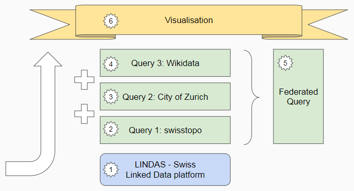

# DINAcon Workshop Linked Data Experience

## Table of contents

People presenting: 

| Part                               | Presenter          | Organisation                    | Topic         | 
| ---------------------------------- | ------------------ | ------------------------------- | ------------- | 
| <a href="#user-content-10"> 1 </a> | Jean-Luc Cochard   | Schweizerisches Bundesarchiv    | Das Angebot von LINDAS |
| <a href="#user-content-20"> 2 </a> | Pasquale Di Donato | Swisstopo                       | Linked Data für Geoinformation |
| <a href="#user-content-30"> 3 </a> | Michael Grüebler   | Statistik Stadt Zürich          | Linked Open Statistical Data |
| <a href="#user-content-40"> 4 </a> | Cristina Sarasua   | Universität Zürich              | Wikidata and crowd sourced data |
| <a href="#user-content-50"> 5 </a> | Michael Grüebler   | Statistik Stadt Zürich          | Federated Query |
| <a href="#user-content-60"> 6 </a> | Matthias Mazenauer | Statistisches Amt Kanton Zürich | Visualisation on linked data |



<a id="user-content-10" />

## Jean-Luc Cochard

[See Presentation](https://docs.google.com/presentation/d/e/2PACX-1vR4Qr_q8Hb2mjOdCEwoQHjQlLxg0yrv1G5kyzHEtA_5lvdf9ZdFSWRoR2Sn4aClYQeWqYhncQUU3vVX/pub?start=false&loop=false&delayms=3000)

<a id="user-content-20" />

## Pasquale Di Donato


### Get all versions of Canton Zürich

[code link](http://yasgui.org/short/8gt_gJva5)
```SPARQL
PREFIX schema: <http://schema.org/>
PREFIX gn: <http://www.geonames.org/ontology#>
PREFIX geo: <http://www.opengis.net/ont/geosparql#>
SELECT ?Canton ?Name ?DateIssued ?ValidUntil
WHERE {
  ?Canton <http://purl.org/dc/terms/isVersionOf> <https://ld.geo.admin.ch/boundaries/canton/1> .
  ?Canton <http://schema.org/name> ?Name .
  ?Canton <http://purl.org/dc/terms/issued> ?DateIssued .
  ?Canton <http://schema.org/validUntil> ?ValidUntil .
}
```

### Top five highest stops

[code link](http://yasgui.org/short/LOPF0RobU)
```SPARQL
PREFIX xsd:    <http://www.w3.org/2001/XMLSchema#>
SELECT ?Stop ?Elevation {
  ?Stop a <http://vocab.gtfs.org/terms#Stop>.
  ?Stop <http://dbpedia.org/ontology/elevation> ?Elevation.
  BIND(xsd:int(?Elevation) AS ?ElevationToInt)	
} 
ORDER BY DESC(?ElevationToInt)
LIMIT 5
```

### Point in polygon

[code link](http://yasgui.org/short/X69oJ698I)
```SPARQL
PREFIX rdf: <http://www.w3.org/1999/02/22-rdf-syntax-ns#>
PREFIX rdfs: <http://www.w3.org/2000/01/rdf-schema#>

SELECT * WHERE {
   ?stop rdf:type  <http://vocab.gtfs.org/terms#Stop> ;
   <http://www.w3.org/2003/01/geo/wgs84_pos#lat> ?lat ;
   <http://www.w3.org/2003/01/geo/wgs84_pos#long> ?long .
  BIND(STRDT(CONCAT('POINT(', ?long, ' ', ?lat, ')'), 'http://www.openlinksw.com/schemas/virtrdf#Geometry') AS ?Stopwkt).
  BIND ("POLYGON((8.4536 47.3597,8.4577 47.3604,8.4627 47.3678,8.4697 47.3641,8.4563 47.3569,8.4536 47.3597 ))"^^<http://www.openlinksw.com/schemas/virtrdf#Geometry> AS ?GeoWKT ).
    
  FILTER (bif:st_within(?Stopwkt, ?GeoWKT)) 
} 
```

### Municipality mutations in 2017

[code link](http://yasgui.org/short/vfzwEleGz)
```SPARQL
PREFIX rdf: <http://www.w3.org/1999/02/22-rdf-syntax-ns#>
PREFIX rdfs: <http://www.w3.org/2000/01/rdf-schema#>
PREFIX gont: <https://gont.ch/> 
PREFIX dct: <http://purl.org/dc/terms/>
PREFIX geo: <http://www.opengis.net/ont/geosparql#>
PREFIX skos: <http://www.w3.org/2004/02/skos/core#>
PREFIX gn: <http://www.geonames.org/ontology#>
#
# This query gets municipality change events from BFS "Historisiertes Gemeindeverzeichnis"
# It extracts and explains what happened if you click on one of the labels.
# Note that this query returns zero for years before or after that, due to the lack of
# shapes for older versions.
#
SELECT * WHERE {
  SERVICE <http://data.admin.ch/query> {
    ?event a gont:MunicipalityChangeEvent ;
      gont:date ?date ;
      gont:id ?eventid .
  
    ?munabo a gont:MunicipalityVersion ;
      gont:longName ?abolitionName ;
      gont:municipality ?munuri ;
      gont:abolitionMode ?abmode ;
      gont:abolitionEvent ?event .
      ?abmode skos:prefLabel ?abolitionmodeName .
  }
  FILTER ( ?date >= "2017-01-01"^^xsd:date && ?date <= "2017-12-31"^^xsd:date )
  ?shapeuri gn:featureCode gn:A.ADM3 ;
    dct:hasVersion ?version16 ;
    rdfs:seeAlso ?munuri .
  ?version16 geo:hasGeometry ?Geometry .
  ?Geometry geo:asWKT ?Coords  .
  BIND (CONCAT('Gemeinde: <b>', ?abolitionName, '</b><br>Event: ', ?abolitionmodeName) AS ?CoordsLabel)
}
```

### Municipality description from DBPedia

[code link](http://yasgui.org/short/XQl-FvKZo)
```SPARQL
PREFIX rdf: <http://www.w3.org/1999/02/22-rdf-syntax-ns#>
PREFIX rdfs: <http://www.w3.org/2000/01/rdf-schema#>
PREFIX wdt: <http://www.wikidata.org/prop/direct/>
PREFIX wikibase: <http://wikiba.se/ontology#>
PREFIX skos: <http://www.w3.org/2004/02/skos/core#>
PREFIX xsd: <http://www.w3.org/2001/XMLSchema#>
PREFIX wd: <http://www.wikidata.org/entity/>
PREFIX fn: <http://www.w3.org/2005/xpath-functions#>
PREFIX dbo: <http://dbpedia.org/ontology/>
PREFIX db: <http://dbpedia.org/>
PREFIX gn: <http://www.geonames.org/ontology#>

SELECT ?Municipality ?Name ?DBPediaAbstract WHERE {
    ?Municipality a <http://schema.org/AdministrativeArea> . #specify only the non-versioned entries.
    ?Municipality <http://schema.org/name> ?Name .	
    ?Municipality gn:featureCode gn:A.ADM3 . #municipality only
    ?Municipality <https://ld.geo.admin.ch/def/bfsNumber> ?bfsNumber . #connect to the ?bfsNumber found in wikidata.
  	{
    SELECT DISTINCT (xsd:integer(?bfs) AS ?bfsNumber) ?DBPedia ?DBPediaAbstract WHERE {
 		SERVICE <http://dbpedia.org/sparql>
		{
        ?DBPedia dbo:municipalityCode ?bfs . 
        OPTIONAL {?DBPedia dbo:abstract ?DBPediaAbstract . FILTER (lang(?DBPediaAbstract) = "de")}
    	}
  	}
  }
}
LIMIT 3
```

### All municipality boundaries in Canton

[code link](http://yasgui.org/short/wTA1NheD-)
```SPARQL
PREFIX schema: <http://schema.org/>
PREFIX gn: <http://www.geonames.org/ontology#>
PREFIX geo: <http://www.opengis.net/ont/geosparql#>
PREFIX dct: <http://purl.org/dc/terms/>
select ?Municipality ?Name ?WKT
where
{
?Municipality gn:featureCode gn:A.ADM3 .
?Municipality schema:name ?Name .
?Municipality dct:issued ?Date .
?Municipality gn:parentADM1 ?InCanton .
?InCanton schema:name ?CantonName .
?Municipality geo:hasGeometry ?Geometry .
?Geometry geo:asWKT ?WKT .
FILTER (?Date = "2018-01-01"^^xsd:date)
FILTER (?CantonName = "Zürich")  
}
```

### Boundary of the City of Zurich

[code link](http://yasgui.org/short/BJlKbwjcX)
```SPARQL
PREFIX rdf: <http://www.w3.org/1999/02/22-rdf-syntax-ns#>
PREFIX rdfs: <http://www.w3.org/2000/01/rdf-schema#>
SELECT * WHERE {
  <https://ld.geo.admin.ch/boundaries/municipality/261:2018> <http://www.opengis.net/ont/geosparql#hasGeometry> ?geometry .
   ?geometry <http://www.opengis.net/ont/geosparql#asWKT> ?wkt .  
}
```

### Public Transport Stops in Zürich with city boundary

[code link](http://yasgui.org/short/H1ixGvscX)
```SPARQL
PREFIX rdf: <http://www.w3.org/1999/02/22-rdf-syntax-ns#>
PREFIX rdfs: <http://www.w3.org/2000/01/rdf-schema#>

SELECT * WHERE {
  <https://ld.geo.admin.ch/boundaries/municipality/261:2018> <http://www.opengis.net/ont/geosparql#hasGeometry> ?geometry .
   ?geometry <http://www.opengis.net/ont/geosparql#asWKT> ?wkt .                                                      
  
  ?stop rdf:type  <http://vocab.gtfs.org/terms#Stop> ;
   <http://www.w3.org/2003/01/geo/wgs84_pos#lat> ?lat ;
   <http://www.w3.org/2003/01/geo/wgs84_pos#long> ?long ;
   <http://schema.org/containedInPlace> ?municipality.

  Filter (?municipality = <https://ld.geo.admin.ch/boundaries/municipality/261>)  
  BIND(CONCAT('POINT(' , STR(?long), ' ', STR(?lat) , ')')  as ?Coords ) .
} 
```

### Public Transport Stops in Zürich without city boundary

[code link](http://yasgui.org/short/r1ZGMvocX)
```SPARQL
PREFIX rdf: <http://www.w3.org/1999/02/22-rdf-syntax-ns#>
PREFIX rdfs: <http://www.w3.org/2000/01/rdf-schema#>

SELECT * WHERE {                                                      
  
  ?stop rdf:type  <http://vocab.gtfs.org/terms#Stop> ;
   <http://www.w3.org/2003/01/geo/wgs84_pos#lat> ?lat ;
   <http://www.w3.org/2003/01/geo/wgs84_pos#long> ?long ;
   <http://schema.org/containedInPlace> ?municipality.

  Filter (?municipality = <https://ld.geo.admin.ch/boundaries/municipality/261>)  
  BIND(CONCAT('POINT(' , STR(?long), ' ', STR(?lat) , ')')  as ?Coords ) .
} 
```


### Bonus Query: Statistics on Public Transport Stops in Zürich compared to Population by Quarter 

[code link](http://yasgui.org/short/LuboF-mMH)

```SPARQL
PREFIX rdf: <http://www.w3.org/1999/02/22-rdf-syntax-ns#>
PREFIX rdfs: <http://www.w3.org/2000/01/rdf-schema#>
PREFIX geo: <http://www.opengis.net/ont/geosparql#>
PREFIX skos: <http://www.w3.org/2004/02/skos/core#>
PREFIX owl: <http://www.w3.org/2002/07/owl#>
PREFIX qb: <http://purl.org/linked-data/cube#>
PREFIX dataset: <https://ld.stadt-zuerich.ch/statistics/dataset/>
PREFIX measure: <https://ld.stadt-zuerich.ch/statistics/measure/>
PREFIX dimension: <https://ld.stadt-zuerich.ch/statistics/property/>
PREFIX code: <https://ld.stadt-zuerich.ch/statistics/code/>

SELECT ?Quarter ?QuarterLabel (MIN(?Population) AS ?QPopulation) (COUNT(?stop) AS ?QStops) (MIN(?Population)/COUNT(?stop) AS ?PopulationPerStop) WHERE {
   ?stop rdf:type  <http://vocab.gtfs.org/terms#Stop> ;
   <http://www.w3.org/2003/01/geo/wgs84_pos#lat> ?lat ;
   <http://www.w3.org/2003/01/geo/wgs84_pos#long> ?long ;
   <http://schema.org/containedInPlace> <https://ld.geo.admin.ch/boundaries/municipality/261> .
  BIND(STRDT(CONCAT('POINT(', ?long, ' ', ?lat, ')'), 'http://www.openlinksw.com/schemas/virtrdf#Geometry') AS ?Stopwkt).
  
  SERVICE <https://ld.stadt-zuerich.ch/query> {
    SELECT ?Quarter ?GeoWKT ?QuarterLabel ?Population WHERE {
      ?sub a qb:Observation ;
        qb:dataSet dataset:BEW-RAUM-ZEIT ;
        measure:BEW ?Population ;
        dimension:RAUM ?Quarter ;
        dimension:ZEIT ?Date .
      ?Quarter owl:sameAs ?WikidataUID ;
        skos:broader code:Quartier ;
        rdfs:label ?QuarterLabel ;  
        geo:hasGeometry ?Geometry .
      ?Geometry geo:asWKT ?GeoWKT .
      FILTER(year(?Date) = 2017)
    }    
  }
  FILTER (bif:st_within(?Stopwkt, ?GeoWKT)) 

} GROUP BY ?Quarter ?QuarterLabel
ORDER BY ?PopulationPerStop

```

### Bonus Query: Points in Polygon: The stops in one quarter (Zürich Altstetten)

[code link](http://yasgui.org/short/r1e0elC97)
```SPARQL
PREFIX rdf: <http://www.w3.org/1999/02/22-rdf-syntax-ns#>
PREFIX rdfs: <http://www.w3.org/2000/01/rdf-schema#>
PREFIX geo: <http://www.opengis.net/ont/geosparql#>
PREFIX geof: <http://www.opengis.net/def/function/geosparql/>
#PREFIX geof: <http://www.opengis.net/def/geosparql/function/> 
PREFIX code: <https://ld.stadt-zuerich.ch/statistics/code/>

SELECT * WHERE {
   ?stop rdf:type  <http://vocab.gtfs.org/terms#Stop> ;
   <http://www.w3.org/2003/01/geo/wgs84_pos#lat> ?lat ;
   <http://www.w3.org/2003/01/geo/wgs84_pos#long> ?long .
  BIND(STRDT(CONCAT('POINT(', ?long, ' ', ?lat, ')'), 'http://www.openlinksw.com/schemas/virtrdf#Geometry') AS ?Stopwkt).
  
  SERVICE <https://ld.stadt-zuerich.ch/query> {
    SELECT * WHERE { 
      code:R00092 geo:hasGeometry ?GeoQuarter .
      ?GeoQuarter geo:asWKT ?GeoWKT
    } 
  }

  #?testDrin geo:sfWithin ?GeoQuarter .
  FILTER (bif:st_within(?Stopwkt, ?GeoWKT)) 
} 
limit 10
```

<a id="user-content-30" />

## Michael Grüebler

### Population of the City of Zurich 

Queries the population of the city, its districts and its quarters in 2017.

[code link](http://yasgui.org/short/SJ2e_SqqX)
```SPARQL
PREFIX rdfs: <http://www.w3.org/2000/01/rdf-schema#>
PREFIX qb: <http://purl.org/linked-data/cube#>
PREFIX dataset: <https://ld.stadt-zuerich.ch/statistics/dataset/>
PREFIX measure: <https://ld.stadt-zuerich.ch/statistics/measure/>
PREFIX dimension: <https://ld.stadt-zuerich.ch/statistics/property/>
PREFIX code: <https://ld.stadt-zuerich.ch/statistics/code/>
SELECT ?RaumLabel ?Population WHERE {
  ?sub a qb:Observation ;
       qb:dataSet dataset:BEW-RAUM-ZEIT ;
       measure:BEW ?Population ;
       dimension:RAUM ?Raum ;
       dimension:ZEIT ?Date .
  ?Raum rdfs:label ?RaumLabel
  FILTER(year(?Date) = 2017)
} ORDER BY DESC(?Population)
```

### Population of quarters ready to link 

Queries the population of all the quarters of the city of Zurich in 2017.
For linking purposes the geometry and wikidata-identifiers are selected.  

[code link](http://yasgui.org/short/ng3tRukV7)
```SPARQL
PREFIX rdf: <http://www.w3.org/1999/02/22-rdf-syntax-ns#>
PREFIX rdfs: <http://www.w3.org/2000/01/rdf-schema#>
PREFIX qb: <http://purl.org/linked-data/cube#>
PREFIX owl: <http://www.w3.org/2002/07/owl#>
PREFIX skos: <http://www.w3.org/2004/02/skos/core#>
PREFIX geo: <http://www.opengis.net/ont/geosparql#>
PREFIX dataset: <https://ld.stadt-zuerich.ch/statistics/dataset/>
PREFIX measure: <https://ld.stadt-zuerich.ch/statistics/measure/>
PREFIX dimension: <https://ld.stadt-zuerich.ch/statistics/property/>
PREFIX code: <https://ld.stadt-zuerich.ch/statistics/code/>
SELECT ?Quarter ?WKT ?WikidataUID ?QuarterLabel ?Population WHERE {
  ?sub a qb:Observation ;
       qb:dataSet dataset:BEW-RAUM-ZEIT ;
       measure:BEW ?Population ;
       dimension:RAUM ?Quarter ;
       dimension:ZEIT ?Date .
  ?Quarter owl:sameAs ?WikidataUID ;
        skos:broader code:Quartier ;
        rdfs:label ?QuarterLabel .  
  ?Quarter geo:hasGeometry ?Geometry .
  ?Geometry geo:asWKT ?WKT .
  FILTER(year(?Date) = 2017)
} ORDER BY DESC(?Population)
```


<a id="user-content-40" />

## Cristina Sarasua  


### Fountains of Wasserversorgung Zürich on Wikidata

[code link] (http://tinyurl.com/y76e9awd)

```SPARQL
#Fountains in Zürich
#defaultView:Map
SELECT ?item ?Bild ?geographische_Koordinaten WHERE {
  ?item p:P528 ?statement.
  ?statement pq:P972 wd:Q53629101.
  ?item wdt:P18 ?Bild.
  ?item wdt:P625 ?geographische_Koordinaten. 
}
```

### Fountains, Rivers, Bridges and Swimmingpools in Zurich on Wikidata

[code link] (http://tinyurl.com/y954qvgx)

```SPARQL
#Fountains in Zürich
#defaultView:Map
SELECT ?item  ?Bild ?coord ?coordColor WHERE {
    
  {?item p:P528 ?statement.
        ?statement pq:P972 wd:Q53629101.   ?item wdt:P625 ?coord .
       
} UNION
  {    
    {?item wdt:P31/wdt:P279* wd:Q4022} UNION {?item wdt:P31/wdt:P279* wd:Q12280} UNION {?item wdt:P31/wdt:P279* wd:Q1501}
        ?item wdt:P131 wd:Q72
    }
        
      OPTIONAL {?item wdt:P18 ?Bild.}
      OPTIONAL{   ?article schema:about ?item .
    ?article schema:isPartOf <https://en.wikipedia.org/>.
     ?articlev schema:about ?item .
    ?articlev schema:isPartOf <https://en.wikivoyage.org/>.}
  ?item wdt:P625 ?coord. 
      BIND("#00FF00" AS ?coordColor) .
         
} 
```


### Bonus Query: Number of rivers per canton in Wikidata 

[code link](https://tinyurl.com/ybyxjxsx)

```SPARQL
SELECT  ?canton ?cantonLabel (COUNT(?river) AS ?count) #?loc ?distance #?thing ?thingLabel 

WHERE {
      
  ?river wdt:P31/wdt:P279* wd:Q4022 .
  ?river wdt:P131 ?canton .
  ?canton wdt:P31 wd:Q23058 .
     
  SERVICE wikibase:label { bd:serviceParam wikibase:language "[AUTO_LANGUAGE],en". }
} GROUP BY ?canton ?cantonLabel
```


<a id="user-content-50" />

## Federated Queries (Michael Grüebler)

### Federated Query of Stops (swisstopo) by Quarter (Statistik Stadt Zürich)

[code link](http://yasgui.org/short/VEPe3CjYc)

```SPARQL
PREFIX rdf: <http://www.w3.org/1999/02/22-rdf-syntax-ns#>
PREFIX rdfs: <http://www.w3.org/2000/01/rdf-schema#>
PREFIX geo: <http://www.opengis.net/ont/geosparql#>
PREFIX skos: <http://www.w3.org/2004/02/skos/core#>

SELECT ?Quarter (COUNT(?stop) AS ?count) WHERE {
   ?stop rdf:type  <http://vocab.gtfs.org/terms#Stop> ;
   <http://www.w3.org/2003/01/geo/wgs84_pos#lat> ?lat ;
   <http://www.w3.org/2003/01/geo/wgs84_pos#long> ?long ;
   <http://schema.org/containedInPlace> <https://ld.geo.admin.ch/boundaries/municipality/261> .
  BIND(STRDT(CONCAT('POINT(', ?long, ' ', ?lat, ')'), 'http://www.openlinksw.com/schemas/virtrdf#Geometry') AS ?Stopwkt).
  
  SERVICE <https://ld.stadt-zuerich.ch/query> {
    SELECT ?Quarter ?GeoWKT WHERE { 
      ?Quarter a <http://schema.org/Place>;
      geo:hasGeometry ?GeoQuarter ;
      skos:broader <https://ld.stadt-zuerich.ch/statistics/code/Quartier> .
      ?GeoQuarter geo:asWKT ?GeoWKT
    } 
  }
  FILTER (bif:st_within(?Stopwkt, ?GeoWKT)) 

} GROUP BY ?Quarter
```

### Federated Query of Boat-Stops (swisstopo) and Bridges (wikidata)
[code link](http://yasgui.org/short/AaS9uB_wV)

```SPARQL
PREFIX rdf: <http://www.w3.org/1999/02/22-rdf-syntax-ns#>
PREFIX geo: <http://www.opengis.net/ont/geosparql#>
PREFIX wdt: <http://www.wikidata.org/prop/direct/>
PREFIX pq: <http://www.wikidata.org/prop/qualifier/>
PREFIX p: <http://www.wikidata.org/prop/>
PREFIX wd: <http://www.wikidata.org/entity/>

SELECT ?type ?item ?coord WHERE {
  {
    SELECT DISTINCT ("boat-stop" AS ?type) ?item ?coord  WHERE {
      ?item rdf:type  <http://vocab.gtfs.org/terms#Stop> ;
        <http://www.w3.org/2003/01/geo/wgs84_pos#lat> ?lat ;
        <http://www.w3.org/2003/01/geo/wgs84_pos#long> ?long ;
        <http://schema.org/containedInPlace> <https://ld.geo.admin.ch/boundaries/municipality/261> ;
        <https://ld.geo.admin.ch/def/transportation/meansOfTransportation> <https://ld.geo.admin.ch/codelist/MeansOfTransportation/8> .
      BIND(STRDT(CONCAT('POINT(', ?long, ' ', ?lat, ')'), 'http://www.openlinksw.com/schemas/virtrdf#Geometry') AS ?coord).
    }
  }
  UNION
  {
    SERVICE <https://query.wikidata.org/bigdata/namespace/wdq/sparql> {
      SELECT DISTINCT ("bridge" AS ?type) ?item ?coord  WHERE {
        ?item wdt:P31/wdt:P279* wd:Q12280 .
        ?item wdt:P131 wd:Q72 . 
        ?item wdt:P625 ?coord . 
      } 
    }
  }     
} 
```

### Federated Query of Boat-Stops (swisstopo), Bridges (wikidata) in the Quarter Rathaus (Statistik Stadt Zürich)
[code link](http://yasgui.org/short/RyUW-8w1m)

```SPARQL
PREFIX rdf: <http://www.w3.org/1999/02/22-rdf-syntax-ns#>
PREFIX geo: <http://www.opengis.net/ont/geosparql#>
PREFIX code: <https://ld.stadt-zuerich.ch/statistics/code/>
PREFIX wdt: <http://www.wikidata.org/prop/direct/>
PREFIX pq: <http://www.wikidata.org/prop/qualifier/>
PREFIX p: <http://www.wikidata.org/prop/>
PREFIX wd: <http://www.wikidata.org/entity/>

SELECT ?type ?item ?image ?coord WHERE {
  SERVICE <https://ld.stadt-zuerich.ch/query> {
    SELECT ?GeoWKT WHERE { 
      code:R00011 geo:hasGeometry ?GeoQuarter . 
      ?GeoQuarter geo:asWKT ?GeoWKT
    } 
  }
  {
    SELECT DISTINCT ("boat-stop" AS ?type) ?item ?coord  WHERE {
      ?item rdf:type  <http://vocab.gtfs.org/terms#Stop> ;
        <http://www.w3.org/2003/01/geo/wgs84_pos#lat> ?lat ;
        <http://www.w3.org/2003/01/geo/wgs84_pos#long> ?long ;
        <http://schema.org/containedInPlace> <https://ld.geo.admin.ch/boundaries/municipality/261> ;
        <https://ld.geo.admin.ch/def/transportation/meansOfTransportation> <https://ld.geo.admin.ch/codelist/MeansOfTransportation/8> .
      BIND(STRDT(CONCAT('POINT(', ?long, ' ', ?lat, ')'), 'http://www.openlinksw.com/schemas/virtrdf#Geometry') AS ?coord).
    } 
  }
  UNION
  {
    SERVICE <https://query.wikidata.org/bigdata/namespace/wdq/sparql> {
      SELECT DISTINCT ("bridge" AS ?type) ?item ?coord ?image  WHERE {
        ?item wdt:P31/wdt:P279* wd:Q12280 .
        ?item wdt:P131 wd:Q72 .
        ?item wdt:P625 ?coord . 
        OPTIONAL {?item wdt:P18 ?image.}
      } 
    }
  }    
 
  FILTER (bif:st_within(?coord, ?GeoWKT))
} 
```


<a id="user-content-60" />

## Matthias Mazenauer

### Linked Data Visualization with D3js

[A thriving Data Ecosystem](https://beta.observablehq.com/@mmznrstat/a-thriving-data-ecosystem)

[Linked Data Journey through Switzerland](https://beta.observablehq.com/@mmznrstat/dinacon2019)
